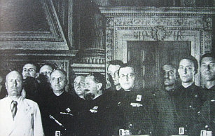

[🠔 Zur Übersicht: Planung & Kosten](9pbs.md)  
# Planungskosten, Planungshonorar und HOAI im Altbau 1
**Erläuterungen zum angemessenen Planungsaufwand und -honorar im Altbau. Aktualitäten**  
_von Konrad Fischer_

Dipl.-Ing. Konrad Fischer 

## Planungskosten im Altbau 1

(denn mit nichts kann man beim Bauen mehr Geld verlieren, als durch falsche Planung) 

> [!abstract]+ Kapitelübersicht: Architekten Honorar 1  
> 1. **Planungskosten, Planungshonorar und HOAI im Altbau 1**
> 2. [Planungskosten im Altbau 2](10hoai02.md)
> 3. [Planungskosten im Altbau 3: Hungerleider, Architekten und HOAI-Mindestsatzunterschreitung](10hoai03.md)
> 4. [Planungskosten im Altbau 4](10hoai04.md)
> 5. [Architekt+Ingenieur-Planungs-Tricks im Altbau: HOAI-Planungshonorar+Planungskosten 5](10hoai05.md)
> 6. [Planungskosten im Altbau 6 (denn mit nichts kann man beim Bauen mehr Geld verlieren, als durch falsche Planung)](10hoai06.md)

**_Es gibt kaum etwas auf der Welt, 
das nicht irgend jemand ein wenig schlechter machen 
und etwas billiger verkaufen könnte, 
und die Menschen, 
die sich nur am Preis orientieren, 
werden die gerechte Beute solcher Machenschaften._ 
John Ruskin 

_Kein Geld ist vorteilhafter angewandt als das, 
um welches wir uns haben prellen lassen, 
denn wir haben dafür unmittelbar Klugheit eingehandelt._ 
Arthur Schopenhauer

_"Wer eine deutsche Universität besucht, 
den kann das Grausen packen. 
Die Betonbauten aus den Zeiten der großen Bildungsexpansion verrotten, 
es regnet durch die Dächer, 
und Abfall säumt die Wege - 
ein Bild äußerer Vernachlässigung, 
das den inneren Zustand widerspiegelt. ... 
Erst wenn die Deutschen den Wert der Bildung erkennen, 
werden die deutschen Universitäten wieder die führende Rolle spielen, 
die sie einmal, zu Zeiten Humboldts, hatten."_ 
Jeanne Rubner in: "Uni-Adel und Proletariat", Süddt. Zeitung 26.1.02, S. 4 

_"Da werden Flure von Architekten als "Lehrstraßen" bezeichnet, 
die aus Lehrer-und Schülersicht als "kalt", "monoton" oder "abweisend" erscheinen. 
Eine Zeitung berichtete kürzlich: 
"An ein Gefängnis oder einen Bunker fühlten sich entsetzte Eltern und Kinder erinnert, 
als sie die Realschule zum ersten Mal von innen sahen." 
Die Sichtbetonwände, 
auch von Pädagogen als "Knastoptik" empfunden, 
rechtfertigte die Architektin jedoch mit dem Hinweis auf eine "interessante Patina", 
wenn der Beton alt werde. 
Auch hätten ja berühmte Architekten 
wie Le Corbusier 
mit diesem strapazierfähigen Baustoff gearbeitet. 
Ein preisgekrönter, 
doch an eine Kaserne erinnernder 
Schulbauentwurf der Stadt Berlin 
wurde von befragten Schülern als Fabrikansicht 
oder eine "Ausbildungsstätte für Klontruppen" bezeichnet. 
Ein voluminöses Dach, 
das auf befragte Jugendliche wie eine schwer lastende Landschaft übereinandergeschobener Eisblöcke 
und so erdrückend im Hinblick auf den Unterbau wirkt, 
wird vom Architekten als 
"Verbindung von behütender Geste über dem Schulleben und der umgebenden Berglandschaft" deklariert. 
Reihen von Giebelbauten, 
die Lehrern monoton erscheinen, 
gelten dem Architekturbüro als 
"Ensemble voller räumlicher Überraschungen". 
Eine schwarz gestaltete Pausenhalle, 
die auf Schüler düster und abweisend wirkt, 
ist aus der Sicht des Farbgestalters kinderfeundlich, denn 
"Schwarz ist die geeignete Hintergrndfarbe für das bunte Spiel der Kinder" ... 
Eine Schule, die für die Bedürfnisse von Schülern entworfen ist, 
wirkt im günstigen Fall wie eine anregungsreiche und deshalb interessante, 
freilassende und schließlich auch dialogbereite, 
warmherzige Person."_ 
Christian Rittelmeyer: Baukünstler und Bildungslücken, in: DABkompakt 1/10, Beilage zum Deutschen Architektenblatt DAB 1, 2010

_Benito Mussolini (angeglatzter Krawattenfatzke mit nur ausnahmsweise mal heller Joppe, im Foto links außen), der für seine Brutalistenarchitektur halb Rom abreißende römisch-italienische Duce (=Führer) und Kumpel von Adolf Hitler, im Kreise seiner menschenverachtend-utopistischen[Rationialismus-Kisterlbau](http://www.marginalia.it/mediawiki/index.php/Nosè_Francesca)-Fascho-Lieblingsarchitekten, der nach der faschistisch verseuchten Stadt Como benannten "Comascen-Gruppe". 

Ultimatives Mode-Philsophie-Ideologie-Vorbild auch für alle nachfolgenden ultramodernen Schwarzhemd-Beton-/Zigarren-Kisterlarchitekterln bis heute und morgen? Urteilen Sie bitterscheen selbst!_ 
(Bildausschnitt aus dem faschistischen Propagandablatt "Architettura" 11/1935, Aufnahmeort: Rom)

**

Hier und auf den folgenden Webseiten finden Sie ausgiebige, kritische und provokative Erläuterungen zum Planen und vor allem zum Vertragsrecht rund um die strategisch richtige und falsche Anwendung der Honorarordnung für Architekten und Ingenieure (HOAI) im Altbau, beim Renovieren, Restaurieren, Sanieren, Modernisieren und Umbauen, bei Denkmalpflege und Denkmalschutz. Na ja, a bißla freilich auch beim Neubau. 

Und hier den aktuellen HOAI-Text: [HOAI](http://www.hoai.de/) und kostenfrei nutzbare Honorarberechnungsprogramme zum Herunterladen und Herumspielen. Ironie, Sarkasmus, Polemik und Spott erhalten Sie hier übrigens auch gratis ;-) 

Wenn Sie das als künftiger Bauherr kalt läßt, weil sie uns Architekten lieber [nicht vertrauen](umfrage1.md) oder unsere Leistungen grundsätzlich lieber "kostenlos" genießen, gibt es dafür Alternativen. Sei es eine Fertig-Wohnimmobilie über einen Immobilienmakler oder gleich vom Hersteller, ein Schlüsselfertighaus vom Bauträger, oder nach irgendeinem anderen "architektenbefreiten" Konzept. Das wird Sie dann wahrscheinlich hunderttausendmal glücklicher machen, egal von welchem Qualitätsanbieter. Nicht wahr? 

Wobei eines unbedingt klar sein muß: Sollten hier seitens der Leserschaft irgendwelche pauschalen Vorwürfe gegen irgendjemand, insbesondere den werten freien Architektenstand, dem der Autor dieser Zeilen ja selbst angehört, oder unsere sehr geschätzten Bau- und Förderbehörden wie z.B. die Oberste Baubehörde des Bayer. Staatsministerium des Inneren, deren HOAI-widrige Förderpauschalen für genügend Verwirrung unter den Kollegen sorgen, die an das Gute im Menschen glauben, mit oft angestellten bzw. verbeamteten (das ist lecker Behördendeutsch und hat mit dem englischen Beamen vom und zum Raumschiff Änderpreis auch rein garnix zu tun!) Architekten herausgelesen werden, wäre das ein dolles Mißverständnis. Daß ein Staatsvertreter wie Ministerialrat (wegen seiner bstimmt unübertreffbaren Verdienste 2010 sogar zum Bundesbau-Ministerialdirektor aufgestiegen) Dipl.-Ing. Architekt Günter Hoffmann in der Obersten Baubehörde sich als Vizepräsident der BYAK Tag und Nacht verzehrt hat, um die Belange der hilf- und wehrlosen Architektenschaft gegenüber dem staatlichen Raubritter- und Erpressertum, wie es z.B. bei der Festlegung vollkommen unauskömmlicher Förderpauschalen für Baunebenkosten (ca. 10%!) z.B. im Bereich der Städtebauförderung deutlich wird, feste zu vertreten und bedrängten Kollegen mutigst aus der Patsche zu helfen, dürfte doch selbstverständlich sein, auch wenn hierfür auf dieser Seite keine Belege zu finden sein werden. 

Natürlich geht es hier nur um Kritik (mit den unter Rhetorikern gebräuchlichen und von der grundgesetzlich erlaubten Meinungsfreiheit gedeckten Stilmitteln Witz und Ironie) an nicht zu verallgemeinernden Mißständen, die es eben hier und da vielleicht trotz aller gegenteiligen Beschwörungsformeln dennoch geben mag. Ansonsten ist doch bestimmt alles in Ordnung im Staate Dänemark.

Zu schnellen Übersicht über angemessene Planungsleistungen und -kosten sowie die Folgen unauskömmlicher Honorare nutzen Sie [diesen Link](10hoai26.md#beispielrechnung). Er wird Ihnen schnell die Augen öffnen. Versprochen!

## Zur Vergangenheit, Gegenwart und Zukunft der HOAI

Eine neue HOAI-Epoche sollte heranbrechen - das Bundeswirtschaftsministerium unter einem Müller Glos als Kopf hat zugeschlagen und im Februar 2008 einen Novellierungsvorschlag ausgearbeitet. Die kritisierende Stellungnahme unserer BAK las sich in vielen Bereichen als gelungener Witz: 

Da wird beispielsweise in entrüsteter Blähung bemängelt, daß der faktisch unmögliche! (was doch inzwischen jeder weiß) "Klimaschutz" (sehen wir mal vom Bauwerk als dem seit altersher einzig wirklich bewährten Klimaschutz ab, wobei neue Bauten mit splittrig aufheizender Glasfassade, [tropfig absaufendem Flachdach](212bau7.md) und [schimmelalgig-rottigem Dämmfilz](213baust.md) auch in punkto Klimaschutz eher die Energiemonopolisten (Glasfassade) und ansonsten die Schimmelpilz- und die Hausschwammkulturen als den Bauwerksnutzer begünstigen) nicht ausreichend integriert wurde. Selbst ein Altbundeskanzler wie Helmut Schmidt hat es inzwischen vor der Max-Planck-Gesellschaft herausgelassen, daß im Klimaschutz Wissenschaftsbetrug am Werke ist. Kann man sich als Architektenschaft mit irgendwas noch mehr unglaubwürdig machen? Ich weiß es net. 

[ 
© Götz-Wiedenroth-Karikatur: Klima-Kamikaze (durch Energiepass-Weltklasse): 
"Ich habe mich zur CO2-Einsparung für Maximaldämmung entschieden - Für die Schimmelpilze in dieser Wohnung hat sich das Klima schon total verbessert!"](http://gwiedenroth.googlepages.com/)

Und noch besser: 

Das Streichen der Zuschläge für Leistungen bei (Umbau, Modernisierungen und) Instandsetzungen "bedeutet Honorareinbußen in der Höhe von bis zu ... 50 % bei Instandhaltungen." Oh, oh! Wie sollte das allein rechnerisch möglich sein, da es gem. HOAI § 27 (1996) doch lediglich eine Erhöhung von max 50% auf ausschließlich die "Objektüberwachung" gab, und letztere nur mit 33% der Leistungsphasen-Prozenten beim Gesamthonorar anfiel? Wobei sich Umbauzuschlag und Instandsetzungszuschlag auschließen. Ja, die Grundrechenarten und die Architekten und der [Altbau](altbau.md)! Das bestätigt schlimmste Vorurteile und begünstigt sicher das weitere Verlachen solcher Einwände. Oder meint die BAK da nur den Objektüberwachungssolisten "Bauleiter" - der nur von dieser Leistungsphase lebt? 

Gerügt werden auch allerlei handwerkliche Fehler im BMWi. 

Und was ist mit denen der BAK? Hat sie vielleicht schon wieder versäumt, das federführende Referat ausreichend mit "externen" - von der in Geld schwimmenden Architektenschaft ausgehaltenen - "Mitarbeitern" zu bestücken und dem Glos ausreichend Wahlkampfhilfe zuzustecken und den Referenten zu zigtausendeschwer dotierten Vorträglein, Thema "Die goldene Zukunft der HOAI", einzuladen, wie es alle anderen maßgeblichen Wirtschaftskräfte seit eh und je zum ureigensten Wohl machen, um sehr genehme Gesetze und fetteste Subventionsregelungen wie zum Beispiel beim [EEG](7eeg.md) sicherheitshalber am besten selbst zu stricken - man kennt doch seine Pappenheimer? Und was Beamte und Politiker so verzapfen, wennd der Tag lang genug ist und der Frühstückskaffe gesoffen, spricht doch sehr für "externe" Hilfe für wo am nötigsten, oddä? 

Werden vielleicht gar Spötter recht behalten, die annehmen, erst kippt die HOAI, dann das Kammersystem? Wobei die Architektenkammern nicht mal gemerkt haben, daß die bis zu 80prozentige Zuschlagslösung anstelle des gestrichenen Honorierungsparagrafen 10 3a für die mitverarbeitete Bausubstanz gar kein Ersatz sein kann, soweit es die davon maßgeblich betroffenen Bereiche Instandhaltung und Instandsetzung betrifft, für die dieser schöne Zuschlag von vornherein nicht gilt. Das zeigt sehr exemplarisch, wie es um die tatsächliche Vertretungskompetenz der Kammern für ihre Zwangsmitglieder steht. Nach der neuen Novelle, die mit der Motorsäge die unfaßbar blumigen Auswüches der HOAI-Regelungen durchforstet haben, bis kein Gras mehr wächst, wäre die Honorierung meines Erachtens so gut wie vollkommen in das Belieben der Vertragspartner - Bauherr und Planer - und nachfolgend der Gerichte gestellt. Das heißt im Klartext: 

Honorarmaximierung für starke Planer mit hohem Spezialisierungsgrad, überbordender Marktnachfrage und excellenter Rechtsberatung von Anfang an - bzw. noch mehr den Bauherrn ausgrasenden Planungsluxus zur Extremsteigerung der "anrechenbaren Baukosten" oder gleich Planerkorruption durch Zweckbündnisse mit Unternehmen und Lieferanten seitens der schwächeren Planer. Anders können letztere ja kaum überleben. Wie schreibt der Referent für Wirtschaft und Gesellschaft der Bundesarchitektenkammer, Dr. Thomas Welter, im Deutschen Architektenblatt 01/09 in "Zu viel auf einmal" so treffend (S. 42): 

_"Wenn ... die vielen durchgearbeiteten Wochenenden, die langen Abende im Büro und der Verzicht auf Urlaub mit eingerechnet werden, erzielen viele freischaffende Architekten noch nicht einmal das Stundengehalt eines Bauzeichners. ... Rund die Hälfte aller Inhaber von Architektur- und Stadtplanungsbüros erwirtschaften Überschüsse pro Kopf, die niedriger liegen als das Bruttoeinkommen eines Hausmeisters im öffentlichen Dienst."_ 

Hallo, lieber Bauherr, weißte das überhaupt? Liegt das aber an der HOAI, die bei sachgerechter Anwendung nicht genug Honorar abwirft? Oder aber an deren Unterlaufen durch die um Aufträge konkurrierenden Planer, professionell, gnadenlos und ohne die geringste Rücksicht auf die eigenen Verluste (!) aufeinandergehetzt durch fast alle öffentlichen, kirchlichen, gewerblichen und sonstigen privaten Auftraggeber? Und nahezu schutzlos dem widerlichen Honorargezwicke ausgeliefert, da die staatlichen Kammervertreter geflissentlich der Omerta huldigen und die freien ausreichende Honorarkompetenz für alle betroffenen Leistungsbereiche vermissen lassen. 

Konrad Fischer: Fassaden energetisch richtig und kostensparend sanieren 1 

[Teil 2](http://www.youtube.com/watch?v=Y1NSxAW15Cc) [Teil 3](http://www.youtube.com/watch?v=RAT7VzBo8k0) [Teil 4](http://www.youtube.com/watch?v=6TBII25iVQk) [Teil 5](http://www.youtube.com/watch?v=Kb0C4KiZvVA) 

Die korrumpierenden Unternehmen der Baubranche wissen das schon seit jeher zu nutzen und werden sich deshalb weiter mit "Baustoffberatern", "Sanierberatern" und dergleichen "Kostenlos-Lieferanten" von Planungsleistungen an die unterhonorierten Planer aufspecken. Genau an der entscheidenden Schnittstelle zwischen flotter Planungsidee unserer entwurfslastigen Ausbildung und dem Umsetzen ins handwerklich machbare und oberflächlichen Gestaltern vielleicht nicht immer ausreichend bekannte baustoffliche Detail setzt die Bauwirtschaft an. Das zugrundeliegende Geschäftsmodell für die Beeinflussung udn Steuerung all der Bau-Scharlatane in Planungsbüros, Handwerksstuben und Bauunternehmervillen heißt: "Pharmareferent". Der bringt auch noch dir größten Scheußlichkeiten an den Mann, selbst wenn der dabei verreckt. Hier kommt es zur Entscheidung, wer sein Produkt auf die Baustelle bringt, wer das G'schäftle letztlich macht, wer den Endkunden am meisten mit Chemieprodukten vollstopfen darf. Hier heißt es präsent sein, durchaus auch mit Präsenten, wenn das Ergebnis stimmt. Da gibt es also weiter Jobs ohne Ende für auf der Strecke gebliebene Jung- und Altarchitekten, die entweder den Jury- bzw. Publikumsgeschmack nicht ausreichend trafen oder vielleicht die Bauindustrie bzw. das Bauhandwerk nicht ausreichend in einem mehr oder weniger seltenen System auf Gegenseitigkeit versorgten und deswegen den Bach runter gehen mußten. 

Insofern könnte man sich durchaus die Dankbarkeit der vom Verhungern bedrohten Planer für "DIN-gerechte Produktlösungen" aus der planernährenden und -streichelnden Hand der Baustoffproduzenten vorstellen, die sich in detailliertesten Planzeichnungen und objektgerechtesten Leistungsbeschreibungen für die notleidend-unterhonorierten Planerbüros manifestieren. Natürlicherweise aber auch für alle anderen, wenn gewünscht - und da scheint es gar nicht mal so wenige - auch renommierteste Büros und sogar staatliche und kommunale Bauämter gehören dazu - zu geben, wenn ich nach deren produktmanipulierten Leistungsbeschreibungen ausgehe, die mir von hier aufmerksam mitlesenden Handwerksbietern zugesendet werden, alle erkennbar am zu 99,99 Prozent von der VOB und allen Haushaltsrichtlinien und Fördervorschriften verbotenen Textbaustein "Produkt XY oder gleichwertig". 

Vgl. hierzu folgenden Auszug aus dem am 27.11.2009 beschlossenen _"Berufsbild der Architektinnen und Architekten ... Architekten ... bringen auf Grund besonderer beruflicher Qualifikation persönlich,eigenverantwortlich und fachlich unabhängig geistig-ideelle Leistungen im gemeinsamen Interesse ihrer Auftraggeber und der Allgemeinheit. Ihre Berufsausübung unterliegt in der Regel spezifischen berufsrechtlichen Bindungen nach Maßgabe der staatlichen Gesetzgebung oder des von der ... Berufsvertretung autonom gesetzten Rechts, welches die Professionalität, Qualität und das zum Auftraggeber bestehende Vertrauensverhältnis gewährleistet. ... Die Trennung von Planung und Überwachung der Bauleistungen von deren Ausführung ermöglicht Architekten in wirtschaftlicher und geistiger Hinsicht unabhängig von Dritten zu arbeiten. Deshalb können sie die Interessen des Bauherren optimal wahren."_ 

Es können also keineswegs ArchitektInnnen sein, die sich von der Bauindustrie und dem Handwerk mit Planungsleistungen und mehr beschenken lassen, oder? Wie schön, daß korrupte Planer -keinesfalls ArchitektInnen! - diese Umsonstleistungen außerhalb jeglicher HOAI dem Bauherren planerseits sogar offensichtlich unbehindert in Rechnung stellen dürfen - zusätzlich zu den Hintenrum-Präsenten der geschenkten Planung, der schwarzen Tütchen und zusätzlich zu den mit "DIN" und anderem Luxuspfusch verbundenen erhöhten Honorarerträgen. Zusätzlich auch zu all den ersparten Bemühungen um Kostendämpfung in der Planungsphase und der Bauphase, auch bei der Rechnungsprüfung und bei der Qualitätssicherung und Mängelbeseitigung. Die damit logischerweise verbunden oft irre Mehrkosten für das Bauvorhaben bekommt der wehrlose, aber so schlau "Planungsschnäppchen" erhaschende Bauherr aufgedrückt. Gegen solche wohlfeilen Planer hat ein HOAI-treuer Architekt selbstverständlich von vornherein verloren. 

Hieß es also früher verrottungssicher Sichtbeton und zersplitterungssicher Glas-Stahl-Fassade, um die Baukosten, die Betriebskosten/Folgekosten und die Instandhaltungskosten maximal nach oben zu drücken, kommt heute noch die kostenreibende Ökotechnik - unwirtschaftlichste Haustechnik und nutzloseste Energiesparmethoden dazu. Der schnäppchengeile moderne und heutzutage sogar umweltbewußte öffentliche und private Bauherr schnappt ja immer weiter nach solchen Lockvogelangeboten, die den Profiteuren heiße Hände vom heftigen Reiben derselben beschert. Das folgende Ach-und-Weh-Geschrei, weil man aus lauter Altruismus wieder mal nix verdient hat, nennt man dann Reibach ;-) 

Welche Rolle mag da wohl folgendes - in neunmalklug bauherrenbeeindrückendste Fremdwörterei verpackte - dröhnig Gesumse im schon oben zitierten "Berufsbild" spielen?: 

_"Wesentliche Parameter bei der Planung ... müssen in Zukunft immer mehr ökologische Aspekte wie Energieeffizienz ... sein. Die Nachhaltigkeit von Gebäuden wird erreicht durch eine verringerte Gesamtenergiebilanz, den Einsatz erneuerbarer Energien und eine Materialwahl, die ökologisch vertretbare Stoffkreisläufe berücksichtigen."_ 

Ob derlei ökologsch Correctness mittels beispielsweise Dämmwollfilzplatte aus handgezupftem Mausschnurrbarthaar, asozialem Solardachschnulli, pollengefilterter Hust-Luft-Wärmerückgewinnung sowie energieeffizientester Furz-Luft-Wärmepumperei nun in brutalsten Gegensatz zum Wirtschaftlichkeitsgebot des Energieeinsparungsgesetzes EnEG tritt, zu dem es im § 5 unmißverständlich heißt, daß Energiesparmaßnahmen wirtschaftlich vertretbar sein **müssen**? Energiesparerei ohne zweifelsfreien Nachweis der Maßnahmenrentierlichkeit in einer Wirtschaftlichkeitsberechnung - nach gefestigter Rechtssprechung mit Bezugszeitraum von max. 10 Jahren (auch entsprechend § 11 staatl. HeizkostenV), bis die ökologisch ach so wünschenswerten Energie-Ersparnisse die banküblich verzinsten Investitionen wieder hereingeholt haben!!! - auf Kosten des Auftraggebers, zu Lasten der Wirtschaftlichkeit, zu Gunsten der honorarfähigen sog. anrechenbaren Baukosten? Für Architekten (und andere Planer auch) gesetzlich verboten. Halten sich zumindest alle ArchitektInnen dran? Ich nehme es mal zugunsten meiner ehrlichen und notfalls kammerregulierten Zunft an. Und Sie? 

Logisch, daß das BMWi mit seiner HOAI-Novelle genau das Überschäumen der Konjunktur durch überteuertes Bauen im Gefolge der Planerkorruption beabsichtigt hat - die sind ja nicht blöd und lieben genau diese Form des umsatzsteigernden Wirtschaftens am allermeisten, oder? Und führen in der Begründung zur Novelle pfiffig an, daß die Untersuchungen ergeben haben, daß eh kaum noch ein Architekt wenigstens Mindestsätze einstreicht, sondern sich in keinster Weise um die Berufsordnung schert und deswegen quasi fast alle mit Dumpingangeboten (und eben "alternativ versorgenden" Honorierungswegen, s.o.) ihr Auskommen absichern. Das steht nun zwar so im Wortlaut nicht genau so drin, ist aber dem kundigen Leser des Subtextes sofort klar. 

Ja, so ist eben die Welt, die schon seit Paradiesens Zeiten mit arg sündigen - aber gottgewollten - Geschöpfen, Brudermördern und Sodomiten bevölkert wurde und heiligmäßge Exoten lieber als Ketzer auf Scheiterhaufen verbrennt, als Aufrührer kreuzigt, als falsche Propheten in die Wüste schickt, als Störenfriede hinter Gitter steckt, als Majestätsbeleidiger ausgeißelt, als Terroristen amimäßig zu Tode foltert oder zumindest als närrische Gesellen verlacht. Sackzement auch! 

Mein lieber Kollege Reinhard Häring sandte mir seinen folgenden offenen Brief, eine leicht ironische Reaktion auf ein Rundschreiben unseres gerade von mir als Opfer einer seiner vielhunderteuroteuer bußgeldbewehrten Strafaktionen gegen mein öffentliches Kämpfen gegen staatliche HOAI-Brecher sehrstens verehrten Kammerpräsidenten Dipl.-Ing. Lutz Heese vom 15. April 2008, in dem wir bayerischen Architekten gebeten werden, _"unseren Kampf für eine Strukturnovelle der HOAI, die einerseits eine hohe Qualität unserer Leistungen und andereseits auch die notwendige Auskömmlichkeit der Honorare sicherstellt, persönlich zu unterstützen, z.B. im Kontakt zu Abgeordneten des Bayerischen Landtags oder des Deutschen Bundestags in Ihrem Wahlkreis. ..."_ Hier der Wortlaut des Briefs (leicht anonymisiert): 

 REINHARD HÄRING 
DIPL.-ING. (FH) ARCHITEKT BDB 
VON-DOSS-STRASSE 1B 
84347 PFARRKIRCHEN 

An die 
Bayerische Architektenkammer 
Herr Dipl.Ing. Lutz Heese 
persönlich 
Waisenhausstraße 4 

80637 München 

Hä/r 26.04.2008 
Ihr Schreiben vom 15. April - HOAI 

Sehr geehrter Herr Kollege Heese, 

mit Erschrecken las ich oben genannten Brief. Die Aufklärung über die HOAI ist unser täglich Brot und das vom ersten Berufstag an. Ist es jetzt schon so schlecht um uns Architekten bestellt, daß uns unsere Standesvertretung um Hilfe bittet, nur weil Sie es nicht schafft, sich genau an den Personenkreis zu wenden, für den sie beauftragt wurden uns zu vertreten - und wozu gibt es eine Vorstandschaft mit den von uns gewählten Delegierten? Was machen die? Sollen wir uns jetzt alle mit lächerlichen Bettelbriefen an die Politiker wenden? Ist es denn es also jetzt schon so weit mit uns gekommen? Aber bevor man auf andere zeigt, soll man sich erst einmal selbst bei der Nase fassen. 

Seit der Gründung der Architektenkammer herrscht dort Stillstand. Vor lauter Standesdünkel rümpfte man die Nase als es darum ging, daß auch wir Werbung machen müssen, während alle Planungsbüros das schon längst taten. Die Planungsbüros traten an die Öffentlichkeit und waren oft bekannter als wir Architekten. „Wir warben ja mit unserer Leistung“. 

Das Planungsbüro (XY) aus Kirchdorf am Inn wurde nur abgemahnt, wenn dieser sagte, daß er preiswerter sei als andere. Mit der Vielzahl an Abmahnungen machte (XY) fleißig weiter und tapezierte mit den Abmahnungen der Architektenkammer sein Büro. 

Für alles waren die Architektenkammern sich zu schön und jetzt; wo alle Felle schon davon geschwommen sind, erinnert man sich an die Beitragszahler und die sollen es jetzt richten. Herr Kollege Heese, für Lobbyarbeit sind Sie und die Vorstandschaft zuständig. 

Bis auf die jährlichen Architektouren und ein paar Wanderausstellungen hörte man in puncto Öffentlichkeitsarbeit nie etwas von der „Bayerische Architektenkammer“. Auch Vorschläge wie ich sie zum Beispiel 1994 einreichte (siehe Anlage 1), wurden kunstvoll ignoriert und mit lapidaren Standardschreiben beantwortet (siehe Anlage 2). Damals schon hättet Ihr etwas unternehmen müssen, jetzt ist es zu spät. Wer braucht den schon noch einen Architekten? Einen Eingabeplan für ein Wohnhaus kostet im Landkreis keine 500 Euro, und wenn man Glück hat, zeichnet diesen noch ein Baukontrolleur des Landratsamtes Rottal/Inn, der nach eingeholter Leihunterschrift den Plan sich auch noch selbst genehmigt. Besser geht das nicht. Wenn Sie zu einer Baufirma gehen und ein Haus in Auftrag geben, ist der Bauplan als Dreingabe mit dabei. 

Die Kreisbaumeister wurde hier und anderswo schon abgeschafft. 

90 bis 95 Prozent der Bauanträge im Landkreis Rottal/Inn werden vom Zimmerermeister, Mauerermeister, Bautechniker, Planzeichner und solchen, die einen Bleistift halten können, eingereicht. Denen ist Baukultur egal. Die wollen sich mal eben so ein paar Euro dazu verdienen oder haben andere Gründe für diese Tätigkeit. Oder andersherum gesagt, lediglich fünf bis zehn Prozent der Bauanträge im Landkreis Rottal/Inn werden von Architekten und Ingenieuren eingereicht. Diese Zahl spricht für sich. Daran mögen Sie die Akzeptanz von uns in der Bevölkerung erkennen. 

Allein aus diesem Grunde hätte die „Kammer“ schon längst tätig werden müssen. 

Oder was unternehmen oder unternahmen Sie gegen die „planzeichnenden Behörden“ wie zum Beispiel die „Hochbauämter“ des Freistaates Bayern. Die Verwaltung ist zum Verwalten da und nicht dazu, der freien Wirtschaft die Arbeit wegzunehmen. Die Hochbauämter übernehmen die Planungsarbeiten seit Jahrzehnten selbst mit der Begründung, es sei zu wenig Arbeit da, ansonsten müssen sie Personal entlassen. Mit Netz und doppeltem Boden erhalten diese verbeamteten Planer staatliche Planungsbüros und rechnen deren Leistungen mit dem Freistaat Bayern selbstverständlich nach HOAI ab. Die zeit- und kostenträchtigen Ausschreibungsarbeiten und Bauleitungen vergeben sie an Dritte. Und weil diese Personen nur eine 40 Stundenwoche haben, wird in der Privatzeit, natürlich auch für Freunde und Familie geplant und gebaut was das Zeug hält. Aber das wissen Sie ja alles. 

Auch die Zeiten haben sich geändert und die Architektenkammern haben wenig gemerkt und fast gar nicht gehandelt. 

Ich denke, es ist an der Zeit, mit dem Standesdünkel komplett aufzuräumen und sich dem „real existierenden Baumarkt“ zu öffnen und die bestehenden Chancen wahrzunehmen. 

Wenden Sie sich, Herr Kollege Heese, an den Bayerischen Landtag mit der Eingabe, daß die Eingabeplanberechtigung für Meister der Bauberufe, Baustoffhändler und Bautechniker fällt. Dieses Ausnahmegesetzt wurde nach dem Krieg eingeführt, um den an Architekten armen Landstrichen die Bautätigkeit zu ermöglichen. Herr Heese, dieser Umstand hat sich seit Jahrzehnten geändert. Der Krieg ist längst vorbei, der Wiederaufbau startet bereits zum zweiten mal. Warum hat die Architektenkammer hier nichts bzw. fast nichts unternommen? Unser Krieg, so glaube ich, ist längst verloren. 

Weiter denke ich dabei an das „Kopplungsverbot bei Grundstücksgeschäften“. Dies wurde vor Jahrzehnten eingeführt, da man Angst hatte, die Grundstückspreise würden ins Uferlose steigen, wenn Architektenleistungen an Grundstücke gebunden sind. Trotz Kopplungsverbot stiegen die Grundstückspreise ins Uferlose. Sorgen Sie dafür, daß das abgeschafft wird. Dann übernehmen wir wieder den Baumarkt. Bauen haben wir gelernt. Bauen können wir für uns und unsere Umwelt. 

Der Bundestag will die HOAI abschaffen? Überhaupt kein Problem! Dann machen wir es wie dies im Handel, bei anderen Dienstleistern, bei Beamten, bei Politikern, in der Industrie etc. üblich ist – wir verlangen zusätzlich Vermittlungsprovisionen, „kick back“ oder wie sie es immer nennen wollen. 

Planungsleistungen verrechnen wir wie Handwerkern über Stundensätze und schicken den Bauherren wöchentlich eine Rechnung. Sie werden schon sehen, wie schnell sich die Meinung hinsichtlich der Abschaffung der HOAI ändern wird. Dank der „einmal Hüh und einmal Hott“ Praxis in der heutigen Politik, wird der Weg zurück zur alten Honorarordnung nicht unmöglich sein. Grenzöffnung, Nichrauchergesetze und Transrapid haben dem Volk gezeigt, daß die Politiker dem Volk dienen müssen und nicht das Volk den Politikern. So sieht es auch das Grundgesetz vor. 

Ich denke, wir sollten in den veränderten Umständen eine Chance sehen. Zum Beispiel bieten die neuen Bayerischen Baugesetze die Möglichkeit, uns Architekten und Ingenieuren den Platz zuzuweisen, der uns zusteht. Als kleiner Hinweis sei hier der „Kriterienkatalog“ genannt. Dieser muß erst bei Baubeginn eingereicht werden und darf nur von Zimmerermeister, Mauerermeister, Bautechniker, Planzeichner usw. unterschrieben werden, wenn diese über diverse Zusatzqualifikationen verfügen. Über diese diversen Zusatzqualifikationen verfügt aber fast niemand. Sie müßten es also erreichen, daß die Bauämter angewiesen sind, daß die im „Kriterienkatalog“ geleisteten Unterschriften überprüft werden und daß der oben genannte Personenkreis im Antrag seine diversen Zusatzqualifikationen nachweist. 

Dann ist schon viel gewonnen. 

Zu Ihrer Belustigung noch ein SZ-Leserbrief des Kollegen Konrad Fischer vom 3.10.2003 mit Anlage. Thema: Was Hemden und Häuser gemeinsam haben – Streitgespräch zwischen Rezzo Schlauch und Peter Conradi. 

Mit kollegialem Gruß 

Reinhard Häring 

Anlagen: 
Mein Schreiben an Prof. Dipl.-Ing. Peter Kaup vom 14.03.1994 + Zeitungsartikel OÖ-Zeitung 
Dessen Antwort ohne Datum 
SZ Leserbrief von Konrad Fischer mit Anlage des Artikels vom SZ 2./3.10.03 über ein Streitgespräch Conradi - Schlauch: Was Hemden und Häuser gemeinsam haben 

Kopie an: 
MdB Dr. Max Stadler - FDP 
MdL Reserl Sem - CSU 
MdB Florian Pronold - SPD 
Dr. Franz Kirschner - FDP Kandidat für den Bayerischen Landtag 

 Die präsidiale Antwort liegt vor, ich erspare sie Ihnen. Inzwischen ist die BMWi-HOAI-Novelle abgeschmettert. Und wieder mal sollen die HOAI-Tabellensätze erhöht werden. Ob das jemals geholfen hat, um die allseits bekannten Unterschleifhandlungen abzuschaffen oder zu kompensieren? Ich wage zu zweifeln. Hier ein scherziger HOAI-Briefwechsel aus der HOAI (alt)-Zeit: 

 5.6.03: Offener Brief an die Herren Wolfgang Clement, Bundeswirtschaftsminister und MdB Rezzo Schlauch 

Lieber Herr Clement, noch lieberer Herr Schlauch, 

mit großer Begeisterung habe ich der aktuellen Financial Times entnommen, daß Sie beide uns Freiberufler einem noch härteren Preiswettbewerb aussetzen wollen und deswegen die Planerhonorarordnung HOAI in diesem Jahr endlich abschaffen wollen.

Das verdient uneingeschränktes Lob. Denn:

1. So wird der darbenden Bauwirtschaft am Besten geholfen. Wenn nämlich künftig "offiziell" nullhonorierte Planer die staatlichen und privaten Baumaßnahmen betreuen, werden sie dank verschärftem Wettbewerb kaum noch Gelegenheit finden, kostendämpfende Planungssysteme anzuwenden. Das erhöht alle Baukosten automatisch.

2. Mit entsprechendem Bestechungsraffinement - Sie werden das ja aus Ihrer politischen Praxis bestens kennen - kann die Wirtschaft die ihr freundlich gesonnenen Planer ordentlich belohnen und die Baupreise noch mehr in die Höhe treiben.

3. Wer wird nun noch Altbauten oder Baudenkmale kostengünstig und bestandsgerecht durchreparieren wollen, wenn die dazu erforderlichen intensiven Planungsleistungen dank härterem Preiswettbewerb entfallen? Eben. Endlich Neubau - vollgedämmt und vakuumgedichtet. Das nützt wieder der Bauwirtschaft. Wieviel Kaminfeuerrunden mußte die eigentlich in Sie beide investieren, bis endlich dieser Befreiungsschlag gelang?

4. Die tendenziell ungehorsamen und unbestechlichen Freiberufler werden endlich ausgemerzt. Das erhöht die Chancen für solche Politik beim Wähler. Je unbedarfter, umso Rotgrün.

5. Im Ergebnis wird die Zerstörung unserer Gesellschaft - wir als alte 68er wissen, was gemeint ist - noch beschleunigt. Der nicht nur von uns Dreien sehnlichst herbeigewünschte Ökommunismus wird umso eher Einzug halten.

Das ist die rotgrüne Linie, die wir uns von Ihnen wünschen. Ich verneige mich vor Ihrer unnachahmlichen Schlauheit. Machen Sie bitte weiter so!

Mit dankbarem Gruß

Konrad Fischer Dipl.-Ing. Architekt BYAK 
Hochstadt am Main 
Altbau- und Denkmalpflege Informationen 
http://www.konrad-fischer-info.de

---

dazu Diskussion im Haustechnik-Dialog-Forum: [HOAI abschaffen?!](http://www.haustechnikdialog.de/forum.asp?fid=20844&forum=0) Der gemailte offene Brief wurde vom Wirtschaftsministerium und auch von Herrn Schlauch sehr gediegen beantwortet. Die Textbausteine ersparen wir uns hier. Dafür noch ein ermunterndes Leserbriefchen drauf, nachdem Schlauch und BAK-Präsident Conradi (ein ehem. Staatsbauarchitekt) in der SZ ein HOAI-abschaffen-oder nicht-Streitgespräch zum Besten gaben, in dem der grüne HOAI-Oberschlaumeier Schlauch von seinem SPD-Genossen Conradi unwidersprochen behaupten durfte: _"Für einen wichtigen Teil, die Altbausanierung etwa, ist die Architektengebührenordnung gar nicht relevant."_ 

---

_Na so was:

PRESSEMITTEILUNG

NR. 657/2003

Datum: 24.10.2003

Grüne begrüßen Erhalt der Honorarordnung für Architekten und Ingenieure (HOAI)

Anlässlich der Entscheidung von Wirtschaftsminister Clement, die Honorarordnung für Architekten und Ingenieure doch nicht abzuschaffen, erklärt Franziska Eichstädt-Bohlig, baupolitische Sprecherin:

Wir begrüßen die Entscheidung von Wirtschaftsminister Clement, die Verbindlichkeit der Honorarordnung für Architekten und Ingenieure (HOAI) beizubehalten. Damit wird gewährleistet, dass die HOAI auch in Zukunft einen wichtigen Beitrag für den Verbraucherschutz von Bauherren und die Sicherung von Bauqualität leisten kann. Mit der Entscheidung bietet sich nun die Chance, die HOAI als gesetzlich verbindliche Preisregelung schlanker, transparenter und für den Bauherren leichter anwendbar zu gestalten und Anreize zum kostensparenden Bauen zu verstärken. Dazu bietet es sich an, die Honorare von den Baukosten weitestgehend abzukoppeln.

Die Novellierung und Modernisierung der HOAI hätte zudem Vorbildcharakter für eine europäische Regelung und wird einen effektiven Beitrag zum Bürokratieabbau leisten, ohne aber die Vorteile einer verbindlichen und einheitlichen Honorarordnung aufs Spiel zu setzen.

_

Kommentar KF: Als ob nicht das Honorar für die mitverwendete Bausubstanz der beste _"Anreiz zum kostensparenden Bauen"_ wäre. Wird nur nie so benutzt, sondern erhöht auf lachhafte Art den Mindest-Umbauzuschlag - vorzugsweise von 20 auf 20,0001 %. Da bleiben die Anreize der für korrupte Planer umsonstplanungsliefernden Produkthersteller doch besser. Abkoppelung von den Baukosten? Dann wird die neue Bemessungsgrundlage halt höher geschschraubt. Oder die Provision von der meistbegünstigten Baufirma. Liegt das am Politikerhirn, daß die da nicht drauf kommen?

Und wie steht es mit der hier dankenswerterweise so arg beschworenen qualitätssichernden Wirkung der HOAI-gerechten Honorierung - eigentlich (wenn es nach dem Gesetzgeber ging - und wie selten mag das wohl der Fall gewesen sein? - der zwingende Standard bei allen - auch staatlichen und kirchlichen - Planungsaufträgen an Architekten und Ingenieure? Mit nichts lassen sich doch bekanntermaßen Baukosten mehr dämpfen als mit einer HOAI-gerecht erbrachten und bezahlten Planung - egal ob im Alt- oder Neubau, bei der Gebäude- oder sonstigen Fachplanung, oder?

---

_Leserbrief zu: SZ 2./3.10.03 "Streitgespräch Conradi - Schlauch: Was Hemden und Häuser gemeinsam haben" 
gedruckt am 29.10.03_

Conradi und Schlauch gemeinsam ist das Spiegelfechten. Die Baupraxis blendet ihr Politjargon dafür aus. Ebenso die "Relevanz" der HOAI im Altbau. Für den altbaubedingten Mehraufwand (Umbau, Modernisierung, Instandsetzung) und die kostensparende Substanzerhaltung (mitverwendete Bausubstanz) gäbe es freilich Paragrafen und Extrahonorar. 

Jedoch: warum schützt die HOAI dann nicht vor Kostenkatastrophe und Pfusch? Weil sie nie angewendet wird. Staats-, Kirch-, und Privatbauherrn würden sich lieber die Hand abhacken, als einen HOAI-gerechten Planungsvertrag unterschreiben. Kammern, Conradi und Schlauch wissen das. 

Genau deswegen müssen HOAI-lose Planer auch umsonst Planen lassen. Als Professoren von Studenten. Oder von Industrievertreten, die ab Bestandsaufnahme über Kostenschätzung bis Ausschreibung alles frei Büro liefern. Wenn nur ihre Produkte - gegen die Haushaltsvorschriften - in der Leistungsbeschreibung benannt und bevorzugt werden. Das erzeugt Bauluxus wie betriebskostensteigernde Technik und schadensträchtige Stahl-Glas-Beton-Mätzchen. Im Altbau dann unnötigen Substanzaustausch, wirkungslose Mauertrockenlegung gegen nur angeblich aufsteigende Feuchte, bauschädlichen Saniersperrputz, frostbeulen- und schimmelfördernde Plastikschwarten an den Wänden oder gar fette Dämmpakete ohne jede energiesparende Wirkung. Normgerechtes Kostentreiben bei gleichzeitig explodierender Bausumme und steigendem Planungsgewinn aus Honorar und Firmengratifikation - der sparsame Bauherr will das so. Dazu noch die Freundschaftdienste der Baufirmen. Für zugeschusterte Aufträge planen sie gerne "umsonst". Nicht nur fürs Klärwerk. 

Der HOAI-treue Planer wird dafür kaltgestellt, auch die HOAI. Kauderwelschende Politschautänzer wie Conradi/Schlauch werden daran nichts ändern. Die Bauwirtschaft dankt.

Dipl.-Ing. Konrad Fischer Architekt BYAK Hochstadt am Main

---

auf die am 3.11. geschrieben Antwort aus der Bundesarchitektenkamnmer (Präsident Peter Conradi) hier meine Parade vom 4.11.03: 

Bundesarchitektenkammer 
Präsident Peter Conradi

HOAI, Mein Leserbrief SZ 29.10.03 dazu Schreiben Conradi 3.11.03 PC/uk

Sehr geehrter Herr Conradi,

erst mal herzlichen Dank für Ihr o.g. Schreiben. Damit habe ich nicht gerechnet, daß mein freches Leserbrieflein solche Resonanz auslöst.

Selbstverständlich bin ich ein (selbstständiger) Architekt ... . An die 400 abgerechnete Bauprojekte, meist Altbau und Denkmalpflege, habe ich nun hinter mir. ...

Seit 1988 führe ich Altbauseminare durch, für die AKn BY, B, N, S, RLP bisher, nächstes Jahr für SH und HH, sowie auch für andere Veranstalter und international (siehe [12akt.htm](12akt.md)). Die HOAI ist dabei mein Spezialthema - ich kenne nicht nur die Kommentarlage, sondern auch, wie man sie gegen alle Widrigkeiten hin und wieder ansatzweise durchsetzt und damit seinen Ruf und seine Überlebenschancen ruiniert.

Alle (!) Seminaristen und sonstigen freien sowie beamteten Kollegen, die ich gezielt befrage, bestätigen, was wirklich HOAI-Praxis ist. Wenn Sie glauben, es wäre "im Rahmen der HOAI", wenn "manche öff. Bauherren versuchen an die Mindestsätze heranzugehen und einzelne Leistungen auszuklammern", dann gute Nacht! Nach Ihrer Argumentation ist auch 0 Mindestsatz im Rahmen der HOAI. Wobei es ja nicht nur um scheinbar ausgeklammerte Leistungen geht, sondern um die Unterhöhlung des Mindestsatzes an allen Ecken und Enden. Und zwar ohne vertraglich vereinbarte Minderung der Werkleistung - die kommt dann als Folge der üblichen (!) Mindestsatzunterschreitung, siehe Leserbrief. Baupfusch und Kostenexplosionen lassen grüßen. Als ehem. Staatsbaubeamter sollten Sie von diesen Zusammenhängen wissen, sonst fragen Sie bei irgend einer OFD mal nach.

Genau gegen derartigen Euphemismus, der recht eigentlich die unbeschnittene HOAI zum Abschuß freigibt, richtet sich mein Leserbrief. Seine Argumente brauche ich nicht zu wiederholen, Sie haben sie ja im wesentlichen bestätigen können.

Was mich als Altbauarchitekt besonders empörte, war die im Interview unwidersprochene Behauptung (Schlauch), daß die HOAI im Altbau eh nicht gilt. So viel Ahnungslosigkeit ist eben typisch Politik - das erlaubte ich mir zu "beschimpfen" und werde das "hemmungslos" auch weiter tun. Wenn Sie wüßten, wie dünn das Eis ist, auf dem wir normalen Architekten uns bewegen, hätten Sie dafür mehr Verständnis.

Ich lege ich Ihnen auch gerne meine Einkünfte offen, wie schon mal gegenüber dem Bayerischen Denkmalamt, um dortige Vorurteile zu überwinden. Sogar in eine Besprechung mit BY AK (Wrba) bei der obersten Baubehörde habe ich die Beamten reingezwungen, eine Petition an den Bayerischen Landtag gesendet (vom CSU-Ing.kammerpräsident Kling abserviert!). Hat natürlich alles nichts genutzt: Wer HOAI-gerechte Honorare fordert, bekommt den Abschuß bei staatlichen und kirchlichen Aufträgen sowie bei geförderten Privataufträgen. Dank der Telefonnummern wenigstnehmender Kollegen, die der Baubeamte (mein jüngster Fall: Regierung von [...]) an den vorstelligen Bauherrn ausliefert ("sonst gibt es keine Förderung!"). Und wenn Sie denken, das beträfe nur manche, muß ich dem widersprechen. Die erpreßte Mindestsatzunterschreitung ist das geradezu klassische Merkmal "öffentlicher" Einflußnahme. Was macht die Bundesarchitektenkammer dagegen? Lieber fördert man den Dämmstoffschwindel und bettelt uns an wg. "Baukultur".

Die AK BW hat beispielsweise in einem mich betreffenden Fall an einem [Bewerbungsverfahren für Schloß Schwetzingen](10vof.md) den einheimischen Mindestsatzunterschreiter (Honorarzone 3! für den historischen Moscheebau u. a. Feinheiten) geschützt (so kommt es mir jedenfalls vor) - und mir nicht einmal Bescheid auf meine vielfältigen Beschwerden zukommen lassen. Und bei einem öff. Vorstandstreffen der AK BY an der Regierung Oberfranken in Bayreuth blieben meine diesbezüglich offenen Worte ebenso wirkungslos. Nur der hinter mir sitzende Boß des Diözesanbauamtes Bamberg fauchte mich giftig an - und alle Kollegen um ihn herum duckten sich. Niemand traut sich doch, das Maul aufzumachen. Nur ich tumber Kohlhaas.

Gerne bin ich bereit, das weiter auszudiskutieren und nach Verbesserungsmöglichkeiten zu suchen. Wohl die meisten Unterminiertechniken der HOAI sind mir ja bekannt - vor allem aus meinen unzähligen Honorarverhandlungen, bei denen ich zweiter Sieger blieb. 

Den offenen Brief an Clement und Schlauch füge ich unten an, nur damit Sie nicht denken, die BAK wäre einziger Adressat meiner Humorattacken. Er wurde von beiden freundlich beantwortet, hat offensichtlich auch nicht schlecht "gesessen". Mein Interesse für wirkungsvolle Rhetorik hat das gesteigert.

Ebenfalls mit bestem Gruß

Konrad Fischer 
(Doch ein HOAI-Freund) 

---

Leserbrief an Neue Presse Coburg - vorsichtshalber und wg. architektenkammerpräsidentenseits mit hunderten Euros kostenbewehrter Rüge zensiert/gestrichen, wobei man daraus viel lernen hätte können. Ein weiterer Fall:

Bauherr diesmal mein Studienkollege xy. Dem habe ich für sein Anwesen in xy, ein prächtiges Barockfachwerkhaus in schlechtestem Zustand, 100Tausende Zuschüsse von Denkmalpflege und Städtebauförderung organisiert. Bei den Städtebauförderungs-Verhandlungen an einer fränkischen Bezirkregierung (Raten Sie mal, welche ...) erpeßte mich dann der Regierungsbeamte in der fröhlichen Runde seiner gesetzlosen Mittäter, meinen mit Honorarzone IV Mindestsatz geschlossenen Architektenvertrag zu lösen und mit III Höchstsatz neu zu schließen, da es sonst bekanntermaßen und üblicherweise keinesfalls Zuschüsse für die millionenschwere Sanierung gäbe. Ich total verängstigter Depp mach das, um dem Auftraggeber zu dienen. Und der kommt dann am Ende des Bauvorhabens mit einem mir bis dahin unbekannten Freund - ein Rechtsanwalt - zum Besuch. Und eröffnet mir mit dessen Hilfe, daß ich auf die letzten 20 Tausend Honorar nun verzichten darf. Ätschebätsch - da ja mein III-Höchstsatz-Vertrag nicht gleich vor Beginn der Vertragsleistungen geschlossen wurde, wäre die Höchstsatzvereinbarung wirkungslos, es bleibt nur der Mindestsatz und ich solle doch froh sein, daß ich überhaupt ein Geld für meine Leistung bekäme. So dumm kann´s gehen, wenn man mit Beamten, Freunden und im Honorarschwindelerforschen äußerst lernfähigen Bauforscher-Professoren zu tun hat. Ich rate davon ab!

Und dann gleich der nächste aus Z, wo mich der Denkmalamtsbeamte abschoß, indem er meinen Bauherrn erklärte, daß er das Projekt unter mir nicht fördern wolle und es doch andere (billigere) Kollegen gäbe. Ach, wo anfangen und wo aufhören? In Y, wo der Bauherr meine Mindestsätze nicht mehr zahlen wollte und nun ein "besserer" Kollege dran ist? Oder, oder oder? Und all die liebenswerten Wohltaten, die mir ein MR und ein Denkmalratsmitglied angedeihen ließen? Und die ach so christlichen Baubeamten in evangelischen und katholischen Baubehörden. Namen und Fallbeschreibungen auf Anfrage.

Es ist leider unmöglich, die dermaßen straff organisierte und überall hin wuchernde organisierte HOAI-Kriminalität zu fassen bekommen, ich weiß. Zu schön profitieren alle Beteiligten davon - und angenehmer kann man das Bausäckel wohl kaum verbraten.

Vielleicht wäre es besser, sich zur Vereinfachung der Angriffe auf die Existenz eines HOAI-treuen Planers besser gleich aufzuknüpfen. 

Nochmals: Damit ist nirgends und niemals gesagt, daß die "öffentliche Hand zur Unterschreitung der HOAI aufrufen würde und es sich regelmäßig Kollegen finden lassen, die diesem Aufruf folgen würden"!!!!!!!!!!!!!!!!!!!!!!

Am 18.08.2009 war es dann soweit - zig Jahre hat der Berg gekreist und wieder mal nicht mehr als eine Maus geboren - die HOAI Neu / HOAI 2009 / HOAI-Novelle 09. Unfaßbare handwerkliche Mängel krönen dieses körperlich und geistig vollbehinderte Mäuslein, warum der Tierschutzbund hier nicht eingreift, bleibt ungeklärt. Widersprüche und Ungeklärtheiten zuhauf - na klar, da waren Juristen Geburtshelfer, die der streitenden Zunft das Überleben sichern wollten. Und den schreibenden HOAI-Juristen mit ihren in Halbjahresrhythmen erscheinenden Kommentaren. Wie man nun als Altbauplaner unter diesen in Gesetzestext/Verordnungstext gegossenen Zweifelhaftigkeiten überleben soll, ist noch mehr als früher fraglich geworden. Meinen in 30 Jahren mühsamer Entwicklungsarbeit entstandenen [HOAI-Planungsvertrag 2009](11form.md#hoai-vertrag) habe ich nun ebenfalls schon mal novelliert. Ob hier noch jemand kontraktiert? Nur, wenn kein Marsmensch die Arbeit fürn Appel&Ei günstiger machen kann - aber kann das ein Marsmensch überhaupt?

[hier weiter ...](10hoai02.md)

---

Ankerlinks bitte bedarfsweise drücken - Keine automatische Weiterleitung 

[Mindestsatzunterschreiter](10hoai03.md) [Einleitung](10hoai07.md) [Was das Planungswürstchen gegen solche Leistungserschleichung und erpresserische Aufforderung zur HOAI-Kriminalität machen kann?](10hoai09.md) [Luxusplanung](10hoai10.md) [_"SZ: Fruchthof-Komplex wird immer teurer"_](10hoai11.md) [Beispiel Honoraranfrage](10hoai12.md) [Handwerker-Quiz](10hoai13.md) [Planer-Quiz ](10hoai14.md)  [Deutschland wählt die Superplanung](10hoai15.md) [Bauherrn-Quiz](10hoai16.md) [Ziel- und qualitätsbezogene Vergabekriterien für den Planungsauftrag](10hoai18.md) [Formale Vergabekriterien](10hoai19.md) [Sachgerechte Vertragsgestaltung](10hoai20.md) [Bestandsaufnahme](10hoai21.md) [Honorarzone und -satz](10hoai22.md) [Ausschreibungsschwindel](10hoai22.md) [Grundleistungen](10hoai23.md) [Zuschläge](10hoai23.md) [Anrechenbare Kosten](10hoai24.md) [Positionsmuster](10hoai24.md) [Sicherung der vorhandenen Substanz](10hoai25.md) [Nebenkosten](10hoai25.md) [Haftungsausschluß im Bestand und sonstwo](10hoai25.md) [Zusammenfassung](10hoai26.md) [Verhandlungstipps](10hoai26.md) [Last but not least](10hoai27.md) [Schreiben Bayerisches Landesamt für Denkmalpflege](10hoai27.md) Vertragsmuster Planungsleistungen im Altbau[ Bestellformular](11form.md#hoai-vertrag) Die mitverwendete Bausubstanz gem. HOAI § 10.3a [Info ](103a.md)(Seminarunterlage BYAK Wrba/Fischer) [Informationen zum Vertragsrecht](10hoai27.md)
