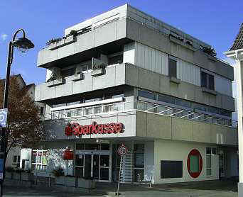
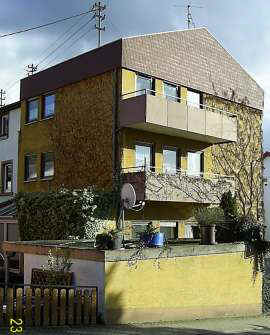
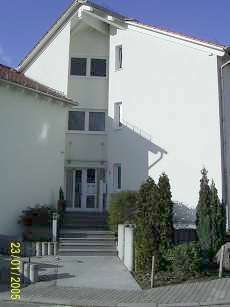
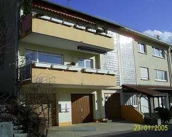
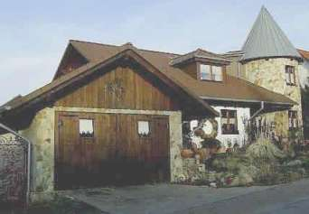
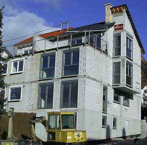
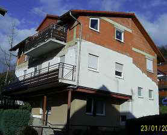
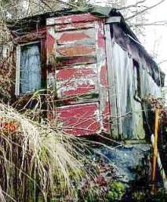
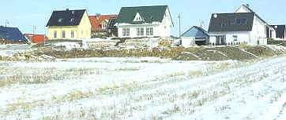
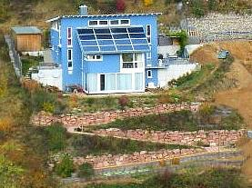

[🠔 Zur Übersicht: Planung & Kosten](9pbs.md)  
# Deutschland wählt die Superplanung
**Eine nicht ganz ernst gemeinte Auswahl von Gebäuden, juriert von 'Verarschitekturkäsperten', die Bauen nach Jedermanns Geschmack zeigen.**  
_von Konrad Fischer • aktualisiert 26.05.2008_

Konrad Fischer 

## Planungskosten im Altbau 15

(denn mit nichts kann man beim Bauen mehr Geld verlieren, als durch falsche Planung) 
**(aktualisiert 26.05.08)** 

---

Als wiederum nicht ganz todernst gemeinte Extrawurst: 

**Die aus Millionen Bewerbern vom Alpenland bis Waterkant von den indernäschänäll anerkannten Verarschitekturkäsperten Die der Polen und Hai Wie-Dumm ekschtra för Dich ausjurierten Candydatteln für den geilsten Auftritt - Bauen nach Jedermanns Gschmäckli**

**A) Das kundenfreundliche Sparkässchen in Ortsmitte - an nix gespart!**

**B) Wohnen, Freiluftsonnen, Parken und Empfangen - Mit Biofassade**

**C) Regensicherer Eingangsschlitz hinter beibetoniertem Zypressendschungel**

**D) Lischt und Luffd a la Chorpüßjäh - Zeitlos schööön**

**E) Autostall mit Schlafzimmerblick (Cap-Carneval-Abschußrampe inkludiert)**

**F) Lt. Bautafelinschrift bald ein sehrdiffizielerdes Passivhaus**

**G) Aus 2 mach 3 - Bauen im Bestand**

**H) Haus am Abgrund mit roter Tür - Do it yourself**

**I) Der Bebauungsplanfavorit - für bonbonbuntglasiert aufgestelzte Gecken**

**J) Wellblechdachbetrommeltes Passiffhaus a la alter Dessauer Käseschachtel - vorsichtshalber schon mal himmelbleu gorgonzoliert, mit Solarschlappmützli, abwechslungsreichster Schießschartenbefensterung, schlau gemixt mit mies'scher Kellerbefensterung (wegen Lichthitzschwitze 90 %ig zugestored). Konkurrenzlos / Außer Konkurrenz: Die in den Rebhang-Südblick serpentiniert-trockengemauerte Colorsandstone-Chateâuxauffahrt - Chapeâux!**

Jetzt anrufen!!! Nur für ökogartenbezwergt-rainrasige Doitsche!!! - Tel.Nr.: 00-00-00-00* (* kostet 00 Cent/min) 

Weiter zum lustigen [Bauherrn-Quiz: 16](10hoai16.md)
