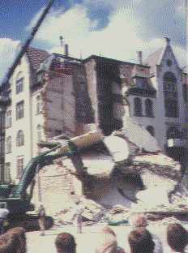

[🠔 Zur Übersicht: Sparsam sanieren](11erhins.md)  
# Denkmalpflege & Denkmalschutz: Der Restaurator und der Konservator als Totengräber der Originalsubstanz des Baudenkmals
**Sparsam Planen und Bauen im Altbau - Voraussetzungen und Methoden 1.4**  
_von Konrad Fischer_

Konrad Fischer 

## Denkmalpflege & Denkmalschutz: Der Restaurator und der Konservator als Totengräber der Originalsubstanz des Baudenkmals 
Sparsam Planen und Bauen im Altbau - Voraussetzungen und Methoden 1.4

Und was ist mit dem "[Restaurator](3gutacht.md)", der in seiner Befunduntersuchung oft ebenso schädigend beginnt, das Objekt dann in seinem Zeugniswert "gem. Befund" verfälscht, dessen authentische [Verfallsspuren beseitigt](8breuer.md), seine [Substanzzerstörung mit irreversibler Strahl-, Chemo- oder Hitzetechnik](29bau08.md) vor allem dem eitlen Baubeamten und Denkmalpfleger als "schonende Reinigung" verkauft, alle Fehlstellen ergänzt und die Bude abschließend in Kieselsoße ertränkt oder hinter Acrylmörtel, Silikatdispersion und Silikonharzemulsion einsperrt bis sie im neuen Glanz erstrahlt - unterstützt durch [Restauratoren-"Gutachten" im verwissenschaftlichten Stil](6sv.md#weimar1). Dem Bauherrn wird dabei das Geld mit begleitendem Fachkauderwelsch aus der Tasche gelockt, teils stark sponsoriert von der amtlichen Denkmalpflege. Denkmalschutz brutal ... 

Nicht Wirtschaftlichkeit, Vernunft und Handwerkspraxis, sondern wer die Restaurierungs-Scharlatanerie ausreichend kratzbuckelnd beherrscht, trifft dann den gewünschten Denkmalstil des Konservators. 'Effloreszierende' oder gar 'vorhydroxylierte' Agenzien, 'Naturhydraulen' und hygrisch-thermische Physikochemikalismen, Radarwirbelchemolaserelektronik, mysteriöse Originalbegrifflichkeiten und gediegenes Geschwafel beherrschen die Papiere der verwissenschaftlichten Denkmalpflege. 

Das kocht die Birne weich und frißt die Substanz mit der Bauherrnkasse auf. Und ist bestimmt nicht 'wirtschaftlich'. Der Restaurator Wieslaw Domaslowski beschreibt die gefährliche Denkmal-Totengräberei durch Restaurierungs-Scharlatanerie dankenswerterweise in härtester Präzision [W. Domaslowski: Modifizierung von mineralischen Mörteln für die Stein- und Ziegelkonservierung, in: Elisabeth Jägers (Hrsg.): _Dispergiertes Weisskalkhydrat für die Restaurierung und Denkmalpflege, Altes Bindemittel - Neue Möglichkeiten,_ Petersberg 2000]:

_"Die Verwendung von Mörteln zur Fehlstellenbehandlung und zur Injektion von Schuppen, Schalen und Rissen wurde bereits vielfach in der Fachliteratur vorgestellt und diskutiert. Jedoch entsprechen diese Materialien, die Restauratoren entweder selbst herstellen oder fertig kaufen, leider selten den konservatorischen Ansprüchen. Zwar werden die ästhetischen Anforderungen meist erfüllt, jedoch verursachen die physikomechanischen Eigenschaften der verwendeten Materialien allzu oft eine beschleunigte Zerstörung der Objekte."_ 

Link zum Thema: **[Konservieren-Restaurieren?](6sv.md#weimar1)**

Gipfel des Expertentums: Dem "Fachrestaurator" wird gleich die Bestandsaufnahme inkl. Planung übertragen. Seine buntkartierten Schadensplänchen vertränen den begleitenden Fachleuten die Augen und motivieren den Mitteleinsatz nach "aktuellem wissenschaftlichem Standard". In der Praxis kann danach überhaupt nicht repariert werden. Nachträge und falscher Baustoffeinsatz (gem. Fachberatung der Bauchemie - immer Gewehr bei Fuß hinter dem "Fachrestaurator") beherrschen die Szene, die papierene Weisheit wird im Akt entsorgt. Ein vernünftig gewähltes Arbeitsmuster qualifizierter Handwerker unter Planerregime hätte die brauchbare Planungsgrundlage gebracht - für wenig Geld und mit nachtragsarmer Vergabe auch kompliziertester Restaurierung.

Wir in der Denkmalpflege wollen einerseits das Alterungsbestreben des Bestands einfrieren. Andererseits möchten wir ihm neues Leben einhauchen - oft durch moderne Baustoffcreationen und [sauberster Hinwegreinigung aller Bauwerksrunzeln](29bau08.md). Das mag zwar gut gemeint sein, ist aber dennoch ein verlustreicher Prozeß: Das Baudenkmal oder gar das Kunstwerk wird bis zur Unkenntlichkeit verändert und verliert dabei immer Teile seiner Lebens- und Leidensgeschichte. 

Ohne [Volldeklaration ](2volldek.md)bis zum letzten Alkali- und Kunststoffanteil, praxisnahe und ehrliche Erläuterung der Einsatzgrenzen und fallbezogene Produzentenberatung - aber auch Produzentenverantwortung - sollte keine moderne Baustoffkomposition mehr den Weg ans Baudenkmal finden. Die Schadensfälle aus der bestandsschädigenden Verwendung moderner Baustoffe und -verfahren begründen diese Forderung.

_Jena, "Sanierung" des spätgotischen Roten Turms mit modernen Methoden - Unter den eingestürzten Betondecken liegen 4 tote Handwerker - trotz genehmigter Prüfstatik._ 

Auch bei der „Denkmalpflege“ und der „Wirtschaftlichkeit“ verpflichteten Vorhaben ist der Widerspruch zwischen Sanierung und Erhaltung kaum lösbar. Die Erhaltung des ganzen Bestands in seiner Gesamtheit ist eben kein typisches Sanierungsziel, auch nicht bei wertvollsten Baudenkmalen. Letztlich hieße das ja, alles Bauen zu verbieten, den Bauschaden zum historischen Ereignis hochzustilisieren. Wir kennen Instandsetzungskonzepte, die sogar den historischen Handwerkspfusch als erhaltenswert einstufen. Das ist natürlich besonders kostengünstig und sparsam, sowohl, was die Bauherrenkasse betrifft, wie auch hinsichtlich der Erhaltung von Originalsubstanz. 

Es geht, wie immer, um das rechte Maß. Wenn am Baudenkmal geforscht, geplant und letztlich saniert werden soll, vereinigen sich viele Kräfte. Dabei verliert das Original seine geschädigten und seine die Bauforschung, Rekonstruktion, Baustoffanwendung sowie die Nutzung behindernden Teile. Eine [wirtschaftliche Instandsetzung](6prwiins.md) muß den Bestand aber weitestgehend erhalten. Und dazu gehört grundsätzlich auch salzbelastete Bausubstanz des Nachmittelalters bis gestern. 

Wenn das [mißlingt](4behoerd.md#fall), gibt es dafür viele Gründe:

Noch nicht genug? Dann hier weiter zur **[Der Krieg gegen die Bausubstanz:1.5](11erh05.md)**
