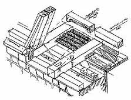
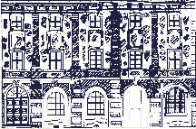

[🠔 Zur Übersicht: Sparsam sanieren](11erhins.md)  
# Altbausanierungs-Planung: Bestandsaufnahme & Aufmaß
**Handaufmaß & Digitales Aufmaß, Vermessung, systematische Bestandsaufnahme (Wand, Boden, Decke, Fenster, Tür) mit Raumbuch & Holzliste für sparsames Planen und Bauen im Altbau.**  
_von Konrad Fischer_

Konrad Fischer 

## Altbausanierungs-Planung: Bestandsaufnahme & Aufmaß 
Handaufmaß & Digitales Aufmaß / Vermessung / Systematische Bestandsaufnahme Wand, Boden, Decke, Fenster, Tür usw. mit Raumbuch & Holzliste 
Sparsam Planen und Bauen im Altbau - Voraussetzungen und Methoden 1.13

**2. Bauvorbereitung**

Aus [Versäumnissen der Bestandsaufnahme entstehen die meisten Konflikte der Altbausanierung](4behoerd.md#fall). Die üblichen Dokumentationsmethoden liefern nicht gerade selten unübersichtliche Datenmengen (Raumroman) und verlogene Pläne (additives Aufmaß bzw. Studentenniveau, überzogene Kartierung von allerlei Zuständen). Ihre Erstellung ist wie ihr Ergebnis unwirtschaftlich. Problematisch ist auch die Übernahme von extern, vielleicht sogar von praxisfremden Aufmessern erstellten Bestandsplänen. Ergebnis: Unsaubere Bauvorbereitung, Informationsverluste, Bauablauf- und Terminverzögerungen sowie Kostennachträge durch den damit provozierten Nachplanungsbedarf während des Baus.

Viele Aufmaßmethoden liefern für die Werkplanung und Ausschreibung gem. VOB zu detailreiche oder zu dürftige Planungsgrundlagen. Verformte, vielfach umgebaute bzw. nicht rechtwinklig errichtete Altbauten mit erheblichem Instandsetzungsbedarf brauchen oft verformungsgetreues Handaufmaß im Werkplanungsmaßstab - zumindest unter Leitung des Planers. 

Der Bestandsplan wird dann vollständig im Gebäude selbst erstellt, ohne Maßbetrug bei der Umsetzung von Meßskizzen in einen Büroplan. Solche Pläne können dann später auch in [CAD](9cadava.md) weiterverarbeitet werden. Im Handaufmaß werden auch alle Beobachtungen zu kritischen Punkten, Bauschäden und baugeschichtlichen Zusammenhänge erfaßt - Vorteil zu den am Markt angebotenen technisierten Aufmaßverfahren, die diese Informationen nicht gleichwertig liefern können. Manchmal genügen aber auch kleinmaßstäbliche und einfachere Zeichnungen.

_Neuenburg-Küchenmeisterei: Isometrische Bestandsaufnahme Dachfuß durch planenden und bauleitenden Ingenieur_ Übertriebener Aufwand am falschen Fleck und sinnlose Genauigkeit (Reklame der technisierten Aufmaßverfahren) bringt der Baumaßnahme gar nichts. Manchmal mag auch eine Nachverdichtung von digitalen Rohplänen oder umgezeichneten alten Bestandsplänen im Objekt sinnvoll sein. Dabei ist die Übernahme alter oder "fremder" Planungsgrundlagen - ihre haftungsrechtlich bedeutsame Prüfung ist "Besondere" Planungsleistung - meistens nur "2. Wahl". Nichts geht über den Bestandsplaneintrag eines auch bauleitenden Ingenieurs, der später den Datenbestand in die Planung und Bauabwicklung umsetzen muß. 

Bei der nachfolgenden technischen Bestandsaufnahme mit den Erfassungsformularen des [Raumbuch- und Holzlistensystems](11rabus.md) sind die üblichen Baukonstruktionen, deren Zustände und die sich daraus ableitenden Maßnahmen katalogartig vorgegeben. Dies führt die unterschiedlichsten Bearbeiter mit geringstem Aufwand zu technisch objektiven Ergebnissen, direkt umsetzbar in Ausführungsplanung und Leistungsbeschreibung.

 
_Neuenburg-Galerieflügel: Bestandsaufnahme der Einzelgespärre mit dem Holzlistensystem. Die Nummern beschreiben Bauteile, Zustände und erforderliche Maßnahmen nach einem eindeutigen Katalogsystem. Die damit erfolgte vorläufige Maßnahmenplanung liefert die Grundlage für nachtragsfreie Kostenplanung, Ausschreibung und Abrechnung auch komplizierter Schadenssituationen._

_Klosterfassade Waldsassen: Putzschadenskartierung in einem begrenzten Bereich als Planungsgrundlage für die Gesamtfassade_

 
_Cistercienserinnen-Abtei Waldsassen: Auszug Voruntersuchung Fassade im Raumbuchsystem mit Bauteil-, Zustands- und Maßnahmenkatalog sowie Mengenermittlung und grafische Kartierung. Planungsgrundlage für Maßnahmen- und Kostenplanung, öffentliche Ausschreibung sowie termin- und kostensichere Baudurchführung._

Alle erfaßten Bestandsdaten haben also einen Sinn für die Planung. Wichtig ist dabei die qualifizierte Bewertung, welcher Bestand technisch und wirtschaftlich sinnvoll mitverwendet werden kann, welcher nicht. Diese Form der Bestandsaufnahme führt direkt zur VOB-gerechten und damit kostensenkenden öffentlichen [Ausschreibung](9pbs.md). Die von Denkmalpflegerseite bisher bevorzugten Erfassungssysteme haben weder diesen direkten Maßnahmenbezug, noch steuern sie den Erfassungsumfang durch qualifizierte Textvorgaben. Damit ist sowohl ihre eindeutige Bearbeitung wie auch ihre Umsetzung in Planung erschwert, wenn nicht unmöglich. Dem Bauherrn oder Planer sind derart dokumentationslastige und der Bearbeiterwillkür unterworfene "Systeme" auch durch zuschußgestützen Argumentationsdruck kaum zu vermitteln. 

_Das Raumbuchsystem existiert für alle altbautypischen Baukonstruktionen und Ausstattungen. Gerade für die wirtschaftliche Reparatur und Ergänzung historischer Fenster ist es ein unverzichtbares Werkzeug. Nicht der Handwerker, der Planer muß die Planungsvorgaben eindeutig und unmißverständlich liefern, sonst entartet jede Vergabe von Reparaturleistungen zur Kostenexplosion und sinnlosen Bestandsvernichtung._ 

Siehe hierzu aus Fachbuchreihe "Fenster im Baudenkmal" Band 1998 
mit Beitrag Konrad Fischer zur 
Fenster-Bestandsaufnahme und Ausschreibung von Fensterreparaturen 
sowie Claus Meier zur 
kontroversen Fenster-Bauphysik 
[Bildlink zum Verlag](http://www.lukasverlag.com):

Die [altbautypische Untersuchungs- und Gutachtenflut](3gutacht.md) bis auf die atomare Ebene des Bauwerks führt zu einem gefährlichen Soll-Ist-Vergleich mit Marketing-Norm und -Regelwerk. Das kostet viel Geld und gefährdet die wirtschaftliche Projektdurchführung. Natürlich gibt es wirklich unabdingbare Untersuchungen - am besten gekoppelt mit Arbeitsmustern der sinnvollen Reparaturmöglichkeiten, aus denen sich im günstigen Fall auch sparsame Baumethoden (z.B. Verzicht auf Eingriff) ableiten. Zuerst sollte also die Untersuchungsstrategie kritisch abgestimmt werden, bevor man [Gutachter](4behoerd.md#fall) und teure - im Ergebnis oft nutzlosen "Voruntersuchungen" beauftragt. Vorsicht: Praxiskompetenz muß sein - prüfen Sie Referenzen! Was nützen die tollsten Untersuchungen (außer der honorarerhöhenden Baukostenmaximierung), wenn ihr Ergebnis uninterpretierbar bleibt bzw. sich vage Empfehlungen unsinnigster Maßnahmen (z.B. [Horizontalsperre](2aufstfe.md), [Zementinjektion](2gustopf.md), [Sanierputz](2sanipuz.md), [kunstharz- und/oder silikathaltige Anstriche](22bausto.md), [Hydrophobierung](29bausto.md#wasserabweisung/hydrophobierung), [giftiger Holzschutz mit kilometrigem Rückschnitt](23bausto.md#5.+wirksamer+bekã¤mpfender+und+vorbeugender), [Wärmedämmung](213baust.md), [Stoßlüftung](23bau05.md#entfeuchtungsleistung), objekt- und exponatzerstörende [Heizsysteme ](7temper.md)usw.) daraus ergeben? Solche "Gutachten" sind besser gleich als Textbausteine vom Produktvertreter zu bekommen - und das umsonst und ohne Untersuchungsauftrag. Und ohne großen Nutzen für das Bauwerk, dessen Besitzer und Nutzer.

Wichtig wäre auch die Bestandsaufnahme durch die Fachplaner. Da die hier tätigen Kollegen nicht immer wissen bzw. wg. Unterhonorierung oder Produzentenabhängigkeit wissen dürfen, was denkmalgerecht, bestandsschonend und wirtschaftlich ist, "rechnen" sie oft von vornherein mit (honorar-)kostensteigernder Brutalerneuerung und Modernisierung "ihrer" Konstruktionen. LV komplett vom Hersteller. Die detaillierte Bestandsaufnahme ihres Bestands entfällt dann eben. Wie sich die als harmlose Liniengrafik dargestellten technischen Bauteile später im Bauwerk in aller Mächtigkeit realisieren bzw- gar nicht reinpassen? Egal. Die Planung in Dreitafelprojektion, also nicht nur als Strangschema oder statische Systemskizze, sondern lagegerecht ind Grundriß, Deckenaufsicht, Wandansicht und Durchdringungs- oder Verbindungsdetail gibt es nicht. Folge: Ausbau der nicht mehr erforderlichen Leitungen, Konstruktions- und Anlagenteile mit zu hohem Vernichtungsgrad in der Bausubstanz sowie Vernichtung noch brauchbarer Bauteile. Einbau der neuen Teile "nach Belieben". Der Bauleiter schwitzt, die "unvermuteten" Kosten explodieren. Der Handwerker und sein Lieferant reiben sich die Hände, der Fachplaner freut sich auf den nächsten Weihnachtsbesuch. 

Im Holzschutzbereich natürlich nur Begutachtung mit Maßnahmenempfehlung durch kompetente Gutachter betr. konstruktiver, anlagentechnischer und chemisch-physikalischer Holzschutzmaßnahmen, die dann in der Ausschreibung qualifiziert, gewährleistungssicher und bedenkenverhindernd verankert werden müssen. 

Merke: Vorwegnahme kritischer Bauleistungen in Arbeitsmustern bzw. Musterachsen. Wenn die Tragfähigkeit von Malgründen, die Bewährung einfacher Reparaturtechnik, die Mitverwendbarkeit alter, evtl. noch brauchbarer Anlagenteile, die Instandsetzung verdeckter Konstruktionen im Zusammenhang mit der technischen Bestandsaufnahme erprobt wird, sind spätere Überraschungen, Konflikte und Kostenexplosionen kaum zu erwarten. Hier muß der Planer zeigen, was er versteht - was sollte bemustert werden, was kann darauf verzichten? Seine geschuldete Beratung zur Einschaltung von Sonderfachleuten muß den qualifizierten Restaurator mit einbeziehen. Und auch hier ist erst Streu vom Weizen zu scheiden.
