[🠔 Zur Übersicht: Sparsam sanieren](11erhins.md)  
# Fassadenrestaurierung/Fassadensanierung: Musterachse - Beispiel Rathaus Bremen
**Testfeld/Testfläche Fassadeninstandsetzung als perfekte Planungsgrundlage Sparsam Planen und Bauen im Altbau - Voraussetzungen und Methoden.**  
_von Konrad Fischer_

Konrad Fischer

## Fassadenrestaurierung/Fassadensanierung: Musterachse - Beispiel Rathaus Bremen 
Testfeld/Testfläche Fassadeninstandsetzung als perfekte Planungsgrundlage 
Sparsam Planen und Bauen im Altbau - Voraussetzungen und Methoden 1.14

Planauszüge und Fotos: 
[Konrad Fischer](1refernz.md), Hochstadt a. Main (soweit nicht anders angegeben) 

---

Beispiel: Unser Musterachsenprojekt am historischen Rathaus Bremen - Vorbereitung zur nachtragsarmen Baumaßnahme 

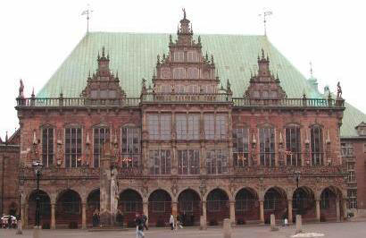 
_Die Süd-Fassade nach Restaurierung - kein historisierender oder frei interpretierender Gestaltwandel, nur Reparatur nach unbeschränkter öffentlicher Ausschreibung! Bei erheblicher Budgetunterschreitung durch[nachtragsarme Ausschreibungsmethode](9pbs.md)._

 
_Die für wenige Wochen eingehauste Musterachse. Hier konnte das Winterhalbjahr genutzt werden, um bis ins letzte Detail Schäden zu entdecken, zu analysieren und die technisch und wirtschaftlich besten Reparaturmaßnahmen zu entwickeln. Natürlich mit Gegenkontrolle nach winterlicher Bewitterung im Frühjahr vom Hubsteiger aus._

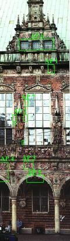 
_Kartierungen an photogrammetrischen Bestandsaufnahmen (Photogrammetrie - maßstabsgerechte Fotografie) belegen alle getroffenen Planungsentscheidungen auch bei der späteren Bauzeit. Allein die Firmen-Abrechnungs-Dokumentation des im Detail angetroffenen Vorzustands, der mit der Bauleitung anhand der sich in der Musterachse bewährten, ausgeschriebenen, dann lokal festgelegten und durchgeführten Maßnahmen füllt über 12 Leitzordner. Und wie läuft das mit der Dokumentationspflicht gem. Charta von Venedig sonst? Und mit der im Detail prüffähigen Abrechnung? Eben. In so einem Fall braucht es eben keine steingerechte Bauzeichnungen für teuer Geld und teuer Zeit. Und auch keine Blödsinnsmaßnahmenkartierung, die dann von der späteren Bauwirklichkeit ad Absurdum geführt wird und nur des Denkmalpflegers und Bauforschers Brust schwellen läßt. Tip: Immer abwägen, was die Maßnahme wirklich braucht._

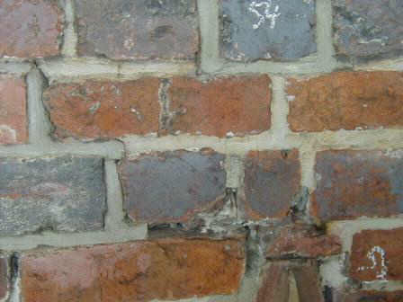 
_Die mauerwerkszerstörenden gerissenen und kapillarsaugenden Zementfugen früherer Handwerks- und Denkmalschlaumeier blieben überwiegend - kosten- und denkmalsubstanzsparend - drin! Ihre wassersaugenden Löcher und Risse wurden allerdings mit[Luftkalkmörtel](2kalk.md) harmlos geschlossen. Alle Steine wurden begutachtet und _nur wo technisch notwendig_ repariert. Man sieht die Kartierung aus Kreidebezeichnung._

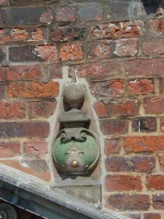 
_Mauerwerk der Musterachse: Zerstörungsgrad und Reparaturbereich direkt über dem Fenstergiebel mit preisgünstigster Kalkmörtelergänzung auch im Backsteinbereich. Es muß nicht immer nachgeschnitztes Gold sein, nur damit sich die Restaurierhelden darin sonnen können!_

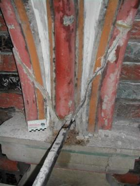 
_Einzementierte Eisenanker, deren gesamtes Schadensbild und die daraus abzuleitenden Maßnahmen nur nach Freilegung im Musterachsenbereich ausschreibungs- und kostenkontrollfähig wurden._

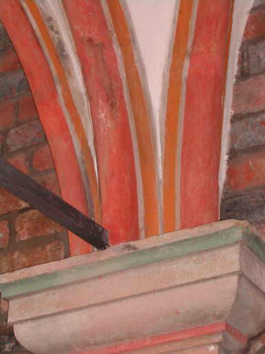 
_Eisenanker nach Reparatur - nach Teilergänzung verrosteter Bereiche und Hochqualitätsrostschutz (Bleimennige in Leinöl, Glimmerfarbe in Leinöl-Standöl) nun in elastischem Kalkmörtel eingebettet._

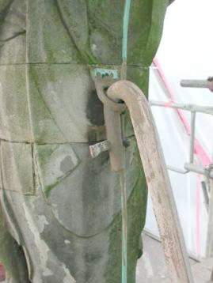 
_Detail Befestigung Giebelfigur in Musterachse. Restauratoren und Bauchemie - die Originaloberfläche wurde früher mit Spezialwasserglasfestiger (auf Empfehlung einer Frau Dr. des Bayer. Denkmalamts, Schreiben liegt mir vor) vollgetränkt. Nun schuppt wie immer (vergleichen Sie selbst!) alles krustig und pustelig ab und hält schwarzvergrünend Wasser zurück. Die Renaissancehaut schwindet dahin. Hat aber jahrhundertelang gehalten, bis modernes Schlaumeiertum aus Behörde, Restaurierung, Handwerk und Bauchemie tätig wurde._

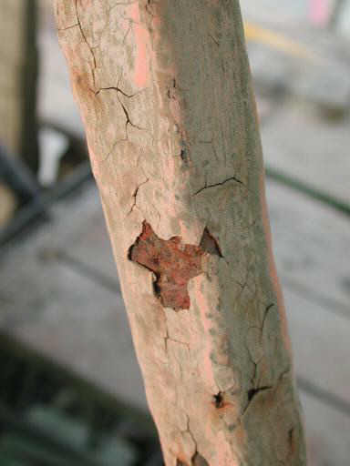 
_Auch der moderne Rostschutz am Ankereisen der Giebelfigur ist der letzte Dreck, wenn es aus dem Industrie-Labor in die Wirklichkeit geht. Er macht die Bewegungen des Eisens nicht mit, kann nur beschichten und sich im Mikrogefüge der Metalloberfläche nicht sauerstoffersetzend verankern._

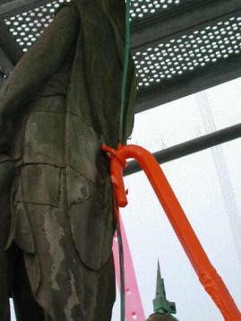 
_Besser ist da die altbewährte Bleimennige. Sie kann als aktiver Rostschutz perfekt passivieren, in Leinöl gebunden bis in das letzte mikrokristalline Löchlein der Oberfläche flutschen und dauerhaft schützen (handwerksgerechte Verarbeitung und Sorgfalt vorausgesetzt!). Üblicherweise bevorzugt der Planer aber Schnellschmier-Industriemüll, der "leichter verfügbar" ist und kein Bemühen um Ausnahmegenehmigung betr. Arbeitsschutz erfordert. Gottseidank war ich hier nicht nur als Gebäude-, sondern auch als SiGeKo-Planer tätig._

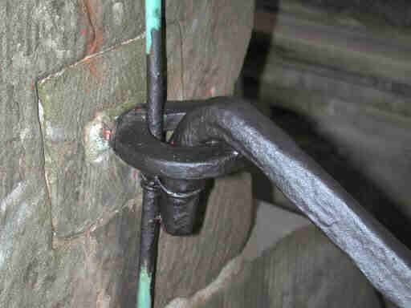 
_Oberflächenschutz der Bleimennige mit einer Leinöl-Standöl-Eisenglimmer-Farbe. Das hält wirklich und ist trotzdem - öffentlich ausgeschrieben - preisgünstig._

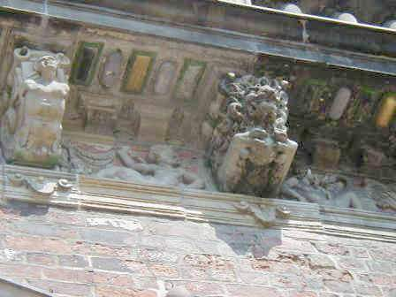 
_Reparaturmuster an der Gesimsuntersicht links. Ziel: Nur technisch nachteilige lose wasserglasversalzte- und -festigte Krusten abnehmen. Bonbonsüßes Farbkonzept 60er Jahre (mit zerstörerischen Wasserglasfarben!) wird hingenommen. Leichte Retuschen mit rissfüllender Kalkfarbe nur, wo stark störend aus Fernsicht. Nahezu keine Profilergänzungen._

_Der über Jahrhunderte geschundene Gesamteindruck, die gealterte Haut, die geschichtlich verdichtete Gesamterscheinung bleiben ungestört von schöpferischer Denkmaltümelei und sehr sehr preisgünstig erhalten. Das Muster belegt diese Machart auch als Grundlage für die Gesamtreparatur._

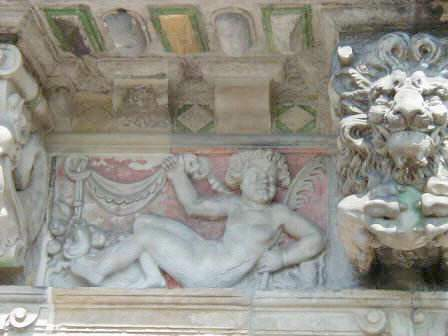 
_Detail Musterreparatur an Oberfläche. Links nur gereinigt, rechts mit Retuschevorschlag. Fehlstellen im Gold nur mit Kalkocker ergänzt! Absandelnde Flächen mit Feinkalkschlämme guter Eindringtiefe ohne die sonst übliche Krustenbildung, Schalenüberfestigung und Trocknungsblockade gesichert (man könnte auch gefestigt sagen, wenn dieses Wort nicht schon dermaßen zum Formenkreis des Mißbrauchs und der Vergewaltigung der Denkmalhaut gehören würde)._

_Auch ein öffentlicher Bauherr sollte nicht immer von Edeldenkmalputzpolitür ausgeblutet werden! Wenigstens Werder-Fan Löwe ist damit auch zufrieden. Sein goldiger Ball (Sonne hat astronomisches Haus im Löwen!) bleibt nur dem Eingeweihten ein gülden Symbol._

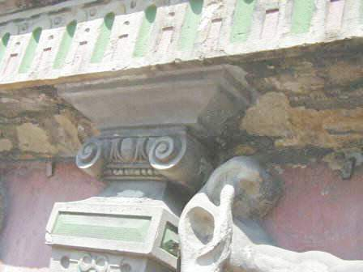 
_Scheußlich, was Wasserglas alles an Oberkirchner Sandstein, Deutschlands erste Qualität, anrichten kann. Wir haben das nun mit pigmentierter Kalktünche vor weiterer Verwitterung geschützt - Muster am Kapitell. Sie zerkrustet, zersalzt und zerfeuchtet die Fassade nicht. Konstruktions- und Ausführungsdetails muß man dafür freilich selbst entwickeln, vorgefertigte Texte gibt es nicht. Im Unterschied zu den synthetischen und deswegen fassadenzerstörenden Farbrezepturen moderner Baualchymie._

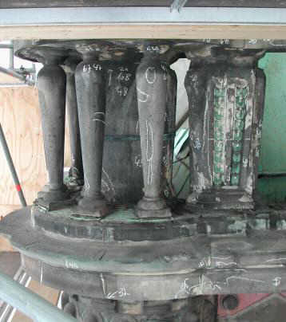 
_In der Ausführungsphase überzieht dann der beauftragte Handwerker das ganze Bauwerk mit einem dichten Netz aus Kreide-Kartierung - Positionsnummern aus dem Leistungsverzeichnis. Das wird mit der Bauleitung abgestimmt und nach geglückter Bemusterung von Bauherr, Oberbauleitung und Denkmalpflege zur Ausführung freigegeben._

_Parallel dazu Eintrag der Flächen und Nummern in die Abrechnungszeichnung auf Grundlage der Fotogrammetrie. Die perfekte Dokumentation für den Rechnungshof - den Bauherrn und das Denkmalarchiv für spätere Maßnahmen und Erfolgskontrolle._

_Nachmachen!_

---

Wichtig: Auch historische Tragwerke kann man auf Weiterverwendung außerhalb vernichtender Normberechnung experimentell testen und so die wahren Rechengrößen ermitteln. 

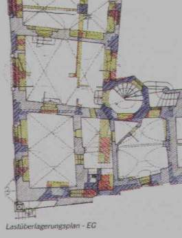

_Weißenfels-Geleitshaus: Lastüberlagungsplan als geometrische Projektion der in die Decken- und Wandkonstruktionen eingeleiteten Lasten. Die Farbtiefe und Schraffurdichte bildet die jeweilige Belastungssituation ab. Diese Bestandsdarstellung dient dem Tragwerksplaner zur gezielten Schadensbeurteilung und technisch sowie wirtschaftlich angemessenen Tragwerks-Reparaturplanung._
