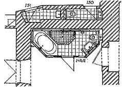
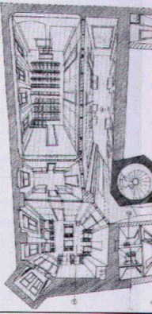
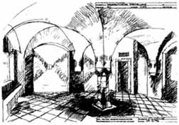

[🠔 Zur Übersicht: Sparsam sanieren](11erhins.md)  
# Sparsam Planen und Bauen im Altbau - Voraussetzungen und Methoden 1.15
**Funktionsplanung, Entwurfsplanung, Ausführungsplanung & Kostenplanung mit Einbindung der Bauherrn-Eigenleistung bei Bau-Instandsetzung, Modernisierung & Umbau**  
_von Konrad Fischer_

Konrad Fischer 

## Planen, Bauen, Umbauen, Haus/Altbau Instandsetzen - Bausanierung 
Funktionsplanung, Entwurfsplanung, Ausführungsplanung & Kostenplanung mit Einbindung der Bauherrn-Eigenleistung bei Bau-Instandsetzung, Modernisierung & Umbau 
Sparsam Planen und Bauen im Altbau - Voraussetzungen und Methoden 1.15

Planauszüge und Fotos: 
[Konrad Fischer](1refernz.md), Hochstadt a. Main (soweit nicht anders angegeben) 

---

### 3. [Funktions-, Entwurfs-, Ausführungs- und Kostenplanung mit Einbindung der Eigenleistung](11entwf.md)

Bei der Instandsetzung, der Modernisierung und dem Umbau von Baudenkmalen heißt Entwurf: Einpassen der neuen Funktionen und wirtschaftlichste Konstruktionswahl im Hinblick auf den späteren Bauunterhalt. Das kann bis zum Verzicht auf unanpaßbare, nicht förderfähige und damit auch unwirtschaftliche Nutzung gehen. Auch hochstilisierte Zeitgeisterei muß nicht immer sein. Für unvermeidbare Bestandsverluste im Zusammenhang mit dem Umbauen und Modernisieren ist die dafür geeignetste Gebäudestruktur zu suchen. Vielleicht ist sie stark zerstört oder erscheint noch am ehesten verzichtbar. 

Darüber hinaus könnte der Befund mit allen Bau- und Verfallsphasen in untergeordneten Nutzungsbereichen oder im musealen Umfeld auch übernommen werden. Manchmal ist eine "Normalsanierung" überhaupt nicht finanzierbar. Dann schlägt die Stunde dieser ultima ratio als letzter Ausweg. Mit den unaufschiebbaren Notsicherungen und Bewerkstelligung einer [konservierenden Hüllflächentemperierung auf geringstem Technik- und Betriebskostenniveau](7temp17.md) - kann wertvolle Bausubstanz entweder "eingemottet", oder eben für reduzierteste Nutzung oder museumsähnliche Veranschaulichung instandgesetzt und so mit geringstem Budget erhalten werden. 

 
_Badeinbau im beengten Bestand eines Barockklosters_ 
Im Bestand gilt nicht nur "neue" Architektur bzw. Baunorm. Die Anpassung an Zeitgeist, langfristig kostentreibende und schadensanfällige Modernbauweise fällt zwar leicht, eine selbstbewußte Planung darf sich aber besseren Zielen verpflichten. Allerdings setzt das den altmodischen Demutsbegriff und entsprechende Gestaltung der Werkverträge voraus. 

 
_Weißenfels-Geleitshaus: Mit Bauwerks-Zentralperspektiven können Trassenüberlagerungen und Raumgestaltungen eindeutig auf Bestandskonflikte geprüft werden. Außerdem erhält der Bauherr rechtzeitig einen Eindruch vom Planungsergebnis. Dazu braucht es keine aufwendige CAD-Software, sondern wenige Zeichenstunden._

Eine bestandsschonende Planung kennt eigentlich keinen Konflikt mit einer auf Investitionsrendite und Betriebskostenminimierung zielende Wirtschaftlichkeitsberechnung. Eingriffe beschränken sich folglich überwiegend auf Reparaturen, unrentierliche Nutzung bleibt kontrollierbar. Verzicht auf "Übernutzung" verringert auch den Aufwand für nachträglichen [Brandschutz](6brand.md), wobei es durchaus sinnvolle Kompensationsmaßnahmen geben mag. Eine gewerkweise Kostenermittlung nach einzeln durchkalkulierten Leistungspositionen, sozusagen als teilweiser Vorgriff auf die Leistungsverzeichnisse, verbessert dann auch die Budgetsicherheit - gut für den Ruf der Denkmalpflege. Das gelingt natürlich nur bei vorgezogener Ausführungsplanung. 

Natürlich unterliegt das denkmalgerechte Entwerfen keiner festgeschriebenen Vorschrift, sondern dem Wandel diesbezüglicher Ansichten. Das Entwerfen gerade in gestalterischer Hinsicht ist ein spannungsgeladener Prozeß. Schnell ist der Planer, der Bauherr oder "die Denkmalpflege" verschnupft, erscheint der jeweils eigene Standpunkt gefährdet. Die Frage nach zulässigem Eingriff, nach vertretbarem Gestaltwandel oder nach dem neubaubedingten Bestandsopfer muß immer wieder neu entschieden werden.

In der Praxis spielt der Umgang mit dem historisch gewachsenen Erscheinungsbild der Bauteiloberflächen bzw. Fassaden eine wichtige Rolle. Soll konservierend überputzt, übermalt oder überschlämmt werden, was der nationale Historismus steinsichtig herauspräparierte? Was soll geschehen mit der durch Zementfugen, Wasserglasfixativ und Kunstharzkleistern mißhandelten alten Fassade? Soll alles unter einem Leichentuch aus frottiert-gewaschelten Pseudokalkputzen und überdichten Kalkersatzanstrichen bzw. hydrophobierten Synthetik-Kalklasuren verschwinden? Sind teils festsitzende Zementmörtel immer zerstörerisch herauszuschlagen? Wer verantwortet die damit einhergehenden Kostensteigerungen und Substanzverluste? Müssen historisch fragmentierte Zustände frech und zusammenhanglos für sich nebeneinander dargestellt, vielleicht sogar verlustreich freigelegt werden? Das Denkmal als Kaleidoskop oder in einheitlich gefälschter Fassung von Anno niemals?

Auch die zurückliegende Restaurierungsgeschichte verdient Respekt. Wenn wir dem Bestand gegen den weiteren Verfall helfen, nur wo am Notwendigsten etwas reparieren, kostet das wenig Geld und wenig Substanz. Ein Gestaltwandel, gar Fassadenneualtentwurf muß also nicht immer und unbedingt sein - die "originalgetreuen" Erfolge der interpretierenden Denkmalpflege sind und bleiben Luxusbau. Vielleicht gelingt alternativ und naturbelassen sogar ein ausstellungswürdiges Museumsexponat mit mehr Geschichte, als mancher Vitrinenfüller. Der Altbau selbst ist auch mit einigen Metern Rissverschlüssen aus Kalkmörtel zufrieden. Ein kosten- und geschichtsbewußter Bauherr auch.

Wenn es um Kostensparen geht, muß selbstverständlich auch die Eigenleistung des Bauherren im Sinne von Do-It-Yourself berücksichtigt werden. Im Studium ist das ebenso wie die Gewerkleistung des Handwerkers sozusagen "kein Thema". Umsomehr interessiert es den privaten, teilweise auch den öffentlichen Auftraggeber als effektive Methode zur Kostensenkung. Hier braucht der Bauherr verständige Anleitung, denn die Eigenleistung muß ebenfalls fachgerecht geplant werden. Einerseits dürfen ihre Möglichkeiten nicht überschätzt werden, denn sonst bricht das Finanzierungskonzept in sich zusammen. Zur Eigenleistung gehören ja auch die realistischen Kosten für Werkzeug, Transport und Baustoffe. Viele Baustoffhersteller verkaufen nur an Firmen bzw. über den Baustoffhandel und derartige Baumaterialien sind dann nicht beim Baumarkt erhältlich sondern müssen zu wesentlich teureren Preisen vom Handwerker bezogen werden. Außerdem erhalten Handwerker als Großeinkäufer wiederum oft wesentlich bessere Preise als ein Bauherr mit seinen Kleinmengen. 

Andererseits stellt sich bei ausgiebiger Eigenleistung auch das Gewährleistungsproblem an den Schnittstellen zur Auftragsleistung des Handwerkers. Insofern kann die Eigenleistung auch zu entsprechenden Einschränkungen und Nachteilen führen. Insofern ist es bei der Eigenleistung meist sinnvoll, klar in sich abzugrenzende Arbeitsabschnitte zu übernehmen, die erst am Ende einer abgenommenen Handwerkerleistung zum Tragen kommen wie eine Oberflächenbeschichtung, eine Dachdeckung oder ein Bodenbelag. 

Wichtig ist auch die Frage, ob ein Bauherr durch Eigenleistung in Wirklichkeit Geld spart. Wenn er in seinem angestammten Beruf mehr leisten würde, kann das ja effektiver Geld in die Baukasse spülen, als wenn er seine "freie" Zeit in mühseliges Gegurke auf der Baustelle steckt und dabei im Vergleich zum Profi wesentlich langsamer und qualitativ minderwertiger vorankommt. Hier kommt es immer wieder zu gravierenden Fehleinschätzungen aus dem blauäugigen "Das schaffen wir doch" am Anfang eines Bauprojekts. Andererseits kann es auch im Bereich der Bauplanung wesentliche Arbeitsabschnitte gerade im Bereich Bestandsaufnahme beim Altbau, vielleicht auch bei der Bauleitung bzw. Objektüberwachung geben, die ein einigermaßen verständiger Bauherr - evtl. unter fachkundiger Anleitung des Planers - sinnvoll erbringen kann. Nach den vorliegenden Erfahrungen sind auch hier deutliche Einsparungen durchaus im Rahmen des Möglichen.Selbstverständlich muß ein derartiges Mitwirken auch im Planungsvertrag verankert werden und dann beim Honorar zu spürbaren Ersparnissen führen. 

Wenn ein Bauherr allerdings zu viel Muskelhypothek investiert, kann das auch zu familiären Problemen führen, im bösen Spruch zusammengefaßt: Haus fertig, Ehe auch. 

Nicht zu vergessen beim Einsatz von Freundes- und Verwandschaftshilfe: Die Unfallgefahr bei Baulaien ist wesentlich größer als bei Handwerksunternehmen. Genau deswegen müssen die willigen Helfer über eine Anmeldung bei der Berufsgenossenschaft Bau / Bauberufsgenossenschaft angemeldet und damit versichert werden. Finger blau mag dabei ja noch angehen, aber Bein ab? 

Es sind also viele Aspekte beim sinnvollen Einsatz von Eigenleistungen am Bau - egal ob Altbausanierung oder beim Neubau - zu würdigen. Eine ausgereifte Planung mit detaillierter Klärung des Maßnahmenbedarfs der Bauleistungen bis zur letzten Schraube leistet dabei wertvolle Hilfe. Und ein Beschränken auf bewährt einfache Baumethoden rund um die Massivbautradition (Stein auf Stein) auch. Im Systembau sieht es eben für den eigenleistungswilligen Bauherren dagegen oft genug schlecht aus: Ihm fehlen die Montagehilfen, Arbeitsschutzausrüstungen und auch die speziellen Gerätschaften ebenso wie die Arbeitserfahrungen, um die dennoch nicht gerade seltenen Systemschwierigkeiten und -widersprüche erfolgreich zu überwinden. 

_Weißenfels-Geleitshaus: Raumperspektive als Entwurfsmethode auch im Bestand_

---

Noch nicht genug? Dann hier weiter zur **[Fortsetzung](11erh16.md)**
