[🠔 Zur Übersicht: Sparsam sanieren](11erhins.md)  
# Sparsam erhaltende Konstruktionsplanung Fachplanung Haustechnik / Gebäudetechnik / Gebäudeausrüstung & Tragwerksplanung im Altbau, Denkmalschutz & Denkmalpflege
**Altbausanierung Statiker, Statik, Tragwerksplanung, Haustechnik-Fachplanung Sparsam Planen und Bauen im Altbau - Voraussetzungen und Methoden 1.16.**  
_von Konrad Fischer_

Konrad Fischer 

## Sparsam erhaltende Konstruktionsplanung Fachplanung Haustechnik / Gebäudetechnik / Gebäudeausrüstung & Tragwerksplanung im Altbau, Denkmalschutz & Denkmalpflege 
Altbausanierung Statiker, Statik, Tragwerksplanung, Haustechnik-Fachplanung 
Sparsam Planen und Bauen im Altbau - Voraussetzungen und Methoden 1.16

Planauszüge und Fotos: 
[Konrad Fischer](1refernz.md), Hochstadt a. Main (soweit nicht anders angegeben) 

---

**4. Konstruktionsplanung**

Grundlagen der Konstruktions- bzw. Ausführungsplanung sind das Aufmaß, die technische Bestandsaufnahme und die Bemusterung geeigneter Reparaturtechnik. Hier zeigt sich die Schwäche von praxisfremden Aufmaßtrupps am meisten. Sie können die spätere Verwertung der Bestandspläne nicht richtig vorhersehen und liefern entsprechend unvollständige, fehlerhafte oder unnötige Ergebnisse. Ein planungsverantwortlicher Ingenieur kann vor und während der Bestandsaufnahme auf den technischen Bedarf reagieren und Nachbearbeitungsbedarf in der Planungsphase rechtzeitig ausschließen. Nur er erkennt die konstruktiven Schwachpunkte, aus denen sich besondere Anforderungen an Bestandsverträglichkeit, den Bauteil- und Arbeitsschutz ableiten. Das denkmalpflegerische Erhaltungsanliegen und die Baustellenverordnung setzen hier den Maßstab. Auch die Schutzmaßnahmen für erhaltenswerte Bauteile im Bauablauf wollen hier geplant sein.

Die aus der Bestandsaufnahme und dem Schadensbild abgeleitete Planungsdetaillierung sollte den Anforderungen einer kostensicheren Ausschreibung und Vergabe entsprechen. Sonst war alles Gegurke umsonst. Wenn auch erst mal billig.

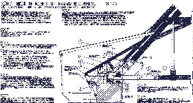 
_Cistercienserinnen-Abtei Waldsassen: Querschnittsgetreue Dachfußreparatur-Planung mit Arbeitsplatz- und Gesimssicherung inkl. Gerüstverdachung. Damit kann die Baustelle am offenen Dach im Winter und bei Regen unbehindert laufen. Der neue Mauerkörper am Gesims ersetzt die originale Schwellenvermauerung als Gegengewicht für das barocke Kraggesims. Eintrag aller zugehörigen LV-Positionen. Damit kostensichere Angebotskalkulation und öffentliche Ausschreibung aller Arbeiten mit wirtschaftlich überzeugendem Ergebnis._

Wie soll man nun Neues und Altes zusammenfügen - die große Kunst der Sanierung? Die Reparatur- und Neubaukonstruktionen passen sich am besten in Gefügestörungen, Fehlstellen oder als Vorsatzelemente ein, als neue Schale über dem Bestand. Werden die Leitungstrassen und Verbindungen zwischen Neu und Alt nicht im Detail geplant und beschrieben, werden die Einbaukonflikte zu spät, also erst im Bauablauf, entdeckt. Das kostet. 
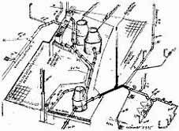_Weißenfels-Geleitshaus: Isometrische Abwasserkanal-Planung im Bestand_

Nur die schlüssige Zusammenarbeit aller beteiligten Fachplaner, nicht deren gewohnte Verweigerung aller altbaugerechter Leistungsintensität (z.B. Wandabwicklung aller Trassen- und Objekteinbaupläne, Dreitafelprojektion aller Pläne, Vollvermaßung bezogen auf Bestand, VOB-gerechte, neutrale und eindeutige Leistungsbeschreibung) bei gleichzeitigem Einsacken der Altbauzuschläge und übertriebener Technisierung des Altbaus mit störanfälligem High-Tech kann das leisten, was ein Bauherr wünscht. 

Dabei ist anzumerken, daß die angebliche [Energiespartechnik auf der Grundlage sog. alternativer Energien](7temp23.md) bisher nirgends bewiesen hat, daß damit auch nur ein Kilowatt gespart wurde. Im Gegenteil: Ihre geringe Energiedichte macht "das Sammeln" teuer, das Ökoargument ist Augenauswischerei und dient anderen Interessen.

[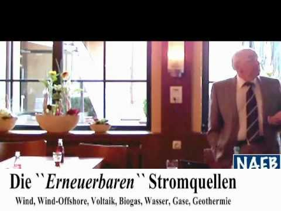](https://www.youtube.com/watch?v=2rlotB0Zog4)

Vorsicht vor Haustechnikplanern, die normengestützte Luxuskonstruktionen mit allem modernistischem Firlefanz vorzuschlagen, um daraus Honorarkapital zu schlagen. Das gelingt auch deshalb so gut, da die Anlagenhersteller neben fetten Brotzeitpaketen nicht selten noch alle Pläne und Leistungsbeschreibungen (für den Haustechnik-Fachplaner!) 'kostenlos' zur Verfügung stellen. Gerade bei der Heiz- und Klimatechnik werden so altbauschädigende teure Luftbehandlungssysteme gegenüber sinnvollen Alternativen wie der [Hüllflächentemperierung](7temper.md) bevorzugt. Die Detailplanung im Bestand wird jedoch systematisch vergessen. Dem Bauwerk und dem Bauherrn dient das keinesfalls. Um der Bestechung des Fachplaners vorzubeugen, wäre es sinnvoll, wenn zumindest der private Bauherr höchstpersönlich entscheidet, ob er seine Heizung von diesem oder jenem Hersteller will um dann dem Planer seine möglichst eigenständig getroffenen Gestaltungs- und / oder Technikentscheidung vorzugeben. Entscheiden kann nämlich auch dem Bauherren Spaß machen.

Vorsicht aber auch vor dem Wasserwerk Ihrer Kommune: Hier wird deutschlandweit gerne brutaler Beschiß zu Lasten der Kunden und zugunsten der Gebührenabzocke für Wasser und Abwasser geübt: 

Wußten Sie, daß gerne eine falsche, d.h. gesetzwidrig zu große Wasseruhr montiert wird, die trotz Eichung brutal mehr Wasserverbrauch zählt, als entnommen wird? Die Typen: "Qn 2,5" für 1-50 Abnehmer/Wohnungen, "Qn 6" für bis zu 350 Abnehmer/Wohnungen, "Qn 10" für bis zu 960 Abnehmer/Wohnungen. Die Typenbezeichnung findet sich auf der Zählerscheibe. Je größer, umso größer wird der Meßfehler auf Rechnung des Verbrauchers, der schnell Werte von 20 Prozent übersteigen kann. Vor allem bei der Zählung kleiner Entnahmemengen. Und unnötig große Uhren kosten auch sinnlos mehr. Also Prüfen! Details:

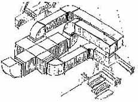_Weißenfels-Geleitshaus: Isometrische Anlagenplanung Lüftung im historischen Dachgespärre_ 
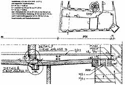_Weißenfels-Geleitshaus: Deckenverstärkung mit Stahlträger - verformungsgetreu_

[Bewährte Baumethoden](2baustof.md) sind oft besser, als neue Sanierungswunder. Bei dem darüberhinaus sinnvollen Einsatz von Neuentwicklungen sind ausreichende Erprobungsphasen und Bemusterungen im kleinen Maßstab am Objekt sinnvoll. Wichtig ist die Bestandsverträglichkeit und Störungstoleranz der eingesetzten Baustoffe und -konstruktionen. 
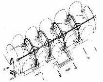_Neuenburg-Weinmuseum: Substanzschonende Gewölbeertüchtigung durch bestandsgenau eingepaßte Stahlbinderkonstruktion. Es macht schon Sinn, architektonischen Denkmalverstand auch in der Tragwerksplanung freien Raum zu geben und die Fachplanungen "im Paket" zu erbringen. Und bringt dem Bauherrn nicht nur technische, sondern eben auch wirtschaftliche Vorteile._

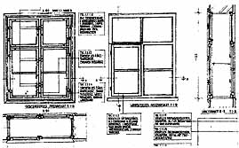_Reparaturplanung für historisches Fenster und ..._

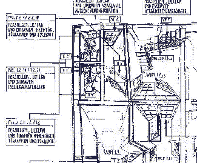 
_... Bauwerks-Zentralperspektive mit lagegetreuer Eintragung aller Schreinerleistungen. Sichere Angebotsgrundlage und Steuerungsinstrument für die Baudurchführung._

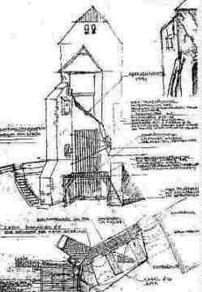_Neuenburg-Westtorhaus: Bauvorbereitende Sicherung absturzgefährdeter Fassadenbauteile durch Rundholzverbau. Nachfolgende Wandsicherung durch kostengünstigen und bestandsschonenden "reversiblen" Mauerpfeiler._ 
_Ein Tragwerksplaner im Bestand benötigt nicht nur Rechenfertigkeit für Normtabellen, sondern konstruktives Geschick und angemessenes Risikobewußtsein. Auch mit handgezeichneten und handbeschrifteten Planzeichnungen ist die Kommunikation mit den Baubeteiligten möglich._

DIN-Übererfüllung aus Haftungsangst (Ausnahme: Bauteil- und Baustellensicherheit!), fachlicher Unsicherheit und dank Einflüsterung der umsatzgeilen Bauindustrie kostet viel Geld, kann aber technisch unsinnig, übertrieben substanzvernichtend und selbst schadensauslösend sein. Bautechnisch sinnlose, aber kostentreibende Normenreiterei sollte deswegen zugunsten des Bauherrn vertraglich abbedungen werden - wer wollte das verbieten? 

Technisch unsichere Planer haben davor aber Angst. Selbstverständlich schmilzt durch "einfaches" Bauen "- ohne Gürtel und Hosenträger" - auch das baukostenabhängige Planungshonorar dahin. Die zusätzliche Anstrengung für substanzerhaltendes und damit kostengünstiges Bauen wird aber durch technisch/gestalterisch und damit auch wirtschaftlich mitverwendete Bausubstanz honorabel. Dafür sieht die bestens altbaugeeignete Honorarordnung Regelungen (z. B.: [HOAI §§ 10.3a - mitverarbeitete Bausubstanz](103a.md) und 15.4 - Schutz vorhandener Substanz) vor. Zusätzlich zu den bekannten Zuschlägen für Umbau, Modernisierung, Instandsetzung/-haltung und den zutreffenden Honorarzonen und -sätzen, die auch bei totaler Altbauverwüstung greifen. Und die auch Gebäude- und Fachplaner gerne einsacken, selbst wenn sie weder qualifizierte Kostenermittlungen noch VOB-gerechte Leistungsbeschreibungen auf Grundlage entsprechender Detailklärungen liefern (können). 

Deswegen macht es durchaus Sinn, wenn ein Gebäudeplaner in seinem Büro auch die Tragwerksplanung (Statik) und Haustechnikplanung überwiegend mit erledigt (Variante, die echtes Geld spart - dem Planer und dem Bauherrn). Externe Spezialisten braucht es dann nur noch für Spezialfragen. So kann es gelingen, daß die kostensparenden Grundsätze der relativen Statik angewendet werden: 

- Tragwerksplanung nur nach klarer Bestandsanalyse auf Schadensursache und Mitverwendbarkeit - (Freilegung, Konstruktionsprobebelastung, Lastüberlagerungszeichnung, Rißkartierung, Verformungsgetreues Aufmaß nach Erfordernis) 
- Sicherung des originalen Tragsystems durch sparsame Reparatur der defekten Teile im erforderlichen Umfang, 
- damit relative Erhöhung der Standsicherheit zum (stehengebliebenen!) Bestand, 
- baustoffsichere und deswegen dauerstabile Konstruktionsgestaltung im Respekt vor Bestand, 
- Beratung zur Bauwerksnutzung unter wirtschaftlich-technischer Berücksichtigung der Bestandstragfähigkeit, 
- Durchsetzen von Ausnahmen gem. EnEV, giftigem Holzschutz und anderen "Bauvorschriften", 
- kein kostentreibendes Festkleben an Normen, sondern konstruktive Suche nach gleichwertigen, aber wirtschaftlicheren und bestandsverträglicheren Lösungen, 
- streßfreie Integration der Gebäudeplanung und Haustechnik in der Tragwerksplanung, 
- inkl. rechnerischer / prüffähiger Standsicherheitsnachweis, 
- nicht unbedingt formalistisch-normenhörige Heranführung und Veränderung der Altkonstruktion an neue DIN, 
- leistungsgerechte Vertragsgestaltung auch hinsichtlich Ausnahmen/Befreiungsbedarf 
- echt notwendige Ergänzungen an unterdimensionierten, falschen Altkonstruktionen nicht ausgeschlossen und vor allem: 
- inkl. echt VOB/A-getreuer Leistungsbeschreibung mit zeichnerischer und textlicher Klärung aller statisch verursachten Bauleistungen in den betroffenen Baugewerken als vertragsgerecht erfüllte Planungsgrundleistung - offenbar ein Ding der Unmöglichkeit für alle Statiker mit Knopfdruckplanung und Stücklistenlieferung.

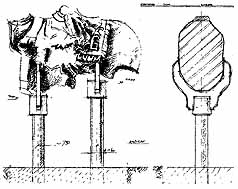_Neuenburg-Hofgestaltung: Sonderplanung - Bronzefuß für Skulpturenfragment_

Will der Planer aber unbedingt den "Stand der Technik" erreichen, fällt er oft auf Versprechungen des bauindustriellen Marketings herein, folgt den normgestützten externen Fachplanern, die jeder für sich alles daran setzen, möglichst hohe anrechenbare Kosten und davon abhängige Honorare für ihr Gewerk zu erzielen. Und der Gebäudeplaner kann sich dann darauf berufen, daß ja nur diese Tragwerks- und jene Heizungsnorm erfüllt werden mußten - was leider, leider teurer als gedacht wird. Krokodilstränen zu Hauf. Es kostet ja nur das Geld des sparsamen Bauherrn. Ätsch! Jetzt hat ihn der Billig-Planer in der Kiste und er kommt aus dem Würgegriff der Baukostensteigerung nicht mehr raus. Hau-drauf-Planung im Gleichschritt mit den standardverliebten Haustechnikplanern und normbrutalen Statikern anstelle Substanz und Kosten sparen. Tip zur Kostenexplosion von Anfang an: Fachplaner niemals in die Schranken verweisen! Der Bauherr wollte es ja nicht anders. Das Honorardrücken wird nun inkl. Zinsezins heimgezahlt. 
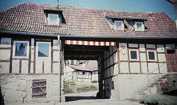.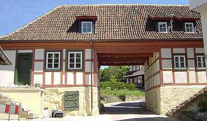_ 
Das Graitzer Torhaus in Marktzeuln - von der Ruine zum alten Schick - ohne Normenhörigkeit zu dennoch modernem Standard, ohne Kostenüberschreitung dank sorgfältigem Vorprojekt, dafür zu HOAI-Honorar._

[Themenlink: Instandsetzungsplanung und Konstruktionswahl - Grundsätze](11entwf.md#instandsetzungsplanung) 
Noch nicht genug? Dann hier weiter zur **[Fortsetzung](11erh17.md)**
