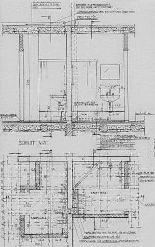
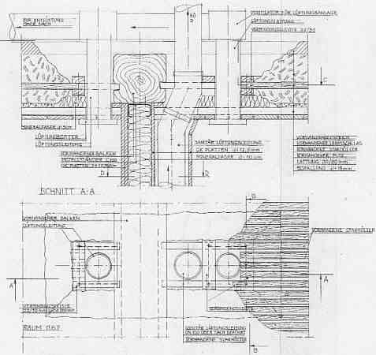
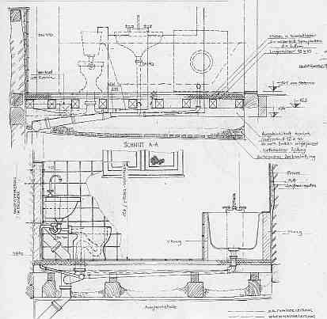

[🠔 Zur Übersicht: Sparsam sanieren](11erhins.md)  
# Heiztechnik-Planung - Haustechnikplanung & Kosten
**Anforderungen an die Haustechnikplanung und Technische Gebäudeausrüstung (Heizung, Lüftung, Klima, Elektro, Wasserversorgung, Abwasserentsorgung, Haustechnik-Fachplanung, Badplanung) im Altbau**  
_von Konrad Fischer_

## Heiztechnik-Planung - Haustechnikplanung & Kosten 
Anforderungen an die Haustechnikplanung und Technische Gebäudeausrüstung (Heizung, Lüftung, Klima, Elektro, Wasserversorgung, Abwasserentsorgung, Haustechnik-Fachplanung, Badplanung) im Altbau 
Sparsam Planen und Bauen im Altbau - Voraussetzungen und Methoden 1.17

Planauszüge und Fotos: 
[Konrad Fischer](1refernz.md), Hochstadt a. Main (soweit nicht anders angegeben) 

---

_Anhang_

### Technische Ausrüstung/Gebäudetechnik/Haustechnikplanung Technik-Fachplanung im Altbau und Baudenkmal

Vorbemerkung 
Nachfolgend einige tabellarische Übersichten zur Problemlage der Haustechnik / Technischer Gebäudeausrüstung und Lösungsoptionen, die sich selbst erklären und dem Bauherren einen schnellen Überblick bieten können. 

**Anforderungsvergleich Altbau/Neubau** 
PLANUNGSBEREICH / THEMA / PROBLEM 

ALTBAU

NEUBAU

Einschränkung durch Nutzung 

XXX

Unterschied Plangrundlagen zu Wirklichkeit 

XXX

X

Berücksichtigung vorhandene/geplante Baukonstruktion 

XXX

X

Berücksichtigung vorhandene/geplante Haustechnik 

XXX

X

Einschränkung durch unbekannte Bauteile und Haustechnik 

XXX

Einschränkung durch Denkmalpflege 

XXX

Brandschutzkonflikte 

XXX

X

Schadensrisiko Ausführung Haustechnik 

XXX

X

Schadensrisiko Technikauswirkung auf Bestand 

XXX

X

Analyse / Bestandsaufnahme / Detaillierung Baukonstruktion 

XXX

X

Bestandsaufnahme Haustechnik 

XXX

X

Schadensanalyse Baukonstruktion / Haustechnik 

XXX

X

Konflikte bei [Vertrags- und Honorarverhandlung](10hoai.md) 

XXX

X

**Bestandsaufnahme Haustechnik** 
Objektspezifisch erforderlicher Umfang abhängig von: Baualter, Baukonstruktion, Bauzustand, Sanierungsziel Baukonstruktion, Oberflächen, ortsfestes und mobiles Inventar, Risikopotentiale Bestandstechnik, Neutrassierung und Neuteile, Baugeschichte, Bauarchäologie 
Erhebungsbedarf/Bestandsaufnahme Abwasser Wasser Heizung Elektro Schutztechnik 
Trassenlage /-dimension Grundleitung, Leitungen im Bauwerk Grundleitung, Leitungen imBauwerk Leitungen, Luftheizungskanäle, Kamine Hausanschluß, Licht-/Kraftstrom, Niederspannung Blitz, Brand, Einbruch, Luftfeuchte 
Möglichkeiten Neutrassierung in/durch Bestand X X X X X 
Anlagenbestandteile Schächte, Revisionsklappen Wasserqualität, Filter, Entnahmeeinrichtungen Energielagerung/-zuführung, Heiztechnik, Abgasführung, Wärmeleitungssystem/-verteilung Hausanschluß, Licht-/Kraftstrom, Blitzfang, -ableitung, Erdung; Brandschutz, Einbruchmeldung, Luftfeuchtebegrenzung und -zufuhr 
Wiederverwendbarkeit Trassen / Bauteile X X X X X 
Modernisierungs- / Ergänzungsfähigkeit Trassen / Bauteile X X X X X 
Anforderungen Nutzer X X X XX X 
Anforderungen Baurecht X X X X X 
Anforderungen Denkmalschutz X X X X X 
Raumklimatische Anforderungen X X X 
Wirtschaftliche Anforderungen X X X X X 
Fördermöglichkeiten X X X 
Bedarf Nutzungseinschränkungen X X X X X 
Bedarf baurechtliche Ausnahmen / Befreiungen X X X X 
Bedarf Nutzungs- und Planungsänderungen X X X X X 

**Haustechnikplanung im Baudenkmal - Anforderungen**

**Die "ideale" (?) Haustechnikmodernisierung im Baudenkmal:**

- nicht sichtbar 
- nicht bestandsverletzend eingebaut (Leitungsverlegung und Anlageneinbau erzwingt Bestandsverlust) 
- nicht bestandsschädigend auf Konstruktion, Raumklima und Inventar wirkend -> Keine Haustechnik!? Keine / Eingeschränkte Nutzung? 
**Anforderungen an Planungsqualität**

- [HOAI-gerechte](10hoai.md) Planung gem. technischen, wirtschaftlichen und gestalterischen Anforderungen Nutzer, Baurecht (Brandschutz, Arbeitsrecht/BG/Gewerbeaufsicht, Denkmalschutz, Wasserwirtschaft, ...), DIN und VDI, ... 
- [VOB-gerechte Planung, Leistungsbeschreibung u. Ausschreibung gem. VOB/A - C](9pbs.md) 
- Bestandsgerechte Planung 
**Bedarf Detail-Planung und -Beschreibung im LV:**

- Durchdringungen Leitungstrasse - Bestand - Bohren, Fräsen, Schneiden! Stemmen? 
- Trassenparallelen und -kreuzungen, Trassenbündelung horizontal u. vertikal 
- Bauteilmontage in und/oder auf Bestandskonstruktion (Kamin-/Schacht-/Schlitznutzung vs. offene Vorsatzkonstruktion/Verblendung) 
- Bauteilankoppelung an Bestandstechnik 
- Bauablauf, Montageabschnitte 

So sieht das möglicherweise aus, wenn vom Architekten regiert:

 
_Nasszellenplanung für Technische Ausrüstung barocker Landgasthof_

 
_Nasszellenplanung Detail der Durchdringungen im Bestand_

 
_Nasszellenplanung in spätgotischem Ackerbürgerhaus_

Bei dieser Planungsintensität - und nur bei dieser! - hat der brave Handwerker freilich arge Probleme, seine gewohnte Nachtragsreiterei ins lukrative Ziel zu bringen. Und ein braver Bieter kann bei solchen LV-Anlagen ohne Risikozuschlag fair und preisgünstig kalkulieren - insbesonders, wenn die Leistungsbeschreibung dem [Positionsbausteinsystem](9pbs.md) folgt.

---

**[SiGePlan und -Ko](2sigeko.md):**

Anlagen- und bautechnischer Bauwerksschutz: 
- Hitze und Brand, 
- Erschütterung, 
- Transport, 
- Lagerung, 
- Tragfähigkeit, 
- Abfall, 
- Feuchte, 
- Frost, 
- Verschmutzung, 
- Staub, 
- Diebstahl, 
- Vandalismus und Personenschutz, - Unfall, 
- Lärm, 
- Staub, 
- Brand 

---

**Bau-/Inventarzerstörung durch ingenieurgestützte Umsetzung falscher Bauphysik und Normen:**

- Daten- und Rechengläubigkeit 
- "Ideales" Raum- und Museumsklima 
- Feuchtetheorie nach Künzel (Wasserabweisung) und Glaser (Dampfbremse) 
- [Aufsteigende Feuchte](2aufstfe.md) 
- [Sanierputz](2sanipuz.md) 
- [Wärmedämmung, Luftdichtheit und Energiesparen, EnEV](213baust.md) 
- [Heiztechniknormen](7temper.md) 

---

**Raumklimatische Problemstellungen** 
Bestand Raumklimatische Wirkung Störungen Gegenmaßnahme Problem 
Massivbau Temperaturamplitudendämpfung (TAV), Phasenverschiebung, Temperaturspeicherung Temperatur Raum > Außen Jahreszeitliche Klimaschwankung Heizung (Dauerbetrieb / zeitweiser Betrieb, konvektionsintensiv oder [strahlungsintensiv, präventive Konservierung](7temp17.md)?) Temperaturstreß, Auffeuchtung, Oberflächenverschmutzung, Bau-/ Betriebskosten 
Oberflächensorption Feuchtepufferung, Ausgleich Feuchteschwankung, Feuchtespeicherung, Luftfeuchte Raum > Außen Zutritt Außenluftfeuchte, Nutzungsfeuchte, Sorptionsdichte Oberflächen [Sorptionsfähige Anstriche](26bausto.md#7.+mineralische+untergrundvertrã¤gliche) Baukosten 
Inventarsorption Feuchtepufferung, Ausgleich Feuchteschwankung, Feuchtespeicherung, Luftfeuchte Raum > Außen Heizung -> Austrocknung Befeuchtungsanlage Auffeuchtung, Schädlingsbefall, Schimmel, SBS, Bau-/ Betriebskosten 
Belichtung Erwärmung Temperatur Raum > Außen Temperaturschwankung, Temperaturstreß Lichtschutz Kunstlichtbedarf, Veränderung Raum- / Fassadengestaltung, Bau-/ Betriebskosten 
Luftdurchlässigkeit Feuchtezutritt, Entfeuchtung Auffeuchtung Dichte Fenster und Türen, Abdichtung offene Kamine, Fugen Lüftung / Klimatisierung Auffeuchtung, Schädlingsbefall, Schimmel, Sick-Building-Syndrome SBS, Bau-/ Betriebskosten 
Luftverzehrende Raumheizung Entfeuchtung "Modernisierung" -> Auffeuchtung Lüftung / Klimatisierung Auffeuchtung, Schädlingsbefall, Schimmel, SBS, Bau-/ Betriebskosten 
[Einscheiben-/Verbundfenster](23bausto.md) Entfeuchtung "Modernisierung" -> Auffeuchtung Lüftung / Klimatisierung Auffeuchtung, Schädlingsbefall, Schimmel, SBS, Bau-/ Betriebskosten 
"Bescheidene" Nutzung Geringe Raumklimaauswirkung "Moderne" Nutzung Nutzungseinschränkung? Angepaßte Bausanierung und Haustechnik, [präventive Temperierungs-Konservierung](7temp17.md) Nutzeransprüche, Vorschriftengläubigkeit, Haftung, Mietrecht 

Soweit mal die Übersichten und Einsichten in die Thematik. Natürlich könnte man noch viel mehr dazu ausführen, wie sich der Bauherr zu seiner haustechnischen Ausstattung / Technischen Gebäudeausrüstung stellt. Geradezu unfaßbar und unüberblickbar viele Alternativen hat die einschlägige Bauindustrie dazu entwickelt und versucht sie mittels Normen, Werbung und gratifikationsgestützten Planern und Handwerkern an den Mann zu bringen. Hinzu kommen von der Baulobby hochprofessionell durch Incentivtechnik oder vielleicht auch nur plumper Bestechung benudelte Ministerialadministratoren und am Gesetzgebungsprozeß direkt oder indirekt beteiligte Politiker gesetzlich oder auf dem Verordnungsweg geforderte Technikausrüstungen wie teure Wärmemengenzähler (HeizkostenVO), SmartMeter-Einrichtung, gesundheitsschädliche Zwangsentlüftung mit ewigem Wartungsbedarf und routinemäßigem Filteraustausch, immer verrücktere Heiztechnik, die durch das Erneuerbare Energien Wärme Gesetz EEWärmeG in den Markt gepreßt wird und dem Bauherren eigentlich gar nichts, jedenfalls nichts wirtschaftlich Vertretbares liefert. 

Eine der letzten Refugien, in denen sich der geplagte Bauherr noch ganz nach seinem Geschmack austoben darf, ist das Badezimmer. Gottseidank. Und wenn tatsächlich ein letztes verfügbares Restchen im gesetzlich und von den untreuen Bauakteuren nach besten Kräften ausgezehrten Beutel geblieben ist, darf hier noch etwas Individualität und Lebensfreude, ja sogar Genuß und Ästhetik ausgelebt werden. Schauen Sie nur mal in die 1000e Katalogen und Zeitschriften, die die Badausstatter hierzu in Umlauf bringen und lassen sich verzücken, begeistern oder von Neid verzehren. Oder gleich ins Internet, gugeln Sie mal herum oder gleich auf [Calmwaters](https://www.calmwaters.de), wo über Planungshilfen die Entscheidung des hin- und hergerissenen Bauherren - natürlich auch der hier oft maßgeblicheren Baufrau unterstützt wird. Wenn es denn unbedingt sein muß, bis zur Bestellorder und dem späteren Management des Badetempels mit all seinen schnuckeligen Genußelementen hier, da und dort, die das badtägliche Leben des gehobenen Warmduschers und Privatthermenfans verschönern wollen. Da denken wir doch gleich an die einst so prachtvollen [Kaiserthermen in Trier](https://de.wikipedia.org/wiki/Kaiserthermen_\(Trier\)), oder? 

Noch nicht genug? Dann hier weiter zur **[Altbaugeeignete Reparaturverfahren und Alternativen zu zerstörerischen Sanierverfahren 1](11erhin2.md)**
