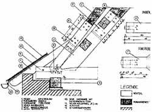
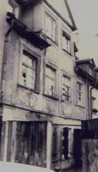
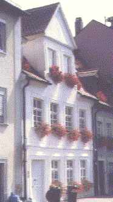
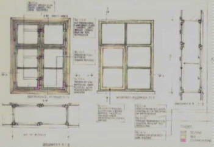
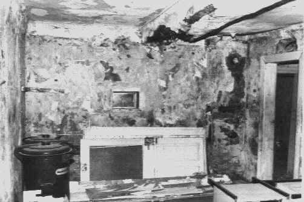
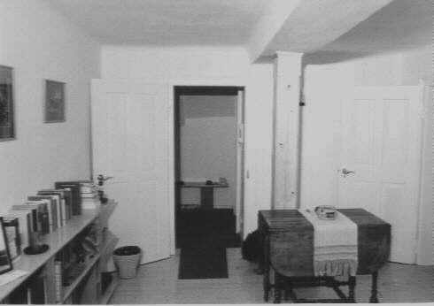

[🠔 Zur Übersicht: Sparsam sanieren](11erhins.md)  
# Altbausanierung, Denkmalschutz, Denkmalpflege, Bausanierung: Sparsam Planen und Bauen im Altbau - Die erhaltende Instandsetzung - Teil 2
**Altbaugeeignete Reparaturverfahren und Alternativen zu zerstörerischen Sanierverfahren.**  
_von Konrad Fischer_

> [!abstract]+ Kapitelübersicht: Reparieren statt Neu  
> 1. **Altbausanierung, Denkmalschutz, Denkmalpflege, Bausanierung: Sparsam Planen und Bauen im Altbau - Die erhaltende Instandsetzung - Teil 2**
> 2. [Sparsam Planen und Bauen im Altbau 2.2](11erhin3.md)
> 3. [Sparsam Planen und Bauen im Altbau - Die erhaltende Instandsetzung - Teil 3 und Schluß](11erhin4.md)

**[Die erhaltende Instandsetzung - Teil 1](11erhins.md)** 

Konrad Fischer** 
Altbausanierung, Denkmalschutz, Denkmalpflege, Bausanierung: Sparsam Planen und Bauen im Altbau - Die erhaltende Instandsetzung - Teil 2** 
Altbaugeeignete Reparaturverfahren und Alternativen zu zerstörerischen Sanierverfahren 1 

Ohne die bauphysikalisch, wirtschaftlich, technisch und gesundheitlich unsinnige [Wärmedämmung bei speicherfähigen Altbauten](6prwsch.md) wird zwar die EnergieEinsparVerordnung EnEV umgangen - für den Altbau, seinen Bauherrn, Bewohner und Planer bringt das aber Vorteile. Zum einen blockiert die Fassadendämmung außen Sonnenenergiegewinne, feuchtet zum anderen sowohl außen sowie als Innendämmung unweigerlich auf und provoziert Schimmel und Algenwachstum, zum dritten steigt die Raumluftfeuchte in isolierten Räumen, verbraucht mehr Heizenergie bei gleichem Temperaturniveau und begünstigt gefährliche Krankheitskeime. Fazit: Nur ohne EnEV-Maßnahmen gelingt eine Energieeinsparung.

Wie unmanipulierte Meßreihen der Lufttemperatur (Hohenpeißenberg u.a.), alte Hochwassermarken und der mittelalterliche Weinbau bis Norwegen beweisen, ist auch die angebliche globale Erwärmung nur ein [Schreckgespenst](7thuene1.md): gut für die Verhaltensmanipulation der Bevölkerung, die Umsatzentwicklung der Rückversicherer, die Hochentrüstung unserer Gutmenschen und die Ernährung der profitierenden Wirtschaftsbranchen und Wissenschaftler. Daß eine angebliche Temperatur-Rückstrahlung aus einer minusgrädigen CO2-Atmosphärenschicht zur Erderwärmung beitragen kann, ist freilich nur sehr vertrauensseligen Zeitgenossen beizubringen. Die vage Prognosekunst der Klimasimulanten muß mit Fug und Recht in die Rubrik Hofastrologie eingereiht werden. Leider begünstigt ihre Klimaapokalyptik staats- und bauherrnkassenleerende Subventionspolitik bzw. bußgeldbewehrten Dämmzwang. Die hier wissenswerten Zusammenhänge offenbaren z.B. der ehem. ZDF-Meteorologe Dr. Wolfgang Thüne, Mitarbeiter in einem deutschen Umweltministerium, in seinem Buch ["Der Treibhausschwindel"](http://www.treibhaus-schwindel.de) und der Bausachverständige Rolf Köneke (+) und seine Mitautoren in ["Unser Haus gesund instandsetzen"](8buch.md#unser haus gesund instandsetzen), ein immer noch aktueller Titel mit Beiträgen u.a. auch von Prof. Dr.-Ing. habil. Claus Meier und Dr. Wolfgang Thüne.

Ein [U-Wert](7fourier.md), der nach DIN 4108 nur im Labor gilt, führt in der Baupraxis zu Fehlkonstruktionen mit hohem Schadenspotential. Die übliche [Konstruktionsdurchfeuchtung ](7waefe.md)- der Regelschaden bei kapillarblockierenden und feuchteeinlagernden Dämmgespinsten und -schäumen! - soll nun durch blowerdoorgestützte Konstruktionsabdichtung vermieden werden, funktionieren kann das aber nicht. Bauwerke, ihre Verbindungen und Fugen werden sich immer bewegen, die künstlichen Abdichtungsmaterialien und Klebstoffe nach kurzer Zeit verspröden und ihre Dichtwirkung aufgeben - bis auf die Feuchteblockade zuungunsten der Bautrocknung. Daß übliche Dämmstoffe teils gar nicht dämmen können, zeigte das aufsehenerregende [Lichtenfelser Experiment](2139bau.md), inzwischen bestätigt ausgerechnet vom Fraunhofer Institut für Bauphysik (siehe Link). 

Daß die Wohnbevökerung trotz und wegen Klimatechnik an Allergien und Asthma verreckt, scheint die neuere Bauphysik nicht zu interessieren. Wie sich die Folgen der Barackenbauweise für die Rendite der Wohnraumbewirtschafter bemerkbar machen, zeigt wieder mal Amerika. Dort gehen die Sick-building-Prozesse mittlerweile ins Unermeßliche. Auch hierzulande fallen die Raumluft-Meßinstitute schon durch immer aggressivere Reklame auf - bis zur Prozeßbetreuung gehen ihre Dienstleistungen, Folge der mehr und mehr mieterfreundlichen Urteilspraxis unserer Gerichte.

Wie es um die Zukunft unserer mit Schaumgespinsten verklebten Altbauten aussieht, zeigen die aktuellen Schäden: 

Die entflammbaren Fassadenverpackungen - oft regelwidrig verbaut ([Baurechts- und Brandschutzskandal der WDVS](http://www.haera.de/) ) - verbrennen explosiv nach Erreichen der Zündtemperatur, die schon durch einen Brand im Müllcontainer schnell erreicht wird. Dabei sorgen die abtropfenden Dämmstoffreste für schnellsten Brandfortschritt im Wand- und Bodenbereich, die hochtoxischen Brandgase gefährden die Personenrettung und Flucht.

Nach der Fassadenbeklebung sinkt der Schallschutz auch guter Massivwände um bis zu 10 db, eine Freude an verkehrsreichen Wohnstandorten. Zusätzlich sorgen auch die neuen Isofenster für dramatisch schlechteren Schallschutz. Die aktuelle Manipulation der Normwerte beim Fensterschall kann eben nicht verhindern, daß die klassischen Fensterkonstruktionen hier weit überlegen sind und bleiben.

Die wachsende Reklame für Fassadenschabgeräte verrät, wo die schnell gerissene, feucht-schimmlige Wandverpackung letztlich bleibt: im Sondermüll. Probleme bieten allerdings die immer besseren Zement-Kunstharzkleber für Dämmstoffe: sie hinterlassen zerstörte Wandoberflächen. Alternative Sanierung bietet die Zementindustrie: Man flext die Dämmstoffpackung im Fliesenmuster auf, versucht die Trocknung der sollgemäß absaufenden Dämmung (Höchstwerte bei praktischem Feuchtegehalt, ca. 30 mal höher als ein Ziegelstein!) und verputzt mit patentiertem Zementmörtel.? Sicher gibt es bald eine Norm dafür, an die sich unsere Schwachverständigen wieder festklammern können. Ob das die ökogerechte Lösung ist?

Auch die werbende Angabe irgendwelcher Dampfdiffusionswerte für Baustoffe an Dach und Wand ist eine markttypische Irreführung:

Im Bauteil liegt schon ab ca. 65% relativer Luftfeuchte jede Nacht einkondensierende bzw. durch kapillaraktive Rißnetze und Fugen bei Regen eindringende Feuchte immer flüssig, nicht dampfförmig vor. Und das entgegen der genormten Auslegung des Glaser´schen Berechnungsverfahren vorwiegend im Sommer, bei maximaler Luftfeuchte und höchstem Niederschlagsaufkommen. Eingedrungene Feuchte bleibt deswegen in "modernen" Konstruktionen eingesperrt. Da hilft auch kein wasserabweisender Kunstharzputz, keine Silikonharztunke und keine Hydrophobierung, die alle als Trocknungsblocker funktionieren.

Gegen [Schimmelpilzverseuchung](7wsvoant.md) als Folge des Abdichtens, Dämmens und lufterhitzender Konvektionsheizung ist ein Altbau nur geschützt, wenn traditionell bewährte Bau- und Haustechnik eingesetzt wird. Die Verdächtigung nicht vorhandener Wärmebrücken als Schimmelursache begünstigt Fehlkonstruktionen - inkl. Schimmel! Eine Betonbalkonplatte ist nämlich ein Massivabsorber, eine Außenwandecke speichert besonders viel Solarenergie! Nur die strömungstechnisch bedingte Unterversorgung mit Heizluft an den Raumecken und -kanten führt in Verbindung mit isofenstergestützter überhöhter Raumluftfeuchte zu Nässe und Schimmel an den unterkühlten Bauteilen.

Gegen die angeblich ["aufsteigende" Feuchte](2aufstfe.md) im Keller, in Wirklichkeit meist Kondensat, Geländegefälle zum Haus oder aus undichten Grundleitungen, kann [Saniersperrputz](2sanipuz.md) nichts helfen. Auch die sinnlose Zerstörung durch Injektagen, Riffelbleche usw. darf eingespart werden. Schon witzig, was hier expertengestützt Geld und Substanz kaputtgebaut werden. Erst Asphaltanstrich, dann Luftkanal am Sockel und Röhrcheneinbau im Wandquerschnitt, dann wunderlichste Entsalzungsanlagen, dann Sanierputz, dann Mauersäge, dann Verpressung mit Wasserglas, dann Gift-Silikonsuppe, dann Paraffin, dann alles wieder von vorne? Da sind einem fast die Zauberkästchen lieber. Sie machen wenigstens nicht so viel kaputt und sind verhältnismäßig preisgünstig. Ob sie wirken? Mindestens so wie die anderen grundsätzlich unwirksamen Techniken. Die anlagentechnisch (z.B. durch [Hüllflächentemperierung als Strahlungsheizung](7temper.md) im Unterschied zur schädigenden Konvektionsheizung) und baukonstruktiv (z.B. Leitungsinstandsetzung, Lehmabdichtung, Verputz mit [Luftkalkmörtel](2eurolim.md)) sinnvollen Entfeuchtungsmaßnahmen müssen die tatsächliche Schadensursache berücksichtigen. Daran hapert es doch meist, auch bei doktorengestützten "Analysen" und institutsbesiegelten Datenpfunden aus dem Atomgerüst der Ursubstanz des Bauwerks.

Temperierleitungen-Detailschnitt Auch die normgerechte Hausvergiftung mit toxischem und schon mittelfristig wieder unwirksamem Holzschutz muß auf den Prüfstand: Es geht auch [ohne Gift](2hsm.md). 

Selbst zur Nachgründung mit HDI-Verfahren, seitlichen Betonbalken und Bohrpfahlkonstruktionen oder gar mauertechnischen Unterfangung gibt es inzwischen schonendere und wirtschaftlichere Alternativen: Stopf- und Expansionsverfahren zur Verfestigung des Fundamentbereichs. Die historischen Fundamente bleiben dabei unberührt, keine salzhaltigen Gele oder Zement-/Traßsuppen erweichen den Baugrund, kein bodenarchäologisch wertvolles Material wird entnommen - bei voller Reversibilität der Maßnahme.

Kloster Waldsassen, Stopfverfahren - Detailschnitt durch historisches Fundament (Außenabdichtung mit Lehmpackung als Braune Wanne) 

Morsche Sparrenfüße werden oft viel kostengünstiger querschnittsgetreu ergänzt. Das häßliche und teure Beilaschen bleibt statischen Ausnahmesituationen vorbehalten.

Schloß Eisfeld, Dachfuß - querschnittsgetreue Reparatur, Ausführung: Fa. Ribas, Arnstein

Historische Fassaden- und Innenputze können bei der Anwendung von [Luftkalkmörtel](6prxratg.md) und Rohrmattenputz kostengünstig erhalten werden. Dies gilt auch für Anstriche, die mit kunststofffreien[Sumpfkalk-Kaseinfarben](2kalkfrb.md) ohne Einschränkung der Konstruktionsentfeuchtung zu ergänzen bzw. zu erneuern sind. Derartige Farbsysteme bieten auch die wirtschaftlichste Möglichkeit auf Naturstein und mineralischem Neuputz. Die typischen Schäden durch dispersive und silikathaltige Farbsysteme - Schichtenabriß, Versprödung, Kapillarrißdurchfeuchtung mit nachfolgender Feuchteblockade und Oberflächenkorrosion, bei kunstharzhaltigen Systemen zusätzlich Algenbewuchs und vorzeitige Verschmutzung, werden dann vermieden. 
Verwahrlostes, barock überformtes spätgotisches Bürgerhaus 1984...... und acht Jahre nach kostengünstiger Reparatur (1985-87) durch weitestgehende Erhaltung des Bestands mit traditionellen Bauweisen (Fassade nur mit Kalkschlämme ergänzt, Barockfenster vollständig erhalten und mit Leinölfarbe langfristig geschützt. 

Natürlich keine nachträgliche Horizontalisolierung trotz nur 30 cm einbindenden Fundamenten und Lage am Flußufer. Keine schädlichen Dämm- und Dichtmaßnahmen. Keine wassersperrenden Fassadenanstriche, sondern reine [Kalkkaseinfarbe](2kalkfrb.md). Umsetzung des büroeigenen [Raumbuchsystems zur technischen Bestandsaufnahme ](11rabus.md)in den folgenden Planungsphasen.

Barockfenster vor ...... und nach Reparatur und Ergänzung durch Innenfenster 

 
Detailpläne mit Maßnahmen-Beischriften sind die Voraussetzung, auch komplizierte Restaurierungsarbeiten eindeutig und unbeschränkt öffentlich auszuschreiben und damit auch wirtschaftlich durchzuführen (Beispiel: Fensterrestaurierung anstelle Erneuerung).

Innenraum Vorzustand ...... und in neuer Nutzung. 
Dabei wurden alle Altputzflächen unter kostengünstigen Rohrmattenkalkputzen erhalten. Dies ersparte umfangreiche Schlitzarbeiten in der Fachwerkstruktur und Zerstörung der teils mit spätgotischer Malerei gefaßten Raumschalen.

Das eingefügte Türblatt war im Haus an anderer Stelle entbehrlich. Die teils sehr niedrigen originalen Raumhöhen (ca. 210 cm) und Türsturzhöhen (ca. 175 cm) werden von den Mietern klaglos akzeptiert. Die Holzstütze ersetzt die beim barocken Umbau entfernte Innenwand. Dadurch konnte der im Gutachten eines "Denkmalstatikers" vorgeschlagene Ersatz aller originalen teilgeschädigten Holzbalkendecken gegen Stahlbetondecken entfallen. Die Stütze wurde vom Bauherrn in Eigenleistung eingebaut.
