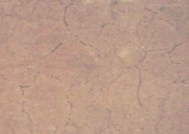
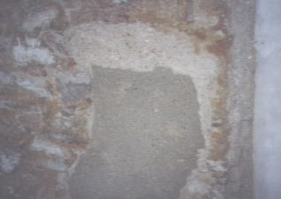

[🠔 Zur Übersicht: Reparieren statt Neu](11erhin2.md)  
# Sparsam Planen und Bauen im Altbau 2.2
**Altbaugeeignete Reparaturverfahren und Alternativen zu zerstörerischen Sanierverfahren - Fortsetzung**  
_von Konrad Fischer_

**[Die erhaltende Instandsetzung - Teil 1](11erhins.md)** 
**[Die erhaltende Instandsetzung - Teil 2.1](11erhin2.md)** 

Konrad Fischer 

## Sparsam Planen und Bauen im Altbau

Die erhaltende Instandsetzung - Teil 2.2

## Altbaugeeignete Reparaturverfahren und Alternativen zu zerstörerischen Sanierverfahren - Fortsetzung

Kunststoffvergütete Baustoffe halten im Altbau meist nicht, was sie versprechen. Regelmäßig verursachen sie Schäden durch vorzeitige Versprödung und Verschmutzung, übermäßige Abdichtung und Entfeuchtungsblockade der immer flüssig (nicht dampfförmig) im Bauteil vorhandenen Nässe. 
Erneuerte Schloßfassade, abgedichtet mit Dispersionssilikatfarbe (Mineralfarbe) auf Sanierputz - Zustand nach einem Jahr 
Detail am gleichen Objekt 

Auch [silikat-/wasserglashaltige Fassadenprodukte](22bausto.md) schädigen den Bestand durch übermäßige Festigkeits- und Abdichtungsentwicklung ebenso wie Silikonharzfarben - ganz im Gegenteil zur Produktwerbung. 

Luftkalk-Ergänzungsmörtel für Natur- und Ziegelstein, reine [Ölfarben auf Holzoberflächen](2oel.md) (Fenster), rein [mineralische, zement-, hüttensand- und traßfreie Baustoffe](2eurolim.md) mit geringem Feuchterückhaltungsvermögen wie Luftkalkmörtel und Ziegel - handwerklich richtig eingesetzt - erfüllen ihren Dienst am Bauwerk zuverlässiger. Sie genügen damit auch den denkmalpflegerischen Vorstellungen von anständiger Alterungsfähigkeit - sie opfern sich für den Bestand. Wenn die regelmäßig desolaten Kunstharzbeschichtungen früherer Anwendungen wieder entfernt werden müssen, gefährden mechanische und thermische Verfahren den Bestand (z.B. Malgrund, Fensterglas) oft erheblich. Mit CKW-freiem Entlacker und Abbeizpasten gibt es schonendere und wirtschaftlichere Verfahren. Nur die Verwendung geeigneter Baustoffe sichern die wirtschaftlichen Vorteile einer Sanierung auch langfristig, von der Massivwand bis zum Fenster. 

Klosterfassade in reiner [Silikatfarbentechnik ](22bausto.md)- scheinbar in Ordnung nach alter Väter Sitte - bonbonfarbene opake Wasserglasfärbelung teils nach Befund des 19. Jhs. ... 
... doch bei näherer Betrachtung: Aufplatzende und craquelierende durch Wasserglasbehandlung überfestigte und überdichte Putz- und Farbschollen, . .darunter mehlende aufgefrorene Originalkalkmörtel->.. 
Deswegen: Abnahme der zerstörten Schollen und mehlenden Altputze bis auf tragfähigen Grund: 
Originaler Unterputz, teils zwar mit Schwundrissen durchzogen und hohlklingend oder Restflächen mürber graugefärbter Sichtputzfragmente ... 
...dennoch zur Wiederverwendung geeignet als Untergrund für neuen Putzaufbau mit [Luftkalkmörtel](2kalk.md), nach Erstbefund gestrichen mit [Fresko-Kalkfarbe/Kalktünche](2kalkfrb.md) in tagwerksgerechter Freskotechnik: 
Preisgünstig reparierte [Luftkalkmörtel](2kalk.md)-Fassade nach vierjähriger (1995-1999) Standzeit im rauhen oberpfälzischen Mittelgebirgsklima. Vergabe aller Arbeiten nach unbeschränkter öffentlicher Ausschreibung gem. VOB im [Positionsbausteinsystem](9pbs.md). 
Fassadendetail mit reicher Architekturgliederung und gestaltenden Putzstrukturen nach 4 Jahren Standzeit. Fazit: Es geht auch ohne puren Sílkatanstrich oder gar trocknungsblockierende Silikat-Dispersionsfarbe, die unverschämterweise unter dem Tarnbegriff "Mineralfarbe" in den Handel gelangt. 

---

**[Die erhaltende Instandsetzung - Teil 3 und Schluß](11erhin4.md)**
