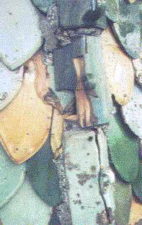
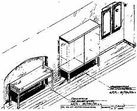

[🠔 Zur Übersicht: Reparieren statt Neu](11erhin2.md)  
# Sparsam Planen und Bauen im Altbau - Die erhaltende Instandsetzung - Teil 3 und Schluß
**Kostengünstige Maßnahmenplanung mit/ohne DIN-Norm-Ausnahme, EnEV-Befreiung, Kostensichere Ausschreibung & Baudurchführung**  
_von Konrad Fischer_

**[Die erhaltende Instandsetzung - Teil 1](11erhins.md)** 
**[Die erhaltende Instandsetzung - Teil 2.1](11erhin2.md)** 
**[Die erhaltende Instandsetzung - Teil 2.2](11erhin3.md)** 

Konrad Fischer 

## Sparsam Planen und Bauen im Altbau - Die erhaltende Instandsetzung - Teil 3 und Schluß 
Kostengünstige Maßnahmenplanung mit/ohne DIN-Norm-Ausnahme, EnEV-Befreiung, Kostensichere Ausschreibung & Baudurchführung

 
Natürlich kann auch mit schlechten Kalkmörteln - hier ein von der Denkmalbehörde rezeptierter salzreicher Traßkalkputz - alles schiefgehen. Schadenssumme: 125.000 EUR. Es braucht eben [handwerkliches Wissen und Erfahrung](2kalkfel.md), um reine Luftkalkmörtel im Sinne historischer "Hochleistungsputze" (Prof. Wittmann) zu rezeptieren und zu verarbeiten. Das heißt aber nicht, daß die Industrieprodukte der Trockenmörtelbranche zuverlässiger sein müssen: 

Abplatzende [Sanierputzscholle ](2sanipuz.md)an einem Mauerpfeiler der gleichen Wand 

Die Verarbeitungsvorteile "moderner" Produkte für den Handwerker sind regelmäßig mit letztlich entscheidenden wirtschaftlichen, technischen oder denkmalpflegerischen Nachteilen erkauft. 
Hohles Burgmauerwerk. Verfugt und verpreßt mit salzarmem und elastischem [Luftkalkmörtel.](2kalk.md) In Bildmitte zweireihige Auslässe der Verfüllstutzen. 

Entfestigtes und im Verbund gestörtes Bogenscheitel-Mauerwerk - über noch herausstehende Verfüllkanülen substanzschonend verpreßt und neuverfugt mit natürlich vergütetem [Luftkalkmörtel 0-0,5. ](2kalk.md)In der Mitte oben Ankerplatte für verzinkten Stahlanker. Auch Ankerkanal verpreßt mit Luftkalkmörtel. 

Zwingerstützmauerwerk. Reparatur Mauerfehlstellen, Krone und Fugen mit Luftkalkmörtel, Körnung 0-2/4cm. Arbeiten teils im Winter. Nachverfugung im Frühjahr etwa fünf Eimer Mörtel, da zu schnell erfolgende Fugennachverdichtung (Bindemittelanreicherung an Oberfläche mit abdichtender Krustenbildung!). 

Ravensburg, Grüner Turm mit gotischer Glasurziegeldeckung. Zerstörung der Flächen- und Gratziegel durch zu starre, dichte und schadsalzhaltige zementäre Dachdeckermörtel (Bild: Architekt Dipl.-Ing. Bruno Siegelin, Herdwangen) 

Instandsetzung und Neuvermörtelung der Grate mit [Luftkalkmörtel ](2kalk.md)(Architekt und Bild: Dipl.-Ing. Bruno Siegelin) 

Grüner Turm nach Abschluß der Reparaturarbeiten (Architekt und Bild: Dipl.-Ing. Bruno Siegelin) 

Was könnten wir von den Schadenssachbearbeitern der Baustoffindustrie lernen! Der Ingenieur muß also eigenverantwortlich Reklame von Fakten unterscheiden. Natürlich gilt das auch für die DIN-Normen. Sie sind laut höchstrichterlichem [Urteil des Bundesverwaltungsgerichts vom 22.5.1987](2mbu.md) ja nur "Vereinbarungen interessierter Kreise ... die eine bestimmte Einflußnahme auf das Marktgeschehen bezwecken". DIN selbst sagt dazu in jedem DIN-Taschenbuch: "Durch das Anwenden von Normen entzieht sich niemand der Verantwortung für eigenes Handeln. Jeder handelt insofern auf eigene Gefahr." 

Folglich: Keine vertragliche Zusicherung von bautechnisch und wirtschaftlich schädlichen "Normeigenschaften" - weder im Planungs- noch im Bauvertrag! Bezüglich des [Dämmwahns ](7wdvs05.md#wã¤rmedã¤mmung)bedarf es sogar zusätzlich noch eine [Ausnahme/Befreiung von den Rechenvorschriften der EnergieEinsparVerordnung (EnEV)](2wsvoant.md). Dank Energieeinsparungsgesetz und entsprechender Ausnahmeregelungen ist das aber kein großes Problem. So müssen wir den verkaufsfördernden Normen der bauwirtschaftlichen Interessensverbände immer mißtrauen. Sie begünstigen z. B. technisch katastrophale Isolierfenster gegenüber den konstruktiv und bauphysikalisch überlegenen Holzkonstruktionen bewährter Bauart. Holzflächen sollten aber mit harzfreien Ölfarben gestrichen werden, sonst sind Beschichtungs- und nachfolgende Holzschäden vorprogrammiert, wie die folgenden Bilder eines zwei Jahre alten Alkydharzanstriches zeigen.

 
Schadensbild: Blasenbildung innen. 

 
Schadensbild: Kittversprödung und Anstrichversprödung außen 

 
Schadensbild: Blasenbildung und Anstrichversprödung außen 

Ausschreibungsvergleiche zeigen: Auch im Reparaturfall sind Altfenster meist die wirtschaftlichste Lösung. Deren korrodierte Kunstharzanstriche, meistens Urprung ihres schlechten Zustandes und der Sehnsucht nach dem Plastikfenster, entfernt man übrigens wirtschaftlicher und schonender mit CKW-freien Abbeizern als mit den substanzgefährdenden Laugen oder mechanisch-thermischen Verfahren. 
Sonderplanung - Museumsvitrinen, Beleuchtung und Textträgertafeln im Bestand ** 

5. Maßnahmenbeschreibung und Kostenplanung**

Was der Gebäudeplaner bzw. Fachingenieur zu seinen Planungsabsichten schreibt und zeichnet, versteht der Handwerker meist anders oder gar nicht. Im Studium wurde die [VOB-gerechte Leistungsbeschreibung](9pbs.md) nicht gelehrt. Auch nicht das für jeden Bauherrn vorteilhafteste [öffentliche, unbeschränkte Ausschreiben](9cadava.md#ã–ffentlich). Und wer liest später die einschlägigen VOB- und HOAI-Kommentare? . 

Deswegen mißbrauchen wir auftragshungrige Handwerker, Produzenten und deren Preislistenautoren (Standardleistungsbuch usw.) als Textlieferanten. Denen fehlt es aber an Kenntnissen des Bestands und der VOB - mangels qualifizierter Bestandsaufnahme und allgemeiner [Vergabekompetenz](4behoerd.md#3. vob). Sie arbeiten marketingorientiert, wollen Auftrag und [Produktplacement](9cadava.md). Der Bauherr und der Bestand interessieren sie nur als Gewinnchance. 

Bauherrn bekommen meistens gar nicht mit, wenn der [Planer derartige "Umsonst-Fremdleistungen" - vielleicht sogar nach "Versteigerung an Meistbietend" anwendet ](10hoai.md)und obendrein Honorar dafür verlangt. Sie hoffen, ihr [schlechtes Vertragsangebot an den Planer](10hoai.md) könnte ohne mißliche Folgen bleiben. Dem ist nicht so! Schlechte Planung, überhöhte Baupreise und Nachträge - sogar Erhöhung des baukostenabhängigen Planungshonorars oder gar mafiöse Praktiken sind die logische Folge. 

Mißverständliche und unvollständige Leistungsbeschreibungen stören den Informationsfluß vom Planer zum Handwerker. Das erschwert den Bauablauf. Plötzlich - aber eigentlich vorhersehbar - taucht zusätzlicher Leistungsbedarf auf. Von den dafür durchgesetzten Nachträgen überlebt dann der Handwerker, der zunächst auftragshalber zu geringe Preise angeboten hatte. Hier sind Firmen zu beobachten, die unter Vorspiegelung von besonders schnäppchengünstigen Leistungen oder Lieferungen (Fenster!) ihre Aufträge zugeschustert bekommen. Danach drehen sie fleißig an der Nachtragsschraube. Dabei wird auch nicht die kleinste Gelegenheit ausgelassen, oft sogar in raffinierten Angebotstricks erst mal sorgfältig konstruiert. Bekommen aber solche Firmen eine auftraggeberseitige Leistungsbeschreibung, die streng nach VOB alle Nachtragsschotten dicht macht, geben solche schwarze Schafe immer höhere Preise ab, als der seriöse Wettbewerber. 

Bei noch billigeren "Schwarzarbeitern" - gern gesehen auf Burgen und Schlössern, in Villen und Herrenhäusern, aber auch im allgemeinen Wohnungs- und Gewerbebau, "stimmt" zwar der Stundenlohn. Der Witz liegt dann aber in den verbrauchten Stunden, gegen die sich der Bauherr, hat er sich einmal auf solche Schweinereien eingelassen, nicht mehr wehren kann. 

Die Bemühungen um niedrige Baukosten müssen also nicht nur am Maßnahmenumfang ansetzen, am Vermeiden sinnloser Eingriffe, an der ganzheitlich qualitätsbewußten technischen, vertrags- und genehmigungsrechtlichen Ausschaltung sinnlos teurer "Vorschriften". Am wichtigsten ist letztlich die kostendämpfende und von Nachtragsforderungen nicht knackbare Beschreibungs- und Vergabetechnik für die Bauleistungen mit Einheitspreisleistungen. Mit der funktionalen Ausschreibung oder Angebotseinholung von Lieblingsfirmen des Planers gelingt das nie, auch wenn das sogar institutionelle Auftraggeber recht fleißig üben. Zu hoch sind dort die Risikozuschläge, zu abgefeimt die Nachtragsstrategien, zu grottenschlecht die Planungen, um echte Baukostenersparnisse zuzulassen. Wobei die Tricksereien zwischen untreuem Planer und Handwerker meist die auftragssichernde "Nullposition" bemühen: von vornherein nicht auszuführende Leistungen werden in den Ausschreibungstext bugsiert, mit Minipreis gegenüber den uneingeweihten Mitwettbewerbern geboten und dann mit teuersten Nachträgen oder 1-Stück- bzw. 1-qm-Angebotsposten, die bei der Angebotswertung mengenmäßig "unter den Tisch fallen", maximal abgerechnet. Der Gewinn wird geteilt.

.  
Barockes Fachwerkhaus Vorzustand (30 Jahre Leerstand, schwerste Bauwerksschäden) und nach Reparatur und Modernisierung (Vier Gästeappartements). 
Das Gebäude wurde ca. 50 cm zur Fußschwellensanierung angehoben und danach wieder abgesenkt. Sämtliche Gefacheputze konntend abei durch Papierkaschierung erhalten und, wo erforderlich, mit Luftkalkmörtel - innen in Rohrmattenputztechnik - ergänzt werden. Nach Dachfußreparatur Neueindeckung durch den Bauherrn mit den originalen Rinnenziegel nach Bestehen der "Klangprobe". Anstriche Kalkkasein und Leinölfarben. Heizleitungsführung an Außenwänden, z.T. Sockelheizleisten. Der Kostenvoranschlag konnte durch VOB-gerechte Ausschreibung aller Fremdleistungen um ca. 100.000 EUR unterschritten werden. Wer die Planungsqualität üblicher Leistungsbeschreibungen prüft (eigentlich die perfekte Entscheidungshilfe zur Planerauswahl), wird sofort bemerken, daß sowohl standardleistungbuchfolgende wie auch produzentenmäßige Ausschreibungstexte in keiner Weise den Anforderungen an wirtschaftlich und technisch einwandfreie Vergabe genügen. 

Das Positionsbausteinsystem [„PBS“](9pbs.md) beschreibt die Bauleistungen schon während der Entwurfsphase. So entsteht eine zuverlässige Projektgrundlage: Die Maßnahmenbeschreibung mit Kostenberechnung nach Gewerkeinzelleistungen. Die Ordnung von Kostendaten nach Eigen- und Fremdleistung, nach modernisierungs- und erhaltungsbedingtem Aufwand, oft Vorausetzung komplizierter Finanzierungsmechanismen, kann so besser gelingen. Dies betrifft auch die Einzelpreisverfolgung bei der Kostenkontrolle von der Planung zur Abrechnung. Im Unterschied zu üblichen Texten fordert das System die Einbindung der technischen Bestandsaufnahme. Inhalt und Form der Leistungsbeschreibung werden nicht nur oberflächlich wie im Standardleistungsbuch, sondern für alle Textelemente nach einer klar verständlichen Textlogik und -hierarchie vorgegeben. 

Wesentliche Vorteile bieten die vom System geforderte Risikobeschreibung im Bestand und die Zielorientierung der Leistungsbeschreibung. Damit werden diese kostenverursachenden Einflußgrößen VOB-gerecht erfaßt. Im Unterschied zu den üblichen Beschreibungsmethoden gibt unser 'Positionsbausteinsystem' den Textinhalt und die Form der Bestands- und Leistungsbeschreibung aus 12 logisch gegliederten Positionsbausteinen vor. Wesentlich: Das Ergebnis der Bestandsaufnahme muß ausführlich, aber in technisch knapper Sprache, beschrieben werden. Aus mangelhafter Bestandsvorgabe entwickeln sich falsche bzw. unvollständige Planungsergebnisse und damit fast alle Nachträge. Deswegen fordert das System eine detaillierte Beschreibung des Bestands, seiner Mängel und den daraus abzuleitenden Handlungsbedarf. 

Vorrangig wird dann das Leistungsergebnis und erst nachrangig die dazu gehörende Arbeit gefordert. Damit sind Nachtragswünsche und Spekulationspreise kaum noch durchzusetzen, da die Mitwirkungspflicht des Bieters konkret abgefragt wird und die im Bestand liegenden Anforderungen nahezu vollständig vorgegeben werden. 

Nur eine eindeutige und vollständige Information, logisch nach dem Bedeutungsrang und danach von Grob nach Fein geordnet, sorgt für die klare Verständigung unter den Beteiligten. Das verhindert kostentreibende Risikozuschläge der Bieter und überraschende Nachträge. Die qualitativ überzeugendsten Bieter setzen sich bei dieser Beschreibungssystematik durch. Sie können am sichersten kalkulieren und erhalten regelmäßig den Zuschlag auf das niedrigste Angebot. Spekulanten schreckt die genaue Leistungsbeschreibung ab - mit zwölf systematisch vorgeschriebenen Informationsebenen (Positionsbausteinen), ca. 50 untergliedernden Einzelinformationen und die Beilage aller wichtigen Übersichtspläne und Details. Sie kalkulieren mangels nachtragsfördernder Beschreibungslücken zu hoch oder geben überhaupt kein Angebot ab. 

Nebenbei prüft das System die Qualität, da es Planungsfehler vor der Ausführung aufdeckt. Vergessene oder fehlerhafte Informationen fallen in einem geschlossenen System schneller auf als im willkürlichen Aufbau der üblichen Beschreibungsmethoden. Die damit besser kontrollierbaren Arbeitsergebnisse erleichtern die bürointerne Qualitätssicherung. Inzwischen gibt es das System auch als Tool/Ergänzung zur gewohnten [AVA-Software ](9cadava.md)(Hersteller: [Fa. Crusius, Regensburg](http://www.avavision.de)). 

Diese Methodik steht im Gegensatz zu üblichem Vorgehen: Schlechte Bestandsaufnahme, oberflächliche Planung, Ausarbeitung mangelhafter Ausschreibungsunterlagen teils durch befreundete Firmen, Vergabe an die erst "billigsten", später raffiniertesten Nachtragsschinder, Terminverzögerungen und Nachträge, weil nichts "paßt", kräftige Kostenexplosion - auch des Planungshonorars trotz ersparter Aufwendungen, viele Mängel trotz versuchter "Vorschriftenbefolgung" und nervende Bauprozesse zum Maßnahmenabschluß. Vorzugsweise zu Honorarzone 0 Mindestsatz für den Planer. 

Natürlich kann mit einem solchen Ausschreibungssystem alles öffentlich und unbeschränkt ausgeschrieben werden. Das gilt auch für komplexe Restaurierungsleistungen, deren Arbeitsabläufe natürlich rechtzeitig durch Muster abzuklären sind. Der fachliche Qualifikationsnachweis der Bieter bis zur bezahlten Bemusterung am Objekt muß allerdings in den Vorbemerkungen als Wertungskriterium aufgenommen werden, um Dumpingangebote von Luschen ausscheiden zu können. 

Ein typisches Großproblem ist auch die verweigerte Mitwirkung des Tragwerksplaners an einer bestandsgerechten Planung. Er spart regelmäßig seine Grundleistung "Aufstellen von Leistungsbeschreibungen als Ergänzung zu den Mengenermittlungen als Grundlage für das Leistungsverzeichnis des Tragwerks" ein. "Das haben wir noch nie gemacht" ist die Ansage, wenn ein kenntnisreicher Planer nach dieser unverzichtbaren Grundleistung fragt. Dabei müßte hier eine vollumfänglich - also mit zugehöriger detaillierter Werkplanung in Dreitafelprokjektion, Wandabwicklungen, Deckenaufsichten usw. - VOB-gerechte Leistungsbeschreibung gem. Anforderungskatalog VOB/A §9 erfolgen, die jeder im gleichen Sinne verstehen muß. Nur gute Tragwerksplaner wissen, was das heißt und kassieren die altbautypischen Honorarzuschläge zu Recht. Die anderen suchen und liefern Ausflüchte. Also: Finger weg von Tragwerksplanern, die noch nie eine qualifizierte Leistungsbeschreibung abgeliefert haben (Belege vorlegen lasssen!). Andernfalls muß der Planer nachbessern. Dafür einen Honoraranspruch durchzusetzen, ist nicht gerade die leichteste Übung. Prinzipiell gilt die Forderung nach bestandsgenauer Planungsdetaillierung auch an die anderen Fachplaner. Bekommen wird man sie auch von dort nur mit viel Nachdruck, wenn überhaupt. 

Auf die mißbräuchliche Handhabung der Ausschreibung im Korruptionsfall, gar nicht so selten bei den mindestsatzunterschreitenden Planern, kann hier nicht weiter eingegangen werden. Nur so viel: Suchen Sie nach verbotenen Vorgaben für vergleichbare, sog. 'homogene' Produkte und achten Sie auf wertungsverfälschende Luftpositionen für nicht erforderliche Bauleistungen. Und zwar am besten, bevor der Rechnungsprüfer das tut und die Fördermittel zurückfordert.

Fazit:

Allein mit einer guten Ausschreibung könnte der Planer das zigfache seines Honorars einspielen. Oder eben nicht.

**6. Bauablauf**

Das Positionsbausteinsystem verringert dann im Bauablauf das Kostenrisiko. Termine und Zahlungen können damit besser organisiert werden. Das hilft auch weiter entfernte Projekte mit [Bauleitung ](11baulg.md)zu betreuen.

Der Bauleiter muß aber auch die Bestandssicherung durch Schutzkonstruktionen, Baustellenordnung, Überzeugungsarbeit bei allen Beteiligten und Fortschreiben der Planung immer wieder verteidigen. Zusätzlich zu den inzwischen vorgeschriebenen [Aufgaben der Sicherheits- und Gesundheitsschutz-Koordination gem. Baustellenverordnung](2sigeko.md). Vieles, was vor Baubeginn erdacht wurde, muß dann im Bauablauf nochmals auf den Prüfstand. Eine systematische Bauvorbereitung liefert dafür die erforderlichen Zeit- und Kraftreserven.

Und genau darum geht es, wenn im Bauablauf der gerade bei öffentlichen Vergaben oft unvermeidbare Krieg mit unbekannten Firmen um die kostenexplosiven Nachträge entbrennt, um falsche, nicht prüffähige Handwerkerrechnungen, um unberechtigte Forderungen, um Unterschleiftechnik der Firmen, die ihre arbeitsaufwendige Qualitätsarbeit hinter oder vor dem Rücken des Bauherrn und der Bauleitung gegen größtanzunehmenden Pfusch und diffizil geplante und kostengünstig ausgeschriebene Reparatur doch gegen allerteuerste Bestandszerstörung und Kompletterneuerung durchsetzen wollen. Wobei selbstverständlich nur die öffentliche Ausschreibung mit nicht von Herstellerseite stammenden, konstruktiv entwickelten und garantiert produktneutralen Leistungsverzeichnissen (wo gibts die sonst, bitteschön?) Gewähr dafür bieten, kostengünstuig gute Bauqualitäten durchzusetzen.

**7. Planungsvoraussetzungen**

Die genannten Planungsleistungen fordern entsprechenden Einsatz, vertragsrechtliche und wirtschaftliche Absicherung. Der Bauherr braucht dafür Einblicke in die Vernetzung von Bauvorbereitung und -ergebnis. Die beiden sinnvollen Stufen der Vorplanung kosten etwa 10% der Gesamtbaukosten für größere bis 15% für kleine und mittlere Vorhaben. Darin enthalten ist etwa 50% des ohnehin anfallenden Planungshonorars.

Ausgerechnet bei der Bauvorbereitung behindern die üblichen [Sparstrategien und Pauschalierungen](4behoerd.md#finanzierungsrichtlinien) aber ein gutes Planungsergebnis - nach dem Motto: "[Saving the penny and losing the pound](4behoerd.md#fall)". Eine angemessene Investition in die Planung könnte das eigentlich verhindern. Mit der Einbeziehung der mitverwendeten Bauteile in die honorarfähigen Baukosten ist die sparsame aber planungsintensive Substanzerhaltung zu belohnen - der ökonomische Hebel. Unsere Gebührenordnung fordert zwar dieses Denkmalpflegehonorar, seine Vereinbarung ist dank vieler sonstig auf ihre Kosten kommenden Mindestsatzunterschreiter eher selten. Der Bauherr zahlt eben lieber mehr Baukosten und erspart sich Planungsaufwand. Und er vermeidet es sozusagen um jeden Preis, inhaltliche anstelle nur preisbezogene Vergabekriterien zu berücksichtigen:

Inhaltliche Vergabekriterien für den Planungsauftrag

- Trägt die vom Bewerber gewählte Methode der Bestandserfassung zur Planungs- und Kostensicherheit bei oder ist sie vorrangig eine am Denkmal erwünschte Inventarisationslösung bzw. mangels Intensität am rechten Platz die Vorbereitung der nachfolgenden Kostenexplosion?

- Dienen die Entwurfsprinzipien des Bewerbers der besonderen Wirtschaftlichkeit des Vorhabens oder der Planereitelkeit?

- Hat der Bewerber ausreichende Kenntnisse zu altbautauglichen Baustoffen und -verfahren zur technischen Bewältigung der Baumaßnahme oder will er nur produkttypische Neubaunormen erfüllen?

- Mit welcher Methodik will der Bewerber die Kosten ermitteln, um eine zuverlässige Finanzierungsgrundlage zu erhalten?

- Welche Einblicke in das Förder- und Abrechnungswesen sowie in Kosten-Nutzen-Berechnungen kann der Bewerber mit in die Projektfinanzierung einbringen? Kennt er neue Möglichkeiten des Sponsorings?

- Mit welchen Ausschreibungsmethoden will der Bewerber absichern, daß qualifizierte Unternehmen auf wirtschaftlich besonders überzeugende Angebotspreise den Zuschlag erhalten und entsprechend ihren Preisen später abrechnen? Greift er in die Mottenkiste des Standardleistungsbuchs bzw. verwandter Systeme, strickt er selbst an unstrukturierten Texten herum, ist er VOB-sicher?

- Welche qualitätssichernden Systeme kann der Bewerber von der Bauaufnahme bis zur Bauüberwachung einsetzen? Kann er durch Omnipräsenz verpaßte Planungsvorgaben ausgleichen? Welche Kapazitäten stehen ihm zur Verfügung?

- Wie kann der Bewerber die vorgetragenen Qualitäten dokumentieren? Wie oft hat er die behaupteten Qualitäten in Altbauprojekten nachgewiesen? Wie sieht es mit Kostenüberschreitungen an vergangenen Projekten aus? Was sagen die beteiligten Behörden und Bauherren (außer Gemecker zur Honorarfrage)?

Doch die Vergabewirklichkeit sieht anders aus, auch wenn ganz andere Maßstäbe als die formalen Honorartatbestände vernünftig wären:

_"Eine Unterteilung von Planungsleistungen in einen kreativen und einen nichtkreativen Teil unter Orientierung an den jeweiligen Leistungsphasen der HOAI kann allerdings nicht als Maßstab dafür dienen, Leistungen von Ingenieuren und Architekten etwa nach der Leistungsphase 6 des § 15 Abs. 2 HOAI beschreibbar zu machen._

_Zum einen sind die Leistungsbilder der HOAI völlig ungeeignete Hilfsmittel für die eindeutige und erschöpfende Beschreibung von Planungsleistungen, da sie gem. § 2 Abs. 2 HOAI lediglich beispielhaften Charakter haben, um die Honorarfindung zu erleichtern._

_Zum anderen hat der BGH in einer neueren Entscheidung ausdrücklich darauf hingewiesen, daß dem staatlichen Preisrecht der HOAI über den in § 1 HOAI definierten Anwendungsbereich hinaus keinerlei ergänzende Bedeutung zukommt._

_Jegliche Bestrebungen, die Gebührentatbestände der HOAI außer für die Berechnung der Entgelte für die Leistungen der Architekten und Ingenieure heranzuziehen, wären somit von der gesetzlichen Ermächtigungsgrundlage für die HOAI, dem Gesetz zur Regelung von Ingenieur- und Architektenleistungen, nicht gedeckt. Daher verbietet sich aufgrund der Rechtsqualität und des lediglich beispielhaften Charakters der Honorarvorschriften ein Rückgriff auf die HOAI, um Architekten- und Ingenieurleistungen eindeutig und erschöpfend beschreiben zu können._

_Vielmehr ist darauf abzustellen, ob die jeweilige freiberufliche Leistung eines Planers dergestalt beschrieben werden kann, daß der Bewerber im offenen oder nicht-offenen Verfahren in der Lage ist, ohne Rücksprache mit dem Auftraggeber und ohne umfangreiche Vorarbeiten ein Honorarangebot abzugeben. Von wenigen Ausnahmen abgesehen, setzt eine derartig detaillierte Leistungsbeschreibung gerade die Planungsleistung voraus, die nachgefragt wird."_( Rechtsanwalt Male Müller-Wrede, Die Bedeutung der Mindestsatzregelung der HOAI für die Vergabe von Planungsleistungen im Rahmen der VOF, in: Zeitschrift für Vergaberecht ZVgR, 1. Ausgabe 1998, S. 375-379.) 

Damit ist klar, daß Kostenangebote im Planungsbereich keine brauchbaren Vergabekriterien liefern können. Die Ergebnisse solcher Vergaben auf Kosten sowohl der Denkmalsubstanz als auch - logische Folge - der Bauherrenkasse beweisen das zur Genüge. Daß es immer wieder dazu kommen wird, hat vor allem einen Grund:

Das "übliche" Honorar ermöglicht keine altbaugerechte und kostendämpfende Planungsintensität. 

Daß Bauen am Denkmal auch ohne ständige Kostenüberschreitung und mit vergleichsweise wenig Mitteln auch gelingen kann, zeigen inzwischen genug wirtschaftlich und denkmalpflegerisch überzeugende Projektergebnisse. Über etwa 2.400 EUR Gesamtbaukosten (Kostengruppe 2-7 gem. DIN 276) je Quadratmeter Nutzfläche darf auch die denkmalgerechte Instandsetzung einer Fachwerkruine dann nicht kosten. Um die 1.800 EUR je Quadratmeter liegen wirtschaftlich durchgeführte 'Generalsanierungen' im Durchschnitt. 

Der Altbaubestand und die Baudenkmale könnten also auch mit insgesamt sparsamerem Mitteleinsatz instandgehalten und weitergenutzt werden - wenn die Planung stimmt.
