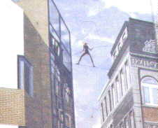

[🠔 Zur Übersicht: Planen im Altbau](11planme.md)  
# Sparsam Planen und Bauen im Altbau - Voraussetzungen und Methoden der Sparsanierung 1
**Allzuoft fehlt beim Bauen und Sanieren das Geld. Eine kostengünstige Altbausanierung erfordert geschicktes Vorgehen und Abstriche, besonders wenn der fast leere Beutel das Budget diktiert.**  
_von Konrad Fischer_

 **Vorsicht: Ein ungeschminkter Praxisbericht** 
(Ein Schelm, wer Böses dabei denkt...) 

> [!abstract]+ Kapitelübersicht: Sparsam sanieren  
> 1. **Sparsam Planen und Bauen im Altbau - Voraussetzungen und Methoden der Sparsanierung 1**
> 2. [Sparsam Planen und Bauen im Altbau](11erh02.md)
> 3. [Bauforschung, Befunduntersuchung, Bauarchäologie als Kostenfalle im Altbau](11erh03.md)
> 4. [Denkmalpflege & Denkmalschutz: Der Restaurator und der Konservator als Totengräber der Originalsubstanz des Baudenkmals](11erh04.md)
> 5. [Der Vernichtungskrieg gegen die Bausubstanz - Ursachen und Verlauf](11erh05.md)
> 6. [Altbausanierung: Finanzierung Planung, Projektfinanzierung, Projektentwicklung](11erh12.md)
> 7. [Altbausanierungs-Planung: Bestandsaufnahme & Aufmaß](11erh13.md)
> 8. [Fassadenrestaurierung/Fassadensanierung: Musterachse - Beispiel Rathaus Bremen](11erh14.md)
> 9. [Sparsam Planen und Bauen im Altbau - Voraussetzungen und Methoden 1.15](11erh15.md)
> 10. [Sparsam erhaltende Konstruktionsplanung Fachplanung Haustechnik / Gebäudetechnik / Gebäudeausrüstung & Tragwerksplanung im Altbau, Denkmalschutz & Denkmalpflege](11erh16.md)
> 11. [Heiztechnik-Planung - Haustechnikplanung & Kosten](11erh17.md)
> 12. [Altbausanierung, Denkmalschutz, Denkmalpflege, Bausanierung: Sparsam Planen und Bauen im Altbau - Die erhaltende Instandsetzung - Teil 2](11erhin2.md)

[Konrad Fischer Dipl.-Ing. Univ. Architekt BYAK](1refernz.md) 
Beirat für Denkmalerhaltung der Deutschen Burgenvereinigung e.V.

(überarbeitete Fassung eines Vortrages in Kühlungsborn bei den 8. Hanseatischen Sanierungstagen des Feuchte und Altbausanierung e.V. 11/97, in Bonn bei der Jahrestagung der Vereinigung der Landesdenkmalpfleger in der Bundesrepublik Deutschland, Sektion C - Bautechnik 6/99, bei der Studientagung auf Burg Runkelstein, Bozen am 25. Oktober 1996, auf der Tagung der Deutschen Burgenvereinigung e.V. 1999 auf der Kaiserburg Nürnberg, mit Abbildungen veröffentlicht in: H. Venzmer (Hrsg.) Bautenschutzmittel, Verlag für Bauwesen Berlin 1997; in: Udo Mainzer (Hrsg.): [Politik und Denkmalpflege in Deutschland](8buch.md#politik und denkmalpflege in deutschland), Jahrestagung der Vereinigung der Landesdenkmalpfleger in der Bundesrepublik Deutschland, Arbeitsheft der rheinischen Denkmalpflege 53, Rheinland-Verlag, Köln 2000; in: Südtiroler Burgeninstitut (Hrsg.): [Burg Runkelstein - Castel Roncolo, Erhalten und Gestalten von Burgen und Schlössern](8buch.md#runkelstein tagungsband), Studientagung auf Burg Runkelstein am 25. Oktober 1996, Verlagsanstalt Athesia Bozen 2001 und in aktualisierter, reich bebilderter Version 2003 [hier](8buch.md#nue))

Planauszüge und Fotos: 
[Konrad Fischer](1refernz.md), Hochstadt a. Main (soweit nicht anders angegeben) 

 Nicht durch Macht werden die Dinge erhalten, 
sondern durch Klugheit. 
_Dr. Martin Luther_

Mephistoteles (gemütlich): Du weißt wohl nicht, mein Freund, wie grob du bist. 
Baccalaureus: Im Deutschen lügt man, wenn man höflich ist. 
_Johann Wolfgang von Goethe, Faust Teil 2; Akt 2_ 

### _Zusammenfassung_

_Allzuoft fehlt beim Bauen und Sanieren das Geld, um richtig im Luxus schwelgen zu können. Soll eine Altbausanierung mit Umbau, Modernisierung und Instandsetzung kostengünstig sein, bilden die vergleichbaren Neubaukosten für traditionelle Massivbauqualität (wo bekommt man die noch angesichts des Dämmwahns?) das äußerste Limit. Für etwa 3.200 (Reihenmittelhaus) bis 3.500 EUR/qm (freistehendes Einfamilienhaus ohne Keller mit Flachdach) bekommt man 2018 in der fränkischen Region einen Neubau aus 17,5er Kalksandsteinfassade plus 14 cm Polystyroldämmung, die dann[bald der Specht hackt und die Algen besiedeln](213baust.md). Darin ist natürlich keine Eigenleistung als Muskelhypothek enthalten, dafür bis aufs Äußerste gedrückte Handwerkerkosten. In den Privatsendern und Bauforen kann oft genug bestaunt werden, welche Qualitäten dabei entstehen. 

In vielen Fällen führt das "Handwerker-Bauen" auf eigene Regie aber zu Kosten, die für die Bauherrschaft, besonders aber die junge Familie, die ohnehin von [Ratenkredit](https://www.netbank.de/privatkunden/kredite/ratenkredit/) zu Ratenkredit lebt und vielleicht sogar über [Auslandskredite](kredite.md) nachdenkt, schlichtweg irreal sind. Auch ein [Ökoneubau](oekobau.md) ist dann außerhalb aller Möglickeiten, ebenso die Generalsanierung einer stark geschädigten Bauruine, in der nicht nur die gesamte Haustechnik, sondern auch alle Bauteiloberflächen innen und außen sowie tragende Strukturen erneuert werden müssen. 4.000 EUR/qm sind dann keine Obergrenze. 

Also heißt es Kosten sparen bis zu einer unvorstellbar niedrigen Schmerzgrenze, die der fast leere Beutel diktiert. Bei der Planung und weit mehr noch beim späteren Bauen müssen dann Abstriche gemacht werden: das berühmte "Streichkonzert". 

Doch auch und gerade dafür ist geschicktes Vorgehen, technische und organisatorische Erfahrung spielentscheidend. Denn selbstverständlich lebt die Baubranche am vorzüglichsten genau vom sparwütigen Bauherrn. Niemand schmeißt weiter mit dem fetten Schinken nach der dürren Wurst, genau der ist am einfachsten für alle Teuerungskonzepte der Baubranche zu gewinnen. Denn er will ja trotzdem "Qualitäten" für sein schönes bißchen Geld. Und die wird ihm hochglanzmäßig beigebracht, egal, was dann wirklich draus wird. Einfachfenster? Pfui! Elektrodirektheizung und Warmwassser-Durchlauferhitzer? Appel-und-Ei-Projekte werden allzuoft verworfen - nicht nur, "weil es der Frau nicht gefällt". 

Je mehr ein unterfinanzierter Bauherr an der Bauvorbereitung - der kritischen Auseinandersetzung mit den Bauschäden und dem Baubedarf - spart, umso besser für all die Nachtragsprofis. Auch Planer können genau für die eingesparte Arbeit besser verdienen, da sie an den Baukosten beteiligt sind - HOAI-vertraglich und/oder dank der Begünstigung der Baustoffproduzenten und Bauunternehmen, die erst mal keine Kostensteigerung mittels Austausch statt Reparatur auslassen und dann obendrein aus jeder Nachtragsmöglichkeit im Bauablauf das Beste rausholen. Je besser ihr Verhältnis zum Planer, umso mehr. Wobei die Baufirmen für die Kostenexplosion auch gerne selbst die Voraussetzungen schaffen: Durch erneuerungswütige, nur überschlägige oder bewußt lückenhafte Angebotsaufstellung. Oder eben durch professionelle Nachtragsspekulation auf unvollständige Ausschreibung des Sparplaners. 

Es ginge aber auch anders: Die aufeinander aufbauenden Projektstufen:_

- geometrische Bestandsaufnahme durch detailliertes Aufmaß, 
- technische Bestandsaufnahme durch [Raumbuch](11rabus.md)- und Holzlistensystem, die den Baubedarf mit den einzelnen Maßnahmen erfassen, nicht nur den Bauzustand, 
- gewerkweise Kostenberechnung und -steuerung, 
- bestandsgerecht sparsame Reparaturtechnik mit gewerkweiser und firmenneutraler [Leistungsbeschreibung im Positionsbausteinsystem](9pbs.md) sowie 
- ein kosten- und bautechnisch optimierter [Vergabe](9cadava.md#ã–ffentlich)- und [Bauablauf](11baulg.md)

können den budgetgerechten Erfolg auch im Altbau sicherstellen. Dabei gibt es freilich ausreichend Abstufungsmöglichkeiten auch für das knappe Budget und den Selbermacher mit viel Eigenleistung und Muskelhypothek nach dem Motto "Do-It-Yourself" und im Falle eines Baudenkmals vielleicht sogar Förderzuschüsse, die wirklich etwas bringen. Im Unterschied zu KfW-Beiträgen, die extrem kostensteigernde und nie durch Förderzuschuß gedeckte Mehraufwendungen bedingen.

Voraussetzung des kostensparenden und wohngesunden Sanierens sind aber immer drei Planungsprinzipien: "Erhalten statt Erneuern", "Einfach und handwerklich bauen statt Industrie-DIN und -Bauphysik" sowie "Bestands- und gesundheitsverträgliche Baustoffe statt Chemiewaffenangriff mit undeklarierten Giften und industriellem Baupfusch".

Auf feuchte- und schimmelgefärdeten Dämmstoff-Verbau auf, vor und unter dem Haus, an der Fassade, als Zwischensparrendämmung oder Aufsparrendämmung, auf den Totalaustausch aller alten Fenster egal welcher Bauart, auf subventionierte "ÖKO"-Energie aus Sonne und Wind, auf "Wohnen in der Plastiktüte" und auch auf luxuriöse Stahlglaskisterl, Bauhauskitsch, überdichte, labbrige oder überfeste Fassadenhäute kann der kostenbewußte Bauherr bei knappem Budget mit ruhigem Gewissen verzichten.

Alternative: [Luxusplanung](10hoai10.md) und produzentengesteuerter [Planungsbetrug](10hoai22.md), der sich nicht um das gesetzlich verankerte Wirtschaftlichkeitsgebot auch und gerade für Energiesparplanung schert und (theoretisch errechnete!) Amortisationszeiten weit über die rechtlich vertretbaren 10 Jahre hinaus akzeptiert. Die dann in der Praxis auch nicht erreicht werden, da die Energiespareffekte oft genug ausbleiben und dagegen gravierende Mehrkosten entstehen können. Dafür gibt es wahrlich genug Praxisbeispiele. Nicht nur die energisch totsanierte Grundschule in Weitramsdorf, die es mit ihrem Heizdesaster sogar bis ins Fernsehen geschafft hat.

---

_"Studiert man die Bauakten der großen Kirchen, Schlösser und Burgen, so stellt man fest, daß in vielen Fällen die letzten systematischen Instandsetzungsarbeiten in der Zeit um 1900 durchgeführt worden sind. Der Erste Weltkrieg, die Wirren der Zeit danach mit Weltwirtschaftskrise, Inflation und erneuter Aufrüstung, dann der Zweite Weltkrieg mit seinen furchtbaren Zerstörungen und die anschließende Notzeit sowie die große Kraftanstrengung des Wiederaufbaus verhinderten die kontinuierliche Pflege der erhaltenen Baudenkmale. [Nach den durch das Europäische Denkmalschutzjahr 1975 und den ab 1990 in Mitteldeutschland ausgelösten Versuchen, die Vernachlässigung der Baudenkmale aufzuholen] gerät das Rettungswerk ins Stocken. Zugleich zeigen sich in den westdeutschen Ländern zunehmend gravierende Schäden an Kirchen, Schlössern, Rathäusern, Bürgerbauten und Bauernhäusern. Dies liegt an einem eklatanten Mangel an finanziellen Mitteln für eine gründliche Instandsetzung."_ - so Professor Dr. Dr.-Ing. e. h. Gottfried Kiesow in _"Was geschieht - wenn nichts geschieht?"_ Monumente 5/6-2006, Zeitschrift der Deutschen Stiftung Denkmalschutz. 

Stimmt natürlich nur bedingt. Total ausgeblendet wird bei dieser beschönigenden Schau der Dinge der unheilvolle Einfluß der Denkmalpflege und jawollja, auch der Deutschen Stiftung Denkmalschutz. Denn wie sehen die meisten nach deren Vorstellungen erfolgenden "Sanierungen" der gefährdeten Denkmalsubstanz aus? Jawoll: Grausam, denn unnötig viel Originalsubstanz zugunsten irgendeiner Perfektionsideologie zerstörend, dabei sich von den im Hintergrund korrumpierenden Produzenten als Motoren der Brutalerneuerung bestechen lassen, sei es durch [Umsonstplanung](10hoai22.md), sei es durch anderweitige Annehmlichkeiten bis zur wohldotierten Mitgliedschaft in irgendeiner Preisverleihungsjury, einem Aufsichtsrat oder als Teuerreferent der Jahrestagung des Produktverkaufsfördervereins e.V. 

Wie sähe dagegen sparsame, den Bestand sorgsam bewahrende Denkmalpflege aus, die diesen Namen verdient und von äußerster Pragmatik zugunsten des bis gestern original existierenden Baudenkmals, aber auch der Besitzerkasse besselt ist? Ich zitiere mal den Denkmalpfleger Thomas Wenderoth: 

_"Das denkmalfachliche Konzept sieht den weitestgehenden Erhalt aller historischen Spuren vor; die Zeugnisse der Umnutzung werden gleichrangig mit den Zeugnissen der klösterlichen Zeit behandelt. ... Geschädigte Steine und fehlende Sandsteinrippen wurden dem Konzept entsprechend nicht ersetzt. ... Die Putzränder wurden mittels Anböschung gesichert, gefährdete Hohllagen hinterfüllt. Jüngere Ergänzungen oder Störungen in den Oberflächen wurden nur dann farblich retuschiert, wenn ansonsten der Gesamteindruck des Raumes gefährdet erschien. 

Ziel der Maßnahme war es nicht, eine einheitliche und geschlossene Raumfassung wiederherzustellen. Dies hätte in der Konsequenz zu erheblichen Eingriffen an den originalen Oberflächen geführt, da die stark gealterten und im Bereich der Sandsteinrippen auch zurückgewitterten Oberflächen für das Gros der Betrachter unbefriedigend gewirkt hätten. Die visuelle Irritation, hervorgerufen durch den Kontrast zwischen rekonstruierten und originalen Oberflächen, wäre gegenüber der aktuellen Situation mit unterschiedlich verwitterten Oberflächen deutlich größer geworden. 

Um dies zu vermeiden, werden in der Regel die historischen Oberflächen durch Reprofilierung und Farbfassung den neuen Oberflächen angeglichen. Anstelle des geschädigten Originals tritt dann eine jungfräuliche Rekonstruktion, bar jeder Altersspuren, jeden Alterswerts. Die fünfhundertjährige Geschichte sollte in Birkenfeld jedoch nicht einfach ausgeblendet werden, die Denkmalaussage nicht allein auf den Schauwert und die mittelalterliche Architekturidee reduziert werden. ... 

Größter Wert wurde auch hier darauf gelegt, dass mit der notwendigen statischen Verankerung der Treppe keine Befunde zur ursprünglichen baulichen Situation zerstört werden. ... 

Leider immer noch zu selten wird ... ausreichende Sorgfalt und Wert auf die Erhaltung bauhistorischer Spuren gelegt. Der Alterswert eines historischen Gebäudes wird in der Regel unter perfektionierten neuen Oberflächen versteckt: Die Fenster erstrahlen dann wie neu aus weißen Kunststoffrahmen; Silikonharzanstriche und andere kunststoffhaltige Farben in historischem und historisierendem Farbkanon grüßen von den Wänden. Aufwendige technische Installationen oder martialische bauliche Eingriffe sorgen für das gewünschte Raumklima. ... 

(Anders in Birkenfeld:) Die bauhistorischen Befunde blieben umfassend erhalten - dies gilt nicht nur für die mittelalterlichen Bauphasen, sondern grundsätzlich auch für die Spuren der nachmittelalterlichen Nutzung. Die gealterten und reduzierten historischen Oberflächen besitzen einen hohen Zeugniswert und werden im Originalzustand erhalten und gezeigt - die Würde des Alters bleibt unangetastet. ... 

Das herausragende Endergebnis wäre ohne eine umfangreiche und sehr gewissenhafte Vorplanung so nicht möglich gewesen. ..."_ (aus: Von der Liebe zum Alterswert. Die Instandsetzung der ehemaligen Klosterkirche Birkenfeld, in: [Denkmalpflege Informationen Nr. 152](http://www.blfd.bayern.de/medien/denkmalpflege_informationen_152.pdf), Juli 2012, Bayer. Landesamt für Denkmalpflege). 

Kann man die Denkmalverwüstung in den Nachfolgeländern der DDR, aber "in der Regel" auch sonstwo peinlicher karikieren, die schamlose und IMMER kostenexplodierende Vernichtungswelle namens "Denkmalschutz" zugunsten der dadurch gefüllten Profibeutel und stolzverschwollenen Denkmalpflegerherzen gräßlicher brandmarken? Denken Sie selber drüber nach. 

Wieviele Denkmalprofis werden es wohl sein, die sich dieser anständigen und ehrbaren Denkmalpflege verschrieben haben? Wer wurde alles in die kostensparenden Geheimnisse der Ehrfurcht und Pietät vor dem Denkmalbestand eingeweiht? Und wieviele werden darunter sein, die ihre Seele nicht dem Teufel verkauften und die Interessen des Hausbesitzer nicht der eigenen Selbstsucht unterordnen? Tja! 

_"Große Städte schämen sich ihrer Arbeiterkultur wie einer schmutzigen, unsittlichen Herkunft. Die Erinnerung an die engen, überbevölkerten Quartiere, in denen die Menschen lebten, die den Wohlstand der Stadt erarbeitet haben, wurden im Laufe der Stadtplanungsgeschichte erst hinter Prachtfassaden versteckt, dann Schritt für Schritt ganz zerstört. Baron Haussmann in Paris, der erst mit dem Lineal Boulevards durch die verwinkelte Altstadt zog, um dann auch die historischen Blöcke abzureißen, hatte es Mitte des 19. Jahrhunderts vorgemacht. Ihm folgten Legionen von Stadtplanern, mal eher feudal, mal eher revolutionär denkend, mal faschistisch, mal bürgerlich-modern geprägt, die mit den immer gleichen hygienischen und pseudo-sozialen Argumenten die Geschichte der Stadt entsorgten. Das unverfängliche Wort für dieses schlechte Gewissen des Reichtums heißt von jeher "Sanierung." Doch wie alle Schamvokabeln sagt es nicht das aus, was es meint."_ - Till Brieglieb in _"Stadt der Tiefgaragen. Hamburg ruiniert das urbane Gängeviertel - und nennt das "Sanierung""_ Süddeutsche Zeitung Nr. 95 / Seite 13, Samstag/Sonntag 25./26. April 2009 

 
_Der Architekt zwischen Alt- und Neubau - 
ein technischer und wirtschaftlicher Drahtseilakt_

 
_Wem soll man diese Sanierung eigentlich anvertrauen? 
Dem Alles-Neu-Handwerker? Dem Stahltonnagenstatiker?_

Wohnen und Wirken, Soziales, Sakrales, Kultur und Gewerbe - Altbauten sind für viele Nutzungen geeignet und bieten als Immobilie schlagkräftige Vorteile: Lage, Bestandsbaurecht, Bauqualität, vorzeigbare Fassade und stimmige Atmosphäre, bei großzügigem Zuschnitt leicht modernisierbar auch für neueste Technik, bestens vermietbar, gute Mieterbindung und langfristig vorteilhafte Investitionsanlage - es gibt viele Gründe, Altbauten instandzusetzen und zu modernisieren. Immer kostet das originale Bausubstanz. 

Was sich Deutschlands Nachkriegsaufbau hierbei geleistet hat, spottet allerdings jeder Beschreibung. Die Zerstörung unserer einst werthaltigen Gesellschaft geht auch auf das Konto utopischer Menschenverbesserei. Autogerechte Stadt, Licht und Luft und Käfighaltung, entwohnte, unwirtlichste "Altstädte", Zerstörung des Kulturerbes bis ins kleinste Detail - ohne Anschauung des Erhaltungswertes, ohne Versuch der oft simpelst realisierbaren Neunutzbarmachung - zugunsten menschenfeindlichster Klötze und Versorgungsstrukturen, die nun alle miteinander [betonmäßig zerbröseln](2beton.md) und beim unvermeidbaren Einsturz hin und wieder weitere Menschenleben kosten. Überteure und pfuschig-moderne "Sanierungen" rückten dem verbliebenen Altbaubestand substanzgefährdend auf den Leib. Und wie geht es heute weiter? Energiesparpunkte wollen lukriert sein, KfW-Kredit- und Zuschuß-Pakete verdient, gar die Welt mittels Pseudo-Klimaschutz entkarbonisiert und damit "gerettet". Dafür ist jeder Plunder recht, mag er auch noch so sinnlos sein, Substanz gefährden, Energie vergeuden, Mehrkosten ohne Ende in Kauf nehmen, das Haus ertränken und die Bewohner im Mief ersticken lassen. Deutschland ist dank Ökoarchitektur wieder mal Weltmeister - bei unseren ca. 10.000 Kinderasthmatoten im Jahr.

Konrad Fischer: Fassaden energetisch richtig und kostensparend sanieren 
 
und neu: 
 

Natürlich wird ein Altbau als Baudenkmal nicht so einfach allen Veränderungswünschen gerecht. Der Denkmalschutz hat eben auch wertmindernde und einschränkende Folgen - das sei hier nicht schöngeredet. Denkmalschutzauflagen können auch finanziell schmerzen. Die Instandsetzungskosten an Baudenkmalen sind teilweise höher als an normalen Altbauten - durch die kostentreibenden Auflagen der Denkmalschutzbehörde. Selbstverständlich sind auch die Aufwendungen für das Instandhalten und den üblichen Bauunterhalt sowie das Bewirtschaften bei vielen Baudenkmalen höher, als "normal". Ungünstige Nutzungsbeeinträchtigungen können bei Baudenkmalen nachhaltig den Ertrag mindern - sowohl bei der Wohnungsvermietung als auch bei der gewerblichen Nutzung / Verpachtung.

Letztlich führen Denkmalschutzauflagen auch zu einer Minderung des Verkehrswertes des betroffenen Grundstücks. Die schon genannten Nachteile, die schlechtere Ausnutzung des bebauten Grundstücks, die Beibehaltung der veralteten Bauweise, eine auflagenbedingte Einschränkung der Nutzungsmöglichkeiten und Umnutzungsmöglichkeiten und auch ein Abrissverbot wirken hier als bekannte Minderungsfaktoren. Nur in seltenen Fällen können Denkmalzuschüsse alleine die Nachteile ausgleichen.

Doch andererseits - und hier schweifen wir mal kurz ab ins deutsche Erbrecht mit einer Erbschaftssteuer, die weltweit ihresgleichen sucht - kann die Denkmaleigenschaft durchaus Vorteile beim Vererben bringen. Richtig angesetzt und begründet, garniert mit einer sachgerechten Ermittlung des meist gegebenen Instandsetzungsstaus und Instandsetzungsbedarfs, um zumindest die bestehende Nutzung weiter aufrechtzuerhalten, kommen Wertminderungen bei der Berechnung des Ertragswerts zustande, daß es dem Finanzamt graust. Dabei kann es durchaus um bedeutende Beträge bis in den Millionenbereich gehen, wie entsprechende Fälle zeigen. Wobei es darauf ankommt: 

Ein perfektes Zusammenspiel eines Sachverständigen für die Wertermittlung von bebauten Grundstücken sowie eines Bausachverständigen, der den oft immensen Sanierungsbedarf schlüssig - und das heißt letztlich im vom Finanzamt gerade noch akzeptablen Rahmen - darstellen kann. Und dann hat der Erbe einer denkmalgeschützten Immobilie - in gewissem Umfang freilich auch jedes anderen instandsetzungsbedürftigen Altbaus bzw. Gebäudekomplexes eine gute Chance, beim Erben gerade von Gewerbeimmobilien (Mietwohnung, Bürogebäude, Produktionsgebäude, Lagerhalle, Gaststätte / Restaurant, Hotel usw.) nicht das Erbe seiner urgermanischen Vorfahren anzutreten: 

Wenn der in seinem Leben reichgewordene Germane starb, wurde seine Fahrhabe inkl. Pferd, Wagen und Waffen im Grabhügel versenkt, der Rest verbrannt und das Geld auf der Trauerfeier so lange verfeiert, bis es weg war. Das war die Voraussetzung für die germanische Gleichmacherei, die bis zum erst christlich eingeführten Anhäufen des Vererbten - ein fetter Teil selbstverständlich für die Kirche um Jesu und der ewigen Seligkeit willen - für sehr demokratische und urkommunistische Verhältnisse in den germanischen Stämmen sorgte. Vorbei - Gottseidank?

Oft stellt sich dem unbefangenen Betrachter also die Frage, ob es mit oder ohne Denkmalamt und Denkmalpflege besser gelingt, ein Bauvorhaben an einem denkmalverdächtigen oder gar schon unter Denkmalschutz stehenden Haus durchzuführen - soll man den schlafenden Denkmal-Löwen also wecken oder nicht? Sind die Sanier-Kosten /qm (m²) bzw. pro cbm (m³) für eine denkmalgerechte und bestandsgerechte Instandsetzung höher, wenn die Denkmalbehörde am Verfahren beteiligt wird? 

Ich will Sie nicht weiter auf die Folter spannen: Nach meiner Erfahrung an über 450 geplanten und kostengerecht abgerechneten Sanierungsvorhaben an Baudenkmalen war es zu 99,9 Prozent besser, oft sogar die einzige Rettung, MIT DER DENKMALPFLEGE das ruinöse und morsche Schiff in den sicheren Hafen zu bugsieren. Sogar bei der Sanierung der Fassaden, Balkone und Dächer am Rathaus in Bremen gelang das in überzeugender Weise, obwohl ansonsten gerade bauamtbetriebene Rathaussanierungen für extreme Kostensteigerungen gut bekannt sind. 

Voraussetzung der budgetgerechten und kostensicheren Denkmal-Sanierung waren ein Bauherr, der die Denkmalpfleger nicht als geborenen Feind betrachtete, sondern dem Prinzip jeder qualifizierten Denkmalpflege folgte: Erst Voruntersuchen, dann Planen, dann Bauen. 

Es geht freilich auch so: 

[Velbert-Neviges 20.06.2007: Burgenforscher-Gutachten für Schloß Hardenberg - Kostenschätzung für Sanierung übertrieben - Kasematten mit Potenzial - Ausbau der Wehrgänge soll Fördermittel einspielen - Wehranlagen sollen Priorität bekommen](http://www.wz-newsline.de/lokales/kreis-mettmann/wulfrath/neviges-einzigartigkeit-der-wehrgaenge-als-chance-auf-foerdermittel-1.467004) 
[Velbert-Neviges 15.11.2007: Wunderbare Pläne für Schloß Hardenberg - Wer soll die 10 Millionen Euro für die Hotelnutzuung bezahlen - Aus für Museumsvariante?](http://www.derwesten.de/staedte/velbert/Wunderbare-Plaene-id2092634.html) 
[Velbert-Neviges 19.05.2008: Großbaustelle Schloß Hardenberg - Kompromißloser Brandschutz - Notfalls ultramodern](http://www.wz-newsline.de/lokales/kreis-mettmann/wulfrath/neviges-ab-september-grossbaustelle-1.228723) 
[Velbert-Neviges 17.08.2008: 2009 Ruck-zuck-Grundsanierung Schloß Hardenberg - Fertigstellung Ende 2009, spätestens 2010](http://www.wz-newsline.de/lokales/kreis-mettmann/wulfrath/neviges-schloss-hardenberg-wird-2009-grundsaniert-1.243745) 
[Velbert-Neviges 16.12.2008: Premiumobjekt Schloß Hardenberg - Dolles Nutzungskonzept - Buntes Allerlei (PDF)](http://www.barrierefrei.velbert.de/media/pdf/stadtplanung/stadtentw-neviges/Nutzung-Schloss-Hardenberg161208.pdf) 
[Velbert-Neviges 03.07.2009: Sanierung Schloß Hardenberg - Bund gibt nicht genug Geld - bis Ende 2009 Schloß innen begehbar?](http://www.derwesten.de/staedte/velbert/Berlin-gibt-weniger-als-erhofft-id467429.html) 
[Velbert-Neviges 04.01.2011: Spaßprojekt Schloß Hardenberg - Rohbauveredelung als Patchwork-Denkmalpflege mit teuerstem Reichsformat und Luxusaufzug, doch ohne Nutzungskonzept](http://www.derwesten.de/staedte/velbert/Stabile-Verhaeltnisse-id4127545.html) 
[Velbert-Neviges 04.05.2011: Schloß Hardenberg - Sanierung wird im Juni zum Stillstand kommen - Geld langt nicht mehr für statische Sicherung - Nur noch Wintersicherung der angefangenen Baustelle?](http://www.barrierefrei.velbert.de/aktuelles/presse/pressemeldungen/default.asp?details=1&Id=7148) 
[Velbert-Neviges 08.06.2011: Schloß Hardenberg - Kostenschätzung falsch - Sanierungskosten explodieren von 2,7 auf 4,5 (mit Ausbau 6,5 Mio.) Euro - Faß ohne Boden - Auf Suche nach neuen Geldquellen.](http://www.derwesten.de/staedte/velbert/Auf-Suche-nach-neuen-Geldquellen-id4744153.html) 
[Velbert-Neviges Dienstag: Blog-Satire: Dauerbaustelle Schloß Hardenberg](http://nevigeser.blogspot.com/2010/11/blog-post_16.html#links#links) 
["Kulturspeicher" in Würzburg - 19.05.11: Naturstein-Fassade kann nicht aufgehängt werden - Kosten steigen von 110000 auf 315000 Eur](http://www.mainpost.de/regional/wuerzburg/Kulturspeicher-Naturstein-Fassade-kann-nicht-aufgehaengt-werden;art735,6151033) 
["Kulturspeicher" in Würzburg - 19.05.11: Auskunft der Stadt zu "Pleiten, Pech, Kulturspeicher" und den Instandsetzungskosten der Fassade](http://www.karlgraf.de/de/topical/news.php?id=4397) 
["Kulturspeicher" in Würzburg - 19.05.11: Lernprozeß oder Pfusch am Bau?]( http://www.mainpost.de/regional/wuerzburg/Kulturspeicher-Lernprozess-oder-Pfusch-am-Bau;art735,6154893) 
[Burgsinn - Alte Burg des Freiherrn von Thüngen - 08.06.11: Behördenzwang zur Rettung erforderlich?](http://www.mainpost.de/regional/main-spessart/Verfall-der-Wasserburg-Landratsamt-schreitet-ein;art772,6185203) 
[Schloß-Ruine Winkl in Grabenstätt - Rettung nach Finanzkatastrophe 1995 und vergeblichen Verkaufsanstrengungen durch Wohnungsaus- und -neubau mit 28 Eigentumswohnungen?](http://www.ovb-online.de/rosenheim/chiemgau/okay-bauvorhaben-1277867.html) 
[Walhalla-Sanierung wird brutal teurer - egal, da 100 Prozent Staatsfinanzierung](http://www.mittelbayerische.de/region/regensburg/artikel/walhalla_sanierung_wird_deutli/668277/walhalla_sanierung_wird_deutli.html) 
[Sanierungskosten der Veste Heldburg steigen urplötzlich um eine Million Euro, Museumseröffnung des Burgmuseums verzögert sich](http://www.insuedthueringen.de/lokal/hildburghausen/hildburghausen/Museumseroeffnung-verzoegert-sich;art83436,1649876) 
[Burgruine Bucherbach - Sanierungskosten fahren zum Himmel](http://www.saarbruecker-zeitung.de/sz-berichte/koellertal/Sanierung-Burg-Bucherbach-wird-100-nbsp-000-Euro-teurer-als-erwartet;art4784,3420132) 
[Schloß Frankenberg 04.03.2008: Vom Sanierungsfall zum Luxushotel?](http://www.mainpost.de/regional/wuerzburg/Vom-Sanierungsfall-zum-Luxushotel;art736,4376354) 
[Schloß Frankenberg 01.10.2009: Eine schneidige Summe - der neue Schlossherr investiert gewaltig!](http://www.mainpost.de/regional/franken/Eine-schneidige-Summe;art1727,5311079) 
[Schloß Frankenberg 27.04.2011: Landrefugium öffnet seine Tore als junge Reisedestination und neue Heimat der Aaglander](http://reisen.pr-gateway.de/landrefugium-schloss-frankenberg-offnet-seine-tore-als-junge-reisedestination-im-einklang-mit-der-natur-und-ist-neue-heimat-der-aaglander/) 
[Schloß Frankenberg 27.05.2011: Hoffnung keimt auf, Insolvenzverwalter setzt auf Fortführung von Hotel und Gastronomie](http://www.nordbayern.de/region/pegnitz/auf-schloss-frankenberg-keimt-hoffnung-auf-1.1263183) 
[Schloß Frankenberg 05.06.2011: Insolvenzverwalter glaubt an Rettung](http://www.mainpost.de/regional/kitzingen/Schloss-Frankenberg-Insolvenzverwalter-glaubt-an-Rettung;art773,6179713) 
[Schloß Frankenberg 16.08.2011: Wein-Schloss Frankenberg lebt](http://www.yoopress.com/de/weinnews/weinwelt/weinerzeuger/6850.Wein-Schloss_Frankenberg_lebt.html) 
[Schloß Frankenberg 10.01.2012: Amtshaus auf Schloss Frankenberg schließt - Geschäftsführer: Kostendeckender Betrieb von Café und Restaurant nicht möglich](http://www.mainpost.de/regional/wuerzburg/Amtshaus-auf-Schloss-Frankenberg-schliesst;art779,6546898) 
[Schloß Senden vergammelt](http://www.ivz-aktuell.de/aktuelles/muensterland/1554399_Wo_Dornroeschen_schlaeft.html) 
[Schloß Malberg in der Waldeifel für 10 Millionen Steuergeld saiert - und jetzt für einen Euro zu verschenken?](http://www.volksfreund.de/nachrichten/region/bitburg/aktuell/Heute-in-der-Bitburger-Zeitung-Barockes-Wahrzeichen-zu-verschenken;art752,2799229) 
[Land lehnt Übernahme von Schloss Malberg ab - auch nicht geschenkt! Jetzt Umweg über "herrenloses Gut"?](http://www.swr.de/landesschau-aktuell/rp/-/id=1682/nid=1682/did=8133860/1ogyiao/) 
[Stadt Kronach in Schuldenfalle - FDP-Bezirksparteitag beschließt: Millionengrab Festung Rosenberg in Kronach soll dem Freistaat Bayern geschenkt werden](http://www.infranken.de/regional/lichtenfels/FDP-Nominierung-Bundestag-Oberfranken-Trieb-FDP-kuert-ihre-oberfraenkischen-Direktkandidaten;art220,54183) 
[Blog des ehem. SPD-Bürgermeisters Manfred Raum, Kronach: Generalkonservator Egon Johannes Greipl, Bayer. Landesamt für Denkmalpflege: Mit der Festung Rosenberg ist "diese kleine Stadt chronisch überfordert!" - Freistaat soll Festungsanlage übernehmen!](http://www.manfred-raum.de/?p=466) 
[Goslar Rathaus: Sanierungskosten werden wesentlich teurer als geplant](http://www.newsclick.de/index.jsp/menuid/7534512/artid/13961758) 
[Rathaussanierung Mahlberg: Sanierungskosten steigen auch wegen unvermutetem Denkmalschutz - der bei Kostenplanung unberücksichtigt blieb!](http://www.badische-zeitung.de/mahlberg/die-sanierung-ist-deutlich-teurer--20942509.html) 
[Aying Rathaus: Sanierungskosten wegen unzureichender Kostenberechnung wesentlich gestiegen](http://www.sueddeutsche.de/muenchen/ebersberg/rathaus-anzing-kosten-falsch-berechnet-1.977336) 
Ein mehr als typischer Fall für sich: Generalsanierung Rathaus Marktleugast: 
[Rathaus Marktleugast 04.08.2009: Bausubstanz unter der Lupe]( http://www.infranken.de/regional/kulmbach/Marktleugast-Rathaus-Zukunft-Rathaus-unter-der-Lupe;art312,48782) 
[Rathaus Marktleugast 17.05.2010: Jetzt geht's in Detail](http://www.infranken.de/nachrichten/lokales/kulmbach/Rathaus-Jetzt-geht-s-ins-Detail;art312,75123) 
[Rathaus Marktleugast 27.07.2010: Energetische Generalsanierung wird erst im April 2011 beginnen - Kosten trotz einiger Zusatzmaßnahmen kaum gestiegen](http://www.infranken.de/regional/kulmbach/Rathaus-Jetzt-gehts-ins-Detail;art312,75123) 
[Rathaus Marktleugast 23.09.2010: Regierung von Oberfranken und Fördergelder drücken - Neues Treppenhaus muß her - die geschätzten Kosten sollen dennoch sinken!](http://www.frankenpost.de/lokal/kulmbach/kl/Rathaus-braucht-neues-Treppenhaus;art3969,1339180) 
[Rathaus Marktleugast 18.05.2011: Faß ohne Boden - "Überraschung" dank fehlender Voruntersuchung - Sanierungskosten der "energetischen Sanierung" steigen und steigen - Gemeinde bleibt auf Mehrkosten sitzen, Staat bleibt mit "energetischen" Fördermitteln außen vor und lacht sich ins Fäustchen](http://www.frankenpost.de/lokal/kulmbach/kl/Bautechnischer-Wahnsinn;art3969,1645851) 
[Rathaus Marktleugast 18.05.2011: Baustopp?](http://www.frankenpost.de/lokal/kulmbach/kl/Huebschmann-schlaegt-Baustopp-vor;art3969,1645852) 
[Rathaus Marktleugast 27.05.2011: Sanierung läuft vorerst weiter](http://www.frankenpost.de/lokal/kulmbach/kl/Sanierung-laeuft-vorerst-weiter;art3969,1654204) 
[Rathaus Egelsbach: Sanierungskosten verdoppelt: Ein teurer Spaß: 2 Mio Euro](http://www.op-online.de/lokales/nachrichten/egelsbach/rathaus-macht-architekten-gluecklich-876309.html) 
[Rathaus Nauheim: Kostensteigerungen bei der Sanierung überraschen ...](http://www.main-spitze.de/region/nauheim/10172103.htm) 
[Neues Rathaus in Dresden: Trödelei läßt Sanierungskosten steigen](http://www.dresden-fernsehen.de/default.aspx?ID=12209&showThread=68618&showForum=35&showNews=911988) 
[Energetische Sanierung Rathaus Maßbach: Kostensteigerungen mangels ausreichender Voruntersuchung der Bausubstanz ...](http://www.mainpost.de/regional/bad-kissingen/Bausuenden-der-Vergangenheit-verteuern-die-Rathaussanierung;art778,5830337) 
[Rathaus Plieningen: Kostensteigerungen bei der Sanierung fast eine halbe Million Euro durch mangelhafte Voruntersuchung und Vorplanung ...](http://www.stuttgarter-nachrichten.de/inhalt.altes-rathaus-wird-teurer.48dd0642-e70d-4485-9e12-61e2e32e85d5.html) 
[Wesel: Rathaussanierung teurer](http://www.rp-online.de/niederrhein-nord/wesel/nachrichten/rathaus-sanierung-teurer-und-laenger-1.1091441) 
[Rathaus in Kleve: Sanierungskosten explodieren](http://www.rp-online.de/niederrhein-nord/kleve/nachrichten/kleves-rathaussanierung-wird-teurer-1.1200523) 
[Generalsanierung Rathaus in Baar: Energetische Sanierungskosten schnelzen in unerreichbare Höhen](http://www.donaukurier.de/lokales/ingolstadt/Baar-Ebenhausen-Rathaus-Baar-Generalsanierung-um-ein-Viertel-teurer;art599,2305183) 
[Sanierung Rathaus in Contwig: Hunderttausende Euro teurer - Lohn- und Materialkosten falsch geschätzt, Leistungen falsch ausgeschrieben?](http://www.pfaelzischer-merkur.de/region/pfalz/zweibruecken/art27548,2864363?) 
[Blieskastel: Rathaussanierung wegen übersehener Schäden deutlich teurer](http://www.saarbruecker-zeitung.de/sz-berichte/stingbert/Sanierung-Dach-Rathaus-Kosten-Blieskastel;art2794,3155629) 
[Rathaus-Sanierung Weissenbrunn: Mehrkosten durch zu kurzen Planungszeitraum und überraschende Planungswünsche](http://www.infranken.de/regional/kronach/Weissenbrunn-Sanierung-Rathaus-Rathaussanierung-wird-teurer;art219,67000) 
[Sanierung Rathaus in Bad Oeynhausen: Denkmalschutz bei energetischer Sanierungsplanung vergessen - Mehrkosten!](http://www.nw-news.de/owl/kreis_minden_luebbecke/bad_oeynhausen/bad_oeynhausen/?em_cnt=3544948) 
[Thierhaupten: Unwirtschaftliche Energetische Sanierung des Rathauses im Konjunktur II Paket soll noch teurer werden - auf Mehrkosten bleibt Gemeinde sitzen](http://www.augsburger-allgemeine.de/augsburg-land/Rathaus-Sanierung-wird-teurer-id7785631.html) 
[Rathaus in Wasserburg am Inn: Energetische Sanierungskosten explodieren, Stadtrat stimmt für unwirtschaftliche Sanierung aus Steuermitteln](http://www.schwaebische.de/region/bodensee/lindau/rund-um-lindau_artikel,-Rathaussanierung-wird-teurer-als-gedacht-_arid,4027114.html) 
[Rathaus Rainau: Plötzlich geändertes Heizkonzept verteuert Sanierung](http://www.schwaebische.de/region/ostalb/aalen/rund-um-aalen_artikel,-Heiss-Heizung-macht-Sanierung-teurer-_arid,5065389.html) 
[Barsbüttel: Kosten der Sanierung steigen](http://www.abendblatt.de/region/stormarn/article1623111/Rathaus-Sanierung-wird-teurer.html?) 
[Krombach: Rathaus Schäden bei Voruntersuchung übersehen - jetzt wird alles teurer als geplant](http://primavera24.de/lokalnachrichten/aschaffenburg/4600-krombach-rathaus-sanierung-teurer-und-laenger.html) 
[Rathaus Weinähr: Sanierungskosten werden wegen falscher Sanierung teurer](http://www.wir-im-nassauer-land.de/?p=3416) 
[Hessische Schlössersanierung rund um Kassel: Alles wird viele, viele Millionen Euros teurer als geplant, trotz oder wegen? staatlichem Bauherren, VOF-Ausschreibung und Vergabe der Planungsleistungen. Steuergeldfinanziert.](http://www.hna.de/lokales/kassel/millionen-euro-museen-sind-schon-1225694.html) 
[Königstein: Haus der Begegnung - Kosten der Sanierung laufen davon, da hilft auch kein Projektsteuerer und auch kein Green Building Award ...](http://www.fnp.de/fnpartikel-rmn01.c.8757547.de) 
[Saarburg: Burgsanierung plötzlich teurer als geplant. 100.000 EUR.](http://www.volksfreund.de/nachrichten/region/saarburg/aktuell/Heute-in-der-Saarburger-Zeitung-Burgsanierung-wird-teurer-als-geplant;art803,2491176) 
[Schloß Pfaffroda - das Geld langt nicht, trotz "Sozialbetrieb"](http://www.freiepresse.de/LOKALES/ERZGEBIRGE/MARIENBERG/Schloss-Sanierung-wird-fuer-Pfaffroda-teurer-und-schwerer-artikel7660488.php) 
[Schloß Wechselburg - Traum geplatzt](http://www.freiepresse.de/LOKALES/MITTELSACHSEN/ROCHLITZ/Kreis-schreibt-sein-Schloss-aus-artikel7663168.php) 
[Schloß in Mainz heruntergewirtschaftet]( http://www.faz.net/aktuell/rhein-main/region/mainz-schloss-sanierung-nur-mit-geld-vom-land-1331639.md) 
[Schloß Sonnenstein, Pirna - Naht die Rettung?](http://www.landrat-geisler.de/schloss_sonnenstein.htm) 
[Schloß Wiehe - Sanierpfusch durch Treibmineralbildung im "sanierten" Mauerwerk](http://www.baufachinformation.de/zeitschriftenartikel.jsp?z=2004049007274) 
[Schwarzbuch 2010 des "Bund der Steuerzahler" prangert irrsinnige Schloßsanierungen an](http://www.scribd.com/doc/40315165/Schwarzbuch-2010) 
[Wittelsbacher Schloß in Friedberg - Kostenexplosion](http://www.myheimat.de/friedberg/das-friedberger-schloss-kosten-explosion-d111519.html) 
[Schloß Blankenburg - geplatzte Sanierung](http://www.mz-web.de/quedlinburg/harzkreis-land-zahlt-fuer-sanierung-von-schloss-blankenburg,20641064,17633108.html) 
[Schloß Bertholdsheim - extreme Kostensteigerung](http://www.augsburger-allgemeine.de/neuburg/Gasalarm-im-Schloss-id8523431.html) 
[Schloß Neidstein wegen Geldsorgen wieder verkauft](http://www.welt.de/vermischtes/article3519304/Nicolas-Cage-verkaufte-Schloss-wegen-Geldsorgen.html) 
[Unfaßbar: Google Suchergebnis aktuell: "Sanierung teurer"](http://www.google.com/search?num=100&hl=de&newwindow=1&safe=off&client=firefox-a&hs=Xnv&rls=org.mozilla%3Ade%3Aofficial&q=sanierung+teurer&aq=f&aqi=&aql=&oq=) 

Natürlich liegt das zentrale Problem nicht unbedingt nur bei der Finanzierung des Bauvorhabens, sondern bei der Voruntersuchung der alten Bausubstanz. Sie muß in der Lage sein, die zentralen Schwachpunkte und gleichzeitig die günstigsten Methoden für deren Sanierung in ausreichendem Umfang zu entdecken. In einem Satz: 

Die Voruntersuchung muß sich am Planungsbedarf und Baubedarf ausrichten. 

Sonst scheitert sie, hinterläßt nur Löcher und Papiermüll und produziert mit angeblich unvorhersehbaren Nachträgen, die eine für die umfangreiche Baumaßnahme und Generalsanierung angemessene [Bestandsaufnahme mit maßnahmenbezogener Schadensermittlung](11rabus.md) und ausreichender Bemusterung jederzeit entdeckt hätte, eine Kostenexplosion, die im Finanzchaos und leider oft auch Baupfusch endet. Gerade das öffentliche Bauen für Kirche (nicht nur in Limburg!) und Staat (nicht nur am Flughafen Berlin!) ist dafür - und viele weitere Mißbrauchsmöglichkeiten - berühmt. 

Um das zu vermeiden, muß die Voruntersuchung mit einem zielgenauen Untersuchungsprogramm auch die zunächst verdeckten Schäden und den Maßnahmenbedarf so komplett wie nur möglich feststellen. Auch im genutzten Bestand. Und sie muß einmünden in einer Bemusterung der zentralen Sanierungsalternativen. Nur daraus ergibt sich eine technisch einwandfreie, wirtschaftliche und kostensichere Planung, bei der sich der Bauunternehmer an den Nachträgen nicht allzusehr bereichern kann: 

**Was da blüht?** 

Aus der Lieblingslektüre des erfolgreichen Bauunternehmers - Seite 44: 
_" ... Ist der Auftrag dann im Hause, 
läuft das wichtigste Instrument des Unternehmers warm, 
das Nachtragsmanagement, 
um aus jeder Schwäche der Ausschreibung, 
aus jeder tatsächlich oder vermeintlichen Änderung ... "_ (sinngemäß: das Optimum an Kostenexplosion rauszugeiern). 

Wer es noch genauer wissen will, bitteschön, eine klitzekleine Auswahl aus der unübersehbaren Literatur für Bau- und Nachtragsprofis wie Sie: 

Obwohl das nun alles doch nichts Neues sein dürfte und eigentlich selbstverständlich ist, zeigen viel zu viele Sanierungen von Altbauten, daß genau diese kostensichere Planung nur selten gelingt. Und zwar, weil sowohl der Auftraggeber wie auch der Planer fachlich unterqualifiziert sind und genau deswegen am falschen Ende sparen. Nicht die Handwerker sind also schuld, wenn später in der Bauphase die Kosten weglaufen oder gleich explodieren: 

Auch dieser Fisch fängt am Kopf - und nur dort! - zu stinken an. [Beispiele dafür gibt es genug](6prwi11.md). Übrigens, wenn Sie durch entsprechende Beratung und/oder Planung wissen, was Sie bautechnisch brauchen, können Sie das eigentlich mit jedem fähigen Handwerker durchziehen. Dafür braucht es dann aber eine klare Vorstellung von der benötigten Arbeit. Und vergessen Sie nie, nach einschlägigen Referenzen zu fragen und diese auch zu prüfen. 

Selbstverständlich kann aber auch die Denkmalpflege - soweit ohne Augenmerk auf die denkmalgerechte Vorplanung - ein Totalausfall im Hinblick auf die Kostensicherheit sein. Denn auch in Denkmalbehörden laufen genug Leutchen - obzwar doktoriert, magistriert und diplomisiert - herum, die zwar irgendwas zum Herumdoktern an Baudenkmälern glauben zu wissen, von den planungstechnischen und bautechnischen Voraussetzungen einer kostensicheren Denkmalsanierung aber viel zu wenig bis gar nix verstehen. Gerne werden auch befreundete Kräfte empfohlen, egal, von welchem Sanierpampenhersteller oder selbsternanntem Altbaumeister die sich [korrumpieren](10hoai22.md) lassen. Hauptsache, maximale HOAI-Unterschreitung. Beliebt auch das Feilschen um Holzfenster mit Dreifachglas anstelle ehrlicher Plastesauerei, um Lehmpampdämmung anstelle Styro und andere Blödsinnigkeiten, weil der Denkmalpfleger selber an den unnützen energiesparhumbug glaubt und dann irgendwie noch "kaschieren" oder "das Schlimmste verhindern" möchte. Und so schnappt dann auch die Denkmal-Kostenfalle durch [überteuertes Bauen](10hoai10.md), [sinnlose "energetische" Sanierung](7fehrtab.md) und falsche, da durch begünstige Hersteller / Handwerksfirmen "umsonst" versaute Planung eben auch trotz und wegen Mitwirkung der Denkmalpflege und unter ihren wohlwollend getrübten Augen zu. Doch zurück zum Denkmalpfleger-Lobpreis: 

Wer die Verteuerung seiner Altbausanierung durch den Brandschutz fürchtet, kann hier und da mit Hilfe der Denkmalpflege dem teuerst verwüstenden Wirken durch Brandschutzauflagen Einhalt gebieten, wo ansonsten jedes Einspruchsverfahren am Baurecht scheitern muß. Hin und wieder kann die Denkmalpflege sogar auch eine Umkehr des Bauherren bewirken, der zu seinem finanziellen Schaden oft genug von seinem Hochmut, seinem Planer und seinen Handwerkern in maßlos teuere Erneuerungswut getrieben wird. 

Doch natürlich kommt es zur Gewinnung der Denkmalpflegevorteile sehr drauf an, den gestrengen Herrn Denkmalkonservator / die landauf und -ab gräßlich verschrieene doktorierte Denkmalpflegerin durch etwas Diplomatie, Planungsverstand und viel guten eigentümerseitigen Willen nicht schon beim ersten Aufeinanderprallen gleich lebenslänglich zu vergrätzen, sondern eben zum besten Freund / zur besten Freundin des Denkmals und seines geplagten Besitzers aufblühen zu lassen. Dann - und eben nur dann! - kann auch das Unmöglichste möglich werden - die 100prozentige Förderung und das Nachgeben in allen Dingen, um es mal spaßig ins Utopische zu treiben ;-) 

Allerdings dürfen wir leider, leider auch immer wieder und wieder das krasse Gegenteil zu meiner Lobhudelei lesen, zum Beispiel am Montag, den 5. Juli 2010 im Lokalteil Lichtenfels der Neuen Presse Coburg unter der Überschrift _"Bauabschluss zum Geburtstag"_. Der Journalist Andreas Welz berichtet dort u.a.: 

_"Feststimmung im ... Schloss. Nach 17 Jahren ist die Sanierung abgeschlossen - pünktlich zum 70. Geburtstag des "Barons" ... Der "Baron" ... beschrieb den Baufortschritt und die ausgeführten Arbeiten. Unter der Federführung von Architekt ... wurden die Fundamente trockengelegt und eine Drainage im Hangbereich installiert. ... Die Fenster wurden nach denkmalpflegerischen Vorgaben erneuert. ... Der gesamte Außenputz wurde erneuert und mit barock-gelber[Silikat-Fassadenfarbe](22bausto.md) gestrichen ... eine neue [Pelletsheizung](7temp23.md) ... installiert. ... "So können wir heute das Hauptgebäude wieder in einem vorzeigbaren Zustand präsentieren, was allerdings durch mühselige Verhandlungen, Auflagen und Behinderungen seitens des [Denkmalschutzes](http://www.blfd.bayern.de) begleitet wurde", sagte er. Letztendlich habe sich das Amt mit zehn Prozent an den Kosten beteiligt, aber rund 50 Prozent Mehrkosten verursacht."_ 

Shock & Staun! Sowas habe ich jedenfalls in meinem ganzen Berufsleben noch nicht erlebt. Und ob vielleicht nicht vielmehr der radikale Erneuerungsgrad bei dieser Rundumrenovierung nach Gutsherrenart der entscheidende Kostentreiber war? Hätte man nicht das bröselig fäkalverschissene Sockelmauerwerk nur billigst entsalzen und danach mit preisgünstig selbergemischtem Kalkmörtel ausbessern können, ohne teuere und oft sinnlose [Mauertrockenlegung und Drainage](2aufstfe.md), möglicherweise mit wirkunsgloser Horizontalisolierung und trockenlegungsmißerfolgskaschierendem superteuerem und treibmineralgefährdetem [Sanierputz/Sperrputz](2sanipuz.md) gepaart? Aus zig Fällen ist auch bekannt, daß eine [Fensterreparatur](23bausto.md) immer preisgünstiger als die Fenstererneuerung kommt, auch unter Energiespargesichtspunkten. Und der alte Kalkputz hätte vielleicht auch nur an seinen paar Fehlstellen und Rissen harmlos [mit Luftkalkmörtel repariert und mit billigst selbstgemachter Kalktünche neu gestrichen](26bausto.md) werden können, anstelle hydraulisch-festen Neuputz auf das weich-luftkalkvermörtelte Barockmauerwerk draufzuzwiebeln und die Oberfläche dann mit fest-dichtem Dispersions-Silikatanstrich zu vergewaltigen. Das wären die Lerninhalte, Kenntnisse und Fertigkeiten, die im Handwerk und Bautenschutz wirklich benötigt würden. Wer hat sie? Wobei erst mal zutreffendes Baustoffwissen benötigt wirde, um chemikaliengeschwängerten Pfusch und modernen Dämmwahn von dauerhaft funktionstüchtigen Restaurierkonzepten zu trennen. 

Selbst bei der Heizungserneuerung sind in Fachkreisen wesentlich preisgünstigere Lösungen bekannt als ausgerechnet die mit Holzhackschnitzelanlagen und Blockheizkraftwerken unangefochten teueren und störanfälligen Pelletsheizungen, selbstverständlich auch und gerade unter Berücksichtigung der Betriebskosten betr. Beschickung, Wartung, Störungsbeseitigung und Energiekosten. Nun, wenn sich also ein mit Geldmitteln und Dienstboten reich gesegnter oder gar verwöhnter Bauherr für das Radikalerneuern und Luxusmodernisieren entscheidet, kann es durchaus sein, daß sich der grundsätzlich für Erhaltungsaufwendungen und den sogenannten "denkmalpflegerischen Mehraufwand" gewährte Denkmalzuschuß angesichts der dem hochherrschaftlichen Erneuerungswahn geschuldeten Mehrkosten kläglich bescheiden ausnimmt. Doch ist das dann der Denkmalpflege anzulasten? Lassen wir diese Scherzfrage besser mal offen ... 

Noch nicht genug? Dann hier weiter zur **[Fortsetzung 1.2](11erh02.md)**

---

**Ankerlinks:** bei Interesse anklicken 
[Bauherrnschlau - Zum Schluß muß das Handwerk richten ...](11erh02.md) [Baustoffmarketing - Wer den Bau wirklich beherrscht](11erh02.md) 
[_Thorn - durch übertriebene "Bauarchäologie" zerstörte Originalfassade des 19. Jhs. über älteren Fragmenten_](11erh03.md) 
[Mancher Bauherr](11erh05.md) [Mancher Gebäudeplaner](11erh06.md) [Mancher Restaurator](11erh09.md) [Mancher Gutachter](11erh09.md) [Der Denkmalpfleger](11erh10.md) 
[Beispiel: Unser Musterachsenprojekt am historischen Rathaus Bremen](11erh14.md) [3. Funktionsplanung](11erh15.md) [4. Konstruktionsplanung](11erh16.md) [_Anhang_ Haustechnikplanung im Altbau / Baudenkmal](11erh17.md) [Bestandsaufnahme Haustechnik](11erh17.md) [Haustechnikplanung im Baudenkmal - Anforderungen](11erh17.md)
