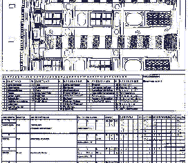
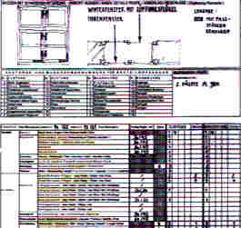
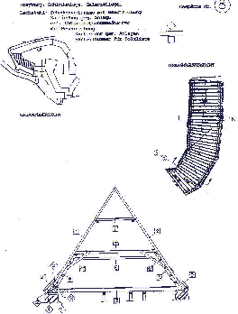

[🠔 Zur Übersicht: Planen im Altbau](11planme.md)  
# DAS RAUMBUCHSYSTEM - Einführung
**Von der Bestandsaufnahme zur Ausschreibung mit systematischer Bauteil-, Schadens- und Maßnahmenerfassung.**  
_von Konrad Fischer_

> [!abstract]+ Kapitelübersicht: Raumbuch Einführung  
> 1. **DAS RAUMBUCHSYSTEM - Einführung**
> 2. [DIE AUFGABENSTELLUNG DES RAUMBUCHSYSTEMS](11rabus1.md)
> 3. [Planungs- und Organisationshilfen für Bauherrn + Planer](11form.md)

Konrad Fischer 

## DAS RAUMBUCHSYSTEM

(Vorbemerkung: Der Autor hat als Ergebnis umfangreicher Planungserfahrung bei ca. 400 kostengetreu abgerechneten Bauprojekten für alle Bauteile des historischen Bestands ein Raumbuch-Formularsystem entwickelt, in dem die Elemente Bauteilkonstruktion, Zustand (Schäden) und erforderliche Maßnahmen in einem einfachen Auswahlsystem einzutragen sind. Damit entsteht schon bei der Bestandsaufnahme eine überschlägige und zuverlässige Maßnahmenbeschreibung. 

Es geht dabei um die Themen Bauschaden, Schadenserfassung, systematische Bestandsaufnahme, Leistungsbeschreibung, Kostenschätzung und Kostenermittlung. Formulare in Anwendungsbeispielen finden Sie im Aufsatz zur **[wirtschaftlichen Instandsetzung](11erhins.md)**. 

Beispiele aus der Erfassung mit dem Raumbuchsystem: 
 
Raumbuch Formular für Fassade 
 
Raumbuch Formular für Fenster 
 
Formular Holzliste für Dachstuhl / Holzkonstruktion

**Das vollständige Formularsystem (22 A4-Seiten als Excel4-Dokumente) ist beim Autor gegen Kostenerstattung erhältlich - >**[Bestellformular)](11form.md)****

Drei Architektenaufgaben sind es, die den Erfolg einer Instandsetzung wesentlich bestimmen:

1. Die zutreffende Bestandsaufnahme

2. Ihre Umsetzung in eine substanzschonende Planung und

3. Vergabe und Abrechnung der Bauleistung nach Einheitspreisen gem. VOB. 

Versäumnisse in diesen Leistungsbereichen verursachen die bekannten Kostenexplosionen im Altbau. Sie entstehen durch:

- Mangelhafte Erfassung des Baubestands,

- Bestandsaufnahme ohne Beachtung der Baudurchführung und Praxisbezug,

-·mangelhafte Ausbildung und Erfahrung der Planungsseite.

Außerdem unterschätzt der Bauherr oft den Wert angemessener Voruntersuchungen und qualifizierter Bauplanung insgesamt. Der Planungsauftrag wird dann nicht dem fachlichen, sondern dem Preiswettbewerb unterworfen. „Saving the penny and loosing the pound!“ Auch die sonstigen Planungs-, Bau und Finanzierungsbeteiligten mißachten offenbar nur allzugern die technischen und wirtschaftlichen Wirkungszusammenhänge im Projektablauf.

Im Unterschied zu gängigen „Checklistensystemen“ zur Bestandsaufnahme und zu Befundinventarisationen, die statt „Raumbuch“ besser „Raumroman“ heißen sollten, erfordert die Praxis ein brauchbares Erfassungssystem für die technische Bestandsaufnahme. Dazu das Anforderungsprofil:

- Anwendbarkeit in Altbaukonstruktionen jeder Bauzeit und Bauart (offenes System),

- Anwendbarkeit für Planungsbeteiligte mit technisch-konstruktiver Grundausbildung,

- schnelles, selbstführendes, leicht erlernbares Erfassungssystem in einheitlicher Fachterminologie und Form mit Vorgabe der gebräuchlichen Konstruktionsteile für alle Bauteile und -schaden,

- planungsorientierte Schadenserfassung und keine Produktion von Datenschrott ohne Planungsbezug,

- Logisch geordnetes und ergebnisbezogenes Erfassen der Altbaukonstruktion gemeinsam mit ihren Schäden durch:

- lagegetreue zeichnerische Darstellung und Kartierung auch als Ergebniskontrolle der parallel erfolgenden beschreibenden Erfassung,

- fachterminologisch und bautechnisch zutreffende Beschreibung der Konstruktion, der Schäden und der davon abhängigen Maßnahmen jeweils mit Mengenangabe,

- begleitende Fotodokumentation auch zur späteren Kontrolle des Arbeitsergebnisses,

- wirtschaftliche Erfassung möglichst „harter“ Daten,

- möglichst objektive, widerspruchsarme Datenerfassung mit geringem Interpretationsbedarf zur Weiterverarbeitung in der Planung auch durch andere,

- möglichst vollständige Erfassung später kostenverursachender technischer Einflußgrössen,

- Hierarchisch geordnete Erfassung der Datenmengen von der Baukonstruktion zum Schaden in Rückkoppelung mit den davon abhängigen Maßnahmen ohne interpretationsbedürftige und widerspruchsprovozierende Bedeutungsmischung,

- Erfassung aller historischen und neuzeitlichen Baukonstruktionsteile mit dem gleichen System.

Die Einlösung dieses Anforderungsprofils verwirklicht das Bestandserfassungssystem, das über verschiedene Vorstufen seit 1984 bei Vorbereitung und Durchführung von etwa 150 Altbauprojekten praxisnah erprobt wurde. Seine Tauglichkeit als zuverlässiges Planungsinstrument hat es dabei bewiesen.

Das Holzlistensystem und das nachfolgend vorgestellte Raumbuchsystem bilden die Einzelbestandteile des Bestandserfassungssystems.

---

**[DIE AUFGABENSTELLUNG DES RAUMBUCHSYSTEMS UND SEINE TECHNISCHE UMSETZUNG ...](11rabus1.md)**
