[🠔 Zur Übersicht: Startseite](index.md)
# Video Vorträge und Diskussionsveranstaltungen mit Konrad Fischer
**Denkmalpflege, Energie sparen und Richtiges Bauen: Vorträge und Diskussionsveranstaltungen**    
_mit Konrad Fischer • ab Ende 1998, aktuelle zuerst_

[Vorträge & Publikationen vor 1998](1sempub.md)

> [!abstract]+ Kapitelübersicht: Video-Vorträge
> 1. **Video Vorträge und Diskussionsveranstaltungen mit Konrad Fischer**
> 2. [Fokus Holzbau: Energiesparen mit Fassadendämmung? Theorie und Praxis](v1-fokus-holzbau.md)
> 3. [CO2 sparen durch Dämmzwang - warum und wieso](v2-co2-daemmzwang.md)
> 4. [Arbeitskreis Baubiologie Mainfranken: Energiesparen beim Bauen und Sanieren](v3-ak-baubiologie.md)
> 5. [Minimax-Fachkongress: Wärmedämmung - eine zündende Idee](v4-minimax-kongress.md)
> 6. [IBA - Schloß Bedheim: II. Kamingespräche](v5-iba-bedheim.md)
> 7. [Pankower Mieterforum: Warum sollen wir unsere Wohnungen dämmen?](v6-mieterforum-pankow.md)
> 8. [3. Bürgerschutztag 2015 München-Haar](v7-buergerschutztag-2015.md)
> 9. [Wärmedämmung WDVS - Ein Verbrechen an der Menschheit](v8-wdvs-verbrechen.md)
> 10. [Fassadendämmung - Wohltat oder Wahn?](v9-fassadendaemmung-wahn.md)
> 11. [FAZ Lesertelefon - Wer hilft gegen den Dämmwahn](v10-faz-lesertelefon.md)
> 12. [Nachhaltiges Wegwerfen - TU Braunschweig Symposium](v11-nachhaltig-wegwerfen.md)
> 13. [Altbauten energiesparend sanieren - immer beste Lösung?](v12-altbau-sanieren.md)
> 14. [Kostengünstige & denkmalgerechte Sanierung - Münster 2013](v13-denkmal-sanierung.md)
> 15. [Altbauten kostengünstig sanieren - Bürgerschutztag Nürnberg](v14-altbau-sanierung-nuernberg.md)
> 16. [EnEV & Schimmelpilz - Wahrheit der Bauphysik](v15-enev-schimmel.md)
> 17. [Richtig Bauen & Sanieren ohne Klimaschwindel](v16-richtig-bauen.md)
> 18. [Feuchte, Schimmel + Bankrott - Fehler der Sanierung](v17-feuchte-schimmel.md)
> 19. [Deutschland, Land der Dichter & Dämmer](v18-dichter-daemmer.md)
> 20. [Dämmen oder Speichern? Vom richtigen und falschen Bauen](v19-daemmen-oder-speichern.md)
> 21. [Altbau und Energiespargesetze - Wahnsinn oder Methode?](v20-energiespargesetze.md)
> 22. [Hochhaus-/Altbau-Fassade - Instandsetzen oder Vollwärmeschutz?](v21-hochhaus-fassade.md)
> 23. [Ökommunismus, Klimaschutzterror & Energie-Planwirtschaft](v22-heizsysteme.md)
> 24. [Kalk am Baudenkmal - Scheitern und Gelingen](v23-kalk-baudenkmal.md)
> 25. [Fassaden energetisch richtig sanieren](v24-fassaden-richtig-sanieren.md)

## Altbau & Denkmalpflege Fach-Vorträge

> **Buchungsanfrage:** Bei Interesse an Konrad Fischer als Referent bitte Kontaktaufnahme unter:  📞 **Tel:** 09574-3011 / 0170-7351557  
> _Kosten nach Absprache, erfolgsabhängige Honorarvereinbarung möglich._

---    

 🗓️ 2019
### Fortbildung für Jugendliche in der Denkmalpflege an Kirchenburgen 
- **Datum:** Sommer • **Ort:** Siebenbürgen
Details folgen 

---  

 🗓️ 2018
### FOKUS Holzbau "Sanierung mit Mehrwert"
[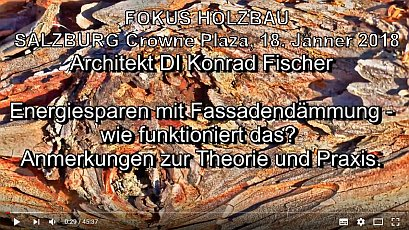](https://youtu.be/a6INROnciN4)

- **Thema:** Energiesparen mit Fassadendämmung? • **[🗎 Transkript lesen](v1-fokus-holzbau.md)**
- **Datum:** 18.01.2018 • **Ort:** Crowne Plaza Salzburg, Österreich
- **Veranstalter:** [Proholz Salzburg](http://www.proholz-salzburg.at) & [Arch_Ing Ziviltechniker](http://www.arching-zt.at)

---

 🗓️ 2017
### 11. Internationale Klima- und Energiekonferenz (EIKE)
[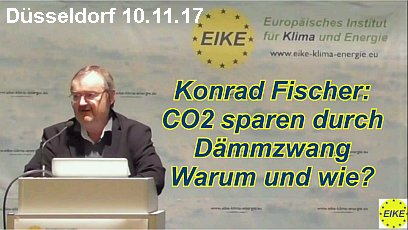](https://youtu.be/O2jVQMKabPA)

- **Thema:** CO2 sparen durch Dämmzwang – warum und wie? • **[🗎 Transkript lesen](v2-co2-daemmzwang.md)**
- **Datum:** 10.11.2017 • **Ort:** Nikko Hotel Düsseldorf, Deutschland
- **Veranstalter:** Europäisches Institut für Energie und Klima (EIKE)

### Arbeitskreis Baubiologie Mainfranken

- **Thema:** Wärmedämmung und Heizung im Kreuzfeuer • **[🗎 Transkript lesen](v3-ak-baubiologie.md)**
- **Datum:** 02.03.2017 • **Ort:** Bürgerbräugelände Würzburg, Deutschland
- **Veranstalter:** [Arbeitskreis Baubiologie Mainfranken e.V.](http://www.baubiologie-mainfranken.de)

---

 🗓️ 2016
### Fachkongress Brandschutz-Akademie
[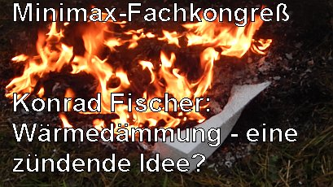](https://youtu.be/dasCZtGs1p0)

- **Thema:** Wärmedämmung – eine zündende Idee? • **[🗎 Transkript lesen](v4-minimax-kongress.md)**
- **Datum:** 16.11.2016 • **Ort:** Bad Teinach, Deutschland
- **Veranstalter:** [Minimax Mobile Services](http://www.minimax-mobile.com)

### II. Bedheimer Kamingespräche: LAND.BAU.KUNST
[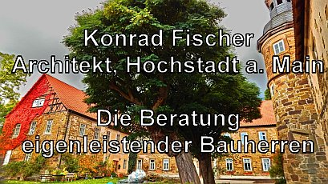]("https://youtu.be/GTInvv22cmI)   

- **Thema:** Beratung von eigenleistenden Bauherren • **[🗎 Transkript lesen](v5-iba-bedheim.md)**
- **Datum:** 21.10.2016 • **Ort:** Schloss Bedheim, Thüringen
- **Veranstalter:** [IBA Thüringen](https://www.iba-thueringen.de)

### 3. Pankower Mieterforum
[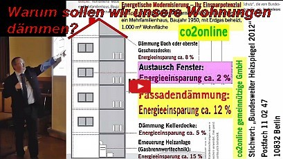](https://youtu.be/rWvRDb_cplA)

- **Thema:** Warum sollen wir unsere Wohnungen dämmen? • **[🗎 Transkript lesen](v6-mieterforum-pankow.md)**
- **Datum:** 06.04.2016 • **Ort:** Berlin-Pankow, Deutschland
- **Veranstalter:** Pankower Mieterforum "[Angemessenheit energetischer Sanierung](https://www.berlin.de/ba-pankow/aktuelles/pressemitteilungen/2016/pressemitteilung.464218.php)"  

---

 🗓️ 2015
### 3. Deutscher Bürgerschutztag
[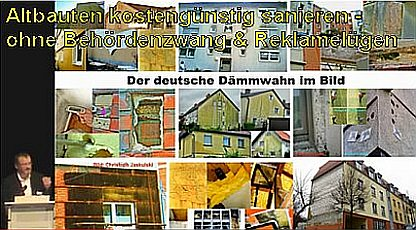](https://youtu.be/u6lD59yMev4)

- **Thema:** Wärmedämmung - Lohnt sich das für Mieter und Eigentümer? • **[🗎 Transkript lesen](v7-buergerschutztag-2015.md)**
- **Datum:** 16.06.2015 • **Ort:** München-Haar, Deutschland
- **Veranstalter:** [Schutz-Gemeinschaft für Wohnungs-Eigentümer und Mieter e.V.](http://www.hausgeld-vergleich.de)

### Tongji University Shanghai: Building Rehabilitation

- **Thema:** Building Rehabilitation for Private or Public Purpose
- **Datum:** 02.04.2015 • **Ort:** CAUP Tongji University, Shanghai, China
- **Veranstalter:** College of Architecture and Urban Planning CAUP

### Tongji University Shanghai: China and Chinoiserie

- **Thema:** China and Chinoiserie - History and Examples
- **Datum:** 30.03.2015 • **Ort:** CAUP Tongji University, Shanghai, China
- **Veranstalter:** College of Architecture and Urban Planning CAUP

### Hochbautag Rheinland-Pfalz
[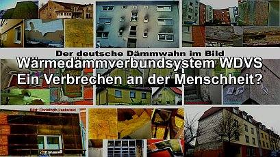](https://youtu.be/uiSl5NMXBjQ)

- **Thema:** Fassadendämmung, ein Verbrechen an der Menschheit? • **[🗎 Transkript lesen](v8-wdvs-verbrechen.md)**
- **Datum:** 06.02.2015 • **Ort:** Mainz, Deutschland
- **Veranstalter:** Hochbautag 2015 - Versammlung der Fachgruppe Hochbau im Baugewerbeverband Rheinland-Pfalz  

---

 🗓️ 2014  
### Tagesspiegel: Wohnen in der Zukunft – Von den eigenen vier Wänden bis zur Energiewende  
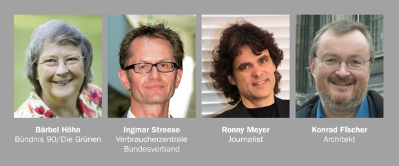
  
- **Thema:** Nachhaltige Wärmeversorgung und energetische Sanierung
- **Datum:** 24.11.2014 • **Ort:** Verlagsgebäude Tagesspiegel, Askanischer Platz 3, 10963 Berlin
- **Veranstalter:** Der Tagesspiegel (unterstützt vom GDI-Gesamtverband der Dämmstoffindustrie)
- **Podium:** Bärbel Höhn, Ingmar Streese, Ronny Meyer, Konrad Fischer • **Moderation:** Moritz Döbler
  
 **Veranstaltung am 23.11.2014 vom Veranstalter kurzfristig abgesagt, da Bärbel Höhn anderweitigen Termin wahrnehmen wollte und ein Pro-Redner sich krankmeldete. Schade, schade.**  
 
### VDGN: Fassadendämmung – Wohltat oder Wahn?
[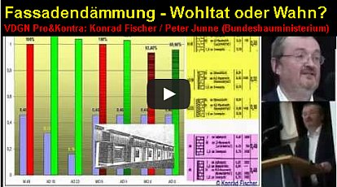](https://youtu.be/CrZETAQugpU)

- **Thema:** Öffentliche Diskussion zur Fassadendämmung • **[🗎 Transkript lesen](v9-fassadendaemmung-wahn.md)**
- **Datum:** 21.06.2014 • **Ort:** Berlin-Marzahn, Deutschland
- **Veranstalter:** Verband Deutscher Grundstücksnutzer e.V., Irmastraße 16, 12683 Berlin  
- 
### FAZ-Telefonaktion
[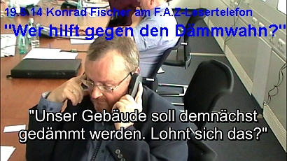](https://youtu.be/ES64I6vU090)

- **Thema:** Wer hilft gegen den Dämmwahn? • **[🗎 Transkript lesen](v10-faz-lesertelefon.md)**
- **Datum:** 19.05.2014 • **Ort:** Frankfurt am Main, Deutschland
- **Veranstalter:** [Frankfurter Allgemein Zeitung FAZ](http://www.faz.net/aktuell/wirtschaft/liveblog-wer-hilft-gegen-den-daemmwahn-12941421.html)  

### Symposion "Entwurf und Nachhaltigkeit" TU Braunschweig
[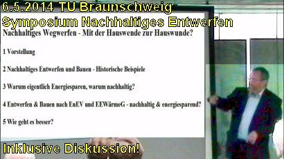](https://youtu.be/2aca2wlLcRo)

- **Thema:** Nachhaltiges Wegwerfen - Von der Hauswende zur Hauswunde? • **[🗎 Transkript lesen](v11-nachhaltig-wegwerfen.md)**
- **Datum:** 06.05.2014 • **Ort:** TU Braunschweig, Deutschland
- **Veranstalter:** Technische Universität Braunschweig

### Gewerbeschule Bautechnik Hamburg (G19)
[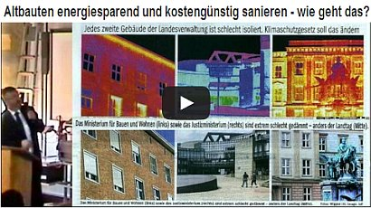](https://youtu.be/IhVkJArTmXI)

- **Thema:** Altbauten kostengünstig und energiesparend sanieren • **[🗎 Transkript lesen](v12-altbau-sanieren.md)**
- **Datum:** 26.03.2014 • **Ort:** Hamburg, Deutschland
- **Veranstalter:** [Staatliche Gewerbeschule Bautechnik G19](http://www.gneunzehn.de/)  

---

 🗓️ 2013
### Fachvortrag NRW.BANK / MBWSV
[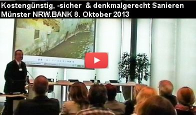](https://youtu.be/CgVET6gLD7Q)

- **Thema:** Bauliche Maßnahmen zur denkmalgerechten Sanierung • **[🗎 Transkript lesen](v13-denkmal-sanierung.md)**
- **Datum:** 08.10.2013 • **Ort:** Münster, Deutschland
- **Veranstalter:** Ministerium für Bauen, Wohnen, Stadtentwicklung und Verkehr MBWSV des Landes Nordrhein-Westfalen und die NRW.BANK  

### 1. Deutscher Bürgerschutz-Tag Nürnberg

- **Thema:** Altbauten kostengünstig sanieren • **[🗎 Transkript lesen](v14-denkmal-sanierung.md)**
- **Datum:** 12.03.2013 • **Ort:** Nürnberg, Deutschland
- **Veranstalter:** [Schutz-Gemeinschaft für Wohnungs-Eigentümer und Mieter e.V.](http://www.hausgeld-vergleich.de)

### 3. Schimmelpilzkonferenz Berlin
[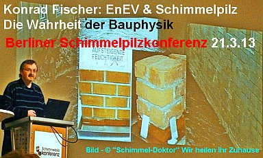](https://youtu.be/cHkK30uIfLY)

- **Thema:** EnEV und Schimmelpilz - Die Wahrheit der Bauphysik • **[🗎 Transkript lesen](v15-enev-schimmel.md)**
- **Datum:** 21.03.2013 • **Ort:** Berlin-Adlershof, Deutschland
- **Veranstalter:** [BAULINO Verlag GmbH](http://www.baulino.de)   

_Durchgeführt trotz Boykottaufforderung seitens der Dämmlobby!_   

### Messe Ludwigsburg: Energie, Umwelt & Handwerk
- **Thema:** Feuchte, Schimmel und Bankrott im Altbau
- **Datum:** 17.03.2013 • **Ort:** Ludwigsburg, Deutschland

---

 🗓️ 2012
### 13. Bremer Bausachverständigentag
[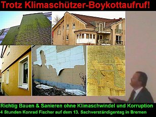](https://youtu.be/eXL7RC8Hx_A)

- **Thema:** Klimaschutz beim Bauen - Chancen und Risiken • **[🗎 Transkript lesen](v16-richtig-bauen.md)**
- **Datum:** 27.09.2012 • **Ort:** Bremen, Deutschland
- **Veranstalter:** Architektenkammer und Ingenieurkammer Bremen   
- 
_Durchgeführt trotz öffentlichen Boykottaufrufs an den Präsidenten der Architektenkammer seitens gewerblicher/selbstständiger Dämmlobbyisten/Dämmplaner aus Bremen._

### Immobilientage Neustadt an der Weinstraße

- **Thema:** Feuchte, Schimmel und Bankrott • **[🗎 Transkript lesen](v17-feuchte-schimmel.md)**
- **Datum:** 15.09.2012 • **Ort:** Neustadt an der Weinstraße, Deutschland
- **Veranstalter:** [Mattfeldt & Sänger Marketing und Messe AG](http://www.messe.ag)

_Durchgeführt trotz Boykottaufrufs seitens gewerblicher Dämmlobbyisten._

### Vortragsveranstaltung Coburg (Kongreßhaus Rosengarten)

- **Thema:** Land der Dichter und der Dämmer? Der ganz normale Dämmwahnsinn • **[🗎 Transkript lesen](v18-dichter-daemmer.md)**
- **Datum:** 12.05.2012 • **Ort:** Coburg, Deutschland
- **Veranstalter:** Haus und Grundbesitzerverein Coburg e.V., VR-Bank Coburg & Stadtbild Coburg e.V.

_Durchgeführt trotz Boykottaufrufs seitens Dämmlobbyisten aus Energieberaterkreisen._

### Betonbauteile-Industrieverband e.V. (Bad Soden)

- **Thema:** Neubau Massiv ohne EnEV - Wie geht das? (Befreiung von EnEV-Pflicht) • **[🗎 Transkript lesen](v19-daemmen-oder-speichern.md)**
- **Datum:** 02.02.2012 • **Ort:** Bad Soden (Taunus), Deutschland
- **Veranstalter:** Betonbauteile-Industrieverband e.V.

---

🗓️ 2011
### Kolloquium "Denkmal-Doping Deutschland"
- **Thema:** Denkmal-Doping Deutschland – was erträgt das Denkmal?
- **Datum:** 12.11.2011 • **Ort:** Congress-Centrum Ost, Köln, Deutschland
- **Veranstalter:** Deutsche Burgenvereinigung e.V., Deutsche Stiftung Denkmalschutz, Europa Nostra e.V. & Messe Köln

### BVS-Bundesfachbereich Gebäudetechnik (Kassel)

- **Thema:** Altbau und Energiespargesetze unter Berücksichtigung der Wirtschaftlichkeit • **[🗎 Transkript lesen](v20-energiespargesetze.md)**
- **Datum:** 08.11.2011 • **Ort:** RAMADA Hotel Kassel City Centre, Deutschland
- **Veranstalter:** [BVS - Bundesverband öffentlich bestellter und vereidigter Sachverständiger e.V.](http://www.bvs-ev.de)

### WEG-Versammlung Bayreuth (Hochhaus Rückertweg)

- **Thema:** [Fassadendämmung ist Pfusch und lohnt sich nicht](213baust.md)  • **[🗎 Transkript lesen](v21-hochhaus-fassade.md)**
- **Datum:** 07.07.2011 • **Ort:** Kolpingssaal im Kolpinghaus, Bayreuth, Deutschland
- **Veranstalter:** WEG Bayreuth Rückertweg & Hausverwaltung AIB Tischler-Unglaub

### Konferenz zur Schönheit und Lebensfähigkeit der Stadt
- **Thema:** [Altbauten dämmen oder sanieren?](11erhins.md)
- **Datum:** 25.03.2011 • **Ort:** Rheinterrasse Düsseldorf, Deutschland
- **Veranstalter:** [Deutsches Institut für Stadtbaukunst an der TU Dortmund](http://www.dis.tu-dortmund.de)

### Bauhütte Obbach (Oberes Werntal)
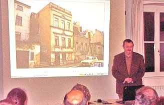

- **Thema:** [Altbauten kostengünstig und energiesparend instandsetzen](11erhins.md)  
  [Voraussetzungen der kostengünstigen und energiesparenden Sanierung in Bestandsaufnahme und Planung](10hoai.md)   
  [Kostengünstige und kostentreibende Sanierungsmethoden](11erhins.md)   
  [Aufsteigende Feuchte - was tun?](2aufstfe.md)   
  [Alternative Energiesparmethoden anstelle Dämmen und Dichten](7temper.md)   
  [Bestandsgerechte Baustoffverwendung und moderner Handwerkspfusch](2baustof.md)   
  [Befreiung von EnEV und EEWärmeG - wie geht das?](21311bau.md)   
- **Datum:** 23.03.2011 • **Ort:** Bauhütte Obbach, Euerbach, Deutschland
- **Veranstalter:** Interkommunale Allianz Oberes Werntal
- **Zeitungsbericht Mainpost:** [Gegen die Dämmokratur](http://www.mainpost.de/regional/schweinfurt/Gegen-die-Daemmokratur;art763,6068308)  

### Deutscher Sachverständigentag (Berlin)
[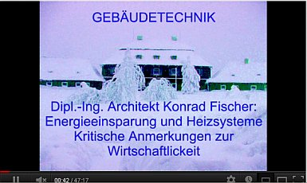](https://youtu.be/G5RjstPchWM)

- **Thema:** [Energieeinsparung und Heizsysteme](7temper.md) • **[🗎 Transkript lesen](v22-heizsysteme.md)**
- **Datum:** 18.03.2011 • **Ort:** Hotel Hilton, Berlin, Deutschland
- **Veranstalter:** [Deutscher Sachverständigentag GmbH / BVS e.V.](http://iw.homepagepreview.de/index.php?id=88)

### HAWK / NLD Seminar (Hannover)
- **Thema:** [Kostensicheres Ausschreiben mit dem Positionsbausteinsystem Teil 1](9pbs.md)   
  [Kostensicheres Ausschreiben mit dem Positionsbausteinsystem Teil 2](9pbs01.md)
- **Datum:** 04.03.2011 • **Ort:** Hanns-Lilje-Haus, Hannover, Deutschland
- **Veranstalter:** HAWK Fakultät Bauwesen, Niedersächsisches Landesamt für Denkmalpflege & Architektenkammer Niedersachsen

---

🗓️ 2010
### Industrial Heritage 2010
- **Thema:** 5. Europäisches Wochenende zum Erhalt des industriellen Erbes
- **Datum:** 19. - 21.11.2010 • **Ort:** Venedig, Italien
- **Veranstalter:** [European Federation of Associations of Industrial and Technical Heritage (E-FAITH)](http://www.e-faith.org)

### Bayerische Kirchenmalertagung (Thierhaupten)
[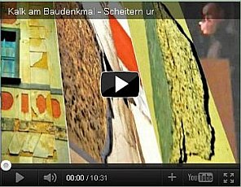](https://youtu.be/lag2mVuCpcA)

- **Thema:** [Kalk am Baudenkmal - Scheitern und Gelingen](2eurolim.md#km11) • **[🗎 Transkript lesen](v23-kalk-baudenkmal.md)**
- **Datum:** 11.11.2010 • **Ort:** Kloster Thierhaupten, Deutschland
- **Veranstalter:** Bayerisches Landesamt für Denkmalpflege & Bayerische Kirchenmalerinnung

### DenkMal: Energie sparen? (Region Bamberg)
- **Thema:** ["Kosten und Energie sparen am Baudenkmal - wie geht das?](11erhins.md)
- **Datum:** 20.09.2010 • **Ort:** Dominikanerbau (Aula der Universität), Bamberg, Deutschland
- **Veranstalter:** Stadt Bamberg, Landkreis Bamberg & HWK Oberfranken

### Verleihung Verbraucherschutz-Award (Nürnberg)
- **Thema:** Altbauten kostengünstig und energieeinsparend sanieren
- **Datum:** 12.05.2010 • **Ort:** Bildungszentrum Nürnberg, Deutschland
- **Veranstalter:** [Schutz-Gemeinschaft für Wohnungs-Eigentümer und Mieter e.V.](http://www.hausgeld-vergleich.de)

### Verband der Grundbesitzverwaltungen NRW
- **Thema:** ["Altbauten kostengünstig und energiesparend sanieren - geht das?"](11erhins.md)  
- **Datum:** 22.04.2010 • **Ort:** WBK-Casino, Coesfeld, Deutschland
- **Veranstalter:** Verband der Grundbesitzverwaltungen Nordrhein-Westfalen ("Renteiverband")

### Unternehmerschulung Maler- und Lackiererhandwerk

- **Thema:** Fassaden energetisch richtig sanieren - Dämmt Dämmstoff? • **[🗎 Transkript lesen](v24-fassaden-richtig-sanieren.md)**
- **Datum:** 29.01.2010 • **Ort:** Kurfürstliche Reitschule, Ingolstadt, Deutschland
- **Veranstalter:** [Landesinnungsverband des Bayer. Maler- und Lackiererhandwerks](http://www.maler-lackierer-bayern.de)

---

🗓️ 2009   
12.11.2009 Gelsenkirchen   
Veranstalter/Organisation/Vortragsort:   
Veranstalter/Organisation: BLB NRW Duisburg, Planen und Bauen - Land 4, Friedrich-Wilhelm-Str. 12, 47051 Duisburg   
Vortragsort: Fortbildungseinrichtung Lichthof, Leithestr. 37, 45886 Gelsenkirchen  
Fachtagung "Planen + Bauen im Bestand - Denkmalpflege im BLB" - Geschlossene Veranstaltung  
Leitung: Michael Pasch, BLB NRW Duisburg  
Programmentwurf:  
09:30 - 12:00 Uhr: Dipl.-Ing. Konrad Fischer, Hochstadt a. Main: Altbausanierung und Haustechnik I  
- Nutzungsanforderungen und DIN  
- Baustoffeigenschaften / Schadensbilder im Altbau  
- Bestandserhaltende Planung als Kostenbremse  
- Planungsumfang und Detaillierungsgrad  
- Baurechtliche Ausnahmen und Befreiungen  
- Kostenermittlung, Leistungsbeschreibung, Vergabe  

13:00 - 15:30 Uhr: Konrad Fischer: Altbausanierung und Haustechnik II  
- Wärme- und Feuchtschutz, genormte Irrtümer  
- Dämmen und Speichern. Anwendung der EnEV  
- HOAI/ Grund- und Besondere Leistungen  
- Kostensicherung, Risikomanagement  
15:45 - 16:00 Uhr: Michael Pasch, Schlußbetrachtung / Feed back  

---

20. - 22. Oktober 2009, Rottach-Egern, 74. BAUSCHÄDEN-FORUM, Leitung: Dipl.-Phys. Rainer Bolle  
21. 
Näheres und Anmeldung:[www.bauschaeden-forum.de](http://www.bauschaeden-forum.de/)  

Drei Tage mit Kollegen, wissenserweiternd, kritisch und denkprovozierend. Drei Tage ohne vorgegebenes Programm (die Begründung finden Sie auf der Homepage)mit Referaten, Diskussionen und Bühnengesprächen  

---

🇸🇪Lund, Schweden/Sverige, 25.09.2009  
Veranstalter/Organisation/Vortragsort:  
[Department of Architectural Restoration and Conservation](http://www.bv.lth.se/english), [Department of Housing Development and Management](http://www.hdm.lth.se/?id=2737), [Lund University, Sweden](http://www.lth.se/) & [Swedish International Development Cooperation Agency (Sida)](http://www.sida.se/):  
[Advanced International Training Programme 2009: Perspectives/Examination and Assessment of Buildings](http://www.hdm.lth.se/education/international_training_programmes/conservation_and_management_of_historic_buildings/)  
Room A:B  
Programm:  
25.09.: 9.15 - 12.00 Uhr: Konrad Fischer: [Work models for building conservation - To control problems and obstacles](repair.md)  
13.15 - 17.00 Uhr: Konrad Fischer: [German Conservation: Approaches, Methodology, Examples from own Practice](repair.md)  

---

15. September 2009: NordBau Neumünster, Gemeinschaftsveranstaltung VHV Versicherungen und [Baugewerbeverband Schleswig-Holstein](http://www.bau-sh.de/)  
16. NordBau-Tagung der Landesfachgruppe Massiv-Bau, 9.30 -12.30 Uhr  
16. Carsten Kock, Chefkorrespondent bei Radio Schleswig-Holstein RSH: Ist der Ruf erst ruiniert ... Imagepflege als Erfolgsfaktor  
16. [Dipl.-Ing. Arch. Konrad Fischer](1refernz.md): [Altbauten kostengünstig und energiesparend instandsetzen](11erhins.md)  
16. Aus der Ankündigung:  
16. Deutschlands Altbauten stehen im Zentrum des aktuellen Baugeschehens. Dabei geht es vorwiegend um Klimaschutz und Energiesparen. Können diese Ziele mit den gesetzlich verordneten und in unzähligen Normen geregelten Baumethoden wirklich – und vor allem kostengünstig - ereicht werden? Allerorten belegen verrottende Dämmfassaden, verschimmelte Wohnungen und Kostenexplosionen bei kaum spürbaren oder gleich ausbleibenden Energieeinsparungen das Bedrohungspotential der "energetischen" Sanierung für die Bausubstanz, die Wohngesundheit und die Bauherrenkasse. Der für seine provokanten Denkansätze bekannte Referent zeigt die gegebenen Widersprüche auf und schlägt bewährte Alternativen vor.  
16. Prof. Dipl.-Ing. Arch. Ingo Gabriel: Die EnEV 2009 - Herausforderung oder Ruin für den Massivbau  
16. Aus der Ankündigung:  
16. Die EnEV 2009 wird mit einer breiten Zustimmung von Politik und Energiefachleuten nach der Bundestagswahl in Kraft treten. Dabei wird der Primär-Energiebedarf um 30% gesenkt, für das Jahr 2012 ist eine Verschärfung um weitere 30% geplant. Welche Auswirkungen haben diese Vorgaben auf künftige Mauerwerkskonstruktionen und die Sanierung bestehender Gebäude? Lassen sich zukünftige Standards noch mit der klassischen Ziegelfassade versehen? Welche Detailprobleme sind zu lösen, mit welchen Risiken und Nebenwirkungen ist zu rechnen? Hat die Ziegelfassade noch eine Zukunft? Welche Innovationen sind vom Mauerwerksbau zu erwarten? Diese und andere kritische Fragenstellungen werden im Rahmen des Vortrags provokant diskutiert.  
16. 
---

5. Juni 2009, 10.00 Uhr: Niedersächsisches Landesamt für Denkmalpflege, Scharnhorststr. 1, 30175 Hannover  
6. Veranstalter/Organisation/Veranstaltung:  
6. HAWK Hochschule für angewandte Wissenschaft und Kunst Fachhochschule Hildesheim / Holzminden / Göttingen, Fakultät Bauwesen, Niedersächsisches Landesamt für Denkmalpflege NLD, Architektenkammer Niedersachsen  
6. Im Rahmen der viersemestrigen "Weiterbildung Denkmalpflege": 6. Ausschreibung, Ausführung, Qualitätssicherung (HOAI § 15, Leistungsphase 6-8)  
6. Tagesprogramm:  
6. 10:00 - 11:30 Uhr: Dipl.-Ing. Arch. Martin Schumacher (Burkhardt + Schumacher Architekten, Braunschweig: Maurerarbeiten: Mauerwerk, Fuge und Putz; Zimmerarbeiten: Konstruktion von Wand, Decke und Dach  
6. 11:45 - 13:15 Uhr: Dipl.-Ing. Arch. Henrik Boldt, Klosterkammer Hannover: Tischlerarbeiten: Innenausbau, Fenster, Türen, Treppen; Dachdeckerarbeiten: Vom Schieferer bis zum Blechner  
6. 13:45 - 15:15 Uhr: [Dipl.-Ing. Arch. Konrad Fischer](1refernz.md): Altbausanierung: [Kostensicheres Ausschreiben mit dem Positionsbausteinsystem Teil 1](9pbs.md)  
6. 15:30 - 17:00 Uhr: [Kostensicheres Ausschreiben mit dem Positionsbausteinsystem Teil 2](9pbs01.md)  
6. 
---

6. März 2009, ab 15.00 Uhr: Tagungszentrum Betzenberg, Fritz-Walter-Stadion, 67663 Kaiserslautern  
7. Veranstalter/Organisation/Veranstaltung:  
7. [Baugewerbeverband Rheinland-Pfalz e.V.](http://www.bgv-rheinland-pfalz.de/)  
7. Fachgruppenversammlungder Fachgruppe Hochbau - geschlossene Veranstaltung  
7. Vortragsprogramm:  
7. Dipl.-Ing. Konrad Fischer, Architekt: [Massivbauten energiesparend und kostengünstig sanieren.](11erhins.md)  
7. Dipl.-Ing. Gerhard Winkler, Geschäftsführer der Zertifizierung Bau e.V., Berlin: Präqualifikation  
7. RA Dr. Harald Weber, Hauptgeschäftsführer Baugewerbeverband RLP e.V.: Änderungen der VOB vor dem Hintergrund des Konjunkturpaketes II der Bundesregierung  
7. 
---

23.01.2009, 17.00 Uhr: Naumburg, Naumburg-Haus, Lindenring 34  
Veranstalter/Organisation/Veranstaltung:  
[IBA Stadtumbau 2010](http://www.iba-stadtumbau.de/), [Bürgerverein](http://www.naumburger-buergerverein.de/) und [Umweltladen e.V.](http://www.naumburger-umweltladen.de/)  
Workshop: Ein Architektur- und Umwelthaus für Naumburg im Rahmen der IBA Stadtumbau 2010 - Informationsveranstaltung und Erfahrungsberichte  
Moderation: Dr. Babette Scurrell, IBA-Büro  
[Presseankündigung](http://www.iba-stadtumbau.de/index.php?Ein-Architektur-und-Umwelthaus-fur-Naumburg)  

Öff. Programm:  
17.00 - 17.05 Uhr: Oberbürgermeister Bernward Küper, Naumburg: Begrüßung  
17.05 - 17.30 Uhr: Bärbel Cronau-Kretzschmar, Naumburger Bürgerverein e.V.: Das IBA-Projekt Architektur- und Umwelthaus Naumburg - Idee und Konzept  
17.30 - 18.00 Uhr: Dr. Hannes Hubrich, Bauhaus-Universität Weimar: Baukulturelle Bildung und die Vermittlung von Architektur  
18.00 - 18.30 Uhr: Hansjörg Luser, ehem. im Vorstand des Grazer "Hauses der Architektur" und ehem. Leiter des Amtes für Stadtentwicklung, Graz: Das Haus der Architektur Graz: Entstehung, Programme, Organisation, Finanzierung - Erfahrungsbericht  
18.30 - 19.00 Uhr: Christoph Heinemann, Institut für angewandte Urbanistik (ifau) Berlin: Haus der Architektur Graz - "Architektur als Verhandlungsraum"  
19.00 - 19.30 Uhr: Konrad Fischer, Dipl.-Ing. Architekt BYAK, Hochstadt a. Main: [Die sparsame Reparatur und Instandsetzung von historischen Bauruinen](11erhins.md)  
19.30 - 20.00 Uhr: Diskussion  

---

2008  

---

Hannover 04.12.2008, 10:00-17:00 Uhr  
Altbauseminar: "Altbauten kostengünstig instandsetzen"  
Themenblöcke:  
1 - Kostensparende und substanzerhaltende Instandsetzung,  
2 - Bauphysik im Altbau,  
3 - Vertragsstrategie im Altbau.  

Veranstalter:  
[HLBS-Informationsdienste GmbH ](http://www.hlbs.de)  
Seminarabteilung  
Kölnstraße 202  
53757 Sankt Augustin  
Tel.: 0 22 41 - 25 65 410, Fax.: 0 22 41 - 25 65 420  

Zielgruppen: Erwerber, Eigentümer, Sachverständige, Berater, Architekten, Makler  

Aus dem Ankündigungstext des Veranstalters:  
Jahr für Jahr wechseln eine Vielzahl von Altbauten aus den verschiedensten Anlässen die Eigentümer. Beim Erwerb und bei Instandsetzung von Altbauten ist der Laie aus bautechnischer Sicht häufig überfordert und auf kompetente Beratung angewiesen. Der Referent, Dipl.-Ing. Univ. Konrad Fischer, verfügt über Praxiserfahrung aus mehr als 400 kostensicher abgerechneten Sanierungsprojekten bundesweit. Seine Kompetenz ist gefragt auch im europäischen Ausland rund um das Thema „Altbau und historische Immobilien“. Er zeigt Wege auf, wie potentielle Erwerber durch kostensparende und substanzerhaltende Instandhaltung eine Altbauimmobilie „ans Laufen“ bringen und Kostenexplosionen, teuren Pfusch und unwirtschaftliche Substanzzerstörung bei der Sanierung vermeiden. Von der Bestandsaufnahme bis zur Schlußabrechnung. Fischer vertritt eine Bauphysik, die falschen Normen und Produktlobbyismus bewußt widerspricht, damit Sie kostengünstig, wirtschaftlich und bestandgerecht sanieren und Ausnahmeregelungen als Kostenbremse nutzen können. Viele praktische Beispiele und umfangreiche Seminarunterlagen veranschaulichen die vorgeschlagenen und oft wenig bekannten Lösungsansätze, die Pflichtlektüre für potentielle Bauherren sind. Denn gerade hier gilt: „Geld spart, wer vor der Investition die Experten zu Rate zieht“.  

Referent: Dipl.-Ing. [Konrad Fischer](1refernz.md), Architekt BYAK  

Programm  

10.00 - 10.15 Uhr Begrüßung und Einführung  
10.15 - 11.30 Uhr und 12.00 - 13.00 Uhr Kostensparende und substanzerhaltende Instandsetzung  
- Qualität, Lage, Exposition, geplante Nutzung der Immobilie  
- Baustoffeigenschaften im Altbau – Ein Buch mit sieben Siegeln?  
- Typische Schadensbilder, offene und mögliche versteckte Mängel sowie deren Instandsetzung  
- Sanierungsstandards und Modernisierung – mit oder ohne DIN?  
- Bestandserhaltende Planung als Kostenbremse  
- Baurechtliche Ausnahmen und Befreiungen  
- Denkmalpflege - Feind des Altbaueigentümers?  
- Kostenermittlung, Kostenexplosion und Kostendämpfung  
- Leistungsbeschreibung, Vergabe und Abrechnung gem. VOB  

13.00 - 14.00 Uhr Mittagspause  

14.00 - 15.30 Uhr Bauphysik im Altbau  
- Wärme- und Feuchteschutz – alles genormte Irrtümer?  
- Physikalische Grundlagen zur Wärmeleitung und -strahlung  
- Dämmen oder Speichern? Wir funktioniert energiesparendes Bauen?  
- Kosten- und energiesparende Haustechnik im Bestand  
- Wirtschaftliche und gesunde Heiztechnik im Altbau  
- Bauphysik am Fenster  
- Falsche Bauvorschriften und Normen – müssen Sie angewendet werden?  

16.00 - 17.00 Uhr Vertragsstrategie im Altbau  
- Die HOAI – altbaugerecht? Neue Ansätze zur Anwendung als win-win-Instrument  
- Die Grundleistungen und Besondere Leistungen im Altbau  
- Erprobte Verhandlungsstrategien zu Abschluß notwendiger Leistungen, Kostensicherheit und Abbedingen falscher Normen  
- Risikomanagement, Haftung und Gewährleistung  

---

Rottach-Egern am Tegernsee, Kongress-Zentrum, 21.-23.10.2008, 9.00-18.00 Uhr  
Veranstalter/Organisation/Veranstaltung:  
[Bauschäden-Forum](http://www.bauschaeden-forum.de) und [Sax GmbH](http://www.SAX-GmbH.de)  
72. Bauschäden-Forum unter der Leitung von Dipl.-Phys. Rainer Bolle, Bremen (früher unter Senator h.c. Dipl.-Ing. Raimund Probst, Frankfurt a. Main)  
Gastreferat:  
22.10.: 15.00 - 16.15 Uhr: Konrad Fischer, Dipl.-Ing. Architekt BYAK, Hochstadt a. Main: [Fassadensanierung und Baustoffe](22bausto.md)  

---

🇸🇪Lund, Schweden/Sverige, 25./26.09.2008  
Veranstalter/Organisation/Vortragsort:  
[Department of Architectural Restoration and Conservation](http://www.bv.lth.se/english), [Department of Housing Development and Management](http://www.hdm.lth.se/?id=2737), [Lund University, Sweden](http://www.lth.se/) & [Swedish International Development Cooperation Agency (Sida)](http://www.sida.se/):  
[Advanced International Training Programme 2008: Conservation & Management of Historic Buildings, Practical Building Conservation](http://www.hdm.lth.se/education/international_training_programmes/conservation_and_management_of_historic_buildings/)  
HDM studio V:B  
Programm:  
25.09.: 13.15 - 17.00 Uhr: Konrad Fischer: [Work models for building conservation - To control problems and obstacles](repair.md)  
26.09.: 13.15 - 17.00 Uhr: Konrad Fischer: [German Conservation: Approaches, Methodology, Examples from own Practice](repair.md)  

---

🇸🇪Lund, Schweden/Sverige, 06.05.2008  
Veranstalter/Organisation/Vortragsort:  
[Department of Architectural Restoration and Conservation](http://www.bv.lth.se/english), [Department of Housing Development and Management](http://www.hdm.lth.se/?id=2737), [Lund University, Sweden](http://www.lth.se/) & [Swedish International Development Cooperation Agency (Sida)](http://www.sida.se/):  
[Advanced International Training Programme 2008: Conservation & Management of Historic Buildings, Practical Building Conservation](http://www.hdm.lth.se/education/international_training_programmes/conservation_and_management_of_historic_buildings/)  
HDM studio V:B  
Programm:  
08.00 - 10.00 Uhr: Konrad Fischer: [Work models for building conservation - To control problems and obstacles](repair.md)  
10.15 - 10.30 Uhr: Kerstin Barup, Abelardo Gonzalez: Time in Architecture - Welcome  
10.30 - 11.15 Uhr: Mats Edström: Approaches to conservation and infill  
11.15 - 12.00 Uhr: Einar Jarmund: "building on ..."  
13.15 - 14.00 Uhr: Julian Holder: Add Modernism - British Conservation of Modernism  
14.00 - 14.45 Uhr: Morris Hylton III: Conservation of Modernism and Recent Past in USA  
15.15 - 16.00 Uhr: Konrad Fischer: [Conservation in Eastern Germany](repair.md)  
16.15 - 17.00 Uhr: Kerstin Barup: Wrap up of the Day's Presentations and Introduction to Craftmanship  

Lecturers:  
[Dr Kerstin Barup](http://www.barup-edstrom.se/), Course Director, Architect, Prof of Architectural Conservation & Restoration, Director for the School of Architecture  
[Dr Mats Edström](http://www.barup-edstrom.se/), Architect, Prof of Architectural Conservation & Restoration  
Mr [Konrad Fischer](1refernz.md), Dipl ing. Architect, Architektur- und Ingenieurbüro, Germany  
Dr Julian Holder, Historic Areas Advisor and Buildings Inspector, [English Heritage](http://www.english-heritage.org.uk/)  
[Mr Morris Hylton III](http://www.dcp.ufl.edu/contact/sketch.aspx?id=236), Architect, Assistant Professor, Department of Interior Design, University of Florida, USA  
[Mr Einar Jarmund](http://www.jva.no/), Architect, Jarmund och Vigsnes arkitektkontor, Oslo, Norway  

---

Kaiserslautern, 24. April 2008  
Veranstalter/Organisation/Tagungsort:  
[Landesgütegemeinschaft für Bauwerks- und Betonerhaltung Rheinland-Pfalz / Saarland e.V.](http://www.betonerhaltung.com)  
Kohlweg 18, 66123 Saarbrücken, Tel.: 0681/38925-0, Fax: 0681/38925-20  
Restaurant und Tagungszentrum Betzenberg, Fritz-Walter-Stadion, Nordtribüne, 67663 Kaiserslautern  

Vortragsveranstaltung "20 Jahre güteüberwachte Bauwerksinstandsetzung" mit begleitender Fachausstellung  

Moderation: Dipl.-Ing. Klaus Ehrhardt, Vorsitzender der Landesgütegemeinschaft für Bauwerks- und Betonerhaltung Rheinland-Pfalz / Saarland e.V.  

Aus der Ankündigung:  

Die Nachfrage nach Substanzerhaltung, Sicherung und Modernisierung von Bauwerken ist in den letzten Jahren deutlich gestiegen. Erfolgreiche Bauwerkserhaltung setzt eine objektgerechte Planung, den Einsatz spezialisierter und überwachter Fachbetriebe und die Anwendung eignungsgeprüfter Stoffe und Verfahren voraus ...  

Die Mitglieder der Landesgütegemeinschaft leisten seit 20 Jahren auf der Grundlage der Instandsetzungs-Richtlinien des DAfStb sowie der ZTV-ING eine qualitätsorientierte Arbeit auf ihrem Spezialgebiet.  

Mit unserer Veranstaltung soll der Erfahrungsaustausch aller an der Planung, Ausführung und Überwachung Beteiligten angeregt werden. Aktuelle Themen geben praktische Hinweise, die für Architekten und Ingenieure aus Verwaltung, Ingenieurbüros und Unternehmen, die Betoninstandsetzung planen, beauftragen, ausführen und überwachen gleichermaßen interessant sind.  

Programm  
09:00 Dipl.-Ing. Klaus Ehrhardt: Begrüßung / Einführung  
09:25 Bauingenieur Hannes Fiala, öbuv. Sachverständiger für Betontechnologie und Betonschäden, Kriftel: Verantwortlichkeit des Besitzers für die Sicherheit von Bauwerken  
10:10 Dipl.-Ing. Bernd Richter, Ingenieurbüro Richter, Roetgen: Erarbeitung von Konzeptionen für Erhaltung und Instandsetzung von Bauwerken  
11:15 Prof. Dr.-Ing. Michael Schäper, FH Wiesbaden: Instandsetzung hinterfeuchteten Betons  
12:15 [Dipl.-Ing. Konrad Fischer](1refernz.md), Architektur- und Ingenieurbüro, Hochstadt a. Main: [Altbauten kostengünstig sanieren (1)](11erhins.md)  
14:00 [Altbauten kostengünstig sanieren (2)](11erh02.md)  
14:45 Dr. Martin Schichtel, Viking Advanced Materials GmbH, Saarbrücken: Oberfläche 2015 - Die Zukunft der Baustoffe  

---

Quedlinburg, 27. und 28.03.2008  
Veranstalter/Organisation/Vortragsort:  
Veranstalter/Organisation: FHH – Fachverband für Holzschutz und Holzbau Sachsen-Anhalt e.V. [Warnung vor diesem Fachverband: Blieb Vortragshonorar schuldig!]  
Halberstädter Straße 47, 06484 Quedlinburg, Tel. (0 39 46) 70 11 83, 52 69 49  
Vortragsort: Am 27. März und 28. März 2008 im "Kaiserhof" zu Quedlinburg, Pölle 34, 06484 Quedlinburg  

[14. Quedlinburger Holzbautagung: Holzschutz — mit Zukunft?](http://freenet-homepage.de/holzschutz/fhh/14-Holzfachtagung.htm)  
15. Moderation: Dipl.-Ing. E. Schnürer Halle, Beratender Ingenieur, 1. Stellvertreter des Vorsitzenden des Fachverbandes für Holzschutz und Holzbau, Sachsen-Anhalt e.V.  
15. 
Programm 28.03.2008:  
9.00 Uhr Begrüßung - Dipl.-Ing. (FH) Christof Silz Vorsitzender des Fachverbandes für Holzschutz und Holzbau Sachsen-Anhalt e. V. Sachverständiger für Holzschutz  
9.05 Uhr Eröffnung - Dr. E. Brecht, Bürgermeister der Stadt Quedlinburg  
9.15 Uhr bis 10.10 Uhr - Wohin tendiert der Holzschutz?  
– Holzschutz mit und ohne Chemie  
– “Neue“ Maßnahmen zum Schutz des Holzes (wie Thermowood, WPC; aber auch Mikrowellen, erstickende Gase)  
– Zulassungswesen und Vorschriften  
– Normung, insbesondere die neue DIN 68800  
Referent: Dr. H. Willeitner, Hamburg Direktor und Prof. i.R.  
10.10 Uhr bis 10.55 Uhr - Bauphysik und Klimawandel; Änderung im Holzschutz?  
– Wärme- u. Feuchteschutz nach DIN 4108  
– Energieeinsparungsverordnung von 2007  
– Auswertung von eigenen Klimamessungen im Vergleich mit anderen Daten  
– Schlußfolgerungen für den Holzschutz in der Zukunft  
Referent: Dipl.-Phys. Manfred Weise, Wansleben am See  
10.55 Uhr bis 11.10 Uhr - Diskussion zu beiden Themen  
11.10 Uhr - Pause bis 11.30 Uhr  
11.30 Uhr bis 12.15 Uhr - 6 cm Sparrenbreite, konstruktive und statische Erfordernisse  
– lokale Betrachtungen im globalen Dachtragwerk  
– Beispiele und Nachweise  
Referent: Dipl.-Ing. K.-Hendrik Luttmer VDI, Dörverden-Hülsen  
12.15 Uhr bis 12.30 Uhr - Diskussion  
12.30 Uhr bis 13.30 Uhr - Mittagspause  
13.30 Uhr bis 14.15 Uhr - Neues Gütezeichen für Holzschutz-Sachverständige  
– Inhalte und Anforderungen  
Referent: Prof.-Ing. Rodolphi Vors. d. Gütegemeinschaft für Holzschutz und Bautenschutz e.V., Berlin  
14.15 Uhr bis 14.30 Uhr Diskussion  
14.30 Uhr bis 15.15 Uhr - Bestandsaufnahme und Instandsetzung historischer Holzkonstruktionen  
– Bestandsaufnahme u. Bewertung mit dem Holzlisten-System  
– Alternative Holzschutzmethoden ohne Gift  
Referent: Dipl.-Ing. Architekt BYAK Konrad Fischer, Hochstadt am Main  
15.15 Uhr bis 16.00 Uhr - Alternative Sanierungsverfahren aus der Sicht des Sachverständigen und des Praktikers  
– Infrarottechnik  
– Mikrowellen  
– Geregelte Heißluft / Heißluftverfahren  
– Auswertung  
Referent: Joachim Wiesner, Vereidigter Sachverständiger für Holzschutz, Lastrup  
16.00 Uhr bis 16.15 Uhr - Diskussionen zu beiden Themen  
16.15 Uhr - Schlußwort  
Dipl.-Ing. Edmund Schnürer, Halle Beratender Ingenieur, 1. Stellvertreter des Vorsitzenden des Fachverbandes für Holzschutz und Holzbau Sachsen-Anhalt e. V.  

---

2007  
Gelsenkirchen, 16.11.2007  
Veranstalter/Organisation/Vortragsort:  
Veranstalter/Organisation: Bau- und Liegenschaftsbetrieb BLB NRW Zentrale, Mercedesstr. 12 40470 Düsseldorf  
Vortragsort: Fortbildungseinrichtung Lichthof, Leithestr. 37, 45886 Gelsenkirchen  
Fachtagung "Planen und Bauen im Bestand, Denkmalschutz und Denkmalpflege" des Kompetenznetzes Q plus - Geschlossene Veranstaltung  
Leitung: Michael Pasch, BLB NRW Krefeld, Dietlind Simon - Euskirchen, BLB NRW Bonn  
Programm:  
09:00 - 12:00 Uhr: Dipl.-Ing. Konrad Fischer, Hochstadt a. Main: Altbauten kostengünstig instandsetzen I  
- Qualität, Nutzung der Immobilie  
- Baustoffeigenschaften / Schadensbilder im Altbau  
- Sanieren mit oder ohne DIN  
- Bestandserhaltende Planung als Kostenbremse  
- Baurechtliche Ausnahmen und Befreiungen  
- Kostenermittlung, Leistungsbeschreibung, Vergabe  

13:00 - 15:30 Uhr: Konrad Fischer: Altbauten kostengünstig instandsetzen II  
- Wärme- und Feuchtschutz, genormte Irrtümer  
- Dämmen und Speichern. Anwendung der EnEV  
- HOAI/ Grund- und Besondere Leistungen  
- Kostensicherung, Risikomanagement  
15:45 - 16:30 Uhr: Michael Pasch, BLB NRW Krefeld, Dietlind Simon-Euskirchen, BLB NRW Bonn: Schlußbetrachtung / Feed back  

---

🇸🇪Lund, Schweden/Sverige, 04.10.2007  
Veranstalter/Organisation/Vortragsort:  
[Department of Architectural Restoration and Conservation](http://www.bv.lth.se/english), [Department of Housing Development and Management](http://www.hdm.lth.se/?id=2737), [Lund University, Sweden](http://www.lth.se/) & [Swedish International Development Cooperation Agency (Sida)](http://www.sida.se/):  
[Advanced International Training Programme: Conservation & Management of Historic Buildings 2007, Practical Building Conservation](http://www.hdm.lth.se/education/international_training_programmes/conservation_and_management_of_historic_buildings/)  
HDM studio  
Programm:  
08.30 - 10.30 Uhr: Sune Svanberg, Professor of AtomicPhysics, Lund University: Laser-based methods used in building investigations  
10.45 - 12.00 Uhr: Ingela Pålsson.Skarin, Tech. Lic. Architect, Lund University, Dept. Architektural Restoration & Conservation & Konrad Fischer, Dipl.-Ing. Architect, Germany: Building conservation in Germany  
13.15 - 15.00 Uhr: Fischer: Work models for building conservation  
15.15 - 17.00 Uhr: Fischer: To control problems and obstacles  

Feedback-Evaluation for Konrad Fischer from the audience  
(27 persons of governmental cultural departments and ministries, universities, city administrations, architects and archeologists, mostly responsible working for the preservation, conservation, administration and touristic development of cultural heritage and patrimonial monuments from the following countries: Albania/Albanien, Argentina/Argentinien Belorus/Weißrußland, Bolivia/Bolivien, Brazil/Brasilien, Chile, Columbia/Kolumbien, Ekuador/Equador, El Salvador, Honduras, Kosovo, Makedonia/Mazezedonien, Montenegro, Peru, Turkey/Türkei):  

A) Very interesting: 85.2% (23)  
B) Interesting: 14.8% (4)  
C) Not interesting 0% (0)  
Comments:  
- The subject and his approach are perfectly relevant, but he has a firm position which may not be suitable for all. One has to listen to him carefully.  
- It was very interesting and inspirative to hear the approach of Mr Fischer to restoration and traditional techniques!  
- although in a way exaggerated, Konrad's theories are very interesting. I found the second part of the lecture / his practical work / far more interesting and important and more applicable for our future work than the first one / the general overview of the cultural heritage situation in germany  
- Interesting, appealing and joyful lecture ...  
- Compared to high tech methodologies, this was a completely opposite approach. Traditionalism in very industrial states, when high tech is part of daily life. Strange!  
- After his lecture I have questioned my believes about some problems in conservation. He gave one of the best lectures  
- It was interesting to know the ideas of a person that is not compromised with new technologies or products.  
- Radical approach but effective way to operate with restricted budgets. The input of information was considerable with very useful tools for practice (inventory method for instance).  
- I think the best invited achitect (I say invited to say non considering the Lund University Staff: Kerstin, Mats, Ingela, Jenny, Annette, Jonny, Richard, etc. that are extraordinary). His approach to the conservation issue, his ethics and his professional and life example are very motivating. Besides how much he knows, his practice shows a very good coherence. I really enjoyed his lesson. I learned a lot.  
- Despite he is quite extreme in his statesment, he is very interesting. I find him very eligable for this course  
- It was a new form to conservate a building.  
- A good chance  
- Helps put your feet in the ground and submit to practical and substancial matters  
- Great! It does not mean that his ideas and ideology should be accepted, but his lectures were as counterpoints to the dominant stream on the international conservation discipline.  
- A different approach to conservation action.  
- Somehow radical but is another point of view  
- He has not time to explore the subject further but probably there is nothing to explore further. Common knowledge has been somehow theorized and put into use  
- It contributed to a point of view and different methodology.  
- Though at moments Mr. Fischer could also not help being quite technical in his approach, I found his ideas on conservation practice and authenticity maintainance very appealing ...  
- Coming from pure societies, that can be e very economical way of managing and planning cultural heritage.  
- He gave us many tools for conservation works. I wish he had more time to show us, more about his work  
- I will even try to get him in my country to work together  
- A new vision. Strong motives  
- It is very relevant because he has a non commercial view of practising the conservation work. His approach is really interesting to apply it in our countries.  
- Very relevant to know that we must try and consider the old and efficient techniques before making options for new, synthetical and hi-tech products that not always are what the media advertise.  
- Unique approach based on the economy and traditional techniques. The examples of his work are great motivation to this field of work. He is very knowlegable and great lecturer, has a excellent way of transmiting his findings through his experience.  

---

Köln, 26.04.2007, 19.30 - 22.00 Uhr  
Veranstalter/Organisation/Vortragsort:  
[Ökobau Rheinland e.V., Verband für ökologisches Planen, Bauen und Wohnen e.V., c/o netz NRW e.V.](http://www.oekobau-rheinland.de/), Jugendherberge Köln-Deutz, Siegesstr. 5, 50679 Köln  

Vortrag mit offener Diskussion "Altbausanierung-Energiesparen-Denkmalschutz" - mit kritischem Blick auf vergebliche Energiesparanstrengungen  

Referent: Architekt Dipl.-Ing. Konrad Fischer, Hochstadt am Main  

[Ökobau Rheinland e.V., Verband für ökologisches Planen, Bauen und Wohnen e.V., c/o netz NRW e.V.](http://www.oekobau-rheinland.de/), Jugendherberge Köln-Deutz, Siegesstr. 5, 50679 Köln  

Vortrag mit offener Diskussion "Altbausanierung-Energiesparen-Denkmalschutz" - mit kritischem Blick auf vergebliche Energiesparanstrengungen  

Referent: Architekt Dipl.-Ing. Konrad Fischer, Hochstadt am Main  

Aus der Vorankündigung des Veranstalters:  
"Dämmung und Dämmstoffe waren und sind ein wichtiges Thema bei den Veranstaltungen des ÖkoBau Rheinland e.V. Energieeffiziente Wärmedämm-Maßnahmen mit ökologischen Materialien werden von uns durchweg positiv bewertet.  
Bei der Altbausanierung gibt es jedoch immer wieder kritische Stimmen:  
so sollen Dämmmaßnahmen nicht unbedingt zur Verringerung der Heizkosten führen und die Bausubstanz schädigen, heißt es. Angezweifelt werden insbesondere auch die zugrunde gelegten Berechnungsverfahren.  
Wir wollen einem fährenden Kritiker der energetischen Altbaumodernisierung die Gelegenheit geben, seine Positionen vorzustellen und mit uns zu diskutieren.  

Zur ÖkoBau Rheinland-Veranstaltung am Donnerstag, 26. April 2007, kommt:  
Dipl.-Ing. Architekt Konrad Fischer (Hochstadt am Main) www.konrad-fischer-info.de  

Konrad Fischers Kritik wurde in mehreren Fernsehbeiträgen und Zeitschriftenartikeln (u.a. im Spiegel) publiziert und führt häufig zu Verunsicherungen bei Baufamilien, aber auch bei Fachleuten.  
Vieles, was bisher zum Thema Dämmung gelehrt und gelernt wurde, ist von Fischers Credo in Frage gestellt. "Unsere Altbau-Häuser werden zu Tode gedämmt", urteilt Fischer ganz gegen den Trend von Energiesparmaßnahmen durch Wärmedämmung.  
Auf dieser Veranstaltung soll mit Fachleuten diskutiert werden, wie bauphysikalisch fundiert die Ablehnung von Außenwanddämmungen ist und was u.a. unter Berücksichtigung der Denkmalpflege dagegen spricht.  
Freuen Sie sich auf einen aufregenden Abend und wirken Sie mit!"  
Eintritt frei!  

---

Erfurt, 16.03.2007, 10.00 - 17.00 Uhr  
Veranstalter/Organisation:  
[BiW Bildungswerk BAU Hessen-Thüringen](http://www.biw-bau.de), Aus- und Fortbildungszentrum, Apoldaer Str. 3  

Praxisseminar "Denkmal / Altbau kostengünstig und energiesparend sanieren - Probleme und Lösungen rund um EnEV, HOAI und VOB"  

Referenten: Architekt Prof. Dr.-Ing. habil. Claus Meier, Nürnberg; Architekt Dipl.-Ing. Konrad Fischer, Hochstadt am Main  

Seminarthema:  
Energetisch Sanieren und Instandsetzen beherrschen heute das Baugeschehen. Das moderne Bauen liefert dafür aber nicht immer das taugliche Handwerkszeug. Gerade im Denkmal und Altbau kann nur Praxiserfahrung eine bedrohliche Kostenexplosion und unwirtschaftliche Substanzzerstörung vermeiden. Kostengünstig, ressourcenschonend, energiesparend und trotzdem gut planen und sanieren - auch ohne DIN - bringt den entscheidenden Vorsprung im Wettbewerb. Dazu gehört auch ein altbaugerechtes Vertragsrecht.  

Das Praxisseminar bietet erfolgreiche Tipps und Strategien: zum technisch, wirtschaftlich und vertragsrechtlich bewährten Planen und Bauen von der Bestandsaufnahme bis zur Schlußabrechnung. Außerdem eine Bauphysik, die sich nicht stringent an den Normen orientiert, damit Sie kostengünstig, wirtschaftlich, energiesparend und bestandsgerecht sanieren können. Viele praktische Beispiele und umfangreiche Seminarunterlagen veranschaulichen die vorgeschlagenen und oft wenig bekannten Lösungsansätze.  

Referenten: Architekt Prof. Dr.-Ing. habil. Claus Meier, Nürnberg  
Architekt Dipl.-Ing. Konrad Fischer, Hochstadt am Main  

Seminarinhalte:  
Die HOAI - altbaugerecht? Neue Ansätze zur Anwendung als win-win-Instrument  
Die Grundleistungen und Besondere Leistungen im Altbau  
Kostensparende und schadensfreie Instandsetzung  
EnEV, Ausnahmeregelungen und Energiespar-Alternativen  
Kosten- und energiesparende Haustechnik im Bestand  
Leistungsbeschreibung, Vergabe und Abrechnung gem. VOB  
Wärme- und Feuchteschutz - alles genormte Irrtümer?  
Physikalische Grundlagen zur Wärmeleitung und -strahlung  
Dämmen oder Speichern? Wie funktioniert energiesparendes Bauen?  

---

2006  
Köln 15.9., Berlin 10.11.2006, 10:00-17:00 Uhr  
Altbauseminar: "Altbauten kostengünstig instandsetzen"  
Themenblöcke:  
1 - Kostensparende und substanzerhaltende Instandsetzung,  
2 - Bauphysik im Altbau,  
3 - Vertragsstrategie im Altbau.  

Veranstalter:  
HLBS-Informationsdienste GmbH  
Seminarabteilung  
Kölnstraße 202  
53757 Sankt Augustin  

Zielgruppen: Erwerber, Eigentümer, Sachverständige, Berater, Architekten, Makler  

Aus dem Ankündigungstext des Veranstalters:  
Jahr für Jahr wechseln eine Vielzahl von Altbauten aus den verschiedensten Anlässen die Eigentümer. Beim Erwerb und bei Instandsetzung von Altbauten ist der Laie aus bautechnischer Sicht häufig überfordert und auf kompetente Beratung angewiesen. Der Referent, Dipl.-Ing. Univ. Konrad Fischer, verfügt über Praxiserfahrung aus mehr als 400 kostensicher abgerechneten Sanierungsprojekten bundesweit. Seine Kompetenz ist gefragt auch im europäischen Ausland rund um das Thema „Altbau und historische Immobilien“. Er zeigt Wege auf, wie potentielle Erwerber durch kostensparende und substanzerhaltende Instandhaltung eine Altbauimmobilie „ans Laufen“ bringen und Kostenexplosionen, teuren Pfusch und unwirtschaftliche Substanzzerstörung bei der Sanierung vermeiden. Von der Bestandsaufnahme bis zur Schlußabrechnung. Fischer vertritt eine Bauphysik, die falschen Normen und Produktlobbyismus bewußt widerspricht, damit Sie kostengünstig, wirtschaftlich und bestandgerecht sanieren und Ausnahmeregelungen als Kostenbremse nutzen können. Viele praktische Beispiele und umfangreiche Seminarunterlagen veranschaulichen die vorgeschlagenen und oft wenig bekannten Lösungsansätze, die Pflichtlektüre für potentielle Bauherren sind. Denn gerade hier gilt: „Geld spart, wer vor der Investition die Experten zu Rate zieht“.  

Referent: Dipl.-Ing. [Konrad Fischer](1refernz.md), Architekt BYAK - Hierzu aktuelles Interview: Altbauten kostengünstig instandsetzen - wie geht das?  

Programm  

Freitag, (Datum s.o.) 2006  

10.00 - 10.15 Uhr Begrüßung und Einführung  
10.15 - 11.30 Uhr und 12.00 - 13.00 Uhr Kostensparende und substanzerhaltende Instandsetzung  
- Qualität, Lage, Exposition, geplante Nutzung der Immobilie  
- Baustoffeigenschaften im Altbau – Ein Buch mit sieben Siegeln?  
- Typische Schadensbilder, offene und mögliche versteckte Mängel sowie deren Instandsetzung  
- Sanierungsstandards und Modernisierung – mit oder ohne DIN?  
- Bestandserhaltende Planung als Kostenbremse  
- Baurechtliche Ausnahmen und Befreiungen  
- Denkmalpflege - Feind des Altbaueigentümers?  
- Kostenermittlung, Kostenexplosion und Kostendämpfung  
- Leistungsbeschreibung, Vergabe und Abrechnung gem. VOB  

13.00 - 14.00 Uhr Mittagspause  

14.00 - 15.30 Uhr Bauphysik im Altbau  
- Wärme- und Feuchteschutz – alles genormte Irrtümer?  
- Physikalische Grundlagen zur Wärmeleitung und -strahlung  
- Dämmen oder Speichern? Wir funktioniert energiesparendes Bauen?  
- Kosten- und energiesparende Haustechnik im Bestand  
- Wirtschaftliche und gesunde Heiztechnik im Altbau  
- Bauphysik am Fenster  
- Falsche Bauvorschriften und Normen – müssen Sie angewendet werden?  

16.00 - 17.00 Uhr Vertragsstrategie im Altbau  
- Die HOAI – altbaugerecht? Neue Ansätze zur Anwendung als win-win-Instrument  
- Die Grundleistungen und Besondere Leistungen im Altbau  
- Erprobte Verhandlungsstrategien zu Abschluß notwendiger Leistungen, Kostensicherheit und Abbedingen falscher Normen  
- Risikomanagement, Haftung und Gewährleistung  

---

25.4.2006 in Ismaning (München) "Altbausanierung - Probleme und Lösungen"  

Veranstalter:  
[Beuth Verlag GmbH](http://www.beuth.de)  
Burggrafenstraße 6  
10787 Berlin  
Telefon: 030 2601-2518  
Telefax: 030 2601-1738  
monika.vogel@beuth.de  

Aus der Einladung des Veranstalters:  
Sanieren und Instandsetzen beherrschen heute das Baugeschehen. Die eher neubauorientierte Ausbildung der Baufachleute liefert nicht immer das taugliche Handwerkszeug. Es braucht Praxiserfahrung, um Kostenexplosionen, Pfusch und sinnlose Substanzzerstörung zu vermeiden.  

Das Seminar “Der Altbau - Probleme und Lösungen“ bietet einen Überblick über technisch und wirtschaftlich bewährtes Planen und Bauen - von der Bestandsaufnahme bis zur Schlussabrechnung. Der zweite Themenblock vermittelt eine altbautaugliche Bauphysik, deren Geltungsbereich nicht immer durch DIN geregelt ist. Viele Beispiele und umfangreiche Seminarunterlagen veranschaulichen die vorgeschlagenen Lösungsansätze.  

Unsere Referenten: Prof. Dr.-Ing. habil. Claus Meier, ehem. Hochbauamtsleiter der Stadt Nürnberg, ist als kritischer Fachautor bundesweit bekannt. Konrad Fischer, Architekt, verfügt über umfangreiche Praxiserfahrung in Altbau und Denkmalpflege. Beide sind seit langem als Seminarreferenten u.a. für Architektenkammern tätig und betreiben Webseiten zum Thema: <http://ClausMeier.tripod.com> und www.konrad-fischer-info.de  

Praxistaugliches Know-how und ausreichend Freiraum für Ihre Fragen bietet unser Seminar am:  

25. April 2006 in Ismaning bei München.  
26. 
Programm  

09:00 Uhr Dipl. Ing. Konrad Fischer: Begrüßung, Vorstellung der Referenten und Teilnehmer  
Vertragsstrategie im Altbau  
– Die HOAI – altbaugerecht?, Neue Ansätze zur Anwendung  
– Die Grundleistungen und Besondere Leistungen im Altbau  
– Erprobte Verhandlungsstrategien zum Abschluss notwendiger Leistungen, auskömmlicher Honorare und Abbedingen falscher Normen  
– Risikomanagement Haftung und Gewährleistung  

10:45 Uhr - 11:00 Uhr Pause  

Kostensparende und schadensfreie Instandsetzung  
– Baustoffeigenschaften im Altbau – ein Buch mit sieben Siegeln?  
– Typische Schadensbilder und deren Instandsetzung  
– Sanierungsstandards und Modernisierung – mit oder ohne DIN?  
– Bestandserhaltende Planung als Kostenbremse  
– Baurechtliche Ausnahmen und Befreiungen  
– Kostenermittlung, Kostenexplosion und Kostendämpfung  
– Kosten- und energiesparende Haustechnik im Bestand  
– Leistungsbeschreibung, Vergabe und Abrechnung gem. VOB  

12:30 Uhr - 13:30 Uhr Mittagspause  

Prof. Dr.-Ing. habil. Claus Meier: Bauphysik im Altbau  
Wärme- und Feuchteschutz  
Physikalische Grundlagen zur Wärmeleitung und -strahlung  
Dämmen oder Speichern?  
Wie funktioniert energiesparendes Bauen?  

15:00 Uhr - 15:15 Uhr Pause  

Gesunde und wirtschaftliche Heiztechnik im Altbau – die Temperierung  
Neue Bauphysik am Fenster  
Falsche Bauvorschriften und Normen aus baurechtlicher Sicht  

17:00 Uhr Seminarende  

---

02.04. – 04.04.2006 in Bayreuth: "Raumschale und Technik im Baudenkmal" (Mitschrift K. Fischer: [Kurzfassung der Vorträge](6sv.md#bt))  
Veranstalter: FACHARBEITSKREIS SCHLÖSSER UND GÄRTEN IN DEUTSCHLAND  
Arbeitsgruppe Bauangelegenheiten und Denkmalpflege  
Arbeitsgruppe Restaurierung  

Organisation: Peter Seibert, Baudirektor und Dr. Katrin Janis, Abteilung Restaurierung, [Bayerische Verwaltung der Staatlichen Schlösser, Gärten und Seen](http://www.bsv-bayern.de), Schloss Nymphenburg, 80638 München  

Teilnehmer: Geschlossene Veranstaltung der Arbeitsgruppen  

Programm  

02.04.2006, Sonntag  
15.00 Uhr Begrüßung/Organisatorisches im Festsaal des Neuen Schlosses  
15.30 – 17.00 Uhr Dipl.-Ing. Architekt Peter Seibert: Rundgang durch diefürstlichen Prunkräume im Neuen Schloss Bayreuth und Besuch des Museums „Wilhelmine in Bayreuth“  
17.00 – 18.00 Uhr Dipl.-Ing. Architekt Peter Seibert: Besichtigung des Markgräflichen Opernhauses  

03.04.2006, Montag  
09:00 – 12.30 Uhr Fachvorträge im Gartensaal der Markgräflichen Gartenwohnung im Neuen Schloss Bayreuth  
09.00 – 09.30 Uhr Dr. Matthias Staschull: Konflikt Raumklima und Theaternutzung am Beispiel des Markgräflichen Opernhauses Bayreuth (Arbeitstitel AT)  
09.30 – 10.00 Uhr Dipl.-Ing. Architekt Peter Seibert: Anforderungen einer Gemäldegalerie contra Schutz des Baudenkmals am Beispiel der Gemäldegalerie des Neuen Schlosses in Bayreuth  
10.00 – 10.30 Uhr Dr.-Ing. Jörg Seele: Bauphysikalische Untersuchungen am Beispiel des Alten Schlosses in der Eremitage Bayreuth (AT)  
10.30 – 11.00 Uhr Kaffeepause  
11.00 – 11.30 Uhr Dipl.-Ing. Architekt [Konrad Fischer](1refernz.md): [Konservatorische Temperierung am Beispiel von Schloss Veitshöchheim bei Würzburg](7temp17.md#veitshöchheim)  
11.30 – 12.00 Uhr Dipl.-Ing. Astrid Weller: Klima/Heizung in Schlössern (AT)  
12.00 – 12.30 Uhr Restaurator Klaus Häfner: Welches Klima vertragen museale Ausstattungen? (AT)  
12:30 – 13.30 Uhr Mittagspause  
13.30 – 14.00 Uhr Restaurator Stephan Wolf : Einführung: Restauratorisches Konzept für Italienischen Bau und fürstliche Gartenwohnung  
14:00 – 17.00 Uhr Fachführungen durch den Italienischen Bau und die fürstliche Gartenwohnung im Neuen Schloss Bayreuth  
14:00 – 14.30 Uhr  
Gruppe Restaurierung, Dipl.-Rest. Peter Turek: Restaurierung von Gartensaal und Salon im Italienischen Bau  
Gruppe Bauangelegenheiten und Denkmalpflege, Dipl.-Ing. Günther Zeuschel: Klimatechnik für die Gemäldegalerie  
14.30 – 15.00 Uhr  
Gruppe Restaurierung, Dipl.-Rest. Stefan Achternkamp (MA): Restaurierung von Badetrakt und Galerie  
Gruppe Bauangelegenheiten und Denkmalpflege, Dipl.-Ing. Berthold: Neue Wege der Bilder- und Einbruchsicherung in der Gemäldegalerie (AT)  
15.00 – 15.30 Uhr Kaffeepause  
15.30 – 16.00 Uhr  
Gruppe Restaurierung, N.N.: Klimatechnik für die Gemäldegalerie  
Gruppe Bauangelegenheiten und Denkmalpflege, Dipl.-Rest. Peter Turek: Restaurierung von Gartensaal und Salon im Italienischen Bau  
16.00 – 16.30 Uhr  
Gruppe Restaurierung, Dipl.-Ing. Berthold: Neue Wege der Bilder- und Einbruchsicherung in der Gemäldegalerie (AT)  
Gruppe Bauangelegenheiten und Denkmalpflege, Dipl.-Rest. Stefan Achternkamp (MA): Restaurierung von Badetrakt und Galerie  
16.30 – 18.00 Uhr Diskussion  

04.04.2006, Dienstag  
08.45 Uhr Abfahrt in die Eremitage Bayreuth  
09.00 – 09.30 Uhr Restaurator Thomas Steffny, Restaurator Klaus Häfner: Einführung: Restaurierungskonzept Altes Schloss Eremitage  
09.30 – 10.30 Uhr Fachführung durch das Alte Schloss in der Eremitage  
09.30 – 10.00 Uhr  
Gruppe Restaurierung, Dipl.-Rest. Peter Turek, Dipl.-Rest. Stefan Achternkamp (MA): Vorstellung der Musterachsen  
Gruppe Bauangelegenheiten und Denkmalpflege, N.N.: Temperierung, Brand- und Einbruchmeldeanlage  
10.00 – 10.30 Uhr  
Gruppe Restaurierung, N.N.: Temperierung, Brand- und Einbruchmeldeanlage  
Gruppe Bauangelegenheiten und Denkmalpflege, Dipl.-Rest. Peter Turek, Dipl.-Rest. Stefan Achternkamp (MA): Vorstellung der Musterachsen  
10.30 – 11.00 Uhr Kaffeepause  
11.00 – 12.30 Uhr separate Treffen der Arbeitsgruppen  
12.30 – 13.30 Uhr Mittagessen  
13.30 – 15.00 Uhr Dipl.-Ing.(FH) Landschaftsarchitekt Ingo Berens: Führung durch den Park Eremitage  
15.00 Uhr Tagungsende  

---

Weiter zu früheren Seminaren

---

Zwischeneinlage  

Immer aktuell: [Dämmen Dämmstoffe? - Das Lichtenfelser Experiment](2139bau.md) - nach dem Erfolg in Oberfranken TV nun auch in der  
ARD-Wissenschaftssendung GLOBUS am 3.4.02: ["Zwang zum Energiesparen: Pfusch am Bau?"](http://web.archive.org/web/20080109200932/http://www.br-online.de/ard/globus/20020403.html)

[WDR-ServiceZeit Bauen und Wohnen - 19.9.03: Rechnet sich Dämmung wirklich?](http://web.archive.org/web/20080110203008/http://www.wdr.de/tv/service/bauen/inhalt/20030919/b_1.phtml) [Fehrenberg ](7fehrtab.md)kontra Gertis - zur amtlichen Dämmstofflüge  
ARD Ratgeber Bauen & Wohnen - 8.5.04: [Fensteraustausch](http://web.archive.org/web/20040622224645/http://www.wdr.de/tv/ardbauen/archiv/040508_3.phtml)  
_Siehe hierzu aus Fachbuchreihe "Fenster im Baudenkmal" Band 1998 und 2002  
mit Beiträgen von Konrad Fischer zur  
Fenster-Bestandsaufnahme und Ausschreibung von Fensterreparaturen  
sowie Claus Meier zur  
kontroversen Fenster-Bauphysik  
[Bildlink](http://www.lukasverlag.com):  
_Deutscher Siedlerbund DSB e.V. - [Streitthema Wärmedämmung: Contra](http://web.archive.org/web/20110818040725/http://www.siedlerbund.de/bv/on9953)

---

Bitte unterstützen Sie die [Initiative für gesundes Bauen ](7intiv.md)

Die Öffentlichkeit und Politik wird für die Durchsetzung des Energieabzockens mit vier Reklamekampagnen medial beeinflußt:

1. Simulationen und Klimaereignisse "bewiesen", daß der Fortbestand der Menschheit durch das "Treibhausgas" CO2 gefährdet sei.  
2. 2. Die EnEV sei nicht "scharf" genug, um unsere klimaabstürzende Welt - in Wahrheit gewisse Marktinteressen - zu retten, und  
2. 3. Die Barackenbauweise, oft im Verbund mit schadensanfälligem und absurd unwirtschaftlichem High-Tech, spare Energie.  
2. (Wenn nur wenigstens die Energie sehr teurer wäre, damit das auch wirtschaftlich gelänge...)  
2. 4. Die industrienahen Fachleute seien sich in 1. bis 3. einig. Nur unabhängige "Spinner/Eigenbrötler" stänkern dagegen.

_[Entscheiden Sie selbst: Dieser Link bietet auch die Kehrseite der Medaille](7wsvoant.md)_

_"Hab nur den Mut,  
die Meinung frei zu sagen  
und ungestört!_

Es wird den Zweifel  
in die Seele tragen, dem,  
der es hört.

Und vor der Lust des Zweifels  
flieht der Wahn.

Du glaubst nicht,  
was ein Wort oft wirken kann."  
Johann Wolfgang von Goethe

In diesem Sinne: zwei Interviews mit [Dipl.-Ing. Konrad Fischer](1refernz.md):

[DIMaGB.de - Das Energiespar-Interview von Haus&Grund RLP/NRW 1/03 mit Konrad Fischer](http://www.dimagb.de/info/baualt/ahwd01.html)  
[DIMaGB.de - Konrad Fischer: Schimmel, richtig heizen und lüften (1)](http://www.dimagb.de/info/bauneu/schiml1.html#sadw#sadw)

Hier ein aktuelles Interview:

Interview: Altbauten kostengünstig instandsetzen - wie geht das?  
Interview mit dem Architekten Konrad Fischer  

Gerade in Zeiten zweifelhafter Konjunkturdaten rückt der Altbau wieder in das in das Zentrum der Überlegungen, wenn es um Immobilienerwerb und die Bestandspflege geht. Eine Unmenge vor allem an neuen Energiesparvorschriften, aber auch kritische Berichte von kostenexplosiven Instandsetzungen und zunehmendem Sanierpfusch verunsichern allerdings den potentiellen Käufer und Besitzer. Der Weg zur kostengünstigen und wirtschaftlichen Sanierung birgt demzufolge viele Stolpersteine und kann auch in der Investitionsruine enden.  

Harald Völkel, Leiter der HLBS-Informationsdienste, hat deshalb renommierte Sachverständige eingeladen, in einem zweitägigen Seminarprogramm hier die Spreu vom Weizen zu trennen und ihre Praxiserfahrung in dem folgenden Interview vorzustellen. Architekt, EnEV-Sachverständiger und seit 1988 vielgefragter Seminarreferent Konrad Fischer (Hochstadt / Main) beleuchtet in Schlaglichtern die technischen, rechtlichen und damit auch finanziellen Folgeprobleme des staatlichen Energiesparreglements und gibt aus der Erfahrung an über 400 kostengetreu abgerechneten Sanierprojekten Antworten auf die Frage nach einer objektiv sinnvollen Pflege des Gebäudebestandes.

Frage: Unsere Altbauten sollen sich nun dank EnEV durch Dämmen und Dichten in Energiesparbüchsen verwandeln. Wird das funktionieren?  

KF: Der amtliche [Dämmzwang erzwingt Pfusch](213baust.md): Die vorgeschriebenen Dämmschäume, -gespinste und -steine kühlen nächtlich stark aus, saugen deshalb Kondensat und 'saufen ab'. Da sie wasserabweisend beschichtet sind und nur Dampf hereinlassen, das eingedrungene Wasser jedoch mangels Kapillaraktivität nicht mehr hinaus, werden sie zu schimmeligen, veralgten Wasserfallen. Die [Plastikanstriche](22bausto.md) werden deswegen herstellerseits mit wasserlöslichen Giften vermischt. Viele Dämmstoffe sind brennbar, trotz gifthaltiger Brandschutzausrüstung. Obendrein kann der Schallschutz von nachträglich gedämmten Fassaden schlechter werden. Für die Bauqualität, Umwelt und Wohngesundheit bringt das alles nichts, [Energie spart das nie](7wsvoant.md). Das haben alle [Praxisvergleiche](7fehrtab.md) hinreichend erwiesen.  

Frage: Und wie steht es mit der Nachhaltigkeit?  

KF: Die Dämmbauweise ist kurzlebig. Etwa 80 Prozent der Leichtbauten sind Sondermüll, von der Brandgefahr ganz zu schweigen. Die feuchte- und windbedingte Bewegungsfreude von Holzkonstruktionen in Wand und Dach beansprucht die rißgefährdete Klebedichtung. Nässeschäden folgen. Auch die teuren Isoliergläser sind Wegwerfkonstruktionen - sie erblinden durch unausweichliche Innenkondensation. Besonders nachhaltig ist das nicht.  

Frage: Aber es heißt doch, wir müssen so bauen, um das Klima zu retten!  

KF: Die [Klimasimulanten](7klima.md) beschwören den Weltuntergang: Der Brennstoffvorrat wird bald ausgehen. CO2, ein Gas und Pflanzennährstoff, soll wie Glas Wärme reflektieren können und die Atmosphäre aufheizen. Wetterwechsel und Überschwemmung seien menschengemacht. Aber: Keine Voraussage der 70er, als diese Märchen seitens der Atomlobby im Club of Rome aufkamen, hat sich je bewahrheitet. Öl- und Gasreserven werden ständig neu entdeckt und nach neuesten wissenschaftlichen Erkenntnissen aus unerschöpflichen Rohstoffquellen ständig wieder aufgefüllt. CO2, ein Luftbestandteil von nur 0,03%, ist übrigens viel schwerer als Luft und in den oberen Luftschichten deshalb kaum nachzuweisen. CO2-Gas kann aus physikalischen Gründen weder Wärme rückstrahlen noch als Kuscheldecke dienen oder gar Gletscher und Polkappen abschmelzen. Die alten Hochwassermarken, an vielen Gebäuden noch jedermann sichtbar, sind weit höher als heutzutage. Bis Norwegen florierte im Mittelalter der Weinbau. Kurz: die globale Erwärmung – in diesem schneereichen und kalten Jahr eine besonders absurde Utopie der Computersimulation - würde schlimmstenfalls die Anbauerträge erhöhen und wäre in keiner Weise durch Minderung des CO2-Ausstoßes beeinflußbar.  

Frage: Investitionen in nachträgliche Dämmung von Altbauten werden subventioniert. Sind sie dadurch wenigstens ökonomisch vertretbar?  

KF: Der amtliche 'Gebäudewärmeschutz' bleibt trotzdem [wirtschaftliches Harakiri](7waefe.md). Die Investition rentiert sich nicht, das verstößt bei uns in Deutschland sogar gegen das Energieeinsparungsgesetz. Die Praxis beweist: [gedämmte Altbauten sparen keine Energie](7fehrtab.md). Langzeituntersuchungen im nachträglich isolierten Baubestand und das [Lichtenfelser Experiment](2139bau.md) haben nachgewiesen, daß die üblichen Dämmstoffe aus Mineralwolle und Polystyrol den Durchlaß von Wärmestrahlung in Baustoffen - und darum handelt es sich sowohl beim Heizen als auch beim sommerlichen Wärmeschutz – kaum behindern können. Das ist in Fachkreisen seit vielen Jahren bekannt, wird aber der pseudoökologisch vergackeierten Öffentlichkeit verheimlicht. Lieber blockiert man die Solareinstrahlung in Massivbauwerke durch Verpackungsmüll, lüftet solare Überhitzung in Glasbaukisten teuer weg und läutet gleichzeitig das Solarzeitalter als Rettung vor „menschengemachter“ Erdüberhitzung ein. Das ist Schilda in Reinkultur.  

Frage: Was macht der Bauherr, wenn sich die vom Energieberater und der Dämmstoffindustrie versprochene Energieeinsparung nicht einstellt?  

KF: Aktuelle Urteile zeigen: für Vermieter, Planer und Ausführende besteht ein hohes Prozeßrisiko. Unwirtschaftliches, bauzerstörendes und gesundheitsriskantes Dämmen und Dichten nach Vorschrift wird also vorwiegend die rechtsberatenden Berufe fördern, nicht den Klimaschutz.  

Frage: Die Bauwerke sollen künftig noch dichter werden. Was heißt das für die Wohngesundheit?  

KF: In Wirklichkeit soll vermehrtes Abdichten die zunehmenden Schäden durch Raumluftkondensat verringern. Die abisolierten, überfeuchten, bestenfalls künstlich gelüfteten Räume machen die Bewohner aber krank. Neben der hohen Giftbelastung aus modernen Baustoffen bevölkern viel zu viele Milben, Keime, Schimmelpilze und Algen inzwischen fast jedes zweite Haus. So werden wir [Weltmeister in Asthma und Allergie](7intiv.md). Dafür sind auch die [unsinnigen Energiesparvorschriften](enev.md) als Ergebnis raffinierter und gewissenloser Lobbyarbeit verantwortlich.  

Frage: In Schweden soll die dichte Dämmbauweise doch glänzend funktionieren, stimmt das?  

KF: Von wegen. Erst mußte dort jedes Einfamilienhaus gedämmt werden, als es folglich durchnäßte, wurde Lüftungseinbau verordnet, als darauf Bewohner an Allergieschocks starben, folgte die bisher letzte Zwangsverordnung: ständige Entkeimung der Lüftungsanlage durch Kammerjäger. Der Hausbesitzer zahlt's ja.

Frage: Nach dem Umweltmediziner Prof. Schata verursacht die dichte Bauweise jährlich 40 Millionen EUR Folgeschäden. Ist da was dran?  

KF: Die IFO-/RWI-Studie "CO2-Minderungsstrategien" errechnet sogar gesamtwirtschaftliche Verwerfungen als Folge des verfassungswidrigen Behördenzwangs. Wenn man nur an den sinnlosen Energieverbrauch rund um den Dämmwahn denkt, an dessen Bau- und Gesundheitsschäden, erscheint das logisch. Die Prozeßkosten, die Folgen von Dämmstoff- und Leichtbaubränden, von [Dacheinstürzen infolge überfeuchter Konstruktionen und abgesoffener Dämmstoffe](212bau2.md), die Sondermüllentsorgung, die Fassadenzerstörung durch Dämmstoffbeklebung - das gehört ja noch dazu. Da die Fassadenverpackung oft von Niedriglohnempfängern ausgeführt wird, liefern auch die versprochenen Arbeitsplätze nur wenig für unser Sozialsystem.  

Frage: Nach der Rechtslage muß ein Vermieter die aktuellen Gesundheitsvorschriften auch in bestehenden Mietverhältnissen sicherstellen. Was heißt das für die dicht gedämmten Bauten?

KF: Zunehmend entdecken die Raumluft-Gutachter den durch Schimmel, Schadstoffe und immer zu hohe Wohnungskosten geplagten Mieter als Kunden und bieten sogar Hilfe im Rechtsstreit gegen den Hausbesitzer. Die Mieterverbände empfehlen dann Mietminderung. Auch die Baukostenumlegung auf den Mieter wird so immer schwerer, besonders wenn die Warmmiete steigt anstelle zu sinken. Der aktuelle Wohnungsmarkt hat wenig Platz für modernisierungsbedingte Mietsteigerungen. Das falsche Sanieren verschärft das Konfliktpotential. Der falsch berechnete Gebäude-Energiepaß liefert dem Mieter dazu eine scharfe Waffe. Jüngst hat das Landgericht Berlin einem Mieter sogar 3 Prozent Mietminderung für jedes Energiesparfenster und ein Rückbaurecht zugesprochen, da der Fensteraustausch weniger Lichteinfall bewirkt.  

Frage: Wie reagiert die Baubranche auf diese Entwicklung?  

KF: Jegliche Kritik an den Wahnvorstellungen der Bauphysik – egal ob sachlich und wissenschaftlich belegt oder heftiger vorgetragen, wurde bisher von den administrativen und politischen Akteuren negiert. Wohl kein Wunder bei unserer Lobbykratie. Viele Branchen profitieren außerdem vom Investitionszwang, sie versuchen sich als Klimaschutzapostel, um dem gutgläubigen Bauherren das Geld aus der Tasche zu locken. Uns Planer zwingt die Rechtslage jedoch, sich weiter mit den [Ausnahmen der Energieeinsparverordnung](2wsvoant.md) vertraut machen, um den Bauherrn pflichtgemäß wirtschaftlich und technisch zu beraten und im behördlichen Befreiungsverfahren sachgerecht zu betreuen. Leider ist noch nicht überall bekannt geworden, daß der Bundesgerichtshof 1998 einen Architekten wegen unwirtschaftlicher Dachdämmung zur Strafe verurteilt hat, obwohl die Maßnahme sogar im Kostenrahmen blieb. Hier gibt es also noch erhebliche Informationsdefizite.  

Frage: Wie sollte denn nach Ihrer Erfahrung energie- und kostensparend instandgesetzt werden, was hat sich hier bewährt?  

KF: Speicherfähige Massivbauten- die große Mehrzahl aller Altbauten - mit Fenstern ohne Dichtlippe und Isoglas verwerten die Heiz-, aber auch die Solarenergie am besten. Sie sind im Winter warm, im Sommer kühl. Die meisten Altbauten kann man also in Ruhe lassen. Ihr Wärmebedarf ist doch viel geringer, als berechnet. Die nach entsprechenden Untersuchungen von den Hausbesitzerverbänden geforderte verbrauchsabhängige Bewertung ihrer Gebäude für den Energiepaß im Unterschied zur praxisfremden „Bedarfsberechnung“ ist also mehr als berechtigt. Als Heizung ist die [Hüllflächentemperierung](7temper.md) vorteilhaft: Das Haus bleibt schimmelfrei. Die behagliche Strahlungswärme bedingt geringere Lufttemperatur und Wärmeverluste. Schon Einfachglas läßt keine Wärmestrahlung durch, Wärmeschutzgläser sind also nicht notwendig. Kunstharzversprödete Holzfenster können entlackt werden und mit Leinölfarbe nachhaltig saniert, der teure Austausch kann entfallen. Die unrentable und störungsanfällige Lüftungs- und Solar-High-Tech bringt dem Altbau keine Vorteile. Gegen feuchte und versalzte Wände hilft langfristig kein trocknungsblockierender Sanier- in Wahrheit Sperrputz, meist genügt simpelste Opferputztechnik mit Kalkmörtel. Auch die sogenannte „aufsteigende“ Feuchte ist nur ein Schauermärchen der Sanierindustrie, um allerlei ungeeignete, aber teure Verfahren an den Mann zu bringen. Und bei der Fassadenreparatur ersetzen wir nässestauende Synthetikbeschichtungen, deren angeblich entfeuchtende Dampfdiffusion baupraktisch gar nicht existiert, durch kapillaroffenen Kalkputz und -anstrich. All das spart auf einfachste Weise Energie und Kosten, ist seit langem bewährt und bildet neben den diesbezüglichen bauphysikalischen und baurechtlichen Fragen das Leitmotiv meiner Beiträge im Seminar.  

Frage: Wo bekommt man weitere Aufklärung zu diesem Themenkomplex?

KF: Zur technischen Aufklärung der Bauwelt veröffentlicht unser Beirat für Denkmalerhaltung der Deutschen Burgenvereinigung Praxis-Ratgeber auch zu Energiesparfragen. Man bekommt sie bei der Deutschen Burgenvereinigung e.V., Marksburg, 56338 Braubach a. Rhein, Tel. 02627-536 oder im Internet: [http://www.deutsche-burgen.org.](http://www.deutsche-burgen.org./) Vertiefende Informationen aus Wissenschaft und Praxis bieten auch meine "Altbau und Denkmalpflege Informationen" [www.konrad-fischer-info.de/](index.md)  

---

Frühere Seminare

2005: 5.-7.10. in Salzburg  
11. Tagung der Diözesanen Bauämter Österreichs in der Erzdiözese Salzburg  
11. Für geladene Teilnehmer aus kirchlichen und staatlichen Baubehörden

Programm  
11. 5.10. im Bildungshaus St. Virgil, Ernst-Grein-Str. 14, 5026 Salzburg  
11. 14.30-15.15 Dipl.-Met. Dr. Wolfgang Thüne: ["Die Klimakatastrophe - ein Phantom?" ](7thuene1.md)  
11. 15.15-15.30 Diskussion  
11. 15.30-16.30 [Prof. Dr.-Ing. habil Claus Meier](http://clausmeier.tripod.com/): "Physik am Bau kontra verordnete Bauphysik"  
11. 16.30-16.45 Diskussion  
11. 16.45-17.00 Pause  
11. 17.00-18.30 Dipl.-Ing. Konrad Fischer: ["Häuser zu Tode sanieren, um die Schöpfung zu retten? Genormter Baupfusch und Alternativen"](11erhins.md)  
11. 18.30-19.00 Abschlußdiskussion  
11. 19.00-20.00 Abendessen in St. Virgil  
11. 20.00 Finissageder Ausstellung Mag. Arch. Peter Schuh: "Zeichnen - Gestalten - Projekte"

6.10. ab 8.30 Exkursionen zu Pfarrkirche Parsch, Pfarrzentrum St. Severin, Kardinal-Schwarzenberg-Haus/Kapitelplatz in Salzburg, Kirche und Mesnerei St. Pankraz Schlössl in Nußdorf a. H., dort  
11. 15.00: Prälat Ap. Pronotar Prof. Dr. Johannes Neuhardt - Diözesankonservator: "Die Schönheit wird euch freimachen" >Theologische Begründung kirchlichen Bauens<  
11. 18.30 Feierlicher Gottesdienst mit Herrn Erzbischof Dr. Alois Kothgasser  
11. 
7.10 ab 8.30 Exkursion zur Pfarrkirche mit Freskenbestand und Pfarrzentrum-Kindergarten in Morzg  
10.00-11.30 Frau Lic.iur.can. Dr. Elisabeth Kandler-Mayr - Richterin am Diözesan- und Metropolitangericht Salzburg: "Fragen zum Denkmalschutz aus Sicht des staatlichen und kirchlichen Rechts"  

Medienecho - Auszug aus dem [Rupertusblatt online](http://rupertusblatt.kirchen.net/rupertusblatt/section.asp?sec=17&menuopt=6275):  
_"_ Zu Ehren Gottes  
Leiter der Diözesanen Bauämter Österreichs tagten in der Erzdiözese ...  
_Drei Tage gastierten 52 Leiter und Mitarbeiter der neun Diözesanen Bauämter Österreichs in Salzburg.  
Vom 5. bis 7. Oktober standen neben Besichtigungen interessante Vorträge am Programm.  

SALZBURG. Am ersten Tag fand ein wahrer „Vortrags-Marathon“ mit ungewöhnlichen Thematiken statt. Diplom-Meteorologe Dr. Wolfgang Thüne – ehemaliger Wetterfrosch im Deutschen Fernsehen – fesselte mit seinem Vortrag „Die Klimakatastrophe – ein Phantom?“ die Zuhörer. Thüne stellte bei seinem Referat nicht nur die prognostizierte Erderwärmung in Frage, sondern bezeichnete den „Treibhauseffekt“ als reine Erfindung. Der zweite Vortragende Prof. Dr. Ing. habil. Claus Meier stellte die Bauphysik auf den Kopf und bezeichnete diese als „grandiose Pseudo-Wissenschaft“. „Es sei viel wichtiger“, so Meier, „die Erfahrungen aus der Praxis zum Maßstab zu machen.“ Als dritter im Bunde sprach Dipl.-Ing. Architekt Konrad Fischer über fatale Fehler bei der Sanierung von Altbauten und über kostengünstige Alternativen. „Die Erfahrungen in den Bauämtern wachsen parallel mit den Schäden“, resümierte Architekt Schuh nach den Vorträgen und verwies darauf, dass „kirchliche Bauten kein Versuchsfeld für neue Methoden sein dürfen.“..."_

---

🇨🇭4.-6.8.2005, Freilichtmuseum Ballenberg, CH, Brienz: 4. Internationales EUROLIME-Treffen "Kalkanstriche" ([Kommentierte Mitschrift](2eurolim.md#bb) der Referate) ([Fotoexkursion Freilichtmuseum Ballenberg](8balberg.md))  

---

27. 06.05, Weimar Bauhaus-Universität, Kolloquium: "E pur si muove!" - Denkmalpflege findet dennoch statt.  
28. Veranstalter: Lehrstuhl für Bauaufnahme und Baudenkmalpflege - Pointierte [Mitschrift mit ein paar Abbildungen](6sv.md#wirth-kolloquium eppur:#wirth-kolloquium eppur:) - auch vom gleichzeitig stattfindenden 65. Geburtstag des Jubilars Prof. Dr. phil. habil. Dr.-Ing. Hermann Wirth  
28. 
---

2005: 21.4. Köln  
WEKA-Praxisseminar "Altbauten kostengünstig sanieren - Probleme und Lösungen rund um HOAI und VOB"  
(von Architekten- und Ingenieurkammern als "punktefähig" anerkannt)

Zielgruppen: Architekten, Ingenieure, Sachverständige, Wohnungsbauunternehmen, Bauträger, Baubehörden, Handwerker, Privatbauherrn

Aus der Einladung des Veranstalters:  
_"Sanieren und Instandsetzen beherrschen heute das Baugeschehen - auch bei Ihnen? Das moderne Bauen liefert dafür aber nicht immer das taugliche Handwerkszeug. Auch nicht das "kostenlose" Industriemarketing für immer neue Produkte oder weichgespülte Fortbildung mit nutzlosem Zertifikat. Gerade im Altbau kann nur Praxiserfahrung bedrohliche Kostenexplosionen, teuren Pfusch und unwirtschaftliche Substanzzerstörung vermeiden. Kostengünstig und trotzdem gut planen und sanieren - auch ohne DIN - bringt den entscheidenden Vorsprung im gnadenlosen Verdrängungswettkampf. Dazu gehört ein altbaugerechtes Vertragsrecht. Es muß der üblichen Honorarschneiderei entgegenwirken und den Schutz vor der drohenden Haftungsfalle für alle Baubeteiligten erhöhen._

Unser Praxisseminar bietet erfolgreiche Tipps und Strategien: zum technisch, wirtschaftlich und vertragsrechtlich bewährten Planen und Bauen von der Bestandsaufnahme bis zur Schlußabrechnung. Außerdem eine Bauphysik, die falschen Normen und verordnetem Produktlobbyismus bewußt widerspricht, damit Sie kostengünstig, wirtschaftlich und bestandsgerecht sanieren können und Ausnahmeregelungen als schlagkräftigen Wettbewerbsvorteil nutzen. Viele praktische Beispiele und umfangreiche Seminarunterlagen veranschaulichen die vorgeschlagenen und oft wenig bekannten Lösungsansätze, die das Überleben sogar bei lahmender Baukonjunktur erleichtern.

Unsere Referenten: Prof. Dr.-Ing. habil. Claus Meier, Architekt und ehem. Hochbauamtsleiter der Stadt Nürnberg, ist als kritischer Fachautor bundesweit bekannt. Dipl.-Ing. Konrad Fischer, Inhaber eines Architektur- und Ingenieurbüros, verfügt über Praxiserfahrung aus über 400 kostensicher abgerechneten Sanierungsprojekten bundesweit. Beide sind seit langem als Seminarreferenten u.a. für Architektenkammern tätig und betreiben Webseiten zum Thema: [clausmeier.tripod.com/](http://clausmeier.tripod.com/) und [www.konrad-fischer-info.de.](index.md)

Im freien Dialog und in den Diskussionszeiten können Sie ihre Fragen zu den Seminarthemen einbringen."

Veranstalter/Organisation:  
WEKA Praxisseminare Bau  
Seminarprogramm  
9:15-9:30 Begrüßung, Einführung in Seminarziel  
9:30-11:15 Dipl.-Ing. Konrad Fischer, Hochstadt/Main: Planungsmethode Teil 1  
Bauvorbereitung (Vertragsstrategie, HOAI, Bestandsaufnahme, Entwurfsmethode, Ausführungsplanung mit bestandsverträglicher Konstruktions- und Baustoffwahl, Bauschäden verhüten, Praxisbeispiele)  
11:15-11.30 Pause  
11:30-12:15 Prof. Dr.-Ing. habil. Claus Meier, Nürnberg: Bauphysik, Teil 1  
DIN-Kritik, Wirtschaftlichkeit von Energiesparinvestitionen, Wärmeschutz, Strahlungsheizung  
12:15-12:30 Diskussion  
12:30-13:15 Mittagessen  
13:15-14:00 Prof. Dr.-Ing. habil. Claus Meier, Nürnberg: Bauphysik, Teil 2  
Feuchte und Schimmel, Fensterphysik (Wärme- und Schallschutz).  
14:00-14:15 Pause  
14:15-16:15 Dipl.-Ing. Konrad Fischer, Hochstadt/Main: Planungsmethode Teil 2  
Baudurchführung (AVA, Bieter- und Planungsstrategie, Bauleitung, Abnahme und Abrechnung, Praxisbeispiele)  
16:15-17:00 Diskussion

Zum Inhalt:  

_Vertragsstrategie im Altbau_  
Die HOAI - altbaugerecht? Neue Ansätze zur Anwendung als win-win-Instrument  
Die Grundleistungen und Besondere Leistungen im Altbau  
Erprobte Verhandlungsstrategien zum Abschluss notwendiger Leistungen, auskömmlicher Honorare und Abbedingen falscher Normen  
Risikomanagement Haftung und Gewährleistung

_Kostensparende und schadensfreie Instandsetzung_  
Baustoffeigenschaften im Altbau - ein Buch mit sieben Siegeln?  
Typische Schadensbilder und deren Instandsetzung  
Sanierstandards und Modernisierung - mit oder ohne DIN?  
Bestandserhaltende Planung als Kostenbremse  
Baurechtliche Ausnahmen und Befreiungen  
Kostenermittlung, Kostenexplosion und Kostendämpfung  
Kosten- und energiesparende Haustechnik im Bestand  
Leistungsbeschreibung, Vergabe und Abrechnung gem. VOB

_Bauphysik im Altbau_  
Wärme- und Feuchteschutz - alles genormte Irrtümer?  
Physikalische Grundlagen zur Wärmeleitung und -strahlung  
Dämmen oder Speichern? Wie funktioniert energiesparendes Bauen?  
Gesunde und wirtschaftliche Heiztechnik im Altbau - die Temperierung  
Neue Bauphysik am Fenster  
Falsche Bauvorschriften und Normen aus baurechtlicher Sicht

---

28.4.2005 Crossen, Gut Nickelsdorf  
DIALOG BEI HASIT: Seminar- und Vortragstag für Planer und Wohnungsbaugesellschaften  
Veranstalter/Organisation: HASIT Trockenmörtel GmbH&Co.KG, Am Rautenanger 6, 07613 Crossen/Elster

Aus der Einladung des Veranstalters:  
Das Bauen im Bestand ist heute der Schwerpunkt der Bautätigkeit. Die Beteiligten müssen sich dabei oft auf eine konflikt- und risikoreiche Gratwanderung zwischen Erhalten und Erneuern einlassen. Nicht immer sind die Bauherrn, Planer, Handwerker und Baubehörden darauf fachlich vorbereitet. Misserfolge und Widersprüche bei Holzschutz-, Energiespar- und Trockenlegungsmaßnahmen beherrschen deswegen die Szene.

Fraglich ist beispielsweise, ob sich Dämmung und Fensteraustausch überhaupt lohnen und tatsächlich wesentliche Beiträge zur Abwendung der vielbeschworenen Klimakatastrophe leisten können. Auch die Anwendung der marktüblichen Saniersysteme gegen nasse, salzbelastete Untergründe, aufsteigende Feuchte, schimmelgefährdeter Wandoberflächen und die wasserabweisende Beschichtung von Außenfassaden wird unter Baufachleuten kontrovers diskutiert. Misserfolge sind bei der Anwendung von modernen Bauweisen gerade bei der Sanierung oft vorprogrammiert.

Und darüber möchten wir reden!

Programm 9:00 - 15:00 Uhr  

Dipl.-Ing. [Konrad Fischer](1refernz.md), Architekt, Hochstadt/Main: [Häuser zu Tode sanieren](11erhins.md)  
[Dachdeckermeister Peter Grund:](http://www.dachdecker-grund.de) Dachschaden, muss das sein?!  
Diskussion  
Führung zur biologischen Kläranlage und Hackschnitzelheizung  

---

🇨🇭16.-17.4.2005, Dornach (Schweiz), [Goetheanum ](http://www.goetheanum.ch)- Südatelier  
ENERGIEEFFIZIENZ ODER BAUEN FÜR DEN MENSCHEN?  
Ein Praxisseminar für Baufachleute  
Veranstalter: Sektion für Bildende Künste am [Goetheanum](http://www.goetheanum.ch) in Dornach (Schweiz)  
Anmeldung/Auskünfte:  
Luigi Fiumara  
[Goetheanum](http://www.goetheanum.ch)- Sektion für Bildende Künste, Postfach, CH - 4143 Dornach  
Tel +41 (0)61 7064271 Fax +41 (0)61 7064266  

Ankündigung des Veranstalters  
"Im Mittelpunkt des Bauens und der technischen Entwicklung sollte der Mensch stehen - darüber dürfte grosse Einigkeit bestehen. Und doch wird das heutige Bauwesen durch Renditestreben, falsches Sicherheitsdenken und ein Denken geprägt, das sich träge in eingefahrenen Gleisen bewegt - letztendlich zum Nachteil der Nutzer. Die entwurfs- und normlastige Ausbildung der Planer, industriegesteuerte Informationen, Kosten- und Zeitdruck für Ausführende liefern aber auch nicht das taugliche Handwerkszeug und den passenden Rahmen, um Manipulationen zu durchschauen und neue Wege zu suchen.

Dieses Seminar für Baufachleute soll anhand der Bereiche Energieeffizienz und Umgang mit Altbauten eine kritische Überschau auf die heute typischen Lösungsstrategien bieten und den Blick für andere Lösungsansätze und Sichtweisen öffnen, die Gesundheitsschäden bei den Nutzern, unnötige Kosten oder sinnlose Substanzzerstörungen vermeiden lassen. Dabei lassen sich hier auch für den Neubau wesentliche Erkenntnisse gewinnen.

Die Referenten: Paul Bossert, Architekt und Bauingenieur aus Dietikon, ist als kritischer, teils provokativer Baufachmann weit über die Schweiz hinaus bekannt. Konrad Fischer, Architekt, verfügt über umfangreiche Praxiserfahrung in Altbau und Denkmalpflege in Deutschland. Beide sind seit langem als Seminarreferenten u.a. für Architekten- und Handwerkskammern tätig. Ihre Webseiten sind [www.energieforum.net](http://www.energieforum.net) und [www.konrad-fischer-info.de](index.md)".

Programm  
Sa. 16.4.  
9:30 - 11:00 [Paul Bossert ](http://www.energieforum.net): Bauen am Prüfstand: Energiepfusch durch "moderne" Bautechnik  
14:30-16:00 [Konrad Fischer](1refernz.md): [Kulturzeugen zu Tode sanieren? - Altbauten als Wegweiser menschengerechten Bauens  

* * *](11erhins.md)Januar-Mai 2005, Fachforum des [FORUM FACHWERK EICHSFELD](http://www.forum-fachwerk-eichsfeld.de/)  
* Organisation/Anmeldung:  
* Forum fachwerk Eichsfeld, Projektträger Holzbau Bode, Vattenröder Str. 1, 37318 Mackenrode, Tel.: 036087-90077, [www.forum-fachwerk-eichsfeld.de](http://www.forum-fachwerk-eichsfeld.de)  
* Projektleiterin Barbara Töpfer-Werner, Hauptstr. 10, 37318 Mackenrode, Tel.: 036087-97810

21.1., Heiligenstadt, Altes Rathaus: Dr. Christian Schade: Traditionelle Entwicklung des Fachwerkhauses im Eichsfeld, sowie Hausforschung  
17.2., Heinz Sielmann Stiftung, Gut Herbigshagen: [Konrad Fischer](1refernz.md): [Fachwerkhäuser kostengünstig instandsetzen](29bau16.md)  
17.3., Naturparkverwaltung Fürstenhagen: Tobias Bader: Baustoff Lehm, Eigenschaften und Verwendung  
21.04. Gut Beinrode in Kallmerode: Uwe Mertins: Steuereinsparung bei Denkmalsanierung  
19.05. Kapelle im Kloster Wohnheim Beuren: Prof. Dr.-Ing. habil. Claus Meier: [Bauphysik am Fachwerkbau](http://clausmeier.tripod.com/)

---

26.11.04 Frankfurt, 23.9. Hamburg, 1.7. München, 13.5. Leipzig, 23.3. Stuttgart, 17.2. Köln, 28.1. Nürnberg  
Das bewährte Seminar mit [Prof. Dr.-Ing. habil. Claus Meier, Architekt](7waefe.md): Widersprüche im Wärme- und Feuchteschutz von Gebäuden  
Es geht um die bauphysikalischen, wirtschaftlichern und ökologischen Aspekte des Feuchte- und Wärmeschutzes. Denkanstöße zur amtlichen Energieeinsparverordnung und zur Wärmedämmung unter der Fragestellung: „Ist dies alles richtig?“. Wo liegen die Probleme z.B. beim „Niedrigenergiehaus“? Warum entstehen bei erhöhten Energiesparmaßnahmen nach offizieller Manier verstärkt Durchfeuchtung und Schimmelpilze? Wie vergackeiern die Bauvorschriften, Normen und die Baubranche den energiesparwilligen Bauherrn?  
Ein Ganztagesseminar für: Bauherrn, Architekten, Ingenieure, Bausachverständige, Bauträger, Bauunternehmer  
Veranstalter/Info/Anmeldung:  
SSB Spezial Seminare Bau GmbH, Niederlassung Leipzig Tel.: 03 41/5 62 72 07, Fax: 03 41/5 62 72 08  

---

16.+17.11.04 Schönau, Österreich  
Schönauer Expertentage: Wachsende Märkte fordern intelligente Lösungen, Passivhausbau und Sanierung mit höchster Wohnqualität  
Organisation: Haus der Zukunft - Sonnenplatz, A-3922 Großschönau, Harmannsteinerstraße 120, t +43(0)2815-77270, f dw-40, [www.sonnenplatz.at, ](http://www.sonnenplatz.at)Moderation: Doris Hammermüller; AEE; Wiener Neustadt  

Wie geht es weiter mit dem Passivhaus? Die Schönauer Expertentage haben berühmte Lobredner und Kritiker geladen, ihre Positionen zur Diskussion zu stellen. Details: [www.sonnenplatz.at](http://www.sonnenplatz.at) - hier Auszüge:

16.11.: ...  
"Altbauten als Energieschleudern?" - Ökologische, bauphysikalische und baukonstruktive Herausforderungen für die Bauwirtschaft: o. Prof. Dr.-Ing. habil. Dr. h.c. mult. Dr. E.h. mult. Karl Gertis; Fraunhofer-Institut für Bauphysik, Deutschland

17.11.: ...

ZUKUNFTSTREND ODER MODEERSCHEINUNG?  
"Drei-, Zwei-, Ein-, Null-Liter-Häuser. Stimmen die Angaben?": o. Prof. Dr.-Ing. habil. Dr. h.c. mult. Dr. E.h. mult. Karl Gertis; Fraunhofer-Institut für Bauphysik, Deutschland  
Dem Passivhaus gehört die Zukunft: Prof. DI Arch. Helmut Krapmeier; Energieinstitut Vorarlberg, Dornbirn  
[Eine fragwürdige Bauphysik als Grundlage "moderner" Bautechnik: Prof. Dr.-Ing. habil. Claus Meier; Architekt SRL, Deutschland](7waefe.md)

Podiumsdiskussion K. Gertis, H. Krapmeier, [C. Meier](7waefe.md), R. Matzig, G. Wehinger, G. Reinberg, M. Bruck, O. Reiter, H. Schuller, H. Poppe, J. Seidl, B. Holletschek - HolzCluster NÖ

Programmänderungen vorbehalten - und siehe da: Prof. Meier wurde mit Fax vom 28.10.04, unterschrieben von Helmut Bruckner, wieder ausgeladen. Erklärung:_"Außerdem wurde uns von unseren Fördergebern signalisiert, dass eine allzukritische Auseinandersetzung mit dem Thema zum Schluß der Veranstaltung vor Publikum unangebracht wäre. Die bereits angemeldeten Teilnehmer und das eingeladene Zielpublikum erscheinen auch uns nach langem Abwägen der entstehenden Auswirkungen nicht das Richtige für diese Diskussion zu sein."_  

Das ist verblüffend ehrlich. Daß eine sachlich fundierte öffentliche Gegenrede beim Bearbeiten der eingeladenen potentiellen Passivbauherrn stört und gutgläubige Seminarbesucher überaus verunsichert, ist doch selbstverständlich. Man hätte halt gleich seine "Fördergeber" aus der Fertighausbranche fragen sollen, bevor man allzu spannende Seminarprogramme entwirft.

---

4. -5. November 2004 Berlin, Lounge im Turm der "[Stiftung Denkmalschutz Berlin](http://www.denkmalschutz.de)", Frankfurter Tor 9, Berlin-Friedrichshain  
5. 1st Scientific International Coating Congress  
5. 1st International Workshop of the high-tech ThermoShield coating for exterior walls, roofs and interior rooms  
5. 
Thursday, November 4, 2004

10:00 - 10:45  
Opening: W. Walczok  
ThermoShield Report: Th. Voswinke

Session 1 Mathematical modelling of ThermoShield properties - Chairman Th. Voswinkel  
10:45 - 11:30 Mathematical modelling of the heat-protection properties of the composite coating consisted of hollow ceramic microspheres (ThermoShield): Yakov Shnir (University Oldenburg)  
11:45 - 12:30 Experimental studies of thermal conductivity of composite coating consisted of hollow ceramic microspheres ("ThermoShield"): P. Koniorczyk (Wojskowa Akademia Techniczna, Warszawa)  
12:45 - 13:00 Discussion

Session 2 Laboratory tests of composite coating consisted of hollow ceramic microspheres (ThermoShield) - Chairman: Th. Voswinkel  
14:00 - 14:45 Analytical and numerical analysis of the problem of 'thickness effect curve' in interactive optical media and some problems of low emissivity interior wall paints properties: P. Koniorczyk, Mr.Terpilowski, Mr. Zmywaczyk (Wojskowa Akademia Techniczna, Warszawa)  
15:00 -15:30 Energy saving test-report: Ognyan Simov (Architect and Honour Dozent of University Sofia)

from 15:30 Discussion  

Friday, November 5, 2004

09:00 - 09:45  
Opening: W. Walczok  
Energy Star label for ThermoShield: Joseph Lloyd Raver (President SPM ThermoShield Inc., USA)  
Insulating Technics - Ecology and Economy: [Konrad Fischer](1refernz.md) (Architect, Hochstadt a. Main)

Session 3 Laboratory tests of composite coating consisted of hollow ceramic microspheres ("ThermoShield") - Chairman: Th. Voswinkel  
09:45-10:15 Dynamic humidity material: M. Delzer (Delzer Kybernetik GmbH, Lörrach)  
10:30 - 11:00 Thermal bridges: Ognyan Simov  
11:00 - 11:45 Test report method from ThermoShield -fact Results and practical experiences E.O.Vasilievich  
11:45 - 12:15 Development status in Russia Wladimir A. Mogutow (Scientific Research Institute for construction physics, Moscow)  
12:15 - 13.30 Discussion

Session 4 Tools to maximize energy efficient buildings - Chairman: Th. Voswinkel  
14:30 - 15:00 Calculation of properties of the building materials coated with composite paint consisted of hollow ceramic microspheres ("ThermoShield"): Z. Nekrasau (Institut NIPTIS, Minsk)  
15:00 - 15:45 DK-Solar: Simulation Software Tools for energy efficient buildings M. Delzer

from 16:00 Discussion  
Conclusion: Th. Voswinkel

Kontakt/Anmeldung: Thomas Voswinkel  
SICC GmbH, Wackenbergstr. 78-82, 13156 Berlin, Deutschland

---

23.-24.7.04 München, Bayerische Architektenkammer, Haus der Architektur, Waisenhausstr. 4  
Seminar: Planen und Bauen im Bestand - Die erhaltende Instandsetzung  
Leitung/Moderation: [Dipl.-Ing. Konrad Fischer, Architekt, Hochstadt/Main](1refernz.md)

23.7  
9.30 Dipl.-Ing. K. Fischer, Architekt, Hochstadt/Main: Begrüßung und Einführung  
[Planungsmethodik im Altbau - Die erhaltende Instandsetzung](11erhins.md),  
Teil 1: Bauvorbereitung  
[Finanzierungsstrategie](5finanz.md), Technische Bestandsaufnahme, [Entwurfsmethode](11entwf.md), Reparaturplanung und [Kostenermittlung](5wiber.md)  
11.15 Prof. Dr.-Ing. habil C. Meier, Nürnberg: [Bauphysik im Altbau](http://clausmeier.tripod.com/)  
Teil 1: Wärme- und Feuchteschutz  
12.30 Diskussion  
13.45 Prof. Dr.-Ing. habil C. Meier, Nürnberg: [Bauphysik im Altbau](http://clausmeier.tripod.com/)  
Teil 2: [Energiesparendes Heizen](7temper.md), [Wärme- und Schallschutz des Fensters](23bausto.md)  
15.15 Dipl.-Ing. K. Fischer, Architekt, Hochstadt/Main: [Planungsmethodik im Altbau - Die erhaltende Instandsetzung](11erhins.md),  
Teil 2: Baudurchführung  
Ausführungsplanung im Bestand, [Baustoffverträglichkeit](2baustof.md), [Haustechnik](10ht.md), Bewährung und Schaden  
16.30 - 17.00 Diskussion

24.7.  
8. 9.00 Dipl.-Ing. K. Fischer, Hochstadt/Main: Begrüßung, Einführung in Seminarziel  
8. [HOAI und öff. Baurecht im Altbau](10hoai.md)  
8. Grund- und Besondere Leistungen im Altbau erfolgreich vereinbaren, HOAI-Mißbrauchsformen durch Auftraggeber und bewährte Gegenstrategien, Lösungsansätze für Genehmigungskonflikte bei Brand- und Wärmeschutz  
8. 11.00 RA Wolfgang Heinicke, München: Baurecht im Altbau  
8. Teil 1: Vertragspflichten und Abrechnung gem. HOAI  
8. 12.30 Diskussion  
8. 13.45 RA Wolfgang Heinicke, München: Baurecht im Altbau  
8. Teil 2: Haftung und Gewährleistung, neuere Rechtsprechung  
8. 15.00 Dipl.-Ing. K. Fischer, Hochstadt/Main: [HOAI und öff. Baurecht im Altbau](10hoai.md)  
8. [Ausschreibung, Vergabe und Abrechnung im Altbau](9pbs.md), [Mißbrauchsfälle](4behoerd.md) und Prüfung  
8. 16.00 - 16.15 Diskussion  
8. 
---

8. Juli 2004 Hamburg, Denkmalschutzamt:  
9. Fortbildungsveranstaltung für Wohnungsbauunternehmen und Baubehörden:  
9. Bestandsaufnahme und Ausschreibung für die wirtschaftliche Erhaltung von alten Fenstern  
9. Veranstalter und Organisation: Denkmalschutzamt Hamburg  
9. 
Programm:

12.30 - 13.00 Uhr Denkmalschutzamt, Dipl.-Ing. Architekt Albert Schett: Begrüßung und Einführung  
13.00 - 16.30 Uhr Dipl.-Ing. Architekt [Konrad Fischer](1refernz.md), Hochstadt/Main: [Bestandsaufnahme und Ausschreibung](11fet.md)  
16.30 - 17.30 Uhr Diskussion  

---

25.-26.6.2004 Erfurt, Fachhochschule, Fachbereich Konservierung und Restaurierung, Altonaer Str. 25:  
rescon, Studientag für Konservierung und Restaurierung: Denkmalpflege und Denkmalnutzung - Das Baudenkmal und seine Ausstattung im Spannungsfeld zwischen Konservierung und Nutzung  
Veranstaltung des Fachbereichs Konservierung und Restaurierung der Fachhochschule Erfurt und dem Verband der Restauratoren VDR in Zusammenarbeit mit den Zentralen Restaurierungswerkstätten der Stadt Erfurt (Kulturdirektion der Stadt Erfurt) und der Deutschen Gesellschaft für Zerstörungsfreie Prüfungen DGZfP, Leitung: Prof. Thomas Staemmler, Dekan des Fachbereichs Konservierung und Restaurierung

Anmeldung/Organsiation: Dipl.-Päd. Ute Kaiser, Tel./Fax: 0361-6700622, weiterbildung@fh-erfurt.de

Tagungsprogramm 25.6.04

9:00 Eröffnung mit Grußworten der FHE, der Stadt Erfurt, des VDR und der DGFZfP  
9.30 Dipl.-Ing. Konrad Fischer: [Konservatorische Temperierung: Grundlagen, Planung, Ausführung und Betrieb am Beispiel des Gartenschlosses Veitshöchheim](7temper.md#veitshã¶chheim)  
10.15 Prof. Dr.-Ing. habil. Claus Meier: Wärmeschutz bei Wand und Fenster - Rechenverfahren der EnEV und ihre Irrtümer  
11.30 Dr.-Ing. Martin Krus, Fraunhofer-Institut: Biohygrothermisches Modell zur Vorhersage von Schimmelwachstum  
12.15 Dr. rer. nat. Christiane Maierhofer, Bundesanstalt für Materialforschung und -prüfung: Das EU-Forschungsprojekt "Strukturuntersuchungen an historischem Mauerwerk mit zerstörungsfreien Prüfverfahren", Fallstudien des EU-Projektes ONSITEFORMASONRY: Altes Museum Berlin und Wartburg  
14.00 Dr. Uwe M. W. Erfurt: Scharlatanerie bei der Bau-Trockenlegung  
14.30 Dr. Achim Unger, Stiftung Preußischer Kulturbesitz: Dekontaminierung und Maskierung von Holzschutzmitteln an denkmalgeschützten Objekten  
15.45 Dipl.-Rest. Birgit Tradler: Vergessen im Kellergewölbe? Die Ausstellung des Federzimmers von August dem Starken  
16.15 Dipl.-Rest. Paul-Bernhard Eiper: Von der Fabrikantenvilla zum Museum  
16.45 NN: Restaurierung von Ausstattungen im Baudenkmal  
17.15 Ende der Tagung

---

🇦🇹 22.6.2004 Hallein (Österreich), Alte Saline, 18:00 Uhr  
Öffentlicher Vortragsabend mit Diskussion: "Müssen Altstadthäuser zu Tode gedämmt werden?"  
Veranstalter: Stadt Hallein + Sachverständigenkommission für den Ortsbildschutz der Stadtgemeinde Hallein  
Die Veranstaltung findet im Salzmagazin / Salzlager im 1. Obergeschoss in der Alten Saline auf der Pernerinsel Hallein, Mauttorpromenade statt. Der Eingang liegt stadtseitig gegenüber der Brücke zum Keltenmuseum.

Programm

Begrüßung: Architekt DI Jakob Adlhart, Vorsitzender der Sachverständigenkommission für den Ortsbildschutz in Hallein  
Eröffnung: Dr. Christian Stöckl, Bürgermeister der Stadt Hallein  

Vorträge:

DI Franz Mair, Landesregierung Salzburg, Energiewirtschaft und –beratung - „Zeitgemäße Sanierung von Altbauten aus der Sicht der Wohnbauförderung“  
Hofrat DI Dr. Friedrich Bouvier, Landeskonservator der Steiermark - „Architekturdekor oder Wärmedämmung“  
Architekt DI Konrad Fischer, Hochstadt/Main -[ „Energiesparendes Instandsetzen von Bauten“](11erhins.md)  
Allgemeine Diskussion und Zusammenfassung

---

2.-3.4.2004 Kaltenkirchen, Landhotel Dreiklang: Hamburgische Architektenkammer und Architektenkammer Schleswig Holstein  
Berufsbegleitende Fortbildungsveranstaltung "Einführung in die Altbausanierung: erhaltende Instandsetzung, Bauphysik"  

Die Instandsetzung, Umnutzung und Modernisierung von Altbauten wird mehr und mehr zum Schwerpunkt des Baugeschehens. Die entwurfslastige Architektenbausbildung bietet dafür kaum Voraussetzungen. Baustofflehre, historische Baukonstruktionen, bauphysikalische Grundlagen unter Berücksichtigung der Massivbautradition, wirtschaftliche Reparaturtechniken im Spannungsfeld der Modernisierungswünsche und Finanzengpässe, altbautypische HOAI-Leistungen und Vertragskonditionen - Fehlanzeige in der üblichen Architektenausbildung. Pfusch und Kostenexplosionen sind die Folge. Hier setzt dieses Praxisseminar an. Vermittlung von Grundlagenwissen, Einführung in die altbautypische Planungsmethodik und viele Fallbeispiele sollen die Seminarteilnehmer ermutigen, mit praxisbewährten Kenntnissen neue Aufgabenfelder zu erschließen.

Programm

2.4.04  
09:30 - 09:45 Dipl.-Ing. Konrad Fischer, Architekt: Einführung in Seminarziel  
09:45 - 11:00 Fischer: Bauvorbereitung: Finanzierungsstrategie, Vertragsstrategie, Technische Bestandsaufnahme nach wirtschaftlichen Gesichtspunkten, Das Raumbuch- und Holzlistensystem  
11:20 - 12:40 Prof. Dr.-Ing. habil C. Meier, Architekt: Bauphysik im Altbau Teil 1: Wärme- und Feuchteschutz  
12:40 - 13:00 Diskussion und Beantwortung Teilnehmerfragen  
14:00 - 15:00 Bauphysik im Altbau Teil 2: Energiesparendes Heizen, Wärme- und Schallschutz des Fensters  
15:20 - 16:30 Fischer: Entwurfsmethode: Reparaturplanung und Kostenermittlung, Tragwerksplanung und Haustechnik im Bestand  
16:30 - 17:00 Diskussion und Beantwortung Teilnehmerfragen

3.4.04  
09:30 - 11:00 Fischer: Baudurchführung: Ausführungsplanung im Bestand, Baustoffverträglichkeit, Bewährung und Schaden  
11:20 - 12:30 Dipl.-Ing. Albert Schett, Architekt, Denkmalschutzamt Hamburg: Bautechnik von Großwohnungssiedlungen am Beispiel der Jarrestadt und Dulsberg in Hamburg  
12:30 - 13:00 Diskussion und Beantwortung Teilnehmerfragen  
14:00 - 15:20 Fischer: Vergabe und Abrechnung: Das Positionsbausteinsystem, Ausschreibung, Vergabe und Abrechnung gem. VOB  
15:40 - 16:30 Fischer: Fallbeispiele  
16:30 - 17:00 Abschlussdiskussion und Ausblick  

---

26.2.04 Frankfurt: 573. DECHEMA-Kolloquium "[Schimmelpilze und Bakterien in Innenräumen: Nachweis, Bewertung und Sanierung (Link: Kurzreferate)](http://silizium.dechema.de/kolloq/i_573a.php)"

Veranstalter

[DECHEMA](http://www.dechema.de) Gesellschaft für Chemische Technik und Biotechnologie e.V.  
Christa Brandt - Kolloquien -, Theodor-Heuss-Allee 25, 60486 Frankfurt am Main, Tel.: 069-7564-375, Fax: 069-7564-201 [kolloquium@dechema.de](mailto:kolloquium@dechema.de)  
in Zusammenarbeit mit dem VDI-Bezirksverein Frankfurt-Darmstadt

Programm: 14.00-18.00

- [Schimmelpilze und Bakterien in Innenräumen](7schim.md) - [Bauphysik](213baust.md) und [Materialien](2baustof.md)  
- [Dipl.-Ing. K. Fischer, Architektur- und Ingenieurbüro, Hochstadt/M](1refernz.md)  
- Schimmelpilzdiagnostik: Identifizierung, Nachweis / WTA-Merkblatt  
- Dr. T. Warscheid, LBW-Bioconsult, Oldenburg  
- Sanierung: Gesundheitliche Aspekte, Leitfaden - Bedeutung und Relevanz  
- Dr. T. Gabrio, [Landesgesundheitsamt Baden-Württemberg](http://www.landesgesundheitsamt.de), Stuttgart  
- Erkrankungen durch Innenraumschimmelpilze - Diagnostik, Maßnahmen  
- Dr. med. F. Bartram, Fachpraxis für Umweltmedizin, Weißenburg  
- Podiumsdiskussion

Diskussionsleiter: Dipl.-Ing. Architekt D. Warmbrunn, Architektur- und Sachverständigenbüro, Oldenburg

(Abschrift [Dankschreiben für Mitwirkung K. Fischer](1mader.md#dechema))

---

13.2.04 Rudolstadt, Schloß Heidecksburg, Porzellangalerie  
Valentinstagung der [Stiftung Thüringer Schlösser und Gärten](http://www.thueringerschloesser.de): Feuchteschäden im Denkmal, Ursache und Beseitigung  

Programm  
10.00 Begrüßung durch den Direktor der Stiftung Thüringer Schlösser und Gärten, Dr. Helmut-Eberhard Paulus  
10.30 Dipl.-Ing. Günther Garenfeld (Architekt, Würzburg): Veste Heldburg - Die Trockenlegung der Keller des Französischen Baus  
11.00 Dipl.-Ing Hinrich Rademacher (Bauphysik und Denkmalpflege, Braunschweig): Diagnose multikausaler Feuchteschäden am Schloss Heidecksburg in Rudolstadt  
12.15 Dipl.-Ing. Falk Lobers (Ingenieurbüro Lobers & Partner, Dresden): Schloss Wilhelmsburg in Schmalkalden - Nutzungsbedingte Feuchteschäden aus bauklimatischer Sicht  
12.45 [Dipl.-Ing. Konrad Fischer](1refernz.md) (Architekt, Hochstadt/Main): Schloss Veitshöchheim - Feuchte Wände und Decken - [Haustechnische Gegenstrategien](7temper.md)  
13.15 Diskussion  

---

6.2.04 Stuttgart, Fraunhofer Gesellschaft IRB, 28.11.03 Berlin,  
6. Bauschadenstag: Fassadeninstandsetzung an Altbauten - Probleme - Lösungen - Rechtliche Fragen  

Veranstalter/Anmeldung

SSB Spezial Seminare Bau GmbH, Niederlassung Leipzig Tel.: 03 41/5 62 72 07, Fax: 03 41/5 62 72 08 [ssb@rudolf-mueller.de](mailto:ssb@rudolf-mueller.de)

Tagungsort: Fraunhofer-Gesellschaft Institutszentrum Stuttgart IZS, Nobelstr 12, 70569 Stuttgart

Zum Thema:

Der 6. Bauschadenstag widmet sich der Fassadeninstandsetzung. Die EnEV und neue Entwicklungen bei Putz- und Anstrichsystemen stellen die Verantwortlichen der Planung und Ausführung vor höchste Anforderungen. Schäden allerorten belegen die vorherrschende Unsicherheit im Umgang mit widersprüchlichen Normen, unausgereiften Fassadensystemen und immer weiter um sich greifende Vernachlässigung selbst der einfachsten Handwerksregeln. Unabhängige und namhafte Fachleute widmen sich den maßgeblichen Problemstellungen von der Planungs- und Baustellenpraxis bis zum Baurecht.  
7. 
Dipl.-Ing. Konrad Fischer analysiert typische Schadensfälle an der Fassade, beleuchtet deren Hintergründe und behandelt Alternativen zum schadensträchtigen Pfusch. Neben kosten- und energiesparender Reparaturtechnik ist deren systematische Qualitätssicherung bei der Planung und Durchsetzung auf der Baustelle ein weiterer Themenschwerpunkt.  

Dr.-Ing. Frank Ulrich Vogdt, in Stuttgart Dipl.-Phys. Norbert König und Univ-Prof. Dr.-Ing. Dipl.-Phys. Klaus Sedlbauer widmen sich dem brisanten Thema der Wärmedämm-Verbundsysteme. Anhand von Schadensfällen werden die Möglichkeiten dargestellt, im Rahmen der Planung, der Ausführung sowie der Objektüberwachung zu einer weiteren Qualitätssteigerung bei dieser schadensträchtigen Bauart zu gelangen.  

Gerald Budde, Vorsitzender Richter am Kammergericht Berlin, erläutert in Berlin Strategien für den Bauprozeß und das prozeßvermeidende Schiedsgerichtsverfahren. In Stuttgart übernimmt Dr. Meissner diesen Part.

Moderation Berlin: Christian Anger, Chefredakteur der Zeitschrift Bautenschutz und Bausanierung / Stuttgart Dipl.-Ing. Thomas H. Morszeck, [Fraunhofer-Institut für Bauphysik.](http://www.ibp.fraunhofer.de)

Programm

09.00 Uhr Begrüßung und Eröffnung  

09.10 Uhr Dipl.-Ing. Konrad Fischer:  
Typische Schadensfälle an Fassaden und ihre Ursachen in Planung und Ausführung  
- Massivbau  
- Fachwerkbau  
- Baustoffwahl  
- Energiesparversuche  

10.45 Uhr Fortsetzung Dipl.-Ing. Konrad Fischer:  
Fassadenschäden kostengünstig instandsetzen  
- Bestandsaufnahme  
- Planung  
- Ausführung und Abnahme  

11.45 Uhr Dr.-Ing. Frank Ulrich Vogdt / Stuttgart: Dipl.-Phys. Norbert König, [Fraunhofer-Institut für Bauphysik](http://www.ibp.fraunhofer.de):  
Wärmedämm-Verbundsysteme, eine bewährte Bauart I  
- Baurechtliche Überlegung  
- Systemübersicht  
- Komponenten und ihre Anforderungen  

13.30 Uhr Fortsetzung Dr.-Ing. Frank Ulrich Vogdt / Stuttgart: Univ-Prof. Dr.-Ing. Dipl.-Phys. Klaus Sedlbauer, [Fraunhofer-Institut für Bauphysik](http://www.ibp.fraunhofer.de):  
Wärmedämm-Verbundsysteme, eine bewährte Bauart II  
- Schadensbeispiele und ihre Vermeidung  
- Bauphysikalische Eigenschaften  
- Wirtschaftlichkeit

14.15 Uhr Gerald Budde, Vors. Richter am KG Berlin / Stuttgart Prof. Kurt Meissner, Vors. Richter am OLG a.D., Stuttgart:  
Strategien für den Bauprozess und Schiedsgerichtsverfahren  
- Bauprozess  
- Zulässigkeitsfragen u.a.:  
- Zuständigkeit  
- Gesetzliche Regelung  
- Erfüllungsort  
- Gerichtsstandsvereinbarung  

15.15 Uhr Fortsetzung Gerald Budde / Stuttgart: Prof. Kurt Meissner:  
Vermeidung von Bauprozessen durch Vertragsgestaltung u.a.:  
Prozessvorbereitung als Prozessvorsorge; Vertragsgestaltung; § 4 Nr. 3 VOB/B; Sicherung von Beweisen;  
Exkurs: Zugang von Willenserklärungen;  
Kosten  
- Einstweilige Verfügungen in Bausachen  
- Schutzschrift  
- Selbständiges Beweisverfahren  
- Schiedsverfahren (Schiedsgutachter und -gericht)  

16.00 Uhr Diskussionsrunde

17.00 Uhr Ende der Veranstaltung

---

31.1.-1.2.04 Würzburg, Festung Marienberg  
BfD-Seminar: "Technische Gebäudeausrüstung im Baudenkmal: Entwicklung - Erhaltung - Modernisierung"  
mit begleitender Fachausstellung  

Veranstalter: Beirat für Denkmalerhaltung der [Deutschen Burgenvereinigung e.V.](http://www.deutsche-burgen.org)

Der Beirat für Denkmalerhaltung organisierte die Tagung "Technische Gebäudeausrüstung im Baudenkmal: Entwicklung - Erhaltung - Modernisierung". Teilnehmer der zweitägigen Veranstaltung waren über 120 Praktiker der Denkmalpflege vom Bauherrn über Handwerker und Planer bis zu den Baubehörden.

Aktuelle Berichte aus der Bauforschung, Technikentwicklung und Baupraxis verknüpften die komplexen Themenbereiche historische und moderne Haustechnik, Nutzungsanforderungen und Bauphysik im Bestand. Die Folgen der Technik auf die Bausubstanz wurden kritisch hinterfragt. Sinnvoll umsetzbare und vor allem wirtschaftliche Methoden, die nicht nur das Denkmal schonen, waren das zentrale Thema.  

14 erfahrene Fachreferenten aus Behörden, Versicherungswesen und Wissenschaft, aus Handwerk, Planung sowie der Umweltmedizin beleuchteten die Thematik aus unterschiedlichsten Perspektiven. In der lebhaften Diskussion brachten die Teilnehmer ihre eigenen Fragestellungen ein. Begleitend präsentierten 23 Aussteller aus dem gesamten Bundesgebiet und verschiedenen Branchen eine reich bestückte Ausstellung zu bewährten und neuen denkmalverträglichen Baustoffen, -systemen, -dienstleistungen und -verfahren mit Fachliteratur-Büchertisch.

Das Seminar diente der Zusammenschau und dem Erfahrungsaustausch. Sachgerechte Interpretation der Baugesetze, -verordnungen und -normen, die geeigneten Schritte zum denkmalgerechten Modernisieren, die Auswahl altbaukompatibler Bau- und Anlagentechnik und der CO2-gestützte Ökoterror unserer Administration waren die zentralen Problemkreise.  

Die Teilnehmer wurden mit neuen Lösungsansätzen und Praxisberichten aus bewährter Bautechnik zur sinnvollen Pflege des Denkmals, vielleicht sogar zur Weiterentwicklung gewohnter Handlungsweisen ermutigt. Dazu gehört auch die Bereitschaft zu kontroverser Fachdiskussion rund um Energiespartechnik und Klimaschutz, Beachtung gesundheitlicher Aspekte, des Komforts und der wirtschaftlichen Interessen der Bauwerksnutzer. Wieder einmal ging es um die Maßstäbe für verantwortliches Handeln am Baudenkmal - das Kernthema des Beirats für Denkmalerhaltung.

_Diese Veranstaltung bringt 12 Fortbildungspunkte bei der Hessischen Architektenkammer!_

Organisation/Moderation: [Dipl.-Ing. Konrad Fischer](1refernz.md)

Anmeldungen:  
Europäisches Burgeninstitut  
Einrichtung der [Deutschen Burgenvereinigung e.V.](http://www.deutsche-burgen.org)  
Schloss-Straße 5  
56338 Braubach  
Tel. 02627-974156, Fax: -970394, [ebi.sekretariat@deutsche-burgen.org](mailto:ebi.sekretariat@deutsche-burgen.org)

Hinweis: Die Beiträge der Tagung werden in einem Sonderheft "Burgen und Schlösser" zusammengefaßt. Teil 1 ist 2007 erschienen, Teil 2 2008.

Samstag, 31.1.2004  

09:00-09:15 [Dipl.-Ing. Konrad Fischer](1refernz.md), Hochstadt: Begrüßung und Einführung

Historische Haustechnik - Entwicklung und Erhaltung

09:15-10:00 Dr.-Ing. Klaus Bingenheimer, Darmstadt: Typologie und Wirkungsweise historischer Heizungsanlagen  
10:00-10:45 Dr. Günter Stanzl, Landesamt für Denkmalpflege, Mainz: Typologie und Wirkungsweise historischer Sanitäranlagen  
10:45-11:10 Pause/Ausstellungsbesuch  
11:10-11:45 Dr. Ulrich Knapp, Leonberg: Historische Haustechnik in südwestdeutschen Klosteranlagen  
11:45-12:20 Dipl.-Ing. Bruno Siegelin, Herdwangen: Wiederverwendung historischer Kaminanlagen, Konfliktlösungen bei der Instandsetzung  
12:20-12:50 Diskussion/Ausstellungsbesuch

Moderne Haustechnik im Baudenkmal - Probleme und Schäden

13:45-14:20 Prof. Dr.-Ing. habil. Claus Meier, Nürnberg: Fogging und Schimmel: Ursachen und Beseitigung  
14:20-15:00 Dipl.-Geogr. Christian Schmidt, [Versicherungskammer Bayern](http://www.vkb.de), München: Die Schadensklassiker der Technischen Gebäudeausrüstung  
15:00-15:45 Prof. Dr. Dr. Hermann Wirth, Bauhaus Universität Weimar: Denkmaltötung durch technische "Verbesserungen"  
15:45 - 16:10 Pause/Ausstellungsbesuch  
16:10-17:00 Dr. med. Frank Bartram, Weißenburg: Haustechnik und Wohngesundheit aus Sicht der Umweltmedizin _(Bestellung des von Dr. Bartram entwickelten Schimmel-Selbsttests zur raumgenauen Ortung des evtl. verdeckten Schimmelbefalls mit gesundheitsschädigender Wirkung im Wohn-, Arbeits- oder Freizeitbereich)  
_17:00-18:15 Prof. Dr.-Ing. habil. Claus Meier, Nürnberg: Heiz- und Lüftungstechnik im Altbau - Die bauphysikalischen Irrtümer hinter den Rechenregeln  
18:15-19:00 Diskussion/Ausstellungsbesuch

Heizung und Klimaschutz

20:00-21:30 Festvortrag: Dr. Dipl.-Met. Wolfgang Thüne, Ministerium für Umwelt, Landwirtschaft und Forsten, Mainz: Heizen wir unsere Erde kaputt?

Sonntag 1.02. Moderne Haustechnik im Baudenkmal - Anwendungsbeispiele

9:00-9:45 [Dipl.-Ing. Konrad Fischer](1refernz.md), Hochstadt: Planungsprinzipien für die Technische Gebäudeausrüstung am Baudenkmal  
9:45-10:30 Thomas Fuchs, Dipl.-Ing. (FH) Harald Zieger, Fa. Siemens: Technische Gebäudeausrüstung und Contracting im modern genutzten Baudenkmal - Bau- und finanztechnische Probleme und Lösungen  
10:30-11:15 Dipl.-Ing. Heinz Zanger, [Arbeitsgemeinschaft Ziegeldach e.V.](http://www.ziegeldach.de), Bonn: Haustechnische Dachaufbauten und -durchdringungen am Baudenkmal  
11:15-11:40 Pause/Ausstellungsbesuch  
11:40-12:15 Oliver Born, [Fa. Dehn+Söhne](http://www.dehn.de), Neumarkt: Blitzschutz am Baudenkmal - Von der Risikoanalyse zur Ausführung  
12:15-13:45 [Dipl.-Ing. Konrad Fischer](1refernz.md) und Dipl.-Ing. Peter Göhring, Hochstadt: Projektbeispiel Gartenschloss Veitshöchheim: [Konservatorische Temperierung ](7temp17.md)  
13:45 -14:15 Abschlußdiskussion/Ausstellungsbesuch  

---

31.10.03 Lübeck, Media Docks: [XXII. Norddeutsche Architekturtage: Architektur & Denkmalpflege](http://www.aik-sh.de/veranst.htm#Denkmal#Denkmal)  
Philosophien moderner Denkmalpflege  
Eine Veranstaltung der [Architekten- und Ingenieurkammer Schleswig-Holstein](http://www.aik-sh.de) gemeinsam mit Remmers Baustofftechnik GmbH, Löningen

Die Denkmalpflege im Alltag hat sich in den letzten drei Jahrzehnten in Europa auf der Grundlage ihrer über 150-jährigen Geschichte lebendig weiterentwickelt und wird es zukünftig unter dem zusätzlichen Aspekt der Nachhaltigkeit sicherlich noch verstärkt tun. Architektinnen und Architekten haben den pfleglichen Umgang mit historischer Bausubstanz zunehmend als echte Alternative zur "normalen" Architektur begriffen. Ob Reparatur, Ergänzung im ursprünglichen Rahmen oder Teilneubau, vor allem, wenn es darum geht, ein Gebäude durch seine Umnutzung zu retten - das aktuelle Spektrum ist weit gefächert und wenigstens so farbig wie bei der Planung neuer Bauvolumen.

Die Architekten- und Ingenieurkammer Schleswig-Holstein öffnet einen Einblick in unterschiedliche Philosophien der praktischen Denkmalpflege.

Programm  
10.00 Uhr Grußworte  
Uwe Ferdinand Präsident der Architekten- und Ingenieurkammer Schleswig-Holstein  
Björn Engholm Ministerpräsident a.D.  
10.15 Uhr Dr.-Ing. Helmut Behrens RBD, LfD, Mitglied des Vorstandes der AIK: Einführung Architektur & Denkmalpflege  
11.00 Uhr Dr. Georg Hilbert Remmers Baustofftechnik, GmbH, Löningen: Die Philosophie des Bernhard-Remmers-Preises  
12.00 Uhr Helmut Riemann, Architekt, Lübeck: Architektur und Denkmalpflege in der Provinz  
13.45 Uhr [Jørgen Overby](http://www.overbys-tegnestue.dk) Architekt, Jørgen Overbys Tegnestue A/S, Gram: Von der wirklichen Idealwelt - akademische und pragmatische Herangehensweise  
14.45 Uhr [Konrad Fischer](1refernz.md) Architekt, Hochstadt/Main: [Baudenkmale zu Tode sanieren? - Wege aus der Zerstörungsplanung](11erhins.md)  
Nicht nur der private Bauherr, auch staatliche und kirchliche Bau- und Denkmalbehörden erzwingen seit eh und je die 0-Mindestsatz-Planung am Baudenkmal. Die HOAI ist also schon längst abgeschafft, die diesbezügliche Forderung des Bundeswirtschaftsministers läuft faktisch ins Leere. Aus nackter Existenznot muß dann die Architektenprostitution alle Register ziehen. Deren Folgen für das Baudenkmal: Unzuverlässige Bestandsaufnahme, sinnlose Substanzzerstörung mit folgendem Neubauluxus, Stahl und Glas krass, heimliche Inanspruchnahme firmenseitiger Umsonstplanung - das Produktplacement für ungeeignete Baustoffe, VOB-widrige Ausschreibung und Vergabe, zusammenbrechende Termine und gottseidank honorarfördernde Kostenexplosion.  
Der sanierüberlebende Denkmalrest endet dann schnell als gesundheitsgefährlicher Bauschaden. Mit substanzschädigenden Hydraul- und Chemiebindemitteln verschmiert, verklebt und verstopft mit energiefressenden Schäumen und Gespinsten, blowerdoorgestützt abgedichtet auf Schimmel komm raus, mit vergifteten Holzschutzmitteln, Anstrichen, Klebern, Belägen und Beschichtungen verseucht und mit unsinniger Anlagentechnik vom Solarschmonz bis zur asthmareizenden Heizung und Lüftung aufgerüstet. Hauptsache, das Weltklima wird gerettet und die Kasse stimmt. Gibt es Auswege? Der Referent möchte bei der Suche helfen.  
16.00 Uhr [Ruggero Tropeano](http://www.pstarch.ch/) Architekt, Zürich: Hautpflege und Neues Bauen  

Aus dem Pressebericht: Kieler Nachrichten v. 4.11.03  

_"Architekten und Denkmalpfleger: Gepflegte Feindschaft?  
_Gut besuchte 12. Norddeutsche Architekturtage in den Lübecker Mediadocks  
_Von Hannes Hansen  
... Focht Jörgen Overby bei seinen gelegentlichen Spitzen gegen unbedachten Umgang mit Altbausubstanz noch mit dem Florett, so holte Konrad Fischer in seinem Vortrag "Baudenkmale zu Tode sanieren?" die Streitaxt hervor. ... Besonders die [Wärmeschutzverordnung und die Energieeinsparordnung](213baust.md) waren Ziel seines Zorns. Ihre unbedachte Anwendung bei Altbauten bringe nicht nur keine Vorteile, sondern sei direkt schädlich. Überhaupt sei das [Gerede um Energieeinsparung](7fehrtab.md) und [CO2-Werte](7argus.md) Unfug.  
Dass neben der Lust an der Provokation auch durchaus berechtigte Überlegungen Konrad Fischer zu seiner Philippika gegen Sanierungswahn antrieben, bestätigte Landeskonservator Michael Paarmann am Rande der Veranstaltung. Da werde im Interesse der Bau- und Baustofflobby oft genug Schindluder getrieben, meinte er. Bei solchen Worten müssen Georg Hilbert die Ohren geklungen haben. Der hatte am Vormittag ... über "Die Philosophie des Bernhard-Remmers-Preises" referiert. Eines Preises, den die gleichnamige Baustofffirma für die geglückte Zusammenarbeit von Handwerkern, Bauherren und Architekten ausgelobt hat. Immerhin bestätigte Georg Hilbert, dass bei Altbausanierungen Individuallösungen gefragt seien und keineswegs die gedankenlose Anwendung von [DIN-Normen](2mbu.md) ..."_

---

28.10.03, Kloster Banz, Hanns-Seidel-Tagungszentrum  
Forum: Die Ölheizung der Zukunft - mit klimawissenschaftlichem Vortrag von Dr. Ulrich Berner, staatl. Geozentrum Hannover  
Veranstalter: Buderus, Kulmbach und Institut für wirtschaftliche Ölheizung IWO, Hamburg  

[Der staatliche Treibhausschwindel und die Kioto-Ökoabzocke (Pressebericht Konrad Fischer, mit Abb.)  

* * *](7thu55.md)10. 10.03, Weimar Bauhaus-Universität  
* Kolloquium: Außergewöhnliches in der Baudenkmalpflege und Bausanierung  
* Gedankenaustausch über brisante Schadensfälle und ihre außergewöhnlichen Behebungen (Aus der kommentierten [Mitschrift Konrad Fischer](6sv.md#wirth-kolloquium:#wirth-kolloquium:))  
* Veranstalter: Lehrstuhl für Bauaufnahme und Baudenkmalpflege/Bennert GmbH  
* 
---

4.-5.7.03 München, Bayerische Architektenkammer, Haus der Architektur, Waisenhausstr. 4

[Seminar: Planen und Bauen im Bestand - Die erhaltende Instandsetzung](http://www.byak.de/akademie_103/seminar_03145.html)

4.7.03  
Dipl.-Ing. K. Fischer, Hochstadt/Main: Planungsmethodik im Altbau - Die erhaltende Instandsetzung,  
Teil 1: Bauvorbereitung (Finanzierungsstrategie, Technische Bestandsaufnahme, Entwurfsmethode, Reparaturplanung und Kostenermittlung )  
Teil 2: Baudurchführung (Ausführungsplanung im Bestand, Baustoffverträglichkeit, Haustechnik, Bewährung und Schaden)

Prof. Dr.-Ing. habil C. Meier, Nürnberg: Bauphysik im Altbau  
Teil 1: Wärme- und Feuchteschutz  
Teil 2: Energiesparendes Heizen, Wärme- und Schallschutz des Fensters

5.7.03  
Dipl.-Ing. K. Fischer, Hochstadt/Main: HOAI und öff. Baurecht im Altbau (Grund- und Besondere Leistungen im Altbau erfolgreich vereinbaren, HOAI-Mißbrauchsformen durch Auftraggeber und bewährte Gegenstrategien, Lösungsansätze für Genehmigungskonflikte bei Brand- und Wärmeschutz)  
Ausschreibung, Vergabe und Abrechnung im Altbau, Mißbrauchsfälle und Prüfung

RA Wolfgang Heinicke, München: Baurecht im Altbau  
Teil 1: Vertragspflichten und Abrechnung gem. HOAI  
Teil 2: Haftung und Gewährleistung, neuere Rechtsprechung

---

Altbau-Praxisseminar "Erfolgreich Instandsetzen"  
2003: 26.6 Mannheim, 21.3. München, 20.3. Stuttgart, 23.1. Hamburg  
2002: 15.11. Köln, 14.11. Frankfurt/Main, 17.10. Berlin, 18.10. Nürnberg  
Veranstalter/Organisation:  
WEKA Praxisseminare Bau  
Seminarprogramm  
9:15-9:30 Dipl.-Ing. Konrad Fischer, Hochstadt/Main: Begrüßung, Einführung in Seminarziel  
9:30-10:45 Dipl.-Ing. Konrad Fischer, Hochstadt/Main: Planungsmethodik im Altbau - Die erhaltende Instandsetzung, Teil 1 - Bauvorbereitung (Vertragsstrategie, HOAI, Bestandsaufnahme, Entwurfsmethode, Ausführungsplanung mit bestandsverträglicher Konstruktions- und Baustoffwahl, Schadensbeispiele)  
10:45-11.00 Pause  
11:00-12:30 Prof. Dr.-Ing. habil Claus Meier, Nürnberg: Bauphysik im Altbau, Teil 1: DIN-Kritik, Wirtschaftlichkeit von Energiesparinvestitionen, Wärmeschutz, Strahlungsheizung  
12:30-12:45 Diskussion  
12:45-13:30 Mittagessen  
13:30-14:15 Prof. Dr.-Ing. habil Claus Meier: Bauphysik im Altbau, Teil 2: Feuchte und Schimmel, Fensterphysik Historisches Fenster (Wärme- Schallschutz).  
14:15-14:30 Pause  
14:30-16:15 Dipl.-Ing. Konrad Fischer: Planungsmethodik im Altbau - Die erhaltende Instandsetzung, Teil 2- Baudurchführung (AVA, Bieter- und Planungsstrategie, Bauleitung, Abnahme und Abrechnung)  
16:15-17:00 Diskussion  

---

16. - 17.5.03, Berlin  
17. Im Rahmen des 4. Durchgangs der Seminarreihe "Denkmalpflege für Architekten und Innenarchitekten", 11.1.-6.7.02, des Referats Aus- und Fortbildung der [Architektenkammer Berlin](http://www.ak-berlin.de), Karl-Marx-Allee 78, 10243 Berlin, Tel.: 030-2933070, [kammer@ak-berlin.de](mailto:kammer@ak-berlin.de) in Kooperation mit dem Landesdenkmalamt Berlin  
17. 16.5.03, 16.00-20.00  
17. RA Clemens Bober, Berlin und Dipl.-Ing. Konrad Fischer, Hochstadt a. Main: Architektenvertrag und Haftung  
17. 17.5.02, 10.00-18.00  
17. Dipl.-Ing. Rüdiger Jockwer, Ber. Ing., Berlin: Gründung, Trockenlegung, Brandschutz  
17. Dipl.-Ing. Konrad Fischer: Von der Planung bis zur Bauleitung  
17. 
---

24.4.03, 19.00-20.30 in Weimar, Bauhaus Universität  
Ringvorlesung  

Dipl.-Ing. [Konrad Fischer](1refernz.md), Architekt BYAK: ["Kostenexplosion am Baudenkmal - ein Muß?"](11erhins.md)  

---

19.-20.3.03 in Loccum, Ev.-Luth Akademie der Evang. Landeskirche Hannovers  
XXX. Fortbildungstagung für die Ämter der Bau- und Kunstpflege der Ev.-Luth. Landeskirche Hannovers  

Veranstalter:  
Ev.- Luth. Landeskirche Hannovers, Landeskirchenamt

19.3.03  
10.00 Dipl.-Ing. Eva-Maria Eilhardt-Braune: Begrüßung  
10.15 Dr. André Peylo: Holz und Holzschäden / Maßnahmen zum Schutz des Holzes  
14.00 Dipl.-Ing. [Konrad Fischer, Architekt BYAK](1refernz.md): ["Kostensparend instandsetzen"](11erhins.md)  
16.00 Dipl.-Ing. (FH) Jens Husmann: Sanierung der Kirche "Zum Guten Hirten" in Schwarme  
17.00 Adalbert Schmidt, OKR; Günter Röbbeln, KVR: Aktuelles aus dem Vergaberecht und der Vergabepraxis der Landeskirche

20.3.03  
10.00 Dipl.-Ing. Rainer Heimsch: Energetische Sanierung von Kirchendächern und -decken, sowie Kirchenfenstern unter besonderer Berücksichtigung der Nutzung  
14.00 Annegret von Collande, OKR: Formblätter und Hinweise zur Bearbeitung von Ausschreibung, Vergabe und Abrechnung von Bauleistungen  

---

13.03.03 MPA Bremen: Baufachabend zur Restaurierung des Bremer Rathauses (mit Dr. Georg Skalecki, LDA Bremen und Dipl.-Ing. Konrad Fischer, Hochstadt a. Main)  

---

7.3.03 in Lichtenfels-Oberwallenstadt, Gaststätte Rauch: Veranstaltung des Arbeitskreises Umwelt des CSU-Kreisverbands: Windkraft und Dämmung

Aus der Ankündigung im OT 4.3.03: "Vortrag: Windkraft und Dämmung

LICHTENFELS. Der Arbeitskreis Umwelt des CSU-Kreisverbands heißt die Bevölkerung zu zwei Vorträgen willkommen. [Konrad Fischer aus Hochstadt](1refernz.md) wird zum Thema ["Energieeinsparverordnung - dämmen wir unsere Häuser zu Tode?"](http://www.dimagb.de/info/baualt/ahwd01.html) referieren und Peter Finzel behandelt das Thema "Windkraft - (k)eine Alternative?".

... "Die neue Energieeinsparverordnung trifft fast alle Immobilienbesitzer und wird noch für viel Gesprächstoff sorgen", sagte [Landtagsabgeordneter Christian Meißner](http://www.christian-meissner.de). Meißner hob hervor, dass sich der Referent Konrad Fischer seit Jahren intensiv mit dieser Thematik auseinandergesetzt und mit seiner kritischen Haltung bundesweit von sich reden gemacht habe.

Als Kreisvorsitzender des Arbeitskreises Umwelt weist Peter Hagemann auf das Referat von Peter Finzel hin, der sich mit der Windkraft kritisch auseinander setzen wird. "Der Vortrag ist gerade mit Blick auf die immer noch aktuellen Pläne zur Errichtung einer Windkraftanlage in der Nähe von Lahm besonders aktuell. Wir wollen am Freitag diskututieren, ob ein Windrad auf Grund der Windverhältnisse im heimischen Bereich wirklich Sinn macht."  

---

26.2.03 in Bad Homburg, Fortbildungstreffen des hessischen Arbeitskreises Proma (Pro Maler) im Verband Farbe Gestaltung Bautenschutz  
[Organisation Klaus Krämer, TASK Training Aktion Service Koordination, Frankfurt](http://www.t-a-s-k.de)

12.00-14.00 Vortrag Dipl.-Ing. [Konrad Fischer, Architekt BYAK: ](1refernz.md) "[Unsere Häuser und Fassaden zu Tode sanieren](11erhins.md)"  

---

20.-21.2.03 in Weimar, Bauhaus Universität, Hauptgebäude, Raum 105  
Workshop "Revitalisierung - Bauwerksinformation und Planung"

Veranstalter: [Professur Informatik in der Architektur](http://infar.architektur.uni-weimar.de), Prof. Dr. Dirk Donath  
Tel. 03643-4206, Organisation: Dr.-Ing. [Ulrich Weferling](mailto:ulrich.weferling@archit.uni-weimar.de)

21.2.03 9:25-9:45 Dipl.-Ing. [Konrad Fischer, Architekt BYAK: ](1refernz.md)Von der [Bauaufnahme](11rabus.md) zur [Ausschreibung](9pbs.md) - ergebnisbezogene Bestandsdatenerfassung

---

14.12.02 in Hannover, Congress Centrum, Theodor-Heuss-Platz 1-3

VBN-Symposium Energie-Einspar-Verordnung (EnEV)  
Umweltschutz kontra Menschenschutz? - Dämmen wir uns krank?

Der reich ergänzte [Tagungsband VBN-Info Sonderheft "WärmeEnergie 2003"](8buch.md#vbn-info)

Veranstalter/Organisation/  
Verband der Bausachverständigen Deutschlands VBD e.V. und Bundesverband ö. b. u. v. sowie qualifizierter Sachverständiger BVS e.V.

Programm/Referenten (4 Referate 9.00-17.00):

o. Prof. Dr.-Ing. habil. Dr. h.c. mult. Dr. E.h. mult. Karl Gertis: Dämmen wir uns krank? Werden Energieeinsparung und Schimmel sachlich diskutiert?  

Und hierzu endlich die ultimative [Korrektur des Lichtenfelser Experiments:](21312bau.md)

Dipl.-Ing. Wilfried Walter: Luftdichtheit der Gebäudehülle

[RA Johannes Kirchmeier: Verfassungswidriges Bundesbauordungsrecht](7enevver.md)

[Konrad Fischer](1refernz.md): [Energie- und kostensparendes Instandsetzen ](11erhins.md)

[dach-info - diskussion: Zum VBN und BVS EnEV-Symposium](http://dach-info.com/cgi-bin/diskuss/bbmatic.cgi?getsubject=1078)

---

7.12.02 in Koblenz, Kurfürstliches Schloß, Gartensaal, 12.00 - 14.00 Uhr  
Öffentliche Vortragsmatinee des Ortsvereins Koblenz [Haus & Grund RLP e.V.](http://www.haus-und-grund-rlp.de/)[ (Vortragsankündigung und Interview mit Referent)](http://www.haus-und-grund-rlp.de/)

Dipl.-Ing. Konrad Fischer: [Häuser zu Tode sanieren.  

* * *](11erhins.md)3.12.02 in Weimar, Bauhaus Universität, Fakultät für Architektur  
* Lehrstuhl Prof. Dr. Donath: Computerwissenschaften in der Architektur, Vorlesungsreihe Digitale Bestandsaufnahme

13.30 Uhr Dipl.-Ing. [Konrad Fischer, Architekt BYAK: ](1refernz.md)Von der [Bauaufnahme](11rabus.md) zum [Leistungsverzeichnis](9pbs.md) - Bestandsdatenerfassung in der [Sanierungspraxis  

* * *](11erhins.md)30.10.2002 und 31.10.2002 im Kurhotel Bad Lausick: Fenster im Baudenkmal - [PaXclassic](http://www.paxclassic.de) Fachtagung  
* 
Programm  
30.10.2002  
14.00 - 14.30 Begrüßung, Rückblick auf die Veranstaltung 2000 und die Bücher mit den Tagungsbeiträgen: Der praktische Nutzen für die tägliche Arbeit - Ivo Andreas Piotrowicz, [PaXclassic GmbH](http://www.paxclassic.de)  
14.30 -15.00 Im Namen des Volkes: Gerichtsurteile zum Thema "Fenster im Baudenkmal" - [Dr. Behrens, Landesamt für Denkmalpflege, Kiel](http://www.denkmal.schleswig-holstein.de)  
15.00 - 15.30 Restaurierung im Bestand und Ergänzung durch klassische Innenvorfenster: Bessere Werte, geringere Kosten - Frank Wilkening, Obermeister Erftkreis, Fachbetrieb für historische Fenster  
16.00 - 16.45 Die Bewahrung historischer Fenster aus technischen Gründen - [Prof. Dr. Jörg Schulze](8schulze.md)  
16.45 - 17.30 [...Denkmalschutz online: Die Vorzüge historischer Fensterkonstruktionen im Internet](23bausto.md) - [Dipl.-Ing. Arch. Konrad Fischer, Hochstadt](1refernz.md)  
31.10.2002  
9.00 - 9.45 Fenster aus dem 17. Jhd. - Kosten und Nutzen bis heute - Hermann Klos, [Holzmanufaktur Rottweil](http://www.homa-rw.de)  
9.45 -10.30 Tellerscheiben - die Glaskunst im Mittelalter: Lösungen für besondere Anforderungen - Rainer Trumpf, Ing. für Glashüttentechnik, Görlitz  
11.00 - 11.30 Betriebsbesichtigung: die moderne Produktion als wirtschaftliche Voraussetzung für qualitativ hochwertige Fenster in historischer Bauart, [PAXclassic](http://www.paxclassic.de)-Werk Bad Lausick (laufende Produktion)  

---

26.10.02 Mainz, Arbeitstagung Haus & Grund e.V. Rheinland-Pfalz  
Veranstalter/Organisation: [Landesverband der Haus-, Wohnungs- und Grundeigentümer von Rheinland-Pfalz. e.V.](http://www.haus-und-grund-rlp.de), Kaiserstr. 9, 55116 Mainz, Tel.: 06131-619720, Fax: -619868  

Programm  
10.00 [Technische und rechtliche Probleme der Wärmedämmung:](213baust.md) [Konrad Fischer, Dipl.-Ing. Architekt BYAK](1refernz.md), Assessor Manfred Leyendecker, Verbandsdirektor  
12.00 Wiederkehrende Beiträge: Stefan Meiborg, stellv. GF des Gemeinde- und Städtebundes RLP, Buchautor  

---

23.10.02 Hannover, Landesmuseum, Willy-Brand-Allee 5, 30171 Hannover: Energetische Baudenkmalsanierung - Klimatechnik in Baudenkmal  
Veranstalter: [Niedersächsisches Landesamt für Denkmalpflege](http://www.denkmalpflege-niedersachsen.de) i.Z.m. Architektenkammer Niedersachsen  
Organisation und Tagungsleitung: Konservatorin [Dipl.-Ing. Architektin Doris Olbeter](mailto:doris.olbeter@nld.niedersachsen.de), Tel.: 05084-4000168, Fax: -4000169  
Teilnehmer: DenkmalpflegerInnen in Behörden der Kommunen, des Landes und der Kirche, ArchitektInnen, Vereine, Verbände, interessierte BürgerInnen  

Programm  
9.30-13.00  
[Prof. Dipl.-Ing. Jens P. Fehrenberg](http://www.fehrenberg.de), FH Hildesheim/Holzminden/Göttingen, FB Architektur, Hildesheim: Die neue Energieeinsparverordnung  
Dipl.-Ing. Jens Jäger, Nieders. Energie-Agentur, Hannover: Grundlagen energiegerechten Bauens und Modernisierens und die Bewertung verschiedener baulicher und haustechnischer Maßnahmen  
Dr.-Ing. Reinhard Geisler, isofloc Ökologische Batechnik GmbH, Weimar: Luftdichtheit - von der Dampfsperre zur Dampfbremse + Innendämmung bei Massiv- und Fachwerkbauten  
14.00- 16.30  
[Dipl.-Ing. Konrad Fischer, Hochstadt a. Main](1refernz.md): [Kosten- und Energiesparen im und am Baudenkmal - mit und ohne EnEV](11erhins.md)  
[Prof. Dipl.-Ing. Jens P. Fehrenberg:](http://www.fehrenberg.de) [Die EnEV und ihre Auswirkungen in Fallbeispielen](7fehrtab.md)  
Dipl.-Ing. Michael Kralemann, Nieders. Energie-Agentur: Sinnvolle Heizungsanlagen im Baudenkmal - Thema Biomasse  

---

2. und 3.7.02 in Wolfenbüttel  
3. [Bundesakademie für kulturelle Bildung, Wolfenbüttel](http://www.bundesakademie.de) in Kooperation mit [Dr. Manfred Steinröx Wirtschafts- und Kommunalberatung, Hamburg](http://www.steinroex.de)  
3. [Hinter den Kulissen ... - Strategien für die erfolgreiche Betriebsführung von Kultureinrichtungen  
3. ](http://www.bundesakademie.de/pdf/Tagung_Strategien.pdf)Rechtliche, organisatorische und finanzielle Rahmenbedingungen für den erfolgreichen Betrieb von Kultureinrichtungen

Referenten:  
[Dr. Manfred Steinröx, Wirtschafts- und Kommunalberatung, Hamburg](http://www.steinroex.de)  
RA Dr. Andreas Schlüter, Sozietät Brandi, Dröge, Piltz, Heuer und Gronemeyer, Gütersloh; bis 2000 GF Bertelsmann Stiftung, Personalchef Bertelsmann Industriegruppe  
Ingo Petersen, Lean Consulting Petersen GM Consulting e.K, Reinbeck; bis 2001 GF IVG/LGM (Lufthansa Gebäudemanagement) Holding, Frankfurt  
[Konrad Fischer](1refernz.md), Architektur- und Ingenieurbüro, Hochstadt a. Main

Programm:  
2.Juli 02  
13.00 Einführung  
13.30 Hinter den Kulissen - Einführung in die Problematik, Vorstellung der Arbeitsgruppen und Referenten  
15.30 -18.15 Arbeitsgruppen (1/2)  
AG 1 Dr. Manfred Steinröx: Erfolgreich im Wettbewerb durch Besucherorientierung  
AG 2 Dr. Andreas Schlüter: Stiftung und GmbH als Organisationsform kommunaler Kultureinrichtungen  
18.15 Diskussion der Tagungsergebnisse im Plenum

3. Juli  
4. 8.30 - 11.45 Arbeitsgruppen (3/4)  
4. AG 3 Konrad Fischer: [Energie- und kostensparende Bausanierung](11erhins.md)  
4. AG 4 Ingo Petersen: Facility Management als strategisches Konzept für Kulturimmobilien  
4. 12.00 Plenum / Auswertung und Ausblick  
4. 
---

Im Rahmen des 3. Durchgangs der Seminarreihe "Denkmalpflege für Architekten und Innenarchitekten", 11.1.-6.7.02, des Referats Aus- und Fortbildung der [Architektenkammer Berlin](http://www.ak-berlin.de), Karl-Marx-Allee 78, 10243 Berlin, Tel.: 030-2933070

3.5.02, 16.00-20.00  
A 10: Dr. Carsten Bluhm, RA, Kanzlei de Witt Oppler, Berlin und Dipl.-Ing. Konrad Fischer, Hochstadt a. Main: Honorarfragen, Haftung

4.5.02, 10.00-18.00  
A 11: Dipl.-Ing. Rüdiger Jockwer, Ber. Ing., Berlin: Gründung, Trockenlegung, Brandschutz  
Dipl.-Ing. Konrad Fischer: Ausschreibung, Vergabe und Bauleitung  

---

19. März 2002 in Bonn, Haus der Geschichte, Willy-Brandt-Allee 14  
Energieeinsparung bei Baudenkmälern - Tagung des [Deutschen Nationalkomitees für Denkmalschutz,](http://www.nationalkomitee.de) dort auch kostenlose Bestellung [Tagungspublikation: Energieeinsparung bei Baudenkmälern](8buch.md#baudenk)

Programm  
Begrüßung: NRW-Bauminister Dr. Vesper  
Prof. Dr. Jörg Schulze, Rhein. Amt für Denkmalpflege: Energetische Modernisierung im Bestand, Erhaltungsbeitrag oder Gefährdungsfaktor? Einführung in das Thema  
BD Peter Rathert (BMVBW): Ziele der Energieeinsparungspolitik  
Prof. Dipl.-Ing. Thomas Ackermann: Möglichkeiten eines effektiven nachträglichen Wärmeschutzes  
[Prof. Dr.-Ing. habil. Claus Meier: Die Wirksamkeit der Energieeinsparungsverordnung im Baubestand](http://ClausMeier.tripod.com)  
[Dipl.-Ing. Konrad Fischer](1refernz.md): [Energiesparend planen und erhalten](11erhins.md)  
Dr.-Ing. Claus Arendt: Sinnvolle Heizungsanlagen in Baudenkmälern  
Dr. med. Gerold Sigerist: Gesundheitliche Probleme bei energetischen Maßnahmen im Bestand

Praktische Möglichkeiten denkmalverträglicher Energieeinsparung - Kurzreferate  
[Prof. Dipl.-Ing. Jens Fehrenberg](http://www.fehrenberg.de): im Massivbau  
Prof. Dr. Manfred Gerner: im Fachwerkbau  
[Prof. Dr.-Ing. habil. Claus Meier: bei der Erhaltung historischer Fenster](http://clausmeier.tripod.com/)  
Dipl.-Ing. Heinz Zanger: bei Dachsanierungen  
Dr.-Ing. Jörg Seele: bei Wohnbauten der 50er und 60er Jahre  
Dipl.-Ing. Thomas Morgenstern: bei Plattenbauten der 60er und 70er Jahre  
Prof. Dr.-Ing. Jörg Schulze: Perspektiven energetischer Maßnahmen in Baudenkmälern, Zusammenfassung  

---

6.3.02 in Hannover, Fortbildungsakademie Architektenkammer Niedersachsen, Ateliergebäude, Friedrichswall 5  
Seminar: Altbaumodernisierung - Kosten- und energiesparende Instandsetzung  
Referenten: Prof. Dr.-Ing. habil. Claus Meier: Bauphysik; Dipl.-Ing. Konrad Fischer: Baupraxis  
Programm:  
K. Fischer: Kostensparend instandsetzen - Überblick und Beispiele  
C. Meier: Energiesparend instandsetzen - Bauphysikalische Grundlagen I + II  
K. Fischer: Kostensparend instadnsetzen - Planungsmethode und Details  
Diskussion nach jedem Vortragsblock  
Anmeldung: AK Niedersachsen, Architekt Dipl.-Ing. Tim Wameling, Referent, Tel. 0511-28096-60/0  

---

Weimar, Residenzschloß, 19.10.2001  
Restaurierung im Spannungsfeld wechselnder Auffassungen  
Symposion der STIFTUNG THÜRINGER SCHLÖSSER UND GÄRTEN  
[Mitschrift als Kurzfassung und Fazits von Konrad Fischer](6sv.md#weimar1)  

---

🇸🇪31.8. - 1.9. 2001 - Hochschule Gotland, Visby, Schweden  
9. Seminar - Handwerk & Ausbildung  
9. Veranstalter: [Nordisk Forum för Byggnadskalk / Nordisches Forum für Baukalk (NFFB)](http://www.kalkforum.org/)  
9. Organisation: Jörgen Renström und Eva-Mari Fahlin, Landesmuseum und Denkmalamt Visby

31.8.  
9. 09.15: Sören Vadstrup, 1. Vorsitzender [NFFB](http://www.kalkforum.org/) - Einführung  
9. 09.20: Lennart Edlund, Gotländische Landesregierung - Nützt die Denkmalpflege dem Kulturerbe?  
9. 09.40: Christer Axelsson, Mauerwerksberater, Visby - Der Bedarf der Baubranche an tüchtigen Handwerkern und guter berufl. Fachschulausbildung  
9. 10.10: Bo Johanssons, Heds Fasad AB - Erfahrungen und Wunschvorstellungen des Unternehmers betr. Ausbildung der Kalk-Handwerker  
9. 11.05: [Konrad Fischer](1refernz.md), Architektur- und Ingenieurbüro, Hochstadt a. Main - [Erfahrungen mit Luftkalk und Handwerk bei Restaurierungen in Deutschland](2rilem.md#visby01)  
9. 11.45: Tor Broström, Hochschule Gotland - Ausbildung im Denkmalpflegebereich an der Hochschule auf Gotland  
9. 13.00: Exkursion: Hist. Kalkmeiler Själsö, Kirchen Lummelunda, Fole, Träkumla

1.9.  
10. 08.30: Exkursionen hist. und aktuelle Putzbeispiele und Workshop Spritzputz  
10. 13.00: Jahrestreffen [NFFB](http://www.kalkforum.org/)  
10. 15.30: Exkursion Bauhütte Gotland mit Besichtigung des Experimentalbauwerks für die Handwerkerausbildung  
10. 
---

7. - 8. Juni 2001 - Stiftung Moses Mendelssohn Akademie, Halberstadt  

Fachtagung: Finanzierungsstrategien für Kultureinrichtungen in Deutschland  
Zielgruppen: Stadtdirektoren, Bürgermeister, Kämmerer, Landräte, Vertreter von Landesministerien und staatlichen Einrichtungen der Kulturförderung, Leiter von öffentlichen und privatrechtlichen Kultureinrichtungen, Repräsentanten von Stiftungen und Gesellschaften im Kulturbereich, Mitarbeiter aus Kultureinrichtungen und Verwaltung und andere an Wirtschaftlichkeit im Kulturbetrieb Interessierte.

Veranstalter/Anmeldung: Dr. Steinröx Wirtschafts- und Kommunalberatung, Alte Holstenstr. 42, 21031 Hamburg, Tel.: 040-724 60 91 Fax: 040-724 60 92 <http://www.steinroex.de>  
Tagungsdokumentation

Referenten:  
Jutta Dick, Geschäftsführerin der Stiftung Moses Mendelssohn Akademie, Internationale Begegnungsstätte, Halberstadt  
Dr. Martin Eberle, Leiter des Gohliser Schlößchens, Leipzig  
Jürgen Flügge, Theaterregisseur, Bühnenautor, Vorsitzender des Vereins Trommer Sommer e.V. und Initiator des Hoftheaters Tromm, Grasellenbach  
Dr. Gabriele König, Kinder-Akademie Fulda, Deutschlands erstes eigenständiges Kindermuseum und Preisträger des Wettbewerbs "Kultursponsoring durch Kulturmarketing"  
Eva-Maria Ponsar, Werkleiterin Kattwinkelsche Fabrik, soziokulturelles Zentrum, Wermelskirchen  
Dipl.-Kfm. Manfred Wolff, Mäzen der Stiftung Moses Mendelssohn Akademie, Halberstadt  
Dr. Manfred Steinröx, Dr. Steinröx Wirtschafts- und Kommunalberatung, Hamburg  

---

Im Rahmen der Architekt in der Denkmalpflege-Seminarreihe der Berliner Architektenkammer ab 29.9.2000, weitere Auskunft:  
[Architektenkammer Berlin](http://www.ak-berlin.de), Karl-Marx-Allee 78, 10243 Berlin, Sekretariat für Fort- und Weiterbildung, Tel.: 030-2933070, Fax: -29330716  
9.3.2001  
16.00-17.30 RA und Notar Jürgen Becker: Haftung des Architekten  
17.45-20.00 Dipl.-Ing. Konrad Fischer: [HOAI im Altbau, Vertragsstrategie und Honorarfragen](10hoai.md)  
10.3.2001  
10.00-13.00 Prof. Dr.-Ing. habil. Claus Meier: [Feuchte- und Wärmeschutz](7waefe.md),  
13.00-18.00 Dipl.-Ing. Konrad Fischer: [Baustoffe und Ausführungsplanung](2baustof.md), [Ausschreibung, Vergabe](9pbs.md) und [Bauleitung](11baulg.md)

---

20.-21.11.2000: Pulheim bei Köln, Abtei Brauweiler: Feuchtesanierung, Wärmedämmung und konstruktive Sicherung historischer Bauten  

Veranstalter:  
VDI-Bildungswerk GmbH, Postfach 10 11 39, 40002 Düsseldorf

In Zusammenarbeit mit Landschaftsverband Rheinland/Rheinisches Amt für Denkmalpflege

INHALT  
Bei der Sanierung historischer Bauten gibt es eine Reihe von Kernproblemen, deren fachgerechte Bewältigung über Aufwand und Erfolg einer Baumaßnahme entscheidet. Dazu gehört insbesondere der qualifizierte Umgang mit Feuchteschäden. Vorschnelle Rückschlüsse von nur scheinbar eindeutigen Schadensbildern auf Schadensursachen führen in der Baupraxis viel zu häufig zu unnötigen oder gar falschen und kostenträchtigen Eingriffen, die Substanz zerstören statt Fehlerquellen zu beseitigen.

Nur qualifizierte Fachfirmen mit einem ganzheitlichen Blick auf die Zusammenhänge von Bestand, Schadensmechanismen und Nutzung garantieren eine altbaugerechte Sanierung.

Im Bereich der Energieeinsparung führt die ängstliche Orientierung an den Dimensionierungsvorgaben der Wärmeschutzvorschriften immer wieder zu Lösungen, die die Vorteile der historischen Massivbautechnik verspielen ohne ein akzeptables Äquivalent einzuspielen. Minimale oder gar keine Heizkostenersparnis, Kältebrücken und ungesundes Raumklima, Schadensanfälligkeit und Wartungserschwernisse gehören zu den schon gar nicht mehr überraschenden Folgen.

Die normenbegründete Sicherheit führt im Bereich der Tragwerksplanung zu unnötigen Abbrüchen und teuren Austauschmaßnahmen. In vielen Modellversuchen konnte die ausreichende Tragfähigkeit von historischen Altbauten nachgewiesen werden. Weil hohe Rechengenauigkeit das Denken in Zusammenhängen nicht ersetzen kann, ist der kreativ mitdenkende Ingenieur gerade in der Altbausanierung unverzichtbar. Dabei wird ihm allerdings ein Wissen abverlangt, das eigene und historische Erfahrungen einbezieht und ständig durch neue wissenschaftliche Erkenntnisse zu vertiefen ist.

Das Seminar soll aktuelle Beiträge liefern, sei es über die Transportmechanismen von Feuchte in Bauteilen, sei es über die Bestimmung des Feuchtestatus und Sanierungsmöglichkeiten. Die Fragwürdigkeit einer allein am k-Wert orientierten Wärmedämmung kommt ebenso zur Sprache, wie Wege zur sicheren Bewertung historischer Baugefüge außerhalb der üblichen Rechenverfahren, wirtschaftliche Probleme werden ebenso erörtert, wie das Problem einer angemessenen Ausschreibung und Bauabwicklung. Ziel ist einaltbauorientiertes Agieren, das den Bestand nutzungsgerecht in die Zukunft leitet ohne seine wesentlichen Eigenheiten zu zerstören.

ZIELGRUPPE  
Bauingenieure, Tragwerksplaner, staatliche und kommunale Bauverwaltungen, Wohnungsbaugesellschaften, Bauunternehmer, Haustechniker und Denkmalpfleger.

Programm  
21. 20. November 2000, 9.00 Uhr bis gegen 17.30 Uhr  
21. 
Von der Bestandsuntersuchung zur Konzeption von Sanierungsmaßnahmen - Prof. Dr.-Ing. J. Schulze  
Salz und Wassertransport in Bauteilen. - Physikalische Grundlagen und Schadensmechanismen - Dr.-Ing. habil. J. Seele, Inst. für Gebäudeanalyse und Sanierungsplanung, Schliersee  
Zeitgemäße technische Untersuchungen bei Feuchte- und Salzschäden - Dr.-Ing. Claus Arendt, Inst. für Gebäudeanalyse und Sanierungsplanung, Schliersee  
Beispiele von Feuchte- und Salzschäden und ihre Interpretation - Dr.-Ing. Claus Arendt  
Trockenlegungsmaßnahmen: Sinn und Grenzen einzelner Verfahrensgruppen (Dränage/Horizontal-, Vertikalsperre/Entsalzung) - Dr.-Ing. habil. Jörg Seele  
Sanierputzsysteme; ihre Bedeutung und Grenzen bei feuchte- und salzgeschädigten Wänden - Dr.-Ing. Claus Arendt  
Thermische Bausanierung als Mittel zur Trockenlegung: Sinnfälligkeit und Grenzen - Dr.-Ing. Claus Arendt

21. November 2000, 8.30 Uhr bis gegen 16.45 Uhr

Bauphysikalische und raumklimatische Aspekte bei der Nutzungsänderung - Dr.-Ing. habil. Jörg Seele  
Energiesparen am Altbau - Prof. Dr. Claus Meier, Nürnberg  
Wirtschaftliche Altbausanierung- von der Bauuntersuchung bis zur Baudurchführung - Dipl.-Ing. Konrad Fischer, Hochstadt  
Aktuelle Methoden zur Sicherung historischer Konstruktionen - Dipl.-Ing. O. Schwab, Ingenieurbüro Schwab, Köln  
Experimentelle Statik, ein Beitrag zur Bestandserhaltung und Kosteneinsparung - Prof. Dr. Klaus Steffens, Bremen  
Beispiele für Erhaltungserfolge durch experimentelle Statik - Prof. Dr. Klaus Steffens

---

13.-14.11.2000: vhw in Bergisch Gladbach-Bensberg, Kardinal-Schulte-Haus  
Sanierung und Modernisierung von Baudenkmälern  
Steuervergünstigungen für Erhaltungsaufwendungen bei Baudenkmälern  
Veranstalter:  
vhw Deutsches Volksheimstättenwerk e.V., Bundesverband für Wohnungseigentum, Wohnungsbau und Stadtentwicklung, Landesverband Nordrhein-Westfalen  
Neefestr. 2a, 53115 Bonn, Tel.: 0228 - 72 59 94-0, Fax: 0228 - 72 59 94-9  
Seminarentwurf  
Prof. Dr. Jörg Schulze, Landesbaudirektor, Landschaftsverband Rheinland/Rheinisches Amt für Denkmalpflege, Pulheim  
Seminarleitung  
Brigitte Becker, Geschäftsführerin vhw Landesverband NRW und Prof. Dr. Jörg Schulze  
Zielgruppe  
Leiter und Mitarbeiter von Bauaufsichtsämtern, Oberen und Unteren Denkmalschutzbehörden, kommunale Rechtsämter, Architekten und Ingenieure, Denkmaleigentümer und Wohnungsunternehmen  

Programm  
13.11.2000  
Almut Gumprecht: Welche Änderungen erlaubt das Denkmalschutzgesetz?  
Prof. Dr. Heinz Günter Horn: Nutzung als Voraussetzung der Erhaltung von Bodendenkmälern  
Prof. Dr. Jörg Schulze: Nutzung als Voraussetzung der Erhaltung von Baudenkmälern  
[Dipl.-Ing. Konrad Fischer:](1refernz.md) [Technische Möglichkeiten und Probleme der Denkmalerhaltung](11erhins.md)  
Prof. Dr. Jörg Schulze: Wieviel Wärmedämmung braucht ein Denkmal?  
[Dipl.-Ing. Konrad Fischer:](1refernz.md) [Erhalten statt erneuern](11erhins.md)  
13.11.2000  
[Dipl.-Ing. Konrad Fischer:](1refernz.md) [Von der Bestandsuntersuchung zur Konzeption von Sanierungsvorhaben](11erhins.md)  
Prof. Dr. Heinz Günter Horn: Die Berücksichtigung von Bodendenkmälern bei der Planung und Durchführung von Bauvorhaben  
Dr. Rudolf Kleeberg: Erhaltung und sinnvolle Nutzung als Maßstab der steuerlichen Abschreibung  
Almut Gumprecht: Inhalt und Verfahren der Steuerbescheinigung für Erhaltungsaufwendungen an Baudenkmälern  

---

19.10.2000 Reit im Winkel: VdW im Dialog - Fachtagung der bayerischen Wohnungsbauunternehmen

9:00 Bauoberrat Dipl.-Ing. Hans-Dieter Hegner, Bundesbauministerium, Berlin: Die Energieeinsparverordnung 2000 im Überblick  
9:45 [Prof. Dr.-Ing. habil. Claus Meier, Nürnberg: ](7waefe.md)Energiesparen im Bestand - Grenzen und Möglichkeiten  
10.45 [Dipl.-Ing. Konrad Fischer, Hochstadt a. Main:](1refernz.md) [Wirtschaftliche Instandsetzung und Modernisierung](11erhins.md)

Aus einer Zuhörerzuschrift (21.10.00):  
"Sehr geehrter Herr Fischer, ich habe ihre Seite in meine Linkliste aufgenommen. Obwohl sich meine Homepage mit einem gänzlich anderen Thema beschäftigt, bin ich der Ansicht, daß jeder Link auf Ihre Seite nur ein Gewinn ist! Nochmals ein großes Lob für Ihre Ausführungen in Reit im Winkl. Ich betreue diese Veranstaltung schon seit mehreren Jahren als Tontechniker. Es kommt selten vor, daß Vorträge auch für mich als Laien so interessant und ansprechend gestaltet sind, daß ich mit Begeisterung zuhöre. Weiter so!..."  

---

5. Juli 2000, 14:00 - 16:30 im Landesdenkmalamt Berlin: Fortbildungsveranstaltung des Landesdenkmalamtes für die Berliner Denkmalschutzbehörden

[Dipl.-Ing. K. Fischer, Architekt, Hochstadt a. Main](1refernz.md): [Wirtschaftlichkeit und Denkmalpflege ](6prwiins.md)

---

4. Juli 2000, 11:00 - 16:30 auf der Neuenburg, Freyburg/Unstrut  
5. Fortbildungsveranstaltung für die Teilnehmer am Postgraduiertenkurs Denkmalpflege der Universität Mailand, Prof. Grimoldi  
5. 
[Wirtschaftliche Bauinstandsetzung ](11erhins.md)Vortrag und Objektführung von [Dipl.-Ing. K. Fischer, Architekt, Hochstadt a. Main ](1refernz.md)

---

5.5.2000:Kirchseelte bei Bremen, Dreimädelhaus

Mitglieder-/Jahreshauptversammlung der [Interessengemeinschaft Bauernhaus e.V. (IGB)](http://www.IGBauernhaus.de)  
Vortrag: [Die erhaltende Instandsetzung - Von der Planung zur Baudurchführung](11erhins.md)  
[Dipl.-Ing. K. Fischer, Architekt, Hochstadt a. Main](1refernz.md)

---

7.-8.4.2000: Leipzig, Dorint-Hotel

1. Fachtagung der Koordinatoren Deutschlands  
2. Veranstalter  
2. Bau-Atelier - Vereinigung der Koordinatoren für Sicherheit und Gesundheitsschutz BVKSG e.V.  
2. Robert-Blum-Str. 15a, 04448 Leipzig-Wiederitzsch

Tagungsprogramm

Freitag, 7.4.2000  
13.00 Eröffnung/Begrüßung Dipl.-Ing. A. Just, Architekt, Präsident BVKSG e.V., Bad Salzuflen, Herr Schirmer, Bauordnungsamt Stadt Leipzig  
13.30 Verantwortung des Bauherrn für frühzeitige Beauftragung, Baurat Dipl.-Ing. Schirrmeister, Hochbauamt Stadt Leipzig  
14.00 Einhaltung der Baustellenverordnung, B. Reichelt, Gewerbeaufsichtsamt Leipzig  
15.00 Aufgabengebiet des Koordinators in der Planungsphase, L. Pasternacki, BauBG Bayern/Sachsen, Leipzig  
15.30 Besondere Maßnahmen der Baustellenvorbereitung, G. Fricke, Dresdner Sprengschule GmbH, Dresden  
16.00 [Planungsaspekte bei denkmalgeschützter Sanierung](2sigeko.md), [Dipl.-Ing. K. Fischer, Architekt, Hochstadt a. Main](1refernz.md)  
17.00 Rechtliche Stellung des Koordinators - Bestandsaufnahme, G. Meyer, Kanzlei Kapellmann u. Partner, Mönchengladbach  
18.00 Abschlußdiskussion, Moderation: Dipl.-Phys. M. Jäger, Bau-Atelier, Leipzig

Samstag, 8.4.2000  
9.15 Berücksichtigung betrieblicher Belange am Beispiel einer Großbaustelle, Dipl.-Ing. B. Ziegenfuß, M Plus Managementgesellschaft mbH, Sankt Augustin  
9.45 Haftung des Koordinators und der Versicherungen,RA H. Thormann, Vereinigte Haftpflichversicherung VHV, Hannover  
11.00 Honorartabellen und kein Ende, Dipl.-Ing. H. Kruse, Architekt, Bad Lippstadt und Dipl.-Ing. A. Just, Architekt, Bad Salzuflen  
13.30 Bedeutung der Unterlage für spätere Arbeiten am Bauwerk, Dipl.-Phys. M. Jäger, Bau-Atelier, Leipzig  
14.00 Das Architektonische Mitspracherecht des Koordinators (?!), Dipl.-Ing. H. Kruse, Architekt, Bad Lippstadt  
14.30 Schlußwort/Ausblick, Dipl.-Phys. M. Jäger, Bau-Atelier, Leipzig

---

24.2.2000: Staatliche Vermögens- und Hochbauverwaltung Baden-Württemberg, Oberfinanzdirektion Karlsruhe  

Fachtagung "Altbau und Denkmalpflege"  
Tagungsleiter: BD Godehard Sicheneder  
Teilnehmer:Vertreter der Bauämter Baden-Württembergs, der OFD Karlsruhe und Stuttgart, des Finanzministeriums und Rechnungshofes B-W

Programm:

9:00-9:15 BD Godehard Sicheneder: Begrüßung, Einführung in Seminarziel  
9:30-10:45 Prof. Dr.-Ing. habil Claus Meier, Nürnberg: [Bauphysik im Altbau, Teil 1: Wärme- und Feuchteschutz](7waefe.md)  
11:15-12:45 [Dipl.-Ing. Konrad Fischer](1refernz.md), Hochstadt/Main:  
[Planungsmethodik im Altbau - Die erhaltende Instandsetzung, Teil 1 - Bauvorbereitung (Bestandsaufnahme, Entwurfsmethode, Ausführungsplanung mit bestandsverträglicher Konstruktions- und Baustoffwahl, Schadensbeispiele)](11erhins.md)  
13:45-14:45 Prof. Dr.-Ing. habil Claus Meier, Nürnberg: [Bauphysik im Altbau, Teil 2: Schallschutz historischer Fenster](8buch06.md#leckerbissen)  
15:00-16:45 [Dipl.-Ing. Konrad Fischer](1refernz.md): [Planungsmethodik im Altbau - Die erhaltende Instandsetzung, Teil 2- Baudurchführung (AVA, Bieter- und Planungsstrategie, Bauleitung und Abrechnung)](11erhins.md)  
17:00-17:30 Diskussion  

---

22.10.1999, Rudolstadt, Schloß Heidecksburg, Porzellangalerie  
Schloßmuseum und Museumsschloß - Museumsarbeit in Schlössern und Gärten [Seminarmitschrift der einzelnen Beiträge](6sv.md)

---

26./27.10.1999, Bad Dürckheim  
Fachtagung "Ziegeldächer - Planungsgrundlagen und aktuelle Technik"  
Fortbildungsveranstaltung der Fördergemeinschaft der Hochschullehrer für das Bauwesen e.V. mit  
Arbeitsgemeinschaft Ziegeldach im Bundesverband der Deutschen Ziegelindustrie e.V.  

Veranstalter: Arbeitsgemeinschaft Ziegeldach  

im Bundesverband der Deutschen Ziegelindustrie e.V.  
Schaumburg-Lippe-Str. 4, 53113 Bonn, Tel.: 0228-91493-23, Fax: -91493-30,

Fördergemeinschaft der Hochschullehrer für das Bauwesen e.V., 93049 Regensburg  
Teilnehmerkreis: Mitglieder der Fördergemeinschaft der Hochschullehrer für das Bauwesen e.V.

Programm:

Dienstag, 26.10.1999  
9.00 Begrüßung und Einstimmung auf die Themen Arbeitsgemeinschaft Ziegeldach e.V. / Fördergemeinschaft der Hochschullehrer für das Bauwesen e.V.  
9.45 Die neue Dachziegelnorm, DIN EN 1304 als Ersatz für die DIN 456, Konsequenzen für die Planung und Ausführung Dipl.-Ing. Heinz Zanger  
10.30 Wärmeschutz 2000 - Irrungen/Wirrungen, Konsequenzen für das Steildach [Prof. Dr.-Ing. habil. Claus Meier](7waefe.md)  
11.45 Nachhaltigkeit von Steildachsystemen Prof. Rolf Möhring  
14.00 Farbgestaltung von Dachziegeln Dipl.-Ing. Heinz Zanger  
14.45 Sonnenernte, Solarenergiegewinnung auf dem Ziegeldach, Systeme, Perspektiven, gestalterische Aspekte Prof. Rolf Möhring  
16.00 Ziegeldach, denkmalpflegerische Grundsätze Dipl.-Ing. Heinz Zanger  
16.45 Instandsetzung historischer Ziegeldächer - von der Schadenserfassung bis zur Ausführung [Dipl.-Ing. Konrad Fischer](1refernz.md)

Mittwoch, 27.10.1999  
10.00-12.00 Werksbesichtigung der F.v. Müller Dachziegelwerke, Eisenberg  

---

7.-12.6.1999  
Politik und Denkmalpflege in Deutschland  
Jahrestagung der Vereinigung der Landesdenkmalpfleger in der Bundesrepublik Deutschland  
Bundesstadt Bonn, Beethovenhalle  
Teilnehmer: Mitarbeiter der deutschen Landesämter für Denkmalpflege, Geladene Gäste aus dem In- und Ausland  
[Tagungspublikation - Kurzrezension](8buch.md#politik und denkmalpflege in deutschland)

8.6.1999: Sektion Bautechnik, Ltg. Prof. Dr.-Ing. Jörg Schulze  
"Kostenbegrenzung als Qualitätsmerkmal der Denkmalpflege"  
Diskussionsleitung: Prof. Dr.-Ing. Jörg Schulze

Programm:  
14:00-14:40 Prof. Dipl.-Ing. Emil Hädler, FH Mainz: Bestandsaufnahme als Grundlage wirtschaftlicher Denkmalsanierung  
15:10-16:10 [Dipl.-Ing. Konrad Fischer](1refernz.md), Hochstadt/Main: [Wirtschaftliches Instandsetzen durch erhaltungsorientierte Planungs- und Baumethoden (aktualisierter Vortragstext mit Abbildungen)](11erhins.md)  
16:20-17:00 Dipl.-Ing. Cornelia Thömmes-Wittig, Braunschweig: Denkmalgerechte Sanierung als Methode der Kostenminimierung  
Skizzen von der Exkursion der Sektion C nach [Burg Arloff, Bad Münstereifel und Brauweiler](landdenk.md)

---

🇬🇧12.-15. Mai 1999  
"Characterisation of old mortars with respect to their repair" - International RILEM Workshop  

Veranstalter/Organisation:  
Advanced Concrete and Masonry Centre of the University of Paisley, Director Prof. P.J.M. Bartos, Department of Civil, Structural an Environmental Engineering  
University of Paisley, Paisley PA1 2BE, Scotland, Tel.: +44 (0)141-848 32-67/79, Fax: +44 (0)141-848 32-75

u.a.: [Dipl.-Ing. Konrad Fischer](1refernz.md): [Traditional craftsmanship in modern mortars - does it work in practice?](2rilem.md)  
(Information for the members of the workshop and for whom it may concern: Here you can see the [sketches](2rilskz.md) of the Cathedral of Glasgow, the excursion to Stirling Castle and the historic lime kilns of Charlestown, Fife.)  

---

18.3.-19.3.1999  
XXVI. Fortbildungstagung 1999  
für die Ämter der Bau- und Kunstpflege der Ev.-Luth. Landeskirche Hannovers -  
"Ökologie und Ökonomie in der Denkmalpflege"  

Loccum, Ev.-Luth. Tagungsstätte  
Veranstalter:  
Ev.- Luth. Landeskirche Hannovers, Landeskirchenamt  
Niedersächsisches Landesamt für Denkmalpflege in Hannover NLfD  
Fachhochschule Hildesheim/Holzminden, Institut für Restaurierung und Baudenkmalpflege IfRuB

Tagung und Gesprächsleitung: Landeskirchlicher Baudirektor Axel Werner  
Programm:  
Gebet - Dr. Friedrich Hauschildt, Oberlandeskirchenrat - Landeskirchenamt  
Begrüßung - Dr. Christiane Segers-Glocke, Präsidentin des NLfD  
Bewahrung der Schöpfung - Dr. Friedrich Hauschildt, Oberlandeskirchenrat - Landeskirchenamt  
Denkmalpflege und Umweltschutz, gemeinsame Interessen - Prof. Dr. Gottfried Kiesow, Präs. der Deutschen Stiftung Denkmalschutz, Bonn  
Holzfenster - Argumente für die erhaltende Instandsetzung - [Dipl.-Ing. Konrad Fischer](1refernz.md), Hochstadt a. Main  
Umweltschutz und Denkmalpflege, gemeinsame Interessen - Prof. Dr. Klaus Michael Meyer-Abich, Uni Essen  
Umweltschutz-Ökologie-Nachhaltigkeit, begriffliche Klärung und Definition - Dipl.-Phys. Meinfried Striegnetz, Präs. des Nieders. Landesamtes für Ökologie  
[Die Verführung zum Mißbrauch der Begriffe](7misbeg.md) - [Prof. Dr.-Ing. habil. Claus Meier](7waefe.md), Nürnberg  
Die Verführung zum Mißbrauch der Normen - Prof. Martin Thumm, IfRuB  
Öko-Bilanz - Versuch einer Klärung - Prof. Dr. Wolfgang Linden, FH Kiel/Eckernförde  
Die Lösungsansätze: Vermeiden, Wiederverwenden, Reparieren - Lk. BD Axel Werner  
Baustoffe von heute - Altlasten von morgen - Dr. Mark Lindert, Umweltamt Stadt Düsseldorf  
Bestandserfassung im Hinblick auf energetische Sanierungen - Dipl.-Ing. Thomas Dittert, Hamburg/Hannover  
Systematik einer Be- und Zustandsaufnahme als Grundlage einer ökonomischen Baupflege - Dipl.-Ing. Peter Sichau, Fulda  
Alternativen zu alternativen Innenanstrichen - Prof. Christoph Gerlach, IfRuB  
Reparatur statt Erneuerung - [Prof. Dr. Ivo Hammer](2ivo.md), IfRuB  
Ethische Wahrnehmung und Verantwortung des Denkmalpflegers - Pastor Dr. Schlicht, Clausthal-Zellerfeld  
Schlußbetrachtung und Ausblick - Lk. BD Axel Werner

---

Mittwoch, 17. 3. 1999, 10 bis 17 Uhr in Hannover, Landesamt für Denkmalpflege, Scharnhorststr. 1, Architektenkammer Niedersachsen in Zusammenarbeit mit dem Landesamt für Denkmalpflege  
18. FACHTAGUNG DENKMALPFLEGE : Minimalsanierung II - reduzierte bauliche Eingriffe als Grundlage denkmalpflegerischer und wirtschaftlicher Konzepte (Fortsetzung vom 08.10.1998)  
18. Tagungsleitung: Dr. Michael Braune, Landesamt für Denkmalpflege  
18. Referenten:  
18. [Arch. Dipl.-Ing. Konrad Fischer, Hochstadt/Main,](1refernz.md) [Arch. Prof. Dr.-Ing. habil. Claus Meier, Nürnberg](7waefe.md)

Programm  
10.00 Uhr Begrüßung: Frau Präsidentin Dr. Segers-Glocke, Landesamt für Denkmalpflege, Herr Rauterberg, Architektenkammer Niedersachsen;  
Einführung: Dr. Martin Wenz, Landesamt für Denkmalpflege  
10.20 Uhr [Bauvorbereitung und Ausschreibung, Planungsmethoden: Voraussetzungen für die erhaltende Instandsetzung - Schadensanalysen, Gutachten und Machbarkeitsstudien (aktualisierter Vortragstext mit Abbildungen)](11erhins.md) - Referent: [Dipl.-Ing. Konrad Fischer](1refernz.md), Hochstadt / Main  
11.45 Uhr Bauvorbereitung und Ausschreibung (Fortsetzung) Kostenermittlung und Ausschreibung, CAD-Einsatz - Referent: [Dipl.-Ing. Konrad Fischer](1refernz.md);  
14.00 Uhr Bauphysikalische Grundlagen der Minimalsanierung: k-Wert; Gültigkeit der Berücksichtigung der Speicherfähigkeit - Referent: [Architekt Prof. Dr. Ing. habil. Claus Meier](7waefe.md), Nürnberg  
15.45 Uhr Praktische Anwendungen: Dach; Außenwand; Keller; Fenster Referent: Architekt Prof. Dr.-Ing. habil. Claus Meier, Nürnberg

---

11. März 1999 16. Seminar "Für die Denkmalpflege"

Darmstadt, Orangerie, Bessungerstr. 44, 64285 Darmstadt, ca. 8-17:00 Uhr  
Veranstalter: Arbeitsgemeinschaft Ziegeldach e.V. Bonn, Schaumburg-Lippe-Str. 4, 53113 Bonn  
Moderation und Diskussionsleitung: Prof. Dr. Udo Mainzer, Landeskonservator Rheinland, Pulheim-Brauweiler

Programm  
9.00 Uhr: Begrüßung Ernst-Peter Rauch, Vorstandsvorsitzender der Arbeitsgemeinschaft Ziegeldach  
9.30 Uhr: Grußwort und Ausführungen zum Dachdeckerhandwerk Michael Brendel, Landesinnungsmeister des Dachdeckerhandwerks Hessen  
10.30 Uhr: "Denkmalpflege und Ziegeldach" Dr. Gert Weiß, Landeskonservator Hessen, Wiesbaden  
11.15 Uhr: "Dachschmuck, Dachgestaltung", Herkunft, Bedeutung, Erhaltung, Ergänzung, neue Formen Dipl.-Ing. Heinz Zanger, Techn. GF der Arbeitsgemeinschaft Ziegeldach e.V., Bonn  
12-13.00 Uhr: Mittagspause, Wanderausstellung "Für die Denkmalpflege"  
13.00 Uhr: "Ludowici und Dachdekor" Dr. Heinz Peter Mielke, Leiter des Niederrheinischen Freilichtmuseums, Grefrath  
13.30 Uhr: "Herstellung von Dachdekor" Christine Doege, Historikerin, Bergheim  
14.00 Uhr: "Praktische Denkmalpflege: Fallbeispiele zur erhaltenden Instandsetzung von Ziegeldächern" [Dipl.-Ing. Konrad Fischer](1refernz.md), Hochstadt am Main, Vorsitzender des Beirates für Restaurierung, Deutsche Burgenvereinigung e.V.  
15.15 Uhr: "Praktische Denkmalpflege: Tradierte und vergessene Mörtellösungen im Ziegeldach" Dipl.-Ing. Heinz Zanger, Techn. GF der Arbeitsgemeinschaft Ziegeldach e.V., Bonn  
16.00 Uhr: Ende des Seminars  
Während des Seminars zeigt DDM Herbert Wartmann die "Hohe Kunst der Biberkehle" am Modell 1:1  

Presseecho in Bauhandwerk 5/99:

_"Fachseminar "Für die Denkmalpflege"  
Eigeninitiative in der Denkmalpflege lohnt sich_

Bereits zum 16. Mal fand das jährliche Fachseminar "Für die Denkmalpflege" unter einem historischen Dach - diesmal der Orangerie in Darmstadt - statt. Die Veranstaltung wurde von der Arbeitsgemeinschaft Ziegeldach e.V. in Zusammenarbeit mit dem Landesamt für Denkmalpflege und der Landesinnung des Dachdeckerhandwerks Hessen durchgeführt. Zahlreiche Referenten erörterten mit rund 200 Vertretern aus Kommunen und Behörden, Handwerkern, Architekten und Meinungsbildnern aus der Baubranche verschiedene Aspekte und Probleme der Denkmalpflege.

Besondere Aufmerksamkeit erregte [Konrad Fischer](1refernz.md), Vorsitzender des Beirats für Restaurierung, [Deutsche Burgenvereinigung e.V.](http://www.deutsche-burgen.org) In seinem Vortrag über die Praktische Denkmalpflege rief er die Denkmalpfleger auf, nicht mit warmen Worten und leeren Floskeln für die Denkmalpflege zu werben, sondern mit wirtschaftlichen Argumenten die Eigentümer zu überzeugen.

Aus der eigenen Praxis führte er Projekte vor, in denen die Restaurierung abbruchreifer Häuser unter denkmalpflegerischen und finanziellen Mitteln hervorragend zur Zufriedenheit aller gelöst werden konnte, indem beispielsweise ganze Ziegeldächer nach der Renovierung wieder aufgedeckt wurden. In diesem Zusammenhang lobte er die hervorragenden [physikalischen Produkteigenschaften von Dachziegeln gegenüber anderen Dachdeckungsmaterialien](212baust.md), die leider nicht genügend bekannt seien. Wichtig für eine erfolgreiche Sanierung sei zudem ein [Architekt, der nicht an Normen klebe](2mbu.md), sondern eigenverantwortlich die beste Lösung für das jeweilige Objekt anstrebe."

---

Architekt in der Denkmalpflege (Seminarreihe vom 19.2.-19.6.99, 100 Stunden jeweils Freitag u. Samstag)  
5. - 6. März 1999 Denkmalrecht, Haftung und Honorarfragen/Ausschreibung, Vergabe, Bauleitung und Kostensteuerung  
Architektenkammer Berlin, Karl-Marx-Allee 78, 10243 Berlin  

Referenten:  
Dr. Karin Schmidt, Justitiarin, Landesdenkmalamt Berlin  
Justitiar der Architektenkammer Berlin, RA Jürgen Becker, Notar, Kanzlei Becker&Hübner-Becker, Berlin/Potsdam  
[Dipl.-Ing. Konrad Fischer](1refernz.md), Architekt BYAK, Hochstadt a. Main  

---

Freitag 12.2.99 Altbauseminar in Dachau  
Erchanasaal im Ludwig-Thoma-Haus in der Dachauer Altstadt, 13.00h bis 18:00h  
Veranstalter: Architekturforum Dachau  
Organisation Dipl.-Ing. Kai Kühnel, Architekt BYAK, Ludwig-Dill-Str. 17, 85221 Dachau, Tel.: 08131-78-771 Fax: 08131-78-075

Programm:  
13:00 bis 13:15 Bernd Püttner, Vorsitzender Architekturforum Dachau: Begrüßung  
13:15 bis 15:00 [Konrad Fischer, Architekt BYAK](1refernz.md), Vorsitzender des Beirats für Restaurierung der [Deutschen Burgenvereinigung e.V.](http://www.deutsche-burgen.org): [Planungsmethodik im Bestand](11erhins.md)  
15:15 bis 17:00 Ltd. Restaurator Henning Großeschmidt, Bayer. Landesamt für Denkmalpflege, Abt. Nichtstaatliche Museen: Wirtschaftlich Heizen - die Bautemperierung  

---

22.-23.01.1999, Kaiserburg Nürnberg  
Nutzung und Unterhalt von Baudenkmalen - Berichte aus der Praxis  
Mit begleitender Ausstellung: Denkmalverträgliche Baustoffe und -verfahren  
Praxisseminar des Beirats für Restaurierung der Deutschen Burgenvereinigung e.V.  
Veranstalter/[Tagungsband](8buch.md#nue): [Deutsche Burgenvereinigung e.V.](http://www.deutsche-burgen.org), Marksburg, 56338 Braubach/Rhein, Tel.: 02627-536  

PROGRAMM  
Freitag, 22.01.1999  
09:00-09:40 Dr.-Ing. Klaus Bingenheimer, Darmstadt: Wieviel Nutzung verkraftet ein Baudenkmal?  
09:40-10:10 Dr. Günter Stanzl, Landesamt für Denkmalpflege, Mainz: Abnutzung von Baudenkmalen  
11:15-11:45 Tilla von der Goltz, Denkmalbund, Niederlahnstein: Die touristische Erschließung an Burgen und Schlössern  
11:45-12:30 [Dipl.-Ing. Konrad Fischer](1refernz.md), Hochstadt a. Main: [Ist wirtschaftliches Instandsetzen und Nutzen von Baudenkmalen planbar?](11erhins.md)  
14:00-14:45 Kristine Glatzel, Freyburg/Unstrut: Der Betrieb von Baudenkmalen - Fallbeispiel Neuenburg  
14:45-15:30 Dr.-Ing. Klaus Tragbar, Deutsche Burgenvereinigung: Braucht das Denkmal Bauforschung?  
15:30-16:15 Dr.-Ing. Lothar Goretzki, Bauhaus Universität Weimar: Die physikalische und chemische Voruntersuchung des Bestands - Möglichkeiten und Grenzen  
17:00-17:30 Dr. Albrecht Graf von und zu Egloffstein, Vorsitzender der Landesgruppe Bayern der Deutschen Burgenvereinigung e.V., eh. Bezirksdenkmalpfleger Oberfranken: Die Denkmalbehörden - Gegner oder Partner des Bauherrn?  
17:30-18:15 Dipl.-Ing. Sylwester Kabat, Worms: [Brandschutz im Baudenkmal – praktisch umsetzbar und denkmalgerecht](6brand.md)  
20:00-21:30 Abendvortrag - Ltd. Restaurator Henning Großeschmidt, Bayer. Landesamt für Denkmalpflege: Das temperierte Haus - Sanierte Architektur oder Großvitrine?  

Samstag 23.01.1999  
9:00-10:30 [Prof. Dr.-Ing. habil. Claus Meier](7waefe.md), Nürnberg: [Wärme- und Feuchteschutz am Altbau - Dämmen oder Speichern, Dichten oder Lüften?](6prwsch.md)  
11:15-12:00 Dipl.-Ing. Heinz Zanger, Arbeitsgemeinschaft Ziegeldach e.V., Bonn: Die Instandhaltung historischer Dachflächen - vom Kaltdach zur Vollsparrendämmung?  
12:00-12:45 Dr.-Ing. habil. Ingo Nuß, Mintraching: Schimmel und Schwamm im Baudenkmal, Ursachen, Folgen und Maßnahmen  
14:00-14:45 Dr. Günther Stanzl, Mainz: Mauerwerksinstandsetzung  
14:45-15:30 Stukkateurmeister und Restaurator Klaus Ruf, Lauf-Neunhof: Lehm, Putz und Anstriche am Baudenkmal - Folgen falscher Reparaturen  
16:15 -16:45 Restaurator Ulrich Bauer Bornemann, Bamberg: Instandhaltung von Natursteinteilen  
16:45 -17:30 Martim Saar, Bayer. Bauarchiv Thierhaupten: Fenster und Holztreppen - Instandsetzung und Unterhalt  

---

Einzelvorträge von [Dipl.-Ing. Konrad Fischer](1refernz.md)

---

18.6.04 Paderborn: farbrat-Jahrestagung in der Glasmalerei Peters, Am Hilligenbusch 25 - 27, 33098 Paderborn  
14:30 - 16:30: Altbauten zu Tode sanieren?  
Veranstalter: farbrat Wertegemeinschaft, Hotline zur Anmeldung: 07000-farbrat  

---

31.5.04 Kloster Veßra, Hennebergisches Museum, Deutscher Mühlentag, 15:00 Uhr  
Die Nutzung von alternativer Energie am Beispiel der rekonstruierten Wasserkraftanlage in Kloster Veßra  

---

🇸🇪 🇩🇰26.11.03 Kopenhagen, Königl. Kunstakademie, Architektenschule - Auditorium Y9 9:15 Uhr und Lund, Technische Hochschule 15.00 Uhr  
[Baudenkmale zu Tode sanieren? - Wege aus der Zerstörungsplanung](11erhins.md)

---

19.9.03 Gießen - Allendorf  
[Unsere Häuser zu Tode sanieren](11erhins.md)  
Veranstalter: Malerbetrieb [MB-Steinmüller GmbH  

* * *](http://www.mb-steinmueller.de)25.1.02 Eisenach, Lutherschule  
* [Wirtschaftliches und energiesparendes Planen und Bauen im Bestand - Die erhaltende Instandsetzung](11erhins.md)  
* Veranstalter: [Förderkreis zur Erhaltung Eisenachs e.V.](http://www.fzee.de), Lutherstr. 28, 99817 Eisenach, Tel.: 03691-691030  
* 
---

30.11.00 Redwitz  
[Sanierung alter Bausubstanz](11erhins.md)  
Veranstalter: Colloquium Historicum Wisbergense, Ortsgruppe Redwitz a.d. Rodach  

---

17.11.00 Michelau i. Ofr.  
Glaubenssymbole im Kirchenbau - Zur Kosmologie der religiösen Bilderwelt  
Mesnertreffen 2000 des Evang. Luth. Dekanates Michelau  

---

29.12.98 Abensberg  
[Wirtschaftliches Planen und Bauen im Bestand - Die erhaltende Instandsetzung](11erhins.md)  
Veranstalter: Bauzentrum Westermayer, Tel.: 09443-930-165  

---

17.12.98Forchheim  
[Sanierung alter Bausubstanz](11erhins.md)  
Veranstalter: Volkshochschule Forchheim, Tel.: 09191-7081-0
