[🠔 Zur Übersicht: Über Konrad Fischer](1refernz.md)  
# Fliesenbilder von Kindern - Die Geschenkidee
**Eine ungewöhnliche und schöne Idee: Schenken Sie einzigartige Bilderfliesen. Fachgerecht mit von einer Glasmalermeisterin (übrigens meine Schwester Erika) aufgemalten und eingebrannten Bildern nach Ihren Kinderzeichnungen.**  
_von Konrad Fischer_

## Was schenkt 
der Architekt oder Handwerker der Bauherrnfamilie zum Einzug, 
der Mann der Frau und Mutter zum runden Geburtstag oder Muttertag, 
der Pate dem Patenkind, 
Tante oder Onkel, Opa oder Oma der Familie 
und umgekehrt 
zu den besonderen Gelegenheiten, die uns das Leben schenkt?

Eine ungewöhnliche und schöne Idee: Schenken Sie einzigartige Bilderfliesen. Fachgerecht mit von einer Glasmalermeisterin (übrigens meine Schwester Erika 

[(Bildlink: ](http://www.das-kunstnetzwerk.de/index.php?link=fischer)[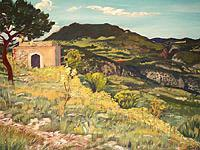](http://www.das-kunstnetzwerk.de/index.php?link=fischer)) aufgemalten und eingebrannten Bildern nach Ihren Kinderzeichnungen - oder anderen geeigneten Malvorlagen. Jede Fliese wird so ein einzigartiges Geschenk und bereichert die Wohnung wirklich mit dem eigenen Stil. 

Hier acht Beispiele nach Motiven meiner Kinder

1) Malvorlage (Karolina)... und Umsetzung auf Fliese 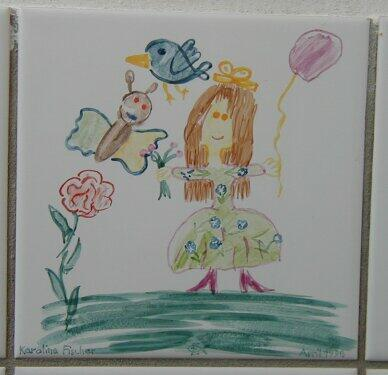 
2) Malvorlage (Mechthild) 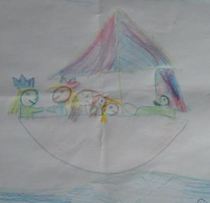 und Umsetzung auf Fliese 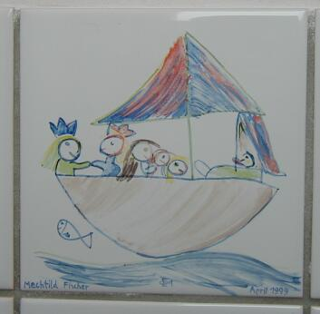 
3) Malvorlage (Willi) .........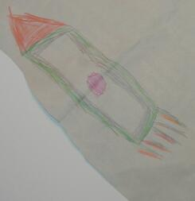 und Umsetzung auf Fliese 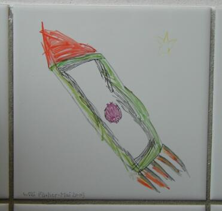 
4) Malvorlage (Editha)....... und Umsetzung auf Fliese 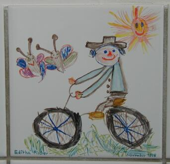 
5) Malvorlage (Mechthild)  und Umsetzung auf Fliese 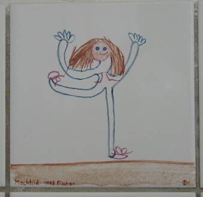 
6) Malvorlage (Editha) ..... und Umsetzung auf Fliese 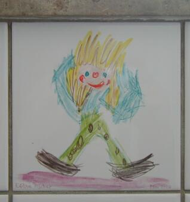 
7) Malvorlage (Karolina) 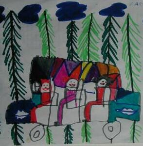 und Umsetzung auf Fliese 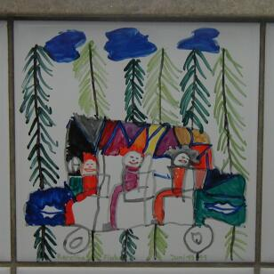 
8) Malvorlage (Willi)....... 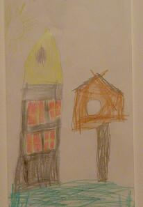 und Umsetzung auf Fliese 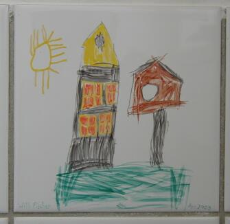

Wir danken dem Fliesenleger Kremer, Schwürbitz, für die fachgerechte Fliesenverlegung. 

.......................................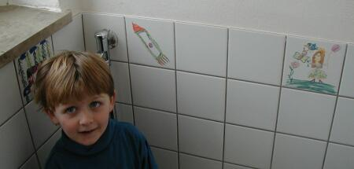 Mein Sohn Willi bei der Begutachtung auch seines Werks. 

Das Herstellen von bemalten Fliesen 15x15, bei denen der Besteller die zu bemalenden Fliesen und die gewünschten Motive einsendet, setzt mehrere Arbeitsschritte voraus: 

1) Qualitätskontrolle und Begutachtung der eingesandten Fliese(n) und Malvorlage(n) 
2) Maßstabsgerechte Aufbereitung der Malvorlage 
3) Übertragen der Vorlage (Vorzeichnung) auf die Fliese 
4) Auswahl und Anmischen der benötigten Porzellanfarben 
5) Motivausarbeitung nach dem Original (vgl. obige Beispiele, pigmentbedingt leichte Farbabweichung nicht ausschließbar) mit Pinsel und Feder,Vor- und Nachreinigung Oberfläche 
6) Mehrstunden-Brand der Fliese im Brennofen 
7) Kontrolle Brennergebnis, bedarfsweise Nachbearbeitung zur Farbvertiefung, erneuter Brand 
8) Bruchsichere Verpackung und Versand inkl. Versandversicherung

Das kostet für ein 
- flächendeckendes mehrfarbiges Motiv: je 260 EUR, ab 4 Fliesen je 130 EUR 
- einfaches Motiv (vgl. Beispiel 3 und 5): je 180 EUR, ab 4 Fliesen je 90 EUR 
- zzgl. MWST 

Lieferzeit ca. 8 Wochen, Erstbesteller gegen Vorkasse 
Rückgaberecht der unbeschädigten Fliese 14 Tage nach Zugang 

Interessiert? Rufen Sie mich mal an: 09574-3011

Wenn Sie Malvorlagen oder tolle Maluntensilien brauchen, hier könnten Sie sowas finden: 

Und hier finden Sie weitere [Info und Tipps zu Fliesen verlegen, Fliesenarten, Naturstein, kaputte Fliesen reparieren und erneuern, Mosaikfliesen, ...](http://fliesenleger.net)
