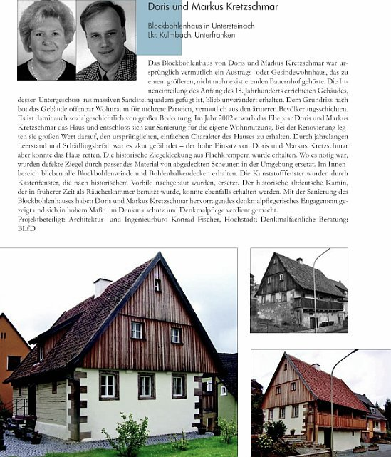

[🠔 Zur Übersicht: Über Konrad Fischer](1refernz.md)  
# Referenzen für Konrad Fischer
**Sammlung von Referenzen und Dankschreiben von Ämtern, Kirchen und privaten Bauherren für Konrad Fischers Arbeit in der Denkmalpflege.**  
_von Konrad Fischer • aktualisiert 12.05.2010_

## REFERENZEN FÜR KONRAD FISCHER

## Bayerischer Landesverein für Heimatpflege 
Bayerisches Landesamt für Denkmalpflege 
Landesamt für Denkmalpflege Sachsen-Anhalt 
Evang.-Luth. Dekanat Michelau 
Stadt Weißenfels 
Mitwirkung als Referent auf DECHEMA-Schimmel-Kolloquium 
Dankschreiben Wasser- und Schiffahrtsverwaltung des Bundes 
Dankschreiben privater Bauherr 
Bayerische Denkmalschutzmedaille 2010

[Kritik von Gegnern + Lob von Fans und Kunden im Gästebuch der Altbau + Denkmalpflege Info (Auszug)](gaestebuch.md) 
Nürnberg, 12.05.2010 - [Verleihung des Kostenspar-Awards von Hausgeld-Vergleich e.V.](http://www.hausgeld-vergleich.de/Deul_TippszumSparen_13.htm) an Konrad Fischer 

---

Glückwunsch des Bayerischen Landesvereins für Heimatpflege zu einer Preisverleihung 

---

[BAYERISCHER LANDESVEREIN 
FÜR HEIMATPFLEGE E.V.](http://www.heimat-bayern.de)

Ludwigstr. 23, Rgb. 
8000 München 22 
Fernruf: (089) 282064 
Telefax: (089) 282423

Herrn Dipl.-Ing. 
Konrad Fischer 
Hauptstr. 50

8621 Hochstadt a. Main

12.12.1991 
H/R/f

Sehr geehrter Herr Fischer,

der [Bayerische Landesverein für Heimatpflege](http://www.heimat-bayern.de) beglückwünscht 
Sie zur Verleihung der "Medaille für Verdienste um Kultur 
und Tradition auf dem Lande", womit die denkmalgerechte In- 
standsetzung eines wertvollen Fachwerkhauses eine öffent- 
liche, ja herausragende Würdigung erfahren hat. Ihrer Planung 
ist es zuzuschreiben, daß dieses Baudenkmal für das Ortsbild 
von Eggenbach erhalten blieb und wieder eine Nutzung erfährt. 
Dazu bedurfte es viel Einfühlungsvermögen, um den histori- 
schen Bestand mit den gegenwärtigen Wohnansprüchen in Einklang 
zu bringen. Dieses Beispiel spricht auch dafür, daß die 
Rettung solcher Objekte möglich ist. So bin ich sicher, 
daß dieses überzeugende Beispiel sowohl Anregung als auch Er- 
munterung bietet für ähnliche Objekte, deren bautechnische 
Erhaltung in Frage gestellt wird.

Ich wünsche Ihnen weiterhin viel Erfolg bei Ihrer verantwortungs- 
vollen Tätigkeit im Umgang mit historischer Bausubstanz.

In vorzüglicher Hochachtung

Unterschrift

(Rudolf Hanauer) 
1. Vorsitzender

---

Das preisgekrönte Objekt: Eggenbach Haus Nr. 2 vor und nach Sanierung 

.

---

**Referenz des Bayerischen Landesamtes für Denkmalpflege - Abschrift**

---

**[BAYER. LANDESAMT 
FÜR DENKMALPFLEGE](http://www.blfd.de)**

POSTFACH 10 02 03 - 80076 MÜNCHEN 

80539 München, 25.05.1996 
HOFGRABEN 4 
FERNSPRECHER 089/21 14 - 0 
DURCHWAHL 21 14 - 236 
TELEFAX 089/21 14 - 300

Nr. D - Md/wo

[Bayerisches Landesamt für Denkmalpflege](http://www.blfd.de) - Postfach 10 02 03 - 80076 München

Herrn Architekt Konrad Fischer 
persönlich 
Hauptstraße 50

96272 Hochstadt a. Main

**Referenz**

Zum Architekturbüro Fischer hatte ich seit 1976 fachliche Kontakte, seit ich im [Bayrischen Landesamt für Denkmalpflege](http://www.blfd.de) tätig bin. Damals leitete Dipl.-Ing. Herbert Fischer dieses Büro schon seit vielen Jahren, welches zahlreiche größere denkmalpflegerische Vorhaben abwickelte und für sein hohes fachliches Niveau sowie seine abolut zuverlässige Abwicklung der Bauvorhaben bekannt war.

In der Tradition dieses Büros wuchs der Sohn Konrad Fischer auf. Nach dem Abschluß seines Architekturstudiums an der Technischen Universität München absolvierte er das zweijährige Volontariat im [Bayerischen Landesamt für Denkmalpflege](http://www.blfd.de), welches sonst Kunsthistorikern mit einer Dissertationsnote von 1 oder ausnahmsweise 2 vorbehalten ist. In dieser Zeit lernte Dipl.-Ing. Fischer alle wichtigen Fachbereiche der Denkmalpflege einschließlich des staatlichen Zuschußwesens mit seinen für den Architekten und Bauherrn zunächst schwer durchschaubaren Rechtsvorschriften und Abwicklungsmodalitäten kennen. Längere Zeit arbeitete er auch in meiner Abteilung A, die damals die Bau- und Kunstdenkmalpflege einschließlich der Bauforschung und Bautechnik in ganz Bayern umfaßte. Hier erarbeitete sich Herr Fischer durch aktive Teilnahme an mehreren Projekten Vorbereiten der Untersuchungen und maßnahmenbegleitend unter meiner Anleitung in Zusammenarbeit mit Gebietsreferenten ein umfangreiches Wissen im technischen Bereich von Sicherungen alter Bausubstanz zusätzlich zu seinen entwerferischen Kenntnissen.

Nach seinem Ausscheiden aus unserer Behörde führte er das Architekturbüro in der alten Tradition, aber auch mit neuen Impulsen. Das Büro entwickelte eine [ausgefeilte Planungstechnik](11erhins.md). Auf diesem know-how beruhen vorbildliche und vor allem preisgünstige [Instandsetzungsmaßnehmen](1refernz.md#referenzbauwerke). Es ist daher kein Zufall, daß seine Bauvorhaben in überdurchschnittlichem Maße Auszeichnungen - allein drei Denkmalschutzmedaillen - zugesprochen bekamen.

Zwei dieser Vorhaben erlebte ich aus nächster Nähe als Partner der zuständigen Referenten und als Beurteiler der Baugeschichte und Technik der Maßnahmen:

Bamberg, Mühlwörth 6 und Eggenbach, Nr. 2. Mühlwörth 6 erschien abbruchreif. Im Normalfall wäre nur noch die Fassade stehen geblieben und ein teurer Neubau entstanden. Fischer erarbeitete sich den Überblick, konnte sehr viel der alten Substanz durch geschickte Planung retten, die Förderungsrichtlinien zugunsten des Bauherrn sehr gut durch sachkundige Verhandlungen ausschöpfen und eine preiswerte Instandsetzung erreichen. Heute steht ein schmuckes und gebrauchstaugliches Haus da, welches seine historischen Qualitäten in vollem Umfang bewahrt hat.

Das andere Vorhaben ist Eggenbach, ein sehr vollständig erhaltenes bäuerliches Anwesen von besserem Bauzustand, welches nach seiner Instandsetzung ein Vorzeigeobjekt im Regierungsbezirk Oberfranken wurde. Auch hier konnten die Baukosten dank des technischen know-how niedrig gehalten werden.

Die [große Zahl der späteren erfolgreich abgewickelten Vorhaben](1pl.exe), oft [anspruchsvolle Instandsetzungen wertvoller Denkmäler](1refernz.md#referenzbauwerke), konnte ich nicht unmittelbar mitverfolgen. Viele wurden außerhalb Bayerns durchgeführt.

Architekt Konrad Fischer ist nicht nur einer der wenigen versierten Fachleute im Bereich der Beurteilung und kompetenten Instandsetzung alter Bausubstanz (in diesem Fachgebiet gibt es bekanntlich nur sehr wenige umfassend und auch in der Praxis bewanderte Experten); er hat sich in den ganzen Jahren seiner beruflichen Praxis auch unermüdlich und ehrenamtlich für kulturelle Belange eingesetzt. Davon zeugen seine vielen [Vorträge](12akt.md#ad), die von ihm initiierten [Veranstaltungen](12akt.md#ad) und Fachausschüsse der [Deutschen Burgenvereinigung](http://www.deutsche-burgen.org), Gremien, die nicht zuletzt dank seiner Initiative und Tatkraft eine immer größere Rolle in der Fachwelt spielen.

_Unterschrift_

([Dr. Gert Th. Mader](https://de.wikipedia.org/wiki/Gert_Mader)) 
Abteilungsleiter

---

**Referenz des Landesamtes für Denkmalpflege Sachsen-Anhalt - Abschrift** 

---

_Landesamt für Denkmalpflege Sachsen-Anhalt_

Arch.-büro K. Fischer 
Hauptstr. 50

96272 Hochstadt/Main

Halle, 14.05.1996 
Lö/Na

Sehr geehrter Herr Fischer,

Ihrer Bitte, die planerischen Leistungen Ihres Büros in unserem Zuständigkeitsbereich einzuschätzen und Ihnen dieses schriftlich zur Kenntnis zu geben, kommen wir gerne nach. 

Hervorheben möchten wir die Leistungen bei den Sicherungs- und restauratorischen Instandsetzungsarbeiten als auch den gestalterisch anspruchsvollen Ausbauarbeiten auf [Schloß Neuenburg bei Freyburg](http://www.schloss-neuenburg.de/). Hier handelt es sich um ein Baudenkmal von nationalem Rang und demzufolge ein Objekt, wo die Zusammenarbeiten zwischen Planer und Landesamt für Denkmalpflege von besonderer Intensität war und ist. Mit dem erst kürzlich vollendeten 3. BA stehen jetzt bereits große Teile der Burg und des Schlosses der Öffentlichkeit zur Verfügung und dieses in beeindruckender Qualität.

Es muß an dieser Stelle auch betont werden, daß alle Kostenplanungen, die von Ihrem Büro planmäßig aufgestellt wurden, dann in der Ausführung auch ihre Bestätigung fanden, was von außerordentlicher Bedeutung für den bisherigen Bauablauf war. 

Ein weiteres herausragendes Objekt ist das von Ihrem Büro beplante [Geleitshaus in Weißenfels](https://www.geleitshaus.com/museum/). Auch hier handelt es sich um ein herausragendes Baudenkmal (16. Jh.) mit überdurchschnittlichem Schadensbild bei einem sehr komplizierten Gefügebau. 

Die bisher erbrachten Leistungen Ihres Büros sind ähnlich positiv zu bewerten wie bei dem oben genannten Objekt. 

Es gäbe hier noch einige [weitere Objekte](1refernz.md#referenzbauwerke) zu benennen, wo Ihre Mitarbeit positiv zu bewerten ist. Wir möchten zusammenfassend feststellen, daß die von Ihnen erbrachten [Planungsleistungen im denkmalpflegerischen Sinn](11erhins.md) ohne jede Beanstandung unsererseits und im technischen Bereich von hoher Solidität und Zuverlässigkeit gekennzeichnet waren und sind.

Mit freundlichem Gruß

_Unterschrift_

i. A. Dipl.-Ing. Lösser 
Gebietskonservator

Alter Markt 27 „Goldener Pflug“ 06108 Halle/Saale 
Telefon (0345) 23100-0 - Telefax (0345) 23100-15 

---

**Referenz des [Evang.-Luth. Dekanates Michelau i. Ofr. ](http://www.dekanat-michelau.de/)- Abschrift**

---

_[Evang.-Luth. Dekanat Michelau](http://www.dekanat-michelau.de/)_

Kirchplatz 5, 96247 Michelau 
Tel. 09571/982020, Fax 09571/982022

22. Mai 1996

**Referenz**

Herr Architekt Dipl.-Ing. (Univ.) Konrad Fischer wohnt im Bereich des Dekanatsbezirkes Michelau. Sein Vater hat im Kirchenkreis Bayreuth zusammen mit der Evang.-Luth. Kirche in Bayern sehr viele Projekte abgewickelt und Kirchen sowie Pfarrhäuser sowohl neu errichtet als auch renoviert.

Nach dem Tod seines Vater im Jahr 1979 übernahm Herr Konrad Fischer das Architekturbüro, seit 1984 selbständig. Seither hat er im Bereich des [Dekanatsbezirkes Michelau](http://www.dekanat-michelau.de/) insgesamt 23 kirchliche Neubau- oder Instandsetzungsmaßnahmen von der Bestandsaufnahme über die Planung bis zur Bauleitung betreut.

Unter diesen Maßnahmen waren die Instandsetzungen und Neuerrichtungen von Gemeindehäusern bzw. Gemeinderäumen u. a. in Gemünda, Michelau, Neuensorg und Schottenstein. 

Bei Pfarrhäusern sind zu nennen die größeren Instandsetzungen in Lichtenfels und Schney. 

Besondere Verdienste hat Herr Konrad Fischer sich bei der Instandsetzung von Kirchen erworben. Nahezu alle Kirchenrenovierungen im Dekanatsbezirk Michelau seit 1979 standen unter seiner Leitung, darunter die einer ganzen Reihe alter, denkmalgeschützter und besonders sensibel zu restaurierenden Kirchen z. B. in [Buch am Forst (14. Jh.)](http://www.dekanat-michelau.de/html/buch_am_forst.html), [Gemünda (16./18. Jh.)](http://www.dekanat-michelau.de/html/gemuenda.html), [Gleußen (14. Jh.)](http://www.dekanat-michelau.de/html/lahm_im_itzgrund_und_gleussen.html), [Obristfeld (18. Jh.)](http://www.dekanat-michelau.de/html/redwitz_an_der_rodach_und_obristfeld.html) oder [Schney (15. Jh.)](http://www.dekanat-michelau.de/html/schney.html). Die bedeutende [Kirche in Lahm/Itzgrund von 1732 mit der berühmten Herbst-Orgel](http://www.dekanat-michelau.de/html/lahm_im_itzgrund_und_gleussen.html) gehört ebenso dazu wie die [Schloßkirche in Strössendorf aus dem 16. Jh](http://www.dekanat-michelau.de/html/stroessendorf_altenkunstadt.html). 

Herr Fischer hat dabei die Tradition des Architekturbüros seines Vaters, das auf Denkmalspflege spezialisiert war, qualifiziert und fundiert weitergeführt. Vor allem zeichnen ihn eine große Sachkenntnis im Bereich der Renovierung denkmalgeschützter Bauten aus sowie ein sicheres Stilempfinden. 

In der Zusammenarbeit von Herrn Fischer mit den Kirchengemeinden und dem Dekanatsbezirk gab es bei den genannten Maßnahmen keine Probleme. 

Ergänzend sei darauf hingewiesen, daß die Familien Fischer jun. und sen. nicht nur für die Kirche gearbeitet, sondern sich schon immer auch im Leben ihrer Kirchengemeinden engagiert haben.

_Unterschrift 
_(Wilfried Bauer, Dekan)****

---

Referenz der Stadt Weißenfels - Abschrift

---

 **Stadt [WAPPEN] Weißenfels** 

Die Oberbürgermeisterin

Architekturbüro Fischer 
Herrn **Fischer 
**Hauptstr. 50

**96272 Hochstadt/Main**

Weißenfels, den 3.12.1997

Sehr geehrter Herr Fischer,

bei der Sanierung des [historischen Weißenfelser Geleitshauses](http://www.weissenfels.de/museum/bas_geleitshaus.html) war Ihr Architekturbüro mit der Bauplanung und -betreuung beauftragt und hat diese zu unserer vollsten Zufriedenheit ausgeführt.

Das 1552 erbaute [Geleitshaus](http://www.weissenfels.de/museum/bas_geleitshaus.html) ist im November 1632 in die Geschichte eingegangen, als hier der in der Schlacht bei Lützen gefallene schwedische König Gustav II. Adolf obduziert und für seine Überführung nach Stockholm einbalsamiert wurde.

Die Wiedereröffnung des Museums im [Geleitshaus](http://www.weissenfels.de/museum/bas_geleitshaus.html) möchte ich als Gelegenheit nutzen, Ihnen für Ihre ausgezeichnete Arbeit ganz herzlich zu danken, mit der Sie dazu beigetragen haben, das vom Verfall bedrohte Gebäude zu retten.

Ich wünsche Ihrem Unternehmen auch weiterhin eine gute Auftragslage, wirtschaftliche Erfolge und die Gelegenheit, mit Ihrer Arbeit Zeichen für den wirtschaftlichen Aufbau in der Region und der Stadt Weißenfels zu setzen.

Ihnen und Ihren Mitarbeitern dazu Gesundheit, Schaffenskraft und persönliches Wohlergehen.

Mit freundlichen Grüßen

_(Unterschrift)_ 
Bevier

Rathaus Markt 1 06667 Weißenfels 
Tel. 0 34 43/370-201 Fax: 0 34 43/370-212 
Sprechzeit: Dienstag nach Vereinbarung 

---

Dankschreiben für Mitwirkung an Schimmel-Kolloquium

---

DECHEMA 
Gesellschaft für 
Chemische Technik und 
Biotechnologie e. V. 

Theodor-Heuss-Allee 25 
D-60486 Frankfurt am Main 
Telefon (069) 75 64-0 
Telefax (069) 75 64-201 
E-Mail: info@dechema.de 
<http://www.dechema.de>

DECHEMA e.V. . PF 150104 . D-60061 Frankfurt am Main

Herrn 
Dipl.-Ing. Konrad Fischer 
Architektur- & Ingenieurbüro 
Hauptstr. 50

96272 Hochstadt

ÖMK/Chi/cbr 

08.03.2004

**573. DECHEMA-Kolloquium am 26. Februar 2004 
["Schimmelpilze und Bakterien in Innenräumen: Nachweis, Bewertung und Sanierung"](12akt.md#dechema)**

Sehr geehrter Herr Fischer,

wir möchten Ihnen für Ihren anregenden und interessanten [Vortrag](http://silizium.dechema.de/kolloq/i_573a.php) zu unserem Kolloquium nochmals sehr 
herzlich danken.

In Ihren Vorträgen und der umfassenden Diskussion mit 180 Teilnehmern wurde deutlich, daß Schimmelpilze 
und Bakterien in Innenräumen [weitreichende Probleme](7schim.md) nicht nur für Mieter und Vermieter, sondern auch für 
Bauwesen, Gesundheit und Medizin verursachen. Die verschiedensten Ursachen und Maßnahmen zur Abhilfe 
wurden diskutiert, und besonders deutlich wurde herausgestellt, daß hier nur branchenübergreifende, 
interdisziplinäre und ganzheitliche Betrachtungen dauerhaft zum Erfolg führen. Auf dem Gebiet besteht noch viel 
Forschungsbedarf, und wir werden diese Thematik auch in unseren DECHEMA-Veranstaltungen weiter verfolgen.

Mit unseren Kolloquien wollen wir Forschung, Industrie und Behörden zusammenführen, um zur Lösung 
anstehender interdisziplinärer Probleme im Umfeld der Arbeit der DECHEMA beizutragen. Daß uns dies Anliegen 
mit unserer Veranstaltung gelungen ist, haben wir ganz besonders auch Ihrem Engagement zu verdanken.

Wir würden uns freuen, Sie bald wieder in unserem Haus begrüßen zu können. 
Haben Sie besten Dank für Ihre Mitarbeit.

Mit freundlichen Grüßen

DECHEMA 
Gesellschaft für Chemische Technik und Biotechnologie e.V.

(Unterschrift)..........................................(Unterschrift)

Prof. G. Kreysa .....................................Dr. Christina Hirche 

---

Dankschreiben für erfolgreichen Saniervorschlag mit Luftkalkmörtel für feuchtegeschädigte Wände in Nassräumen - Auszug

---

Wasser- und Schifffahrtsverwaltung des Bundes MDK 
Wasser- und Schifffahrtsamt Nürnberg (Signet Main-Donau-Kanal)

Außenbezirk Riedenburg 
Ländenstr. 18 
93339 Riedenburg 

---

Architektur- und Ingenieurbüro 
Dipl.-Ing. Konrad Fischer 
Hauptstr. 50

96272 Hochstadt

Ihre Zeichen und Nachricht vom Mein Zeichen ( bei Antwort angeben ) Tel: (09443) 9186-0 Tag 07.08.06 Bearbeiter: Bramhoff

Sehr geehrter Herr Fischer,

möchte mich bei Ihnen noch mal in Erinnerung bringen. Sie haben uns im Frühjahr 2005 ein 
Gutachten (Sanierungsvorschlag) erstellt, für die Sanierung unserer Nassräume im Erdgeschoss der 
Betriebszentrale Gößelthalmühle.

Wir hatten unmittelbar nach Ihrem Gutachten erstmal "nur" mit der Sanierung der Herren-Toilette 
begonnen. Wir waren - ganz ehrlich gesagt - etwas skeptisch gegenüber Ihrem Sanierungsvorschlag. 
Wir konnten aber ein Jahr nach der Sanierung feststellen, dass das genau das Richtige war.

Daraufhin haben wir im Mai 2006 mit der Sanierung der Damen-Toilette begonnen. Inzwischen sind 
beide Toiletten komplett saniert. [Sanierdetails] Wir sind damit zufrieden.

Ich werde Sie bei ähnlich gelagerten Problemfällen auf jeden Fall weiterempfehlen.

Anbei einige Bilder der sanierten Nassräume.

Freundliche Grüße

(Unterschrift)

Kai Bramhoff

---

[ DANKSCHREIBEN / GÄSTEBUCHEINTRAG VON PRIVATEM AUFTRAGGEBER / BAUHERR](http://htmlgear.tripod.com/guest/control.guest?u=konrad-fischer) 

05/08/2007 11:52:45am 
Henning v. Schirp 
Ort: Klettwitz 
Sehr geehrter Herr Fischer, 
August 2006 Sie hatten mich mal in Punkto [Kalkaussenputz](2kalkfel.md) beraten. 
Wir haben es so gemacht wie vorgeschlagen, obwohl nur eine Lage mit ca. 2cm. Der Putz ist sehr hart geworden und "wischfest". Die meisten Besucher wollen nicht glauben, dass kein Zement verwendet wurde. Es hat alles gut geklappt und den ersten Winter gut überstanden. 
"Wenn alle jubeln habt Bedenken!" 

---

01/20/2007 11:56:42am 
fred böhm 

scheune nach k. Fischer gebaut 
Ort: überlingen 
Beitrag: ich habe als berufskollege von herrn fischer eine 250 jahre alte scheune ausgebaut. herrn fischer beriet mich ca. 2 stunden am telefon. das ergebnis: 
160 qm wohnfläche auf 2 ebenen. keine dämmung in den außenwänden, dach und zum erdreich hin, nur holz pur. dach 4 schichten kreuzlagige bretter. gesamt 96mm. lattung, konterlattung biberschwanz. außenwand glas oder holz massiv. eg-fußboden 5cm fichte-dielen auf konstruktionsholz. dieses liegt im sandbett. 
kachelofen in der hausmitte, hüllflächenheizung überall. verbrauch ca. 10 ster incl. warmwasser. 
sommerlicher hitzeschutz ist der hit. trotz glasfassade nach nord-west max. 26 grad. herausragendes raumklima wird von allen bestätigt. 
baukosten ca. 500,-€/qm wohnfläche. 800 stunden eigenleistung. 
würde nie mehr anders bauen und bin geheilt von nieder-passiv-folien-kleb. 

mit liebsten grüßen 
fred böhm 

---

01/03/2007 
Andreas Güntzel 
Ort: Bielefeld 

Sehr geehrter Herr Fischer, 

vielleicht sollte dieser Eintrag einfach den Titel bekommen „Und es geht doch – und das auch noch sehr gut!!!“ 

Viele Freunde, Bekannte und auch vermeintliche Fachleute haben uns für komplett verrückt gehalten, als wir erzählten, dass wir unser altes Häuschen mit Hilfe eines Architekten renovieren wollten, der zum einen seinen Wohnsitz mehrere hundert Kilometer entfernt hat und zum anderen nicht die aktuell üblichen Vorgehensweisen und Ansichten bezüglich notwendiger Baumaßnahmen vertritt, sondern diesen eher kontrovers gegenüber steht. 

Wir haben uns von Ihrer Fachkompetenz überzeugen lassen und uns dann auf den Weg gemacht, das Haus mit Ihrer Hilfe instand zu setzen. Ich denke wir können nun gemeinsam behaupten, dass eine gute Zusammenarbeit auch über eine größere Distanz ohne Probleme möglich ist. Ich habe so ziemlich jeden Handwerker verblüffen können, innerhalb kürzester Zeit – oft innerhalb weniger Minuten – eine fundierte Antwort auf eine Frage oder Lösungsvorschläge für Probleme zu erhalten. Das geht laut Erfahrung der Handwerker in den meisten Fällen sonst nur im Tagestakt und das selbst bei vor Ort ansässigen Architekten. 

Nachdem wir nun den ersten Bauabschnitt fast hinter uns haben, ernten wir von allen Seiten nur positives Erstaunen – keiner hätte auch nur im geringsten damit gerechnet, dass wir ein derart schönes und funktionierendes Ergebnis vorweisen können. Das fängt beim neuen Wandaufbau im Bad an und geht bis zum von Ihnen ausgelegten Heizungskonzept – es stimmt alles und es passt einfach alles zusammen. Eine wirklich gute und vor allen Dingen voll funktionierende und vorausschauende Planung, die es uns ermöglichte, trotz Renovierung im Haus wohnen zu bleiben. 

An dieser Stelle möchte ich mich für die tolle Zusammenarbeit im vergangenen Jahr bei Ihnen und Ihren Mitarbeitern bedanken. Ich freue mich darauf, auch im kommenden Jahr mit Ihnen unser Haus zu verschönern. 

Beste Grüße aus Bielefeld, 

Andreas Güntzel 

---

[Chronische Erkrankungen durch vorbeugende Diagnostik und Therapie verhindern - Bericht Arztpraxis Dr. med. Wolfram Kersten, Bamberg](medizin.md)

---

 

. 
Blockbohlenhaus Untersteinach Tradgasse 15 - [Bayerische Denkmalschutzmedaille 2010 (Bildquelle Broschüre PDF)](http://www.stmwfk.bayern.de/Kunst/pdf/medaille_2010.pdf)

---

Aus meinem Gästebuch - ein Beratungskunde zum Thema speicherfähige Dachdämmung aus Massivholz mit hervorragendster Temperaturamplitudendämpfung und Phasenverschiebung (Foto: Mario Held)- Friday 07/15/2011 9:27:33am: 

Hallo Konrad, 

vielen Dank für Deine Unterstützung und Hilfestellung. 

 

Habe unser Dach nach Konradscher Methode modifiziert und bin erstaunt über die Wirkung bei stärkster Sonneneinstrahlung. 

Haben nun ein absolut tolles Klima im OG und wenn die Fenster nun auch noch beschattet sind, dann ist es wahrscheinlich abends zu kühl :-))) 

Mit kühlem Dachgeschoss und freundlichem Gruße 

Mario Held 
36132 Eiterfeld - Wölf
