[🠔 Zur Übersicht: Startseite](index.md)  
# Lebenslauf von Konrad Fischer
**Lebenslauf und Biographie von Konrad Fischer, dem Herausgeber und Webmeister des Online-Magazins „Altbau und Denkmalpflege Informationen“.**  
_von Konrad Fischer_

> [!abstract]+ Kapitelübersicht: Über Konrad Fischer  
> 1. **Lebenslauf von Konrad Fischer**
> 2. [Referenzen für Konrad Fischer](1mader.md)
> 3. [Altbau/Denkmalpflege-Fortbildung aktuell: Seminare, Vorträge ...](12akt.md)
> 4. [Referenz-Vorträge von Konrad Fischer](1sempub.md)
> 5. [Fliesenbilder von Kindern - Die Geschenkidee](1fliesn.md)

-    
  [Dedikation/Widmung](2000.md#dedikation.)
-   
  [Interview Klimaschutz](http://www.youtube.com/watch?v=5vly1RKBdkM)
- 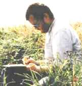  
  Beim Skizzieren

> Was keiner wagt, das sollt ihr wagen, Was keiner sagt, das sagt heraus,  
> Was keiner denkt, sollt ihr befragen, Was keiner anfängt, das führt aus.  
> 
> Wenn keiner ja sagt, sollt ihr's sagen, Wenn keiner nein sagt, sagt doch nein,  
> Wenn alle zweifeln, wagt zu glauben, Wenn alle mittun, steht allein!
> 
> Wo alle loben, habt Bedenken, Wo alle spotten, spottet nicht,  
> Wo alle geizen, wagt zu schenken, Wo alles dunkel ist, macht Licht! 
> 
> Walter Flex (6.7.1887 - 16.10.1917) 

---

1955 geboren in [Würzburg](http://www.wuerzburg.de) als erstes von drei Kindern ([Schwester Erika](http://www.kulturbuero-ostallgaeu.de/index.php?id=491), [Erika Fischer stellt aus](http://www.fachklinik-enzensberg.de/index.shtml?pressespiegel&news=32ijYHppI77Qm)) des fränkischen Architekten Herbert Fischer (✴1919 Schwürbitz, ✝1979 Lichtenfels, nach Studium an der TU München u.a. bei [Hans Döllgast](https://de.wikipedia.org/wiki/Hans_Döllgast), erste Anstellung beim Landbauamt Würzburg, dort Tätigkeit im Wiederaufbau der zerbombten Stadt, dann im Sakralbau-Büro von [Albert Boßlet und seinem Neffen Ernst van Aken](https://de.wikipedia.org/wiki/Albert_Boßlet), ab 1957 selbstständig in Schwürbitz mit Projekten vorzugsweise im Sakralbau und der Denkmalpflege) und der siebenbürgischen Kirchenmusikerin Eva, geb. Möckesch (✴1923 [Urwegen](http://www.urwegen.net/), ✝ 1999 Michelau i. Ofr.) 

[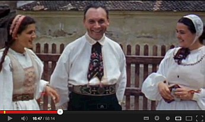](https://www.youtube.com/watch?v=LLjcjfxdspU&feature=youtu.be&t=3m3s) 
Sensationsfund: Meine Mutter Eva, mein Großvater Viktor und meine Großmutter Erika Möckesch im Farbfilm von Ernst Grelle, 1939 aus Tartlau, Siebenbürgen 

 (von meinem Vater Herbert geplant: [Evang.-luth. Auferstehungskirche](http://www.dekanat-michelau.de/html/neuensorg.html) mit Gemeindehaus in Neuensorg, 1961, [Evang.-luth. Auferstehungskirche](http://www.dekanat-michelau.de/html/zapfendorf.html) mit Pfarrhaus und Gemeindehaus in Zapfendorf, 1962)

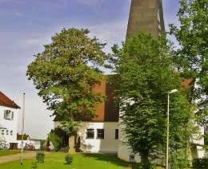 
Auferstehungskirche in Zapfendorf 1962 (Ziegel massiv, verputzt und gekalkt) 
Kein [flachdachmoderner Betonschwulst](212bau2.md) - und deswegen auch nach 44 Jahren noch nicht wegen Betonschäden kaputtkorrodiert, geschweige denn eingestürzt, Foto 2005

 
Harburg 1998 (von dort stammt meine Oma väterlicherseits)

1957 Umzug nach [Schwürbitz](http://www.gemeinde-michelau.de/index.php?id=102,21), als auf dem [oberen Fischerhof](http://commons.wikimedia.org/wiki/File:Schwürbitz_Fischerhof_2.JPG?uselang=de), dem mein Vater als Ältester von vier Söhnen entstammte, größere Baumaßnahmen anstanden, die er betreuen sollte.

1962-66 Evang.-Luth. Volksschule Schwürbitz

Schwörbetze Kärwa 2008 mit der Schwürbitzer Blaskapelle: 
[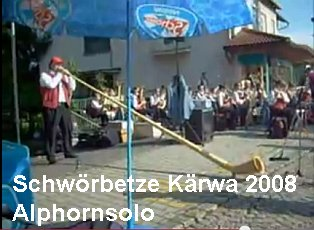](https://youtu.be/dnTcyX8ffto) . [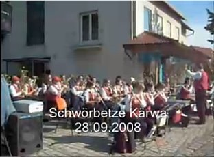](https://youtu.be/32FJq94MPTI) 

1966-75 [Meraniergymnasium Lichtenfels](http://www.meranier-gymnasium.de), Mathematisch-Naturwissenschaftlicher Zweig, Latein als 2. Fremdsprache, Abschluß: Abitur (Abiturprüfungen in Deutsch, Englisch, Mathematik, Physik, Kunsterziehung)

1970 Konfirmation in der [Evangelisch-Lutherischen Kirche zu Schwürbitz](http://mitglied.multimania.de/KirchenSchwuerbitz/framedrei.html), ([Evangelisch-Lutherische Kirchengemeinde Schwürbitz](http://www.dekanat-michelau.de/html/schwuerbitz.html))

Mein Segensspruch:

_**Der Herr ist mein Licht und mein Heil; 
vor wem sollte ich mich fürchten! 
Der Herr ist meines Lebens Kraft; 
vor wem sollte mir grauen!** 
Ps. 27.1._

1976-81 Architekturstudium TU München, Abschluß: Dipl.-Ing. Univ.

1979 Übernahme des vom verstorbenen Vater im [Fachwerkdorf Schwürbitz am Main](http://www.gemeinde-michelau.de/index.php?id=102,21) (Gemeinde Michelau i. Ofr.) 1957 gegründeten Architekturbüros (Schwerpunkte: Restaurierung von Baudenkmalen, Sakralbau, Neubau landschaftsgerechte Massivbauwerke aus Ziegel mit geneigtem Dach)

[Mein Ahn 1692: Johann Adam Fischer](http://web.archive.org/web/20050308202540/http://www.schwuerbitz.net/825/zahlen/geschichte4.html), Gründer des Gasthofes "Stern" - im Obergeschoß ab 1957 erster Sitz des Architekturbüros

 
Der ehem. Gasthof zum Stern am 27.5.05, hier lebte ich von 1957-62, bis Familie und Büro in den Neubau Erhard-Vogel-Str. 1 umzog 

[1742 - Neubau Brauereigasthof Fischer](http://schwuerbitz.csu-schwuerbitz.de/geschichte/1742.html) [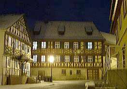](http://web.archive.org/web/20050308202540/http://www.schwuerbitz.net/825/zahlen/geschichte4.html) 
Der ehem. Brauereigasthof Fischer am 24.1.05

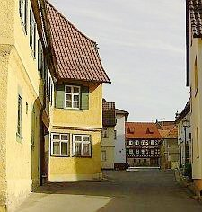 
Die ehem. Fischergaststätten "Zum Stern / Unterer Fischer" (1692) und "Brauereigasthof / Oberer Fischer" (1742) auf einen Blick am 27.5.2005

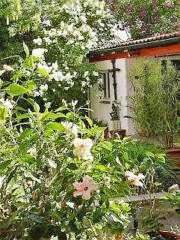 
Im Garten des Schwürbitzer Elternhauses am 25.5.05 
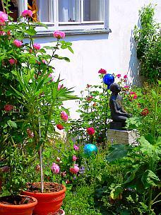 
Im Garten am 7.6.08 
Hier wohne ich von 1962-87, dann wieder ab 2001, das väterliche und ab 1979 mein Büro war hier 1962-1987

[schwuerbitz.eu](http://www.schwuerbitz.eu/) 
[michelau.net](http://de.wikipedia.org/wiki/Michelau_in_Oberfranken) 
[Besuchen Sie unsere Kirchen](http://mitglied.multimania.de/KirchenSchwuerbitz/frameeins.html)

1982-84 Wissenschaftliches Volontariat am [Bayerischen Landesamt für Denkmalpflege](http://www.blfd.bayern.de) (Abt. Inventarisation - [Prof. Dr. Tilmann Breuer,](8breuer.md) u.a. bei [Dr. Sixtus Lampl](http://www.lampl-orgelzentrum.com/), Referent für Oberpfalz und Denkmalorgeln; Bauforschung und Praktische Denkmalpflege - [Dr.-Ing. Gert Th. Mader](8rezpema.md); Archäologie - Dr. Björn-Uwe Abels; Restaurierungswerkstätten - Prof. Dr. Dasser) [Referenz des Bayerischen Landesamtes für Denkmalpflege](1mader.md#blfd)

1984 Mitglied [Bayerische Architektenkammer BYAK](http://www.byak.de)

1987 Umzug in die ehemalige [Zisterzienserklostermühle (Luftbild ca. 1960)](muehle.jpg) in [Hochstadt a. Main,](http://www.hochstadt-main.de/) [Landkreis Lichtenfels](http://www.landkreis-lichtenfels.de)

 
Die Klostermühle in Hochstadt, hier wohnte ich von 1987-2001, das Büro ist hier geblieben

[Größere Kartenansicht](http://maps.google.de/maps/ms?num=100&hl=de&safe=off&ie=UTF8&t=h&msa=0&msid=106314680777326121029.000456ed67daa00e3935a&ll=50.153621,11.177913&spn=0.002062,0.003219&z=17&source=embed) 

Seit 1988 [Seminarleitung](12akt.md) und -[vorträge](11erhins.md) für Architektenkammern, Hochschulen/Universitäten u.a. Veranstalter. Vorträge im Ausland ([Dänemark](12akt.md#kopenhagen/lund), [Italien](8buch.md#runkelstein tagungsband), [Österreich](12akt.md#hallein), Polen, [Schottland](2rilem.md), [Schweden](2rilem.md#visby01), [China](https://www.youtube.com/playlist?list=PLl5LiVroo3FBfH7261w7IsAooHWhPkPwa)).

Verheiratet seit 1988 mit Petra geb. Bothe, Studienrätin für Mathematik und evang. Religionslehre, Prädikantin, 4 Kinder: Karolina ([Edith Piaf: sa vie et ses chansons](editpiaf.md): Les liens entre la vie et l'oeuvre de la célèbre chanteuse Edith Piaf - Un travail spécialisés par Karolina Fischer 1/08), Mechthild, Editha, Wilhelm

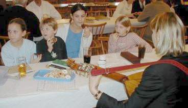.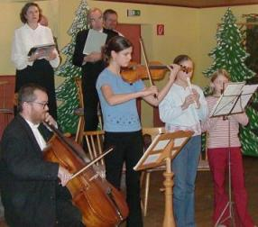 
Mit Frau und Kindern beim Musizieren auf der Kreisgruppen-Weihnachtsfeier der Siebenbürgischen Landsmannschaft in Coburg 12/03 
[Frühlings- und Muttertagsfeier der Kreisgruppe am 19.05.2008](http://www.siebenbuerger.de/zeitung/artikel/kreisgruppen/7804-fruehlings_-und-muttertagsfeier-in.html)

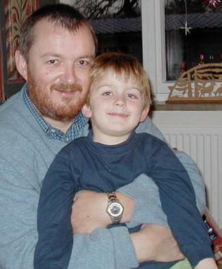 
und mit dem Sohnemann Willi (5) auch mal daheim.

1990 Aufbau Fachplanungsbereiche [Tragwerk](11erhins.md), [alternativer Holzschutz](23bausto.md) und [Haustechnik](11erh17.md) (Gas, Wasser, Abwasser, HLS, [Hüllflächentemperierung](7temper.md)) für Denkmalpflege, Alt- und Neubau in Massivbauweise

1991 Verleihung der "[Medaille für Verdienste um Kultur und Tradition auf dem Lande](1mader.md#blfh)" vom Bayer. Staatsministerium für Ernährung, Landwirtschaft und Forsten für die Fachwerkhaussanierung Eggenbach Haus Nr. 2

2010 Verleihung des "[Verbraucherschutz-Awards](http://www.hausgeld-vergleich.de/Deul_TippszumSparen_13.htm)" von [Hausgeld Vergleich - Schutzgemeinschaft für Hauseigentümer und Mieter e.V.](http://www.hausgeld-vergleich.de/) für meine "Aufklärungsarbeit zum Schutz der Verbraucher vor fragwürdigen Geldausgaben und gesundheitlichen Schäden"

 Ein paar bepreiste Objektsanierungen nach meiner Planung und Bauleitung: 

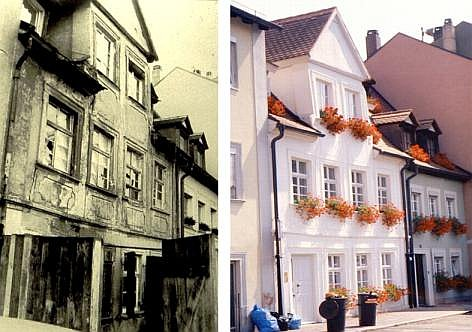. 
Spätgotisches Bürgerhaus Bamberg Mühlwörth 6 vor und nach Sanierung - Bayerische Denkmalschutzmedaille 1986

. 
Eggenbach Hs. Nr. 2 vor und nach Sanierung - Bayerische Denkmalschutzmedaille 1990 
(Kostenunterschreitung gegenüber Budget ca. 100.000 EUR dank [Ausschreibungssystem](9pbs.md) und [erhaltender Instandsetzung](11erhins.md))

. 
2005 ebenso kostensicher instandgesetzt das ruinöse Graitzer Torhaus in Marktzeuln

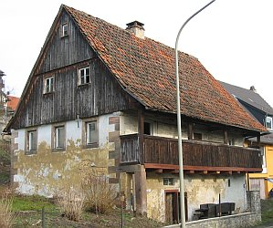.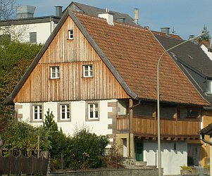 
Blockbohlenhaus Untersteinach Tradgasse 15, erbaut Anf. 18. Jh., vor und nach Sanierung - [Bayerische Denkmalschutzmedaille 2010](http://www.stmwfk.bayern.de/Kunst/pdf/medaille_2010.pdf)

1996 - 2006 1., dann 3. Vorsitzender des Beirats für Denkmalerhaltung (früher "für Restaurierung") der [Deutschen Burgenvereinigung e.V.](http://www.deutsche-burgen.org)

1997 Nachweisberechtigung für den vorbeugenden Brandschutz bei Vorhaben mittlerer Schwierigkeit gem. Art. 68 (7) Satz 3 Nr. 2 i.V.m. Art. 2 (4) BayBO (1998), Aufnahme in Liste der Nachweisberechtigten der [Bayer. Architektenkammer](http://www.byak.de) ([Brandschutz im Baudenkmal,](6brand.md) [Brandschutz im Altbau,](2baustof.md) [Praxisratgeber Brandschutz in historischen Bauten)](6kabat.md)

1999 Ausbildung als geprüfter Sicherheits- und Gesundheitsschutz-Koordinator (SIGEKO) auf Multiplikatorenlehrgang der BauBG Bayern-Sachsen (Mein Seminarbeitrag [SIGEKO im Altbau](2sigeko.md))

2002 Zulassung als "Verantwortlicher Sachverständiger nach § 2 ZVEnEV"/ab 2017 "Verantwortlicher Sachverständiger nach § 3 AVEn" gem. Beschluss des Eintragungsausschusses bei der [Bayer. Architektenkammer](http://www.byak.de) und damit im Sinne der KfW-Förderbank-Richtlinien "eine nach Landesrecht berechtigte Person für die Aufstellung und Prüfung der Nachweise nach der Energieeinsparverordnung" sowie Berechtigter zur Bescheinigung einer Befreiung von den Anforderungen der EnEV gem. § 25 EnEV.

2006 Verpflichtung nach § 1 des Gesetzes über die förmliche Verpflichtung nichtbeamteter Personen vom 2.3.1974 (Verpflichtungsgesetz) durch GTM Bremen

Seit 1979 ca. 450 Baudenkmal-Instandsetzungen (Sakral- und Profanbau, [selbstentpackende Projektliste](1pl.exe) als Excel-Download) in West- und Ostdeutschland. [Behörden- und Bauherrenreferenzen.](1mader.md) Derzeit (8/2017) 4 angestellte Mitarbeiter, davon 3 Ingenieure Bauingenieurwesen/Architektur.

Projektbezogene Zusammenarbeit mit Architekten in Schweden, Kasachstan, Ungarn und Tschechien.

Meinen Gratulanten zum 50. Geburtstag (2005) 
(Nach der "Schwäb´sche Eisebahne" zu singen) 
[Mein akkordeongestützter [Liedvortrag / Hörprobe auf Download-Video (wmv-Datei 9,7 MB, ca. 4 min)] 

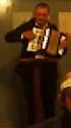](KONRAD_L.WMV) 
**Ü** ber all´ die lieben Grüße 
aus Freundeskreis und manch´ Verein 
freut´ ich mich, dank´ und genieße, 
Euch nicht unbekannt zu sein. 
Ref.: Rulla, Rulla, ... 

**I** m Vergleich zu morsch´ Gemäuer 
bin ich eigentlich nicht alt, 
doch mir ist nicht ganz geheuer: 
Wie lang ich wohl einmal halt? 
Ref.: Rulla, Rulla, ... 

**M** ancher Zahn ist schon verloren 
und die Haare werden grau. 
Nach Sanierung neu geboren, 
geht nur bei ´nem alten Bau. 
Ref.: Rulla, Rulla, ... 

**W** ertvoll sind deshalb die Gaben, 
die viel länger Freude machen, 
als der Körper, den wir haben 
und uns plagt mit Knirsch und Krachen: 
Ref.: Rulla, Rulla, ... 

**L** iebe, Freunde, frommes Streben, 
Kinderglück, ´ne Sünde klein, 
Frühjahr schenkte grüne Reben, 
Herbst begeistert dann mit Wein. 
Ref.: Rulla, Rulla, ... 

**S** pring ich auch nicht mehr so herum 
in der Jugend Übermut, 
wird reif, was einst gar zu dumm, 
und das tut uns allen gut ;-) 
Ref.: Rulla, Rulla, ...

**Freizeitvergnügungen:** 
Cellist im Instrumental-Collegium Lichtenfels (ICL) unter Heinz Wilk (seit 1973).

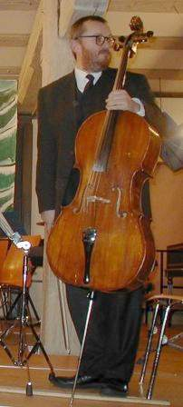 
Nach der Nußknackersuite von Tschaikowski/Bearb. Bazu am 21.12.03 im Stadtschloß Lichtenfels

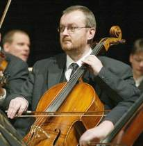 
Beim Weihnachtsoratorium (Teile 1, 4-6) von J.S. Bach am 28.12.2005 in Kronach, Leitung: [Marius Popp](http://www.mariuspopp.com) 
Bild: [Tim Birkner](http://www.arpeggio.de)

[**Hörprobe / Download** aus dem Weihnachtsoratorium: Coro 1 - Jauchzet, Frohlocket, ... WMA-Datei, 7,34 min 2,8MB](WO0148.WMA)

Oder hier, etwas anders verpackt, in meinem Musikvideo aus der Leipziger St. Thomas-Kirche: 
Thomaskirche, Leipzig: Musik, Geschichte & Geheimnis + "Jauchzet, frohlocket" 
aus J.S. Bachs Weihnachtsoratorium (Konrad Fischer im Cello) 
[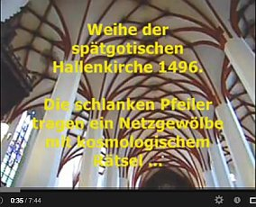](https://youtu.be/fET3JCock6Q) 

Musikalische Aktivitäten der Familie Fischer auf Video.wmv: 
[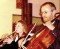 Leopold Mozart: Schlittenfahrt](MOZART.WMV) Instrumental-Collegium Lichtenfels (m. Editha + Konrad Fischer), Ltg. Heinz Wilk, 19.12.2006 2MB [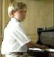 Graupner: Bourreé + Schostakowitsch: Marsch](BOURREE.WMV) m. Wilhelm Fischer, 24.06.2007 0,7MB 

Musik von Wolfgang Amadeus Mozart u.a.m. Konrad Fischer (Cello) 
[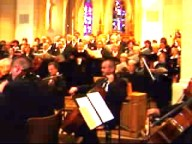 Ave verum Corpus](AVEVERUM.WMV) 7MB [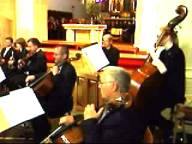Mottete 'Exsultate, jubilate', KV 165: 1. Exsultate, 07.07.2007](EXSULTATE.WMV) 13MB 
[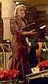Mottete 'Exsultate, jubilate', KV 165: 2. Recitativo, 23.12.2007](RECITATI.WMV) 3MB 
[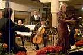Mottete 'Exsultate, jubilate', KV 165: 3. Tu virginum, 4. Alleluja, 23.12.2007](ALLELUJA.WMV) 13MB 
[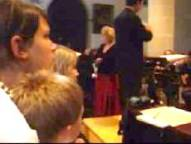Laudate Dominum, KV 339, 07.07.2007](LAUDATE.WMV) 11MB [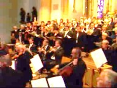Kyrie, KV 259, 07.07.2007](KYRIE.WMV) 4MB 
(aus Konzert am 07.07.2007 in der röm.-kath. St. Johannes-Kirche in Kronach - Mitwirkende: Ingrid Peppel, Sopran; Erika Kreuzer, Alt; Lucian Krasznec, Tenor; Andreas Thiel, Baß Chorgemeinschaften Cäcilia 1858, Kronach und Steinwiesen-Nurn; Instrumental-Collegium Lichtenfels; Leitung: Marco Fröhlich und dem Weihnachtskonzert der Stadt Lichtenfels im Stadtschloß am 23.12.2007 mit dem Instrumental-Collegium und Ingrid Peppel, Sopran; Katrin Dinkelmeyer, Solo-Violine; Hartmut Müller, Solo-Violoncello; Leitung: Heinz Wilk) 
Aus dem o.g. Weihnachtskonzert: 
[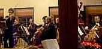Guiseppe Tartini: 'Sinfonia Pastorale', Allegro non troppo, Moderato 23.12.2007](TARTINI.WMV) 14MB 
[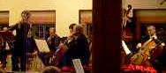Jules Massenet: 'Thais', Meditation 23.12.2007](MASSENET.WMV) 13MB 
[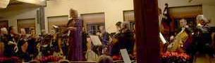Peter Cornelius: 'Weihnachtslieder op. 8', Christbaum, Die Hirten, 23.12.2007](CORNELIU.WMV) 11MB 

Chorsingen im Lorenz-Bach-Chor Lichtenfels (LBC) und im Chor der Siebenbürger Landsmannschaft, Bezirksgruppe Coburg

 Musikvideos 
Choräle nach Liedern von Paul Gerhardt m. dem Lorenz-Bach-Chor, Leitung: Dekanatskantor Klaus Bormann, am 15.07.2007 in der ev.-luth. St.Maria-Kirche in Schney (m. Konrad + Petra Fischer (Tenor/Alt)) 
[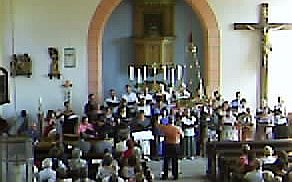Wie soll ich dich empfangen, 1653 (Melodie: Johann Georg Ebeling 1666, Satz: Johann Crüger, 1598-1662)](wiesoll.wmv) 5MB 
[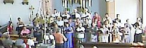Fröhlich soll mein Herze springen, 1653 (Melodie+Satz: Johann Crüger)](froehlich.wmv) 3MB 
[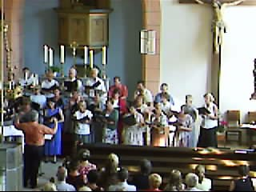Wach auf mein Herz und singe, 1647 (Melodie bei Nikolaus Selnecker 1587, Satz: Johann Crüger)](wachauf.wmv) 3MB 
[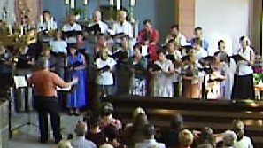Ein Lämmlein geht und trägt die Schuld, 1647 (Melodie: Wolfgang Dachstein 1525, Satz: Melchior Vulpius, um 1570-1615)](laem.wmv) 2MB 
[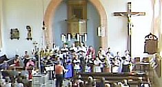Auf, auf, mein Herz mit Freuden (Melodie+Satz: Johann Crüger), 1647](aufauf.wmv) 5MB 

Musikvideos von der 100-Jahr-Feier des Meranier-Gymnasiums Lichtenfels MGL 21.07.2007: 
Festakt (Mitwirkende u.a.: MGL-Chor, MGL-Orchester): 
Festgottesdienst in der Basilika Vierzehnheiligen (Mitwirkende u.a.: MGL-Chor/LBC, MGL-Orchester/ICL): 
[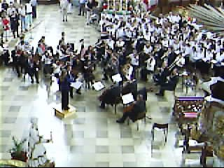Wolfgang Amadeus Mozart: Missa brevis et solemnis (Spatzenmesse) - Kyrie (Ltg.: Elke Gruber)](KYRIE14.WMV) 3MB 
[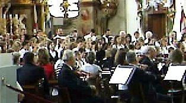Georg Friedrich Händel: Der Messias - Halleluja (Ltg.: Elke Gruber)](HALELUJA.WMV) 10MB 
[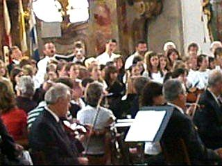Johann Sebastian Bach: Kantate BWV 147 - 'Jesu bleibet meine Freude' (Ltg.: Sirpa John)](JESU.WMV) 15,5MB 
Zum Totengedenken: [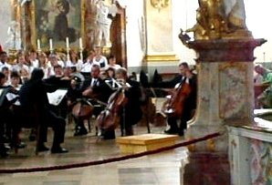Max Reger: Lyrisches Andante (Ltg.: Heinz Wilk)](REGER.WMV) 10MB 

(Mitwirkung der Familie Fischer: Konrad: LBC/ICL (Tenor/Cello); Petra: LBC (Alt)) 

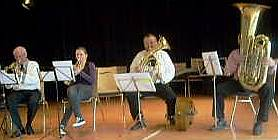 **Volksmusik-Quartett (Dietmar Ehrlich: 1. Trompete, Edith Fischer: 2. Trompete, Konrad Fischer: Tenorhorn und Violoncello, Hans Theil: Tuba) der Siebenbürger Landsmannschaft, Bezirksgruppe Coburg** 
**Musikvideo-Downloads** von der Muttertagsfeier / dem Frühlingsfest am 19.04.2008 in Coburg: 
Drei Volksmusik-Sätze / Tanzmusikstücke aus der Notenhandschrift des Josef Kaltenbach (um 1900): 
[Walzer Nr. 23 -7MB](WALZER1.WMV) +++ [Mazurka Nr. 8 - 6MB](MAZURKA.WMV) +++ [Garibaldi-Polka - 6MB](POLKA.WMV) 
[Walzer Nr. 1 (aus Euphonium: Nr.4 "Sommerfreuden-Walzer" von M. Thies, Op. 46) - 7MB](WALZER2.WMV) 
[Ode an die Freude (Ludwig van Beethoven) - 7MB](FREUDE.WMV) 

Das siebenbürgische Bläserquintett (Dietmar Ehrlich: 1. Trompete und Leitung, Edith Fischer: 2. Trompete, Konrad Fischer: 3. Trompete, Willi Fischer: Tenorhorn, Hans Theil: Baßtuba) spielt auf zur Muttertagsfeier: 
[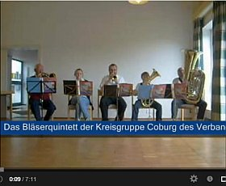](https://youtu.be/l9jrlbZqBOA) 
Grindelwald - Härrlich/Grässlich - Mein Alpenvideo bei Youtube: 
[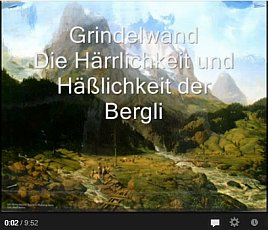](https://youtu.be/pkDRMqZZVSY) 

[Arpeggio](http://www.arpeggio.de) - Tonstudio Tim Birkner. Mit lesenswerten Klassik-CD-Rezensionen und Bestellshop! 

[Dekanatskantor in Kronach: Marius Popp](http://www.mariuspopp.com) - mit viel orgellastiger Info)

 [Texte/Briefe/Vita von Reuven Moskovitz](http://www.arendt-art.de/deutsch/palestina/Stimmen_Israel_juedische/reuven_moskovitz.htm), * 27.10.1928 in dem Schtetl Frumusica im Norden Rumäniens, + 4.8.2017, Israel, Autor des Politschockers "Der lange Weg zum Frieden. Deutschland - Israel - Palästina. Episoden aus dem Leben eines Friedensabenteurers"

[Reuven Moskovitz zur "Zweiten Schuld"](http://www.arendt-art.de/deutsch/palestina/Stimmen_Israel_juedische/Reuven_Moskovitz_jahresbrief_2006.htm), die sich die traumatisierten Deutschen heute durch bedingungslose Unterstützung des israelisch-zionistischen Verbrechertums aufladen - Spannend!

[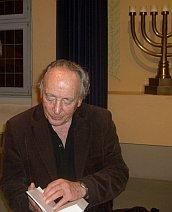 
Video: Reuven Moskovitz erzählt und spielt Mundharmonika - Unser Schtetl brennt](REUVEN.WMV) - in der ehemaligen Synagoge Altenkunstadt am 03.03.2008 (WMV 10 MB, Aufnahme: Konrad Fischer) 

**[Zeichnen und Malen - aus meinem Beaujolais-Skizzenbuch (mit weiteren Skizzen-Links)](8beau.md)**

Orth 2002 + Läckö 1992

Meersburg 1994 + 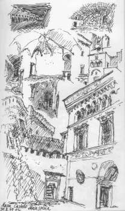.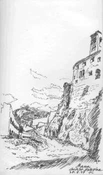Malaspina 1997

Fürstenstein 2002 + Carcassone 2004

**[Archäoastronomie](8dom.md)** 
(z.B. [Kai Helge Wirth: Der Ursprung der Sternbilder als germanische Landkarten](https://web.archive.org/web/20060718140534/http://www.chaco-pur.info:80/sternb.htm) - nach ["Die Rätsel der Sternbilder"](http://www.veoh.com/watch/v18365143HDMQeApr) von Marcus Hansmann in ARTE am 17.04.2004 und dem Buch "[Wirth: Der Ursprung der Sternzeichen](https://books.google.de/books/about/Der_Ursprung_Der_Sternzeichen.html?id=yNBle8gQfdIC&redir_esc=y)")

**Mitgliedschaften in Vereinen - Stand Mitte 2009** 
1975 [Bund Naturschutz BN e.V.](http://www.bund-naturschutz.de) 
1976 Akademischer Gesangsverein München [AGV e.V.](http://www.agv-muenchen.de) im Sondershäuser Verband [SV](http://www.sv.org) e.V. 
1979 [Bayer. Landesverein für Heimatpflege e.V.](http://www.heimat-bayern.de) 
1979 [Frankenbund -Vereinigung für Fränkische Landeskunde und Kulturpflege e.V.](http://www.frankenbund.de) 
1979 Fördergesellschaft [Windsbacher Knabenchor](http://windsbacher-knabenchor.de) e.V. 
1984 [AHF Internationaler Arbeitskreis für Hausforschung e.V.](http://www.arbeitskreisfuerhausforschung.de/) 
1986 [Deutsche Burgenvereinigung e.V.](http://www.deutsche-burgen.org) zur Erhaltung der historischen Wehr- und Wohnbauten

 
Marksburg 1990, Sitz der [Deutsche Burgenvereinigung e.V.](http://www.deutsche-burgen.org)

1991 Bürgerinitiative Altstadt Wismar BAW e.V. 
1991 [Hennebergisch-Fränkischer Geschichtsverein e.V.](http://www.geschichtsverein-henneberg.de) 
1993 Verein zur Rettung der Neuenburg e.V.[Museums-Info](http://www.schloss-neuenburg.de/) 
1995 Verein der Freunde und Förderer der Cistercienserinnen-Abtei Waldsassen e.V. 
1996 [Südtiroler Burgeninstitut](http://www.burgeninstitut.com/) 2012 [Nationale Anti-EEG-Bewegung / Stromverbraucherschutz NAEB e.V.](http://www.naeb.info)

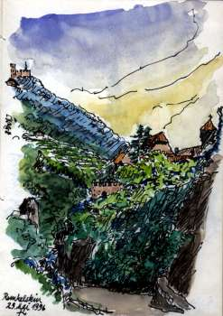Runkelstein 1996 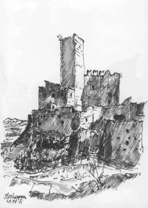Hocheppan 1991

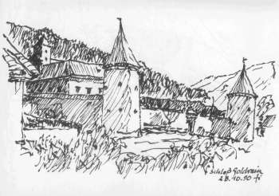Schloß Goldrain 1990

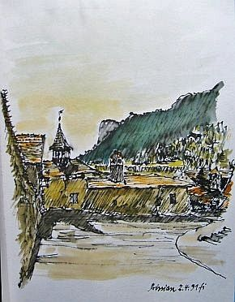An der Fahlburg in Prissian 1991 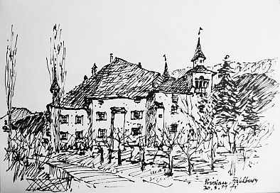Die Fahlburg 1991 Prissian 1991

Mittlerer Hinterbrunner in Hafling, Südtirol 1990

Bozen Maria-Himmelfahrt-Kirche 1990

Meran 1991 Burg Hocheppan 1991

Schreckenstein-Keller in St. Pauls 1991 Gleif-Kapelle und Kalvarienberg 1991

St. Valentin 1996 St. Vigil 1996

1998 [IGB Interessengemeinschaft Bauernhaus](http://www.IGBauernhaus.de) e.V. 
1998 Yehudi Menuhin live music now Franken e.V. - [Skizzencollage](8menuhin.md) vom Yehudi Menuhin live music now Benefizkonzert am 9.10.1999 mit Siegfried Jerusalem und jungen Künstlern in Schloß Weißenstein, Pommersfelden 
1999 [Siebenbürger Landsmannschaft e.V.](http://www.siebenbuerger.de) (Weiterführung der Mitgliedschaft der verstorbenen Mutter) 
[20 Jahre Coburger Kreisgruppe](http://www.siebenbuerger.de/sbz/sbz/news/1055750033,92884,.html) <> Dr. Gabriele Mergenthaler: **[Preisgabe, Sichern, Konservieren, ... ? Zur Situation der kirchlichen Denkmalpflege und Kirchenburgen in Siebenbürgen](http://www.siebenbuerger.de/sbz/landundleute/kirchenburgen_siebenbuergen_mergenthaler.html)** <> [projekt-kirchenburgen.ro](http://projekt-kirchenburgen.ro/) - Leitstelle Kirchenburgen: Projektbüro beim Landeskonsistorium der Evangelischen Kirche A.B. in Rumänien (Siebenbürgen / Transsylvanien) zur Koordination der bau- und fördertechnischen Rettungsmaßnahmen an den gefährdeten siebenbürgisch-sächsischen Kirchenburgen <> [Tartlau](http://www.siebenbuerger.de/ortschaften/tartlau/)im Burzenland - hier war mein Großvater Viktor Mökesch evangelischer Pfarrer in der berühmten [Kirchenburg](http://kirchenburgen.org/location/tartlau-prejmer/) bis 1941 <> [Ausflug der Coburger](https://web.archive.org/web/20080317082739/http://www.siebenbuerger-traun.at:80/nb/Archiv/Coburger_2006/Coburger2006.htm) zur Nachbarschaft Traun 2006 <> [Frühlings- und Muttertagsfeier in Coburg 2008](http://www.siebenbuerger.de/zeitung/artikel/kreisgruppen/7804-fruehlings_-und-muttertagsfeier-in.html)

 

Schloß Traun, Ringmantelanlage - Hier befindet sich im 1. OG der Clubraum und im Hauptgebäude die Heimatstube der Siebenbürger Nachbarschaft Traun

**[Seminare/Vorträge und Publikationen](1sempub.md)** 
**[Aktuelles Seminarangebot](12akt.md)**

**[EKD-Stiftung zur Bewahrung kirchlicher Baudenkmäler in Deutschland www.stiftung-kiba.de/](http://www.stiftung-kiba.de/)** - Hier darf man auch selber was spenden, damit die Kirche im Dorf bleibt!

 
Schloßkirche Cappenberg 1991

Konrad Fischer: Fassaden energetisch richtig und kostensparend sanieren 1 
 
[Teil 2](http://www.youtube.com/watch?v=Y1NSxAW15Cc) [Teil 3](http://www.youtube.com/watch?v=RAT7VzBo8k0) [Teil 4](http://www.youtube.com/watch?v=6TBII25iVQk) [Teil 5](http://www.youtube.com/watch?v=Kb0C4KiZvVA) 

**Links zu einigen Bauwerken, an deren Reparatur/Umbau/Modernisierung ich beratend oder mit meinem Architektur- und Ingenieurbüro mitwirke bzw. mitgewirkt habe / Links to restorated / refurbished buildings for which I did the project consultancy or for which my team colleagues and I did the whole planning and the managment of works:**

[Die Tonenburg in Albaxen bei Höxter](http://www.tonenburg.de/) [Link 2](http://www.burgen-und-schloesser.net/092/home.htm) (Bau- und Projektberatung, Unterstützung bei Förderverhandlungen, 1998-2004)

- [Arztpraxis Dr. med. Wolfram Kersten, Bamberg](medizin.md)

[Kloster Banz](http://www.hss.de/bildungszentren/kloster-banz.html) in Oberfranken (Bauleitung Generalsanierung der ehem. Benediktinerabtei als Tagungszentrum der Hanns-Seidl-Stiftung, BA 1+2 (Pfarrhaus, Hauptbau, Gesamtanlage-Dächer), 1980-84)

- [Luftbild](http://www.ulrich-ohle.de/banz1.htm) von Ulrich Ohle 

[Berlin St.-Marien-Kirche](http://www.marienkirche-berlin.de/) [Mariengemeinde - Geschichte](http://www.marienkirche-berlin.de/c_2_2_0.php) (Planung und Baubetreuung Turminstandsetzung 2000 ff.)

Berlin, Pankow-Niederschönhausen: [Orangerie und Gärtnervillen von Schloß Schönhausen](http://berlin.neubaukompass.de/Berlin/Pankow/Bauvorhaben-NEUE-ORANGERIE-Berlin/) (Notsicherung und Sanierung, Planung und Baubetreuung 1999-2017)

[Die Marksburg](http://www.marksburg.de) in Braubach am Rhein, Mitwirkung im Marksburg-Bauausschuß seit 1991; Schadensaufnahme und Maßnahmenplan für Gesamtanlage mit Arch. Klaus Bingenheimer, Darmstadt, 2000; Planung Fassadeninstandsetzung und Verputz des Rheinbaus 2001

[Das Bremer Rathaus ](http://www.rathaus-bremen.de/)(Fassaden-, Fenster-, Balkon- und Dachreparatur am alten und neuen Rathaus 2000 ff.) 
[Bald wird Bremens Rathaus ganz verhüllt: Fassade muss saniert werden Restaurierungs-Spezialist meidet Chemie und setzt auf alte Materialien](http://www.senatspressestelle.bremen.de/sixcms/detail.php?id=7131) (Senatspressestelle / Senatskanzlei Bremen 21.12.2000) 
[Rathaus 1](http://www.schaetze-der-welt.de/denkmal.php?id=320) [taz 20.12.00 Bauschäden: Rathaus mit "gestörter Wasserhaltung"-](http://www.taz.de/1/archiv/archiv/?dig=2000/12/20/a0209) zur "Musterachse" [taz 22.1.02 Massage fürs Rathaus](http://www.taz.de/pt/2002/01/22/a0253.nf/text) [Beschreibung der Restaurierungsmaßnahmen am Neuen Rathaus durch ausführende Firma Hollerung](http://www.hollerung.com/restaurierung-referenzen/neuesrathausbremen-29.htm)

Burg [Burgthann](http://www.roadstoruins.com/images/c-burgthann.jpg) zwischen Altdorf und Nürnberg (Saaleinbau in Keller der Palasruine, Einbau Turmausstieg auf Bergfried, Instandsetzung Ringmauer, Neubau Toilettenbau, Erschließung Kapellenbau, Putz- und Freskensicherung Wohnbau, 1986-95),[burgthann/historisches-franken.de,](http://www.historisches-franken.de/revue/burgthann061.htm) Link Burgverein: [Burg Burgthann](http://www.burgverein-burgthann.de/)

Burkersdorf, ev.-luth. Kirche St. Marien, Gesamtinstandsetzung 1986-89 [Küpser Kirchen - Burkersdorf](http://www.kueps.de/kirchen/)

Eggenbach Lkr. Lichtenfels, [Fachwerkhaus Nr. 2/3](http://www.tourismusverein-ebensfeld.de/gastgeberverzeichnisund-gastronomie/eintrag-ferienwohnung/article/ferienhaus-familie-maier.html) [Eggenbach Hs. Nr. 2](http://www.maier-ferienhaus.de/)(Planung Gebäude, Haustechnik mit Hüllflächentemperierung, Tragwerk, Bauleitung 1987-90), prämiert mit ["Medaille für Verdienste um Kultur und Tradition auf dem Lande"](1mader.md#blfh) des Bayer. Landwirtschaftsministeriums

[Obereggersberg, Schloß Eggersberg, Schloßanlage mit Nebengebäuden](http://www.schloss-eggersberg.eu/), teils mit Legschieferdeckung (Planung Gebäudeinstandsetzung und Umbau Ökonomiegebäude, z.T. Tragwerk, Ausschreibung und Vergabe 1989-1999, aktualisierte Gebäudbewertung+Erfassung Sanierbedarf 2007), [Link 2](http://www.933-egge.german-castles.biz/), [Link 3](http://www.go-dmi.de/fotogalerie/2005/schloss_eggersberg.html) [Link 4](http://www.flickr.com/photos/britta_585/1634624/in/set-22334/)

[Eisfeld, Altstadt](http://www.stadt-eisfeld.de/index.php?id=86) (konstruktive Sicherung von ca. 55 historischen Bürgerhäusern, Bestandsaufnahme, Planung und Bauleitung 1992-94)

[Schloß Eisfeld](http://www.stadt-eisfeld.de/index.php?id=39), (Bestandsaufnahme, Planung, Gebäude und Tragwerk, Bauleitung für Instandsetzung Steinernes Haus, Dach und Fassade 1991 ff.)

[Etzelwang, Schloß Neidstein](http://www.mittelbayerische.de/bayern/hollywood-maerchen-ohne-happy-end-21704-art1001762.html) ([Kaufberatung mit Grobkostenschätzung für Nicolas Cage](http://www.welt.de/welt_print/article2129728/Deutsche-Schloesser-im-Angebot.html) 2006)

Gemünda, [evang.-luth. Kirche](http://www.dekanat-michelau.de/html/gemuenda.html), Gesamtinstandsetzung 1979-83 (Bestandsaufnahme, Planung, Bauleitung)

Gleußen, [evang.-Luth. Kirche](http://www.dekanat-michelau.de/html/lahm_im_itzgrund_und_gleussen.html), Außeninstandsetzung 1979-80 (Bestandsaufnahme, Planung, Bauleitung)

Lahm im Itzgrund, [evang.-luth. Schloßkirche](http://www.dekanat-michelau.de/html/lahm_im_itzgrund_und_gleussen.html), Gesamtinstandsetzung 1979-92 (Bestandsaufnahme, Planung, Bauleitung)

Lichtenfels, [evang.-luth. Martin-Luther-Kirche](http://www.dekanat-michelau.de/html/lichtenfels.html) und Pfarrhaus, Gesamtinstandsetzung 1979-87 (Bestandsaufnahme, Planung, Bauleitung)

Buch am Forst-Lichtenfels, [evang.-luth. Kirche](http://www.dekanat-michelau.de/html/buch_am_forst.html) und Pfarrhaus, Gesamtinstandsetzung 1981-82 und 1985-86 (Bestandsaufnahme, Planung, Bauleitung)

Reundorf-Lichtenfels, [Christ-König-Str. 7, ehem. Gemeindehaus](http://www.ferienwohnung-nemmert.de) (Umbau und Modernisierung zu Wohnhaus mit Ferienappartement, Bestandsaufnahme, Planung Gebäude, Haustechnik, Tragwerk, Bauleitung 1988-91)

[Inselstadt Lindau am Bodensee](http://de.wikipedia.org/wiki/Lindau_\(Bodensee\)) (Stadtmauern/Bastionen - Baugeschichtliche, technische und geometrische Bestandsaufnahme, Schadensbegutachtung, Maßnahmenplanung 1988-89)

[Markt Marktzeuln - Der Koppenhof (1607)](http://www.marktzeuln.de/_inhalt/tourismus/impressionen/impressionen.zip/bild_7.jpg) (Instandsetzung für Wohnzwecke, technische und geometrische Bestandsaufnahme, Planung, Bauleitung 1979-84)

Schloß Merseburg (Restaurierung Fassaden und erhaltende Instandsetzung aller Fenster 1995 ff.) 
- [Das Schloß von Merseburg](http://www.burgen-und-schloesser.net/sachsen-anhalt/schloss-merseburg/)

Michelau in Oberfranken [Deutsches Korbmuseum](http://korbmuseum.gemeinde-michelau.de/index.php?id=0,48); (Generalsanierung und Museumseinrichtung 1979-94)

Michelau in Oberfranken, [evang.-luth. Kirche](http://www.dekanat-michelau.de/html/michelau.html), Außeninstandsetzung (Bestandsaufnahme, Planung, Bauleitung)

München, [Russisch-Orthodoxes Kloster des Heiligen Hiob](http://hiobmon.de/), Sanierung und Erweiterung (Nutzungskonzeption 2014 ff.)

Schloß Frankleben bei Braunsbreda (Ruinensicherung, Instandsetzungs- und Nutzungskonzeption 2001 ff.) - Berichte der Mitteldeutschen Zeitung [1](http://www.mz-web.de/servlet/ContentServer?pagename=ksta/page&atype=ksArtikel&aid=1072010910747), [2](http://www.mz-web.de/servlet/ContentServer?pagename=ksta/page&atype=ksArtikel&aid=1069248332907)

 
Schloßanlage Neuenburg in Freyburg an der Unstrut (Photo: [Ed Kane](http://www.roadstoruins.com) 2000: Konrad Fischer mit Nutzungsentwurf Neuenburg) 
(Generalsanierung mit Planung Gebäude, Tragwerk, Haustechnik und Freianlagen seit 1990, 
1993 Gründung und bis 1997 Vorsitz des Wirtschaftsbeirats des Vereins zur Rettung und Erhaltung der Neuenburg e.V.) 
- [Die Neuenburg in Ed Kanes 'Roads to Ruins'](http://www.schloss-neuenburg.de/) [castlesearch.com: Neuenburg (engl.)](http://castlesearch.com/neuenburg.html) 
- [Neuenburg (off. Seite)](http://www.schloss-neuenburg.de/) 
- [Neuenburg (DBV)](http://www.burgenperlen.de/Perlen/Sachsen_Anhalt/neuenburg.htm) 
[Referenz des Landesamtes für Denkmalpflege Sachsen-Anhalt für die Arbeiten meines Büros](1mader.md#sa)

[Schloß Oberlangenstadt](http://www.kueps.de/gemeindeportrait/ortsansichten/schloesser/143.asp) Instandsetzung Schloßdach und -fassaden, Remise und Pferdestall 1979-88 (Bestandsaufnahme, Planung Gebäude, Bauleitung)

[Obristfeld, ev.-luth. Kirche](http://www.dekanat-michelau.de/html/st_nikolaus-kirche.html), Gesamtinstandsetzung 1979-94 (Bestandsaufnahme, Planung, Bauleitung)

[Die ehem. Synagoge in Odenbach, RLP,](http://www.politische-bildung-rlp.de/schwerp/s_g_ged_odenbach.htm) - Planung und Einbau [Hüllflächentemperierung](7temper.md) 2001

[Redwitz, ev.-luth. Schloßkirche](http://www.dekanat-michelau.de/html/st_aegidius-kirche.html), Instandsetzung Außen 1979-80, (Bestandsaufnahme, Planung, Bauleitung)

[Katharinenkloster Rostock](http://www.zum.de/Faecher/G/BW/Landeskunde/w2/hanse/staedte/rostock/katharinen.htm) (Baugeschichtliche und Technische Bestandsaufnahme, Denkmalpflegerische Zielstellung, Fachbegutachtung Wettbewerb für Ausbau als Hochschule für Musik und Theater, Instandsetzungsplanung und Ausschreibung unter Projektsteuerung PEHT Berlin und Generalplanung Braun&Voigt, Frankfurt, 1996-97)

[Schney, ev.-luth. St. Marienkirche, Gesamtinstandsetzung 1981-90](http://www.dekanat-michelau.de/html/schney.html)

Seßlach, Flenderstr. 89, Umbau und Modernisierung des spätgotischen Ackerbürgerhauses (Planung und Bauleitung Gebäude und Techn. Ausrüstung, 1986-89) [Rothenberger Tor, rechts Flenderstr. 89](http://www.stadt-sesslach.de/bauten/tor_roth.htm) [Flenderstrasse, links Nr. 89](http://www.stadt-sesslach.de/bauten/flender.htm)
Schwerin, [Puschkinstr. 6 (Konservatorium)](http://www.jsoschwerin.de/proben.htm) und [13 (Brandensteinsches Palais)](http://schloesserrundschau.de/meckpomm/schloesser/schwerin04.html), [Umbau und Modernisierung der Barockpalais als Konservatorium und Volkshochschule](http://www.hauspost.sn-info.de/hp_online_2003_01/s/26.html) der Stadt Schwerin (umfangreiche Ergänzung der Bestandsaufnahme und Planungsänderung des Entwurfs des Modernisierungsgutachtens, Planung und Bauleitung Gebäude, Tragwerk und Holzschutzgutachten (nur 6), Haustechnik Wasser, Abwasser, HLS, 2002 ff.)
Strößendorf, [evang.-luth. Schloßkirche](http://www.dekanat-michelau.de/html/stroessendorf_altenkunstadt.html), Inneninstandsetzung 1979-80 (Bestandsaufnahme, Planung, Bauleitung)
[Veitshöchheim - Fürstbischöfliches Schloß Veitshöchheim](http://www.schloesser.bayern.de/deutsch/schloss/objekte/veitsho.htm) (Einbau einer im EG wasser-, im OG elektroversorgten [Hüllflächentemperierung](7temper.md) mit konservatorischer Zielstellung [(Projektbericht)](7temp17.md), Planung und Ausführung 01/02 

[Hennebergisches Museum Kloster Veßra](http://www.museumklostervessra.de), Thüringen (Sicherung, musealer Ausbau verschiedener Objekte seit 1991)

[Cistercienserinnen-Abtei mit Mädchenrealschule Waldsassen](http://www.abtei-waldsassen.de), Opf. (Generalsanierung 1988 - 2003, Gesamtnutzungsplanung mit schulbauaufsichtlicher Genehmigung, Planung und Durchführung BA1 (Gesamtdach, Fassade Bibliotheks-, Apotheken- und Pfortenflügel, Tragwerksplanung für Dach- und Bibliothekssicherung) 6,4 Mio DM; Planung und Durchführung Neubau Sportplatz, Planung Gesamtfassadeninstandsetzung, Planung und Durchführung BA2 (Umbau und Modernisierung Ostflügel, Bibliotheksflügel, Haustechnikanlagen Kellergeschoß mit Steigsträngen, Sicherung Südfassade Südflügel, Planung Freianlagen/Pausenhof) 15,5 Mio DM; Planung BA3 (Südflügel) 16 Mio DM, )

Weißenbrunnn, ev.-luth. [Dreieinigkeitskirche](http://www.weissenbrunn-evangelisch.de/index.php?option=com_wrapper&view=wrapper&Itemid=36) (Gesamtinstandsetzung mit techn. Ausrüstung und Außenanlagen 1981-89)

Weißenfels, eine [geschichtsträchtige und sehenswerte Stadt](http://www.weissenfels.de/) in Sachsen-Anhalt [80 leer stehende Altstadthäuser (Sicherung), [Kirchturm St. Marien](http://www.weissenfelstourist.de/verzeichnis/objekt.php?mandat=33484) (Außen-Instandsetzung 1992), [Geleitshaus](https://www.geleitshaus.com/)(Generalsanierung 1993-1998, Gebäude, Tragwerk, Haustechnik, Freianlagen) ([Kirchturm und Geleitshaus](http://web.archive.org/web/20040206152003/http://www.deike-dach.de/denkmalpflege.html) aus Sicht des beteiligten Handwerkers), Pulverturm (Sicherung), Stadtarchiv (Generalsanierung Gebäude, Tragwerk, Haustechnik), Schloßtreppenanlage (Instandsetzung) und [Schloß Neu-Augustusburg](http://www.museum-weissenfels.de/) (Sicherung Dach und Kellerbereich, Nutzungsstudie, Umbau u. Modernisierung Eckbereich für Schloßkirchengemeinde (Planung))] 

[Referenz der Stadt Weißenfels](1mader.md#wsf) 
[Referenz des Landesamtes für Denkmalpflege Sachsen-Anhalt](1mader.md#sa)

Weyarn, [Sitz des Deutschen Ordens OT](http://www.deutscher-orden.de/konvente_weyarn.php), Sanierung (verschiedene Bestandsaufnahmen, Planungen und Bauleitungen ab 2004 ff.)

[Schloß Wilhelmsthal bei Eisenach](http://www.schloss-wilhelmsthal.de) (Bestandsaufnahme, Denkmalverträgliches Nutzungskonzept Schloß und Park Wilhelmsthal 2000, Kostenschätzung, Bauabschnittsbildung und Wirtschaftlichkeitsberechnung 1995-97) 
 
ARD-Kulturreport 22.11.01: [VOM SCHLOSS ZUR RUINE - Der Skandal Schloß Wilhelmsthal](http://web.archive.org/web/20020109035935/http://www.mdr.de/kulturreport/251101/thema4.html) 

[Schloß Wonfurt](https://www.musikfest-schloss-wonfurt.com/schloss) (Rohbauinstandsetzung und Teilausbau in mehreren Bauabschnitten, Bestandsaufnahme, Planung Gesamtmaßnahme und Bauleitung Bauabschnitte 1979-94)

[Zeyern, Anwesen Kaiser](http://www.zeyern.de/Baudenkmal/haeuserfahrt.html) ([Hüllflächentemperierung](7temper.md) des barocken Schiefer-Wohnhauses 2001)

Links zu [Beratungsprojekten und anderen Referenzobjekten Altbausanierung und Neubau](2berat.md#referenzobjekte)

[Reichenstein in der Eifel - Wir gründen ein Kloster](http://www.kloster-reichenstein.de) - Auszug aus der gregorianischen Complet der Benediktinermönche aus Bellaigue / Spendenaufruf (Video von Konrad Fischer) 
 

Nürnberg, 12.05.2010 - [Verleihung des Kostenspar-Awards von Hausgeld-Vergleich e.V.](http://www.hausgeld-vergleich.de/Deul_TippszumSparen_13.htm) an Konrad Fischer 

### Curriculum vitae / Biograpy / Bio of Konrad Fischer

Birth date / place: 28.10.1955 in Würzburg 

Parents: 
Herbert Fischer, 1919-1979, Dipl.-Ing., freelance architect, working in building restoration, private, public and clerical buildings 1957-79; 
Eva Fischer, born Möckesch 1923-1999, organist and choir director of the Evangelical Lutheran Church in Bavaria 

Siblings: 
Erika Fischer, born 1958, master of porcelain and glass painting, teacher at the Staatl. Berufsfachschule für Glas und Schmuck, Neugablonz; 
Armin Fischer, born 1962, Dipl-Ing. (FH), freelance Architect 

Marital Status: 1988 married with Petra Fischer, born Bothe, established graduate secondary-school teacher for mathematics and religion, preacher of the Evangelical Lutheran Church in Bavaria 

Children: 1989 Karolina, 1991 Mechthild, 1993 Editha, 1998 Wilhelm 

Schools: 
1962-66 Elementary school Schwürbitz 
1966-75 Secondary school: Meranier-Gymnasium Lichtenfels, math.-scientifical branch 

Languages: German (native), English (fluent) Latin (five years in school), Swedish (working knowledge), Danish and Norwegian (only reading), French and Italian (better tourist level) 

1975-76 Basic military service 

1976-81 Technical University of Munich, Department of Architecture, Degree: Dipl.-Ing. Univ. (MSc) Architecture 

Since 1979 (death of father) freelance working in the own architecture firm 

1981 et seq provision of places for work experience (3 - 18 months) for students, engineers and architects from Germany, Bulgaria, Denmark, England, Kazakhstan, Moldova, Poland, Russia, Sweden, Slovenia, Czech Republic, Hungary, partly in collaboration with the German Institute for Foreign Relations, Stuttgart 

1982-84 Scientific volunteer at the Bavarian State Office for Preservation of Monuments and Historic Buildings [www.blfd.de](http://www.blfd.de), departments: reports inventory, building research, archeology, practical preservation, restoration of fine art, workshops, field offices Regensburg and Seehof, Chief: Prof Dr Michael Petzet, later President of ICOMOS International 

1984 after 3 years practising registration as architect at the Bavarian Architect Chamber (Bayerische Architektenkammer) [www.byak.de](http://www.byak.de) 

1989 expanding the architecture firm with the specialized planning areas structural engineering and building technology, specialising in planning of room envelope heating systems 

1989 appointment to the Advisory Board for the Restoration (Bauausschuss) of Marksburg Castle ([www.marksburg.de](http://www.marksburg.de)), home of the German Castles Association (Deutsche Burgenvereinigung [www.deutsche-burgen.org](http://www.deutsche-burgen.org)), chairman 1989-96 

1990 appointment to the Advisory Board for Preservation (Beirat für Denkmalerhaltung) of the German Castles Association, 1st chairman since 1996, 3rd since 2006 

1993 founding of the Economic Advisory Council in the Association for the Rescue and Conservation of Neuenburg Castle ([www.schloss-neuenburg.de](http://www.schloss-neuenburg.de)), 1st chairman 1993-97 

1979-2007 more than 400 finished restoration projects with architectural and construction planning and management for private and public owners of monuments of local, regional, national and international importance in Germany; some consultancy projects for restauration and refurbishing in Germany, Austria, Italy; more than 300 Internet consultancy projects in Germany, France, Mallorca, Spain, Switzerland, Poland (details and project references see www.konrad-fischer-info.de/1refernz.htm, [www.konrad-fischer-info.de/2berat.htm](2berat.md), www.konrad-fischer-info.de/1mader.htm, project list: [www.konrad-fischer-info.de/1pl.exe](1pl.exe)) 

Since 1986 several awards for preservation projects 

Since 1987 organization and moderation of seminars and lectures ref. preservation planning and practical techniques for german architect chambers, university departments of architecture and preservation of monuments, ICOMOS; castle associations and other institutes in Germany, China, Denmark, Italy, Poland, Sweden (details see [www.konrad-fischer-info.de/12akt.htm](12akt.md)) 

Since 1991: Publication of many articles in technical journals, conference papers and 2007 a book ref. economical preservation planning systems and practical questions 

Since 1998: Edition of and contributions for the International Web Magazine for Restoration and Conservation of Old Buildings and Monuments www.konrad-fischer-info.de (Example: [Low-cost repair of historical buildings](repair.md)) 

Artistic activities 
1970 et seq participation in various choirs 
1973 et seq cellist in the Instrumental Collegium Lichtenfels 
1976 et seq Academic Choir Association Munich AGV 
1981 et seq publishing of calendars with own drawings, sketches and aquarelles 

Since 1979 free study travels to Denmark, France, Greece, Italy, Netherlands, Poland, Sweden, Yugoslavia 
1987 Poland, invitation Architects Association of Poland SARP 
1988 Bulgaria, invitation Bulgarian Architects Association SAB 
1991 Sofia, Bulgaria, as a German delegate to UNESCO experts meeting, Project 'Blue Danube', Intercultural links and Interaction of Danubian Countries 
2012 [Iran](http://www.iranreise.justdo-it.de/index.php?page=konrad-fischer), as a delegate invited from the Cultural Ibn Sina Institute 
2015 Shanghai, study travel combined with an invitation of the Tongji University 

Hochstadt 16/01/25

