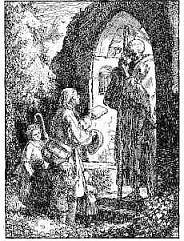
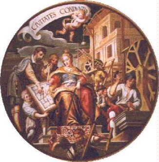
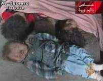
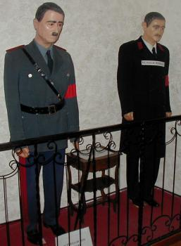
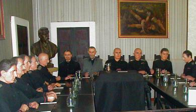
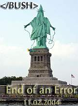
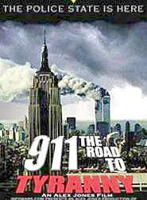

# Dies und Das - für (fast) Jeden was ...

## _Dedikation._

Ich habe die Ehr' Ihren Herrn Bruder zu kennen, und er ist mein guter Freund und Gönner. Hätt' auch wohl noch andre Adresse an Sie; ich denk' aber, man geht am besten gerade zu. Sie sind nicht für Adressen, und pflegen ja nicht viele Komplimente zu machen.

's soll Leute geben, heißen starke Geister, die sich in ihrem Leben den Hain nichts anfechten lassen und hinter seinem Rücken wohl gar über ihn und seine dünnen Beine spotten. Bin nicht starker Geist; 's läuft mir, die Wahrheit zu sagen, jedesmal kalt übern Rücken, wenn ich Sie ansehe. Und doch will ich glauben, daß Sie 'n guter Mann sind, wenn man Sie genug kennt; und doch ist's mir, als hätt' ich eine Art Heimweh und Mut zu dir, du alter Ruprecht Pförtner! daß du auch einmal kommen wirst, meinen Schmachtriemen aufzulösen und mich auf beßre Zeiten sicher an Ort und Stelle zur Ruhe hinzulegen.

Ich hab da 'n Büchel geschrieben und bring's Ihnen her. Sind Gedichte und Prosa. Weiß nicht, ob Sie 'n Liebhaber von Gedichten sind; sollt's aber kaum denken, da Sie überhaupt keinen Spaß verstehen, und die Zeiten vorbei sein sollen, wo Gedichte mehr waren. Einiges im Büchel soll Ihnen, hoff' ich, nicht ganz mißfallen; daß meiste ist Einfassung und kleines Spielewerk: machen Sie mit, was Sie wollen.

Die Hand, lieber Hain! und wenn Ihr 'nmal kommt, fallt mir und meinen Freunden nicht hart.

Die Alten sollen ihn anders gebildet haben: 

als Jäger im Mantel der Nacht, und die Griechen: als 'n "Jüngling, der in ruhiger Stellung mit gesenktem trüben Blick die Fackel des Lebens neben dem Leichnam auslöscht". Ist 'n schönes Bild und erinnert einen so tröstlich an Hain seine Familie und namentlich an seinen Bruder: 

wenn man sich da so den Tag über müde und matt gelaufen hat und kommt nun den Abend endlich so weiß, daß man's Licht auslöschen will - hat man doch nun die Nacht vor sich, wo man ausruhen kann! und wenn's denn gar den anderen Morgen Feiertag ist!! 's ist das wirklich ein gutes Bild vom Hain; bin aber doch lieber beim Knochenmann geblieben. 

So steht er in unsrer Kirch', und so hab' ich 'n mir immer von klein auf vorgestellt, daß er auf 'm Kirchhof über die Gräber hinschreite, wenn eins von uns Kindern 's Abends zusammenschauern tat und die Mutter denn sagte: der Tod sei übers Grab gangen. 

Er ist auch so, dünkt mich, recht schön, und wenn man ihn lange ansieht, wird er zuletzt ganz freundlich aussehen.

_[[Dedikation](http://gutenberg.spiegel.de/claudius/wandsbek/wand102.htm) des [Wandsbecker Boten](http://gutenberg.spiegel.de/claudius/wandsbek/wandsbek.htm) von [Matthias Claudius](http://www.sueddeutsche.de/kultur/artikel/196/11185/), Zeichnung von Rudolf Schäfer] _

Dem schließe ich mich vorbehaltlos an. - Konrad Fischer

---

Mein gezeichneter Gruß zum Neuen Jahrtausend - und nachfolgend etwas Geschriebens

13 Architekturskizzen aus Paris - Reihenfolge von oben links im Uhrzeigersinn: 

Notre Dame 1+2, St. Germain de Prets, Louvre 1+2, Montmartre, Ecole Militaire 1+2, Eifelturm, Arc de Triomphe, Place de la Bastille, Pont Neuf, Mitte: Disneyland.

---

_**"Ja, ich glaube an die sanfte Gewalt der Vernunft über die Menschen. Sie können ihr auf die Dauer nicht widerstehen. Kein Mensch kann lange zusehen, wie ich einen Stein fallen lasse und dazu sage: er fällt nicht. Dazu ist kein Mensch imstande. Die Verführung, die von einem Beweis ausgeht, ist zu groß. Ihr erliegen die meisten, auf die Dauer alle. Das Denken gehört zu den größten Vergnügungen der menschlichen Rasse."**_ 
(Berthold Brecht: Leben des Galilei) 

_**"It is error alone which needs the support of government. Truth can stand by itself."**_ 
(Notes on the State of Virginia, Q.XVII, 1782. ME 2:222, Thomas Jefferson, 3rd president of US, 1743 - 1826, WWW Source: [Thomas Jefferson, Notes on the State of Virginia, Query 17, 157-61](http://press-pubs.uchicago.edu/founders/documents/amendI_religions40.html)) 

_**"Nur der Irrtum (die Lüge) bedarf der (braucht die) Stütze der Regierung. Die Wahrheit steht von alleine (aufrecht)."**_ 
(Notizen zum Staat Virginia, Frage/Query 17, 1782, ME 2:222, Thomas Jefferson, 3. Präsident der Vereinigten Staaten von Amerika, 1743 - 1826 WWW Quelle (LESENSWERT!): [Thomas Jefferson, Notes on the State of Virginia, Query 17, 157-61](http://press-pubs.uchicago.edu/founders/documents/amendI_religions40.html)) 

---

**Die Computer waren reif für das Jahr 2000 - aber wir Menschen?**

**Zum Anfang des 3. Jahrtausends einige Gedanken fieser Denker:**

Süddeutsche Zeitung 31.12.1999

_"Serie: Die Gegenwart der Zukunft (52) 
_**Happy Millenium allerseits! 
**Das ist das wahre Rätsel des Jahrhunderts: Die Mittel sind da, unsere Probleme zu lösen, selbst der Wille dazu ist vorhanden, aber aus Gründen, die keiner genau angeben kann, klappt das alles nicht.

Von KLAUS PODAK

[...] Bildung war einst nicht, wie naive Gemüter höhnen, eine Art höheren Briefmarkensammelns, Surfen auf Staubwolken abgelegter Bibliotheken, Anhäufeln völlig nutzloser Daten und Informationen - eben kein Herumirren in klobigen Internets vergangener Tage. Bildung wurde gedacht als Ausbildung (Hervorbringung) innerer Organe des Geistes - bewusst bauend, also tätig, nicht bloß sammelnd, nicht allein rezipierend.

 
**Architectura führt Elias Holl den Zirkel 
**_(Ausschnitt aus dem Deckengemälde des Goldenen Saals 
im Augsburger Rathaus, 
Prof. Oskar Martin-Amorbach 1960 nach Matthias Kager um 1620, 
aus: 1999, Kostbarkeiten aus Augsburg, 
Jahreskalender der Versicherungskammer Bayern)_

[...] eines lässt sich mit Sicherheit sagen in diesen unsicheren Zeiten: Ohne Vernunft, die geschmähte, verlachte, verhöhnte, ohne solidarische Vernunft geht gar nichts. Genau das wissen wir im Grund alle. Wir müssen nicht einmal groß etwas Super-Neues erfinden. Denn _diese_ Zukunft ist, und sei es nur der Möglichkeit nach, in unserer Gegenwart schon enthalten. Das ist, wenn wir über die Details hinaus die vielen Prognosen richtig gelesen haben, der wahre Sinn unseres Titels: Die Gegenwart der Zukunft heißt Vernunft."

---

**_"Die Ursache für die Kraftlosigkeit des Guten liegt natürlich nicht im Guten selbst, 
sondern in uns, 
in unserer Inkonsequenz; 
wir suchen die Wahrheit nicht unbedingt, 
sondern wir ziehen ihr Grenzen; 
die Begrenzung der Wahrheit aber schafft der Lüge Raum._**

**_Da die Wahrheit sich nicht selbst widersprechen kann, 
so muß ihr strenge Folgerichtigkeit den Sieg sichern, 
und die Lüge, 
die sich nur durch inneren Widerspruch halten kann, 
aufheben."_**

**Wladimir Solowjew, 
in: _Zwölf Vorlesungen über das Gottesmenschentum_. Stuttgart 1921, S. 31**

**Themenlink:** Abraham a Santa Claras [Wunderlicher Traum von einem großen Narrennest / Ein Verlogner Narr](http://gutenberg.spiegel.de/abraham/narrnest/narr07.htm)

---

Ibykus - Zeitschrift für Poesie, Wissenschaft und Staatskunst Nr. 69/1999 

Dieser Text erhält durch den raffinierten Abbruch (? s.u.) der beiden neu-babylonischen Türme am 11.9.01 in New York besonderen Pep:

"_Prometheus und Europa_ 
von Lyndon H. LaRouche Jr.

[...] WIE SICH DIE BÜRGER SELBST AN DER NASE HERUMFÜHREN

Wenn ich nun beginne, möchte ich Sie eingangs noch einmal davor warnen, aus Engstirnigkeit in einen in den letzten, vom Bildungsverfall geprägten Jahrzehnten häufigen Fehler zu verfallen. Führen Sie sich nicht selbst an der Nase herum: Denken Sie nicht, das hier Dargestellte habe mit den praktischen Problemen Ihrer näheren Umgebung nichts zu tun!

[...] Auf der unteren Ebene des Denkens funktioniert die übliche Politik - selbst bei dem, was die meisten Menschen für die ganz hohe politische Ebene halten - auf der Grundlage bestimmter relativ oberflächlicher axiomatischer Annahmen. Die Menschen auf dieser unteren Ebene halten sich an Grundannahmen [...]. Der größte Trick der heutigen Politik - z.B. die üblichen "billigen Tricks" im Wahlkampf - gründet darauf, den blinden Glauben der meisten Menschen an diese Grundannahmen auszunutzen.

Wenn aber plötzlich die normalen Verhältnisse durch eine, wie die jetzt weltweit aufbrechende, Krise verändert werden, brechen diese axiomatischen Annahmen in sich zusammen. Das gilt sogar für viele Leute in relativ hohen Positionen in Politik und Finanzwelt heute. Eine sich rasch wandelnde Welt macht sie perplex. Diese Veränderungen gehen nach neuen Regeln vor sich, die sie nicht verstehen. Immer mehr einfache Bürger ebenso wie Führungsleute aus Wirtschaft und Politik entdecken das jetzt. Dies wird sich in den kommenden Wochen und Monaten noch ausweiten. [...]

Die "Blindheit" des typischen Amerikaners, ebenso wie anderer Völker, liegt in seiner Gleichgültigkeit gegenüber Problemen, mit denen er "sich nicht belasten möchte". Nichts hat den "Underdogs" - und das sind inzwischen mehr als 90 Prozent der Amerikaner! - in den letzten 30 Jahren mehr geschadet als ihr eigener Wunsch, ihre Aufmerksamkeit auf die "praktischen Dinge" des Alltags zu beschränken. Gewöhnlich schadet ihnen das, was sie nicht sehen wollen, am meisten. Wird ein typischer Amerikaner mit wirklich wichtigen Problemen konfrontiert, kommt als Reaktion: "Bitte, reden wir über etwas anderes!".

[...]

Gewöhnlich ist diese "Blindheit"[...], Teil seines gewohnheitsmäßigen Zynismus, seiner populistischen Verachtung der Prinzipien von Wissenschaft und klassischer Kunst. [...]

WISSENSCHAFT ALS KUNST

[...] Die beiden Weltkriege erwiesen sich als demographische Katstrophe für ganz Europa. Seit dem Mord an Präsident John F. Kennedy wurden die Institutionen des modernen souveränen Nationalstaats bewußt zerstört und die Förderung des wissenschaftlichen und technischen Fortschritts in Europa, den USA und anderswo ausgesetzt, und daraus folgte eine demographische Katstrophe und eine schwere Wirtschaftskrise in den bis dahin wirtschaftlich führenden Ländern der Welt.

Dieser Abwärtstrend, der aus der Ablösung des modernen Nationalstaats durch die "Globalisierung" und gleichzeitig der gezielten Unterdrückung des wissenschaftlichen-technischen Fortschritts resultierte, drohte sich nun zu einer globalen demographischen Katastrophe auszuwachsen, einem "neuen finsteren Zeitalter" der ganzen Menschheit [...]

[...] Die utopischen Propagandisten bezeichnen es [...] als "New Age" oder als "Morgendämmerung des Zeitalters des Wassermanns". In den 60er Jahren [...] war es weithin als "kultureller Paradigmawandel" der "Rock-Drogen-Sex-Gegenkultur" bekannt, Zbigniew Brzezinski nannte es "technotronische Gesellschaft", und üblich ist auch der Begriff einer utopischen "nachindustriellen Gesellschaft".

Aus diesem Wahnsinn gingen 1972 die Anfänge der weltweiten "Umweltbewegung" hervor, eine Verschwörung zur Beförderung der Ziele des "World Wildlife Fund" (WWF) und des "1001-Club", zwei Organisationen, die der englische Prinzgemahl Philip und der ehemalige SS-Mann Prinz Bernhard der Niederlande 1961 gegründet hatten. [...]

[Der wahre Fortschritt unserer Gesellschft muß sich aber auf ein Prinzip der Antike stützen: Die schöpferische Vernunft] Schon in meiner Jugend, als ich den philosophischen Standpunkt von Leibniz übernahm und erkannte, wie wichtig es war, Kant zu widerlegen, verstand ich das Prinzip der schöpferischen Vernunft im Gegensatz zur leblosen formalen Logik. [...] Bei meinem Bemühen, die schöpferische Vernunft klar zu definieren, wählte ich die klassische Kunst und Komposition als Mittel, um zu demonstrieren, wie sich Menschen untereinander die Idee der schöpferischen Vernunft mitteilen können. [...]

Unser sterbliches Leben wurde uns als ein Talent gegeben, das wir so einsetzen sollen, daß das Gute, das wir damit zur Weiterentwicklung der Menschheit beitragen, größer ist als das, was uns ursprünglich gegeben wurde. Wennn wir erkennen, daß die moralische und physische Verbesserung der Lebensbedingungen der Menschheit von einem nichtendenden Strom immer weiterer Universalprinzipien der klassischen Kunst und der Physik für die Macht der Menschheit im und über das Universum abhängt, dann besteht die größte Hoffnung für unser relativ kurzes, sterbliches Leben darin, für die, die nach uns kommen, etwas Dauerhaftes beizutragen.

Hat man diese Verständnis der wahren eigenen Identität erlangt, dann hat man die notwendige Motivation, so zu handeln, wie man es tun muß, damit man im Angesicht des Todes lächeln kann. [...]"

Kommentar: Da fragt man sich andererseits, warum ein LaRouche den lieben WKII-Präsidenten Roosevelt dauernd so lobt und die Rückkehr zu seiner Politik fordert. Da muß man ja im Angesicht des Hirntodes kotzen!

Papst Johannes Paul II.: [Ecclesia in Europa](http://www.vatican.va/holy_father/john_paul_ii/apost_exhortations/documents/hf_jp-ii_exh_20030628_ecclesia-in-europa_ge.html), 28.06.2003 (Auszug): 

7. Dieses Wort richtet sich heute auch an die Kirchen in Europa, die oft durch eine Trübung der Hoffnung auf die Probe gestellt sind. Die Zeit, in der wir leben, vermittelt mit den ihr eigenen Herausforderungen in der Tat den Anschein des Verlorenseins. Viele Männer und Frauen scheinen desorientiert, unsicher und ohne Hoffnung zu sein, und nicht wenige Christen teilen diesen Gemütszustand. Zahlreiche besorgniserregende Zeichen zeigen sich zu Beginn des dritten Jahrtausends bedrohlich am Horizont des europäischen Kontinents, der “zwar sehr reich ist an außerordentlichen Glaubenszeugnissen und sich im Rahmen eines zweifellos freieren und einmütigeren Zusammenlebens befindet, trotzdem aber die ganze Zerrüttung spürt, die die ältere und jüngere Geschichte im tiefsten Inneren seiner Völker verursacht hat, was oft zu Enttäuschungen führt„. 

Unter den vielen, auch anläßlich der Synode ausführlich erwähnten Aspekten möchte ich den Verlust des christlichen Gedächtnisses und Erbes anführen, der begleitet ist von einer Art praktischem Agnostizismus und religiöser Gleichgültigkeit, weshalb viele Europäer den Eindruck erwecken, als lebten sie ohne geistigen Hintergrund und wie Erben, welche die ihnen von der Geschichte übergebene Erbschaft verschleudert haben. Daher ist es nicht allzu verwunderlich, wenn versucht wird, Europa ein Gesicht zu geben, indem man unter Ausschluß seines religiösen Erbes und besonders seiner tief christlichen Seele das Fundament legt für die Rechte der Völker, die Europa bilden, ohne sie auf den Stamm aufzupfropfen, der vom Lebenssaft des Christentums durchströmt wird.

Auf dem europäischen Kontinent fehlt es gewiß nicht an namhaften Symbolen für die Präsenz des Christentums, doch mit der langsam voranschreitenden Überhandnahme des Säkularismus laufen sie Gefahr, zu einem bloßen Relikt der Vergangenheit zu werden. Vielen gelingt es nicht mehr, die Botschaft des Evangeliums in die Alltagserfahrung einzubeziehen. In einem gesellschaftlichen und kulturellen Umfeld, wo dem christlichen Lebensentwurf ständig Trotz und Bedrohung begegnen, wird es immer schwieriger, seinen Glauben an Jesus zu leben. In vielen öffentlichen Bereichen ist es einfacher, sich als Agnostiker denn als Gläubigen zu bezeichnen; man hat den Eindruck, daß sich Nichtglauben von selbst versteht, während Glauben einer gesellschaftlichen Legitimation bedarf, die weder selbstverständlich ist, noch vorausgesetzt wird.

8. Mit diesem Verlust des christlichen Gedächtnisses geht eine Art Zukunftsangst einher. Das gemeinhin verbreitete Bild von der Zukunft stellt sich oft als blaß und ungewiß heraus. Man hat eher Angst vor der Zukunft, als daß man sie herbeiwünschte. Besorgniserregende Anzeichen dafür sind unter anderem die innere Leere, die viele Menschen peinigt, und der Verlust des Lebenssinnes. Zu den Zeichen und Auswirkungen dieser Existenzangst sind insbesondere der dramatische Geburtenrückgang und die Abnahme der Priester- und Ordensberufe zu zählen sowie die Schwierigkeit, wenn nicht sogar die Weigerung, endgültige Lebensentscheidungen auch bezüglich der Ehe zu treffen.

Wir erleben eine verbreitete Zersplitterung des Daseins; es überwiegt ein Gefühl der Vereinsamung; Spaltungen und Gegensätze nehmen zu. Unter anderen Symptomen dieses Zustandes erfährt das heutige Europa das ernste Phänomen einer Krise der Familie und des Schwindens einer Konzeption von Familie überhaupt, die Fortdauer oder das Wiederaufflammen ethnischer Konflikte, das Wiederaufleben gewisser rassistischer Verhaltensweisen, die interreligiösen Spannungen, die Egozentrik, die Einzelne und Gruppen in sich verschließt, die Zunahme einer allgemeinen sittlichen Gleichgültigkeit und einer krampfhaften Sorge um die eigenen Interessen und Privilegien. In den Augen vieler läuft die zunehmende Globalisierung Gefahr, statt zu einer größeren Einheit der Menschheit zu führen, einer Logik zu folgen, die die Schwächsten ausgrenzt und die Zahl der Armen auf der Erde vermehrt.

Im Zusammenhang mit der Ausbreitung des Individualismus ist eine zunehmende Schwächung der Solidarität zwischen den Menschen festzustellen: Während die Hilfseinrichtungen lobenswerte Arbeit leisten, beobachtet man ein Abnehmen des Solidaritätsgefühls, so daß sich viele Menschen, auch wenn es ihnen nicht am materiell Notwendigen fehlt, immer einsamer und sich selbst überlassen fühlen, ohne das Netz einer gefühlsmäßigen Unterstützung.

9. Der Verlust der Hoffnung hat seinen Grund in dem Versuch, eine Anthropologie ohne Gott und ohne Christus durchzusetzen. Diese Denkart hat dazu geführt, den Menschen “als absoluten Mittelpunkt allen Seins zu betrachten, indem man ihn fälschlicherweise den Platz Gottes einnehmen ließ und dabei vergaß, daß nicht der Mensch Gott erschafft, sondern Gott den Menschen erschafft. 

Das Vergessen Gottes hat zum Niedergang des Menschen geführt. [...] Es wundert daher nicht, daß in diesem Kontext ein großer Freiraum für die Entwicklung des Nihilismus im philosophischen Bereich, des Relativismus im erkenntnistheoretischen und moralischen Bereich, des Pragmatismus und sogar des zynischen Hedonismus in der Gestaltung des Alltagslebens entstanden ist„. Die europäische Kultur erweckt den Eindruck einer “schweigenden Apostasie„ seitens des satten Menschen, der lebt, als ob es Gott nicht gäbe. 

Und was wußte schon unser verehrter Friedrich Schiller in seiner Antrittsvorlesung über die verschiedenen Formen der Wissenschaft von sich zu geben [Auszüge]?:

**"Was heisst und zu welchem Ende studiert man Universalgeschichte?**

von Friedrich Schiller 

Akademische Antrittsrede 1789 

[...]

Anders ist der Studierplan, den sich der Brodgelehrte, anders derjenige, den der philosophische Kopf sich vorzeichnet. 

Jener, dem es bei seinem Fleiß einzig und allein darum zu tun ist, die Bedingungen zu erfüllen, unter denen er zu einem Amte fähig und der Vorteile desselben teilhaftig werden kann, der nur darum die Kräfte seines Geistes in Bewegung setzt, um dadurch seinen sinnlichen Zustand zu verbessern und eine kleinliche Ruhmsucht zu befriedigen, ein solcher wird beim Eintritt in seine akademische Laufbahn keine wichtigere Angelegenheit haben, als die Wissenschaften, die er Brodstudien nennt, von allen übrigen, die den Geist nur als Geist vergnügen, auf das sorgfältigste abzusondern. Alle Zeit, die er diesen letztern widmete, würde er seinem künftigen Berufe zu entziehen glauben, und sich diesen Raub nie vergeben. Seinen ganzen Fleiß wird er nach den Forderungen einrichten, die von dem künftigen Herrn seines Schicksals an ihn gemacht werden, und alles getan zu haben glauben, wenn er sich fähig gemacht hat, diese Instanz nicht zu fürchten. Hat er seinen Kursus durchlaufen und das Ziel seiner Wünsche erreicht, so entläßt er seine Führerinnen - denn wozu noch weiter sie bemühen? 

Seine größte Angelegenheit ist jetzt, die zusammengehäuften Gedächtnisschätze zur Schau zu tragen, und ja zu verhüten, daß sie in ihrem Werte nicht sinken. Jede Erweiterung seiner Brodwissenschaft beunruhigt ihn, weil sie ihm neue Arbeit zusendet, oder die vergangene unnütz macht; jede wichtige Neuerung schreckt ihn auf, denn sie zerbricht die alte Schulform, die er sich so mühsam zu eigen machte, sie setzt ihn in Gefahr, die ganze Arbeit seines vorigen Lebens zu verlieren. Wer hat über Reformatoren mehr geschrieben, als der Haufe der Brodgelehrten? Wer hält den Fortgang nützlicher Revolutionen im Reich des Wissens mehr auf, als ebendiese? Jedes Licht, das durch ein glückliches Genie, in welcher Wissenschaft es sei, angezündet wird, macht ihre Dürftigkeit sichtbar; sie fechten mit Erbitterung, mit Heimtücke, mit Verzweiflung, weil sie bei dem Schulsystem, das sie verteidigen, zugleich für ihr ganzes Dasein fechten. 

Darum kein unversöhnlicherer Feind, kein neidischerer Amtsgehülfe, kein bereitwilligerer Ketzermacher, als der Brodgelehrte. Je weniger seine Kenntnisse durch sich selbst ihn belohnen, desto größere Vergeltung heischt er von außen; für das Verdienst der Handarbeiter und das Verdienst der Geister hat er nur einen Maßstab, die Mühe. Darum hört man niemand über Undank mehr klagen, als den Brodgelehrten; nicht bei seinen Gedankenschätzen sucht er seinen Lohn, seinen Lohn erwartet er von fremder Anerkennung, von Ehrenstellen, von Versorgung. Schlägt ihm dieses fehl, wer ist unglücklicher als der Brodgelehrte? Er hat umsonst gelebt, gewacht, gearbeitet; er hat umsonst nach Wahrheit geforscht, wenn sich Wahrheit für ihn nicht in Gold, in Zeitungslob, in Fürstengunst verwandelt. 

Beklagenswerter Mensch, der mit dem edelsten aller Werkzeuge, mit Wissenschaft und Kunst, nichts Höheres will und ausrichtet, als der Taglöhner mit dem schlechtesten! der im Reiche der vollkommensten Freiheit eine Sklavenseele mit sich herumträgt! - 

Noch beklagenswerter aber ist der junge Mann von Genie, dessen natürlich schöner Gang durch schädliche Lehren und Muster auf diesen traurigen Abweg verlenkt wird, der sich überreden ließ, für seinen künftigen Beruf mit dieser kümmerlichen Genauigkeit zu sammeln. Bald wird seine Berufswissenschaft als ein Stückwerk ihn anekeln; Wünsche werden in ihm aufwachen, die sie nicht zu befriedigen vermag, sein Genie wird sich gegen seine Bestimmung auflehnen. Als Bruchstück erscheint ihm jetzt alles was er tut, er sieht keinen Zweck seines Wirkens, und doch kann er Zwecklosigkeit nicht ertragen. Das Mühselige, das Geringfügige in seinen Berufsgeschäften drückt ihn zu Boden, weil er ihm den frohen Mut nicht entgegensetzen kann, der nur die helle Einsicht, nur die geahndete Vollendung begleitet. Er fühlt sich abgeschnitten, herausgerissen aus dem Zusammenhang der Dinge, weil er unterlassen hat, seine Tätigkeit an das große Ganze der Welt anzuschließen. Dem Rechtsgelehrten entleidet seine Rechtswissenschaft sobald der Schimmer besserer Kultur ihre Blößen ihm beleuchtet, anstatt, daß er jetzt streben sollte, ein neuer Schöpfer derselben zu sein, und den entdeckten Mangel aus innerer Fülle zu verbessern. Der Arzt entzweiet sich mit seinem Beruf, sobald ihm wichtige Fehlschläge die Unzuverlässigkeit seiner Systeme zeigen; der Theolog verliert die Achtung für den seinigen, sobald sein Glaube an die Unfehlbarkeit seines Lehrgebäudes wankt. 

Wie ganz anders verhält sich der philosophische Kopf! Ebenso sorgfältig, als der Brodgelehrte seine Wissenschaft von allen übrigen absondert, bestrebt sich jener, ihr Gebiet zu erweitern, und ihren Bund mit den übrigen wiederherzustellen - herzustellen, sage ich, denn nur der abstrahierende Verstand hat jene Grenzen gemacht, hat jene Wissenschaften voneinander geschieden. 

Wo der Brodgelehrte trennt, vereinigt der philosophische Geist. Frühe hat er sich überzeugt, daß im Gebiete des Verstandes, wie in der Sinnenwelt, alles ineinandergreife, und sein reger Trieb nach Übereinstimmung kann sich mit Bruchstücken nicht begnügen. Alle seine Bestrebungen sind auf Vollendung seines Wissens gerichtet; seine edle Ungeduld kann nicht ruhen, bis alle seine Begriffe zu einem harmonischen Ganzen sich geordnet haben, bis er im Mittelpunkt seiner Kunst, seiner Wissenschaft steht, und von hier aus ihr Gebiet mit befriedigtem Blick überschauet. 

Neue Entdeckungen im Kreise seiner Tätigkeit, die den Brodgelehrten niederschlagen, entzücken den philosophischen Geist. Vielleicht füllen sie eine Lücke, die das werdende Ganze seiner Begriffe noch verunstaltet hatte, oder setzen den letzten noch fehlenden Stein an sein Ideengebäude, der es vollendet. Sollten sie es aber auch zertrümmern, sollte eine neue Gedankenreihe, eine neue Naturerscheinung, ein neuentdecktes Gesetz in der Körperwelt, den ganzen Bau seiner Wissenschaft umstürzen: so hat er die Wahrheit immer mehr geliebt als sein System; und gerne wird er die alte mangelhafte Form mit einer neuern und schönern vertauschen. 

Ja, wenn kein Streich von außen sein Ideengebäude erschüttert, so ist er selbst, von einem ewig wirksamen Trieb nach Verbesserung gezwungen, er selbst ist der erste, der es unbefriedigt auseinanderlegt, um es vollkommener wiederherzustellen. Durch immer neue und immer schönere Gedankenformen schreitet der philosophische Geist zu höherer Vortrefflichkeit fort, wenn der Brodgelehrte in ewigem Geistesstillstand, das unfruchtbare Einerlei seiner Schulbegriffe hütet. 

Kein gerechterer Beurteiler fremden Verdiensts, als der philosophische Kopf. Scharfsichtig und erfinderisch genug, um jede Tätigkeit zu nutzen, ist er auch billig genug, den Urheber auch der kleinsten zu ehren. Für ihn arbeiten alle Köpfe - alle Köpfe arbeiten gegen den Brodgelehrten. 

Jener weiß alles, was um ihn geschiehet und gedacht wird, in sein Eigentum zu verwandeln - zwischen denkenden Köpfen gilt eine innige Gemeinschaft aller Güter des Geistes; was einer im Reiche der Wahrheit erwirbt, hat er allen erworben - Der Brodgelehrte verzäunet sich gegen alle seine Nachbarn, denen er neidisch Licht und Sonne mißgönnt, und bewacht mit Sorge die baufällige Schranke, die ihn nur schwach gegen die siegende Vernunft verteidigt. 

Zu allem, was der Brodgelehrte unternimmt, muß er Reiz und Aufmunterung von außen her borgen: der philosophische Geist findet in seinem Gegenstand, in seinem Fleiße selbst, Reiz und Belohnung. Wieviel begeisterter kann er sein Werk angreifen, wieviel lebendiger wird sein Eifer, wieviel ausdauernder sein Mut und seine Tätigkeit sein, da bei ihm die Arbeit sich durch die Arbeit verjünget. Das Kleine selbst gewinnt Größe unter seiner schöpferischen Hand, da er dabei immer das Große im Auge hat, dem es dienet, wenn der Brodgelehrte in dem Großen selbst nur das Kleine sieht. 

Nicht was er treibt, sondern wie er das, was er treibt, behandelt, unterscheidet den philosophischen Geist. Wo er auch stehe und wirke, er steht immer im Mittelpunkt des Ganzen; und so weit ihn auch das Objekt seines Wirkens von seinen übrigen Brüdern entferne, er ist ihnen verwandt und nahe durch einen harmonisch wirkenden Verstand, er begegnet ihnen, wo alle hellen Köpfe einander finden. 

Soll ich diese Schilderung noch weiter fortfahren, oder darf ich hoffen, daß es bereits bei Ihnen entschieden sei, welches von den beiden Gemälden, die ich Ihnen hier vorgehalten habe, Sie sich zum Muster nehmen wollen? Von der Wahl, die Sie zwischen beiden getroffen haben, hängt es ab, ob Ihnen das Studium der Universalgeschichte empfohlen oder erlassen werden kann. Mit dem zweiten allein habe ich es zu tun; denn bei dem Bestreben, sich dem ersten nützlich zu machen, möchte sich die Wissenschaft selbst allzuweit von ihrem höhern Endzweck entfernen, und einen kleinen Gewinn mit einem zu großen Opfer erkaufen. 

[...]"

Volltext: [Friedrich Schiller: Was heißt und zu welchem Ende studiert man Universalgeschichte? (Eine akademische Antrittsrede.)](http://gutenberg.spiegel.de/buch/-3307/1)

Ein politisches Manifest: 

Wie das fraktionslose Mitglied des Deutschen Bundestags, Henry Nitzsche, die Interessen des deutschen Volkes als einziger verteidigt und sich gegen unsere Auslieferung an die EU via "Europäische Verfassung" - vulgo "Reformvertrag / Lissabon-Vertrag" stemmt. Ein zeitlos-spannendes Videodokument: 

[Vom Mißbrauch der Begriffe in der Wissenschaft](7misbeg.md) - Vortrag von Prof. Dr.-Ing. habil. Claus Meier in der Evangelischen Akademie Loccum 1999. 

---

Und Prof. Dr. Wolfgang Wild sagte zum Thema “Die Auswirkungen des grün-alternativen Wissenschaftsverständnisses auf die Forschung“ (veröffentlicht in: Freiheit der Wissenschaft, Nr.3, März 1986):

“Bei aller historisch oder sonstwie bedingten Einkleidung muß in den Naturgesetzen ein unbestreitbarer Wahrheitskern enthalten sein. Die Verpflichtung auf das Bekenntnis zur Wahrheit und auf das Bemühen um Unvoreingenommenheit ist deshalb sinnvoll und gerechtfertigt. Wir erreichen zwar die volle Objektivität niemals, aber wir können uns um sie bemühen und wir können ihr nahekommen. ... Ich meine, daß wir Wissenschaftler uns auf diese ethische Grundlage unseres Handelns wieder stärker besinnen müssen. Man fordert heute mit Recht eine Ethik der Technik, die uns die Grenzen aufzeigt, die dem Machbaren zu ziehen sind. Wir werden aber schwerlich eine Ethik verantwortlichen Handelns entwickeln können, wenn wir uns nicht auf die Wahrheit verpflichten und wenn wir der Forderung wissenschaftlicher Redlichkeit zuwiderhandeln. Der Zweck hat noch nie die Mittel geheiligt und das Mittel der Manipulation der Wahrheit am allerwenigsten. Bemühen wir uns also um Sachlichkeit, Aufrichtigkeit, Redlichkeit und prüfen wir uns selbstkritisch, ob unsere Aussagen wirklich durch Fakten fundiert sind und nicht aus Vorurteilen entspringen. Wenn wir so handeln, dann wird es zwar noch immer richtige und falsche Aussagen geben, aber die Beeinträchtigung der Glaubwürdigkeit durch eine willentliche Verschleierung, Verstümmelung oder gar Verfälschung der Wahrheit, dieses Problems, das heute die Atmosphäre vergiftet und das Ansehen der Wissenschaft zu ruinieren droht, wird seine Brisanz einbüßen und hoffentlich sogar gänzlich verschwinden.“

---

Wie einfach es auch heutzutage ist, unabhängiges Denken in einer verduckmäuserten Gesellschaft der Angst, des Meinungsterrors und der Fies- und Feigheit auszugrenzen, und wie mutig Einzelne sein können, zeigt dieses schöne Beispiel zur mißlungenen Heinepreisverleihung an den Poeten Peter Handke aus dem Brief "Warum wir aus der Jury des Heinrich-Heine-Preises austreten" von Sigrid Löffler und Jean-Pierre Lefèbvre, publiziert in der SZ am 2.6.2006 (Volltext): 

_"Das Programm seines [Handkes] Lebens ist zugleich das Gesetz seines Schreibens: die Arbeit an einer bewussten Blickänderung auf die Welt. In seinen Balkan-Texten prallt dieser Anspruch des Andersdenkens und Andersschreibens seit jeher auf den formierten journalistischen Konsens darüber, wie die jugoslawischen Sezessionskriege zu sehen und zu beurteilen seien. [...]_ 

_Aber eben diese hartnäckige Abweichung eines einzelnen Schriftstellers will man nicht dulden. Die Intellektuellen, Journalisten und Politiker, die sich im vergangenen Jahrhundert so oft und so extrem geirrt (und verirrt) haben, haben sich auf korrekte und daher ungefährliche Meinungen verständigt. Handke [...] ist deshalb anstößig und muss exorziert werden, weil er in seiner Unabhängigkeit Ansichten äußert, die sich die Intelligenz hierzulande nicht gestatten darf und daher auch ihm nicht zugesteht. Dass Handke ohne Rücksicht seinen poetischen Blick gegen die veröffentliche Meinung und deren Rituale setzt, ist eine der Jury-Begründungen dafür, ihm den Heine-Preis zuzuerkennen. Die Hetzjagd gegen den Gekürten beweist ungewollt, wie sehr Peter Handke den Heine-Preis verdient hätte."_ 

Das bleibt freilich ohne Wirkung - zu eng gesponnen ist das mediengewaltige Netz der politischen Korrektheit, über dessen Opfer amüsiert man sich bestenfalls wie über skurrile Gartenzwerglein im zurechtgestutzten Vorgarten, ansonsten sperrt man sie nach den gängigen Meinungsgesetzen gleich hinter Gitter und "schweigt" sie tot. Das Schicksal der Verstorbenen unter der "Obhut" des Weltgewissens in Den Haag am "Gerichtshof" läßt grüßen, auch mit dem ehem. USA-Mietling Saddam wird da keine Ausnahme gemacht. Freilich gibt es hier und da ein paar Motzer, die der uninteressierten Öffentlichkeit "Freiheit" vorgaukeln dürfen, vielleicht gar im stillverschwiegenen Einverständnis mit denen da oben - wir frechen Zwerglein toben uns eben nach besten Kräften aus, möglichst ohne an bzw. gar über die jedem bewußte Grenze zu gehen: Das Gesetz der Macht, immer von Siegern geschrieben ... 

### Antisemitismusvorwurf für Persönlichkeiten, die Unrecht beim Namen nennen?

"Fast alle Menschen, die sich den Titel des "Antisemiten" einhandeln, haben eines gemeinsam: 

Sie sprechen sich öffentlich gegen irgendwelches Unrecht aus, ungeachtet dessen, von wem es begangen wurde. ... Somit ist es rückwirkend und auch in Zukunft sicher angebracht, hinter Personen, gegen die der Antisemitismusvorwurf vorgebracht wird, zu allererst einmal Kämpfer für die Gerechtigkeit zu vermuten." (Quelle: [Medienkommentar www.klagemauer.tv](http://www.klagemauer.tv/?a=showportal&keyword=medien&id=568#reltxt648#reltxt648)) 

[Antisemitismus und Antiamerikanismus](http://www.genius.co.at/index.php?id=141) - Dieter Grillmayer zur Klärung der Begriffe 

---

Zum Thema Sprache, das ja auch Orwells Neusprech und das Gutmenschgesülze betrifft - [Friedrich Nietzsche](http://gutenberg.spiegel.de/autoren/nietzsch.htm): _"Sprachverwirrung des Guten und Bösen: dieses Zeichen gebe ich euch als Zeichen des Staates."_ aus [Also sprach Zarathustra - Vom neuen Götzen](http://www.brembs.net/also.html#goetzen#goetzen). Immer noch sehr lesenswert - (Vollversionen): [Also sprach Zarathustra - Ein Buch für Alle und Keinen](http://www.brembs.net/also.html) [Also sprach ...](http://gutenberg.spiegel.de/nietzsch/zara/also.htm)

Wer lieber was anderes sucht - hier die Klassiker des Gutenbergprojektes - [VOLLVERSIONEN ZU HAUF](http://gutenberg.spiegel.de/autoren.htm) (wer liest das eigentlich noch??)

Ach ja, der Staat - was sagt die liberale Geschichtsphilosophie dazu? Ein aufschlußreiches Beispiel:

"Die These der Libertarians, dass das größte Unheil vom Staat ausgeht und dass der Staat ein Kriegstreiber par excellence ist, der durch seine ausführenden Organe laufend Kriegsverbrechen begeht, hat durch die jüngste Zeitgeschichte reichlich Illustrationsmaterial erhalten. Das Wesen des Staates ist Gewalt, Raub, Eroberung - der Krieg ist sein Geschäft.

R. J. Rummel von der University of Hawaii berechnete, dass allein im 20. Jahrhundert Staaten etwa 162 Millionen ihrer eigenen Bürger ermordet haben. Diese Zahl enthält nicht die Ausländer, die sie zu jeweils Zehnmillionen ermordet haben. 

Die Politiker sind gewissermaßen die Verkörperung der kriminellen Organisation, die wir "Staat" nennen. Sie sind eine sich selbst auswählende Gruppe. Die schlimmsten unter den Zeitgenossen werden Politiker. An Bernard de Mandevilles Diktum aus der Bienenfabel sei erinnert: "Der Schlimmste von der ganzen Schar / fürs Allgemeinwohl tätig war."" 

Gerard Radnitzky, zitiert in: 
[ef-magazin eigentümlich frei](http://www.ef-magazin.de/) Nr. 61, April 2006

Wer ist Weltmeister im Demozid (verordneter/staatlich organisierter Massenmord): "Gemessen an der kontrollierten eigenen Bevölkerung haben die Sowjets mit einer Jahresrate von 0,42% gemordet, die Khmer Rouge dagegen mit einer Rate von 8,16 und die Deutschen von 0,09%."

US-Historiker Rudolph Rummel in [Interview mit David Schah in ef-magazin Nr. 49, Januar 2005](http://www.davidschah.de/artikel_rummel.htm)

---

Aus dem Interview der Süddeutschen Zeitung (SZ-Magazin 28.1.2000) mit dem amerikanischen Psychologen James Hillmann:

**"SZ-Magazin: Was stört Sie am meisten in dieser Welt?**

J.H.: Die wirtschaftliche Kosmologie, dort lauert der Teufel heute. Alles muß nutzbar, effizient, profitabel sein. Und hinter alldem steckt der Irrglaube des wissenschaftlichen Fortschritts. Eine Mixtur aus Demokratie und Kapitalismus ist zum neuen Glauben geworden; einige meinen, weil das Christentum als Kosmologie ausgefallen ist.

Ich bin mir da nicht so sicher, denn die christliche Erlösungshoffnung ist in den Fortschrittsglauben eingeflossen. Deswegen blicken wir nicht mehr zurück und reden nur noch von Genetik oder Elektronik - eine Flucht in die Zukunft, in die Hoffnung.

Wir wollen alle nur länger, gesünder, reicher leben, ohne den Jung´schen Schatten zu sehen. Das ist unser Schlamassel. Und daran kann man Freud nicht die Schuld geben. Freud war als Mensch ein Pessimist und auch in seiner Theorie ist nicht die Rede von einer allmählichen Verbesserung."

---

Der Starez Sossima in Dostojewskis _Brüder Karamasoff_ : 

"Denn wisset, meine Lieben, daß ein jeder von uns schuldig ist für alle und alles auf der Welt, das ist unanfechtbar - und nicht nur durch die allgemeine Weltschuld, sondern ein jeder einzeln für alle Menschen und für jeden Menschen auf dieser Erde. 

Diese Erkenntnis ist die Krone des Lebens sowohl jedes Einsiedlers wie jedes Menschen in dieser Welt. 

Dann erst, wenn alle das verstanden haben, wird sich unser Herz in dieser unendlichen, allumfassenden Liebe weiten, die keine Sättigung, also auch keinen Tod kennt. Dann wird ein jeder von Euch die Kraft haben, die ganze Welt durch seine Liebe zu erkaufen und mit seinen Tränen die Sünden der Welt abzuwaschen..."

und aus dem Mund des Gastes - in den Erzählungen aus seiner Jugend:

"Der Menschengeist will allgemein heutzutage nicht einsehen, daß die wahre Sicherheit des Individuums nicht in seiner persönlichen isolierten Kraft besteht, sondern im Zusammenhang mit der Gesamtheit der Menschen.

Aber gewiß wird es so sein, und die Stunde wird kommen, wo diese furchtbare Isolierung aufhören wird, und man wird plötzlich begreifen, wie unnatürlich es gewesen ist, sich voneinander abzusondern. Und der Geist der Zeit wird ein anderer sein, und man wird an ihm erkennen, wie lange man in der Finsternis gelebt hat, ohne das Licht zu erblicken. Dann wird das Zeichen des Menschensohnes am Himmel erscheinen..."

(in: F.M. Dostojewski; _Die Brüder Karamasoff,_ übertragen von E.K.Razhin. München 1921, S 318 u. 612)

Und wessen sind wir uns heute gewiß? Zu welcher Schwärmerei neigen wir? Ein-/Umwelt- und Solarvergötzung? Energiesparen? Baumküssen und Hexenstänkereien als Glücksbringer für Singles? Familienzerstörung mittels Doppelverdienst und Ganztagsschule ab 3 Monate? Gleichgeschlechtliches Glück und Babymißbrauch bis zum Abstich? Mondphasengeregeltes Fußnägelgezwack? Bevölkerungskontrolle durch millionenfache Abtreiberei auf Krankenschein und Sackabzwicken bei Negern und Gelben? Aktienglück von St. Spekulatius? Oder was denn nu als alleinseligmachender Erlösungszauber?

Eine verblüffende einfache Antwort zur Frage nach dem Lebensglück gibt Eva Herman (ach ja, genau dieser verflossene, aus dem wahnsinnigen Medientreiben herausgebissene Star!) in einem Interview mit Jürgen Elsässer in dessen Monatsmagazin Compact 05/2013: 

_"Ein Heidelberger Forscher führte dazu eine randomisierte Langzeitstudie durch: Über einen Zeitraum von 35 Jahren verglich er die ärztlichen Unterlagen von insgesamt 35.000 Menschen unter der Hauptfragestellung: 

Was ist es, was den Menschen glücklich macht? Und was macht uns krank? 

Der Forscher fand vier Faktoren in der Kindheit, die das gesamte weitere Leben positiv determinieren: 

- Ein gläubiges Elternhaus, 
- eine lange Stillzeit, 
- die verlässliche Anwesenheit des Vaters an den Abenden und am Wochenende und - als wichtigster Faktor - 
- eine ununterbrochene Mutter-Kind-Verbindung in den ersten drei Lebensjahren, ohne traumatische Einschnitte. Wobei ein traumatischer Einschnitt schon darin bestehen kann, dass die Mama ein paar Stunden weg ist und das Baby sich die Seele aus dem Leib schreit."_ 

---

Thema "Selbstbehauptung" aus Prof. Dr. Oswald von Nell-Breuning S.J.: _"Welt im Umbruch. Gefährdung und Selbstbehauptung des Menschen"_ , Butzon & Bercker, Kevelaer 1961 (Hervorhebungen im Original):

"Wie können wir den eben geschilderten Gefahren [der Vermassung des Einzelnen, der Aufgabe der Selbstverantwortung, des überall anzutreffenden Sozialparasitentums auf fremde Kosten, der Verweigerung echter Leistung, Treue und Pflichtbereitschaft sowie der Identifikation mit unseren Aufgaben in Beruf und Familie, der Überforderung durch Informationsfluten und Entscheidungsbedarf] begegnen, wie uns in ihnen behaupten?

Gewiß _nicht_ dadurch, daß wir dem technischen und dem entscheidend von ihm getragenen wirtschaftlichen Fortschritt in die Arme fallen und versuchen, ihn aufzuhalten. Ebensowenig dadurch, daß wir die Verdichtung der sozialen Beziehungen rückgängig machen, was ... die Voraussetzung hätte, die Bevölkerungsdichte auf dieser Erde herabzusetzen, mit anderen Worten einen Teil der auf dieser Welt lebenden Menschen auszurotten - eine nicht gerade sinnvolle Art, sie von Gefährdungen zu befreien. Es gibt keine Flucht in die romantischen Idylle der vermeintlich "guten alten Zeit", in der wahrscheinlich keiner von uns zu leben Lust hätte, wenn wir uns eine realistische Vorstellung von ihr machten. 

Wenn schon Flucht, dann Flucht nach vorne. Aber auch diese kann nicht ernsthaft in Betracht kommen; vielleicht könnte sie der Selbstbehauptung in der Welt von übermorgen dienen; uns aber geht es um die Selbstbehauptung in der Welt - ja _auch_ von morgen, aber doch wesentlich und in der Hauptsache von _heute_. Denn wenn wir unser Menschtum in der Welt von heute nicht retten, dann besteht wenig Aussicht, es werde uns gelingen, es in der Welt von morgen oder übermorgen wieder zu gewinnen. Was braucht es also zu dieser Selbstbehauptung des Menschen in der Welt von _heute_? ...

Gegen den Fortschrittsrummel und seine Hetze braucht es die _innere Ruhe und Gelassenheit_. Weder der Geschwindigkeitskomplex noch der Fortschritts- und Aufstiegskomplex zwingen sich dem Menschen auf; es liegt an ihm, ob er ihnen erliegt, ob er sich, ob er seine Seele ihnen verkauft. Von all dem, was da der Zeitgeist und die soziale Konvention uns aufzwingen wollen, können wir _innere Distanz_ halten, und dann sind wir unangreifbar. ...

Gegenüber der erdrückenden Wucht ... der sozialen Beziehungen mit ihrem Übermaß an leistungsmäßiger Beanspruchung, ihrem Übermaß an Bevormundung und Bemutterung durch Kollektiva aller Art - von den harmlosesten Vereinen bis zu den mächtigen pressure groups, von den Gemeinden über Länder und Bund bis zu den Vereinten Nationen - und der darin liegenden Versuchung, schwächlich auf _Selbst_ hilfe zu verzichten und sich bequem von der _Fremd_ hilfe tragen zu lassen,

gegenüber der Unüberschaubarkeit der Verantwortung und der dadurch nahegelegten _Flucht_ aus der Verantwortung, der Neigung, vor der als unbillig und untragbaren Verantwortung zu kapitulieren, sich überhaupt aller Verantwortung zu entschlagen,

gegenüber der auf beiden Seiten lauernden Gefahr der Entpersönlichung und damit der _Vermassung_

wirkt nur eines: daß der Mensch umso _fester in sich selbst ruht und auf sich selbst steht_. Die Alten nannten das: _sich eine innere Einsamkeit_ bauen, und so gesehen, berührt es sich mit der soeben erwähnten "inneren Distanz" und der ihre Voraussetzung bildenden inneren Ruhe und Gelassenheit.

Die Wendung von der inneren Einsamkeit erinnert zugleich an die sowohl durch die heutige Technik als durch die Verdichtung der sozialen Beziehungen bedrohte Intimsphäre. Können wir trotz der Bedrohung oder richtiger: trotz der schon eingetretenen fühlbaren Beeinträchtigung unserer Intimsphäre uns noch eine innere Einsamkeit bauen? ...

Nicht in der Ataraxia, der stoisch-stolzen inneren Ruhe und Gelassenheit, liegt die Rettung; sie ist allzu leicht nur Fassade oder Pose, hinter der die innere Unsicherheit und Unruhe sich verbirgt. Auch nicht in der vermeintlichen heroischen Haltung des pericolosamente vivere [nach Nietzsche/Mussolini], gefährlich leben, die in Wahrheit nichts anderes ist als die herostratische Verzweiflungstat, mit der wir, statt in uns zu _ruhen_ und auf uns selbst zu stehen, uns wegwerfen, uns verschleudern an die Sinnlosigkeit eines mit falscher, trügersicher Gloriole umgebenen Untergangs. Fest in sich selbst zu ruhen und auf sich selbst zu stehen vermag nur der Mensch, der sich eine innere Einsamkeit baut, in der er zweisam ist mit ..." 

 Mit seinem Pumuckl, Katz+Hundi- bzw. Vögilein, seinem Genital-Piercing und Haargel, seinem Astro-/Tibeter-/Kristalle-/Urschrei-/Tattoo- oder gar auf Neidkomplexen beruhendem Energiespar-, Nichtraucher- und Ökowahn? Seinem Pessimismus, mit seiner gutmenschelnden Menschenverachtung und Fernstenliebe, seiner Kompromißlerei, seiner selbstprostituierenden Arbeit ohne Liebe, seinem Mammon? Mit seiner Verachtung des Guten, Wahren, Schönen? Mit seinem Sado-Maso-Ipso-Kannibalo-Homolesbismus auf Laafpäräden?

Wie geht's wohl weiter, dieses schnöde Textlein jesuitistischer Spitzfindigkeit aus alter Zeit vor der Gaggesellschaft? Selber raten! 

---

[Heidelberger Familienbüro](http://www.heidelberger-familienbuero.de/) - voll in die Weichteile

---

Briefaktion der [evang. Frauenbeauftragten](http://www.dekanat-michelau.de/html/frauenarbeit.html) des [Dekanats Michelau](http://www.dekanat-michelau.de) zum Afghanistankrieg - heute aktueller denn je: Offener Brief 

Abs.: 

An ..........................................................................................Datum............ 
Herrn Bundeskanzler Gerhard Schröder 
Schloßplatz 1

10178 Berlin 

Sehr geehrter Herr Bundeskanzler!

Mit Sorge verfolge ich als Christ(in) in Bayern die Nachrichten von Ihrer Bereitschaft Krieg zu führen. Ich halte jeden Krieg aus meinem christlichen Glauben heraus für bedenklich.

Gewalt erzeugt immer Gegengewalt, droht zu eskalieren, und verhindert eine wirkliche Konfliktlösung.

In einer Gott fernen Welt kann es manchmal unumgänglich scheinen, sich schuldig zu machen. Vor allem, wenn friedliche Mittel nicht sofort zum Ziel führen.

Ich vermisse aber Verständnis, Toleranz und Respekt gegenüber der arabischen Welt, den Versuch gewaltloser Gegenmaßnahmen und ein Nachdenken über die eigene Verantwortung an der Radikalisierung mancher islamischer Gruppen.

Auch bei Beendigung dieses Krieges werden bestehende Konflikte weiter schwelen.

Bitte beteiligen Sie sich und uns nicht an diesem und auch nicht an anderen kriegerischen Maßnahmen! Bitte setzen Sie sich für friedvolle Entwicklungen und eine Zukunft ein, die afghanische Frauen, Männer und Kinder respektiert.

Mit freundlichem Gruß

.................................. 

Darüber berichtete die Neue Presse Coburg am 16.11.01(!):

_"BRIEFE AN DEN BUNDESKANZLER________________ 
**"Dieser Krieg ist kein Lösungsmodell"**_

__VON TIM BIRKNER 
_ **Heute entscheidet der Bundestag über Militäreinsätze der Bundeswehr gegen den Terrorismus. Auf ganz unparteiische Weise rufen die evangelischen Dekanatsfrauenbeauftragten gegen den Krieg in Afghanistan auf. In einem offenen Brief wenden sie sich an den Bundeskanzler, der den Krieg stoppen soll – aus christlichen Gründen. Der Brief liegt in allen Pfarrämtern im Dekanat aus. Die Vordrucke sollen auch bayernweit verteilt werden.**_

_**MICHELAU** – „Der Brief ist absichtlich unpolitisch und in eher geistlichem Sinne geschrieben“, sagt eine der vier [Dekanatsfrauenbeauftragten ](http://www.dekanat-michelau.de/html/frauenarbeit.html)im Dekanat Michelau, [Petra Fischer](http://members.tripod.de/KirchenSchwuerbitz/pradikantin.html). Ihr, wie auch ihrer Stellvertreterin [Dorothea Benecke](http://www.dekanat-michelau.de/html/frauenarbeit.html), geht es vor allem ums Nachdenken, um einen Moment des Innehaltens. Genau dies haben Fischer und Benecke zu Beginn des Krieges vermisst: „In der zweiten Kriegswoche gab es praktisch keine Gegenstimmen. Es war wie eine Front, die einem gegenüber steht“, erinnert sich Petra Fischer an den Beginn der Bombardements in Afghanistan._

 
(v.l.: Dorothea Benecke und Petra Fischer; Bild: Tim Birkner) 

_Für Dorothea Benecke lautet die Forderung an die Politiker: „Wir sind nicht uneingeschränkt solidarisch, wie es Schröder gesagt hat nach dem Motto: ganz egal, was ihr jetzt macht, wir machen es mit – Wie kann man so was sagen? Wie kann man so eine carte blanche ausstellen?“ 

„Dass man die Leute in Deutschland nicht dazu aufruft darüber nachzudenken, sondern einfach sagt, wir sind in Treue fest dabei, jetzt macht das mal alle mit“, besorgt sie. Nach vielen Gesprächen in ihrem Bekanntenkreis stand für sie fest: „Große Teile der Bevölkerung fühlen sich von dieser Politik nicht ernst genommen.“ 

„Es ist das Dilemma in Deutschland, dass einem unterstellt wird, wenn man gegen diesen Krieg ist, dass man gleichzeitig auch gegen Amerika ist“, skizziert Benecke den Spagat, den sie meistern wollten. „Wenn man schweigt oder nichts tut, riskiert man, sich schuldig zu machen. In diesem Spannungsfeld lebt man einfach als Christ“, ergänzt Fischer.

„Zuerst haben wir an eine Demo gedacht“, erinnert sich Petra Fischer. Doch im Team der vier Dekanatsfrauenbauftragten war man sich sicher: „Demos gibt es eigentlich, sie werden von den Medien nur totgeschwiegen.“ In Rücksprache mit Pfarrerin Anne Salzbrenner haben sich die Frauen dann für eine Briefaktion entschieden. In ihre Pläne haben sie die Frauenbeauftragten der acht bayerischen Kirchenkreise und die Frauengleichstellungsstelle in München eingebunden.

„Der Brief hat nichts mit Pazifismus in dem Sinn zu tun“, nennt Petra Fischer ihre Beweggründe gegen diesen Krieg. „Ein Krieg ist ein Mittel, um schnell ein ganz präzises Ziel zu erreichen. Ich finde, genau das ist hier nicht der Fall.“

Ihr ist das Ziel viel zu diffus: „Gewaltmaßnahmen können nur nützen, wenn man den Gegner gezielt zerstört, sonst weckt das nur Aggressionen“, und genau diese Aggressionen sieht Fischer entstehen. Sie seien unberechenbar, da gegen den Terror nur in einem kleinen Teil der Erde Maßnahmen ergriffen werden. Das Übel Terror kann ihrer Meinung nach so nicht an der Wurzel gepackt werden. „So kommt mir das vor wie eine Hydra mit zehn Köpfen, wo man einen abschlägt und dann wachsen wieder zehn neue nach. Es ist kein Ende absehbar. Dieser Krieg ist kein Lösungsmodell“, ist sie überzeugt.

Wer ihre Meinung teilt, so der Wunsch der Dekanatsfrauenbauftragten, sollte einen Brief an Bundeskanzler Gerhard Schröder schreiben. Entweder in der vorgeschlagenen Textfassung oder auch mit eigenen Worten. Dass die Verteilung der Briefe über die Dekanatsfrauenbeauftragten in Bayern funktionieren soll, hat allein praktische Gründe. „Das waren die Strukturen, die uns zur Verfügung standen“, so Fischer. Dementsprechend rufen Fischer und Benecke nicht nur Frauen auf, Briefe zu schreiben: „Es ist eine Anregung an andere, auch etwas zu schreiben, es sollen ja nicht nur Christen schreiben“, hoffen die beiden Dekanatsfrauenbauftragten auf eine breite Resonanz.

_ 

Und sind damit in friedlicher Übereinstimmung mit den wenigen ernstzunehmenden Stimmen gegen die Kriegstreiberei in Deutschland (und anderswo):

[Prof. Dr. Ulrich Gottstein / IPPNW - Internationale Ärzte für die Verhütung des Atomkrieges: AUFSTEHEN FÜR DEN FRIEDEN UND GLOBALE GERECHTIGKEIT - NEIN ZUM KRIEG GEGEN IRAK!](http://www.ippnw-ffm.de/gottstein.htm) [IPPNW Frankfurt am Main](http://www.ippnw-ffm.de/Home.htm) [Ulrich Gottstein: Ein Volk als Geisel](http://www.sopos.org/aufsaetze/3dde4b4b95b3b/1.phtml) 
Die anständig gebliebenen Amis: 
[Not In Our Name nion.us](http://www.nion.us/) 
[aktivhandel.net/altona-web/html/rs/archiv/21562.htm](http://aktivhandel.net/altona-web/html/rs/archiv/21562.htm) - US-Promis gegen den Krieg 
[www.notinourname.net/index.html](http://www.notinourname.net/index.html) 
<http://www.iris-kammerer.de/html/IrakStatement.html> - Grausame Fotos von und viele Links zu heldenhaften Amerikanern und Juden gegen den Krieg 
Andererseits - Kommunisten-online.de: [So überflüssig wie ein Kropf - attac](http://www.kommunisten-online.de/BetrGwer/attac.htm) 

 Tapfere friedensbewegte Israelis rund um **Uri Avnery** : 
<http://www.uri-avnery.de> 
<http://www.gush-shalom.org/english/index.html> - israeli peace bloc 
<http://www.zmag.de/autoren/author.php?id=5> - Z-net (Uri Avnery) 
<http://www.zmag.de/index.php> 
[Reuven Moskovitz - Autor des Politschockers "Der lange Weg zum Frieden. Deutschland - Israel - Palästina. Episoden aus dem Leben eines Friedensabenteurers"](http://www.arendt-art.de/deutsch/palestina/Stimmen_Israel_juedische/reuven_moskovitz.htm)

[Reuven Moskovitz zur "Zweiten Schuld", die sich die Deutschen heute durch bedingungslose Unterstützung des israelischen Verbrechertums aufladen - Spannend!](http://www.arendt-art.de/deutsch/palestina/Stimmen_Israel_juedische/Reuven_Moskovitz_jahresbrief_2006.htm)

[ 
Video: Reuven Moskovitz erzählt und spielt Mundharmonika - Unser Schtetl brennt - in der ehemaligen Synagoge Altenkunstadt am 03.03.2008](REUVEN.WMV) (WMV 10 MB, Aufnahme: Konrad Fischer) 

Daß Friedfertigkeit, Nächstenliebe und die bedingungslose Befolgung des 5. Gebots nicht der grundsätzliche Standpunkt aller evangelischen Christen in Bayern ist, ging aus dem Verlauf der Synode 2001 hervor - Obermaintagblatt Lichtenfels am 30.11.01:

**_"Synode billigt Militäreinsatz_**

_... Nach einer kontroversen Debatte hat die Synode der Evangelischen Kirche in Bayern den Militäreinsatz in Afghanistan als äußerste Möglichkeit im Kampf gegen den Terror beurteilt. 

... Ein konkretes Verbot von Streubomben aufzunehmen, fand ... keine Mehrheit. ... (Innenminister und Synodaler Günther Beckstein:) "Ich halte den Weg, den diese Bundesregierung geht, für leider notwendig", betonte der Minister.

"Ich kann nicht glauben, dass die Bombardierung von Städten Terroranschläge verhindern soll" rief dagegen die Münchner Dekanin Ursula Seitz. Im Gegenteil, ich fürchte, es wird sie verstärken". Ihrem Antrag zu einem Nein zu den Militärschlägen liege eine Gewissensentscheidung zu Grunde.

Der scheidende Synodalpräsident Dieter Haack hatte zuvor seine unterstützende Haltung zu den Militärschlägen bekräftigt. "Krieg soll nach Gottes Willen nicht sein. Aber in der Geschichte ist leider militärisches Handeln manchmal nötig", sagte Haack. ..."

_ 

Wie schon Paulus so treffend sagte: Das Weib halte die Fresse in der Kirche. Wo doch die Männer immer alles besser wissen. Nur blöd, daß die 10 Gebote und Christi Gebote zur Nächstenliebe noch nicht aus der Bibel herausmodernisiert wurden. Das wird ja dann auch noch kommen. Oder sie gelten dann nur für die Spitzbuben der anderen Fraktion nach dem Motto: Wasser predigen, Wein trinken bzw. Frieden predigen und Bevölkerung (Stand 1/03: über 4000 Ziviltote Afghanistan, dagegen 2800nochwas Anschlagsopfer New York, + ca. 3000 Taliban-Massenmordopfer durch Nordallianz+US military + (nach einer 2008er Studie amerikanischer und irakischer Ärzte) 392.979 bis 942.636 Irakis durch US-Embargo und Krieg in spe) auslöschen.

 Wie beim letzten Mal - Gehorsam vorauseilen lassen und vor den Tatsachen die Augen verschließen. Gewissen? Ein Märchen aus uralten Zeiten oder wenn es der Staat und BILD erlaubt (war dann erst Jahre später soweit). Kriegerische Pfarrer und Politiker raus aus der feigen Etappe und mutig ran an die Front! Kämpfen und Sterben für USrael! Von wegen Wehrdienstfreistellung für kriegslüsterne Pastoren. Brutalstmöglich Pazifizieren statt Pazifismus! Kriegsverbrechen statt Friedensversprechen. Hat nicht anno dunnemals der Kölner Erzbischof Reinald von Dassel Mailand niedergekämpft? Das sollten Evangelen doch auch hinkriegen, auch wenn es dafür keine morgenländische Dreikönigsknochen für den großen Schreinzauber gibt. Wo´s doch gegen Ungläubige geht. Den Freifahrtschein für die Rückreise im Zinksarg werden die Haushaltskredite schon noch decken. Wäre auch das nicht gut so?

Drücken Sie auf die zerbombten Kinderleichen, wenn Sie weiter sehen wollen, was unsere Kampfgemeinschaft und DMärker/EUROs bei den total bösen Afghanen so anrichten (Bildzitat aus Al-Jazeera-Sendung aus <http://www.dqc.org/~ben/>). Da sitzen Sie zwar nicht in der ersten Reihe, aber informiert. Wegen scheußlicher Gräßlichkeit nur für ausgebuffte Kirchenmänner, Totengräber, Sterbebegleiter, Leichenschänder und ihre Freunde zu empfehlen. Die dresdener, vietnamesischen, koreanischen und irakischen Kinderleichen wollen wir uns lieber sparen. 

Manche denken, Bush und Swastika passen gut zusammen:

[semiskimmed.net/bushhitler.html - The Gallery of "Bush = Hitler" Allusions](http://semiskimmed.net/bushhitler.html)

Nicht übel, dieser Trick des Staates, für die Angriffskriege noch mehr Geld mittels "fiktiver Kirchensteuer" reinzuschaufeln: [Zwangseinzug von Kirchensteuer bei konfessionslosen Arbeitslosen](http://www.bund-gegen-anpassung.com/sonstiges/kirchensteuer.htm)

Typisch für solche Kirchenleuchten ist auch die evangelische Mettmanner Bundestagsabgeordnete Kerstin Griese, eine Pfarrerstochter, die der Verlängerung des Mandats für die deutschen Soldaten in Afghanistan zustimmte, weitere Info hier auf [Abgeordnetenwatch](http://www.abgeordnetenwatch.de/index.php?cmd=636&id=155).

Auf ein letztlich angriffskriegbefürwortendes Interview unseres einstigen Gebirgsjägers, dann "prädikatsexaminierter" Jurist, dann in schneller Folge Wahlkreis-MdB, CSU-Generalsekrätär, Bundes-Wirtschaftsminister mit [bester Libyen-Klinkenputz-mit-Frau-Stephanie-Erfahrung](http://www.faz.net/s/RubDDBDABB9457A437BAA85A49C26FB23A0/Doc~E883FD3E84C764027B206ED7891DFE8BE~ATpl~Ecommon~Scontent.html) und im Zuge der Entlarvung seiner [plagiierten Doktorarbeit](http://de.guttenplag.wikia.com/wiki/GuttenPlag_Wiki):  (Grafik der Plagiat-Seiten aus GuttenPlag Wiki) an der Uni "Buyreuth" zurückgetretenen Lieblings-Verteidigungsministers [Karl-Theodor Freiherr von und zu Guttenberg (Wer ist er wirklich? - Baron Guttenbergs nicht so bekannte Hinter- und Untergründe)](http://www.zeitgeist-online.de/special24.html) am 25.1.03 druckte das Obermain-Tagblatt Lichtenfels den folgenden Leserbrief am 28.1:

 **_"Bedauerlicher Ausrutscher_**

_Danke für das Interview mit MdB Guttenberg. Die CSU-Position zum Präventivschlag gegen den Irak ist nun sehr klar: 

Des "isolierten" Gauweilers Antihaltung zum Krieg ist nur ein bedauerlicher Ausrutscher, der mühsam gereifte kirchliche Pazifismus total irreal (trotz Becksteins Werbefeldzug für präventive Politik in der Bayreuther Synode), unser angriffskriegsmüdes Grundgesetz endlich überwunden. 

Etappenhasen und Maulhelden aufgepaßt! Mit dem UN-Mandat im Tornister wollen wir unsere obersten Gebirgs- und Mittelgebirgsschützen diesmal alle persönlich an der vordersten Front sehen! 
Mann gegen Mann wäre glaubwürdige Politik und schafft die Helden, die wir von der CSU nicht nur beim Bieranstich und Pfingstochstreiben erhoffen.

Ausgerechnet zum Pfingstfest soll der Endkampf der Guten gegen das Böse endlich starten. Ob andere UN-Resolutions-Verweigerer und Massenvernichtungswaffenbesitzer auch auf den bewehrten CSU-Einmarsch hoffen dürfen? Dort unten droht jedenfalls keine Winterstarre wie anno Toback. Knirschenden Wüstensand spült das Bayerische Bier doch locker runter.

Und diesmal macht der fränkische Adel scheint's mit.

Konrad Fischer 
Hochstadt"

_ 

Ernst Jünger, aus seinem Buch "Das abenteuerliche Herz" (1929):

"Man kann sich heute nicht in Gesellschaft um Deutschland bemühen; 
man muß es einsam tun wie ein Mensch, 
der mit seinem Buschmesser im Urwald Bresche schlägt 
und den nur die Hoffnung erhält, 
daß irgendwo im Dickicht 
andere an der gleichen Arbeit sind."

Kann ein seit seiner Geburt religionswahnbesessen-völkermordender Terrorstaat jemals zufälligerweise als "Verfechter der Demokratie" glaubwürdig sein?:

"... von [der USA-Regierung] dogmenfest betrieben: der Aufstieg der USA zur einzigen Weltmacht. Im Irak ist nun der Widerspruch zwischen den beiden Notwendigkeiten aufgeplatzt: Plakatierter Demokratismus und verschwiegener Imperialismus kosten die USA weltweit ihre Glaubwürdigkeit. ... Wie war die Struktur dieses Krieges? Die Regierung der USA führte einen Angriffskrieg gegen einen souveränen Staat, um einen Regierungswechsel zu erzwingen. Um aber diesen Krieg zu rechtfertigen, musste sie ihn in die konträre Kategorie eines "Krieges gegen den Terror" pressen.

Rechtlose Haft und Folter im afghanischen Bagram, im irakischen Abu Graib, im kubanischen Guantánamo sind keine Unfälle des Kriegs gegen das Böse, sondern seine einleuchtenden Folge. ... Die USA-Armee zählt nur die eigenen und verbündeten Toten. Doch seit dem ersten Tag des Irak-Kriegs sind wohl an die 100 000 Iraker getötet worden: Soldaten, Bombenopfer, Fliehende, Widerständler, Geiseln, Selbstmörder, von ihnen Ermordete. Das war nicht zufällig. Das war nicht notwendig."

Ivan Nagel, aus der Rede anläßlich der Verleihung des Heinrich-Mann-Preises der Berlin-Brandenburgischen Akademie der Künste, in: Süddeutsche Zeitung, 21.5.05, S. 16

Roger Willemsen wird nach seiner Publikation über das Interview mit unschuldig eingekerkerten und grausam gefolterten Gefangenen in Guantánamo - "Hier spricht Gunatánamo", 2001-Verlag, ISBN 386150757-9) von Olaf Neumann zur abscheulichen Hinnahme des KZ-Terrors des US-Folterregimes durch seine Sklavenstaaten und Unterstützerregimes wie folgt interviewt - Auszüge (in: Neue Presse Coburg, So!, 11.3.2006):

"So!: Die internationale Gemeinschaft nimmt Guantánamo einfach hin. Falsch verstandene Loyalität gegenüberden USA?

Willemsen: Ich dachte immer, eine verbindliche Vergangenheitsbewältigung deutscher Geschichte müsste sich auch mit unbequemen Fragen über bestehende Lager am anderen Ende der Welt auseinandersetzen. Der Auftrag ist ja nicht, sich jede zweite Woche einen neuen Film über Hitlers Poesiealbum im Fernsehen anzugucken, sondern zu fragen, wo ich das Erlernte in der Gegenwart anzuwenden habe. Was heute unter Terrorismusfahndung möglich geworden ist, spottet jeder menschenrechtlichen Verfassung von Staaten. Auch ist die ökonomische Abhängigkeit von Amerika so groß, dass man versucht, sich auf keiner Ebene Schwierigkeiten zu machen. [...]

So!: In Ihren Interviews bestätigen die Befragten Vorwürfe von Verschleppung, entwürdigender Behandlung, Demütigungen, Isolation, psychischer und physischer Folter, die von Menschenrechtsorganisationen gegen das US-Militär erhoben werden. Wie weit darf man im Namen der internationalen Sicherheit gehen?

Willemsen: Der Status dieser gesetzlosen Gefangenen widerspricht jedem rechtsstaatlichen Gedanken. Solch ein Land steht in der allergrößten Gefahr, den Namen Rechtsstaat nicht mehr zu verdienen."

Da sieht man fast das tragische Ringen Deutschlands anno dunnemals gegen "Länder" mit derartigen "Rechtstraditionen"und derart grotesken Feldzügen "im Namen der internationalen Sicherheit" in einem neuen Zwielicht, oddä? Was ist denn nu mit der einst so gescholtenen Appeasmenterei, gilt die Hetze nur gegenüber unsereiner?

In "Die Gier der Patrioten" bringt Christian Nürnberger das deutsche Dilemma so auf den Punkt (SZ am 1.7.06, Wochenendbeilage):

"... wenn mich mein Sohn in ein paar Jahren fragt, ob er zur Bundeswehr gehen soll, werde ich ihm abraten, denn was angeblich am Hindukusch verteidigt wird, ist nicht mehr unsere Freiheit, die Heimat und die westliche Wertegemeinschaft, sondern eine anglo-amerikanische Wertpapiergesellschaft, die Weltherrschaft der Krämerseele."

Ob das nun auch schon unter Antisemitismus fällt, weiß ich (noch) nicht.

In "Schule der Folterer, Südamerikas Staaten lassen nicht mehr in US-Camp ausbilden" berichtet die SZ am 5.5.06 vom US-Folter-Trainingscamp - aktueller Name seit 2000 "[Western Hemisphere Institute for Security Coorporation (WHINSEC/WHISC)](http://www.sourcewatch.org/index.php?title=Western_Hemisphere_Institute_for_Security_Cooperation)", seit 1946als "Escuela de las Americas"/ US Army School of the Americas (SOA)" in der Kanalzone Panamas - einem rechtsfreien Raum vergleichbar Guantanamo - dann ab 1984 als "US Army Training and Doctrine Command" an der Militärbasis Fort Benning in Georgia. Die unter der moralisch schon seit jeher versauten Flagge der USA und selbstverständlich immer mit vollster Unterstützung aller gottgesegneten US-Regierungen agierenden "Ausbilder" brachten dort ihren Helfershelfern weltweit (Juntamitglieder, über 64.000 Lateinamerikaner, Staats- und freien Terroristen, Putschisten im US-Sold ...) bei, wie man Opfer macht, fängt und in menschenrechtsbefreiten Räumen bis zum Gehtnichtmehrauseinandernimmt. Dafür lagen ja ausreichend Erfahrungen vor, die man im und nach dem WK II in Good Old Germany (Landsberg, Natternberg, Rheinwiesen ...)und sonstwo machen durfte.

Hierzu eine kleine Quizfrage: Wieviel Prozent der Deutschland belastenden Aussagen zum IIIrd-Reich wurden durch die angloamerikanische/allied Torture/Murder Inc. mittels Folter, Mordandrohung, Freilassungsversprechen, Kaufzeugen usw. abgerungen? A) 110 % B) 105 % C) 100 % D) 0 %. Sie antworten, ich verrat nix. 

Linktips: Vietnam-Veteran Pater Roy Bourgeois und seine [School of the Americas Watch - www.soaw.org/](http://www.soaw.org/) 
Der Jurist und ehem.BundesinnenministerGerhart Baum zum Thema Staatsfolter, Staatlicher Verfassungsbruch, Angriff unserer Staatsorgane auf die verfassungsgemäßen Grundrechte usw. usf.: [www.nrhz.de/flyer/pdf.php?id=1660](http://www.nrhz.de/flyer/pdf.php?id=1660)

Und niemand mag es wundern, daß die Oberen hierzulande ihre Politik der Feindintegration nur mit vollverschissensten Hosen und neuerdings auch Röcken betreiben und die Fieselfeigsten ihren Platz logischerweise ganz oben finden müssen. Wer möchte schon nochmal Land unter alliiertem Bombenhagel, Völkermordcamps, Vertreibungsvernichtung, Siegerjustiz und nicht enden wollender Ausbeutung unter dann noch verschärften Bedingungen erleben, wie es uns tagtäglich von Serbien über Afghanistan bis Arabien von unseren lieben Guten und Freunden so lähmend vorgespielt wird? Wenn beim nächsten Mal überhaupt noch einer überbleiben wird, der wenigstens die verstrahlte Asche zusammenkehren könnte.

Übrigens: Tote Affen gähnen nicht:

---

**Aberwitziges für geschmacklose Zeiten - frei nach dem Motto: Humor ist, wenn man trotzdem lacht.** 
**Disclaimer: Selbstverständlich distanziert sich der Verfasser dieser Seiten von allen tatsächlichen bzw. unterschobenen Tendenzen, sexistischen, vererbungsmäßgen und anderen Aggressionen und strafbaren Ansichten aus irgendwelchen Gerüchteküchen (siehe Links), die man gut- bzw. böswillig aus den Witzen je nach Standpunkt heraus- oder hineinlesen kann. Wo kämen wir denn sonst hin in unser allerfreiheitlichsten Gesellschaft? Also entschuldigen sie bitte!**

**Der Verfasser lehnt natürlich jeglichen Anti- und Pro-ismus ab, glaubt weder an Verschwörer noch Verschwörungen und weist auf die vielen anständigen Menschen in _allen_ Völkern und Gesellschaften hin! Außerdem glaubt er geradezu ALLES, was hierzulande zu glauben befohlen ist und in der ersten bis dritten Reihe und der BILD-Titelseite zu besichtigen ist und würde sich noch nicht einmal im allerstillsten Kämmerlein eine eigene Meinung erlauben, die auch nur ein Jota von der erlaubten abweichen würd. Wo käme er denn sonst hin? Na eben! Wenn sich also jemand durch nachfolgende als Witz gemeinte Blödsinnigkeiten rechtswidrig beleidigt, entehrt, verfolgt, betroffen, beschissen oder sonstwas fühlt, ein Mailchen mit Angabe des Aberwitzchens und Begründung des Vernichtungsbegehrens genügt - weg ist es.**

**Außerdem glaubt der Verfasser unbedingt an die Meinungsfreiheit in der von der EU, Amerikanischen, Chinesischen, Saudiarabischen und Deutschen Gesetzgebung und Rechtssprechung vorgeschriebenen Form, genau wie Sie!**

---

Trifft Bin Laden in Bush´s Bauch die Merkel: 
"Na, hat er Dich auch gefressen?" 
"Nein, ich kam von hinten." 

---

Wieviele Einwohner hat New York? 
16 Mio. und ein paar Zerquetschte. 

---

Hollywood-Regisseur zur Bildbearbeiter: "Flugzeug 1 bitte ins 86. Stockwerk." 

---

Schüler zum Rabbi: "Wann nehmen unsere Lajit Urlaub?" 
"Bei Sprengübungen und am Schabbes." 

---

Warum sind die afghanischen Frauen unten rasiert? Weil die Taliban fordern: "Der Bush muß weg". 

---

Thoraschüler zum Rabbi: "Warum derf Demolition Inc. die Friedhofsruhe im Ground Zero stören?" 
"Weil dort nur Feijerwähr und andere Gojim begraben sind." 

---

Warum begann die Spengung des weit entfernten niedrigeren WTC 6 vor dem Zusammensturz des nächsten Turms? 
Ein Scherz der Sprengtechnik. 

---

Bin Laden sucht eine neue Sekretärin. Was muß sie können? 
Mindestens 100 Anschläge pro Minute. 

---

Bush und Bin Laden spielen Fernschach. Wer verliert? 
Bush, er hat keine Türme mehr. 

---

Wie heißen die Bodyguards von Bin Laden? 
Ladenhüter. 

---

Wie spart der CIA den Lohn für Hijacker? 
Mit virtuellen Flugzeugentführungen. 
Und warum sind die Cruise-missile-Laserzielmarkierungen an den angeflogenen Fassaden nicht mehr in allen Videos zu sehen? 
Dank Photoshop. 

---

Wie hießen die Hijacker? 
Das steht in ihren im Mikroschutt komplett gefundenen Pässen und Abschiedsbriefen. Und in den Passagierlisten, inkl. Klarnamen der steckbrieflich Gesuchten. 
Warum wurden die Gesuchten Schläfer nicht rechtzeitig identifiziert? 
Da muß der CIA wieder mal gepennt haben. 
Und wie sahen sie aus? 
Das wußte das FBI, bis sie die Namen inkl. Paßfotos von der Website löschten. 
Und was sagten die Piloten? 
Welche Piloten? 
Und warum fand man die Blackboxen weder in Pentagon- noch WTC-Trümmern? 
Ohne Flugzeug keine Blackbox. Oder: Sparmaßnahmen im Dienst. 

---

Warum stoppte keiner der startbereiten Kampfjets das auf das Pentagon anfliegende Flugzeug? 
Weil auch in den USA gilt: Befehl ist Befehl! 
Und warum mußte ein Abbruchkran sofort das Einflugloch vergrößern? 
Weil eine Boeing 757 nicht durch ein kleines Sprenglöchlein paßt. 
Und warum blieben die riesigen Lampenstützen und Verkehrszeichen in der Einflugschneise vor dem Pentagon alle aufrecht stehen? 
Weil das himmlische Kind zwar Lebkuchenhäuschen anknabbert, aber keine Baumstämme und Stahlmasten. 
Ja aber: In welchem Hochhaus sind die größten Fassadenlöcher? 
Im Pirelli-Hochhaus nach dem Privateinflug. 

---

Warum wurde der Bombenschutt so schnell abgeräumt und der Stahlschrott so schnell in China eingeschmolzen? 
Weil einheimische Sprengstoffspuren auf weltweiter Terroristenjagd nicht interessieren. Und nur ein Hochofen Stahl schmelzen kann. Und die Spurenvernichter seit Waco und Oklahoma auf neues Futter warteten. 

---

Warum ertönt bei beiden Einsturzfilmen immer das gleiche Martinshornsignal? 
Weil auch Tonfachleute sparen müssen. 
Und warum hört man nichts von den sichtbaren Bombenexplosionen? 
Weil Hörner schöner klingen. Und außerdem besser zu den Einfügstreifen des Fliegerfilms passen. 

---

Ein Österreicher hat Bin Laden erschossen. Jetzt freut er sich auf das Kopfgeld, er braucht nämlich einen neuen Fernseher. 

---

Warum stürzten die Türme so perfekt ein? 
Weil es Abbruchexperten für minengestützt entsorgte Asbesthäuser wie die Fa. Demolition gibt. 
Und warum wurden die Videos mit den Bombenexplosionen bis 100 Meter weg vom Einflugloch nur am 11. September gezeigt? 
Weil sie später nicht mehr aktuell waren. 
Und wer brach die Trümmer ruckzuck ab? 
Wer sie vorher fachgerecht zertrümmerte. 
Und wer kassierte die Versicherungssumme und sparte die Schutz- und Abbruchmaßnahmen? 
Vielleicht der Eigentümer? 

---

Warum überlebten alle CNN-Mitarbeiter im 100-Mann-Studio über der Einflugstelle im Nordturm? 
Weil sie wie immer gut informiert waren. 

---

Woran erkennt man einen Milzbrand-Brief? 
Am amerikanischen Poststempel. 

---

In Dänemark wurde gestern Bin Ladens Verwandschaft festgenommen: Mutter Marme Laden, Schwester Schoko Laden, Cousine Pina Co Laden und Tante Emma Laden. 

---

Warum kehren die US-Waffenschnüffler so schnell aus dem Irak zurück? 
Weil sie auf Massenvernichtungswaffen trainiert sind. 

---

Auf welchen Festen versteckt sich Bin Laden am liebsten? 
[] Afghanische Hochzeit 
[] Halloween 
[] Bar Mizwah 

---

Warum haben Blair und Straw so treuherzig gepudelt? 
Weil ihre Kinderliebe dem CIA bekannt ist. Und dabei sollte es bleiben. Sonst gibt es Valium bis zum Anschlag, geöffnte Pulsadern und blödes Herumliegen in Joggingwäldern oder Jürgens Bett im Kornfeld. 

---

Wo haben unsere amerikanischen Freunde die Sonderbehandlung der gefangenen Ladinistas und Talibaner abgeguckt? 
In polnischen Freizeitcamps und bei der finalen Diätkur für eine Million deutsche Fettis auf den Rheinwiesen-Wellness-Farmen ´45. 

---

Unser ehem. Kriegsminister: Bin Baden 

---

Wie kann Kerosin Stahl schmelzen? 
Wenn man es durch Plastiksengstoff ersetzt. 
Und wie kann man Beton in der Luft zerstäuben? 
Genauso. 

---

Wie heißen heutzutage die wirklichen Topterroristen? 
John Al-Doe, Jim Bin-Miller, Tom Abu-Brown. 
Und ihre Tarnorganisation? 
Let´ Skill&JoinUS 

---

Kauft Saddam im Kurdengewand auf dem Bagdader Markt bei einer alten schwarzgewandeten Schiitin ein Pfund Quark. 
Seine Bezahlung wehrt sie dankend ab: Aber doch nicht vom Präsidenten! 
Saddam: Wie hast Du mich denn erkannt? 
Schiitin: Ich bin doch Dein Stellvertreter! 

---

Wer bietet die besten Aufnahmestudios für die altbewährten US-Statisten Bin Laden und Saddam? Al Hollywood. 

---

Imperialismus-kritische Witze unter Freunden und hinter vorgehaltener Hand

Annan zu Powell: Wo ist der Beweis für Massenvernichtungsmittel im Irak? 
Powell: Wir haben doch sämtliche Quittungen aufgehoben! 

---

Welcher jüngst eingekaufte Bimbo wäscht die schwarzen Westen angeklagter kalifornischer Mafiosi der Junkbond- und Energiebranche am weißesten? 
Arnie, der Schwarze Negger. 
Und wo? 
Hinter einem Bush. 
Und wie wurde seine Stelle frei? 
Weil sein Vorgänger der Ostküste zu frech wurde. 

---

Welches neue Gesetz des großen lieben Bruders garantieren im Irak den Einzug der frei-kapitalistisch-sozialistischen Marktwirtschaft? 
Das "Gesetz zur Regelung von Auslandsinvestitionen": 
- Alle früheren Staatsbetriebe, alle Unternehmen, alle Banken dürfen zu 100% ins Ausland verscherbelt werden. 
- Alle Gewinne können unkontrolliert ins Ausland verschoben werden. 
- Der maximale Steuersatz für Einnahmen und Güter beträgt allerhöchstens 15%. 
- Die Zuverlässigkeit der ausländischen Investoren muß nicht überprüft werden. 
- Die Wunschlisten ausländischer Investoren müssen erfüllt werden, natürlich ohne Ausschreibung. 
Ja woher kommen denn die geldbesackten Ausländer? 
Einmal dürfen Sie raten. 
Und was hat die so blutig befreite Bevölkerung davon? 
Da brauchen wir nicht einmal zu raten. 
Und warum machen wir da alle mit? 
Da raten wir lieber nicht. 

---

Wie wird in Amerika terminatorkratisch gewählt? 
Mit digitalem Stimmkreuz. 
Und wer zählt das aus? 
Die Software. 
Und wo bekommt man die? 
Von bushigen Totenschädeln&Knochen. 
Und wie kann man die Wahlergebnisse kontrollieren, wenn es doch keine Papierausdrucke gibt? 
Alles softwaremäßig, Bill Geiz sei Dank. 

---

Wolf und Lamm - nach Äsop 

Aus einem Bach trank oben der Wolf, unten das Lamm. 
Wolf: "Du trübst mein Wasser!" 
Lamm: "Ich trinke doch nach dir!" 
Wolf: "Aber letztes Jahr trübtest du es!" 
Lamm: "Da war ich noch nicht geboren!" 
Wolf: "Aber du hättest es getan!" - und fraß das Lamm. 

---

11.09.2001 Beweise auf den Tisch ( World Trade Center ) 9/11 - Das Verbrechen der Bush Administration und ihrer Helfershelfer im Detail 

[DER 11. SEPTEMBER: Die Attentate – Ablauf, Hergang und Widersprüche - Und Film](https://www.radio-utopie.de/2014/09/13/der-11-september-die-attentate-ablauf-hergang-und-widersprueche/) 

Die andere Meinung: Linktipp für Dialektiker: [shechem.org/eindex.html](http://www.shechem.org/eindex.html) 
[Uri Avnery - Die neue Mauer: Juden zurück im Ghetto, Landraub inklusive](http://www.uri-avnery.de/magazin/artikel.php?artikel=90&type=2&menuid=4&topmenu=4) 
[Uri Avnery - Die Chancen des Abu Mazen, Palestina ganz zu verlieren](http://www.uri-avnery.de/magazin/artikel.php?artikel=91&type=2&menuid=4&topmenu=4) 
[Uri Avnery - Wie und warum Syrien zerkriegt wird](http://www.uri-avnery.de/magazin/artikel.php?artikel=89&type=2&menuid=4&topmenu=4) 
[Baruch Kimmerling - Politizid - Zur israelischen Endlösung der Palästinenserfrage - Anführer, Mitläufer, technische Organisation und Erfolge](http://www.perlentaucher.de/buch/13690.html) 

Teils sehr humorlose Diskussion zu dieser Webseite auf [Bumann´s Forum](http://forum.webmart.de/wmmsg.cfm?id=285013&tid=753138#3320663#3320663)

Wie uns die Medien den unfaßbaren Waffenschmuggel eines Israelis in die Brennpunkte des afrikanischen Massenmords verheimlichen - auf [Blog - Alles Schall und Rauch: Wie die Medien die Tasachen verschleiern (6.02.09)](http://alles-schallundrauch.blogspot.com/2009/02/wie-die-medien-die-tatsachen.html)

Kostproben zur immer moralisch vorbildlichen amerikanischen Befreiungstaktik aus dem Kriegstagebuch des Fliegerhelden "The Wartime Journals of Charles A. Lindbergh", Quelle: [www.politikforum.de/forum/:](http://www.politikforum.de/forum/showthread.php?threadid=20100)

_21. Mai 1944: "General Arnold kam mit dem Jeep, um mich zu General McClure zu bringen. Dann eine Fahrt mit General McClure, dieses Mal zur Besichtigung unserer Küstenstellungen (...) Die Armeepioniere bauen eine Straße durch das Gebiet (...) An mehreren Stellen hatte man japanische Schädel auf Pfähle gesteckt."_

_21. Juni 1944: "Der General berichtete von der Tötung eines japanischen Soldaten: Ein Sergeant im technischen Dienst beklagte sich vor einigen Wochen, daß er jetzt seit über zwei Jahren bei den Kampftruppen im Pazifik sei und nie die Chance bekommen habe, mit der Waffe in der Hand zu kämpfen - er wolle doch wenigstens einen Japaner getötet haben, ehe er heimkomme. Er wurde zu einer Patrouille ins Feindgebiet mitgenommen. Der Sergeant sah keinen Japaner, den er hätte erschießen können - aber die Patrouille machte einen Gefangenen. Man brachte den Japaner zu dem Sergeanten und sagte, jetzt hätte er seine Gelegenheit einen zu töten. 'Aber ich kann ihn doch nicht töten. Er ist gefangen und wehrlos!' 'Teufel, hier ist Krieg! Wir zeigen Dir, wie man den Schweinekerl umbringt!' Einer der Soldaten bot dem Japaner eine Zigarette und Feuer an, und als er zu rauchen begann, legte man ihm den Arm unter das Kinn und schlitzte ihm die Kehle von Ohr zu Ohr auf. Der General, der die Sache erzählte, billigte den Vorgang."_

_27. Juni 1944: "Wir sprachen von Kriegsgefangenen und darüber, daß nur wenige Japaner in Gefangenschaft geraten. 'Oh, wir könnten mehr gefangennehmen, wenn wir wollten', erwiderte einer der Offiziere, 'aber unsere Jungens machen nicht gerne Gefangene!' (...) 'Wir hatten drunten bei ...... zweitausend, aber nur ein- oder zweihundert wurden eingeliefert. Mit den anderen gab es einen Unfall. Die anderen geben sich nicht so leicht gefangen, wenn sie hören, daß ihre Kameraden auf den Flugplatz geführt und mit MG's niedergemacht werden.' - 'Oder wenn ein paar andere mit erhobenen Händen herauskommen und dann umgelegt werden', mischte sich ein anderer Offizier ein (...) Alle Piloten bestanden darauf, daß es völlig in Ordnung sei, feindliche Piloten abzuknallen, die mit dem Fallschirm 'ausgestiegen' waren"._

_13. Juli 1944: "Es wurde offen zugegeben, daß einige unserer Soldaten japanische Gefangene foltern und manchmal genauso grausam und barbarisch waren wie die Japaner selbst. Unsere Soldaten denken sich nichts dabei, einen japanischen Gefangenen zu erschießen oder einen Soldaten, der sich ergeben will. Sie behandeln den japanischen Soldaten mit weniger Achtung, als sie einem Tier erweisen würden, und diese Handlungen werden von fast jedermann gebilligt."_

_24. Juli 1944: "Beim Abstieg von dem Hügel stießen wir auf die Leichen eines japanischen Offiziers und von zehn bis zwölf Soldaten... Einer der Offiziere neben mir sagte: 'Wie ich sehe, war die Infanterie wieder bei ihrer Lieblingsbeschäftigung.' Das heißt, alle Zähne mit Goldfüllungen waren als Souvenirs herausgeschlagen worden."_

_11. August 1944: "Die Offiziere wollten Gefangene, um sie zu verhören, aber sie konnten keine bekommen. Erst als man für jeden eingelieferten Gefangenen zwei Wochen Urlaub in Sydney anbot, bekam man mehr, als man brauchen konnte. Als sie aber keinen Urlaub mehr gewährten, kamen auch keine Gefangenen mehr. Die Jungs sagten, sie könnten keine fangen."_

_4. September 1944 (Kwajalein / Roi-Insel): "Einer der Ärzte sagte mir, daß einige Marineinfanteristen japanische Leichen ausgruben, um Zähne mit Goldfüllungen als Souvenirs zu bekommen."_

In Europa nach dem Krieg:

_18. Mai 1945 (bei München): "'Gestern kamen einige amerikanische Soldaten hierher. Sie nahmen uns unsere Kameras und Feldstecher weg. Ist das erlaubt?' In der Tat sind unsere Soldaten auf Beute aus, wo sie sie nur bekommen können. (...) Für einen G.I. ist es ganz in Ordnung zu zerstören und zu plündern. Hier verstehen unsere Soldaten unter dem Ausdruck 'befreien' soviel wie sich Beute zu beschaffen. Alles, was man einer feindlichen Person abnimmt oder aus einem Haus wegträgt, wird der Sprache der G.I.'s zufolge 'befreit'. Leicas werden 'befreit' (sie sind wahrscheinlich die begehrtesten Artikel), Waffen, Proviant, Kunstwerke, einfach alles. Ein Soldat, der eine Deutsche vergewaltigt, hat sie 'befreit'."_

_11. Juni 1945: "Eine lange Reihe derartiger Vorfälle tauchte vor meinem geistigen Auge auf: die Berichte von unserer Militärinfanterie, die auf unbewaffnete Überlebende schoß, als sie in Midway zum Strand schwammen; die Berichte, daß wir auf einem Flugplatz in Hollandia unsere Gefangenen mit MG's erschossen haben (wie im April 1945 in Dachau, (Anm. d. Verf.); die Geschichte von den Australiern, die ihre Gefangenen aus dem Transportflugzeug stießen, die sie in Neuguinea über die Berge nach Süden bringen sollten; von Schienbeinen frisch gefallener Japaner in Noemfoor, aus denen Brieföffner und Federhalter angefertigt wurden; von dem jungen Piloten, der entschlossen war, sich ein japanisches Lazarett vorzunehmen', von amerikanischen Soldaten, die aus dem Gebiß gefallener Japaner Goldplomben herausbrachen (die Lieblingsbeschäftigung der amerikanischen Infanterie): von japanischen Köpfen, die in Ameisenhaufen vergraben wurden, um sie als Souvenir zu säubern."_

Edgar L. Jones, US-Kriegsberichterstatter, schrieb zu den amerikanischen Militärtribunalen: abgedruckt in der US-Revue "THE ATLANTIC MONTHLY", Februar 1946: 

_"Was glauben die Zivilisten denn, welche Art Krieg wir geführt haben? Wir haben kalten Blutes Gefangene niedergemacht, wir haben Lazarette pulverisiert, Rettungsboote versenkt; feindliche Zivilisten getötet oder verwundet, Verwundeten den Garaus gemacht, Sterbende mit Toten in ein Loch zusammengelegt._

_Im Pazifik haben wir die Schädel unserer Feinde zerschlagen, sie abgekocht, um aus ihnen Tischgarnituren für unsere Bräute zu machen und haben ihre Knochen ausge- meisselt, um Brieföffner aus ihnen zu verfertigen._

_Wir haben unsere Phosphorbombenabwürfe und unsere Morde an der Zivilbevölkerung mit dem Abwurf von Atombomben auf zwei unverteidigte Städte gekrönt und haben so zur Zeit einen unbestrittenen Rekord in Massenmord erreicht._

_Als Sieger haben wir uns das Recht angemasst, unsere Feinde für ihre Kriegsverbrechen vor Gericht zu ziehen; aber wir sollten Realisten genug sein, zu begreifen, dass wir in einem Dutzend Anklagepunkten für schuldig erklärt werden würden, wenn man uns wegen Bruchs der Kriegsgesetze vor Gericht stellt._

_Wir haben einen ehrlosen Krieg geführt, denn die Moral stand im Denken des kämpfenden Soldaten erst an letzter Stelle."_

George F. Kennan, Träger des von Bush Senior verliehenen höchsten Amiordens, The Medal of Freedom: 

_"Wir haben 50% des Reichtums der Welt aber nur 6,3% ihrer Bevölkerung. In dieser Lage ist es unsere eigentliche Aufgabe in der kommenden Zeit, ein Beziehungsgeflecht aufzubauen, das es uns erlaubt, diese Ungleichheit aufrechtzuerhalten. Zu diesem Zweck müssen wir auf alle Sentimentalitäten verzichten. Wir sollten aufhören, über Menschenrechte nachzudenken, über die Anhebung von Lebensstandards, über Demokratisierung. " (1948, nach Verabschiedung des 1. Teils der UN-Menschenrechtscharta) zit. n. SZ 3.5.03._

Harold Pinter, Literaturnobelpreisträger 2005, am 15.02.2003 im Londoner Hydepark:

_"Die Vereinigten Staaten sind ein außer Kontrolle geratenes Monster. Wenn wir es nicht mit absoluter Entschiedenheit herausfordern, wird die amerikanische Barbarei die Welt zerstören. Das Land wird von einer Handvoll krimineller Irrer geführt, die sich Blair als christlichen Schläger halten. Der geplante Angriff gegen den Irak ist ein Akt von vorsätzlichem Massenmord."_ 

Ist hier nicht unbedingt zu ergänzen, daß die Monströsität der deutschen US-Parteigänger wegen deren bekanntermaßen (Goldhagen) unübertreffbaren und rassisch-genetisch bedingten angeborenen Verbrecherwesen (Kozept Erbsünde) noch unbeschreibbar monströser sein muß? Klar, daß man die übelsten Verbrechen gegen die Menschlichkeit - vom CIA über unseren Köpfen fleißig in die Tat umgesetzt - im geheimsten Herzkämmerchen hegt und pflegt, wie es unsere Regierung eben getan hat, tut und immer tun wird und gewiß niemals mucken wird - auch wenn deutscher als deutsche Staatsbürger die geschändeten Opfer sind. Hast Du die Säckl nicht auch gewählt? Sei ehrlich! 

Und dann in Harold Pinters Nobelpreisrede 2005 kommt er noch detaillierter zur Sache, was unsere so arg geliebten Schweinemonsterterrorstaaten wirklich ausmacht (Auszüge aus den bemerkenswertesten Sätzen - Volltext auf dem Link):

[Harold Pinter: Kunst, Wahrheit & Politik](http://www.svenskaakademien.se/litiuminformation/site/page.asp?Page=3&IncPage=1082&Destination=158) 
_© DIE NOBELSTIFTUNG 2005 

"... Die direkte Invasion eines souveränen Staates war eigentlich nie die bevorzugte Methode der Vereinigten Staaten. Vorwiegend haben sie den von ihnen sogenannten „Low Intensity Conflict“ favorisiert. „Low Intensity Conflict“ bedeutet, dass tausende von Menschen sterben aber langsamer als würde man sie auf einen Schlag mit einer Bombe auslöschen. Es bedeutet, dass man das Herz des Landes infiziert, dass man eine bösartige Wucherung in Gang setzt und zuschaut wie der Faulbrand erblüht. Ist die Bevölkerung unterjocht worden oder totgeprügelt es läuft auf dasselbe hinaus und sitzen die eigenen Freunde, das Militär und die großen Kapitalgesellschaften, bequem am Schalthebel, tritt man vor die Kamera und sagt, die Demokratie habe sich behauptet. ... 

Ich behaupte, die Vereinigten Staaten ziehen die größte Show der Welt ab, ganz ohne Zweifel. Brutal, gleichgültig, verächtlich und skrupellos, aber auch ausgesprochen clever. Als Handlungsreisende stehen sie ziemlich konkurrenzlos da, und ihr Verkaufsschlager heißt Eigenliebe. Ein echter Renner. Man muss nur all die amerikanischen Präsidenten im Fernsehen die Worte sagen hören: „das amerikanische Volk“, wie zum Beispiel in dem Satz: „Ich sage dem amerikanischen Volk, es ist an der Zeit, zu beten und die Rechte des amerikanischen Volkes zu verteidigen, und ich bitte das amerikanische Volk, den Schritten ihres Präsidenten zu vertrauen, die er im Auftrag des amerikanischen Volkes unternehmen wird.“ 

Ein brillanter Trick. Mit Hilfe der Sprache hält man das Denken in Schach. Mit den Worten „das amerikanische Volk“ wird ein wirklich luxuriöses Kissen zur Beruhigung gebildet. Denken ist überflüssig. Man muss sich nur ins Kissen fallen lassen. Möglicherweise erstickt das Kissen die eigene Intelligenz und das eigene Urteilsvermögen, aber es ist sehr bequem. Das gilt natürlich weder für die 40 Millionen Menschen, die unter der Armutsgrenze leben, noch für die 2 Millionen Männer und Frauen, die in dem riesigen Gulag von Gefängnissen eingesperrt sind, der sich über die Vereinigten Staaten erstreckt. ... 

Den Vereinigten Staaten liegt nichts mehr am low intensity conflict. Sie sehen keine weitere Notwendigkeit, sich Zurückhaltung aufzuerlegen oder gar auf Umwegen ans Ziel zu kommen. Sie legen ihre Karten ganz ungeniert auf den Tisch. Sie scheren sich einen Dreck um die Vereinten Nationen, das Völkerrecht oder kritischen Dissens, den sie als machtlos und irrelevant betrachten. Sie haben sogar ein kleines, blökendes Lämmchen, das ihnen an einer Leine hinterher trottelt, das erbärmliche und abgeschlaffte Großbritannien.... 

**Was ist aus unserem sittlichen Empfinden geworden? Hatten wir je eines? Was bedeuten diese Worte? Stehen sie für einen heutzutage äußerst selten gebrauchten Begriff – Gewissen? Ein Gewissen nicht nur hinsichtlich unseres eigenen Tuns sondern auch hinsichtlich unserer gemeinsamen Verantwortung für das Tun anderer? Ist all das tot?** ... 

Die Invasion des Irak war ein Banditenakt, ein Akt von unverhohlenem Staatsterrorismus, der die absolute Verachtung des Prinzips von internationalem Recht demonstrierte. Die Invasion war ein willkürlicher Militäreinsatz, ausgelöst durch einen ganzen Berg von Lügen und die üble Manipulation der Medien und somit der Öffentlichkeit; ein Akt zur Konsolidierung der militärischen und ökonomischen Kontrolle Amerikas im mittleren Osten unter der Maske der Befreiung, letztes Mittel, nachdem alle anderen Rechtfertigungen sich nicht hatten rechtfertigen lassen. Eine beeindruckende Demonstration einer Militärmacht, die für den Tod und die Verstümmelung abertausender Unschuldiger verantwortlich ist. ... 

Wir haben dem irakischen Volk Folter, Splitterbomben, abgereichertes Uran, zahllose, willkürliche Mordtaten, Elend, Erniedrigung und Tod gebracht und nennen es „dem mittleren Osten Freiheit und Demokratie bringen“. 

Wie viele Menschen muss man töten, bis man sich die Bezeichnung verdient hat, ein Massenmörder und Kriegsverbrecher zu sein? Einhunderttausend? Mehr als genug, würde ich meinen. Deshalb ist es nur gerecht, dass Bush und Blair vor den Internationalen Strafgerichtshof kommen. ..._ 

_Die Vereinigten Staaten verfügen über 8000 aktive und operative Atomsprengköpfe. Zweitausend davon sind sofort gefechtsbereit und können binnen 15 Minuten abgefeuert werden. Es werden jetzt neue Nuklearwaffensysteme entwickelt, bekannt als Bunker-Busters. Die stets kooperativen Briten planen, ihre eigene Atomrakete Trident zu ersetzen. Wen, frage ich mich, haben sie im Visier? Osama Bin Laden? Sie? Mich? Joe Dokes? China? Paris? Wer weiß das schon? Eines wissen wir allerdings, nämlich dass dieser infantile Irrsinn – der Besitz und angedrohte Einsatz von Nuklearwaffen – den Kern der gegenwärtigen politischen Philosophie Amerikas bildet.**Wir müssen uns in Erinnerung rufen, dass sich die Vereinigten Staaten dauerhaft im Kriegszustand befinden und mit nichts zu erkennen geben, dass sie diese Haltung aufgeben.** ..." _

Ein Blick in die zugrundeliegende US-Tradition der massenmörderisch-genozidischen Kriegsführung gegen andere Völker seit Anbeginn ihres Daseins - aus dem Befehl des ersten US-Präsidenten, dem Freimaurer (Eintritt in die Fredricksburg Lodge No. 1 in Virginia 1752, Ernennung zum "Meister vom Stuhl" der Freimaurerloge Alexandria 1788) George Washington an seinen die Indianer bekämpfenden Generalmajor John Sullivan vom 31. Mai 1779: 

_"Die unmittelbaren Ziele sind die vollkommene Zerstörung und Verwüstung ihrer Siedlungen, und die Gefangennahme von so vielen Indianern jeden Alters und Geschlechts wie möglich. Es ist von äußester Wichtigkeit, ihre Feldfrüchte zu vernichten, die sich im Boden befinden, und sie davon abzuhalten, neue anzupflanzen. Ich würde empfehlen, daß in der Mitte des Indianergebiets ein Posten eingerichtet wird ... von dem die (militärischen) Abteilungen mit Anweisungen über die effektivste Art der Verwüstung der umliegenden Siedlungen aufbrechen, sodaß die Gegend nicht nur eingenommen, sondern zerstört wird. Doch sollen Sie keinesfalls auf irgendwelche Friedensangebote eingehen, bevor die komplette Vernichtung der Siedlungen abgeschlossen wurde."_ 

Ja, da wird die so liebenswürdige freimaurerisch-alttestamentarisch-humanitäre-uramerikanische Tradition der verbrannten Erde deutlich sichtbar, die auch in Dresden und so vielen anderen deutschen, französischen italienischen Städten, Hiroshima, Nagasaki, Bagdad usw. usf. so vortrefflich gepflegt wird. Wobei anzunehmen ist, daß es auch ein paar Amis geben mag, die das ebenso verabscheuen, wie so manche unamerikanische Leutchen, Mitläufer und Anhänger der bösen Achse.

Wie nett hingegen doch unsere hübsche Merkelin Dez. 2005 die rassige US-Außenkriegsmarschällin Condolezza empfing! Ja, so unterwürfig geht es eben zu unter wirklich guten Freunden, wenn man mindestens überleben und deswegen handlangern will. Und das belegt das uns Deutschen angeborene Verbrecher-Gen doch nur allzudeutlich, oder sollte es besser Verbrecherallergen heißen? Goldhagen lebe hoch! Eine Hand, die man nicht abschlagen kann, muß man schütteln. (Volksmund)

George Bush nach Pressemeldungen im Oktober 2005: 

_"Ich werde von einer Mission angetrieben. Gott sagte zu mir: 'George, gehe hin und bekämpfe diese Terroristen in Afghanistan.' Gott sagte zu mir: 'George, gehe hin und beende die Tyrannei im Irak.' Jetzt höre ich wieder die Stimme Gottes: 'Gehe hin und sorge dafür, daß die Palästinenser ihren Staat und die Israelis ihre Sicherheit bekommen.' Und bei Gott, das werde ich tun."_

Comment: Oh Gott, was hast Du mit Deinem auserwählten Volke noch alles vor? Ist nicht der Gipfel der Sicherheit in Gottes Hand? Und wo landet man eigentlich nach dem Tode? Was hat denn der amerikanische Gottseibeiuns noch alles vor, damit wir ihm weiterhin bis in alle Ewigkeit dankbar sein müssen? Ist eine Sanierung (Heilung) überhaupt noch möglich?

Churchills Fulton-Rede - vor 60 Jahren am 5.3.1946 gehalten und bisher den Startschuß für den Kalten Krieg markierend - im neuen Licht. Ein [Interview mit Valentin Falin](http://de.rian.ru/analysis/20060303/43898608.html)

---

Gehen wir einfach ansatzlos über in Spaß, Pöbeleien und perfiden Schmäh. Was wäre besser, als mit ein paar Auf-Wachsfiguren zu beginnen - nein, net von der Madame Tussauds in Berlin, wo man dem er-Wachsernen Adolf Hitler einfach mal empört frisch zur Eröffnung den Kopf abreißt, - sondern mit dem wachsbleichen Reichskanzler Adolf Hitler samt seinem Spezl, Reichsführer SS Heinrich Himmler, in Bella Italia. Na, da derf der Spaghetti-Duce - weiland Benito Mussolini - Gott hab auch ihn seelig, wir sind doch gar net so - freilich net fehlen. Also bitteschön - die Schnappschüsse aus dem Museo di Cere in Rom, sinnigerweise unweit der Märchenkonfiguration Rotkäppchen und der Wolf und ausgerechnet gleich gegenüber dem Palazzo Venezia, von dessen Balkon der Duce seine berühmten Ansprachen ans stumpfblöde Faschistenvolk hielt wie heutzutage "Uns Angela" (Urban Priol) an die BILD-Leser: 

 
Adi und Heini, wahrscheinlich bei Besuch auf Ducis Balconi über die auf dem Balkan und in Afrika Eroberungsphantasien auslebenden, und dann gleich drauf verräterisch-feigen Schwarzhemd-Faschisten dort unten brütend, so wie der einsame (und inzwischen geköpfte/kopflose) Führer im Tussauds'schen "Führerbunker der Reichskanzlei" über all seine rechtsrattigen Mitläufer, Scharfmacher, Durchhalte-Parolen-Verkäufer und Hurra-/Heilbrüller, die sich nach dem Untergang mit Anlauf sofort in linke Ratten, Bewältigungs-Literaten und Chefankläger des "verführten" deutschen Volkes verwandelten. 

 
Duce e Consorti im Consiglio, wahrscheinlich über dem unter dem Tavola verborgenen Liktorenbündeli grübelnd, wie sie mit Kumpelli Togliatti Südtirol/Alto Adige noch brutaler italienisieren oder die kriegsrationierten Hartgrießweizen-Nüdeli noch dünner und länger ausziehen können

Hopperla, schon wahnsinnig empört, besorgt und aufgebracht bis zum faschokeuligen Menschenköpfen? Dann bitte nicht hier weiterlesen! 

---

Das neue "**Wer wird Brillionär?** " für glasklare Durchblicker - ein überhaupt nicht ernstgemeintes Rätselspiel mit einer, keiner oder vielfältig richtiger Antwort nach dem ganzjährig gültigen altkarnevalistisch ehrbaren Motto: "Satyre dürfen alles" 

Welche vereinigten Massenvernichter haben in den letzten 200 Jahren am meisten rote, schwarze, gelbe, braune und weiße Massen vernichtet? 
A) Die Vereinigten Massenvernichter von Asien 
B) Die Vereinigten Massenvernichter von Europa 
C) Die Vereinigten Massenvernichter von Australien 
D) Die Vereinigten Massenvernichter von Afrika

Welche Nation hat sich in den letzten 200 Jahren am meisten durch moralische Befreiungsschläge in alle Himmelsrichtungen erweitert? 
A) Österreich 
B) Südvietnam 
C) Westdeutschland 
D) Nordamerika

Was muß eine Nation tun, um auf ewig und einzig die Moral zu pachten? 
A) In Gottes Namen die Neger versklaven 
B) In Gottes Namen die Indianer zu guten Indianern machen und ausrotten 
C) In Gottes Namen deutsche, französische, italienische, arabische und japanische Städte ausradieren und Gefangene zu Tode foltern 
D) In Gottes Namen asiatische Landstriche versengen und vergiften 

Wovon haben sich Adenauers Urenkel am entschiedensten verabschiedet? 
A) Vom Christentum 
B) Von der Demokratie 
C) Von ihren Mitgliedern 
E) Von ihren Wählern

Woran erkennt man eine Demokratur? 
A) An den freien Wahlen, zu denen niemand mehr geht 
B) An der freien Meinung, die alle haben müssen 
C) An den befreundeten Völkermord-Folter-Demokraturen westöstlicher Prägung 
D) Wenn man über den Tellerrand zum Isolierfenster rausguckt

Unter welche Anklagepunkte fällt die mehr oder weniger deutlich gewordene Partnerschaft der BRD und USA beim Verschaffen von Folteropfern in allerlei dubiose Gefängnisse und bei der Irakbesetzung? 
A) Verbrechen gegen die Menschlichkeit 
B) Beihilfe zum Vorbereiten eines Angriffskriegs 
C) Beihilfe zum Völkermord 
D) Unter keinen, alles rechtens

Unter der gebührenfreien amerikanischen Telefonnummer 001-888-347-2423 des Law Enforcement Support Center in Williston/Vermont können die US-Bürger terrorverdächtige Personen und Aktivitäten anonym melden, in 2005 schon über 100.000 mal. Was waren wohl die TOP-Denunziationen? 
A) Ein gewisser George W. Bush wird verdächtigt, weltweit terroristische Aktivitäten zu organisieren. 
B) Ein gewisser Dick Cheney wird verdächtigt, Terroranschläge in den USA durchgeführt zu haben. 
C) Eine Truppe um einen gewissen Prince of Darkness wird verdächtigt, Terroranschläge in den USA und international vorbreitet zu haben. 
D) Eine verdächtig dunkelhäutige Gestalt im Bettlerkostüm wurde auf der anderen Straßenseite beim höchst verdächtigen Betteln gesehen.

Was fördert die Krächzrattenkahlen am besten? 
A) Unsere politisch etablierte teure Freundschaft mit allerlei rassistischen Massenmörder- und Folterstaaten 
B) Möglichst viele Gesellschaftstabus, wenns ans Eingemachte geht 
C) Not und Pein an allen Orten, nur oben nicht 
D) Die allgemeine Verarschung durch aufständische "Anständige", Oberabzocker, Politgesochs, schweinheiligste Kerzerlträger, Staatsmafiosi, Schwarzvermummte und allerlei sonstig undiskriminierbare Minoritäten und Diskriminelle

Und wie bekämpft man Krächzekzeme am besten? 
A) Erst totschweigen, dann totschießen 
B) Alle Bürgerrechte durch wehrhafte Terrorkratie abschaffen, dann alle Nödler und Aufmucker ab ins KZ zurr Ausrrrrottunk mit Stumpf und Stiel wie immer 
C) Maximale Bürgerbeschimpfung durch immer die selben unantastbaren Rechthaber, Betroffenheitsabschwitzer, Kokainschnupfer, Hurenböcke und Profiempörer in den Heuchelmedien 
D) Unterwandern, radikalisieren, verbieten, einsperren, auf der Flucht erschießen

Ob es für dieses Räsel ein Los der Klassenlotterie gibt?: 
Was ist links? 
A) Die klassenlose Gesellschaft 
B) Die kassenlose Gesellschaft 
C) Die massenlose Gesellschaft 
D) Die rassenlose Gesellschaft

Und was ist dann rechts? 
A) Das Gegenteil von links 
B) Das Unterteil von links 
C) Das Oberteil von links 
D) Das rechte Teil von links

Welches Herrschaftssystem brachte den deutschen Satan an die Macht? 
A) Eine Diktatur 
B) Eine Demokratie 
C) Eine Monarchie 
D) Eine Republik

Und hier das Quiz zum Parteiverbotsverfahren für aufgeweckte / besorgte Bürger: 

Welche Partei ist am meisten von ausländischen Geheimdiensten durchsetzt? 
A) Die CDU-CSU-SPD-FDP-DIE GRÜNEN-DIE LINKE 
B) Die NPD

Welche Partei wurde von ausländischen Geheimdiensten gegründet? 
A) Die CDU-CSU-SPD-FDP-DIE GRÜNEN-DIE LINKE 
B) Die NPD

Welche Partei bedient sich seit jeher faschistischer Methoden? 
A) Die CDU-CSU-SPD-FDP-DIE GRÜNEN-DIE LINKE 
B) Die NPD

Welche Partei beschneidet neben der Meinungsfreiheit auch immer mehr sonstige grundgesetzlich einst geschützte Bürgerrechte? 
A) Die CDU-CSU-SPD-FDP-DIE GRÜNEN-DIE LINKE 
B) Die NPD

Welche Partei hat die meisten Verstöße gegen das Grundgesetz begangen und ist jederzeit bereit, dies auch in Zukunft zu tun? 
A) Die CDU-CSU-SPD-FDP-DIE GRÜNEN-DIE LINKE 
B) Die NPD

Welche Partei hat die meisten Verbrecher / Kriminellen in ihren Reihen? 
A) Die CDU-CSU-SPD-FDP-DIE GRÜNEN-DIE LINKE 
B) Die NPD

Welche Partei hat die meisten perversen Schweine in ihren Reihen? 
A) Die CDU-CSU-SPD-FDP-DIE GRÜNEN-DIE LINKE 
B) Die NPD

Welche Partei hat den Bürger am meisten betrogen, belogen und ausgeraubt? 
A) Die CDU-CSU-SPD-FDP-DIE GRÜNEN-DIE LINKE 
B) Die NPD

Welche Partei ist für Deutschlands Vergangenheit und Zukunft am gefährlichsten? 
A) Die CDU-CSU-SPD-FDP-DIE GRÜNEN-DIE LINKE 
B) Die NPD

Welche Partei ist einer flächendeckenden Mafiaorganisation am ähnlichsten? 
A) Die CDU-CSU-SPD-FDP-DIE GRÜNEN-DIE LINKE 
B) Die NPD

Welche Partei geht zur Machterhaltung notfalls über Leichen? 
A) Die CDU-CSU-SPD-FDP-DIE GRÜNEN-DIE LINKE 
B) Die NPD

Welche Partei zwingt Deutschland in weltweite Angriffskriege? 
A) Die CDU-CSU-SPD-FDP-DIE GRÜNEN-DIE LINKE 
B) Die NPD

Welche Partei liefert Deutschland fremden Interessen aus? 
A) Die CDU-CSU-SPD-FDP-DIE GRÜNEN-DIE LINKE 
B) Die NPD

Welche Partei hat kriminelle Ausländer nach Deutschland reingelassen? 
A) Die CDU-CSU-SPD-FDP-DIE GRÜNEN-DIE LINKE 
B) Die NPD

Welche Partei verfolgt den deutschen Bürger raubrittergleich bei Verkehrsverstößen? 
A) Die CDU-CSU-SPD-FDP-DIE GRÜNEN-DIE LINKE 
B) Die NPD

Welche Partei erläßt Verbote für alle Lebensbereich, um den deutschen Bürger nach besten Kräften kleinzuhalten und abzuzocken? 
A) Die CDU-CSU-SPD-FDP-DIE GRÜNEN-DIE LINKE 
B) Die NPD

Welche Partei kassiert uns mit Lügen über den Klimawandel milliardenschwer ab? 
A) Die CDU-CSU-SPD-FDP-DIE GRÜNEN-DIE LINKE 
B) Die NPD

Welche Partei installiert politische Marionetten zur Bedienung fremder Interessen? 
A) Die CDU-CSU-SPD-FDP-DIE GRÜNEN-DIE LINKE 
B) Die NPD

Welche Partei scheut den Bürgerentscheid und den Wählerwillen wie der Teufel das Weihwasser? 
A) Die CDU-CSU-SPD-FDP-DIE GRÜNEN-DIE LINKE 
B) Die NPD

Welche Partei verkungelt unsere Zukunft in Hinterstübchen? 
A) Die CDU-CSU-SPD-FDP-DIE GRÜNEN-DIE LINKE 
B) Die NPD

Welche Partei unterstützt den selbstgesteuerten Terrorismus zur Abschaffung der wenigen verbliebenen Bürgerrechte? 
A) Die CDU-CSU-SPD-FDP-DIE GRÜNEN-DIE LINKE 
B) Die NPD

Welche Partei unterstützt rassistische Regierungen in Nahost? 
A) Die CDU-CSU-SPD-FDP-DIE GRÜNEN-DIE LINKE 
B) Die NPD

Welche Partei schlachtet den Bürger auf dem Altar der Hochfinanz? 
A) Die CDU-CSU-SPD-FDP-DIE GRÜNEN-DIE LINKE 
B) Die NPD

Welche Partei hat das deutsche Volk durch Abschaffung der DM / Deutschen Mark gegen den Wählerwillen enteignet? 
A) Die CDU-CSU-SPD-FDP-DIE GRÜNEN-DIE LINKE 
B) Die NPD

Welche Partei erhöht ständig die Steuern, um Ihnen noch die letzten Kröten abzujagen? 
A) Die CDU-CSU-SPD-FDP-DIE GRÜNEN-DIE LINKE 
B) Die NPD

Welche Partei bedient sich in unverschämtester Weise am Ihnen abgezwungenen Volksvermögen? 
A) Die CDU-CSU-SPD-FDP-DIE GRÜNEN-DIE LINKE 
B) Die NPD

Welche Partei hat die dicksten schwarzen Kassen? 
A) Die CDU-CSU-SPD-FDP-DIE GRÜNEN-DIE LINKE 
B) Die NPD

Welche Partei lügt Ihnen am dicksten den Buckel voll? 
A) Die CDU-CSU-SPD-FDP-DIE GRÜNEN-DIE LINKE 
B) Die NPD

Welche Partei sollte verboten werden? 
A) Die CDU-CSU-SPD-FDP-DIE GRÜNEN-DIE LINKE 
B) Die NPD

(Hinweis: Nur jeweils eine Antwort - A oder B - ist richtig) 

Was sind Heuschrecken? 
A) Eine von Jehova geschickte Landplage Ägyptens, damit seine Rasse endlich nach Palästina auswandern durfte 
B) Der linke Gegenentwurf zu rechten Ratten und Schmeißfliegen 
C) Die Pest unserer Gesellschaft und Wirtschaft 
D) Gaaaaanz brave und aaarg schöne grüne Tierlein von sonstwoher, die uns mit ihrem großen Appetit beim kreuchfleuchenden Umherwandern sehrstens erfreuen

Warum sind unsere Opfer immer die auf ewig unvergleichlich selber schuldigeren? 
A) Weil die deutsche Rasse bekanntermaßen unabschüttelbare Pestilenzgene bis weit über das 1000. Glied aufweist und sonst noch die letzten A...löcher stolz drauf wären, sie selbst zu sein 
B) Weil vae victis durch nichts zu toppen ist und sich sonst die "Gewinner" am Ende doch noch als "Verlierer" erkennen würden 
C) Weil nicht sein kann, was nicht sein darf, außerdem, wo kämen wir denn da hin, wenn es die einfache und so sehr auch finanziell bestens bewährte Trennung in hie die Guten, hie immer auf ewig abgrundtief böses Deutschtum nicht mehr gäbe? 
D) Weil das ein guter Trick ist, unseren so erwiesenermaßen gutherzigsten Freunden allerorten die Beißhemmung aufzuzwingen und sie dadurch von hintenrum erst in der Abwehrbereitschft lähmen und dann feste reinzulegen - haben es uns die Ostfreunde nicht immer in ihrer wirklich schwer übertreffbaren abgeschleimtesten Unterwürfigkeit vorgemacht, solange sie die Arschkarte hatten?

Welche Nachbarn lieben wir am meisten? 
A) Die uns aus purer Menschenliebe als wehrlose Untermenschen schänden, morden, vertreiben 
B) Die das dann gesetzlich bis zum jüngsten Tag verrechtlichen, weil wir ja logischerweise immer selbst schuld sind 
C) Die nachher mit allerunschuldigstem Augenaufschlag ewige Wiedergutmachung fordern 
D) Die dann, wenn das Raubgut so richtig runtergeludert ist und das ganze Land fürn Arsch, wieder in unsere wiederaufgebaute Wohnstätten einfallen und auch das letzte Hab und Gut mitnehmen. Wofür wir obendrein wieder alle blechen und äußerst dankbar sein müssen.

Die fundamentalistischen Islamisten sehen unsere westliche Demokratie und insbesondere unsere geliebte US-Vormacht als Hölle des Lasters, drogenzerfressen, die Götter des Kapitalismus, Materialismus, Konsumismus, Egoismus und Perversismus in glitzernden Schandtempeln gläubig verehrend, beherrscht von einer satanischen Hochfinanz, die sich die ganze Welt - notfalls auch mit grausamster Waffengewalt und jedes scheinheilig mißbrauchte Menschenrecht schon immer höhnisch übertretend - unterwerfen will. Demnach sollen auch die letzten Anzeichen von Ehre, Wahrheit, Religion und Vernunft, die angeblich besonders von einem mitteleuropäischen Volk gepflegt wurden und in Resten noch werden sollen, durch absurdeste Lügenmärchen mit auf ewig angelegten Alleinschuldzuweisungen in den Dreck gezogen und bösartigst so lange vernichtet, bis es auch in diesem Volk nur noch korrupte, seelisch depressiv entartete, angstverschissenste und selbstsüchtige Diener der Götzen des Mammons gäbe. Was ist eigentlich daran falsch? 
A) Nichts 
B) Fast nichts 
C) Fast alles 
D) Alles

Warum hat England nach Quellenforschung englischer Historiker unter Vorspiegelung von Friedensabsichten und gleichzeitiger Aufhetzung Deutschlands zum Feldzug gegen Rußland den Friedensflieger und Hitlerstellvertreter Zudoof Heß nach Schottland gelockt, ihn dort abstürzen, einsperren und am Ende umbringen lassen? 
A) Um seinem Ruf als perfides Albion alle Ehre zu machen 
B) Um möglichst viele Russen, Deutsche und andere Völkerschaften im über den englischen Stellvertreter Polen angezettelten Weltkrieg verrecken zu lassen und seine blutbesudelten Hände auf ewig in strahlender Unschuld präsentieren zu können 
C) Um den Finanz- und Rohstoffimperialismus der City of London und ihrer globalen Helfershelfer auf ewig abzusichern 
D) Um mit Gott und honorable Sir Winston die noch honorablere Queen zu saven

Wo predigen die lebensgefährlichsten alt- und neutestamentarischen Fundis vom immerwährenden Frieden durch immerwährenden Krieg? 
A) Über dem Atlantik 
B) Unter dem Atlantik 
C) Hinter dem Atlantik 
D) Zwischen dem Atlantik

 
_Bildlink von und zu[FreewayBlogger Weblog](http://www.freewayblogger.com/weblog.htm)_

Woran erkennt man Staatsterrorismus? 
A) An der Mißachtung des Völkerrechts 
B) An der Vorbereitung und Durchführung von Angriffskriegen 
C) An der rechtlosen Stellung ihrer Kriegsgefangenen 
D) Am Ermorden der sich ergebenden und gefangengenommenen Feinde und der uneingebetteten kritischen Journalisten auf der Sterbse

Und was erkennt man am Staatsterrorismus? 
A) Daß das System abgewirtschaftet ist 
B) Daß die Macht nicht aus sich heraus legitimiert ist, sondern mit Gewalt erzwungen werden muß 
C) Daß Gewalt nach außen verlagert wird, um den inneren Zerfall zu bremsen 
D) Daß man fragt: What´s and Who´s next?

Woran erkennen wir unsere demokratisch gesonnenen Regenten am besten? 
A) Am Anti-Diskriminierungs-Gesetz 
B) Am Gesetz zum EU-Haftbefehl 
C) An der Energieeinsparverordnung 
D) Am Erneuerbare Energien Gesetz

Hierzu: Dr. Wolfgang Philipp, Rechtsanwalt: [Staat - Provinz - Kolonie](http://www.swg-hamburg.de/Demokratiereform/Staat_-_Provinz_-_Kolonie/body_staat_-_provinz_-_kolonie.html)

Im Fasching 2006 besucht BRD-Außenminister Steinmeier China und empfiehlt seinem chinesischen Kollegen Li Zhaoxing mehr "bürgerliche Freiheitsrechte" und den "freien Zugang zum Internet" als ein Menschenrecht. Wieso? 
A) Weil die in Deutschland geübte Aufzeichnung aller Internetverbindungen bessere Verfolgung von Meinungsstraftätern erlaubt 
B) Weil "Bürgerliche Freiheitsrechte" in der BRD deren willkürliche Einschränkung durch dehnbare Gesetze eh nicht behindert 
C) Weil karnevalistische Scherze unter Menschenrechtsfreunden erlaubt sein müssen 
D) Weil Politheuchelei vor Pekingentengenuß einfach Spaß macht, die Geflügelpest vergessen läßt und den Appetit steigert

Er besuchte in diesem Fasching auch seine herzallerliebsten Freunde in Nahost und versprach ihnen hoch und heilig, daß Deutschland gerade in schwierigen Zeiten an ihrer Seite steht. Wobei also? 
A) Bei schußwaffen- und mauerbaugestütztem Landraub 
B) Bei allerlei - in bisher 800 UN-Resolutionen gerügten - Verletzungen der Menschenrechte 
C) Bei Vorbereitungen und Führung von allerlei Angriffskriegen und atomarer Aufrüstung auf unsere Kosten und mit unseren Zulieferungen als indirekte, künftig auch direkter militärischer Waffenbrüderschaft 
D) Bei der Herstellung eines Weltfriedens gem. GG Art. 1 Abs. 2 (Menschenrechte als Grundlage des Friedens), Art. 26 (Strafbarkeit der Störung des friedlichen Miteinanders der Völker, insbesondere Vorbereitung eines Angriffskriegs), Art 87 a (Verbot grundgesetzwirdriger Bundeswehreinsätze)

Wer hält seine ewig schützende Hand über die von dem ehem. Geheimdienstler V.Ostrovsky ("The Other Side of Deception", Neu York 1994) entlarvten, von "Robert Oleff" und "P. Marshon" geführten Mörder Uwe Barschels (+1987)? 
A) Buddha 
B) Allah 
C) Vater, Sohn und Hl. Geist 
D) Vishnu, Shiwa und Kali

Welche Rache ist am schlimmsten? 
A) Die Rache der Koranisten 
B) Die Rache der Neutestamentleristen 
C) Die Rache der Alttestamentleristen 
D) Die Rache der Atheisten

Welche Ausländer haben bei den Austriaken die schlechtesten Karten und werden gnadenlos verriegelt? 
A) Die vor langer Zeit mal frech verbotene Lieder, die noch nicht mal in Gedanken frei sind, sangen 
B) Die sich nicht mit verschatteten Schleichwegen begnügen, sondern anmaßend auf Pickerlbahnen in Polizeifallen erwischen lassen 
C) Die die studentische Jugend belehren wollen 
D) Englische Historiker mit jüdischen Namensvettern, die sich an Goliath heranwagten

Wer ist das unschuldigste Tätervolk? 
A) Die Grenzmörder in der ehem. Täterä 
B) Die Kindermörder unter Herodes bzw. den kanaanitisch/palästinensischen Landbesetzern 
C) Die Indianermörder unter General Custer 
D) Die allerchristlichsten Schlächter in Verden/Aller

Welcher Völkermord ist und bleibt am meisten keiner? 
A) Der an den Armeniern und Kurden 
B) Der an den deutschen Vetriebenen und Bombenopfern 
C) Der an den Amalektitern, Philistern, Palästinensern u.a. nichtswürdigen Kleinasiaten 
D) Der an den Vietnamesen, Koreanern, Indern, Indianern, Negersklaven, Iren u.a. angloamerikanisch beglückten Freunden 
E) Der an den Ukrainern, Kulaken, Kaukasiern, Balten u.a. Genossen der Roten Armee 

Wer löst die nächste Terrorwarnung in den USA aus? 
A) Sitting Bull und seine indianische Al CIAda 
B) General Steuben und seine preußische Al CIAda 
C) Columbus und seine spanische Al CIAda 
D) Leif Eriksson und seine wikingische Al CIAda

Woher stammen diese Zitate?: 
"In den Städten dieser Völker, die der Herr, Dein Gott dir gibt als ein Erbe, sollst Du nichts am Leben lassen, das Atem hat, du sollst sie vollständig zerstören, ..., wie der Herr dein Gott dir befohlen hat."; "Sie sollen vollständig zerstört werden und es soll ihnen keine Gnade widerfahren, sondern sie sollen ausgerottet werden, ... Zerstöre völlig alles, was sie haben; schone nicht, sondern töte beide, Mann wie Frau, Kinder und Säuglinge."; "Du wirst sie zu einem Feuerofen machen, wenn du erscheinst. Der Herr wird sie verschlingen in seinem Zorn, Feuer wird sie fressen. Du wirst ihre Nachkommen vertilgen von der Erde und ihre Kinder unter den Söhnen der Menschen." 
A) Aus den Kampfanweisungen der Wehrmacht gegen die dummen Untermenschen 
B) Aus den Kampfanweisungen des Jahwe für sein herzlich auf immer und ewig auserwähltes Lieblingsvolk im Deuteronomium, bei Joshua und Samuel und König Davids Psalmen gegen die dummen Ungläubigen 
C) Aus den Kampfanweisungen der RAF im Bombenkrieg gegen die dummen Hunnen 
D) Aus den Kampfanweisungen der Bushkrieger gegen die Achse der dummen Bösen

Wie müssen wir die kriegsführende Anti-Irak-Allianz gerechterweise nennen? 
A) Allianz der Liebe zur Wahrheit 
B) Allianz der Weltbeglücker 
C) Allianz der Gerechtigkeit, des Friedens und der Völkerfreundschaft 
D) Allianz der Lügner, der Folterer, der Mörder, des organisierten Verbrechens und des mittels Produktion und Besitz von Massenvernichtungswaffen weltbeherrschenden Staatsterrorismus

Und was sagt das von den Guten organisierte und beherrschte Weltgewissen zur nun allen offenbaren Verschwörung gegen den Irak? 
A) War da was? 
B) Weiter so! 
C) Pech gehabt. 
D) Pfui.

Wieviele Opfer gabs in Dresden? 
A) Keine 
B) Fast keine 
C) Wenige 
D) Unzählbare

Nach einem lustigerweise entlarvten Geköpftenscherzvideo hier gleich die nächste Frage: Wer hat die 9/11-Flugzeugvideos gedreht? 
A) Die Scherzbolde bei CNN 
B) Die Scherzbolde bei CIA+NSA 
C) Die Scherzbolde des Abbruchkommandos Demolition Inc. 
D) Die Scherzbolde Larry Silversteins

Welche Kredithaie verschulden mit Weltkriegen ihrer Konkurrenten, bluten sie aus und helfen zum Schluß beim Dingfestmachen deren Kreditsicherer, die sie zuerst sogar durchfinanzierten? 
A) Die Haie der Knallstreet 
B) Die Haie der Wallstreet 
C) Die Haie der Prallstreet 
D) Die Haie der Fallstreet

Welche Keule instrumentalisiert der Öko-Terrorismus am meisten zur Durchsetzung seiner Interessen? 
A) Die Schwulen-Keule 
B) Die Sex-and-Drugs-Keule 
C) Die Antisem.-/Antifremdenhaß-Keule 
D) Die Kommunisten-Keule

Was ist heute der Geßler-Hut? 
A) ... 
B) ... 
C) ... 
D) wie A-C

Welche Märchen müssen wir am meisten glauben? 
A) Grimms Märchen 
B) Persische Märchen 
C) Slawische Märchen 
D) Galizische Märchen

Über welche Karikaturen dürfen wir niemals lachen? (Kein Wettbewerbsaufruf!) 
A) Schwule Karikaturen 
B) Ökoreligiöse Karikaturen 
C) Verdampfungskarikaturen 
D) Asylantenkarikaturen

Welchen terroristischen Angriff auf die Bürgerrechte bezeichnet die EU-Kommission als einen "der 'Ecksteine' bei der Schaffung eines gemeinsamen europäischen Raumes der Freiheit, der Sicherheit und des Rechts"? 
A) Die gesetzlich verfestigte Entrechtung aller EU-Bürger 
B) Die gnadenlose Verfolgung aller EU-Bürger nach mißbrauchsfähig auslegbaren Straftatbeständen wie vielleicht das Erzählen von Ostfriesenwitzen ("Rassismus") und das Schreiben von Artikeln wie "Die Gefahren des US-Imperialismus" ("Fremdenfeindlichkeit") oder "Heute im Gaza-Streifen" (Fremdenfeindlichkeit, Rassismus und Terrorismus") 
C) Die sofortige Auslieferbarkeit eigener Bürger an jeden EU-Staat auf erstes Anfordern und ohne aufschiebende Rechtsmittel, auch wegen dort verfolgter Handlungen und Meinungen, die bei uns bisher noch gesetzlich erlaubt und geschützt waren 
D) Den A-C verwirklichenden EU-Haftbefehl, vom "Deutschen" Bundestag im März 2004 - für wessen Interessen wohl? - als EuHBG einstimmig (!) beschlossen

Hinter welchem Busch glitzerwolfowitzeln die meisten Juwelen, Juweliere und Perlen? 
A) Hinter dem Dabbelbabbelbusch 
B) Hinter dem brennenden Dornbusch 
C) Hinter dem Dabbeljubusch 
D) Hinter dem Dattelpalmenbusch

Wer hat die Irak-Kriegsgründe gefälscht? 
A) Bush, Rumsfeld+Cheney, Blair+Wolfowitz und das Office for Special Planning OSP 
B) Das Office for Special Planning OSP und Cheney+Bush+Rumsfeld, Wolfowitz+Blair 
C) Blair, Bush, Cheney, Wolfowitz, OSP 
D) The holy X-MAS-KID

Wie heißt das USraelische Credo? 
A) Shock and Awe 
B) Awe and Shock 
C) Schmock and HAARP 
D) Peacemaker, Smith & Wesson, Nukes, Blackwater, Halliburton & Bechtel

Wer regiert die Welt? 
A) ... 
B) X+Y 
C) Dick, Trick und Track 
D) Die Außerirdischen Aliens

Und warum sitzen die Geschäfstführer und -beteiligten der US-Waffenindustrie in the White House? 
A) Wer soll denn sonst all die Schmutzarbeit machen? 
B) Wer könnte den Job wohl besser? 
C) Wer sollte denn sonst dort sitzen? 
D) Weil sie vom amerikanischen Volk dorthin gewählt wurden

Woher kommen die Echsen des Bösen? 
A) Aus Hollywood 
B) Aus Washington 
C) Aus El Kuts 
D) Aus London

An wessen Unwesen wird dermaleinst die Welt verwesen? 
A) Am deutschen Unwesen 
B) Am muselmanischen Unwesen 
C) Am alttestamentarischen Unwesen 
D) Am Kotz-on-countryschen Unwesen

Wer regiert die Schweinefleischfresser? 
A) Ein Wüstenvolk 
B) Ein Wüstensturm 
C) Die wüste Sinai 
D) Die Verwüster

Welcher Schuß ging am tiefsten in den Ofen? 
A) Der sozialistische Schuß gegen den Kapitalismus 
B) Der amerikanische Schuß gegen den internationalen Terrorismus 
C) Der südvietnamesische Schuß gegen Nordvietnam 
D) Der englische Schuß gegen den Kontinent

Gegen wen kämpft RoBin Laden? 
A) Gegen den Sheriff von Nottingham FarWest 
B) Gegen Omar Sharif 
C) Gegen die Ungläubigen 
D) Gegen die Verdränger von Witwen und Waisen

Welche Dame ließen die Jecken am Düsseldorfer Rosenmontagszug (3.3.03) aus dem klaffend entblößten Arschloch von Onkel Samuel mit Amiflaggen herauswinken? 
A) A.M. 
B) A. Merkel 
C) Angela M. 
D) Angela Merkel

Der verbotene Link: [Die neue Praktikantin](http://www.kommunisten-online.de/blackchanel/angela.htm)

Warum haben die US Mitläufer? 
A) Um an den erwarteten Gewinnen teilzuhaben 
B) Aus Todesangst 
C) Polen gibt es überall 
D) Aus alter Geschäftsfreundschaft

Welche Kriegsanlässe waren hausgemacht? 
A) Die Lusitania - 1.WK 
B) Der Neinileffen - 3. WK 
C) Pearl Harbour - 2.WK 
D) Der Tonking-Zwischenfall - Vietnam

Welche Lüge ist am perfidesten? 
A) Bush ist ein Christ 
B) Geheimdienstdokumente liefern stichhaltige Kriegsgründe gegen den Irak 
C) Im Westen herrscht Demokratie 
D) Das amerikanische Volk steht hinter seinem Präsidenten

Wie lautet das nächste White-House/Pentagon-Soldatin-Jessica-Lynch-Märchen? 
A) Sie wurde im IRAKrankenhaus von Saddam persönlich in sämtlichen Körperöffnungen vergewaltigt 
B) Der greise Saddam-Berater A.H. sah dabei zu und ließ seinen Schäferhund Blondie mitmachen 
C) Drumherum applaudierten die deutschen Milchpulver- und andere Waffenlieferanten 
D) Dabei starb die echte Lynch, die USA befreite das Double - den schönheitsoperierten geschlechtsumgewandelten Bin Laden

Was garantiert den amerikanischen Einmarsch? 
A) Der Ölverkauf gegen EURO 
B) Umstellung der Währungsresreve auf Gold 
C) Kernenergie statt Öl 
D) Investition der Petrodollars im Euroraum

Was war bisher die beste Rolle von Bushs Doppelgänger? 
A) Wolf H. 
B) Willi Dschugasch 
C) Paul Pott 
D) Jean Gießkann

Wann ging es uns gut? 
A) Wenn es Rußland gut ging 
B) Wenn es Rußland zuließ 
C) Wenn es dem Westen schlecht ging 
D) Wenn es allen gut ging

Wo lernten amerikanische Folterknechte ihr Handwerk an entrechteten Befreiungsgefangenen? 
A) Bei der Befreiung der Indianer 
B) Bei der Befreiung der Negersklaven und Südstaaten 
C) Bei der Befreiung der Deutschen und Japaner 
D) Bei der Befreiung Koreas und Vietnams

Von wem lernten die US-Besatzer die Kunstplünderung? 
A)Vom Amt Rosenberg 
B) Von den Kulturkommissaren der Roten Armee 
C) Von Napeolon 
D) Von Lord Elgin

Was darf man hierzulande nicht mehr fragen? 
A) Wo? 
B) Wie? 
C) Wann? 
D) Wieviel?

Und was darf man nicht mehr sagen? 
A) Wir sind kein Tätervolk 
B) Es gab hier auch ein paar unschuldige Kriegsopfer 
C) Jeder kehre vor seiner Tür 
D) Wer im Glashaus sitzt, soll nicht mit Steinen schmeißen und wer von euch ist ohne Schuld, schmeiße den ersten Stein

Und was überhaupt nicht, außer Gal. 5,2 und 6,12? 
A) Nur allzu gerecht, daß auch unsere lieben Neubürger mit für unsere ewige Schuld blechen müssen 
B) Es ist pures Mitleid, daß sie zu uns ewig Bösen statt in die 2000jährige Heimat kommen 
C) Wenn wir alle arbeitslos und kinderlos gestorben sind, zahlt auch keiner mehr, ätsch 
D) Übernehmt doch gleich den ganzen Krempel und tragt ihn weg. Und baut eure Atomuboote künftig gefälligst selber.

Wer hat die nächsten Massenvernichtungswaffen und fördert Terrorismus? 
A) Deutschland-Frankreich-Rußland 
B) Syrien-Iran-Libanon 
C) China-Mongolei-Japan 
D) Nordkorea

Was war unser größter Holocaust? 
A) An unseren Städtern 
B) An unseren Kriegsgefangenen 
C) An unseren Vertriebenen 
D) An unseren Abgetriebenen

Wer darf ungestraft Völker- und Kriegsrechtverletzungen begehen? 
A) Die Siegermächte dank Londoner Statut 
B) Die USA dank UN-Immunitätsresolution 
C) Die USA-Helfershelfer dank USA 
D) Ein Staat in Nahost dank seiner internationalen Pressuregroupies

Wo gilt: Erst schießen, dann denken? 
A) Bei Schweinejungen 
B) Bei Kuhjungen 
C) Bei Blutjungen 
D) Bei Mordsjungen

Wer befreit seine Todfeinde immer mit Mord-, Tot- und Erstschlag? 
A) SA 
B) SS 
C) SU 
D) US

Welche Strategie garantiert US-Siege? 
A) Feind aushungern, dann besiegen und ausplündern 
B) Feind von und inkl. allied forces ausbluten lassen, dann besiegen und ausplündern 
C) Die "Bösen" beim Feind erst aufzüchten, dann besiegen und ausplündern 
D) Dem Feind innere Opposition züchten, dann besiegen und ausplündern

Wo ist USrael Worldchampion? 
A) Imperialismus 
B) Kolonialismus 
C) Rassismus 
D) Genozidismus

Woran erkennen wir die entsetzliche Lage der US-Regierung 
A) Sie wählt Polen und Italiener als Verbündeten 
B) Sie bekommt beschwichtigende Streicheleinheiten von ihren ehemaligen Untergebenen 
C) Sie nutzt Argumente mit kürzester Halbwertszeit für ihre ausweglose Totschlagpolitik 
D) Sie erzwingt von Rumänien Nichtauslieferung ihrer Kriegsverbrecher an internationale Gerichtshöfe

Wo finden perverse Folterknechte die besten Arbeitsbedingungen? 
A) Als SS-Schergen, in Bundeswehrkasernen und in SU-GuLags 
B) In Palästina auf der richtigen Seite 
C) Bei US-Army, Navy, Air Force und CIA auf Auslandseinsätzen inkl. Kuba 
D) Bei den very British Tommies

Wie sieht die typisch-deutsch-perfide Ausrottungspolitik heute aus? 
A) Dem heiligen Land seine potentiellen altrussischen Zuzügler abspenstig machen und nach Deutschland reinkaufen, jeder Familie ein Großstadt-Haus schenken und damit das Schutzpotential gegen den nächsten alliierten Bombenangriff erhöhen 
B) Die Einwohner des heiligen Landes mit bombastischen Begünstigen rauslocken 
C) Die Vertreibernationen mit unentwegten Wiedergutmachungen und unglaubwürdigst erheuchelten Schuldanerkenntnissen und Verzichtserklärungen umschmeicheln bis sie dick und fett und nicht mehr zeugungsfähig sind 
D) Die erforderlichen Abwehrmaßnahmen unserer Freunde durch raffinierteste Täuschungsmanöver der dialektischsten Art unterlaufen und durch möglichst ungeschützte Kehlenhinhaltung den bekannten Beißtrieb hemmen, alles natürlich bei gleichzeitigem teils gut getarntem Aufbau der Marktführerschaft in allen globalisierten Exportgeschäften (wie schon immer)

Der übermutige iranische Präsident Mahmud Ahmadinedschad hat im Dezember 2005 zur Befriedung des Nahen Ostens die Verlegung des Staates Israel nach Europa gefordert und dafür "eine, zwei oder egal wie viele Provinzen" Deutschlands und Österreichs vorgeschlagen. Welche kommen hier am besten in Frage? 
A) Berlin 
B) Wien 
C) Ostpreußen, Pommern, Posen, Königsberg, Böhmen und Mähren 
D) Südtirol, Elsaß-Lothringen und Eupen-Malmedy

Woran erkennt man eine Demokratie nach westlichem Standard? 
A) Absolute Meinungskontrolle 
B) Das Volk denkt und die Regierung macht was sie will 
C) Wer muckt wird abserviert 
D) Keine Macht für niemand, außer ...

Wie sagt man eigentlich zu einem Staat, bei der die freie Meinung seiner Bürger strafgesetzlich abgeschafft ist und als Meinungsverbrechen mindestens verknastet wird? 
A) Demokratie 
B) Demokratur 
C) Diktatur 
D) Tyrannis

Wie heißt denn dieser Staat? 
A) Frankreich 
B) Schweiz 
C)Österreich 
D) Deutschland

Und wem müssen wir immer über alles dankbar sein? 
A) Dem unerwählten Volk 
B) Dem abgewählten Volk 
C) Dem durchgeknallten Volk 
D) Dem Gottes eigenen Volk

Der Gewinner kriegt mindestens 10 Jahre. 

Oh, oh: [Stolpersteine.net](http://www.stolpersteine.net) - Ulrich Löbert zum deutschen Politwahnsinn 

---

**Der Ausbürgerungstest - A frechs Späßle für scho Eingebürgerte und Altbürger** 

Auf Grundlage des von den Umerziehern entwickelten Fragebogens der Nachkriegszeit und dessen frecher Beantwortung durch Ernst von Salomon - er saß wie meine Großvater unschuldig, aber fest gefoltert im US-KZ Natternberg ein, die Amissoldaten vergewaltigten dort quasi vor seinen Augen sogar seine geliebte und sehr hübsche Ehefrau - fallen einem doch tatsächlich ein paar ganz und gar unmögliche Repliken auf einige der 100 Fragen im hessischen Einbürgerungstest ein. 

Lieber Leser, nicht daß jemand sagt, ich fordere hier zu irgendwas Ungehörigem auf - hör endlich auf zu lesen und schließe die Seite und teste auf keinen Fall Deine Unkenntnisse und Unreife als ehrenwerter deutscher Staatsbürger und mach auch keinesfalls mit - beim folgenden Ausbürgerungstest. Es sind auf die herrlichsten Fragen aus dem hier gleichwohl vollständig wiedergegebenen hessischen Fragenkatalog nämlich jeweils vier möglichst falsche / allerdümmste / spaßige / ganz und gar unmögliche Antworten / Gegenfragen vorgegeben, mit denen man bestimmt am schnellsten ausgebürgert wird. Und das wollen wir doch sicher beide vermeiden. 

Und nie vergessen, auf nix hier hereinfallen: **Vorsicht - Alles Satire** - Ich distanziere mich selbstverständlich von allem und lasse nur mal wieder der uns Deutschen bekanntermaßen angeborenen Bosheit vielleicht etwas allzu ungebremsten Lauf (ja, die Verbrechergene!), stehe ansonsten total auf dem Boden des verehrten und geliebten Grundgesetzes, liebe selbstverständlich auch alle Menschen ohne Ansehen von Rasse, Partei, Nationalität, Religion, Geschlecht und Hautfarbe und befürworte daher weder Rassismus, Völkerhaß, jegliche Form von Extremismus oder gar Verletzung des ehrenden Andenkens Verstorbener oder wie das auch immer heißt, sondern lehne sowas aus tiefster und natürlich verfassungstreuester Überzeugung rundweg ab! 

**Der Ausbürgerungstest**

**I. Deutschland und die Deutschen**

1. Wie viele Einwohner hat Deutschland? 
A) So viele, wie es einsam wohnende Singles gibt. 
B) Ja was, gehören da die Schlesier, Ostpreußen, Südtiroler, Siebenbürger, Zipser, Banater Schwaben, Elsässer, Memelländer, Eupener, Österreicher usw. auch dazu? 
C) Mit oder ohne Asylanten, ungemeldet Einwohnenden, ausländischen Zigeunerschnitzelnamensgeber und Besatzungstruppen der Siegermächte? 
D) Inkusive der Abgetriebenen?

2. Nennen Sie drei Flüsse, die durch Deutschland fließen! 
A) Gem. Deutschlandlied: Maas, Memel, Etsch 
B) Holländerkarawane, LKW-Karawane, Polentransporter 
C) Schwarzgeldfluß, Mafiageldfluß, Politikerbestechungsgeldfluß 
D) Rhein-Main-Donau-Kanal

3. Nennen Sie drei deutsche Mittelgebirge! 
A) Subventionsmittelgebirge, Fördermittelgebirge, Zuschußmittelgebirge 
B) Harz I, Harz II, Harz Vier 
C) Taunus, Ford und BMW 
D) Vanillegipfel, Arbeitslosengipfel, Rentnergebirge

4. Wie heißt die Hauptstadt der Bundesrepublik Deutschland? 
A) New York 
B) London City 
C) Warschau 
D) Tel Aviv

5. Wie viele Bundesländer hat die Bundesrepublik Deutschland? Nennen Sie sieben Bundesländer und ihre Hauptstädte!

6. Nennen Sie drei Staaten, die an die Bundesrepublik Deutschland grenzen! 
A) Tschechei, Böhmen, Mähren 
B) Österreich, Ungarn und Sowjetunion 
C) SBZ, Französische BZ, Englische BZ 
D) Flandern, Wallonien, Elsaß-Lothringen

7. Welche Voraussetzungen muß man erfüllen, um deutscher Staatsbürger zu werden? 
A) Alles glauben, was in der Zeitung steht 
B) Nix sehen, nix hören, nix sagen 
C) Schwerer Kriminal- und/oder Sozialfall im Heimatland 
D) Beschnittener aus ehem. GUS-Ländern

8. Nennen Sie drei Gründe, warum Sie deutscher Staatsbürger werden wollen! 
A) Das Wetter, das Klima, die langen Sommerferien 
B) Die Zipfelmütz, der Gartenzwerg und die Currywurst 
C) Die Stütze, die kostenlose Arztbehandlung auch für die daheim gebliebene Verwandschaft, das Kindergeld 
D) Alle anderen Familienmitglieder sind auch schon da, zuhause sind die Moscheen maroder, es gibt keine CDUSPDFDPGRÜNELINKE

**II. Grundlinien deutscher Geschichte**

9. Was verstehen Sie unter dem Begriff „Reformation“ und wer hat sie eingeleitet? 
A) Die Enteignung des katholischen Kirchenguts, die adeligen Raubritter-Fürsten ("Fürstenreformation") 
B) Die Bestrafung der entarteten katholischen Kirchenfürsten, ihre eigene Sündhaftigkeit und Schuld 
C) Die Zerstückelung des Heiligen Römischen Reichs Deutscher Nation, ausländische Mächte und ihre Söldlinge in Deutschland 
D) Die Verheiratung entsprungener Klosterinsassen, der entsprungene Augustinermönch Dr. Martin Luther

10. Welche Versammlung tagte im Jahr 1848 in der Frankfurter Paulskirche? 
A) Die Gründungsversammlung des ADAC 
B) Die Versammlung der deutschen Freimaurerlogen 
C) Die Soldatenkameradschaftsversammlung der Kriegsteilnehmer gegen Napoleon 
D) Die konstituierende Versammlung von SPD, DKP und FDP

11. Die erste Republik mit demokratischer Verfassung in Deutschland wurde 1918 ausgerufen. Wie wird diese erste deutsche Republik genannt? 
A) Räterepublik 
B) Dolchstoßrepublik 
C) Versailler Republik 
D) Reparationsrepublik

12. Wann ging diese erste deutsche Republik zu Ende?

13. In welchen Jahren der ersten Hälfte des 20. Jahrhunderts war Deutschland eine Diktatur? 
A) In den zuerst schlimmsten, dann bittersten Jahren 
B) Von 1900 bis 2000 ff. 
C) 1945 bis 1949 
D) Nie

14. Wie hieß die damals herrschende Partei? 
A) Sozialistische Partei 
B) Arbeiterpartei 
C) Lobbyistenpartei 
D) CDUSPDFDP...

15. Erläutern Sie den Begriff „Holocaust“! 
A) Griechisch "Brandopfer", "Vollständige Verbrennung" 
B) Trau mich nicht. 
C) Kann kein Griechisch, nächste Frage bitte. 
D) Da schweigt des Sängers Höflichkeit, alles viel genauer nachzulesen in der BILD-Zeitung.

16. Wenn jemand den Holocaust als Mythos oder Märchen bezeichnet: Was sagen Sie dazu? 
A) Psssst! Das darf man doch nicht mal denken! 
B) Na, na, seit wann ist denn das erlaubt? 
C) Alles freche Lügen! 
D) Ich sag nie was und glaub auch an Rotkäppchen und den Wolf.

17. Erläutern Sie den Begriff „Existenzrecht“ Israels! 
A) Im modernen Existenzialismus kenn ich mich net aus. 
B) Wollen Sie wirklich die Meinung meiner palästinensischen Verwandschaft hören? 
C) Erlaubt ist, was gefällt. 
D) Das ist die normative Kraft des Faktischen.

18. Welches Ereignis fand am 20. Juli 1944 statt? 
A) Die Gefangennahme einiger Zauderer im Bendlerblock durch Major Ernst-Otto Remer und sonstwo 
B) Die göttliche Vorsehung 
C) Ein mißlungenes Attentat deutscher Friedensschlußutopisten in den Grenzen von 1938 
D) Nix bemerkenswertes

19. Was geschah am 8. Mai 1945? 
A) Keine Befreiung 
B) Eine neue Machtergreifung gem. Morgenthauplan 
C) Massenhafte Vergewaltigungen und Morde durch die Truppen der alliierten Siegermächte 
D) Der Start der Vertreibung

20. Nach dem Zusammenbruch des „Dritten Reiches“ war Deutschland in vier Besatzungszonen aufgeteilt. Wer waren die vier Besatzungsmächte? 
A) Frühling, Sommer, Herbst und Winter 
B) Vier ausländische Kriegsverbrecher-Diktaturen ehemaliger Naziunterstützer/-freunde/-bündnisgenossen 
C) CDU, CSU, FDP, SPD 
D) Die selben wie heute

21. In welchem Jahr wurde die Bundesrepublik Deutschland gegründet?

22. Wie hieß der erste Bundeskanzler? 
A) Otto von Bismarck 
B) Friedrich Ebert 
C) Roland von Dassel 
D) Heinrich Kissinger

23. Was bedeutet „DDR“? 
A) Angela Merkel 
B) Ostalgie bis zum Abwinken 
C) Stasi, Neues Deutschland und Broilerkultur 
D) Weitestgehende Unabhängigkeit von westlichen Unsitten

24. Welches Ereignis fand am 17. Juni 1953 in der DDR statt?

25. Was verstehen Sie unter dem deutschen „Wirtschaftswunder“? 
A) Die Gemütlichkeit einer deutschen Gastwirtschaft 
B) Die Durchsetzung des Rauchverbots ohne Revolution und Boykott sowie die Einführung der Raucherclubs und Rauchertheateraufführungen 
C) Die Bestechung der deutschen Politiker, Parteien und Beamten durch die deutschen und ausländischen Wirtschaftsunternehmen 
D) Die Bestechung der ausländischen Politiker, Parteien und Beamten durch deutsche Wirtschaftsunternehmen

26. Erläutern Sie den Begriff „Mauerbau“ (1961 in Berlin)!

27. Welcher deutsche Bundeskanzler bekam den Friedensnobelpreis? 
A) Herbert Frahm 
B) Keiner, da es nie einen "deutschen" Bundeskanzler gab. 
C) Guillaume 
D) Weiß net

28. In welchem Jahr kam es zur deutschen Wiedervereinigung?

29. Nennen Sie die Bundesländer, die heute auf dem Gebiet der ehemaligen DDR existieren! 
A) Bayern, Baden-Württemberg, Hessen und Niedersachsen 
B) Polen und Tschechien 
C) The J. Claims Conference 
D) Washington

30. Der 9. November hat in der deutschen Geschichte eine besondere Bedeutung. Welche Ereignisse fanden statt a) am 9.11.1938 und b) am 9.11.1989?

**III. Verfassung und Grundrechte**

31. Wo sind die Grundrechte der deutschen Staatsbürger festgelegt? 
A) Gell, das wissen sie selber net! 
B) Es gibt sie nicht. 
C) Früher mal im Grundgesetz, heute im Archiv der Zeitgeschichte. 
D) An unsprengbaren Ketten.

32. Wie heißt die Verfassung der Bundesrepublik Deutschland?

33. In welchem Jahr ist sie in Kraft getreten?

34. Von wem geht in der Bundesrepublik Deutschland alle Staatsgewalt aus? Welche Vorteile ergeben sich daraus für die Bürgerinnen und Bürger? 
A) Von der Wirtschaft, Monopolpreise für alle 
B) Von den Mächtigen, Ohnmacht für alle 
C) Vom Kapital, Kommunismus für alle 
D) Von den Kungelrunden, Verarsche für alle

35. Welches Recht schützt Artikel 1 der bundesdeutschen Verfassung?

36. Wie heißt das höchste gesetzgebende Organ der Bundesrepublik Deutschland und wer bestimmt seine Mitglieder?

37. Unsere Verfassung garantiert Grundrechte. Nennen Sie vier! 
A) Die Rechte auf Maulhalten, heimliches Maulen, die Faust in der Tasche ballen, Wahlenthaltung. 
B) Die Rechte auf Maulaffen feilzuhalten, zuzugucken, sich abzuwenden, sich nicht einzumischen. 
C) Die Rechte zu schweigen, nix zu sagen, die Aussage zu verweigern und die Stasizugehörigkeit nicht zuzugeben. 
D) Die Rechte, niemals unangenehm aufzufallen, Angst zu haben, sich von Politik und Medien ins Bockshorn jagen zu lassen, sich vom Verfassungsschutz aushorchen zu lassen.

38. In der Verfassung ist verankert, daß alle Menschen vor dem Gesetz gleich sind. Erläutern Sie diesen Grundsatz! 
A) Zwischen Verfassungstheorie und Verfassungswirklichkeit besteht ein unüberbrückbarer Unterschied. 
B) Wieder ein Grundsatz, dem es an Praxis fehlt. 
C) Gut gemeint ist nicht gut getan. 
D) Angehörige der Machteliten sind gleicher.

39. Einer Frau soll es nicht erlaubt sein, sich ohne Begleitung eines nahen männlichen Verwandten allein in der Öffentlichkeit aufzuhalten oder auf Reisen gehen zu dürfen: Wie ist Ihre Meinung dazu? 
A) Was gehen uns Sitten und Gebräuche fremder Kulturen eigentlich an? 
B) Geile Schlampen sind mir lieber. 
C) Wäre für viele Frauen in deutschen Urlaubsländern ein guter Schutz vor Mißbrauch. 
D) Wäre auch für hiesige Zwangsprostituierte ein guter Schutz vor kokainschnupfenden Freiern.

40. Wer kann in der Bundesrepublik Deutschland einen Antrag auf Ehescheidung stellen?

41. Beschreiben Sie den Grundgedanken der Gewaltenteilung!

42. Erläutern Sie den Begriff „Religionsfreiheit“! 
A) Glauben darf ich, was ich will, solange ich es nicht sage. 
B) Gilt nur für koscheres Schächten. 
C) Gilt nicht für Kopftücher. 
D) Gilt vorzugsweise für die neue Ökoreligion.

43. In Filmen, Theaterstücken und Büchern werden manchmal die religiösen Gefühle von Menschen der unterschiedlichen Glaubensrichtungen verletzt. Welche Mittel darf der einzelne Ihrer Meinung nach anwenden, um sich gegen so etwas zu wehren, und welche nicht?

44. In Deutschland gibt es eine gesetzliche Schulpflicht für alle Kinder und Jugendlichen. In welchem Alter beginnt die Schulpflicht, wann endet sie?

45. Was ist der Grund für die gesetzliche Schulpflicht? 
A) Die Kinder der elterlichen Fürsorge zu entziehen. 
B) Die Menschen von Kindesbeinen an mit den geltenden Tabus zu indoktrinieren. 
C) Die Kinder als Marionetten der Wirtschaftsmächte zu konditionieren. 
D) Sonst hätten viele Lehrer keine Arbeit.

46. Nicht immer sind Eltern mit dem Verhalten ihrer Kinder einverstanden. Welche Erziehungsmaßnahmen sind erlaubt, welche verboten?

47. Welche Möglichkeiten haben Eltern, die Partnerwahl ihres Sohnes oder ihrer Tochter zu beeinflussen? Welche Handlungen sind verboten?

**IV. Wahlen, Parteien und Interessenverbände**

48. Die Wahlen zu den deutschen Parlamenten müssen nach Artikel 38 der Verfassung allgemein, unmittelbar, frei, gleich und geheim sein. Erklären Sie diese Wahlgrundsätze!

49. Erläutern Sie den Begriff „Mehrparteienprinzip“! 
A) Mehrere Parteien teilen sich prinzipielle möglichst einträchtig die Steuereinnahmen der Bürger. 
B) Mehrere Parteien spiegeln dem Bürger prinzipiell nicht gegebene Wahlmöglichkeiten vor. 
C) Wenn eine Partei Wahlmöglichkeiten anbietet, wird gegen sie von mehreren Parteien prinzipiell ein Verbotsverfahren eingeleitet. 
D) Mehrere Parteien haben prinzipiell immer mehr recht.

50. Begründen Sie, warum die Wahlen in der ehemaligen DDR nicht unseren demokratischen Wahlgrundsätzen entsprachen! 
A) Weil die Wahlbeteiligung zwangsweise höher war. 
B) Weil die Wahlverweigerer der Politikverdrossenen zur Wahl gezwungen wurden. 
C) Sie entsprachen doch! 
D) Weil die Wahlentscheidung offensichtlicher als hierzulande vorher ausgekungelt wurde.

51. Welche Parteien sind derzeit im Deutschen Bundestag vertreten? Nennen Sie mindestens drei! 
A) Die Ökopartei, die Ökoschwindelpartei, die Partei der Ökobescheißer 
B) Die Wiedergutmachungspartei, die Deutschlandzahltallespartei, die Deutschlandhatanallemschuldpartei 
C) Die Abzockerpartei, die Bürgerausgraspartei, die Bürgerenteignungspartei 
D) Die Verschuldungspartei, die Schuldenmacherpartei, die Staatskreditaufblähpartei

52. Unter welchen Umständen können in der Bundesrepublik Deutschland politische Parteien und Vereine verboten werden? Würden Sie trotz eines solchen Verbots die Partei oder den Verein doch unterstützen? Unter welchen Umständen? 
A) Wenn sie gegen die Staatstabus verstoßen. Vielleicht. Wenn sie recht haben. 
B) Wenn sie der herrschenden Demokratur gefährlich werden. Niemals. Weil ich Angst habe. 
C) Wenn die führenden Staatsspitzel nicht enttarnt würden. Nein. Bin doch nicht blöd. 
D) Wenn sie zu dumm zur Tarnung sind. Keinesfalls. Unter keinen.

53. Was sind Bürgerinitiativen? 
A) Vom Staat eingefädelte Gruppierungen zum Aufbau eines außerparalamentarischen Drucks für die Durchsetzung staatlicher Schweinereien. 
B) Von den Parteien organisiserte Pressuregroups. 
C) Interessensgruppen nach dem St. Florians-Prinzip. 
D) Von der Wirtschaft finanzierte Pseudo-Aktivisten zur Unterstützung des Kampfes um Marktanteile und Druckausübung auf die Gesetzgebung.

54. Nennen Sie zwei Interessenverbände aus dem Wirtschafts- und Arbeitsleben!

**V. Parlament, Regierung und Streitkräfte**

55. Wo finden die Parlamentssitzungen des Deutschen Bundestages statt?

56. Wie oft findet die Wahl zum Deutschen Bundestag in der Regel statt?

57. Wie heißt die Vereinigung von Abgeordneten einer Partei im Parlament?

58. Für die Abgeordneten in den Parlamenten gilt der „Grundsatz des freien Mandats“. Was heißt das? 
A) Sie tun so, als ob sie unabhängig entscheiden könnten, was aber nicht stimmt. 
B) Sie gefährden Karriere und Leben, wenn sie nicht den Parteileitlinien entsprechend abstimmen. 
C) Sie müssen dem Fraktionszwang unbedingt gehorchen und im Fall politischer Ämter ihren Amtseid zum Wohle der Bürger maximal brechen, sonst krachts. 
D) Sie sind frei von jeglicher Interessensvertretung der Bürger, die sie gewählt haben.

59. Was bedeutet die „Fünf-Prozent-Klausel“ bei der Wahl zum Deutschen Bundestag?

60. Alle Bürgerinnen und Bürger können sich mit Beschwerden und Vorschlägen auch an besondere Ausschüsse der Parlamente wenden. Wie heißen diese Ausschüsse der Volksvertretungen in Bund und Ländern?

A) Petitionsausschuß zum Abwimmeln von Bürgerbeschwerden 
B) Petitessenausschuß 
C) Meldebhörde zur Selbstanzeige für unliebsame Zeitgenossen zwecks folgender Unterstellung unter verfassungsschutzseitige Überwachung 
D) Vorspiegelungsausschuß unabhängiger Beschwerdeprüfung mit vorformulierten Antworten durch die Institution, gegen die sich die Beschwerde richtet. 

61. Wie ist die Amtsbezeichnung des Staatsoberhauptes der Bundesrepublik Deutschland?

62. Was ist das Bundeskabinett?

63. Welche Amtsbezeichnung hat der deutsche Regierungschef?

64. Wie heißen die Streitkräfte der Bundesrepublik Deutschland

65. Wann und zu welchem Zweck wurden sie gegründet?

**VI. Bundesstaat, Rechtsstaat, Sozialstaat**

66. Deutschland ist ein Bundesstaat. Was bedeutet das?

67. Wie heißt die Vertretung der deutschen Länder auf Bundesebene?

68. Die Bundesrepublik Deutschland hat einen dreistufigen Verwaltungsaufbau. Wie heißt das unterste politische Gemeinwesen?

A) Bürgermeisterhinterzimmer 
B) Schützenverein oder Golfclub, Lions oder Rotary 
C) Nichtöffentliche Gemeinderatssitzung der Grundstücksschieber und Auftragszuschanzer an örtliche Bauunternehmer 
D) Ortsparteiversammlung 

69. Wie lautet die Amtsbezeichnung der Regierungschefs der meisten Bundesländer?

70. Die Bundesrepublik Deutschland ist ein Rechtsstaat. Was bedeutet Rechtsstaat? 
A) Das staatlich sanktionierte Unrecht wird als Recht verkündet und unbarmherzig durchgesetzt. 
B) Die Partei, die Partei hat immer recht. 
C) Die Kleinen fängt man, die Großen läßt man laufen. 
D) Die Richter werden nach Parteibuch eingesetzt, ihre Urteile politisch kontrolliert.

71. Die Rechtsordnung verbietet, privat Vergeltung zu üben oder das Recht auf eigene Faust durchzusetzen. Das Opfer einer Straftat darf an dem Täter keine Rache nehmen. Wem steht alleine die Strafgewalt zu? 
A) Dem lieben Gott - "Die Rache ist mein, spricht der Herr" 
B) Wer die Macht hat, hat die Strafgewalt. 
C) Wer die Richter kontrolliert, hat die Strafgewalt. 
D) Dem internationalen Femegericht.

72. Wie heißt das höchste deutsche Gericht? 
A) Der Kartenkontrolleur der Zugspitzbahn 
B) Schweinebraten mit Klößen und Sauerkraut 
C) Die Bilderberger 
D) Das jüngste Gericht

73. Was ist unter der Unabhängigkeit der Gerichte zu verstehen? 
A) Nichts. 
B) Der Koch bestimmt, welche Gerichte auf die Speisekarte kommen. 
C) Auf hoher See und vor Gericht ist man in Gottes Hand. 
D) Vor Gericht bekommt man nicht recht, sondern ein Urteil.

74. Die Bundesrepublik Deutschland ist ein Sozialstaat. Nennen Sie drei Elemente der sozialen Sicherung in der Bundesrepublik Deutschland!

**VII. Die Bundesrepublik Deutschland in Europa**

75. Wie heißt die politische Vereinigung der europäischen Staaten? Nennen Sie mindestens fünf Mitgliedsstaaten!

76. In welcher Stadt hat das Europäische Parlament seinen Sitz?

77. Bei welchen Wahlen können in der Bundesrepublik Deutschland EU-Bürger/-Bürgerinnen mitwählen?

78. Wie heißt das Organ der EU, das die Gemeinschaftspolitik plant und die Entscheidungen ausführt?

79. Welchem internationalen Verteidigungsbündnis gehört die Bundesrepublik Deutschland an? 
A) Dem US-Satrapenbündnis NATO zur Führung von Stellvertreter-Angriffskriegen, die unser Grundgesetz als leere Hülle entlarven. 
B) Dem Israel-Verteidigungsbündnis 
C) Dem Dollar-Verteidigungsbündnis 
D) Dem Bürgerwillen-Entmachtungsbündnis

**VIII. Kultur und Wissenschaft**

80. Nennen Sie drei deutsche Philosophen! 
A) Die fromme Helene, Max und Moritz 
B) Marx, Engels und Marcuse 
C) Adorno, Hirschfeld und Rosa von Praunheim 
D) Meister Eckart, Luther und Nietzsche

81. Johann Wolfgang von Goethe und Friedrich Schiller gelten als Deutschlands berühmteste Dichter. Nennen Sie jeweils ein Werk der beiden Dichter! 
A) "Faust" und "Die Räuber" 
B) "Götz von Berlichingen" und "Wilhelm Tell" 
C) "Torquato Tasso" und "Don Carlos" 
D) "Der Mord an Schiller" (unveröffentlicht) und "Mein Ende durch den Freimaurer und geh. Staatspolizeidirektor Göthe" (opus posthumus, unveröff.)

82. Nennen Sie einen deutschen Literatur-Nobelpreisträger!

83. Welcher Deutsche komponierte in seiner 9. Sinfonie am Schluß die berühmte „Ode an die Freude“? Nennen Sie zwei weitere deutsche Musiker bzw. Komponisten!

84. Der deutsche Maler Caspar David Friedrich malte auf einem seiner bekanntesten Bilder eine Landschaft auf der Ostseeinsel Rügen. Welches Motiv zeigt dieses Bild?

85. In Kassel findet alle fünf Jahre eine der bedeutendsten Ausstellungen moderner und zeitgenössischer Kunst statt. Welchen Namen trägt diese Ausstellung? 
A) Exkrementa 
B) Absurdenta 
C) Geldschmeißrausda 
D) Warnochnieda

86. Die Bundesrepublik Deutschland hat bedeutende Universitäten. Nennen Sie drei Universitätsorte! 
A) Prag, Breslau, Straßburg 
B) Der Coburger Marktplatz, der Staffelberg und die Coburger Bierkeller zu Pfingsten 
C) Nürnberg, Fürth, Erlangen 
D) Mensa, Feringasee, Biergarten am Chinesischen Turm

87. Nennen Sie drei überregionale deutsche Tageszeitungen und zwei öffentlich-rechtliche Rundfunkanstalten!

88. Erläutern Sie den Begriff „Meinungs- und Pressefreiheit“! 
A) Er besteht nur theoretisch. 
B) Er drückt eine unerfüllbare Hoffnung aus. 
C) Er existiert nur im Rahmen der gesetzlichen Zensurbestimmungen. 
D) Lieber nicht, es könnte gegen mich ausgelegt werden.

89. Wenn jemand sagt: „Freie Medien sind ein unverzichtbarer Teil einer demokratischen Gesellschaft“. Stimmen Sie dem zu oder nicht? 
A) Ja, wenn ich dabei lachen darf. 
B) Ja, wenn ich dabei weinen darf. 
C) Ja, wenn ich nur wüßte, wo es sowas jemals geben darf. 
D) Nein, da ich Politsprechblasen grundsätzlich ablehne.

90. In den deutschen Kinos startete 2004 der Film „Das Wunder von Bern“. Auf welches sportliche Ereignis nimmt der Film Bezug?

91. In welcher deutschen Stadt fanden letztmals die „Olympischen Sommerspiele“ statt, und von welchem Ereignis wurden sie überschattet?

92. Zum gesellschaftlich-kulturellen Bild der Bundesrepublik Deutschland gehören Sportarten und Sportler. Nennen Sie drei bekannte deutsche Sportler!

93. Was hat Johannes Gutenberg erfunden?

94. Welche Personen gelten in Deutschland als Pioniere des Automobilbaus? Nennen Sie zwei Namen!

95. Welcher deutsche Physiker hat mit seiner Entdeckung im Jahre 1895 die medizinische Diagnose bis zum heutigen Tag revolutioniert?

96. Was gelang dem deutschen Wissenschaftler Otto Hahn erstmals 1938?

97. Welcher deutsche Arzt entdeckte die Erreger von Cholera und Tuberkulose?

**IX. Deutsche Nationalsymbole**

98. Welche Farben hat die deutsche Bundesflagge, und wie sind sie angeordnet?

99. Wie heißt der Nationalfeiertag der Bundesrepublik Deutschland, und wann wird er begangen?

100. Wie heißt die deutsche Nationalhymne, und mit welchen Worten beginnt sie? 
A) Das Deutschlandlied, die erste Strophe beginnt mit "Deutschland, Deutschland". 
B) Das Bierlied: "Bier her, Bier her". 
C) Das Champignonlied: "Wieahrse Schampiongs". 
D) Das Meinungsfreiheitslied: "Die Gedanken sind frei". Nur im stillen Kämmerlein absolut lautlos zu summen.

Alles richtig falsch beantwortet? Gratulation, Sie sind ausgebürgert, trollen Sie sich davon und passen's gut auf auf sich, daß Sie nicht doch noch erwischt werden. 

---

Nette Bücher zum Thema (meines Wissens noch nicht verboten): 
Gerhoch Reisegger: **Wir werden schamlos irregeführt, Vom 11. September zum Irak-Krieg** , ca. 500 S. zahlreiche, teils farbige Abbildungen, 19,50 EUR, Hohenrain Verlag 2003, Versandbuchhandlung Grabert, Postfach 1629, 72006 Tübingen, Tel.: 07071-4070-0, Fax: -26 
Trotz des "zündenden" Titels lesenswert. Wer die Bildbeweise gegen den Flugangriff auf WTC und Pentagon mal farbig sehen will, wer wissen will warum, wer und wohin, wer gerne weiß und ungern glaubt - dem dieses Buch den Tagtraum raubt. Inzwischen ergänzt mit dem CD-ROM bestückten Titel: "11. September: Die Bildbeweise", 176 S, 120 Farbabb., ISBN 3-89180-072-X. [Info der Ceiberweiber](http://www.ceiberweiber.at/wahl1/sprengung.htm) 

[Mal was ganz anderes: 9/11-Aufklärung bei www.muslim-markt.de/](http://www.muslim-markt.de/wtc/links.htm)

Gerhard Wisnewski: **Operation 9/11, Angriff auf den Globus** , Knaur Taschenbuch Verlag, München 2003, ISBN 3-426-77671-5 
Wer nachlesen und bildreich sehen will, warum der für seine spektakulären Enthüllungen des staatlichen RAF-Terrorangriffs auf seine Bürger berühmte Autor das altbewährte Verbrecherregime der USA für 9/11 dingfest macht und welche US-Miltärbehörde schon 1962 das geheime Szenario dafür geschrieben hat, braucht nur dieses lustige Taschenbüchlein zu lesen. Spritzig geschrieben und durch lachhafteste Widerlegungen der CIA-Gläubigen von Leyendecker bis Spiegel geadelt. Mit vielen weiteren Aufklärungsquellen, bis auf das o.g. fetzige Reisegger-Buch. Warum wohl? Aktualisierte Info auf Autorenseite [www.operation911.de](http://www.operation911.de)

[und zu dem taz-Enthüller Mathias Bröckers hier: www.das-gibts-doch-nicht.org/seite2131.php](http://www.das-gibts-doch-nicht.org/seite2131.php)

[Bush + Cheney die Befehlshaber der 9/11-Attacke?](http://www.infowars.com/archives/2003/Feb/02-11-03.htm) 
[Wurde Flug UA 93 nicht von muslimischen Terroristen über Shanksville, Pennsylvania, zum Absturz gebracht](http://www.wingtv.net/flight93x.html), sondern über dem Indian Lake von US-Army abgeknallt und über New Baltimore abgeschossen? Alle angeblichen Telefonate aus dem Flugzeug ein Fake? Und in Shanksville bohrte lediglich ein US-Marschflugkörper das kleine Loch? Victor Thorn und Lisa Guliani wollen das aufklären. 
WTC-Massenmord im Rahmen einer US-Militärübung gem. beeideten Aussagen von US-Militärs? Bush führt Al Kaida? Und nahezu jeder weiß es schon in Amerika? So jedenfalls Stanley Hilton, Politikwissenschaftler, Kommilitone von Wolfowitz und als Rechtsanwalt von 400 11/9-Opferfamilien Ankläger in einem Schadensersatz-Prozeß gegen die US-Regierungsmafia im Radio-Interview am 10. September 2004 mit [Alex Jones](http://www.infowars.com/) in dessen Show, z.B.: [www.11-september-2001.ag.vu/stanley_hilton.html (+ weitere Links)](http://www.11-september-2001.ag.vu/stanley_hilton.html) <> [www.total911.info - mehr geht nicht.](http://www.total911.info) <> 
[Genehmigte 11.9. Attacken?](http://www.das-gibts-doch-nicht.de/seite3054.php) <> Original-Interview in rense.com: [Government Insider Says Bush Authorized 911 Attacks](http://www.rense.com/general57/aale.htm) <> [George W. Bush - Terrorist in the White House?](http://nogw.com/9_11.html) (mit seismographischem Dokument zum Bombardement unter dem WTC <>

[patriotsquestion911.com/](http://patriotsquestion911.com/) - Perverse US-Militärmonster und sonstige "Patrioten" wagen 911-Kritik - ja gibt's dös a?

[US-Programmierer enttarnt "Al Qaida"-Videos als Pentagon-Produkte](http://radio-utopie.de/index.php?themenID=789) - Das Al Kaida/Quaida-Anschlags-Fantom - selbstgestrickt von unseren faschistischen Regierungen?

[Alex Jones Presents Infowars.com to Fight the New World Order --There's a War on For Your Mind](http://www.infowars.com/archives/2003/Feb/02-11-03.htm)

---

"Kam Bushs erstes Geld von Bin Laden? 
(28.8.02) 1977 gründete der heutige US-Präsident George W. Bush seine Ölfirma "Arbusto" (spanisch für Busch). Nach den Recherchen des Journalisten James Hatfield bekam Bush dafür von einem Geschäftsmann namens James R. Bath 50.000 Dollar. Interessant nur, daß anscheinend auch Bath sein Geld nicht aus dem Nichts geschöpft hatte. Vielmehr habe er Investitionen für zwei saudische Scheichs getätigt: Scheich Kalid bin Mafouz und Scheich bin Laden, den Vater jenes für die Anschläge vom 11. September verantwortlich gemachten Osama Bin Laden, den George Bush erst mit sehr viel Schaum vor dem Munde verfolgte und dann einfach nicht zu fassen kriegte. "Ironischerweise", so Hatfield, "könnte also das zur Förderung des ersten Geschäftsunternehmens eines zukünftigen Präsidenten der Vereinigten Staaten verwendete Geld zumindest teilweise aus dem Vermögen der Familie des saudischen Terroristen Osama bin Laden stammen." (Hatfield: Das Bush-Imperium, S. 80f). Daß die Familie Bush über solche Enthüllungen nicht besonders glücklich war, läßt sich nachvollziehen. Hatfields Buch konnte erst nach einer Prozeßlawine auf den Markt kommen. Nicht lange nach Erscheinen wurde der Autor vollgepumpt mit Drogen in einem Hotelzimmer gefunden. Diagnose: Selbstmord." 

Dies und viele weitere interessanten Informationen zu politisch brisanten "Selbstmorden" und auch zum getürkten 9/11 aus der Webseite des vorgenannten höchstinformierten WDR-Fernsehjournalisten und Enthüllungsautoren Gerhard Wisnewski, der schon die böse RAF als übles Geheimdienstprojekt (vielleicht im Rahmen des GLADIO-Projekts der in Deutschland geheimen NATO-Streitkräfte, die mitAttacken nach der Art des "Terrorismus" gegen die eigenen Bürger den Ruf nach noch mehr Staatsmacht fördern sollen? so die Neue Zürcher Zeitung am 15.12.04 im Bericht über die Geheimarmeen der NATO (gen. "Stay-behind")) entlarvte. 

["Alex Jones' Endgame / Endspiel - Der Plan für globale Versklavung (deutsche Version)"](http://infokrieg.tv/endgame_deutsch_2008_07_03.html) - mit unglaublichen Tatsachen zur britischen und US-Eugenik (Tarnbegriffe: Sozialbiologie, Nachhaltigkeit, Umweltschutz als Vehikel einer rassistischen Weltregierung) / Massensterilisation als Inspirationsquelle für die Ausrottungstechnik weltweit, heimliche und oft tödliche Menschenversuche der Regierungseliten zur Verblödung, Bewußtseinskontrolle, Bevölkerungskontrolle, Bevölkerungsreduzierung und Ausrottung der eigenen Bevölkerung in der USA, England, Deutschland, Israel usw. (infokrieg.tv) - wer diesen Film nicht gesehen hat, hat nun wirklich keine Ahnung, was perfekte Regierungskunst (Wissenschaftsdiktatur) hierzulande und sonstwo ist. 

Dylan Avery: **Loose Change**. DVD-Sensation zu 9/11, jetzt auf Deutsch! 

Immer einen Besuch wert: 
[www.gerhard-wisnewski.de/ früher: www.raf-phantom.de](http://www.gerhard-wisnewski.de) - Was hierzulande dreckig ist und wer die Dreckarbeit macht - Wisniewski verrät es uns 
und [www.spatzseite.de](http://www.spatzseite.com) - Überraschende Analysen zur aktuellen Lage 
und [www.berlin911.com/](http://www.berlin911.com/) - Die fetzige Seite des Enthüllungsjournalisten Wolfgang Eggert 

und [www.apocalypse-no.net/](http://www.apocalypse-no.net/) - Die Enthüllung der pseudobiblischen/-christlichen/-evangelikalen/-zionistischen Apokalyütiker und Armaggedon-Fans 
und [www.stop1984.org/](http://www.stop1984.org/) und [www.wahrheitssuche.org](http://www.wahrheitssuche.org/)

---

**[Weiter zu anderen interessanten, frechen, unbekannten und auf jeden Fall lesenswerten Titeln auf meiner Webseite ...](8buch15.md)**
