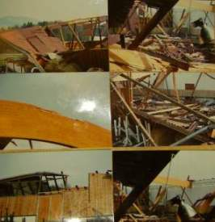

[🠔 Zur Übersicht: Dach](212baust.md)  
# Moderne Dachkonstruktion - der todsichere Hit?
**Eine notwendigerweise hyperkritische Betrachtung zu Flachdach, Pultdach, Hallendach, Einsturz, Dachkonstruktion, Leim, Klebstoff, Leimbinder, Bauen, Sanieren, Instandsetzen, Eissporthalle, Turnhalle und Reitstall.**  
_von Konrad Fischer_

## 12. Dachdeckung und -konstruktion 2

 **[München TV](http://www.cityinfotv.de/)** Pressetalk 20:00 **"Einstürzende Flachbauten"** 
[Talk-Clip 6 min wmv 2,9MB Download](mtvclip1.wmv)) 
mit v.l.: Konrad Fischer, SZ: Red. Christian Schneider, TV-Moderator Christopher Griebel, FOCUS: Red. Christian Sturm, BYAK: Vorstand Rudolf Scherzer 
aus tragischem Anlaß - mit bisher nie gesehenem (!) Filmmaterial vom Einsturz Dachau 1999, spannender und kritischer Diskussion betr. Hintergrundinfos, Ursachen und Folgen der Einsturztragödien allerorten. 

## 2. Moderne Dachkonstruktion - der todsichere Hit?

Eine notwendigerweise hyperkritische Betrachtung zu den Themen Flachdach, Pultdach, Hallendach, Einsturz, Dachkonstruktion, Leim, Klebstoff, Leimbinder, Bauen, Sanieren, Instandsetzen, Eissporthalle, Turnhalle und Reitstall Diese Webseiten sind entstanden als eine gleichsam natürliche Reaktion auf den Einsturzskandal in Bad Reichenhall, als das moderne und in meinem Studium sowie dem sogenannten "Holzatlas" - ein Werk mit hunderten "beispielhaften modernen Dächern" für Studierende und sonstiges Fachpublikum - besonders bepriesene Leimbinderdach der Eissporthalle mitten auf die sich vergnügenden Sportsfreunde herabkrachte und viele Tote und Verletzte verursachte. Ein Mordanschlag der genormten Art? Handwerkspfusch? Planungspfusch? Bauherrnnachlässigkeit? Selbst schuld? Ich komme weiter unten auf diese Frage zurück. 

Solche schrecklich-tragischen Skandale lassen mich als Baumenschen nun mal nicht ruhen und in einem "Weiter so!" verharren, denn ich denke, wir vom Baufach haben auch gegenüber die Öffentlichkeit Pflichten, die es wahrzunehmen gilt, selbst, wenn das für einige oder allen Beteiligten der eigenen Zunft unangenehm sein oder werden könnte. Da müssen wir durch, denn es gilt ja, sich der übergeordneten Wahrheit und Gerechtigkeit zu verpflichten (ja, ich weiß, wie altertümlich und geschwollen das klingt, sei's drum!), wenn man aufrecht durchs Leben gehen möchte und dermaleinst mit möglichst wenigen Schuld-Wackersteinen im Rucksack vor den Heiligen Petrus am Himmelstor treten will, um Einlaß zu begehren oder wenigstens nicht so dermaßen viele Äonen im Fegfeuer purgieren möcht. Auch das gehört für mich jedenfalls zur ars moriendi - die große Sterbenskunst, die - wenn im Leben herzhaft eingeübt, dieses mit echter Lebensfreude füllen kann und am Ende dem bitteren Tod vielleicht sogar ein klitzekleines Schnippchen zu schlagen vermag. Der Versuch wär's ja wert, oder? 

Langer Rede kurzer Sinn: Lassen Sie uns nachfolgend furchlos die Geschichte der Dacheinstürze betrachten und über deren Ursachen nachdenken. Doch das soll es freilich nicht gewesen sein, wir wollen auch darüber grübeln, wie es vielleicht besser gehen könnte. So möchte ich diese Webseite - und nicht nur im Kapitel Dacheinstürze - verstanden wissen. Und Sie entscheiden, ob Sie da mitgehen, oder eben nicht. 

Inhalt des Unterkapitels 12.2: 

Hinweis: Wer weitere Fotos zu hier erwähnten Einstürzen zur Verfügung stellen kann, möge die bitte nach telefonischer Rücksprache 09574-3011/0170-7351557 an mich [mailen.](2berat.md#email)

---

2.1.1 Einsturzchronologie und Kommentare 1284-1989.

---

2.1.1.1 1284-1980er

Am **29.11.1284** stürzt das mit 48,20 Meter alle anderen Gewölbehöhen der Gotik übertreffende Chorgewölbe der jüngst fertiggestellten (1225-1272) Kathedrale von Beauvais ein. Der revolutionäre Bauplan muß geändert werden, das Chorgewölbe in verbesserter Ausführung - eine verdoppelte Pfeilerzahl halbiert die Jochspannweiten - unverzüglich rekonstruiert. Man läßt auch sonst nicht locker und erbaut einen 150 Meter hohen Kirchturm, der dann ausgerechnet am Himmelfahrtstag 1574 einstürzt, von den kritischen Zeitgenossen als Gottesstrafe wegen "babylonischer" Gesinnung der Bauleute verstanden. Falsch? [Infolink1](http://www.die-gotik.de/bauwerke.htm) [Infolink2](http://old.arte-tv.com/thema/cathedrales/dtext/contenu/06/06_1.html) [Infolink3](http://deu.archinform.net/projekte/69.htm) 

Ja, das waren noch Zeiten damals, und wer nicht aufpaßte bei seinem Bauwerken, fand sich doch relativ schnell im Kerker oder gar unter dem Henkersbeil wider. Heute dauern Pfuschprozesse meist ewig und schließen dann mit einem schwachsinnigen Vergleich. Wunderbar für die Rechtgelehrten namens Advokaten/Rechtsanwälte (die dabei dollest verdienen), die Richter (die sich die Mühsal des Urteilschreibens frech ersparen) und vor allem all die bekannten und unbekannten Schwachverständigen und Schlechtachter, die ihr böses Leben mit einstudierter Ahnungslosigkeit auf Kosten der Wahrheit und der Justizopfer frönen und außer dem Herabbeten von Normen, die von der Industrie absichtsvoll, aber nicht unbedingt zugunsten des Verbrauchers, zurechtgeschneidert und zuurechtgeschustert werden, wenig bis garnix auf der fachlichen, geschweige denn menschlichen Pfanne haben und vielleicht gerade deswegen von den Richtern als Maßstab aller Dinge mißbraucht oder zumindest benutzt werden. Wie bequem! Ach ja, es gibt freilich bemerkenswerte Ausnahmen und einer möchte ich, da leider schon länger verstorben, ehrend gedenken: [Senator Dipl.-Ing. Architekt Raimund Probst](https://de.wikipedia.org/wiki/Raimund_Probst). Der Stachel im Fleisch der Schwachverständigenindustrie und Erfinder der Rottacher Bautagungen. Vielen alten Hasen noch ein Begriff, wer weiß schon, wie lange noch?

**2.1.1.2 1980er**

Da wir die millionenfachen vorsätzlichen Dacheinstürze und Einsturzopfer der uns als rechtens, allzurechtens verkauften angloamerikanischen Massenmorde im Bombenhagel des WK II, früher mal ein Verbrechen gegen die Menschlichkeit, das Völkerrecht und Kriegsrecht, überspringen müssen (Vorsicht, vielleicht auch schon ein hierzulande strafbares Meinungsverbrechen, bitte nicht verraten!), geht es hier erst ab den 1980ern weiter. Auch die "modernen" Konstruktionsmethoden des Daches bieten zumindest dem Laien niederschmetternde, wenn nicht gar bestürzende Ergebnisse. Nicht nur im [Stahlbetonbau](2beton.md), sondern auch bei vielen anderen Konstruktionsweisen und Baustoffsystemen, über die Sie hier Material- und Hintergrundwissen, Details und Kritik geliefert bekommen:

In den **1980er** Jahren stürzt in den Ferien die Flachdachdecke der Sporthalle der Goetheschule in Limburg ein. Wassermassen auf dem Dach infolge eines verstopften Abflußrohres waren der Auslöser.

Am **21.5.1980** stürzt ausgerechnet während einer Konferenz des Rings Deutscher Makler das Stahlbetondach der 1956/57 erbauten Kongreßhalle in Berlin ("Schwangere Auster", neben der Betonmenschenkäfigmoderne und dem Hamburgertempel auch eines der Danaergeschenke der USA, Arch. Hugh Stubbins) ein. Ein Toter - ein Journalist des Senders "Freies" Berlin. Einsturzgrund: Materialkorrosion, Baupfusch, keine Ahnung des Architekten und Statikers vom [Beton und seiner Materialheimtücke](2beton.md)), mangelhafte Gebäudeinspektion und -wartung. Wiederaufbau 1987. Arch. Stubbins stirbt 2006, die SZ berichtet am 15.7.06 unter "Die tödliche Auster", daß die Kongreßhalle "Modernität illustrieren" und als "Botschafter des aufgeklärten Kapitalismus" dienen sollte, das spektakuläre Dach wäre von Stubbins als "Dach des großen Versprechens" bezeichnet worden. [Infolink Materialermüdung und Kongreßhalle](http://www.tf.uni-kiel.de/matwis/amat/mw1_ge/kap_a/backbone/ra_1_2.html) [Infolink wikipedia Kongreßhalle](http://de.wikipedia.org/wiki/Kongreßhalle) 

**1981** - 25 Jahre vor Bad Reichenhall, stürzt die gesamte Flachdachkonstruktion der 1976-78 erbauten Eissporthalle im böhmischen Marienbad ein und tötet an die 30 Eishockeyspieler. Auslöser: Schneelasten. [Infolink](http://www.marianskelazne.cz/de/turistika-volny-cas/kur-wanderwege/) 

**1984** stellt ein Gutachter an der 1977 erbauten Gogenkroghalle in Neustadt bei Lübeck fest, daß sich die Dachkonstruktion aus Leimbindern gesenkt hat. Ungenügende Verleimung wird als Ursache genannt, die Binder werden durch aufgeschraubte Metallplatten wieder ertüchtigt. 

**1987** , ein Jahr nach Erbauung (!), stürzt in Stritzling bei Deggendorf die hier abgebildete Leimbinderhalle (Fotos: Bauer) ein. Es sollen Leimschäden gewesen sein, die Halle wird in Anspruchnahme der Gewährleistung wieder neu erbaut. Übrigens nur ca. 10 Kilometer entfernt von Bernried, wo 2006 die Halle gleicher Bauart der gleichen Firma des Reiterhofes Bauer einstürzt (siehe dort). 

**1987** stürzt auch das in den 1950ern erbaute Dach der Olpketal-Grundschule in Lücklemberg aus heiterem Himmel in sich zusammen. Ein Dreickstreben-Holzbinderdach. [Infolink](http://www.spd-luecklemberg.de/einsturz.htm) 

---

Hier weiter zu den Unterkapiteln Dacheinstürze: 

**[2.1.2 Einstürze 1990 ff. mit spannenden Details und erläuterten Bildokumentationen zum Hintergrund der Katastrophen und Tragödien - immer tagesaktuell - bis heute](212bau2a.md) 
[2.2 Wie geht es nun weiter? - Worauf es wirklich ankommt für mehr Sicherheit unter Risikodächern: Tips und Tricks zur raffinierten Instandsetzung und zielgenauen Inspektion](212bau22.md) 
[2.3 Weiterführende Links zur Dachproblematik](212bau23.md) 
[2.4 Hinweis für besorgte Dachbesitzer](212bau24.md) 
**

Hier weiter in den Hauptkapiteln Dach: **[3: Schiefer + Tonziegel](212bau3.md)**

Und hier finden Sie weitere [Info und Tipps zu Dachdecker, Dachziegel, Dachdämmung, Dachausbau, Dachstuhl, ...](http://dachdecker.com)
