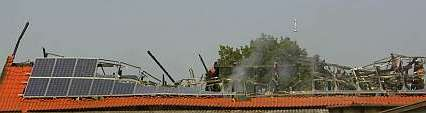

[🠔 Zur Übersicht: Dach](212baust.md)  
# Hinweis für besorgte Dachbesitzer
**Hinweise für besorgte Dachbesitzer**  
_von Konrad Fischer_

## 12. Dachdeckung und -konstruktion 2.4

**München TV** Pressetalk 20:00 **"Einstürzende Flachbauten"** [Talk-Clip 6 min wmv 2,9MB Download](mtvclip1.wmv)) 
mit v.l.: Konrad Fischer, SZ: Red. Christian Schneider, TV-Moderator Christopher Griebel, FOCUS: Red. Christian Sturm, BYAK: Vorstand Rudolf Scherzer 
aus tragischem Anlaß 

### 2. Moderne Dachkonstruktion - der todsichere Hit?

Eine notwendigerweise hyperkritische Betrachtung zu den Themen Flachdach, Pultdach, Hallendach, Einsturz, Dachkonstruktion, Leim, Klebstoff, Leimbinder, Bauen, Sanieren, Instandsetzen, Eissporthalle, Turnhalle und Reitstall 

Inhalt des Unterkapitels 12.2:

Hinweis: Wer weitere Fotos zu hier erwähnten Einstürzen zur Verfügung stellen kann, möge die bitte nach telefonischer Rücksprache 09574-3011/0170-7351557 an mich [mailen.](2berat.md#email)

---

## 4. Hinweis für besorgte Dachbesitzer

Hinweis, da mich diesbezüglich viele [Anfragen besorgter Dachbesitzer](2berat.md) erreichen, denen die aufregenden Erläuterungen rund um die Materialermüdung der Konstruktionen und Baustoffe am Dach sowie die skeptischen Hinweise zur Inspektion, Verstärkung und Risikosituation gealterter, unterdimensionierter und fehlkonstruierter Dächer auf den vorigen Themenseiten schlaflose Nächte bereiteten und die mal Genaueres für ihr eigenes Dach und seine Sicherheit wissen wollen: 

Man müßte regionalen Standort, Meereshöhe, Konstruktionsart und -alter, Dachneigung, Konstruktionsquerschnitte und -abstände haben, dann wären Aussagen zum gegebenen Risiko im Vergleich zur Schneelast-DIN drin. Gibt es schon bemerkbare Schadenshinweise, kämen noch einige Fotos (z.B. Digital-JPGs mit eMail) hinzu, dann gibt es Vorschläge, was sinnvollerweise zu unternehmen wäre. Es muß ja nicht immer Abriß und Neubau und Gold und Silber sein. 

Beim geneigten Dach kommt übrigens noch sehr viel Windlast (mehr als Schneelast!, auch dafür gibt es eine mehr oder weniger zutreffende Norm) dazu, gleichzeit kann aber - laut Norm! - evtl. die Schneelast abgemindert werden, abhängig von Lage, Neigung und Höhe des Daches. Ein Schneesturm auf ein verschneites Dach ist also genug komplex in der Risikoabwägung. 

Und wenn Sie genaueres zu den Untersuchungs- und Instandsetzungsverfahren wissen wollen, die [hier erläutert werden](212bau22.md), müßten Ihre vorgeschädigte Konstruktionen entsprechend dem aktuellen Zustand entsprechend beurteilt werden. Für ein Voreinschätzung könnten ein paar ausreichend aussagefähige Fotos erst mal reichen. 

Meine Adresse und eMail finden Sie [hier](2berat.md#email). 

Last, but not least: Nebst möglicherweise riskanter Lasterhöhung riskieren übrigens schlaumeiernde Solardachabzocker auch noch den Brandschaden, wie an diesem Beispiel, fast vor meiner Haustür, aus dem Jahre 2005 ersichtlich: 

