[🠔 Zur Übersicht: Dach](212baust.md)  
# Dachdeckung und -konstruktion 2.1.2 - Einstürze und dramatische Schadensfälle 1990 ff. - inkl. Bad Reichenhall
**Einstürze und dramatische Schadensfälle von Dachkonstruktionen 1990 ff. – mit Bad Reichenhall. Eine kritische Betrachtung zu Flachdach, Pultdach, Hallendach, Leimbinder und mehr.**  
_von Konrad Fischer_

## 12. Dachdeckung und -konstruktion 2.1.2 - Einstürze und dramatische Schadensfälle 1990 ff. - inkl. Bad Reichenhall

## 2. Moderne Dachkonstruktion - der todsichere Hit?

Eine notwendigerweise hyperkritische Betrachtung zu den Themen Flachdach, Pultdach, Hallendach, Einsturz, Dachkonstruktion, Leim, Klebstoff, Leimbinder, Bauen, Sanieren, Instandsetzen, Eissporthalle, Turnhalle und Reitstall 

**Inhalt des Unterkapitels 12.2:**

Hinweis: Wer weitere Fotos zu hier erwähnten Einstürzen zur Verfügung stellen kann, möge die bitte nach telefonischer Rücksprache 09574-3011/0170-7351557 an mich [mailen.](2berat.md#email)

---

**2.1.2 Einsturzchronologie und Kommentare 1990-1996 

1990 **stürzt die Deckenkonstruktion der reformierten Kirche in Kreuzthalen, Schweiz, ein 

Ab **1996** muß das Freizeithallenbad "Kurfürstenbad" in Amberg, erst 1990 eingeweiht als preisgekrönter Leimbinderbau, wegen gigantischer kondensatbedingter Feuchteschäden in der Dachkonstruktion millionenschwer schon wieder saniert werden. Im Umfeld metallischer Dachverbindungen auf den Leimholzträgern kam es angeblich zur Vermorschung. Man bricht das Schaddach ein und baut dann die Dachkonstruktion um ... 

---

**2.1.3 1997-1998**

Am **5.2.1997** stürzt die Glasbau-Kuppel der unter Bodenniveau eingesenkten Sporthalle in Halstenbek (Schleswig-Holstein) noch während des Baus ein. Schwamm drüber und wieder in die Hände gespuckt. Doch dann - moderne Baukonstruktion kann immer wieder auch konstruktiv überraschen - am **26.6.1998** , justament nach dem Wiederaufbau, fällt alles wieder in sich zusammen. Gottseidank keine Menschenopfer - nicht die Schlauheit, sondern offenbar das Mitleid der Konstruktion. Die Ruine wird nun nicht mehr aufgebaut. Schwamm drüber und fertig.

---

**2.1.4 1999**

Am **3.5.1999** stürzt das 150 m² Flachdach des katholischen Gemeindezentrums in Homberg (Duisburg) ein. Vier Tote, sieben Verletzte. Handwerker hatten auf 118 qm der Dachfläche 28 Tonnen Kies zwischengelagert, anläßlich einer wieder mal fälligen Dachhautreparatur, diese Lasten konnte das (vorgeschädigte?) Dach nicht mehr aufnehmen.

Am **1.12.1999** bricht das Dach der Berufsschul-Turnhalle in Dachau aus heiterem Himmel in sich zusammen: 

Süddeutsche Zeitung 3.12.1999

__"Millionenschaden an der Staatlichen Berufsschule Dachau__ 
**_Turnhallen-Dach stürzte in sich zusammen_** 
**_Gutachter soll Ursache für Bruch eines tragenden Deckenbalkens klären [...]_**

_Von Hilmar Klute_ 
_**Dachau** - Das Dach der Dreifachturnhalle der Staatlichen Berufsschule in Dachau ist am Mittwoch nachmittag eingestürzt. (Es) brach ein tragender Balken im Deckengewölbe des Gebäudes. Über die Ursache des Einsturzes wurde am Donnerstag noch gerätselt. Die Halle war erst vor 16 Jahren als Teil des gesamten Schulkomplexes fertig gestellt worden und galt als erstklassiges Bauwerk. [...] Reparaturkosten [...] in Millionenhöhe. [...]_

_Es war am Mittwoch gegen 14 Uhr, als es lautstark krachte im Gebälk der Dreifachturnhalle. Fachlehrer Norbert Wolf und seine zehnte Klasse der Berufsschule hatten kaum eine halbe Stunde Sportunterricht hinter sich, "da wackelten der Basketballkorb und die Lampen". Dort, wo die Jugendlichen Fußball spielten, prasselten Holzsplitter nieder. Wolf sah bedrohliche Risse im Gebälk und führte die 24 Schüler aus der Halle. Etwa drei Stunden später stürzte das komplette Dach ein. [...] Ein 1,2 Meter dicker Trägerbalken war in der Mitte durchgebrochen, ohne dass das Hallendach in irgendeiner Weise belastet worden war. Die Turnhalle [...] ist erst 1983 fertig gestellt worden. Das 44 Millionen teure Bauwerk erhielt damals großes Lob. [...]"_

Einige Screenshots aus bisher unveröffentlichtem, sensationellem und exklusivem Filmmaterial von "RTL München live" wurden mir für diese Seite dankenswerterweise von "München TV" zur Verfügung gestellt: 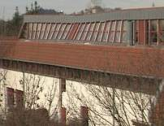Das eingestürzte Hallendach von außen. 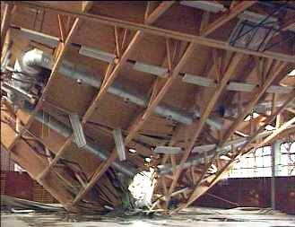 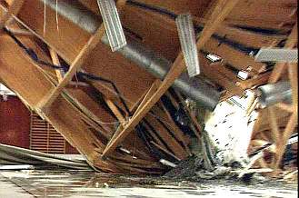Die Bruchstelle von innen in der ungesicherten Unglücksstelle. 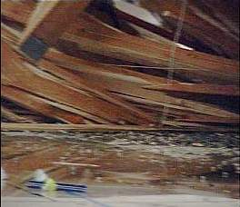 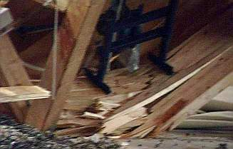 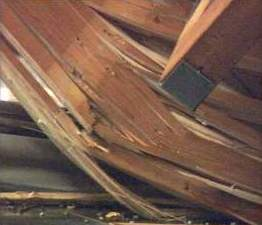Details. 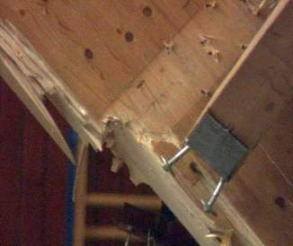Der gelöste Nebenträger. 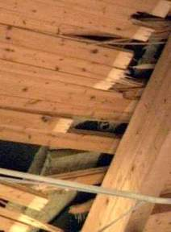Sind das nasse Mineralwolledämmplatten zwischen Folien? Dann, einige Wochen später: 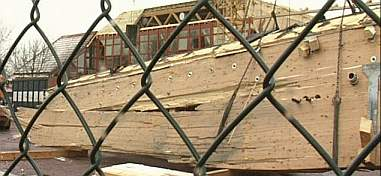Ein zerstörter Träger bei der Beräumung. 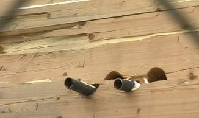Man sieht die teils in der Leimfuge gelösten Brettschichtlamellen, ebenso die Verschiebung im Querschnitt an den Bohrungen für Rohrdurchführungen. 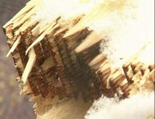Ausgerechnet in der geleimten Keilzinkenverbindung ist das Profil gerissen! 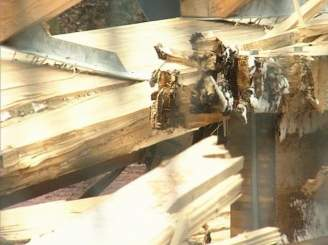Blick in die gerissenen Verbindungen. 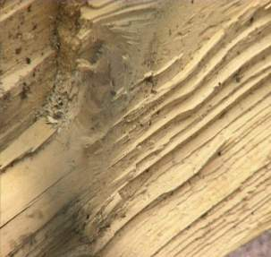Abriss im Detail. Schwarze Punkte - was ist das? 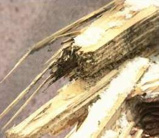Resorcinleim? Schimmel? 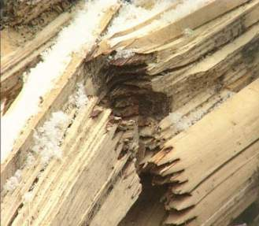Gerissene Keilzinkenverbindung. 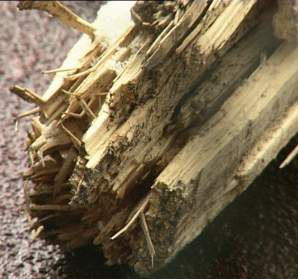Ist das kondensationsbedingt angegammeltes Holz? 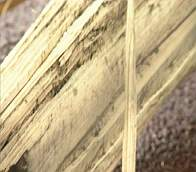Seltsame Vergrauung. 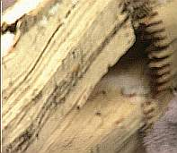Noch eine abgerissene Keilzinkenverbindung. 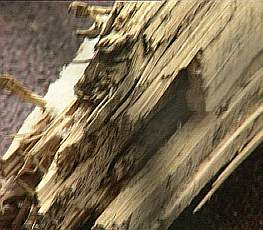Grau ist alle Theorie. 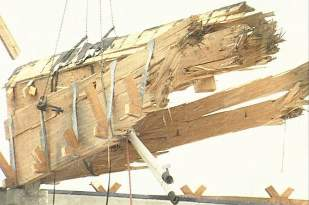Der gerissene Hauptträger wird vom Stahlbetonstützen-Auflager abgehoben. 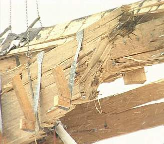Detail Bruchstelle. 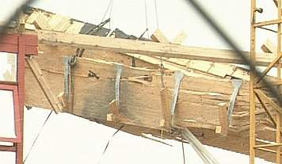Was ist da und warum so gräulich? 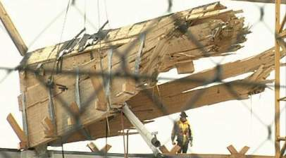Beim Abheben. 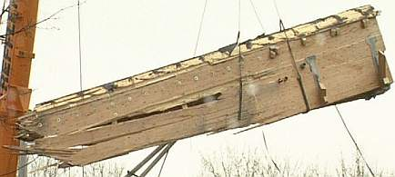Die andere Seite. 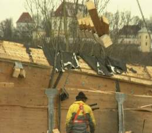Gute alte Schlossdächer und ein schlechter Träger. 

Nachtrag 1 (geschrieben 1999!): Angeblich sollen allein in Bayern noch ca. 40 derartige Bauwerke vom Einsturz bedroht sein. Tip: Sport in der freien Luft ist gesund und stählt die Muskeln!

Nachtrag 2: Aus einer [AP-Meldung](http://de.news.yahoo.com/060104/12/4tl9z.html): "In Monate langer Kleinarbeit kamen die Gutachter der (Dachauer) Unglücksursache auf die Spur: „Es waren Konstruktionsmängel im System“, sagt der Bauamtschef. Querträger wirkten über die Jahre hinweg mit nicht vorgesehenen Belastungen auf einen Hauptträger und ließen dessen Leimholz zerbersten. „Zum damaligen Stand der Technik war das nicht absehbar“, sagt Meier. Bau und Konstruktion waren ordnungsgemäß abgenommen worden. „Insofern konnte man niemanden für den Schaden haftbar machen“, fügt er hinzu. Auf dem Schaden und den Kosten für eine neue Holzdecke blieb der Landkreis mit insgesamt fünf Millionen Mark sitzen."

Kommentar: Mehr als seltsam: 16 Jahre hielt die so preisgekrönte Leimbinderkonstruktion. Auch die _"nicht vorgesehenen Belastungen"_(angeblich aus einer an das Trägersystem später angefügten Trennwandkonstruktion)und die zwischenzeitlich winters auflastenden vorhergesehenen Zusatzschneelasten in jeder beliebigen Menge aus - und dann auf einmal - ohne zusätzliche Lastfälle - nicht mehr. Leimermüdung? Unvorhergesehene Randspannungen aus dem schwindenden und quellenden Holz auf allzudicke Verleimungen? Der extrem harte Leim soll dafür ja anfällig sein, wie steht es damit? Dynamische Einwirkung aus dem Trennwandsystem? In das Gutachten würde ich gerne mal reingucken. Bauphysikalisch bedingte Auffeuchtung, dachtypische Temperatur- und Lastwechsel in der Leimholzkonstruktion mit damit verbundener Leimalterung und / oder Nachlassen der Holzfestigkeit bei zunehmender Feuchte? Was passiert eigentlich, wenn ein materialermüdeter Hauptträger nach unten abgeht, mit den daran angeschlossenen Nebenträgern? Sie drehen sich auf einer Kreisbahn nach unten mit, ihre obere Kante drückt an der Anschlußstelle in das Hauptträgerprofil und läßt ihn dort, an der Druckstelle, eventuell bersten (Tel. Hinweis von Prof. Dr.-Ing. Bernd Hillemeier, TU Berlin). Unvorhersehbar? Die Statik war immerhin LGA-geprüft ...

Nachtrag 2: Eigentlich hat die Leimbinderfertigung seit den 60er Jahren bis heute enorme Qualitätsverbesserungen im Fertigungsprozeß erfahren. Doch: Ist das der heutige Stand der Technik? - der Fluch auf der Dachauer Berufsschulturnhalle - auch das neue Leimbinderdach 2002 will reißen: [ www.dachau65.de/infos/anfahrt/halldach.htm](http://www.dachau65.de/infos/anfahrt/halldach.htm). Es wird dann durch die Risse nachträglich mit Stahl-Verdübelung armiert. Na ja.

Die verwendete Leimbinderbauweise aus Brettschichtholz wird ja allgemein hoch gelobt und bei zugelassener Leimqualität auch als zuverlässig klimatisch belastbar angesehen ...

(z.B. in der mir vorliegenden Ausgabe von Götz, Hoor, Möhler, Natterer: _"Holzbau Atlas"_ , München 1980, durch die Mitfinanziers, die "Arbeitsgemeinschaft Holz" und die "Centrale Marketinggesellschaft der deutschen Agrarwirtschaft **mit beschränkter Haftung** " (!) in meinem Studium an der TUM großzügig sponsoriert: 

_"Brettschichtholz wird man vor allem dann vorsehen müssen, wenn statisch größere Querschnitte erforderlich werden oder wenn das Aussehen der gehobelten und oberflächenbehandelten Brettschichtbauteile ausschlaggebend wird. Auch gekrümmte Stab- und Trägerformen können nur aus Brettschichtholz hergestellt werden. Für die Witterung oder wechselnder Feuchtigkeit ausgesetzte Brettschichtbauteile ist eine ausreichend widerstandsfähige Verleimung erforderlich. (S. 46) ..._

Die Leimverbindungen unterscheiden sich von allen anderen Verbindungsmitteln auch dadurch, daß sie praktisch unnachgiebig sind, ... 

Die Festigkeit einer ordnungsgemäß hergestellten faserparallelen Leimverbindung wird in der Regel durch die Scherfestigkeit der verbundenen Holzteile begrenzt, ...

Für Leimverbindungen müssen in der Regel witterungs- und feuchtebeständige Kunstharzleime (Resorcin- oder Harnstoffleime), deren Eignung für tragende Verbindungen durch besondere Eignungsprüfungen nachgewiesen ist, verwendet werden. (S. 54)" 

Ab der Seite 81 finden wir dann unzählige technisch gute und architektonisch äußerst ansprechende Beispiele für Hallenbauten in Brettschichtbauweise. Die unten angeführte Eislaufhalle in Bad Reichenhall ist neben vielen weiteren Eislaufhallen schon als Nummer 2 auch dabei.).

Und im _"Holzbau Atlas Zwei"_ von Natterer, Herzog, Volz, München 1981, steht wiederum auf Seite 118: _"Für Bauteile, die im Gebrauchszustand unmittelbar der Witterung oder in Gebäuden Klimabedingungen ausgesetzt sind, bei denen eine Gleichgewichtsfeuchte von 20% oder langfristig eine Temperatur im Bauteil von 50° C überschritten werden kann, dürfen nur Kunstharzleime verwendet werden, die auf Beständigkeit gegen alle Klimaeinflüsse geprüft sind (z.B. Resorcin- oder Melaminharzleim)."_

... Auch wenn ein Deckenträgerrost noch lange kein "_Deckengewölbe_ " (SZ-Bericht) ist. Nach meiner unmaßgeblichen Ferndiagnose könnte das Versagen des betroffenen Leimbinders vielleicht auch auf das unaufhaltsame Altern bzw. spannungsbedingte Ablösungen des dabei verwendeten Kunstharzleims - und eben nicht alleine auf unvorhersehbare Belastungen aus Querträgern - hindeuten. Und waren es nun Melaminharnstoffharzleime (MUF), zugelassen für Witterungsbeanspruchung der Nutzungsklasse 1, die im Fall Bad Reichenhall und den anderen zusammengebrochenen Leimholzkonstruktionen versagten, oder Harnstoffharzleime (UF), die lediglich für die Nutzungsklasse 2 zugelassen sind? Das wäre die Frage. Wobei ja auch die zugelassenen Leime unter den gegebenen Belastungen ihre Materialheimtücke entwickeln können, s.u. Untersuchungen von Deppe et al.

Leimbinderreparaturen an aus dem Leim geratenen Hallenträgern durch meinen Kollegen Paul Bossert in der Schweiz verweisen nach seinen Aussagen jedenfalls schon vor über 10 Jahren auf dieses Problem. Schauen wir doch alternativ mal die historischen Dachtragwerke an, also die regionaltypisch geneigten Sparren- und Pfettendächer mit stehendem bzw. liegendem Stuhl. Ohne Kunstharz-Pampe und rostendem Eisen, ohne absaufende Dämmschichten und kritische Kondensatfrachten. Dabei werden Hallendächer in historischer Holzbauweise entweder total luftumspült konstruiert - wie man es beispielsweise von den noch erhaltenen offenen Markthallen z.B. in Frankreich und in den alten luftdurchspülten Stadelbauten kennt - oder bei eingeschränkter Frischluftzufuhr mit Massivdeckenkonstruktionen vom darunter liegenden Luftraum des Funktionsgeschoßes als Kaltdach abgeschottet - wie in historischen Kirchen und Saalbauten, aber auch in jedem normalen Bauern- und Bürgerhaus. Das reduziert die thermische Tragwerksbelastung während des Jahresverlaufs (oft übersehen beim konstruktiven Aufbau von Dachschichten und -konstruktionen, stark differierende Werte mit daraus resultierenden inneren Spannungen zwischen Konstruktionsteilen siehe Angaben weiter unten) und verhindert übermäßigen Kondensateintrag. Sowas hält viele Jahrhunderte und kann auf handwerkliche Manier bestens unterhalten, ggf. auch repariert werden. Mehr Vertrauen in die überlieferte Handwerkskunst, bitteschön! 

Die moderne und oft bepreiste Hallendachbauweise setzt dagegen "industrienormengerecht" und von staatlichen Bauverordnungen wunderlicherweise gestützt auf die von bauphysikalischen Irrlehren geförderte Leichtbauweise und setzt die verhältnismäßig "leichten" Konstruktionen geradezu gigantischen Temperatur- und Feuchteschwankungen aus, auch im Konstruktionsaufbau untereinander, da sich die Schichten oft erheblich in ihrer Temperaturdehnung unterscheiden. Die dabei hin und wieder zusätzlich eingebauten "Dämmstoffschichten" aus Leichtbaustoffen können gegen thermische Angriffe mangels Dämmfähigkeit gegen die hier maßgebliche Wärmestrahlung gar nichts entgegensetzen (deswegen [wirken sie bekanntermaßen auch nicht gegen Heizenergieverluste!](7fehrtab.md)), sondern sorgen sogar für unvorhersehbare Zusatzlasten - wie bei jeder "gedämmten" Wand, wie bei jeder "Dachdämmung" nachprüfbar saugen sich solche Schäume und Gespinste an kalten Randbereichen von Bauwerken geradezu sollgemäß mit Kondensat voll, werden schwer und schwerer mangels Kapilllartrocknungsfähigkeit (Kapillartransport : Dampfdiffusion = ca. 1000:1!), werden folglich be- und durchschimmelt und gefährden ihrerseits die Holzkonstruktionen und wegen unvorhergesehener schwerer Feuchtefrachten vielleicht auch die Statik. Weder Giftränkung mit abscheulichen Borsäurepräparaten noch Dampfbremsfolien können das sicher verhindern, wie Praxisbeispiele zeigen. 

Wie solche Folien in erheblich bewegungsfreudigen Leicht- und Holzkonstruktionen jemals dauerstabil dicht bleiben sollen, ist eh eines der größeren Rätsel der Neuzeit. Daß die einstürzenden Dachkonstruktionen regelmäßig als "Warmdächer" mit normgemäß zugelassenem Kondensatausfall konstruiert werden, hat für die Lastannahmen zweierlei üble und schwer einschätzbare Folgen: Das in die Konstruktion eindringende Kondensat wirkt neben Förderung von unvorhersehbaren Quelleffekten am Holz und korrosivem Angriff auf Stahl als Zusatzlast und die Wärme unter dem Dach läßt aufliegenden Schnee schmelzen und vereisen, was zusätzlich zu erhöhten Auflasten führen kann. Wie das dann Holzträger, die eine natürliche Ausgeichsfeuchte von 12% aufweisen, aber bis zur Fasersättigung 30% Feuchte einlagern können und von 12 bis 30% Feuchtegehalt linear ihre Festigkeit und Tragfähigkeit bis zu 70 % (nach Prof. Dr.-Ing. Bernd Hillemeier, TU Berlin) einbüßen, dann noch tragen können? Und daß sogar die im Holz liegenden "korrosionsgeschützten" Stahlverbindungen (Bolzen, Dübel) bei entsprechender Holzfeuchte im leicht sauren Holzmilieu über einige Jahre bis auf 0 abrosten können, zeigen Praxisbeispiele mehr als genug. Wasser ist halt der Feind jeden Bauwerks, und deswegen verwendeten die alten Meister ausschließlich Holzverbindungen wie Blatt- und Zapfenverbindung, gesichert mit Holznagel und Holzdübel. Das hält dann eben auch über Jahrhunderte und machte sehr gutmütig selbst abscheulichste Teilschädigungen durch überhöhte Feuchten im Auflagerbereich mit (vermorschte Schwellen und Sparrenauflager), ebenso wie durch undichte Kehlen verrottete Kehlbalken - die Schadensklassiker am Steildach.

Denken wir nur mal an die Betriebspraxis in vielen Reithallen, wo im Sommer nahezu täglich und im Winter etwas weniger zigtausende Liter Wasser mit Beregnungssystem von der Decke her versprüht bzw. mit evtl. noch größeren Wasserfrachten durch das geniale System "Ebbe und Flut" bodenseits aufgeschwemmt werden, um die Staubentwicklung auf teils ungeeigneten Bodenschüttungen zu bekämpfen und dann Richtung mangelhaftes Kaltdach oder gar Warmdach güllemethangasgeschwängert abzudampfen. Stellen wir uns mal die kalten Dachkonstruktionen und die dort ankommende feuchtmethanvergaste Luft vor. Und dann grübeln wir mal über die täglich zigtausende Liter Wasser aus der Eismaschine des eisigen Hallenmeisters, die er zur Picobellisierung seiner bis zu acht Zentimeter dicken Eislaufschwarte an die drei mal täglich aufspült. Und danach an die tropenschwülen Ablüfte über Spaßbädern und Schwimmbecken für Delphine, Haie und Pottwale, alles immer gut an die Dachebene gesaugt durch die dort schlauerweise angeschraubten Klimakanäle bzw. sonstigen Abluftentfleucher ...

Prof. Dr.-Ing. Claus Meier, ehem. Hochbauamtsleiter der Stadt Nürnberg, hat das hier normativ vorgegebene Berechnungsverfahren des Tauwassernachweises mehrfach - schon 1989 und wieder 2000 - vor dem DIN-Ausschuß schriftlich und mündlich eingehend beanstandet, Ergebnis = 0. Seine Stellungnahme am 1.2.06 für diese Seite:

_"Zu den Ursachen der Hallendacheinstürze ist auch folgender Sachverhalt zu nennen: 

Die DIN 4108 Teil 3 enthält bei den Diffusionsberechnungen für unbelüftete Dächer (Warmdächer) einen methodischen Fehler, der zu ganz fatalen Ergebnissen führt. Es heißt dort: 

"Tauwasserausfall während der Verdunstungsperiode wird nicht berücksichtigt". 

 Das bedeutet: 

Selbst der falscheste bauphysikalische Schichtenaufbau mit Kondensatmengen, die jahresbilanzmäßig nicht mehr ausdiffundieren und damit die Dauerdurchfeuchtung garantieren, bekommt bei Anwendung der so formulierten DIN das “Norm-Zertifikat“: 

**"Die Tauwasserbildung ist im Sinne dieser Norm unschädlich".** 

Diese DIN-Aussage hat fatale Folgen: Damit werden bauphysikalisch fehlerhafte Konstruktionen nicht mehr erkannt. 

Viel schlimmer aber ist: 

Falsche Konstruktionen werden durch DIN legitimiert; dem Kunden wird Richtigkeit vorgegaukelt, obwohl zwangsläufig Feuchteschäden eintreten werden. Diese "Norm" führt automatisch zu fehlerhaften Konstruktionen – viele Feuchteschäden in Dächern beweisen es."_

[Infolink Normeinspruch](7d41083.md) 
Info zum "Holzleimbaupreis" erhalten Sie bei der [Arge Holz](http://www.argeholz.de).

Schlimm ist, daß die gigantischen Witterungs- und Feuchtebelastungen bei diversen Nutzungsarten und Bauweisen sowie wechselnde Auflasten bei der Konstruktion von Hallendächern nicht immer eine gesunde Skepsis der Planer gegenüber den Versprechungen der Hersteller der dabei eingesetzten Baustoffe und Bauarten auslösen. Ein geradezu abergläubiges Vertrauen in herstellerseits bereitgestellte Rechenformeln und Tabellenwerte sowie Prüfungen und Zulassungen ersetzt den eigenen Sachverstand, der sich auf das richtige Lösen von Rechenformeln oder mehr und mehr das richtige Knöpfchendrücken an der statischen Computersoftware beschränkt.

Diese "Industriereligion" und der Normenaberglaube ist leider auch in der Praxis der Denkmalpflege zu beobachten, in der die Bauchemiepropaganda angeblich wasserabweisende, in Wahrheit aber[ trocknungsblockierende Beschichtungen](22bausto.md), angeblich festigende, in Wahrheit aber [krustenaus- und ablösende Tränkungen](29bau04.md), angeblich salz- und feuchteaufnehmende, in Wahrheit aber [treibsalz- und auffeuchtungsfördernde Putze,](2sanipuz.md) angeblich feuchtesperrende, in Wahrheit aber totalschädigende oder zumindest in der Sache wirkungslose ["Mauerwerkstrockenlegung"](2aufstfe.md) als ultimative Heilmittel unfähigen Quacksalbern, begleitet von allerlei geradezu widerlichen "Vermarktungshilfen" zur Anwendung am staatlichen und privaten Bauwerk bringt und dessen ultimative Zerstörung fördert. Diese Seiten bringen dazu viele Beispiele. Dabei wäre doch gerade in der denkmalpflegerischen Ausbildung und Praxis so viel Stoff für Sanierungstatsachen geboten, für die korrekte Beurteilung sowohl der verwendeten Originalbau- und Bauhilfsstoffe als auch der "Sanierungen" im Hinblick auf Alterungsverhalten und Versagen. Wenn ich nur an die Informationsflut denke, die mir an meinem Volontariat am Bayerischen Landesamt für Denkmalpflege in der dortigen Restaurierungswerkstätte zum Thema Alterung von Bindemitteln geboten war, darf man schon verwundert sein, welche bedenkenlosen Praktiken dennoch selbst von amtlich empfohlenen "Restauratoren" angewendet werden.

Insofern wundert es natürlich nur wenig, wenn bestimmt nur ganz, ganz ausnahmsweise auch manche systematisch unterhonorierten Planer ebenso den so arg ausgetretenen Industrieweg zwischen Werbung und Tabellenwert als Leitplanke beschreiten. Wo käme man denn sonst hin, wenn man sich selbständig um das tatsächliche Verhalten von den dermaßen bejubelten, von nach Produzentenbezahlung ("Drittmittelfinanzierung"!) institutionell nach allerlei Tests glaubwürdigst "zugelassenen" Baustoffen kümmern müßte? Wozu hat man denn sein teures Tabellenbuch, seine kostenintensiven Softwareupdates, seine gratifikationsgestützten Herstellerinformationen vom amtlich beglaubigten Prüfsiegel bis zur umsonstigen Komplettplanung inkl. ganz und gar nicht produktneutralem, dafür komplett [VOB- und haushaltsrechtswidrigem Auschreibungstext](9pbs.md) als wohl genialste Vermarktungshilfe der Hersteller und Ausführungsfirmen in der Gebäude- und Fachplanerbranche?

Daß solche Praktiken das Bauwerk und die betroffenen leichtgläubigen Bauherrn und ahnungslosen Nutzer zu Versuchskarnickeln für unbewährte Baumethoden ohne ausweislich der sich mehrenden Versagensfälle ausreichend nachgewiesene Dauerstabilität herabwürdigen, ist eben der Preis, den wir dem Fortschritt und der bauherrnseits geradezu professionellen Unterminierung der eigentlich gesetzlich geschützten Planerhonorierung zahlen müssen, oder? Auch wenn immer nur ein neues Wunderprodukt das versagende Vorgängerexperiment ersetzt, wie es ja auch den eingeweihten Kreisen zumindest bekanntsein dürfte. Alter Wein in neuen Schläuchen eben.

So darf es also auch nicht allzusehr wundern, wenn bei expertengestützten Inspektionen gealterter Konstruktionen entweder die tatsächliche Crux aus materialtechnischer und bauphysikalischer bzw. bauchemischer Unkenntnis erst mal gar nicht erkannt wird, bei oberflächlich selbst dem doofsten Bauherrn unübersehbaren Alterungserscheinungen dann aber vorsichtshalber das zwar umsatzfördernde, technisch und wirtschaftlich aber gar nicht notwendige "Alles Neu"-Verdikt ausgesprochen wird. Man weiß ja vielleicht, welcher Herstellerberater oder welche Baufirma die Neuplanung kostenlos auf den Büroschreibtisch liefert, oder hat eben einfach Angst. Damit soll natürlich nicht gesagt sein, daß man wirklich alles und jedes morsche Holz gesundbeten kann, aber es gibt doch oft mehr Möglichkeiten, als den vorschnellen Vernichtungsschuß.

Der Süddeutschen Zeitung SZ ist dann im August 2000 die zu erwartende Vermauschelung des Problems zu entnehmen. Nicht der vertrauensselige Planer und die brav und andauernd normengebenden Industrie, nein - "die Norm" selbst ist schuld (obwohl doch in einer eigenen Norm DIN selbst sagt, daß [das Anwenden von Normen den Anwender nicht von der Verantwortung entbindet](2mbu.md)): 

_"Am 1. Dezember 1999 war das Dach der Berufsschulturnhalle eingebrochen 
**Einsturzursache liegt in früheren Normen 
Gutachten bestätigen, dass weder ein Material- noch ein Konstruktionsfehler beim Bau im Jahr 1984 gemacht wurden**

Von Gerhard Wilhelm

Dachau - Weder ein Konstruktions- noch ein Materialfehler waren Ursache für den Einsturz der Decke der Berufsschulturnhalle Anfang Dezember 1999. Dies ergab das Gutachten, das jetzt dem Landratsamt Dachau vorliegt. „Der Bau der Halle wurde nach den damaligen Konstruktionsnormen richtig ausgeführt“, sagte Georg Meier, Leiter des Hochbauamtes am Landratsamt, der SZ.

Und genau in den damaligen Normen scheint die Ursache des Einsturzes zu liegen, wie Meier indirekt zugab: „Das Gutachten wurde der Obersten Baubehörde zugeleitet, die es völlig in Ordnung fand. Allerdings könnte es weitere Kreise ziehen, da Deckenkonstruktionen mit Leimholzbindern in der Vergangenheit häufiger angewandt wurden.“ Die damaligen Vorschriften haben besondere mögliche Verformungen wohl nicht berücksichtigt. 
[Am] 1. Dezember, [hörte Sportlehrer] Sepp Wolf [während der Sportstunde] ein lautstarkes Knacken. [...] Als er erste Risse in einem der beiden tragenden Deckenbalken erblickte, führte er vorsorglich alle Schüler aus der Halle und alarmierte den Hausmeister, der die Halle sperrte. Keine drei Stunden später brach der 1,20 Meter dicke [...] Leimbinder in der Mitte durch und die Hälfte des Dachs stürzte auf den Hallenboden.

[...] Die [Ursachensuche] gestaltete sich [...] als äußerst schwierig, da wegen der Gefahr, dass die ganze restliche Decke zusammenbricht, immer nur maximal drei Arbeiter Stück für Stück das Dach von oben abtragen konnten.

Vom Kreistag wurden [...] vier Millionen Mark [...] für die Neuerrichtung der Decke eingeplant. [...] man [hatte] sich wenig Chancen ausgerechnet, Firmen regresspflichtig machen zu können. Die Halle war außerdem nicht versichert. [...]"

_ Der passende Link: [Weitere Info zum lebensgefährlichen Normenschmarrn des DIN](2mbu.md)

Eines der traurigsten Beispiele der hochgelobten Neuzeitarchitektur für versagenanfällig moderne Deckkunst, das Münchner Olympiastadion-Dach: 

Nun schon zum x-sten Mal nach etwa 25 Jahren und mit schon gar nicht mehr zu zählendem Millionenaufwand wegen ständig durchrostender Tragsysteme, verrottender Fugenbänder und zersprödender Kunstharzplatten "saniert". Bis demnächst in diesem Theater. 

Gekrönte Star-Architektur um den Preis von steuerfinanziertem Murks und Pfusch? Daß die Bauindustrie darüber jubelt, ist eh´ klar. Und die industriegesponsorten Baujournale auch. Die gnadenlosen Verfechter der Moderne sowieso. Auch die bei jeder Sanierung erforderliche aufwendige Sicherungstechnik erweist sich als Kassenschlager für die Beteiligten.

Das wollen wir uns auch im neuen Jahrtausend nicht nehmen und schlechtmachen lassen, oder? Wo man doch dafür weltberühmt wird. Wenn wir uns das nicht leisten können, wer denn sonst? Kann Angeberei noch protziger sein? Wir warten auf die Bauschäden der Berliner Republik, in Bonn wird ja schon weggespült, was kluge Betonbaukunst hervorgebracht hat.

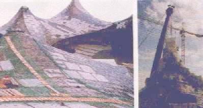 
Links: Olympia-Sporthallendach (Sicherungskonstruktionen und Verkehrswegebau für Platten-Austausch), Rechts: Schwimmhallendach (Einhausung für Korrosionsschutzarbeiten), im Hintergrund der Olympiaturm, der schon so einiges an Betonsanierung an vermorschten und korrodierten Strukturen hinter sich bringen mußte, z.B. millionenschwer vor wenigen Jahren. Fotos aus: HOCHBAU 4/99

Was lernen sparsamere Bauherren daraus? Es ist nicht alles Murks, was nicht aus Chemielaboren kommt. Grauenhafte Dach- und vor allem Flachdachschäden belegen immer wieder den riskanten Charakter der modernen, teils bauchemikalisch und teils auch durch flotte Marketinghilfen an die Planer arg befruchteten Bauweise. 

---

**2.1.5 2000** 

Im **August 2000** stürzt das Schwimmhallendach in Krefeld-Bockum in sich zusammen. 

Die [Bonner Sternwarte "Hoher List" berichtet](http://www.ari.uni-heidelberg.de/AG/m8312bn0.ps) 2000: _"Die Kuppel des Doppelrefraktors weist schwere Schäden auf. Leimbinder haben sich durch anhaltende Feuchtigkeit gelöst, so dass die Kuppeltore auszubrechen drohen. Das Bauamt der Universität und das Staatsbauamt nehmen sich leider nur sehr zögerlich der Sache an, da eine Reparatur nicht billig sein dürfte."_

Kunstharzprodukte sind nun Dauerbelastungen (UV-Einfluß, Feuchtigkeit, wechselnde Temperaturen und mechanische Lastwechsel, mikrobielle Zersetzung durch Schimmel und Bakterien) nicht unter allen Umständen gewachsen. Ihr Verrecken gilt nicht nur für Ihre verschimmelte Silikonfuge im Bad, Ihr verstunkener PUR-Schaum zwischen Fenster und Wand, Ihren Putzeimer aus Plastik, der nach einiger Zeit zersplittert und zersprödet, Ihr grau oder gelbgrün verschimmelter Dämmstoff aus künstlichen und "natürlichen" vergifteten Schäumen, Spreißeln, Fasern, Flocken und Gespinsten in Dach und Wand, für Bauhilfsprodukte wie Kunstharzleime, für die Kunstharzfarben jeder Couleur usw., wobei auch die Probleme des Materialverbunds und die darauf einwirkenden Spannungen eine wichtige Rolle spielen. Wobei der mikrobielle Abbau von Stickstoff aus Leimen von der Grenzfläche am Holz aus erfolgen kann. Dabei liefert die Zellulose die Energie, um dann die schmackhafte Stickstoffnahrung (quasi Dünger für die Organismen) aus ihren Molekülbindungen abzubauen. 

Bei Leimen, die chemisch erst mal als relativ sicher gegen den mikrobiellen Befall gelten, könnten die verarbeitungstechnisch und gebrauchstechnisch in den wunderlichsten Rezepturmischungen zugegebenen Modifizierer wie die Klebwirkung zum Holz steigernden Haftvermittler und die unangenehme Versprödung verhindernden Weichmacher oder den Produktionsprozeß verbessernde Härtungsbeschleuniger die mikrobielle Abbaubarkeit durchaus begünstigen. Es gibt da eine Menge an hochgradigen Spezialisten unter den Bakterien und Pilzen. Und die kupferbasierten hochwirksamen Holzschutzgiftpräparate wie CKA (Chrom-Kupfer-Arsenat) und CKB (Chrom-Kupfer-Borat) können über die Jahre bei hohem Feuchteangebot in der Holzfaser und den Wechsel zwischen Trocknung und Holzaufnahme durchaus auch mal lokal von hier nach da verfrachtet werden, in ihrer Schutzkonzentration abgebaut und dann ein offenes Scheunentor für den Angriff durch allerlei "Kleinstlebewesen" hinterlassen. Ein spannendes Geschehen, das der Laie beispielsweise an so geschützten kesseldruckimprägnierten Hölzern für Telegrafenmasten oder anderen witterungsexponierten Holzbauteilen täglich beobachten kann. Da Leimträger wegen Unverträglichkeiten der Holzschutzmittel mit dem Leim erst nach Leimabbindung und nur von außen holzgeschützt werden, kann bei erheblichem Kondensat bzw. von oben eindringendem Regenwasser die Holzschutzmittelkonzentration an der Oberfläche abgebaut und dem mikrobiellen Angriff von außen die Tür zu den ggf. nahrhaften Leime entlang des Nahtbereichs Holz-Leim geöffnet werden. Wer steckt da schon drin?

Infolink bei Dipl.-Ing. Peter Rauch: [Mikrobieller Abbau von Kunststoffen](http://www.ib-rauch.de/okbau/bauchemie/biokorrosion.html)

Wobei die baulichen Bedingungen mit wechselnder Temperatur, zu und zunehmender Feuchte - das Superspannungsproblem beim langsamen und von außen sich entwickelnden Zustandswechsel in den Trägerrandbereichen - auch dem spannungsbedingten Ablösen von Leimverbindungen Vorschub leisten können. 

Am flachen Dach ist die Wechselklimabelastung wegen besonders starker Einwirkung der selbst im Sommer (Beispiel Wüste!) stark schwankenden Globalstrahlung am größten, es kann deswegen unter thermisch instabilen "Leichtdächern" mit unbehindertem Raumluftzutritt (das ist kein Votum für die auf Dauerlast unbewährte Dampfbremse, die ohnehin durch Einschließen der Frischholzfeuchte im beidseitig dampfgebremsten Konstruktionsbereich ein Superknüller für den Hausschwammbefall ist!) sowohl erhebliche Sommer- wie auch Winterkondensation stattfinden!. Kommen noch passende "wasserabweisende" Holzbeschichtungen dazu, kann das sozusagen eine Sollbruchstelle und beste Voraussetzung auch für Bakterien- und Schimmelwachstum par excellence sein. Moderne "Baukunst", "Bauphysik" und "Bauchemie" im modernistisch mißtönenden Dreiklang, um mal die Musikgeschichte zu bemühen. Schöööön. 

Beim immer weiter gehenden klimatischen Angriff auf Leimbindersysteme könnte und sollte man also meines Erachtens auch mal ansetzen, wenn es um die Ursachenforschung beim Ablöseprozeß "wasserfester" Leime von den Holzflächen geht. Ist das bei der Ursachenforschung in Dachau _"in Monate langer Kleinarbeit"_ auch geschehen, könnte man also fragen?

Vielleicht gar nicht so depperte, in Fachkreisen durchaus umstrittene, jedoch nicht widerlegte Fachliteratur zum Extremrisiko der üblichen Kurzzeitsimulationstests und die Verleimungsstabilität an Brettschichtholz, seit langem am Markt - aber auch von Leimbauexperten genug gelesen und kritisch gewürdigt?:

 
Deppe, Bundesanstalt für Materialprüfung (BAM): **Altersuntersuchungen an Brettschichtverleimungen** , in: bauen mit holz 9/86 

In aller Schärfe wird aufgrund entsprechender Untersuchungen festgestellt, daß die (KF: industrieübliche?) _"Kurzprüfung keine Aussagen zu liefern vermag, die Rückschlüsse auf das Langzeitverhalten einer Brettschichtholzverleimung zulassen."_ Bei den langzeitsimulierenden Prüfungen bei Wechselklima und unter Dauerlast kam dann heraus, daß zwar eine Differenzierung in gute und schlechte Leime gemacht werden kann, daß jedoch auch an "guten" Leimen bei entsprechenden Voraussetzungen erhebliche Versagensfälle festzustellen waren - freilich weniger als bei von vornherein als schlecht eingestuften Leimen. Delaminierung und nicht mehr vorhandene Zugscherfestigkeit der Leimfuge zeigten sich in sehr überraschendem Maße erst bei der auch wechselklimatisch simulierten Alterung. Die Delaminierung in der Leimfuge geht dabei meist vom Fugenrand aus (dort wirkt ja das Wechselklima logischerweise am meisten ein), die giftsalz- bzw. boratgetränkten Hölzer zeigten trotz Abhobelung vor den Versuchen teils erhebliche Unverträglichkeiten mit manchen Leimen und beschleunigten demzufolge deren Versagen. Auch Chromate aus Holzschutzgiften bewirkten eine Störung der Leimhärtung. Skandalöserweise zeigten sich bei gewissen Leimen Festigkeitsverluste entgegen ihrer angegebenen Klassifizierung gem. DIN 68 141, was doch bedeutende Rückschlüsse auf dieses Zertifizierungssystem zuläßt. Dabei zeigten die Verbindungen aller getesteten zugelassenen und auch teils von Deppe modifizierten Leimsorten in unterschiedlich angesetzten Mischungen (Phenolharzverleimung PF, Resorcinharzverleimung RF, Modifizierte Polyvinylacetatverleimung mod. PVA, Phenolmodifizierte Aminoplastmischharzverleimung MUPF) sogar bei höherer Güte zumindest in schon der zweiten Woche der auf 10 Wochen angelegten Simulationstests zumindest einzelne „Leimbrüche“. Sehr lesenswert, bei IRB Fraunhofer noch erhältlich und derzeit bestimmt noch aktuell! 

Deppe; Schmidt: **Zum Sicherheitsaspekt bei Brettschichthölzern** , in: Holz als Roh- und Werkstoff 45, 1987 

Aufgrund von Erfahrungen aus hochspezialisierten Alterungsversuchen (BAM Xenotest) wird verbesserte Sorgfalt und Prüfmethodik bei der Betestung von Holzleimen für Leimbinder gefordert. Wurden wohl bisher nur sehr mangelhafte Untersuchungsmethoden angewendet, um die Dauerstabilität von Leimen zu beurteilen? Bei Fraunhofer IRB Verlag erhältlich. 

Deppe; Schmidt; Wilke: **Vergleichende Untersuchungen an Brettschichtholz-(BSH)-Verleimungen mit Natur- und Kunstharzen im Kurzversuch nach internationalen Standards und vergleichende Untersuchungen an Brettschichtholz-(BSH)-Verleimungen mit Natur- und Kunstharzen zur Ermittlung der Langzeitbeständigkeit.[Abschlußbericht](http://dispatch.opac.ddb.de/CHARSET=ISO-8859-1/DB=4.1/FKT=8500/FRM=+%2522Depe%253B+Schmidt%253B+Wilke%2522/IMPLAND=Y/LNG=DU/SID=06ec43b4-78/SRT=YOP/CMD?ACT=SRCHA&IKT=8500&SRT=YOP&TRM=Vergleichende+Untersuchungen+an+Brettschichtholz).** 
(Forschungsprojekt: Vergleichende Betrachtungen europäischer Bauproduktnormen mit nationalen Bestimmungen). 
November 1999. Fachbereich Holztechnik der Fachhochschule Eberswalde. Erhältlich bei: [Fraunhofer IRB Verlag](http://www.irb.fhg.de/). 

Kalkkaseinleime (für den Holzleimbau erfunden von [Otto Karl Friedrich Hetzer](http://www.holztreff.ch/Hetzer/Biografie.htm), patentiert 1891 und heute wg. angeblich mangelnder Feuchtestabilität nicht mehr im Gebrauch, obwohl von Kaseinleimbindern hier wenigstens und auch bei Leimhistorikern keine Einsturzerkenntnisse vorliegen, seine Produktionshalle in Weimar wie eh und je auch heute noch bestens herumsteht (ein REWE-Markt ist drin) und der große Vorteil dieser Leime heute kaum mehr bekannt ist: im Gegenteil zu den Kunstharzleimen kann er durchaus auch mal feucht werden und gewinnt bei der Trocknung seine Stabilität wieder!) und sowieso nicht feuchtestabile Knocheneiweißleime mit und ohne Zusatz von Holzschutzmitteln, Einkomponenten-Polyurethan-(seit 1993 im Holzleimbau neu eingeführt, im Unterschied zu anderen Holzleimen nicht wasserlöslich, unauffällige Leimfuge), Phenol-Resorcin-Formaldehyd-Kleber (Resorcinharzleim 1942 in USA erstmals patentiert, an schwarzer Leimfuge erkennbar, bis 1973 stark im Gebrauch), MUF-Harz (heißaushärtendes Melamin-Harnstoff-Formalaldehyd-Harz, als Alternative mit unauffälliger Farbigkeit zu Resorcinharzleim von BASF entwickelt, ab 1990 stark im Einsatz), PVAc-Leim (Poly-Vinyl-Acetat-Leim, "Weißleim") - die Klassiker im Leimbinderbau - wurden in teils außerhalb der Zulassung modifizierten Rezepturen mit Kurzversuchen inkl. Alterungssimulation im Labor getestet. Wobei man zugeben muß, daß auch im für die Leimzulassung in Deutschland zuständigen Otto-Graf-Institut, Stuttgart, bekannt war und ist, daß die hochgepriesenen für feuchteriskanten Einsatz zugelassenen Kunstharzleime der obersten Güteklasse bei Wechselklima nach einigen Belastungszyklen versagen (nach Aussage eines hier logischerweise nicht genannt werden wollenden aber durchaus namhaften Mitarbeiters mir gegenüber am 13.2.2006) ... 

Deppes Ergebnis: Naturharz-, PVAc- und MUF-Harz-Kleber schwächeln besonders arg. Bedenkliche Sicherheitsrisiken sind festgestellt worden, die von den Leimbinderzusammenbrüchen der letzten Jahre wohl bestätigt wurden. Hydrolisierender Feuchtigkeitsangriff auf Polymerleime mit hydrolisierbaren Gruppen (wie Acetate in PVAc-Leimen) kann unter Umständen zur Spaltung der Molekülbindung führen (Kettenbrüche), zu folgender Bindungsauflösung und Versprödung. Und selbst PUR-Leime sind durchaus zugänglich für Hydrolyse. Stinkend verschimmelte und zersetzte Fensteranschlüsse aus PUR-Schaum sind ja mehr und mehr allgemein bekannt. Grundsätzlich gilt eben: Was der Mensch zusammengefügt hat, wird die Zeit wieder lösen. Haben wir das nicht schon immer gewußt? 

Von Prof. Dr. phil. habil. Dr.-Ing. Hermann Wirth, Bauhaus-Universität Weimar, erhielt ich dankenswerterweise folgenden Vortrag, der Otto Hetzers Leben und Wirken historisch würdigt: 

_"Otto Hetzer 

Ansprache anläßlich der Weihe einer Gedenktafel am 21. Oktober 2004 

„Weimar“ ist als europäisches, weltweit wirksames kulturgeschichtliches Ereignis wohl eines der merkwürdigsten, kulturphilosophisch und kulturgeographisch interpretierbaren Phänomene. 

Die meisten Persönlichkeiten, von deren Wirksamkeit der Ruf Weimars zehrt, waren Zugereiste, nicht einmal in Thüringen Gebürtige, manchmal alsbald wieder Abgereiste oder aus konservativ begründeten Ressentiments Vertriebene; die meisten Persönlichkeiten, auf deren Wirksamkeit der weltweite Ruf dieser Stadt sich gründet, sind dem geistig-kulturellen Bereich zugeordnet: der Malerei mit Lucas Cranach, der Musik mit Johann Sebastian Bach und Franz Liszt, der Literatur – Poetik und Dramatik – mit Goethe und Schiller. 

Mit der Erwägung, die im Jahre 1860 gegründete Großherzoglich-Sächsische Kunstschule – die „Stamm-Mutter“ der heutigen Bauhaus-Universität – um eine Architektur-Klasse zu erweitern (wofür man Josef Zitek, den Architekten des hiesigen großherzoglichen Neuen Museums, hatte gewinnen wollen), trat ein neuartiger Aspekt hinzu: der ingenieurtechnische. Aber nicht von hier, auch nicht vom „Bauhaus“ mit seinem 1919 zugereisten und 1925 faktisch vertriebenen Direktor, Walter Gropius, kamen ingenieurtechnisch-architektonische Innovationen mit weltweiten, bis in die Gegenwart nachwirkenden Folgen zustande. Für das „Bauhaus“ war Weimar der Initial-, Dessau der Entfaltungsort. 

Entscheidende ingenieurtechnische Innovationen mit baukünstlerischen Konsequenzen für die Architekturgeschichte des 20. Jahrhunderts stammen dennoch aus Weimar, und zwar aus dem, vom 1846 in Kleinobringen bei Weimar geborenen Otto Hetzer hier – wo sich an der heutigen Kreuzung von Ossietzky- und Thälmannstraße die Polizei-Direktion und das ehemalige Landesgericht samt Haftanstalt befinden – im Jahre 1872 gegründeten „Dampfsäge- und Zimmereigeschäft“. Hetzer war weder Akademiker noch Sprößling einer renommierten Industriellen-Familie, wie etwa Krupp, Siemens oder Borsig. Der teils anspruchsvolle, teils bescheidene Titel „Großherzoglicher Hofzimmermann“ wird ihm zugestanden. 

Als übrigens ein Jahr vor Otto Hetzers Geburt der in Weimar geborene Carl Zeiss 1845 einen Antrag für die Niederlassung einer Mechanikerwerkstatt in seinem Geburtsort stellte, wurde er brüsk abgewiesen und ließ sich daraufhin in Jena nieder. Was alles hätte in Weimar anders geschehen können? – läßt sich hier die rhetorische Frage anschließen. 

Eine Umprofilierung des Hetzerschen Unternehmens führt im Jahre 1883 zum neuen Firmentitel: „Weimarische Bau- und Parkettfußbodenfabrik“. „Dampfsägewerk“ war zwar nominell verschwunden; Zischen der Dampfmaschine und Kreischen des Sägewerkes aber blieben: Otto Hetzer wird 1895 – nicht vertrieben, sondern dazu ermuntert, einen neuen Standort für seine „Holzfabrik“, nördlich der Eisenbahntrasse, zu finden; er findet ihn unweit des Güterbahnhofes, 49jährig mit unbeeinträchtigtem Unternehmerwillen und – was aus dem heutigen Anlaß viel schwerer wiegt – mit ungebrochenem Erfindungsgeist. 

Otto Hetzer war nicht nur Chef des Unternehmens, nicht nur (eigener) Aktionär in der 1901 zur „Otto Hetzer Holzpflege und Holzbearbeitung AG“ umgewandelten Firma; er blieb der führende ingenieuse Kopf derselben. Allein fünf Deutsche Reichspatente tragen seinen autorisierten Namen, das erste von 1892, die folgenden von 1900, 1903 und 1906; das letzte von 1907. Dabei handelte es sich um neuartige ingenieurtechnische Verarbeitungs- und Anwendungstechnologien von Holz, um Kombinationen verschiedener Holzarten mit verspreizenden Aussteifungen sowie mit Leimverklebungen. Die sogenannten Hetzerbinder erreichten damals sensationelle Spannweiten; mit ihnen wurden gewaltige stützenfreie Hallenbauten aus Holz ermöglicht und verwirklicht. Die hiesige „Hetzerhalle“ – an deren nördlicher Stirnseite die gleich zu enthüllende Gedenktafel für ihren Schöpfer sich befindet – erscheint mit ihren Binder-Spannweiten von 26 bzw. 21 Metern dagegen fast wie ein Zwerg: Im Jahre 1910 wartete Hetzer auf der Weltausstellung in Brüssel mit einer 43 Meter weit gespannten auf. 

Im Jahre 1910 – Otto Hetzer ist erst 64 Jahre alt, aber offenbar physisch verschlissen in betriebswirtschaftlichen, marktstrategischen und Konkurrenz-Kleinkriegen – scheidet er aus dem Unternehmen; ein Jahr später stirbt er in Weimar.[1] Die Firma trägt die Leistungsfähigkeit seiner Innovationen in die Welt, weit über die von ihm noch initiierte Präsentation in Brüssel hinaus: Produktionshallen bis nach Chile sowie Bahnsteigüberdachungen, auch Zeppelin-Hallen – und in Weimar selbst: der Hangar des hiesigen Flughafens südlich vom Webicht für die im Jahre 1919 erstmals in Deutschland regelmäßig betriebene Flugstrecke Berlin – Weimar und zurück. 

Das von Otto Hetzer gegründete Unternehmen versank in der Weltwirtschaftskrise des frühen 20. Jahrhunderts; es erlosch im Jahre 1926. Ebenso erloschen als Bauaufgaben hölzerne Produktionshallen und Hangare; Zeppelin-Hallen ohnehin. Und spätestens bis hier hätte fast alles Geschehene nur noch für Historiker, für Bau- und Technikgeschichtler, eine interessante Episode bleiben können, wenn nicht einer der Söhne Otto Hetzers, Otto Alfred, das Direktorat der renommierten Holzbaufirma „Christoph & Unmack“ in Niesky/Lausitz übernommen haben würde. Hier hinein verpflanzt er die ingenieusen Hinterlassenschaften seines ingenieurtechnisch genialen Vaters. Und hier fand im Jahre 1926 der vertragsverbindliche Kontakt mit einem ausgebildeten Tischler, der sich in der Kunstgewerbeschule in Berlin sowie in den Kunstakademien in Dresden und Berlin zum Architekten qualifiziert hatte, mit dem damals 25jährigen Konrad Wachsmann statt.[2] Dieser nun wurde alsbald und vornehmlich nach seiner 1941 erfolgten Emigration in die USA zu einem führenden Protagonisten der modernen, teil aus den Tendenzen der Wende zum 20. Jahrhundert kontinuierlich entfalteten, teils gleichsam reaktivierten Holzarchitektur, was ohne seine Erfahrungen in Niesky, u. a. in den mit „Hetzerbindern“ konstruierten Produktionshallen nicht möglich gewesen wäre. – In seinem (bleibenden) Exil arbeitete der Deutsch-Amerikaner Wachsmann übrigens mit Walter Gropius zusammen, womit ein weiterer Bezug zu Weimar gegeben ist.[3] Wenige Jahre vor seinem Tode (1980) hat Wachsmann Weimar und der heutigen Bauhaus-Universität einen Referenzbesuch abgestattet. 

Konrad Wachsmann ist in (fast) jedem Lexikon vermerkt.[4] Über Otto Hetzer erfährt man bislang nur Spärliches im „Weimar-Lexikon“[5], über die ideengeschichtliche Vermittlungsfunktion seines Sohnes überhaupt nichts. Die hiesige „Hetzerhalle“ wurde vom ersten Weimarer Kunstfest als Spielort entdeckt und damit – mehr zufällig als gezielt, mit der Absicht, an Otto Hetzer zu erinnern – dennoch eine zunächst öffentlich noch gänzlich unreflektierte Assoziation zum Schöpfer derselben provoziert; „Hetzerhalle“ stand unkommentiert auf den Richtungsschildern. 

Ab jetzt wird sich etwas ändern, und zwar durch die erklärende Gedenktafel, die allerdings zu den bedeutsamen Geschehnissen, die damit im Zusammenhang stehen, keine schlüssige Antwort zu geben vermag. Lediglich der Text „Karl Friedrich Otto Hetzer / 1846-1911 / Großherzoglicher Hofzimmermeister / Begründer des modernen Holzleimbaus“ macht auf etwas Wichtiges aufmerksam. Das aber regt zum Nachfragen an, was stets der Fall zu sein pflegt, wenn der Name und der Personentitel von sich heraus noch keine Assoziation zu Bekanntem, zu Wohn-, Geburts-, Sterbeort oder Wirkungsstätte schlechthin zu stiften vermögen. Genau das trifft für die zu enthüllende Gedenktafel zu: Sie bezeichnet weder Geburts- noch Sterbeort, sondern die Entfaltungsstätte und die Autorenschaft einer bedeutenden Persönlichkeit. Für derartig weiterführende Informationen ist ein Museum zuständig; das Weimarer Stadtmuseum, dem eine Konzeption für einen Hetzer-Gedächtnisort vorliegt, ist z. Z. geschlossen. 

Die Anregung für die Gedenktafel ist den Nachfahren Otto Hetzers mit größter Hochachtung zu danken. Ein Familien-Memorial allein liegt damit aber keineswegs vor. Es wird der Stadt Weimar ein kultureller Dienst geleistet, der ihren weltweiten kulturgeschichtlichen Ruf dahingehend erweitert, nicht nur Entfaltungsort für zugereiste „Schöngeister“, sondern auch Initialort für Innovationen im technisch-ingenieusen Bereich mit bis in die Gegenwart nachwirkenden Konsequenzen gewesen zu sein. 

Das Erbe Otto Hetzers ist in jedem „Schichtholzbinder“, in jedem geleimten Holztragwerk der Gegenwart, mehr oder weniger durch Andere als durch den Initiator selbst vermittelt, präsent. Metaphorisch gesprochen, weiß das das Erbe; die meisten der Rezipienten desselben aber wissen es nicht. Mit der Enthüllung der Gedenktafel für Otto Hetzer erfolgen eine wesentliche Bereicherung und eine notwendige Ergänzung des an die Öffentlichkeit adressierten Informationsangebotes in der, an Gedenktafeln wahrlich nicht armen, Stadt Weimar. 

Anmerkungen 

[1] Das Faktologische nach: Müller, Ch., Entwicklung des Holzleimbaus unter besonderer Berücksichtigung der Erfindungen von Otto Hetzer, Ing.-Diss. Bauhaus-Universität Weimar, 1998 
[2] „[Hans Poelzig] ließ mich zu sich kommen, gab mir wortlos einen Brief und fünfzig Mark. Damit wirst du jetzt nach Niesky fahren ... Dort wirst du bei Christoph & Unmack arbeiten ... In den Holzhallen der Fabrik öffnete sich mir die Welt ... der Anfänge des industriellen Bauens. Alles, was dann kam und in Berlin, New York, Tokio, London, Moskau, Paris, Zürich oder Warschau geschah, das alles begann in Niesky ...“ – Wachsmann 1979 aus der Rückschau, in: Grüning, M., Der Wachsmann-Report. Auskünfte eines Architekten, Berlin 1985, S. 210 
[3] Wachsmann, der eine sehr skeptische Einstellung zum Weimarer Bauhaus hatte, und Gropius waren sich 1923 in Weimar begegnet (ebd., S. 150). 
[4] Z. B. in der Brockhaus-Enzyklopädie in 24 Bänden, Bd. 23, Mannheim 1994, S. 484 
[5] Weimar. Lexikon zur Stadtgeschichte, Weimar 19982, S. 204"_ 

[de.wikipedia.widearea.org/wiki/Ein-_oder_mehrlagige_Massivholzplatten](http://de.wikipedia.widearea.org/wiki/Ein-_oder_mehrlagige_Massivholzplatten)- ein weiterführender Link auch zu den Herstellungs- und Verleimungsproblemen von Holzwerkstoffen für das Bauwesen. Das alles einzuhalten, was da an Qualitätssicherung notwendigerweise gefordert wird, dürfte möglicherweise ein ziemliches Unding sein. 

Dabei gibt es grundlegende Probleme, die die Dauerhaftigkeit von Klebeverbindungen maßgeblich beeinflussen (Aufzählung nicht vollständig, unter Verwendung der ausgezeichneten Informationen von [www.tobias-hanhart.de/Referate/Klebstoffe/Klebstoffe.html](http://www.tobias-hanhart.de/Referate/Klebstoffe/Klebstoffe.html)): 

* Die Lagerstabilität der Ausgangsstoffe für Klebstoffe ist schwer abzuschätzen. Auch mit überlagertem Klebstoff können Festigkeitsprobleme entstehen.
* Die Herstellung von Klebeverbindungen stellt hohe Anforderungen an die Temperatur- und Feuchteverhältnisse sowie die Oberflächenbeschaffenheit der zu verklebenden Werkstücke. Viele Fehlerquellen also schon bei der Verarbeitung.
* Kleber sind nur begrenzt mechanisch belastbar und können bei entsprechender Lasteinwirkung brechen. Durch im Jahreswechsel unvermeidliche Spannungen in der Leimfuge durch Schwinden und Quellen der geklebten Holzteile werden besonders spröde aushärtende Harzleime (wie Harnstoffharzleime) in ihrer Klebefestigkeit mehr und mehr beeinträchtigt, es entstehen Brüche im Leim, die Querzugfestigkeit nimmt ab (Ginzel W. 1973: Zur Frage der Hydrolyse harnstoffharzgebundener Holzspanplatten. Holz als Roh- und Werkstoff 31, 18-24, zit. nach [Ohlmeyer, Kruse](http://www.bfafh.de/bibl/pdf/vi_02_2.pdf), s.u.).
* Kleber sind nur begrenzt thermisch belastbar. In der Witterung einseitig belasteten Dachkonstruktionen können im Jahresverlauf recht hohe und niedrige Temperaturen auftreten, die den Klebeverbund dauerhaft schädigen können.
* Kleber sind allermeist sehr empfindlich gegenüber UV-Belastung des Lichts.
* Kleber können durch Holzschutzmittel in ihrer Klebewirkung eingeschränkt werden. 

* Auf längere Sicht können Klebebindungen grundsätzlich je nach den äußeren Einflüssen aus Witterung, Feuchte, Wärme, UV, Chemikalienbelastung, dauernden und wechselnden Druck, Zug und Scher-/Schubkräften usw. mehr oder weniger nachgeben. Bei hohen statischen Dauerbelastungen können sie in ihrer Bindewirkung nachgeben, verformen sich plastisch und "kriechen". Hinzu kommt die Hydrolisierbarkeit (Auflösung der dafür anfälligen Molekülkettenbindungen durch den Einfluß von Wassermolekülen) von manchen Leimen (z.B. Cyanacrylatpolymer (Sekundenklebstoff)) lt. _"27 Kleben / Klebstoffe, Informationsserie des Fonds der Chemischen Industrie"_ ; 
Ohlmeyer, Kruse (s. Link oben) berichten hierzu: _"Bei zu langer Einwirkung einer zu hohen Temperatur besteht allerdings für Aminoplaste (UF, MUF und MUPF) die Gefahr der Hydrolyse"_ , die mit steigender Feuchte, Temperatur und dem Säuregehalt zunimmt. Weiters: _"Auskondensierte Harnstoff-Formaldehyd-Harze hydrolysieren bei bestimmten Bedingungen (Blomquist und Olsson 1957, Allan und Polovtseff 1961 b). Unter Hydrolyse wird die chemische Reaktion verstanden, bei der eine Verbindung durch Einwirkung von Wasser gespalten wird (Römpp 1995). Die Hydrolyse in harnstoffharzverleimten Spanplatten tritt verstärkt bei erhöhter Temperatur und Feuchte auf und wird durch die Dauer der Temperatureinwirkung bestimmt (Kehr et. al. 1964, Zmijewski 1964). ... Die Hydrolyse wird ebenfalls verstärkt bei hohem Härteranteil in der Leimflotte (Neußer und Schall 1970). Roux und Gilles (1971) führen diesen Umstand auf einen unmittelbaren Zusammenhang zwischen Hydrolyse und Säuregehalt zurück. Untersuchungen von Petersen et al. (1974) belegen ebenfalls, dass die verwendete Härterart und Menge die Hydrolyse beeinflussen kann. ... Mit der Hydrolyse geht eine Verschlechterung der mechanischen Eigenschaften einher (Allan und Polovtseff 1961 a, Roux und Gilles 1971)."_ Bei Phenol-Formaldehyd-Harz ist hingegen _"keine Hydrolyse des Leimes feststellbar"_ , ebenso liegen für MUF- und MUPF-Harz keine _"wissenschaftlichen Untersuchungen zu Eigenschaftsveränderungen"_ vor. Auch wichtig: _"Nach Roux und Gilles (1971) spielt die Hydrolyse des Holzes bei der Verschlechterung von Platteneigenschaften bei hoher Feuchte, insbesondere bei stärker säurehaltigen Holzarten, eine wichtige Rolle."_

www.sign-lang.uni-hamburg.de/TLex/Lemmata/L3/L346.htm: _"Kaseinleim wird für Bauteile im Außenbereich verwendet. Die Festigkeit (Beanspruchungsgruppe) ist so hoch wie die von Kunstharzleim. Kaseinleim ist jedoch teurer als Kunstharzleim."_ Aha, allet klaro! Billig musset sein, wenn die Chemie zum Angriff auf gute alte Bautechnik ihr Halali bläst bzw. ins Kunststoffhorn tütet. Oder wer hat irgendwo schon mal nen Hetzerträger (gibt's seit 100 Jahren mit wetterfester Kalkkaseinalaunverleimung, Werk war in Weimar, dort stehen noch die Produktionshalle u.a. alte Hetzerträgerbuden prima und unschuldig herum) einbrechen gesehen? Und wieso wirbt die Leimerei eigentlich damit, seit über 100 Jahren wäre es doch so gut gegangen mit den Leimbindern? Ja, Freunde, beim Hetzerleim schon, aber sonst? 

_"Kasein (Milcheiweiß) ist in Magerquark zu einem Zehntel enthalten. Der Quark wurde früher im Tuch ausgepresst, um überschüssige Molke zu entfernen. Heute kommt Kasein in Reinform getrocknet aus dem Handel. Der Quark reagiert innerhalb einer Minute mit gelöschtem Kalk, wobei ein außerordentlich haltbarer Klebstoff entsteht. Dabei verwandelt sich der Quark (4-5 Teile) und der angesumpfte Kalk (1 Teil) unter Hitzeentwicklung zu einer zähflüssigen Masse. Dieser Leim ist wasserlöslich, der abgebundene Leim ist jedoch wetterfest. Als Holzleim ist er so kräftig, daß eine verleimte Holzplatte eher im Holz bricht als in der Verklebung. (2 Stunden Preßzeit, dann ohne Druck abbinden lassen). Darüber hinaus wurde der Kaseinleim als Bindemittel für Außenanstriche verwendet."_ - aus: www.dueppel.de/lexikon/leim.htm 

Die Diplomarbeit von Gerd Pfizenmayer **"Hydrolysebeständigkeit von Spanholzformteilen im Langzeitbewitterungseinsatz"** untersucht die Hydrolysebeständigkeit und Versprödungsentwicklung von Kunstharz-Holzleimen. Dabei wurden an Leimbalken aufschlußreiche Biege- und Scherprüfungen durchgeführt (Diplomarbeit. Universität Hamburg, Fachbereich Biologie, Hamburg, Germany, BFH, 2001, 205 p., De) 

Am **18.8.2000** stürzt eine Zwischendecke einer Schwimmhalle in Krefeld ein, 25 Schwimmer zweier Schulklassen werden dabei verletzt. 

Am **25.8.2000** stürzt in Bayreuth das erst 18 Jahre alte Holzdach der Albert-Schweizer-Schulturnhalle ein, Sachschaden ca. 770.000 EUR geschätzt. Keine Personenschäden, da Ferien. 

---

**2.1.6 2001** 

Am **24.5.2001** bricht nachts in Egnach (Schweiz) das Turnhallendach in sich zusammen. Keine Toten und Verletzte, da die zur Übernachtung angemeldeten Kinder aus Wettergründen lieber im Zelt übernachteten, die Lagerleitung wollte ihnen wegen Starkregen den Gang zur Turnhalle sparen. 

Am **28.12.2001** stürzt das Hallenbaddach in Drolshagen ein - erst ein Holzträger, dann zwei Holzbalken, kurz danach liegt das gesamte 150qm-Dach im Wasserbecken 

Am **9.11.2001** stürzen die beiden Hochhaus-Türme und die benachbarten Bauten des Welthandelszentrums (World Trade Center) in Neu York (New York), Vereinigte Staaten von Nordamerika, ein, knapp 3000 Tote und viele Verletzte, meist bei der Rettungsaktion eingesetzte Feuerwehrler und Rettungshelfer. Nach Mainstream keinstenfalls ein regierungstypischer Insidejob, sondern ein muselmanischer Anschlag mittels entführter Flugzeuge, nach anderen Quellen und unabhängiger technischer Auswertung des Zusammensturzes eine schlau eingefädelte Sprengung als "kontrollierte Entsorgung" der asbestverseuchten Bauwerke durch ein vom CIA geführtes Geheimdienstkomplott mit dem Neubesitzer Silverstein, der die Immobilien kurz vorher von der New Yorker Hafenbehörde für wenige Silberlinge erwarb und für viele Silberlinge gegen "Terroranschläge" versicherte und damit die Finanzierung des Wiederaufbaues aus den Kassen der deutschen u.a. Versicherten bewerkstelligte. Alles Chuzpe? [Infolink](http://www.ceiberweiber.at/wahl1/sprengung.htm) [Infolink2](http://www.mysterium911.de/artikel.php?aid=9) 

---

**2.1.7 2002** 

Am **10.7.2002** bricht das Flachdach des Edeka-Marktes in Büdelsdorf bei Rendsburg nach heftigen Regenfällen teilweise ein. 

**2002** stürzt das Flachdach des Realschulpavillons im Schulzentrum der Stadt Kreuztal/Westfalen ein. 

Am **31.10.2002** stürzt in San Giuliano di Puglia, Süditalien das Dach der Schule nach einem Erdbeben ein. 28 Tote, meist Grundschulkinder. 

---

**2.1.8 2003** 

Am **17.1.2003** stürzt das Stahlfachwerkdach der Botniahalle Norvalla, eine Mehrzweckhalle, im finnischen Korsholm unter etwas Schneelast ein. 

Bald darauf, am **1.2.2003** folgt das Dach der Messehalle in Jyväskylä, Finnland, eine 55 Meter weitgespannte neue Leimbinder-Bodenkonstruktion, die ebenfalls der Schneelast plötzlich nicht mehr standhielt. Als Ursache werden "Konstruktionsfehler" ausgemacht, etwas weniger Verbindungsmittel als in der Konstruktionszeichnung waren eingebaut, die Schneelast war mit 50kg/m² nur ein Viertel der rechnerisch zulässigen 200 kg/m². 

Am **12.6.2003** fegt ein Sturm das flachgeneigte Blechdach des Jugendzentrums in Lichtenfels inkl. der fetten Dämmpakete weg - das Zeug landet teils hunderte Meter entfernt. [Infolink mit Bild](http://www.stern.de/wissenschaft/natur/511554.html?eid=511340&nv=fs&cp=19) [Infolink Tornadoliste in Deutschland](http://www.tornadoliste.de/) 

Am **28.3.2003** stürzt nachts in Lupfig (Kanton Aargau) ein Mehrzweckhallendach teilweise ein. Keine Personenopfer. DAs Strafverfahren gegen 6 Beschuldigte wird 2008 eingestellt. 

---

**2.1.9 2004** 

Am **27.1.2004** stürzt in Krasnopolje, Weißrußland, das erst 2002 erbaute Turnhallen-Stahlbetondach einer Schule ein. Vier Tote. 

Am **14.2.2004** stürzt das weitgespannte Stahlbetondach des erst 2002 erbauten neuen Spaßbades Aquapark, erbaut von Stararchitekt und Statiker Kantscheli, in Moskau ein. 28. Tote und über 100 teils schwer Verletzte. [Infolink](http://www.moskau.ru/suchen/?string=aquapark&title=1&annotation=1&maintext=1&method=and&dayf=23&monf=11&yearf=2003&dayt=23&mont=2&yeart=2006&topics=all) 

Am **21.4.2004** stürzt das Leichtmetall-Holz-Flachdach einer Einkaufshalle in Bückeburg auf einer Länge von 100 Metern ein. Nur ein Hochregal kann verhindern, daß es aus acht Metern Höhe in die Geschäftsräume fällt, in der sich gerade fast 50 Kunden befinden. 

Am **23.5.2004** stürzt das erst vor einem Jahr in Betrieb genommene Stahlbetondach des Terminals am Flughafen Charles de Gaulle in Paris ein. Vier Tote, drei Verletzte. [Infolink](http://www.n24.de/boulevard/nus/?a2004052309173919231) 

Am **18.7.2004** bringt stürmisches Wetter und Winddruck einer Windhose das Flachdach einer Firma im Stadthafen in Essen zu Einsturz. Die Windhose zerstört auch Teile eines Reitstalls in Viersen. 

Im **August 2004** zeigen sich erhebliche Risse in den Leimverbindungen der Dachkonstruktion der Mehrfachturnhalle in Kötzting (Landkreis Cham), die Halle muß bis auf weiteres geschlossen werden. 
Im **27.11.2004** stürzt im Schweizer Gretzenbach beim Brand einer 1989 erbauten Tiefgarage die Stahlbetondecke ein. Sieben tote Feuerwehrleute. Gegen die beteiligten Bauleute wird ermittelt, da sie aus der angeblich zu massiven Erdüberdeckung des Tiefgaragendaches keine Schlüsse zogen und es unterließen, auf die statische Überlastung hinzuweisen. 

---

**2.1.10 2005** 

Im **Januar 2005** stürzt das erst 1996 für 400.000 DM errichtete Zeltdach über der Klosterruine in Stolpe bei Anklam ein, nachdem sich aus Endbeschlägen am Boden ein Spannseil löste. Die Kommune prüft Regreß gegenüber Architekt und Baufirma, der Neubau kann evtl. durch Städtebauförderung subventioniert werden. [Infolink](http://www.nordkurier.de/lokal.php?objekt=nk.lokales.anklam&id=93815) 

**Anfang der zweiten Märzwoche 2005** stürzt in Herrenleite das Nagelbinder-Dach der Museumshalle unter der Schneelast zusammen: [Infolink](http://www.htw-dresden.de/hfd/Dacheinsturz.html) 

Das neu erbaute frisch beschneite Dach des als modernster Markt in Österreich bepriesenen Spar-Markts in Ebensee folgt am **10.03.2005** : [Infolink](http://www.juhe.at/presse/article/Ebensee/1110551538.html) 

Im **April 2005** stürzt in Bangladesh ein Fabrikdach ein, über 70 Tote. 

Am **4.5.2005** stürzt das Flachdach einer Lagerhalle in Püttlingen (bei Völklingen) ein, verstopfte Flachdachabläufe durch Algenwuchs und Laub sowie entsprechende Wassermengen auf dem Dach werden als Einsturzursache genannt. [Infolink](http://www.thw-vk.de/einsatz/lagerhalle.htm) 

Am **30.7.2005** stürzt in Friesoythe das 50x80 Meter große Flachdach des Discounter-Marktes ein. Auslöser: Starke Regenfälle. Es knirschte vorher im Dachbereich, die Brandmeldeanlage schlug ohne Brandereignis an. Die Mitarbeiter konnten gerade noch rechtzeitig aus dem einstürzenden Gebäude fliehen. Millionenschaden. Da hat es wohl wieder mal pazifische Seenbildung gegeben - flachdachtypische Folgen des Einbeulens mit obenbleibenden Gullybereichen in nähe von Stützen und Wänden. 

In der **Nacht vom 19. auf den 20. September 2005** barst aus heiterem Himmel ein Leimholzträger der dreißig Jahre alten Eissporthalle in Bad Kissingen. Das Dach hatte sich schon über einen Meter eingesenkt. Vermutete Ursache gem. TU München-Gutachter: "Materialübermüdung". Darauf wurden die restlichen Träger mit Baumstämmen unterstützt, die Halle geschlossen. Zum Glück. Man spricht davon, daß eine nachträglich aufgebrachte Gründachbewachsung die Ursache des Leimholzträgerversagens sein soll. Meinetwegen. 

Am **25.9.2005** stürzt ein 1000 m² weitgespanntes modernes Stahlfachwerk-Plastikdach über der von Touristen bevölkerten Ausgrabungsstätte der bronzezeitlichen Siedlung Akrotiri - das sog. Griechische Pompeji - auf der Vulkaninsel Santorin ein. Ein Brite kommt um, sieben Menschen werden verletzt. Das Dach hatte sich noch im Bau befunden, war aber von den Planern für Besucherverkehr darunter freigegeben. [Infolink](http://www.krone.at/index.php?http://wcm.krone.at/krone/C00/S25/A7/object_id__35774/hxcms/) [Infolink 2](http://www.hellas-rhein-main.de/article1447.html) 

Am **16.11.2005** wird der Gemeinderat in Ebermannstadt informiert, daß das Turnhallen-Flachdach der Volksschule wegen vieler baulicher Mängel einsturzgefährdet ist. [Infolink](http://www.ebermannstadt.de/db/news/ft161105/home/aktuelles/news/pressespiegel/singlenews-ps.html) 

Am **28.11.2005** stürzt das Flachdach des Tanzsaales in Wuppertal ein. Grund: Schneelasten. 

**Ende November 2005** zeigen sich nach Schneelast sehr verdächtige Schäden an den Holzleimbindern in der Dreifachsporthalle Dülmen und der kleinen Sporthalle Buldern. [Infolink](http://www.duelmen.de/red/aktuelles/index.htm?seite=/red/aktuelles/5387.htm) 

Am **2.12.2005** muß das eben erst mit gigantischer Kostenexplosion modernisierte Fritz-Walter-Stadion auf dem Betzenberg in Kaiserslautern gesperrt werden. Hunderte Risse in den Stahlträgern der Ost- und Südtribühne - wohl im Zusammenhang mit dem Auftrag der rostschützenden Zinklegierung entstanden - gefährdeten die Standsicherheit. Angeschweißte Verstärkungen werden notwendig, um die Standsicherheit wieder herzustellen. Geschätzte Sanierkosten: 3-5 Mio. EUR. 

Am **4.12.2005** stürzt in der russischen Stadt Tschussowoi im Perm-Gebiet das Stahlbetondach des 1993 erbauten Schwimmbades ein. 14 Tote und 11 Verletzte werden aus den Trümmern aus Stahlträgern und Betonplatten geborgen. Erst 2002 - nach Einsturz des Moskauer Aquaparks - war das Bauwerk von Experten auf Mängel an der tragenden Konstruktion untersucht und als mängelfrei freigegeben worden. [Infolink](http://www.aktuell.ru/suchen/?string=Tschussowoi) 

Am **6.12.2005** um 1.22 Uhr stürzt nach erheblichen Regenfällen das Flachdach des Plus-Supermarktes in Duisburg-Baerl ein. Personenschäden keine, aber Bauwerksschaden ca. eine Million Euro. 

Am **23.12.2005** muß überraschend das Spaß- und Freizeitbad in Kreuzau - erbaut 1978 gesperrt werden. Die Leimbinderkonstruktion unter der Dachhaut war den Feuchte- und Temperaturbelastungen nicht gewachsen, erheblicher Pilzbefall der Knotenpunkte an den Brettschichtholz-Bindern mit dem Zaunblättling drohte das Gebäude zum Einsturz zu bringen. Das Dach soll komplett abgerissen und mit einer Metallkonstruktion ersetzt werden. 

---

**2.1.11 2006** 

Am **2.1.2006** um ca. 16.00 Uhr stürzte das am 4.10.1973 eingeweihte Leimbinder-Flachdach der Eissporthalle in Bad Reichenhall ("Sie gilt in Fachkreisen als vorbildlich" - Fund des Stadtarchivars Lang) nach ausgiebigen Schneefällen ein, hierzu erst mal acht Screenshots als Bildzitate aus der Berichterstattung von ARD und ZDF am 4. Januar 2006: 

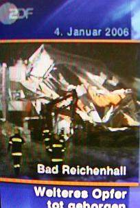(1) Nach einigen Tagen Beräumung durch Hunderte freiwillige Helfer wurden 15 von der Flachdachkonstruktion aus Leimbindern in Kastenträgerbauart erschlagene und verschüttete Teilnehmer des zum Zeitpunkt der Katastrophe stattfindenden "Publikumslaufs" - sieben Mädchen und fünf Jungen von neun bis fünfzehn Jahren sowie drei Frauen zwischen 38 und 40 Jahren - geborgen, außerdem wurden 34 Schlittschuhläufer teils schwer verletzt. Wegen des zunehmenden Schneefalls war das am Abend angesetzte Jugend-Eishockeytraining aus Sicherheitsgründen abgesagt. Tagelang dann allergrößtes Rätselraten, wieso es zu diesem verheerenden Konstruktionsversagen kommen konnte. Schuldzuweisungen zuhauf an die Kommune (und stellvertretend an den Oberbürgermeister), die seit längerem eine Verschönerungssanierung plante, doch mangels Geld noch nicht durchgeführt hatte, aber nicht an die eigentlich Verantwortlichen aus der Bauadministration, der Zulassungsinstitute, der Baubranche und Industrie. 

Und hat man sich vielleicht gar zu sehr auf den bayerisch-superschlauen Klimaforscher und Sternendeuter (Meteor-ologe!) Prof. Werner Seiler, Leiter des Instituts für Meteorologie und Klimaforschung in Garmisch Partenkirchen, verlassen? Er weissagte in einem Interview _"Sturm, Hitze, Hochwasser, Gletscherschmelze - Es trifft jeden von uns"_ in Natur+Umwelt, BN-Magazin 4-05: 

_"**1. Die Wissenschaft scheint sich über den bevorstehenden Klimawandel immer sicherer zu sein. Gibt es noch Zweifel?** 

Seiler: Nein, absolut nicht. Alle Klimaindikatoren zeigen eindeutig, dass der Klimawandel stattfindet. Die steigenden Temperaturen und die sich änderndenNiederschläge sowie die damit zusammenhängenden Folgen sprechen eine eindeutige Sprache. Sehen Sie nur ... die Dürren ... und schließlich die weltweit schmelzenden Gletscher. 

**2. Findet der Klimawandel auch bei uns in Bayern statt?** 

Seiler: Gerade bei uns. Wer mit offenen Augen durchs Land geht, kann viele Veränderungen selbst erkennen. ... Der Schnee fällt in tieferen Lagen immer seltener, was sich unmittelbar auf den Wintertourismus in Bayern negativ auswirkt. Dass wir den Klimawandel so deutlich spüren, ist übrigens kein Wunder. Dennn der Temperaturanstieg der letzten Jahrzehnte ist bei uns in Süddeutschland doppelt so hoch ausgefallen wie weltweit. 

**3. Seit 1860 ist die Durchschnittstemperatur um 0,8 Grad Celsius gestiegen, die Folgen sind bereits verheerend.** 

Seiler: Ja, und für die nächsten 30 Jahre ist ein weltweiter Anstieg um ein weiteres Grad, in Süddeutschland sogar um zwei Grad vorhergesagt. Diese Abschätzungen sind relativ zuverlässig. ... Derzeit rechnen die meisten Fachleute mit einem Anstieg der Temperaturen um circa drei Grad in den nächsten hundert Jahren. ..."_ 

Was der hochmögende Herr Prof. Seiler, mit offenen Augen durch die Landschaft wandelnd, kennt:  

Und wovor er die Augen beim Klimwaherumwandeln feste verschließt: Obwohl die Station Hohenpeißenberg doch nur um die Ecke liegt. Fazit: es ist noch lange nicht so warm, wie um 1800, und auch damals flogen keine Kolibris durch die Palmenhaine rund um Garmisch und Bad Reichenhall. Doch nun erst mal Schluß mit dem vom Bund Naturschutz und manchen seiner Helfershelfer in Szene gesetzten [Klimawandelblödsinn](7argus.md), zurück zu den Vorhersagequalitäten der Technik. 

Wie konnte es nun eigentlich zu dieser Dachkatastrophe kommen, wo doch ein ingenieurtechnisches Gutachten eines Bad Reichenhaller Büros aus dem Jahre 2003 feststellte (Obermain-Tagblatt Lichtenfels am 6.1.06): 

_"Die Tragkonstruktionen - sowohl Holzkonstruktion als auch Stahlbetonkonstruktion der gesamten Eislaufhalle - befinden sich in einem allgemein als gut zu bezeichnenden Zustand ... In der Holzkonstruktion sind lediglich Wasserflecken aufgrund von Unregelmäßigkeiten / Wassereinbrüchen aus der Dachentwässerung festzustellen. Diese haben jedoch weder auf die Qualität noch auf die Tragfähigkeit des Tragwerkes Einfluss."_? Beim Prozeß im Jahre 2008 warf dann der Richter der Stadt vor, daß die Stadt dem mitangeklagten Ingenieur vorgab, daß die Bestandsaufnahme bzw. das Gutachten nur höchstens 3.000 EUR kosten dürfe und damit lediglich eine "Alibi-Bescheinigung" entstehen konnte - so der vors. Richter Karl Niedermaier. Freilich widersprach dem der Hochbauamtsleiter und antwortete - trotz sonstiger Berufung auf umfangreichste Erinnerungslücken, daß der Umfang des Gutachtens nicht vorgegeben wurde. Wäre eine solche Sparvorgabe für die für ihre grundsätzlich äußerste Sparsamkeit berühmten Baubeamten nun außerhalb jeglicher Vorstellung? 

Aus den Kreisen der örtlichen Eishockeyspieler wurde zum vor dem Einsturz erkennbaren Schadensbild ausgesagt (Obermain-Tagblatt Lichtenfels, 5.1.06), während des Trainings seien _"stets Eimer aufgestellt worden, "weil Wasser von der Decke tropfte""_. Und am 21. April 2008 kommt beim Prozeß vor dem Landgericht Traunstein durch Aussagen des Gebäude-Betriebsleiters heraus, daß schon kurz nach der Einweihung Wassereinbrüche durch das Dach an der Tagesordnung waren. Jeden Sommer gab es bis zu fünf Wassereinbrüche, die dann geflickt wurden. Damit - und selbstverständlich auch durch winterlich anfallendes Kondensat aus der Hallenluft war die Dachdämmung / Wärmedämmung / Wärmeisolierung / Isolierung / Dachisolierung aus Mineralwolle ständigen Feuchtefrachten ausgeliefert, die wohl nie so richtig austrocknen konnten, da [Dämmstoffe eben insbesonders in Dachkonstruktionen nur schwer bis nie trocknen können](21316bau.md). Ein gefährlicher hydrolisierender Angriff auf hydrolisierbare Bindemittelsysteme entsteht sowohl aus besonders in [schadensanfälligen Flachdachkonstruktionen](212bau7.md) durchtropfendem Regen, wie auch aus Luftfeuchte, die logischerweise aus immer aufsteigender Warmluft - vielleicht sogar aus [lufterhitzenden Heizungssystemen](7temper.md) - an der gegenüber der Warmluft im Winter immer kühleren Deckenebene abkondensieren muß. Das Schließen der zunächst offen durchlüfteten Halle im Sinne einer Kaltdachkonstruktion einige Jahre später mit Fenstern - und damit quasi der Umbau zu einem grundsätzlich kondensatgefährdeten Warmdach - kann natürlich die in der Dachkonstruktion anfallenden Tauwasserfrachten bedeutend erhöhen. Dabei ist es auch durchaus vorstellbar, daß die Holzfeuchte über die vom Leimsystem tolerierbaren Grenzwerte gerät (z.B. max. 15% gem. DIN 1052-1). Außerdem ist nach den Erkenntnissen von Bierwirth 1994 (gem. oben angelinkter Wikipedia-Info) zu beachten, daß bei ca. 5%iger Überschreitung der für die Leimbindung erlaubten Maximalfeuchte die Zugscherfestigkeit dramatisch abfallen kann und beispielsweise bei geforderten 8-10% und Überschreitung auf 15% um die Hälfte abnimmt. Ohnehin ist bekannt, daß nasses Holz wesentliche Tragfähigkeitsverluste erleidet. 

Demgegenüber schreibt die Studiengemeinschaft Holzleimbau e.V. in einer Pressemitteilung vom 10.1.06 (leicht gekürzter Auszug): 

_"Pressemitteilung" 
"Experten" mit unzureichendem Sachverstand 
(Wuppertal 10.01.2006) Noch während der Bergung der Opfer des tragischen Einsturzes der Eissporthalle in Bad Reichenhall haben sich verschiedenste Baufachleute über mutmaßliche Ursachen des Unglücks geäußert. In den Medien wurden dabei von bislang im Holzbausektor nicht bekannten Experten auch Vermutungen über die Dauerhaftigkeit von Klebstoffen angestellt. Unter Überschriften wie "Auch Leim wird altersschwach" haben sie die These verbreitet, Leimsysteme könnten "altersschwach" werden. 

Diese Äußerungen sind falsch. Keiner der zugelassenen Klebstoffe verliert alleine durch einen Alterungsprozess an Festigkeit. Alle Klebstoffe mussten bereits in den siebziger Jahren umfangreiche Untersuchungen auch zu ihrer Dauerhaftigkeit bestehen, bevor sie von der im öffentlichen Auftrag tätigen Materialprüfanstalt (MPA) Universität Stuttgart für den Einsatz freigegeben werden. Die Dauerhaftigkeit der verschiedenen Klebstoffe wurde zudem im Rahmen öffentlich finanzierter Forschungsarbeiten bereits in den 80er Jahren an der MPA Universität Stuttgart und nochmals Ende der 90er Jahren am norwegischen Institut für Holztechnologie in Oslo belegt. 

Mit Befremden haben ausgewiesene Fachleute auch die Äußerungen zu gebrochenen Keilzinkenverbindungen aufgenommen. Ein längs der Flanken einer Keilzinkung verlaufender Bruch stellt bekanntermaßen alleine noch keinen Beleg für eine fehlerhafte Verklebung dar. Ein solches Bruchbild kann im Gegenteil auch Beleg für eine besonders hohe Holzqualität der verbundenen Hölzer sein. Zudem kann vermutlich derzeit niemand mit Sicherheit sagen, inwieweit gebrochene Keilzinkenverbindungen Ursache oder Folge des Trägerversagens waren. 

Ob die Keilzinkenverbindungen oder der Klebstofftyp oder aber eine noch gar nicht in Betracht gezogene Ursache Auslöser für die Katastrophe gewesen ist, wird schlussendlich erst die staatsanwaltliche Prüfung ergeben ..."_ 

Oho! Demnach sollte die oben zitierte Untersuchungder FH Eberswalde bzw. von Hans-Joachim Deppe über Probleme der Alterungsbeständigkeit von Holzverleimungen - natürlich im Verbundsystem mit dem umgebenden Holz - nach internationalen Standards gar _"falsch"_ sein? Oder aber unter _"ausgewiesenen Fachleuten"_ typischerweise unbekannt? Dazu paßt freilich die Aussage eines BASF-Vertreters gem. FAZ am 6.1.2006, der Vermutungen widerspricht _"... eine fehlerhafte Verleimung der Holzlamellen, aus denen die Träger gefertigt waren, könnten für deren Einsturz verantwortlich gewesen sein. „Aus chemischer Sicht ist das schlicht nicht vorstellbar.“"_ und der _"Leim, der für tragende Gebäudeteile verwendet werde und aus Aminoplast- und Phenolharzen bestehe, sei wärme- und feuchtigkeitsresistent - im Gegensatz zum Leim des täglichen Hausgebrauchs. ... Die Leimmischungen, die heute verwendet werden, seien im wesentlichen dieselben wie schon vor 35 Jahren, als die Eislaufhalle gebaut wurde. Die Prüfung und die Normierung von Leimtechniken sei in jener Zeit schon so intensiv und genau gewesen wie heute."_ [Infolink FAZ-Artikel](http://www.faz.net/s/RubCD175863466D41BB9A6A93D460B81174/Doc~E5D7D83CA9A00481D98E9392CE8954B09~ATpl~Ecommon~Scontent.html) 

Und was heißt eigentlich _"Alterung"_ von Klebstoff? Eine Mumifizierung des Klebstoffs unter allergünstigsten Umgebungskonditionen oder praxisnah wechselnde Belastung? Und ein Riß in der Keilzinkungsfuge - wie örtlich festgestellt - mag zwar auf gutes Holz hinweisen - bravo! - aber bestimmt nicht auf gute Verleimung. Oder haben die _"Experten mit unzureichendem Sachverstand"_ wieder mal nicht aufgepaßt? 

[http://www.bonsaistreff.de/treff/thread.php?threadid=1149&sid=314a5a6624f8fc4ef1dc4e9bf4aaf648](http://www.bonsaistreff.de/treff/thread.php?threadid=1149&sid=314a5a6624f8fc4ef1dc4e9bf4aaf648) - Info zur Kondensatbelastung am Hallendach der Kunsteisbahn in Schwenningen 

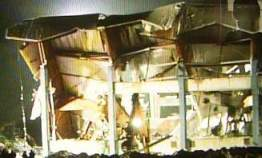(2) Im Mittenbereich an jeweils zwei Bruchstellen, teils exakt am Keilverzinkungsstoß (eingeführt durch Prof. Karl Egner, Stuttgart, Anfang der 1940er Jahre, Keilzinkennorm DIN 68140) der Brettlamellen - eingeknickte Leimbinder in Kastenträgerbauweise aus hohlen Kämpf-Stegplatten (Erfinder: Gottfried Kämpf, Rupperswil, Schweiz 1955, letzte Kämpf-Stegträger baute Georg Fischer, Weilheim bis 1981) mit ehemals 30 m Spannweite und Aluprofildeckung - die doch nach bauaufsichtlicher Zulassung und Normstatik weit mehr als die zum Zeitpunkt des Einsturzes gegebenen ca. 270 Tonnen - sie entsprechen läppischen 150 kg je qm der 30 x 60 m großen Hallengrundfläche - gigantische Schneelasten ertragen sollten und einst im Winter 1980/81 auch 240 kg/qm aushielten. 

Als die Halle nun bei vergleichsweise geringer Auflast auf dem Dach strohhalmgleich im Bereich der Trägermitte an jeweils zwei Bruchstellen - sozusagen U-förmig - plötzlich zusammenbrach - wußten zumindest Fachleute mehr als eindeutig, woher der Wind weht, auch wenn ein Diplomingenieur des Technischen Beirats der Studiengemeinschaft Holzleimbau und selbst Leimträgerhersteller am 6.1.06 in der "Neuen Presse Coburg" abwiegelt: es bestünde keine _"generelle Gefahr bei solchen Konstruktionen"_ und der Geschäftsführer des Nachfolgeunternehmens des Herstellers der Reichenhaller Träger nach vorliegendem Teletextscreenshot in SAT 1 vom 7.1.06 steif und fest behauptet, _"Normalerweise halten solche Dächer 500 Jahre"_ und Kondenswassereinflüsse am Holz (Obermain-Tagblatt Lichtenfels 9.1.06: _"Das Kondensat schlägt sich in Teilen nieder. Es kann sein, dass es über die Jahrzehnte an den Hölzern nagt"_) als Schadensursache ausmacht. Industrietypisches Pfeifen im Walde? 

Nach Informationen des SPIEGEL am 11.1.06 wurden bei der angelaufenen Untersuchung der Holztragwerke erst mal keine morschen, verfaulten oder sonstwie wassergeschädigten Holzquerschnitte entdeckt: _"Die Beobachtungen der von der Staatsanwaltschaft bestellten Gutachter weisen zunächst nicht auf verfaultes oder nasses Holz als Einsturzursache hin. Einer der beiden Experten, Anton Ruile, sagte SPIEGEL ONLINE: "Ich habe keine grob verfaulten Stellen gesehen."_ 

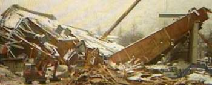 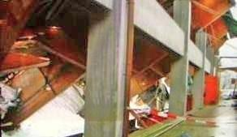 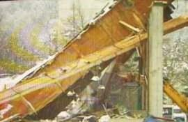 
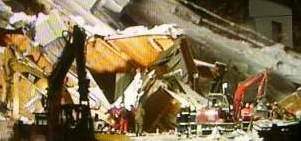(3-6) Leimbinder + [Stahlbeton](2beton.md)- die bei Modernisten sehr beliebte Bauweise der Neuzeit, viel gepriesen und bepreist durch Fachzeitschriften und die problemverheimlichende Brutalwerbung der Bauindustrie. Warum eigentlich erlaubt man sich dabei die durch die Praxis an vielen Beispielen belegte mangelhafte Langzeitstabilität der Holzleimbinder unter wechselnden Lastfällen und im Unterschied zu traditionell bewährten und wesentlich zuverlässigeren Bauweisen durch normale Inspektionen - und offenbar auch von "normalen" Ingenieuren nicht von außen feststellbare heimtückische Bindungsermüdung so wenig ins Zentrum der Überlegungen zu stellen? Was wirklich viele Jahrhunderte als Holztragwerk bewährt ist, können beispielsweise die weitgespannten gotischen Kirchdächer erzählen, denen Kondensat und wechselnde Lastbeanspruchung, auch teilweises Hineinregnen, schädlingsbedingte Vermorschung und lastbedingte Verformung kaum etwas anhaben konnten. Natürlich stehen solche Dächer nicht über Superfeuchtnutzungen mit Wasserbecken, Eisflächen, Viehställen oder wasserbesprengten Reithallen. 

Seltsam auch, daß manche Planer allein durch leichtgläubige Normenzuversicht (wer erläßt denn diese, [wer regiert denn die Normenausschüsse](2mbu.md), hä?) und äußerst dankbare Nutzung der Kostenlos-Planung der industriellen "Bauberatung" dazu gebracht werden können, ihre pflichtgemäße Skepsis und Prüfaufgaben so komplett aufzugeben und vergaberechtswidrig ganz und gar nicht produktneutrale Planungsdetails und [korruptionsfördernde Leistungsverzeichnisse](10hoai05.md)und Ausschreibungsmethoden ihrem Mist zugrundezulegen. Hier wäre es sicher interessant, mal zu recherchieren, wie es dazu kam, daß ausgerechnet eine solche kritische Bauweise und ausgerechnet von dem bewußten Hersteller den Weg als baurechtlich zulässige (???) Bauweise und auf die Reichenhaller Baustelle fand? Gar ohne rechtlich verbindliche Baugenehmigung? Unter der Verantwortung politisch bestens staatsregierungsmäßig Verbandelter? Die staatliche Rechnungsprüfung und inzwischen wohl auch die Staatsanwaltschaft hat hierzu ja mehr als genügend Erkenntnisse. Ob es nun wieder mal heißt: Ball flach halten!? 

Hier nun weitere Bilder zum Thema, was den Einsturz verursachte bzw. was beim Einsturz passierte: 

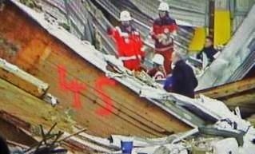 

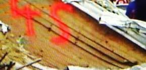(7-8) Für Dauerbelastung unter den gegebenen Bedingungen durch Temperaturwechsel, Lastwechsel und gigantischen Feuchtefrachten offenbar untauglichste Verleimung der Holzlamellen der Leimbinder mit Synthetikklebern. Nach Erkenntnissen des SPIEGEL am 11.1.06 wurden _"Harnstoffharzleim und Resorcinharzleim"_ eingesetzt, dies entspricht auch den Erkenntnissen von Prüfstatiker Dr.-Ing. Walthari Fuchs, der an der Unglückstelle an den Bruchflächen in den gelösten Keilzinkenverbindungen "schwarze" Leimfugen erkannte - typisch für den sehr dunklen Resorcinharzleim. An den unten aufgenommenen Bildern von Leimfugenaufsplitterungen ist dies nicht erkennbar, dort dürfte es sich deswegen um den helleren Harnstoffharzleim (wohl Melamin-Harnstoff-Formalaldehyd-Harz- MUF) handeln. Die an einigen Keilverzinkungsstößen gelösten und offenstehenden Leimfugen im Bereich der am meisten belasteten Trägermitte sprechen eine unmißverständliche Sprache. 

Nach ersten Untersuchungen des unabhängigen Traunsteiner Prüfstatikers Dr.-Ing. Walthari Fuchs waren an mindestens _"fünf der zwanzig"_ Leimträger die Verleimungen an den Bruchstellen völlig gelöst - ein bestürzender Beleg der mangelnden Dauerstabilität dieser Verleimungen. Und eben im Bereich der Trägermitte - bei den dort ständig wechselnden Zug- und Druckkräften - ist die Trägerkonstruktion an jeweils zwei Stellen zusammengebrochen und dann sozusagen U-förmig eingeknickt, wobei die Leimfugen in Trägermitte in Sekundenschnelle beim Zusammensturz die angreifenden Spalt- und Schälkräfte offenbar nicht mehr aufnehmen konnten, sich lösten und sozusagen ausgehend von der Bruchstelle in einer Kettenreaktion fächerförmig aufrissen. Die im Trägermittenbereich bei Spannungsüberschreitung höchstbelasteten Leimverbindungen, die ihre Klebwirkung möglicherweise durch feuchtebedingte Überlastung im Verbund verloren, verloren dann in der mittleren Trägerzone möglicherweise auch vorrangig ihre Klebefestigkeit. Da die Scherkräfte auf die Trägerverleimung am Auflager am größten sind, dürften bei genauer Untersuchung auch dort ausreichend gelöste bzw. überbeanspruchte Leimfugen vorzufinden sein. 

[Bildergalerie vom Einsturz (Berliner Zeitung)](http://bz.berlin1.de/z/photos/index.php/item/reichenhall/if5b1913c36b9a8d937bf3352e9ea4beb) 

Am 7.1.06 besuchte ich die wg. Opferbergung teilberäumte Unglückstelle und machte dabei u.a. folgende Aufnahmen: 

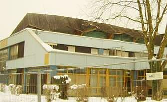 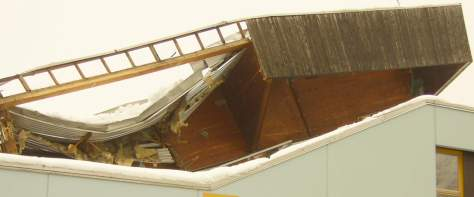 Dachkanten der eingestürzten Konstruktion 
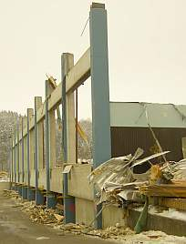 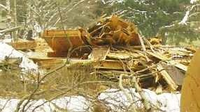 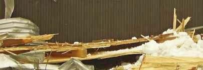 
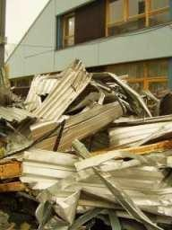 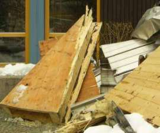Die übriggebliebenen Stahlbetonstützen und seitlich abgelagerte aufgesplitterte Einsturzreste der Kastenprofile sowie der Blechdeckung nach Teilberäumung. Großteile der Mineralwolledämmung unter der Dachfläche sind nach meinen Beobachtungen (siehe Bilder) übrigens durch Schimmelbefall großflächig verschimmelt. [Kondensat und Schimmel in der Dämmung](7schim.md) - eben der bauphysikalische Klassiker aller Dach- und Wanddämmungen, den ich wenigstens bei den von mir begutachteten Dämmstoffschäden immer gefunden habe! 

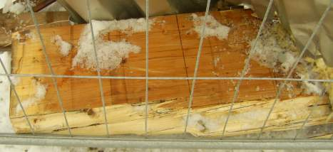 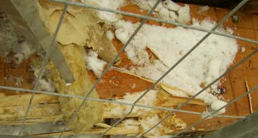 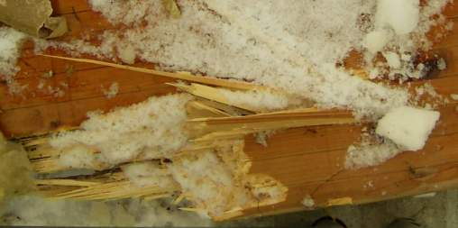 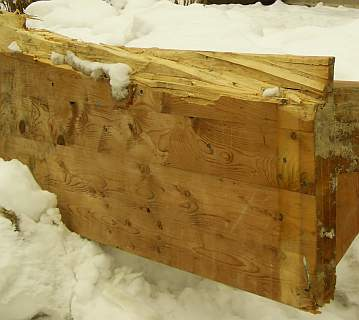 Aufgebrochene und vorwiegend in der Leimfuge aufgerissene Trägerreste im Detail 

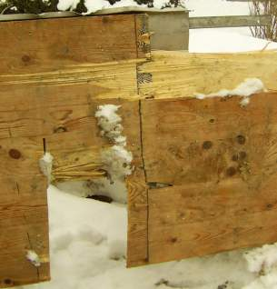Gerissener Trägerquerschnitt mit seitlich ausgesägter, oben splitternd abgestemmter Probeentnahme (Rechteckprofil aus der offenbar äußerlich leimtechnisch intakten Zone) für künftige Materialuntersuchung. Was soll denn da herauskommen? Vielleicht, daß sich die Leimablösungen auch in Richtung der zum Auflager zunehmenden Schub-/Scherkräfte größtenteils fortgesetzt haben und so den eigentlichen Anlaß zum mittigen Überschreiten der vom geschwächten Leimprofil aufnehmbaren Zugspannungen mit nachfolgendem Einsturz gaben? Dunkle Bruchkanten verweisen auf Resorcinharzleim. 

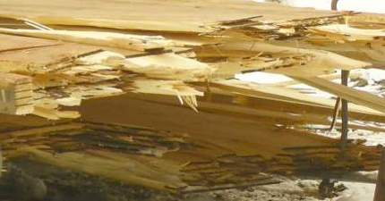 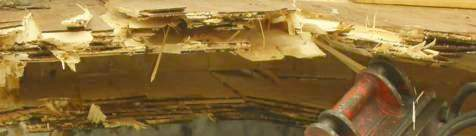Blick in die aufgerissene Keilzinkung der Leimholzträger. Man fragt sich unwillkürlich, was es da noch mehr zu untersuchen gibt? Vielleicht das?: 

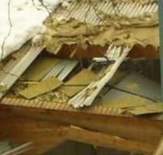 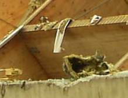     Diese Bilder von mir vom 8.1.2006 mit teils geschwärzten/angegrauten Mineralwollen belegen voraussichtlich deren Schimmelbefall, für dessen Entstehen große Dauerfeuchten Voraussetzung wären. Logisch, daß an jedem Dach zur kälteren Jahreszeit innenseitig Kondensat anfällt. Wer in kalten Dachbereichen (und Wänden) Schäume, Fasern und Gespinste anordnet, möge bitte neben der [nirgends nachgewiesenen Dämmwirkung gegen Heizenergieverluste](213baust.md) (hierzu [Praxisbeweise](7fehrtab.md)) auch mal erklären, wie das Zeug jemals wieder trocknen soll. Kapillar geht das nämlich in solchem Material gar nicht, und Feuchtetransporte aus Baustoffen erfolgen nun mal 1000:1 kapillar und nicht dampfförmig. 
Diese Vergrößerung aus einem dpa-Pressebild zeigt die hell und voraussichtlich unverschimmelt gebliebenen sowie die flächig möglicherweise durchschimmelten Bereiche der Mineralwollematten in der sog. Dachdämmung. An den hellen Stellen waren die Unterkonstruktionen aus Holzlatten montiert. Daß die synthetischen Dichtungen an den Blechtafelverschraubungen über die Jahre UV-bedingt verspröden und dann kapillar Wasser einsaugen und ihre abdichtende Wirkung verlieren können, kann natürlich zusätzliche Feuchtefrachten in die Dachkonstruktion bewirken. Wie verhielt es sich hier also mit der Gebäudeinspektion? 

PVAc-Leime (hier nicht verwendete Weißleime) können beispielsweise im feuchten Milieu zu Polyvinylalkohol und Acetat hydrolysieren, letzteres dient dann den Schimmelpilzen als leckere Kohlenstoffquelle. Mein Kollege [Dipl.-Ing Peter Rauch](http://www.ib-rauch.de) schreibt zur Problemlage in seinem Schimmelfachbuch: _"Das Schimmelwachstum führt dann zu einer Verminderung der Reiß-, Zug- und Biegefestigkeit, der Elastizität und unter Umständen auch der Isolierwirkung der Kunststoffe"_. 

Die erst durch die ZDF-Frontal 21-Recherche eines kritischen Journalisten aufgedeckte Verwendung von Harnstoff-Formaldehyd-Leim, ein wasserquellbarer und für Feuchteangriff überhaupt nicht zugelassener Leim an den kritischen Partien der Einsturzsituation in abenteuerlichst geschrumpftem und angeschimmeltem Zustand vorgefunden wurde (Prof. Dr.-Ing. Bernd Hillemeier an der TU Berlin wies das im Baustofflabor nach), wirft ein bezeichnendes Licht auf die Geschehnisse zur Bauzeit. Allerdings wußte man damals noch nichts von dem erst einige Jahre später Umbau der Hallenfassade zu Abschließung des Raumes mit Fensterelementen. Ab dann setzte ja erst die grausame Auffeuchtung des Bauwerks durch Kondensat ein, die sich in den kalten Partien der dann zum Warmdach degradierten winterlich eiskalten Tragwerkskonstruktion des Daches ein. 

Ach ja, und dann kamen ausgerechnet während meines Besuchs auch noch die Herren Köhler und Stoiber mit ihrem Troß vorbei und ließen sich die Unglückstelle anläßlich eines Kondolenzbesuchs vorführen: 
        Was man sich davon neben der begrüßenswerten Anteilnahme am Leid der Opfer für die Zukunft der Baubranche Konstruktives erwarten darf, ist leider, leider mehr als fraglich. Steht doch unser Politiksystem für industrielle Einflußnahme und Manipulation der Politik par excellence. Auch hierzulande ist ja der Abramoffismus (nach Jakob Abramoff, US-Lobbyist, der bis an die Regierungsspitze die seinen Schmierhelfern genehme Politik inkl. Gesetzgebung durch Direktbestechung von über 300 politischen Mandatsträgern kaufte, in Deutschland etwa "Hunzingerismus") und nicht das Bürgerinteresse und Wohl des Landes eine nicht zu vernachlässigende Kraft. So schreibt der bekannte Enthüllungsjournalist Hans Leyendecker am 5.1.06 in der SZ: 

_"Kontakte im Separée 
(Mehr als 300 Unternehmen und 1930 Verbände) bemühen sich in Berlin um die Gunst der Politiker und locken auch mit Posten in Aufsichtsräten"_ 
Dabei gelingt es ihnen offenbar vortrefflich _"im politischen Geschäft mitzumischen"_ und in das _"Räderwerk von Parlament und Regierung einzugreifen"_. Ihre raffinierten und ausreichend gut dotierten Repräsentanten sitzen nach Leyendecker _"in Arbeitskreisen und Beiräten und bringen bei Gesetzen oder gesetzlichen Regelungen ... Eigeninteressen ein. ... Abgeordnete halten nicht selten Reden, die in den Zentralen von Wirtschaftsverbänden entworfen wurden. Ministerien machen ... Vorlagen, die Interessensvertreter bearbeitet haben. ... in Entwürfen der alten Regierung stand ... "wörtlich RWE" oder "Vorschlag BASF"."_ 

Aha, und wer produziert denn die subventionsabhängige "Öko"-Energie, wer die sinnlosen Dämmstoffpakete, die durch EEG und EnEV an den Mann gezwungen werden? Und wer den Leim? Das so überaus gut auch im Bau- und Zulassungswesen geschmierte Räderwerk kann man bestimmt überdeutlich bei dem staatlich verordneten Energiesparschwindel nachprüfen, wo seit vielen ungeheuere Mittel in zigfacher Milliardenhöhe in [energetisch wirkungsloseste Gebäudesanierungen](7fehrtab.md) gedrückt werden sowie beim sogenannten [Klimaschutz, der ganz Deutschland den Energiemonopolisten ausliefert](7thuene1.md). 

Weiter berichtet Leyendecker von _"gezielten Spenden an Abgeordnete, "mit denen man gut im Gespräch ist"_ , von schon unter der "Bonner" Regierung bekanntgewordenen Bemühungen, _"Widersacher durch Zahlungen gefügig zu machen"_ und auch von der schon in den 1970ern von Bernt Engelmann in seinem Schwarzbuch betr. Helmut Kohl beschriebener gezielter Karriereförderung _"genehmer Nachwuchspolitiker"_. ..._"Fester Teil dieses Systems der organisierten Interessen sind Abgeordnete geworden. Sie sitzen in Verbandsvorständen und verdienen sich ein Zubrot als Berater. Jeder dritte Parlamentarier geht einer Nebentätigkeit nach."_ 

Was bei Ministerialen übrigens besonders beliebt sein soll, ist die ungeheuer und meist mindestens fünfstellig vorzüglich dotierte Vortragstätigkeit auf industriegesponsorten "Fortbildungsveranstaltungen" und Teilnahme an industriellen pseudowissenschaftlichen "Einflußinstituten", deren Ergebnisse die der koreanischen Genmanipulation bestimmt erreichen, wenn nicht sogar übertreffen kann. Man sollte das vielleicht mal bei den EnEV-Ministerialen prüfen. Und wieso verschlingt eigentlich die staatliche Zulassungspraxis von Baustoffen und Baukonstruktionen so viel Geld, daß nur "Große Tiere" mithalten können? Und im Ergebnis unter vielem anderen gut brennbare Dämmfassaden an den Hochhäusern hängen - [und auch brennen](21315bau.md)? 

Doch zurück zur technischen Diskussion: 

In der von Durchbiegung am meisten betroffenen Trägermittelbereich überlagern sich bei Flachdächern die jahreszeitlich und im Tagesablauf unterschiedlichen Lastfälle aus Winddruck/-sog, Regen-, Hagel- und Schneelast, aus thermischer Beanspruchung mittels Dehnung und Kontraktion, aus ebenfalls dehnender und kontrahierender Kondensataufnahme und -abgabe der hochbelasteten tragenden Baustoffe. Gerade winters mit fallweise hinzukommender Schneelast kann ja die Beanspruchung der Konstruktion und folglich der Leimbindung in den Holzfugen am allergrößten sein. Kein Wunder also, daß das Hallentragwerk in Bad Reichenhall im Mittelbereich den Auflasten nicht mehr standhielt und schlagartig einbrach. Am 18.7.2006 zitiert dann BILD aus den zwischenzeitlich angefertigten Gutachten. Angeblich geht es um _"Materialfehler wie falschen, minderwertigen Leim, technische und statische Mängel bei der Holz- und Dachbauweise sowie eine mangelhafte und ungenügende Wartung und Instandhaltung als Hauptursachen für den Dacheinsturz. Durch den Alterungsprozeß der 35 Jahre alten Halle und massive Schäden wie offene Leimfugen, Bruchstellen und Feuchtigkeit habe das Dach [...] nur noch eine geringe Resttragfähigkeit gehabt [...]"_ heißt es dazu im FAZ.NET. Die zusätzliche Schneelast war dann nur noch das Tüpfelchen auf dem I. Die Halle soll nämlich weit vorher schon einsturzgefährdet gewesen sein. Was heißt das nun für die anderen zigtausend Hallen vergleichbarer Bauweise? 

Am 20.7.2006 gibt die Staatsanwaltschaft Traunstein folgende Presseerklärung heraus: 

_"Der Leitende Oberstaatsanwalt 

in Traunstein 

Traunstein, 20. Juli 2006 

Presseerklärung der Staatsanwaltschaft Traunstein 

zum Einsturz der Eishalle in Bad Reichenhall 

Die Sachverständigen der TU München und des TÜV Süd haben ihre Gutachten zum Einsturz der Eishalle in Bad Reichenhall, bei dem fünfzehn Menschen getötet und achtzehn zum Teil schwer verletzt wurden, vorgelegt. Sie haben mehrere Abweichungen von den Regeln der Technik bei Planung und Bau der Halle festgestellt. Neben diesen Hauptgutachten wurden Zusatzgutachten von der Fachhochschule Augsburg, dem Deutschen Wetterdienst und der Eidgenössischen Materialprüfungs- und Forschungsanstalt (EMPA) in Dübenbach/Schweiz erstellt. Die Staatsanwaltschaft Traunstein sieht auf der Grundlage der sachverständigen Feststellungen den Verdacht der fahrlässigen Tötung und der fahrlässigen Körperverletzung und hat Ermittlungen gegen die verantwortlichen Personen eingeleitet. 

Feststellungen der Sachverständigen: 

´Die vorgelegten Gutachten der beiden Hauptgutachter der Technischen Universität München und des TÜV-Süd basieren auf umfangreichen Untersuchungen vor Ort unmittelbar nach dem Schadenseintritt sowie nachfolgenden Untersuchungen an sichergestellten Bauteilen. Die Sachverständigen haben u. a. Teile aus unbeschädigten Resten des Tragwerks entnommen und die charakteristischen Festigkeiten der verwendeten Einzelbauteile ermittelt. 

Die beiden Hauptgutachter kommen dabei im Wesentlichen zu den gleichen Ergebnissen. Insbesondere wird übereinstimmend festgestellt, dass der Einsturz des Dachtragwerkes der Eissporthalle Bad Reichenhall nicht auf eine Einzelursache, sondern auf die Verkettung mehrerer Mängel und Schäden zurückzuführen ist. 

Im Einzelnen sind die Sachverständigen zu folgenden Feststellungen gelangt: 

Bauweise 

Die in den Jahren 1971/1972 errichtete Eissporthalle Bad Reichenhall war ein Bauwerk mit ca. 75 m Länge und ca. 48 m Breite. Das Dach wurde durch 2,87 m hohe Hauptträger getragen, die in Holzbauweise als Kasten erstellt waren. Dabei handelte es sich um eine Sonderkonstruktion. Die Kastenträger waren mit Ober- und Untergurten aus Brettschichtholz sowie aus seitlichen Stegplatten in so genannter "Kämpfstegbauweise" hergestellt, wobei die 48 m langen Gurte aus drei 16 m langen Teilen bestanden, die mit so genannten Universal-Keilzinkungen gestoßen waren. Für die Kämpfstegbauweise lag eine allgemeine bauaufsichtliche Zulassung vor, die jedoch die Bauhöhe der daraus hergestellten Träger auf 1,20 m beschränkte. 

Abweichung von derzugelassenen Bauweise 

Bei der Eissporthalle in Bad Reichenhall hat man bei Planung und Ausführung gegen wesentliche Regelungen der allgemeinen Zulassung für die Kämpfbauweise verstoßen und den damals vorliegenden Erfahrungsbereich verlassen. Insbesondere wurde die maximale Trägerhöhe von 1,20 m laut Zulassung bei der Bauweise der Eissporthalle Bad Reichenhall mit einer Trägerhöhe von 2,87 m Höhe weit überschritten. Eine beantragte Erweiterung der Zulassung auf die geplante Bauweise mit Kastenträger ohne Höhenbegrenzung war im Jahr 1971 vom Institut für Bautechnik nicht erteilt worden. 

Für die Ausführung der Sonderkonstruktion wäre deshalb eine so genannte "Zustimmung im Einzelfall" der Obersten Baubehörde des Freistaates Bayern erforderlich gewesen. Entsprechend bisherigen Erkenntnissen wurde eine solche Zustimmung durch die Baubeteiligten nicht beantragt und lag nicht vor. 

Keine Prüfung der Statischen Berechnung 

Eine von einem Prüfingenieur geprüfte statische Berechnung des Daches der Eissporthalle konnte bislang trotz intensiver Recherchen nicht gefunden werden. Ohne eine solche geprüfte Statik hätte das Bauwerk nicht errichtet werden dürfen. 

Keine ungewöhnliche Schneelast 

Die in der statischen Berechnung angesetzte maximale Schneelast von 150 kg/qm war zum Unfallzeitpunkt nicht überschritten. Eine rechnerische Überbeanspruchung aufgrund äußerer Lasten zum Zeitpunkt des Einsturzes lag damit unter Voraussetzung der üblichen Bauwerkssicherheiten nicht vor und das Gebäude hätte deshalb aufgrund der vorhandenen Schneelast nicht einstürzen dürfen. 

Fehler in der Statischen Berechnung 

Die Überprüfung der nach bisherigen Erkenntnissen nicht geprüften statischen Berechnung ergab, dass zwei nennenswerte Fehler bzw. Versäumnisse vorhanden sind. Die Zugspannungen im Schwerpunkt der Gurte wurden nicht nachgewiesen. Hierdurch wurde das Tragverhalten der Gurte zu hoch bewertet. Auch die Schwächung der Konstruktion infolge der Stöße von Gurten und Stegen mit so genannten Universalkeilzinkungen wurde in der statischen Berechnung nicht berücksichtigt. Diese Fehler und Versäumnisse führten zu einer deutlichen Überbewertung des statischen Tragverhaltens der Deckenträger. Somit war die notwendige Bauwerksicherheit von mindestens 2,0 nicht vorhanden. Die Bauwerksicherheit beinhaltet eine mögliche Überschreitung der Last, die Bauwerksalterung und geringfügige Abweichungen bei Planung und Herstellung. Vergleichsrechnungen der Gutachter unter Verwendung der zum Zeitpunkt der Errichtung der Eissporthalle Bad Reichenhall geltenden technischen Regeln haben gezeigt, dass die rechnerische Sicherheit zum Zeitpunkt der Errichtung der Halle unter Berücksichtigung aller Randbedingungen und Nachweise lediglich in der Größenordnung von etwa 1,5 lag. 

Verwendung von Harnstoffharzklebstoffen 

Die Hauptträger des Dachtragwerks wurden überwiegend unter Verwendung eines Harnstoff-Formaldehyd-Klebstoffes hergestellt. Die Verwendung dieses Klebstoffes für tragende Bauteile war auch nach den damals bestehenden technischen Regelungen nur in einem trockenen Umgebungsklima zulässig. 

Nach heutigem Wissensstand sind Harnstoffharzleime für die Verleimung tragender Bauteile in Eishallen nicht geeignet, da sie nicht dauerhaft feuchtebeständig sind. Unbeheizte und nicht klimatisierte Eishallen weisen für feuchteempfindliche Bauteile ein besonders kritisches Klima auf. Die relative Luftfeuchtigkeit in solchen Hallen ist in der Regel sehr hoch. Zudem führt die Wärmeabgabe infolge der Wärmestrahlung zwischen Hallendecke und Eisfläche zu einer Unterkühlung und damit zu einer vermehrten Tauwasserbildung an der dem Eis zugewandten Unterseite der Dachkonstruktion. In Bad Reichenhall kam es zudem zu wiederholten Wassereinbrüchen infolge von Undichtigkeiten an der Dachhaut bzw. im Bereich der Dachentwässerung. Keine nachteiligen Auswirkungen hatte nach übereinstimmender Ansicht der Gutachter hingegen das nachträgliche Schließen der zunächst zweiseitig offenen Halle. 

Die heutigen Erkenntnisse über die kritischen Feuchtigkeitsverhältnisse in Eissporthallen waren im Jahr 1972 noch nicht vorhanden, sodass der Einsatz von Harnstoffharzleim zur Verleimung der tragenden Bauteile nicht generell gegen den damaligen Stand der Technik verstieß. Auch nach den zur Bauzeit geltenden technischen Regeln hätte für die Verbindungen zwischen Gurten und Stegen wegen der dicken Klebefugen jedoch anstatt des spröden Harnstoffharz-Klebstoffes ein wesentlich elastischerer Resorzinharzleim verwendet werden müssen. 

Durch die über Jahre hinweg auftretende Feuchtebeanspruchung in der Eissporthalle Bad Reichenhall wurden die mit Harnstoffharzklebern ausgeführten Klebeverbindungen der Dachkonstruktion erheblich geschädigt. Dies betraf vor allem die Universalkeilzinkenstöße der Untergurte sowie zum Teil die Generalkeilzinkenstöße der Obergurte und die Verklebung zwischen Gurten und Stegen. An den Universalkeilzinkungen der Untergurte war der Kleber zum Teil so geschädigt, dass er bis in eine Tiefe von 5 cm bis 8 cm keine Klebewirkung mehr hatte. 

Die feuchtigkeitsbedingte Schädigung der Klebeverbindungen der Dachkonstruktion stellt eine wesentliche Ursache für den Einsturz der Eissporthalle in Bad Reichenhall dar. 

Mängel der Konstruktion der Hauptträger 

Der Herstellungsvorgang der Kastenquerschnitte der Hauptträger durch Blockverleimung zwischen Stegen und Gurten entsprach nicht den damaligen allgemein anerkannten Regeln der Technik. Ebenso muss die Herstellung der vertikalen Universalkeilzinkenstöße der Stegplatten als schwierig und wenig robust angesehen werden. Die Qualität der Klebstofffugen war unterschiedlich. Hinzu kamen Vorschädigungen der großformatigen Stege aufgrund der wechselnden Feuchtebelastungen. 

Diese Konstruktionsmängel waren mit ursächlich für den Einsturz der Halle. 

Beton-Tragkonstruktion 

Demgegenüber sind die vorhandenen Setzungen der Beton-Tragkonstruktion der Eissporthalle, die entlang der südlichen Stützenreihe von der Ost- zur Westseite ca. 10 cm betragen, nicht als schadensrelevant anzusehen. Die daraus resultierenden Verformungen der Dachkonstruktion selbst sind so gering, dass auf der Grundlage von Plausibilitätsvergleichen und -vergleichsrechnungen nicht auf eine zusätzliche Zwangsbeanspruchung der Dachkonstruktion geschlossen werden kann. 

Instandhaltung 

Im Hinblick auf die Instandhaltung des Gebäudes wird festgestellt, dass die Ursachen der immer wieder auftretenden Wassereinbrüche in das Gebäudeinnere der Eissporthalle (Undichtigkeiten an der Dachhaut) nicht dauerhaft beseitigt wurden und während der Dauer der Hallennutzung kein Renovierungsanstrich der hölzernen Dachkonstruktion erfolgte. 

Ob derartige Maßnahmen die feuchtigkeitsbedingte Schädigung der Klebeverbindungen der Dachkonstruktion wesentlich verzögert hätten, kann derzeit nicht mit ausreichender Sicherheit beantwortet werden. 

Eine fachgerechte Überprüfung zur Standsicherheit der Dachkonstruktion ist nicht dokumentiert. Dabei wäre zu berücksichtigen gewesen, dass es sich um eine Sonderkonstruktion handelt. Weiterhin müssen auch vor Jahren schon Anzeichen für eine Schädigung der Verklebungen zwischen Gurten und Stegen sowie an den Universalkeilzinkenverbindungen der Untergurte und große Fugen an den Stegen vorhanden gewesen sein. Dies hätte für einen Fachmann Veranlassung zu einer vertieften Überprüfung des Zustandes der Tragkonstruktion und der diesbezüglichen bautechnischen Unterlagen geboten. 

Zusammenfassung: 

Zusammenfassend sind die Einsturzursachen wie folgt zu beschreiben: 

Die infolge von Fehlern der statischen Berechnung und konstruktiver Mängel ohnehin zu geringe Bauwerkssicherheit von deutlich weniger als 2,0 wurde über die Standzeit des Gebäudes durch äußere Einflüsse, insbesondere die Verschlechterung der Klebeverbindungen an den Untergurten, stetig weiter reduziert, bis es am 02.01.2006 - ausgelöst durch die Schneelast - zum Einsturz der Halle kam. 

Nach den Erkenntnissen der Sachverständigen versagte einer der drei ostseitigen Hauptträger zuerst. Durch die steifen Querträger wurden die Lasten von dem zuerst versagenden Träger auf benachbarte Träger umgelagert. Diese bereits vorgeschädigten Träger wurden damit ebenfalls überlastet, wodurch das gesamte Dach reißverschlussartig einstürzte. 

Vorgehen der Staatsanwaltschaft Traunstein: 

Die Staatsanwaltschaft Traunstein hat bisher im Rahmen der Ermittlungen ca. 140 Zeugen vernehmen lassen. Es wurden Dutzende von Ordnern an Beweismaterial sichergestellt. Das letzte Gutachten ging am 30.Juni ein. 

Die Staatsanwaltschaft sieht nach den Feststellungen der Sachverständigen den Verdacht der fahrlässigen Tötung sowie der fahrlässigen Körperverletzung. Sie hat Ermittlungen gegen insgesamt acht der für die Planung, Genehmigung und Erstellung der Eishalle sowie für die Überwachung und den Unterhalt des Bauwerkes verantwortlichen Personen eingeleitet. Es handelt sich dabei um vier ehemalige Mitarbeiter der Stadt Bad Reichenhall, zwei frühere Beschäftigte von Firmen, die an der Erstellung der Dachkonstruktion beteiligt waren, sowie zwei Architekten bzw. Bauingenieure, welche mit der Errichtung und Überprüfung des Bauwerkes befasst waren. Weitere Mitverantwortliche sind bereits verstorben. 

Das Amtsgericht Traunstein hat auf Antrag der Staatsanwaltschaft die Durchsuchung von Wohn- und Geschäftsräumen der Beschuldigten und weiterer Unverdächtiger nach Beweismitteln angeordnet. Die Staatsanwaltschaft Traunstein hat unter Beteiligung von 9 Staatsanwälten und 23 Beamten der Kriminalpolizei Traunstein am 20. Juli 2006 die Beschlüsse an insgesamt 20 Objekten in Oberbayern und Schwaben vollzogen. 

Es muss betont werden, dass die Ermittlungen noch nicht abgeschlossen sind und eine andere Beurteilung der Sach- und Rechtslage bei Vorliegen neuer Erkenntnisse erforderlich sein kann. 

Nach dem vorläufigen Ergebnis der Ermittlungen besteht kein Verdacht gegen die am Unglückstag für den Betrieb der Halle verantwortlichen Personen. Nach den Feststellungen der Sachverständigen hatte die Schneelast auf dem Hallendach nicht den rechnerisch zulässigen Wert überschritten. Ein Laie musste auch nicht nach dem von vielen Zeugen beschriebenen lauten Geräusch am Nachmittag des Unglückstages mit dem Einsturz der Halle rechnen. 

Die Staatsanwaltschaft bittet um Verständnis, dass die Öffentlichkeit nicht zu einem früheren Zeitpunkt informiert wurde. Dies war jedoch erforderlich, um den Erfolg der durchgeführten Ermittlungen nicht zu gefährden. 

Mit einem Abschluss der Ermittlungen ist nicht vor Ablauf von mehreren Monaten zu rechnen. Wesentliche neue Erkenntnisse werden der Öffentlichkeit mitgeteilt werden. Weitere Anfragen können bis dahin nicht beantwortet werden. Es muss zunächst das Ergebnis der Durchsuchung und der in diesem Zusammenhang durchgeführten Vernehmungen ausgewertet werden. Daneben erhalten die Beschuldigten und die Anwälte der Opfer auch Gelegenheit zur ausführlichen Stellungnahme. 

gez.: 

Helmut Vordermayer"_ 

Am 10.03.2007 kann der Presse entnommen werden, daß es neun Beschuldigte gibt, die der zuständige Oberstaatsanwalt Günther Hammerdinger ins Visier genommen hat. Zwei Gutachter glauben an eine fehlerhafte Statik, untauglichen Leim und mangelnde Wartung. Das wird hier ausgiebig diskutiert. Wer könnte nun den schwarzen Peter bekommen? Zur Auswahl: Vier ehem. Mitarbeiter der Stadt: Der damalige Verwaltungsdirektor (ein Jurist), der Stadtbaudirektor, ein Architekt und der Sachgebietsleiter Hochbau. Sie bauten wohl ohne geprüfte Statik. Und die Standfestigkeit soll um 25 Prozent schwächer ausgefallen sein, als berechnet. Deshalb wird auch gegen den Ingenieur der Baufirma aus Augsburg ermittelt, der den Baubeginn zuließ, ohne seine Statik überprüfen zu lassen. Auch gegen den Architekten, der Bauaufsicht (Bauleitung) und Bauabwicklung im Auftrag hatte. Dann der mit angeblich "untauglichem Leim" nachleimende Zimmermeister der Rosenheimer Montagefirma. Ein Bauingenieur, der für die ausführende Montagefirma die Statik nachrechnete, soll auch Ermittlungsopfer werden. Und zuschlechterletzt auch der begutachtende Ingenieur eines Reichenhaller Ingenieurbüros, der 2003 der Halle gutes Stehen bescheinigte, aber wohl die Mängel hätte erkennen sollen, da ohnehin alle wußten, daß es durchregnete. Ebenso die Baudirektorin der Stadt, die mit einem solch oberflächlichen "Schlechtachten" eigentlich nicht zufrieden sein durfte. Einige sonstige mögliche Mitschuldige sind verstorben. Frage: Was ist mit dem / den Leimhersteller(n)? Waren die Leime für Bewitterung freigegeben oder nicht? Und das Leiminstitut, das hier die Zulassung erteilte? 

Zur Leimfrage bleiben aber noch mehr Fragen offen, als von dieser Presseerklärung und den neuen Verlautbarungen beantwortet werden: 

1. Wo ist der Nachweis, daß schon zur Bauzeit gesichertes Fachwissen vorlag, wonach _"Die Verwendung dieses Klebstoffes für tragende Bauteile ... auch nach den damals bestehenden technischen Regelungen nur in einem trockenen Umgebungsklima zulässig"_ gewesen wäre? 

Eine Internetrecherche am 21.7.2006 dazu ergab sogar folgendes Ergebnis 

[www.frischeis.at/1149.0.html](http://www.frischeis.at/1149.0.html): 
_"Brettschichtholz BSH ... 
Verwendung: Konstruktionen aller Art 
Verleimung: nach DIN 68141 bzw.- EN 301/302 Melamin-Harnstoff-Formaldehyd - helle Leimfugen (Phenol-Resorcin-Formaldehyd - dunkle Leimfuge qualitativ dem Melaminleim gleichzusetzen), bewitterungsfest."_ 

[www.holzland-verbeek.de/kd_daten/pdf-dateien/OSB-Technik.pdf](http://www.holzland-verbeek.de/kd_daten/pdf-dateien/OSB-Technik.pdf): 
_"Typische Harzarten sind Phenol-Formaldehyd (PF), Melamin-verstärktes Harnstoff-Formaldehyd (MUF) oder Isocyanat (PMDI), die alle feuchtebeständig sind."_ 

[www.uni-protokolle.de/Lexikon/Ein- oder mehrlagige_Massivholzplatten.html:](http://www.uni-protokolle.de/Lexikon/Ein- oder mehrlagige_Massivholzplatten.html) 
_"Eine bessere Klima- und damit auch Feuchtebeständigkeit wird mit heißaushärtenden Melamin-Harnstoff-Formaldehyd-Harzen (MUF) und Phenol-Harnstoff-Formaldehydharzen (PF) erreicht, die aufgrund ihrer Zusammensetzung eine verbesserte Hydrolysebeständigkeit aufweisen /Dunky 2000/."_ 

Im _"Holzbau Atlas - Studienausgabe, Institut für internationale Architektur-Dokumentation GmbH, München 1980"_ steht dazu auf Seite 54: 
_"Für Leimverbindungen im Ingenieurholzbau müssen in der Regel witterungs- und feuchtigkeitsbeständige Kunstharzleime (Resorcin- oder Harnstoffharzleime), deren Eignung für tragende Verbindungen durch besondere Eignungsprüfungen nachgewiesen sind, verwendet werden."_ 

Und im _"Holzbau-Atlas - Zwei, München 1991"_ , steht auf Seite 118: 
_"Für Bauteile, die im Gebrauchszustand unmittelbar der Witterung oder in Gebäuden Klimabedingungen ausgesetzt sind, bei denen eine Gleichgewichtsfeuchte von 20% oder langfristig, oder häufig wiederkehrend eine Temperatur im Bauteil von 50° C überschritten werden kann, dürfen nur Kunstharzleime verwendet werden, die auf Beständigkeit gegen alle Klimaeinflüsse geprüft sind (z.B. Resorcin- oder Melaminharzleim)."_ 

Das heißt doch erst mal, daß die Annahme, es handle sich bei den benannten Kunstharzharzleimen um sozusagen bzgl. Feuchtestabilität gleichwertige Leime, nicht von der Hand zu weisen ist, oder? Ist dagegen nachgewiesen worden, daß der damals verwendete Harnstoffharzleim herstellerseits für die vorgesehenen Verwendungsbedingungen in Bad Reichenhall nicht zugelassen war und der Verarbeiter (doch hoffentlich im Besitz der sog. "Leimgenehmigung"?) vorsätzlich/grob fahrlässig gegen die Herstellervorschriften verstoßen hat? Oder ist der Verwendungszweck erst später herstellerseits eingeschränkt worden, der Verarbeiter aber nicht darauf hingewiesen worden und damit der Endverbraucher ohne Kenntnis dieses Umstands geblieben, sodaß er keine Vorsichtsmaßnahmen ergreifen konnte? Oder hat der Hersteller auf die Einschränkung hingewiesen, der Verarbeiter aber diese Information nicht weitergegeben? Oder wären entsprechende Verwendungsbeschränkungen durch spätere Erkenntnisse zwar vorgelegen, jedoch dem Endverbraucher mit falsch verleimtem Leimholzkonstruktionen vorenthalten worden? 

2. Wie ist denn die Aussage zu bewerten, man hätte schon damals _"Resorcinharzleim verwenden müssen"_? 

Hat nicht die Bundesanstalt für Materialprüfung/Hans-Joachim Deppe schon in "bauen mit holz 9/86" betr. Vergleichstest mit Resorcin- und Harnstoffharzleimen sowohl als auch gravierende "Leimbruchanteile je Woche Versuchszeit" festgestellt? 

Und war nicht auch Resorcinharzleim in den Reichenhaller Brüchen festzustellen? Ist das vielleicht gar zu vorschnell unter den Teppich gekehrt, wenn man schreibt:_Die Hauptträger des Dachtragwerks wurden überwiegend unter Verwendung eines Harnstoff-Formaldehyd-Klebstoffes hergestellt."?_ 

Und waren nicht andere geschädigte und/oder eingestürzte Leimholzbauwerke - hier dokumentiert - mit dem guten Resorcinharz verleimt? 

3. Wie verhält es sich nun mit der ungeprüften Statik und unzugelassenen Bauweise tatsächlich? 

Hat die Leimbude nicht dolle lang gehalten, Wind, Wetter, Schnee und Eis in allerrauhesten Mengen jahrzehntelang überstanden? Ist das nicht sozusagen der Praxisbeweis, daß die Statikrechnungso grottenfalsch nicht gewesen sein kann und auch nicht die Bau- und Konstruktionsweise? Und hat das Dach nicht schon allerbrutalste Schneelasten unbeschadet durchgestanden? Wieso denn nur? Vielleicht, weil damals die Leimalterung noch nicht den Point of no return überschritten hatte - und sich der Leim quasi noch zulassungsgemäß - und wie zulassungsgläubig in der Statik berechnet - verhielt? 

Fragen über Fragen. Vielleicht auch: Wieso hat die zuständige Leimzulassungsstelle die langjährige und immer zunehmend vehementere BAM-Kritik an den Prüfverfahren so unbeachtet gelassen? Hat man gar nicht gekannt, was Deppe/Schmidt schrieben in _"Holz als Roh- und Werkstoff 45 (1987) 255-256: Zum Sicherheitsaspekt bei Brettschichthölzern"_ : _"Resultate aus Kurzprüfverfahren erlauben praktisch kaum Aussagen über das zu erwartende Langzeitverhalten bei Brettschichtholz-Verleimungen. ... (Mit einem kombinierten Prüfverfahren - einer vorgeschalteten praxisnahen Alterung (BAM-XENOTEST), dem ein Dauerstandsversuch mit Wechselklimalagerung folgt) soll die Sicherheit bei Aussagen zum Langzeitverhalten ... erhöht und ... Differenzierungen ... innerhalb (und) zwischen den verschiedenen Leimtypen ermöglicht werden."_ Und prüfte man mit dem offenbar überlegenen XENOTEST, als er endlich da war, oder eher mit kritikwürdigen _"Kurzverfahren"_? Und wie verhält es sich mit der Informationspflicht von Leimherstellerseite im Rahmen der Produktkennzeichung und Inverkehrbringung? Droht hier ein neuer Conterganskandal? Die Zeit wird's weisen. 

Am 28. Januar 2008 beginnt dann der Prozeß vor dem Landgericht Traunstein. Gleich am ersten Tag räumen der beteiligte Statiker und der 2003 ein Gutachten erstellende Bauingenieur einige Versäumnisse ein. Der [BR berichtet](http://www.br-online.de/bayern-heute/artikel/0801/28-reichenhall-prozess/index.xml) vom Statiker: "der feuchtigkeitsempfindliche Klebstoff für die Träger sei entgegen seiner Empfehlungen verwendet worden. Gleichwohl sprach er von "Überlegungsfehlern" und "Versäumnissen" bei der Berechnung. Er räumte ein, auf der Baustelle habe Zeitdruck geherrscht, er sei überfordert gewesen. "Es ist mit Sicherheit klar, dass ich mich um alles hätte kümmern müssen."" Der begutachtende Bauingenieur äußert den Vorwurf an die Stadt, "sie habe keine umfassende Prfüfung des Daches gewollt." und "Ich hätte kritischer sein müssen." Der Anwalt einer Nebenklägerin bringt vor: "Das "Alibi-Gutachten" habe nur 3000 Euro gekostet - für diesen Preis sei keine umfassende Materialprüfung möglich gewesen." 

Letzteres wirft ein grelles Schlaglicht auf die Vergabepraxis von Kommunen und anderen öffentlichen Auftraggebern. Bekannterweise wird da doch hin und wieder sehr gespart, was die HOAI-gerechte Vergütung von Planungsleistungen betrifft. Für die gegönnten Kröten kann man selbstverständlich keine Luxusplanung - oft nicht mal eine Mindestleistung - seitens der Planer erwarten, da ja weder 100 Prozent der Planungs-Grundleistungen noch die HOAI-gerechten Zuschläge im Falle von Umbau / Instandhaltung / Instandsetzung und mitverwendeter Bausubstanz, geschweige denn alle besonderen Leistungen der Bestandsaufnahme usw. nach den in der staatlichen Honorarordnung vorgesehenen Ermittlungsverfahren vergütet werden. Geht's dann schief mit der sich so eigentlich ergebenden unzulässigen Mindestsatzunterschreitung, muß dennoch allzuoft der mißhandelte Planer - ei wieso hat er sich ja auch drauf eingelassen? Rat mer mal! - dran glauben. Wie es in Bad Reichenhall nausgehen wird? Am 18.11.2008 kommt es dann zum [ersten Urteilsspruch](http://www.br-online.de/aktuell/bad-reichenhaller-halleneinsturz-DID1204188613265/bad-reichenhall-prozess-eishalle-ID1225805533657.xml). Ausnahmsweise wird einmal der Architekt freigesprochen, ebenso der drei Jahre vor dem Einsturz die Konstruktion als gut beurteilende Statikgutachter. Das Traunsteiner Gericht unter dem Vorsitz von Karl Niedermaier sah übrigens keine Kausalität zwischen dem allzu positiven Gutachtenersgebnis drei Jahre vor dem einsturz und dem Einsturz selbst. Denn selbst, wenn das Gutachten zu einer negativen Bewertung gekommen wäre, könne man ja angesichts der Zustanände in der Stadtverwaltung keineswegs davon ausgehen, daß dann einsturzverhindernde Maßnahmen stantepede umgesetzt worden wären. Der inzwischen 68-jährige Hallenkonstrukteur bzw. Statiker der Halle dagegen wird - über 30 Jahre nach seiner Planung! - zu einer 18-monatigen Bewährungsstrafe verurteilt. Er hat als einziger ein paar Fehlerchen bei der Berechnung eingeräumt. So dolle können die aber wohl kaum gewesen sein, wenn es die Halle immerhin 30 Jahre geschafft hat, auch bei weit größeren Schneemengen klaglos herumzustehen. Und daß die Stadt die einst offene Halle dann mal geschlossen hat und damit komplett andere Voraussetzungen für die bauphysikalische Belastung der Leimbinder gesorgt hat, wie hätte das der Statiker vorhersehen können? Fehler in der statischen Berechnung und Planung - die Leimbinder waren nach seinen Aussagen höher als genehmigt geplant worden, das Anwenden einer gesetzlich nicht zugelassenen Konstruktionsweise und seine mangelnde Überwachung der Subunternehmer wurden als Urteilsgründe genannt. Das Gericht war auch der Meinung, daß er als verantwortlicher Fachbauleiter kontrollieren und logischerweise dabei feststellen hätte müssen, daß die Handwerksfirmen abweichend von seiner Planungsanweisung die 48 Meter langen Träger aus drei Stücken herstellten und bei der Verklebung einen ungeeigneten Leim benutzten. Sein Verteidiger will natürlich Revision einlegen. Die wird am 27.10.2011 am Landgericht Traunstein entschieden: Der Sachverständige wird vom Anklagepunkt "fahrlässige Tötung" freigesprochen, obwohl er der desolaten Halle einen insgesamt guten Zustand bescheinigt haben soll. Er habe jedoch nur eine Kostenschätzung der Sanierung, nicht ein Standsicherheitsgutachten erbringen sollen, so sinngemäß das Urteil. Der Staatsanwalt legt erst mal Einspruch ein, bis zur Prüfung der Urteilsbegründung. Wie heißt es doch so schön?: Vom Gericht bekommt man zwar ein Urteil, jedoch kein Recht ... 

Endgültig wird der Prouzeß dann im Herbst 2012 abgeschlossen, der BGH bestätigt den Freispruch für den nachfolgend aus Opferkreisen angeklagten Bauingenieur, der drei Jahre vor dem Einsturz im Gutachten dem Hallendach gute Noten erteilte. Siehe [Eishallen-Katastrophe: Augsburger wird als einziger bestraft](http://www.augsburger-allgemeine.de/bayern/Eishallen-Katastrophe-Augsburger-wird-als-einziger-bestraft-id22497006.html). 

---

Am **2.1.2006** stürzte auch eine Fertigungshalle in Vsetín in der Tschechei ein. 

Am **3.1.2006** folgten dann die Einstürze der Messehalle 6 im Ausstellungszentrum Salzburg-Liefering (mit ca. 1,5 MIO EUR der größte Sachschaden der Wintereinstürze im Salzburger Land), einer Salzburger Firmenhalle in der Minnesheimstraße, das 6-700 qm Dach der Spenglerei Steiner in der Johann-Strauß-Str. in Stadl-Paura (mit zwei Verletzten, darunter der Firmenchef), das Leimbinderdach der Bowlinghalle in Sam, beinahe das Dach des Spar-Marktes in Haag (Österreich), das nur durch Abräumen der Schneelast vor akuter Einsturzgefahr gerettet werden konnte, gegen 12.30 Uhr das Flachdach einer Lagerhalle bei 50 cm Schneelast in Aying (Oberbayern), ein Lagerhallendach in Senftenberg (Bezirk Ried, Österreich), und das Lagerdach eines Lidlmarktes in Ostrau (Tschechei). 

Das Lidldach (Screenshot ZDF), [Infolink](http://www.tschechien-online.org/modules.php?name=News&file=article&sid=1534): Einsturz Fertigungshalle Vsetín am 2.1.06, am 3.1 um 19.30 Uhr dann Lidl-Einsturz in Ostrau, [Infolink Lidldach.](http://www.spiegel.de/panorama/0,1518,393401,00.html) 

Am 3500 qm-Dach der AT&S-Firmenhalle in Fehring (Steiermarkt) verformte sich ein Leimbinderträger dermaßen, daß akuter Einsturz drohte. Das Durch wurde notdürftig durch die Feuerwehr mit Stützen abgesichert und beräumt. Darauf verformte sich der Leimbinder zurück. 

Das 2100 qm große Reitstalldach in Kemmelbach, Niederösterreich, Bezirk Melk, zeigt sich schneelastenbedingt einsturzgefährdet, die Feuerwehr rückt zum Noteinsatz aus und beräumt. 

Am 4.1.2006 stürzten ein das Tribühnendach am SAK-Platz in Salzburg und ein Lagerhallendach in Siegsdorf. 

In Großmotten (Bez. Krems in Niederösterreich) stürzt das Stahldach der Schlosserei Binder ein. 

In Alt-Nagelberg (Bez. Gmünd in Niederösterreich) stürzt das 2000qm-Leimbinder-Rundbogendach (ein "Industriejuwel aus dem Jahre 1933") einer Glashütte ein. [Infolink](http://www.stamberg.at/top_aktuell.shtml?p33=2&p34=0a4c16a904926d41) 

Dann wurde in der Gemeinde Reichertshofen/Lkr. Pfaffenhofen die Schulturnhalle wegen unvermutet entdeckter Leimbinderrisse geschlossen. ... 

Im österreichischen Gföhleramt stürzt das Stahl-Fachwerkträger-Holzdach der Reithalle unter Schneelast ein, ebenso das Dach einer Werkstätte und einer Glashütte. [Infolink](http://kaffee.wvnet.at/kunden/ffweb/galerie/galerie.asp?g=89) 

Am **5.1.2006** konnte das Flachdach eines Firmengebäudes in Lambach nur durch Beräumung der Schneeauflast vom akut drohenden Einsturz gerettet werden. 

Am **6.1.2006** stürzt das Fachwerkträger-Reithallendach im österreichischen Unterferlach ein, eine wiederverwendete Altkonstruktion aus Klagenfurt von 1934. [Infolink](http://www.kleine.co.at/nachrichten/chronik/artikel/_754303/index.jsp) 

Am **7.1.2006** stürzte in Oberhofen am Irrsee (Österreich) ein Stalldach ein. Auslöser: Schneemassen. 

Das 150 qm große Pultdach aus 10 Meter langen Brettbindern und Welleternitdeckung einer Lagerhalle in St. Oswald (Österreich) stürzte am gleichen Tag ebenfalls ein. Auslöser: Schneelasten. 

Am **16.1.2006** wird die wie in Bad Reichenhall 1973 eingeweihte Eissporthalle in Deggendorf geschlossen. Obwohl das Dach erst 2002 für fast eine halbe Million EUR "saniert" wurde, zeigten sich bis zu fünf Meter lange Risse in den Leimbindern, die bei einer "Experteninspektion" einer berühmten Untersuchungsinstitution nach der Bad Reichenhaller Katastrophe zunächst unentdeckt blieben und erst durch eine von der nun gegenüber Experten sehr argwöhnisch gewordenen Frau Bürgermeisterin nochmals genauer veranlaßten Inspektion erkannt wurden. 

Ich bin dann am 25.1.2006 mal vorbeigefahren, folgende Bilder veranschaulichen meine bedrückenden Eindrücke: 

Halle und Anbauten im in der Halle aushängenden Rettungsplan. 

So liest man es an der Eingangstür. 

Die Halle von außen: 
   Sollen so bewitterte Leimbinder aussehen? 

  Oder so? Hier klaffen schon Lamellenhölzer aus der Profilfläche. Na, man hat am Rand schon bisserl repariert. Schönes Detail! Ob nicht der vollveralgte Stützbalken neben der Betonstütze auch hätte saniert werden sollen? Und was sind denn das für seltsame Beschichtungen, die das Holz so dolle altern lassen? 

Naturnahe Hirnholzflächen des Leimbinders. Wo kommt nur das an der Betonstütze angeeiste Rinnsal her? 

Freiliegende Außendämmung an Hallenwand und -tür offenbaren, wie es immer in [energetisch wirkungslosen, aber gut feuchtespeichernden Dämmstoffen](213baust.md) aussieht: 

 Schimmelig/algig verfärbt. 

Und die Stahlbetonkonstruktionen an Halle und Anbauten? 
         Der bei meiner Begehung entdeckte Riß in der Auflagerstütze aus Stahlbeton für den Leimbinder ist im Foto nicht so gut zu erkennen, wir schenken uns das Bild, Sie glauben es mir mal einfach (Doch Vorsicht, trau keinem Experten!). Preisfrage: Was hält länger, Stahlbeton oder Leimbinder? Oder beides? Oder? 

In der Halle: 

 War die vorausgegangene Dachsanierung tatsächlich erfolgreich? 

  Schneelast spitzt herein. 

Leimbinder salzen ihr Holzschutzgiftsalz aus (Schimmel wird es wohl keiner sein, oder?). Darüber dunkele Nässe. Wohl Kondensat, vielleicht auch eindringendes Dachwasser? 

    Nassdunkelfeucht ankondensierte Dachschalung, weißliche und partiell verschwärzte Holzoberflächen erzählen viele Geschichten, die auch den Leim interessieren. Wir zoomen näher an den Bereich, an dem sehr sachverständig Papierschnitzel als Rißüberwachung angenagelt wurden: 
 Gut, daß keine Kinder sich in den offenen Leimbinderfugen der Dachkonstruktion ihre Fingerlein einklemmen können. Dieser unentdeckte Bauzustand wurde erst mal expertenhaft freigegeben! 

Und so angespalten sieht das Leimbinderauflager in Augenhöhe von der Tribüne aus. Ja mei, is eh klar, daß Putz- und Hausfrauen einen Blick für all solche Sauereien haben, die das fachmännische Mikroskop ja arg leicht übersehen kann. Am 31.1.2006 berichtet dann die Deggendorfer Zeitung, daß die Halle nach einer Erstsicherung mit Nagelplatten und Gewindestangen voraussichtlich wieder genutzt werden darf, bis dann im Sommer eine durchgreifende Sanierung der geschädigten Leimbinderkonstruktion erfolgen soll. Schwerpunkt soll die Kondensatfreihaltung der Holzkonstruktionen im Dach werden, dafür wird nach guten Lösungen gesucht. Was wird wohl verwirklicht werden? Gigantische Klimaapparitsmen oder eine bescheidene [Bauteiltemperierung?](7temp13.md) 

"**Mitte Januar 2006** " muß die Tribühne im Aggerstadion von Troisdorf (bei Köln) gesperrt werden. Bei Montagearbeiten für Lautsprecher am Tribühnendach werden katatsrophale Feuchteschäden an den Leimbindern des 1977 erbauten Daches entdeckt - sie sind vollkommen überraschend und entgegen aller Erwartungen der ingenieusen Leimholzbaukünstler innen und außen von Pilz (Zaunblättling-Gloophyllum sepiarium, Balkenblättling-Gloeophyllum trabeum) befallen und bis zur Grenze der Tragfähigkeit vermorscht. Man überlegt bauherrnseits Abriß und Neubau, da ein großer Teil der Konstruktion tiefgreifend geschädigt ist. 

Auch in Duisburg muß am **16.1.2006** das Neue Delphinarium wegen nun plötzlich entdeckter Schäden an den Leimbindern geschlossen werden. Voraussichtlich hat die nun einsetzende Leimdiskussion den Blick geschärft. Fraglich ist also, wie expertenhaft die bisherigen "Sanierungen" und "Untersuchungen" an weiteren Leimbinderbauten denn waren und wie ernst deswegen die allerorten erklingenden Entwarnungen genommen werden dürfen ... 

Am **19.1.2006** stürzen 500 qm des 2800 qm Leimbinderdachs einer Produktionshalle in Tittling mit etwas Schneeauflage ein. Wenige Stunden vor dem Einsturz fand noch eine statische Überprüfung statt, die keine Gefahr wegen Schneelast signalisierte! Und in Senden (Kreis Neu-Ulm) muß die 1981 eröffnete Eissporthalle wegen nasser Stützen mit deswegen stark eingeschränkter Tragfähigkeit der Leimholzkonstruktion geschlossen werden. Allein in München wurden acht Schulturn- bzw. -schwimmhallen nach durch den Reichenhaller Einsturz veranlaßten Untersuchungen sicherheitshalber geschlossen, ebenso die Eishalle in Lohr und Maßbach. 

Am **21.1.2006** stürzt im Hüttenkomplex im schlesischen Ostrau (Ostrowiec) das Dach einer Fabrikhalle aus Stahlfachwerkträgern unter Schneelast ein. Zwei Tote. Polen erlebt seit Jahrzehnten wieder mal ein Kältewelle mit Rekord-Minustemperaturen. Den ökoterroristischen Klimawandelprognosen (früher "global cooling" mit Eiszeitprognose, heutzutage beschwindeln uns teils die selben Klimascharlatane mit ebenso widerlichem "global warming" und Fegfeuerprophezeiungen, daraus konstruiert die bekanntermaßen für ihre Ehrlichkeit bekannte Politik dann eine an Scheinheiligigkeit wohl kaum zu überbietende "Klimaschutzpolitik", die dem "geretteten" Volk die Taschen ausgrast und die Beute in wenige andere Beutel füllhornartig (ges. gesch.) transferiert) zum Trotz bzw. geradezu höhnisch Hohn sprechend. Hat man vielleicht in Polen zu wenig [ vorgeblich klimavergiftendes Kohlendioxidgas](7thuene1.md) emittiert? Oder lag es eher an unvorhergesehenen Konstruktionsbelasten aus tieftemperaturbedingten Materialschrumpfungen, überlagert von etwas (unter statisch zulässiger Lastannahme!) Schneelast? [Infolink](http://tvp.pl/120,20060121293495.strona) 

In der **Nacht vom 21. zum 22.1.2006** stürzt die erst 1987 erbaute und noch nicht fertigbezahlte Reithalle des Pferdehofs Bauer in Schneideried, Gde. Bernried, Niederbayern 
 (an den Dachträgern laufen quer zur Spannrichtung fünf Stränge der Bewässerungsanlage!)   

unter Schneelast ein. Die obigen Fotos sind von der [Homepage des Reiterhofes](http://www.pferdehof-bauer.de). Schaden über 500.000 EUR. Die Halle und der ebenfalls betroffene Stall waren nicht gegen Einsturz versichert. 

Die Unglücksstelle wurde von mir zur Schadensdokumentation und -analyse am 25.1. besucht, dabei entstanden folgende Fotos: 
    Die eingestürzte Halle, nur wenige Binder blieben einsam stehen. Auch die gerissenen Schlauchreste der Bewässerungsanlage (darüber wurden täglich tausende Liter Wasser auf den Boden versprüht, um den Staub am Boden zu binden) hängen herab. 

Schneehöhe ca. 75 cm, einige Gewichtsmessungen am 25.1. ergaben 270 Gramm im 50 mm Rohrquerschnitt, demnach ca. 137,5 kg/m². Das Hallendach war nach Angaben des Besitzers aber für 168 kg/m² berechnet. 

Stehengebliebene Hallenuhr. Es war offenbar früh um fünf nach drei Uhr am 22.1., als die Einsturzkatastrophe ihren alles verheerenden Lauf nahm. 

Nun schauen wir genauer in die aufgebrochenen Binderquerschnitte: 
 ca. 11 % Holzfeuchte in Bindermitte, das ist eigentlich optimal.     Hier sind wieder die geöffneten Leimfugen, erkennbar am dunklen Resorcinharzleim sichtbar, die sich entgegen den üblichen Annahmen, daß bei Überlastung eher das Holz reißt, als der dauerstabile Leim, als plötzlich instabil erwiesen. Den überhöhten Querzugspannungen, die bei Rißbildbetrachtung der Trägerzerstörung wohl der Auslöser des Zusammenbruchs waren, konnte diese Konstruktion nur noch sehr, sehr "teilweise" standhalten. 

 Wenn wir genauer schauen, sieht man hier die Rißsituation im Jahresringbereich. Am schwächeren Sommerholz findet der Abriß hier tatsächlich im Holzbereich statt, an den stärkeren Winterholzbereichen in der Verleimung. Deutlich auch der Abriß in der verleimten Keilverzinkung. 

 Diese Schadstelle zeigt, wie die Holzlamellen in der Leimfuge ausreißen, im Detail erkennt man die gelöste Keilverzinkung. Schwinden und Quellen der Lamellenhölzer im Jahresverlauf sowie die extremen Temperaturspannungen im Dachbereich mit dadurch bedingten Überschreitungen der aufnehmbaren Kräfte in den Verleimungen könnten hier den "Alterungsprozeß" und letztlich das plötzliche Konstruktionsversagen erheblich begünstigt haben. Was die Statik - ausgelegt nach Angabe des Besitzers auf 168 kg/m² und von der vorhandenen Schneelast auch bei der Annahme einer weiteren Messung der Schneelast mit ca. 166 kg/m² nicht überschritten - betrifft, müßten folglich die gängigen Berechnungsformeln beziehungsweise Lastannahmen solchen Tatsachen der Praxis angepaßt werden, oder? 

Ein großes persönliches Drama für die Familie Bauer, auch wenn gottseidank niemand verletzt wurde. 

Schon in der auf den Einsturz in Bernried folgenden Nacht, am 22.1.2006 stürzt die erst zwei Wochen vorher gesperrte Reithalle im Ferienpark Vorauf im bayerischen Siegsdorf - eine ingenieurtechnisch ausgereizte Nagelbinderkonstruktion - unter Schneelast ein. Sachschaden über 250.000 EUR. [Infolink](http://www.traunsteiner-tagblatt.de/includes/mehr.php?id=8584) 

Auch das Fachwerk-Nagelbinderdach der Reithalle des Islandpferdezentrums Forsthof in A-Laaben stürzt am selben Tag unter Schneelast ein. [Infolink](http://www.islandpferde.co.at/fotos.html) 

Natürlich sind auch Nagelbinderkonstruktionen nicht gefeit gegen Alterungserscheinungen. Holz schwindet und quillt, der "Schlupf" der Nagelung wird ggf. größer und größer, bei Feuchteproblemen können Metallbleche und -nägel rosten, Hölzer morschen, Nagelbereiche aufreißen. 

Am **23.1.2006** wird das 12x24 m Nagelbinder-Flachdach der St. Johannis-Volksschulturnhalle, Baujahr 1986, in Bayreuth untersucht, es zeigen sich im Umfeld der Knotenverbindungen an den Nagelbindern Risse. Die Halle wird geschlossen, die Deckenträger unterstützt. 

Am **24.1.2006** entdeckt ein aufmerksam gewordener Mitarbeiter einer Firma bei Bielefeld enorme Risse in Leimbindern einer warmluftbeheizten ca. 25jährigen Lagerhalle für Metall- und Elektronikteile. Das Dach ist blechgedeckt und gedämmt. In den Schadensfotos interessante Details: 
Meterlang klafft hier - natürlich und sehr verdächtigerweise vorwiegend in der Leimfuge - ein starker Riß, andere Leimfugen zeigen sich ebenfalls schon "angegriffen". Vom Anschluß der Stahlverbindung laufen ebenso wie auf dem vorigen Bild seltsame Verschmutzungsspuren nach unten. Feine Pünktchen entlang aller Leimfugen. Was kann denn das wieder sein? Na klar, das ist Schimmel. 

Kein wirkliches Wunder: Die Warmluftheizung spült tagsüber und bei nächtlicher Abkühlung Unmengen Kondensat an die vergleichsweise kühleren und wg. Nacht- und Wochenendabsenkung ständig wieder erkälteten Dachkonstruktionsflächen. Dort gibt es nitrathaltiges Leimfutter (Stickstoffdüngerhaltiger Harnstoffleim? Stickstoffreicher Weichmacher? Brotmehl?) für Schimmel- und Bakterienbefall, der sich in die Leimfugen reinfressen kann und dort auch im Zusammenhang mit hydrolytischem Angriff sein Unwesen bis zur Leimauf- und ablösung treibt. Eine im Zuge der Einsturzserien entstandene Forschung der MPA der Uni Stuttgart kam zu folgendem Endergebnis: 

_"Bedingt durch die langjährig andauernde Kondensatbildung an der Unterkante der Hauptsträger, in Folge bauphysikalisch zum damaligen Zeitpunkt nicht durchgängig bekannter konvektiver Sachverhalte, erfolgte eine hydrolytische Degradation der UF-Klebefugen im Biegezugbereich der Keilzinkenvollstöße verbundenmit einem weitgehenden Verlust der Tragfähigkeit der Verbindungen."_ (Simon Aicher: [Harnstoffharzverklebte Holzbauteile](http://www.baufachinformation.de/forschungsbericht/Langzeitbeständigkeit-und-Sicherheit-Harnstoffharz-verklebter-tragender-Holzbauteile/239620), Langzeitbeständigkeit und Sicherheit Harnstoffharz-verklebter tragender Holzbauteile - Abschlussbericht, Stuttgart 2013 

Mit ein paar Schrägbewehrungen der Leimbinder zur verbesserten Schubsicherung anstellle gelöster Leimfugen dürfte es längerfristig also nicht getan sein. Hier ist auch ein Umschwenken in der Beheizungsstrategie anzuraten. Und warum eigentlich keine [Bauteiltemperierung](7temp13.md)? Sicherer und vor allem wirtschaftlicher kann man empfindliche Bauteile nicht [vor Kondensatbefeuchtung und Beschimmelung schützen](7temper.md). Wobei ein Blick in die möglicherweise [abgesoffenen Dämmpakete](21316bau.md) unter dem Blechdach auch nicht schaden wird ... 

Am **25.1.2006** muß die Gemeindesporthalle in Schwendi/Biberach wegen akuter Einsturzgefahr gesperrt werden. In der räumlichen Holzfachwerkdachkonstruktion mit stählernen Verbindungsmitteln in Greimbinder-Bauweise, Spannweite 28,7 Meter, werden überraschenderweise frische lange, tiefe Risse in den Holzträgern und beschädigte Verbindungsknoten entdeckt. 

Vorsorglich wird am **26.1.2006** auch die Jahnhalle in Plattling wegen frischer Risse in den Nagelbindern des Daches geschlossen, sie soll nun wegen Unsanierbarkeit abgerissen werden. 

Am **27.1.2006** stürzt das 50 Jahre alte Rathaussparrendach im österreichischen Mariazell unter Schneelast ein, nachdem es derartige Lasten bisher klaglos aushielt und eine Expertenprüfung im Vorjahr gefährdungsfreien Zustand feststellte. [Infolink](http://www.kleinezeitung.at/nachrichten/regionen/steiermark/muerztal/artikel/_759605/index.jsp) 

Das Dach der Volksschule Selzthal, Österreich, stürzt unter Schnee ein. 

In Krefeld muß die Werner-Rittberger-Eislaufhalle wegen schwerer statischer Mängel am eineinhalb Jahre vorher sanierten Stahldach mit Profilblechdeckung (Feuchtigkeit hatte damals Risse in Konstruktionsteilen unter der Decke ausgelöst) geschlossen werden, ein Einsturz bei Schneelast kann nicht ausgeschlossen werden. Es wird ein Prozeß angekündigt, der den dafür Schuldigen ermitteln soll. 

Die Dreifachturnhalle in Kitzingen wird nach Entdeckung von bis zu fünf Millimeter tiefen Rissen in den 40 Meter langen Leimbindern des Daches wegen möglicher Einsturzgefahr gesperrt. 

Am **28.1.2006** stürzt im Kattowitzer Messezentrum in Königshütte (Churzow) eine fußbaldfeldgroße Messehalle mit einem Stahlfachwerkträger-Flachdach ein. Über 60 tote, ca. 140 teils schwerverletzte Besucher einer internationalen Brieftaubenausstellung werden Opfer des ingenieusen Flachdachwahns, verschärft von unglaublichsten Bauphysikfiktionen - jedoch alle nach Norm. Zeugenbehauptungen (polnische Märchen bekannter Machart?) in den Medien, es wären 1,5 Meter Schneelast zum Einsturzzeitpunkt auf dem Dach gelagert, stehen die Unglücksfotos und Angaben der Hallenverwaltung entgegen, der überwiegende Teil des Schnees sei zum Veranstaltungszeitpunkt vom Dach geräumt gewesen. Tatsächlich stellt die am Unglückstag eingesetzte Expertenkommission dann fest, daß nur "bis zu 50 Zentimeter" Schnee auf dem etwa zu einem Drittel beräumten Dach lagen. Das ist eine Flächenlast von wohl deutlich unter 150 kg/m², die als Höchstlast auch im Kattowitzer Gebiet mindestens vorgeschreiben sein sollte. 50 cm Naßschnee entsprechen einer Flächenlast von eigentlich unproblematischen ca. 100 oder ein paar mehr kg/m², gleichwohl werden am 31.1.06 im Obermain-Tagblatt Lichtenfels Experten zitiert, die 2.500 Tonnen Schnee auf dem 15.000 qm großen Hallendach vermuten, also 166,66 kg/m² - eigentlich auch noch kein Problem. 

Auf den Unglücksfotos wird eine dicke Dämmschicht aus Polystyrolplatten unter der Wellblechdeckung sichtbar. Ob diese sich, wie sonst von anderen verdämmten Dachkonstruktionen bekannt, bei kalten Temperaturen in der Dachebene schon voll Kondensat gesogen haben - 1 cm Wasser bringt ja schon weitere 10 kg/m² - und dann durch die Atemluft der ca. 1000 Besucher letztlich bis zum Abwinken (Materialsättigung) und damit unbeherrschbare Gewichtszunahmen um bis zu ca. 100 kg/m² verursacht haben? Weiter werden inzwischen die krassen Temperaturunterschiede zwischen dem temperierten Hallenklima und der bitterkalten Außenluft - nur durch eine bauphysikalisch katastrophale aber normgerechte Leichtbaukonstruktion getrennt - sowie bergbaubedingte Bodenbewegungen (Polnische Geologen lassen verlauten: "Der Boden tanzte rund um die Halle") als mögliche Faktoren genannt. Auch das Verrosten von Stahlkonstruktionen wäre zu berücksichtigen. Hier würde ich auch mal nachprüfen. Von mir als Bildzitat verwendete Ausschnitte und Vergrößerungen aus PAP-Bildern der Flachdachkatastrophe: 
  Hier sieht man überall die einst "ordentlich" in Plastikfolie eingepackten Polystyrol-"Dämmplatten" der eingestürzten Dachkonstruktion von der Messehalle Königshütte (Chorzow) bei Kattowitz (Katowice).Und hier ein offenbar unter der Rostschutzschicht unterrostetes, beim Einsturz verbogenes Stahlträgerstück des Hallendaches. Nach Pressemeldungen seien schon _"2002 Risse am schneebedeckten Dach"_ der 2000 erbauten Halle erkannt worden, die Decke sei _"undicht gewesen"_ (durchtropfender Regen durch das Flachdach und/oder Kondensat?) und _"zusätzliche Stützpfeiler sollten der Konstruktion Halt geben."_(NP Coburg am 1.2.2006) Der polnische Ministerpräsident kündigt darauf an, Flachdachbauweise als für Polens Klima nicht angemessen zu verbieten, polnische Flachdachbesitzer sollen nun mit Bußgeldern zum Dach-Schneeschaufeln gezwungen werden, zig Hallenbauwerke werden vorsichtshalber geschlossen. Bravo! Es kommt dann zur Leichenfledderei, der Polizei werden Diebstähle von Börse, Uhren, Schmuck usw. gemeldet. Pfui! 
Bekanntermaßen [ stürzen inzwischen ja schon ganze Wärmedämmfassaden mangels statischer Berücksichtigung ihrer Absaufeigenschaften von den Wänden](http://www.haera.de/WDVS/Absturz.html), warum also nicht auch aus der Decke? Die getürkte Bauphysik und die Normstatik will davon freilich nichts wissen, ebenso wie vom kritischen Alterungsverhalten moderner Bauprodukte. Der Architekt wird dann gerade noch vom Selbstmord gerettet, er wollte sich angeblich aus einem Hotelfenster stürzen (was besseres ist ihm nicht eingefallen), die Frau informierte rechtzeitig die Polizei. Am 21.2.2006 erfolgt dann die Festnahme der drei Messegeschäftsführer, sie hätten gegen die Gesetze verstoßen und nicht genug Schnee geräumt. Na, da hat man wieder mal die offenbarlich einzigen Schuldigen erwischt (daß man da nicht gleich drauf gekommen ist!), waren sie vielleicht auch verantwortlich für die Auswahl der Beteiligten am Bau oder waren das die bekannten Freunde und Wahlhelfer vom Bürgermeister? Und was heißt das nun für den Reichenhaller Bürgermeister und seinen Angestellten, den Hallenwart? Am 26.6.2006 wird dann bekanntgegeben, daß nun auch die drei am Bau beteiligten Architekten eingesperrt wurden, bis ihnen der Prozeß gemacht wird. [ Infolink Königshütte](http://tvp.pl/120,20060129296626.strona) 

Am **30.1.2006** wird die 1998 Grundschulturnhalle in Neuhausen, Gemeinde Offenberg, Niederbayern wegen Rissen in den Leimbinderträgern gesperrt. Festgestellte Schneelast bei 20 cm: 70 kg/m², zulässige laut Statik angeblich 100 kg/m². Am 1.2.06 erfolgt dann die Entwarnung, die Halle wird wieder freigegeben. Es handelte sich um gewöhnliche und gänzlich ungefährliche Frühschwindrisse im Holz, bedingt durch übliche Austrocknung nach dem Einbau. Soll`s ja auch geben. 

In einem Leimbinder des Dachs der Höllberghalle in Kürnach bei Würzburg wird ein 6 m langer frischer Riß festgestellt, bei weitergehende Untersuchungen weitere erhebliche Schäden, am 7.2.2006 muß wegen Einsturzgefahr (Kartenhauszusammensturz des Leimbinderdaches nach Brechen des gerissenen Binders) bis auf weiteres (Sanierung? Neubau?) gesperrt werden. 

Am **1.2.2006** wird das Geld für die Sanierung des einsturzgefährdeten Daches des denkmalgeschützten Hutberghotels in Kamenz (Sachsen) endlich in den Kreishaushalt eingestellt. 

Am **2.2.2006** wird aus Euskirchen berichtet, daß eine Leimbinderdecke im Obergeschoß der erst 11 Jahre alten Feuerwache gelöste Leimfugen aufweise, vorsichtshalber wird der darunter befindliche Versammlungssaal gesperrt. Wurden hier Löschversuche mit Wasser marsch durchgeführt? Unglaublich, gelle? Vielleicht haben undichte Stellen an den von Anfang an verkehrt herum eingebauten Oberlichtern das notwendige Wasser zugeliefert. Wer weiß? 

Am **3.2.2006** wird das 1973 erbaute Rosenheimer Eisstadion vorsichtshalber geschlossen, um die Brettschichtholz-Träger (weitgespannte Leimbinder-Bogenträger) zu untersuchen. Am nächsten Tag kommt schon die Entwarnung, alles ok. Es kommt also durchaus auf die lokal gegebene Belastungssituation an. Es dürften demnach in Rosenheim bei weitem nicht die Kondensatmengen wie in Bad Reichenhall in die Leimholzkonstruktion eingewandert sein. Wer weiß, wie viele der geschädigten/eingestürzten Dachtragwerke einem gnadenlosen Mißachten der tatsächlichen Bauphysik am Dach zu verdanken sind? 

In Kelkheim muß die Turnhalle der Grundschule Sindlinger Wiesen - ein Stahlbeton-Flachdachbau um 1970, im benachbarten Liederbach der minimal-Markt wegen Einsturzgefahr der Dächer gesperrt werden. Gefährliche Durchhänge der Dachflächen. 

Am **4.2.2006** wird ein Teilbereich der Asam-Kirche in Frauenzell wegen Absturz einiger Gewölbeputzbrocken gesperrt, einige Tage später folgt die Entwarnung. Grund: Wegen Kälte zogen sich die quer zum Langhaus verlaufenden und nachträglich sicherungshalber eingebauten eisernen Gewölbe-Zugstangen der erst 1997 bis 2000 sanierten Dach- und Gewölbekonstruktion zusammen und pressten dadurch Gesimsputz im Verankerungsbereich ab. Weitere Schäden werden laut Expertenuntersuchung nicht befürchtet. 

Im obersteirischen Gröbming (Bez. Liezen) bricht ein Drittel eines 1.500 m² Lagerhallendaches ein. 

Im hessischen Liederbach muß ein Supermarkt wegen Verformungen des Flachdachs gesperrt werden, ebenso die Schulturnhalle in Kelkheim, dort liegt ein dicker Eispanzer auf ihrem Flachdach. 

Am **6.2.2006** - dem Namenstag der Heiligen Dorothea: "Dorothee bringt den meisten Schnee" weiß der Volksmund. Ob´s stimmt? Im Cheerforum wird schon mal vorsorglich ein sehr interessanter Thread eröffnet:**[Immer mehr Hallen gesperrt: Bei euch auch?](http://www.cheerforum.de/immer-mehr-hallen-gesperrt-bei-euch-auch-t5834.html)** 

Am **7.2.2006** geht es tatsächlich weiter: Es stürzt nach nächtlichen Schneefällen um 11.00 Uhr das knapp 5 Jahre alte, als begrüntes Leimbinder-Flachdach ausgeschriebenes und dann als Stahlkonstruktion mit flach geneigter Wellblechdeckung in der beliebten Leichtbauweise ausgeführte Dach eines Netto-Supermarktes in Töging, Oberbayern ein. 16 x 7 von 20 x 40 Meter brechen zusammen. Die Angestellten und Kunden können gerade noch fliehen, da der Dachbereich ausreichend langsam zusammenbrach. Ein Lehrling hatte den beginnenden Einsturz bemerkt und die Flucht veranlaßt. Gottseidank geschah dies Bauunglück nur wenige Tage vor Ende der Gewährleistung. Knapp 33 cm Neuschneeauflage lagen auf dem behördlich wg. Städtebau erzwungenen (!) allzuflachgeneigten Dach (nach Aussagen des Besitzers, der sonst klugererweise nur Satteldächer auf seinen Edekakettensupermärkten zuläßt!) - eine geradezu mickrige Schneelast, die keinesfalls - wie ja auch bei den anderen "Schneeeinstürzen" - die Normlasten überschreiten konnte. Ob die gigantischen Mineralwoll-Dämmpakete - ausweislich der publizierten Pressefotos dunkelfeucht verschimmelt und möglicherweise mit dolle Kondensat vollgesogen - eine überhöhte Lasteinleitung und/oder die Korrosion der Metallkonstruktion befördert haben, wird hoffentlich die angekündigte staatsanwaltliche Untersuchung herausfinden. Oder auch nicht. 

Am gleichen Tag stürzt im oberschlesischen Hindenburg (Zabrze) nahe Kattowitz ein weiteres Hallendach unter Schneelast ein, ein Champion-Supermarkt im benachbarten Jaworzno muß wegen Deckenrissen sicherheitshalber evakuiert und gesperrt werden. [Infolink Jaworzno](http://tvp.pl/120,20060207300210.strona) 

Im zentralpolnischen Zgierz stürzt auch eine Halle ein, dann im masurischen Neidenburg (Nidzica). [Infolink Zgierz](http://tvp.pl/120,20060207300338.strona) 

Kurz danach stürzt im masurischen Deutsch-Eylau (Ilawa) das Dach einer Geflügelfarm ein, über die Dachkonstruktion liegen mir keine Nachrichten vor. 

Und dann folgt noch in Mährisch-Weißkirchen (Hranice na Moravě) der Zusammensturz des Dachs einer Lagerhalle. 

In Holzkirchen, ebenfalls am 7.2.2006, muß der Euro-Sparmarkt wegen großer Risse in den Leimbindern des Flachdachs gesperrt, dann unterstützt und am Dach schneeberäumt werden, worauf sich die Balken rückverformten. Grad noch mal davongekommen, man schaut ja jetzt öfter wieder mal nach oben ... 

Auch in Moos und Almohing. Tiefe Risse, teils Absplitterungen und Verformungen an den Leimbindern veranlassen dort das Sperren der Turnhallen. In Moos empfehlen ungenannt bleiben wollende LGAler eingeklebte Gewindestangen zur Sanierung. Na, na, ob det man länger jutgeht? 

In Thalgau (Flachgau, Salzburg) stürzt das Dach einer Maschinenhalle ein, eine 40 mal 25 Meter große Stahlrohr-Konstruktion. Gerade noch rechtzeitig geräumt, hoher Sachschaden. 

Den schneelastbedingten Einsturz einer 60.000 qm Flachdachhalle eines Kunststoffunternehmens in Ebensee, Österreich, konnte nur der Räumeinsatz der Bundesheers plus 25 Feuerwehrler und 40 weitere Helfer verhindern. Das ist einem doch viel lieber als die neuerlich geplanten speziellen verfassungswidrigen (?) Sicherheitsdienste, die unser deutscher Innenminister Schäuble seit geraumer Zeit für die Bundeswehr fordert. Zwei weitere Hallen müssen obendrein in Ebensee gesperrt werden. Bis zu diesem Einsatz fielen diesen Winter in Ebensee schon 85.000 EUR Schneeräumkosten an. 

Im österreichischen Waizenkirchen stürzt am Abend noch das Dach einer Maschinenhalle eines Bauernhofes ein und begräbt Autos, Maschinen und Silos unter sich. 

Am **8.2.2006** darf dann der Bayreuther Klimaforscher Prof. Foken in einer RNT-Meldung dank Journalist Peter Engelbrecht erneut sein alarmistisches Klimasüppchen, diesmal auf den Halleneinstürzen kochen: _"Mal ist der Winter wärmer, mal ist er kälter. Klimaforscher Foken: Kein Widerspruch zwischen Extremwinter und Klimaerwärmung",_ weil ja nun winters auf einmal so besonders viel warme Südluft auf kalte Nordluft trifft und partout - welch Weisheit!, welch Überraschung! - ganz sehr viel regenhaltigen Schnee abwirft: _"Deshalb fällt mehr Schnee und vor allem mehr nasser Schnee, der Schneebruch oder das Zusammenstürzen von Hallen auslösen kann."_ Orwellhafte Groteske, oder? Kalte Winterereignisse sollen nun ausgerechnet die Klimaerwärmung beweisen, Krieg ist Frieden, aus Schwarz wird Weiß. Am 26.2.2006 meldet dagegen der seriöse Wetterdienst Meteomedia, daß der Bayerische Winter 05/06 ungewöhnlich kalt gewesen sei und das Lufttemperaturmittel um _"1 bis 2 Grad unter dem langjährigen Durchschnittswert von minus 0,5 Grad gelegen"_ sei. 

Der Süddeutschen Zeitung sind solche Fakten freilich schnurz. Sie weiß am 25./26.2 in _Das Rätsel Grönlands. Das Eis der größten Insel der Welt verwirrt Klimaforscher"_ einerseits wichtigtuerisch von Klimafoschern zu berichten, die all die äußerst widersprüchlichen Messungen des Hin und Hers vom schmelzenden und wachsenden Eis skeptisch nehmen und als nicht ausreichend charakterisiseren, _"um sich ein eigenes Urteil zu bilden. "Wir verfügen nur über Schnappschüsse" sagt Nicolas Cullen von der Universität Innsbruck. "Es fehlen Daten", stimmt sein Kollege Wolfgang Rack vom AWI [Alfred-Wegener-Institut,Bremerhaven]"_. Das hindert den Autor Bojanowski aber nicht, solche gemäßigt erscheinenden Aussagen nur als Vorwand seiner Disputatio mit vorher festgelegtem Ergebnis zu mißbrauchen, um sie in SZ-gewohnter Bildzeitungsscholastik so zu extasieren: _"Dennoch warnten europäische Forscher schon vor zwei Jahren aufgrund von Computerrechnungen vor einer Katastrophe: Erwärme sich die Luft weltweit um drei Grad Celsius, könnte der gesamte Eisschild "unumkehrbar abschmelzen. Der Meeresspiegel würde um sieben Meter steigen, allerdings im Laufe von Jahrhunderten. Die Experten forderten, den Ausstoß von Treibhausgasen einzudämmen, um diese Erwärmung zu verhindern."_ So hetzt man zu mehr Ökoblödsinn - um seine Auftraggeber zu befriedigen? - um seine Ökoaktien weiter explodieren zu lassen? - um noch mehr Dächer mit abscheulichen Klimaschutz-Dämmstofforgien zum Einstürzen zu verurteilen? - um sein perfides Spielchen zu spielen und die ernsthaften Meteorologen in einen Topf mit allerlei Klimascharlatanen und wohlbestallten Weltuntergangspropheten (bei der SZ zu ernstzunehmenden "Experten" hochstilisiert) zu verkochen, denen bestimmt kein noch so raffinierter Hofsternendeuter und tückischer Staatskassenplünderer der angeblich so dunklen Vergangenheit jemals hätte das Wasser reichen können? Mehr zum [Klimaschutzterrorismus](7thuene1.md). 

Am gleichen Tag, dem **8.2.2006** , rufen die Landräte in Passau, Deggendorf, Regen, Zwiesel, Freyung-Grafenau und Schwandorf wegen Schneefall Katastrophenalarm für ihre Landkreise aus. Hilfskräfte haben bis zur völligen Erschöpfung auf den dortigen Flachdachhallen Schnee geräumt. Die Bundeswehr setzt Soldaten zum Schneeräumen in den Katastrophengebieten in Marsch. In Deggendorf werden erst vier gefährdete Schulturnhallen gesperrt, dann alle im gesamten Landkreis + ein großer Verbrauchermarkt. Zwei große Möbelhäuser werden wegen schneebedingter Einsturzgefahr - also letztlich wg. "globaler Erwärmung" - gesperrt. 

In Ledersberg bei Deggendorf stürzt ein Kuhstalldach bei ein Meter Schneeauflage ein, die Kühe konnten - dem Viehpatron St. Wendelin eine dickes Dankeschön - gerettet werden. 

Die erst 2003 eingeweihte Maschinenhalle (dänische Firma! Gibts dort überhaupt Schnee?) des 51jährigen Bauers Gottfried Streicher aus Renzling bei Grattersdorf bricht nach teilweiser Dachabschaufelung unter dem verbleibenden Schnee über seiner kompletten Ausrüstung mit 15 landwirtschaftlichen Maschinen zusammen, schwere Schäden, keine Versicherung gegen Elementarschäden, Neukaufbedarf über 30.000 EUR. 

Wegen bedrohlichem Knacksen im Dach muß in Lindberg im Landkreis Regen die Grundschule, der Kindergarten, die Mehrzweckhalle und das Rathaus geräumt und geschlossen werden. In der Mehrzweckhalle hatten sich in der Leimbinderkonstruktion Fugen bedrohlich geweitet. 

Das Rathaus in Zwiesel wird wegen Dacheinsturzgefahr gesperrt. 

In Auerbach bei Braunau stürzt das 25x50 m große Leimbinderdach der erst 1993 erbauten Reithalle ein. 

In Metten stürzte ein Mann beim beim Schneeschaufeln auf seinem Werkstattdach dem einstürzenden Dach hinterher und wurde schwer verletzt. 

In Osterhofen bei Straubing stürzt das Lagerhallendach eines Autoteile-Betriebs ein, acht Mitarbeiter konnten gerade noch aus dem Bauwerk stürmen. 

In St. Engelmar bei Straubing stürzt beim Schneeschippen das flache Satteldach eines Kuhstalles ein. 

Zwei Supermärkte, das Hallendach einer Metallbaufirma (!) und ein Baumarkt werden von der Deggendorfer Stadtverwaltung aus Sicherheitsgründen gesperrt. Nachdem das Dach des Erlebnisbades Calypso die ganze Nacht vom Schnee beräumt wurde, wird es wieder geöffnet. 

In dem oberösterreichischen Kopfing bei Schärding stürzt das mit ca. ein Meter Schnee belastete flachstgeneigte 8000 qm-Walmdach der 1963 errichteten Volksschule ein. Schüler und Lehrer kommen mit dem Schreck davon und konnten gerade noch flüchten. Hinterher kamen die Statiker. 

Und da es hier kein reines 0-Grad-Flachdach betraf, kommen auch die bisher arg verschreckten und mucksmäuschenhaft weggeduckten Flachdachfans wieder aus der Deckung und bemühen die angegammelt-modern-bekannte Klamottenrhetorik: Unter _"Die Angst vor dem Dach"_ schreibt Edelfederist Gerhard Matzig in der SZ am 10.2.2006 auch unter Bezugnahme auf und Abbildung des hochgradig verdämmten Kopfinger Dachraums, Neigungswinkel geschätzt deutlich unter 25 Grad in ziseliertester Schreibe: _"Kein Wunder, dass die Diskussion um einstürzende Altbauten zur Irrationalität verführt."_ Aha, Flachdachkritiker sind erwiesene Deppen - auf Deutsch. Und er beschwört die Urzeitenbewährung des Flachdachs in einer globalisierten Flachdachantikenwelt: _"In weiten Teilen des Mittelmeerraumes, aber auch in Asien"_ , herodotgestützt bei den alten Babyloniern _"schon um 3000 v. Chr."_. Wie war es doch wieder um den babylonischen Turmbau bestellt? Pfusch am Bau? War die Baufirma oder der Planer schuld, die Baubehörde, der Lehmlieferant? Undichtes Flachdach und Ökolehm regenmäßig abgesoffen? Höhere Gewalt? Und was heißt hier schon journaillenmäßig generalisierend verflacht _"Mittelmeerraum"_? Romas Ziegeldächer im Novecento. Die sau die arabische Lehmflachdacherei wäre nur in ariden, frostfreien und regenärmsten Gebieten ein aufgeklärtchristlich vernünftig Ding gewest, in eher suppigen Klimata mit Regen, Schnee und Schneeregen hätts a solcherne Flachbauweise schnöi obigspüit und umigfrorn und zsammagschlongn. Wie halt heutzutag unsara schicken, neuerdings sogar "intelligenten" Flachdachl. Und die Indiana auf Wanderschaft hinter den Büffeln im nassen Nordamerga hatte schön steile Zelte und im trockenen Süd-Nordamerga und Mittelamerga Lehmpueblos, vorsichtshalber aber gerne unter schützende Bergüberhänge angebappt. 

Ach ja, das Flachdach wird ja dann corbusier- und matzigseits zur Schlossterrasse _"des kleinen Mannes"_ hochstilisiert. Der bauhäuslerische Hochmut mit seinen Dächern im Stil der baugehausten Mies-Käseschachtel, Marke "Alter Dessauer" soll ja außerdem so sozial sein. Und obendrein mythelt Matzig zweitens, daß _"extrem flach geneigte Dächer sogar typisch für alpine, schneereiche Regionen"_ sind und "_Tatsächlich soll der Schnee ... ja liegen bleiben: als eine Möglichkeit der Wärmedämmung."_ Dieser Mißbrauch der Bautradition ist stark und verdient Tantiemen von den weißen Verdämmern! Willste mal historisieren, mußte zum Flachdach verführen. Herrgodsacklzöment, do leckstdi niada und derstehst nimma aufi. Müssen wir nun annehmen, daß die massiv umbauten Alpenbauern in schneearmen Wintern dann besonders bitterlich froren? Aber woher denn! 

Die flache Dachneigung hat natürlich einen anderen Grund und keinesfalls wollten die blitzgescheiten Bueresepperln ihre wohnstubigen Warmräume unter dem befrosteten und beschneiten, teils tatsächlich flachgeneigten Dacherl haben. Sunst hätts da getropft, da wär der Schnee geschmolzen, da wären die Hoizschündelrn mitm Dachboikn gor pfoilgrod schnöi weckergmorscht! So saublöid sammer freili net! A zugluftigs Kaltdach muß sei unterm flachen Rauchdachl, sunst stockt das Heu im Bergeraum. Und flach musses hoit sei, alldieweil sunst die Legschinderln - oder au die beispielsweis im Jura bis zum Tessin und Zentralmassiv noch üblichen stoanernen Legschieferplatten obirutschn. Form follos Konschtraggdschn hoaßts Neudoitsch. Und vorsichtshoilber hot der Sepp auf d´Schindeln noch a poor Stangerln und Stoa aufitan, damits ihm eben net trotzdem obirutschen. Ma woiß ja nia! Freili hat oba jeda gwußt, dasser beim dessentwegen flachgeneigten Dach a poor Zoll dickere Boikn namma muaß, damits halt au gut derhoitn tuat. Göi? Und im kalten Kammerl muaß halt bei Nacht der warme Ziegelstoa unters Bettdeckerl eini, oder a blitzsauberes Dinrdl. Dann werds scho warm, wennet hoaß. 

Glaabsts nitter? Ja dann guck hoit hie: 

 Legschindeldachhoamatlandschaft in boarischen Buidln (gmoit: Bürkel, Defregger) ausm 19. Jh. und im legschieferigen Tessin heut.        _"Extrem flach"_? No ja, meinetweng, obba hoit au öchsträm guat und sicha. Füa Mönschersleut und Viacher, von om und untn. Bei jedem Wetter, dessder Herrgott uns gönna tat. Wird hoit a guata Schtörn schoana übban oitn Dachl. Nur die noin oaschglattn Glasurziegeldachflächen brauchn zeitweis den Lawinenwarndienst. Dahinter, aufm naturroten bleibt ja der Schnöi brav liagn und will pardu net obirutschn. 

Weiter Matzig: Nach _"offizieller Schadensstatistik ergeben sich 45 Prozent der Flachdachschäden aus "mangelhafter Ausführung", 34 Prozent aus "fehlerhafter Planung" - und nur 14 Prozent aus Materialversagen."_ Die weiteren oberlehrigen Aussagen rund um die Schneelasten gem. Norm dürfen wir uns schenken, da die eingestürzten Dächer teils ohne Schneelast und überwiegend ohne jede normüberschreitende Schneelast einstürzten und in ihren jüngeren Jahren meist schon wesentlich mehr Schneelast ausgehalten haben. Gelle! Ja lägg mi - hätt denn jetzt der Bauerndepp freiwillig a solcherne dermaßen riskante Bauweise gewählt, wenn da eben systembedingt so viele Prozent Fehler gemacht werden (müssen), von wem auch immer? So viel Gottvertrauen in sein Herrgott im Stubenwinkel hätt a normaler Bauer freili net ghabt, daß er sagt, bei mir wirds scho klappen müssen mitm Flachdachl, weil i immer so sehr vui betn tu und a sunst koa Sünd net kenn. Nein und nochmals nein: Die traditionellen Dächer (und sonstigen Konstruktionen) erwiesen eben lange genug, daß sie gutmütig und störungstolerant pfeilgrad alles mitmachen, auch mal dollere Vermorschungen, wenn der Bauer halt net immer hinschaut, woher es von der Decke tropft. Und metrige Jahrhundertnaßschneemengen sowieso. Infolink: [Flachdachlachen](212bau7.md) 

Weiter am **8.2.2006** - in Bad Ischl im Salzkammergut muß eine Schule wegen Rissen im schneebelasteten Dach geräumt werden. 

In Hof bei Salzburg stürzt das Dach einer Baumaschinenfirmenhalle ein. Keine Menschenopfer. 

Fast globale Erkältung, oder? 

Im Kreis Zwiesel mußte ein Kindergarten und eine Grundschule wegen Einsturzgefahr gesperrt werden. 

In Schönsee, Lkr. Schwandorf, stürzt ein 20x10m großer Bereich der Holzdachkonstruktion der Raiffeisen-Lagerhalle ein, die Mauern drückt es dabei nach außen. 

In Saßbach bei Waldkirchen, Lkr. Freyung-Grafenau, stürzt - zweieinhalb Stunden vor dem Melken gerade noch rechtzeitig - ein Schraubenbinder-Kuhstalldach ein, die 50 Kühe wurden gerade noch gerettet. Viel Schnee lag nicht, da er zumeist vom Steildach abgerutscht war. Der Bauer ist auswärts zum Dachschneeschaufeln, die Dorfgemeinschaft hilft bei der Rettung. Ja, der Wendl hält zu seine Viacha. 

In Riedlhütte werden Grund- und Hauptschule wegen Einsturzgefahr gesperrt. 

Die Sporthalle des Gymnasiums in Meinersen, Lkr. Gifhorn wird wegen Einsturzgefahr gesperrt, Schraubverbindungen der Stahlfachwerkbinder haben sich bedrohlich verformt. 

Das Deggendorfer Gammelfleisch-Kühllager - eine Flachdach-Stahlkonstruktion der nach dem erst zwei Wochen zurückliegenden Skandal eh geschlossenen Halle - bricht in sich zusammen. 

In Berching, Lkr. Neumarkt, muß nach einem Riß in der Dachkonstruktion die Europahalle gesperrt werden. 

Auch die kirchlichen Bauämter huldigten einst (?) dem Normenaberglauben und der Flachdachsünde, das Imperium schlägt nun zurück: In Waldkraiburg muß der 70er-Jahre Flachdachkindergarten geschlossen werden: Das Dach verformte sich gefährlich unter etwas Schnee, die Feuerwehr errichtet in letzter Minute Notabstützungen. In Holzkirchen und Kolbermoor müssen die Leimbinderkirchen wegen Einsturzgefahr gesperrt werden. Und es trifft auch die Flachdachkirche im Olmpischen Dorf in München, ab heute wegen Einsturzgefahr geschlossen. Na, ob sich der Herr Jesus beim Auszug aus solchen Bauten schwer tut, wer weiß das schon? In der hier betroffenen Diözese München-Freising weiß er ja, "in München steht ein hochfests Haus, oans, zwoa ..." und zieht flugs in die Frauenkirche. Der können nur angloamerikanische Bomber und andere Spitzbum was antun, oba koa boarischer Schnöi. 

In der **Nacht zum 9.2.2006** stürzen in Österreich wieder zwei Dächer ein: Im Waldviertel das Dach eines Wirtschaftsgebäudes, in Schrems das Flachdach eines Sägewerkes, im Bezirk Gmünd ein 10x15 Meter großes Dach einer Maschinenhalle. 

Dann tagsüber ein erst vor einem Monat schneeberäumtes Tischlereidach in Vöcklamarkt (ein Leimbinderflachdach, drei Träger brechen), das Restdach der neuen Produktionshalle konnte grad noch notabgestützt vor dem Einsturz gerettet werden. In Kopfing stürzen nach dem am Vortag eingekrachten Schuldach noch weitere Gebäude ein. In Ebensee bricht das Hallendach der Fa. Salz-Wiesauer unter Schneedruck zusammen. 

Im Deggendorfer Hafen derwischts zwei Lagerhallen, Sachschaden mehr als eine MIO EUR. 

Erst drei Jahre alt war ein Supermarkt im Kreis Deggendorf, als einer seiner Dachträgerbalken einknickte. Die Feuerwehr stellt 40 Stützen und rettet das Dach vor dem Einsturz. Vorläufig. 

Im preußischen Allenstein (Olsztyn) laufen durch das undicht werdende Dach des Tesco-Hypermarktes bedeutende Wassermengen, das Bauwerk wird gesperrt. Ebenso der Tesco-Markt in Litzmannstadt (Lodz) wegen undichtem und verformtem Flachdach. In Dombrau (Dombrowa/Dąbrowie Górniczej) müssen 400 Kunden aus dem plötzlich einsturzgefährdeten Supermarkt evakuiert werden. Im oberschlesischen Ruda (Ruda Śląska) bricht eine Baumarkthalle ein. 

dpa meldet über 20 in der Tschechei eingestürzte Hallen in den letzten 24 Stunden. Im südböhmischen Porin stürzt als letztes am Morgen des 9.2.2006 noch das Dach einer Lagerhalle ein. 

Am **10.2.2006** dann schneits - bestimmt, sicher und freili "globalerwärmungsbedingt" weiter, nun kommen die zu Tausenden zählenden Schneeschieber in Bayern und Österreich dran, die nun aus Not und Angst aberhunderte flache Dächer abschieben - es gibt leicht und schwer Verletzte, gar mehrere Tote bei Ab- und Einstürzen. In Bayern und Österreich sind hunderte Dächer akut vom Einsturz bedroht, landkreisweise werden Flachdach-Bauwerke gesperrt. 

Im österreichischen Windischgarsten stürzt trotz vorherigem zweimaligem Schneeabräumen das Flachdach der Spenglereihalle des Autohauses Polz überraschend zusammen, mehrere Autos werden schwerverletzt, darunter die reparaturbedürftige Karre des Skiweltmeisters Hannes Trinkl. St. Christopherus!!! 

In Bad Ischl müssen drei moderne Mehrfamilienhäuser wegen drohendem Dacheinsturz akut evakuiert werden, 25 weitere Dächer sind akut einsturzgefährdet und müssen freigeschaufelt werden. Im Bezirk Rohrbach stürzen zehn unbewohnte Gebäude ein. In Kollerschlag müssen alle Dächer der Gemeinde beräumt werden. In Feldkirchen an der Donau stürzt das Dach eines bäuerlichen Nebengebäudes in sich zusammen. Bei Wels stürzen in Mistelbach und Steinerkirchen ebenso wie in Gramastetten bei Urfahr Nebengebäudedächer von Vierseithöfen ein. In St. Martin, Bez. Rohrbach, stürzen Teile des 10.000 qm-Daches eines Baufirmenlagers ein. Großer Sachschaden, der Rest droht auch hinterherzukommen. 

In Taiskirchen stürzt nach weiteren 20 cm Neuschnee das Turnhallendach ein, am Vortag wurde die Schneelast als statisch nicht besorgniserregend eingestuft. 

Im Waldviertler Heidenreichstein stürzen 15 Meter Lagerhallendach ein. 

In Zwiesel erwischt es eine Glaslagerhalle trotz verzweifeltem vorherigem Freigeschaufel des Daches. Über 150.000 EUR Sachschaden. 

Das leichtestgeneigte Leimbinder-Dach der 600 qm-Tennishalle des Sporthotels Kaiseralm in Bischofsgrün stürzt bei ca. 30-50 cm Schneehöhe gegen 21 Uhr ein. Die Halle war vorsichtshalber gesperrt, nur hoher Sachschaden. 

In Schönheide (Sachsen) bricht das Holzdach der Flamingo-Bürstenfabrik ein, es wurde in den 1960ern erbaut. Das Ifa-Ferienbad im Vogtland ist und bleibt gesperrt - wegen Einsturzgefahr unter Schneelast, nach zweitägigem Schaufeln ist die Dreifeldhalle im Waldpark Grünheide von 70 Feuerwehrmännern vor dem drohenden Einsturz gerettet worden. Und wenn es nun irgendwo gebrannt hätte? 

Der genialische Stahlbeton-Flachdachbau [Heilige Familie ](http://www.hlfamilie-geretsried.de/bilder/story/kirche72.jpg)der katholischen Kirchengemeinde in Geretsried muß wegen 150 kg/m² Schneelast auf dem Leimbinderdach gesperrt werden, ebenso der kath. Kindergarten in Helfendorf. Das zuständige Erzbistum München-Freising läßt verlauten, daß mehr als 100 kirchliche Flachdachbauten, darunter nicht nur schmuckest-anmutige Plattdachkirchlein, nein, auch kirchliche Schulturnhallen und Pfarrheime mit modern-verflachter Anmutung und offenbar geradezu babylonischer Dach"konstruktion" stehen nun im Verdacht. Alles muß nachgerechnet werden, von "Notsicherungen" und "dauerhaften Nachrüstungen" ist die Rede. Da stöhnt der leere Klingelbeutel ... 

In Geretsried stürzt dann auch eine Lagerhalle ein. Das schon gesperrte [Heinz-Schneider-Eisstadion](http://www.riverrats-online.de/2003/stadion/stadionstart.htm), eine Leimbinderkonstruktion mit Stahl-Zugbändern und zeltförmig schneefangenden Dachoberlichtaufbauten, überrascht mit einem weiteren Zugbandbruch, Lebensgefahr, verbesserte Absperrung. Vom Architekten des Olympiastadions München erbaut, spricht man im eishockeyverliebten Geretsried davon, bei Finanzierungsschwierigkeiten bei der Dachsanierung dann halt einfach das Dach wegzulassen (Oskar Janka, langjähriger Eishockey-Abteilungsleiter). Modern, wie man in Geretsried halt ist, müssen auch alle Schulen wegen Einsturzgefahr der Flachdächer gesperrt werden, dazu die Stadtbücherei, die meisten Turnhallen, die Isarau-Gaststätte mit Saal sowie die Reithalle auf dem Gut Buchberg, bis aller Schnee von den Eisschaufel-Hundertschaften abgeräumt ist. 

Das Dach des Obdachlosenheims in Stockdorf bei Gauting muß wegen Einsturzgefahr freigeschaufelt werden, 20 cm Eis plus 50 cm Schnee hatten schon ein Schuppendach eingerissen. Danach fährt die Feuerwehr zum Kindergarten Hokuspokus nach Gauting, der ebenfalls wegen akuter Einsturzgefahr flachschrägdachmäßig abgeschaufelt wird. 

In Hengersberg stürzt ein Stalldach ein, 50.000 EUR Schaden. 

Das Eisstadion in Geretsried muß wegen akuter Einsturzgefahr gesperrt werden, ebenso werden alle Flachdachschulen und -kindergärten geschlossen. 

In Oberau (Lkr. Garmisch-Partenkirchen) muß eine C+C-Supermarkt wegen bedrohlicher Geräusche des Flachdachs geräumt werden. 

Gesperrt werden wegen akuter Einsturzgefahr drei Firmenhallendächer in Niederwinkling, das Kino und eine Sanitärausstellungshalle in Deggendorf, die Kirche in Grattersdorf usw. usf. 

Die Grundschulsporthalle in Euskirchen-Stotzheim muß wegen Dacheinsturzgefahr gesperrt werden, Teile der Deckenkonstruktion drohen herunterzufallen, auch das Hallendach einer Turnhalle im benachbarten Nettersheim-Zingsheim ist einsturzgefährdet, Konstruktionsfehler werden vermutet. 

Am **11.2.2006** muß eine Reithalle in Stadl-Paura (österr. Waldviertel) wegen Dachverformung gesperrt werden. 

Auch eine 18x24 metrige Holzdach-Lagerhalle im österreichischen Freistadt bricht zusammen. In Lunz am See wird eine 1,88 m hohe Schneedecke gemessen, der Rekord von 1952 wird damit um 23 cm übertroffen. Tja, das ist sie eben, die Klimakatastrophe und globalisierte Erwärmung! Sie verschont auch die inzwischen reichlich verdämmten Österreicher nicht. Im Bezirk Lilienfeld fällt ebenfalls das Dach einer Lagerhalle in sich zusammen. 

In Münzkirchen bricht ein Stallgebäude in sich zusammen. In Liezen 1.500 qm Dach einer Produktionshalle, knapp nachdem die Arbeiter das Bauwerk verlassen hatten. Das Hotel Bischofsberg in Windischgarsten, selbsternannte "Sonnenresidenz", muß plötzlich evakuiert werden, nachdem drei Holzträger im Dach zentimeterdicke Risse bekamen. 170 Gäste reisen ab, großer Bauschaden und Geschäftsausfall. Das Möbelwerkdach von "Voglauer" in Abtenau muß wegen drohendem Einsturz geräumt werden. Das 30.000 qm-Flachdach des Lidlmarktes in Laakirchen wird durch Feuerwehr(Schneewehr?)beräumung gerade noch vor dem drohenden Einsturz gerettet. In Österreich wird umfangreich Katastrophenalarm gegeben, seit 50 Jahren wäre kein solcher Schnee mehr da gewesen. 

Im tschechischen Humpolec stürzt während des Betriebs die Turnhalle ein, 30 Kinder können gerade noch fliehen. In Pelhrimov bei Budweis stürzt eine Schweinestalldecke ein. 

Tischtennisspieler entdecken in einem der acht Leimbinder der erst 1992 erbauten Sporthalle in Nieder-Roden (Hessen) gigantische Risse. Die nicht (!) schneebedeckte einsturzgefährdete Halle sowie die nahebei gelegene Schule und das Bürgerhaus werden sicherheitshalber sofort gesperrt. 

Ein allzumutiger Passauer Bau-Millionär (55), Hochbautechniker und ehem. Stadtangestellter, stürzt beim Schneemessen auf seiner 600 qm-Reithalle in Thyrnau, idyllisch gegenüber der Burg Krempelstein gelegen, vor den Augen seiner Familie durch ein Oberlicht auf den Hallenboden und erliegt im Krankenhaus seinen Verletzungen. Ehre seinem Angedenken, Beileid den Hinterbliebenen - Ehefrau und drei Schulkinder. 

In Drachselried-Oberried (Viechtach) stürzt eine ehem. Sägewerkshalle ein. 

In Schönau am Königssee reißt urplötzlich ein 22 Meter langer und zwei Meter hoher Leimbinder im Dach der 1984 erbauten Schneewinkl-Turnhalle der Grund- und Teilhauptschule und muß notunterstützt werden. Der zwölfmetrige Riss im mittleren Binder zieht sich durch die gesamte Breite des Querschnitts, klafft bis zu 10 Zentimeter und ist nicht auf die Leimfugen beschränkt. Das Dach war nach dem Reichenhaller Einsturz geräumt worden, die noch verbliebenen 70 Zentimeter brachten gem. Messung keine wesentlichen Überlastungen über dem zulässigen Grenzwert von 200 kg/m² mit noch viel weitergehenden angeblichen Sicherheitsreserven hervor. Bis einen Tag zuvor kontrollierte der brave Schulpedell seine Leimbinder täglich auf Veränderungen - man weiß ja nie heutzutage, wie trügerisch die Baukunst sein kann. Ausgerechnet, als der Sportplatzwart am 11.2. in der Halle war, kam es zu dem Kracher im Binder. Nun wird das Dach komplett geräumt, ebenso - sehr hellhörig geworden - das Leimbinderdach über dem Untersteiner Festsaal. Bei der nun sensibilisierten Verdachtslage findet man dann an dem Leimbindern der Schneewinklschule ebenfalls Schäden: "winzige" Öffnungen der Verleimungen. Na bravo! 

In der **Nacht zum 12.2.2006** stürzt in Zwiesel das Dach einer weiteren Lagerhalle in sich zusammen. In Hinterschmieding ein Kuhstalldach. Im Sächsischen Zwönitz das Dach eines Autohauses. Dennoch bleiben die Sachsen sehr gelassen, sie hätten ja glücklicherweise so viele Spitzdächer, von denen der Schnee alleine runterkäme, so sinngemäß der Sprecher des Dresdener Lagezentrums (nach dpa). Nennt man das ["Flachdachlachen"](212bau7.md)? 

Es gibt in Bayern und Österreich weitere Verletzte und Tote beim Räumen bzw. durch Dachlawinen und Eiszapfenbeseitigung. Beim Schneeräumen kippt in Zwiesel ein Autokran aufs Dach einer Halle und reißt es ein. Die auf das Dach gehobenen zwei Feuerwehrler können mit einem todesmutigen Sprung vom Einstürzenden Dach dem Tod ein Schnippchen schlagen. 

In Krakau bricht ein 20x30 m großes Baustofflagerhallendach ein, im schlesischen Liebau (Lubawka) ein Möbellagerdach. 

Am **12.2.2006** stürzen in den sächsischen Orten Schönheide und Sehma und im thüringer Mengersgereuth-Hämmern weitere Hallen ein. 

In Frankenburg-Stöckert bei Vöcklabruck stürzt das Dach einer Baufirmen-Produktionshalle mit dem Restgebäude wie ein Kartenhaus in sich zusammen. 

Am späteren Nachmittag die Lagerhalle der Fa. Störzinger im benachbarten Frankenmarkt. 

Das Schweinestalldach der Gastwirtsfamilie Synderhauf (?) in Döbra, Lkr. Hof stürzt ein. Ein Pony und eine Zuchtsau kommen um, der Rest der Tiere kann aus den Trümmern einigermaßen lebendig geborgen werden. Wendl, bessa aufpassa! 

Das Schneeräumen fordert weitere Verletzte und Tote. Die gerade eingesetzte Kritik am Flachdach wird in der Presse mehr und mehr relativiert, es wäre halt der ungeheure Schnee schuld, dank Klimaerwärmung. Ei verbibbsch ... 

An diesem Sonntag holt die globale Erhitzung dann auch die New Yorker auf den Boden der Tatsachen zurück -alles steht still, da fast 70 cm Schnee fallen, seit Beginn der Messungen 1869 ein Schneerekord, der Altrekord von 1947 wurde deutlich überholt. Auch am Montag drauf wird auf den Straßen Schlitten und Langlauf geübt. Olympioniken, seht euch vor! Und jetzt gehts doch hoffentlich los mit dem [CO2-vermeidenden, energiesparenden (?) Wärmedämmen](213baust.md) der US-Hochhausglasfassaden, oder? Ein Exportschlager für deutsche Energieberatungsstrategen und andere Dämmschaumschläger kündigt sich an ... 

Am **13.2.2006** berichten die Zeitungen neben der Wochenenddacheinstürzen auch mal wieder von der Betonkatastrophe: _"Viele Brücken in kritischem Zustand"_ - eine akute Gefährdung will der Sprecher des Bundesverkehrsministeriums aber ausschließen. Viel Glück auf Deutschlands Straßen! Wir werden es brauchen. Tip: Christopherusplakette kaufen und ins Auto bappen. Infolink: [Das Jahrhundertunglück Beton im Detail.](2beton.md) 

Das Dach des Landkrankenhauses im österr. Gmunden wird von Feuerwehrschauflern vor dem drohenden Einsturz gerettet. 

Durch das erst zwei Jahre alte Sozialzentrum in Bad Ischl zieht sich ein dicker Riß, das Gebäude wird evakuiert, der Einsturz kann voraussichtlich nicht mehr verhindert werden. Das 4.300 qm-Flachdach der dortigen Tourismusschule bekommt dicke Risse und wird sofort geräumt, man schaufelt den Schnee vom Dach. 

In Altnagelberg (Waldviertel) stürzt frühs ein Werkshallendach unter 50-70 cm Schneeauflage ein. Ein 400 m² Lagerhallendach in St. Oswald (Bezirk Freistadt) bricht dann abends unter Schnee zusammen, in der Nacht auf den 14. folgt im obersteirischen Mürzzuschlag ein 800 m² Lagerhallendach. 

Die sog. Tropfdecke der 35jährigen Grundschul-Flachdachturnhalle in Kempten, ein lange bekanntes teuflisch-raffiniertes Beregnungssystem für schweißelnde Sportler, versetzt die Eltern nun in Alarm. _"Großflächiges Schadensbild"_ und _"auf allen Gebäudeteilen vorhandene Risse und Brüche"_ , heißt es im Schadensbericht für den Stadtrat. Kein Problem, man repariert schon seit 6 Jahren vor sich hin. Sperrung nicht erforderlich, versichert das Bauamt. Na dann. 

In Freilassing wird die erforderliche Komplettsanierung der Dreifachturnhalle des "Badylons" mit über 2 MIO EUR bekannt. Deren geniales und europaweit nahezu das größte Faltwerkdach aus Fachwerkträgern, Kämpfstegplatten und schlanken Leimholzbindern überspannt 45 mal 35 und droht akut einzustürzen, die Halle ist gesperrt. Schon kurz nach dem Bau traten in den Kämpfstegplatten Risse auf, die bereits 1979 aufwendig saniert und konstruktiv nachgebessert werden mußten. Nun hat der Schnee dennoch das Gesamtdachtragwerk immer weiter dynamisch unter zunehmendem Schnee verformt. Betretungsverbot wurde angeordnet, soweit nicht folgende Maßnahmen getroffen werden: Abräumung der Kiesschicht auf Flachdachteilen, nicht mehr als 20 cm Schnee darf da liegen, das Tragwerk muß regelmäßig nachgemessen werden. Das Flachdach soll bei der Sanierung beseitigt werden, man wünscht sich im endlich dazulernenden Stadtrat eine Halle, die dann mal 50 bis 100 Jahre halten soll, und nicht die billigste, sondern "günstigste" Variante. Das wäre mal neu, oder? 

In Polen: Ein einsturzgefährdeter Supermarkt in Oppeln muß evakuiert werden, nahebei, in Poborow, bricht ein Sägewerksdach in sich zusammen, unweit davon, in Raschau (Raszowa) folgt ein Lagerhallendach. 

Am **14.2.2006** stürzt im österreichischen Gaming das 50 jährige Dach eines ehem. Sägewerks ein. Ebenso ein 20 Jahre altes Scheunendach in Schliefau/Steinholz, Sekunden, nachdem der schutzengelbehütete Altbauer das bedrohlich knisternde Bauwerk verließ. 

Die einsturzgefährdeten Flachdach-Schulen Bernried, Edenstetten und Grafling, Grattersdorf, Schaufling (!) und Lalling müssen noch geschlossen bleiben. 

Dies gilt auch für die Turnhalle in Benediktbeuern, da dort erhebliche Schäden an den Holzträgern des Daches entdeckt wurden. Ebenso geschlossen die Turnhallen in Bad Heilbrunn und Schongau. "Turnhalle gesperrt" bringt hunderte Ergebnisse bei Google. 

In der **Nacht zum 15.2.2006** muß die Bahnhofshalle in Salzburg teilweise gesperrt werden. 

Am **15.2.2006** muß in Augsburg die Dreifachturnhalle der Berufschule VI gesperrt werden, dolle Risse in einem der beiden Holz-Leimbinder-Dachträger gefährden die Statik. Erst vor einem Jahr wurden alle Augsburger Turnhallen fachmännisch inspiziert, man hatte nix davon bemerkt. 

Am **16.2.2006** fliegt in Schladming ein Mann beim Abschaufeln des flachen Flugdaches seiner Lagerhalle bei deren Zusammenbruch dieser sechs Meter hinterher - schwerverletzt. 

In Flachau-Reitdorf stürzt am Nachmittag ein 20 mal 35 Meter großes Stalldach des Ennslehenbauers über seinen 70 Rindern, Kälbern und Ponys ein, die meisten Tiere konnte die schnell angerückte Feuerwehr noch retten. Kurz vor dem Einsturz hatten noch die Bauersleut im Stall gearbeitet. Viel Mineralwolle war als sog. Dachdämmung unter der Dachhaut eingebaut. Naß geworden? Maria hat geholfen. 

In Julbach, Mühlviertel, ist ein schon baufälliges Wohnhausdach über dem gesperrten Bau eingebrochen, der dennoch darin hausende ältere Bewohner, ein Sonderling, muß mit Polizeigewalt aus dem Trümmerhaufen rausgeholt werden. 

In Ottenbach bei Urfahr bricht ein Wohnhausdachstuhl ein, die betagte Bewohnerin bleibt unverletzt. 

In Waidhofen an der Thaya stürzen nach Ausagen des Eigentümers durch Schneedruck, der auf eine Innenstützte einwirkte, vier Hausdecken der denkmalgeschützten Böhmstraße 12 nacheinander ein (System 9/11 WTC?) - aber das Dach blieb stehen!!!, der Hausbesitzer will nun endlich abreißen und dort evtl. Parkplätze errichten, das Denkmalamt - man kennt das - sanieren. [Infolink](http://www.noen.at/redaktion/n-wai/article.asp?Text=195433&cat=351) 

Im Gewerbegebiet Eugendorf-Pebering (Flachgau) stürzt das beschneite 1.000 m² Flachdach einer ehem. Produktionshalle für Tiernahrung nach Beregnung ein. Schaden: rund 1.000.000 EUR. 

Vom akut einsturzgefährdeten Flachdach des Müllentsorgers Friedl in Hof (Flachgau) muß das aufliegende Eis mit Motorsägen blockweise aufgeschnitten und abgeräumt werden. 

Noch vor der Neubauübergabe droht der neuerbaute kommunale Bauhof in Hof nach einem gewaltigen Dachkracher einzustürzen, nachdem ein 28metriger Dach-Leimbinder über der Einsatzfahrzeug-Garage unter 367 kg/m² Schneelast einbrach, obwohl er nach statischer Beurteilung angeblich mindestens das Doppelte hätte ertragen sollen. Es gibt mit dem Leimbinderhersteller Streit über Haftung und Gewährleistung, da er jede Schuld von sich weist und meint, die zulässige Last wäre um 30% überschritten und die anderslautende statische Beurteilung sei nur "aus dem Bauch heraus" und ohne ausreichende Grundlage gefällt. Denkbar ist nach dem Bauhofarchitekten ein Materialfehler, ein statischer Rechenfehler des Leimbinder- inkl. Statiklieferanten, ein unvorhersehbares Überschreiten der zulässigen Dachlast gem. ÖNorm oder ein unterlassenes Abschaufeln - mit jeweils unterschiedlichen Rechtsfiguren für die Haftung. 

In Augsburg muß nun auch noch die mit der am Vortag gesperrten Berufschul-Dreifachturnhalle baugleiche Turnhalle der Hans-Adlhoch-Schule in Pfersfeld gesperrt werden. Risse in vier Leimbinderträgern, die erst mit der Hubbühnenbefahrung entdeckt wurden. Ja mei, wie mag denn da die vor einem Jahr erst durchgeführte Inspektion ausgesehen haben? Nun werden alle Hallen in Augsburg nochmals - hoffentli gscheit - untersucht. Leimbinder und Flachdächer mit klasse Schäden gibt es ja zuhauf - nicht nur dort. 

In Sillian, Tirol, stellt sich nach einer Überprüfung des Flachdachs der Sporthalle mit Turnsaal und Gymnastikhalle heraus, daß es von schweren Rissen durchzogen ist und schon ohne Schneelast mehr als zulässig durchhängt. Die erst 30 Jahre alte Halle wird wegen akuter Einsturzgefahr sofort geschlossen, ob eine Sanierung überhaupt möglich sit, muß noch geprüft werden. 

Am **17.2.2006** stürzt dann das Dach eines ungenutzten landwirtschaftlichen Nebengebäudes des österr. Missionshauses Maria Sorg bei Lengfelden (Flachgau) ein, das benachbarte Wohnhaus muß wegen Einsturzgefahr geräumt werden. 

In Drachselried bei Viechtach bricht gegenüber der Kirche ein 40 Meter langes Stall-Steildach, Baujahr 1929, in sich zusammen. Landwirtschaftliche Geräte wurden darunter begraben. Der halbe Stall stürzt hinterher, der Rest wurde abgestützt und soll - wenn möglich - nicht abgerissen werden. 

Nahebei, in Ruhmannsfelden, muß das beschneite Mehrzweckhallendach - dort übernachteten bis zu 350 Einsatzkräfte der Schaufelhilfe - nochmal abgeschaufelt werden, da es den ganzen Tag über hereintropfte. Mehrere Leimbinder der Dachkonstruktion hatten schon fingerdicke Risse! Glück gehabt. 

In Cham stürzt das beschneite Eternitdach einer großen Lagerhalle neben dem Kino-Center nach Regenfällen in sich zusammen. 

Im Gemeinderat Warthausen (BW) wird berichtet, daß die inzwischen begutachtete Leimbinder-Dachkonstruktion der Turn- und Festhalle mehrere Mängel aufweist, _"die dazu führen, dass die Halle nicht mehr sicher ist, ... dass die Leimbinder, die das Dach tragen, keine ausreichende Querzugsfestigkeit besitzen und nicht mehr die notwendige Biegespannung aufbringen. Ein Dachverband, z. B. aus Windrispenbändern, der die notwendige Verwindungssteifigkeit der Dachkonstruktion gewährleistet, fehlt ganz. Ferner würden die Mittelpfetten keine ausreichende Tragfähigkeit besitzen. In den Leimbindern seien bereits zahlreiche Risse sichtbar ... Alles in allem würde die Verwaltung eher dazu tendieren, das Dach abzudecken und die Leimbinder komplett zu ersetzen. Für den Austausch ... seien mindestens 125.000,00 EUR erforderlich."_ 

Am **19.2.2006** rutscht in Lengfeld bei Neunburg v.W. eine Dachlawine vom Reithallendach auf das tiefer gelegene Dach des angebauten Stalles des Pferdehofes "Heimerlmühle", dessen Dach stürzt ein, begräbt drei Reitpferde, von denen eines dann verletzungsbedingt eingeschläfert werden muß. Der Anbau wird über 25 Meter von der Halle weggedrückt. Sachschaden am Gebäude ca. 50.000 EUR. 

In Stambach, Österreich, fällt das teilweise schon schneeberäumte Dach eines Landwirtschaftsbaues nach Regenfällen ein. 

In Bad Ischl bricht das Dach der Villa Robinson über dem Bühnenbildfundus des Lehar-Festivals in sich zusammen. 

Usw., usf, zeitweise sind/waren in Deutschland und Österreich im Januar und Februar 2006 an die 100.000 Rettungsschaufler im Einsatz, inkl. Feuerwehr, Polizei und Soldaten. Unter den Rettern kommt auch einige Wut auf, da viele Flachdachbesitzer erst nix getan haben, dann die kostenlose Rettung alarmieren und teilweise ihren Geschäften unter dem Hallendach mit der ganzen Belegschaft seelenruhig weiter nachgehen, während verzweifelte Umsonst-Schaufler sich hundertschaftsweise auf dem verschneiten Dach zu schaffen machen. Wer einen befreundeten Statiker hat, nutzt ihn zur Alarmmeldung "Gefahr im Verzug" und bekommt dann die Gratis-Räumhilfe ... 

Am **22.2.2006** bricht im irakischen Samarra die erst 1905 fertiggestellte Gewölbekuppel, 20 Meter im Durchmesser, 6 Meter hoch (insgesamt 68 Meter Gebäudehöhe) und mit 72.000 vergoldeten Platten verkleidet, der "Goldenen Moschee" (nach den dort befindlichen verehrten Schreinen der der Sage nach von den sunnitischen Abbassiden-Kalifen vergifteten schiitischen Imame Nr.10: Ali al-Hadi und Nr. 11: Hassan al-Askari, auch "Al-Askari-Schrein" genannt, erbaut angeblich 852 n. Chr. als Rechteckbau aus Lehm und Ziegeln, daneben freistehend das oft mit dem Turm von Babel verwechselte spiralförmige Malwija-Minarett, 52 Meter hoch, Erbauer: Kalif Al-Mutawwakil, seine Spitze erst April 2005 durch Sprengung zerstört, die oberste Plattform nutzten vor dem nun erfolgten Anschlag (seltsam, seltsam) US-Army-Scharfschützen bei der Kontrolle der Gegend) in sich zusammen und verwüstet das gesamte Gebäude inkl. erheblicher Beschädigungen des Al-Askari-Schreins. Unter dem al-Hadi-Schrein liegt der Keller, in dem sich nach der schiitischen Überlieferung der 12. Imam, Muhammed al-Mahdi, seit seiner Kindheit 70 Jahre versteckt gehalten haben soll, von dort seine Anhänger führte und 878 n. Chr. als "verborgener Imam" in einen überirdischen, nicht toten Zustand entschwand, von dem er am jüngsten Tag wieder erscheinen wird. Es brauchte immerhin zwei schwerste Sprengladungen, die von dem Sprengkommando nach Geiselnahme der Wächter in aller Herrgottsfrühe eingebracht und gezündet wurden, um das altehrwürdige Bauwerk, ein schiitisches Hauptheiligtum in traditioneller Massivbauweise (angeblich aus dem 9. Jh.), dermaßen zu beschädigen. Das von tausenden Fayence-Kacheln überwölbte Mahdi-Heiligtum hielt der Sprenkraft einigermaßen standhielt (man vergleiche mit Neumanns weitgewölbtem Residenztreppenhaus im von angloamerikanischen Bombern vernichteten Würzburg, dem die alliierte Sprengkraft ebenfalls kaum etwas anhaben konnte). Die Täter konnten wieder einmal unbekannt entkommen. Iranische Stimmen machen westliche Geheimdienste für diesen offensichtlich politisch motivierten Anschlag verantwortlich (Motto: Cui bono?), der im Irak schwerste Bürgerkriegsunruhen unter Schiiten und Sunniten mit vielen Ermordeten auslöst. [Infolink](http://www.n-tv.de/637621.html) 

In Mulda/Großhartmannsdorf (Sachsen) stürzt das etwas über 30 Jahre alte Dach der Getreidelagerhalle der Agrargenossenschaft Großhartmannsdorf ein. Es war nach ersten Aussagen vor Ort keine Schneelast ursächlich, sondern "Ermüdung der Dachbinder". Ruhe sanft, möchte man da wünschen. 

Am **23.2.2006** um 5.20 Uhr früh stürzt in Moskau das über 2.000 m² weitgespannte Stahlbetonhallendach der 1977 errichteten Basmannyj-(im Volksmund wegen der Nähe zur Baumanskaja-Metrostation "Baumanskij-")Markthalle ein- eine Rundhalle mit überwölbter Stahlbetondecke und eines der größten Moskauer Hallenbauwerke - nachdem fünf bis acht Zentimeter Naßschnee auf eine Schneedecke von 47 Zentimetern fielen. Wie das 2004 eingestürzte Vergnügungszentrum "Transvaal-Park" im Moskauer Spaßbad Aquapark war die zusammengebrochene Markthalle von Stararchitekt Nodar Kantscheli geplant, der jede Schuld von sich weist. Das nun zusammengebrochene Bauwerk wurde nach dessen schon 2004 eingestürztem Aquapark-Spaßbad wie alle seine anderen Hallen von Experten (!) auf Mängel und Schneelastsicherheit geprüft, man hat nur einige Brandschutzprobleme festgestellt und die Halle freigegeben. Mindestens 66 Tote, mindestens 32 Verletzte - Marktangestellte und Zulieferer (meistens kaukasische Gastarbeiter), die gerade frische Waren einräumten (Stand 27.2., 8.00 Uhr). Einige Menschen konnten sich gerade noch rechtzeitig aus dem direkt nach einem dollen Dachkrach einstürzenden Markt retten. Während der lebensgefährlichen Rettungsarbeiten - weitere Betonbrocken drohen herabzustürzen, bricht durch Schweißarbeiten an einem Stahlträger obendrein ein Brand aus, der den Unglücksort mit beißenden Brandgasen zusätzlich gefährdet und erst nach einiger Zeit gelöscht werden konnte. Schneelast, Umbauten und mangelnde Gebäudewartung werden zunächst als Ursache benannt, der Katastrophenschutzminister Sergej Schoigu ging nach erstem Eindruck von Konstruktionsfehlern aus. Der Architekt sprach von unzulässigen nachträglichen Umbauten und Armierungskorrosion, das Dach sei schneelastsicher konstruiert gewesen (Bürgermeister Luschkow spricht von Schneesicherheit bis 1,50 Meter Höhe, für die das Dach ausgelegt worden sei), man habe auch ausreichend Abflußmöglichkeiten für Schmelzwasser geplant. Am Tag danach wird der Markhallenleiter wegen Verdachts auf fahrlässige Tötung festgenommen. Die Google-Werbung bietet kostengünstige Volksbestattungen auf den Moskauer News-Webseiten an: 569 EUR. Der Moskauer Staatsanwalt Anatolij Sujew will drei Hauptversionen bei der Ursachensuche prüfen: "Verstöße gegen die Vorschriften für Gebäudenutzung, Vernachlässigung von Aufsichtspflichten bei der technischen Begutachtung des Gebäudes und Konstruktionsmängel bei der Projektierung". Routinemäßig beginnt man die Untersuchung auch auf Sprengstoffspuren - ein Terroristenanschlag wurde aber von der politischen Führung zunächst mit an Sicherheit grenzender Wahrscheinlichkeit ausgeschlossen. [Infolink Markthalle](http://www.moskau.ru/moskau/stadtnews/viele_tote_bei_einsturz_einer_markthalle_in_moskau_1073.html) 

Daß alle feuchtebeanspruchten (durch Kondensat+Regen) Stahlbetonbauten nach einiger Zeit durch Karbonatisierung (dabei reagiert die zunächst rostschützende Alkalität des Stahlbetons aus Kalziumhydroxid durch Kohlendioxidaufnahme und Wasserabgabe zum kohlensauren Kalziumkarbonat: 

Ca(OH)2+CO2 -> CaCO3 \+ H2O) und damit einhergehendem Verlust des Rostschutzes für die Armierungseisen, Rißbildung und Stahlversprödung grundsätzlich einsturzgefährdet sind, bleibt erst mal unerwähnt. [Stahlbetondetails](2beton.md) 

Am **27.2.2006** muß die moderne Turnhalle in Varrel, Kreis Diepholz, geschlossen werden, man entdeckte klaffende Risse in den Dachleimbindern, die Konstruktion steht vor dem Einsturz. Vorsichtshalber werden dann Gewindestangen eingebaut, um die Halle wieder nutzen zu können. Der Leimbinderhersteller legt ein Sanierungskonzept vor, das auf einer neuerlichen Ausleimung und Verpressung der Rißbereiche nun allerdings mit dem Brutalo-Klebstoff Epoxidharz aufbaut. Man darf gespannt sein, wie lange sich das bei Feuchte- und Temperaturbeanspruchung ganz anders bewegende Holz mit diesem Synthetikwerkstoff verträgt. In Fachkreisen bekannt geworden sind ja schon eine Unmenge von Verrottungsschäden bei dem Einsatz von epoxidharzverleimten Verbindungskonstruktionen an Altholz in der Fachwerk- und Dachstuhlsanierung. In Varrel weiß man davon offenbar noch nichts. Denn man tau! Der Leimer wird's schon richten. 

Am **28.2.2006** wird in Wermelskirchen die Turnhalle der Pestalozzischule gesperrt. Überall suppt Wasser durchs Dach, es besteht hohe Unfallgefahr durch ausrutschen, was mit der Flachdachkonstruktion genau los ist, muß noch untersucht werden. 

**Anfang März 2006** muß die beschneite Dreifachturnhalle im Offenhauser Gries in Neu-Ulm mit ihrem markanten Faltdach nach gefährlichen Knackgeräuschen in der Dachkonstruktion gesperrt werden. Ein Gutachten bringt schwerste Schäden an allen Leimbindern zutage, erhebliche und auch komplett durchgehende Risse werden entdeckt. Die Standsicherheit nicht mehr gegeben, die Alterung der Verleimung fraglich, die 30 Jahre alte Halle bleibt einstweilen gesperrt. Sanierungskosten geschätzt 500.000 EUR, ein Dachneubau wird erwogen. 

Am **3.3.2006** entdeckt man dolle Mängel an den Leimbindern der Turnhalle der Keune-Grundschule am Weidengraben in Trier. Welch Überraschung! Das schmucke Flachdachbauwerk wird sofort gesperrt. 

Am **4.3.2006** schneit es wieder, darauf stürzte in Gunzgen (Kanton Solothurn) ein Scheunendach und auch in Kottwil bei Luzern das ca. 100 Jahre Dach einer Scheune ein, in Dagmersellen - ebenfalls im Kanton Solothurn - beschädigte der Schnee in der Nacht zum 5.3. eine Traglufthalle, die als Ausstellungszelt einer Messe diente, sie konnte dann dank Feuerwehreinsatz doch noch gerettet werden konnt. In Solothurn selbst bricht hinter der Reithalle das große Messezelt der Socasa-Frühlingsmesse unter Schneelast zusammen. Ein neues Zelt muß geliefert werden, den Schaden zahlt die Versicherung des Zeltlieferanten. 

In Berchtesgaden veranstaltet der Bund Naturschutz das Klimaschutz-Seminar _"Skifahren unter Palmen"_. Lächerlicher konnte man bei dieser lange vor dem Winter konzipierten Klimaschutzhetzerei wohl kaum daneben langen. Selbstverständlich bleiben die eingeladenen _"Klimaschutzexperten"_ bei der Grundthese, wonach es dauernd wärmer wird und Schneefall in unseren Wintern demnächst ein Ausnahmephänomen wird. _"Ich lasse mich doch von einem Ausnahmewinter nicht ins Bockshorn jagen"_ , so Experte Prof. Dr. Hartmut Graßl. Und obwohl Bürgermeister Stefan Kurz aus Schönau am Königssee berichtete, daß die letzten fünf Jahre schon mehr Schnee brachten als je zuvor, rieten ihm die anwesenden so wohlmeinenden Klimatologen - der meterhohen Märzschneedecke vor dem Tagungsbau geradezu Hohn sprechend - von anstehenden Skitourismus-Investitionen ab. Ob er sich von Klimatolügen ins Bockshorn jagen ließ, wird nicht berichtet. Empfehlenswert wäre bestimmt ein Besuch beim Wahrsager mittels Karten, Kaffeesatz, Kristallkugel sowie Vogelflug, Sternkonstellation und Komasaufen - dort gibt es bestimmt Genaueres zur klimatischen Zukunft, als aus dem gefakten Klimacomputerspiel "Global Warming". 

In Augsburg mußte das 17.000 m² Dach der Schwabenhalle wegen drohender Einsturzgefahr vom Schnee befreit werden. 

Mittags stürzte das aufgeblähte Dach der Tennishalle der Gebr. Kail in der Kurt-Eisner-Straße im Münchner Stadtteil Neuperlach ein. An der Tragluftkonstruktion aus Plastikplanen rissen die Nähte. Im Stadtteil Laim brach das Dach einer Lagerhalle in sich zusammen. Das einsturzgefährdete Dach des Supermarktes in Kirchtrudering wird gerade noch durch das THW vom drohenden Einsturz gerettet, die Münchner Feuerwehr löscht am Scharnagelring einen Schneepflugbrand und schaufelt ansonsten viele bruchgefährdete Flachdächer ab. Gut, daß es keine weiteren Brände gab. An die 380 Schulturnhallen werden wegen Einsturzgefahr geschlossen. Vorsicht ist die Mutter der Flachdachkiste. Die über 30-stündigen Schneefälle in München waren die dauerhaftesten seit 1879. Bei der Schneemenge wurde der März-Rekord aus dem Jahr 1942 eingestellt. Gab es damals wohl auch schon eine derartig kalte globale Erwärmung? 

In Memmingen mußten sämtliche städtische Hallen mit Flachdächern wegen Einsturzgefahr gesperrt werden, das Dach der Eissporthalle wurde noch rechtzeitig vor dem drohenden Zusammenbruch abgeschaufelt. 

In Landsberg am Lech brach das Vordach eines Supermarktes zusammen. 

In Kohlbruck bei Passau stürzt eine der eben errichteten Messezelthallen des "Passauer Frühlings" - eine Stahlkonstruktion mit Planendach - unter Schneelast ein. 

Die beschneite Allianz-Arena im Münchner Fröttmaning (s.u.) muß wegen Dachlawinengefahr gesperrt werden. Da keine Schneeschaufler mehr auf das riskante Dach dürfen, experimentiert man nun mit Hubschrauber-Abwinden, um den Schnee vom gefährdeten Blähdach herabzupusten. Ob bald die Bergrettung mit Lawinensuchhunden ausrücken muß? 

In Schwenningen muß das Bundesliga-Eishockeyspiel wegen Einsturzgefahr der Eishalle verlegt werden. 

In Wiesbaden-Biebrich bricht das Dach einer ehem. Tankstelle zusammen. Die Feuerwehr meint, daß _"der Schnee und die dadurch feucht gewordene Verkleidung des Daches"_ den Einsturz verursachten. 

Im Schweizer Frauenfeld ließ der Schnee drei Zeltbauten der Thurgauer Frühjahrsmesse einstürzen. In Matzingen stürzte ein Vordach mit seiner ganzen Schneelast auf darunter parkendes Auto. In Kreuzlingen muß eine Tankstelle wegen bedrohlichem Dachschnee schließen. In Wädenswil bei Zürich bricht die Tennishalle des Tennisclubs Neubüel zusammen, darauf wird vorsichtshalber die Luft aus den Traglufthallen der Stadtzürcher Kantonsschulen Freudenberg und Rämistraße gelassen. Im Zürcher Seefeld wird eine Traglufthalle gerade noch durch Feuerwehrgeschaufel vom drohenden Zusammenbruch gerettet, ebenso das Dach des Jubiläumspavillons der Credit Suisse am Bellevue. Die aktuellen 54 cm Neuschnee in 24 Stunden wurden seit Beginn der Höhenmessungen in Zürichberg vor 75 Jahren noch nie gemessen. In Horriwil bricht ein Kuhstalldach ein, eine Kuh wird am Rücken schwer verletzt. Der Wetterdienst Meteomedia gab bekannt, daß diesmal die winterliche Durchschnittstemperatur in Bayern bei Minus 3,5 Grad lag und damit zwei Grad unter dem Durchschnittswert der vergangenen 20 Jahre. Schnee gab es soviel wie seit Ende der 80er Jahre nicht mehr. Alles dank globaler Erwärmung? 

Am **6.3.2006** bricht in der Schweiz in Schafisheim ein Gewächshaus unter Schneelast ein, in Rothrist kiptt ein Tankstellendach um, und in Mosen im Luzerner Seetal stürzt ein flachgeneigtes Kuhstalldach auf 35 Kühe, einen Stier und fünf Kälber. Eine Kuh kommt um, der Rest konnte gerettet werden. Am Stallgebäude Totalschaden, da es auch die Mauern wegdrückte. 

Am **7.3.2006** stürzt am Großen Alpsee bei Immenstadt im Allgäu das Dach eines Musikpavillons in sich zusammen. 

Am **8.3.2006** trifft es wieder die Schweiz - mittags, die Arbeiter waren glücklicherweise gerade weg zum Essen, bricht das nur leicht geneigte Leimbinder-Dach der 100 x 30 Meter großen Halle der Firma Mettler Holzbau im appenzellischen Schwellbrunn unter Schneelast in sich zusammen. Kurz nach Arbeitsschluß stürzt dann das beregnete und schneebedeckte Flachdach der 100 Meter langen Lagerhalle mit Stahlträgerkonstruktion des Holzwerkstoffzentrums Kuratle & Jaecker AG in Leibstadt (Kanton Aargau) ein. Die Seitenwände werden nach außen gedrückt, die Träger werden von den Stahlregalen aufgefangen. Großer Sachschaden. Im Kanton Jura stürzt ein Scheunendach bei Pâquier ein, ebenso ein Kuhstalldach in Fahy und landwirtschaftliche Gebäude in Boncourt und in Chevenez. Auch ein neu erbautes Kleintiergehege im Tierpark Lange Erlen in Basel bricht unter Schneelast ein. In Winterthur stürzen auf 40 x 40 Meter große Teile des beschneiten Daches einer leerstehenden Gießerei ein. 

Am Morgen stürzt im österreichischen Unterweißenbach das flach geneigte 600 m² Dach eines Lagerhauses in großen Teilen ein. 

In der Nacht auf den 9.3.2006 bricht das im Zuge von Abbrucharbeiten der asbesthaltigen Deckung freigelegte moderne Leimbinder-Dach der Jahn-Turnhalle in Plattling, urspünglich 1889 erbaut, unter Naßschnee und Regen in sich zusammen. 

In Mulago, ein Elendsviertel der Hauptstadt Kampala in Uganda, stürzt nach stürmischen Regenfällen ein blechgedecktes Holzträger-Kirchendach über dem vollbesetzten Gotteshaus ein. Die im Bau befindliche Mauer der protestantischen Kirche war auf den im Inneren errichtete Barackenbau gestürzt und hat dabei die Behelfskonstruktion unter sich begraben. Mindestens 27 Tote, 86 schwer Verletzte. 

Am frühen Morgen des **9.3.2006** stürzt ein Wohnhausdach in Schindlau bei Ulrichsberg, Bezirk Rohrbach im österr. Mühlviertel, unter Schneelast ein. Die im Haus schlafende Familie wird durch den Krach geweckt und überlebt unter der schützenden Zimmerdecke. 

In Saransk, Hauptstadt der russischen Teilrepublik Mordowien, muß eine ca. 20 Jahre alte, fußballfeldgroße Markthalle wegen Einsturzgefahr des unter Schneelast nachgebenden Daches plötzlich evakuiert werden. Bei der dabei enstehenden Panik der 350 flüchtenden Markbesucher, Händler und Arbeiter gibt es an die 10 Verletzte. 

Am **10.3.2006** bricht im oberfränkischen Marktleugast über dem seit längerem ruinös leerstehenden Gasthof Rehbachtal das vorgeschädigte und angemorschte Dach zusammen, nach dem alten Kino, das vor drei Wochen wegen Schnee einstürzte, das zweite ortsbildprägende Winteropfer. 

Die Oderwaldhalle in Börßum bei Wolffenbüttel muß wegen bedrohlicher Risse in den Leimbindern gesperrt werden. Ein Sportfan hatte es zuerst gemerkt und diskutierte die Folgen im [dortigen Online-Forum](http://www.forumromanum.de/member/forum/forum.php?action=std_show&entryid=1094466178&USER=user_217949&threadid=2). 

Im russischen Kasan bricht das Dach einer Markthalle teilweise zusammen, eine Frau wird dabei schwer verletzt. 

Am **12.3.2006** bricht in der Sierichstr. in Winterhude bei Hamburg unter Schneelast das Glasdach eines Gebäudes ein, beim Spiel HSV gegen Kaiserslautern besteht zeitweise Lebensgefahr durch Dachlawinen vom Hamburger Stadiondach der AOL-Arena, es muß erst von einer Feuerwehrsondertruppe kostenpflichtig geräumt werden, dann gewinnt der HSV 3:0. 

In Österreich stürzt um 4:20 Uhr ein Stadldach in Schwindlau bei Ulrichsberg zusammen, dann eine schon gesperrte Firmenhalle in Bruck-Waasen und auch in Julbach ein schon länger unbewohntes Haus direkt neben der Feuerwehrstation. 

In München wird bekannt, daß in der Allianz-Arena zwei tonnenschwere Betonstützplatten der Esplanade wohl durch Dachlast so weit verschoben wurden, daß das Alarmsystem anschlug. Oder waren es Räumfahrzeuge? Ob wir es je erfahren werden? [Infolink](http://www.zdf.de/ZDFde/inhalt/31/0,1872,3911135,00.html) 

Am **13.3.2006** müssen mehrere Klassen der Grundschule in Winnenden-Hertmannsweiler in den Vereinsraum im Feuerwehr-Gerätehaus umgesiedelt werden. Die aus dem Jahre 1956 stammende Brettnagelbinder-Satteldachkonstruktion, die den ganzen Schulbau überspannt, erwies sich bei näherer Untersuchung, trotz der Sanierungsversuche aus den 1980ern, als rettungslos geschädigt, akut einsturzgefährdet und auf jeden Fall erneuerungsbedürftig. Im weniger gefährdeten Untergeschoß geht einstweilen der Schulbetrieb weiter. 

Am **14.3.2006** muß die Kunsteisbahn in Stellingen bei Hamburg evakuiert werden, bis das unter Schneelast arg durchhängende und einsturzgefährdete Zeltdach von Spezialkräften - ihr erster Einsatz hatte sich schon am 12.3. auf dem Dach der AOL-Arena des HSV bewährt - schneeberäumt wurde. 

Am **16.3.2006** bricht im sächsischen Freiberg eine 20 x 60 Metzer große und gottseidank leerstehende Lagerhalle der Deutschen Bundesbahn unter 50 cm Schneelast in sich zusammen, das Restbauwerk muß abgerissen werden. 

Am **20.3.2006** trifft es dann das Commonwealth-Imperium - in London bricht ein langer und 50 Tonnen schwerer Stahlträger des für seine exorbitanten Kostenexplosion (von veranschlagten 478 Millionen EUR auf letztlich 1,2 Milliarden EUR bis zur Einweihung am 19.5.2007) schon unrühmlich bekanntgewordenen Wiederaufbaus/Neubaus des Wembley-Stadions ein, löst sich aus seiner Verankerung und wird nur durch ein Baugerüst am Absturz gehindert. Etwa 3500 Bauarbeiter der australischen Baufirma Multiplex müssen fluchtartig die Baustelle verlassen. [Infolink](http://tagesschau.sf.tv/sf_tagesschau/nachrichten/archiv/2006/03/20/vermischtes/baustelle_des_neuen_wembley_stadion_evakuiert) 

Und in Australien selbst fegt der Zyklon "Larry" über die Ostküste und reißt hunderten zu windig gebauten Häusern - in der Konstruktion unseren Holzständerbauten der Niedrigenergiebauweise sehr verwandt - die Dächer und Wände ein, besonders heftig in deer Kleinstadt Innisfail südlich von Cairns. [Infolink](http://www.n-tv.de/646626.html) 

In Berg bei Rohrbach (Österreich) stürzt ein Stalldach ein, drei Kälbchen kommen dabei ums Leben. 

Am **21.3.2006** rutscht in Bad Goisern Schnee von einem Nachbardach auf das eine Woche vorher geräumte Flachdach der Lagerhalle eines Sportartikelhändlers, das nun dennoch einstürzt. Großer Sachschaden, auch durch Schmelzwasser. Ein Lagerarbeiter hatte Sekunden vor dem Einsturz die Halle verlassen. 

Im österreichischen Pabneukirchen stürzt das Dach einer Scheune und Wagenhütte ein, 15 Schafe im Stall darunter überleben wie durch ein Wunder. Am Vortag hat sich die Katastrophe durch ein "komisches Knistern" im Dachstuhl angekündigt. 

Am **25.3.2006** brechen die Holzbinder einer leerstehenden Halle der ehem. Langer-Fabrik in Hammerunterwiesenthal bei Annaberg unter Schneelast zusammen. Teile davon stürzen auf die Gleise der Fichtelbergbahn, die Feuerwehr beräumt. 

Am **26.3.2006** stürzt ein Teil des undichten Legschieferdaches eines denkmalgeschützten Hauses in Dietfurt ein. Der Dachstuhl war morsch. 

Am **27.3.2006** bläst eine Windhose in Hamburg und Niedersachsen abends zig Dächer davon. Im Harburger Hafen trifft es ein alugedecktes flachgeneigtes Dach einer größeren Werfthalle, die Segeljachten darin erleiden millionenschwere Schäden. 

Im **April 2006** werden bei der Untersuchung des mit Bitumenschindel gedeckten Hauptgebäudedaches über dem Leobad in Leonberg gravierende Schäden festgestellt: Durchmorschte Sparren und Schalungen, weiträumig abgesoffene Wärmedämmung, unzählige Leckagen der Dachhaut. Ursachen: Die Montage der 1989 aufgesetzten Solaranlage, die inzwischen wegen ihrerseits schwerer Mängel demontiert werden mußte. Schadensumfang: ca. 290.000 EUR für das Dach, 100.000 für die neue Solaranlage. Ob das durch den Solarertrag aufgefangen wird? Umweltschutz pur. Das erfreut den Ökosteuerzahler, nicht nur im - wenn man den Badensern Glauben schenken darf - rettungslos vergeizten Schwabeländle. 

In den Osterferien im **April 2006** stellt ein Gutachter an der Turnhalle in Elsdorf-Esch fest, daß die Holzkonstruktion des Daches wg. mangelhafter Verbindungen schon seit der Erbauung 1973 schwer gefährdet war. In den dadurch bedingten Verformungen des Flachdachs sammelte sich der Regen, die Dachhaut riß auf, das Wasser drang in die Dämmstofflagen ein und erhöhte dadurch die akute Einsturzgefahr. Die Halle wird sofort geschlossen und nach Bürgermeister Effertz für "im schlimmsten Fall" 160.000 EUR die Dachkonstruktion erneuert (nach [Meldung im Kölner Stadtanzeiger](http://www.ksta.de/html/artikel/1154434430068.shtml)). 

Am **22.5.2006** fängt das Dach über der 1945 rekonstruierten Katharinenkirche in Danzig im Zuge von Dacharbeiten Feuer, es kommt zum Brand, die Konstruktion stürzt teilweise ein. 

Am **2.6.2006** bricht das Dach über dem alten Kino in Travemünde auf der gesamten Länge von 50 Metern in sich zusammen, das Bauwerk muß abgerissen werden. 

Am **5.6.2006** stürzt das Dach einer stillgelegten Fabrikhalle in Nürnberg ein. 

Am **13.6.2006** muß die 1957 eingeweihte Stadthalle in Pfarrkirchen wegen nach Pfingstwindereignissen stark beschädigter Nagelbinderdachkonstruktion gesperrt werden. 

Am **23.6.2006** stürzt nach einem Gewitterregen und -sturm das Flachdach eines Supermarktes in Sofia, Bulgarien ein. Zwei Verletzte, hoher Sachschaden. 

Am **28.6.2006** zerstören zwei schwere Hagelschauer über Villingen-Schwenningen unzählige Autodächer, liegende Dachfenster, Glasdächer, einige Dachziegel und das komplette Dach über einer Produktionshalle. Viele Millionen EUR Schaden im gesamten Stadtgebiet. Gut, wer versichert ist. 

Am **29.6.2006** weht eine Sturmbö in Graz-Puntigam das komplette flach geneigte Nagelbinder-Leichtbau-Dach eines siebengeschossigen Mehrparteienhauses davon, es begräbt bei der Landung auf dem benachbarten Parkplatz mehrere Autos. Auch abgedeckt wurde das Dach über dem franziskanischen Haus der Stille in Heiligenkreuz, das Kapellendach flog über 50 Meter davon. Und in Feldbach verloren 21 Schafe ihr Leben, als das Stalldach unter Wassermassen über ihnen zusammenbrach. 

Am **8.7.2006** stellt sich bei der Stadtratsbegehung des Eingangsbauwerks im Freibad in Eichstädt heraus, daß die schweren Leckagen des Daches wegen der dort montierten Solaranlage nicht mehr ordentlich behoben werden können. Der Leiter der Stadtwerke fordert auch im Zusammenhang mit anderen Bauschäden einen kompletten Neubau. 

Am **10.7.2006** wird bei einer Routinekontrolle des begrünten Holz-Flachdaches der 1965 erbauten Doppelturnhalle Boppardshof in St. Gallen festgestellt, daß die Konstruktion gefährlich durchhängt. Obwohl erst im letzten Sommer 2005 als einwandfrei begutachtet - im Gefolge der ähnlich konstruierten Turnhalle im benachbarten Halden, die damals aufgrund Einsturzgefahr gesperrt wurde - besteht nun Einsturzgefahr. Die Schneelasten des vergangenen Winters hatten der Pfuschkonstruktion den Rest gegeben, sie muß ebenso wie in Halden erneuert werden. Man rechnet mit 1,5-1,8 Mio Fränkli. 

Am **13.7.2006** stürzt aus heiterem Himmel in der Kölner Grundschule Kapitelstraße die tonnenschwere Holzdecke der Schulhofüberdachung auf 80 Meter ab und begräbt die Tischtennisplatten unter sich. Gottseidank sind Ferien, niemand kommt zu Schaden, außer dem scheußlichen Bauwerk selbst. Korrodierte Aufhängung? 

Am **17.7.2006** gegen 15.00 Uhr stürzt im Schweriner Gewerbegebiet Görries-Fasanenhof das in den 1970er Jahren errichtete Holznagelbinderdach des Autohändlers Prox und Walter urplötzlich ein. 220.000 Eur Sachschaden allein an den darunter präsentierten Autos, keine Verletzte. 

Am **26.7.2006** muß die Eissporthalle in Wiehl (bei Köln) gesperrt werden. Untersuchungen hatten gravierende Risse in der Dachkonstruktion aus weitgespannten Leimbindern entdeckt, die durch die sommerbedingte Trocknung erst ihr wahres Ausmaß verrieten. Die acht riesigen Leimbinder müssen notunterstützt werden, man sucht nach auswiesenen Experten zur Schadensbeurteilung und will beim Bauamt in Bad Reichenhall nachfragen. Viel Erfolg! 

Am **3.8.2006** muß in der 1984 erbauten Mehrzweckhalle Zimmerberganlage im Schweizer Beringen nach ingenieurtechnischer Überprüfung der "eleganten" Dachkonstruktion der Zimmerbergsaal wegen schwerer Konstruktionsmängel mit Verformungen und Verschiebungen seiner Fachwerkträger geschlossen und notgesichert werden. Es zeigte sich, daß die Knotenverbindungen an den Dachauflagern unterdimensioniert und damit extrem überlastet sind. Die Baufirma aus Appenzell kann nicht mehr belangt werden, sie existiert nicht mehr. 

**15.8.2006** Weiter geschlossen bleibt die möglicherweise einsturzgefährdete Eissporthalle in Göppingen, eröffnet 1979. Ein private Betreiberin hatte die Halle 2000 von einem Privatinvestor übernommen, das Grundstück von der Stadt auf Erbpacht bis 2010. Schon 1979 wußte das Bauamt von dem turnusmäßigen Erneuerungsbedarf der Dachmembran, die nun verschlissen ist. Es waren 2004 schon Stahlstützen als Notbehelf unter den evtl. geschädigten Leimbindern eingebaut, der Sicherheitsszustand ist zweifelhaft. 

Am **18.8.2006** wird die Mehrzweckhalle in Solms-Niederbiel dichtgemacht. Grund: Sicherheitsmängel der Dachkonstruktion, Rissen in den Balken, schwere Mängel der Statik, für die keiner mehr garantieren kann. 

Am **24.8.2006** berichtet die Kölnische Rundschau, daß die 1961 eingeweihte Kirche St. Bernhard in Longerich wegen akuter Einsturzgefahr geschlossen werden muß. Die Leimbinderkonstruktion kann die Traglasten nicht mehr sicher aufnehmen. Entdeckt wurde das Schadensbild eher zufällig bei einer Inspektion im Zusammenhang mit Fensterreparaturen. 

Am **25.8.2006** wird berichtet, daß der Aldi-Markt in Dahlenburg bauaufsichtlich gesperrt werden mußte, da seine Fachwerkträgerkonstruktion des Daches schwerste Mängel aufweist und einsturzgefährdet ist. Eine große Inspektion der bauartgleichen Märkte kommt auf die Tagesordnung, zumindest im betroffenen Kreis Lüneburg. Auch Lidl ist betroffen. 

Am **14.9.2006** stürzt nach schweren Regenfällen gegen 12 Uhr auf der Baleareninsel Menorca ein Dach des im Bau befindlichen Flughafens Mahon ein, mehrere Bauarbeiter werden verletzt. Ein Metallstück am Träger der mangelhaft abgestützten Dachteile hatte sich gelöst und den Einsturz ausgelöst. 

Am **20.9.2006** wird aus Antalya in der Türkei der windbedingte Einsturz des Flachdachs eines Supermarktes gemeldet. Ein dreijähriges Mädchen wird unter den Betontrümmern tödlich verletzt und stirbt im Krankenhaus, vier weitere Verletzte werden lebend geborgen. 

Am **30.9.2006** stürzt in Ste-Croix (VD) Zur Mittagsstunde ein Teil des Flachdachs eines dreistöckigen Mehrfamilienhauses in das oberste Schlafzimmer. Das Bauwerk wird evakuiert, gottseidank keine Opfer. Grund: Nässeschäden hatten die Flachdachkonstruktion geschädigt. 

Am **6.10.2006** wird aus Dromersheim von aufgeweichter Wärmedämmung im Flachdach der Mehrzweckhalle berichtet. Das durchgenässte Flachdach hat auch die Elektrik schwer beschädigt, es muß komplett saniert werden. Die Halle wird geschlossen. 

Am **9.10.2006** wird in Neu-Isenburg bekannt, daß das Flachdach über dem Bürgerhaus in Zeppelinheim nicht nur undicht, sondern auch nicht mehr tragfähig bei erhöhter Schneelast ist. Es soll abgerissen werden. 

Am **26.10.2006** meldet man aus Mellrichstadt, daß die Leimbinder am Dach der Dreifachturnhalle gerissen sind. Eine millionenschwere Generalsanierung steht an, die zu Schuljahresbeginn Sep. 2007 abgeschlossen sein soll. Allein die Bindersanierung soll ca. eine Viertel Mio EUR verschlingen. Guten Appetit! 

Am **24.11.2006** berichtet die SZ vom Dach der neuen Waldbauernschule auf dem Goldberg in Kehlheim. Der elf Millionen Euro teure "moderne" Neubau überraschte nur die total Ahnungslosen schon nach kurzer Zeit durch ein undichtes Gründach - die ökologische Variante des seit ewigen Zeiten bekannten Flachdachpfuschs. Die Reparaturkosten des Wettbewerbsgewinnersbauwerks möchte der Bauherr - das Staatliche Hochbauamt Landshut - gerichtlich einklagen. Das Sachverständigengutachten verteilte an alle Baubeteiligten gleichermaßen etwas von der Schuld an der Dachkatatstrophe. Typisch salomonisch eben. Und vielleicht auch irgendwie gerecht: Warum mußte der Planer auch unbedingt wegen bekanntermaßen besserer Wettbewerbschancen (Steildächer fliegen immer ansatzlos raus, das gehört sich so bei den alten Dessauern in der Jury seit Anno Dummwienie.) ein Flachdach planen, von dem inzischen doch jeder ... weiß, daß das nix richtig taugt hierzulande. Und warum hat der Bauleiter und die auftragsgeile Firme nicht dagegen Einspruch erhoben, respektive Bedenken gemeldet? Das hätte entlastet. Aber so - Augen wie immer zu und durch. Nachdem die billigste Billig-Dachbaufirma schon kurz nach dem Bauabschluß vor knapp drei Jahren bankrottierte, bleiben dafür noch der Architekt und der Bauleiter - beide logischerweise in gesamtschuldnerischer Haftung. Und weil's so schön war, soll die wettbewerbsbepreiste Flachdachbauweise auch nach der Sanierung gaaanz unbedingt beibehalten werden. Das Hochbauamt will offenbar recht bald weitersanieren. Das Notzeltdach über der gelöcherten Flachdachfläche - man zahlt monatlich 1.400 Euro Miete dafür - sollte vorsichtshalber mal nicht allzuweit weg eingemottet werden. Es wird ja bald wieder gebraucht werden ... 

Ab **Weihnachtsferien 2006** wird die Hauptschulturnhalle in Zülpich gesperrt, Wiedernutzung der Turnhalle und des im Untergeschoß liegenden Lehrschwimmbeckens erst nach umfangreicher Sanieruzng des schadhaften Satteldaches - laut Gutachten "nicht tragfähig" möglich. Klugerweise will man dann vielleicht Solarplatten für zusätzlich schlappe 160.000 EUR aufs Dach montieren, wohl um die Brandgefahr und den frühzeitigen Verfall wieder mal nach besten Kräften zu stimulieren. Jesses! 

Am **6.01.2007** bricht in Vancouver das aufblasbare "Olympia" Dach des BC Place Stadiums - eine aufblasbare Luftkissen-Konstruktion - teilweise ein. Ein heftiger Wintersturm war vorausgegangen. Arbeiter unter dem Stadiondach konnten sich rechtzeitig in Sicherheit bringen. Drei Jahre später soll hier die Winterolympiade eröffnet werden und die Abschlußfeier stattfinden. 

Am **20.02.2007** stürzt in Nischni Nowgorod (Rußland) mittags die Stahlbeton-Decke eines Supermarkts der “Kopeika”-Kette ein und begräbt mehrere Arbeiter unter sich. Es gibt wieder mal Tote und Schwerverletzte. 

Am **22.02.2007** muß die akut einsturzgefährdete Stadionsporthalle in Delmenhorst - erbaut 1970 - wegen gravierender Schäden der Dachkonstruktion und aussteifender Teile gesperrt werden. Gefährliche Mängel an den tragenden Teilen wurden festgestellt. "Standfestigkeit unter bestimmten Belastungsfällen nicht gegeben" heißt es im ingenieurtechnischen Gutachten. Schon blöd für die Stadt, denn schon Anfang des JAhres mußte ja auch die Delmehalle wegen ihrer maroden Dachkonstruktion gesperrt werden. Wer hat eigentlich all den Delmenhorster Baumist geplant? Ein Freund des Bürgermeisters? 

Am **24.02.2007** stürzt nach Schneefall bei Århus in Dänemark ein Supermarktdach ein, nachdem am 23.02 in Südskandinavien schon drei beschneite Sporthallendächer in sich zusammenkrachten. Die danske polis (Polizei) fordert die Dänen auf, wegen Schnee und Eis hübsch zuhause zu bleiben - um Gammeldansk zu süffeln, bis die globale Erwärmung wieder weitergeht? 

Am **24.02.2007** stellt man in Berlin fest, daß die städtischen Bäder marode sind. 10 Millionen EUR werden zur Sanierung allein der einsturzgefährdeten Dächer benötigt. Drei Viertel der Berliner Bäder sind betroffen. Seit 2001 mußten schon 10 Bäder geschlossen werden. Allein die Hälfte der Hallenbäder ist "reif". Da kieckste, wa? 

Am **26.02.2007** wird in Hann. Münden die Turnhalle der Grundschule Königshof gesperrt, es besteht akute Einsturgefahr. Gottseidank hat Martin Kalz, der brave Hausmeister gerade noch rechtzeitig gemerkt, daß die abgehängte Holzdecke der flachbedachten Bruchbude "sonderbare Wellen schlägt". Nun dürfen schlappe 300.000 EUR aus dem nichts geschaffen werden, um die Sache in den Griff zu bekommen. Niemand rechnet mit einer Wiederinbetriebnahme im Jahre 2007. Ja, die zeitvergeistigte Architekturmoderne fordert schon ihren Preis. Es ist eben etwas teurer, einen bauhausverpfuschten Geschmack zu haben. 

Am **2.03.2007** zerfetzt eine Windhose das Schulhausdach und die Decken der Schule in Enterprise, Alabama (USA). Mindestens sieben tote Schüler werden aus den Holzspreißeltrümmern geborgen. Nationalgardisten bergen, nachdem der Gouverneur den Notstand ausrief. Ist die Zukunft der Leichtbauweise, in Deutschland als sog. Niedrigenergiebauweise und Passivhausbauweise vorangetrieben, wenn die verheerenden Münchner-Rückversicherungs-Ramstorf-Seiler-Latif-Schellnhuber-Graßl-Prognosen rund um den Klimawandel hierzulande zutreffen sollten? 

Am **9.03.2007** kam nach ingenieurtechnischen Untersuchungen der Leimholzdächer der Sporthallen in Sundern heraus, daß akuter Sanierungsbedarf - dem Vernehmen nach kostet das ca. 160.000 EUR - besteht. Andere dringende Baumaßnahmen müssen deswegen zurückgestellt werden. 

Am **15.03.2007** muß das akut gefährdete Eisstadion in Köln - die Eishalle an der Lentstraße - wegen akuter Einsturzgefahr geschlossen werden. Ähnliche Bauart mit Leimbindern wie Reichenhall, patschnass durchfeuchtete Holzkonstruktionen, schon Moos hat sich angesetzt. Einsturzgefahr bestand offenbar schon bei der geringsten Lasteinleitung, auf Schnee hätte man gar nicht mehr warten müssen. Und er kam gottseidank in diesem Winter auch nicht, der liebe Gott erbarmte sich seiner kölsche Jongens. Die Bauaufsicht rettet dann mit der Schließungsverfügung eine unbekannte Anzahl von Menschenleben. Pech für die Kölnbäder GmbH: Sie hatte das Eis- und Schwimmstadion im Agnesviertel erst am 1. Januar 2007 von der Kölner Sportstätten GmbH übernommen, die die Eishalle so verkommen ließ. Und pardauz: Am 2. Januar mußte der neue Besitzer die Bruchbude nach bauaufsichtlicher Aufforderung überprüfen lassen, obwohl die Bezirksregierung schon im Oktober 2006 derartiges forderte. Der Vorbesitzer wurde sogar schon im Sommer 2006 auf die Untersuchungserfordernis seitens der Bauaufsicht hingewiesen - mit welchem Ergebnis? Es wurde frech weitergenutzt. Wer spielt denn da und warum mit den Menschenleben? Wie geht es wohl weiter mit den landauf und -ab abgesoffenen Fehlkonstruktionen? Eine flächendeckende Kontrolle der maroden Pfusch-Bruchbuden ist bisher ja unterblieben. Um die Leimlobby zu schützen bis der Reichenhall-Prozeß vorbei ist und die Schuld unter den bauphysikalisch und leimtechnisch irregeleiteten Planern, Handwerkern und Bauherren ausgekartelt ist? 

Am **26.03.2008** stürzt um 21.30 Uhr in Bischofswerda das 100 qm-Flachdach des BayWa-Baumarktes ein. Als Grund wird "Vereisung" angenommen, die vier Zentimeter Schnee zur Zeit des Einsturzes werden als unerheblich eingestuft. Sachschaden mindestens 50.000 EUR. 

Am **8.04.2008** kracht in der Schulschimmhalle Schwentinental, Kreis Plön, die Zwischendecke in das Schwimmbecken. Sie war erst 2006 errichtet worden, eine Konstruktion aus Hartschaumplatten, verkleidet mit Stahlblech. Das Unglück geschieht kurz nachdem eine Seniorengruppe das Schwimmbecken verließ und knapp vor dem Schimmunterricht einer Schulklasse. Der Grund wird noch untersucht. Hat sich vielleicht die eklige Schaumplattenlage wie so oft sich mit Kondenswasser vollgesogen, hat die dann möglicherweise entstehende saure Brühe dort die metallischen Befestigungen ankorrodiert, ist darauf das vollgesogene Zeugs herabgeplumpst? 

Am **23.09.2008** [berichtet das Göttinger Tageblatt](http://www.goettinger-tageblatt.de/newsroom/regional/dezentral/goettingenregio/art4264,692107), daß die im Dezember 2006 wegen akuter Einsturzgefahr gesperrte Christophoruskirche, nach den Plänen des Münchner Architekten [Olaf Andreas Gulbransson (1916-1961)](http://de.wikipedia.org/wiki/Olaf_Andreas_Gulbransson) 1961-64 erbaut, nun für 665.000 EUR saniert wird. 645.000 EUR trägt davon anständigerweise die Landeskirche, die ja auch die damalige Architektenauswahl und unerprobte Bauweise mit zu vertreten hat. Weitere 10.000 EUR übernimmt die Stiftung zur Bewahrung kirchlicher Baudenkmäler in Deutschland KIBA, was die gebeutelte Gemeinde übernimmt, können Sie sich nun an einem Finger ausrechnen. 

Am **2.10.2008** wird dann bekannt, daß die 1962 nach Wettbewerbsgewinn erbaute [Kreuzkirche in Nürnberg Schweinau](http://www.leonhard-schweinau.de/575.php), ein weiteres kühnes Meisterwerk des vom evang.-luth. landeskirchlichen Bauamt jahrelang äußerst geschätzten Münchner Architekten Olaf Andreas Gulbransson in seiner vielbelobigten Zentralbau-Zeltarchitektur zur dachlosen ["Open-Air-Kirchenruine](http://www.sonntagsblatt-bayern.de/news/aktuell/2008_40_10_01.htm)" umgebaut werden soll. 

[Größere Kartenansicht](http://maps.google.de/maps?hl=de&safe=off&q=schweinau+kreuzkirche&ie=UTF8&t=h&ll=49.431753,11.051212&spn=0.000305,0.00057&z=20&source=embed)

Grund: Die evang.-luth. Kirchengemeinde sieht sich nicht in der Lage, die ungeheuerlichen Sanierungskosten von vorsichtig geschätzten 1,3 Mio EUR für das verrottete und einsturzgefährdete (der Turmbau von Babel läßt grüßen) Sechseck-Leimbinder-Dach Bad Reichenhaller Klebart aufzubringen. Ein weiterer typischer Fall der verfallenden / einstürzenden Neubauten, die der moderne Kirchenbau mit seinen "raffinierten" Baukonstruktionen hervorbrachte und eine neunmalkluge / bautechnisch ahnungslose Kirchenbauverwaltung in die wehrlosen Kirchengemeinden hineinpflanzte (man denke hier auch an die anderen landauf, landab [einsturzgefährdeten/abbruchreifen evangelischen und katholischen Stahlbetonkirchen](2beton05.md)). 2011 wird dann nach drei Jahren Kirchensperrung wg. akuter Einsturgefahr behauptet, daß die damalige Baufirma offensichtlich unter wohlwollendem Blick (wenn nicht auf Veranlassung!) des kirchenamtlichen Bauleiters die geplanten Vollholzkonstruktionen gegen Leimbinder ausgetauscht hätte, die schon damals nicht genehmigungsfähig gewesen sein sollen. Und obendrein hätte die Statik des Glockenturms nicht gepaßt und nur für 4 statt jetzt sechstönnigen Glocken gelangt. Der Dekan Wessel spricht öffentlich von ["kriminellem Handeln"](http://www.br-online.de/studio-franken/aktuelles-aus-franken/kreuzkirche-schweinau-abriss-ID1295449026936.xml) beim Kirchenpfusch-Bau. _"Als Baumeister wurde die Baufirma Gustav Lani, Nürnberg, Turnerheimstr. 19, bestellt. Die Bauleitung liegt in den Händen der Bauabteilung der Evang. - Luth. Gesamtkirchenverwaltung, Nürnberg, unter Leitung von Kirchenbauoberamtmann Weiß. Der für den Bau verantwortliche Architekt der Bauabteilung ist Architekt Mischke."_ - steht auf Grundsteinurkunde. Die inzwischen auf zwei Millionen angeschwollenen Sanierkosten könne die kirchenmausarme Gemeinde St. Leonhard angeblich nicht tragen, man müsse nun unbedingt abreißen, was kirchenamtliche Dummheit und Kriminalität der Gemeinde eingebrockt habe, nur das Denkmalamt ist noch nicht restlos begeistert. Na, wer weiß, ob und wie die Millionensanierung vielleicht pathetisch aufgeblasen wurde, um das pöhse Denkmalamt in die Knie zu zwingen? 

Am **22.10.2008** werden bedrohliche Dachschäden auch an der 10 Jahre älteren [Gulbranssonschen Auferstehungskirche von 1953 in Rottach-Egern](http://www.tegernsee-evangelisch.de/auferstehungskirche_rottach.php) bekannt, deren Sanierung - soweit für die Kirchengemeinde überhaupt finanzierbar - erheblichste Kirchenmittel verschlingen wird. In der Webseite der Kirchengemeinde heißt es dazu (Stand 27.10.08): 

_"Im Dachbereich gibt es zahlreiche Schäden, die wir in den nächsten Jahren beheben wollen. Die Kosten dafür sind leider nicht unerheblich."_ Diese traurige Aussage betraf schon 2007 übrigens auch das Dach, die Mauern und Fenster der [Friedenskirche in Manching](http://www.geoin.de/denk/seiten/lexikon/manching_kirche.html) von 1958, ebenfalls ein Werk des der evangelischen Kirchenobrigkeit so vielgeliebten Architekten Gulbransson und 2008 saniert. Tragischerweise verunglückte Gulbransson 1961 auf der A 9 auf der Anfahrt nach Manching, wo er an Grundstücksverhandlungen für "seine" dortige Kirche teilnehmen wollte. Und schon 2004 wußte Dr. Rembrandt Fiedler vom Bayer. Landesamt für Denkmalpflege bei seiner [Ansprache in Gulbranssons Auferstehungskirche in Schweinfurt](http://auferstehungskirche-sw.de/kirche/denkmalgottesdienstfiedler.htm), ein kirchenbaugeschichtlich äußerst beachtliches Werk von 1959, zu berichten: 

_"Gulbranssons Bauten haben ... einen Nachteil, den etliche Bauten der 50er Jahre haben: ... die verwendeten modernen Baustoffe waren oft noch nicht lange erprobt. Die Gebäude bekommen daher leicht Schäden .... Das ist bei unserer Kirche schon bisher mit z.T. großem Aufwand geschehen ... dabei (mussten) ganze Partien im Original ausgetauscht werden ... und historische Oberflächen (gingen) verloren ... Weitere Schäden sind unübersehbar und ihre Behebung wird immer dringender."_ 

[Gulbranssons wunderschöne Markuskirche in Kelheim](http://www.mittelbayerische.de/index.cfm?pid=3074&pk=23610&p=1) von 1961 hat schon 2006 über 130.000 EUR zur Sanierung der inneren und äußeren überwiegend Feuchteschäden verschlungen, deren größten Teil die Landeskirche übernahm. Und auch die so unheimlich herrliche [Gulbransson-Auferstehungskirche in Schwebheim von 1957](http://www.schwebheim-evangelisch.de/kirche.htm) (lassen Sie sich durch Drücken des Links von den begeisterten Sinn- und Kunsterklärungen der modernen Kirchenausstattung verzaubern) verschlang allein seit 2005 einige hunderttausende EUR für das fast standardisierte Schadensbild falscher Normbauweise. Wenn es mit den traditionellen Kirchenbauten auch so dermaßen daneben gegangen wäre, gäbe es heutzutage vielleicht gar keine christlichen Kirchenbauten, keine so begeisternde moderne Kirchenkunst, keine landeskirchlichen und diözesanen Bauämter und auch keine Kirchengemeinden mehr. Mal sehen, wie es damit zukünftig weitergeht ... 

Am **21.11.2008** bricht in Porta Westfalica-Barkhausen das Zeltdach über einer Eislaufbahn auf dem Porta-Möbel-Parkplatz unter Schneelast zusammen. Die schweren Spannträger aus Stahl, über die die Zeltbahn gespannt war, fielen auf die Eisdecke. Da es in der Freitagsnacht auf Samstag passierte, hielten sich keine Eisläufer unter dem Dach auf. Na was, wer hätte das sich zu denken trauen, daß es nicht nur in Nowosibirsk, sondern auch in dem lieblich gelegenen Kleinod deutscher Stadtbaukunst schon Ende November dermaßen schneien kann? In rauen Mengen! Trotz dem von allen Ökokriminellen und Ökodeppen beschworenen [Klimawandel](7klima.md), den uns die vom Satan besessenen [Drecksäcke im Dienst der Ökoprofiteure](7argus.md)?) Tag und Nacht vorheulen und -zähneklappern? Mein Tipp an die Planerkollegen: Den immer käuflichen Politikern und Wissenschaftlern niemals etwas glauben und ordentlich Schneemassen und Eis beim Dächerkonstruieren berücksichtigen. 

Am **23.11.2008** stürzt die abgehängte Decke der Aula des Liceo Charles Darwin in Rivoli bei Turin ein. Ein Schüler kommt ums Leben, 17 Schwerverletzte Schüler. 

Am **14.01.2009** stürzt die neue Sporthalle in Rødovre bei Kopenhagen ein, kurz vor der Fertigstellung. Grund: Bei der Montage eines ca. 50 Meter langen Stahlträgers mit einem Autokran riß dieser die Dachkonstruktion ein. Zwei Verletzte. 

Am **17.01.2009** stürzt urplötzlich ein neues Tribünendach aus Stahlbeton des Preußenstadions in Münster ein. Die für die Montage unterbauten Abstützungen einer Spezialfirma gaben nach. 2 Bauarbeiter werden leicht verletzt. Die Stadionsanierung wird bis auf weiteres gestoppt. 

Am **18.01.2009** stürzt während eines Gottesdienstes das Stahlkonstruktionsdach über dem früheren Kino und jetzigen "Tempel" der Pfingstgemeinde "Wiedergeburt in Christus" im Ortsteil Vila Mariana in Sao Paulo, Brasilien ein. 9 gläubige Frauen kommen dabei um, mindestens 106 weitere GottesdienstbesucherInnen werden teils schwer verletzt. 

Am **24.01.2009** stürzt während eines Orkans eine Sporthalle in Sant Boi de Llobregat bei Barcelona ein. 4 Kinder kommen dabei um, 15 Menschen werden teils schwer verletzt. 

Am **5.02.2009** bricht das Dach eines Stalls in Seltschach bei Arnoldstein (Kärnten) in sich zusammen. Schnee! Die Tiere bleiben unversehrt. Zum Wiederaufbau fehlt dem Bauern das Geld. 

Am **7.02.2009** kracht unter Schneelast auf dem Paurhof in Falzeben bei Hafling (Südtirol) das Stalldach des Pferdestalls justament dann ein, als sich der 51jährige Pferdepfleger dran machte, die 17 Haflinger zu versorgen. Die Feuerwehren aus Hafling und Meran bargen ihn schwerverletzt aus den Trümmern. 

Am **8.02.2009** fällt das Dach eines Bauwerks ein, das zum Denkmalensemble der KZ-Gedenkstätte "Laura" bei Schmiedebach (Thüringen) gehört, einst ein Außenkommando des KZ Buchenwald, in dem in enteigneten Schieferstollen die V2-Triebwerke getestet wurden. 

Am **9.02.2009** bricht das Dach einer 30 mal 15 Meter großen Lagerhalle eines Holzbauunternehmens in Berg im Drautal (bei Spittal, Kärnten) unter Schneelast ein. 100.000 EUR Sachschaden. 

Am **16.02.2009** um 5:20 Uhr stürzt das schneebedeckte neue Leimbinder-Dach des 20 x 30 Meter großen Wertstoffhofes eines Containerdienstes in Freudenberg im Siegerland ein. Die etwa ein Meter dicken Leimbinder brachen wie Streichhölzer in sich zusammen. Schneehöhe ein paar Zentimeter. Ein neuer Bagger und ein Radlader wurden mit von den einstürzenden Trümmern beschädigt. 250.000 EUR Sachschaden. [Bericht mit Bildern](http://www.freudenberg-online.info/content/view/915/1/) 

Am **17.02.2009** stürzt während einer Hochzeitsfeier das Dach eines Hauses in der Provinz Kundus im Nordwesten von Afghanistan ein. Es befanden sich 40 Frauen und Kinder auf dem Dach, die der Feier zuschauen wollten. 8 Tote, 10 Verletzte. 

Am **18.02.2009** fällt das Stalldach eines Bauernhofes in Geiselwind unter Schneelast in sich zusammen. 25.000 Euro Sachschaden, die 30 Kühe konnten gerettet werden. 

Genau einen Monat nach dem Einsturz der Sporthalle bei Barcelona, am **24.02.2009** geht wieder mal eine alpine Sporthalle ausgerechnet im St. Gallener "Tal der Demut / Demuttal" in die Knie: 90 Minuten vor Unterrichtsbeginn, um 6.00 Uhr morgens, brechen urp&oumllötzlich das Dach und eine Außenwand der neuen Dreifach-Turnhalle beim Gewerblichen und Berufs- und Weiterbildungszentrum (GBS) Riethüsli in St. Gallen schlagartig in sich zusammen. Die erst im Juli 2006 eingeweihte, 50 Meter lange und 26 Meter breite Schulsporthalle - welch herrlich unschweizerische Chischtli-Chäschtli-Träsor-Arschitektuur (Altes Dessauer Chäsechischtli als Vorlage? Mies? Meischterhausch?), die bestimmt auch den internazionalen Finanzhaien in Manhatten zur Ehre gereicht hätte! - kostete mit ihrem Stahlträgerdach damals ca. 11 Millionen Franken (davon das meischte Kredit) und entsprach vollstens den neueschten Standards - auch hinsichtlich der Standsicherheit gegen Schneelast bis ca. 1 Meter und angeblich unter Berücksichtigung der Erkenntnisse aus dem Einsturz der im Januar 2006 eingestürzten Eissporthalle in Bad Reichenhall. 

Gleichwohl genügten nur läppische 45 Zentimeter Schnee, um das Wunderwerk der neuesten Bauvorschriften - erbaut unter der Projektleitung des St. Gallener Hochbauamtes - den Garaus zu machen und komplett in sich zusammenstürzen zu lassen. Nun, ob es tatsächlich die "zulässige" Schneelast war, ist zunächst ungewiß. Immerhin wurde das Bauwerk nach dem Schweizer Käse namens "Minergie-Standard / Minergiebauweise" bis zum Dachanschlag mit Mineralwolle-Wärmedämmung ausgestopft. Und diese kann bekanntlich - wie die meisten Schäume, Gespinste und Schüttungen - Unmengen Kondensat einspeichern, bis man etwas davon mitkriegt. Und was sich da an unvermuteten Zusatzlasten aufbauschen kann, dürfte klar sein. 

Aus dem Kantonsratsbeschluss über den Bau einer Sporthalle des Gewerblichen Berufs- und Weiterbildungszentrums an der Demutstrasse in St.Gallen (2003) 

_"3.3.2 Statik 

Aufgrund des schlechten Traggrundes mit hoch liegendem Grundwasserspiegel wird die Halle auf Injektionsbohrpfähle fundiert. Die Bodenplatte aus Beton ist doppelschalig und mit einer Wärmedämmung ausgebildet. Die Grundwasserabdichtung erfolgt mittels dreilagigen, kunststoffmodifizierten Bitumendichtungsbahnen. Die Aussenwände sind aus Beton. Im Bereich unter Terrain sind diese doppelschalig ausgebildet, um die Wärmedämmung zu schützen und die erforderliche Wasserabdichtung zu erhalten. Die Innenwände und Treppenanlagen des Serviceteils sowie die vorfabrizierten Stützen sind aus Sichtbeton. Alle Zwischendecken im Serviceteil bestehen aus Ortbeton in Sichtqualität. Die Dachkonstruktion wird aus Stahl mittels Haupt- und Sekundärträgern gebildet. Zur Aufnahme der Wind- und Erdbebenkräfte sind entsprechende Verbände in der Dachfläche und der Stützenebene angeordnet."_ Schön. Genutzt hat's nix. Obwohl man sogar den Dämmstoff unter der Betonfußbodenplatte verbuddelte - selbstverständlich wirkungslos und abscheulich unwirtschaftlich. Doch an derlei Schweizer Löcher im Denken und Wirtschaften sind wir inzwischen ja mehr als genug gewöhnt. 

Tagesschau aus St. Gallen: 

Sicherheitshalber wurden anschließend an den doch manche sehr überraschenden Sporthalleneinsturz alle kantonalen Turnhallendächer unverzüglich vom Schnee beräumt. Kann ja erst mal nicht schaden ... 

In Goldkronach, Oberfranken, konnten am selben Tag nur notdürftige Abstützungen durch die örtliche Feuerwehr den Einsturz einer schneebedeckten Lagerhalle verhindern. In Oslo liegen am 24.2.09 67 cm Schnee, das ist Rekord seit 22 Jahren - 1987 waren es 71 und 1968 79 cm. Globale Erwärmung, wo warst Du diesen Winter? 

Am **03.03.2009** ist Köln ein Großeinsatztag für die Rettungskräfte. Erst ließ am Morgen ein Großbrand in der Gilden-Kölsch-Brauerei 15.000 Bierfässer erst kochen, dann explodieren, Mitarbeiter wollten mit einem Bunsenbrenner die Pfandettiketten abschmoren! - nachmittags gegen 14.00 Uhr rumste es dann gewaltig in der Severinstraße: Dort krachte ausgerechnet am "Besuchertag" das erst 1971 erbaute Gebäude des historischen Stadtarchivs nach einem kurzen "Rappeln", das dazu führte, daß die Archivangestellten und Besucher sich gerade noch ins Freie retten konnten, in sich zusammen und riß dabei auch ein angrenzendes viergeschoßiges Wohnhaus sowie weitere Gebäudeteile von Nachbarhäusern mit sich in den Abgrund. Doch kein Schnee lag diesmal auf dem Dach und löste den Einsturz aus - im Untergrund führte die nahegelegenen U-Bahn-Neubaustrecke vorbei, deren Baumaßnahmen wohl im Zusammenhang mit den sich Untergrund auftuenden Löchern stand, in die das Bauwerk versank. Es dauert tagelang, bis nacheinander die zwei ums Leben gekommenen Bewohner - ein Bäckerlehrling und ein Student - des eingestürzten Wohnhauses geborgen wurden. 
Und dann setzt nach einigen Tagen die Suche nach dem Schuldigen ein. Hätten nicht die den U-Bahn-Bau begleitenden Auffälligkeiten - der schiefe Turm der Kirche St. Johann Baptist September 2004, die Schäden in der Kirche St. Maria Kapitol Dezember 2004, August 2007 Schließung des Turmkellers im Rathaus, weil sich der Turm leicht geneigt hatte - hinreichende Gründe zur Überprüfung der Planung und Baudurchführung geben müssen? Eine auf Beschwerden der Archivmitarbeiter über Risse und Setzungen im Archivkeller seitens der Stadt veranlaßte ingenieurtechnische Grobinspektion kam zu oberflächlichen Ergebnis, daß die Standsicherheit trotz allerlei bestätigten Risse und ungleichmäßigen Setzungen dennoch gewährleistet sei - wies allerdings darauf hin, daß zur Ursachenfindung besser ein Sachverständiger einzuschalten sei, was dann freilich unterblieb. Bad Reichenhall ist eben überall! Und daß die U-Bahn-Statik überhaupt nichts taugte, hatte schon am 30.09.08 das Aachener Hochschul-Institut für "Geotechnik im Bauwesen" in einer 84-seitigen Studie festgestellt und "hydraulischen Grundbruch" vorhergesagt. Planungspfusch eben überall - wie es in der öffentlichen Hand halt Sitte ist, vgl. die alljährlichen Mängelberichte der Rechnungshöfe. Doch warum und wieso? 
Wie stand es denn eigentlich um die Vergabe der Planung? Ein typisches Beispiel: Bei der Vergabe der ingenieurtechnischen Prüfung der Statik / Prüfstatik war ausschließlich der Preis das entscheidende Kriterium. Der wurde seitens eines Münchner Ingenieur auf den tiefsten Punkt gebracht: Durch Wahl einer offensichtlich zu niedrigen Honorarzone, wie die SZ am 18.3.09 vermeldete. Die U-Bahn wäre wie eine "Doppelgarage im Hinterhof" bewertet worden, wird der NRW-Ingenieurkammer-Präsident Dübbert in der SZ zitiert. 
Wer sich mit öffentlichen Vergaben von Planungsleistungen auskennt - wie der Verfasser dieser Zeilen beispielsweise - könnte schnell zur Annahme kommen, daß es in Deutschland noch nie - oder meinetwegen nur äußerst, äußerst selten - eine korrekte, will sagen der gesetzlichen Honorarordnung für Architekten und Ingenieure HOAI vollinhaltlich entsprechende, Vergabe von Planungsleistungen gegeben hat. Gegenbeispiele mir bitte zur Nachprüfung zusenden! Und selbstverständlich sind alle (!) Förderbedingungen bzw. schriftlich fixierten oder nur beamtenfrech "unter der Hand" angewendeten Förderrichtlinien darauf angelegt, die Planungsleistungen auf einem unerträglich die [HOAI-Regelungen unterschreitenden Pauschalsatz](10hoai.md) festzuzurren. Gegenbeispiele? Unbekannt!!! Und warum das so ist? Neid oder Haß der Förderbeamten auf die freiberuflichen Planer? Wer weiß das schon, wer schaut Beamten in die Herzen? ... 
Witzig auch die U-Bahn-Bauaufsicht: Die haben die Kölner Baujecken gleich an die bauausführende Firma übertragen. Herrlich! Schon wieder ein Ingenieurhonorar gespart. Danke, ihr Kölner Bauamtsleute! So können wir lernen, was es praktisch heißt, mit dem Schinken nach der Wurst zu werfen, bzw. "Saving the Penny and losing the Pound". 

Am **10.03.2009** muß die Ballsporthalle am Herzbergstadion in Wolfsburg-Mörse gesperrt werden. Bei der Untersuchung der Dachkonstruktion zeigten die Leimbinder erhebliche Risse. Die jetzige Ballsporthalle war bis 2000 eine Tennishalle. Die Materialprüfanstalt / MPA Braunschweig wird eingeschaltet. Wie es dann weitergeht mit dem gefährdeten Leimbinderdach ergibt sich aus deren Untersuchungergebnis ... 

Am **16.03.2009** wird die Amperhalle im oberbayerischen Emmering bei Fürstenfeldbruck wegen Einsturzgefahr gesperrt. Die seit längerem in den Leimbindern der Dachkonstruktion beobachteten Risse waren größer und größer geworden, obwohl die Dachdeckung selber dicht ist. Ein Routineuntersuchung brachte die Gefahr ans Tageslicht. 

Am **17.03.2009** kracht im Schwimmbad von Poggibonsi bei Siena / Toskana die an den Leimbindern befestigte abgehängte Decke um 13.35 Uhr in die zwei Pools der Schwimmhalle. Neun Verletzte, darunter auch Kinder werden Opfer des Einsturzes von ca. zwei Dritteln der Deckenfläche. 

Am **2.05.2009** bricht in Irving / Texas die als leichte Stahlkonstruktion errichtete Zeltdach-Halle der Dallas Cowboys während eines mit Windgeschwindigkeiten über 100 km/h auftrumpfenden Orkans über den trainierenden Nachwuchs-Footballern ein. 70 Menschen befanden sich während des Einsturzes in der Halle, darunter mehrere Fernsehteams. 12 Verletzte. 

Am **23.06.2009** zeigt sich die globale "Erwärmung" im niederbayerischen Essenbach.Landkreis Landshut, von ihrer schrecklichsten Seite, während von der Zugspitze gleichzeitig 60 cm Neuschnee gemeldet wird und die dort mit Steuergeldern von Ökofans ausgelegte Gletscherschutzplane unter den Schnee- und Eismassen begräbt, die Allgäuer Alpen-Berggipfel wintergleich in dickem, frischem Schneeweiß erstrahlen und der Deutsche Wetterdienst vor Regenfluten, Überschwemmungen und Erdrutschen warnte: Nach tagelangem und starkem Regen staut sich das Wasser dank verstopfter Abflüsse auf dem modernen und 10 mal 20 Meter großen Blech-Flachdach der dortigen Weberei, Folge: Einsturz, gottseidank keine Verletzten. Das Nachbargebäude mit identischem Flachdach wird von der Polizei vorsichtshalber geräumt. Kritik an den regierungsamtlichen Klimalügnern wird weiter unterdrückt, die erwärmungsbedingte Vergeudung von privaten und Steuermitteln in sinnlosen Gegenmßnahmen ("Konjunktur II-Förderprogramm") ungehindert fortgesetzt. Motto: Eine nun schon seit über einem Jahrzehnt voranschreitende [globale Abkühlung](7argus.md) sei geradezu typisch und ein unwiderlegbarer Beweis für die menschengemachte Klimakatstrophe namens Global Warming. 

Am **22.07.2009** stürzten nur 20 Minuten nach Schließung das erst sechs Jahre alte, flach geneigte und mit Betondachstein gedeckte 1.000qm-Dach und die Decke des REWE-Supermarktes im Akazienhof-Einkaufszentrum Falkensee (Berlin-Spandau, Havelland) in sich zusammen. Der noch im Gebäude verweilende Geschäftsführer bleibt wie durch ein Wunder unverletzt, da er sich in Nähe einer Querwand befand, die ihn vor dem sich mit einem vernehmlichen dumpfen Knacken ankündigenden Einsturz bewahrte. Die Ursache des Einsturzes, bei dem es zum Bruch der hölzernen Dachbinder - ein Fachwerkbinder - kam, blieb zunächst rätselhaft. Nachgewiesenermaßen fanden keine verdächtigen Wetterereignisse wie Sturm oder sintflutartige Regenfälle im Umfeld des Schadensereignisses statt, auch die Statik sei angeblich grundsätzlich in Ordnung gewesen. Andererseits läßt sich Hans-Peter Andrä, Präsident der Bundesvereinigung der Prüfingenieure für Bautechnik, zur Aussage hinreißen, sinngemäß sei es bekannt, daß solche Holz-Fachwerkkonstruktionen nicht sehr stabil seien und daß es dort keine Sicherheitsreserven gebe. Da horcht man doch auf, oder? Ob vielleicht wieder einmal Kondenswasser, das sich meist zwangsläufig unter der Unterspannbahn - eine Plastikfolie, Bauart gem. [DIN](2mbu.md) - vielleicht auch in der Wärmedämmung ansammelt, der leichten, um nicht zu sagen windigen und weit gespannten hözernen Dachkonstruktion und ihren Verbindungen heimlich, still und leise den Garaus machte? Oder ob etwas bei der im vorigen Herbst erfolgten Sanierung einer undichten Dachluke schiefging, Motto "Pfusch happens"? Sinnvollerweise wird zuerst mal das ganze Einkauszentrum, ausgerüstet mit bauartgleichen Dachkonstruktionen, gesperrt und REWE läßt bundesweit alle seine ebenso klapprig gebauten Dächli konstruktiv überprüfen. Da lobe mir einer die historischen Dachkonstruktionen aus vollem Kernholz - störungstolerant geplant und errichtet mit nahezu unendlichen Tragreserven. Alle erbaut ohne DIN und ohne am falschen Ende geizende Holzbauhansel. Das Ende vom Lied war übrigens die Einstellung des Strafverfahrens. Nach der Staatsanwaltschaft Potsdam trifft den Pfuschplaner - so jedenfalls sinngemäß das zwischenzeitliche Gutachten - keine Haftung mehr, da er aus der fünfjährigen Gewährleistungsfrist entwischt war - Inbetriebnahme 2003 - Einsturz 2009. Glück muß der Mensch haben. 

Am **4.08.2009** ereignet sich in Berlin-Westend (Charlottenburg-Wilmersdorf) bei Eigenleistungen des Pfarrers und der Gemeindemitglieder der im September 1940 gegründeten Rumänisch-Orthodoxen Pfarrei "Die Heiligen Erzengel Mihail / Michael und Gavriil / Gabriel" e.V. während des Abbruchs einer Außenmauer ihres als Interims-Kirchenbau genutzten und ca. 50 Jahre alten Einfamilienhauses ein schreckliches Unlück: Die ausgehebelte Mauer kippt in die falsche Richtung, ca. 12 qm des darüber befindlichen 200 qm großen Flachdachs stürzen hinterher und begraben dabei den 49järigen Pfarrer Constantin Mihoc - dessen Familie sich zum Zeitpunkt der Einsturzkatastrophe im Urlaub in der Heimat Rumänien aufhielt - und einen 36jährigen Bauhelfer, die unter den Trümmern umkommen und nur noch tot geborgen werden können. Die finanzschwache Gemeinde war gerade dabei, ihren Altbau auf dem Grundstück selber - und ohne sachgerechte Planung und Baustellenbetreuung / Objektüberwachung / Bauleitung teilweise abzubrechen, um diesen mit viel Eigenleistung (sog. Hand- und Spanndienste) zu einem wesentlich größeren Neubau für 200 Gläubige mit einen 27 Meter hohen Kirchturm - alles im mittelalterlich-orthodoxen Baustil Moldawiens - anstelle des erst vor drei Jahren erworbenen und behelfsweise für Gemeindezwecke genutzten Bauwerks an der Heerstraße umzubauen und zu erweitern. Das nach der an der Klopstockstraße in Tiergarte gelegenen Kapelle zweite Gotteshaus der Gemeinde - die ehemals protestantische, dann ungenutzt leerstehende Jerusalemkirche in der Lindenstraße, älteste Kirche der Friedrichstadt (erste urkundliche Erwähnung 1484 "Capelle Hierusalem", ein der Grabeskirche in Jerusalem nachemfundener kleiner Kapellenbau, u.a. von Karl-Friedrich Schinkel saniert und umgebaut, wegen seiner Lage im Zeitungsviertel später auch "Zeitungskirche" genannt) 1943 erworben und ab Januar 1944 bezogen - wurde am 2. Februar 1945 beim größten und schrecklichsten Bombenangriff auf das alte Berlin von angloamerikanischen Terrorbombern bei dem von dem straflos gebliebenen englischen Kriegsverbrecher (nach allen Kriterien der Nürnberger Kriegsverbrecherprozesse) - [Winston Churchill und seinen internationalen Helfershelfern des "Focus-Teams" organisierten Massenmord an der deutschen, teils auch französischen und italienischen Wohnbevölkerung](8buch17.md#churchill) über zwei Drittel zerstört, die Kirchenruine dann im herzlichen Einvernehmen mit der gottlos-kommunistisch-rumänischen Botschaft von den Westberlinern am 9. März 1961 gesprengt, das Grundstück an den Senat verkauft. Wie es nun weitergehen soll, ist an den Tagen nach dem tragischen neuerlichen Unglück noch ungewiß, die Kirchengemeinde steht unter Schock, Spenden wären willkommen. 

Am **10.01.2010** stürzt in Wegeleben / Vorharz das Dach der Halle einer Agrargenossenschaft (LPG-Nachfolgebetrieb) durch Schneelast ein. Die flachdachgedeckten Schulturnhallen der Harzregion werden schneelastbedingt gesperrt. 

Am **11.01.2010** bricht in Herten bei Marl das Dach einer Gerätehalle eines Garten- und Landschaftsbaubetriebes unter ihrem winterlichen 5-cm-Eispanzer ein. Hoher Sachschaden. 

Am **12.01.2010** gegen 19 Uhr stürzt die Ziegeldecke eines Rinderstalles in Biberg bei Malching im Landkreis Passau ein. Hoher Sachschaden und 14 tote Stiere. 100.000 EUR Schaden. 

Am Morgen des **19.01.2010** bricht in Herten bei Marl das Dach einer Gerätehalle eines Garten- und Landschaftsbaubetriebes unter ihrem winterlichen 5-cm-Eispanzer ein. Hoher Sachschaden. 

Am **1.02.2010** stürzt die Turnhalle im schleswig-holsteinischen Plön durch Schneegewicht auf dem Dach ein. Sperrungen von schneebelasteten Hallen überall in Deutschland. 

Im Beerfeldener Ortsteil Falken-Gesäß brach das Dach eines Stalls unter der Schneelast nach Alarmierung der Feuerwehr dann tatsächlich in sich zusammen, bis auf eines konnten alle Kühe rechtzeitig gerettet werden. 

Am **2.02.2010** fällt im bayerischen Vilshofen um 17.00 Uhr wieder einmal eine - gottseidank leerstehende - Lagerhalle mit einem Nagelbinderdach und 25 Grad Dachneigung unter Schneeelast in sich zusammen. Der mit identischer Dachkonstruktion eines Nagelbinder-Sichtdachstuhls angebaute Edeka-Markt wird vorsichtshalber polizeilich gesperrt. Schaden ca. 50.000 bis 80.000 EUR. 

Auch in Amberg bricht die Gerätehalle eines Bauunternehmens mit Schneelast auf dem Dach zusammen. 

Im nordrhein-westfälischen Attendorn / Sauerland stürzt dann nach der Teilberäumung des Dachs einer Firmenhalle durch das Technische Hilfswerk THW diese gegen 18.00 Uhr unter der Schneelast dennoch ein. Ein Mann, der in seinem Auto neben der Halle parkte, wurde beim Einsturz von den Trümmern erwischt und schwer verletzt ins Krankenhaus eingeliefert. 

Im Losheimer Ortsteil Bergen / Saarland bricht im angeblich härtesten Winter seit 60 Jahren das Dach eines Einfamilienhauses / Wohnhauses unter den Schneemassen ein. Die zwei Bewohne können sich retten. Fazit: Auch der Winter 2009-10 ließ nicht nur hierzulande auf die von den Klimascharlatanen geweissagte menschengmachte Erwärmung des Globalklimas warten. Ätna und Vesuv zeigten sich mit einer seit Jahrzehnten nicht mehr gesehenen geschlossenen Schneedecke, Italien meldet Minusrekorde. Wann werden die Klimaschwindler in den Parteien, der Regierung und den Medien endlich ihren Ökoschwindel aufgeben? Wieviele Climategates wird es noch brauchen, bis in weiser Beachtung des Vorsorgeprinzips alle Klimakriminellen hinter Gittern sind? 

Pardauz! Krachbumm!! Schnetterepeng!!! machte es nachts am **16.06.2010** gegen 22.40 Uhr in einem 1874 erbauten altehrwürdigen Bauernhaus der Bauerschaft Westerode bei Münster. Just einen Monat vorher wurden dem von einst ehrbaren Bauern errichteten Dach mehr als 135 Photovoltaik-Solardachplatten aufgesattelt. Ja Ei der Daus!, so kommt das dicke Ende nach, wenn der Bauer mit dem Schinken nach der Wurst wirft. Gottseidank kein Personenschaden, obwohl der Solarinvestor justament während des Dachzusammenbruchs in seinem Bauernstübl war (und seine künftig erhofften Solarkröten zählte?). Ob der liebe Gott etwas gegen Ökoschmarotzer und Solarabzocker hat, wer kann das wissen? Die Feuerwehr hatte dann noch bis weit nach Mitternacht zu schaffen, um die Gefahren durch all die abgerissenen Elektrokabel in den Griff zu bekommen. 

Und Plitschplatsch! Wumm! hörte man bald darauf in Neu Dehli am Sonntag, den **31.07.2010** , als bei dem neuen Anbau für die GEwichtheber am 1982 erbauten Jawaharlal Nehru Stadion, das drittgrößte Indiens (!) ein Dachteil mit der Zwischendecke des Gewichtheberbereichs in sich zusammenbrach und sich die Monsunfluten ins Innere ergossen. Ausgerechnet bei der Einweihung durch den indischen Sport- und den Bauminister vor vielen Pressevertretern! Im Oktober sollen die Commonwealth Games 2010 dort stattfinden. Warum wohl machte das Dach die Grätsche? Wegen einiger Regenfälle am Samstag, die sich monsunhalber über dem eingestürzten Dach dank verstopfter Regenabläufe ansammelten und darauf den Durchbruch schafften - und das ganz ohne Planungsmängel (!) - so die [offiziellen Verlautbarungen](http://www.hindustantimes.com/Another-incomplete-venue-opens/Article1-581010.aspx). Es muß also nicht immer Schnee sein, der moderner Baukunst in Punkto Gewichtheben den Garaus macht. Und das temporäre Schutzdach über der neuen Tischtennishalle im Yamuna-Sport-Komplex Neu Dehlis? Das stürzte wenige Tage nach der Eröffnung - schon am 12. Juli 2010 - ein. Monsunhalber. What's next? 

Am Morgen des **07.11.2010** beginnt die europäische Winterhalbjahresflachdacheinsturzsaison mit einer Auftaktveranstaltung in Seevetal-Meckelfeld. Dort fällt während des Samstageinkaufs im REWE dessen ca. 150 qm großes Flachdach ein, die BILD titelte dazu gar köstlich: "Erst Rumms, dann Plumps". 15 verschreckte Menschen können sich gerade noch nach draußen retten. Ursache? Wetter. Es hatte einige Tage vorher recht kräftig geschüttet, der Abfluß des Flachdachs funktionierte nicht wie gewollt. Das geschieht übrigens oft genug, wenn der naßgewordene Dämmstoff am Dach sich zusammenkrüpfelt, die darauf liegende weiche Deckebene in Tieflage kommt und der starre Einlauf des Abflußrohrs entsprechend in Hochlage bleibt. Was die aktuelle Ursache in Seevetal war, soll ein Statiker ermitteln. 

Fortgesetzt wurde die Einsturzsaison 2010/11 pünktlich am **1.12.2010** in Griesheim. Dort stürzt ein Flachdachfeld eines Bekleidungsladens unter Wasser-, Schnee- und Eislast nach verdächtigen Geräuschen zwischen zwei Betonträgern langsam auf ca. 25 Quadratmeter ein. Das Flachdach am benachbarten Penny-Markt wird von der Feuerwehr in Vorbereitung auf die angekündigten Schneefälle abgestützt. Alle im Modeladen befindlichen Kauflustigen und Angestellten konnten gerade noch fliehen. Eine wesentlicher Auslöser für den Einsturz bei geradezu lächerlichen fünf Zentimetern Eislast waren die verstopften Abflüsse des Flachdachs, die zum Aufstauen einer 15 Zentimeter (!) tiefen Wasserfläche als "Flachdach-See" führten, mit wesentlich mehr Belastung je Quadratmeter als Schnee und Eis auf der dafür nicht vorgesehenen leichten Aluminiumblech-Flachdachkonstruktion. 

Am **8. und 9.12.2010** darf es endlich mal wieder in Oberfranken krachen. Unter Schneelast bricht nach und nach eine Flachdach-Lagerhalle der Kulmbacher Brauerei in der Lichtenfelser Straße in Kulmbach ein, begräbt Schankwägen und Autos unter sich. Global erwärmter Naßschnee (welche Rolle spielen dabei die berüchtigten Kulmbacher Bierfürzla - schlägt hier das ImBierium zurück?) unter einer Neuschneedecke hat dem schlecht gebauten Büdli den Garaus gemacht. Doch das entsetzte Franken kann aufatmen: Die Bierproduktion geht derweil ungestört weiter. Hobbserla, nix bassiert, Bröschtla! 

Am **12.12.2010** darf auch Amerika beim schneeinduzierten Flachdachbashing mitmachen: Nachdem in Minneapolis in 24 Stunden 40 Zentimer Schnee fielen, brach das aufblasbare Dach der NHL-Arena / dem Hubert-H.-Humphrey-Metrodome, Football-Stadion der Minnesota Vikings, nur wenige Stunden vor dem Spiel gegen die New York Giants in sich zusammen. Das Spiel wurde nach Detroit verlegt, die Vikings verloren. 

In grausamster Weise rächt sich dann schon am **15.12.2010** das gewissenlose Öko-Gewinnstreben eines Landwirtschaftsbetriebs auf dem Stalldach seiner Rindermast-/Milchviehanlage auf Kosten der Ärmsten der Gesellschaft in Grünberg, Gde. Augustusburg im Landkreis Mittelsachsen bei Chemnitz: Das jüngst mit PV-Anlagen flächig beschwerte Rinderstall-Dach des Rinderzuchtbetriebs, 30 mal 10 Meter, bricht unter der zusätzlächen winterlichen Schneelast in sich zusammen. 25 Rinder verrecken unter entsetzlichsten Umständen unter dem zusammengebrochenen Stallungsdach, 15 traumatisierte Kühe konnten die Helfer der Feuerwehr und des Öko-Vorzeige-Betriebes retten. Wie viele Photovoltaik-Dächer geldgeiler Ökoparasiten harren wohl auf den Einsturz bei nächster sich globalabkühlend bietender Gelegenheit, weil die Dach-Statik bis zum Bersten ausgelutscht oder gleich gar nicht richtig berücksichtigt wurde? Und wieviele werden noch abfackeln dank PV-Strom-Überhitzung und Kurzschluß? 

Am **17.12.2010** stürzt das mit nur wenigen Zentimetern Schnee belastete Vordach des gerade neu eröffneten Drogeriemarktes Müller in Haag / Oberbayern über seine ganze Länge ab und fällt vor den Eingangsbereich. Rätsel über Rätsel! 

Ganz entgegen der Vorspiegelungen unserer Politiker und Medien zum angeblich menschengemachten Klimawandel mit angeblich immer milderen Wintern bricht in der Nacht zum **18.12.2010** Teile des Daches über dem mit 350 Kühen und Kälbern belegten Jungviehstall der Agrargenossenschaft Bobenneukirchen in Tiefenbrunn bei Ölsnitz an der Kugelreuther Straße in sich zusammen und erschlagen dabei vier unschuldige Jungrinder. Das erst vor 15 Jahren modernisierte und verstärkte Stalldach muß nun neu gebaut werden. Hoffentlich geben die Preise nicht nach ... 

Zur Erinnerung: 
Strafgesetzbuch StGB § 263 
Betrug 

(1) Wer in der Absicht, sich oder einem Dritten einen rechtswidrigen Vermögensvorteil zu verschaffen, das Vermögen eines anderen dadurch beschädigt, daß er durch Vorspiegelung falscher oder durch Entstellung oder Unterdrückung wahrer Tatsachen einen Irrtum erregt oder unterhält, wird mit Freiheitsstrafe bis zu fünf Jahren oder mit Geldstrafe bestraft.

(2) Der Versuch ist strafbar.

(3) In besonders schweren Fällen ist die Strafe Freiheitsstrafe von sechs Monaten bis zu zehn Jahren. Ein besonders schwerer Fall liegt in der Regel vor, wenn der Täter

1. gewerbsmäßig oder als Mitglied einer Bande handelt, die sich zur fortgesetzten Begehung von Urkundenfälschung oder Betrug verbunden hat, 
2. einen Vermögensverlust großen Ausmaßes herbeiführt oder in der Absicht handelt, durch die fortgesetzte Begehung von Betrug eine große Zahl von Menschen in die Gefahr des Verlustes von Vermögenswerten zu bringen, 
3. eine andere Person in wirtschaftliche Not bringt, 
4. seine Befugnisse oder seine Stellung als Amtsträger mißbraucht ... 

Und um was handelt es sich dann, wenn Temperaturkurven durch Weglassen und Rechentricks gefälscht werden, daraus eine menschengemachte Globalerwärmung mittels CO2(!) und anderen Spurengasen (!) herbeigetürkt wird und auf dieser vorsätzlich gefälschten (vgl. Climategate!) und von gleichgeschalteten Medien, Klimawissenschaftlern und Politikern in Umlauf gebrachten Schwindelgrundlage gesetzlich geschützte Abzockmechanismen widerlichster und strafbewehrtester und grundgesetzaushebelnder (Unverletzlichkeit der Wohnung in EEWärmeG abgeschafft) Art und Weise in Gang gesetzt werden, die die hilflos Betroffenen in großer Zahl massiv um Vermögenswerte bringen und nur die Taschen der vernetzwerkten Ökoparasiten füllen? 

Am Vormittag des **19.12.2010** ist dann das beschneite Dach des Kuhstalls im Einsiedlerortsteil Berbisdorf bei Chemnitz dran. Von den 136 Rindern schaffen es 130 zu überleben, sechs Jungrinder der Erlbach-Kirchberger Agrargenossenschaft Mavek eG, die nach dem schneebedingten Einsturz ihres Stalles in Oberoelsnitz vor einer Woche nach Berbisdorf verlegt wurden, können nur noch tot aus der zusammengestürzten Bude geschleppt werden. Grauenhaftes unabwendbares Schicksal! 

Offenbar haben auch die 60 (in Worten sechzig!) Kühe und Kälber in Rappoltengrün, Landkreis Kronach, nicht genügend Treibhausgase abgefurzt und herausgerülpst, denn als am **20.12.2010** in aller Hergottsfrühe um fünf Uhr fünfzehn (05.15 Uhr) das Dach über ihrem 25 mal 15 Meter großen Stall unter Schnee- und Eislast einstürzt und dabei sogar die Stallwand verschiebt, machte auch die kuhgemachte globale Erwärmung wieder mal zitternd Pause. Dank fleißiger Helfer konnten alle Viecher gottseidank gerettet werden. Dabei spielten die im Stall installierten metallischen Versorgungsleitungen eine unvorhersehbare Rolle bei diesem Rettungswunder: Das einkrachende Gebälk des Daches wurde dadurch abgestützt, sodaß die 150 Einsatzkräfte der Feuerwehr, des Technischen Hilfswerks Kronach und des Bayerischen Roten Kreuzes mit vereinten Kräften die ganze Stallbelegschaft retten konnten. Sachschaden ca. 150.000 EUR. 

In Wiesbaden gewinnen am gleichen Tag die Feuerwehrler und andere Helfer den Wettlauf gegen Väterchen Frost auf dem einsturzgefährdeten Fabrikhallendach eines Herstellers von Sicherheitstechnik. Sie schaufeln im letzten Moment die sich auf dem 50 mal 100 Meter großen Flachdach angesammelte Schneepracht weg. 

Der erst 2004 errichtete Penny-Markt an der Kulmbacher Straße in Hof kommt da nicht so glimpflich weg. Nachdem am 17.12. schon Teile der Deckenkonstruktion herabkrachten, am 18.12. ein eilends herbeigerufener Statiker die Bescherung am Marktdach inspizierte und für die Gebäudesperrung sorgte, stüzte das schlecht gebaute Flachdach dann in der Nacht vom 19. auf den 20. endlich in den größten Teilen in sich zusammen. Schadenshöhe? Gigantisch! Ja, warum müssen die feinen Herren Planer denn auch in unseren global erkälteten Breiten auf arabischen Flachdachschnulli setzen? Hatten konstruktionsverständige Architekten diesen gruseligen Spleen ihrer Kollegen nicht schon in den 1930ern richtigerweise und ausgiebig als für unsere Breiten ungeeignet verurteilt? Na ja, wer nicht hören will, muß eben fühlen! 

Nachdem auf dem Flachdach über dem Theater Solingen bei Schneeräumarbeiten Risse und Verwerfungen entdeckt wurde, mußte das Theater ab 20.12. bis auf weiteres geschlossen werden. Und leise rieselt der Schnee, Tag und Nacht und Tag und Nacht ... 

In Bitburg bricht der Nagelbinder des Hallendaches einer Fensterbaufirma in der Industriestraße unter Schneelast ein, die 1964 erbaute Halle wird geschlossen. Materialermüdung? Globale Erkältung? 

Abends bricht dann noch in Albstadt-Tailfingen, Zollernalbkreis, Baden-Württemberg, das mehrere 100 Quadratmeter große Flachdach der örtlichen Schreinerei in sich zusammen. Schneelast: ca. 230 Kilogramm auf dem Quadratmeter. Regenbedingte Erschwernisse und die konstruktionstypischen Flachdachlachen spielten dabei die wesentliche Rolle. Außenwände gerissen, Maschinenpark geschädigt. Der Schreinermeister saß beim Einsturz gerade mit seiner lieben Frau beim Abendbrot und glaubte zunächst an eine Dachlawine. 

Von all den bundesweiten Schippunfällen auf beschneiten Flachdächern und Gebäudesperrungen unter schneebelasteten Flachdächern bundesweit will ich hier nicht weiter berichten. Was zählt, ist der Einsturz! 

Am **21.12.2010** gibt dann im Freizeitgelände im hessischen Lindau bei Northeim das Zeltdach der Veranstaltungshalle auf dem Hopfenberg unter Schneelast seinen Geist auf und bricht zusammen. Die unterdimensionierten Alustützen haben der in Zeiten globaler Erwärmung sehr überdimensionierten winterlichen Beanspruchung nicht mehr standgehalten. Vor allem auch deswegen nicht, da die Zelthalle sonst im Winter immer abgebaut wurde, ausgerechnet diesmal aber nicht. In Bitburg in Rautenberg am Standtrand bricht um 17.35 das schneebelastete Dach einer Scheune auf 500 Quadratmetern ein, die dort untergebrachten 50 Hühner und Gänse überleben. Globalerwärmung, wo haste dich versteckt? 

Obwohl nicht gerade viel Schnee auf dem Flachdach lag, brach am Heiligabend am **24.12.2010** das flachgeneigte Nagelbinder-Dach der Sporthalle des Vereins Münster 08 in Münster ein. Ein folgendes Sachverständigengutachten behauptet, daß fehlende Dübelverbindungen (Geka-Dübel) in den mittleren drei Vertikalstäben der acht Dachbinder ursächlich für den Einsturz gewesen wären, keinesfalls die Schneelast. Und außerdem sei demnach von den stehengebliebenen Bauteilen wie die massiven Außenmauern und die Tribühne auch nicht ein einziges statisch und wirtschaftlich sinnvoll wiederverwendbar. Schon verblüffend, daß die 1958 eingeweihte Halle bis zu ihrem Einsturz davon rein gar nix nichts bemerken ließ und alle Schneefälle und sonstigen Beanspruchungen bis dahin schad- und klaglos überstanden hatte. Deutschland, deine Wunder! Alle städtischen Schwimmhallen, Sporthallen, Schulen usw., die ansonsten das moderne Nachkriegs-Bauen mit so arg hübschen und konstruktiv dermaßen ausgereiften Flachdächern stolz markieren - und das sind etwa 600! - wurden danach auf Schneelastsicherheit geprüft, 140 davon vorsichtshalber gesperrt, viele Dächer schneeberäumt. Die Stadt forderte auch alle anderen - das heißt privaten - Opfer des Flachdachwahns auf, ihre Buden genau zu untersuchen. Man vermutete zunächst Schneeverwehungen, die das schicke Sporthallendach leider etwas "sehr ungleichmäßig" belasteten, als Einsturzursache, aber dann - siehe oben. 2011 läuft dann ein großes ingenieurtechnisches Überprüfen für alle modernen Problemdächer der Stadt an. Damit man später rechtzeitig weiß, wo räumen, wo sperren, wo abreißen ... 

In Düsseldorf traf es die Jecken: Das Dach der großen Leichtbauhalle („Tillhalla“) an der Merowingerstraße, unter der schon mehrere Wägen für den Rosenmontagszug abgestellt waren - 12 neu gebaute, drei umgebaute!, bricht vollständig ein. Die Metallstangen und sonstigen Dachbestandteile drücken große Teile der Pappmache-Aufbauten kaputt. Die Karnevalsfreunde sind ob solcher Narreteien des Wetters und der Hallenbauer entsetzt. Ebenfalls rechtzeitig zur Weihnachtsbescherung bricht in Hof das 20 mal 30 Meter große Flachdach einer Speditionshalle ein und reißt auch gleich die acht Meter hohen Wände der Lagerhalle und Teile des Anbaues mit ein. Der Sachschaden am Gebäude und Lagergut wird auf ca. eine halben Million EURO - 500.000 EUR - geschätzt. 

Am Kleinbüchel in Mützenich bei Euskirchen stürzt ebenfalls am Heiligabend das Leimbinderdach der Reithalle des Reitervereins St. Georg über der Reitfläche in ganzer Länge ein, die in den Hallenseiten untergebrachten Pferdeställe halten dem Einsturz stand, kein Pferd muß bluten. Ja, moderne Architektur kann wirklich weh tun! 

Und die hochgelobte menschengemachte globale Erwärmung sorgt weiter und weiter für überfrierende Hitze in ihrer der übermenschlichen Erwärmungs-Anstrengung geschuldeten kleinen Verschnaufpause, Jösses ... In Nordbayern und sonstigen schneeverwüöhnten deutschen Landstrichen rücken diverse Feuerwehren direkt vom Glühwein unter dem Weihnachtsbaum zu stundenlangen Schaufelaktionen auf schneeverzuckerten Flachdächern aus, denn das Christkind hat ab Nachmittags wieder mal für weiße Weihnacht, mit dicke Schneelast, Schneechaos und Schneebruch gesorgt, danggschö auch! 

Weitere Heiligabend-Bescherungen: Dacheinstürze einer Lagerhallen in Hermsdorf, Thüringen, in Aachen zwei Reithallendächer, und ein Scheunendach, in Dortmund eine weitere Lagerhalle, in Gemünd bei Euskirchen das Vordach der Gärtnerei Geschwind, ein Pferdestall im sächsischen Callenberg. Keine Toten, keine Verletzten, sogar die Pferde konnten unverletzt aus der Einsturzbude gerettet. Gottseidank. Ach ja, auch noch das Dach eines Schweinestalls in der Bauerschaft Hangenau bei Buldern unweit Dülmen stürzt dank global erwärmtem Schnee am Heiligabend ein, die Metallgatter retteten die 400 Schweine vor den draufgestürzten Dachtrümmern. 

In der weiteren Heiligen Nacht, um vier Uhr früh am **25.12.2010** stürzt in Diepenbeek, Parochie Lutselus, Bistum Limburg in Belgien, das hochmoderne Flachdach der katholischen [Regina-Pacis-Kirche](http://www.krone.at/Nachrichten/Kirche_wenige_Stunden_nach_Mette_eingestuerzt-Wir_hatten_Glueck-Story-237445) unter ein bisserl Neuschneelast ein, justament nach der prallvoll besuchten Weihnachts-Mitternachtsmette um 24 Uhr. "Kirke kollapset rett etter midnattsmesse" schreibt die dänische, "Ingestorte kerk Diepenbeek: resterende muur en toren volledig gesloopt" die die holländische Presse. Ob dem lieben Christkindelein der modern-scheußliche Bau als Herberge nimmer gefallen hat? Das gut an der Fassade befestigte Stahlbeton-Flachdach riß beim Einsturz fast den ganzen Kirchenbau mit ein, nur noch ein paar lumpig-ruinöse Fragmente der Außenwände und des Kirchturms blieben aufrecht stehen. Das Kruzifix und die Orgel, ebenso die Sakristei und die dort verwahrten liturgischen Gewänder und sonstigen Habseligkeiten bleiben unbeschädigt, ansonsten keine Toten, keine Verletzten, die Kirche ist auf drei Millionen Euro versichert und soll nach ersten Meldungen neuer, schöner, besser wieder aufgebaut werden, wenn das mal kein Wunder ist. Der Herr und die Königin des Himmels sind mit den Ihren, Halleluja! 

In der Dresdner Südvorstadt stürzt unter Altschnee, Eis und Neuschneemassen die Tennis-Traglufthalle am Lukasplatz in der Nacht zum 1. Weihnachtsfeiertag ein. Die ebenfalls extrem gefährdete städtische Eishalle im Ostragehege übersteht die Shcneefrachten, da die städtischen Räumkommandos ständig für Entlastung sorgen. 

In Leipzig bricht früh um 6 Uhr ein Hallendach auf der Leipziger Agra an der Bornaischen Straße über abgestellten technischen Geräten und Wohnmobilen ein. Ach ja, und auch in Dülmen darf es schneien, dort bricht ebenfalls am 1. Weihnachtsfeiertag vormittags das schneebedeckte Stalldach eines Schweinestalles im Ortsteil Buldern in der Bauerschaft Hangenau ein. Glück im Unglück und damit echt Schwein hatten die 400 Säue im Stall, das eingestürzte Dach blieb an den Metallgattern der Kobenabteile hängen. Quieck! 

Die schneelastbefrachteten Dächer Deutschlands ächzen weiter vor sich hin. Um 14 Uhr folgte der Scheunenanbau an dem Wohnhaus des Anwesens an der Lauensteiner Straße 83 an der B 85 in Ludwigstadt, Oberfranken dem allgemeinen Einsturztrubel. Totalschaden, wg. Schneelast. Auch in Chemnitz kracht es, dort stürzt das Dach einer Fahrzeughalle an der Wiesenstraße unter Schneemassen ein. Am Dach der Tankstelle in Kerpen-Sindorf knickt ein Träger ein - die eilends herbeigerufene Feuerwehr stützt flugs die Dachruine ab. In Bottrop bricht ein Terrassendachbesitzer beim Schneeräumen durch sein Kunststoffdach und zieht sich lebensgefährliche Verletzungen zu. Das Dach einer Maschinenfabrik in Bochum unter Schneelast kracht zusammen. 

Am **26.12.2010** trifft es das Stadiondach auf Schalke - die Schalke-Veltins-Arena - in Gelsenkirchen. Trotz dauernder Schipperei der Schneemengen vom Dach des Multifunktions-Stadions bricht die Dachmembran an drei Stellen ein, bis zu 1.000 Qudratmeter große Löcher reißt Väterchen Frost in den Gummipelz (Teflonbeschichtetes Segeltuch aus dem Mutterland des modernen Mists - die USA.). Wegen Riß- und Einsturgefahr darf auch nicht mehr am Dach geschippt werden. Die arbeitslosen Räumtrupps sind verzweifelt. Spezialisierte Höhenkletter, die nach dem Einsturz auf dem Dach nach dem Unrechten sehen, entdecken weitere großflächige Schäden, sodaß nun insgesamt 6.000 Quadratmeter des schönen arabischen Zelt-Membrandaches offen stehen. Schon im Januar waren ähnliche winterbedingte Schäden an der für das ach so globalerwärmte Deutschland so ganz und gar nicht geeigneten Dachkonstruktion aufgetreten, doch nun richtig dolle. Mit weiteren Schäden an den Dachbahnen wird gerechnet, man zieht aus ganz Deutschland spezialisierte Schippkommandos zusammen, um weiter zu räumen und zu retten, was noch zu retten ist. Wegen Schneealarm wird der am 30. Dezember geplante Biathlon-Wettkampf World Team Challenge abgesagt. In den hämischen Kommentaren auf Bild.de ist von "Feierabend-Statikern" die Rede. 

Ebenfalls am zweiten Weihnachtsfeiertag, dem Sonntag und Tag des Herrn, stürzt dann das ach so schnuckelige und große Vordach der Notaufnahme im Mittweidaer Krankenhaus ein. Außerdem das DDRzeitliche Dach der Lagerhalle der Firma Bauen und Wohnen an der Wilhelm-Liebknecht-Straße in Hohenstein-Ernstthal. In Oberhausen bricht das 5 mal 20 Meter große Wellblechdach einer Lagerhalle an der Arndtstraße vollständig zusammen. In Chemnitz stürzt das Dach des leerstehenden Elektromarktes in der Wolgograder Allee unter Schneelast ein, im benachbarten Zschopau knallt das schneeisbedeckte Dach der Schreinerei Rochlitzer 15 Jahre nach seiner Erbauung auf den Hallenboden und hinterläßt eine Verwüstung. "Wie ein Erdbeben" kommentiert der Schreinermeister. Weiße Weihnacht, Schneepracht und Deutschland, ein Wintermärchen überall. Ob kräftigeres Beten gegen die märchenhaften Folgen, mit denen offenbar kaum jemand gerechnet hat, besser als Rechnen und Dachdeckerbrustklopfen geholfen hätte? Wer traut übrigens noch einem Statiker oder Dachdecker über den Weg, glaubt deren Rechenkünsten und Konstruktionsbemühungen? Und obs für ein ordentliches Mea Culpa in diesen hoffentlich ordentlich bedröppelten und bestürzten Kreisen reicht? Ich wage zu zweifeln. 

Das lustige Schneegestöber geht weiter und weiter, schon in der Nacht zum **27.12.2010** fällt das aus Metallträgern gebaute schneebedeckte Überdach der Bühne im Burghof von Beeskow in sich zusammen, dann bricht ein Stall im märkischen Plessa, Landkreis Elbe-Elster, eine sogenannte Winterhalle der Rinderhaltung, unter Schneebelastung in sich zusammen und begräbt so einige der darin untergebrachten 400 ahnungslosen Kühe unter sich. In der von klimaschädlichster ökommunistischer LPG-Massentierhaltung verseuchten Mark Brandenburg trumpft die globale - jawollja - vom bösen Menschen und eklig Kuhfürzen sowie -rülpsern gemachte! Erwärmung besonders heimtückisch und rächend auf: Seit über 100 Jahren hat man dort rund um Weihnachten nicht mehr so viel Schnee zwischen all den Treibhausgasen und Stalleinstürzen gesehen. Wird sich Ziegä gewännen müssen ... Doch auch in Sachsen geht es munter einsturzmäßg weiter: In Hartenstein im Chemnitzer Umland bricht um 12.45 Uhr das Dach der Lagerhalle eines örtlichen Baustoffhändlers in sich zusammen. Am Montagabend folgt das Hallendach des Dachdeckerbedarfs an der Charlottenburger Allee in Aachen, die Mitarbeiter des Großhandels waren glücklicherweise im Betriebsurlaub. 

In der Nacht zum **28.12.2010** kracht die historische Fahrzeughalle im US-Camp von Point Alpha bei Geisa/Rasdorf, amerikanischer Beobachtungspunkt und Außenstelle des 11. Armored Cavalry Regiments (ACR) "Blackhorse" aus der Zeit des kalten Krieges, wegen Schneedruck auf dem schlecht gebauten US-Barackendach zusammen. In der Halle der Mahn-, Gedenk- und Begegnungsstätte eingestellte Exponate - historische Fahrzeuge und Hubschrauber der US-Besatzer-Armee - werden vom einstürzenden Dach beschädigt. 

Weiter geht es am **29.12.2010** mit dem Einsturz eines 15 Meter langen Laubengangs in der Alterssiedlung Kreuz in Uster, Schweiz. Geplant vom selben Ingenieurbüro, dessen einstürzende Uster Hallenbaddecke 1985 so schreckliche Todesfälle verursachte. Wie sich bei der folgenden Untersuchung herausstellt, wurden nur 12 Prozent der geplanten Armierungseisen / Bewehrung in die auskragende Konstruktion eingebaut. Wer hatte da wohl die Bauleitung, welche Baufirma hat hier wohl gepfuscht (man denke an die Kölner U-Bahn-Baustellen!)? Bezahlen muß aber der Gebäudebesitzer, denn nach 40 Jahren ist niemand mehr haftbar zu machen. Mehrere hunderttausende Fränkli. 

Weiter geht es in Dresden. Wieder riß das schon im Sommer beschädigte und nur notdürftig geflickte, nur ein Millimeter starke, aber 90 Millionen Euro teure Teflonmembrandach des angelsächsischen Stararchitekten Norman Foster aus dem Jahr 2006 über dem Dresdner Hauptbahnhof ein. Es konnte - für Baustoffskeptiker selbstverständlicherweise - weder dem sächsischen Sommer noch den sächsischen Schneemassen gleich an zig kritischen Stellen nicht standhalten und riß lochmäßig wieder mal zusammen. Schicke Indianer-Zelt-Architektur von newworldbegeisterten Architektur-Phantasten halt, die damit glauben, das Dach neu inventiert zu haben, siehe Münchner Olympiabauten. 50 Jahre hat es halten sollen, nicht mal 4 Jahre hielt es durch. Mit Schutznetzen mußte die architekturverliebte Railroadcompany ihre verspätungsverwöhnten Customers vor absturzgefährdetem Dachschnee und -eis safeguarden. Weitere Info in sächselndem Angelsächsisch am Servicepoint. Die Membranfirma ist logischerweise schon gleich nach dem Bauabschluß pleitegegangen, wer wird da wohl für den "architektonisch anspruchsvollen" Teflon-Dachschaden haften? Hat denn die neudoitsche Transport-Company noch nix von der gesamtschuldnerischen Architektenhaftung gehört. Und auch ein großbritannischer Stararchitekt wird doch ordentlich insuranct sein, isntit? Die hämische BILD zieht einen arg treffenden [Vergleich mit dem zusammengerissenen Schalke-Dach](http://www.bild.de/BILD/regional/dresden/aktuell/2011/01/06/hauptbahnhof/sieht-das-dach-bald-so-aus.html), ebenfalls eine Teflonverirrung des modernen Dachdeckerhandwerks. 

Am gleichen Tag stürzt in Gelsenkirchen-Ückendorf an der Dessauer Straße die Reithalle des Reitvereins ETuS Gelsenkirchen 1996 unter Schneelast ein, zwei Seitenwände knickten obendrein ein. Das vereiste 20 mal 15 Meter große Hallendach - eine Metallkonstruktion mit Fachwerkträgern, wurde nicht rechtzeitig abgeräumt, die Versicherung zahlt nicht. Allein das Eternit der 1979 errichteten neuen Halle wird bei den Entsorgungskosten mit ca. 10000 EURO zu Buche schlagen. Der Verein ist ruiniert. Immerhin, keine Tote, keine Verletzten, Pferde wohlauf. St. Leonhard, hilf! 

In Balingen-Heselwangen, Schwarzwald, zählt man die 2010 gefallenen Schneemengen zusammen. [Resultat](http://www.schwarzwaelder-bote.de/inhalt.balingen-es-faellt-doppelt-so-viel-schnee-wie-ueblich.833b3769-8712-4276-a842-db015b73fde0.html): Doppelt so viel, wie im Durchschnitt. Lokale Entwärmung, herrgöttlegemacht? 

Am **01.01.2011** geht es Schlag auf Schlag weiter mit der deutschen Einsturzdachbaukunst, es beginnt das neue Einsturzjahr mit der 20 mal 50 Meter großen Fahrzeughalle am ehemaligen Sicor-Werk Eisenberg, das Metalldach stürzt in der Neujahrsnacht nach über 30 Jahren Standzeit durch alle Sommer und Winter nun doch zusammen. Die Arbeiterwohlfahrt Saale-Holzland-Kreis, Hallenbesitzerin, hat neben dem Schaden nun auch noch den Spott zu ertragen. Schlauerweise hat man das Räumfahrzeug und alle Eisenberger Streusalz- und Splittvorräte in der eingestürzten und von der Stadt angemieteten Halle untergebracht. Die Fa. Bauer stellte dort zwei Pkws, einen großen Lkw, einen großer Bagger, Radlader, Transporter, Handwerksmaschinen unter. Die AWO hatte obendrein ihre eigene "Flotte" mit Werkstattwagen, Möbel- und Kleintransporter in der Halle. Vermaledeite globale Erwärmung, die sich angeblich hinter solch harten Winterereignissen "versteckt" - so der urdeutsche Klimaforscher Siegfried, nein Mojib Latif. Danach fällt im oberpfälzischen Schnaittenbach wieder mal bzw. noch ein Kuhstalldach unter Schneelast ein, alle Stücker konnten gerettet werden. Herrgottsackra, a solchs Glück! Auch das Vereinshausdach der Germania-Bogenschützen von Pumpe-Stich, Eschweiler, trifft es hart, in der Nacht zum Sonntag knickt es unter Schneefracht ein. 

In Heselwangen, Schwarzwald, zählt man die 2010 gefallenen Schneemengen zusammen. Resultat: Doppelt so viel, wie im Durchschnitt. In der Nacht zum **02.01.2011** stürzt dann in Lüdenscheid der mit einer Holzfachwerkträgerkonstruktion gebaute Holz-Pavillon, ein Klassraum-Provisorium der Grundschule Kalve, unter Schneelast ein. Das Klassenzimmer war ferienbedingt nicht belegt. 

Sonntagmorgen, am **02.01.2011** stürzt ein 30 mal 16 Meter großes Kuhstalldach im oberfränkischen Herzogenreuth bei Heiligenstadt über 60 Kühen ein. Sachschaden mindestens 500.000 Euro, eine teure Fütterungs- und Melkanlage wurde unter den Dachtrümmern des welleternitgedeckten älteren Holzstalls begraben. Drei schwerverletzte Rinder, die voraussichtlich eingeschläfert werden müssen. Schneemassen, die von der angebauten Scheune auf das schon ausreichend schneebelastete Dach des Rinderstalls rutschten, waren Auslöser der Katastrophe. 

Ebenfalls Sonntags mußte im südthüringischen Rippershausen das schneebedeckte Dach eines Schweinestalls dran glauben und hat 300 Tiere unter sich begraben. Drei tote Säue, der Rest ist mit dem Schrecken davongekommen. Außerdem bricht das Dach der ehemaligen LPG-Halle im Mülsener Ortsteil Stangendorf, gemietet von der Firma Günter Schuster aus Schlunzig von der Firma Mülsener Marktfrucht und Milchhof, unter Schnee zusammen. 

In Oberhohndorf brach das 20 mal 5 Meter großen Garagendach unter Schneemassen ein, zwei Renndumper liegen unter den Trümmern. 

In Essen bricht nachmittags ein Nagelplattenbinder-Getränkemarkt-Dach, 10 mal 20 Meter, unter Schneefracht ein. In der Nacht um 22 Uhr bricht dann noch das Dach eines leerstehenden Nebengebäudes der Bundespolizei-Inspektion Trier ein. Materialermüdung, Feuchte, Schnee. Ob das die Polizei erlaubt hat? 

Am **03.01.2011** stürzt unter Regen und bei Sturm das Kinodach in Bathurst, Australien über den Besuchern ein. 35 Verletzte. 

Am **04.01.2011** sind acht tote Schafe die bedauernswerten Opfer nach dem Dacheinsturz ihres 50 meter langen Stalles in Pöhl, OT Möschwitz, Vogtland. 50 Schäflein konnten gerettet werden. Agnus dei! 

Am **05.01.2010** wird aus dem normalerweise mildbewinterten Südchina Eisregen gemeldet. 1200 Gebäude sind dort eingestürzt, weit mehr beschädigt, an die 60.000 Chinesen müssen ihre einsturzgefährdeten Häuser verlassen und sind nun obdachlos. Vielleicht wäre es besser gewesen, anstelle Photovoltaikplatten für das sonnenverwüstete Deutschland winterfeste Dächer für das überaus milde Südchina zu bauen. Ein Schelm, der Böses dabei denkt ... 

Am **06.01.2011** stürzt in Olpe das tauschneebelastete 50 Meter lange Vordach einer Halle des Wertstoffhofs ein, ein Verletzter. Im oberhesischen Bracht stürzt das Dach einer 100jährigen Scheune unter Schnee und Eis ein. Das von doityourselfenden Eltern neu gebastelte Vordach des Kindergartens Wernarz (Landkreis Bad Kissingen) stürzt dank Schnee ein. Die Eltern geben selbstverständlich ausgerechnet der sparsamen Stadt die Schuld, die die Labberkonstruktion dummerweise ohne ausreichende Prüfung und abnahme einen Monat vorher in ihre Obhut übernommen hatte. Deutschland, Deine Eltern ... 

Wer weiß, wieviel verzweifelte Dachschneeschipper, Dachdecker und Statiker sich am Dreikönigstag Stärk angetrunken haben, die sie dann ab **07.01.2011** gleich wieder brauchen können? In Bielefeld-Brake stürzt da eine 2.500 qm große Halle der internationalen Spedition Dachser ein. Die Flachdachabläufe waren unter dem Schnee und Eis eingefroren, Wasserlast und Schnee machten dem fehlkonstuierten und für unsere klimaerwärmten Breiten eben doch ungeeigneten Flachdach den Garaus. Immenser Sachschaden im sechststelligen Bereich. In Ransbach-Baumbach (Westerwaldkreis) stürzt das 40 mal 60 Meter große Dach einer Lagerhalle der Firma Peter Gelhard Naturdärme im Industriegebiet Rohr II unter Schneelast ein. Mehrere 100.000 EUR Sachschaden. Um 17.15 Uhr, kurz, bevor die Putzfrau anrückte, stürzt in Schwend im Birgland, Landkreis Amberg-Sulzbach, ein Drittel des Giebeldaches der Birglandhalle unter Schneelast ein. Sechsstelliger Sachschaden, große Entsetzen um den Verlust der 750 qm großen Sporthalle, gottseidank aber keine Verletzten, keine Toten. Ach ja, auch in Beilngries hat es geschneit. Und obwohl der Reitverein eine angeblich schneelastsichere Halbrundhalle aus Wellblech sein eigen nannte, muß auch diese raffinierte Dach-Wand-Konstruktionen vor den winterlichen Verhältnissen kapitulieren und stürzt ein. Die Sprecherin des Beilngrieser Reit- und Fahrvereins, Michaela Meister wird zitiert: "Das ist ein Albtraum". Von all den sonstigen durch winterliche Schneelast, Eis und Feuchte "nur" beschädigten Hallendächern und Hausdächern wollen wir hier höflich schweigen, ebenso vom milliardenschweren Schneeräumen auf Deutschlands bewinterten Schönwetter-Dächern. Aber: Langt es nicht langsam mit all den gesetzlich verstärkten Anstrengungen gegen die globale Erwärmung, wenigstens bei uns in Deutschland? Was soll denn eigentlich an ein paar Banananenpalmen auch in deutschen Mittelgebirgen schlecht sein? Und nicht nur in Berlin haben wir doch schon genug Affen, Krokodile, Würgeschlangen und Haifische, die uns das Leben hinreichend schwer machen, da brauchen wir auch keine extra Angst mehr vor zu haben ... 

Während die Einsturzspektakel in Deutschland wg. Hochwasser und etwas leichteren Schneefällen etwas pausierten, geht es im fernen Rußland weiter: Am **25.01.2011** bricht in St. Petersburg das 500 qm große und beschneite Glasdach des Einkaufzentrums Okay Hypermarket während des Schneeräumens darauf in sich zusammen. Ein toter Verkäufer, 13 Verletzte, unter den Trümmern werden noch weitere Opfer vermutet. Ein Verstoß gegen die Bauvorschriften wird vermutet. Und in Deutschland? 

Dann, am **03.02.2011** je ein schneebedingter Dacheinsturz mit je einem Toten in Nowosibirsk und im Warenhaus Tatstroy in Kasan/Kazan. Ebenso das Dach des Hospitals No. 1 in Belovo, Region Kemerovo. 600 m² des Krankenhauses gehen dabei in die Brüche. In Väterchen Frost zeigt sich wieder mal von seiner häßlichsten Seite. 

Der Sommer ist schon lange da, als am **07.07.2011** in Enschede ein Teil des gerade im Bau befindlichen Stahlträger-Dachkonstruktion der Stadionerweiterung in "de Grolsch Veste" des FC Twente in sich zusammenbricht und dabei 14 Bauarbeiter unter sich begräbt. Ein Toter, zehn Verletzte, davon zwei schwer. Ursache: Beschädigung der Konstruktion durch den Baukran. 

Aus purem Zufall werden bei turnusmäßigen Wartungsarbeiten bedrohliche Risse in den Leimbindern der Sporthalle des Schulzentrums "Im Kleefeld" in Bergisch Gladbach entdeckt und am **09.09.2011** in den Medien berichtet. Da die Schäden gravierend sind, droht Einsturzgefahr ("Gefahr im Verzug"), die Halle wird von der Stadt unter Bezugnahme auf die Bad-Reichenhall-Katastrophe unverzüglich bis auf weiteres gesperrt. Ob Planungs- oder Ausführungsmängel für die Bauschäden verantwortlich gemacht werden und ob dafür jemand in Haftung genommen werden soll, wird den Medien typischerweise nicht mitgeteilt. 

Spektakulärer Start der winterlichen Einsturzsaison 2011/12: Am Sonntag, den **18.12.2011** stürzt kurz vor 15 Uhr das Glasdach einer Gewerbehalle eines Steinmetzbetriebs in Düsseldorf-Flingern auf 25 qm aus freien Stücken und ohne sichtliche Belastung aus Schnee, Eis, Regen oder Wind "einfach so" und aus heiterem Himmel ein und reißt dabei auch ein ordentliches Stück Außenwand mit sich zu Boden. Schaden ca. 30.000 EUR. Wegen anstehender Bauuntersuchung wird die restliche Halle mit 30 x 40 Meter bauaufsichtlich gesperrt, der Steinmetzbetrieb bekommt eine betriebliche Zwangspause verordnet. Ursache des spontanen Einsturzes zunächst unbekannt. 

Am **23.01.2012** kurz nach Sieben stürzt in Radstadt das 50 Meter lange Dach einer Produktionshalle des Sägewerks Kirchner unter lautem Ächzen ein. Zwei Arbeiter konnten sich - vom Ächzen gerade noch rechtzeitig gewarnt - mit Ach und Krach gerade noch retten. Einer erlitt ein paar schnell genähte Handverletzungen, der andere blieb unverletzt. Grund des Einsturzes: Schneelast, die nicht rechtzeitig "abgeschöpft" wurde. 

Kurz nach dem Mittagsläuten stürzt dann am selben Tag auf einem Bauernhof in Neureicnhenbach ein schneebelasteter 12 mal 16 Meter großer Holzunterstand für die Rinder und Kälber in sich zusamen und begräbt die 26 darunter stehenden Tiere im Schutt und Schnee. Die vom angrenzenden Stadel auf das Dach des Unterstands rutschenden Schneemassen gaben der Dachkonstruktion den Rest. Ein Meter Schneehöhe vor Ort, 11 tote Rindviecher, 50.000 EUR Schaden. 

Am **26.01.2012** kommt wieder mal eine Eishockeyhalle dran: In Namestovo in der Slowakei (oder muß man da auch schon "Slowakien" sagen?) stürzt während eines Eishockeytrainings die schneebelastete Hallendachkonstruktion über der Spielfläche schön gemächlich in sich zusammen. Alle Spieler und Zuschauer können sich gerade noch rechtzeitig nach draußen retten. 

Am **19.02.2012** bricht in Hinterglemm (Pinzgau) unter eineienhalb Metern Schnee ein 600 qm großes Stalldach aus Fachwerkträgern teilweise in sich zusammen. Den eingestellten Kühen und Pferden rettete die Stahlbetondecke über dem Stallraum das Leben. Eine Kuh macht Muh! Viele Kühe machen Mühe! 

Augenschmaus? 
[ 
Dach Einsturz Bildsuche bei Google](http://www.google.de/images?hl=de&source=imghp&q=Dach+Einsturz) - Immer aktuell! 

---

**[2.2 Wie geht es weiter? - Tips zu Instandsetzung und Inspektion](212bau22.md)** 

---

**[3. Links zur Dachproblematik](212bau23.md)** 

---

**[4. Hinweis für besorgte Dachbesitzer](212bau4.md)**
