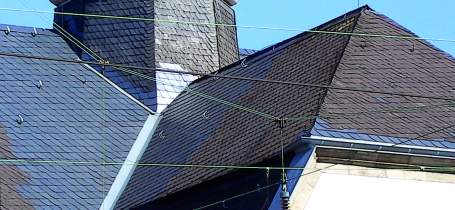
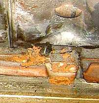

[🠔 Zur Übersicht: Dach](212baust.md)  
# 3. Schiefer und Tondachziegel
**Altbautaugliche Verfahren und Baustoffe für Dachdeckungen. Dieser Artikel beleuchtet die Qualitätssicherung von Schiefer und Tonziegeln und kritische Aspekte schädlicher Materialbestandteile.**  
_von Konrad Fischer_

Altbautaugliche Verfahren und Baustoffe 
Kapitel 12: Dachdeckung und Dachkonstruktion 3 

 [München TV](http://www.cityinfotv.de/) Pressetalk 20:00 **"Einstürzende Flachbauten"** 
[Talk-Clip 6 min wmv 2,9MB Download](mtvclip1.wmv)) 
mit v.l.: Konrad Fischer, SZ: Red. Christian Schneider, TV-Moderator Christopher Griebel, FOCUS: Red. Christian Sturm, BYAK: Vorstand Rudolf Scherzer 
aus tragischem Anlaß - mit bisher nie gesehenem (!) Filmmaterial vom Einsturz Dachau 1999, spannender und kritischer Diskussion betr. Hintergrundinfos, Ursachen und Folgen der Einsturztragödien allerorten.

Worauf kommt es an bei der Qualitätssicherung von "Naturbaustoffen" für eine dauerhafte Dachdeckung? Nicht nur auf erstklassige Verarbeitungskunst, sondern zuallererst mal auf das verwendete Material! Hier liegt vieles im Argen. Die gewinnorientierte Interessensgemeinschaft der Schieferhauer hat es doch selbstverfreilicht geschafft, auch fragwürdigste Schadstoffgehalte noch in den Toleranzrahmen des "Zulässigen" aufzunehmen. Was muß der Schieferkunde dazu wissen? Allerhand, wie dieser Auszug aus dem Schieferlexikon (siehe [Schieferforum.de](http://www.schieferforum.de)) beweist:

_"Calcit (Kalziumkarbonat, Kalzit) - CaCO 3 - gehört in die Gruppe der Karbonatminerale. Karbonat reagiert mit Salzsäure. Das in der Atmosphäre enthaltene Kohlendioxid kann Karbonat in Hydrogenkarbonat umwandeln und dieses ist wasserlöslich. Wird Hydrogenkarbonat abgeführt, kann dies zu Gefügeauflockerungen und bei hohen Gehalten zur Zerstörung der Schieferplatte führen. Bei Anwesenheit von Eisensulfid kann auch Gips gebildet werden. Dieser hat ein höheres Volumen und somit kann es zu Gefügeauflockerungen kommen. ... Karbonat ist im sauren Regen, d.h. in industriell belasteten Niederschlägen löslich. Die Lösung von Karbonat kann zur Aufrauhung der Spaltfläche, zu Gefügeschäden, d.h. zur Verminderung der Biegefestigkeit führen. Infolge höheren Kalzium-Angebotes wird die Bewuchsfreundlichkeit des Schiefers durch Moose und Flechten begünstigt. Weiterhin kann es zur Erhöhung der Wasseraufnahme und zur Veränderung des Verhaltens im Frost-Tau-Wechselversuch führen."_ 

Auch der Gehalt von folgenden schädlichen Bestandteilen im Schiefer sollte bei der Materialauswahl beachtet werden: 

_"Eisensulfide: Das sauerstoffreduzierte Bildungsmilieu von Schiefer fördert die Entstehung von Eisensulfiden. Die Hauptvertreter sind Pyrit (kubisch, FeS 2), Markasit (rhombisch, FeS2) und Pyrrhotin/Magnetkies (FeS). Eisensulfide können mit Wasser schweflige Säure oder Schwefelsäure bilden, die wiederum eventuell auftretende Karbonate oder Glimmerminerale angreifen können und somit die Festigkeit eines Schiefers herabsetzen. 

Ein weiteres Phänomen ist die Braunfärbung des Schiefers durch die Bildung von Eisenhydroxiden. Die einzelnen Eisensulfidvertreter zeigen ein unterschiedliches Verwitterungsverhalten. So ist Pyrit stabiler als Markasit oder Magnetkies. Weiterhin ist entscheidend, wie die Eisensulfide im Gesteinsverband auftreten: kleine, gut kristallisierte Pyrite verwittern oft nicht. Letztendlich ist das Verwitterungsverhalten von Eisensulfiden nicht zweifelsfrei geklärt, zumal die Witterung bzw. das Klima in den unterschiedlichen Regionen sehr verschieden sein kann. ... 

Kohlenstoff (Corg.): kann in Form von Bitumen, fossiler höherer Kohlenwasserstoffe und amorphem Kohlenstoff auftreten. ... Die bituminösen Verbindungen können durch Oxidation zur Aufhellung eines Schiefers führen."_ 

Doch was gönnen einem manche Schieferdecker, ja, schlimmer noch, auch manche "Planer" von Schieferdeckungen? Eine ungebührliche Bevorzugung von bestimmten Provenienzen nach dem dafür bestens bekannten Motto: _"Hat sich bei uns bewährt!"_ Und entsprechend Ausschreibungstexte, die jeder VOB-Forderung nach korruptionsfreier Produktneutralität Hohn sprechen. Etwas so: _"Allerfeinster und allerbester und überhaupt 1a-mit-Stern-Schiefer aus deutschen Fluß- bzw. Gebirgslandschaften bzw. am besten gleich aus der Lieblingsgrube meines alten Freundes und Kupferstechers Müller-Meier-Schulze oder gleichwertig!!! Angebotenes Material: ..."_ - aber wehe, wenn da nicht das o.g. Lieblingsprodukt steht! 

Wirklich wichtig wäre es aber gewesen, den Gehalt der schädigenden Schiefer-Bestandteile zu regieren, nicht die Herkunft. Und da somit über die höchst unterschiedlichen Qualitäten des Naturprodukts "Schiefer" in der Praxis kaum vertieftes Wissen die Planung und Ausführung derartig schöner und im besten Fall langzeitbewährter Deckungen mit - je nach Mindestdachneigung - verschiedenster Deckarten von der Einfachschablonendeckung und altdeutschen Deckung über die die deutsche Schuppenschablonendeckung zur deutschen Schuppenschablonendoppeldeckung oder gar altdeutschen Doppeldeckung mit scharfem Hieb - bestimmt, kommt, was eben kommen muß: 

Fast alles entscheidet der Preis. Und dazu gehören selbstverständlich auch die Weihnachtspacketelchen für die treuen Freunde rheinischer oder spanischer Weinkistchen. Daß hier auch allerlei "Mitarbeiter" in kirchlichen und staatlichen Baubehörden zum bevorzugten Empfängerkreis - übrigens nicht nur von geeigneten Alkoholika, sondern auch anderer Kuvertüren zur Dämpfung allerpeinlichester Gewissensschmerzen gehören, ist hin und wieder der Lokalpresse zu entnehmen. 

Folge dieser bautypischen Gemengelage aus Dummheit, Bosheit und Gier: Die bauherrenseitige Freude am neuen, "billigen" oder herkunfttypischen Naturschieferdachs aus besten in- oder ausländischen Weinbaugebieten oder derem näheren oder weiteren Umfeld kann von überraschend kurzer Dauer sein. Fragen Sie Ihren Schieferdecker! 

Leider kämpfen die deutschen Gruben nicht nur wie nahezu alle Baustoffproduzenten durch "vertreterstimulierte Einflußnahmen" um's Überleben, nein, sie glauben, auch ausländische Billigware als Schieferdeckung unter möglichst phantasievollen und über die Materialqualität bestimmt rein garnix aussagenden Produktnamen verhökern zu müssen. Dabeisein ist ja alles heutzutage, da stellt man sich freilich nicht nur ein, sondern auch mal zwei Bein. Der dummgemachte, dummgehaltene und betrogene Kunde will's ja unbedingt so haben. Ob das gutgeht? Na ja, am Ende dann halt ein chinesischer Grabstein druff. Von zarten Kinderfingernägeln gefertigt und gar zierlich ausgemeißelt. Auf dem Friedhof ist eben Platz für alle unsere Sünden. Christliche Handwerkskunst, wo bist du nur geblieben?

Ein Urteil des OLG Koblenz vom 20.8.2009, Aktenzeichen 1 U 290/09 zeigt auf, was einem unter Schieferdeckern blühen kann: 

Da soll ein Kirchendach mit einer spezifischen Schieferqualität gedeckt werden. Der Schieferdecker bietet das mal so an, bekommt den Auftrag und deckt dann einen ganz anderen Schiefer "seines Vertrauens" dem Herrgott zur Ehr, dem Regen zur Wehr. Der Kunde kommt ihm auf den Beschiß,bezahlt die Rechnung für die falsche Deckung nicht und verlangt logischerweise Austausch gegen das bestellte, angebotene und vertraglich vereinbarte Material. Jetzt wird der Schieferdecker frech und patzig und behauptet, daß sein Lieblingsmaterial doch auch gut wäre und außerdem der Austausch unverhältnismäßig und deswegen die Forderung ohne Relevanz. So läßt der schlaue Handwerksmann er seinen mehr als überraschten Kunden im Regen stehen. Der aber gibt nicht lange die beleidigte Leberwurst, sondern läßt flugs einen anderen Schieferdecker das unbestellte Material gegen das bestellte austauschen - Ersatzvornahme - und rechnet seine diesbezüglichen Überraschungs-Baukosten gegen den Werklohnanspruch des komischen Schieferdeckers auf. Zu Recht! urteilt das Oberlandesgericht Koblenz und spannt dem reingelegten Bauherren den Rettungsschirm auf und urteilt: 

Einmal habe es sich bei dem vertraglich vereinbarten Material um ein durchaus bestens bewährtes Material gehandelt habe, so daß auch rein garnix für dessen Austausch so mirnixdirauchnix spreche. Und dann habe der schöne Schieferdecker und Unternehmer schuldhaft, ja sogar vorsätzlich gegen die vertragliche Beschaffenheitsvereinbarung verstoßen. Wo kommen wir denn dahin? Wer bewußt, ja sogar vorsätzlich gegen eine vertragliche Beschaffenheit verstoße, könne sich nachträglich nicht mehr darauf berufen, daß die Mangelbeseitigung unverhältnismäßig sei, selbst wenn er ein frecher handwerksmeister wäre. Punktum. [Nach Info Recht 09/2011, [RAe Heinicke und Kollegen](http://www.heinicke.com/)] 

Hier mal die Anforderungen an gutes Schiefermaterial in Tabellenform - für alle Bauherren, Planer und Schieferdecker, die es wirklich wissen wollen: 

### Qualitätsanforderungen an Schiefer

1. Anforderungen zu den Grenzwerten der im Naturbaustoff Schieferstein möglichen Problembestandteile / Schadstoffe 

Schadstoffe Grenzwerte/Vorgaben Schadensrisiken 
Kohlenstoffgehalt max. 2%, keine bituminösen Anteile bituminöse Anteile können an den Rändern durch Oxydation zu Ausbleichungen führen 
Eisensulfide können die Verwitterung fördern 
- Markasit max. 0,1% können zu Braunfärbung führen 
- Pyrrhotin max. 0,1% können die Festigkeit herabsetzen 
Karbonatgehalt 
- Kalziumkarbonat (CaCO3) max. 1% kann zu porösen Oberflächen führen, die die Verwitterung fördern, kann Gips bilden 
- Ankerit Ca(Fe²,Mg, Mn)(CO3) max. 1% begünstigt Wachstum von Moos und Flechten, erhöht die Wasseraufnahme 
- Eisenkarbonat (FeCO3) max. 1% kann zu nachteiligen Veränderungen im Frost-Tau-Wechsel führen, übermäßige Oxydationsrisiken, kann zu Verfärbungen führen 

2. Sonstige Qualitätsanforderungen 

Eigenschaft Grenzwert 
Nenndicke 4 – 6 mm 
Maßhaltigkeit max. 3 mm Abweichung 
Biegefestigkeit mind. 40 Megapascal 
Wasseraufnahme unter 0,6 Masseprozent 
Ebenheit max. 0,9% Abweichung 

Und abschließend noch ein Wort zum Erneuerungswahn. Wer kennt ihn nicht, den Stirnrunzelblick des in seine Kluft getrachteten Dachdeckermeisters, wenn er eine alte Deckung begutachten soll. Hach, was kann nicht alles in ca. 8-10 Jahren passieren, selbst wenn noch kein einziges selbst klitzekleines Löchlein in der Dachfläche zu erspähen ist. Und ein paar calcitisch-zementäre Ausblühungen an der Unterseite der Dachziegel von vielleicht sogar seinen eigenen Zementmörteleien an der Firstvermörtelung (s.u.) lassen solche Hampelmänner lustvoll aufstöhnen - Ne, dat muß runner, aba flotti! Muß es aber gar nicht. Nein, und nochmals nein - es geht immer !!! auch anders. 

 
_Alte Schieferdeckung, an den Problemflächen, Graten, Traufen und Firsten fachmännisch von gutem Schieferdecker repariert bzw. mit neuem Schiefer ergänzt. Geht doch!_

Und kann man Dachdeckern eigentlich trauen, die einem die Bude einplastifizieren mit ihren Folien unter und über der Sparrenebene und die Sparren mit schimmelpilzeckligen Feuchtesauf-Fasern verstopfen und was weiß ich noch für andere "Energiespar"-Schweinereien auf Lager haben? Und vor allem niemals den Kunden wirtschaftlich korrekt beraten und pflichtgemäß auf die gegebenen konstruktiven (Massivdämmung) und baurechtlichen (EnEV-Befreiung) Alternativen hinweisen? Die Antwort müssen Sie schon selber geben. Linktipp: [Probleme der Dachdämmung](21316bau.md) 

Also Dachbesitzer, aufgepaßt! Jede Dachfläche ist erst mal grundsätzlich reparabel. Und dann kommt es eben auf eine kritische und interessenslose Beurteilung der Gesamtsituation an, ob man Dachflächen umdeckt, ein paar Teilflächen im ganzen erneuert und das dort geborgene Deckmaterial zum Ausflicken woanders nutzt, wegen ein paar Schieferlücken kein großes Trara macht und einfach nachsteckt, selbst wenn die Nagelung schon leicht angerostet ist. Tipp: Man kann auch nachnageln! Und selbst wenn tatsächlich rundum neugeschiefert bzw. neugedeckt werden muß. Und warum nicht die alte Lattung, die alte Schalung - soweit tragfähig - wieder mitverwenden? Selbst wenn der Lattenabstand nicht mehr genau paßt - es gibt ja Schiebeziegel. Und ein wirklich guter Dachdeckermeister bzw. Schieferdecker wird seinen Kunden nüchtern auf die gegebenen Reparatur- und Einsparmöglichkeiten hinweisen und mit viel Geschick eine preisgünstig-bestandserhaltende Reparatur durchführen, daß man ihm darob die Füsse küssen könnte. Und schon deswegen auf Bestandserhaltung dringen, weil ein altes Ziegeldach und eine alte Schieferdeckung tausendmal schöner sind und hunderttausendmal mehr Atmosphäre verbreiten - selbst mit noch so vielen Flicken, als das neue Geglänze. Verstanden? 

**Themenwechsel**

Wie funktioniert eigentlich ein Tondachziegel? Wichtig sind vor allem seine werkstofftechnisch und bauphysikalisch überlegenen Eigenschaften:

1. Wärme- und Holzschutz 
Ein Tondachziegel ist speicherfähig und kann eingestrahlte Sonnenenergie "nutzen". Die nach innen abgestrahlte kostenlose Energie erhöht die Temperatur der Sparrenebene und wirkt dadurch gegen tierischen und pflanzlichen Holzschädlingsbefall. Gut, das kann jeder massive Dachstein, aber jetzt kommt's:

2. Feuchteschutz 
Gleichzeitig zeigt der Tondachziegel überlegene Qualität im Feuchteschutz. Nur er hat ein vom Baustoffinneren nach den Außenoberflächen zunehmendes Porenvolumen. Ein erfreuliches Ergebnis des Brennvorgangs. Da die Kapillarfeuchte immer nur von Grob- zu Feinpore möglich ist, ergibt sich daraus folgende "Funktion":

Bei Beregnung von außen füllt sich das"obere" Porensystem des Ziegel schnell kapillar bis zum "Kern". Nach der Porenfüllung ist der Ziegel nahezu "dicht" gegen Kapillartransport. Bei weiterer Beregnung fließt das Regenwasser über den gefüllten Poren weg in Richtung Rinne. Nur die so gut wie nicht vorhandene "drückende" Feuchte könnte den Tonziegel vom "Kern" in Richtung Dachraum verlassen. Baupraktisch unmöglich. Die gerade bei Regen erhöhte Luftfeuchte im Unterdach kann in die unterseitigen Ziegelporen ebenfalls bis zum Kern einwandern, ohne als tropfbare Feuchte an der Unterseite die Dachkonstruktion zu gefährden. Nach dem Regen trocknet der Ziegel dann unproblematisch und schnell von der Oberfläche her ab. Und die oberflächlich trocknenden Poren "saugen" dann zum Feuchteausgleich das restliche Porenwasser aus dem Inneren. Wenn nicht durch die bauschädliche Vollsparrendämmung der Lüftungsquerschnitt des Unterdachs "wegrationalisiert" wurde. Vorsicht vor sog. Bauphysikern im Sold des Dämmstoffwahns! Der Tonziegel funktioniert demzufolge als effektive Pumpe, die sowohl Regen- wie auch Kondensatfeuchte gefahrlos aufnimmt und wieder abgibt. Der perfekte Feuchteschutz, seit tausenden von Jahren. Bei unterschiedlichen Farbgestaltungsmöglichkeiten werden auch die feuchtetechnischen Eigenschaften des Dachziegels beeinflußt: 

**Farbgestaltung** **technische Folge** 
naturrot beste Wasseraufnahmekapazität, schnellste Trocknung, höchste Kapillarität 
gedämpft wie naturrot 
engobiert geringere Wasseraufnahme und Trocknungsgeschwindigkeit, kleineres Kapillarsystem 
glasiert von oben relativ dicht, verringerte Wasseraufnahme, verzögerte Trocknung, erhöhte Ausblühungsgefahr, schon millionenfach überraschende Schleierbildung bei bleifreien Glasuren, neigt zur Oberflächen-Rißversprödung 
gesintert Glasartige Materialstruktur, keine Kapillarität, Kondenswasser kann im Unterschied zum echten Ziegel antropfen und somit die Dachkonstruktion feuchtetechnisch gefährden 

Das DAB 12/01 geht auf das Feuchte- und Frostproblem bei "oberflächenvergüteten" Tondachziegeln ein: 
_"**Engobierte Dachziegel** 
Frostschäden

Helmut Künzel

Dachziegel werden auch engobiert angeboten, meist mit einem dunkleren Farbton. Dass die Engobe auch Auswirkungen auf den Feuchtehaushalt der Ziegel haben kann, wird dabei nicht berücksichtigt. Unter ungünstigen Bedingungen können Frostschäden die Folge sein.

Sachverhalt

Bei einem Dach, das zum Teil mit roten, unbehandelten und zum Teil mit dunkel engobierten Tondachziegeln des gleichen Fabrikats eingedeckt ist, sind nur bei den engobierten Ziegeln Frostschäden aufgetreten, die durch Absprengen der oberen Ziegelschicht, vorzugsweise im unteren Bereich der Ziegel in Erscheinung treten.

... die Engobe [wird] vor dem Brand nur auf die Oberfläche aufgebracht. ... beim engobierten Ziegel [ist gem. Testergebnis] die Saugfähigkeit der Oberseite deutlich geringer als die der Unterseite, während beim unbehandelten Ziegel nur geringe Unterschiede auftreten... Dies hat zur Folge, dass bei der Freibewitterung der engobierte Ziegel im Vergleich zum roten insgesamt höhere Feuchtegehalte annimmt, obwohl die Oberflächen-Saugfähigkeit bei diesem geringer ist als beim nicht engobierten, roten Ziegel. ...

Bei Beregnung nimmt ein Dachziegel - insbesondere eine Flachdachpfanne - nicht nur über die Oberseite Regenfeuchte auf, sondern auch von der Seite und von unten über die zur Wasserableitung eingeprägten Rillen, die eine höhere Saugfähigkeit haben als die Oberfläche. Da die Trocknung eines regennassen Dachziegel vorwiegend nach außen erfolgt, setzt ein Feuchtetransport nach außen ein, der durch die dichtere Engobe einen gewissen Stau erfährt. Im Wechsel zwischen Beregnung und Trocknung stellen sich daher beim eingobierten Ziegel insgesamt höhere Feuchtewerte ein. Deshalb ist die Gefahr der Frostschädigung bei engobierten Ziegeln größer als bei Ziegeln, die nicht die "Unsymmetrie" der Feuchteeigenschaften zwischen oben und unten aufweisen ...

Stellungnahme

... Bei dichteren Schichten, insbesondere auch bei Glasuren, sollte ... die Möglichkeit einer Schädigung durch die beschriebene Unsymmetrie nicht außer Acht gelassen werden. Man darf hier nicht nur die Optik bewerten, sondern muss auch die Bauphysik berücksichtigen."

_ Was macht nun die Ziegelindustrie! Richtig - sie bringt ständig neue Engoben und Glasuren auf den Markt. Der Kunde will es ja so haben. Und wo ist die korrekte Fachberatung? Ja, sowas gab es früher mal (und in manchen Ausnahmefällen sogar noch heute...) 

Und wie sieht es mit dem feuchterückhaltenden Betondachstein und seiner ungünstig homogenen Porenstruktur aus? Wer kennt nicht das feuchteanlagernde Bindemittel Zement mit seinen hygroskopisch wirkenden Schadsalzen? Was ergibt sich nun, wenn die oberflächliche Abtrocknung des reichlich als Porenwasser im Dachstein eingelagerten Kondensats durch Kunstharzbeschichtung gestört ist? 

Richtig: Überschwemmung. Falsch, da baupraktisch wirkungslos: Trocknung durch Dampfdiffusion. Wo wäre denn das Männchen mit Tauchsieder, der das tiefsitzende Porenwasser, wg. seiner Dipolbauweise an der gegenpolig geladenen Porenwandung recht fest anhaftend, verdampft? Das klappt eben nur direkt an der luftberührten Oberfläche. Und dort hat der Ziegel gottseidank die größten Poren, d.h. die größtmögliche Verdunstungsleistung. Wer darüber nachdenken will, überlege sich mal, was einem gedeckelten Topf mit kochendem Wasser so alles passiert. Na also! Nun wird vielleicht klar, warum wasserabweisende Beschichtungen über der verdunstungswilligen wassergefüllten Pore "abgehoben" werden. Es grüßen die Alkyd- und Dispersionsfarben, aber nicht nur die. 

Und die "Bauphysik" nach Künzel zu berücksichtigen ist auch im weiteren Dachsystemaufbau gar nicht gefragt. Wie kämen sonst abenteuerlichst "unsymmetrische" Konstruktionsbestandteile wie intelligente Dampfbremsen, sonstige Folien, Bitumenpappen und kaschierte Papiere sowie kapillartrocknungsblockierendste Schäume, Flocken, Granulatschüttungen und Gespinste in die Dachkonstruktion, am besten gleich als "versiegelte Vollsparrendämmung"? Wirklich nur, um die Taschen der Dämmstoffschlawiner zu füllen, möglichst nachhaltig Folgearbeiten betr. Sanierung der Sanierung mit alle Jahre wieder allerneuestem Baushit vorzuprogrammieren usw. usf.? 

Nun gibt es einige Dachziegelfabrikate, die im ersten Gebrauchsjahr geringfügige Wasserdurchdringungen zulassen. Dies hat mit etwas gröberer Rohstoffbasis zu tun, was üblicherweise durch Zuschlag des feinen Westerwälder Tons "bekämpft" wird. Obwohl diese Anfangsdurchlässigkeit regelmäßig innerhalb eines Jahres durch bewitterungsbedingte Porenverstopfung abgebaut wird, tränken diverse Hersteller ihren Dachziegel mit Kunstharz. Ein ausgemachter Unsinn, der das um sich greifende KO-Denken der Fabrikationsstätten belegt. Marketingfuzzis ersetzen den gewachsenen Sachverstand der alten Ziegler. Bis die Branche kaputt ist. Hoffentlich gibt es genug Arbeitsplätze im Ausland. 

Noch besser gelingt die Veräpfelung des Kunden mit dem Lotuseffekt, dessen Geniestreiche an der Fassade Sie hier nachlesen können: [Auszug aus Fachpresse](2lotus.md). Natürlich läßt es sich auch die Ziegelindustrie nicht nehmen, Kunden mit diesem Kleister zu begeistern und schmeißt sozusagen künstlich verharzte und materialmäßig "optimierte (pervertierte?) Dachziegel" auf den Markt. Dem Kunden wird dabei bessere Schmutzabweisung versprochen. Sollen wir künftig von der Dachfläche speisen können? Dachziegel sollte man diese Kunstharzplatten jedenfalls nicht mehr nennen. 

Wie diese wachsige Kleisterschicht namens "Lotus" den gängigen mechanischen, thermischen und hygrischen Beanspruchungen am Dach dauerhaft gewachsen sein soll, vermag sich ein erfahrener Dachdeckermeister ohnehin kaum bzw. sehr gut vorstellen. Ist das ganze Brimborium wieder mal nur ein schnöder Werbeeffekt?

3. Nachhaltigkeit 
Der traditionelle und von Laborerfindungen verschonte Tondachziegel ist wohl das "nachhaltigste" Deckungsmaterial. Mit wenig Energieaufwand auf's Dach gebracht, dieses nicht durch ungünstige Eigenschaften dauerhaft schädigend und im Reparaturfall einfach auszutauschen - was will man mehr? Für die Dachziegelwerke einerseits schade, andererseits die besten Werbeträger sind die vielhundertjährigen Ziegeldachflächen, die unseren alten Bauwerken, ja ganzen Stadtbildern ihren unverwechselbaren Gemütswert schenken. Und so einfach mit wenig Neumaterial über weitere zig Jahre erhaltbar sind. Wenn nicht ein kluger Bauherr oder kostentreibender Planer alles runterschmeißen läßt. Aber: auch erhaltene Dachziegel gehören doch zur honorartechnisch berechenbaren "mitverwendeten Bausubstanz" gem. HOAI § 10 (3a)! Und wenn es um die Identifizierung der alten Ziegel und bei Fehlstellen oder ihrer häufiger erforderlichen Lüfterziegel-Ergänzung um passende Neuziegelformate für ausgelaufene Modelle geht, liefert das [Dachziegelarchiv online](http://dachziegelarchiv.de/) beste Dienste. Ein wahrer Schatz an historischen und technischen Informationen! 

Bei der Instandsetzung der Dachfußschäden können die Ziegel oft flächig eingedeckt bleiben. Nur der Arbeitsbereich wird freigelegt, das offene Dach sichert man durch Schutzdachüberbauung von der Gerüstarbeitsfläche bis zur 1. Kehlbalkenebene. Das fördert Winterbau und spart viel Geld. Selbstverständlich werden die abgenommenen Ziegel bis zur Wiedereindeckung zwischengelagert. Vielleicht sogar im Dachraum.

**Dachziegel im Mörtelbett**

Ein grober Fehler: Dachziegelvermörtelung mit zementhaltigem Mörtel. Nur reiner Luftkalkmörtel ist hier richtig. Er 
- liefert keine hygroskopisch wirkenden bauschädlichen Salze (Aluminate, Sulfate, Ettringit, Thaumasit, ...), die den Ziegel im Zusammenhang mit der wasserrückhaltenden Wirkung des Zementmörtels dauerhaft schädigen und sich mit Gipsbestandteilen im Ziegel zu Treibmineralien verbinden; 
 
_Bild: Die lokal an der Ziegelunterseite ausblühenden Auswaschungsrückstände des First-Zementmörtels zerstören die unterseitige Oberfläche der Ziegel. Calcit-Versinterung (Kalkkarbonat) lagert sich zunächst unschädlich (aber abdichtend) an, die C 3A-Bestandteile (Aluminate) sorgen für zerstörerisches Treibmineral bzw. Frostaufsprengung. Der Ziegel hält es noch einige Jahre aus, manch Handwerker wird aber gleich zur Erneuerung raten und droht mit "10 Jahre wird es vielleicht noch gehen"! Eine Neuvermörtelung mit Luftkalkmörtel - richtig rezeptiert mit perfekter Sieblinie, perfekter Weißkalkhydratzugabe, perfekter Optimierung durch Kalksaccharat, perfekter Anmischung, Verarbeitung und Abbindung selbstverständlich - wäre besser. Aber eine Handwerkskunst, die heute fast ausgestorben ist._ 

- hat mangels Überhärte keine Neigung zur kapillaraktiver und wasserrückhaltender Rißbildung, zu Flanken- und Flächenabriß; 
- blockiert durch seine Dauerelastizität und ziegelverträgliche Temperaturdehnung nicht die erforderlichen Bewegungen der Dachhaut im Jahresablauf, d.h. wesentlich geringere Riß- und Bruchgefahr für die Deckziegel als beim Zementmörtel, der aufgrund mehrfacher Wärmedehnzahl gegenüber dem Ziegel unvermeidbar aufreißt (Link: [Wärmedehnzahl/Temperaturdehnung von Baustoffen](29bausto.md#temperaturdehnung)). 

Ein Beispiel dafür die zementär vermörtelte Mönch-Nonnen-Deckung St. Jakobs in Straubing: bei vielen Deckpartien riß der Deckmörtel einseitig von den Decksteinen ab, sodaß nur die Sturmklammern den Absturz ganzer Ziegelsteine verhinderte. Andere Deckflächen klebte der Zementmörtel in großformatigen Platten zusammen. Diese rissen dann bei den unvermeidlichen Bewegungen an den Flächengrenzen mitten in den Ziegeln auseinander; 
- sichert das ziegeltypisch günstige Austrocknungsverhalten durch annähernd gleichen Trocknungsbeiwert nach Cadiergues (s = 0,28) wie Ziegel (0,25). Dazu im Vergleich Zementmörtel (s = 2,5), der schnell reißt, kapillar Wasser saugt, das Wasser lange zurückhält und dadurch den Ziegel mit Frost- und zementeignem Schadsalzangriff vorzeitig schädigt; 
- erleichtert gegebenenfalls erforderliche Auswechslungen, Reparaturen und Aufbereitung der Ziegel zur Wiederverwendung bei Umdeckung, da die Kalkvermörtelung mit wenig mechanischem Aufwand von den betroffenen Ziegeln gelöst werden können; 
- kann bei kalkentsprechender Handwerkersorgfalt als [Baustellenmörtel oder Fertigmörtel](2kalk.md) zum Einsatz kommen (Vorsicht vor [Falschverarbeitung](2kalkfel.md) und undeklariert hydraulisierten Pseudokalkmörteln mit wasserrückhaltenden Zusätzen wie Zellulosen). 
- muß aber ebenso wie bei üblichem Kalkzementmörtel sauber verarbeitet werden, sonst versaut die Ziegeloberfläche und muß dann mühselig nachgereinigt werden. Wobei ganz lumpige Handwerker dann dafür zu sauren Reinigungsmitteln greifen, diese nach Absäuerung der Ziegeloberfläche vom Kalk nicht richtig auswaschen bzw. neutralisieren und so ein schreckliches Depot von Reaktionsergebnissen im Ziegelscherben hinterlassen. Das kann bei Salpetersäure im Reinigungsmittel Mauersalpeter / Kalksalpeter / Kalknitrat sein, bei Schwefelsäure Kalksulfat / Gips, und diese hygroskopischen Salze können dann ihr typisches Schadenspotential zuungsten des Ziegels ausleben: Die Ziegeloberfläche springt ab, vermorscht und zermürbt - alles Ergebnis der Salzsprengung dank falscher Säurenreinigung. Am Ende hat man ein blätterteigartiges Zerstören des ganzen Ziegels vor sich und schiebt das einem Fehlbrand zu. Soweit hinreichend schwachverständig schlechtachtend ... 

Hier weiter: [4: Betondachstein](212bau4.md)
