[🠔 Zur Übersicht: Dach](212baust.md)  
# 4. Der Betondachstein, Asbestzementschindeln und Wellplatten
**Der Betondachstein, Asbestzementschindeln und Wellplatten - Probleme mit Durchfeuchtung und Haltbarkeit.**  
_von Konrad Fischer_

## 12. Dachdeckung und -konstruktion 4

**München TV** Pressetalk 20:00 **"Einstürzende Flachbauten"** [Talk-Clip 6 min wmv 2,9MB Download](mtvclip1.wmv)) 
mit v.l.: Konrad Fischer, SZ: Red. Christian Schneider, TV-Moderator Christopher Griebel, FOCUS: Red. Christian Sturm, BYAK: Vorstand Rudolf Scherzer 
aus tragischem Anlaß 

Schon seit 1897 werden die traditionellen Deckmaterialien durch unerhörte Versprechungen verdrängt. So warb ein gewisser Hermann Schneefuss für Betondachsteine in Zeitungsanzeigen wie folgt: _"Cementwaarenfabrik von Herm. Schneefuss, Winsen a.d.L. empfiehlt als zweifellos festes, wetterbeständiges und sturmsicheres Dach imprägnierte Cementdach=Doppel=Falzziegel. Verbessertes System! D.R.G.M. No. 20264. Gewicht eines Quadratmeters 40kg. [...] Besondere Vorzüge der Ziegel: 1. Absolute Widerstandsfähigkeit gegen Temperatureinflüsse. 2. Vollständige Dichtigkeit gegen Regen und Schnee. 3. Trockenbleiben des Futters wie unter Strohdach. 4. Flache Dachneigung, weniger Latten, große Leichtigkeit."_ 
aus: Rolf Wiese: Kleine Zementwerke und deren Produktionsprogramm auf dem Lande, vorgestellt anhand ausgewählter norddeutscher Beispiele. In: Ländliches und kleinstädtisches Bauen und Wohnen im 20. Jahrhundert, Jahrbuch für Hausforschung Band 46, Jonas Verlag Marburg 1999. 

Auch hier gilt, daß moderne Ersatzbaustoffe wie Betondachsteine immer für unangenehme Überraschungen gut sein können. In der klimatisch besonders problematischen Alpenregion laufen inzwischen Austauschprogramme an Kirchen mit Neudeckung in Tondachziegel. Die in den 60ern bevorzugten künstlichen Dachsteine - Betonziegel, Betondachsteine, oder auch Betondachziegel genannt - haben sich inzwischen oft und immer öfter als denkbar ungeeignet erwiesen, ein Dach langfristig gegen Regen zu schützen. Ihre ungünstige Porenstruktur sorgt eben für erhöhte Wasserrückhaltung und Kondensationsfeuchteanlagerung. Außerdem lassen sie nach einiger Zeit den Regen durch. Das hat dann zwangsläufig zu Nässeschäden an den Holzdachstühlen gesorgt. Wie das Problem der Alterung durch Brechen, Zerreissen, Abbröseln und Aufscherbeln bei miesen - einst rot beschichteten! - Betondachsteinen aus dem Jahre 1985 aussehen kann, zeigt dieses schreckliche Beispiel eines geplagten Hausbesitzers aus Baden-Württemberg - Pech gehabt, Garantie abgelaufen!: 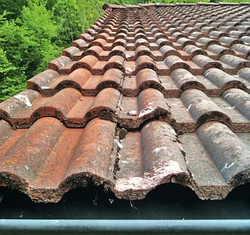 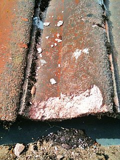 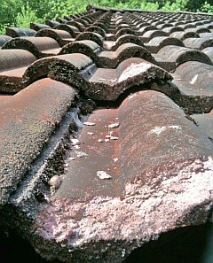 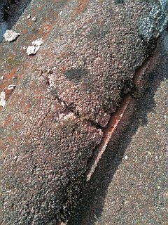 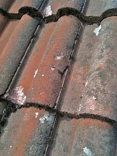 

Bekannterweise hat ja Betonstein eine wesentlich höhere "Fähigkeit" zur Wasserrückhaltung als Ziegel. Das dürfte auch heute noch gelten. Gesteigert wird das noch durch Kunstharzbeschichtungen, die Durchfeuchtung durch alterungsbedingte Kapillarrisse und unterseitige Kondensation nicht unterbinden, sondern steigern können (s.u.). Wissen das nun die Dachdecker nicht? Doch, die wissen das. Und warum verraten sie das dem Kunden nicht? Weil der vom Dachdeckermeister seines Vertrauens bzw. seines Kegelvereins nach besten Kräften "bedient" werden will? Weil er sich totsparen will und dabei Dachdeckerhilfe braucht? Oder warum? 

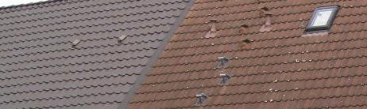 
Der direkte Vergleich zeigt es nach kurzer Zeit: Betondachsteindeckung naß versaut, Algenbewuchs und Flechten fest im Anmarsch, daneben der Nachbar darf ein gutes, trockenes und schönes Ziegeldach sein eigen nennen. Allerherzlichsten Glückwunsch!

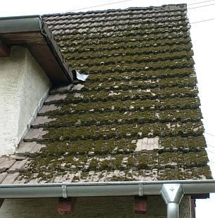 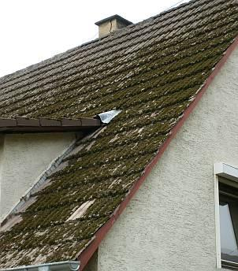 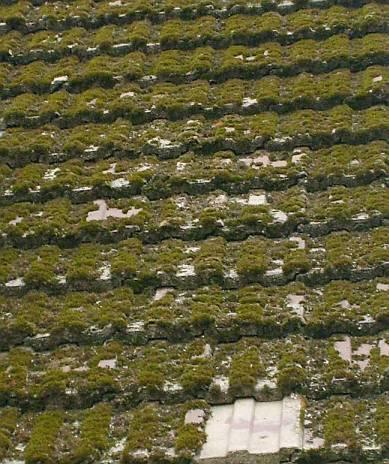 

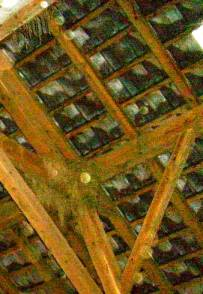 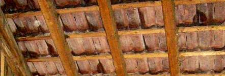

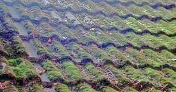 
Herrlich, wie öko-logisch durchgeregnete Betondachsteine den Moosbewuchs und das Durchnässen von Dachstühlen / Dachkonstruktionen fördern. Da schlägt mein naturschutzbundes Ökologenherz im Biorythmus! Bitte keinen Holzschutz unter solch nassfeuchten Dächern! 

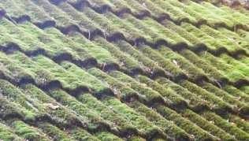 
Ob man da in ein paar Jährchen auch schon Torf stechen kann? Wo doch das Erdöl so knapp wird! (oder [nicht](8buch22.md#gold)?) 

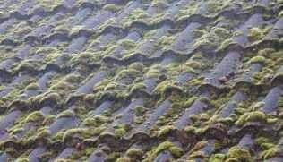 
Auf der gegenüberliegenden, besser besonnten Dachfläche ein bisserl später? 

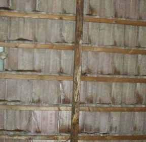 
Wahrscheinlich fällt aber vorher die Hütte zusammen, da das von der Unterseite der wasser- und moosgekühlten Betondachsteine bei eindringender Sommerfeuchtwarmluft abtropfende Kondensat (siehe dunkle Feuchtstellen) den Dachstuhl den Holzpilzen und -insekten zu schmackhaft machte. [Beton ](2beton.md)eben, der vollökologische Jahrhundertbaustoff. Na, das nützt den Holzschutzmittelherstellern. 

Schon nach ein paar Minuten Regen zeigt der Natur-Beton- oder angewitterte Beschichtungs-Betondachstein, was in ihm steckt - genug, daß die als Wind- Regen- und Schneedichtung so gutgemeinten Fugenvermörtelungen schnell wegfrieren: 

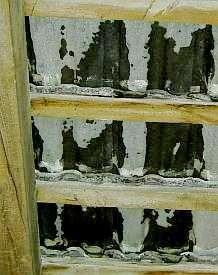. Da es manchmal aber länger als 10 Minuten regnet, kann schon auch der Dachboden aufnässen bis die Lehmdeckengefache dahinsuppen, die Konstruktionshölzer anmorschen 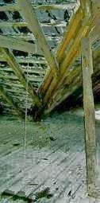 und rundholzkrückig unterstützt werden müssen. Das fördert Arbeitsplätze - in der Zimmerei und der Forstwirtschaft - das A+O aller unserer Bemühungen in der dahindarbenden Baubranche. 

Inzwischen gibt es Versuche, die Dauerauffeuchtung, die Bemoosung, das flächige Absanden und die damit verbundene Materialauflösung der künstlichen Dachsteine durch Acrylatbeschichtung - bevorzugt: ziegelrot (!) und in sonstigen Dunkelfarben einer Ziegelengobe - zu verringern. Einerseits ist das eine Maßnahme von begrenzter Dauer, die bei zunehmendem Schichtabtrag zur Farbveränderung bis zum Erscheinen der originellen "Betongrauoptik" führt. Ob dem mikrobiellen Besiedlungsdruck auf der Kunstharzschicht wie üblich durch beigegebene biozide Giftstoffe begegnet wird, und wenn, wieviel davon eingesetzt wird, ist vielen Produktinformationen noch gar nicht zu entnehmen. Warum wohl? Auch die kondensationsbedingte Feuchtebelastung wird damit nicht verringert - im Gegenteil, da das Acrylat die Kapillartrocknung an der sonnenbeschienenen Außenseite verhindert. Und das im Zusammenhang mit den ständig absaufenden Wärmedämmverbundkonstruktionen und Vollsparrendämmschäden. Diese zunächst den Kundenheini blendenden Beschichtungen verkrümeln sich über die Zeit, das Dach wird unansehnlich, der Betondachstein mehr und mehr wasseraufnahmefähig und letztlich undicht. 

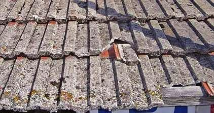 Ja, genauso zeigt sich das landauf und -ab. Die gute und hübsche Ziegelrotimitationsschlämpe versteckt sich verschämt im unbewitterten bzw. etwas weniger angegriffenen Überdeckungs- und Falzbereich. 

Manche Kunstharzbeschichter versprechen nun dem ahnungslosen Betondachgeschädigten, daß mit ihrer neuen innovativen intelligenzbestialischen Wunderpampe das Dach wie neu würde und quasi auf ewig im hellsten Licht der Sonne glänzend erstrahlen könne. Gerne glaubt der dachsteinabsandungsgeplagte Bausimpl solche Flötentöne und kauft, läßt irgendeine billig verschnittene Harzsuppe auf seine erodierte Steinbröselwüstenei schmieren oder spritzen. Was ihm nicht verraten wird: Die Schmiere wird nur von oben und lidschäftig aufgesuppt, die Überdeck- und Falzbereiche kann sie logischerweise nicht beschichten. Dort setzt dann die erneute Betonverwesung an. Außerdem: Ein Dach bewegt sich, es gibt in der Fläche mechanische Angriffe auf die Beschichtung, sie versprödet, durch Mikrorisse, unbeschichtete Flächen und auch durch unterseitiges Kondensat wird der Betonstein feucht und feuchter - und damit frostempfindlicher, zumindest für die Synthetikschwarte. Sie wird dann unterfroren - löst sich ab und erhöht die Schadenskorrosion am Zementbröselstein. Logisches Ergebnis des idealen Zusammenspiels zwischen Zement- und Kunstharzchemie. Gratulation dem betroffenen Bauherren - der durch eigenen Schaden klug wird - und bestimmt auf den nächsten Bauschwindel wieder mit Anlauf hereinfallen wird, oddä? Abwarten und Tee trinken.

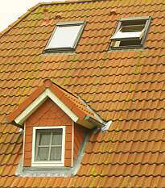So grün kann ein neues Betondachstein in Beschichtziegelrotoptik nach kurzer Zeit aussehen. Der sparsame Bauherr (ein ROTGRÜN-Wähler?) darf da seine heimelige Dachlandschaft mächtig gewaltig schrubben, wenn er nicht auf Naturgründach abfährt. 

In einer Veröffentlichung (Betonwerk+Fertigteil-Technik, 9/93, Seite 93: Peter Kresse, Bayer AG, **Farbänderungen bei der Bewitterung von pigmentiertem Beton**) stand als Forschungsergebnis einer Langzeituntersuchung von Betondachsteinen: 

_"In den ersten beiden Jahren der Freibewitterung ist im allgemeinen mit Ausblühungen zu rechnen, die die [farbbeschichtete] Betonoberfläche heller erscheinen lassen und eine Beurteilung der tatsächlichen Farbänderungen nicht erlauben.

Nach fünf Jahren Freibewitterung beginnt aber auch die Freilegung des Zuschlagsmaterials an der Betonoberfläche durch Erosion des Zementsteines, so daß die Bedeutung des eingefärbten Zementsteines immer mehr zugunsten des Beitrags zurücktritt, den die Farbe des sichtbar werdenden Zuschlagsmaterials zeigt.

Dann wird der Farbton des bewitterten Betons immer mehr von der Eigenfarbe des Zuschlags bestimmt. Schließlich kommt es auch zum Bewuchs mit Algen, Flechten und Moosen."

_

Im DAB 12/01 ergänzend: 

_"Helmut Künzel

**Mikrobiologischer Bewuchs auf Betonsteinen** 
Algen, Pilze, Flechten und Moose

Sachverhalt 
Jeder hat wohl schon die Beobachtung gemacht, dass Betondachsteine häufiger und stärker von Flechten und Moosen befallen sind als Tondachziegel. ...

Stellungnahme

... sind die Betondachsteine mit hoher Sorptionsfeuchte anfälliger für das Wachsen von Mikroorganismen als Ziegel. Der ... Ziegel hat zwar zeitweilig einen höheren Feuchtegehalt als der Betondachstein, er trocknet aber auch rasch wieder aus und kann dann einen sehr niedrigen Feuchtegehalt annehmen. Die Anfälligkeit von Stoffen für Mikroorganismen hängt somit nicht primär vom Verhalten gegenüber flüssigem Wasser (w-Wert) ab, sondern wesentlich vom Verhalten gegenüber Wasser in Dampfform (Wasserdampf-Sorption). ..."

_ 
Der Wasseraufnahmekoeffizient w (kg/m2h0,5) der Oberseite von Ziegel ist nach Künzel 2,8, von Betondachstein 0,1. Der Feuchtegehalt beim Ziegel ist aber deutlich unter 0,5 Masseprozent gegenüber 3-4 Masseprozent beim Betondachstein. Und darauf kommt es eben an. Zigfacher Unterschied in der Feuchtequalität. Daß diese Risikolage auch für alle anderen Fassadenbaustoffe, also Steine, Verkleidungen, Putze und Anstriche gilt, sollte klar sein, ist es aber wohl nicht. Deswegen werden dem gewitzten Bauherrn auch in diesem Bereich intelligente Lösungen vom brävsten Handwerk, intelligentesten Planern, oberklügsten Bauwissenschaftlern und der noch genialeren Industrie aufgeschwätzt. 

Interessant für den bauschadensvermeidenden Planer und Bauherrn ist in diesem Zusammenhang auch die technische Untersuchung einer staatl. anerkannten Prüfstelle von Frankfurter Betonpfannen und Tondachziegeln, aus denen sich folgende Unterschiede ergaben: 

Bei der **UV-Bestrahlung** gab es in der Untersuchung 
 * bei Betondachsteinen starke,
 * bei echten Ziegeln keine Farbveränderungen.
Die Prüfung der **Säurebeständigkeit** zeigte 
 * bei Betondachsteinen nach wenigen Stunden starke Zerstörung,
 * bei den Ziegeln noch nach 14-tägiger Einwirkung keine Veränderung.
Bei der Prüfung auf **Laugenbeständigkeit**
 * verfärbten sich die Betondachsteine nach 14 Tagen Einwirkung deutlich weißlich,
 * während die Ziegel ohne jede Oberflächenveränderung blieben.

Diese Ergebnisse waren unabhängig davon, ob die Proben zuvor befrostet wurden oder nicht. 

Um nun das selbstzerstörerische Verhalten von zementgebundenen Baustoffen besser zu verstehen, steigen wir noch ein kleinbisserl in die Zementchemie ein und betrachten die Bindung selbst. Als erstes bilden sich im hydraulischen Baustoff die [Calciumsililikathydrate (C-S-H-Phasen)](http://arnold-chemie.biz/archives/37). Sie haben eine fein genadelte Mikrostruktur und "verfilzen" die Mörtelbestandteile aus Kalkhydroxid, Zement und Sandzuschlägen zu einem sehr festen und dichten Gefüge. Soweit so gut, der zementäre Baustoff härtet aus und "versteinert". Kommt nun aber beim bewitterten Zementbaustoff der Regen dazu, bewirkt dessen Kohlensäureanteil eine Laugen-Säure-Reaktion: Das Kalkhydroxid bildet im nassen Bauteil eine wässerige Kalklauge, hinzu kommt die Kohlensäure und als Ergebnis fällt Kalkkarbonat - das Kalksteinkristall, eigentlich ein kohlensaueres Salz des Calziums aus. Und dieses Salzkristall ist nun nicht mehr feinnadelig, sondern eher plumpig und klumpig und zerdeppert deswegen das feinnadelig-spröde CSH-Bindungsgefüge. Das Zementbauteil beginnt deswegen, von der bewitterten Oberfläche her zu zermürben. Das ist es, was einerseits die nur begrenzte Haltbarkeit des [Stahlbetons](2beton.md) bewirkt - der zermürbte und dank Kohlensäurereaktion neutrale bis sauere Beton befördert das Verrosten des Betoneisens - und das Zersandeln oder auch Abscherbeln von sonstigen zementgebundenen Baustoffen wie Putz und Betondachstein. 

Ach ja, wir haben ja noch die Asbestzementschindeln und -wellplatten. Bitteschön: 

> 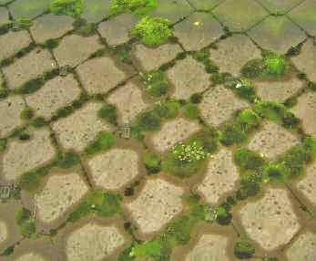 .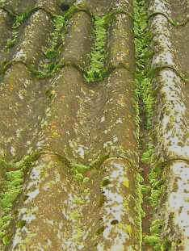 
> 

Die Verlegegeschwindigkeit und der Eindeckungspreis sind bei Dachdeckungsmaterialien also nicht der letztgültige Maßstab. Es kommt eben d'rauf an, was der Baustoff später macht. Und im Falle angepriesener, beliebter oder schon ewig bewährter Deckmaterialien muß das nicht unbedingt und immer zur Zufriedenheit des Bauherrn und seiner nachfolgenden Erben ausfallen. Leider geht die Dachziegelindustrie auch immer weiter weg von ihren bewährten Traditionen. Riesenplatten sind noch nicht dauerhaft bewährt. Und vollverklinkerte Scherben?

Weiter: [5: Ziegelnovitäten](212bau5.md)
