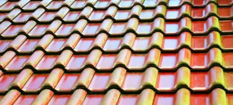
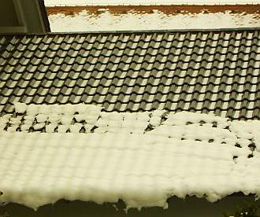
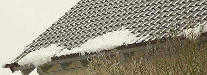

[🠔 Zur Übersicht: Dach](212baust.md)  
# Ziegelnovitäten - ein Fortschritt?
**Kritische Betrachtung von Ziegelnovitäten, insbesondere Glasuren, deren Qualitätsproblemen, ästhetischen Nachteilen und Funktionsmängeln bei Dachdeckung und -konstruktion.**  
_von Konrad Fischer_

## 12. Dachdeckung und -konstruktion 5

 [Talk-Clip 6 min wmv 2,9MB Download](mtvclip1.wmv)) 
mit v.l.: Konrad Fischer, SZ: Red. Christian Schneider, TV-Moderator Christopher Griebel, FOCUS: Red. Christian Sturm, BYAK: Vorstand Rudolf Scherzer 
aus tragischem Anlaß - mit bisher nie gesehenem (!) Filmmaterial vom Einsturz Dachau 1999, spannender und kritischer Diskussion betr. Hintergrundinfos, Ursachen und Folgen der Einsturztragödien allerorten.

## 5. Ziegelnovitäten - der letzte Schrei?

Hierzu paßte einst folgende Meldung in der Süddeutschen Zeitung 13.8.1999: 

**_"Qualitätsprobleme belasten Creaton_**

_**München**(Reuters) - Qualitätsprobleme haben beim Dachziegelhersteller Creaton im ersten Halbjahr 1999 zu einem Gewinneinbruch geführt. [...] Der Überschuss brach auf 0,2 ([1998] 3,5) Millionen DM ein. Der Umsatz ging auf 131,8 (136,3) Millionen DM zurück. Im Gesamtjahr werde der Gewinn deutlich sinken, sagte ein Sprecher. Eine Ursache für den Umsatzrückgang war nach Creaton-Angaben der harte Winter. Außerdem hätten Probleme bei der Herstellung des Ziegels "Magnum" im Werk III Großgottern dazu geführt, dass geplante zusätzliche Umsätze nicht erzielt worden seien."_

Tip: Lassen Sie Anderen den Vortritt bei derartigen Experimenten. Man hört von 30 Millionen geschädigten Ziegeln mit neuartiger Dünnschicht-Glasur, die nun durch seltsamste Schleierbildung vor sich hin protzen. Kommt es von Anhydritkristallisation, von ungenügender Glasphasenbildung mangels der bewährten Bleischmelze, wer weiß? Die Glasuren bestehen auch aus Glasfritten, sie versiegeln die Oberfläche, die dennoch von unten her durchfeuchtet wird. Und wohin sollen dann die lästigen Salzausblühungen ausblühen? Sie hinterdringen die Glasurschmelze und färben die neue Buntheit weiß. Es werden nun als Abhilfe flächig erscheinende, aber nur z. Teil echt abdeckende Glasuren angeboten, die den Feuchte- und Salzhaushalt weniger stören. Hoffentlich klappt das auch langfristig, viel Forschungsarbeit steckt da drin. 

Die neuen Buntheiten, die nicht nur nebenbei den schlechten Geschmack des Bauherrn weit über´s Land hinausposaunen, gehen bis zum Mäusepelzgrau echt antik am Ziegeldach. Dachgestaltung wie am Wiener Stephansdom oder dem Grünen Turm in Ravensburg ist bisher jedenfalls noch nicht dabei herausgekommen, oder? Und wie schreit man über ein bißchen natürliche Vergrünung und Flechtenbewuchs, die das historische Ziegeldach so unverwechselbar charmant machen!

Die durchgeklinkerten oder vollglasierten Ziegel sind aus traditioneller Sicht bestimmt nicht das Gelbe vom Ei. Mit der o.g. perfekten Beherrschung des Wassers aus Regen **und** Kondensat sowie allenfalsiger Salzausblühungen haben sie jedenfalls nix mehr am Hut.

Sollten Sie sich übrigens über Vergrünung von Dachziegelflächen wundern, schauen Sie mal unter die Ziegelfläche: Da finden Sie gar nicht so selten Folien, Dämmschichten oder sonstige trocknungsstörende Zutaten. So einfach kann das sein, neben windgeschützter Verschattung durch große Laubbäume oder Nachbarbebauung. 

  
_Glasierter Tondachziegel / Tonziegel / Falzziegel - trotz teuerster wasserabweisendster Glasur nach kurzer Zeit schon befallen mit Grünalgen / vergrünt. Von wegen schmutzabweisend und bewuchshemmend. Da heißt es schrubben und polieren, mit Heißdampfkärchern oder jährlich absäuern! 

.  
Schön auch das winterliche Verhalten der Glasurdachziegel. Intelligenter kann man seine Dachrinne wohl kaum überlasten, als durch den dort besonders vorteilhaft abrutschenden Neuschnee / Papp-Schnee. Beachten Sie die auf dem naturroten Ziegeldach dahinter einfach über die gesamte Fläche ruhig liegenbleibenden Schneelasten / Schneebelastungen._

In der Denkmalpflege kennen wir vielhundertjährige Ziegel in ihrer ursprünglichen Lage am Dach. Das ist das unerreichbare Vorbild. Ein Meister des Dachdeckerhandwerks wird nach jahrzehntelanger Erfahrung mit Pfusch, Bewährung und Schaden zum Problem Deckungsmaterial, Wärmeschutzwahnsinn und Folienmist richtig beraten. Ob das auch der Handwerksprostitution, die jeden Schund auf die Bude wirft, wenn´s nur Geld bringt, gelingt?

**Nachtrag von der Messe Dach und Wand, Nürnberg Mai/Juni 2000:**

Was die "Vorreiter" der Ziegelbranche hier an bisher ungesehenen Farbtönen boten, spottete jeder Beschreibung. Mal abgesehen von der begrüßenswerten Rückkehr zum natürlichen gelb-rot geflammten Farbspiel durch Oxidationsunterschiede. Ansonsten dürfen wir uns nun einstellen auf das Abschluss-Feuerwerk des grausamsten Geschmacks auf deutschen Dächern. Es ist nun aus mit dem Bündnis für landschaftsgerechtes Bauen, das die Ziegler Jahrhunderte anführten. Mickey Mouse wohnt schöner, als das, was uns die Glasurverirrungen deutscher (?) Ziegeleien antun. Und sieht man die Schlumpfhütten aus den Werbeprospekten der Buntziegler an, Architekten waren das doch nicht. Oder doch? Vielleicht FH-Archs? Der Kunde will´s ja so. Wie dumm will man ihn noch machen? Der Wahn rund um den Großziegelpflatschen langt offenbar noch lange nicht. Hauptsache, der Dachdecker bricht sich bald das Kreuz.

Da wären ja lackierte Blechpfannen oder pigmentbesprühte Bitupflaster noch anständiger am Dach. Die können ja nicht anders. Und was machen diese Ersatzbaustoffe, auf die der kostengeile Immobilienverwurster steht? Sie ahmen Form und Farbe des naturroten Ziegelbibers nach. Sogar Zementsteine gehen diesen Weg. Warum eigentlich? Der "creative" Trend der "Ziegler" geht doch in ariellegrün, lilablaßblau, hyazinthviolett und chromsignalgelb. Und schreitet daher wie der Pfauen-Geck auf dem Corso. Papageien gelten dort als unscheinbar. Wie gut, daß das alles immer weniger kostet. Da bleiben uns diese Spielarten nicht mehr allzulange auf dem Markt. Der Weg der deutschen Fliesenindustrie ins trendsettige Abseits ist das Vorbild. Die Ziegler dürfen sich nun darauf einstellen, 1001 Farbvarianten mit Zubehör erst ins Lager, dann wegen glasurbedingten Schäden oder Unverkäuflichkeit auf die Halde zu werfen - denn nichts ist so kurzlebig wie eine Trendfarbe. Und die schwierig zu produzierenden Großziegel sind sicher der beste Weg, einer wirtschaftlichen Fertigung den Garaus zu machen. Die Revolution frißt sicher auch hier ihre Kinder. 

Daß die Besinnungslosigkeit im Dachdeckerhandwerk bald ihren Höhepunkt erreicht, zeigten nicht nur die hallenweise aufreitenden Schaumstoffaussteller und Klebebandproduzenten. Ob die Dachdecker wirklich wissen, was mit diesen bestens korrodierenden Produkten der organischen Chemie über kurz oder lang im Dach passiert? 

Auch der letzte Schrei der Dachziegler - die Solarpfanne und dergleichen - zeigt nur, wie tief diese Branche gesunken ist. Auf der Ökowelle schwimmen, den Bauherrn mit unwirtschaftlichstem Technikunsinn um sein Geld bringen, die eigentlichen Qualitätsbaustoffe mit sowas um ihren guten Ruf bringen, mit den Wölfen heulen, das ist vielleicht Marketinggag, aber bestimmt nicht verbraucherfreundlich.

So wird das bestimmt nix mit dem Überlebenskampf gegen tödliche Kampfpreise ...

**Weiter:[6: Blechdach](212bau6.md)**
