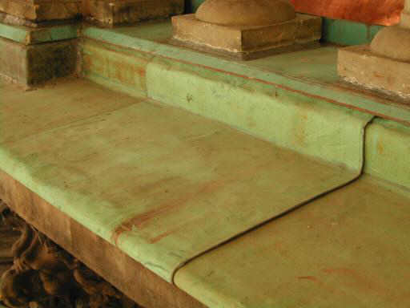

[🠔 Zur Übersicht: Dach](212baust.md)  
# Historische Blechdächer
**Dieser Artikel befasst sich detailliert mit historischen Blechdächern, deren Materialien, historischen Beispielen, typischen Schäden und wirtschaftlichen Reparaturansätzen.**  
_von Konrad Fischer_

## 12. Dachdeckung und -konstruktion 6

**München TV** Pressetalk 20:00 **"Einstürzende Flachbauten"** [Talk-Clip 6 min wmv 2,9MB Download](mtvclip1.wmv)) 
mit v.l.: Konrad Fischer, SZ: Red. Christian Schneider, TV-Moderator Christopher Griebel, FOCUS: Red. Christian Sturm, BYAK: Vorstand Rudolf Scherzer 
aus tragischem Anlaß 

## 6. Historische Blechdächer

Blechdeckung vor allem aus Blei gibt es seit langem: Lt. DDH-Edition Metall 1998, John-Thomas Siehoff: Bleigedeckter Kirchturm neben Palazzo Grassi aus 12. Jh., Bleiplatten auf Kuppel Markusdom Venedig 15. Jh., Kathedrale Canterbury Turm: Letzte Erneuerung Bleidach 14. Jh., St Gereon Köln: Mitverwendung verzierter Bleiplatten von 1240, Moscheen Instanbul Bleidächer 15.-17. Jh., Ursprungsbau des Doms in Köln Bleideckung (870?), geschmolzen bei Brand 1248 usw. Vergoldete Bronzetafeln deckten einst das antike Pantheon in Rom, in seiner jetzigen Form erbaut von Kaiser Hadrian ((117 - 138 n. Chr.). Noch heute deckt (angeblich?) antikes Bronzeblech die Okulus-Öffnung, der Rest wurde mehrmals erneuert, die letzte Bronze von Papst Urban VIII. (1623-1644) abgenommen, um daraus von seinem Stararchitekten Bernini den bronzenen Baldachin über dem Petersgrab in St. Peter herstellen zu lassen. Seitdem liegt Bleiblech auf der Pantheonskuppel. [ Weitere Pantheon-Details](http://www.ilpantheon.ch/de/geschichte.html). In Deutschland liegt das älteste nachweisbare Dachkupfer auf der Kirche St. Michael in Hildesheim - von 1280, genannt wird in einer Urkunde von angeblich 1204 (aus Klosterschule "Zu Roßleben") auch das Kupferdach der Benediktinerabtei Memleben um 940. Ansonsten kennen wir es von vielen norddeutschen Kirchen- und Rathausdächern. Gestrichenes Stahlblech und Zinklegierungen als Dachdeckungen kommen Anfang des 19. Jhs. im Zeitalter des Historismus in Mode, vor allem als 1812 in einem Werk bei Lüttich die Herstellung von Zink-Walzblech aufkam und als Zierelemente für das Dach. Eine gußeiserne Schuppendachdeckung wurde 1818 auf dem Palais Beaurbon in Paris verwendet. Wohl eine der ältesten, bis heute funktionierenden Edelstahlblechdeckungen befindet sich auf dem Dach des Chrysler Building in New York aus dem Jahr 1929. Die Fachberatung zur Sanierung von historischen Blechdeckungen seitens Industrie und Handwerk ist ist allerdings mehr als dürftig. Das durfte ich in ausreichender Weise bei der Reparatur der Bremer Rathausdächer erfahren. Worauf kommt es dabei an? 

 
_Bremer Rathaus nach Reparatur Südfassade in Luftkalktechnik und Dach mit Altblech_

Aus Sicht des Bauherrn muß das Dach dicht sein. Da hat die alte Blechschardeckung - sei as Kupferblech, Bleiblech oder Zinkblech oft echte Mängel. Falsche Reparaturen, übersparsame Bauausführung, zu geringe Überdeckung der Falze, gerissene Blechflächen wegen ungenügender Dehnfähigkeit, Alterung und Schädigung der Unterkonstruktion, Sturm, Regen und Absäuerung haben das ihre geleistet, dem Regeneintrieb und -einlauf die Türe durch Löcher, Risse und undichte Fälze zu öffnen. Und nun? Alles erneuern? Haften ergänzen, Festhaften zu Schiebehaften umbauen, Altkupfer, patiniertes Kupferblech, glänzendes Neukupfer, Bleiblech, Bleiwolle, bruchfreudiges Zinkblech und Titanzink allerlei Provenienz, Eisenklammern und -anker im Blechumfeld, elektrolytisches Rosten der unedlen Metalle als Opferanode - es wären viele Themen, die zu bedenken wären. Ungeeignetste Kitte und Klebstoffe mit saurem pH-Wert, versprödetem Altern und schweinigster Schmierage zum wenig dauerstabilen Nachdichten nehmen? Altbleche runter, beschneiden und das rißgefährdet versprödete Altmaterial mit Neu mischen? Wie sieht die richtige Reparatur denn aus? 

Vielleicht so? 

Hier [etwas zu den Reparaturdetails.](2beton07.md)

Hier gibt es bestandsschonende, wirtschaftliche Alternativen, die nur beschritten werden wollen. Und dabei ist der Planer recht allein - es gibt keine geeignete Norm dafür, und wenn es schiefgeht - wer haftet? Mein Tipp: Bemustern der gewählten Reparaturvariante an der sinnfälligsten Stelle. Immer blechgerecht, keine Kittgeschmiere im Dichtungsbereich. Es gibt hier bessere Dichtmöglichkeiten. Und Löcher und Risse: Zulöten, oder Flickenkleben mit im Flugzeugbau erprobten Klebern (gibt es, wohl wenig problematisch, da durch Blech gegen direkte Bewitterung und UV geschützt), oder eben passable (Alt-)Neuteile hineinflicken. Scharf Bewässern mit Eintriebsimulation. Wenn dicht, so durchführen. Wenn nicht, nachbessern unter Berücksichtigung der Testerkenntnisse. Wenn alles klar ist, [detailliert, neutral, selbstverständlich öffentlich unbeschränkt ausschreiben](9pbs.md) und so gut wie nachtragsfrei abrechnen. So geht es wirtschaftlichst und am sichersten. Und wie sieht die Praxis aus? Eben.

Neben allen möglichen [Dachschäden an neuen, vor allem flachen Dächern](212bau2.md) kann es auch alten Blechdächern mit üblicher Instandhaltung sehr überraschend an den Kragen gehen:

Am 24.3.2006 krachen plötzlich Teile der Blechdeckung von St. Jakobi in Lübeck auf die Straße. Immer wieder gab es schon solche Vorfälle, die auf den maroden Zustand der Deckung hinwies. Muß erst einer vom Kirchendach-Fallbeil geköpft werden, bevor eine sorgfältige Dachreparatur dran ist? [Infolink](http://www.kn-online.de/news/regional/luebeck.htm/1829382)

Weiter: [7: Flachdach](212bau7.md)
