[🠔 Zur Übersicht: Dach](212baust.md)  
# 7. Ein paar steil bewegte Worte zum Flachdach - kein Flachdachlachen
**Kritische Betrachtung des Flachdachs in unseren Breiten: Probleme, Sanierungsfälle und Baumängel, die zu 'einstürzenden Flachbauten' führen können, anhand von Beispielen.**  
_von Konrad Fischer_

Altbautaugliche Verfahren und Baustoffe 
Kapitel 12: Dachdeckung und Dachkonstruktion 7 

**München TV** Pressetalk 20:00 **"Einstürzende Flachbauten"** [Talk-Clip 6 min wmv 2,9MB Download](mtvclip1.wmv)) 
mit v.l.: Konrad Fischer, SZ: Red. Christian Schneider, TV-Moderator Christopher Griebel, FOCUS: Red. Christian Sturm, BYAK: Vorstand Rudolf Scherzer 
aus tragischem Anlaß 

können hier auch nicht schaden und machen das verflachte Kraut auch nicht mehr fett. Natürlich ist das Flachdach nicht gerade die vorteilhafteste Baukonstruktion in unseren Breiten. Mindestens die erfahrenen flachdachlachenerfahrenen Flachdachabdichtungs-Bauherren (wie der abgesoffenen und euroschwer kurz nach Erbauung zu sanierenden Neubauflachdächer der jüngst so vielgepriesenen Bauwunder Universitätsbibliothek in Magdeburg, Nord-LB-Landesbank in Hannover, BuGa-HAlle in Potsdam und viele hunderttausende, wenn nicht Millionen andere) wissen davon ein arg gräßlich modernes Liedlein (Text: Mies Bauhäusler, Melodie: "Der alte Dessauer") zu singen, das wir hier nicht wiederholen müssen. 

_"Wohl nicht ganz dicht. Richard Meiers Museum in Frankfurt ist ein Sanierungsfall."_ , titelte die Süddeutsche Zeitung am 27.07.07 und führt weiter aus: _"Die berühmteste und frechste Antwort auf die Frage (des Bauherren), was sich denn gegen ein neues Dach tun lässt, durch das es auf den ebenfalls neuen Esszimmertisch regnet, stammt von Frank Lloyd Wright. ... "Es regnet durchs Dach ins Essen? Dann stehen Sie nicht dumm rum, verrücken Sie den Tisch."_ 

Ja, das ist eines amerikanischen Architekten würdig. Flachdachsanierung a la Kuhjunge / Cowboy. Das dort eingeführte Problemgebaue feiert logischerweise auch am erst 1985 errichteten Frankfurter Museum für Angewandte Kunst (MAK) fröhliche Urständ. Allein 4,5 Mio EUR müssen 2007 zur Sanierung des patschnassen Kellergeschosses ausgegeben werden, zusätzlich zur Sanierung / Abdichtung des Flachdachs, durch das es schon ewig ins Innere reinrinnt. Und zusätzlich zur verrottenden Fassade, von der sich die schmucken Fassadenplatten lösen und deren Mauerkronen ebenfalls rundum nässegeschädigt sind. 

Und auch die Berliner Zwingburgen betoniertester Technik und fortschrittlichster Flachdachsysteme auf unser aller explodierender Baukosten ließen sich nicht gerade allzulange lumpen, bis sie zu wahren Tropfsteinhöhlen mutierten und unsere doofen Abgeordneten mit chinesischer Waterboerding-Technik für Selbstversuche beglückten: 

Neue Presse Coburg, Freitag, den 16. April 2009 

_Pfusch läßt Bundesbauten bröckeln 

Renovierung. Keine zehn Jahre nach dem Umzug müssen Kanzleramt und Co. aufwendig saniert werden. 

... Im Kanzleramt weht schlechte Luft. _Bei den Abgeordneten in Berlin tropft es von der Decke. ... Bauten im Spreebogen immer wieder Mängel ... Demnächst Bautrupps ins Kanzleramt ... bei Paul-Löbe-, Marie-Elisabeth-Lüders- und Jakob-Kaiser-Haus - mit Abgeordnetenbüros, Sitzungssälen und Bibliothek stehen sie jetzt schon auf den Flachdächern._ [Unterstreichungen KF] "Planungsmängel oder Ausführungsfehler" haben einen großen Teil der Sanierungen notwendig gemacht, sagt Bernd Stokar von Neuforn von der Bundesbaugesellschaft. ... Kanzleramt ... schwer getroffen. ... Lüftungstechnik ... macht Probleme ... Dachverglasung der Wintergärten muss ausgetauscht werden ... moderne, mit Pflanzenöl betriebene Blockheizkraftwerk ... ökologisch korrekt ... liefert derzeit weder Strom noch Wärme ... was die Arbeiten am und im Kanzleramt kosten ... nicht klar ... weil ... an so vielen Regierungsbauten ... saniert wird, ... "ein zweistelliger Millionenbetrag" ...sagt ... Vorsitzende des Haushaltsausschusses, Otto Fricke (FDP). ... Summe (der Mängel) auffällig ... Paul-Löbe-Haus ... Scheiben gesprungen ... Fassadenkonstruktion ... verzogen ... _Jakob-Kaiser-Haus regnet es immer noch rein ... Planungsfehler_ [Unterstreichungen KF] ... Wartung von 174 Rauchabzugsklappen auf Paul-Löbe- und Marie-Elisabeth-Lüders-Haus "praktisch nicht möglich" ... Klappen ... auf Glasscheiben angebracht, die man nicht betreten darf ... Am teuersten ... Sanierung des 1999 errichteten Bundesbauministeriums ... "Sowohl die Planung als auch die Durchführung des Baus ... schwerwiegende Mängel", erklärt Ministeriumssprecherin Vera Moosmayer ... Generalunternehmen "vertraglichen Verpflichtungen zu einer mangelfreien Planung in keiner Weise gerecht" geworden ... 45 Millionen Euro hat der Bau gekostet ... Sanierung ... mit 36,5 Millionen Euro fast genauso teuer ... Boris Engelhardt vom Hauptverband der Deutschen Bauindustrie (meint dagegen:) ..."Je komplizierter die Architektur, desto öfter müsse man eben sanieren" ..._ 

Aha, wer hätte das gedacht? 

Ja, es war schon immer etwas teurer, einen besonderen Geschmack zu haben. Und da in den Wettbewerbsjuries alles mögliche, bestimmt aber keine konstruktionskritischen Baumeister das Sagen haben, geht die selbstzerstörerische Architekturmanie des internationalen Plattdachs immer weiter, bis die Haushaltskasse endgültig plattgemacht ist und sich die international flachdachlachenproduzierende Flachdachbranche platt- und flachgelacht hat. Weil der Planer / die Wettbewerbsjury zu flach gedacht hat. 

Bis dahin ernährt der Flachdachschmonz das Baugewerbe. Und zwar international, und nicht nur am Dach, sondern überall im Gefolge der Betonitis und Luftdichtitis - weiter in der SZ: _"Zuletzt zeigten sich etwa Risse in der Rotunde der Münchner Pinakothek der Moderne (Entwurf: Stephan Braunfels). Oder das von Rafael Mondeo erbaute Moderna Museet in Stockholm: erst im Februar 1998 eröffnet ... schon im November 2001 wieder geschlossen.... Alle Wände, Böden und Decken ... von Schimmelpilzen und Feuchtwasser durchseucht. ... Günter Behnischs Akademie der Künste am Pariser Platz in Berlin ... Im März vor zwei Jahren eröffnet, wohnte sogleich der Schimmel darin. ... Die Bauschäden mutieren ... zu Imageschäden der zeitgenössischen Architektur. ..."_ Die aber stur den Weg des inzwischen millionenfach erwiesenen Bauirrtums weitertrampelt. Wird man vielleicht durch geschmacksfaschistisches Schwarzhemdtragen Marke Totengräber und eitelste Corbu-Nickelbrille blind? 

Auch der berühmte Dekonstruktionismus-"Architekt" [Frank O. Gehry - recte Frank Owen Goldberg](https://de.wikipedia.org/wiki/Frank_Gehry) - nutzt für seinen dekonstruktivistischen Architekturzerstörungswahn geradezu wie selbstverständlich die dafür am besten geeigneten Zersetzungs-Bauweisen: Flachdach und WDVS/Wärmedämmverbundsystem. Sein Energie-Forum-Innovation in Bad Oeynhausen zeigte nur wenige Jahre nach der Einweihung 1995 die besonders selbstzerstörerischen Qualitäten, die nach nur 20 Jahren 2015 dann zur Totalsanierung führten der komplett abgesoffenen Dämmbude namens Gehry-Baracke. Die Glasdächer tropften von Anfang an jedes Regentröpfchen weiter in den Bau, in dem dann Eimer aufgestellt wurden - Motto: Alles im Eimer. Doch das war noch bei weitem nicht der einsame Höhepunkt seines zerstörerischen Dekonstruierens. Der ganze Flachdachaufbau war schnell total hinüber: "Die Mineralfaserplatten der Wärmedämmung hatten sich teilweise so mit Wasser vollgesogen, dass zwei Männer nötig waren, um die Dämmplatten überhaupt anheben und wegtragen zu können." (Blackprint 2017 - Carlisle/bba). Daß nebenbei zur weiteren dekonstruktivistischen Steigerung auch die gesamte WDVS-Fassade aufgenäßt, mit Pilzen, Algen und am allnächtlich anfallenden Tauwasser anklebenden Dreck versaut, erneuert wurde - wieder mit WDVS! - steht selbstverfreilicht in der heiligen Tradition des verewigten Dekonstruktivismusses modernistischer "Architektur". Hier dürfen Sie den Dreck an der Fronfassade im Detail bewundern, der wieder mal beweist, welchen dollen Stellenwert die Baukonstruktionslehre in der Architektenausbildung zum Dekonstruktivisten auch international hat: 

Hätte man für ein derart dolles Architektur-Ergebnis wirklich extra einen "Star-Architekten" von fernher holen müssen, der sein Vernichtungshandwerk in der Südkalifornischen Universität USC in Los Angeles beigebracht bekam? Hätten das die Kollegen aus hiesigen Technischen Hochschulen, Fachhochschulen, Universitäten und sogar Universities Of Applied Science nicht mindestenst genausojut oder sogar noch besser hinbekommen, wie es genug viele abgesoffene Buden aus urdeutscher Flachdacherei und Dämmbaubrunst inzwischen wirklich allerorten beweisen? 

Aus den architekturtypischen Dauerleckagen der industriegläubigen Planertröpfe wird also schnell das tropfige "Leckmich". Dabei darf das dämmstofftypische Kondensatproblem der wasserdampfaufnahmefähigen Schäume und Gespinste bei all dem Geplatsche und Getropfe, Gerinne und Geflute unter unseren Flachdachleichen keinesfalls vergessen werden, das wohl auch Gehry's Flachdächer beglückte. Dipl.-Ing. Uwe Pernette schreibt darüber im DAB 6/2006 in 

_"Umkehrdach mit XPS-Dämmstoffen: [...] Bei Umkehrdächern werden die Wärmedämmstoffe aus extrudiertem Polystyrol-Hartschaum (kurz XPS) über der Wasserdabdichtung angeordnet. [...] nutzungsdauerabhängigen, sukzessiven Erhöhung der Wärmeleitfähigkeit infolge Feuchteeinlagerung durch Wasserdampfdiffusion. [...] Die Feuchteaufnahme von XPS-Dämmstoffen in Umkehrdachaufbauten mit geschlossenen Deckschichten erfolgt periodisch. Die in der Heizperiode auftretenden Feuchteeinlagerungen können in der sommerlichen Trocknungsperiode nur unvollständig ausgetrocknet werden. Hierdurch ergibt sich über die Jahre eine stetige Zunahme der eingelagerten Feuchte [...]."_ 

Diese unerbittliche Aufschaukelung des Feuchtegehalts gilt freilich bei allen dampfoffen aufgeschäumten und gefaserten sog. "Dämmstoffen" - sowenig diese auch baupraktisch dämmen, und trotz aller nur sehr bedingt wirksamen Dichtanstrengungen gegenüber Kondensateinwanderung. Dabei erhöht die Feuchteeinlagerung die Speicherfähigkeit und Stabilitiät der Leichtbaustoffe gegenüber einseitigen Temperaturveränderungen - ein wärmetechnischer Vorteil und nicht ausschließlich - im Unterschied zur Überbetonung der ["U-wertigen Wärmeleitfähigkeit"](2139bau.md) - als Nachteil zu sehen. Wenn nicht genau die sich einlagernde Feuchte eine unvorhergesehene Taupunktverlagerung, bei der die Luftfeuchte temperaturabhängig im Zusammenhang mit dem Wasserdampfpartialdruck im Bauteil kondensiert, dann Schimmel, Vermorschung und Korrosion der Baukonstruktion zur Folge hätte - da liegt nämlich der Hase im Pfeffer und der böse Hund begraben! Und da die porig-schaumig-faserigen Dämmstoffe im Dach erst mal unbemerkt geradezu ungeheuerliche Wassermengen aufnehmen können, wird das böse Spiel erst dann bemerkt, wenn wirklich alles zu spät ist - hin und wieder dann eben beim Einsturz des Daches. Um wenigstens rechtzeitig derartig problematische Systemleckagen zu orten und zu melden hat sich die pfiffige Industrie inzwischen sogar Frühwarnsysteme wie beim Tsunami einfallen lassen, die als vollautomatische Leckmeldeanlagen am Markt sind. Sogar ein Kondensatanfall bzw. das Ausfällen von Schwitzwasser unter der Abdichtebene und auch wasserbedingte Veränderungen der Dachlast können damit signalisiert werden. Ei, das mag ein dolles Alarmgeklingel geben, wenn das typische Flachdach nach ein paar Tagen in die Jahre gekommen ist. Und bestimmt kann man wie bei Brandmeldeanlagen auch gleich eine automatische Leckagewarnung an die Feuerwehr, das Technische Hilfswerk und den autorisierten Dachdeckerbetrieb aufschalten ... 

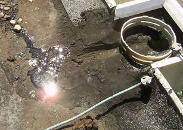 So sieht es nach zig vergeblichen Versuchen auf den abgesoffenen Flachdächern einer gerade in unseren Breiten brutalstblödsinnigsten "Architektursprache", die gerade unsere öffentlichen Bauherren auch heute noch vor sich hinstammeln, aus: Nach Freilegung und langwierigster Suche nach dem Loch, dem Riß, der brüchigen Stelle, genügt ein Tritt ins sumpfige Gelände, und die scheußlichste Brühe tropft oberflächig heraus - und zwar bestimmt nicht in den Ablauf. Bei diesem Foto aus einem meiner Beratungsfälle spiegelt sich dann die Sonne, die bekanntermaßen auch heute noch alles an den Tag bringt, in der aus dem Dach gelaufenen Lache. Wie es darunter aussieht, kann sich jeder selbst ausmalen. Alleine schon das zusätzliche Gewicht aus dem Wasser, für das die brüchig-selbstzersprengte Stahlbeton-Dachkonstruktion 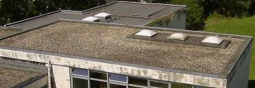bestimmt nicht ausgelegt war ... 

Es muß also umfangreicht saniert werden, soweit nicht vorher schon der Einsturz kommt. 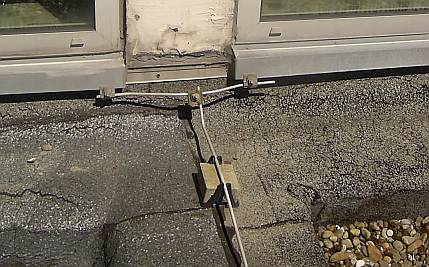 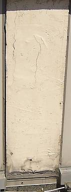 Hier fliegt einem der ans Flachdach anschließende Stahlbetonpfeiler wg. [Betonschaden/Karbonatisierung/Rostsprengung](2beton.md) um die Ohren. Wie lange das alles noch halten mag - alle diese Bildchen zeigen eine ca. 5-jährige Dach- und Betonsanierung - veranlaßt durch ein öffentliches Bauamt einer deutschen Landeshauptstadt? Und wie dann im Falle eines Falles? Uhu hilft da nix. Entweder durch Umwandlung in ein Gefälle- oder Steildach, oder irgendwie gem. Bestand. Möglichst alle (paar) Jahre wieder, die beliebte Jobmaschine für die Baubranche?: 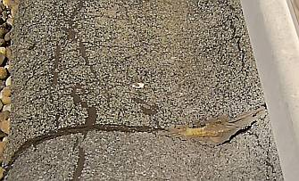 Wie immer hakt die Industrie da ein und puscht naßverliebte Dämmstoffe und bald allzuspröde Dichtrißbahnen aufs Sanierdach in abenteuerlichsten Materialkombinationen der Fugen-, Dicht- und Bahnmaterialien, daß die Augen tränen. Versprechungen ohne Ende rund um die dauerdichte Flachdachbahn, kennen wir das noch nicht? Willige Planer setzen irgendeinen Krempel dann um, die Planung dazu gibts umsonst vom Produzenten, bezahlen tut aber der Bauherr. Wieder und immer wieder. Schöööön. Flachdachhoffnung und Werbungsgläubigkeit, aber auch sehr geschicktes Marketing ersetzen vielleicht (wieder mal?) den Verstand. 

Wie sieht es eigentlich mit folgenden, offensichtlich meist total uninteressanten Problemfeldern aus? 

- Können nur punktweise verklebte Dampfsperren bei späteren Inspektionen und Sanierungen Notabdichtungsfunktionen übernehmen, wenn bei der kleinsten Beschädigung Wasser unter die Dampfsperre gelangt und dort unkontrolliert vagabundieren kann?

- Wie steht es mit dem kondensat- und regenbedingten Absaufen der Dämmstoffe in der irgendwann immer ober- und/oder unterseitig undicht werdenden Dachkonstruktion, hält das die Baukonstruktion statisch bzw. betreffend Korrosion und/oder Vermorschung aus? 

- Können Wärmedämmungen aus Hartschäumen, die nach der Produktion einem Schwund unterliegen und deshalb bei der losen Verlegung Fugen aufweisen, Wärmebrücken vermeiden? 

- Können die bei manchen in der Dachdämmung eingebauten Hartschäume herstellungstechnisch unvermeidlichen Schwundbewegungen nicht Kräfte auf die aufliegende Dachhaut übertragen, die eine beschleunigte Alterung und Leckage der Dachdichtungsbahnen begünstigen, unheimliche Lastaufnahme durch von unten eindringendes Kondensat und von oben einregnendes Wasser inklusive? 

- Können Folien-Abdichtungsbahnen, die ohne bzw. unter Auflast lose verlegt werden und nur mechanisch punktuell bzw. mit Randverklemmung an der Attika und den Dachdurchdringung wie Kamine, Kanäle, Lüftungsaufbauten und Dachfenstern nur streifenförmig befestigt werden, bei thermisch unvermeidlichen Längenänderungen nicht überhöhte Bewegungen auf der Dachoberfläche in der Abdichtungsebene erleiden, die zu Spannungen führen und die Dachhaut im Zusammenspiel mit UV-Licht unvergleichlich schnell altern lassen - trotz UV-Stabilisierung? 

- Können Folien-Abdichtungsbahnen aus PVC trotz unvermeidlicher Weichmacher-Ausgasung auf Dauer formstabil ohne Schrumpf und Schwund und Brüchigkeit bleiben?

- Können die metallischen Flachdach-Befestigungselemente (geschweige denn die Elemente aus Plastik) bzw. die Fixierungen der die Bahn durchdringenden Bauteile wie Antennenverschraubungen, Abläufe / Gully usw. sowie die vorgeschriebenen linearen Fixierungen der sonst auf Wanderschaft gehenden Dämmstoffplatten den ungeheuren Angriff aus thermischer Bewegung, Bewitterung und sauren Reaktionsprodukten abgesoffener gestauchter oder (auch dank Frostangriff) aufgeplusterter Wärmedämmungen und den Bahnen selbst dauerhaft standhalten, ohne zu korrodieren?

- Können Dachprodukte, die in einer gegebenen Konstruktion mit Baustoffen bestimmter Rezepturen noch keine 30 Jahre umfangreiche Bewährung überstanden haben bzw. weit geringere Erfahrungswerte für sich reklamieren können, sinnvoll 30-Jahre-Versprechungen einhalten? Wie sieht es denn wirklich aus mit der Weichmacherfreisetzung und nachfolgender Versprödung im unerbittlichen Alterungsprozeß von Polymerprodukten? 

- Können Dachbahnen mit erhöhter Empfindlichkeit gegen mechanische Beschädigungen den Gefährungen durch unsachgemäßes Begehen oder Arbeiten auf dem Dach dauerhaft trotzen? 

- Können kleinformatige und lose aufgelegte /ausgelegte Dämmplatten / Wärmedämmelemente mit geradezu abenteuerlicher Wärmedehnfähigkeit die angreifenden Kräfte aus Temperatur, Wind und Begehung dauerstabil aushalten und unverrückt am selben Orte bleiben, ohne die Bahn darüber mitzunehmen (Dämmstoffwanderung) und durch unvermeidliche Bewegung überbelasten? 

- Können alterungs- und spannungsbedingt gerade zur Winterzeit besonders rißempfindliche Dachfolien/Dichtungsbahnen bei großen Rißereignissen gut notgedichtet und überrepariert werden?

- Wie steht es um die zwangsläufige Seen- und Eisbildung im falsch mit nicht formstabilen Schäumen und Gespinsten gedämmten und falsch gebauten und deswegen mittig regelmäßig nach einiger Zeit einbeulenden Flachdach, wenn der Gully dann auf stützen- und randnahen Hochpunkten liegt? Hält die Statik? Überstehen die Dachhaut und ihre komplizierten Bauteilanschlüsse die damit verbundene Materialdehnung ewig aus? Ist schon die Zwangsabsaugung der Dachseewässser inkl. heiztechnischer Abschmelzung der winterlich dort anwachsenden Packeispackete installiert? Wird das alles gut halten, wenn es neben der regelmäßig trotz unter- und oberseitiger Folienverpackung absaufenden Dämmstoffpakete zu weiterer Lasterhöhung mittels Schnee und Eis kommt?

-Wie wirkt die oft unsichtbar abgesoffene und verschimmelte Dämmstoffebene auf die Sicherheit der tragenden Dachbauteile aus Holz und Metall? 

- Können brennbare Dämmstoffe wegen ihrem hohen Brandlastpotential nicht auf stark personenfrequentierten Bauwerken im Brandfall erhöhte Rauchentwicklung und toxische Gase freisetzen, die die Brandbekämpfung erschweren, die Flüchtenden und die Feuerwehr mit schwersten Gesundheitsschäden mit Todesfolge sowie das Betonbauwerk gegebenenfalls mit Chloridverseuchung bedrohen? 

- Können beim brandbedingten Erwärmen oder Verschwelen von brennbaren Dämmstoffen explosive Gase austreten, die sich unter der Dachhaut bei einem Schwelbrand sammeln und zu explosionsartigen Verpuffungen führen und die Brandbekämpfung entsprechend erschweren?

- Ach so, fast wieder mal vergessen: Wie steht es mit der statischen Sicherheit der gesamten Flachdachkonstruktion gegen Einsturz bei Baustellen-, Wind-, Kondensat-, Regen-, und Schneeereignissen? (Dokumentation der abschreckendsten Beispiele der letzten Jahre rund um Bad Reichenhall [hier,](212bau2.md) was speziell die Betonbauten betrifft, auch [hier](2beton.md)) 
_Der bayer. Ministerpräsident Stoiber und der Bundespräsident Köhler besichtigen am 7.1.2006 das eingestürzte Flachdach der Eissporthalle in Bad Reichenhall, man holte 15 Tote drunter raus und 34 schwer Verletzte. Ehre ihrem Angedenken, Schande über die Verantwortlichen. Foto: Konrad Fischer_

- Wie steht es alo mit den Faktoren Langzeiterfahrung, Wirtschaftlichkeit auf Dauer, Unterlaufsicherheit, Leckageortung und -meldung, thermische Längenänderung, Rißempfindlichkeit, Reparaturfreundlichkeit, Einsturz- und Brandsicherheit usw. als entscheidende Planungsgrundlagen neben dem aktuellen Preis?

Da sind wir mal gespannt. Und bevorzugen aus Qualitätssicherungsgründen Konstruktionysteme, die hier überzeugende Antworten geben. Welche? Ja, das ist eben objektabhängig und bedarf genauerer Planung. Flach mit Echtzeit-Leckmeldesystem, Gefälle mit dauerstabiler Deckung, Steilkonstruktion mit erhöhter Schneelast- und Regensicherheit? Alles ist möglich, sagt der Japaner.

Die hier angesprochenen Ursachen der überall auftretenden Flachdachprobleme wollen wir nun im Sinne eines Nachhilfeunterrichts für Bauherren und Planer etwas ausgiebiger illustrieren. Es folgt ein lecker Potpourri / Kaleidoskop der typischen Flachdachschäden durch Leckagen, Risse und Ablösungen der Dachbahnen aus Bitumen und Flachdach-Folien, Absaufen und feuchtebedingte Zerstörung der nässeempfindlichen Wärmedämmungen aus beispielsweise Mineralwolle / Mineralfaser / Glaswolle / Extrudiertes oder Expandiertes Polystyrol (XPS, EPS), Polyurethan PUR etc. darunter sowie Versagen der angeblichen Dampfsperren / Dampfsperrbahnen / Dampfsperr-Folien - aus dem ganz alltäglichen Wahnsinn auf den modernen Flachdach-Konstruktionen. Die Fotos aus dem Flachdachsumpf kommentieren sich wie von selbst: 

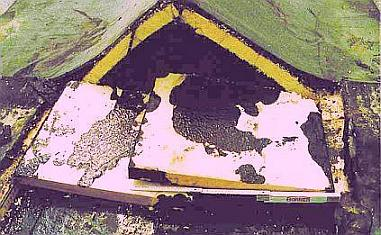Die Temperaturdehnzahl der Dämmstoffe aus Polyurethan PUR ist extrem - ca. 6-8 mm/m bei 100 K! Bei entsprechenden Dachflächen wirkt sich das beispielsweise - hier nach nur drei Jahren - so aus: Das Flachdach wird partiell zum Steildach - es nützt ihm aber nix! 

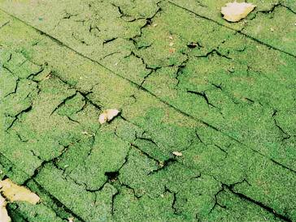Die typischen Dämmstoffe - hier durch Feuchteaufnahme aufgequollene Mineralsfaserplatten - können Wärme nicht wegspeichern und verhindern deswegen den Abtransport der irren Hitze auf dem Dach in den massiven Unterbau. Daraus folgt eine gigantische thermische Belastung der Dachhaut, die das keinesfalls aushält. Es bilden sich Risse, Regen kommt rein, der Dämmstoff quillt - und weiter geht der Schaden. 

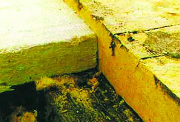So kann es einer Mineralfaserdämmung / Mineralwolle-Dämmplatte durch Wasseraufnahme und Dampfbelastung ergehen. Der Vergleich zu einer neuen Platte zeigt die Volumenvergrößerung. Fürs Dach und die Stabilität seiner Dachbahn ist das schön blöd. 

So eine Dämmstofflage aus Mineralwolle / Mineralfaser kann irre Wassermengen aufnehmen. Das freut auch den Schimmelpilz. 

Wenn das Wasser in den Kuhlen auf der Dachhaut Gräben bildet, die dann durch die Spannung zu Leckagen / Rissen führen, dringt Wasser in die Mineralwolledämmung darunter. Das Gewicht des Wassers in dem ungewollten Gerinne der Dachhaut drückt dann die durchfeuchtete Dämmung immer weiter ein. Und der folgende Winterfrost tut das Seine, um die Materialstabilität immer weiter zu verringern. 

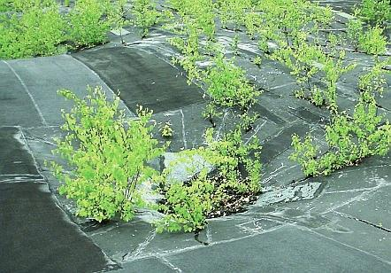In der Flachdachkunst war und ist schon seit altersher das "Green Building" der ökologischen Architektur angesagt, hier können die Vöglein auf den Wald verzichten und in den Bäumen des Daches ihre feinen Nestlein bauen. Ob das alles schwedische Birke ist? In den Wassertümpeln Karpfen und Schleien? Enten und Gänse? Wasserschlangen, Krokodile und Nilpferde? Eisbären? So unwirtlich ist es also doch gar nicht auf deutschen Flachdächern der Moderne! 

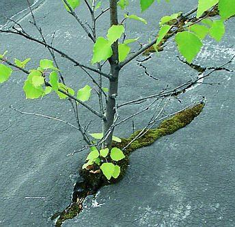Ja, es ist gewißlich wahr: Die Wüste lebt! 

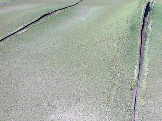Der Anfang einer großen Freundschaft zwischen Dach und Baum: Der aufgehende Riß in der Dachhaut über einer feuchtespeichernden Wärmedämmung als geradezu perfektes Nährsubstrat für den Flachdach-Dschungel. Kolibris und Affen, freut euch über euer neues Zuhause, wenn euere bisherigen Heimstätten endlich alle abgeholzt sind. 

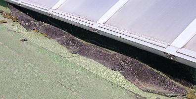So ein Bitumenbahn-Anschluß an aufgehende Kanten ist auch ein vermaledeites Ding. Hält nicht allzulange. 

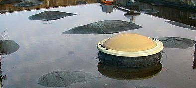Wer sich mit Flachdachtümpeln nicht begnügen will, kann es auch mit einem tiefgründigen Ozean probieren. Nein, es ist kein U-Boot, was da aus dem Meere lugt - nur ein Oberlichtlein. Und es sind keine Walfischrücken, sondern Flachdachbahn-Blasen, die da eine Walherde simulieren. 

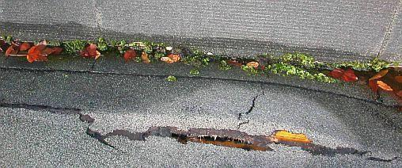An Ecken, Kanten und Aufkantungen bilden sich große Spannungen in der Dachfläche. Die reißen freilich - über kurz oder lang! Darunter bestes Sumpfgelände. Übrigens: PVC-Flachdachbahnen gasen Weichmacher aus, die Polystyrol-Dämmung beschleunig in Wechselwirkung die Weichmacherwanderung, die Bahn zersetzt sich und schrumpft. Der Schrumpf wirft Sorgen-Falten und gibt Risse an den Bahn-Anschlüssen und Abschlüssen! Schnell ist der Zug dort abgefahren. 

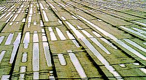Zum Durchführen einer Segelregatta sind diese Gerinne in der zusammengesunkenen nassen Dämmunterlage noch nicht geeignet, aber der Deutschland-Achter könnte demnächst wohl einsetzen. Vorsicht: Aquaplaning (Flachdachplanung)! (Bildzitat aus: Dr.-Ing. G. R. Klose, Deutsche Rockwool-GmbH, in: Der Dachdeckermeister 6/93: "Steinwolle-Dämmstoffe auf Stahlleichtdächern") 

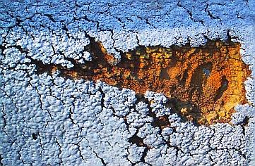Eine aufgerissene Polyurethandämmung glotzt dich an. Krümelbröckelig, wa? 

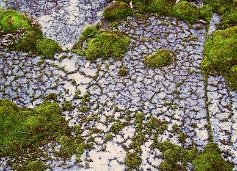Nein, das ist nicht das Dachauer Moos, obwohl auch dort die Flachdächer bemoosen. Und wenn man erst unter die aufgerissene Flachdachbahn guckt! Ob es dort Moorleichen gibt? 

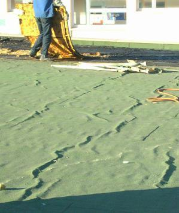Schlangengleich schlängelt sich die Dachbahn über dem durchnäßten Mineralwolldämmstoff. Ja freilich, auch Risslein gibt es dort zuhauf. Sonst hätt' mer den nassen Plunder doch noch zwanzig Jahre liegengelassen. 

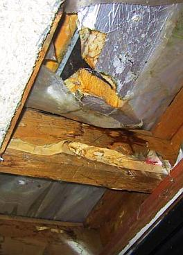Nicht nur im nassen Dämmstoff schimmelt es herum, nein auch die Unterkonstruktion aus Holz bietet dem Naßfäulepilz beste Lebensbedingungen. 

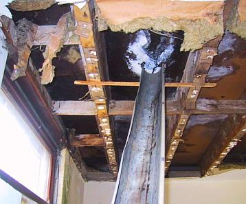Hier ist es mit Eimern unter den Flachdachleckagen nicht mehr getan. Da muß eine fachmännische Rinnenanlage her! 

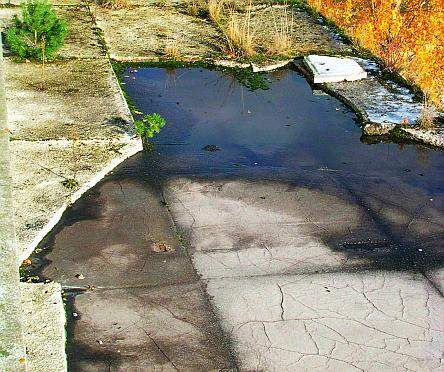Ein idyllisches Biotop aus Rissen in der Flachdachbahn, Dämmstoffmatsch, Tümpel, Gräslein und Sträuchlein. Ob das eine CO2-Senke ist? Toll: Moderne Bio-Architektur! 

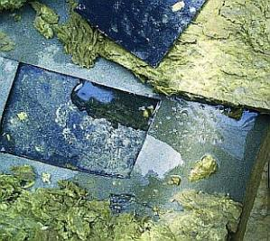Es macht Pfschscht, Pfschscht beim Weg über so ein Mineralfaser-Moor. Gummistiefel empfohlen. 

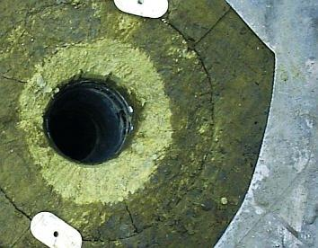Der Mineralfaser-Dämmstoff im Nahbereich um den Abfluß ist fast trocken! Ob das als Erfolgsmeldung durchgeht? 

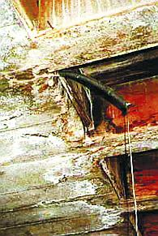Die nassen Flachdächer sind net nur für Holzkonstruktionen der Tod. Auch Stahlbetondecken müssen erbärmlich leiden: Korrosion und Aussinterung in Folge des eindringenden Regenwassers. Demnächst als Tropfsteinhöhle mit in allerlei bunten Farben erblühenden Stalaktiten zu besichtigen. 

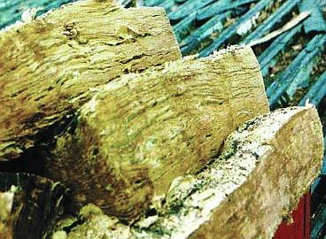Aufgeplusterte Mineralwolle-Dämmplatten vom abgesoffenen Flachdach. Als Blätterteig recyclebar? Wie hieß es doch immer so schön?: Mineralfaserdämmplatten schrumpfen und quellen nicht! 

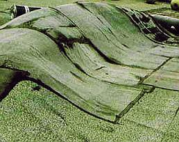Was mag wohl für ein mächtig Ungetüm unter dem Flachdachbahn-Falten-Gebirge sein Unwesen im Dämmstoffsumpf treiben? Soviel zum Wert von Dampfbremsen. Von dort oben ist die Aussicht übrigens noch besser, als vom gerissenen Dachrand. 

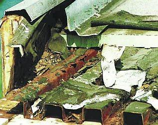Wenn der Dämmstoff naß wird, wird alles naß. Und auch Blechprofiltafeln können rosten. Es sind schon recht aggressive Wässerlein, die im Flachdachsumpf vor sich hin gären und brodeln. 

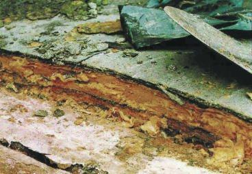Alles Rott in der Mineralfaser unter der Bitumenbahn (zweilagig nach DIN). 

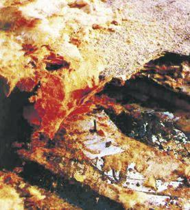Kein Pic-Asso, sondern die Arschkarte für den Flachdachbesitzer: Dämmstoff naß, alles naß. Ein feuchtestabiler Dachaufbau hätte hier als Trumpf gestochen ... 

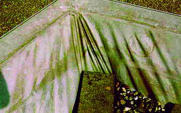Chemiker haben mal eine Überraschungs-Schrumpf-Flachdachbahn entwickelt und in unfaßbaren Flächen auf die Flachdächer "empfohlen". Über die zugehörigen "Incentivs" für die verantwortlichen Planer wollen wir hier nicht reden. Jeder weiß doch, worum es geht. Das expandierte Polystyrol EPS kann durch Nachschrumpfen in Richtung Dachmitte die Kunststoffhat mitziehen, da gibt es freilich Risse, ebenso wie durch das Entpolymerisieren der PVC-Dachbahn dank ausgasendem Weichmacher und folgende Versprödung. Das Dämmstoffwandern wird durch die lose Verlegung bestens begünstigt. 

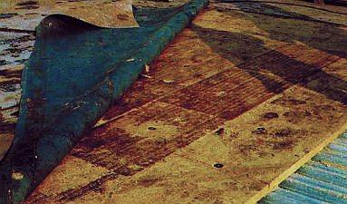Vorhang auf: Die Götterdämmerung am Flachdachhimmel (keine gerösteten Dämmfilz-Kekse, sondern alles patschnaß!). 

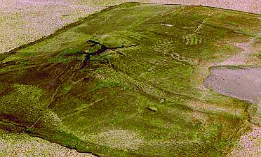Kein Google-Earth-Bild vom abgetauten Kilimandscharo oder der Elfenbeinküste oder vom Vesuv am Golf von Neapel - der grün bealgte Vulkan ist eine Flachdachblase neben einem Flachdachsee (Bildmitte rechts). Grund: Die Schüsselung des Polyurethan-Dämmstoffs (PUR-Wärmedämmung). 

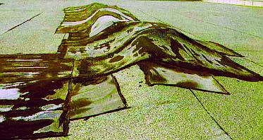Hansaplast oder Tesastreifen hätten auf diesem Flachdachgebirgszug wohl den selben nixnutzigen Effekt ausgelöst. Heute ist Mehrlagigkeit das Abdichtprinzip. Jedoch: Die vielerlei Werkstoffe der Bauchemie im Flachdachbahn-Bereich vertragen sich nur ungern oder gar nicht. Thermoplastische und elastomere Kunststoffe, Klebstoffe, Bitumenbahnen, Polymer-Bitumen, hochpolymerisierte Bahnen, Flüssigkunststoffe usw.usf, - das gibt dem Dachspezl unslösbare Rätsel auf. Macht aber nix, der Schaden kommt oft genug erst nach der Gewährleistungsfrist durch die Bahn. Da winkt schon ein neuer Auftrag - mit wieder einem verbesserten und endlich, endlich im In- und Ausland als dauerdicht bewährten neuen Chemiekampfstoff. 

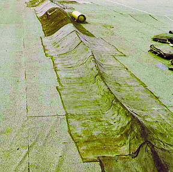Ja, Flachdachkonstruktionen sind immer eine Gratwanderung, bei der unzureichend ausbalancierten Konzepten schnell der Absturz ins Bodenlose droht ... 

Interessante Hinweise auf die Dauerstabilität und Verarbeitungsproblematik von plastikgedeckten Flachdächern bietet auch der [Abschlußbericht einer Untersuchung (R. Osswald, R. Spilker, G. Liebert, S. Sous, M. Zöller: "Zuverlässigkeit von Flachdachabdichtungen aus Kunststoff- und Elastomerbahnen") durch das Aachener Institut für Bauforschung und angewandte Bauphysik gGmbH (PDF)](http://www.bbr.bund.de/cln_007/nn_21784/DE/Forschungsprogramme/FoerderungBauforschung/BaukonstruktionenBaustoffe/Downloads/DL__2510,templateId=raw,property=publicationFile.pdf/DL_2510.pdf) aus dem Jahr 2007, Zitat: 

_"Hinsichtlich des Alters der Kunststoff- und Elastomerdachbahnen weisen die Erfahrungen der befragten Verarbeiter und die Auswahl der Vor-Ort-Untersuchungen zunächst in die gleiche Richtung: nach dem Alter der Dachabdichtungen befragt, die im wesentlichen aus materialbedingten Gründen erneuert werden mussten, gaben die Verarbeiter häufig eine Zeitspanne von 10 – 20 Jahren an. Auch die für die Vor-Ort-Untersuchungen genannten Dächer, die sehr schlechte Festigkeitsprüfwerte aufwiesen, waren meist etwa 15 Jahre alt. Allerdings spielten bei diesen Bahnen höchstwahrscheinlich im wesentlichen Fehler bei der vollflächigen Verklebung eine Rolle oder die fehlende Mikrobenbeständigkeit hat zu Veränderungen des Werkstoffs geführt. Andere Dachbahnen waren weit über 20, 25 Jahre alt und wiesen, wenn überhaupt, nur eine geringfügige Funktionseinschränkung auf. ... 

Hinsichtlich der technischen Lebensdauer kann von einem Zeitraum von 10 bis 20 Jahren ausgegangen werden – längere Liegezeiten sind möglich – aber angesichts der Vielzahl der Einflussfaktoren und der mangelnden Rezepturtransparenz nicht sicher vorhersagbar. ... 

Es sollten nur Bahnen verwendet werden, die entsprechend dauerhaft und hinreichend detailliert offen gekennzeichnet und beschrieben sind. Auch dies sollte fester Bestandteil der Ausschreibung sein. ... 

Die Vielzahl der Bahnentypen erfordert heute mehr denn je, dass die Bahnen für den jeweiligen Eigentümer bzw. den mit der Reparatur oder Wartung beauftragten Dachdecker eindeutig identifizierbar sind. Dazu gehört nicht nur das Firmenemblem, sondern eine eindeutige, wiederkehrende Materialkennzeichnung, die an sinnvoller Stelle auf der Oberseite der Dachbahnen in regelmäßigen Abständen aufgeprägt ist. Dabei sollte es sich um den Herstellernamen, die Werkstoffbezeichnung nach [DIN EN 13956] und dem Herstelldatum des Materials, ähnlich wie bei Autoreifen, handeln. Damit ist auch in Zukunft gewährleistet, dass Anschlussbahnen bei Umbauten oder Reparaturen mit der vorhandenen Bahn eindeutig kompatibel und miteinander zu verbinden sind. Bahnenhersteller, die auf eine solche Kennzeichnung verzichten, rechnen möglicherweise nicht mit einer längeren Lebensdauer ihrer Produkte. ... 

Da es bei einer relativ großen Anzahl der untersuchten Dächer mit verklebten Dachschichten zu Problemen gekommen ist, sollte bei der direkten Verklebung große Sorgfalt bei der Verarbeitung herrschen: grundsätzlich sollten die Angaben des Herstellers bei der Kleberwahl beachtet und genau eingehalten werden. Der Hersteller sollte insbesondere bei Sanierungen mit in die Untergrundprüfung einbezogen werden und [aus Gründen der erheblichen Unverträglichkeitsrisiken und Verarbeitungsprobleme] seine Zustimmung zur Verklebung schriftlich mit entsprechenden Verarbeitungshinweisen erteilen. Dies gilt auch für die Verklebung von bitumenbeständigen Bahnen auf bituminösen Untergründen. ... 

Bei Kunststoffbahnen mit Einlagen innerhalb der Dichtungsschicht ist das Risiko von Wasser führenden Kapillaren größer als bei Bahnen aus homogenem Material. Die Nähte müssen daher besonders sorgfältig geprüft und ggf. nachgearbeitet werden. Zumindest in Bereichen von zu erwartender Pfützenbildung (Kehlen, gefällelose Verlegung) sollte eine zusätzliche Nahtversiegelung obligatorisch sein. ... 

Eine möglichst vollflächige Sicherstellung einer ausreichenden Gefällegebung ist bei Kunststoffdachbahnen nicht nur wie bei allen anderen Bahnen zur Minimierung der Auswirkungen möglicher Fehlstellen wichtig, sondern auch, um einer möglichen Wasseraufnahme der Abdichtungsbahn selbst vorzubeugen. ... 

Wünschenswert wäre es aber auch, wenn die Fachöffentlichkeit über die Ursachen von werkstoffbedingten Schäden (z.B. beim „Shattering“) objektiv informiert würde, damit Bauherren, Planer und Ausführende größeres Vertrauen in die Werkstoffentwicklung setzen könnten."_

 
**Abbildung:** Wurmbefall / Insektenbefall / Fraßschäden im "normalen" Polystyrol XPS unter der Dachhaut! 

 
**Abbildung:** Wurmbefall / Insektenbefall auch im expandierten Polystyrol XPS unter der Dachhaut! Was mögen das nur für Viecherlein sein, die einen solchen Fraß reinstopfen. Wunder der Schöpfung! 

[Tips und Tricks zur Flachdachinspektion und Instandsetzung](212bau22.md)

So nebenbei können auch wir Deutsche das hier nicht abhandeln, wenn wir gerne mit stolzgeschwellter Brust unsere langzeitbewährten Taten betrachten und vom Bauherrn gerne auch nach vielen Jahren noch mal nen Kaffee spendiert bekommen wollen. Wobei es heutzutage auch Bauherrn gibt, mit denen man nicht mal mehr das möchte, doch das ist [eine andere Geschichte ...](10hoai.md)

[1: Einführung](212baust.md) [2: Moderne Dachkonstruktion](212bau2.md) [3: Schiefer + Tonziegel](212bau3.md) [4: Betondachstein](212bau4.md) [5: Ziegelnovitäten](212bau5.md) [6: Blechdach](212bau6.md) [7: Flachdach](212bau7.md) [8: Dachausbau](212bau8.md) [9: Reet/Stroh + Holzschindel / Links](212bau9.md)
