[🠔 Zur Übersicht: Dach](212baust.md)  
# 9. Organische Deckungsmaterialien - Naturbaustoffe - Reet/Stroh und Holzschindel
**Organische Deckungsmaterialien - Naturbaustoffe - Reetdachdeckung, Strohdachdeckung und Holzschindeldeckung. Probleme mit Durchnässung und Feuchte - Das Reetdachsterben**  
_von Konrad Fischer • aktualisiert 02.03.2009_

Altbautaugliche Verfahren und Baustoffe 
Kapitel 12: Dachdeckung und Dachkonstruktion 9 

**(aktualisiert 2.03.09)** 

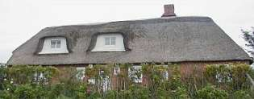 
_Hätten Sie gedacht, daß unter einem so hübschen Reetdach Materialfeuchten von um die 20 Prozent aufwärts nachzuweisen sind, krasser Befall mit Holzwurm, Milben, Käfern und gar allerlei aggressive, holzschädigende und freilich auch die mit dem eigenproduzierten Enzym Zellulase (stabile Eiweißmoleküle, die den Stoffwechsel ermöglichen) die Reet-Zellulose abbauende Pilze inklusive? Die Dachlandschaft mufft, das Dach wird krank und zu Matsch._

Was die Deckung mit Naturmaterialien wie Holz und Reet betrifft, kann auch nicht mehr davon ausgegangen werden, daß alle sogenannten Experten, Spezialisten oder gar Dachdeckermeister auch mit allertraditionellster Reetdachdeckerei seit Adam und Eva ausreichend verwertbare Ahnung von den historischen Einsatzbedingungen haben - oder haben wollen oder haben dürfen oder sich trauen zu haben, die eine dauerhafte Deckung garantierten. 

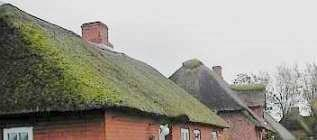 
_Was nützt das monatlichste Moosrechen in Schleswig-Holstein, Niedersachsen, Mecklenburg-Vorpommern, im Alten Land bei Hamburg, der Wesermarsch, Niederlande und in Dänemark gegen Nässeschäden an der Baukonstruktion, wenn die Reetdeckung darunter dauerfeucht ist?_

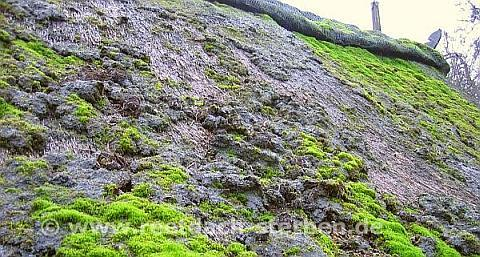 
_Nichts und wieder nichts, wie man an diesem Reetdachschaden lernen kann! Bildzitat aus[www.reetdach-sterben.de](http://reetdach-sterben.de/)_

Die besonders feuchtespeicherfähigen Materialien am historischen Dach wie Holzschindeln, Stroh und Reet (Schilf - das "Gemeine Teichschilfrohr") - man denke nur an deren betondachsteingemäße Bemoosung und Begrünung, deutlichste Anzeichen für überhöhte und ständige Baustoffdurchfeuchtung - wurden zur Zeit ihres Ersteinbaus vor der 2. H. 19. Jh, als feuerpolizeiliche Zwangsmaßnahmen überall den Kaminbau förderten, in simpelster Weise vor Feuchteschäden geschützt: Mit dem 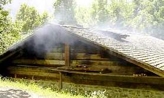. 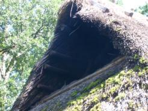.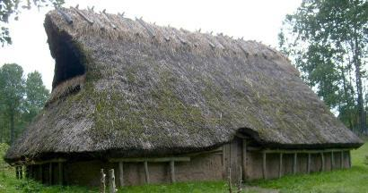 Rauchdachsystem. Will sagen: Der offene Herd 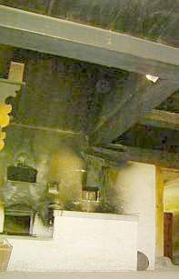 gab seine Rauchgase - wie auch das offene Lagerfeuer im Haus 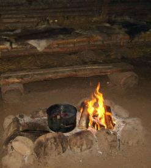 sommers wie winters in das sog. durchlüftete Rauchdach ab. Dort trocknete die heiße Luft die bei jedem Regen aufgefeuchtete / durchfeuchtete / durchnäßte Reetdachdeckung / Strohdeckung und gönnte den lieben Holzschädlinge / Schadinsekten / Schimmelpilze so dauerhaft Husten, Schnupfen, Heiserkeit, daß die sich lieber trollten. Und natürlich auch in den Dachstübchen 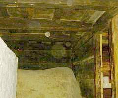 und unter dem Vordach. 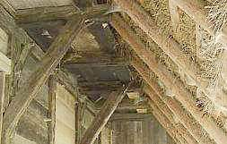 

So - mit perfekter Durchlüftung, Durchheizung und Dauer-Schädlingsvergasung - konnten und _KÖNNEN AUCH HEUTE NOCH_ "weiche Dachdeckungen" wie das Strohdach, das Reetdach und das Schindeldach über viele Jahrzehnte wartungsarm bestens funktionieren. Selbstverständlich auch als sommerlicher Wärmeschutz und winterliche - gar nicht mal so schlecht [funktionierende, da ausreichend speicherfähige](2139bau.md) und somit auch den Wärmedurch- und abfluß von der Innenseite gut bremsende - Wärmedämmung. 

Die Schlauheit des allermeist mit traditionstreu höchstem Qualitätsanspruch auserlesenen Materials deckte sich 1:1 mit der praxis- und erfahrungsgemäß ausgebufften Klugheit der Konstruktion. Meist waren nämlich die Dachneigungen wesentlich steiler, als heute. Steile Dächer führen selbstverständlich die Regenmenge viel schneller ab als flachere Dachneigungen. Und die speicherfähigen Materialien - Schilf / Schilfrohr, Stroh und Holz entfalteten sozusagen nebenbei ihre vorzüglichen Wärmeschutzeigenschaften, als Beipack zum Regenschutz. Steilere, und damit höhere und "längere" Dächer bedingen auch mehr Einsatz von speicherfähigem Deckmaterial, fangen die Solarstrahlung der tieferstehenden Wintersommer besser ein und empfangen im Sommer dafür weniger zerstörerische Intensiv-UV-Strahlung der hochstehenden Sonne. Das grenzt deren material- und konstruktionsbelastende Hitzeentwicklung (thermische Materialverformung durch Dehnung und Schrumpfung im Gefolge der Temperaturwechsel) ebenso wie den UV-bedingten Materialabbau ein und verhindert entsprechend winterliche Superkühlung und sommerliche Brutalerhitzung inkl. Abkühlschock durch Regenguß aus heiterem Himmel - wie bei den architekturgeilen und jede Konstruktionserfahrung verabscheuenden Flachdächern üblich und sehr schadensfördernd. 

Eine Industrie-Norm für das handwerksgetreue Bauen war in der guten alen Zeit nicht erlassen, der Handwerker war Meister des Baustoffs, seiner Einsatzgrenzen, seiner Verarbeitung und seiner Eignung in jeder Hinsicht. Dafür war er ehedem auch Mitglied in einem christlichen Verein namens Zunft (in der der Liebe Gott den Ton angab, wenigstens wenn grad keine guckte). O tempora, o mores!

Und heute? Das ehemalige Rauchdach ist für Wohn- und Abstellzwecke ausgebaut (Ausnahme: Freilichtmuseum, dort aber kein ausreichender Heizbetrieb in Dauerfunktion), zur dauerfeuchten Regenhaut hin und in die Holzausbauteile der Geschosse wird keine trocknende Wärme mehr abgegeben. Eher bringt noch jede Türöffnung in den nicht abgeschotteten Speicher dank dichter Fenster extra feuchtschwüle Heizluft, die dann allerbestens zusätzlich in die unterkühlte Dachkonstruktion abdunstet bzw. einkondensiert. Wie es dort muffelt? Von waschküchenmäßig über Obdachlosenbehausung bis Schimmelzuchtkeller und Fußballersockenlager. 

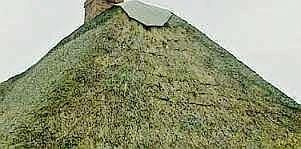 
_Abgemorschte und -gefrostete Reetflächen - ein deutliches Zeichen überhöhter Dauerfeuchte der Dachdeckung und -konstruktion._

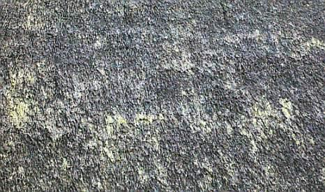 
_Angemoderte, nasse, verrottende Reetdachfläche auf Wohnhaus-Ostseite (!), 10 Jahre nach Neudeckung - darunter Vollwärmedämmung. Die anderen Reetflächen - nicht "unterdämmt"! - in nahezu perfektem Zustand. Bildquelle und Information dankenswerterweise für diese Seite zur Verfügung gestellt: Regine Schröder, von[www.reetdachdesign.de/](http://www.reetdachdesign.de/)_

Ergebnis energiesparender DIN-Bauweisen: Feuchte ohne Ende, Materialauffrostung, Insekten-, Pilz- und Schwammbefall, bis die Bewohner sich totgehustet haben. 

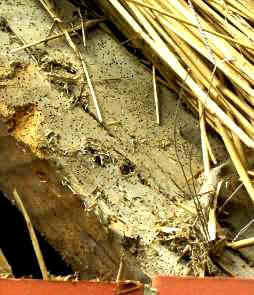 
_Wurmstichiger Sparren unter Reetdeckung am Auflager ebenso wie auf der gesamten Sparrenlänge_

So siehts unter nahezu jedem "modern-dauerfeuchten" Reetdach über bewohnten Geschoßen nach einiger Zeit "vorzeitiger Alterung" mit bauphysikalischen Problemen aus - Holzwurmbefall (Anobium punctatum - Gemeiner Nagekäfer, Xestobium rufovillosum - großer Holzwurm, Lyctus bruneus - Splintholzkäfer, Hylotrupes bajulus - Hausbock usw.) pur, vor allem auf der deckungszugewandten Seite. Und die Schwellen sind oft schon im 19. durch Hausschwamm weggemodert worden. Schlechte Ware (zellulasehaltiges oder pilzbefallenes Reet), Alien-Schleim, Algen, Moos und Pilze in geheimnisvoller Symbiose (Moos liefert dem Pilz lebenbswichtige Feuchte und bekommt dafür die beim Zelluloseabbau entstehenden Zucker als Nahrungsmittel), ungünstiger Standort, fehlende Chemie-Keule (Fungizid, Algizid), Dachgrippevirus, mangelhafte Verarbeitung, Probleme beim Transport der Reet-Bunden, auch Docken oder Schoofe genannt? Geniale Handwerksmeister empfehlen bei der allfälligen "Sanierung" dann innenseitige Sparrenaufdoppelung, Vollsparrendämmung mit bestens absaufenden Schäumen, Gespinsten und Fasern - nicht ohne die nässegarantierende Dampfbremskondensationsfangfolie gem. "Deckregeln des Dachdeckerhandwerks", Norm, Planer-, Dachdeckermeister- und Bauherrenwahn zu vergessen. dpa berichtet am 28.2.07: "In kurzer Zeit verfault - Rätselhafter Pilz befällt Reetdaächer" und beschreibt eine "rätselhafte Pilzerkrankung, die "schmucke Reetdächer" bedroht und gegen die es kein "nachweisbar wirksames Gegenmittel gibt", "ein feuchtes, weißliches Gebilde mit starkem Pilzgeruch" verwandelt die "betroffenen Bereiche zu Matsch". Schnellstens verrotten dann die infizierten Reetdächer, verdächtigt wird ein "Zellulose fressender" Industrie-Pilz, der teuer-thermische Auflösung pflanzlicher Zellstrukturen ersetzen soll. Erinnert das nicht irgendwie an die AIDS-Debatte, in der es doch nur darum ging, die multi- und homosexuell-drogensüchtigen sowie auch die pharmazeutisch-brutalen Marketing-Praktiken in Schutz zu nehmen und die Tatsache zu unterdrücken, daß das afrikanische "AIDS" (Affenfresser- und bumserdebatte!) nur eine allzu logische Folge des westlich verursachten Hungers und der Armut ist? AIDS selbst ist dabei ja letztlich nur das Symptom einer meist tödlich verlaufenden Hepatitis-Gelbsucht, wie seriöse Forschung schon lange herausgefunden hat. Doch das ist ein anderes Thema, ich weiß schon.

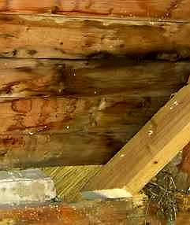 
_Neuzeitliche Unterschalung der Reetkehle am Sparrenfuß 
Durchfeuchtungsspuren und Teilvermorschung belegen Dauerfeuchte trotz mächtiger Reetdeckung_

---

Altdeutsches Meisterhandwerk, wo bist Du geblieben? Alles nur noch Normen-Glauben ohne den dafür notwendigen Anstand, und kein Wissen, dem Kunden das Dach von oben bis unten mit Feuchtefängern wie Dämmstoff und Folie zugekleistert bis die Nässe über und unter der Foliendichtebene tropft? Ist da auch nur die Haupt- und Berufsschule mit flugs abgewähltem Religionsunterricht dran schuld? Das ist bestimmt nicht nach alter Väter Sitte! Dafür aber jedes Jahr das Moos teuer abgerecht, die wurmstichigen Balken feste ausgewechselt, die Schimmelpilzschwammerlhütte total saniert. Na ja, der Bauherr hats ja dicke. Und Moos ist eben ein super Synonym für dicke Kohle, oder wat? Unter dem Moos und den Algen auf der Dachfläche, die die Zellulose im dauernassen Stroh und Schilfrohr nicht auffressen, leben aber die anderen Zellulosefresser wie Insekten, Schimmel und Pilze vortrefflich! So kommt es mehr und mehr zum inzwischen allseits beklagten Reetsterben / Reetdachsterben / Reetdachproblem. 

Greift dann der ahnungslose Reeddachbesitzer zur Selbsthilfe und entmoost sein Dach mit den üblichen Grobmethoden, verwüstet er sein Dach noch weiter, verbreitet den Myzelbefall im Halm unter dem Algen- und Moosteppich und zerstört die Halmenden immer weiter, sodaß sie noch bessere Angriffspunkte für Neubefall bilden. Interessant ist auch, daß der Befall von außen oft nicht richtig wahrgenommen wedren kann und sich zunächst vorzugsweise in der unter der Oberflächenzone gelegenen Reetschicht ausbreitet. Bis dort alles vermodert ist. 

So ist inzwischen in sog. eingeweihten Fachkreisen und bei den allseits betroffenen Bauherren weit und breit bekannt geworden, daß selbst ein- bis zweijährige Neudeckungen mit Reet / Stroh schon vehement mit der meist faulig stinkenden Pilzepidemie befallen sein kann und quasi unbemerkt vermodern, verfaulen und verrotten - eine prima Kompostierungsmethode also. 

Ist nun - wie es der Physiker und Reetschadensbetroffenr Ulrich Schäfer vermutet, eine heimtückische neue Pilzart, die Zellulose bis zu 300 mal schneller als "traditionelle Pilze" zerlegen kann, in industriellen Forschungslabors gezüchtet für die Gewinnung von Biomasse, Zucker und andere Nahrungsgrundstoffe aus Zellulose, für die Reet-Katastrophe - Verfaulung und Verrottung - verantwortlich? Wenn ja, bestimmt nicht alleine. Pilze brauchen eben bestimmte Lebenbedingungen. Und die heißen neben dem Substrat (die schmackhafte Nährstoffgrundlage) vor allem Temperatur und Feuchte. In den modernen Reetdächern, vielleicht auch noch besonders romantisch garniert mit allzunahem schattenspendenden und trocknungsblockierendem Baumbestand - kommt das notwendige Schadenspotential in mykologischer und bauphysikalischer Sicht ungebremst zusammen, der Befall durch ubiquent / überall existente Pilzsporen ist folglich durch Baufehler vorprogrammiert. Das Reet fault. Wer dafür verantwortlich ist? Raten Sie doch selbst. 

Zur Anregung Ihres Grübelns: Ein Reet-Rührstück (Vorsicht: Satire!) 

Ja, so manch braver Reetdachdeckermeister hat es schon schwer, so schwer. Mit dem Kunden aber erst mal nicht. Der will aus tiefstem Inneren des Herzens, des Bauches und der Seele eben seine persönliche Glückseligkeit partout unter einem teuren und zugegebenermaßen superschönen heidschnuckeligen Reetdach nach altbewährtem Herkommen verwirklichen. Das kann doch jeder nachvollziehen, der noch etwas Menschen- und nicht nur Stockfischblut in den Adern brausen und nicht nur herumdümpeln hat. Sein Erlöser heißt Reedachdecker Johann Johannson, Fritjof Fritjofsson, Paul Paulsson, Peder Pedersen, Mads Madsen, Hein Blöd oder so. Ein wirklich toller Hecht und Altmeister seines Faches, seine wasserblau verschmitzten Äuglein strahlen Güte, Wissen, Herzlichkeit und Rundumvertrauen aus. Sein schlohweiß verstrubbeltes Haupthaar gibt ihm die notwendige Würde. Ja, das alles überzeugt jeden, vor allem auch die kritische Frau, die doch sonst an den Wahnideen ihres Ehgespons immer was auszusetzen findet. Der Reetexperte ist der Mann der Wahl, er bekommt alles, was er will, fette und flüssige Brotzeit bei seinem verantwortungsreichen und mühseligen Deckgeschäft inklusive. 

Und sein Reetlieferant? Der hat allerlei Sortierungen auf Lager, leider und sehr vielleicht auch mal minderwertigere und feuchtere Provenienzien, die lieber nicht auf ein Qualitätsdach drauf sollten. 

Wenn nun der Preis allzusehr stimmt, hat der kluge Reetverschieber den geizgeilen Handwerksmann so richtig in der Tasche. Der Lastzug - gerne auch aus dem Osten - fährt das Reetbüschelallerlei mit arg dünnen oder auch arg dicken Halmstängeln bunt untermischt - günstigst auf den Hof oder gleich auf die Baustelle. Jetzt kommt, was kommen muß. Während ein grobes Qualitätsreetbüschel aus vaterländischem Abbau (gibt's heute dank Ökobiotopschutz fast nur als widerrechtlich einzeln handgepflückte Ikebanabeilage, nach dem Ostereiersuchen ist das einheimische Reet jedenfalls meist schon ausverkauft) sich bestens elastisch bis zum Gehtnichtmehr übers Meisterknie biegen ließ, gibt es eben auch andere, feinere Provenienzen. Die kommen dann vorzugsweise aus fernen Ländern daher, wie die Gewürze auf der kamelbetrampelten Seidenstraße. Hauptsache billigst und allergrößte Gewinne - bestimmt nicht unter 1000 Prozent - versprechend. Und trotzdem noch billiger als einheimische Ware. Die Kniebeugprobe besteht sowas nur bedingt bis gar nicht. Das giersche Kraut schoß unter südlicher Sonne und in schad- und düngestoffbefrachteter gelber Klärkloake vielleicht dermaßen in die Höhe, daß an einen qualitätsdeutsch mühsam und unter allerlei nordeutsch-germanischen Entbehrungen heranwachsenden groben Biegestengel gar nicht mehr zu denken ist. Das Gebüschel wird von zarten Kinderhänden und allerunterstem Sklavenprekariat nahezu umsonst geerntet und über weitverzweigte Handelswege immer noch gewinnabwerfend zu (angeblich) deutschen Weiterverkäufern frisch auf den Tisch geliefert. Na ja, das braucht schon seine Zeit. Und die können allerlei Schädlinge von mongolischen Krabbelläusen über asiatische Spezialistenpilze bis zu was weiß ich für welchen Hühnergrippeviren bestens für sich nutzen. Die feuchten Lagerschuppen, Tankerbunker, offen beregnete Monsunhalden oder auch Überlagerung in kondensatgeplagten einheimischen Lagern tun ihr Übriges, um dafür beste Voraussetzungen anzudienen. 

Zweite Wahl wäre zu viel zu optimistisch für das, was da dahergekarrt und geschifft wird. Doch es muß aufs Dach, es muß, es muß. Wenn es nicht nur brüchig ist, sondern auch weit über 25 Prozent Materialfeuchte hat und vielleicht schon arg schimmelig muffelt? Wenn die Viecher drauf und drinnen krabbeln? Egal, egal - wat mutt, dat mutt. Und wenn nicht? Dann muß der Lieferant gewechselt werden und der Bauherr warten. Und die Fristen? Oh je! 

So wird aufs Dach gebunden (ja, mit Tauen, anno dunnemals) oder genäht (mit Sisalschnur oder Hanfschnur)- manch braver Handwerksmann tut gerne supergebildet und erzählt davon mit Inbrunst - greift dann aber manchmal billigerweise zum Akkubohrer und schraubt die Niroschrauben mit Drahtanhang in die Latten - soweit er die Latte überhaupt trifft. Dann legt er seine Reetbüschel auf, darüber die lange Drahtstange, und daran rödelt er seinen Drahtanhang fest. So zurrt er je nach Tagesform und Muskelkraft die Büschel fest. Wenn es weniger fest ist, braucht er weniger Büschel und das Zeugs hängt allzu lose. Wenn er seinen guten Tag hat, drillt er das Reet superdicht, dann hält es die Feuchte besser und wird umso schneller Opfer der Verrottung. Das ganze kann durch die Verwendung der Eisendrähte bestens beschleunigt werden. Sie ziehen ja - weil länger kalt - in besonderer Weise den Tau und die Regenfeuchte an. Schlauheit des Materials, Intelligenz der Konstruktion, Blödsinn des Pfuschs. Wofür hat man denn seine Regeln? 

Und um das ganze noch zu toppen, sind so einige Reetdecker offenbar zu tropfig, um das Fenstertropfbrett ausreichend zu bemessen. Dimensionieren sagt der lateinische Franzos. Es sieht so zwar hübsch schmal aus, läßt aber dafür das Gaubentropfwasser sturzbachartig sowohl die ungeschützte Auftropffläche - immer unterhalb des Bretts - schau nur mal bei Regen aus dem Fenster, guter Reetdachbewohner - zerdeppern und den Rest bis in tiefste Tiefe extra auffeuchen. Folglich fängt unter den blöden Gaubenfenstern (gab es früher eher auch nicht, weil die Dächer ja nicht ausgebaut waren! - abgesehen von nur der stetigen Lüftung und Trocknung dienenden, korrekt bemessenen Fledermausgauben in Scheunendächern) die Reetverwesung gerne am ehesten an. Ausnahmen bestätigen die Regel. Und auch wer stur glaubt, viel hilft viel, ist beim Reetdach auf dem Holzweg. Überdicken bringen in Richtung Dachfirst die für den ausreichend geschwinden Wasserabfluß notwendige Dachneigung - also die konstruktiv gebotene Mindestdachneigung von 45 Grad - locker runter in Richtung 30 und sogar noch weniger. Ebenso werden an den schmuck geschwungenen Gauben / Dachgauben und den Kehlen / Dachkehlen ebenfalls Unterschreitungen der Mindestneigung hingenommen / toleriert, die jedem handwerklichen Know-how nicht nur widersprechen, sondern m.E. den doofen Kunden brutal verhöhnen. Das Unterschreiten der Mindestneigung bedeutet immer längeres Verharren des Regenwassers am Dach und deswegen eine insgesamt nässere Dachhaut. Das programmiert alle damit zusammenhängenden Schäden vor und ist Kundenbetrug hoch drei. Wer schön sein will, muß leiden. Echtes Handwerk ist eine große Kunst und setzt viel Verstand und Erfahrung voraus. Das gilt auch am Reetdach bzw. Schilfdach / Rohrdach. 

So kommt eben manchmal, was eben kommen muß: Reetpfusch fein, nicht grob, mal fest, mal lose, gern auch auf Vollsparrendämmung, der seinen Keim der Schnell-Verwesungschon in sich birgt und fast kein Jahr mehr hält, was der Traum vom Reet einst versprach. 

Doch damit manchmal nicht genug. Die überhohe Bereicherung der Reetbüschel mit dem bunten Allerlei sucht seine Opfer. Nicht mehr ganz hasenreine Reetdachdecker mit nicht mehr ganz unverwüstlicher Gesundheit und angegriffenem Immunsystem bekommen durchaus ihr Fett ab und zeigen köperliche Abwehrreaktionen gegen das Pfuschreet. Allergieschocks vom tränenden Auge über unerschöpflich erschöpfendem Gehüstel (warum hast Du nicht Deinem Lieferanten was gehustet, als noch rechte Zeit dafür war?) bis zu Ganzkörperreaktionen wie pustelübersäter Haut, aufbrechenden Furunkeln allerorten und partiellen Lähmungserscheinunen diversester Körper- und Organfunktionen folgen dann. 

Doch auch damit noch lange nicht genug. So rottet ein verpfuschtes Reetdach noch in der Gewährleistungszeit dahin, der Kunde erkämpft Regreß und dann wird die Bude auch mal notgedrungen dichtgemacht (und unter dem Namen der Frau oder als GmbH schnellstmöglich wieder eröffnet?). 

Nur dumm, daß der Rubel rollen und rollen muß. Und da heißt es ran an den Auftrag mit Dumpingpreisen. Leider gelingt das folgende Aufspecken mit Nachträgen und Zusatzverkäufen von Isolierstoffen und Folienschichten nicht immer wie gewünscht, auch da dreht sich manche Preisspirale viel zu schnell abwärts. Die Lösung (?): Schneller pfuschen. Ja, das ist genau das, was man einen Teufelskreis nennt. Herrgott hilf! 

Was macht nun der Bauherr in diesem üblen Spiel? Erst mal kennt er das Problem nicht in allen Facetten. Wir dürfen also nicht annehmen, daß der Reetdach-Bauherr und seine herumklügelnden Vertreter und Planer - egal ob privat oder staatlich, aus Kirchbauamt oder Freilichtmuseumsleitung - in den materialtechnischen, wirtschaftlich-kaufmännischen, konstruktiven und bauphysikalischen Komplexen in hinreichendem und vor allem schadensvorbeugendem Umfang durchblickt. Wie denn auch, bei all den bekannten Interessens- und Motivationslagen? Wer berät ihn korrekt, ohne eigene Interessen an diesem oder jenem, nur der ewigen Wahrheit gemäß? Ja, da heißt es lange suchen nach den wenigen Nadeln im allzudicken Reethaufen. Doch das Dach ist offen, da bleibt nicht allzulange Zeit für pfuschvermeidende und pfuschbekämpfende Strategieentwicklung. So isses halt wie immer und ewig, solang die Welt sich dreht: Augen zu und durch! Bei mir wird's schon klappen, und außerdem guckt der Schlohschopfmeister doch so treuherzig ... Siehe oben. Dabei weiß jeder - Qualität hat seinen Preis. 

Wie könnten nun die Vorbeugemaßnahmen aussehen? Erstens Trockenheit, zweitens Trockenheit und drittens Trockenheit. In den heute gebräuchlichen Konstruktionsvorstellungen der Baubranche (Energiesparverordnung, Dachdeckerregeln, Gefälleunterschreitung, Vollsparrendämmung ohne ausreichende Unterlüftung, Norm hoch drei) ist das gewiß nicht immer zu gewährleisten. Und notgedrungen vorbeugende Behandlung mit Schutz- und Konservierungsmitteln? Das Grundsatzproblem - die übermäßige Feuchte - ist weder mit algiziden und fungiziden Flüssigkeiten noch Kupferionenspendern beseitigt, sondern braucht mindestens Unterlüftungsergänzung. Von pharmazeutischen Produkten zur Infektionsvorbeugung und Behandlung, gegen Asthma, Allergie, nässenden und eitrigen Hautauschlag, Atemwegserkrankung, Herzattacke und Gliederlähmung will ich hier nicht reden - fragen Sie Ihren Arzt oder Apotheker und die ihren Pharmareferenten. 

Viel wichtiger als gedacht, gewußt und geplant ist auf jeden Fall der konstruktive und thermische Schutz, an dem es sonst hapert und auf den so viele Experten rein gar nichts mehr geben. Ein stetig durchwärmtes und ausreichend belüftetes Reetdach trocknet (wie jedes Dach) schnell aus und bietet den feuchteliebenden Schädlingen logischerweise nicht besonders angenehme Lebensbedingungen. Und sogar die moderne Bindungsart ist als nicht unwesentlicher Überfeuchtungsfaktor zu verdächtigen, da sie wie das Nach-Stopfen von schon verrotteten Schadensbereichen bei der Reet-Reparatur mehr Feuchterückhaltung spendieren kann, als bei der alten Bindetechnik, wenn heutztage - aus guter Absicht, zugegebenermaßen - zu dicht und zu dick gedeckt wird. Doch gut gemeint ist nicht immer auch gut getan. Ja, der Volksmund und die Weisheit des Sprichworts. 

Wenn man Glück hat und der Verwesungs- und Kompostierungseffekt noch wesentlich über der Bindung sein Ende findet, läßt sich das angekrankte Reet vielleicht sogar noch retten. Runterreißen, evtl. an Schwachstellen flicken, besser unterlüften und von innen die Feuchtezufuhr möglichst unterbinden und die Wärmezufuhr verbessern. Ansonsten Neudeckung - jetzt vielleicht mit Betondachstein oder Wellbitumenpappe? Wenn's Geld noch langt. 

Daß sich heutzutage keiner mehr nen Kopp macht, wie früher die Schilfbüschel / Reetbüschel oder Strohgarben gebunden wurden, läßt ebenfalls einen tiefen Einblick in die material- und baustoffverdummte Handwerkspraxis zu. Selbstverständlich - und das wissen aufmerkasme Bauforscher schon von metallischen Nagelungen und Schrauben im verrotteten Holz - hängt sich im jahresablauf oft genug Kondenswasser / Kondensat an die metallischen Befestigungsteile, egal ob V2A-Schrauben und Bindedraht / Runddraht / Schachtdraht 4,6 mm für im gebundenen Dach oder der 1 mm starke Nirostadraht zum schneckenförmigen Vernähen der Rohrbunde mit den Dachlatten. Warum das so ist? Nicht, weil Metall eine höhere Wärmeleitfähigkeit als Holz oder Schilf aufweist, weit gefehlt! Es ist die höhere Speichermasse, die sich der Erwärmung länger widersetzt, als die Baustoffe mit geringerer Dichte. So bleiben alle Materialien mit höherer Rohdichte "automatisch" länger kalt bei Aufheizvorgängen - dafür auch länger warm bei Abkühlung. Das kann man an der mit der Staubanlagerung und Verschmutzung einhergehenden Kondensatanreicherung in falsch geheizten und falsch gelüfteten Räumen oft detailgenau beobachten: Beispielsweise zeichnen sich bei der [heizungsbedingten Verschmutzung von Raumschalen](7temp02.md) die Mörtelfugen heller ab als die massiven Mauersteine, bei der Verwendung der minderwertigen Porensteine kann sich das dann umdrehen. 

Folge der Metallverwendung im Reetdach: Feuchteanreicherung, wo man sie nun wirklich nicht brauchen kann. Es war also nicht Armut, die unsere Altvorderen zu Naturmaterialien (Hanfschnur u.ä.) für die Dachverarbeitung greifen ließ, sondern jahrhundertelanges erfahrungswissen, das dann die Industrialisierung abschaffte. Immer zum Schaden der Qualität, oder? 

Noch was? Ja freilich! Materialanforderungen für Reet (usw.) in der Planung qualitätsmäßig festschreiben ohne Ende. Das setzt freilich Materialkenntnis und Baustoffverständnis voraus. Halmdurchmesser, Feuchtegehalt, Provenienz, Bindungsdichte und -art. Und prüfen, nachgucken, kontrollieren, beschnuppern, betesten was das Zeugs hält. Provenienzkontrolle, Lagerschupppeninspektion, Lieferscheinverdächtigung in unabhängiger Hand! Auf Deutsch: Planung und Bauleitung. Doch wer soll das leisten für'n Appel und'n Ei? Wo doch dat Reet scho so kost! Ein Vermögen! Und warum denn sich die Mühe machen und einen Reetdachdecker raussuchen, der dank altdeutscher Handwerksgesinnung und Gewissenhaftigkeit erwiesenermaßen über langjährig schadensfreie Referenzobjekte und beste Gewährleistungsreferenzen verfügt? Also: Lat et loopen, wie et loopen will! Das Leben ist eben ein Abenteuer. Viel Glück, Erfolg und Gottes überreichen Segen! Jawollja!

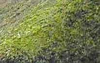 
_Ein moosgrüner Grat im Detail - hier kommt die Beregnungsnässe von zwei Seiten zusammen. Und hier Naturdeckungen (Schindeldeckung / Schindeldach / Holzschindeldach / Holzschindeldeckung sowie Reetdachdeckung / Rohrdachdeckung / Strohdachdeckung auf Museumsobjekten, die dort fleißig vollbiologisch kompostieren und auf vergleichbare Prozesse im Hausinneren hinweisen: 
_

_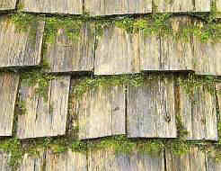.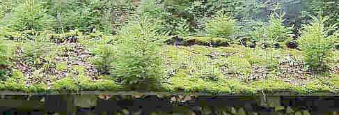 .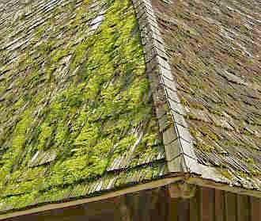 .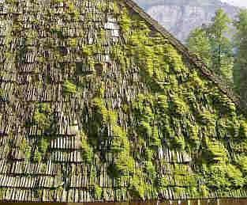 .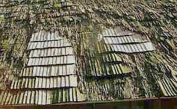 
So gut kann man heiße Rauchgase zur Konservierung der Gaumenfreuden zweitverwursten: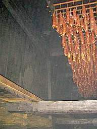 .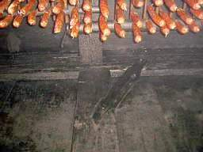 
_

Weiter mit dem Fallbeispiel Reet: 
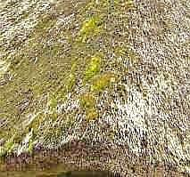..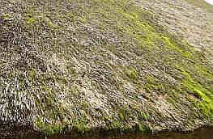 .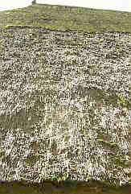 .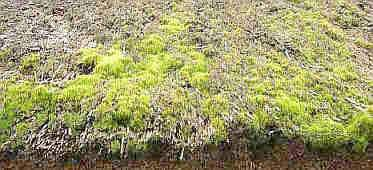 
_Hier gedeihen allerlei Insekten: Staubläuse (Psocoptera, Lepinotus patruelis, Lepinotus reticulatus, Trogium pulsatorium), freilebende Raubmilben (Gamasina, Andreolaelaps casalis), Hornmilben und Moosmilben (Oribatei, Euzetes globulus), Kurzdeckenkäfer (Staphylinidae, Hypocyphus) und allerlei sonstige Käfer und Spinnen in reicher Artenvielfalt. Herrlich, welch feines Biotop ein vollbiologisches Naturdach bietet - doch manche Reetbewohner graut es davor. Die gemeine Staublaus und ihre Freunde bevorzugen feuchte Umgebung - ein nassvermoostes Reetdach bietet hier ideale Bedingungen, auch schon am Anfang - bevor es moost._

Wie man die lieben Mitbewohner ausfindig macht? Einfach mal an der Traufe etwas mit der Hand aufs Reet kloppen, dann fallen sie in rauher Menge heraus. Leider nicht alle, die es sich im feuchtwarmen Bettchen so bequem gemacht haben, das der moderne Dachnaßdämmer so liebevoll bereitet hat. 

Wer den Befall in neuen Reetdächern zu verantworten hat? Der Reetdachdecker, der doch keine Ahnung hat, seine Reetbündel liebevoll immer feste dicht und fett prima wasserspeichernd und wasserrückhaltend auf die Latten schnürt und sowas gaaanz bestimmt noch nie gesehen hat? Der Reetlieferant, der sein Material immer strengstens nach den Regeln für Dachdeckungen vom Zentralverband des Deutschen Dachdeckerhandwerkers anliefert, also "frei von Insekten, Larven und sonstigen Tieren?" Und wie steht da noch?: "Reet ist ein Naturprodukt. Dementsprechend sind bei einer Lieferung und beim fertig gedeckten Dach kleinere Mengen von Insekten und Larven nicht zu vermeiden." (Hier eine zwar ausländerfeindliche, doch vielleicht diesmal ausnahmsweis erlaubte, da so notwendige Ergänzung: "... zu vermeiden, vor allem bei ausländischem Material aus schnellstnachwachsenden Rohstoffen, klimatisch bevorzugt hoher Befallsrate betr. Insekten, Schimmelpilzen, humanpathogenen Krankheitskeimen sowie Allergenen") und überlangen, auffeuchtungs- sowie schädlingsbegünstigenden handelsüblichen Lager- und Transportbedingungen"). Oder gar der schwärmerisch veranlagte Reetliebhaber als Bauherr, der auf sein ausgebautes und möglichst dicht gedämmtes Dachstübli unbedingtens - genau wie der Nachber, versteht sich! - schnuckeliges Reetgebüschel haben will? Alles klar? Denn man tau! 

Hier nun abschließend ein Potpourri oder besser ein Gruselkabinett des Reet-Schreckens, eine Pathologie des aufgenäßten Reetdachs, bzw. der unter einer Rotteschicht aus Moos, Algen und Pilzen begrabenen Reetdachdeckung mit Verpilzung, Verrottung und Deckungsfehlstellen, das Horrorszenario an verschiedenen nur unweit voneinander entfernten Reetdachhäusern aufgenommen im Umfeld einer Reetkatenberatung in Friesland am 03.07.2008: 

Die Reetdachdeckungs-Bilder-Galerie: 

.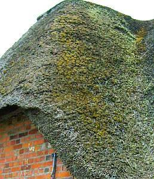.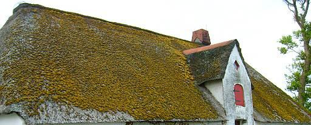.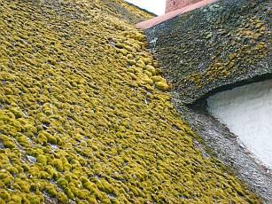 .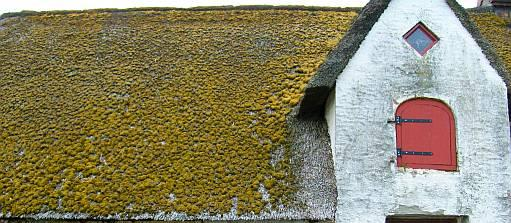.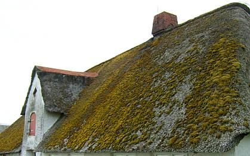.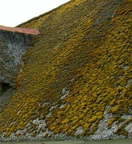 .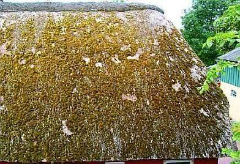.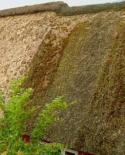.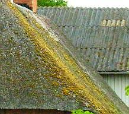 
Da auch das Scheunendach im letzten Bild aus wasserspeichernder / wasserrückhaltender Deckung - zementärem Welleternit - besteht, bildet sich auch darauf Moos und Veralgung 

.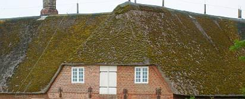. .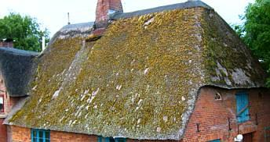.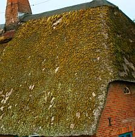.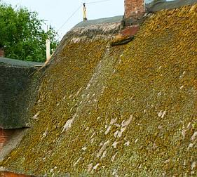 .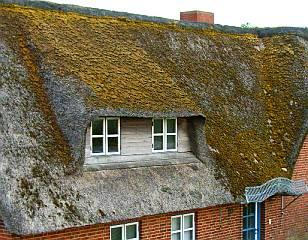.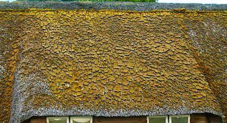.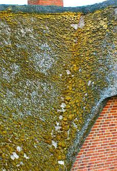 .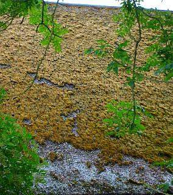.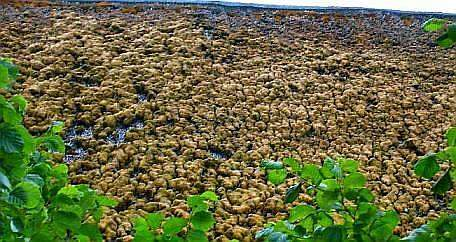.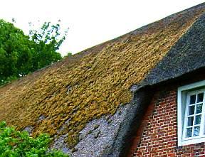 .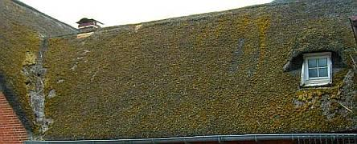. .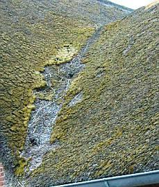.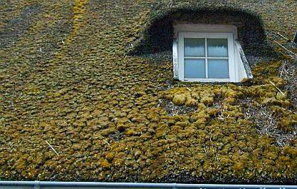.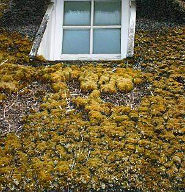 .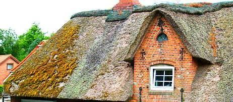.. .. 
Hinter dem bemoosten / moosbefallenen älteren Reetdach ein frisch gedecktes neues Reetdach - mit ersten Spuren der Bewitterung und Wasserspeicherung an den typischen Problemstellen: Reetdach-Kehlen und flacher geneigte Dachfächen über den Reetdachgauben 

 .. ... ... ... .. .. 

 ... . 
Die letzten fünf Bilder sind ein interessanter Sonderfall: Ein bemoostes Reetdach über einer freistehenden Informationstafel. Auch hier hat der Befall mit Moos und Algen zugeschlagen. Im First gibt es schon eine Fehlstelle. Fazit: Ohne Wärmezufuhr wie beim historischen Rauchdach wird es nix G'scheits mit der Reetdeckung. 

. .. ... ... . 

Untersicht einer Rauchdach-Reetdeckung über der offenen Feuerstelle: 
 

Ein letztes Fallbeispiel aus einem Freilichtmuseum. Hier ist es sehr betrüblich, daß nicht privates Kapital vernichtet wird, sondern öffentliche Mittel, aus unser aller Rippen geschnitten und neben einigen sinnvollen Sachen eben auch für allerlei Blödsinn, Verschwendung, Kriegsverbrechen, Bedienung der Lobbyisten und edlen Wahlkampfspender sowie unverschämtester Selbstbedienung der politischen Banditen dank Polizeigewalt, Gerichtshoheit und Finanzamt dem Steuerbürger abgepreßt: 
 
Ein schönes Reetdachhaus im Freilichtmuseum / Freilandmuseum / Volkskundemuseum / Ethnologiemuseum 

 
Ein scharfer Blick aufs Dach: Moos, Humus, Pilz und Rott, nicht nur Reet! 
 
Es riecht erdig und frisch nach lebendigem Humus und Schimmelpilz 

 
Flüssiges Reet fließt das Dach hinunter. 

 

Feuer und Rott im Reetdachhaus: 

So wäre es schon richtig: Feuer und Rauch unter dem Dach wehren Schädlinge ab und helfen beim schnellen Trocknen des widerlich-befruchtenden Sommerregens, der sonst so schrecklich geschwind das Dach benäßt und nachhaltig (sustainable!) durchtränkt. Ist nur total zwecklos, wenn das flammende Feuer immer nur im Falle einer angemeldeten Busbesuchergruppe ein paar Stunden seine so vortrefflich vorbeugende und heilende Kraft einsetzen darf. Und niemals - wie früher selbstverständlich üblich - die ganze ewig lange Nacht hindurch. Eben im Sinne einer modernen [Hüllflächentemperierung](7temper.md) - als konservatorische Heiztechnik im stetigen Betrieb. Und Speisepilze pflückte man als alter Germane oder Hottentotte im Wald und auf der Wiese, nicht auf dem Reetdach. 

. .. . 

So, nun ist aber erst mal Schluß mit den morschen Reetdachfächen. Und wer glaubt, daß es mit den allseits beliebten Ersatzmaterialien besser nausgeht, bittschön: Moos und Flechten auf den ebenfalls prima wassersaufenden und nach etwas Zeit gerne auch mal durchsuppenden Deckmaterialien wie Asbestzementschindeln / Eternitschindeln und / oder Betondachsteinen(Frankfurter Pfanne): 

.   

Schnell zurück zum Reetdach-Problem: Die Misere hat nun im Jahre 2006 schon solche Ausmaße angenommen, daß unter der Federführung von Ministerien und des Dachdecker-Innungsverbandes des Landes Schleswig-Holstein ein extra Forschungsprojekt begonnen wurde, um der mit intensivem Fäulnisgeruch einhergehenden Reetdachverrottung besser auf die Schliche zu kommen. Auch die entsprechenden Beteiligten der Länder Niedersachsen und Bremen wollen sich daran beteiligen. Es sollen die chemischen und mikrobiologischen Vorgänge geklärt werden, die zum vorzeitigen Verfall von Reet durch Pilze führen und die Reetdaächer porös werden lassen. Da darf man schon gespannt sein, was da herausgefunden wird! Mit vielen lateinischen Namen der beteiligten Schädlinge darf auf jeden Fall gerechnet werden. Und die unverwüstlichen Reetdachdecker wiegeln offensiv ab, fordern verbessertes Lüften, wollen Lüftungsmöglichkeiten im Dach einbauen, Giebeldreiecke wieder öffnen, zusätzliche Lüfterrohre einsetzen, publizieren (!) sogar in einschlägigen Magazinen und werben für ihre Kundenfang-Info-Veranstaltungen zu "Reetdachproblemen". Auch die Ziegelindustrie steht schon gespannt in den Startlöchern, denn viele verzweifelte Reetdachbesitzer denken nun über Alternativen für die Deckung nach. Eben jeder, wie er kann. 

Auch eine Alternative: Über den Wohnungen massiv, speicherfähig, temperaturstabil und feuchtesporptionsfähig das ausgebaute Dach mit ausreichender Unterlüftung dämmen, Überfeuchte im ausgebauten Dachwerk durch simple Konstruktionsweise und einfache [Heiz- und Regeltechnik](7temper.md) beherrschen. Weiß davon jeder Reetdachexperte und Dämmstofffanatiker wirklich mehr als Hein Blöd? Und weiß schon jeder Museologe, wie wärmebedürftig seine Lieblinge sind, wie man beispielsweise mit reduzierter Elektroheizkabeltechnik und elektrisch versorgten Wärmestrahlern unter Nutzung der historischen Bauteile das Objekt und seine nicht minder empfindlichen Exponate vor überhöhter Feuchte- und Temperaturkorrosion schützt? Von Kapillarkondensation schon bei Luftfeuchten über 60%? Und wie sieht es aus mit den statischen Mehrkosten bei alternativer Hartbedachung? Die weitgespannten und "dünnen" Konstruktionshölzer der Reetdächer können die Mehrlast einer Hartbedachung nämlich nicht ohne weiteres stemmen, da muß meist nachgelegt werden.

[Gesellschaft zur Qualitätssicherung Reet mbH: reetdachdeckung.de - Reetdachdeckungen in Deutschland - off. Seite der Reetdachdeckerinnungen](http://www.reetdachdeckung.de/)

[http://www.fachwerk.de/goForum.html?id=23921 - Problem Reetdach](http://www.fachwerk.de/goForum.html?id=23921)

[Deutschlandfunk 9.5.2007 - Jörn Breiholz: Faule Dächer - Gammelndes Reet stellt Hausbesitzer vor große Probleme](http://www.dradio.de/dlf/sendungen/umwelt/623477/)

[Lübecker Nachrichten 03.02.2009 - Bad Oldesloe: Rechtsstreit um den Ruf des Reetes](http://www.ln-online.de/regional/2536661)

[Forschung an Pilzen auf Reetdächern wird fortgesetzt - Die Ernst-Moritz-Arndt-Universität Greifswald zur Frage des mikrobiologischen Befalls von Reetmaterial und Reetdaächern durch Pilze](http://www.uni-protokolle.de/nachrichten/id/171148/)

---

**Weitere Dachlinks** 

[Arbeitsgemeinschaft Ziegeldach](http://www.ziegeldach.de) - mit vielen Informationen zum historischen Ziegeldach 
[d-extrakt](http://www.d-extrakt.de) 
[Allroof web crawler](http://www.allroof.com/index.html) - search for worldwide roof and roofing related web sites - Dachziegelseiten im WWW 
[Denkmalpflege](http://web.archive.org/web/20040206152003/http://www.deike-dach.de/denkmalpflege.html) am Dach aus der Sicht eines Handwerkers (Fa. Deike, Meyhen; Objektsanierungen Kirchturm St. Marien und Geleitshaus in Weißenfels unter Leitung Architektur- und Ingenieurbüro Konrad Fischer) 
[Dachmurks - vorgeführt vom Dachexperten](http://www.dachmurks.de/) 

Dachdeckung und Dachkonstruktion - Inhalt: [1: Einführung](212baust.md) [2: Moderne Dachkonstruktion](212bau2.md) [3: Schiefer + Tonziegel](212bau3.md) [4: Betondachstein](212bau4.md) [5: Ziegelnovitäten](212bau5.md) [6: Blechdach](212bau6.md) [7: Flachdach](212bau7.md) [8: Dachausbau](212bau8.md) **9: Reet/Stroh + Holzschindel / Links**
