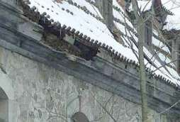
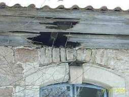

[🠔 Zur Übersicht: Altbau Restaurierung](20bausto.md)  
# 12. Dachdeckung und -konstruktion 1
**Analyse der Dachdeckung und -konstruktion in Alt- und Neubau. Fokus auf Materialvielfalt, regionale Einflüsse, Konsequenzen schlechter Wahl und bewährte Baustoffe wie Tondachziegel und Naturschiefer.**  
_von Konrad Fischer_

Altbautaugliche Verfahren und Baustoffe 
Kapitel 12: Dachdeckung und Dachkonstruktion 1 

> [!abstract]+ Kapitelübersicht: Dach  
> 1. **12. Dachdeckung und -konstruktion 1**
> 2. [Moderne Dachkonstruktion - der todsichere Hit?](212bau2.md)
> 3. [Dachdeckung und -konstruktion 2.1.2 - Einstürze und dramatische Schadensfälle 1990 ff. - inkl. Bad Reichenhall](212bau2a.md)
> 4. [3. Schiefer und Tondachziegel](212bau3.md)
> 5. [4. Der Betondachstein, Asbestzementschindeln und Wellplatten](212bau4.md)
> 6. [Ziegelnovitäten - ein Fortschritt?](212bau5.md)
> 7. [Historische Blechdächer](212bau6.md)
> 8. [7. Ein paar steil bewegte Worte zum Flachdach - kein Flachdachlachen](212bau7.md)
> 9. [8. Dachausbau: Dämm- und Dichtwahn - Dichtung und Wahrheit](212bau8.md)
> 10. [9. Organische Deckungsmaterialien - Naturbaustoffe - Reet/Stroh und Holzschindel](212bau9.md)
> 11. [Wie geht es weiter? - Tips und Tricks zur Instandsetzung und Inspektion](212bau22.md)
> 12. [Moderne Dachkonstruktion - der todsichere Hit?](212bau23.md)
> 13. [Hinweis für besorgte Dachbesitzer](212bau24.md)

Hinweis: Da es hier um die Praxis bei Altbau und Denkmalpflege geht, lassen sich baustoffliche Verweise und Zitate nicht immer ganz vermeiden. Es sind damit **keine** Empfehlungen oder Verdikte ausgesprochen. Für altbauverträgliche Produkte sollte Voraussetzung sein: Eignungsnachweis und qualifizierte Volldeklaration im Sinne des hier abzurufenden [Vorschlags](2volldek.md). 

---

**Inhaltsverzeichnis Baustoffkapitel:**

[Einführung zum Problemkreis "Modernes Bauen"](20bausto.md#einfã¼hrung) 
[Einige Tips zur Produktvermarktung](10hoai22.md) - Ihre raffinierten (von Raffen?) Methoden, Tricks und Betrugsmanöver 
[Zusammenfassung](20bausto.md#zusammenfassung) 
Die anderen Kapitel: [0. Aktuelles](2baustof.md#aktuelles) 
[1. Gibt es "aufsteigende Feuchte"?](2aufstfe.md) 
[2. Erneuerung oder Erhalt von Altputzen](22bausto.md) 
[3. Erneuerung oder Erhalt von Altfenstern](23bausto.md) 
[4. Geeignete und ungeeignete Farbsysteme auf Holzuntergründen im Innen- und Außenbereich](23bau08.md) 
[4a. Rostschutzanstrich](23bau10.md#rostschutzfarbe) 
 [5. Wirksamer bekämpfender und vorbeugender Holzschutz ohne Gift](23bau16.md) 
[6. Luftkalkmörtel für Mauerwerk, Innen- und Außenputze, Dachdeckerbedarf, Verfugung und Verpressung](26bausto.md) 
[7. Mineralische untergrundverträgliche Anstrichsysteme](26bau07.md) 
[8. Ertüchtigung historischer Gründungen durch Stopfverfahren](28bausto.md) 
[9. Natursteinrestaurierung/Naturstein](29bausto.md) 
[9a. Boden/Verkleidung keramisch/mineralisch](29bau07.md) 
[9b. Reinigungsverfahren für verschmutzte Altoberflächen](29bau08.md) 
[10. Wandbildner im Altbau](29bau09.md) 
[10a. Nachtrag: Fachwerkbau/Holzfußboden/Fußbodenaufbau allgemein](29bau16.md) 
[11. Der Stahlbeton und Zement](2beton.md) 
[12. Dachdeckung und -konstruktion](212baust.md) 
[13. Wärmedämmung](213baust.md) 
[14. Brandschutz im Altbau](2baustof.md#14) 
[15. Arbeitssicherheit bei der Altbauinstandsetzung](2baustof.md#15) 
[16. Links zu verwandten sonstigen Themenbereichen ](2baustof.md#16) 

_"Zum Unglück hat sich mit der Industrie ein System verbunden, 
das Profit als den eigentlichen Motor des gesellschaftlichen Fortschritts betrachtet, 
den Wettbewerb als das oberste Gesetz der Wirtschaft, 
Eigentum an den Produktionsgütern als absolutes Recht, 
ohne Schranken, 
ohne entsprechende Verpflichtung der Gesellschaft gegenüber. 
[...] Noch einmal sei feierlich daran erinnert, 
dass Wirtschaft im Dienst des Menschen steht." 
Papst Paul IV. 
(in seiner Enzyklika über den Fortschritt der Völker - [POPULORUM PROGRESSIO - Volltext deutsch](http://www.christusrex.org/www1/overkott/populo.htm))_

**Das Bild zum Thema:** **[Frans Francken - Der Tod und der Kaufmann (1620)](http://www.religionsunterricht.de/ifr/ifr45zd2.htm)**

## 12. Dachdeckung und -konstruktion 1

**1. Einführung**

Als Deckmaterial an Alt- und Neubau finden wir regional und je nach Eindeckzeit die unterschiedlichsten Deckmaterialien und Dachkonstruktionen. Sie sind der lokalen Verfügbarkeit und Mode, aber auch dem Gesetz des Preise unterworfen. Falsche Entscheidungen können hier besonders schwere Folgen haben, denn das geizfüchsige Geilsparen des deutschen Dimpfels bei der Materialauswahl einerseits, seine Großmannssucht und kleinstbürgerliche bzw. protzenhafte Geschmacksverirrung bei der Auswahl der Dachkonstruktion und des Deckmaterials haben nicht nur bautechnische und ästhetische Folgen, sondern können auch Menschenleben kosten. Was hat sich eigentlich dauerhaft bewährt - aus technsicher, wirtschaftlicher und ästhetisch-gestalterischer Sicht? Na klar, Sie haben es geahnt, was jetzt kommt: Vor allem naturrote Tondachziegel und kalkarmer Naturschiefer, in der Verwendung, Tauglichkeit und Dauerstabilität nachrangig auch verschiedene Bleche, etwas mehr eingeschränkt dann Stroh/Rohr und Holzschindeln. Gerade Tondachziegel zeigen durch jahrhundertelange Verwendbarkeit, beste bauphysikalische Eigenschaften und einfache Reparaturfähigkeit, was ein guter Baustoff alles kann. Früher konnten sich gute Tondachziegel nur feiste Äbte und dicke Bischöfe, schnöselige Kaiser, Könige und Fürsten, vielleicht auch noch eingebildete Landadelige leisten, heutzutage eigentlich jeder Bauherr. Doch auf den warten heute auch ganz andere Deckbaustoffe ...

Wie hält ein Dach, egal mit was gedeckt, möglichst lange? Die Antwort ist einfach: Wenn nur die Dachkonstruktion gut von unten her austrocknen kann und die Dachneigung ausreichend steil ist. Früher lernte man: jedes zusätzliche Grad Dachneigung verlängert die Lebensdauer des Daches um x Jahre. Nicht nur, damit der Regen schneller abfließt. Schauen Sie mal genau, wie in der Übergangszeit flachere Dachpartien z.B. im Aufschieblingbereich oberflächlich bereift sind, während die steileren Flächen trocken bleiben. Grund: Je flacher, umso mehr Abkühlung zum eisigen Nachthimmel. Natürlich auch umso heißer im Sommer. Und umso mehr Kondensat wandert im ganzen Jahr in die Konstruktion ein, sommers als Sommerkondensat aus der im Dachbereich abkühlenden warmfeuchten Außenluft mit extremem Feuchtegehalt und Auffeuchtungspotential - denken Sie an die bekannte Bierflasche, die Sie im Sommer aus dem Kühlschrank holen und die die hohe Luftfeuchte sofort als Kondensattropfenfänger meldet, und im Winter durch die von der Raumseite in die niemals dauerhaft abzudichtende Leichtbaukonstruktion namens Dachgespärre und Dachstuhl eindringende Heizluft, natürlich auch mit Luftfeuchte angereichert. Merke: Holz arbeitet und Kunststoffkleber verharzt, wird brüchig, spröde und klebt nicht mehr. Je mehr Temperatur- und Feuchtewechsel, umso schneller. Zum Thema verschimmelnde und aufnässende Dachdämmung bzw. Zwischensparrendämmung aus Faserdämmstoffen, Wollen und Zelluloseschüttungen, egal ob Natur oder Bio, finden Sie ein extra Kapitel unter [Dämmung am und im Dach](21316bau.md).

Ein paar Worte noch zur Hitze unter dem Dach. Was hier getan wird, um den sommerlichen Wärmeschutz möglichst nicht gut hinzubekommen, spottet oft jeder Beschreibung und des Sängers Höflichkeit sollte hier schweigen. Wenn ich nur nicht so vorlaut wäre. Es fängt damit an, daß man luftige Dämmstoffe in die Dachkonstruktion reinstopft, die alle möglichen Zauberkünste können sollen, bestimmt aber nicht das flotte Durchwandern der Sonnenhitze durch das ganze Dach bis ins Schlafzimmer erheblich abmildern, bremsen oder gar verhindern. Das können nur massive und schwere Baustoffe, die dem Durchschlagen von Temperaturveränderungen auf der einen Seite ihre Molekülmasse und -dichte entgegenstemmen. Und wenn der Energieimpuls sich erst mit vielen Masseteilchen abmühen muß, bis er seine Kraft weiterleiten kann, wird er eben müde dabei. Sie spüren das, wenn Sie an Ihrem Tischlein das Deckchen mit der Handfläche berühren - warm! - und danach die massive Holz- oder Glasplatte - weniger warm! oder gar die Stahlfüße - kalt! Wenn wir aber alle diese unterschiedlichen Stoffe mit einem IR-Thermometer befragen, wie warm denn ihre Temperatur in Grad Celsius wäre, werden sie alle 20 Grad Zimmertemperatur melden. Und ihre Handoberflächentemperatur ist eben mal - eiskaltes Händchen ausdrücklich ausgenommen! - 35 Grad. Welche dann eben mehr oder weniger schnell den jeweiligen Stoff erwärmen, in genauer Abhängigkeit von dessen Wärmeverzehrvermögen. Kapito? Gut! Also: Dämmstoffe bringen bei Sommerhitze keine wirkliche Hilfe. Was dann? Na klar: Massivbaustoffe wie Vollziegel und nachrangig auch Massivholz. Die Klassiker des guten alten Dachausbaues. Da gibt es freilich noch Alternativen wie die 7cm-Gipsdielen, die der Verleger Reclam in seinem Sommerhaus unweit Leipzig an die Masarddachfläche montierte und andere mehr, die auch heute noch wirtschaftlich interessant und gut sind. Dazu kommen dann äußere, evtl. auch innere Beschattungseinrichtungen der Hitzefallen "Dachfenster", die ja das energiereiche Sonnenlicht in den Dachraum einströmen lassen und dadurch ein enormes Raumerhitzungspotential aufweisen sowie diverse Alternativen, die Heißluft vor der Raumerhitzung abzulüften. Dafür gibt es ganz simple Lösungen, abhängig von der jeweiligen Dachkonstruktion und Deckung. Es würde zu weit führen, das alles hier darzustellen, der Hinweis mag und muß genügen.

Den Gipfel des "modernen" Konstruktionsblödsinns in Hinsicht auf seine Vergänglichkeit, das Flachdach auf Folienbasis auf taupunktgefährdeter Wärmedämmschicht, wollen wir hier nur nebenbei - doch ebenfalls kritisch - streifen.

_Man muß ein historisches Ziegeldach natürlich auch ein paar mal pflegen im Laufe einiger Jahrhunderte, 
 sonst schmeißt das kaputte Dach über kurz oder lang die Hütte ein._

Leider haben der moderne Planer, aber auch Bauherr und sogar Dachdecker ganz und gar vergessen, daß ein Dach möglichst gut gegen Feuchte schützen soll. Ein Flachdach kann das wegen seiner extremsten Exposition gegenüber UV und Regen, aber auch gegen abkühlenden Nachthimmel mit weit über 100 Minusgraden hierzulande am schlechtesten. Und je flacher das "Steildach", desto mehr Lastfall. Gesteigert wird das noch durch bauphysikalisch unvorteilhafte, weil entweder wasserrückhaltende (z. B. Betondachstein) oder mangelhaft speicherfähige Deckmaterialien wie Blech (hohe [Wärmedehnung](29bau13.md) belastet Dichtheit der Verbindungen, Korrosion!), Zement-Faser (oh, oh, wat sagt die Lunge?)-Plättchen oder -wellen (die dann an Wellenberg und -tal aufreißen - wegen zu großer Bewegungsfreude bei Temperaturwechsel), die ebenso wie unzureichend speicherfähige Wanddämmsysteme nächtens ruckzuck auskühlen und dann allseits zum Kondensator für Luftfeuchte werden. Dat tropft! Schön auch, wenn vorher fest angefroren und morgens die Sonne daherkommt und taut. Feuchteschäden ohne Ende. Weils halt kein Ziegel sein durfte.

Freilich gibt es Dachflächen, für die eine Ziegeldeckung nicht unbedingt das naheliegendste wäre. Sei es ein Hüttchen am Strand, für das Strohmatten, Grasbüschel oder Palmwedel absolut angemessen sein mögen - wobei sogar dort Tonziegel legitim sind. Seien es Vordächlein vor der Haustüre, die gut und gerne mit bruchsicherem [Verbund-Sicherheitsglas](https://www.berlin.de/special/immobilien-und-wohnen/sicherheit/4545518-4480686-verbundsicherheitsglas-bietet-effektiven.html) / Panzerglas oder auch Drahtglas bedeckt werden können, seien es Balkonüberdachungen aus Acrylat-/Plexiglas-Doppelstegplatten oder eine [Alu Terrassenüberdachung](https://www.ws-onlineshop.de/sonstiges-lieferprogramm/terrassenueberdachung-alu/), wobei es auch mal ein Trapezblech sein darf. Und freilich spricht nichts gegen eine Stehfalz-Bleiblech- oder Kupferblech- oder Titanzink-Blechbedachung, meinetwegen vergoldet, wenn es dem gewillkürten Stilbedarf des gehobenen Bauherrn entspricht. 

Ein besonders grausamer Witz, der die moderne Dacheuphorie wieder mal sehr dämpft, spielt sich nicht nur am UV- und lichdurchlässigen Foliendach über dem Stadion (neuerdings "AWD Arena") von Hannover 96 ab: Dort stoßen die lichtsuchenden Insekten von unten an das High-tech-Material und locken damit Krähen an. Und diese picken nun in ihrer übergroßen Beutegier dolle Löcher durch die besonders reißfest-stabile Folie auf sage und schreibe 15.000 qm. Ergebnis: Es schüttet lokal durch das Dach, wo sich das Wasser sammelt, ansonsten tröpfelt und sprenkelt es. Das erfrischt. Dennoch: Man stopft und flickt und picht die Löcher mit Flicken, man beschallt um zu vergrämen - hilft alles nicht so recht. Man überlegt, Greifvögel über dem Stadion auszusetzen, Beschallungsanlagen laufen, an die sich die schlauen Krähen freilich schnell gewöhnt haben und nicht von ihrem bösen Löchern ablassen. Da entdeckt Stadionchef Schnitzmeier den Abschuß als ultima ratio. Und der Naturschutz? "Das sind an sich jagdbare Tiere, nur Kolkraben und Saatkrähen stehen unter Artenschutz", sagt Gerhard Meyer von der zuständigen Naturschutzbehörde, der Region Hannover." lt. Hannover Allgemeine Zeitung HAZ vom 24.4.2007: "Krähenangriff auf die AWD-Arena" Ja, Freunde des runden Leders, da wird es nun bald städtische Schützenfeste geben, an denen sich die 96er ein dolles Beispiel nehmen können. [Auch in Berlin](https://www.stadionwelt.de/sw_stadien/index.php?head=Kraehen-machen-Sanierung-noetig&folder=sites&site=news_detail&news_id=2029). "Samiel!", hätte da der [Freischütz](https://de.wikipedia.org/wiki/Der_Freischütz) gerufen. Und wir sind schon mal gespannt, ob nun neuerdings die Stadtjagdsaison eröffnet wird, wo es doch sonst nur durch Wiese, Wald und Busch gehetzt wird. Wie auch immer: Weidmanns Heil! 

Nachtrag: Jagdsaison abgeblasen, am 18.5.07 verlautbart die Neue Presse Hannover, daß nun der geniale Vergrämungstrick von Egon Müller (77) aus Burgwedel gefunden sei: Krähenmumien bzw. Atrappen sollen beweglich über dem Stadiondach aufgehängt werden - selbstverständlich unsichtbar für die Besucher: "Zwischen den Außenmasten des Stadions oder an Fahnenstangen auf dem Dach will Müller tote Krähen - für Fans und Spieler möglichst unsichtbar - wie an Wäscheleinen aufhängen." Die mumifizierten Krähenwedel des Burgwedeler sollen die anfliegenden Krähen dann krähftig verschrecken. Und nicht die Beutelust, sondern deren eigenes Spiegelbild soll die darob empärten Krähen zum Angriff auf die Glanzhaut der Stadions aufmuntern. Ob das grausig krähenmumienbestückte Stadion den 96ern als modernes Bauopfer-Ritual viel Glück und Punkte bringen wird? Totem und Magie? Manitou hilf! Oder besser Hugin, Munin und Wotan/Wodan/Odin persönlich?

Lesen Sie weiter, was es mit allerlei Dachschäden, alten und neuen Dachdeckungen sonst noch so auf sich hat - ich verspreche: Eine spannende Sache: 

[2: Moderne Dachkonstruktion](212bau2.md) [3: Schiefer + Tonziegel](212bau3.md) [4: Betondachstein](212bau4.md) [5: Ziegelnovitäten](212bau5.md) [6: Blechdach](212bau6.md) [7: Flachdach](212bau7.md) [8: Dachausbau](212bau8.md) [9: Reet/Stroh + Holzschindel / Links](212bau9.md)

---

Alte Ankerlinks - keine automatische Weiterleitung - bitte drücken bei Interesse: 
[Normgerechte Dachkonstruktion - was nun?](212bau2.md#norm dachau) 
[Dachziegel im Mörtelbett](212bau3.md#dachziegelmã¶rtel) 
[Betondachstein](212bau4.md) [Algen, Pilze, Flechten und Moose auf Betondachstein](212bau4.md#betonstein) 
[Ziegelnovitäten](212bau5.md) 
[Nachtrag von der Messe Dach und Wand](212bau4.md#nachtrag von der messe dach und wand) 
 [Flachdach](212bau7.md) 
[Dachausbau: Dämm- und Dichtwahn - Dichtung und Wahrheit](212bau8.md)
