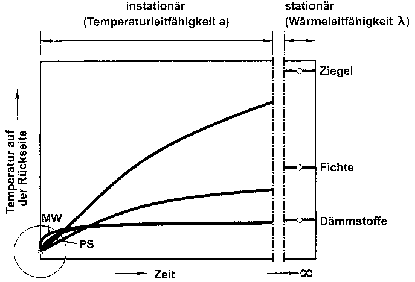

[🠔 Zur Übersicht: Dämmung](213baust.md)  
# Der Schwindel mit Wärmedämmung und Energiesparen 12: Das Lichtenfelser Experiment - Ein Fake?
**Lichtenfelser Experiment - Ein Fake?**  
_von Claus Meier_

## Der Schwindel mit Wärmedämmung und Energiesparen 12

## Das Lichtenfelser Experiment - Ein Fake?

Diskussionen und Stellungnahmen 

Infolinks zur weiteren Information

[zurück<-](21311bau.md) Kapitel [-> vor](21313bau.md)

**[Das Handwerkerquiz](10hoai13.md)\+ [Das Planerquiz für schlaue Bauherrn](10hoai14.md)**

---

### Infolinks zur weiteren Information:

**Das Lichtenfelser Experiment - Wissenschaftlicher Begleittext** von Prof. Dr.-Ing. habil. Claus Meier: 
[Dämmstoff im Vergleich, Bauphysikalische Grundlagen einer Temperaturmessung](http://www.dimagb.de/info/bauphys/daedaeni.html#long#long)

---

**Diskussion und "Diskussion" rund um das Lichtenfelser Experiment** : 

[BAU.DE > Forum > Energiesparendes Bauen / Niedrigenergiehaus > 464: **Heute gabs den Beweis: Dämmung mindert Energieeintrag**](http://www.bau.net/forum/energie/464.htm) 
[BAU.DE > Forum > Dach > 36: **Dachdämmung à la Konrad Fischer ?? Suche Streit ( :-))) ) !**](http://www.bau.com/forum/dach/36.htm) 
[BAU.DE > Forum > Bauphysik > 112: **Lichtenfelser Experiment im Fernsehen - ARD Sendung Globus am 3.4.02**](http://www.bau.de/forum/bauphysik/112.htm) 
[BAU.DE > Forum > Bauphysik > 122: **Lichtenfelser Experiment im Fernsehen II**](http://www.bau.de/forum/bauphysik/122.htm) 
[Mitschrift des ARD-Fernsehbeitrags (mit Prof. Meier, Prof. Gertis und K. Fischer**:****"Zwang zum Energiesparen: Pfusch am Bau?"**](http://www.bau.de/forum/bauphysik/112-17.htm) 
[BAU.DE Forum Fußbodenheizungen / Wandheizungen 279-16: **Pro und Contra Wandheizung und Fußbodenheizung**](http://www.bau.de/forum/fussbodenheizung/279-16.htm) 
[iavg133](http://www.iavg.org/iavg133.htm) - Zur Energiesparfrage 
[DIMaGB.de - Infobereich: Bereich Bauphysik: **Dämmt Dämmung etwa nicht?**](http://www.dimagb.de/info/bauphys/daedaeni.html)**[forum.](http://forum.webmart.de/wmforum.cfm?id=285013)**[DIMaGB id=285013 (Bumann)](http://forum.webmart.de/wmforum.cfm?id=285013) 
[Konrad Fischer: **Kosten- und energiesparend Instandsetzen**](11erhins.md)**[Diskussion dazu](http://forum.webmart.de/wmforum.cfm?id=285013)** 
[dach-info.com - **Diskussion über das Lichtenfelser Experiment**](http://dach-info.com/cgi-bin/diskuss/bbmatic.cgi?getsubject=863) 
[Google Diskussion: **Radon, Konrad Fischer und andere Zerfallsprodukte**](http://groups.google.de/groups?dq=&hl=de&frame=right&th=c5f158bb0821f616&seekm=3cdfef9e.43188321%40news.premium-news.de#link10#link10) 
[Haustechnikdialog - Forum > **193**](http://www.haustechnikdialog.de/forum.asp?id=193) 
[Haustechnikdialog: > 235: **Verschmutzung von Luftleitungen**](http://www.haustechnikdialog.de/forum.asp?id=235) 
[http://www.haustechnikdialog.de/forum.asp?thema=8763 - Welchen Heizungstyp? - mit pros and cons rund um Fischer/Meier](http://www.haustechnikdialog.de/forum.asp?thema=8763) 
Bauphysikalische Zusatzinfo: [Energieeinsparung im Bestand - Grenzen und Möglichkeiten](http://clausmeier.tripod.com/enev1.htm) [Dämmen wir uns in die Sackgasse?](http://web.archive.org/web/20060204213246/http://www.olfry.de/sem1/index.htm) 
[DIMaGB.de - Infobereich: **Schimmel, richtig heizen und lüften (1)**](http://www.dimagb.de/info/bauneu/schiml1.html) - inkl. Interview mit Konrad Fischer 
[Deutscher Siedlerbund e.V.: Was bringt uns die Energieeinsparverordnung?](http://www.siedlerbund-gesamt.de/cgi-bin/mred.pl?ID=sb58) Interview mit Konrad Fischer 
**[Das Energiespar-Interview mit Konrad Fischer (pdf)](http://www.eurobau.com/internet/fischer.pdf)** 
<news://news.t-online.de/abnnun%242pi%2401%241%40news.t-online.com> - Aufklärung wirkt - wenigstens bei Bauherrn 
[Das "Lichtenfelser Experiment" - Forum archiFee](http://www.EnEV24.de/forum1/showtopic.php?threadid=28) 
[Ziegelphysik und andere urbane Mythen aus dem Baubereich - Forum archiFee](http://www.EnEV24.de/forum1/showtopic.php?threadid=78) 
[Ziegelphysik.de](http://www.ziegelphysik.de) - die Webseite des anonymen E. Lange - immer profimäßiger betrieben lt. denic von Daniel Rinninsland der Firma [lueftungsnet.de](http://www.lueftungsnet.de) 
[Erfahren Sie, welche Auswirkungen der heutzutage praktizierte Dämmwahn hat](http://www.mythen-post.ch/datei_mp_6_02/daemmwahnauswirkung_mp_6_02.htm) 
[Das Forum - Haustechnik-Dialog - Dämmung mit Styropor: Diffusionsverhalten?](http://www.haustechnikdialog.de/forum.asp?fid=56322&forum=7&uebersicht=1) 
[Das Forum - Haustechnik-Dialog - Feuchte Luft im Kellerraum ! Was tun ?](http://www.haustechnikdialog.de/forum.asp?fid=79944&forum=5&uebersicht=1) 
[groups.google.de... - Dicke Mauern dämmen?](http://groups.google.de/groups?hl=de&lr=&frame=right&th=d4cd64427fff2d7&seekm=at3e7g$d6d$1%40news.online.de)

Und hier die Bestätigung aus Finnland, daß Mauerwerk viel besser ist, als ein k-Wert je rechnen kann: [Impact of the Exterior Wall Structure on the Energy Efficiency of Building](http://www.kolumbus.fi/finnmappartners/rym/eng/ttkk.htm) in [Deutsch ](http://www.dimagb.de/info/bauneu/mbbph2.html#wahrheit#wahrheit)dank Kollege Bumann

Zum Abschluß - **die Stellungnahme zur Kritik der "etablierten Bauphysiker" am Lichtenfelser Experiment** : 

_1. Beim Lichtenfelser Experiment wurde eine 4 cm Platte nur 10 Minuten bestrahlt. Daraus dürfe nicht auf das ganztägige Verhalten bzw. auf die Heizperiode geschlossen werden._

Das Experiment zeigt, daß einseitige Temperaturveränderungen durch übliche Dämmstoffe fast ungebremst durchschlagen, im Gegensatz zu Ziegel und Holz. Diese bauphysikalische Tatsache ist als Temperatur-Amplituden-Verhältnis" (TAV) bekannt, das für den 24-Stundentag gilt. Ein 1200er Ziegel erzielt bei 36,5er Wand ein TAV um etwa 0,095 - dagegen Wärmedämmstoff über 0,3. Die im Experiment benutzten 4cm Platten können bei nur 10 Minuten Bestrahlung die baupraktisch maßgeblichen, also strahlungsbedingten Baustoffunterschiede bezüglich Absorptions- und Speicherfähigkeit aufzeigen. Da die entscheidende Betrachtungsperiode der 24-Stunden-Tag ist, bei dem tagsüber Solarstrahlung eingespeichert wird, ist bei speicherfähigen Außenbauteilen nicht nur der tägliche Mitnahmeeffekt der passiven Solarnutzung, sondern auch der geringere Nachheizbedarf in der Nacht von Belang. Die Massivwand vermag nämlich das Tagesangebot an solarer Wärmezufuhr bis weit in die Nacht zu speichern und kühlt nicht so rapide aus wie Dämmfassaden. Deswegen saugen die schnell abgekühlten Dämmfassaden das Kondensat der abkühlenden Umgebungsluft ein, saufen ab und verschimmeln und veralgen. Und was nur wenige wissen - selbstverständliche haben wir das Experiment länger laufen lassen. Eben stundenlang, schon aus wissenschaftlichem Interesse. Die Daten sind dokumentiert. Nur können wir keine Daten gegenüberstellen, da unter dem sog. "Dämmstoff" Mineralwolle das Thermometer nach 15 Minuten den Meßbereich überschritt. Und auch nach Stunden haben wir im Massivstoff keine Temperaturen, die Dämmstoff nach 15 Minuten erreicht. Insofern ergeben längere Bestrahlungen in der Sache keine Änderungen des thermischen Verhaltens. Wer es nicht glaubt, soll es meßtechnisch widerlegen. Dankenswerterweise hat sich endlich das Fraunhofer Institut für Bauphysik der dürftigen Möglichkeiten der Lichtenfelser "Experimentatoren" erbarmt und mit seinen überlegenen Kräften mittels dessen Direktor, o. Prof. Dr.-Ing. habil. Dr. h.c.mult. Dr. E.h. mult. Karl Gertis, folgende ergänzende Korrektur rund um lambda, rho und Meßtechnik vorgenommen (aus den Tagungsunterlagen beim [VBN/BVS-Symposium am 14.12.02 im Congress Centrum Hannover](12akt.md#vbn 14.12.02)): 

**_"_Bild 13_ Zeitlicher Temperaturverlauf beim Lichtenfelser "Experiment", wie er hätte wirklich ablaufen müssen."_**(Originalbetitelung).

Im Text (Seite 11 ff. der Tagungsunterlagen) weist Prof. Gertis dann darauf hin, daß bei unserer "Lichtenfelser" Grafik nur die beiden _"Meßpunkte "Start" und "10 Minuten" mit einer Geraden verbunden"_ wurden (Stimmt! Auf die Darstellung der Zwischenergebnisse haben wir verzichtet, da es uns nur auf das 10-Minuten-Ergebnis ankam.), was fälschlicherweise _"Linearität"_ unterstellt. Aufheizvorgänge verlaufen aber (vgl. _"Bild 13"_) nicht linear. Außerdem ergibt sich nach Gertis offenbar eine Angleichung der Temperaturen bei den _"Dämmstoffen"_ , sie werden letztlich gleichwarm. Polystyrol bietet lt. dieser Meinung gegenüber Mineralfaser also keine nennenswerten Vorteile. Und Holz ist am Ende dem Ziegel scheinbar doch etwas unterlegen bei der Temperaturableitung. Das wird die Ziegelphysiker freuen, hatten sie doch auf so ein schönes Ergebnis der (nun völlig zu Recht!) etablierten Bauphysik nie zu hoffen gewagt. 

Weitere Zitate aus dem Text von Prof. Gertis: 

_"Der stationäre Endwert der Kurven ist von der Wärmeleitfähigkeit, also vom Dämmwert, abhängig, der übrige nicht-lineare Kurvenverlauf hängt nicht von der Wärmeleitfähigkeit (lambda), sondern von der Temperaturleitfähigkeit a = λ/c x ρ ab. ... Man erkennt, daß die Temperaturleitfähigkeit z. B. von Holz relativ klein und von Mineralwolle relativ groß ist. ... Der Dämmstoff mit hoher Temperaturleitfähigkeit (Mineralfaser) heizt sich schnell auf, der mit niedriger Temperaturleitfähigkeit (Polystyrol) langsamer. Der Endzustand beider Dämmstoffe ist der gleiche, weil beide Dämmstoffe die gleiche Wärmeleitfähigkeit von 0,04 W/mK besitzen. Analoges gilt für die Stoffe Holz und Ziegel. Ziegel heizt sich schneller auf als Holz, weil er eine höhere Temperaturleitfähigkeit (16 cm 2/s) als Holz (4 cm2/s) besitzt. Der stationäre Endzustand von Ziegel und Holz ist verschieden, weil beide Stoffe eine unterschiedliche Wärmeleitfähigkeit aufweisen. Beim "Lichtenfelser Experiment" wurde in willkürlicher Weise ein sehr kleines "Zeit-Fenster" von 10 Minuten herausgegriffen, das in Bild 13 als Lupen-Kreis markiert ist. Man ersieht, daß sich in diesem winzigen Zeitfenster in der Tat die linearisierten Gradienten ergeben. Die Messung selbst dürfte deshalb im Rahmen der sonstigen Messungenauigkeit sogar richtig sein; die Interpretation und die gezogenen Schlußfolgerungen sind hingegen falsch. ..."_

Gottseidank hat nun Prof. Karl Gertis, allseits als Papst der Bauphysik verehrt und obendrein ein wirklich (!) respektabler Komponist und Musikant, unsere Unzulänglichkeiten endlich korrigiert. Wer im Winter draußen Schnitzel auf der schnell durchheizten Außenwand grillen will, weiß nun, womit er bauen muß. 

Nachtrag: Weil nicht sein darf, was nicht sein soll, hat nun kurz vor Anlaufen der Druckmaschinen für den Tagungsband ein Mitarbeiter von Prof. Gertis (in dessen nichterreichbaren Abwesenheit lt. Aussage VBN-Redaktion am 19.5.03) die Grafik ins Gegenteil umgearbeitet. Hier nun der (auf welchen Druck wohl verkehrte?) Bildauszug aus dem dennoch bemerkenswerten [VBN-Info Sonderheft "Topthema WärmeEnergie"](8buch.md#vbn-info): 

Es muß schon schwer sein, IMMER die richtige Kurve zu kriegen. Heute so, und morgen so, und übermorgen wieder anders. Je nachdem, was gerade angesagt wird, was sich eben am nettesten gerade (bzw. krumm) "rechnet". Na denn: simuliert mal schön weiter! Mir tun diese Leute wirklich leid. Bei mir und in der ganzen Praxis am Bau heißt es nämlich nach wie vor: Dämmstoff dämmt praktisch nicht wie versprochen. Und auch die neuesten [Heizkosten-Abrechungsdaten von Prof. Fehrenberg](7fehrtab.md) nähren nur diese Ungeheuerlichkeit. 

Wobei das Fraunhofer in seiner Versuchanstalt / Außenstelle Holzkirchen unter dem Projektleiter Dr.-Ing. H. Werner im Januar 1983 eine höchst interessante Meßreihe über 25 Tage bei einer durchschnittlichen Außentemperatur von 2,5 oC durchführte. Dabei wurde ein Versuchsbau mit gleichen Räumen aber verschiedenen Außenwänden beheizt und dann die unterschiedlich in den Räumen verbrauchte "Heizleistung" verglichen. Ich habe die im mir vorliegenden Bericht betr. "Untersuchungen über den effektiven Wärmeschutz ..." B Ho 8/83-II vom 5. Juli 1983 grafisch dargestellten Ergebnisse der besonders interessierenden Räume 3, 4a und 5 in der folgenden Grafik mal zusammengefaßt: 

Dabei handelt es sich um folgende **Außenwandkonstruktionen mit oder ohne Dämmung** aus "Polystyrol-Hartschaum": 

Wandaufbau gem. Bericht Blatt 39 k-Wert 
Außendämmung (23 cm) mit Fenster 0,16 
Außendämmung (10 cm) mit Fenster 0,32 
monolithisch 49 cm mit Fenster 0,46 

Ei, ei, ei! Was ist denn da herausgekommen? Auf Blatt 25 des Berichts dürfen wir dazu lesen: 

_"Der Vergleich der Heizenergieverbräuche in einem längerfristigen Meßzeitraum [Meßperiode für obige Grafik: "25 Tage, Jan. 1983", durchschnittliche Außentemperatur: "2.5 °C"] ergab, daß die Räume mit den zusatzgedämmten Außenwandkonstruktionen (Außen- und Innendämmung mit Polystyrol-Hartschaum) nicht die erwarteten niedrigen Heizenergieverbräuche aufwiesen, wie sie entsprechend ihres niedrigen k-Wertniveaus im Vergleich zu den übrigen Räumen haben sollten."_

Das wird dann passend zu _"theoretischen Vergleichsrechnungen"_ auf _"besondere Wärmebrückeneffekte"_ geschoben.

Und trotzdem wird immer weiter das Wunder in die Welt gesetzt, daß trotz solcher eindeutiger und hochoffiziöser Niederlagen der k-Wert-Theorie Dämmstoffe zum wirtschaftlichen Energiesparen beitragen könnten. Wo wäre denn dafür je ein echter heiztechnisch sauber gemessener Praxis-Beweis über eine ganze Heizperiode als Vergleich zwischen Ungedämmt und Gedämmt vorgelegt worden? Ich kenne außer den [umfangreichen Daten des ö.b.u.v. Sachverständigen Prof. Jens P. Fehrenberg](7fehrtab.md) keinen! Sie vielleicht? 

Daß die Ziegelindustrie als Auftraggeber der Untersuchung inzwischen selber Dämmstoffe in ihre Luftziegel stopft, ist klar. Man muß sich immer der vorherrschenden Meinung anschließen, wenn man nicht ausgebuht werden will. Und wer will das schon? Außerdem: Es kann halt nicht sein, was nicht sein darf.

_2. Bei einem Gebäude handelt es sich um eine "Außenkonstruktion", jedoch nicht um einen Baustoff._

Wesentlich ist doch, woraus die Außenkonstruktion besteht. Handelt es sich um leichte Dämmstoff-Materialien mit Pappen und Verschalungen oder wird eine schwere Außenkonstruktion gewählt? Leichtbauten sind Barackenbauten, die nicht in der Lage sind, äußere Temperaturschwankungen im Innenraum zu dämpfen. Ihre speicherlosen Dämm-Außenoberflächen unterkühlen im Winter weit unter die Außenlufttemperatur, im Sommer erwärmen sie sich sehr weit darüber. Deshalb muß eine kostenaufwendige Gebäudeausrüstung herhalten, um die raumklimatischen Mißstände zu mildern. Hier werden dann technische Klimmzüge vollzogen, damit die "Baracke" bewohnbar wird. An den mangelnden Schallschutz muß in diesem Zusammenhang auch erinnert werden. Schwere Außenwände dagegen sind temperaturstabil und im Schallschutz hervorragend. 

_3. Daß Speicherung Vorteile bringe, sei doch schon lange bekannt._ 

Das stimmt, nur richtet sich im Augenblick keiner danach. Die EnEV und DIN mißachten die Speicherfähigkeit der Außenkonstruktion - man kennt nur die Solarenergiegewinnung über die Fenster und dafür werden Speichermassen der "Innenbauteile" gefordert. Hier aber geht es um die Speicherfähigkeit und Temperaturstabilität der Außenhülle, die ist wichtig. 

_4. Die Verwendung von Dämmstoff (WDVS) führe zu erheblichen Energieeinsparungen._ 

Diese werden über den U-Wert gerechnet und sind durch keine wissenschaftlich belastbare Messung erwiesen. Der U-Wert jedoch gilt nur für den stationären Zustand, das wird sogar von Hauser bestätigt. Bei einer massiven Außenwand aber wird der instationäre Zustand wirksam. Infolge der Solareinstrahlung und der Nachtabstrahlung der Oberfläche gegen den eisigen Nachthimmel unterscheiden sich Außenlufttemperatur und äußere Oberflächentemperatur wesentlich, deshalb stimmt der U-Wert nie und nimmer. Auch empirische Untersuchungen (z. B. von [Prof. Fehrenberg](7fehrtab.md)) zeigen, daß bauartgleiche Massivbauten mit weniger und ohne WDVS mehr Wärmeenergie verbrauchen. 

_5. Wärmedämmverbundsysteme hätten sich bewährt, man könne auf sie nicht verzichten. 

_

Der Schichtenaufbau führt zu Beeinträchtigungen im Feuchteverhalten. Die Diffusion wird behindert, die Feuchtesorption, der kapillare Feuchtetransport - im Verhältnis 1000:1 gegenüber der Dampfdiffusion, was den Feuchtetransport in Baustoffen betrifft, wird verhindert. Nun wird zwar versucht, die Dampfdiffusion mit Hilfe des Glaser-Verfahrens (Glaser-Diagramm) nach DIN 4108 zu berechnen, um damit berechnete Feuchtefrachten mittels kapillardichter aber diffusionsoffener "Dampfbremsen" zu vermeiden. Dabei wird jedoch vergessen, daß das Glaser-Verfahren lediglich den Wassertransport mittels Dampfdiffusion berücksichtigt, und das bei Bedingungen, die in Wahrheit gar nicht vorkommen. Der wesentlich höhere Anteil des Kapillartransports - Wasser in flüssiger Phase wird dabei durch die Porenräume des Materials transportiert - bleibt unterschlagen, ebenso die klimatsichen Randbedingungen wie Regen und Sonneneinstrahlung. Auch das sorptive (saugende) Aufnahmevermögen des Baustoffs für Tauwasser gibt es im Glaserverfahren nicht. Im Klartext dringt immer Kondensat in sorptionsfähige Baustoffe ein und kann nur flüssig, also kapillar, wieder heraustransportiert werden. Insofern wird in jeder nur dampfdiffusionsoffenen aber kapillarblockierenden Außenkonstruktion eine höhere Feuchtebelastung als im Glaserverfahren berechnet und von Baulaien vermutet eintreten, die den Schimmelpilz / das Schimmelpilzwachstum begünstigt. Infolge mangelnder Wärme-Speicherfähigkeit der äußeren Putzschicht kühlt diese in der Nacht sehr stark ab, die Nachtluft kondensiert ein. Genau das begünstigt auch den Algenbewuchs mit Grünalgen, Schwarzalgen usw.. Die fungizide und algizide Ausrüstung dieser bautechnisch falschen Beschichtungssysteme bekämpft folglich nur die Symptome, die Ursachen aber werden dadurch nicht beseitigt. Und im Winter friert das Kondensat auf und in den WDVS und zerstört damit das hauchdünne Verbundsystem. Resultat: Blasenbildung, Risse, Absturz des Gesamtsystems, wenn ausreichend abgesoffen. 

Immer wieder zeigt es sich, daß bei einem schweren Massivbau günstige raumklimatische Verhältnisse ganz automatisch geschaffen werden, während die "Niedrigenergiebauweise" (kleine U-Werte) wegen fehlender Temperaturstabilität viel technischen Aufwand erfordert, um klimatisch einigermaßen über die Runden zu kommen. 

Es soll nun nicht ausgeschlossen werden, daß die sog. Passivhaus-Bauweise Möglichkeiten eröffnet, mit tatsächlich sehr wenig Energieverbrauch im Winter über die Runden zu kommen. Voraussetzungen dafür sind aber neben einer geradezu extremen Aufglasung nach Süden - mit der Folge gigantischer Sommerhitzen, die nun wieder teuer lüftungsmäßig weggekühlt und wegverschattet werden müssen - ein optimales bauteilseitiges Speicherkonzept und der konsequente Verzicht auf Leichtbaustoff-Wärmedämmung, die die Solarwärmezustrahlung tatsächlich im Wandbereich verwertet und nicht blockiert. Das alles kostet natürlich extra. 

Die Verwendung der auch klimatisch bewährten Massivbautechnik führt dann dazu, daß sich dank bester Temperatur-Amplituden-Dämpfung und Phasenverschiebung (will sagen: die sommerlichen Temperaturspitzen kommen nur stark gedämpft und viel später ins Haus) der Klimatisierungsbedarf vermindern, bei guter Verschattungstechnik wie Klappläden (man denke an die entsprechenden lädenverschlossenen Fassaden zur Mittagszeit in Südländern) auf normale Fensterlüftung am Abend reduzieren läßt - ein Energiespar-Baukonzept, das also im Winter und Sommer funktioniert und am besten mit energiesparender Heiztechnik (Strahlungsheizung/Temperierung) kombiniert werden sollte. 1900er Bauten können die Energiesparwirkung dieser Bauweise nach den umfangreichen Energieverbrauchsanalysen Paul Bosserts in der Schweiz belegen. Sie haben auch ausreichend Fassadenvorsprünge, um eine beregnungsbedingte Auffeuchtung der Fassaden und einen überhöhten Wärmeverlust der Fassade durch Konvektion zu verhindern. 

Unsere Altvorderen waren also gar nicht so dumm, und sie zu übertreffen, braucht es mehr als computerisierte U-Wert-Modelle. Wer der U-Wert-Propaganda nun weiter aufsitzt, möge das nur tun. Viel Spaß an den Folgen! Daß eingepackte Dämmstoffe durch trocknungsbedingte Materialfeuchte und abkühlender Luft absaufen, wird die Ständerbauherrn und Vollstopfer spätestens dann einleuchten, wenn die Konstruktion "reif" geworden ist und der Hausschwamm aus Ritzen und Kanten herausluft. Und zur Feuchteaufnahme bis zum Absaufen sind schon aus technisch unabweisbaren Gründen all die Dämmstoffe verurteilt, die kein kapillar aktives Porensystem aufweisen, also alle gefaserten, geschütteten und klebeverpreßten Ersatzbaustoffe. 

Da hilft dann auch keine Hydrophobierung. Hydrophobierte Dämmstoffe nehmen nämlich unbehindert Kondensat auf, lassen es aber nur superschlecht wieder raus. Der Feuchtetransport in Baustoffen erfolgt nämlich 1000:1 kapillar, nicht durch Dampfdiffusion. Genau deswegen machen einem die für ihre übergroße Ehrlichkeit besonders bekannten Hersteller gerne weis, daß die Dampfdiffusionswerte ihrer Baustoffe irgendetwas wichtiges zum Feuchteverhalten aussagen würden. Dem ist aber nicht so, und die grottenschlechten Werte und Zahlen zur Kapillartrocknung fallen einfach unter den Tisch. Na, der Kunde weiß nix davon, und das ist immer besser für's Geschäftemachen. So kommt es mit den feuchtespeichernden Baustoffen zwangsläufig zur Katastrophe, das Zeug muß raus. Meist zu spät. Und dann werden ggf. auch wieder eklige Fasern freigesetzt, die das Wohnen zu einem reizklimatischen Genuß für Spastiker und Asthmatiker garantieren. Reinigen Sie das mal aus der Luft und der verfaserzerstaubten Wohnung! Da muß man schon genau wissen, wie man eine solche Reinigung technisch hinkriegt, der Fachmann ist dran! Glasfaserdämmung, Mineralfaserdämmung, Zellulosefaserdämmung, Sprühzellulose, Spritzzellulose, Zelluloseflocken, Einblasdämmung, Holzfaserdämmung, Dämmwolle, Hanfdämmung/Hanffaserdämmstoff, Kokosfaserdämmung, Baumwolldämmung, usw. usf.. Wissen Sie vielleicht gar nicht, wie Wollmöpse enstehen? im fasergedämmten Haus können Sie es u.U. schnell lernen. 

Und apropos intelligente und feuchteadaptive Dampfbremsen: In der Baubranche kursieren Makrophotos von solchen Intelligenzbestien, herausgeschnitten aus der Dachebene: Nach kurzer Zeit (wenige Jahre) sind die "Löcher" von mikrobiell besiedeltem Schleim vollgesetzt. Denn die Luft geht erst mal durch, die Feuchte ist aber eigensinnig und tropft lieber als Kondensat an der kalten Folie innenseitig ab. Das nährt. Schon gewußt? Na, ein KfW-geiler Dämmfan muß freilich nicht alles wissen. Er darf es halt dann am eigenen Leib erfahren. Auf eigene Kosten. 

Weiter: **Der Schwindel mit der Wärmedämmung -[Kapitel 13](21313bau.md)**
