[🠔 Zur Übersicht: Dämmung](213baust.md)  
# Der Schwindel mit Wärmedämmung und Energiesparen 14: Frost, Eis, Feuchte, Kondensat, Nässeschäden und Beulenpest auf WDVS
**Problemmaterial Wärmedämmverbundsysteme WDVS und Kerndämmung - und das Problem Feuchte, Nässe, Frost, Eis und Kondensat**  
_von Konrad Fischer_

## Der Schwindel mit Wärmedämmung und Energiesparen 14

## Frost, Eis, Feuchte, Kondensat, Nässeschäden und Beulenpest auf WDVS -

Wärmedämmverbundfassaden, Dämmfassaden, Fassadendämmung.

[zurück<-](21313bau.md) Kapitel [-> vor](21315bau.md)

**[Das Handwerkerquiz](10hoai13.md)\+ [Das Planerquiz für schlaue Bauherrn](10hoai14.md)**

---

Bautechnisches Problem vor allem mit den Schichtbauweisen, die bei der "vorschriftsmäßigen" Dämmstofforgie entstehen: 

**Problemmaterial Wärmedämmverbundsysteme WDVS und Kerndämmung - und das Problem Feuchte, Nässe, Frost, Eis und Kondensat**

[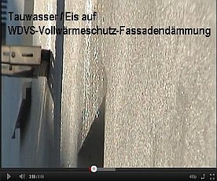](https://youtu.be/AQU-n7SntxU) 

Wärmedämmverbundssteme bestehen nicht nur aus irgendeinem künstlichen oder natürlichen Dämmstoff, sondern darüber hinaus aus weiteren, recht unterschiedlichen Materialien, Baustoffen und Befestigungselementen, die sich in phsikalischer und chemischer Hinsicht meist komplett anders verhalten. Dübel und Anker versagen über kurz oder lang, die ebenso wie ihre Beschichtungen gerne toxisch hydrophobierten Dämmstoffgespinste und -schäume weisen zwar Wasser ab, saugen sich aber - da nicht luftdicht und dank irrer Temperaturdehnung der Dämmhaut schnell mit kapillarsaugenden Mikrorissen durchnetzt - von ihrem Taupunkt her zunehmend mit Kondensat und dank nächtlicher Extrem-Auskühlung nicht mehr schnell abtrocknenden Regenfrachten voll und geben die systematisch eingedrungene Nässe mangels Kapillaraktivität nicht mehr richtig ab, die kunstharzverschnittenen Oberflächenbeschichtungen ("Putze" und "Anstriche") korrodieren und werden wegen ihrer - einen besiedlungsfreundlichen sauren pH-Wert garantierenden - organischen Kunststoffanteile und der damit automatisch verbundenen wasserrückhaltenden Funktion [bevorzugt von Schimmeln und Algen besiedelt und aufgefressen](26bausto.md#schimmelpilzbekã¤mpfung) und sperren die durch ihr versprödungs- und temperaturdehnungsbedingtes Kapillarrißnetzsystem eingedrungene Feuchte dauerhaft ein. Letzteres beschleunigt natürlich die Zerstörung des Gesamtsystems, das deswegen im Vergleich zu allen anderen Fassadensystemen irrsinige Mehrkosten bei der Instandhalterei verursacht. Witzigerweise - wer hätte anderes erwartet - meistens wenige Jahre nach Ablauf der Gewährleistung. Und da helfen weder die Giftmischereien noch die im Deckputz eingearbeiteten bzw. eingebetteten Kunststoff- bzw. Glasfaserbewehrungen, die das Aufreißen der Oberflächen begrenzen sollen, wirklich weiter. 

Vorsichtshalber schmeißt man nun etwas mehr wasserlösliches / u.a. algentötendes Gift (vorzugsweise die grauenhaften und in der Landwirtschaft teils schon verbotenen Biozide/Pestizide wie Isoproturon, Terbutryn, Zinkpyrithion, Jod-Propinylbutylcarbamat/IPBC, Diuron, Cybutryn, Octyl-Isothiazolinon/OIT und Dichloro-Octyl-Isothiazolinon / DCOIT in einer wirkungsoptimierten Kombination aus ca. 5 Giften) in die Beschichtung: Fungizid, das zunächst in flüssiger Phase dank Beregnung bzw. fast jede Nacht an der schnellstens abgekühlten Dämmfassade stattfindenden Betauung / Kondensatanreicherung an die Oberfläche diffundiert, dann vom Regen ausgewaschen wird und nicht nur das Kanalsystem belastet, die Kläranlage umkippen läßt und das Grundwasser bereichert, sondern auch den Vorgarten. Damit die dort spielenden Prekariatspisaner / Kinder sich besser abhärten? 

Über die Top-Entsorgungskosten für all' den Problemmüll in, an, vor und hinter der Fassade schweigen wir lieber. Wer mehr über z.B. die nur abfallwirtschaftlichen Probleme in Algizidverseuchten WDVS-Wohngebieten lernen will - das Wasserforschungs-Institut Eawag des ETH-Bereichs Abt. Siedlungswasserwirtschaft SWW, die Universität Duisburg-Essen und die Eidgenössische Materialprüfungs- und Forschungsanstalt EMPA, Abt. Bautechnologien haben die Facts in der gemeinsamen und mir vorliegenden Forschungsarbeit "Auswaschung aus Fassaden versus nachhaltiger Regenwassernutzung", Verf. M. Burkhardt, S. Zuleeg, T. Marti, K. Bester, R. Vonbank, H. Simmler und M. Boller auf 12 Seiten zusammengetragen. Doch damit nicht genug. In der mir ebenfalls vorliegende Studie der gleichen Autoren "Biozide in Gebäudefassaden - ökotoxokologische Effekte, Auswaschung und Belastungsabschätzung für Gewässer" findet sich folgende Aussage der Untersuchung an acht Bioziden, "die in kunstharzgebundenen Fassadenbeschichtungen verwendet" werden: 

_"Die akuten und chronischen Kriterien ...weisen auf eine hohe Ökotoxizität der betrachteten Biozide hin. Die Ergebnisse zum Auswaschungsverhalten von vier Bioziden (Diuron, Terbutryn, Cybutryn und Carbendazim) zeigen, dass die Wirkstoffe im Fassadenabfluss vorkommen und die Belastung unter den gewählten experimentellen Bedingungen exponentiell abnimmt. Dabei führt eine Temperaturerhöhung wieder zum Konzentrationsanstieg. Die ausgewaschenen Stoffmengen liegen zwischen 7 % und 29 %. Bereits innerhalb der ersten 15 min wurde mehr als die Hälfte der gesamten Stoffmenge während der 60 min Beregnungsdauer herausgewaschen. Die Stofftransportmodellierung zum Eintrag des Biozids Cybutryn aus Fassaden ins Gewässer deutet auf ein hohes Belastungspotential für kleinere Gewässer hin. ... Kritische Konzentrationsbereiche im Fassadenabfluss sind an neuen Gebäudefassaden zu erwarten, in der Regel vor allem an wärmegedämmten Fassaden."_ 

Logo, daß der Bund Naturschutz in Bayern, dessen arg oft enttäuschtes Mitglied ich seit über 30 Jahren immer noch bin (Unsere Ehre heißt Treue, so das ökofaschistische SS-Motto von anno dunnemals), die menschheits- und naturverpestenden Dämmstofforgien nach besten Kräften fördert. Naturschutz pervers, pfui Deibi! 

**WDVS-Giftfassaden - der ultimative Beitrag zum Klimaschutz?**

[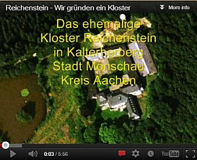](https://youtu.be/AzK0mGmNRZw) 

Grauenhafte Giftströme also in unseren Kanälen und dem Klärwerk vor allem in den ersten Jahren als direkte Folge der chemiekorrumpierten Klimaschutzdiktatur, bis die Hexensoße mehr oder weniger ausgewaschen ist. Danach grünt es wieder an den verrottenden WDVS-Fassaden. Doch die Umwelt und die Spielwiese vor dem Haus ist dann verpestet. Danke, lieber Energiesparweltmeister! 

Aecht Bio-Öko eben, was uns so manche der schon seit jeher den ungeheuerlichsten Giften (Bleiweiß-Farben, Arsenfarben) frönenden verantwortungs- und gewissenlosen Malerbetriebe unter der Marke Blauer Engel zumuten. Als Energiesparklimbim zur Weltrettung verbrämt. Ach, warum eigentlich für solche Anschläge auf unsere Lebensqualität nicht die Scharia einführen - oder wenigstens das urchristliche Gottesurteil? Ob für massenmörderische Brunnenvergifter - oder ist es der bevorzugte Ritualmord der Universal Church of Global Warming and Climate Protection? - die Abwasserprobe genügte? Wer wie viele ("die Bauvorschriften zwingen uns dazu") Handwerker an nutzlose Schaumbaustoffe, Plaste und Elaste glaubt, trägt sicher neben den Vergiftungsfolgen an seiner und seiner Nachbarn Gesundheit auch gerne die Kosten für das Handling der Chemiekampfstoffe. Und die Ökoterroristen allerorten bürden uns auch diesen Schwachsinn gerne druff. Es war schon immer etwas teurer, ... 

Gegenwehr des dämmstoffbeschissenen Kunden? Prüfen Sie mal die Amortisation der Dämminvestition. Wenn es unwirtschaftlich ist (Amortisation über 10 Jahre) besteht gegenüber dem WDVS-Planer (das kann auch der ausführende Handwerker sein!) möglicherweise Regereßmöglichkeit, wenn er ihnen die nicht gegebene Wirtschaftlichkeit der Maßnahme nicht verraten hat. Die dafür anzusetzende Gewährleistungsfrist beginnt meist erst, nachdem Sie den Mangel entdeckt haben. Zu Risiken und Nebenwirkungen fragen Sie Ihren Rechtsanwalt.

Inzwischen sind die Fachzeitschriften voll von grünen Dämmfassaden - und die industriefreundlichen Autoren behaupten gegen besseres Wissen:

1. Die Veralgung ist sozusagen kein Mangel, sondern nur ein optisch-ästhetisches Ereignis. 
2. Porenfüllende und wasserabweisende Fassadenbeschichtung könnten den Algenwuchs /Grünalgenbefall behindern. Vielleicht sogar besonders infrarotabsorbierende dunkle Anstriche - wer weiß schon, was die chem. Industrie da wieder aus dem Hut zaubert? 
3. Ein grauslicher Giftcocktail in Putz und Anstrich (schöngefärbt für Bausäftl: "Fungizid" + "Algizid") würde helfen - nach dem Motto: "Viel hilft viel."

So sieht das in veralgter Wahrheit aus - nur kurze Zeit nach Einweihung: 

Total versaute, verschwärzte, vergrünte und abgesoffene WDVS-Fassade. Ja, so ein Energiesparen überzeugt eben schwarze, rote und grünbraune Bauherren vom Wärmedämmverbundsystem mit Kunstharzanstrich. Bewährte System, heißt das im Prospekt, und "schon immer so gemacht" aus Handwerkersimplmaul.

Sogar das Architektenblatt, sonst oft anzeigengespicktes Sprachrohr des technischen Fortschritts ohne Beachtung Wirtschaftlichkeit und Effizienz, ist einmal ein bißchen aufgewacht und brachte in "Technologie/Bautechnik", DAB 11/2000 einen Artikel von Hans-Jürgen Bühler: _"Kondensation, Reif- und Eisbildung auf Wärmedämmverbundsystemen"_

Auszüge: 

_"In jüngster Zeit wird auf hochwärmegedämmten Fassaden mit dünner Putzbeschichtung (Wärmedämmverbundsysteme) eine außenseitige Oberflächenkondensation festgestellt. Dieser Effekt tritt vor allem an exponierten Gebäuden in Ortsrandlage auf. Bemerkt werden diese Kondensationseffekte durch Verfärbungen des Putzes aufgrund erhöhter Feuchtigkeitsaufnahme oder durch Abbilden der Halteanker bzw. Plattenstöße auf der Putzoberfläche. ...

Messtechnische Untersuchungen

Eine Kondensation auf der Putzoberfläche tritt nur auf, wenn die Taupunkttemperatur der Außenluft die Putzoberflächentemperatur unterschreitet. ... Bei Berechnung der Außenoberflächentemperatur nach DIN 4108 liegt die Temperatur der Außenoberfläche auch bei sehr gut gedämmten Gebäuden immer über der Außenlufttemperatur. Eine außenseitige Oberflächenkondensation ist damit entsprechend dem Rechenansatz der DIN 4108 "Wärmeschutz im Hochbau" nicht möglich. Warum treten dann trotzdem Kondensationseffekte bzw. bei Temperaturen unter 0 °C Reif- und Eisbildung auf? Neben rein konvektiven Wärmeübertragungsvorgängen an der Außenoberfläche muss vor allem bei klaren Nächten der langwellige Strahlungsaustausch mit der Atmosphäre bzw. der Umgebung des Gebäudes berücksichtigt werden.

Das Himmelsgewölbe kann während klarer Nächte als schwarzer Strahler mit einer Effektivtemperatur von -30 °C bis -50 °C angesehen werden. Dadurch wird der dünnen Putzbeschichtung des Wärmedämmverbundsystems eine Wärmeleistung von ca. 40-50 W/m² entzogen. Die Putzschicht wird daher unter die Außenlufttemperatur abgekühlt. ... Während der Messperiode konnte

_ [an einem WDVS] _ein vollständiges Abtrocknen der_ [nächtlich kondensatvereisten] _Fassade tagsüber nicht festgestellt werden. ..._

Die durchgeführten Untersuchungen zeigen ..., dass [durch Außen-Wärmedämmung] _die thermischen und hygrischen Belastungen der Außenoberflächen aufgrund von Kondensationseffekten zunehmen werden. Kritisch sind hierbei vor allem Wärmedämmverbundsysteme zu sehen. Die Problemzonen verlagern sich mit steigendem Dämmstandard von der Innen- zur Außenseite._

Es müssen schnellstmöglich Anstrengungen unternommen werden, um die ... Problematik möglichst vor Inkrafttreten der Energieeinsparverordnung zu lösen." Kommentar: Pustekuchen!

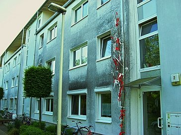Verschweinste WDVS-Drecksfassade auf Neubau. Nur kurze Standzeit, dann kommt es geradezu automatisch zur Schmuddelfassade, wie jeder Fachmann inzwischen weiß. So sicher, wie das Amen in der Kirche (in die ja niemand mehr geht). Danke, herzliebster Industrieberater, daß Du dem Planer so dolle bei der Energiesparplanung und dem Auffetten seiner Einnahmen geholfen hast. Ohne Dich wäre es weder gelungen, keine Heizenergie zu sparen (WDVS führen grundsätzlich zu höherem Energieverbrauch, vgl. einschlägige Versuchsreihen des Fraunhofer-Instituts für Bauphysik 1983-85), noch die Hausfassade in kürzester Zeit in so eine Sauerei zu verwandeln, noch dem Planerbüro so eine dicke Weihnachtsfestsause zu gönnen. In Kürze sieht es auf Deutschlands Fassaden überall so aus, wollmer wetten? Da wird die Regierung schon für sorgen.

Und ist das WDVS-Versauungs-Schmuddel-Problem nun gelöst worden? Daß ich net lache! Das Gegenteil ist der Fall. Vehement setzt die lobbykratisierte Bundesregierung ihren auf Geheiß bösartigster Gestzesparasiten (die als "externe" Experten die Entscheidungsvorlagen in allen Fachausschüssen regieren) eingeschlagenen Weg zur [Vernichtung der Volkswirtschaft und -gesundheit mittels Energieeinsparverordnung EnEV](enev.md), ErneuerbareEnergienWärmeGesetz EEWärmeG, Energieeffizienzgesetz EEG usw. fort. Subventionsgestützt mit einem "CO2-Minderungsprogramm", "KfW-Krediten und -Zuschüssen" usw. Fette Parteispenden (System Adenauer, Kiesinger, Brandt, Schmidt, Kohl, Merkel usw.) und wohlgelittene Korruption bzw. Lobbyistentätigkeit in den einschlägigen Ministerien und maßgeblichen Ausschüssen Umwelt, Bau und Wirtschaft oder was? 

Die ultimative Lösung hat nun ein [neues Patent zur WDVS-Beheizung/WDVS-Heizung](http://www.patent-de.com/20110203/DE102009035656A1.html), aus urdeutschem Erfindergeist entsprungen, gefunden, daraus ein paar beachtenswerte Worte als Zitat: 

_"Die Absenkung der Oberflächentemperatur an der Außenseite der außenseitigen [WDVS-]Gebäudeschicht führt dazu, dass insbesondere in den Nachtstunden der Taupunkt regelmäßig unterschritten wird und erhebliche Mengen Kondensat auf der außenseitigen [WDVS-]Oberfläche der äußeren [WDVS-]Gebäudeschicht anfallen. Dieses wird in den folgenden Tagstunden, insbesondere bei nicht oder nur geringfügig sonnenbeschienenen Bereichen der außenseitigen [WDVS-]Gebäudeschicht, nicht mehr vollständig abgetrocknet, so dass die [WDVS-]Oberfläche dauerhaft oder überwiegend feucht bleibt. Dies bildet die Grundlage für das Wachstum insbesondere von Algen [auf WDVS]. Dieses Phänomen wird als [WDVS-](Fassaden-)Vergrünung bezeichnet. 

Die [WDVS-]Vergrünung war bereits Gegenstand vielfältiger Untersuchungen. So wurde versucht, die mittlere Temperatur der [WDVS-]Oberfläche durch Verwendung von IR-reflektierenden [WDVS-]Beschichtungen anzuheben oder die [WDVS-]Oberflächen der Fassaden mit Algiziden, Fungiziden oder photokatalytischen Beschichtungen auszurüsten. All diese Ansätze zeigten jedoch keinen dauerhaften Erfolg, so dass relativ kurze [WDVS-]Renovierungszyklen erforderlich waren. 

Aufgabe der vorliegenden Erfindung [zur Beheizung der WDVS-Oberfläche] ist es nun, hier Abhilfe zu schaffen und eine Möglichkeit zur Verfügung zu stellen, mit der in einfacher und kostengünstiger Weise die Vergrünung der außenseitigen [WDVS-]Oberfläche der äußeren [WDVS-]Gebäudeschicht einer [WDVS-]Gebäudehülle eines Gebäudes verhindert werden kann."_ 

Im Klartext: Die Heizenergie, die das WDVS drinnen nicht spart, wird ab jetzt draußen zusätzlich vergurkt. Dagegen war Schilda doch ein ungetrübter Quell der Weisheit, oddä?. 

Daß die Eisbildung auf den nicht speicherfähigen Dämmfassaden ein weiteres Merkmal des U-Wert-Irrtums offenbart, erklärt sich so: 

Gemäß der auf [Fourier](7fourier.md), der seinerzeit noch die Wärme als Ausfluß des sog. Phlogistons - eine ätherähnliche "Flüssigkeit" verdächtigte und darauf seine Theorien der Wärmeleitung aufbaute, beruhenden irren stationären Rechnerei wirken auf die Wärmeleitung durch Stoffe die Materialdicke, die Wärmeleitfähigkeit als Stoffkonstante und das Temperaturgefälle. Letzteres wird gem. Norm auf -15 °C begrenzt. Da aber Dämmstoffe eben nicht speichern, was sie tagsüber als Solarwärme angeboten bekamen, sondern hurtigst auskühlen, erreichen ihre Oberflächentemperaturen bei klaren Winternächten gigantische Minuswerte gegenüber dem kalten Nachthimmel (Weltall-Temperatur knapp über absolutem Nullpunkt bis ca. -270 °C, atmosphärische Gegenstrahlung des Himmels je nach Wasserdampfgehalt, Luftverschmutzung und Wolkenbedeckung bis ca. - 60 °C, winterliche Wolkentemperatur zwischen 0 und -45 °C), die auch im Sommer weit unter den Lufttemperaturen liegen. Die jeweils vorhandene Himmeltemperatur kann übrigens Jeder selber messen mit einem simplen IR-Meßgerät für wenige Euros aus dem elektronischen Versandhandel. 

Deswegen also die erhebliche Kondensataufnahme aus nächtlich abkühlender Außenluft inkl. sommerlichem Bewuchs mit biologischem Allerlei. Deswegen auch die übergroße Temperaturdehnung mit folgender Rißbildung, deswegen die Blasenbildung über eingedrungener Nässe, die kapillar nie mehr herauskommt. 

Deswegen auch ein gigantisches Temperaturgefälle, das automatisch - auch rechnerisch, meine lieben Normapostel und Depperlesphysikanten - jegliche "gute", da geringe Wärmeleitfähigkeit von Dämmstoffen mehr als aufhebt. Auch das ist Mathematik! Super, wie die auch an schönen Produzentenumsätzen interessierten Profi-Mitglieder der betreffenden DIN-Ausschüsse das alles professionell verschweigen und die profimäßig bediente Administration den ganzen Schwindel nicht nur stillschweigend schluckt, sondern auch in Baupfusch sowie Profiumsatzexplosion garantierenden Bauvorschriften durchdrückt. Pfui Deibi.

BILDBEISPIELE FÜR STAATLICH GEFÖRDERTEN/GEFORDERTEN FASSADENPFUSCH 

Eine Dämmfassade (WDVS) am 9.1.06 um 8.00 Uhr an einem sonnenklaren Wintermorgen: Es ist nicht Mehltau, sondern ein Eispanzer, der auf der Fassadenoberfläche blitzt.

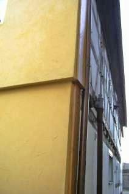Schade um das arme, alte Fachwerkhaus, das nun hinter der bei jeder Luftabkühlung aufkondensierenden Nassdämmung dahinmorschen wird. Im Obergeschoß wieder sichtbare Eisbeläge. 

Die Temperaturereignisse am 9.1.06 habe ich dann mit einem IR-Thermometer dokumentiert:

Die Südseite - WDVS-Oberfläche hatte um 8.00 Uhr morgens -5 °C, die Fachwerk-Ostseite, 1,5 Meter von der Nachbarwand-Westfassade hatte +1 °C. 

Die nicht von einer Nachbarwand 'geschützte' Garagenwand Nordseite! an meinem Wohnhaus, 36,5 cm Hochlochziegel von 1962, weiß verputzt, hatte gleichzeitig eine Außenoberflächentemperatur von ca. -1 °C, bei Außenluft von -5 °C, in der ungeheizten Garage innen hatte es 1° C, die Innenwandoberfläche war ebenso 1 °C warm. 

Der Himmel war bei -28 °C:

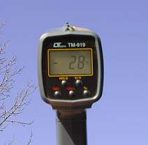Und alle Autoscheiben waren vereist.

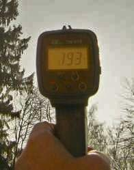Um 13.00 Uhr dann die Messung in Richtung Sonne: +193 °C! Meine Bürowände aus 40 cm Massivziegel, beidseitig verputzt hatten dann:

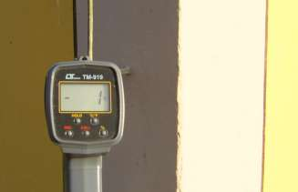 Im Schatten -1 °C, 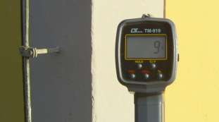 und in der Sonne +9 °C.

Die Eisentür zum Keller war sonnenlichtbeschienen: 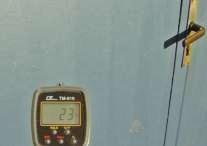 23 °C! Außenluft noch immer -4 °C. Da gibt es eben keine Kondensataufnahme, die Massivwände speichern ja die tagsüber aufgenommene Solarenergie und strahlen sie gemütlich die ganze bitterkalte Nacht noch ab, nie sinkt die Oberflächentemperatur unter die Lufttemperatur. Natürlich gibt es dann auch bei weitem nicht die Materialbeanspruchung an der Fassade durch thermische und hygrischer Belastung (Dehnung und Kontraktion, Quellen und Schwinden). Schön blöd, wer da auf Leichtbauweise und Pappendeckeltechnik vertraut. 

Sehr schön auch dieser Fassadenpfusch in Österreich, der die Problematik der Temperaturdehnung besonders klar entlarvt: [Großfassade im Wohnungsbau verdämmt](http://www.solidbau.at/home/artikel/Bauschaeden/Verdaemmt/aid/3361?analytics_from=thema_singlehttp://www.solidbau.at/home/artikel/Bauschaeden/Verdaemmt/aid/3361?)

Die SZ haut auf den WDVS-Murks am 16.2.02 so drauf: 

__"[Messe Riem](http://www.messe-muenchen.de/deutsch/presse/archiv/daten_bau.html): Pfusch am Bau?__ 
**_Der Putz blättert_** 
**_Baufachmann stellt erhebliche Fassadenschäden fest_**

_Von Renate Winkler-Schlang_

_Edmund Bromm klopft am Putz und es klingt hohl. "Da", sagt er, schüttelt den Kopf. Und wieder: "Da." Sein Zeigerfinger weist auf einen Riss. ..._

Nach so kurzer Zeit dürfte der Putz direkt über den Eingangstüren nicht quadratmeterweise abblättern. Es dürften rechts davon keine weißen Putzteile in den dunklen Ritzen des Kopfsteinpflasters Zeugnis geben vom allzu früh einsetzenden Zerfall, sich keine Risse im Putz gebildet haben, die darauf schließen lassen, dass neue Teile sich bald lösen. ...

"Da", sagt er wieder und erklärt, dass fehlerhafte Wärmedämmung die Ursache ist für die bereits sichtbaren Schäden. Die millimeterdünne Spachtelung auf der Dämmschicht und ihrer Armierung ist auf den großen Wandflächen einer großen mechanischen Beanspruchung ausgesetzt: Ober- und Untermaterial reagieren anders auf die großen [Temperaturschwankungen](29bau13.md): Die Materialien sind nicht elastisch genug. Es entstehen immer mehr Risse, die sich zunächst wie kleine Netze ausnehmen. Hier dringt Wasser ein, kann nicht mehr schnell genug nach außen transportiert werden, wird nachts zu Eis, sprengt die Flächen weiter auf. Der Oberputz bildet erst Blasen, dann löst er sich. Oder an den nassen Stellen wird Dreck gebunden, siedeln sich Algen an: Die Fassade vor allem im oberen Bereich verfärbt sich braungrün. ...

Von der Weite schon sieht man auch (an den Versorgungs- und Lagerhallen) dunkle Stellen und Risse. Am Ende weist Bromm hin auf die hässlichen Löcher rund um die Alufenster des Messebüros: Aluminium verändere sich bei Temperaturschwankungen am meisten.

Wirklich sanieren könne man solche Schäden eigentlich nicht, meint der Fachmann: Ein neuer Anstrich brächte optische Verschönerung, schlösse dabei aber manchen Haarriss, sodass Kondenswasser nicht mehr austreten könnte. "Und man muss wissen, dass schon fünf Prozent Feuchte den Dämmwert um etwa 50 Prozent reduzieren." Entschließe sich die Messe eines Tages zur Komplettsanierung, habe sie ein Entsorgungsproblem mit diesen Kunststoffen. ...

Die [Neue Messe München](http://www.messe-muenchen.de/deutsch/presse/archiv/daten_bau.html) hat ja vielleicht genug Geld von den WDVS-Ausstellern, um sich solch intelligentes Bauen zu leisten. Im Detail sieht das übrigens im Februar 02, nach nur vier Jahren Standzeit so aus (Bild: Edmund Bromm): 

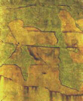

Und wird dann 03 endlich total abgerissen, oberpeinlich für die deutsche Bauwirtschaft (die das natürlich sonstwohin wegsteckt). Ende eines WSVO-Pfuschs? Aber nein und nochmals nein!!! Denn nur kurze Zeit nach der Sanierung - d.h. Abreißen der verreckten WDVS-Flächen und Erneuerung wieder mit dem so unheimlich bewährten WDVS-System inkl. totaler Qualitätskontrolle sehen die neu erstellten WDVS-Flächen so aus (Bilder wiederum vom "Messefassadenwächter" Edmund Bromm): 

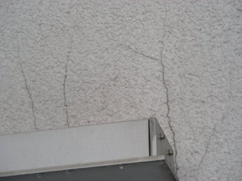. 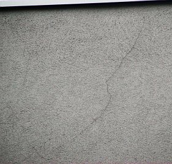.

Alles aufgefeuchtet, gerissen und nach dem nächsten Frost bestimmt auch wieder sukzessive abblätternd, blasenwerfend, etc. Und diese Bilder sind nur ein klitzekleiner Auszug aus den ungeheuerlichen Schäden an der neuen Neue-Messe-Fassade und beweisen wieder einmal die Unmöglichkeit aus bauphysikalischem Grund, ein klassisches WDVS-System unter "normalen Witterungsbedingungen" und "normalen Herstellungsbedingungen so recht dauerstabil und störungstolerant zu konstruieren! Fällt das eigentlich auch wieder unter Gewährleistung oder schon unter Produkthaftung? Arme Handwerker, die diesen Technikschwindel ausbaden müssen. Eben wieder mal zu gierig gewesen ... 

Auch im modernen Ismaning baute man schon vor fünf Jahren WDVS, die dann so aussehen (Bild: Edmund Bromm):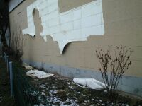 Ein Lob auf die Baubranche, das sichert Aufträge in schwerer Zeit! Den ärmeren Mietern empfiehlt sich, Quartiere ohne Dämmverpackung auszusuchen. Wer wird denn wohl die Zeche zahlen, wenn die WDV-Fassade dran bzw. nicht mehr dran ist? Nur die mieterunfreundlichsten Vermieter gönnen ihren Wohnungsinsassen Investitionsumlagen in Technikschwachsinn. Hauptsache, es bringt fette Provisionen vom Dämmstoffheini. Und so sieht die Depperla-Chose rund um Frost, Eis, Tau und Algen (nicht Alpen!), Befrostung, Vereisung, Kondensat-Kondensation und Veralgung am WDVS (Wärmedämmverbundsystem) dann an einem frisch errichteten Staatsbau in Österreich, dem Vorreiter-Wunderland der staatlich verordneten Kidioto-Klimaschutzerlösung und Endlösung der Abzockfrage, aus: 

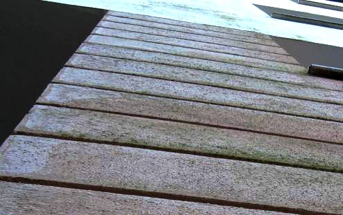 1 - Die eisigen Flächen - am 23. 12 2006 dieses warmen Winters - glänzen hell und klingen dumpf, da hohl. Der Rest grünt dahin. Das eisige Strahlen spart tagsüber Glühlampenbetrieb, stört aber etwas den Autoverkehr! Gottseidank haben Österreicher Sunnenbrilln. 

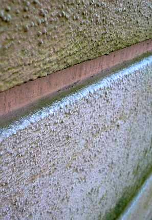 2 - Auf den Oberkanten der herumhistorisierenden WDVS-Rustizierung kühlt der nächtliche Himmel noch dollerer aus - fette Reifkristallwülste frosten dort entlang und betonen die schnuckelige Architektursprache. Der Algenbewuchs wird nach vierteljährlicher Abkratzung durch äußerst preisgünstige Balkanexperten geerntet und dann nach dreistündiger Vollmond-Heulagerung auf würzigen kunstholzlärchenverschindelten Betonalmen mit hausschwammbefallenem Zirbenholz geräuchert und geselcht und italienischen Touristen als neue Spezialität und urig-gmiatliche Fassaden-Pesto-Spaghettibeilage serviert. Vorwiegend in oberkärntner Wohlfühl-Wellness-Oasen am kraftfelderreichen Fuße des Mondscheingipfels (2.103, 57 m ü.M.). 

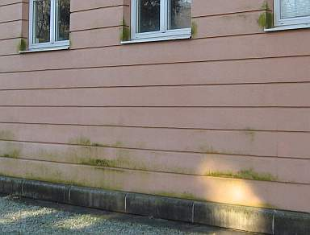 3 - Auch die besser verschatteten Restflächen sind superökobio. Dort kommt zwar die Himmelskälte nicht so hin, aber Kondensat gibt's freili mea ois gnua auf und unter der trocknungsblockierenden Kunstharzschwarte, um die Algerl, Schwammerl und Puizerl recht fett zu nähren. Und freili is das Giftmittel (Algizid/Fungizid) in der vollchemikalischen Schwartenbesoßung an etwas witterungsexponierteren Partien im Handumdrehn ausgewaschen und läßt dort besonders reichliche Biotop-Ernten zu. Das könnte das österreichische Schulministerium natürlich für seine Zwecke - den Österreicher schon in jungen Jahren zum Vollökologen heranzubilden - bestens nutzen und Studienfahrten anordnen. So wird in diesem Finanzstaatskassenbau nicht nur der abgezockte Bürger verwaltet und eventuell auch die Jugend abgerichtet, sondern glei im Handumdrehn der dem Ösi aus dem Kreuz geleierte Mariatheresientaler maximal an der Fassade versaubeutelt. Grätuläischn, sogt der Wiänä, a Skandealerl mera tut nix schodn im Felix Austria. Hauptsoch, die beteiligten Öko-Absahn-Spözln haben sich dabei gut beösterreichert ... 

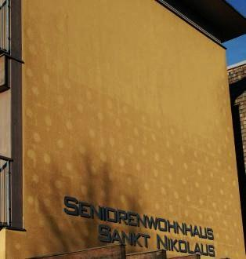 4 - Ja, wer an den Nikolaus glaubt, vertraut auch den Versprechungen der Dämmindustrie. Hier ein Bild Anfang Februar einer am 4. Februar 2008 um 9.00 Uhr nach klarer Nacht partiell vereisten Fassade mit neuem Wärmedämmverbundsystem. Das frostige Eis zeichnet sich dunkel auf der ockerfarbigen Fassadenoberfläche ab. 

Wo der stylische Dachüberstand vor dem eisekalten Nachthimmel schützte, wo Dämmdübel und Fugenvermörtelung etwas Solarwärme in die kalten Nachtstunden retten konnten, langte die Untertemperatur der Fassadenoberfläche nicht für Kondensat und folgende Eisbildung bzw. Befrostung. 

Auf dem Deckputz über dem WDVS allerdings dicke. Wenn dann das Algengift (Fungizid) genau an den bewitterten Flächen aus den toxischen Farben rausgespült ist, wird sich auch dort die grüne Pest niederlassen und prächtig ausbreiten. Vorhersage: In ein paar Jahren kommt der ganze Krempel runter. 

Es war eben schon immer etwas teurer, so richtig Energie zu sparen ... 

(Fotos 1-4: Dipl.-Ing. Kersten Sitte) 

Katrin Riesner hat dann in ihrem Abschlußbericht "Schimmelpilz in Außenwänden" zu den Tauwasser- und Schimmelpilzrisiken in den Gefachedämmungen von hochgedämmten Holzrahmen-Außenwänden dokumentiert, daß es dort insbesondere in der kalten Jahreszeit zu bemerkenswerten Luftbewegungen - also Konvektionsströmungen - kommt. Diese quasi "natürliche" Konvektion transportiert dann die immer vorhandene und aus Außenluftfeuchte, Raumluftfeuchte und natürlich auch Materialfeuchte (alleine die natürlicherweise im Baustoff Holz - aber auch die Eigenfeuchte des Dämmstoffs aus der Zeit seines Einbaues erreicht gerne unvermutete Spitzenwerte!) gespeiste Gefache-Luftfeuche in den unter dem Taupunkt abgekühten Außenbereich und näßt in Folge die Gefachdämmung unrettbar auf. Ein super Lebensraum für bakteriellen und Schimmelpilzbefall entsteht so. Mehrere Wochen kondensieren so irre Feuchtemengen in der Dämmwand bzw. im Dämmstoff und sorgen über kurz und gar nicht so lang für eine äußerst nachhaltige Bauteilverrottung, selbstverständlich auch in der Zwischensparrendämmung und in der Flachdachdämmung. So verstehen wir den Begriff nachhaltiges Bauen rund um das Passivhaus endlich richtig. 

Interessanterweise rennen da draußen nun ein Haufen Vertreter und Spezialisten rum, die auch das zweischalige Mauerwerk mit Vorsatzschale und Luftschicht mit ihrem Dämmplunder namens Kerndämmung, Hohlraumdämmung, Mauerkerndämmung, Hochschichtdämmung usw. beglücken wollen. Was wird da nicht alles angeboten! Ein buntes Flocken- und Schnipselallerlei findet sich am Markt: 

Steinwollegranulat, Mineralwollflocken, Polystyrol/Styropor-Schaum-Partikel, Vulkangestein (Perlite), Altpapierschnipsel (oft borat-/borsäurevergiftete Isolier-Zellulose-Flocken, Handelsnamen z.B. Isocell / Isofloc / Warmcel, ..., gerne auch mit ausgasendem Ammoniumsulfat vermischt) Dämmschaum usw. werden da landauf und landab, meistens den leichtgläubigen Fischköppen und auch Briten in die Luftschicht ihres Hohlmauerwerks eingeblasen (Einblasdämmung) oder falls Expansionsschaumdämmung - eingeschäumt. Nun fragt sich der Kunde leider nicht, was mit dem Dämmstoff für Brand- und Vergiftungsrisiken in sein bisher ziemlich gesundes Mauerwerk reinkommt (da würden Sie staunen, wenn Sie wüßten, welch raffinierte Appreturen in Dämmstoffe reineulalisiert werden, um Motten, Ratten, Mäuse, Marder, Insektenmaden, Wespen, Hummeln, Hornissen usw. draußen zu halten und die eingetaute Feuchte - dank Wasserabweisung bzw. mangels Kapillartrocknung - drinnen zu halten. Dazu dann allerlei Ingredienzien als Branschutzmittel bzw. zur Herabsetzung der Entzündlichkeit. 

Doch das schönste kommt noch: Die Konstruktion der Vorsatzschale bzw. des Zweischalenmauerwerks mit Luftschicht ist im 19. Jahrhundert ja nicht wegen Heizkostenersparnis erfunden worden, sondern um die Feuchte vor dem Kernmauerwerk bzw. Hintermauerwerk bzw. dem Mauerwerk der Innenschale zu halten und auch, um Material für den Wandaufbau einzusparen. Ausgeheckt wie immer am grünen Tisch von sogenannten Bauexperten. Und vielleicht ist Ihnen schon mal aufgefallen, daß sich am Sockel des Schalenmauerwerks oft kleine Austrittsöffnung für eingedrungenes Wasser bzw. Eintrittsöffnung für einströmende Lust finden. Gerne von Bauexperten später zugemörtel, na klar. Warum das notwendig wurde und immer notwendig sein wird, um Schlimmeres zu verhindern? Weil die Vorsatzschalen aus Klinker und Zementmörtel grundsätzlich extrem durchnässungsgefährdet sind. Einmal saugt der Mauerklinker quasi kein Wasser auf, wenn es mal regnet. Die Brühe läuft daran herunter und trifft volle Pulle auf - genau! die Mörtelfuge. Die besteht aus Zementmörtel und der reißt bekanntermaßen dank mehr als doppelter Wärmedehnung als der Backstein sytematisch und sytembedingt aus bauphsikalischen Gründen grundsätzlich auf. Sie erkennen das an den feinen Rissen, die sich meist senkrecht durch alle Lager-Fugenoberflächen ziehen, freilich hier und da auch an den Stoßfugen. Weil nun der Backsteinklinker kaum Wasser aufnimmt, haften starr abbindende Zementmörtel auch rein gar nicht gut daran, folglich kommt es zu Abrissen der Fugenflanken, will sagen, es bilden sich zwischen Lagerfuge und Klinkerfläche durchgehende Risse. Und leider saugen genau diese feinen Risse extrem gut das Wasser rein. Was dann hinter der Schale abtropft und an der Rückseite runterrinnt, bis es unten rauskommt oder von trockenen Hinterlüftungswinden weggetrocknet wird. 

Dieses von vornherein der Bauschlaumeierei entsprungene fragile System wird nun durch die Kerndämmer endgültig zum Absturz gebracht. Denn das Wasser kann nun in die Kerndämmung laufen und kommt selbstverständlich auch durch unvermeidbare Taupunktunterschreitung in die Dämmschicht, läßt diese nach und nach absaufen und wird erst dann entdeckt, wenn auch die Innenschale so richtig schön durchnäßt ist und der Hausbewohner über die schimmeligen und feuchtsumpfigen Effekte an seiner Wohnzimmerwand erschreckt. Prost Mahlzeit! Und jetzt? Alles wieder rauspulen, oder? So jedenfalls auf dem hier gezeigten schönen Fallbeispiel einer "Cavity Wall/Fill/ Insulation", die neben Zelluloseflocken auch aus eingepressten (injezierten Mineralwollfasern oder sogar Kunstharz-Schaumpartikeln bestehen kann, das ich aus einem Bild meines verehrten Mitstreiters in England, Baumeister Jeff Howell, zitiere. 

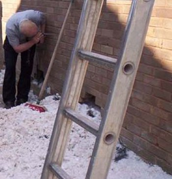 
Ausbau der nassen Kerndämmung aus Dämmfaserflocken durch mühseliges Herauspulen aus teilabgebrochenen Mauerwerks-Vorsatzschale 

Auf seiner bemerkenswerten Webseite finden Sie hier noch viel Stoff zum Nachdenken über die Idiotie der aufgenäßten Cavity Wall Insulation, wie sich die Hohlraumdämmung im englischen Sprachraum schimpft. Jeff's Links: 

[Skandal: Nasse Einblasdämmung läßt Hausbesitzer muffeln](http://www.telegraph.co.uk/finance/property/advice/11411880/Could-the-cavity-wall-insulation-scandal-rival-PPI.html) - [Problem Hohlraumdämmung](http://www.askjeff.co.uk/cavity-wall-fill/) - [Abgesoffene Kerndämmung rauspuhlen](http://www.askjeff.co.uk/removing-cavity-wall-fill/). Viel Spaß beim Übersetzen! Und daß das Naßwerden und Feuchteproblem der Einblasdämmung ein generelles Problem ist, kann auch diesem deutschen Forumsbeitrag entnommen werden: [Einblasdämmung mit Silikatleichtschaum verursacht Schimmelpilzbefall](http://www.haustechnikdialog.de/Forum/t/33358/Waermedaemmung-Einblasdaemmung-eingebracht-und-nun-ist-der-Schimmel-da). 

Ein Spitzenlink zum Problem absaufende Wärmedämmung an Fassaden aus dem Bauexpertenforum: [www.bauexpertenforum.de/showthread.php?t=8068](http://www.bauexpertenforum.de/showthread.php?t=8068)

[Fotos - Edi Bromms Wärmeschutzpanoptikum](http://www.flickr.com/photos/11672694@N08/sets/)

[Weitere lustige Bauschäden an Wärmedämmverbundsystemen WDVS](7wdvs13.md)

Weiter mit **Der Schwindel mit der Wärmedämmung -[Kapitel 15](21315bau.md)**
