[🠔 Zur Übersicht: Dämmung](213baust.md)  
# Der Schwindel mit Wärmedämmung und Energiesparen 15
**Risiken durch Dämmstoff und Hausisolierung: Auffeuchtung, Temperaturdehnung, Dämmstoffbrand und Fogging**  
_von Konrad Fischer_

## Der Schwindel mit Wärmedämmung und Energiesparen 15

## Risiken durch Dämmstoff und
Hausisolierung: 

Auffeuchtung, Temperaturdehnung, Dämmstoffbrand und Fogging

[zurück<-](21314bau.md) Kapitel [-> vor](21316bau.md)

---

## Das Wärmedämmverbundsystem als vorprogrammierter und gesundheitsgefährdender Baupfusch?

Die juristische Klarheit zum Wärmedämmverbundsystemschaden (WDVSS) liefert das Oberlandesgericht Düsseldorf in seinem **Urteil vom 31.5.1996 - 22 U 229/95** , das rechtskräftig unter Bezugnahme auf ein hervorragendes Sachverständigengutachten feststellt (Leitsatz 3): **_"Eine im Verbundsystem hergestellte Plattenfassade ist bereits jetzt_ [zum Ausführungszeitpunkt] _mangelhaft, wenn nach sachverständiger Beurteilung "von innen diffundierende Feuchtigkeit eines Tages die fest aufsitzenden_[Dämm-]_Platten nach außen drücken" wird."_**

Auf Seite 8 im Urteilstext ist dann zu lesen, daß es "der Sachverständige ... nicht als Gefahr, sondern als Gewißheit dargestellt" [hat], daß dieser Schadensfall auch tatsächlich auftreten wird (Anhörung des Sachverständigen am 21.09.1993). 
(Ergänzung in [ ] KF gem. vorliegendem Urteilstext.) 

Im Klartext: Die WDVS-Bauweise ist demnach ein Baumangel - was auch die verschiedenen [WDVS-Verbote in den USA](2133bau.md) seit 1996 immer wieder anführten. . Warum? Weil die von innen und außen eindiffundierende Feuchte (Dampfdiffusion, Beregnung, Einkondensierung aus Luftfeuchte an den nach Sonnenuntergang schnell abkühlenden Dämmplatten) aus den Platten mit regelmäßig sehr hoher praktischem Feuchtegehalt nicht mehr entkommt und in Verbindung mit der Regenfracht durch Risse und Bauteilfugen über kurz oder lang zu extremen Feuchteschäden (Schimmel, Algen, Frostsprengung) führen kann. In Amerika bei über 90 Prozent der untersuchten WDVS-Häuser! Was sollgemäß feucht abgesoffene Dämmstoffe dann noch dämmen, ist dann sowieso das Mysterium schlechthin. Außerdem - seit wann ist es statthaft, Baustoffe mit irrer Wärmedehnung auf so gut wie unbewegliche Unterkonstruktionen und angrenzende Bauteile vollständig anderen Temperaturverhaltens anzubappen? Das leuchtet vielleicht einem Bausäftl ein, dem verdämmten Baumeister nie. Es sei denn, er möchte Folgeaufträge sicher vorprogrammieren. Zu diesem Thema ein [Link (Wärmedehnzahl verschiedener Baustoffe)](29bausto.md#temperaturdehnung).

Interessanterweise geben die WDVS-Industrie bzw. ihre willigen Vollstrecker teure Marktstudien in Auftrag, da sich ihre Absatzzahlen rückwärts bewegen und sich der erhoffte Markterfolg bisher nicht einstellt. Natürlich geht damit auch erhöhtes Lobbyistenengagement an den dafür zugänglichen Stellen einher. Man gewinnt schon Ämter (z.B. in Hessen) für den totalen Dämmzwang via Baupolizei, wenn es in einer Wohnung eines Wohnblocks - wegen "Fenstersanierung" - schimmelt. 

"Der Vermieter 1/03" schlagzeilt mittels ö.b.u.v.S. W. Isenmann zum Wohnungsverseuche durch WSVO/EnEV: 

**_"Fogging_** 
**_Zum Phänomen der "schwarzen Wohnungen"_**

_... Am fogging-gefährdetsten sind Wohnungen, die einen guten Wärmeschutz aufweisen und über dichte Fenster und Türen verfügen. Durch diese Dichtheit wird der Luftaustausch über Fugenundichtheiten fast auf Null reduziert und damit zugleich auch der Abtransport von Schadstoffen durch Luftzug ins Freie verhindert. ..."_

Nun verreckt mal schön, deutsche Klimaretter, CO2-Vermeider und Vorsorgeprinzipler. 

Daß - und das belegen einschlägige Messungen der Vorsatzfassadenindustrie und vor allem von vereidigten Sachverständigen in Gerichtsverfahren - der Schallschutz von Fassaden durch Außendämmung um ca. 10 db sinken kann, belegt die tolle HiFi-Eigenschaft solcher Anbappsysteme als Resonator und Verstärker.

## Der Dämmbrand - Brennende Dämmstoffe

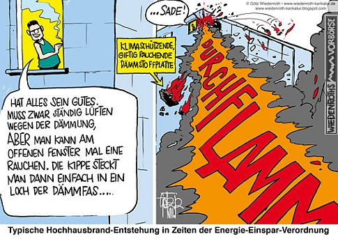 Brennende Dämmstoff-Fassade - [Karikatur von Götz Wiedenroth](http://www.wiedenroth-karikatur.de) =>>> 

Wie die brennbaren (schwerentflammbar!!??) Dämmstoffe an der Wand, in der Decke und im Dach zur explosiven, vergiftenden und brandausweitenden Unterstützung von Bauwerksbränden - gerade auch an Mehrgeschossern und Industriehallen - beitragen, ist der schönen Dokumentationsreihe "Brandschutz aktuell" der Bayer. Versicherungskammer immer wieder zu entnehmen. Problem: Die Überschreitung des Flammpunkts durch Erreichen der Zündtemperatur. Viel Freude an den künftigen Feuerwehreinsätzen, wenn der Wohnbaubestand dann endlich tot(al) fix und fertiggedämmt ist. Das wird fackeln! Und giftet auch nicht schlecht, denn als Flammschutzmittel im Polystyrol ist zumindest in den bis 2015 errichteten Polystyrolkonstruktion bromierter Giftkack drin:

_"HBCD - Hexabromcyclododecan (HBCD) ist persistent, sehr bioakkumulierend (reichert sich also stark in Lebewesen an) und giftig für Gewässerorganismen. Darüber hinaus besteht – wegen der hohen Akkumulationsneigung – die Gefahr langfristiger Schäden an der menschlichen Gesundheit und in Ökosystemen. HBCD zeigt sowohl lokale Risiken an einzelnen Produktionsstandorten als auch indirekte Risiken wegen der möglichen Aufnahme über die Nahrungskette. Das zuständige Expertengremium der EU hat HBCD als PBT-Stoff bewertet."_ - aus [www.umweltbundesamt.de/uba-info-presse/hintergrund/flammschutzmittel.pdf](http://www.umweltbundesamt.de/uba-info-presse/hintergrund/flammschutzmittel.pdf)

Das hat man dann mit einigen Übergangsregelungen aus dem Polystyrol hinauskomplettiert, selbstverständlich durch Ersatz mit "gleichwertigen" Chemikalien, wie z.B. [PolyFR (PolymerFR), ein bromiertes Styrol-Butadien-Copolymer](https://de.wikipedia.org/wiki/PolyFR). Angeblich nicht mehr ganz so giftig/toxisch, dafür in der Natur oder auf der Müllhalde sehr schlecht abbaubar, mit extremer "Persistenz" in der Umwelt und deswegen umweltschützerisch bestimmt nicht das Gelbe vom Ei. Ja, so lieben wir unsere pfiffigen Chemiebuden, denen fällt wirklich immer was ein, wenn es darum geht, die Pest mit Cholera auszumerzen. 

Weitere kritische Info zur Giftigkeit von Polystyrol-Dämmstoffen: [www.positivlist.com/download/Polystyrolverbot.pdf](http://www.positivlist.com/download/Polystyrolverbot.pdf)

**TV-TIPPS:** 
[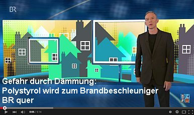](https://youtu.be/GmQDRnGKgvQ) 
 
  
[23.11.11: ARD "Plusminus - Dämmwahn"](https://youtu.be/6Q53pe4CecU) - mit Prof. Jens Fehrenberg, ö.b.u.v. Sachverständiger für Gebäudeschäden 
 
[28.11.11: NDR "45 Min - Wahnsinn Wärmedämmung"](http://www.ndr.de/fernsehen/sendungen/45_min/hintergrund/waermedaemmung117.html) Trailer "Gefährliches WDVS" & "Wärmebild-Schwindel"- mit Konrad Fischer: 
. . . [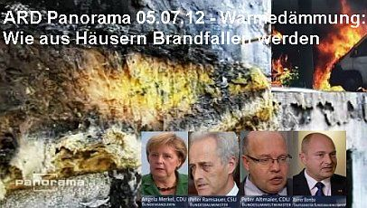](http://daserste.ndr.de/panorama/archiv/2012/waermedaemmung193.html) 
[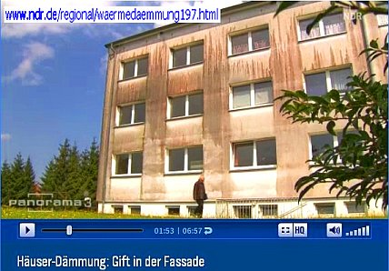](http://www.ndr.de/regional/waermedaemmung197.html) 
_Ergänzend:_ Spiegel online - Enthüllungsjournalist Güven Purtul entlarvt EnEV-Anschlag auf Hab&Gut, Leib&Leben: 
["Styropor-Platten in Fassaden: Wärmedämmung kann Hausbrände verschlimmern"](http://www.spiegel.de/wissenschaft/technik/0,1518,800017,00.html) 
[Das Erste - Panorama 05.07.12: Wärmedämmung: Wie aus Häusern Brandfallen werden - Forum](http://www.ndr.de/apps/php/forum/showthread.php?t=67514&page=2&page=2) 
[Rechtliche Info zum brandgefährlichen Risikopfusch der Wärmedämmung: Rechtsanwalt Wolfgang Hägele](http://www.haera.de/)

Der Aufklärungsbeitrag des NDR am 28.11.2011 "45 Minuten - Wahnsinn Wärmedämmung" hat teils wütende, teils mehr als erbärmliche Reaktionen der für die Zulassung und Anbringung der brandgefährlichen und nichtsnutzigen Dämmstoff auf Wohnhausfassaden hauptsächlich Verantwortlichen - sehen wir mal ab von der teils ahnungslosen, teils gutgläubigen, teils nur Finanzvorteile auf Kosten der Mieter / Eigentümergemeinschaft generierenden und teils vielleicht auch vorteilnehmenden Auftraggeberschaft bzw. deren Vertreter - ausgelöst. Inzwischen hat der NDR nachgelegt und in Panorama 3 am 09.10.12 ["Häuser-Dämmung: Gifte in der Fassade"](http://www.ndr.de/regional/waermedaemmung197.html) gesendet, ein Film, der die Verantwortung nicht nur der Ökoparasiten aus der Baubranche, sondern auch der Bundesegierung für die grauenhafte Zwangsvergiftung Deutschlands durch perverse Wärmedämmkonstruktionen, die so viel Sonne dämmen, daß die Häuser dahinter mehr geheizt werden müssen (siehe: [WELT: Wärmedämmung kann Heizkosten in die Höhe treiben](http://www.welt.de/finanzen/immobilien/article109699115/Waermedaemmung-kann-Heizkosten-in-Hoehe-treiben.html) und [WirtschaftsWoche: Umstrittene Ersparnis: Kostenfalle Wärmedämmung](http://www.wiwo.de/finanzen/immobilien/umstrittene-ersparnis-kostenfalle-waermedaemmung-seite-all/7243848-all.html)), endlich mal am Wickel nimmt. 

Rechtsanwalt Wolfgang Hägele, spezialisiert auf Schäden an Wärmedämmverbundsystemen, hat zum ersten NDR-Beitrag "Wahnsinn Wärmedämmung" Stellung genommen und seine Kommentare dankenswerterweise dieser Infoseite zur Verfügung gestellt. Informieren Sie sich also selber und vollständig: 

---

Sonntag, 4. Dezember 2011 
Wahnsinn Wärmedämmung 

Pressemitteilung des IVH – Industrieverband Hartschaum e.V. vom 01.12.2011 

_"Styropor (EPS) ist nicht brandgefährlich 

Am Montag, den 28.11.2011, wurde im Programm des NDR um 22 Uhr die Sendung „45 Minuten – Wahnsinn Wärmedämmung“ ausgestrahlt. In diesem Beitrag wurde das Thema energetische Sanierung im Gebäudebestand sehr einseitig und in Teilen falsch dargestellt. 

Die Schilderung der Reporter beinhaltete, dass ein zum Brandversuch vorbereitetes Wärmedämm-Verbundsystem aus EPS (Expandiertem Polystyrol, Styropor) als fachmännisch korrekt ausgeführt bezeichnet wurde, obwohl die dafür durch die Zulassung vorgeschriebenen Brandschutzmaßnahmen aus nicht nachvollziehbaren Gründen weggelassen wurden. Das durch einen Gasbrenner in Brand gesetzte WDVS konnte so ohne die erforderlichen Brandschutzmaßnahmen wie Brandriegel oder Brandabschottung im Sturzbereich unkontrolliert abbrennen. Der im Film gezeigte Brandversuch entsprach also nicht den geforderten Brandschutzprüfungen für die Zulassung von WDVS. Er spiegelte auch nicht die in der Realität vorkommenden Brandsituationen wider. 

Wir - sowohl der Industrieverband Hartschaum wie auch der Fachverband Wärmedämm-Verbundsysteme - sehen in dieser Darstellung eine unzulässige Verzerrung der Realität, denn Wärmedämm-Verbundsysteme mit EPS sind bauaufsichtlich zugelassen und somit auch mit einer Brandschutzkomponente versehen, die gerade das im Bericht Geschilderte verhindern soll. 

Wir sehen in dieser Abhandlung eine klare Verunglimpfung des seit mehr als vier Jahrzehnten in der Praxis bewährten Wärmedämm-Verbundsystems. Es besteht die Gefahr, dass durch die Falschberichterstattung viele Bürger, die bisher den Wärmedämm-Verbundsystemen vertraut haben, verunsichert werden. 

Diese einseitig negative Berichterstattung bedeutet auch eine klare Behinderung der von Europa und Deutschland geschuldeten Klimaziele. Darüber hinaus stellt sie unisono eine Verunglimpfung des Fachhandwerks in Deutschland dar. 

Fakt ist: seit mehr als vier Jahrzehnten sind WDVS mit Styropor bauaufsichtlich geregelt und bewährt. Die Systeme sind bei fachgerechter Planung und sorgfältiger Ausführung durch das Fachhandwerk langlebig, sicher und brandschutztechnisch einwandfrei."_ 

Doch Rechtsanwalt Wolfgang Hägele: 
_"Zur Pressemitteilung des IVH – Industrieverband Hartschaum vom 01.12.2011 „Styropor (EPS) ist nicht brandgefährlich“ sei angemerkt: 

Offensichtlich hat der Verfasser der PM den Beitrag nicht vollständig zur Kenntnis genommen, denn sonst würde er nicht behaupten, dass in diesem Beitrag das Thema „energetische Sanierung im Gebäudebestand sehr einseitig und in Teilen falsch dargestellt wurde.“ Das Gegenteil ist der Fall. 

Soweit sich der Beitrag mit der energetischen Sanierung im Gebäudebestand befasste, gelten die getroffenen Feststellungen für Wärmedämm-Verbundsysteme allgemein. Dem Thema Brandschutz wurde aus gegebenem Anlass – folgenschwere Fassadenbrände in der Vergangenheit – ein etwas breiterer Raum gewidmet. 

Soweit beanstandet wird, dass ein zum Brandversuch vorbereitetes Wärmedämm-Verbundsystem aus EPS (Expandiertem Polystyrol, Styropor) als fachmännisch korrekt ausgeführt bezeichnet wurde, obwohl die dafür durch die Zulassung vorgeschriebenen Brandschutzmaßnahmen aus nicht nachvollziehbaren Gründen weggelassen wurden und deshalb das durch einen Gasbrenner in Brand gesetzte WDVS so ohne die erforderlichen Brandschutzmaßnahmen wie Brandriegel oder Brandabschottung im Sturzbereich unkontrolliert abbrennen konnte, ist darauf hinzuweisen, dass der zur Erlangung der Brandschutzklasse B 1 (schwer entflammbar) in die abZ Eingang gefundene umlaufende Brandriegel in jeder zweiten Etage immer in einer Etage brandschutztechnisch ungeschützte Gebäudeöffnungen hinterlässt – und genau dies hatte der Beitrag ausführlich und verständlich dargestellt und deshalb die Versuchsanordnung so aufgebaut, also sehr realistisch. 

Die Kritik an der Berichterstattung erfolgt daher entweder in Unkenntnis des Beitrages oder aber wider besseres Wissen! 

Und was ist mit den unzähligen Gebäuden geringer Höhe, die mit einem normal entflammbaren WDVS versehen sind, weil bei der Anbringung das von Ihnen so gelobte „Fachhandwerk“ – aus welchen Gründen auch immer die in der jeweiligen abZ vorgeschriebenen Brandschutzmassnahmen wie z. B. Brandbarrieren im Sturzbereich weggelassen oder fehlerhaft montiert hat? 

Und bei Dämmstoffdicken bis max. 100 mm? Da wird erst gar nichts dergleichen gefordert! 

Brennen derartige Fassaden etwa anders ab? 

Antworten auf diese Fragen werden erwartet und keine Verunglimpfung kritischer und aufmerksamer Journalisten!"_ 

[Link zum Originalbeitrag: Baurecht: Wahnsinn Wärmedämmung](http://baurecht-haera100.blogspot.com/2011/12/wahnsinn-warmedammung_04.html) 

Wobei hier wieder mal sehr schön klar wird, wem der sogenannten "Klimaschutz" auch noch so dient: Dem teuren und gefährlichen Dämmpfusch an deutschen Fassaden. 

---

Presseerklärung der DeutscheEnergie-Agentur GmbH (DENA) 

_"dena weist Kritik an Wärmedämmung zurück 
Gebäudedämmung ist ein wichtiger Bestandteil, um Klimaschutzziele zu erreichen 
Berlin, 2. Dezember 2011. Aktuelle Medienberichte stellen die Wärmedämmung von Gebäuden als Mittel zur Energieeinsparung und CO2-Reduzierung in Frage. Aus Sicht der Deutschen Energie-Agentur GmbH (dena) sind diese Darstellungen haltlos und weisen überwiegend auf eine unsachgemäße Verarbeitung der Materialien oder eine falsche Planung hin. „Die Gebäudedämmung ist und bleibt ein wichtiger Bestandteil, um die Energieeffizienz von Gebäuden zu erhöhen, Heizenergie zu sparen und klimaschädliche CO2-Emissionen zu reduzieren“, betont Stephan Kohler, Vorsitzender der dena-Geschäftsführung. 

Einsparpotenziale und Wirtschaftlichkeit 
Für optimale Ergebnisse sollte die Dämmung in ein energetisches Gesamtkonzept eingebettet sein, das auch Fenster und Gebäudetechnik beinhaltet. Ebenso wichtig ist eine fachgerechte Ausführung durch qualifizierte Experten. Die dena hat bei den von ihr betreuten Modellprojekten nachgemessen, wie viel Energie mit einer solchen Komplettsanierung gespart werden kann. Der Energieverbrauch sank um 70 Prozent und entsprach damit genau den vorher berechneten Einsparprognosen. 

Zudem lassen sich energetische Sanierungen bei einem ohnehin bestehenden Sanierungsbedarf wirtschaftlich umsetzen. Das belegt die von der dena veröffentlichte Sanierungsstudie, die hocheffiziente Sanierungen von Mehrfamilienhäusern ausgewertet hat. 

Brandschutz 
In Deutschland gibt es sehr hohe Sicherheitsstandards. Das gilt auch beim Brandschutz. Die fachgerechte Ausführung der Dämmmaßnahmen spielt dabei eine entscheidende Rolle. Maßgebend dafür ist die Brandschutzverordnung, die die Verwendung der Baustoffe regelt und vorschreibt, wo an der Fassade Brandsperren angebracht werden müssen. Die Brandschutzverordnung wird regelmäßig aktualisiert und auf den Stand der Technik gebracht. 

Zudem unterliegen alle Baumaterialien in Deutschland einer Zulassungspflicht und werden intensiv von etablierten Instituten geprüft. So wird auch das Brandverhalten von Wärmedämmverbundsystemen in Brandversuchen im Originalmaßstab getestet, bevor sie auf den Markt kommen. 

Algenbildung 
Die Problematik der Algenbildung an gedämmten Fassaden ist vor allem eine optische Beeinträchtigung. Sie kann entstehen, wenn der Außenputz der Fassade im Vergleich zur Luft kalt ist und sich dort Feuchtigkeit niedersetzt. 

Eine Algenbildung muss aber nicht von der Dämmung verursacht sein. Es gibt eine Reihe von äußeren Faktoren, die diese Entwicklung begünstigen, zum Beispiel dichter Pflanzenbewuchs in Fassadennähe, stark verschattete Bereiche der Fassade oder eine verstärkte Schlagregenbeanspruchung, vor allem auf der Nord- und Westfassade. 

Die äußeren Einflüsse können durch eine sorgfältige Planung minimiert werden. Dabei spielen zum Beispiel ausreichende Dachüberstände eine wichtige Rolle. Zudem bietet der Zusatz von Bioziden (Algizide bzw. Fungizide) im Außenputz oder der Farbe Schutz. Auch der Einsatz mineralischer Putze ist möglich. 

Schäden durch Spechtlöcher 
Das Auftreten von Spechtlöchern an gedämmten Fassaden ist ein Randthema. Das zeigt auch eine Umfrage der Zeitschrift „Ausbau und Fassade“ bei Unternehmen des Stuckateurhandwerks aus dem Jahr 2010, in der die überwiegende Mehrheit der Stuckateure das Thema als irrelevant einstuft. Zudem treten Tierschäden nicht ausschließlich in der Dämmschicht von sanierten Häusern auf. So zerfressen Marder zum Beispiel auch Leitungen auf Dachböden und verunreinigen oder zerkratzen Fassaden."_ 

Dazu wieder Rechtsanwalt Wolfgang Hägele: 

_"Zur Presseerklärung der dena vom 02.12.2011 merke ich an: 
Wenn schon fortgesetzt Energieeinsparpotenziale verkündet werden, müssen sich die entsprechenden Interessenverbände durchaus gefallen lassen, dass das Rechenwerk kritisch überprüft und das Ergebnis öffentlich diskutiert wird. 

Ob und wie viel Energie letztendlich eingespart wird, vermag ich genau so wenig zu beurteilen wie die Wirtschaftlichkeit einer energetischen Gebäudesanierung. Das mag jeder, der mit derartigen Vorhaben liebäugelt, für sich selbst nach Ausschöpfung und Abwägung aller Erkenntnisquellen für sich entscheiden. 

Das beste WDVS taugt nichts, wenn es schlecht verarbeitet ist, insoweit gebe ich Herrn [Krechting](http://bit.ly/tqxxdT) durchaus Recht. 

Sich allerdings bei offen zutage tretenden Unzulänglichkeiten hinter falscher Planung und Verarbeitung zu verstecken, ist auch nicht der richtige Weg. 

Nur: 
Zum Thema „Brandschutz“ ist zu sagen, dass gerade im privaten Wohnungsbau der vorbeugende Brandschutz eher niedrig angesiedelt ist. Immerhin sind – bauordnungsrechtlich - brennbare Fassaden bis zur Hochhausgrenze erlaubt. 

Welche Folgen das haben kann, haben jüngste Berichterstattungen deutlich gezeigt. 

Natürlich spielt die fachgerechte Ausführung der in den allgemeinen bauaufsichtlichen Zulassungen für Wärmedämm-Verbundsysteme aus Polystyrol-Partikelschaum vorgeschriebenen Brandbarrieren eine wichtige Rolle, aber nicht alles, was „Stand der Technik“ ist, wird auch zur „allgemein anerkannten Regel der Technik“. Und wenn Neuerungen wie der „umlaufende Brandriegel nach jeder zweiten Etage“ Eingang in die Bestimmungen über die Ausführung und Verarbeitung von WDVS finden, dann darf dies – oder gar muss dies kritisch hinterfragt werden, insbesondere wenn sich dessen eingeschränkte Wirkungsweise oder besser gesagt partielle Unwirksamkeit geradezu aufdrängt. Die partielle Wirkungslosigkeit wurde im Rahmen eines Brandversuchs im Originalmasstab in einem etablierten Institut in dem Beitrag des NDR 45 min vom 28.11.2011 nachgewiesen. 

Die Problematik der Algenbildung an gedämmten Fassaden ist nicht nur vor allem eine optische Beeinträchtigung, sondern sie stellt nach der Rechtsprechung diverser Obergerichte (vgl. [OLG Frankfurt, Beschluss vom 07.07.2010 – 7 U 76/09](http://blogs.haera.de/?p=46)) in Deutschland auch einen Mangel dar. 

Der Zusatz von Bioziden* (Algizide bzw. Fungizide) im Außenputz oder der Farbe kann nicht das Mittel erster Wahl sein, die Folgen sind nicht zu bagatellisieren. 

Das Auftreten von Spechtlöchern an gedämmten Fassaden ist auch kein Randthema mehr, denn sonst kämen nicht in anderen Fernsehsendungen – z. B. „quer“ am 1.12.2011 in BR3 entsprechende Beiträge zu Ehren. 

Aber nicht nur Spechte setzen WDVS-Fassaden zu, sondern auch Mäuse oder Insekten. 

Tierschäden treten nicht ausschließlich in der Dämmschicht von Häusern auf. Nur deren Bekanntheitsgrad nimmt zu. Aber vielleicht werden auch dafür bald „Spechtizide“ erfunden und auf den Fassaden angewendet. 

*Biozide (abgeleitet von bios griech. Leben und caedere lat. töten) sind in der Schädlingsbekämpfung im nicht-agrarischen Bereich eingesetzte Wirkstoffe, Chemikalien und Mikroorganismen gegen Schadorganismen (z. B. Ratten, Insekten, Pilze, Mikroben), also beispielsweise Desinfektionsmittel, Rattengifte oder Holzschutzmittel. 

Laut der europäischen Biozid-Richtlinie sind Biozid-Produkte „Wirkstoffe und Zubereitungen, die einen oder mehrere Wirkstoffe enthalten, in der Form, in welcher sie zum Verwender gelangen, und die dazu bestimmt sind, auf chemischem oder biologischem Wege Schadorganismen zu zerstören, abzuschrecken, unschädlich zu machen, Schädigungen durch sie zu verhindern oder sie in anderer Weise zu bekämpfen“. 
[Quelle: Wikipedia](http://de.wikipedia.org/wiki/Biozid)"_ 

Soweit der Originalbeitrag, den Sie auch hier finden: [dena PM und Kommentar](http://baurecht-haera100.blogspot.com/2011/12/wahnsinn-warmedammung.html) 

Und wenn wir uns fragen, wer steckt hinter der dena? Dann findet sogar noch der dümmste deutsche Depp heraus: Die Bundesregierung und ihre Lieblingsbanken. Na klar, wenn die Deutschen sich in totale Schuldknechtschaft hineinsanieren sollen, braucht es dafür einige Profi-Gehirnmassage. Und wenn wir den Kohler auf seinen Hintergrund abklopfen, ist er vom Atomkraftler zum fanatischen Ökoaktivisten und -institutler mutiert. Vielleicht doch ein bißchen zu viel Strahlung abbekommen? Obwohl - vom Atomstaat zur faschistischen Ökodiktatur mit perfekter Klimaschutzgleichschaltung ist es nun wirklich kein langer Weg ... 

---

> ## <http://www.ivh.de/Aktuelles_I120.whtml>
> 
> ## <http://baurecht-haera100.blogspot.com/2011/12/ein-geschoss-wird-geopfert.html>
> 
> 
> 
> 
> ## Samstag, 10. Dezember 2011
> 
>  
> 
> ### Ein Geschoss wird geopfert!
> 
> 
> 
> 
> 7.12.2011
> 
> 
> 
> 
> **Stellungnahme des DIBt zum SPIEGEL-online-Artikel["Styropor-Platten in Fassaden – Wärmedämmung kann Hausbrände verschlimmern"](http://www.spiegel.de/wissenschaft/technik/0,1518,800017,00.html) und zum [Beitrag des NDR in der Sendung "45 Minuten" am 28.11.2011](https://youtu.be/MKeRe7FA4Gs)**
> 
> 
> 
> 
> Anlass:
> 
> 
> 
> 
> Der im NDR-Fernsehen gezeigte Filmbericht und der darauf Bezug nehmende Artikel auf SPIEGELonline beschreiben ein vermeintlich hohes Brandrisiko bei der Verwendung von Wärmedämmverbundsystemen mit Polystyroldämmstoff (EPS-Hartschaumplatten), obgleich diese Systeme bauaufsichtlich zugelassen sind.
> 
> 
> 
> 
> Stellungnahme DIBt:
> 
> 
> 
> 
> Nach den Landesbauordnungen müssen Außenwandbekleidungen von Gebäuden über 7 m einschließlich der Dämmstoffe und Unterkonstruktionen schwerentflammbar sein. Für kleinere Gebäude genügen bauordnungsrechtlich normalentflammbare Außenwandbekleidungen.
> 
> 
> 
> 
> Bei den vom DIBt zugelassenen WDV-Systemen mit Polystyroldämmstoffplatten (EPSHartschaumplatten) muss zum einen der Nachweis der Baustoffklasse B1 (schwerentflammbar) nach DIN 4102-1 für die "Komponente" EPS-Hartschaumplatten erbracht werden und zum anderen ist für das komplette WDV-System der Nachweis, dass die Anforderungen an schwerentflammbare Baustoffe erfüllt werden, durch Brandprüfungen nach nationalen (DIN 4102-1) oder europäischen Prüfverfahren (DIN EN 13823) sowie ggf. durch zusätzliche Großversuche im Maßstab 1:1 zu führen.
> 
> 
> 
> 
> Die Einstufung "schwerentflammbar" bedeutet dabei, dass unter den Bedingungen eines beginnenden Zimmerbrandes bzw. bei Beanspruchung einer Außenwandbekleidung durch Flammen aus einem im Vollbrand stehenden Raum der energetische Beitrag des betreffenden Baustoffs (hier WDV-System) zum Brand sowie die daraus resultierende Brandausbreitung über den Primärbrandbereich hinaus gering sind.
> 
> 
> 
> 
> WDV-Systeme mit o. g. Dämmstoffplatten, insbesondere bei großen Dämmstoffdicken (> 100 mm), sind bei Brandbeanspruchungen im Sturzbereich von Öffnungen kritisch und können sich unter bestimmten Bedingungen wie normalentflammbare Baustoffe verhalten, d. h. eine ungehinderte Brandausbreitung ist möglich. 
> 
> 
> 
> 
> Insofern liefert der Filmbericht keine neuen Erkenntnisse. 
> 
> 
> 
> 
> Dass WDV-Systeme mit Polystyroldämmstoffplatten brennen, ist in der Fachwelt eine allseits bekannte Tatsache. Dieses seit Mitte der 1990er Jahre bekannte Brandverhalten führte dazu, dass durch Hersteller und den Fachverband WDVS in Abstimmung mit dem DIBt unter Einbeziehung des zuständigen Sachverständigenausschusses (SVA) des DIBt und der Bauaufsicht konstruktive Brandschutzmaßnahmen gegen eine Brandausbreitung und Brandweiterleitung bei WDV-Systemen mit EPS-Dämmstoffen entwickelt und in umfangreichen Testserien geprüft wurden. Die verbindliche Festschreibung dieser Maßnahmen erfolgte dann in den allgemeinen bauaufsichtlichen Zulassungen für diese WDV-Systeme.
> 
> 
> 
> 
> Im Einzelnen wird dazu in den Zulassungen für o. g. WDV-Systeme als konstruktive Maßnahme die Sturzbekleidung und eine seitliche Verkleidung von Außenwandöffnungen mit nichtbrennbaren Mineralwolledämmstoffen oder alternativ die Anordnung von Brandsperren aus nichtbrennbaren Mineralwolledämmstoffen über jedem zweiten Geschoss festgelegt. 
> 
> 
> 
> Die Anordnung von Brandsperren in mindestens jedem 2. Geschoss ist mit der Fachwelt (Sachverständige, Bauaufsicht) im Hinblick auf die Begrenzung einer möglichen Brandausbreitung bei Gebäuden über 7 m bis 22 m abgestimmt.
> 
> 
> 
> 
> Diese Lösung berücksichtigt, dass bei Außenwänden mit Öffnungen (Fenster) und ohne brennbare Außenwandbekleidungen, im Falle eines Raumbrandes Flammen aus den Fenstern schlagen werden. 
> 
> 
> 
> An die im darüber liegenden Geschoss befindlichen Fenster (und deren Gläser) werden keine Anforderungen an eine Feuerwiderstandsfähigkeit gestellt; die Anforderung an eine Feuerwiderstandsfähigkeit besteht grundsätzlich nur für die Geschosstrenndecken (mit Ausnahme bei Gebäudeklasse 1), d. h. die aus den Fenstern schlagenden Flammen können das darüber befindliche Geschoss (und die Fenster) erreichen. Das mögliche Versagen der Fenster (Glasbruch) durch die thermische Einwirkung von Flammen wird hingenommen.
> 
> 
> 
> 
> Insofern ist die Anordnung von Brandriegeln in jedem 2. Geschoss im Einklang mit den Bestimmungen der Landesbauordnungen und sie begrenzt wirksam eine Brandausbreitung/Brandweiterleitung auf Außenwänden.
> 
> 
> 
> 
> Dies wurde durch umfangreiche Prüfungen an originalmaßstäblichen Versuchsaufbauten von WDV-Systemen nachgewiesen.
> 
> 
> 
> 
> Zu dem bei der MPA Braunschweig durchgeführten Brandversuch ist Folgendes anzumerken:
> 
> 
> 
> 
> Der Versuchsaufbau entsprach nicht dem für Zulassungsprüfungen geforderten Aufbau, wie er auch im Arbeitsentwurf von DIN 4102-20 beschrieben wird. Anstelle eines L-förmigen Versuchsstandes wurde nur eine rückwärtige Versuchsstandswand mit dem WDV-System bekleidet und geprüft und die Wand war links und rechts durch massive Wände aus mineralischen Baustoffen begrenzt (U-förmiger Versuchsstand).
> 
> 
> 
> 
> Durch diese schachtförmige Versuchsanordnung wird die thermische Exposition des WDV-Systems deutlich erhöht und entspricht nicht mehr einer Brandbeanspruchung unter Realbrandbedingungen.
> 
> 
> 
> 
> Zu dem im Fernsehbericht des NDR zitierten Feuerwehreinsatz in Berlin im Jahr 2005 ist festzustellen, dass es sich hierbei nicht um ein vom DIBt zugelassenes WDV-System handelte.
> 
> Das DIBt hatte dieses Brandereignis – obwohl es nicht direkt betroffen war – zum Anlass genommen im Frühjahr 2005 in seinem SVA "Brandverhalten von Baustoffen B1/B2" über ggf. erforderliche Konsequenzen für das Zulassungsverfahren bei WDV-Systemen zu beraten. Im Ergebnis wurde von den Sachverständigen festgestellt, dass Zulassungsverfahren des DIBt nicht betroffen seien, die bisher zugelassenen WDV-Systeme seien hinreichend sicher.
> 
> 
> 
> 
> **Hierzu merkt der Rechtsanwalt Wolfgang Hägele an: „Ein Geschoss wird geopfert!“**
> 
> 
> Wenn die Einstufung "schwerentflammbar" bedeutet, dass unter den Bedingungen eines beginnenden Zimmerbrandes bzw. bei Beanspruchung einer Außenwandbekleidung durch Flammen aus einem im Vollbrand stehenden Raum der energetische Beitrag des betreffenden Baustoffs (hier WDV-System) zum Brand sowie die daraus resultierende Brandausbreitung über den Primärbrandbereich hinaus **gering** ist, wirkt die Aussage, dass die Anordnung von Brandriegeln in jedem 2. Geschoss im Einklang mit den Bestimmungen der Landesbauordnungen steht, weil sie wirksam eine Brandausbreitung/ Brandweiter-leitung auf Außenwänden begrenzt, wenig überzeugend.
> 
> 
> 
> 
> Gerade die Anordnung des umlaufenden Brandriegels in nur jedem **zweiten** Geschoss verstärkt doch die Brandausweitung auf Aussenwänden und begrenzt diese doch nicht generell, sondern bestenfalls auf die übernächste Etage. Ausserdem hinkt die Argumentation mit der Heranziehung nicht brennbarer Fassadenteile, denn wenn bei Aussenwänden mit Öffnungen (Fenstern) und **ohne** brennbare Außenwandbekleidungen im Falle eines Raumbrandes Flammen aus den Fenstern schlagen, **können** diese das darüber liegende Geschoss erreichen, müssen es aber nicht. Im Falle ungeschützter brennbarer Fassadenteile ist aber das Überschlagen des Brandes auf das nächste Geschoss sicher!
> 
> 
> 
> 
> Für mich stellt der umlaufende Brandriegel in jeder zweiten Etage eine deutliche Qualitätsverschlechterung dar im Verhältnis zu einer ordnungsgemäß ausgeführten Brandbarriere im Sturzbereich über Gebäudeöffnungen. Eine echte Alternative wäre auch, den umlaufenden Brandriegel nach jeder Etage einzubauen, aber das wäre ja schon eine unerwünschte deutliche Qualitätsverbesserung, weil die Messlatte der bauordnungsrechtlichen Mindestanforderungen übersprungen würde, ohne sie zu berühren.
> 
> 
> 
> 
> Ob der Versuchsstand hätte L-förmig aufgebaut sein sollen statt U-förmig, scheint mir für die praktische Darstellung unbedeutend, zumal Rücksprünge in polystyrolgedämmten Mauerwerken nicht gerade selten sind. Auch hier wird versucht, uns ein X für ein U vorzumachen! Man spricht von deutlich erhöhter thermischer Exposition, ohne diese näher zu präzisieren. 
> 
> 
> 
> Die Scheinheiligkeit gipfelt aber darin, dass im Brandfall „Berlin“ festgestellt wurde, dass es ja gar kein zugelassenes WDVS war, welches abgebrannt ist. Es mag schon sein, dass – wie so oft in der Baupraxis – halt nicht alle Komponenten von einem Systemhersteller stammten und daher keine gültige allgemeine bauaufsichtliche Zulassung (abZ) vorlag, aber offensichtlich hatte die Staatsanwaltschaft das Ermittlungsverfahren eingestellt, weil der Mix von Systemkomponenten nicht ursächlich war für die eingetretenen Folgen; mit anderen Worten: wenn strikt nach der Zulassung gebaut worden wäre, wäre das auch passiert!
> 
> ### Rechtsanwalt Wolfgang Haegele 
> Am Zipser Berg 20 
> 91257 Pegnitz 
> Tel.: 09241 4831900 - Fax:09241 483716 
> <http://www.haera.de/Impressum.htm>

Um es nochmals überdeutlich zu machen: Der deutsche WDVS-Brandtest als Zulassungsvoraussetzung ist in der Branche zurecht als "deutscher Sonderweg" verschrieen. Schon seit vielen Jahren, genauer: seit 2001 gelten für Baustoffe die europaweit harmonisierte Euronormen EN. Demnach ist Polystyrol (EPS) nach DIN EN 13501-1 in die Euroklasse E eingestuft, was nach der deutschen Bauregelliste "normal entflammbar" entspricht. Entsprechend auch das CE-Kennzeichen. Dagegen prüfen die deutschen Behörden - ach, warum wohl? - die schaumigen EPS-Platten im gammelalten "Brandschachttest". Heraus kommt die Einstufung der EPS-Zeitbomben nach DIN 4102: "B1" - "schwer entflammbar". Nach den Europäischen Verträgen seit mehr als zehn Jahren ungültig! Doch nach den geltenden deutschen Landesbauordnungen - weil vorgeblich "schwer entflammbar"! - zulässig für die Fassadendämmung. Und alle Minister und Regierungen und Beamte der deutschen Bundesländer decken diesen Angriff auf das Leben und das Hab und Gut der hiesigen Bevölkerung nach besten Kräften. Das war ja vorher klar. Da wäre mir fast eine Bananenrepublik oder sogar der Staat Dänemark lieber! Wenn's halt nur die fränngischn Brodwörschd doddn gäb' ... ;-) 

Und daß es dazu in den hermetisch abgedichteten und mit Lüftungsschächten durchörterten Ökobuden im Brandfall zu vollkommen neuen Extremrisiken für Feuerwehr, Nutzer und Inventar wie Rauchgasexplosion (Backdraft) und ebenso im Bereich Rauchgasvergiftung kommen kann, geht aus diesem spannenden Artikel eines Sachverständigen für Vorbeugenden Brandschutz und Sachverständiger für Brand- und Explosionsursachenermittlung hervor: 

[Frank D. Stolt: Ökobau und Brandschutz](http://www.feuerwehr-ub.de/ökobau-und-brandschutz) 

---

Äußerst lehrreich ist auch der [offene Brief des GIH Bundesverband an den NDR](http://www.gih-bv.de/index.php?option=com_phocadownload&view=category&id=20:ffentliche-pdfs&download=73:ndr-offener-brief&Itemid=146) gelungen, den ich Ihnen in Originalschreibweise trotz aller Rechtschreib- und Grammatikfehler - nicht vorenthalten möchte und nachfolgend zitiere: 

_"Stuttgart 9. Dezember 2011 
GIH Bundesverband 
Vorstandsmitglied 
Presse und Öffentlichkeit 
Tel 0711 9018031 
Fax 0711 9018032 
alessandro.calandri@gih-bv.de - www.gih-bv.de 
Geschäftsstelle 
Tel 0711 794 885 99 Fax 0711 900 576 16 

An den Intendant des Norddeutscher Rundfunk 
Herr Lutz Marmor 
Rothenbaumchaussee 132 - 134 
20149 Hamburg 

Offener Brief an die Redaktion des Norddeutschen Rundfunks 

Sehr geehrter Herr Marmor, 

mit Interesse haben wir die am 28.11.2011 ausgestrahlten Beitrag ["Wahnsinn Wärmedämmung"](https://youtu.be/MKeRe7FA4Gs) in Ihrer Sendereihe "45 Minuten" verfolgt und dessen Inhalte als positiven Informationsbeitrag mit sensibilisierender Wirkung verstanden. 
Umso unverständlicher und mit Befremdung haben wir die Inhalte aus Ihrer Homepage mit dem Titel ["Die Tricks der Energieberater"](http://www.ndr.de/fernsehen/sendungen/45_min/hintergrund/waermedaemmung115.html) bezüglich der erwähnten Sendung zur Kenntnis nehmen müssen. 

Inhaltlich wird hier der Energieberater als eine abhängige Person dargestellt, der einzig und alleine Beratungen durchführt, in dem die Inhalte darauf ausgerichtet sind Zusatzaufträge zu generieren. 

Zitat: tatsächlich aber verdienen viele ihr Geld auch mit der Planung und Beaufsichtigung von Sanierungsmaßnahmen. Wenn sie also eine Wärmedämmung empfehlen, können sie mehr Geld verdienen als mit der bloßen Beratung. 

Ferner wird der Eindruck erweckt, dass der Energieberater bei der Nutzung von offiziellen und zugelassenen Berechnungswerten, die von den Materialforschungs- und Prüfungsanstalten ermittelt wurden, als Werkzeug für die Akquisition solcher Aufträge ausnutzt. 

Zitat: Energieberater berufen sich auf die ermittelten Zahlen - und sie helfen ihnen beim Verkauf ihrer Dienstleistung 

Gegen solche diskriminierende Aussagen, die ohne jegliche Beweise aufgestellt worden sind, wehren wir uns entschiedenst. 

Nicht zuletzt wird durch die Ausführungen im weiteren Verlauf dieses Artikels lediglich die Meinung einer einzelnen Person, die des Herrn Architekt Konrad Fischer, wieder gegeben, die in der dargestellten Form für den Laien lediglich in einem Abraten von energetischen Maßnahmen mündet. 

Was die weitere Ausführung Ihres Berichtes anbelangt, so hätten wir uns aus journalistischer Sicht ein profunderes Recherchieren erwünscht, um alle Fakten sowohl im positiven, wie auch im negativen Sinne darzustellen. 

Ferner wäre es sicherlich besser gewesen mehrere Meinungen einzuholen um ein umfassendes und vor allem repräsentatives Bild der Thematik zu erzeugen. Eine elementare Pflicht, die der Autor im gesamten Inhalt schmerzlich vermissen lässt. 

Zumindest wird hier das Ziel einer kritischen und objektiven Sensibilisierung letztendlich gänzlich verfehlt. Es wird eher in einer reißerischen und populistischen Form, die wir von einem öffentlichen rechtlichen Sender nicht erwartet haben, von jeglicher Dämmmaßnahme abgeraten. 

Im Übrigen sind die dargestellten Fälle in Ihrem Fernsehbeitrag auch darauf zurück zuführen, dass hier eine sachkundige Beaufsichtigung entweder gefehlt hat oder nicht in der notwendigen Intensität durchgeführt wurde. Denn die technischen Möglichkeiten für die Abwendung und Vermeidung solcher Fälle sind nicht nur vorhanden, sondern unter Fachleuten längst bekannt und angewandt. Desweiteren wird die Baubegleitung nicht umsonst, z.B. von öffentlicher Seite (KfW und Münchner Qualitätsstandard), gefördert. Dies resultiert aus der Erkenntnis, dass es bei der Ausführung häufig zu Mängeln kommt, die jedoch durch eine externe Fachbegleitung verringert werden können. 

Es ist sicherlich nicht verwunderlich, wenn wir als Vertreter des größten unabhängigen Energieberaterverbandes in Deutschland und in Europa, der GIH e.V. Gebäudeenergieberater des Handwerks und Ingenieure, sie auffordern, Ihre Inhalte durch aussagekräftigen Fakten und Daten zu belegen, vor allem im Hinblick auf die erwähnten Verkaufsstrategien der Energieberater. 

Andersfalls erwarten wir fairerweise, eine für die Öffentlichkeit zugänglich, entsprechende Richtigstellung. 

Im Namen der Vorstandschaft des GIH Bundesverbandes 

Mit freundlichen Grüßen 

Alessandro Calandri 
GIH Bundesverband e.V 
Vorstandsmitglied Presse und Öffentlichkeit"_ 

Aha. Schweres Geschütz! Und was antwortet nun der öffentlich-rechtliche Sender? Bitteschön, auch das zitiere ich Ihnen nur gerne, allzugerne: 

_"Norddeutscher Rundfunk 
Intendant 

GIH Bundesverband e. V. 
Herrn Alessandro Calandri 
Industriestraße ll 
70565 Stuttgart 

30. Dezember 2011 

Ihr Schreiben 

Sehr geehrter Herr Calandri, 
vielen Dank für Ihren Brief vom 9. Dezember 2011 zum Online-Auftritt unserer Dokumentationsreihe "45 Min" an den Intendanten des Norddeutschen Rundfunks, Herrn Lutz Marmor. Ich antworte Ihnen stellvertretend. 

Zu dem Film mit dem Titel "Wahnsinn Wärmedämmung" haben wir so viele Reaktionen und Zuschriften erhalten wie selten. Das zeigt uns, dass wir ein Thema aufgegriffen haben, an dem unsere Zuschauerlnnen und Zuschauer ein überdurchschnittliches Interesse haben. 

Es freut mich, dass Sie die Grundthese des Films teilen, dass die Wärmedämmung von Gebäuden oft ohne sachkundige Beaufsichtigung durchgeführt wird. Ihre Kritik an den weiterführenden Inhalten unserer Online-Seiten kann ich allerdings nicht nachvollziehen. Keinesfalls werden alle Energieberater als abhängige Personen dargestellt. Im Gegenteil: Es wird sehr wohl zwischen den Positionen einzelner Energieberater und Dämm—Kritiker differenziert. Zudem sind die von Ihnen geforderten Fakten auf der Internetseite eingestellt. 

Eine Stellungnahme der Redaktion zu Ihren Kritikpunkten habe ich diesem Brief beigefügt. 

Ich hoffe, dass Sie den Programmen des NDR weiterhin gewogen bleiben. 

Mit freundlichen Grüßen 

Dr. Arno Beyer 
Stellvertretender Intendant 

Anlage 

Redaktionelle Stellungnahme 

Der Internetauftritt der Dokumentationsreihe "45 Min" hat sich das Ziel gesetzt, den Zuschauern und Usern zusätzliche Informationen zum Fllm zu bieten. Für das Dossier zu "45 Min: Wahnsinn Wärmedämmung" hielten wir es, gemäß unserem öffentlich-rechtlichen Auftrag, für journalistisch geboten, unter anderem darüber aufzuklären, was Thermografie kann und was nicht. Wir wollten den Zuschauern/Usern eine Orientierung bieten, wie sie mit diesem Instrument umgehen sollten. Wir können der Kritik des GIH Bundesverband e.V. nicht folgen, Energieberater würden ln dem Internetbeitrag insgesamt als abhängige Personen dargestellt. Im Gegenteil, es wird sehr wohl zwischen einzelnen Energieberatern und Dämmkritikern differenziert. 

Die Redaktion nimmt zu den Kritikpunkten des GIH im Einzelnen wle folgt Stellung: 

1. GIH: Inhaltlich wird der Energleberater als eine abhängige Person dargestellt, der einzig und allein Beratungen durchführt, in dem die Inhalte darauf ausgerichtet sind, Zusatzaufträge zu generieren. 

Stellungnahme der Redaktion: Wir sagen nicht, dass das in jedem Fall so ist. Für den User/Zuschauer ist aber wichtig zu wissen, worin das Eigeninteresse einiger Energieberater unter Umständen liegen kann. 

Die Generierung von Zusatzaufträgen ist im Übrigen ein Anreiz, mit dem offen geworben wird. Siehe den Link www.ils.de/gebaeudeenergieberater-hwk.php. Zitat: _"Wann ist dieser Lehrgang für Sie richtig? Der Lehrgang eignet sich für alle, die rund um die energetische Beratung bei Neubau, Sanierung und Modernisierung von Gebäuden tätig sein möchten. Vor allem im Zusammenhang mit einer vorhandenen Qualifikation in der Baubranche bietet sich der Kurs als ergänzende Kompetenz an. Die Erarbeitung von energetischen Modernisierungsplänen und die Beratung von Kunden kann dabei als eigenständige Tätigkeit angeboten werden oder als Service, der zur Akquisition von Kunden für die Umsetzung der Modernisierungsmaßnahmen dient."_ 

Die Informationen auf der Internetseite von "45 Min" ermöglichen es dem User/Zuschauer, sich eine Meinung darüber zu bilden, ob und welche Leistung er vom Energieberater annehmen will. Das entspricht unserem öffentlich-rechtlichen Auftrag. 

2. GIH: Energieberater berufen sich auf die ermittelten Zahlen — und sie helfen ihnen beim Verkauf ihrer Dienstleistung/Diskriminierende Aussagen 

Stellungnahme der Redaktion: Auch hier wendet sich die Information nicht gegen die Energieberater, sondern an den User/Zuschauer. Auch hier soll darüber aufgeklärt werden, was es mit den Zahlen auf sich hat. Und worauf der User/Zuschauer in diesem Zusammenhang achten sollte. Ein aufgeklärter User/Zuschauer ist sicher auch im Interesse des Bundesverbandes der Gebäudeenergieberater. Ein aufgeklärter Kunde begegnet dem Dienstleister auf "Augenhöhe". Dass Aussagen, die lediglich die Fakten darstellen, diskriminierend sein sollen, ist für die Redaktion nicht nachvollziehbar. 

3. GIH: Meinung einer Einzelperson/Konrad Fischer 

Wie dem Text klar zu entnehmen ist, wird Konrad Fischer als Dämmkritiker eingeführt und bezeichnet. Insofern wissen die Leser, dass Fischer auf einer Seite des Meinungsspektrums zu Wärmedämmverbundsystemen steht. 

4. GIH: Populismus/Profundere Recherchen 

Die Redaktion hat sehr wohl die Fakten zu diesem Beitrag recherchiert und selbstverständlich mit verschiedenen Quellen abgeklärt, die in dem Artikel auch genannt werden. Der Text ist nicht reißerisch oder populistisch, sondern sachlich und klar. 

5. GIH: Mängel in der Durchführung 

Die Redaktion begrüßt, dass auch der Bundesverband der Gebäudeenergieberater GIH der Auffassung ist, dass Zitat: _"... die dargestellten Fälle in Ihrem Fernsehbeitrag auch darauf zurückzuführen sind, dass hier eine sachkundige Beaufsichtigung entweder gefehlt hat oder nicht in der notwendigen Intensität durchgeführt wurde."_ Genau diese Umstände haben dazu geführt, dass die Redaktion es sich zur Aufgabe gemacht hat, auf die Probleme im Umgang mit Wärmedämmverbundsystemen aufmerksam zu machen. Die riesige Zuschauerresonanz, die wir nach Ausstrahlung des Films und auf unser Internetangebot registrieren, zeigt, dass hier offensichtlich ein öffentliches Interesse besteht, nicht zuletzt deshalb, weil verständliche, verbrauchernahe Informationen zu dem Thema offensichtlich in zu geringem Maße vorhanden waren. 

Patricia Schlesinger 
Leiterin 
Programmbereich Kultur und Dokumentation 
Hamburg, 22.12.2011"_ 

Soweit, so gut! Meinen Sie nicht auch? Und würden Sie jetzt noch von einem Energieberater einen Gebrauchtwagen kaufen? Die Antwort müssen Sie schon selber finden! 

Nur knappe zwei Jahre dauerte es, als am 24. November 2013 die WDVS-Brandkatastrophe am Schulterblatt im Hamburger Schanzenviertel auch den Nordlichtern das gräßliche Spektakel einer brandbeschleunigenden WDVS-Fassadenbeschichtung namens "Energieeffizienzsanierung" gönnte: [STYROPOR-BRANDBESCHLEUNIGER - Feuer auf dem Schulterblatt: So gefährlich ist Wärmedämmung](http://www.mopo.de/nachrichten/styropor-brandbeschleuniger-feuer-auf-dem-schulterblatt--so-gefaehrlich-ist-waermedaemmung,5067140,25143554.html) 

---

Ein lustiges Ergebnis des NDR-Films im politischen Schmierentheater namens Bundestag können Sie hier - kommentiert - nachlesen: 

Elektronische Vorab-Fassung 

Deutscher Bundestag Drucksache 17/8197 
17. Wahlperiode 14. 12. 2011 

## Kleine Anfrage

der Abgeordneten Michael Groß, Sören Bartol, Uwe Beckmeyer, Martin Burkert, Petra Ernstberger, Iris Gleicke, Ulrike Gottschalck, Hans-Joachim Hacker, Gustav Herzog, Ute Kumpf, Kirsten Lühmann, Thomas Oppermann, Florian Pronold, Dr. Frank-Walter Steinmeier und der Fraktion der SPD 

### Dämmstoffprüfung auf Brandgefahr

Im Gebäudebereich liegen große Potenziale zur Energieeinsparung und zur Steigerung der Energieeffizienz. Erklärtes Ziel der europäischen Staaten und der Bundesregierung ist es, die Sanierungsquote im Gebäudebestand deutlich zu erhöhen. 

Rund 85 Prozent des gesamten Energiebedarfs in privaten Haushalten fallen für Heizung und Warmwasser an. Hier liegen die größten Energieeinsparpotentiale. Durch fachgerechtes Sanieren und moderne Gebäudetechnik können bis zu 80 Prozent des Energiebedarfs eingespart werden [KF: Das behauptet die dena, die Kreatur der Bundesregierung und der Banken. In Wahrheit stimmt das nicht!] Hiervon profitieren der Klimaschutz, der allgemeine Wohnwert und die Mieter, die durch einen niedrigeren Energieverbrauch Heizkosten einsparen können. [KF: Wo sind diese Mieter, wo die Ersparnisse? Herzeigen, Ihr Politlaffen!] 

Ein Teil der Heizkosten lässt sich z. B. durch eine verbesserte Dämmung einsparen [KF: Woher will das die SPD wissen? [Stimmen tut das nämlich nicht unbedingt.](7fehrtab.md)]. Bei 80 Prozent des eingesetzten Dämmmaterials handelt es sich um Styropor. Laut den [Untersuchungen und Realitätstests](https://youtu.be/MKeRe7FA4Gs) des Norddeutschen Rundfunks (NDR) handelt sich hierbei aber genau um das Material, das den Brandschutz nicht ausreichend gewährleisten kann. Allein der Verdacht, dass es hier zu einer potentiellen Gefährdung kommt, muss durch Experten geprüft und bewertet werden. Lösungen für den Brandschutz müssen gefunden werden. 

Wir fragen die Bundesregierung: 

1. Sind der Bundesregierung Brandfälle bekannt, bei denen die Fassadendämmung die Brandgefahr erhöht hat? 
2. Welche konkreten Ursachen könnten dafür verantwortlich sein? 
3. Inwieweit sollen Brandschutzmaßnahmen für die Fassadendämmung aus Sicht der Bundesregierung gesetzlich vorgeschriebenen oder empfohlen werden? 
4. Prüfen Bundesämter oder Bundesforschungsanstalten bzw. Materialprüfanstalten das Brandverhalten von Fassadendämmstoffen? 
5. Wenn ja, mit welchem Ergebnis? 
6. Inwieweit werden diese Ergebnisse veröffentlicht und den Nutzern, Herstellern und Bauverantwortlichen zur Verfügung gestellt? 
7. Ist es rechtmäßig korrekt, dass Brandsicherheitstest im Rahmen des Zulassungsverfahrens zwar durchgeführt werden, jedoch von den Herstellern selbst gezahlt und daher nicht veröffentlicht werden? 
8. Wenn ja, welche Maßnahmen könnten dies verhindern? Plant die Bundesregierung hierzu eine Überarbeitung der Vorschriften? 
9. Inwieweit plant die Bundesregierung das Baurecht der Länder in Bezug auf den Brandschutz zu vereinheitlichen? 
10. Welche Forschungsvorhaben will die Bundesregierung unterstützen, um Dämmung und Brandschutz zu tragbaren Kosten miteinander zu verbinden? 
11. Hält die Bundesregierung – insbesondere unter dem Eindruck des [Realitätstest des NDR](https://youtu.be/MKeRe7FA4Gs), dessen Ergebnisse in der Sendung [„45 Min“ am Montag, den 28. November 2011](https://youtu.be/MKeRe7FA4Gs) bekannt gegeben wurden – die Einstufung von Styropor in die Kategorie „schwer entflammbar“ nach wie vor für richtig? 
12. Welche Maßnahmen wird die Bundesregierung unternehmen, um über die Entflammbarkeit von Styropor genauere Auskunft zu bekommen? 
13. Welche Maßnahmen ergreift die Bundesregierung, um der entstandene Verunsicherung von Verbrauchern, Herstellern und Handwerk entgegenzuwirken? 
14. Wie ist die Brandgefahr bei ökologischen Dämmstoffen aus nachwachsenden Rohstoffen einzuschätzen, und welche Einschränkungen für ihre Verwendung ergeben sich daraus? 
15. Wie stellt sich die Brandgefahr bei der Verwendung von ökologischen Dämmstoffen bzw. von Dämmstoffen aus nachwachsenden Rohstoffen im Vergleich zur Brandgefahr von synthetischen Dämmstoffen aus Polysterol [KF: Polystyrol!] und Styropor, insbesondere vor dem Hintergrund neuerer Erkenntnisse zur Entflammbarkeit, dar? 
16. Welche konkreten Dämmmaterialien können den Brandschutz nicht ausreichend gewährleisten? 
17. Sollten Schutzmechanismen wie Brandsperren bei Einfamilienhäusern zukünftig gesetzlich vorgeschrieben werden? 
18. Wird die Bundesregierung den Mittelansatz für die energetische Gebäudesanierung erhöhen, um zusätzliche Kosten für den Brandschutz zu finanzieren, um die klimapolitischen Ziele der Bundesregierung nicht zu gefährden? 
19. Für welche Häuser sind Brandschutzmaßnahmen zwingend vorgeschrieben, und für welche nicht? 
20. Sieht die Bundesregierung hier Handlungsbedarf? 
21. Welche zusätzlichen Kosten würden durch verbesserte Brandschutzmaßnahmen für Ein- und Mehrfamilienhäuser in etwa entstehen? 
22. Sieht die Bundesregierung hier ein Hemmnis für das Voranbringen der energetischen Sanierung? 

Berlin, den 14. Dezember 2011 
Dr. Frank-Walter Steinmeier und Fraktion 

---

Soweit die SPD. Alles gut und schön und feines Gezwiebel der Regierungsheinis. Doch in Wahrheit voll am Thema vorbei, denn 1. Gibt es keine menschengemachte Klimaerwärmung, 2. Kein CO2-Problem, 3. Keine zur Neige gehenden fossilen Energien, 4. Keinen zwingenden Grund zum staatlich verordneten Klimaschutz namens Energiesparen auf Schwarzschimmel und Rauchgastod komm raus, 5. Keinerlei Beitrag der EnEV und des EEWärmeG und des EEG zu einer irgendwie sinnvollen Entwicklung unserer Gesellschaft, dagegen aber Abzocke ohne Ende. Und unsere Politrucks sind ein Teil des Problems und bestimmt keine Lösung. Wobei der beste Brandschutz für die deutsche Wohnbevölkerung 1. Raushalten aus allen Kriegshändeln und zweitens die Nulldämmung im Gebäudebestand wäre. So einfach kann die Wahrheit sein. Doch niemand will sie hören. 

Interessanterweise faßte sich daraufhin die wohl einzige lobbyistenfreie Schutzgemeinschaft für Wohnungseigentümer und Mieter Hausgeld-Vergleich e.V. ein Herz und schrieb dem Steinmeier einen aufklärenden Brief, den ich Ihnen nachfolgend präsentiere: 

_"Hausgeld-Vergleich e.V., Gehrestal 8, 91224 Pommelsbrunn 

Fraktion der SPD 
zu Hd. Herrn Dr. Frank-Walter Steinmeier 
im Deutschen Bundestag 
Platz der Republik 1 

11011 Berlin 

6.1.2012 

Ihre Anfrage vom 14.12.2011 an die Regierung (Drucks. 17/8197) 
zu Brandfall-Auswirkungen bei Fassadendämmungen 
- NDR TV-Bericht vom 28.11.2011 - 

Sehr geehrter Herr Dr. Steinmeier, 

wie Sie unserem Vereinsnamen entnehmen können, verstehen wir uns als Schutzgemeinschaft, die Wohnungsinhaber vor 
- überhöhten Zahlungen und 
- nicht ordnungsgemäßer Verwaltung 
schützen will. 

Aus diesem Grunde begrüßen wir sehr, wenn sich die SPD-Fraktion nach der NDR-Sendung vom 28.11.2011 nun auch mit einem Teil der öffentlichen Kritik der Plastikverpackung von Bestands-immobilien auseinandersetzt - wenn auch wie in Ihrem Falle zu-nächst nur mit der erhöhten Brandschadensgefahr der synthetischen Dämmstoffe Polystyrol und Styropor. 

Wir gehen davon aus, dass auch die SPD-Abgeordneten bisher nur einseitig und gezielt positiv über die sog. Plastikverpackung von Bestandsimmobilien informiert wurden. 

Zur ausgewogenen und sachlich angemessenen Aufklärung im Sinne unserer Bürger erlauben wir neben der erhöhten Brandschadensgefahr auf weitere 10 Nachteile der Wärmedämmverbundsysteme hinzuweisen, die es ebenfalls zu erörtern gilt. 

Unseren Erfahrungsbericht dazu “10 Argumente ...“ fügen wir bei. 

Ferner dürfen wir Sie auf die Methoden hinweisen, mit denen in der Praxis Wohnungseigentümer über die Einsparmöglichkeiten durch Wärmedämmverbundsysteme durch sog. “Energieberater“ und Hausverwalter mit offensichtlichem Vorsatz getäuscht werden. 

Über einen typischen konkreten Fall aus Nürnberg haben wir einen Bericht “Vorsicht Daten überprüfen!“ verfasst, den wir ebenfalls übersenden. 

Wir meinen, dass es überfällig ist, dass unsere Wohnungsinhaber (Eigentümer und Mieter) nicht weiter durch geschönte Darstellungen über die angeblichen Vorteile der Plastikverpackungen unserer Häuser in den Medien im Sinne unserer Regierung und vieler Politiker getäuscht werden. 

Den TV-Sendern BR, SWR, ARD (Plus-Minus) sowie dem NDR (hier insbesondere dem mutigen Redakteur Purtul) sollte von der Politik gedankt werden, dass sie endlich auch den Dämmungskritikern Sendezeit eingeräumt und somit den Anstoß zu einer überfälligen ausgewogenen Aufklärung ermöglicht haben. 

Gerade die Vorkommnisse des Jahres 2011 sollten dazu motivierren, 2012 zu einem Jahr der Wahrhaftigkeit und volkswirtschaftlichen Fehlervermeidung werden zu lassen. 

Dazu gehört eine faire, ergebnisoffene und öffentliche Diskussion 
- über den betriebswirtschaftlichen und umweltpolitischen Sinn der Plastikverpackung von Häusern ebenso 
- wie eine politische Erkenntnis und Klarstellung darüber, dass Sonne und Wind unzuverlässige und teuere Energiearten sind, die nicht geeignet sind, unsere Wirtschaft und die Verbraucher zuverlässig und kostenverträglich zu versorgen. 

Wir wünschen uns, dass sich die SPD auf diesen Gebieten im Sinne der Bürger neu orientiert und das anstrebt, was unsere Volkswirtschaft und Bürger zu tragen noch in der Lage sind. 

Mit freundlichen Grüßen 

(Unterschrift) 

Norbert Deul - 1. Vorstand 

2 Anlagen zur Information"_ Und hier die bemerkenswerten Anlagen, deren Gebrauchswert wohl alle Infos von Haus und Grund zusammengenommen meilenweit übertrifft: 

---

Anlage 1 
_

## "[10 Argumente gegen die Plastik-Verpackung der Wohngebäude](http://www.hausgeld-vergleich.de/Deul_Erfahrungsaustausch_44.htm)

Jeder kennt die Werbung der Bundesregierung mit der Wollmütze über einem Haus. Unsere Bundesregierung suggeriert mit dieser Wollmütze, dass eine luftdichte Plastikverpackung die gleiche positive Auswirkung haben soll, wie die Mütze auf dem Kopf in der kalten Jahreszeit. Statt einer sachlichen Aufklärung betreibt die Bundesregierung mit dieser Werbekampagne eine böse Fehlinformation. Sachlich richtig wäre die Anzeige, wenn statt der luft- und feuchtigkeitsdurchlässigen Wollmütze eine Plastiktüte über das Haus gezogen worden wäre. Ein Wärmedämmverbundsystem gleicht einer Plastiktüte. Aber wer würde sich schon eine Plastiktüte über den Kopf ziehen - wohl nur ein Narr. Und deshalb griff die Bundesregierung zu ihrer irreführenden Werbung. 

Warum sollten Sie als Wohnungsinhaber nicht auf Verkaufsförderungsmaßnahmen für die Dämmstoff-Lobby hereinfallen? 10 Argumente sprechen gegen die Plastikverpackung: 

1. Theoretisch errechnete Einsparwerte werden nicht erreicht 

Gedämmte Wände erbringen nicht die Einsparwerte der theoretischen Rechenmodelle nach dem U-Wert (früher k-Wert). co2online, eine von unserem Staat finanziell geförderte Institution, distanzierte sich in einem TV-Bericht des SWR von den bisher in den Medien und Werbebroschüren veröffentlichten angeblichen Einsparerfolgen. In den Nachberechnungen würde sich lediglich 15% Einsparung ergeben, so dieses Institut. Berechnungen nach DIN V 18599 haben sich als unbrauchbar und irreführend erwiesen. 

2. Kostenlose Sonnenwärme wird in der Übergangszeit und im Winter nicht genutzt 

Die Wärmedämmverbundsysteme verhindern den Eintrag der Sonnenwärme in ein Mauerwerk. Diese kostenlos bei einem konventionellem Mauerwerk gespeicherte Wärme strahlt nachts nach innen und außen ab. Die Folgen: Weniger Heizung für innen und Algenvermeidung an den Außenwänden bei konventionellen Mauerwerken. Eine Langzeitstudie von Prof. Dipl.-Ing. Jens Fehrenberg (Hildesheim) ergab sogar, dass bei identischen Wohnblocks die gedämmten Gebäude mehr an Energie verbrauchten als die ungedämmten. 

3. Erhöhte Wartungskosten für Wärmedämmverbundsysteme 

Algenbildung, Spannungsrisse, sonstige Undichtigkeiten an den Anschlüssen, Vogelverpickungen (Spechtlöcher), geringe Stoßfestigkeit, geringe Dauerdichtigkeit bei Durchdringungen erfordern einen erhöhten Wartungsaufwand (siehe “Schäden an Wärmedämmverbundsystem“ von Erich Cziesielski/Frank Ulrich Vogdt, Fraunhofer IRB Verlag). Während bei einem konventionellen Mauerwerk Wartungskosten von 7,08 €* je qm im Jahr angesetzt werden, sind dies bei einem Wärmedämmverbundsystem bereits 16,43 €*, also 132% mehr (* Quelle: Institut für Bauforschung e.V. in Hannover). Eine möglicherweise erreichte Geldeinsparung bei der Energie wird dadurch gemindert. 

4. Verhinderung des Feuchtigkeitsabflusses von innen nach außen fördert Schimmel 

Durch das Bewohnen entsteht innerhalb einer Wohnung Feuchtigkeit (ca. 8 - 15 kg bei einem Vierpersonen-Haushalt lt. Rechtsgutachten des Bundesverbandes für Wohnungslüftung). Diese staut sich an einem feuchtigkeitsdichten Wärmedämmverbundsystem nach innen zurück, wenn nicht wesentlich mehr als vor solch einer Dämmung gelüftet wird. Da die neue erforderliche Luftwechselrate häufig nicht erreicht werden kann, besteht die Gefahr der Schimmelbildung an den kältesten Zonen der Innenwände. Um solche gesundheitlichen Gefahren zu beseitigen, wird zusätzlich zur Dämmung bereits der Einbau von Lüftungsanlagen empfohlen, was eine Dämmmaßnahme noch unrentabler macht. 

5. Schimmelgefahr an Kältebrücken 

Werden Fenster- und Türenlaibungen bei der Wärmedämmung nicht mitgedämmt, um sich z.B. den Fenster- und Türenaustausch oder Umbau zu ersparen, entstehen um die Fenster, Türen und Rollokästen Kältebrücken, die die Schimmelbildung an diesen Stellen fördern können. Derzeit gelten 3 - 4 Millionen Wohnungen in der BRD mit Schimmel belastet. 

6. Verkleinerte Fenster-, Türenflächen (Schießscharteneffekt) und Balkone 

Wird fachlich einwandfrei gedämmt, also auch in Fenster- und Türenlaibungen, so sind neue kleinere Fenster und Türen erforderlich. Es entsteht der sog. Schießscharteneffekt. Werden in Außenwände eingezogene Balkons gedämmt, so verringern sich die Balkonflächen um die Dämmstärke, z.B. derzeit ca. 16 cm an jeder Wand und mindern die Nutzfläche. 

7. Algenbildung an den Außenwänden 

Gedämmte Fassaden erkalten schneller als ungedämmte. Das sich an den kalten Dämmungen außen ansammelnde Kondenswasser ist ein idealer Lebensraum für die hässlichen grünen Algen, Pilze und Flechten. Gedämmte Wände können deshalb schmutzig grün werden, bevorzugt an Ost- und Nordseiten und in Nähe von Bäumen. Um dies zu verhindern, wird inzwischen das Aufheizen der Dämmsysteme an den Außenseiten mit Strom empfohlen (Schilda grüßt)! 

8. Giftige Algizide und Fungizide gelangen ins Grundwasser 

Um die Wände vor Algenbefall eine gewisse Zeit zu schützen, werden die Dämmsysteme außen mit giftigen Algiziden und Fungiziden behandelt, die sich ins Grundwasser auswaschen (siehe u.a. Berichterstattung und Messungen in der NDR-Sendung vom 28.11.2011). 

9. Die Dämmstoffe sind der Umweltmüll von morgen, sie können auch brennen 

Dämmsysteme halten nicht ewig, sondern müssen später als Sondermüll entsorgt werden. Ca. 800 Millionen Quadratmeter Dämmstoffe sind bereits verklebt worden. Dass der als schwer entflammbar geltende Dämmstoff Polystyrol massiv brennen kann, wurde durch einen Brandversuch des NDR nachgewiesen. 

10. Außenwanddämmungen an Bestandsimmobilien sind höchst unwirtschaftlich 

Die Aufwendungen für die Anbringung der Dämmung und die damit verbundenen häufig verschwiegenen Zusatzkosten für die Versetzung von Dachrinnen, Briefkästen, Außensteckdosen und -wasserhähnen, die Neuanpassung von Außenrollos, Markisen, Balkongeländern sowie häufige Dachverlängerungen amortisieren sich nicht in einem vertretbaren Zeitraum. Die Kosten führen zu unvertretbaren Mietenanhebungen und Sonderbelastungen für die Selbstnutzer der Wohnungen. 

Die staatliche Bezuschussung zur Abfederung dieser höchst unwirtschaftlichen Dämmmaßnahmen an Bestandsimmobilien ist durch nichts zu rechtfertigen. Die Energie-Einsparpotentiale werden maßlos überschätzt, da Bestandsimmobilien im Durchschnitt derzeit die lediglich 138 kWh verbrauchen werden (ista-IWH-Studie) Außenwanddämmungen an Bestandsimmobilien verbrennen deshalb das Geld des Bürgers und Steuerzahlers. Solche unwirtschaftlichen Maßnahmen schädigen die Volkswirtschaft. Die unwirtschaftlichen Dämmmaßnahmen sind nicht geeignet, das Klima zu verändern. 

Norbert Deul"_ 

---

Anlage 2 
_

## "[Vorsicht - Daten überprüfen! Das Gutachtern einer Energieberaterin liegt vor.](http://www.hausgeld-vergleich.de/Deul_Erfahrungsaustausch_40.htm)

So hätte man Eigentümer warnen müssen, um sie vor einer überflüssigen Diskussion und einem unnützen Klageverfahren zu schützen. 

Im vorliegenden konkreten Falle geht es um eine Wohnanlage mit ca. 1.100 qm Wohnfläche. Es lag ein Energieausweis der Firma Brunata vor, der aus dem tatsächlichen Gaseinkauf über drei Jahre einen Durchschnittsverbrauch von 121 kWh je qm Wohnfläche im Jahr auswies. Davon wurden 98 kWh für die Heizung und 23 kWh für die Erwärmung des Wassers benötigt. Somit war von vornherein klar, dass sich ein neues Wärmedämmverbundsystem an den Außenwände unter keinen Umständen „rechnen“ wird. 

Nicht so jedoch für den Verwalter und die von ihm mit einem Gutachten beauftragte Energieberaterin (eine Diplom-Ingenieurin). 

Der vom Verwalter ausgesuchte Anwalt, ein Fachanwalt für Bau- und Architektenrecht beantragt deshalb seine Klageabweisung mit den Worten: 

"Die Beraterin (Anmerkung: die Energieberaterin) kommt zu dem Ergebnis: „wirtschaftlich“." 

Gemeint war damit die Anbringung eines Wärmedämmverbundsystens in 16 cm Stärke nur an der Ost- und Westseite der Wohnanlage (zum Verständnis: Eine Gruppe von sachlich rechnenden Eigentümern hat die Mehrheitsbeschlüsse dieser Wohngemeinschaft zur konkreten Ausführung dieser von der Energieberaterin empfohlenen Wärmedämmmaßnahme bei Gericht angefochten). 

Aber wie lässt sich das Rätsel aufklären, weshalb die Energieberaterin zu solch einer irrigen Annahme kommt? 

Die Lösung dazu soll sich aus DIN V 18599 ergeben. Diese DIN widmet sich der Gebäudetechnik, genau gesagt, der energetischen Bewertung von Gebäuden, kurz Berechnung der Energiebilanz. DIN-Normen entstehen auf Anregung und durch die Initiative daran interessierter Kreise. Wer hier die interessierten Kreise gewesen sein könnten, könnte sich möglicherweise aus dem Folgenden ergeben. 

Dank dieser DIN und einem dazu gehörenden Rechenprogramm verzichtet die Energieberaterin natürlich auf die echten Verbrauchswerte, denn dafür soll die DIN ja den Energieverbrauch zuverlässig für die interessierten Kreise ermitteln. 

Welchen praxiserfahrenen Eigentümer kann es da noch wundern, dass die interessierten Kreise statt des von Brunata ermitteln tatsächlichen Durchschnittsverbrauchs von 159.328 kWh im Jahr (Heizung und warmes Wasser) sagenhafte 316.000 kWh errechnen - also doppelt soviel wie in der Realität. 

Erfreulicherweise kommt die Energieberaterin dann aber zu einem ähnlichen Theorie-Ergebnis beim Einsparwert an Energie wie der Praktiker. Die Energieberaterin meint, 26% an Energie bei einer Dämmung aller Wände einsparen zu können, der Praktiker kennt die Zahl 25%. Diese erfreulich Übereinstimmung wird dann aber im Gutachten der Energieberaterin von 4 auf 2 Seiten übertragen, so dass sie bei einer nur 2-seitigen Dämmung von „ihrem Dank DIN“ errechneten Verbrauch von 316.000 kWh/a 84.000 kWh/a einzusparen glaubt, während der Praktiker in diesem Falle vermutlich nur ca. 12,5% anzusetzen wagt. 

Damit trotz bereits 2-facher Verdoppelung ein gutes Amortisationsverhältnis bei dem Gutachten herauskommt und sich die Maßnahme für jedermann erkennbar lohnt, wird dann noch statt des tatsächlichen Energiepreises für Gas im Jahre 2010 in dieser Region von 0,0548 € je kWh der fiktive Preis von 0,1046 € für die DIN-Berechnung eingesetzt. So wird es noch besser. 

Und siehe da, so kann das Wunder vollbracht werden: 

Die Einsparung an Energie beträgt sauber berechnet 8.790,- € im Jahr. 
Danke DIN V 18599! 
Danke Energieberaterin! 

Die Kläger haben jedoch erkannt, dass für die ganze Wohnanlage im Jahr nur 8.328,77 € für die Energie ausgegeben wurde (also sogar incl. Wasser). Wie kann man dann 8.790,- € davon einsparen? Sie kommen nur auf schnöde 917 € über den „Daumen“ gerechnet. 
Statische Amortisation demnach ca. 100 Jahre! 

Und wer könnten nun die interessierten Kreise sein? 
Verwalter, Energieberater, Dämmstoffhersteller, Handwerker, Banken, unsere Regierung ? 

Antworten an: hausgeld-vergleich@t-online.de 
Hausgeld-Vergleich e.V., Gehrestalstraße 8, 91224 Pommelsbrunn"_ 

Kommentar: Ja leck, bei solchen faktisch gespickten Aufklärungen wird die Steinmeiertruppe aber ordentlich schwitzen, denn selbstverständlich hat sie mit all ihren grünroten Ideologiegenossen den ganzen Ökohumbug auch um das falsche Dämmen herum von Anfang an persönlich auf Bund-Land-Region- und Kommunalebene mit zu verantworten - gegen alle Einwendung der letzten ehrenwerten Fachleute der Baubranche übrigens! Und ein Schelm, wer daran denkt, daß vielleicht auch alle Parteigenossen - selbstverständlich parteiübergreifend! - zu den "interessierten Kreisen" rund um die perverse Ökoabzocke mithilfe von idiotischen Gesetzen, ökofaschistischen Verordnungen und falschen/gefälschten Normen gehören könnten. 

---

Zuguterletzt muß nun auch noch der berühmte Verband der privaten Bauherren VPB e.V. - irgendwie auch (oder nur?) ein recht origineller und in den nicht total oder sogar allzusehr (?) hinter die Kulissen blickenden Medien recht gern zitierter Club auftragsheischender Bauprofis - seinen Senf zum Thema Dämmstoffbrand dazugeben, damit man dann mindestens 1000prozentig weiß, wo die ehrlichen Bauherrenverteidiger wirklich sitzen. 

Ei, wie wird das nu ausfallen? Brandmarkung des unsinnigen Verwüstens von Bauherrengeld an bald naß werdenden und ganz und gar nicht wie versprochen dämmenden WDVS? Guter Rat, derart nur die Lobbyisten und Dämmabzocker bedienenden Baupfusch zu unterlassen? Erläuterung, daß die üblichen 10 cm Dämmstoffdicke schon alleine wegen der sogenannten Hyperbeltragik des U-Werts größanzunehmender Blödsinn aus technisch-wirtschaftlicher Sicht sind? Die falschen Dämm-Ratgeber wegen Verstoß gegen das Wirtschaftlichkeitsgebot vor den Kadi und zur Rechenschaft ziehen? Ach wo, aber nein doch, dreimal nein! Sondern typisch VPB-Oberlehrerei bzw. "Herr Lehrer, ich weiß was!" eben. Doch lesen Sie selbst: 

_

### "(27.01.2012) VPB rät: So lässt sich Brandgefahr bei Wärmedämmung reduzieren

Der moderne Neubau besteht aus dünnen tragenden Außenwänden und einem darauf montierten Wärmeverbundsystem. "Der Löwenanteil der Neubauten erreichen die gesetzlich geforderten Energiewerte mit Hilfe einer Vorsatzschale aus Polystyrol", weiß [Dipl.-Ing.] Reimund Stewen, Vorstandsmitglied [und Leiter des VPB-Regionalbüros in Köln] des Verbands Privater Bauherren (VPB). "Dieser Wandaufbau ist heute Standard." Nun sind diese speziellen Wärmedämmverbundsysteme in Verruf geraten, denn sie sind extrem gefährlich, wenn sie Feuer fangen. 

"Wenn Polystyrol brennt, dann lodert es nicht, sondern es schwelt großflächig, schmilzt und tropft in großer Breite von der Fassade", erläutert Bausachverständiger Stewen. "Diese undurchdringliche Barriere aus flüssigem heißem Material behindert die Feuerwehr beim Löschen und die Bewohner beim Verlassen des brennenden Hauses. Außerdem, und das ist mindestens ebenso problematisch, setzt das brennende Material chemische Verbindungen frei, die Fachleute als extrem giftig einstufen und die Retter, Hausbewohner und Nachbarschaft bedrohen." Was kann der private Bauherr tun, um sich davor zu schützen? 

"Der private Bauherr kann relativ wenig tun, zumal, wenn er beim Schlüsselfertiganbieter kauft. Das ist heute der Normalfall, denn die meisten Kommunen vergeben Baugrund nicht mehr an Privatleute, sondern nur noch an Entwickler", erläutert Bausachverständiger Stewen. "Der Bauträger bietet in der Regel die preiswerteste Lösung an, und die besteht nun einmal aus 17,5 Zentimeter dicken Kalksandsteinmauerwerk mit einer zwölf bis 20 Zentimeter dicken Vorsatzschale aus Polysytrol. Andere Systeme sind nicht vorgesehen. Wenn der Bauherr eine Alternative sucht, muss er individuell planen, und das ist die Ausnahme." 

Nach Einschätzung des Verbands Privater Bauherren ließe sich die Brandgefahr reduzieren, wenn bestimmte Sonderbauteile installiert würden, die die Hersteller auch anbieten. Dabei handelt es sich um etwa zehn Zentimeter breite Streifen aus Mineralwolle, die jeweils oberhalb von Türen und Fenstern in die Wärmedämmung eingebaut werden. "Dadurch soll das Eindringen des Feuers in die Polystyrolschale verhindert werden", erläutert Reimund Stewen, gibt aber gleichzeitig zu bedenken: "Diese Bauteile sind allerdings im Einfamilienhaus brandschutztechnisch nicht vorgeschrieben. Schlüsselfertiganbieter müssen sie deshalb auch weder einbauen noch anbieten. Käufer, die sie dennoch haben wollen, bezahlen dafür zusätzlich etwa 5.000 Euro pro Haus." 

Bauherren, denen Fragen der Nachhaltigkeit und des Brandschutzes wichtig sind, sollten sich zunächst immer überlegen, welche Art Haus sie eigentlich haben wollen. "Dabei spielt der Wandaufbau eine zentrale Rolle", erläutert Bausachverständiger Stewen. Auch wenn das Wärmedämmverbundsystem aus Polystyrol heute üblich ist, so gibt es doch Alternativen, die in Herstellung, Dauerhaftigkeit und späterer Entsorgung besser dastehen als das gängige Material. Zum Beispiel andere, weniger schnell brennende und in ihren Ausdünstungen nicht so giftige Wärmedämmungen, wie etwa Mineralwolle. Auch ein reiner Massivbau mit dicken Außenwänden ist denkbar. "Allerdings sind auch in diesem Fall die heute üblichen Mauersteine nicht erste Wahl, denn sie sind im Innern oft mit brennbaren Dämmmaterialien gefüllt. Puristen entscheiden sich vielleicht für einen Massivbau aus Lehm- oder aus Mauersteinen, die mit Perlit, einem vulkanischen Gestein, gefüllt sind. Aber das sind Ausnahmen, die sich die meisten Bauherren nicht leisten können und wollen, und die Schlüsselfertiganbieter deshalb auch grundsätzlich nicht im Programm haben." 

Auf einem allerdings sollte jeder Bauherr und Käufer eines schlüsselfertigen Objekts bestehen: auf dem zweiten Fluchtweg. Er ist in den meisten Landesbauordnungen vorgeschrieben, wird aber nach Erfahrung des VPB immer wieder ignoriert. "Wenn es brennt, sind die Treppenhäuser schnell verqualmt. Die giftigen Gase schneiden den Hausbewohnern dann diesen Weg ins Freie ab. Deshalb muss ein zweiter Fluchtweg vorgesehen werden", erklärt Reimund Stewen. Das kann ein Fenster oder Balkon zur Straße sein. Auch im Dachgeschoss muss ein ausreichend großes Fenster zur Straße hin gehen, damit Bewohner von der Feuerwehr durch dieses Fenster geborgen werden können. Aus dem Keller sollten sich die Bewohner im Brandfall über eine Außentreppe oder einen ausreichend großen Kellerlichtschacht retten können. 

"Wir Bauherrenberater sind immer wieder überrascht, wie wenig viele Bauherren wissen. Sie machen sich Gedanken über die Badausstattung im neuen Haus, über Tapeten, Böden und Türdrücker. Aber die wenigsten informieren sich über Wandaufbauten, gesundheitsbedenkliche Baustoffe oder lebenswichtige Fluchtwege. Auch Brandmelder, in über der Hälfte aller Bundesländer inzwischen gesetzlich vorgeschrieben, fehlen nach wie vor in vielen Neubauten. Angesicht der immensen Summen, die Bauherren in ihre Immobilie investieren, sollten sie sich im Vorfeld gründlich beraten lassen. Beim Kauf eines im Vergleich zur Immobilie ungleich preiswerteren Autos ist das selbstverständlich", gibt Bausachverständiger Stewen zu bedenken. (Quelle: VPB)_ 

Ach so. Und wie hieß jetzt gleich der Bausachverständige? Schon auswendig gelernt? Wir Bauherrenberater sind immer wieder überrascht, was es alles an Ratschlägen am Markt der Meinungen gibt. Inklusive VPB-Schlaumeiereien um das in Wirklichkeit wohl gar nicht so gute Brandriegelsystem (s.u.), das sich die Branche und ihre diplomierten und/oder doktorierten Dämmstoff-Einfaltspinsel als "Lösung" des Brandrisikos ausgedacht haben. Amtlich von beamteten Sachverständigen [recte Schwachverständigen?] zugelassen! 

Doch wirkliche Puristen bauen vielleicht lieber wirklich gut: in Backstein massiv. Ohne Loch, Poren, Füllung, Kindersarg-Griffschlitz und doppelten Boden. Wie es uns etwa [zehntausend Jahre Ziegelbaukunst](http://de.wikipedia.org/wiki/Backstein) vormachen. 

Wie schön es ist, alte Freunde zu haben, bewiesen dann weitere Publikationen der mir und neutraler Aufklärung der werten Leserschaft schon immer "sehr gewogenen" Printmedien. Zunächst 

Der Gebäudenergieberater GEB 02/2012: [Klaus Siegele](http://www.frei04-publizistik.de/seite.php?pg=15&fb=0), "Fragwürdiges WDVS-Bashing in den Medien, Der Dämmgate-Skandal" 

In bewährter Manier läßt der Klaus, ein vorzugsweise in der Produkt-PR bewährter Mitarbeiter diversester Baublätter, da seiner ausschweifenden Feder freien Lauf und wie gehabt Vernichtendes zum pöhsen Fischer hochkochen und glaubt bestimmt, daß ihm alle seine verehrten Leser dabei folgen müssen. Herrliches, und im Interesse der Aufklärung ungekürztes Beispiel seiner ad-hominem-Tintenkleckserei: 

_"Aufklären statt aufdecken 
Investigativer Journalismus möchte nachforschen, aufdecken, enthüllen. Er muss dabei aber bei der Wahrheit bleiben und die vermeintlich entdeckten Sensationen in ein Verhältnis setzen und sie neutral bewerten, um sie ins rechte Licht zu rücken. Das haben die NDR-Autoren Purtul und Kossin leider nicht zur Genüge getan, sondern sich unter anderem weitgehend kritiklos vor den Wagen des bekennenden Denkmalschützers Konrad Fischer spannen lassen, der selbst mit wütend schwingender Peitsche auf dem Bock sitzt, um gegen die Dämmstoffindustrie zu Felde_ [KF: Hier fehlt das "zu"] _ziehen. Fischer prangert auf seiner Homepage, in Vorträgen und Veröffentlichungen pausenlos Bauschäden an, die — aus seiner Sicht — auf die überzogene energetische Sanierung zurückzuführen sind. Mit viel (nach eigenen Angaben "nicht ganz tugendfreier") Polemik wettert er gegen die EnEV, klagt gegen das Dämmverbrechen und den Sanierschwindel. Er führt nach eigenen Worten einen Befreiungskampf gegen die gesetzlich geschützte Klimaschutz-Abzocke und Öko—Parasiten, und freut sich über Kommentare auf Youtube wie den von "@The9llScotty", der ihm für seinen Häuserkampf dankt, unter anderem mit den Worten: "Falsches Dämmen und die Leute krepieren in ihren Wohnungen". Was ist von so etwas zu halten? Wie ernst zu nehmen ist solche Kritik, ein solcher Hetzer? Dem NDR erschien Fischer offenbar glaubwürdig genug, um ihm 45 Minuten lang ein Podium für seine Parolen und Angstmache zu bieten."_ 

Soviel dazu. Brav, Klausilein, mit Ihrer argumentationsbefreiten (die mehr oder weniger direkten Zitate aus den PMs der Betroffenen rechnen wir beide nicht dazu, gelle?) Rechercheleistung wären Sie ganz schnell in der Staatssicherheit nach oben aufgestiegen. Und auch heute dürften Sie so einigen Anzeigekunden des Gebäudeenergieberaters eine kleine Freude bereitet haben, und darum geht es dem Lohnschreiber doch auch, oddä? 

---

Weiter mit _"Sonne, Wind & Wärme 05/2012: [Heinz Wraneschitz](http://www.bildtext.de/), Ökoskeptiker haben einfache Sätze, Ein Architekt rät von Wärmedämmung und Erneuerbaren Energien ab - und wird dafür von den Medien hofiert"_ 

Ist es Neid, wenn der Fast-Nörnberchä und schwer atomangstverstörte Heinzi, ein offenbar in seinem angestammten Beruf "Dipl.-Elektrotechnik" nicht ausgelasteter "Fachbuchautor", der www-mäßig auf trauerschwarzem Seitenhintergrund von sich verspricht: _"Wraneschitz bildtext.de liefert Bilder und Texte nach Bedarf für Medien, Unternehmen, Organisationen und Vereine und für Sie!"_ , gegen den frechen Fischer und seine Freunde zu Felde zieht - in wessen Auftrag diesmal wohl? Auf seiner Webseite finden sich nämlich so einige sprechende Referenzen der Ökofreunde, die den Hausbesitzer mit ihrem Öko im Namen der Welterlösung zum exzessiven Bankkredit begeistern wollen. Schön auch Heinzens entwaffnend ehrliche Ansage: _"Das Unternehmensziel von bildtext.de Heinz Wraneschitz ist: Für jeden Zweck die passenden Bilder und Texte liefern. Prägnant - zielgruppengerecht - "Just in time" - auftragsgemäß."_ 

Bei so viel hemmungsloser Auftragsschreiberei kann das Gewissen bestimmt getrost an der Garderobe abgegeben werden, Hauptsache, die Kohle (oder heute besser "Ökoenergie") fließt. Doch lassen wir Heinzis Wortgesprudel kontra Konrad doch mal selbst für sich sprechen: 

_"Fischer wird wegen seiner griffigen Formulierungen von einem zum nächsten öffentlich-rechtlichen Sender weitergereicht. Im November 2011 war er kurz hintereinander im NDR und BR zu sehen: Einmal gab er den Sachverständigen für Wärmeschutz, dann polemisierte er gegen Solarstrommodule auf Hausdächern. In beiden Filmen behauptete Fischer, die jeweils verwendete Ökotechnologie — also Dämmplatten oder Solarmodule — verursache immense Brandgefahr."_ 

Und so geht das feingestanzte Geschmiere mit inhaltslosen Verächtlichmachungen - nach Heinzens Agenda sind brennbare Dämmplatten und selbstentzündliche PV-Anlagen offensichtlich geradezu das Allerbeste für die absolute Brandsicherheit am ökodeutschen Bauwerk - vielleicht gar absichtsvollen? Fehlinterpretationen meiner Aussagen über zwei Seiten weiter, ohne - nach offensichtlich verbissenster Recherche im Web - die nun wirklich einfallsloseste Mottenkiste auszusparen, um - wer hätte das gedacht, daß sich ein Elektroingenieur so ins Zeug legen kann? - auch die Faschokeule zu schwingen: _"Unappetittlich"_ sei es also, daß die Fischerfreunde von [EIKE](http://www.eike-klima-energie.eu/) _"bis vor kurzem"_ zum _"rechts orientierten Kopp-Verlag"_ linkten, wo doch sogar - Betroffenheit! Abscheu! Empör! (V)Erbrechen! - _"die Ex-Miss-Tagesschau Eva Herman heute "Klartext" reden (darf)"_. Also nee, daß sowas nicht verboten wird, des hetzte gern, gell Heinzi? Biste gar ein Blondinenhasser? 

Und dann: _"Schlussbemerkung: Selbstverständlich ist nicht jeder, der sich kritisch mit Klimaschutz und erneuerbaren Energien auseinandersetzt, vom Kaliber eines[Rainer Hoffmann](http://www.solarkritik.de) oder Konrad Fischer. Bedenklich ist jedoch, dass sich Meddienverantwortliche so bedenkenlos auf die dort vorgebrachten Ansichten stützen. Hier findet eine doppelte Instrumentalisierung statt: Medien instrumentalisieren Einzelpersonen für bestimmte Aussagen und lassen sich dabei selbst zur Durchsetzung wirtschaftlicher Ziele instrumentalisieren."_ 

Ja, das ist schön gesagt, Heinzi, da spürt man persönliche Betroffenheit und Orchestrierungs-Erfahrungen, wie sie vielleicht für einen verkrachten Lohnschreiberling typisch sein mögen, einem anständigen Journalisten bei einem ganz und gar nicht so sehr auf Werbeeinnahmen und Verleumdungen angewiesenen öffentlich-rechtlichen Sender aber eher fremd sein sollten. Da liegt also das braune Hasilein im grünen Pfeffer, gelle? Und dann so arg loszubärmen und loszuballern, ist das nicht eher wenigstens a bisserla peinlich? Ob es jeder Leser dem Heinzi wirklich abnimmt, daß gerade die so übel bescholtenen "Medienverantwortlichen" - also seine von gewerblichen Auftraggebern unabhängigen Fernsehjournalisten der öff.-rechtl. Sendeanstalten instrumentalisierbare Einfaltspinsel sind, die sich ausgerechnet von einem dahergelaufenen Fischer und seinen substanzlosen Freunden für die "Durchsetzung wirtschaftlicher Ziele" - also Schleichwerbung? - instrumentalisieren ließen? Und welche Gewinnerwartungen sollen das jetzt sein, wenn der Fischer und der Hofmann raten, das Geld lieber im Sparstrumpf zu lassen, als es mit idiotischem Ökopfusch ans Haus zu schnallen, wo es dann entweder verbrennt oder nutzlos vermodert? Da läßt Heinzi seine Leser selber raten - und vielleicht sind die ja net blöd und merken schnell selber, aus welchem Gewinnerwartungsangstloch solche Töne pfeifen. 

Na, mir ist es wurscht. So ein arg bemühter Verriß bewirkt doch in Wahrheit außer klammheimlicher Freude bei all den bedauernswerten Ökotröpfen, die sich an solch geschwätzigem Werbe-Geschwurbel befriedigen, nur eines: 

Daß die so erbärmlich beschimpfte Sache rund um die Ökoentlarvung viele neue Freunde gewinnt. Selbst und gerade bei den Ökos in der von den zitierten Blättern erreichten Leserschaft, von denen sich doch bestimmt auch ein gewisser Bodensatz noch ein bisserl echtes Gewissen aufgespart hat, trotz aller gewinnerzielender Weltretterei. 

Und diese eigentlich leicht vorhersehbare vorhersehbare Wirkung wäre für aufgewecktere Medienschaffende als ausgerechnet unsere beiden Auftragsmachwerkler doch das kleine 1x1 der erfolgreichen Rhetorik, bei der Heinzi und Klausi als Querseinsteiger wohl nicht dabei waren. Gutes Schreiben ist nämlich mehr als geheuchelte Betroffenheitslyrik und Häme und Haut-den-Lukas! A bisserla Wahrheit hätt' da nämlich net geschadet. Ehrlich! 

Mehr sag ich net, sonst bekommen meine Leser noch mehr Mitleid mit der Berufsjournaille, der Lohnsudelei und dem ökologistischen Gossenjournalismus, oder eben auch dem Klausi und dem Heinzi und fangen noch an zu flennen. Mein ebenfalls vom Mitleid diktierter Tipp: 

Lieber dem Heiligen Sankt Dionys (das ist der mit dem Kopf unter dem Arm) ein Kerzla spendiert, der soll doch bei Haupt- und Hirnkrankheiten so arg gern helfen. Und weil ich mich wirklich so sehr gefreut habe, nach der dena und dem DIBT ausgerechnet auch in Euer Visier geraten zu sein und in den auf Euch angewiesenen ehrenwerten Blättern kostenlos ausgerechnet von Euch Gro´meistern der Tintenkleckserei so dermaßen aufgeregt begackert zu werden und damit der Volksaufklärung echt gedient wird, mach ich es halt bei meinem nächsten Vierzehnheiligen-Besuch im fränkischen Nothelferzentrum für Euch. Versprochen! 

### Fortsetzung zu NDR 26.11.2012, 22.00 und weitere Ausstrahlungen an anderen 3. Programmen der ARD: "45 Minuten. Wärmedämmung - der Wahnsinn geht weiter"

Der Film ist oben angelinkt. Die Polystyroler haben reagiert. Lesen Sie deren Reaktion hier: 

_Industrieverband Hartschaum e.V. 
Maaßstraße 32/1 
D-69123 Heidelberg 
Telefon (0 62 21) 77 60 71 
Telefax (0 62 21) 77 51 06 
e-mail: Info@IVH.de 
<http://www.IVH.de> 

[IVH-Stellungnahme zum NDR-Beitrag vom 26.11.2012](http://www.ivh.de/IVH-Stellungnahme_zum_NDR-Beitrag_vom_26_11_2012_I1473.whtml?lcr=ru) 

Der NDR-Beitrag „Wärmedämmung – Der Wahnsinn geht weiter“ vom 26.11.2012 gleicht immer mehr einer nach Drehbuch gesteuerten Kampagne gegen WDVS mit EPS und damit gegen Energieeffizienz durch baulichen Wärmeschutz. 

1. Zum Thema „Brennende Fassaden“ gab es keinerlei neue, über den letzten NDR-Beitrag vom November 2011 hinausgehende Erkenntnisse. Die Fassade in Frankfurt war entgegen des NDR-Berichtes nicht endgültig fertiggestellt. Dieser Umstand wurde bisher schon mehrmals an verschiedener Stelle und von unabhängigen Experten belegt. Die Brandursache ist nach wie vor ungeklärt. „Kleinigkeiten“, wie vom Frankfurter Feuerwehrchef Prof. Ries genannt, können nachweislich ausgeschlossen werden. Der Brandriegel ist eine Schutzmaßnahme für das komplett fertiggestellte WDV-System. Seine Wirksamkeit ist durch Großbrandversuche nachgewiesen. 
2. Im Brandfall in Delmenhorst wurden als Brandausbruchsstelle Müllsammelbehälter identifiziert, welche in Holzschuppen standen. Diese waren direkt an die Fassaden gebaut. Der Eigentümer bezeichnete sie als Kellerersatzräume für die Bewohner. Das Dach der Holzschuppen grenzte oberhalb des Erdgeschosses an die Fassade. Darüber befanden sich bis zum Dach weitere drei Geschosse. Für die Neuerrichtung wurde festgelegt, dass diese Kellerersatzräume in nichtbrennbarer und feuerwiderstandsfähiger Bauweise zu errichten sind. Weitere Informationen: Dämmpraxis Brandverhalten – Stellungnahmen 
3. Statistisch gehören Fassadenbrände insgesamt zu den äußerst seltenen Brandereignissen, deren Anteil an den Gesamtbrandereignissen deutlich kleiner als 1 Promille ist. Ein Zusammenhang zwischen der Häufigkeit und dem Ausmaß von Fassadenbränden im Allgemeinen und der Ausführung als WDVS-Fassade auf Basis von EPS ist nicht erkennbar. 
4. Das Infragestellen der Schwerentflammbarkeit von EPS, der entsprechenden Brandschachtprüfung der Prüfinstitute sowie der Klassifizierung durch das DIBt und des Normungsausschusses unterstreichen den Kampagnencharakter mit der Zielsetzung der Verunglimpfung von WDVS mit EPS. 
5. Die Einbeziehung der politischen Regelsetzer (Bauminister der Länder, Bundesministerium für Verkehr, Bau, Stadtentwicklung – BMVBS, Bundestag) politisiert die Kampagne mit der Zielsetzung der Unterstellung einer Gefahr für eine Vielzahl von Hausbewohner durch WDVS mit EPS. Die Kleine Anfrage der SPD-Bundestagsfraktion in dieser Woche ist möglicherweise Bestandteil der Kampagne. 
6. Der „Brandschutzexperte“ Dr. Kuhn ist Geschäftsführer des am 01.02.2012 gegründeten „European Institute for Fire Protection, EIFP“. 
7. Der Architekt Konrad Fischer ist ein bekannter, ausgesprochener Gegner des Dämmens und dabei insbesondere der Wärmedämmung durch WDVS mit EPS. 
8. Es ist der Fachwelt und den Baubehörden bekannt, dass die EPS-Branche gemäß der REACh-Verordnung bis spätestens August 2015 das Flammschutzmittel HBCD gegen das neue Flammschutzmittel Polymer-FR ausgetauscht haben wird. Sämtliche Vorkehrungen dazu hat der IVH getroffen. 
9. Die Thematik „Brand“ konnte 45 Minuten Sendezeit nicht füllen. Deshalb wurde dann das alte Thema „Dichte Gebäudehülle, Schimmel, Pestizide etc.“ hinzugenommen. Neu in der Argumentation ist das Stichwort „Recycling“ mit dem Begriff „Sondermüll“. Die Kategorisierung „Sondermüll“ für EPS gibt es nicht. Die geltende Regelung unterscheidet „gefährlichen Abfall“ und „nicht gefährlichen Abfall“. EPS-Abfälle sind als „nicht gefährlicher Abfall“ eingestuft. 
10. Auch die Belüftungstechnik mit deren vermeintlichen Problemen wurde ausführlich gegen die Wärmedämmung mit WDVS instrumentalisiert, um dann wegzukommen von der modernen energieeffizienten Bauweise hin zur „ultimativen“ Lösung aller geschilderten Probleme durch Mineralwolle und Klinker. 

Die Autoren des NDR-Beitrages haben aus unserer Sicht den Ernst der energetischen Situation des Gebäudebestandes in Deutschland nicht begriffen. Beiträge dieser Art führen zu einer Verunsicherung des Verbrauchers aber auch der Ausführenden, Planer und baurelevante Teile der Executive und Legislative. Die notwendige Energiewende ist ohne Energieeffizienz durch Wärmeschutz undenkbar. Das WDV-System mit EPS ist in seiner 50 jährigen Geschichte auf rund 800 Mio. m² Gebäudeaußenwand angebracht worden. 

Es wäre langfristig gefährlich und unverantwortlich, die Gebäudesanierung und den Neubau nicht mit WDVS und EPS durchzuführen. 

Heidelberg, 27.11.2012_ 

Soweit, so gut. Auch ich kann es eigentlich nicht fassen, daß Backsteinschale vor ebenfalls brennbarer kunstharzversiffter Mineralwolle irgendeinen Vorteil hätte, außer dem arglosen Bauherrn noch mehr Geld für unwirtschaftlichsten Blödsinn aus der Tasche zu ziehen, als mit irgendwelchen billigeren Dämmstopfereien. Und damit den Verstoß gegen das Wirtschaftlichkeitsgebot des Energeieinspargesetzes noch krimineller zu machen und das Risiko ins Absurde zu steigern, dafür dermaleinst von geradezu jedem dem reingelegten Bauherren dahergelaufenen Rechtsverdreher haftungsmäßig verantwortlich gemacht zu werden und damit die Architektenhaftpflichversicherungen noch weiter auszubluten. 

Daß meine Wenigkeit als _"ausgesprochener Gegner des Dämmens"_ gebrandmarkt wird, ehrt mich nach dem Motto "Viel Feind, viel Ehr" - entspricht aber natürlich in keiner Weise den Tatsachen. Ich bin als selbstständiger Architekt und Ingenieur gerade als verkammerter Treuhänder selbstverständlich der größte Freund des energiesparenden Dämmens, wo es bautechnisch und energetisch einwandfrei und wirtschaftlich akzeptabel stattfindet. Im Falle aller als Dämmstoff bezeichneten Plunderbaustoffe aus durchfeuchtungsriskanten Schäumen, Gespinsten und Schnipseleien an Fassaden und im Dach gilt das aus meiner rein technisch und noch nicht mal ästhetisch orientierter Sicht aber rein gar nicht. Und da ich im Unterschied zu vielen hier doof gehaltenen Bauherren und Baubeamten aber weiß, daß auch Mineralwolle brennt - wegen der darin massenhaft enthaltenen entzündlichen Klebstoffe, die deren ekles Zerspreißeln mindern sollen - favorisiere ich hier keine Pest statt Cholera. Was vielleicht auch mal gesagt werden mußte. Zum besseren Verständnis, auch beim Industrieverband Hartschaum, der mir also in keiner Weise näher oder ferner steht, als irgendein sonstiger Verband der Baulobbyisten. Ob's beruhigt? Wohl eher nicht, wenn man die weiteren ad personam gerichteten "schwarzen" Aktivitäten unter der Gürtellinie betrachtet, mit dem der IVH seine ganze technisch hilflose Verzweiflung öffentlich gegenüber "deutschen Medien" kundtut. Wenn es doch nur echte Beweise für die Vorteilhaftigkeit des Dämmwahns für den Hausbesitzer und den Mieter gäbe! Doch so ... 

Und allein die wirre Vorstellung, daß es hier eine "Kampagne" gäbe, wo doch der Qualitätsjournalismus nur seiner medialen Aufklärungspflicht im Sinne der Gebührenzahler und Abonnenten nachkommt und eben ein Skandal - wie das ekle Totalversauen der WDVS über deren gewässer- und umweltbelastenden Vergiftung und teils tödliche Abbrennen bis zum ausbleibenden Energiesparerfolg, der den Eingeweihten jahrzehntelang bekannt ist und geheimgehalten wurde - den anderen jagt. Soll da der deutsche Journalismus betreten beiseite stehen und weggucken? Oder wollmerihn reinlasse? Wie hätten Sie es gern? Nur noch Marketingjournaille der abgefeimtesten Art? Und damit verbunden professionelles Niedermachen der kritischen Aufklärung und Aufklärer bis zum Untergang? Wird das ewig funktionieren? Und wenn man einen vernichtet hat, wird dann alles gut? Vielleicht sind das Ratschläge, die sich besonders gnaden- und anstandslose Konkurrenzforscherinnen für ihre vollverzweifelte Auftraggeberschaft ausdenken, doch ist es das angemessene Gebaren für einen deutschen Bauwirtschaftsverband? Fragen über Fragen. Wen übrigens das Thema Konkurrenzforschung und -vernichtung interessiert, bitteschön, auch hierzu biete ich Ihnen einen spannenden Link an: [Competitive Intelligence - Wie Mittelständler ihre Konkurrenz ausforschen](http://www.impulse.de/unternehmen/:Competitive-Intelligence--Wie-Mittelstaendler-ihre-Konkurrenz-ausforschen/1030460.html?p=1) 

Grausliches Dämmbrand-Beispiel gem. Nürnberger Nachrichten am 17.11.00: 

_"Erste Trauerfeier für Kaprun-Opfer mit Lichterprozession_ 
**_Schwerste Versäumnisse_** 
**_Weitere Leiche unter dem Zug? - Letzter Überlebender daheim_**

_**TRAUNSTEIN (dpa/AP) - Mit einer Lichterprozession und einem Trauergottesdienst ist in Traunstein der neun oberbayerischen der Brandkatastrophe von Kaprun gedacht worden.** ..._

_Im Zusammenhang mit der Suche nach der Unglücksursache warfen österreichische Medien dem Betreiber der ausgebrannten Gletscherbahn schwerste Versäumnisse vor. Die Liste der "Todsünden der Kaprun-Bahn" werde immer länger, schrieb die Kronenzeitung. ..._

_Nach dem Bericht der Kronenzeitung könnte die Brandkatastrophe durch Bio-Öl ausgelöst worden sein. Bei dem Gletscherzug sei nämlich als Hydraulikflüssigkeit Bio-Öl verwendet worden, das wesentlich schneller brennt als herkömmliches Öl. Ein heiß gelaufenes Radlager könnte es entfacht haben, schrieb die Zeitung unter Berufung auf Brandfahnder. Das Styropor in den Zwischenwänden der Bahn aus Aluminium könnte die rasante Ausbreitung des Brandes wesentlich begünstigt haben. ..."_

Das zeigen auch die Schadensanalysen der Container- und Hochhausbrände mit brennbaren (schwerentflammbaren!!) Öko-Bio-Weltrettungs-Dämmfassaden. In der Endbegutachtung wird dann aber aus dem Polystyrol "brennbare Dämmwolle". Was das auch immer sein soll. 

Die brennbaren Polystyrole sorgen auch in der USA für effektive Brandabläufe, vgl. SZ am 22.2.03: 

**_"Rockkonzert endet in einem Inferno_** 
_Mindestens 65 Menschen starben, als ein Musikclub in Rhode Island in Flammen aufgeht, mehr als 150 werden verletzt_ 
_**West Warwick** (AP/AFP/SZ) ... Der Veranstaltungsort des Rockkonzerts, ein eingeschossiges Gebäude in West Warwick, ging in der Nacht zum Freitag vollständig in Flammen auf. Nach Angaben der Feuerwehr wurden viele Leichen in der Nähe der Türen entdeckt. ... Der Brand ... war ... während einer pyrotechnischen Showeinlage zu Beginn eines Konzerts der Rockband Great White ausgebrochen. ... Ein Mitarbeiter der Stadtverwaltung erklärte, eine Flamme habe das Styropor an der Raumdecke erreicht. Zuerst seien alle ruhig geblieben, weil jeder gedacht habe, die Flammen gehören zur Show, sagte ein Zeuge. Der Musikclub "The Station" sei dann aber binnen Minuten in Flammen aufgegangen, berichtete ein weiterer Zeuge. ... (Mit 300 Besuchern) war die zulässige Besucherzahl nicht überschritten, der Feuerwehr zufolge funktionierten auch alle Notausgänge. ... "Es war das Schlimmste, was ich je gesehen habe" sagte Michelle Craine, die einen Freund in dem Club vermisst. ..."_ 
[Fireworks spark R.I. nightclub blaze, killing 96](http://www.suntimes.com/output/news/cst-nws-fire22.html) <> <>[Yahoo! Top Stories - Fire at Great White Gig; 95 Dead](http://entertainment.yahoo.com/entnews/eo/20030221/104587320000.html)<>[Many Feared Dead As Fire Rips through West Warwick, R.I., Nightclub - 21 Feb 03:00](http://www.hotel-online.com/Neo/News/2003_Feb_21/k.PJN.1045850921.html) 

A propos USA: ob die flächendeckende Polystyrolisierung des deutschen Baubestands nur der effizienteren luftgestützten Abfackelung künftiger Bösen Achsenmächte dient? Oder dessen blowerdoorgestützte gasdichte Abdichtung dem Schutz der Ökos vor befürchteten Chemie- und Biowaffenangriff mangels ausreichenden Luftschutzkellern? Erklärt sich so, daß "unsere" Politik so verbissen daran festhält? 

[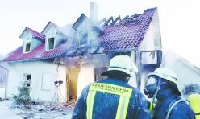 Mutter und vier Kinder starben bei Brand eines vollpolystyrolisierten EFHs in Tegernheim](http://www.welt.de/print-welt/article367052/Fuenf-Tote-bei-Brand-eines-Einfamilienhauses.html)

[Passivhäuser brennen anders](http://www.badische-zeitung.de/passivhaeuser-stellen-die-feuerwehr-vor-neue-herausforderungen--print) - Zum extremen Brandrisko im Passivhaus / Brandgefahr Passivhausbauweise

[Frankfurter Neue Presse: Debatte über Fassadenbrände](http://www.fnp.de/fnp/region/lokales/frankfurt/debatte-ueber-fassadenbr-nde_rmn01.c.9972669.de.html) - _"Frankfurter Bauaufsicht hatte die Gefahr, die durch das Polystyrol ausgehen kann, heruntergespielt ... in Frankfurt "die Fassade eines in Bau befindlichen Gebäudes über alle Geschosse unter extremer Rauchentwicklung unerwartet schnell" abgebrannt ... "Brand über die geborstenen Fenster in die Geschosse getragen..." Feuerwehrchef ... Reinhard Ries, in Frankfurt sei ... "belegt, dass dieser Dämmstoff sofort überprüft werden muss" ... bezeichnete "das weitere Verbauen" als "fraglich, um nicht zu sagen, dass es sofort gestoppt werden müsste" ... Frankfurter Feuerwehr habe ... Berichte ..., dass in den letzten Jahren fünf weitere Brandfälle ... in keiner Statistik auftauchten, da es eine solche nicht gebe."_ ... Wie mörderisch es mit Brandfällen im kunst- und dämmstoffverseuchten Einfamilienhaus ausgehen kann, finden Sie [hier](29bau10.md#brandkunst), zur teuflisch hohen Brandgasbelastung etwas [hier](2baustof.md) und hier der grausame [Abbrand des Ökobau-Passivhaus-Kindergartens St. Peter und Paul in Freiburg](http://www.badische-zeitung.de/passivhaeuser-stellen-die-feuerwehr-vor-neue-herausforderungen).

Eine weitere mörderische Wirkung der Dichtbauweise ist inzwischen durch kritische - industrieunabhängige! - Forschung und Medienrecherche herausgekommen: 

Im Brandfall schnappen die Dichtbuden wie eine Falle zu: Es baut sich ein extremer Überdruck auf, der zum Verschluß von Fenstern und Türen führt. Die Raumnutzer können dann ihre unverschlossenen Türen und Fenster minutenlang nicht mehr öffnen, da sich der Überdruck der Brandgase wie ein Gewicht gegen die Öffnungsflügel stemmt. Weitere Info hier: [Fire Protection Problems of Passive Houses](https://www.educate-sustainability.eu/kb/content/fire-protection-problems-passive-houses) und hier [Risiko Passivhaus - droht Todesgefahr bei Brand?](http://www.daserste.de/information/ratgeber-service/haus-garten/sendung/wdr/2013/sendung-vom-29092013-104.html) 

Am 22.11.1999 meldeten die Nürnberger Nachrichten eine Gottseidank nicht tödliche Dämmstoff-Brandkatstrophe an einer WDVS-Fassade an einem Wohn- und Geschäftshaus an der Äußeren Bayreuther Straße. Dort stand nach dem um 2.45 Uhr zufällig entdeckten Brand von im Hof stehenden Papiertonnen ruckzuck die gesamte wärmegedämmte Außenfassade des vierstöckigen Gebäudes in Flammen. Schnell fraß sich das gierige Feuer durch die mit Polystyrol isolierte Dämmfassade - ein sogenannter Vollwärmeschutz aus entflammbarem, jedoch unglaublicherweise für solche Einsatzbereiche amtlich (!) zugelassenem Dämmmaterial aus dem für mancherlei Geschäftsgebaren bekannten Hause der deutschen Baustoffproduzenten. Die Zeitung "Sonntag Blitz" schrieb damals: "Kurz danach [Brand der Papiertonnen] griffen die Flammen auf die mit Styropor isolierte Fassade über und breiteten sich explosionsartig nach oben aus und zerstörten die gesamte [Wärmedämm-]Verkleidung." Mit Ach und Krach konnte das Gebäude noch rechtzeitig geräumt werden, bevor die zu nachtschlafender Stunde grausam überraschten Bewohner Schaden davontrugen. Schaden am Bauwerk und der Umgebung - auch ein Auto wurde vom Brand erfaßt: ca. 145.000 Mark. Energiespareffekt? In den ungeheueren Rauchschwaden verpufft. Wirkung auf den Klimaschutz? Na hören Sie mal! 

 
Der hübsche Superbrand eines Polystyrol-WDVS aus "Schadensbilder aktuell" der Bayerischen Brandversicherung

Und dieser Link führt Sie zu den [Dämmstoffdeppen in Österreich](http://diepresse.com/home/panorama/oesterreich/715014/Fassadenbrand-an-Buerogebaeude-in-WienWieden), denen am 7. Dezember 2011 die WDVS-Fassade eines Bürogebäudes in der Paulanergasse 13 in Wien-Wieden wegen eines davorstehenden in Brand geratenen Mistkübels (hochdeutsch: Mülltonne) abfackelt und das Feuer bis zur Dachkonstruktion befördert. Wann stehen wohl ganze fassadengedämmte Straßenzüge in Flammen? Von Flensburg bis Villach wartet schon der großdeutsche Feuerteufel auf das nächste WDVS ...

### Weitere Dämmbrandberichte

[20.01.2012: Eberstadt - Wärmedämmfassade aus Polystyrol abgefackelt](http://www.echo-online.de/region/darmstadt/Waermedaemmende-Fassaden-als-Risiko;art1231,2552854) 

Hartz4-Tragödie - Kein Geld für Aschenbecher? Vorsicht vor dem Rauchen auf dem Balkon: 

[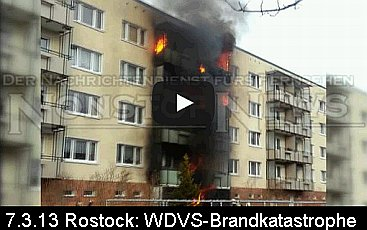 
7.03.13: Amateurmaterial von Fassadenbrand an Mehrfamilienhaus in Rostock](https://youtu.be/SS6w7UfQ7OA) 

 [Großbrand in Rostocker Plattenbausiedlung](http://www.nonstopnews.de/meldung/16610): "Feuer aus Erdgeschosswohnung breitet sich über Balkone bis ins oberste Stockwerk aus Amateurmaterial zeigt ganzes Ausmaß – Gesamte Fassade in Vollbrand – Feuerwehr musste von bis zu acht Wohnungsbränden gleichzeitig ausgehen - Ursache offenbar eine achtlos weggeworfene Zigarettenkippe" 

Und was machen unsere schönen Bauminister: Geben lauthals Entwarnung für brandriskante WDVSe! 

[Polystyrol sei "zertifiziert und sicher"](http://baufuesick.wordpress.com/2012/12/02/bauminister-konferenz-polystyrol-ist-zertifiziert-und-sicher/) ... 
[15.03.2013: Am Stadttheater Freiburg i. Br. entzündet sich die Wärmedämmung / Rohrisolierung in einem Kabelkanal/Kabelschacht der Schreinerei.](http://www.badische-zeitung.de/freiburg/brand-im-stadttheater--70083001.html) ... 
[15.03.2013: In Baierbach entzündet sich die Wärmedämmung um das überhitzte Ofenrohr eines Einfamilienhauses.](http://www.abendzeitung-muenchen.de/inhalt.baierbach-17-jaehriger-bei-brand-verletzt.8be66ea0-091f-46cc-8bd7-405b7d492800.html) 
[18.03.2013: Ein Müllbrand entzündet die Wärmedämmfassade eines Mehrfamilienhauses in Mettmann](http://www.ad-hoc-news.de/polizei-mettmann-pol-me-gelbe-muellsaecke-in-brand--/de/News/25776472) 
[02.04.2013: Dachdämmung des Flachdaches eines Wohnhaus-Neubaues in Möriken-Wildegg fängt Feuer](http://www.20min.ch/schweiz/news/story/Dach-eines-Neubaus-steht-in-Flammen-14691750) 
[05.04.2013: Dämmfassade entzündet sich "rasend schnell" durch heiße Asche im Abfall an einem Wohnhaus in Ketsch](http://www.morgenweb.de/region/schwetzinger-zeitung-hockenheimer-tageszeitung/ketsch/feuer-breitet-sich-rasend-schnell-aus-1.981531) 
[10.04.2013: Müll auf Terrasse brennt - Polystyrolfassade entzündet sich - Wohnhausbrand in Obermenzing](http://www.merkur-online.de/lokales/muenchen/west/brennende-fassadendaemmung-raffweg-2844086.html) 
[11.04.2013: Brandfalle Wärmedämmung aus Hartschaum (Polystyrol) in Klagenfurt - Österreich. Glimmende Zigarette entzündet Balkonfeuerchen in Plastikeimer, dann Dämmfassade, dann Wohnungen.](http://kaernten.orf.at/news/stories/2579555/) 
[29.04.2013: Großburgwedel: Krankenhaus muß wegen Brand der Fassadendämmung teils evakuiert werden.](http://www.haz.de/Hannover/Aus-der-Region/Burgwedel/Nachrichten/Krankenhaus-muss-wegen-Feuer-teilweise-evakuiert-werden) 
[30.04.2013: Idstein: Baustellen-Schwelbrand - Kellerdämmung und Wärmedämmung in Dehnungsfuge zwischen zwei Kellern brennen.](http://www.wiesbadener-tagblatt.de/region/untertaunus/idstein/13054731.htm) 
[03.05.2013: Ruhpolding: Leichtverletzter und Schwelbrand in Fassadendämmung und Dehnungsfuge.](http://www.berchtesgadener-anzeiger.de/home_artikel,-Ein-Verletzter-und-20 000-Euro-Schaden-bei-Brand-_arid,63155.html) 
[03.05.2013: Heinerscheid: Dachstuhlbrand nach Dacharbeiten - Dachdämmung brennt weiter.](http://www.tageblatt.lu/nachrichten/luxemburg/story/21396887) 
[04.05.2013: Bürstadt: Dachstuhlbrand - Dachdämmung verqualmt ehem. Hotel.](http://www.morgenweb.de/region/bergstrasser-anzeiger/region-bergstrasse/rauchwolken-quellen-aus-dem-dachstuhl-1.1021579) 
[05.05.2013: Großbrand in Döllstädt: Zwei Einfamilienhäuser mit Wärmedämmmfassade fackeln ab.](http://www.mdr.de/thueringen/doellstaedt106_zc-16f21569_zs-e86155ec.html) 
[05.05.2013: Kettenreaktion in München-Forstenried: Dämmfassade wird durch Mülltonnenbrand entzündet.](http://www.nachrichten-muenchen.de/?art=23215) 
[27.05.2013: Kita-Brand Sausebraus in Neuenrade: Entzündete Dämmschicht der Dachdämmung setzt Bauwerk in Brand.](http://www.come-on.de/lokales/neuenrade/loeschzug-feuerwehr-neuenrade-loescht-brand-kita-sausebraus-uhlandstrasse-2927705.html) 
[02.06.2013: Nächtlicher Fassadenbrand in Alzey: Dämmfassade und parkendes Auto werden durch Mülltonnenbrand entzündet.](http://www.allgemeine-zeitung.de/13145152.htm) 
[10.06.2013: Fassadendämmung in Düren entzündet sich nach nächtlichem Balkonbrand](http://www.presseportal.de/polizeipresse/pm/8/2489695/pol-dn-durch-balkonbrand-geweckt) 
[10.06.2013: Fassadendämmung in Düren entzündet sich nach nächtlichem Balkonbrand](http://www.presseportal.de/polizeipresse/pm/8/2489695/pol-dn-durch-balkonbrand-geweckt) 
[22. Juni 2013: Auf der Ludwigshafen-Parkinsel brennt die bisher größte Menge Styropor / Polystyrol in einem Großbrand ab, in einer Lagerhalle. Und ausgerechnet durch eine Photovoltaikanlage wurde das Styro gezündet. Energiewende brutal!](http://www.rnz.de/metropolregion/00_20130627003200_104335832_Nach_dem_Grossbrand_400_wollen_Schadensersatz.html) 
[24.07.2013: Durch Kerze auf Gartenterrasse entzündete Fassadendämmung explodiert und zerstört Doppelhaushälfte in Steinhude](http://www.neuepresse.de/Hannover/Meine-Region/Wunstorf/Nachrichten/Feuer-zerstoert-Doppelhaushaelfte) 

In _"Der Vermieter 1/2003"_ schreibt der einschlägig berühmte RA Hägele zum katastrophenfördernden WDVS-Gemängel an polystyrolisierten Fassaden (S. 77): Die brandschutztechnischen Zulassungsbedingungen für Dämmstoffdicken über 10 cm PS werden _regelmäßig_ (EnEV-Schwachverständiger, nun überprüf mal schön!) nicht erfüllt: 

**_"Der Rechtskommentar_** 
**_Zahlreiche Wohnhäuser mangelhaft_**

_... So ist zwingend vorgeschrieben, dass bei den beschriebenen WDVS "...aus Brandschutzgründen oberhalb jeder Gebäudeöffnung im Bereich der Stürze ein mindestens 200 mm breiter und mindestens 300 mm seitlich überstehender (links und rechts der Öffnung) nichtbrennbarer Mineralfaser-Lamellendämmstreifen (Baustoffklasse DIN 4201-A) vollflächig angeklebt werden muss..." ... Der richtig angebrachte Dämmstreifen verhindert nämlich nicht nur die Brandausweitung, sondern insbesondere wird ablaufende Polystyrolschmelze im Brandfalle aufgefangen bzw. umgeleitet und ein Abtropfen verhindert. Im Vordergrund steht der Personenschutz von Rettern und zu rettenden Personen. Deshalb ist diese Maßnahme uneingeschränkt - unabhängig von der Gebäudehöhe oder Gebäudeart - erforderlich und geregelt. Sie wird jedoch selten angewandt!_

_Die katastrophalen Folgen im Ernstfall sind nicht abzuschätzen! ... (Mängelbeseitigung:) Das gesamte WDVS muss zurückgebaut, entsorgt und neu aufgebracht werden. Ein brisantes Thema", weil _"nicht nur mit einem wesentlichen Mangel des Werkvertragsrechts behaftet, sondern auch bauordnungswidrig_ im Sinne der Landesbauordnungen ..."_

Wie es dem vom Dämmpfusch betroffenen Mieter / Wohnungseigentümer allseits unendlich schwer gemacht wird, seine Lieben und sich selbst vor den bedrohlichen Folgen zu retten, ist diesem tragischen Fall der Bürgerinitiative Grundrecht Wohnen zu entnehmen, die ihr letztes Heil in einer Anzeige sucht: 

 _"GRUNDRECHT WOHNEN 
Bürgerinitiative "Siedlung am Eschershauser Weg" 
Irene Wagner 
Eschershauser Weg 25 D, 14163 Berlin - Telefon 030 802 14 18 - am 15.10.2009 

Staatsanwaltschaft Berlin 
Turmstraße 91 

10559 Berlin 

GAGFAH-Siedlung "Am Eschershauser Weg" in 14163 Berlin-Zehlendorf 
Nichteinhaltung der Bauordnung Berlin im Bereich Brandschutz durch vorschriftswidrige Einbringung von Polystyrol 

Sehr geehrte Damen und Herren, 

1. Anzeige Hiermit erstatten wir Anzeige gegen Unbekannt wegen Baugefährdung und Gefahr für Leib und Leben nach § 319 StGB und aller übrigen in Frage kommende Delikte. 

2. Begründung 

2.1 Baugefährdung 

1988/89 wurden in unserer Siedlung bauliche Veränderungen vorgenommen, u.a. wurde ein Wärmedämmverbundsystem (= WDVS) aus Polystyrol installiert. Die Vorschriften des Prüfbescheides wurden nicht eingehalten, die Brandschutzbestimmungen ignoriert. Die Bauaufsicht hat das WDVS abgenommen. 

Dehnungsfugen 
Im Bereich der Dehnungsfugen (ca. 130 in der Siedlung) besteht die Gefahr des Brandüberschlages, da in diesem Bereich die mineralische Dämmung fehlt. 

Dachgeschosse 
In den Dachgeschossen fehlen feuerbeständige Brandabschnitte. Die Brandmauern sind nicht über Dach geführt. Auf der obersten Geschoßdecke liegt als erhebliche Brandlast Polystyrol. 

Dachüberstände 
Der Brandschutz an den Dachüberständen fehlt. Bei einem Polystyrol-Fassadenbrand erreicht das Feuer die Dachkästen und damit die Dächer + Dachböden. 

Fenster 
Über den Fensterstürzen fehlen die Flammensperren aus nichtbrennbaren Materialien (Steinwolle) 

Kellerdeckendämmung von unten aus brennbaren Stoffen, Polystyrol, nicht zulässig (erhebliche Brandlast) 

Müllhäuser unmittelbar an den Brandwandgiebeln - unzulässig, erhebliche Brandgefahr durch Brandüberschlag 

Wir verweisen insbesondere auf die ausführliche Brandschutzmängelliste, Anlage 12, im Schreiben vom 18.11.2008 an die Bauaufsicht Zehlendorf, das wir parallel an die Oberste Bauaufsicht gerichtet hatten. 

2.2 Gefahr für Leib + Leben 

Mögliche Folgen des mangelhaften Brandschutzes: Keine Rettung von Außen - keine Rettung von Innen! 

Bei einem Zimmerbrand, der durch die Fenster nach außen greift, wird die Polystyrol-Fassade gezündet - siehe Treskowstraße 33 -, da das Polystyrol hier direkt bis an die Holzfenster geführt ist. Eine vorgeschriebene Brandsperre ist nicht erkennbar. Der zweite Rettungsweg - Anleitern - ist bei einem Polystyrol-Fassadenbrand (1.000 Grad/1000° Celsius) nicht möglich. Da das Feuer durch die anderen Fenster blitzschnell im Haus ist, ist auch der erste Rettungsweg - das Treppenhaus - keine Rettungsmöglichkeit, da die Treppenhäuser hier mit brennbaren Materialien (Holztreppen etc., keine Rauchabzugsmöglichkeit) ausgestattet sind. Die Bewohner im 1. + 2. OG würden ersticken oder verbrennen, sofern sie nicht durch das Feuer aus dem Fenster springen. Die Häuser der Siedlung sind nur 10 m breit, so dass - bei Containerbrand an der Giebelseite eines Hauses - das Feuer um das Haus herumgreifen würde, es also keine feuerfreie Hausseite geben würde. 

Bei einem Fassadenbrand durch Müllcontainerbrand(stiftung) gilt das gleiche. Hier kommt das Feuer von außen in das Haus, ein für die Feuerwehr neues Phänomen. Wer sich nicht retten kann, stirbt. Wer aus dem Fenster springt, wird möglicherweise schwer verletzt. Über die Holzpergola wird das Feuer zum nächsten Gebäude geleitet, siehe Foto Anlage 17. 

Bei einem Brandausbruch im Keller (Heimwerker/ Raucher), würden alle Menschen, die sich zu diesem Zeitpunkt im Haus aufhalten, sterben, da die Gasrohre, die an der Kellerdecke verlaufen, binnen weniger Minuten explodieren würden und damit das ganze Gebäude. Die Feuerwehr wollte uns nicht sagen, ob die Explosion sich von Gebäude zu Gebäude fortsetzt, da alle Gebäude durch Gasrohre miteinander verbunden sind. 

Die Stahlträger, die an der Kellerdecke montiert sind, würden in 5 Minuten Spagetti sein (Auskunft Firma PROMAT) und ihre Trägerfunktion verlieren. Es würde zum Einsturz der abgestützten Gebäudeteile kommen. 

Wie Sie auf den Fotos sehen können, wurde hier Polystyrol ohne vorgeschriebenen Brandschutzmörtel verwendet. Die Gasrohre und die Stahlträger sind nicht abgekoffert. Ebenso wenig die neu verlegten Fernwärmerohre (Rauchübertrag). 

Bei einem Zimmerbrand im obersten Stockwerk, wenn das Feuer die Zimmerdecke durchschlägt (Holzbalkendecke mit dünner Putzschicht unter dem Stroh), zündet das auf der Geschossdecke liegende Polystyrol. Es kommt damit auch zu einem Dachstuhlbrand, der hochgiftige Dioxine (Stichwort Seveso) mitten in Berlin-Zehlendorf freisetzt, da die Dachböden 1989 mit LINDAN behandelt worden sind, Anlage 22 Befund B.A.U.CH. Dieser Gifteintrag ist nur durch Erneuerung der Dachkonstruktion vollständig zu entfernen. 

Waldbrandgefahr 
Da diese Gebäude in einer Waldsiedlung stehen, besteht bei Brand auch immer Waldbrandgefahr, siehe Anlage 1. 

3. Versuche Abhilfe zu schaffen 
Seit 2 Jahren bemühen wir uns vergeblich die für unsere Wohnsiedlung - 758 Wohnungen - Verantwortlichen zu veranlassen, die nach der Bauordnung Berlin zu erkennenden Brandschutz-Mängel zu beheben. Die Bauaufsicht hat der GAGFAH bis heute keine Auflage erteilt, das in dieser Form verbotene Polystyrol zu entfernen. Die Untätigkeit der Verantwortlichen zwingt uns in unserer Not Anzeige zu erstatten. Siehe Schreiben an die Eigentümerin, Anlage 11, Schreiben an die Oberste Bauaufsicht, Anlage 12 + 13, Schreiben an die Bauaufsicht Zehlendorf, Anlage 12 + 14. 

Die Feuerwehr, Abt. Vorbeugender Brandschutz, hat es mehrfach abgelehnt, uns für den Brandfall zu beraten. Anfragen vom 14.10.08, 19.10.08 und 30.10.08, Anlage 15, anbei. 

Bei einem Fassadenbrand kann man sich nicht an das Fenster stellen und auf Hilfe warten - man verbrennt! 

Falls eine Bürgerinitiative eine Nicht-Person im juristischen Sinne ist, erstattet die Unterzeichnende Frau Wagner diese Anzeige gegen Unbekannt. 

4. ANLAGEN 

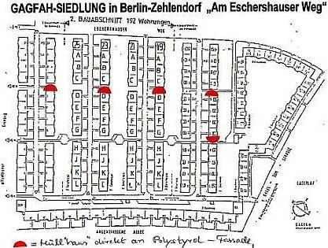 
01. Überblick Wald-Siedlung: Bauzeichnung + Blick auf die Siedlung von oben, 2 Blatt. Die roten Halbkreise markieren Müll"häuser" mit Containern direkt an der Polystyrol-Fassade. 
02. INFO WDVS muss zulassungskonform sein 
03. Bauplanung, Auszug Zitat: Außenwanddämmung Dämmdicke 6 mm, Dämmung auf oberster Geschossdecke mit 8 cm dickem Hartschaum und zusätzlicher Spannplattenbeplankung, Dämmung der Kellerdecke mit 4 cm dicken Hartschaumplatten 
04. Baubeschreibung zum Bauantrag vom 08.07.1081, Bauakte Blatt 37, geprüft und genehmigt von der Bauaufsicht Zehlendorf - Kunststoffputz mit Schichtdicke 3 mm 
05. Prüfbescheid PA-III 2.595 
06. Agrement - Verlängerung Nr. 176b/86 
07. INFO zum Hersteller des Wärmeverbundsystems und zum Prüfbescheid 
08. Firmenliste der damals beteiligten Firmen. Möglicherweise hat die Firma ..., das Wärmedämmverbundsystem aufgebracht. Der Bauaufsicht ist die ausführende Firma bekannt, siehe 
09. Schreiben der Bauaufsicht vom 23.06.08. 
10. PROMAT Wir überreichen eine Zeichnung der Firma PROMAT. Diese Zeichnung zeigt, wie der Brandschutz-Absicherung des Daches gegen einen Polystyrol-Fassadenbrand herzustellen ist. 
11. Aufforderung zur Mängelbehebung an die Eigentümerin vom 21.10.08 
12. Schreiben an die Oberste Bauaufsicht + die Bauaufsicht Zehlendorf vom 18.11.08 
13. Schreiben an die Oberste Bauaufsicht vom 28.07.09 
14. Schreiben an die Bauaufsicht Berlin-Zehlendorf vom 08.09.09 
15. Schreiben an die Feuerwehr Berlin, Vorbeugender Brandschutz 14., 19. + 30.10.08 
16. Mit Schreiben vom 05.10.2009 teilt die Bauaufsicht Zehlendorf mit, daß am 25.02.09 eine Begehung der Wohnanlage stattgefunden hat. Der Eigentümerin wurde keine Auflage erteilt, das "offene" Polystyrol zu entfernen und den Brandschutz sicher zu stellen. Der Baustoff Polystyrol, der in dieser Form von der Bauordnung nicht zugelassen ist, befindet sich nach wie vor an den Kellerdecken und auf den Dachböden. 

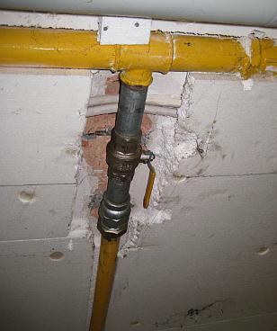 
17. BILD Kellerdecke: ungesichertes Polystyrol + nicht abgekofferte Gasleitung 

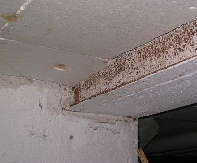 
18. BILD Kellerdecke + nicht abgekofferter Stahlträger 
19. BILD von unten fotografiert, eine Dehnungsfuge, Gebäude Esch 25 I-K. Das Polystyrol ist bis an die Dehnungsfuge herangeführt, keine mineralische Dämmung wie vorgeschrieben, Brandabschnitte dadurch aufgehoben, Brandüberschlag möglich. 

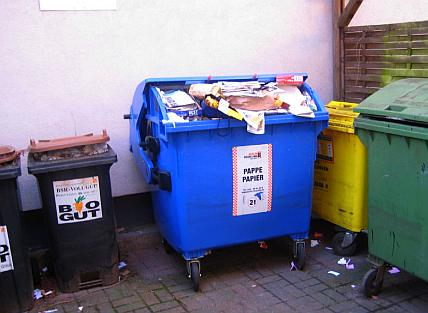 
20. BILD Papiercontainer direkt an der Polystyrol-Fassade, wie in einem Teil der anderen Müll"häuser" auch 

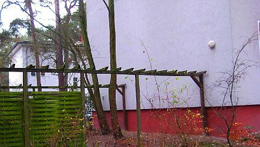 
21. BILD Holzpergola, die im Bereich der Müllplätze zwei Gebäude verbindet 
22. BILD Holzbalkenkonstruktion der Dachböden, in denen laut Bauplanung 8 cm dickes Polystyrol verlegt wurde, das lediglich mit einer Spanplattenbeplankung abgedeckt wurde 
23. Lindan-Befund B.A.U.CH 
24. DOKU Auszug aus der Deutschen Feuerwehr-Zeitung 6/2005 zum Polystyrol-Fassadenbrand in der Treskowstraße 33 in Pankow-Heinersdorf am 21.04.2005, hierzu auch dieser Archivlink auf die Dokumentation und den Feuerwehrbericht der Berliner Feuerwehr: [WDVS-Brandkatastrophe - Menschenrettung in Pankow](http://web.archive.org/web/20050529031046/http://www.berliner-feuerwehr.de/1022.html): Brand in vier Wohnungen in den Etagen 2 bis 5 eines 6-geschossigen Wohngebäudes in ganzer Ausdehnung, sowie die Wärmedämmvebrundsystem-WDVS-Vollwärmeschutz-Dämmfassade vor den genannten Wohnungen 
25. DOKU Fassadenbrand durch Müllcontainerbrand 
26. DOKU Verdämmt in alle Ewigkeit? Fassadenbrandbilder 
27. Feuerwehr Berlin-Zehlendorf Mitte, personelle Stärke am Tag und in der Nacht 
28. Informationen zu Polystyrolbränden + Brandbilder im Internet unter 
XII. Baurecht & Brandschutz Symposium, Frankfurt am Main 10.04.08 [brandschutz.bureauveritas.de/symposium/archiv2008/INT/TB22.PDF](http://brandschutz.bureauveritas.de/symposium/archiv2008/INT/TB22.PDF) 8,84MB bitte etwas Geduld - wichtige Unterlagen 
Flughafenbrand Düsseldorf : [www.wdr.de/themen/panorama/brand02/duesseldorf_flughafenbrand/infobox/print.php](http://www.wdr.de/themen/panorama/brand02/duesseldorf_flughafenbrand/infobox/print.php) 
Fassadenvollbrand Treskowstraße 33: [www.kohlhammer.de/brandschutz-zeitschrift.de/artikel/artikel_weiterleiten.cfm?id=3475](http://www.kohlhammer.de/brandschutz-zeitschrift.de/artikel/artikel_weiterleiten.cfm?id=3475) 
[www.dimagb.de/info/baualt/ahwd01.html](http://www.dimagb.de/info/baualt/ahwd01.html) (Suchwort: Heinersdorf / mit strg+f) 
Tunnelbrand Kaprun: [clausmeier.tripod.com/enev5.htm](http://clausmeier.tripod.com/enev5.htm) (Suchwort: Kaprun) 

Mit freundlichen Grüßen 
Im Auftrag 

Irene Wagner 
GRUNDRECHT WOHNEN 
Eschershauser Weg 25 D 
Telefon 802 14 18 
14163 Berlin 
grundrechtwohnen@gmx.net"_

TIPP für vorsichtige Bauherren: Vor Ablauf der WDVS-Gewährleistungsfrist eine Endabnahme mit Sachverständigem, gleich mit qualifizierter Brandschutzdetail- und Feuchtemessung (Einstecksonde genügt, bitte vorher Beruhigungsmittel einnehmen!) und Schallmessung der kritischen Stellen der Fassaden- und Dachdämmung. Damit haben Sie den ersten Schritt zur Reklamation gleich richtig getan. 

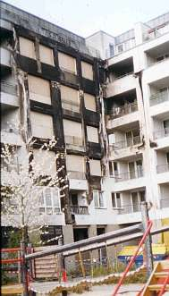Fall Treskowstraße 33 aus Berlin-Pankow (aus [www.dimagb.de](http://www.dimagb.de), Bild: Böschen):

Am 21.04.2005 kam es in Berlin Heinersdorf in der Treskowstraße 33 zu einem gewaltigen Brand, bei dem zwei Todesopfer zu beklagen waren. Die Zeitungen berichteten über eine Flammenhölle. Gebrannt hat eine Styropor-gedämmte WDV-Fassade. Bei solchen WDVS handelt es sich um geprüfte und zugelassene Systeme, das heißt sie besitzen eine Prüfung und Einordnung nach DIN 4102 als B1 (schwer entflammbar) sowie eine bauaufsichtliche Zulassung vom DIBt. Sicherheit wird in Deutschland groß geschrieben. Bauaufsichtliche Zulassungen werden erteilt, um gemäß dem Bauproduktengesetz nur Bauprodukte zur Anwendung zu bringen, die keine Gefahren für Leib und Leben herbeiführen und die zudem nicht die Bausubstanz beeinträchtigen. Brandschutztechnische Belange sind zudem in der Bauordnung geregelt. ...[diesen spannenden Skandalfall weiterlesen](http://www.dimagb.de/info/bauneu/brands01.html)

[Die unglaublichen Abbrand-Bilder der Berliner Feuerwehr](http://web.archive.org/web/20050529031046/http://www.berliner-feuerwehr.de/1022.html)

[Welt online: Nach Flammeninferno in der Treskowstraße 33, Berlin-Pankow suchen Mieter nach Eigentum](http://www.welt.de/print-welt/article666979/Nach_Inferno_suchen_Mieter_nach_Eigentum.html)

[Berliner Morgenpost: Flammenhölle: Zwei Tote nach Brand in Pankow](http://www.morgenpost.de/printarchiv/titelseite/article310424/Zwei_Tote_bei_Brand_in_Pankow.html)

[Wahnsinn Wärmedämmung - Berliner Morgenpost: WDVS-Fassade: Zwei Brandopfer des Dämmwahns](http://www.berlin-weissensee.de/weissensee/einzelmeldung.php?pid=116)

WICHTIG FÜR AUFTRAGGEBER: Lassen Sie sich die versprochenen Energieeinsparungen, Bauordnungsqualitäten und Schalldämmwerte schriftlich geben! In einem Vertrag, der Schadensersatzregelungen bei Nichterfüllung beinhaltet, was bei den vorprogrammierten Mieteinbehalten und Rentenzahlungen für verreckte Brandopfer wenigstens den wirtschaftlichen Schaden mindert. Die Erfahrung mit den Dämmstoffvertretern in der Energiesparfrage zeigt folgende Reaktion auf dieses Ansinnen: 

Erst verspricht man grundsätzlich tolle Energieeinsparung. Nach Einforderung der Vertragszusage wird eingestanden, daß Dämmung wirtschaftlicher Blödsinn ist. 

Das selbe machen Sie sinngemäß mit dem Lieferanten Ihres Niedertemperaturkessels bezüglich Kesselkorrosion infolge Innenkondensat. 

Und mit Ihrem Lieferanten der Fassadenbeschichtungen bezüglich Austrocknungsgarantie der von innen und außen einkondensierenden flüssigen Feuchte. Da hilft nämlich keine Hydrophobie oder Dampfdiffusionsfähigkeit. 

Und dann lesen Sie Ihnen diesen Bericht vor: Spiegel online - Enthüllungsjournalist Güven Purtul entlarvt EnEV-Anschlag auf Hab&Gut, Leib&Leben: 
["Styropor-Platten in Fassaden: Wärmedämmung kann Hausbrände verschlimmern"](http://www.spiegel.de/wissenschaft/technik/0,1518,800017,00.html) 
Wissenschaftsjournalist Güven Purtul in seinem Blog zu ["Wahnsinn Wärmedämmung"](http://purtul.de/?p=128): Vergiftete und brandgefährlich Dämmsysteme gefährden Natur, Mensch und Umwelt 

Kraß auch diese Berichte zur WDVS-Brandkatastrophe in Delmenhorst, damals am 11. Juni 2011: ["WDVS-Hölle in Delmenhorst: Mehrfamilienhäuser mit Dämmfassade in Windeseile abgefackelt"](http://www.nwzonline.de/Region/Artikel/2624645/Großbrand-in-Delmenhorst-Mehrfamilienhäuser-standen-in-Flammen.html) 
[DIE WELT -Fotostrecke zum Dämminferno Delmenhorst - Fünf Gebäude mit Dämmfassade in Flammen - Spektakulär](http://www.welt.de/vermischtes/weltgeschehen/article13427149/Fuenf-Haeuser-stehen-in-Delmenhorst-in-Flammen.html) 
[Kölner Stadtanzeiger: Brennende Müllcontainer setzen Fassadenmüll WDVS in Flammen - alles niedergebrannt und ausgebrannt](http://www.ksta.de/html/artikel/1307702848971.shtml) 
[BILD: In Delmenhorst - Flammen-Inferno zerstört 50 Wohnungen](http://www.bild.de/news/inland/delmenhorst/grossbrand-5-haeuser-18331512.bild.html) 
[Rettungsdienst: Wärmegedämmtes Mehrfamilienhäusern in Brand – 209 Bewohner evakuiert](http://www.rettungsdienst.de/nachrichten/mehrfamilienhausern-in-brand-–-209-bewohner-evakuiert-23466) 

Doch das muß ja nicht nur Delmenhorst sein, wo es WDVS-mäßig raucht und zischt, brennt und fackelt, feuert und schmaucht, tropft und explodiert: 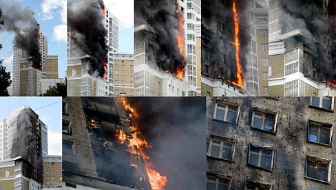Spektakuläre WDVS-Katastrophe in Rußland (aus [www.englishrussia.com](http://englishrussia.com/2009/08/07/new-technology-of-construction/) - mit großauflösenden Brand-Fotos. 

Damit man sich mal richtig vorstellen kann, was alles auf einen zukommen kann, wenn man verdämmt ist. Und dann stellen wir uns mal einfach vor, das ist das Büro, wo unser Schatz drin arbeitet, oder die Schule, wo unser herzliebstes Einzelkindlein drin zum Unterricht geht und dann stehen ein paar böse Jungs an der Fassade und rauchen und stecken ihr Zigarettlein in die mit Fingernäglein ausgehöhlte Dämmfassade und das Zigarettlein glüht sich im Dämmlöchlein einen ab oder ein Müllkübel wird von den lieben Halbwüchsigen oder Migrationshintergründlern angezündelt und dann explodiert die Fassade wie auf diesem Bild vom Hochhaus-Katastrophenbrand und dann will es bestimmt wieder keiner gewesen sein, der die Bude hat dämmen lassen, na ja, ok, die EnEV halt ...

Kürzlich in Frankfurt hat man auch wieder mal die halbe Stadt abriegeln müssen, weil ein gerade im Bau befindliches Dämmfassädlein abgefackelt ist - nein, es war nicht der Wiedergänger vom verstorbenen Straßenkämpfer Joschka. Gönnen Sie sich einfach mal den Artikel [Am 29. Mai 2012 brennt an der Adickesallee ein leerstehendes Gebäude: Tödliche Gefahr an der Wand?](http://www.fnp.de/fnp/region/lokales/frankfurt/toedliche-gefahr-an-der-wand_rmn01.c.9884706.de.html) und glotzen dann mal den Brandfilm, um zu wissen, was dann nach dem nächsten alliierten Fliegerbombenangriff (weil wir wieder mal so widerborstig gegen die Alliierten sind, ja, genau!) auf unser Land geschieht: [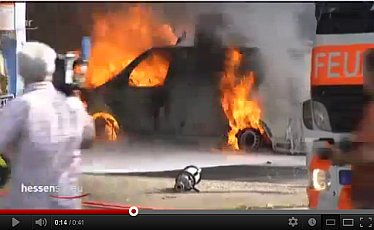 
HR Hessenschau: 29.05.2012: WDVS-Katastrophe in Frankfurt - Dämm-Material als Brandbeschleuniger](https://youtu.be/TjZDgLe03aA) 

Wie heißt es da bei der Frankfurter Neuen Presse so schön (Auszug)? _"Frankfurts Feuerwehrchef Reinhard Ries schlägt Alarm – Styropor-Dämmungen sind zu schnell entflammbar - Rund achtzig Prozent aller Neubauten werden mit Polystyrol gedämmt. Landläufig ist das Material besser unter dem Namen Styropor bekannt. Doch jetzt schlägt der oberste Frankfurter Feuerwehrmann Alarm: Diese Praxis müsse dringend überdacht werden, sagt er. Zu groß sei die Gefahr bei Bränden. ... Innerhalb ... Minuten ... Styroporfassade ... in Brand ... Flammen loderten so stark, dass die Miquelallee komplett gesperrt werden musste ... "unendlich viel Glück ..., dass keine Bauarbeiter auf dem Gerüst ... und die Apartments noch nicht bewohnt ...", sagte Reinhard Ries zur FNP. ... Flammen ... so heiß ..., dass sogar der Beton der Tragekonstruktionen abplatzte. ... Gebäude ..., wenn ... bewohnt ..., "nicht mehr zu halten ..., da die Temperaturen mit der Möblierung noch viel höher gewesen wären", so der Frankfurter Feuerwehr-Fachmann. ... Polystyrol ... nicht ... feuerfest, ... lediglich ... schwer entflammbar. Ist die Hitze groß genug, fängt es Feuer. "Dann wirkt Styropor wie Brandbeschleuniger, treibt die Flammen in alle Richtungen, lässt Fensterscheiben platzen und das Feuer in weitere Wohnungen laufen" ... Der Brand der mit Polystyrol gedämmten Fassade in der Adickesallee ... in Frankfurt nicht der erste, ... [21.03.] 2010 ... in Sachsenhausen ...[siebenstöckiges Wohn- und Geschäftshaus](http://www.op-online.de/nachrichten/frankfurt-rhein-main/brand-wohnhaus-sachsenhausen-683079.html) ... Brand. ... Fassade ... mit Styropor gedämmt Bilanz ...: Sachschaden ... rund 500 000 Euro, 21 verletzte Bewohner. ... zweite Brand ... Anfang November [[07.11.2011] ... Battonstraße [50]](http://www.feuerwehr-frankfurt.de/presse/einsakt/111107_163/e1111163.html) ... (Brandentzündung) im Zweifelsfall eine Zigarettenkippe ..., die ... auf ... Polystyrol-Platten geworfen ... binnen kürzester Zeit ein Feuer auszulösen vermag. ..."_ 

Aha. Das vergleichen Sie mal mit den obigen Abwehrschriften der Dämmfans. 

Am 25.06.2012 dann die Spiegel-Reaktion auf die Frankfurter WDVS-Brandkatastrophe und den in Verdacht geratenen Dämmstoff Phenolharzschaum, aus dem Hartschaumplatten/Hartschaum-Dämmplatten hergestellt werden: ["Glutheiße Seen - Bundesregierung und Bauherren sind Anhänger der Fassadendämmung. Doch einige der verarbeiteten Materialien sind offenbar brandgefährlich und gesundheitsschädlich."](http://www.spiegel.de/spiegel/print/d-86570533.html) 

Au, das tut so weh, so weh. Schon am nächsten Tag schlägt der Industrieverband Hartschaum IVH zurück. Seine [Pressemitteilung vom 26.06.2012](http://www.ivh.de/Undifferenzierte_Darstellung_des_Brandrisikos_von_Styropor_I1419.whtml?lcr=ru) gipfelt in folgenden "Aussagen" [Fettung KF]: 

_"Richtig ist, dass – wie**in Frankfurt** – ein erhöhtes Brandrisiko bei Baustellen besteht, auf denen der **Dämmstoff bereits angebracht, aber noch nicht verputzt** ist. Für dieses Szenario sieht sich der IVH in der Pflicht, dem verarbeitenden Handwerk und den Bauherren praxistaugliche Lösungen anzubieten. "Wir entwickeln beispielsweise die bestehenden Brandriegelsysteme permanent weiter. Auch raten wir grundsätzlich zum zeitnahen Verputzen der aufgebrachten Dämmplatten", erklärt Dr. Hartmut Schönell, geschäftsführender Vorstand des IVH. 

Denn im verputzten Zustand ist Styropor brandschutztechnisch sehr oft geprüft und wegen seiner Schwerentflammbarkeit (B1) seit mehr als vier Jahrzehnten von namhaften Prüfinstituten als sicher eingestuft und bauaufsichtlich zugelassen worden. Dies ist in Normen und Zulassungen auf europäischer Ebene festgeschrieben und in der Praxis belegt: Mehr als 800 Millionen Quadratmeter gedämmte Fassaden allein in Deutschland sprechen für sich. ... Vor dem Hintergrund der Energiewende und der angestrebten Klimaziele ist Wärmedämmung alternativlos. Sie ist, wie der Spiegel vollkommen zu Recht schreibt, politisch gewollt, ökologisch korrekt, wirtschaftlich vernünftig". (Der Spiegel 26/2012, S. 44)"_ 

Doch was schreibt _"die Panorama Redaktion"_ , die die Frankfurter Brandkatastrophe in dem oben zitierten Panorama-Beitrag vom 5. Juli 2012 näher untersuchte, zum Thema zeitnahes "Verputzen der aufgebrachten Dämmplatten" auf die Übernahme der IVH-Ente durch einen dämmwütigen Malermeister? Lesen Sie diesen [spannenden Forumsbeitrag hier](http://www.ndr.de/apps/php/forum/showthread.php?t=67514&page=2), ich zitiere das Wesentliche: 

_"die von dem Brand hauptsächlich betroffene Fassade war sehr wohl fertig gestellt. Es handelt sich um die Seite, vor der die Pkw in Brand gerieten. Dort war die Dämmung der kompletten Fassade bereits verkleidet, sprich: Die Armierungsschicht war in den Putz eingebettet. Dennoch wütete das Feuer dort ungehemmt über die Brandriegel hinweg, wie aus den Bildern eindeutig hervorgeht. 

Bei dem Versuch [KF: anlässlich der Recherche für den NDR-Beitrag "Wahnsinn Wärmedämmung"] in der Materialprüfungsanstalt [KF: Braunschweig] war der untere Bereich, entgegen Ihrer Behauptung, sehr wohl verkleidet, also verputzt. So wie es üblich ist. Wir haben damals ein zugelassenes System von einem Malerfachbetrieb installieren lassen und haben dabei übrigens bewusst ein teures Angebot ausgewählt."_ 

Ob damit der schauderhaften Lügenpropaganda unserer so sehr um den politischen Willen, die ökologische Korrektheit und die wirtschaftliche Vernunft besorgten Dämmprofis nach englisch-amerikanisch-zionistischem Strickmuster beizukommen ist? Urteilen Sie gefälligst selbst! Ich möchte mich nicht immer weiter mit den Beschwerden der Berufsverbände irgendwelcher Fassadenverschandler herumschlagen müssen. 

Der NDR hat übrigens zu den angesprochenen Themen am 21.09.2011 recht präzise in ["Wärmedämmung: Die Mär von der CO2-Einsparung"](http://web.archive.org/web/20140330093332/http://www.ndr.de/ratgeber/verbraucher/haushalt_wohnen/waermedaemmung111.html) Stellung genommen, lesen Sie selbst, ich zitiere: 

_"... Die jetzt verbauten 30 Zentimeter seien [nach Axel Rahn] Ausdruck einer "unreflektierten Wärmedämmhysterie", denn sie lohnten sich nicht - weder finanziell noch ökologisch. ... 

Dann kam im Herbst 2014 das große Erwachen. Reinhold Ries, Chef der Frankfurter Feuerwehr hat nicht locker gelassen und die Bauministerkonferenz gezwungen, neue unabhängige Brandversuche mit dem WDVS durchzuführen. Diesmal auch mit der typischen Entzündung von außen via Brandstiftung, brennender Asche im fassadennahen Müllkübel usw. Und siehe da: In Windeseile fackelten die ach so sicher schwer entflammbaren Wärmedämmfassaden ab, lange bevor auch die beste Feuerwehr der Welt am Brandort hätte sein können. Alles nicht so schlimm, sagen die Experten, das Deutsche Institut für Bautechnik DIBt (die hierzulande maßgebliche Zulassungsstelle für Baustoffe) und die Bauministerkonferenz. Neue Gebäude bekommen jetzt unten rum einen zusätzlichen Brandriegel, bei den millionenfach zugedämmten Altfassaden soll nach Meinung der hochwohllöblichen Experten das Todesrisiko der verdämmten Altbaubewohner wegen "Bestandsschutz" in Kauf genommen werden. Unverschämte Sauerei, findet sinngemäß Reinhold Ries und jeder anständige Mensch. Lesen Sie sein Interview ["Dämmfassaden können wie Fackeln brennen"](http://www.fnp.de/lokales/frankfurt/Fassaden-koennen-wie-Fackeln-brennen;art675,1147605) dazu - wieder in der hervorragend kritischen Frankfurter Neuen Presse. Und wie sieht es denn mit der Wirtschaftlichkeit der Dämmungen aus? Also der Amortisation der Energiesparinvestition in etwa 10 Jahren (zulässige Amortisationsfrist lt. einheitlicher Rechtssprechung bis BGH). Und wenn der Bauherr nur deswegen seine Fassade gedämmt hat, weil ihn sein Planer über die behördliche Dämmpflicht getäuscht hat und ihm nicht verraten hat, daß die EnEV eine Befreiung von der Dämmpflicht vorsieht und die Baubehörden im Fall der Unwirtschaftlichkeit zur Befreiung verpflichtet sind? Lesen Sie hier, was der Bundesgerichtshof 2014 entschieden hat, als so eine Täuschung des Planers den Bauherrn zum gar nicht von ihm gewollten Bauen trieb: [Toskana-Fiasko](http://dabonline.de/2014/11/28/toskana-fiasko-baugenehmigung-falsche-auskunft-hausbau-recht/): Wer dem Bauherrn falsche Auskünfte zur Genehmigungsfähigkeit eines Hauses gibt, haftet für die daraus folgenden Schäden – bis hin zum Abriss 

Der Einfluss der Lobbyisten [auf den politischen Willen] 

Hinter vorgehaltener Hand kritisieren viele Branchenkenner den Einfluss von Lobbyisten: Die Vorgaben der Energie-Einsparverordnung werden am Deutschen Institut für Normung geschrieben. Der zuständige Bauausschuss ist personell eng verwoben mit der Industrie. So arbeitet der Fachbereichsleiter gleichzeitig für einen Dämmstoffhersteller; der Verantwortliche für Wärmedämmstoffe ist Leiter des Forschungsinstituts für Wärmeschutz (FIW), einem Lobby-Verein der Dämmstoffindustrie. Und die "Beiräte" der Dämmstoffproduzenten sind gespickt mit Bundestagsabgeordneten - selbstverständlich fraktionsübergreifend. Damit die Gesetzgebungsverfahren zugunsten der Lobbyisten wie am Schnürchen und bestens geschmiert laufen? Fragen über Frage. Schöne Details dazu auf [Bananrepublik](http://bundestagswahl-2017.nl/die-plutokratie/die-bananenrepublik/index.html) und in [Lobbycontrol](https://www.lobbycontrol.de/2014/03/lobbyisten-im-bundestag-fragwuerdige-doppelrollen/) und dann sogar mal in der Wirtschaftswoche: ["Dämm-Lobbyisten sollen Klimaschutzziele retten"](http://www.wiwo.de/politik/deutschland/energieeffizienz-daemm-lobbyisten-sollen-klimaschutzziele-retten/11022840.html) 

Beim FIW sitzt wiederum Wolfgang Setzler im Vorstand, er ist gleichzeitig Geschäftsführer des Fachverbandes Wärmedämm-Verbundsysteme und hält diese Verknüpfung für unproblematisch. Die Arbeit für das FIW sei ehrenamtlich, ohne Menschen wie ihn, die dieses Amt ohne Bezahlung führen, gäbe es gar keinen Vorstand. Im Übrigen könne "ein gewisser Lobbyismus" in keiner Richtung ausgeschlossen werden: "Es ist so, dass überall dort, wo Menschen sind, deshalb sagt man das, menschelt es." Das "Menscheln" zwischen Politik und Industrie ist der Bundeskanzlerin offenbar ganz recht: Die Förderprogramme für die energetische Sanierung verkauft Angela Merkel als großen Erfolg, auch für die Wirtschaft. 

Konjunkturmaßnahme statt [ökologisch korrekter] Umweltschutzmaßnahme? 

Der Bauphysiker und Energie-Berater Frank Essmann, der ebenfalls an der Energie-Einsparverordnung mitarbeitet, hält das Sanierungsprogramm deshalb auch eher für ein Konjunkturpaket als für eine Umweltschutzmaßnahme. Es sei wie bei der Abwrackprämie: "Letztlich geht es auch hier ganz klar um wirtschaftliche Interessen und nicht nur um die CO2-Einsparung. Denn wenn man wirklich mal die Gesamtbilanz aufstellt, ist sie häufig nicht so positiv, wie sie immer dargestellt wird." Ihre Klimaziele werde die Bundesregierung so allerdings nicht erreichen."_ 

## Wärmegedämmte Hochhäuser fackeln brutal ab - Eine Serie der jüngeren Fälle

Am 09.04.2009 fackelt die [Fassadendämmung im Television Cultural Centre in Beijing](http://www.nytimes.com/2009/02/10/world/asia/10beijing.html?_r=0) ab. 

Am 15.11.2010 fackelt die [Fassadendämmung in einem Wohnturm (Apartment Building) in Shanghai](http://www.nytimes.com/2010/11/16/world/asia/16shanghai.html) ab. 

Am 08.11.2011 fackelt die [Fassadendämmung in einem Tower am Al Nahda Oark in Sharja VAE](http://www.fwmails.com/2011/11/fire-near-sharjah-al-nahda-park-8th.html?m=0) ab. 

Am 18.01.2012 fackelt die [Fassadendämmung im Al Baker Tower in Sharjah, Vereinigte Arabische Emirate](http://gulfnews.com/news/uae/emergencies/tossed-lighted-cigarette-caused-fire-in-al-baker-tower-1.1012778), ab. 

Am 2.04.2012 brennt die [Fassadendämmung im Bashnya Federatsiya (Föderationsturm) in Moskau](https://www.rt.com/news/moscow-tower-catches-fire-068/). 

Am 28.04.2012 fackelt die [Fassadendämmung im Al Tayer Tower in Sharjah](http://www.constructionweekonline.com/article-16690-video-fire-consumes-sharjah-al-tayer-tower/) ab. 

[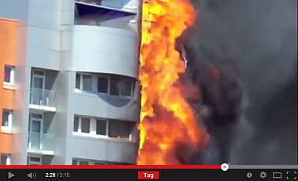 
Und was ist das? Roubaix (Frankreich) am 14.05.2012: 1 Toter und 10 schwerverletzte bei WDVS-Brandkatstrophe am Mermoz-Wohnturm](https://youtu.be/j4mIBQnUAfQ) 

[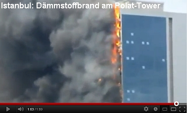 
Istanbul 17.07.2012: Dämmstoffbrand am Polat Tower](https://youtu.be/tcuz4xNcbw4)

Und dann am 17. Juli 2012 in Istanbul: [Hochhausfassade abgefackelt](http://www.fr-online.de/panorama/hochhaus-brand-in-istanbul-feuerwehr-verhindert-katastrophe,1472782,16643866.html): _"Der Istanbuler Gouverneur Hüseyin Avni Mutlu sagte, eine Störung in der Klimaanlage habe offenbar einen Funkenflug ausgelöst, der Teile der Gebäude-Isolation (des Polat-Towers) in Brand gesetzt habe. ... Brennende Fassadenteile fielen von dem Hochhaus herab und erschwerten die Arbeit der Feuerwehr."_ 

[Feuer in Istanbuler Hochhaus](http://derstandard.at/1342139280492/Feuer-in-Istanbuler-Hochhaus): _"Nach ersten Erkenntnissen der Behörden könnte eine Panne in einer Klimaanlage einen Funkenflug ausgelöst und Isoliermaterial an der Außenwand des Gebäudes in Brand gesetzt haben."_ - Nur intelligente Brandschutzssysteme wie Überdruckanlagen und Sprinkler UND eine wahnsinnig tolle Feuerwehr (die lebensgefährlichen Attacken der herabexplodierenden Dämmstofffackeln ausgesetzt war) haben den Massenmord durch brennbare Dämmstoffplatten verhindert. Doch vielleicht nicht immer wird Allah seine schützende Hand so gut einsetzen ... Inschallah! 

Daß wieder einmal Polystyrol / Polystyrene / Styropor / Styrofoam / Polyfoam der irre Brennstoff der Gebäudeabfackelung war, der den 140 Meter hohen Wolkenkratzer (Skyscraper) Polat Tower in Windeseile - nur drei Minuten! - abgefackelt hat, geht aus dieser Detailmeldung der Türkischen Presse hervor: [''1998' de isiya dayanikli malzeme &ccdilikmamisti takip edin](http://www.habermonitor.com/tr/haber/detay/1998de-isiya-dayanikli-malzeme-cikmamisti/202852/) [kann mit Google Translator online übersetzt werden]. 

Im September 2012 kreiste die bauwirtschaftsfreundliche Bauministerkonferenz um sich selbst und hat auch mal ein Mäuschen geboren: [Bauminister: Dämmstoffbrände sollen untersucht werden](http://www.weser-kurier.de/news/vermischtes3_artikel,-Braende-mit-Daemmstoffen-an-Haeusern-werden-untersucht-_arid,379956.html). Und der Staatssekretär Bomba aus dem Bundesbauministerium weiß der Presse gegenüber zu gefallen mit folgender schlauen Warnung, doch bitte "keine Panik" zu verbreiten. Ja genau. Wartet doch alle mal in Ruhe ab, bis der Dämmstoffbrand auch Euere Hütte erreicht hat. Bitte nicht drängeln! Die Regierung wird's schon richten. S.o. 
Am 06.10.2012 fackelt die [Fassadendämmung im Tecom - Saif Belhasa Tower in Dubai](http://gulfnews.com/news/uae/emergencies/fire-breaks-out-in-tecom-building-1.1085705) ab. 

Am 18.11.2012 fackelt die [Fassadendämmung im Tamweel Tower in Dubai](http://gulfnews.com/news/uae/emergencies/fire-breaks-out-at-tamweel-tower-in-jumeirah-lake-towers-1.1106387) ab. 

[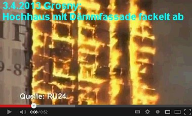 
Grosny 03.04.2013: Dämmstoffbrand an Fassade des 145-Meter-hohen Luxus-Wolkenkratzers Olymp (Depardieu-Hochhaus)im Grosny-City-Komplex - In Windeseile ruck zuck abgefackelt!](https://youtu.be/dCDjgVQycw0) - daß hier entflammbare Wärmedämmung so brutal brannte (im Google Cache noch gefunden: _"Firefighters are tackling a massive blaze in a showpiece skyscraper in the ... "It's burning quite quickly, but I don't think the fire will get to the next building ... the fire had taken hold across the whole of the building, apart from the ground floor, and that it appeared external foam insulation material was burning."_ , wurde aus den Meldungen teils schnell gelöscht, teils hierzulande natürlich gleich verschwiegen. Man weiß ja, wie man für die Lügenpresse richtig schreibt ... 

Am 22.04.2013 fackelt die [Fassadendämmung im Al Hafeet Tower im Taawun Viertel in Sharjah VAE](http://www.emirates247.com/news/emirates/fire-at-20-storey-tower-in-al-taawun-area-2013-04-22-1.503605) ab. 

Am 07.05.2013 fackelt die [Fassadendämmung im Airport Road Building Tower in Abu Dhabi](https://www.youtube.com/watch?v=DmIYSzIgh6o) ab. 

Dann am 21.09.2014 die [gutverdämmte Hochhaus-Lunte in Krasnojarsk](https://www.youtube.com/watch?v=EgIFZ_b9rL8)

Am 21.02.2015 fackelt in Dubai Marina am Torch Tower (Fackelturm) die [brennbare Fassadenverkleidung (identisch Londons Grenfell Tower) inkl. -dämmung ab](http://www.emirates247.com/news/dubai-marina-s-torch-tower-fire-began-on-50th-floor-then-on-the-38th-floor-what-happened-2015-02-21-1.581616) - und 
am 3.08.2017 gleich nochmal: [High Rise Residential Block The Torch Tower Bursts Flames](http://www.dailymail.co.uk/news/article-4759064/High-rise-residential-block-Dubai-bursts-flames.html) 

Am 09.05.2015 dann 16 Tote und 63 Verletzte in einem [fassadengedämmten Wohnhochhaus in Baku](http://dtj-online.de/brand-baku-aserbaidschan-16-tote-53874), wiederum rasant abgefackelt. 

Am 01.10.2015 fackelt die [Fassadendämmung im Al Nasser Tower in Sharjah VAE](http://www.qatarday.com/news/international/watch-sharjah-inferno-leaves-250-families-homeless/25868) ab. 

Am 31.12.2015 fackelt die [Fassadendämmung im Address Downtown Hotel Tower in Dubai](http://www.thenational.ae/uae/short-circuit-on-spotlight-blamed-for-the-address-downtown-dubai-hotel-fire) ab. 

Am 28.03.2016 fackelt die [Fassadendämmung im Ajman One Residential 12 Tower Cluster, vor allem im Ajman Tower 1 in Sharja VAE (UAE)](http://gulfnews.com/news/uae/emergencies/fire-breaks-out-in-tecom-building-1.1085705), ab. 

Am 20.07.2016 wieder eine Brandkatastrophe in Dubai, die [Wärmedämmung im Wolkenkratzer Sulafi Tower](http://www.dailymail.co.uk/news/article-3699272/Fire-breaks-luxury-75-storey-tower-Dubai.html) wird durch eine Zigarette entzündet. 

Am 19.08.2016 fackelt es im siebten bis elften Stockwerk am Wohnhochhaus in [Shepherd's Bush Green](http://www.getwestlondon.co.uk/news/west-london-news/shepherds-bush-fire-tube-station-11774475) in London. BBC berichtet zum Hochhausproblem betr. Feuersicherheit und nennt weitere Fälle: [www.bbc.com/news/uk-england-london-40271604](http://www.bbc.com/news/uk-england-london-40271604) 

Am 14.06.2017 trifft es dann das mit schwer entfalmmbarer PIR-Kunstharzschaum-Wärmedämmung plus Luftschicht plus brennbare alukaschierte Ethylenschicht in der schmucken Verkleidungsplatte besonders gut eingewickelte und ehemals von blanken Betonplatten unbrennbar umhüllte Hochhaus Grenfell Tower - wieder in London! Bei diesem medial weltweit verstärkten Großereignis fackelt wieder mal der ganze Wohnturm ab. Viele Tote und Verletzte. Die Bewohnerinitiative [Greenfall Action Group](https://grenfellactiongroup.wordpress.com/) hatte die Brandgefahr vorher bei dem Besitzer und den zuständigen Staatsbehörden ergebnis-, teils reaktionslos dringlich reklamiert. Das kennen wir aus Deutschland. Taube Ohren der verantwortlichen Gangster überall. In Deutschland werden aber diesmal schon vehementere Stimmen laut: Kai Warnecke, Präsident eines Verbands der Hauseigentümer namens "Haus und Grund", fordert den sinnvollen Abbau aller brandgefährlichen Dämmfassaden und dummerweise Ersatz durch nichtbrennbare Dämmstoffe auf Kosten der Dämmindustrie. Eigentümer und Mieter dürfen nicht weiter die Versuchskarnikel (englisch: Guinea pig) der Baustoffindustrie sein. Brennbare Fassadendämmung gehöre verboten. In Luxemburg fordert der Journalist Dr. Jochen Zenthöfer richtigerweise nur den Abbau - diesmal auf Kosten des im Würgegriff der Dämmlobby widerliche Energiesparvorschriften erlassenden Staates. Denn das sinnlose Gedämme wird ja nicht dadurch besser, daß man unbrennbare Schäume, mineralische Kunstwollgespinste, Schüttflocken oder aecht Bio an und in die Gebäudehülle verbringt. Die CDU-FDP-Regierungskoalition in Nordrhein-Westfalen will mit Hinweis auf die dämmbedingten Kosten und die Wohnungsnot vom Bundesrat fordern, die Energieeinsparverodnung ganz auszusetzen, und das schon vor dem Hochhausbrand. Ebenso die Mittelstands- und Wirtschaftsvereinigung der CDU/CSU. Zur Kostenfrage der Wiederherstellung sicherer Fassaden möchte ich hinzufügen: Die perfiden Vermieter, die ihren Buden die feuergefährliche Dämmung auf ewige Kosten der Mieter im Rahmen der mietrechtlich geförderten "Modernisierung" draufzündeten, sollten eigentlich nicht ganz ungeschoren davonkommen dürfen. Und genau so ergeht es dem Vermieter in Wuppertal, der seine Mieter in einem mit Holzdämmung hinter Luftschicht und Plastikschale verkorksten Hochhaus der latenten Brandkatastophe aussetzte. Zum Zeitpunkt der Errichtung bestimmt legal, dann unter Bestandsschutz fallend, dann aber zurecht moniert und jetzt evakuiert. 

Hier eine ständig aktualisierte Sammlung von Infolinks zum Grenfell Tower Fire (Grünfell? Wie treffend, denn die modernen Tugendterroristen des verbotsvergeilten Wohlfahrtsausschusses "Die Grünen" und ihre geistigen Helfershelfer in allen korrupten Parteien tragen ganz wesentlich die Schuld an den menschen- und freiheitsfeindlichen Dämmexzessen auf Kosten der Wohngesundheit, des nachhaltigen Bauens und des Geldbeutels!): 
[en.wikipedia.org/wiki/2017_Grenfell_Tower_fire](https://en.wikipedia.org/wiki/2017_Grenfell_Tower_fire) 
[de.wikipedia.org/wiki/Grenfell_Tower](https://de.wikipedia.org/wiki/Grenfell_Tower) 
[www.focus.de/immobilien/bauen/menschen-hatten-keine-chance-feuerwehr-erklaert-darum-konnten-sich-die-flammen-im-hochhaus-so-schnell-ausbreiten_id_7244621.html](http://www.focus.de/immobilien/bauen/menschen-hatten-keine-chance-feuerwehr-erklaert-darum-konnten-sich-die-flammen-im-hochhaus-so-schnell-ausbreiten_id_7244621.html) 
[www.architectsjournal.co.uk/news/grenfell-tower-residents-had-predicted-massive-fire/10020757.article](https://www.architectsjournal.co.uk/news/grenfell-tower-residents-had-predicted-massive-fire/10020757.article) 
[www.dailymail.co.uk/news/article-4602420/Residents-eyewitness-accounts-London-tower-fire.html](http://www.dailymail.co.uk/news/article-4602420/Residents-eyewitness-accounts-London-tower-fire.html) 
[www.dailymail.co.uk/news/article-4602478/Moment-firefighter-showered-burning-debris-Grenfell.html](http://www.dailymail.co.uk/news/article-4602478/Moment-firefighter-showered-burning-debris-Grenfell.html) 
[www.dailymail.co.uk/news/article-4604296/Was-cladding-blame-spread-tower-block-fire.html](http://www.dailymail.co.uk/news/article-4604296/Was-cladding-blame-spread-tower-block-fire.html) 
[nsnbc.me/2017/06/15/authorities-ignored-warnings-about-high-rise-fire-hazards-in-londons-21st-century-slums/](https://nsnbc.me/2017/06/15/authorities-ignored-warnings-about-high-rise-fire-hazards-in-londons-21st-century-slums/) 
[www.thesun.co.uk/news/3812802/shocking-video-shows-how-cladding-panels-similar-to-those-used-at-grenfell-tower-burst-into-flames-in-just-two-minutes-during-fire-test/](https://www.thesun.co.uk/news/3812802/shocking-video-shows-how-cladding-panels-similar-to-those-used-at-grenfell-tower-burst-into-flames-in-just-two-minutes-during-fire-test/) 
[www.dailymail.co.uk/news/article-4610250/30-000-buildings-UK-wrapped-killer-cladding.html](http://www.dailymail.co.uk/news/article-4610250/30-000-buildings-UK-wrapped-killer-cladding.html) 
[www.e-architect.co.uk/london/grenfell-tower-in-west-london](https://www.e-architect.co.uk/london/grenfell-tower-in-west-london) - Planning Details 
[news.sky.com/story/grenfell-tower-cladding-is-banned-in-uk-government-says-10919319](http://news.sky.com/story/grenfell-tower-cladding-is-banned-in-uk-government-says-10919319) - Has it been the architect? 
[www.n-tv.de/ England überprüft alle Hochhäuser - schon 34 fallen durch Sicherheitstest](http://www.n-tv.de/panorama/34-Hochhaeuser-fallen-durch-Sicherheitstest-article19905290.html) 
[Zwangsevakuiertes Hochhaus Wuppertal - Risiko brennbare Wärmedämmung: "Hoffen, dass der Warnschuss ernst genommen wird"](http://www.t-online.de/finanzen/energie/id_81530994/geraeumtes-wuppertaler-hochhaus-bleibt-vorerst-unbewohnbar.html) 

[www.bz-berlin.de/: Berlin will keine Hochhausprüfung auf Brandschutzmängel](http://www.bz-berlin.de/berlin/berlin-will-haeuserfassaden-nicht-ueberpruefen-lassen) 
[www.nordbayern.de/: Bayern will auch keine Hochhausprüfung auf Brandschutzmängel](http://www.nordbayern.de/region/nuernberg/nurnberg-keine-prufung-der-hochhausfassaden-1.6298761) 
[www.welt.de/: Rheinland-Pfalz-Hochhäuser angeblich rundum brandsicher](https://www.welt.de/regionales/rheinland-pfalz-saarland/article166020106/Hochhaeuser-im-Land-brandschutzsicher.html) 
[www.op-online.de/ Hessen findet bei Hochhausprüfung Brandshcutzmängel](https://www.op-online.de/hessen/hessen-maengel-beim-brandschutz-hochhaeusern-8502509.html) 
[www.mdr.de/ Thüringer Hochhäuser angeblich alle brandsicher, keine Prüfung erforderlich](http://www.mdr.de/thueringen/thueringen-hochhaeuser-brandschutz-100.html) 

[www.nwzonline.de/Niedersachsen und Bremen wollen Hochhausfassaden prüfen, fordern länderübergreifende Abstimmung](https://www.nwzonline.de/wirtschaft/weser-ems/niedersachsen-und-bremen-wollen-fassadendaemmung-pruefen_a_31,3,1458039397.html) 
[www.stuttgarter-zeitung.de/ Baden-Württemberg will Hochhausprüfung, Probleme bei Gebäuden unter 22 Meter vorhanden](http://www.stuttgarter-zeitung.de/inhalt.brandkatastrophe-in-london-brandschutz-wohntuerme-unter-verdacht.15b91f89-53f0-485d-af0c-592dc18fd5ef.html) 

[Emsland-Hochhaus in Lingen: „Brennbare Dämmung ungefährlich“](https://www.gn-online.de/emsland/emsland-hochhaus-in-lingen-brennbare-daemmung-ungefaehrlich-223877.html) 

Am 01.02.2018 brennt es dann wieder mal in China [Zhengzhou: Fassadengedämmtes Hochhaus in Zentralchina brennt aus](http://german.china.org.cn/txt/2018-02/02/content_50389945.htm) ab. 

Und was ist das Resümee der Bekloppten aus all den abbrennenden, umweltverschmutzenden und tödlichen Dämmfassaden? Mit dem [wirkungslosen](7fehrtab.md) und gefährlichen Unsinn der Fassadendämmung? Den Dämmstoffmüll mit dem gesetzlichen Zwang der Lobbykratur dazu einfach abschaffen und die Menschen von den irrsinnigen Auswüchsen der Politkorruption und der gewissenlosen Gewinnsucht der "Klimaschutz"-Baubranche befreien? Oder einfach nach alternativen, nicht brennbaren bzw. mineralischen Dämmstoffen sowie noch schärferen Brandschutz- und Rettungsauflagen zu schreien, ohne der Ursache des unübersehbaren Risikos auf den Grund gehen zu wollen? Und die früheren, aktuellen und künftigen Opfer frech verhöhnen nach dem lobbyfreundlichen Beschwichtigungs-Motto "Bei uns kann das nicht passieren!". Wobei erst in zweiter Reihe erscheint, daß damit ausschließlich Gebäude über der von der längsten Feuerwehrleiter abgeleiteten 22-Meter-Hochhausgrenze gemeint sind, in allen Buden darunter aber wie selbstverständlich brennbare Kunstharzschaumdämmungen an den Fassaden pappen dürfen. Sie dürfen raten! 

## Vorgehängte Hochhaus-Fassaden und Dämmung - Brandereignisse weltweit unter der Lupe

[Andy Kay: Keeping up the Façade](http://web.archive.org/web/20140505125843/http://www.mdmpublishing.com/mdmmagazines/magazineifp/newsview/857/keeping-up-the-faade) 

[Matthias Bumann: Internetdokumentation Brennende WDVS - Brand im Wärmedämmverbundsystem - Fallbeispiele und Hintergründe](http://www.richtigbauen.de/info/wd/brennendewdvs.htm) 
Fachartikel von Güven Purtul, Süddeutsche Zeitung 23. Juli 2015: [Wärmedämmung - Feuer an der Fassade und die Bauminister](http://www.sueddeutsche.de/wissen/bautechnik-feuer-an-der-fassade-1.2578973) 
In England wurden 2016 einige Ingenieure aufmerksam auf die vielen Dämmstoffbrände im Hinblick auf die Zulassungen und Brandvorschriften in Großbritannien: [Feuergefahr in Fassadendämmungen](http://www.probyn-miers.com/perspective/2016/02/fire-risks-from-external-cladding-panels-perspective-from-the-uk/) 

Am 13. Juni 2016 - einen Tag genau vor der Grenfall-Tower-Brandkatastrophe - wurde enthüllt, daß Polystyrol/Polystyrene-Dämmelemente an den Hausfassaden für die extreme Ausbreitung und Ausbreitungsgeschwindigkeit des Feuers verantwortlich sind: [www.insidehousing.co.uk/revealed-external-panels-probable-cause-of-huge-tower-block-fire-spread/7019613.article#](http://www.insidehousing.co.uk/revealed-external-panels-probable-cause-of-huge-tower-block-fire-spread/7019613.article##) 

Viel Spaß mit den winselnden Produktvertretern!

## Weitere Dämmstoffbrände / Feuer an Fassadendämmung / Abfackelnde Dämmfassaden

Güssing 9. Oktober 2007: [WDVS-Fassadenbrand durch Rasenmäher](http://www.blaulicht.at/index.php?id=28&tx_ttnews\[tt_news\]=2849&tx_ttnews\[backPid\]=4&cHash=f295e3a9ed) 
Leoben 22. Juni 2008: [Großschaden: WDVS an Gymnasium abgefackelt](http://www.fireworld.at/cms/story.php?id=17299) 
Konstanz 27. Februar 2009: [WDVS-Altstadt-Fassade brennt](http://feuerwehr-konstanz.schutzbach.com/?component=galleries&action=show_files&id=374&SID=911c06a45f86272e7b7093c37f5e21cf) 
Aachen-Forst 22. Mai 2009: [WDVS-Wohnhaus-Fassade fackelt ab](http://www.aachener-zeitung.de/lokales/region/forst-feuer-frisst-sich-in-ein-wohnhaus-hinein-1.314947) - [Feuerwehrbilder](http://feuerwehr-simmerath.de/index.php?view=category&catid=133&option=com_joomgallery&Itemid=54&lang=de) 
Kirchrode 26. November 2009: [Großschaden an neuer WDVS-Fassade durch Brand](http://www.haz.de/Hannover/Aus-den-Stadtteilen/Sued/Hoher-Sachschaden-bei-Fassadenbrand) 
Eldagsen 21.Juni 2010: [Schweißarbeiten entfachen Brand in WDVS-Fassade](http://www.ndz.de/portal/startseite_Bei-Schweissarbeiten-Fassadenbrand-in-Eldagsen-_arid,248637_print,1.html) München 18. September 2011: [Brand einer Wohnung und Brandüberschlag auf Dämmstoff-Fassade in der Max-Wönnerstraße](http://www.feuerwehr.muenchen.de/bda0pres/ba01beri/ba012i09/PDF_0911/180911n.pdf) 
Ditzingen 31. Mai 2012: [Brandkatastrophe durch Dämmstoffentzündung in Turnhalle der Wilhelmschule](http://www.stuttgarter-zeitung.de/inhalt.feuer-in-ditzingen-sporthalle-niedergebrannt.15142a61-28e2-4dbd-aafb-ffe32cf3eb30.html) 
Ober-Roden (Rödermark) 11. Dezember 2012: [Vier Häuser in Flammen - Großbrand verwüstet vier Reihenhäuser: Brandweiterleitung über WDVS-Dämmfassaden](http://www.op-online.de/nachrichten/roedermark/grossbrand-ober-roden-vier-haeuser-flammen-2659827.html) 
Windheim, 14. Januar 2013: [Bei Umbauarbeiten im Wohnhaus entflammt Wärmedämmung](http://www.feuerwehr.com/einsatz/berichte/einsatz.php?n=22783) 
Amerang-Evenhausen, 26. Februar 2013: [Holzanbau brennt - Großfeuer mit Photovoltaik und Wärmedämmfassade](http://www.rosenheim24.de/rosenheim/wasserburg/amerang/amerang-evenhausen-brennt-wohnhaus-ro24-2771387.html) 
München-Pasing, 9. April 2013: [Brennender Unrat auf der Terrasse entzündet Fassadendämmung](http://www.feuerwehr.com/einsatz/berichte/einsatz.php?n=22783) 
Heinsberg 11. November 2013: [Neubau-Dämmfassade brennt ab](http://www.aachener-zeitung.de/lokales/heinsberg/feuer-im-neubau-fassade-brennt-1.695964) 
Hohenbrunn 12. November 2013: [Lagerhalle durch Brand in Dachdämmung abgefackelt](http://www.abendzeitung-muenchen.de/inhalt.feuerwehreinsatz-in-hohenbrunn-lagerhallendach-geht-in-flammen-auf.f3db9e96-baa3-4c29-9b06-eeac5c1f3f31.html) 
Berching 22. November 2013: [Feuer in Dachdämmung](http://www.mittelbayerische.de/region/neumarkt/artikel/hund-rocky-rettet-seine-familie/986794/hund-rocky-rettet-seine-familie.html) 
Wemmetsweiler 25. November 2013: [Schweißarbeiten am Dach entzünden Dämmwolle der Fassadendämmung](http://www.sol.de/news/saarland/neunkirchen/Wemmetsweiler-Hausbrand-Schweissarbeiten-loesen-Hausbrand-in-Wemmetsweiler-aus;art27378,4212947) 
Schwelbrand in Töging 27. November 2013: [Feuer in Dämmung am Kamin](http://www.innsalzach24.de/innsalzach/altoetting/toeging/wohnhaus-brand-toeging-3243080.html) 
Wil 28. November 2013: [Eisabflammen auf Gelände entzünden Dämmstoff der Eishallen-Blechfassade](http://www.20min.ch/community/leser_reporter/story/31963082) 
Melle 3. Dezember 2013: [Feuer aus der Dachdämmung läßt Dachgeschoß eines Gästehauses abfackeln](http://www.noz.de/lokales/melle/artikel/433601/wilde-rose-brand-nur-ein-gebaude-betroffen) 
Mechernich 4. Dezember 2013: [Brand in der Glaswoll-Dämmfassade des Asylantenheims](http://www.rundschau-online.de/eifelland/brandstiftung--fluechtlingsunterkunft-stand-in-flammen,16064602,25524608.html) 
Oberdollendorf 6. Dezember 2013: [Dachstuhl- und Fassadendämmung in unbewohntem Wohnhaus fackeln ab](http://www.general-anzeiger-bonn.de/region/blaulicht/Dachstuhl-vollstaendig-zerstoert-article1215557.html) 
Möckern 6. Dezember 2013: [Dämmstoff in Zwischendecke des Edeka-Marktes entzündet sich](http://www.ad-hoc-news.de/glimpflich-ist-am-gestrigen-morgen-ein-feuerwehreinsatz-in--/de/News/33279434) 
Garmisch 7. Dezember 2013: [Ganzes Kaufhaus brennt inklusive WDVS-Fassade ab](http://www.merkur-online.de/lokales/garmisch-partenkirchen/garmisch-partenkirchen/nach-grossbrand-keine-zeit-schockstarre-3264630.html) 
Welzheim 11. Dezember 2013: [Bitumenarbeiten am Flachdach entzünden Polystyrol im WDVS der angrenzenden Wohnhaus-Fassade](http://www.zvw.de/inhalt.welzheim-50-000-euro-schaden-bei-brand.98baaf83-01d2-4658-90be-7717a857ba55.html) 
Mechernich 12. Dezember 2013: [Schon der zweite Brand in der Glaswoll-Dämmfassade des Asylantenheims](http://www.rundschau-online.de/eifelland/zweiter-brand-wieder-feuer-in-fluechtlingsheim,16064602,25608302.html) 
Bad Rappenau-Fürfeld 18. Dezember 2013: [Müllcontainerbrand entzündet Wärmedämm-Styropor-Platten/Styropordämmplatten der Fassade](http://www.kfv-heilbronn.de/einsaetze.php?id=14537) 
Bremen 1. Januar 2014: [Feuerwerkskörper entzündet Dämmstoffe auf Baustofflager für Schulsanierung](http://www.radiobremen.de/nachrichten/kurz_notiert/feuer-schule-brand100.html) 
Aachen 2. Januar 2014: [Brennender Müllcontainer entzündet Dämmfassade des Driescher Hofs - Feuerwehr fordert mehr Vorsicht beim Dämmen](http://www.aachener-nachrichten.de/lokales/aachen/feuerwehr-raet-alles-brennbare-weg-von-daemmfassaden-1.732937) 
Bockau 31. Januar 2014: [Glühende Asche entzündet Wohnhaus-Dämmfassade](http://www.freiepresse.de/LOKALES/ERZGEBIRGE/AUE/Haus-in-Flammen-Kinder-schlagen-Alarm-artikel8692543.php) 
Regensburg 24. Februar 2014: [Dämmstoffbrand auf Terrasse beschädigt Stadtbau-Hochhaus](http://www.mittelbayerische.de/region/regensburg/artikel/feuer-am-stadtbau-hochhaus/1023437/feuer-am-stadtbau-hochhaus.html) 
Eisenstadt 4. März 2014: [Flämmarbeiten entflammen Dämmfassade des Gymnasiums](http://www.tt.com/home/8032029-91/glimmbrand-sorgte-für-feuerwehreinsatz-in-gymnasium-in-eisenstadt.csp) 
Sennestadt 5. März 2014: [Flammen aus brennenden Mülltonnen entflammen benachbarte WDVS-Fassade](http://www.nw-news.de/owl/bielefeld/sennestadt/sennestadt/10629765_Feuer_aus_Muelltonnen_greift_auf_Fassade_ueber.html) 
Rath-Heumar 13. März 2014: [Bauarbeiten entzünden Dachstuhldämmung von Gut Maarhausen](http://www.ksta.de/kalk/gut-maarhausen-in-rath-heumar-dachstuhl-stand-in-flammen,15187508,26543954.html) 
Bad Hersfeld 14. März 2014: [Brennende Dämmplatten auf Baustelle brennen WDVS an Villenneubau an](http://osthessen-news.de/n1245565/bad-hersfeld-aktuell-nach-feuer-20-000-euro-schaden-an-villa-neubau---brandstifter-.html) 
Rodgau-Jügesheim 23. März 2014: [Schweißarbeiten entzünden WDVS-Fassade des Familienzentrum-Neubaus, tückisches Feuer schmort lange unentdeckt unter der Fassadenoberfläche](http://www.op-online.de/lokales/nachrichten/rodgau/rodgau-juegesheim-interview-thomas-antl-wegen-feuer-familienzentrum-3437698.html) 
Hannover-Kronsberg 26. März 2014: [Mülltonnenbrand entzündet Dämmfassade einer Mehrfamilienwohnanlage](http://www.neuepresse.de/Hannover/Meine-Stadt/Feuer-auf-dem-Kronsberg-vier-Verletzte) 
Dillenburg, 6. August 2014: [Dachdämmung der Schule fängt nach Schweißarbeiten Feuer](http://www.mittelhessen.de/lokales/region-dillenburg_artikel,-Daemmstoff-faengt-Feuer-_arid,318384.html) 
Krasnojarsk 21. September 2014: [Dämmpanelfassade an 25stöckigem Hochhaus in Flammen](http://www.rtl.de/cms/news/rtl-aktuell/spektakulaerer-hochhausbrand-in-russland-25-etagen-in-flammen-40696-51ca-13-2058216.html) 
Amorbach, 1. Oktober 2014: [Kühlschrankbrand setzt Lagerhaus-Wärmedämmfassade in Flammen](https://www.polizei.bayern.de/unterfranken/news/presse/aktuell/index.html/208238) 
Mönchengladbach-Rheydt 18. November 2014: [Balkonbrand entzündet Dämmfassade eines Mehrfamilienhauses - "Styroporhaus wird zur Feuerfalle"](http://www.rp-online.de/nrw/staedte/moenchengladbach/daemmstoff-styropor-haus-wird-zur-feuerfalle-aid-1.4680614) 
Obersasbach, 7. Dezember 2014: [Brand Einfamilienhaus - Styropor-Dämmfassade am Giebel schmort ab](http://www.bo.de/lokales/achern-oberkirch/mehr-als-100000-euro-schaden-bei-brand-in-obersasbach) 
Berlin, Köpenicker Landstr. 13. Dezember 2014: [Feuerinferno an drei Monate alter Dämmfassade - von Mülltonnenbrand verursacht](http://www.berliner-kurier.de/polizei-justiz/feuer-inferno-die-oeko-daemmung-war-erst-3-monate-dran,7169126,29327708.html) 
Lusan 1. Januar 2015: [Brand in Dämmcontainer greift auf Dämmfassade der frisch sanierten Gesamtschule über](http://www.otz.de/web/zgt/leben/blaulicht/detail/-/specific/Fassade-an-Gesamtschule-in-Lusan-abgebrannt-274-Notrufe-zu-Silvester-in-Gera-1357148833) 
Duisburg-Mittelmeiderich 1. Januar 2015: [Müllbehälter brennen - Dämmfassade fackelt ab](http://www.presseportal.de/polizeipresse/pm/50510/2916968/pol-du-brand-eines-mehrfamilienhauses) 
Vellberg-Großaltdorf, Lichsenweg 1, 4. Januar 2015: [Großbrand auf PV-bedachtem Hühnerhof - Styropor-Dämmschüttung explodiert nach Erreichen der Zündtemperatur](http://www.swp.de/crailsheim/lokales/landkreis_schwaebisch_hall/Nur-25-000-Kueken-haben-Glueck;art5722,2955858) 
Hoxel, 7. Februar 2015: [Dämmisolierung der Hauswand brennt ab](http://www.volksfreund.de/nachrichten/region/hunsrueck/aktuell/Heute-in-der-Hunsrueck-Zeitung-Isolierung-an-Wohnhaus-in-Hoxel-brennt;art779,4126604) 
Ayl, 9. Februar 2015: [Familienheim brennt - abfackelnde Styropor-Fassade sorgt für Brandweiterleitung ins Dach](http://www.volksfreund.de/nachrichten/region/saarburg/aktuell/Heute-in-der-Saarburger-Zeitung-Vierkoepfige-Familie-verliert-ihr-Heim;art803,4128335) 
Gerresheim, 13. Februar 2015: [Großbrand: Dachdeckerarbeiten entzünden Wärmedämmung der Tennishalle](http://www.wz-newsline.de/lokales/duesseldorf/dachdecker-bei-grossbrand-in-gerresheim-leicht-verletzt-1.1861924) 
Egenhausen, 21. Februar 2015: [Dämmfassade entzündet - Sportlerheim, 4.500 freiwillige Arbeitsstunden und 500.000 EUR futsch](http://www.schwarzwaelder-bote.de/inhalt.altensteig-wuertt-egenhauser-sportheim-brennt-voellig-aus.af64a09f-7653-47f8-8baf-3ff669d0d976.html) 
Alpen, 26. März 2015: [Deo und Feuerzeug entzünden Fassadendämmung der Schule](http://www.rp-online.de/nrw/staedte/rheinberg/schueler-wollten-feuer-mit-o-saft-loeschen-aid-1.4976159) 
Stadtallendorf, 15. Juni 2015: [Großbrand vernichtet Zweifamilienhaus - Dämmfassade durch Autobrand entzündet](http://www.op-marburg.de/Lokales/Ostkreis/Familie-braucht-noch-viel-Geduld) 
Niederkassel, 19. Juni 2015: [Mülltonnenbrand greift auf Fassadendämmung über](http://www.general-anzeiger-bonn.de/region/rhein-sieg-kreis/niederkassel/feuer-einer-muelltonne-greift-auf-hauswand-ueber-article1672456.html) 
Stuttgart, 22. Juni 2015: [Planetarium: Schweißarbeiten entzünden Dachdämmung](http://www.stuttgarter-nachrichten.de/inhalt.planetarium-in-stuttgart-mitte-bei-schweissarbeiten-feuer-ausgeloest.cbc58cde-5422-4620-83ce-e3d142099170.html) 
Mödling, 29. Juni 2015: [Großbrand im Dämmstofflager](http://www.noen.at/nachrichten/lokales/aktuell/moedling/Brand-auf-Firmengelaende-sorgte-fuer-Aufsehen;art2664,646688) 
Chemnitz, 30. Juni 2015: [Wunderkerzen und Silvesterknaller entzünden erst Müllcontainer, dann Dämmfassade](http://www.welt.de/regionales/sachsen/article143367736/10-000-Euro-Schaden.html) 
Neukölln, 1. Juli 2015: [Altenheim brennt - ein Toter - Glutnester in Dämmstoff erschweren Löschung](http://www.morgenpost.de/berlin/article205432029/Altenheim-an-der-Sonnenallee-in-Flammen-ein-Toter.html) 
Konstanz, 4. Juli 2015: [Flammeninferno im Schwaketenbad: Dämmstoffbrand + Photovoltaik am Dach](http://www.suedkurier.de/schwaketenbad./) 
Wiepenkathen, 8. Juli 2015: [Dacharbeiten entzünden Wärmedämmung im Hallendach](http://www.tageblatt.de/lokales/aktuelle-meldungen_artikel,-Dachbrand-in-Verarbeitungshalle-in-Wiepenkathen-_arid,1143480.html) 
Ehrenfriedershof, 10. Juli 2015: [Balkonmöbel brennen - Fassadendämmung entzündet sich](http://www.freiepresse.de/LOKALES/ERZGEBIRGE/ANNABERG/Sitzmoebel-auf-Balkon-geraten-in-Brand-artikel9247144.php) 
Köllerbach, 10. Juli 2015: [Großbrand: Dachdämmungsbrand nach Dachdeckerarbeiten an Zweifamilienhaus](https://blaulichtreport-saarland.de/2015/07/dachstuhlbrand-zerstoert-zweifamilienhaus-in-koellerbach/) 
Mahlsdorf, 11. Juli 2015: [Dämm-Isolierung eines Niedrigenergiehauses fängt Feuer](http://www.morgenpost.de/berlin/article205465215/50-Feuerwehrleute-bekaempfen-Hausbrand-in-Mahlsdorf.html) 
Allershausen, 13. Juli 2015: [Wespen vertrieben und Fassadendämmung angezündet](http://www.sueddeutsche.de/muenchen/freising/allershausen-wespen-vertrieben-und-haus-angezuendet-1.2563663) 
Moosinning, 16. Juli 2015: [Rohbau brennt - Deckendämmung in Flammen](http://www.merkur.de/lokales/erding/moosinning/feuerwehr-rohbau-brand-wohnhaus-baustelle-5253257.html) 
Chemnitz, 17. Juli 2015: [Papiertonne angezündet - Dämmfassade eines Bürohauses in Flammen - Abschmelzende Styroporschichten](http://www.mdr.de/sachsen/brand-chemnitz102_zc-f1f179a7_zs-9f2fcd56.html) 
Werne, 19. Juli 2015: [Ehemalige Schule brennt - oberste Deckendämmung aus Polystyrol fing Feuer](http://www.wa.de/lokales/werne/brand-dachstuhl-weihbachschule-werne-5263499.html) 
Wels-Puchberg, 19. Juli 2015: [Autos in Flammen entzünden Dämmfassade - Zweifamilienwohnhaus brennt ab](http://www.nachrichten.at/oberoesterreich/wels/Sportflitzer-und-Wohnwagen-brannten-voellig-aus;art67,1912492) 
Sindelfingen, 20. Juni 2015: [Großbrand zerstört Schnäppchenmarkt - Feuer im Innenhof breitet sich über Fassadendämmung aus](http://www.stuttgarter-zeitung.de/inhalt.sindelfinger-grossbrand-grossbrand-hinterlaesst-millionenschaden.7d7e11a0-801a-4bef-a469-485c025cfdbc.html) 
Iserlohn, 21. Juli 2015: [Brennender Sperrmüll schlägt auf Fassadendämmung über](http://www.presseportal.de/blaulicht/pm/116234/3077175) 
Celle-Altencelle, 23. Juli 2015: [Dämmstoffhersteller brennt nieder](http://www.cellesche-zeitung.de/S4189565/Grossfeuer-zerstoert-Chemiefirma-in-Altencelle-mit-Videos-und-Bildergalerie) 
Luxemburg/Letzebuerg, 21. August 2015: [Brennender Baustellenmüll entzündet Fassadendämmung am Neubau](http://www.rtl.lu/letzebuerg//694651.html) 
Pentling, 2. August 2015: [Entflammte Liege schmort Dämmfassade einer Wohnanlage an](http://www.mittelbayerische.de/region/regensburg-land/gemeinden/pentling/in-pentling-brennt-es-schon-wieder-21398-art1265353.html) 
Bad Gögging, 24. September 2015: [Fischerhütte brennt, da sich Glaswolledämmung in der Fassade entzündet](http://www.mittelbayerische.de/region/kelheim-nachrichten/leichtsinn-verursachte-brand-einer-huette-21029-art1286267.html) 
Nordhorn, 15. Oktober 2015: [Kamindämmung in Zwischenwand eines Reihenendhauses entzündet sich beim Heizen](http://www.presseportal.de/blaulicht/pm/104234/3148090) 
Jena, 16. Oktober 2015: [Raucherglut greift auf Wohnungsdämmung über](http://www.jenapolis.de/2015/10/16/raucherin-verursacht-wohnungsbrand-in-jena/) 
Worms, 20. Oktober 2015: [Müllsacke im Feuer - WDVS-Fassade entzündet sich](http://www.swr.de/landesschau-aktuell/rp/mainz/polizeieinsatz-in-worms-muellsaecke-brennen/-/id=1662/did=16340426/nid=1662/taauvf/) 
Travemünde, 21. Oktober 2015: [Entflammte Wäsche zündet durch: Gedämmtes Holzhaus fackelt ab](http://www.ln-online.de/Lokales/Luebeck/Travemuende/Ferienhaus-Brand-auf-dem-Priwall-Ursache-steht-fest) 
Nortorf, 21. Januar 2016: [Brand in Wintergarten greift auf Wärmedämmfassade über - alles futsch](https://www.ndr.de/nachrichten/schleswig-holstein/Feuer-in-Nortorf-hat-Kind-gezuendelt,nortorf184.html) 
Heiligenhafen, 22. Januar 2016: [Gedämmter Rohbau abgebrannt](https://www.ndr.de/nachrichten/schleswig-holstein/Feuer-aus-24-Stunden-Einsatz-in-Heiligenhafen,feuer2782.html) 
München, 28. Januar 2016: [Noch ein gedämmter Rohbau abgebrannt](https://www.muenchen.tv/explosion-und-brand-rohbau-abgebrannt-schaden-in-sechsstelliger-hoehe-149421/) 
Chemnitz, 13. Februar 2016: [Mülltonnenbrand verbrennt WDVS und Haus](http://www.freiepresse.de/LOKALES/CHEMNITZ/Haus-in-Flammen-Er-klingelt-die-Nachbarn-aus-dem-Schlaf-artikel9436443.php) 
München, 17. Februar 2016: [Balkonbrand greift auf Wärmedämmfassade über](http://www.abendzeitung-muenchen.de/inhalt.einsatz-in-der-herthastrasse-balkonbrand-in-nymphenburg.a066961e-71aa-406f-a82f-c4e73af1c3d5.html) 
Worfelden, 19. Februar 2016: [Mülltonnenbrand entflammt Dämmfassade](http://www.echo-online.de/lokales/kreis-gross-gerau/buettelborn/hoher-schaden-nach-feuer_16657470.htm) 
Aachen, 8. Mai 2016: [Balkonfeuer entfackelt Fassadenisolierung](http://www.aachener-zeitung.de/lokales/aachen/feuer-geloescht-hund-muss-ins-tierheim-1.1355102) 
Duisburg, 17. Mai 2016: [Dämmfassade verursacht tödliche Brandkatastrophe: Mutter mit zwei Kindern verbrannt](http://www.derwesten.de/staedte/duisburg/gutachten-daemmfassade-fuehrte-zu-brandkatastrophe-in-duisburg-id12127380.html) 
Wittenberge, 25. Juli 2016: [Blitz schlägt in Styropor ein - Feuer mit riesiger Rauchsäule](http://www.berliner-zeitung.de/berlin/brandenburg/wittenberge-blitz-schlaegt-in-styropor-ein---feuer-mit-riesiger-rauchsaeule--24462424) 
Niefern-Öschelbronn, 12. August 2016: [Gedämmtes Mehrfamilienhaus abgefackelt - Feuer erfaßt von Terrasse aus ganzes Haus](http://www.pz-news.de/region_artikel,-Hoher-Schaden-Mehrfamilienhaus-durch-Brand-teilweise-zerstoert-_arid,1115699.html) 
Grödig, 22. August 2016: [Gedämmte Tischlereifassade verbrennt](http://www.salzburg24.at/groedig-grosseinsatz-bei-brand-in-tischlerei/4860554) 
Bad Godesberg, 24. August 2016: [Gießerei brennt - Dämmstoff nährt das Feuer und die Brandausbreitung](http://www.general-anzeiger-bonn.de/bonn/bad-godesberg/Brand-in-Bad-Godesberger-Maschinenfabrik-article3340494.html) 
Leipzig, Grünau-Nord, 25. August 2016: [Feuer auf Balkon wird zum Dämmfassadenbrand](http://www.mz-web.de/leipzig/mitten-in-der-nacht-gassi-gehen-rettete-familie-mit-fuenf-kindern-vor-feuer-24647048) 
Hamm-Wiescherhöfen, 12. September 2016: [Fettbrand im Wohnhaus-Anbau greift auf Polystyrol-Wärmedämmverbundsystem des Hauptgebäudes über](https://www.wa.de/hamm/fassade-wiescherhoefen-flammen-ersten-brennt-hamm-waermedaemmsystem-6743497.html) 
Herrenberg, 12. November 2016: [Mülltonnenbrand entzündet Dämmfassade](http://www.swr.de/landesschau-aktuell/bw/stuttgart/brandstiftung-in-herrenberg/-/id=1592/did=18506026/nid=1592/108ovmv/) 
Hooksiel, 13. November 2016: [Kaminbrand setzt Wanddämmung in Flammen](http://www.wzonline.de/nachrichten/aktuelles/artikel/brand-in-hooksieler-wohnhaus.html) 
St. Johann im Pongau, 3. März 2017: [Fassadendämmung am Wohnhaus brennt](http://www.salzburg24.at/feuerwehr-st-johann-rettet-hasen-aus-brennendem-haus/4951802) 
Bielefeld, 5. März 2017: [Brennende Gartenhütte zündet Dämmfassade des Wohnhauses an](http://www.salzburg24.at/feuerwehr-st-johann-rettet-hasen-aus-brennendem-haus/4951802) 
Hallein, 14. März 2017: [Pfannenbrand entzündet erst Fassadendämmung, dann Dachstuhl: Zwei Verletzte](https://www.bgland24.de/bgland/region-salzburg/salzburg-ort29384/hallein-salzburg-grosseinsatz-feuerwehr-fettbrand-pfanne-entzuendet-dachstuhl-7760403.html) 
Hannover, 8. April 2017: [Feuer greift vom Containunterstand auf Dämmfassade über](http://kai-zaengel.de/index.php/fotogalerie/einsatzfotografie/330-muellcontainerbrand-im-sahlkamp-greift-auf-hausfassade-ueber-am-08-04-2017) 
Gehren, 22. Juni 2017: [Wohnhaus mit Dämmfassade abgefackelt](http://www.insuedthueringen.de/region/thueringen/thuefwthuedeu/Zwei-Wohnhaeuser-brennen-in-der-Nacht-ab-Hoher-Schaden;art83467,5583912) 
Ergänzend: [Feuerwehr Frankfurt: WDVS - Brände an wärmegedämmten Fassaden](http://www.feuerwehr-frankfurt.de/index.php/projekte/wdvs) 
[Ergebnisliste Brandereignisse in Verbindung mit Wärmedämmverbundsystemen](http://www.feuerwehr-frankfurt.de/index.php/mediathek/category/31-wdvs?download=145:brandereignisse-in-verbindung-mir-waermedaemmverbundsystemen) - Liste der Frankfurter Feuerwehr - PDF 
Doku von RA Wolfgang Hägele: [Weitere Brände von Dämmfassaden](http://www.haera.de/wdvs-info.html) 

Hier finden Sie die Position der WDVS-Produzenten: [Technische Systeminfo 6 - Wärmedämm-Verbundsysteme zum Thema Brandschutz](http://www.heizkosten-einsparen.de/media;files/pdf/5/5.pdf) - Herausgegeben vom Fachverband Wärmedämm-Verbundsysteme e.V., Baden-Baden, lt. Broschüre "Ausdruck einer erfolgreichen Zusammenarbeit des Fachverbandes mit der MFPA-Leipzig, Abteilung Baulicher Brandschutz", verfaßt von zwei wahren Tausendsassas - dem Geschäftsführer und Leiter des Bereiches Bauphysik und Baulicher Brandschutz der MFPA Leipzig GmbH, Gesellschaft für Materialforschung und Prüfungsanstalt für das Bauwesen Leipzig mbH, gleichzeitig Inhaber eines Ingenieurbüros für Brandschutz an Fassaden (IBaF) und Lehrbeauftragter an der Universität Leipzig, Dipl.-Phys. Ingolf Kotthoff sowie die ehemalige Leiterin des Bereiches Technik eines Herstellers von Wärmedämm-Verbundsystemen (WDVS) und Mitglied des Fachverbandes WDVS e.V., maßgebliche Mitwirkung an der Einführung nationaler bauaufsichtlicher Zulassungen für WDVS in Deutschland, Leiterin des Arbeitskreises Brandschutz und Inhaberin eines Ingenieurbüros, Dipl.-Ing. Nora Fouad ... 

Wenn Sie übrigens wissen wollen, wie manche deutsche Feuerversicherungen / Gebäudeversicherer / Brandversicherungen die Brandopfer um die ihnen nach Vertrag zustehenden Schadensersatzsummen bringen, lesen Sie mal hier: [Feuerversicherung usw.](versicherung.md) 

Kommen wir zurück auf die oben zitierte Kleine SPD-Anfrage. Die wird von den Fuzzis der Bundesregierung sinngemäß so abgenudelt: Bauen ist Ländersache, geht uns alles nix an. Und auerdem ist doch alles gut. Finden dann aber die Bauminister nicht und wollen nach ihrer Zusammenkunft im Herbst 2011 das Brandverhalten der Dämmwunderfassaden etwas genauer - mit Feuerwehren! - untersuchungen. Und die SPD unter MDB Michael Groß bleibt hartnäckig und legt nach. Aus der folgenden [Kleinen Anfrage 17/11419](http://dipbt.bundestag.de/dip21/btd/17/114/1711419.pdf): 

* "Welche Schlussfolgerungen zieht die Bundesregierung aus der Bauministerkonferenz der Länder hinsichtlich der Überprüfung der Risiken zur Dämmung mit erdölbasierten Schaumstoffen?
* Wie erklärt die Bundesregierung die unterschiedliche Klassifizierung des Brandverhaltens der Schaumstoffprodukte EPS zur Wärmedämmung (welche nach Norm DIN EN 13501 als „E“, also „normalentflammbar“ klassifiziert sind) gegenüber der nationalen Einstufung nach DIN 4102 als „schwerentflammbar“ (B1)?
* Sieht die Bundesregierung in der Aufbringung einer Putzschicht auf einen brennbaren Dämmstoff einen wirklichen Schutz vor der Entflammbarkeit des brennbaren Materials Polystyrol?
* Welche Begründung gibt es aus Sicht der Bundesregierung an dem in den Fachgremien von CEN und der EU Kommissionsdienste als ungeeignet angesehenen Prüfverfahren gemäß DIN 4102 Teil 14 und 15, dem sogenannten „Brandschachttest“, festzuhalten und damit die seit 2001 verabschiedeten europäischen harmonisierten Normen nicht in Deutschland einzuführen und dementsprechend anzuwenden?
* Stellt oben genanntes Prüfverfahren einen Verstoß gegen die Europäischen Verträge dar?
* Ist dieser mögliche Verstoß der nationalen Brandklassifizierung gegen die Europäischen Verträge unter anderem auch Grund für das eingeleitete Vertragsverletzungsverfahren der Europäischen Kommission gegen Deutschland hinsichtlich der Umsetzung der Bauproduktenrichtlinie?
* Wie schätzt die Bundesregierung die Warnungen der Feuerwehrleute und Brandschutzexperten hinsichtlich der ausgehenden Gefährdungen durch schaumstoffbasierte Dämmstoffe ein?
* Welche Schlussfolgerungen und Handlungsempfehlungen leiten die Bundesregierung aus den Aussagen dieser Experten ab?
* Welche Auswirkungen erwartet die Bundesregierung für die Energiewende und den wesentlichen Bestandteil der energetischen Gebäudesanierung zur Erfüllung der europäischen Klimaschutzziele, wenn die Verunsicherung bei Immobilienbesitzern und Mietern weiterhin anhält?
* Wie beurteilt die Bundesregierung die Brandeigenschaften schaumstoffbasierter Dämmstoffe in Abhängigkeit von verschiedenen Bauphasen, aber auch nach Fertigstellung des Gebäudes und bei eventuellen Schadenseinflüssen am fertigen Bauobjekt?
* Welche Änderungen hinsichtlich der Förderung der Gebäudedämmung und energetischer Standards und Handlungsempfehlungen zum energetischen Sanieren hält die Bundesregierung in Bezug auf die Brandeigenschaften und Brandklassifizierung von Dämmsystemen für erforderlich?
* Welche maßgeblichen Schritte zur Harmonisierung des Brandschutzes in Deutschland sieht die Bundesregierung vor?
* Wie ist der aktuelle Stand der Vertragsverletzungsverfahren hinsichtlich der Bauproduktenrichtlinie?
* Welche Schritte im Rahmen der Tätigkeit des Deutschen Instituts für Bautechnik (DIBt) hält die Bundesregierung für angezeigt, um – neben der Einführung der Vorgaben durch das „Gesetz zur Anpassung des Bauproduktengesetzes und weiterer Rechtsvorschriften an die Verordnung (EU) Nummer 305/2011“ – die europarechtskonforme Umsetzung und Anwendung der EU-Bauproduktenverordnung sicherzustellen?
* Welche Formen des Berichts und der Evaluierung der Arbeit des DIBt bestehen bislang auf Bundesebene? Welche Ergebnisse haben diese hervorgebracht?
* Welche Aspekte sprechen aus Sicht der Bundesregierung gegen die Überwachung und Begutachtung des DIBt durch eine organisatorisch und sachlich unabhängige Stelle?
* Welche Aspekte sprechen angesichts der europäischen Harmonisierungsregelungen im Bereich des Bauproduktenrechts für eine Bündelung von Zuständigkeiten beim DIBt?
* Welche hoheitlichen Aufgaben müssen aus Sicht der Bundesregierung notwendigerweise durch das DiBt wahrgenommen werden?
* Ist die bestehende Praxis, maßgebliche Vorgaben für die Anforderungen an bauaufsichtliche Zulassungen durch untergesetzliche technische Regeln zu bestimmen, nach Auffassung der Bundesregierung nach wie vor zweckmäßig und mit geltendem Recht vereinbar, insbesondere im Hinblick auf die Anforderungen an normkonkretisierende Verwaltungsvorschriften?"

Kommt zwar wieder nix bei raus, aber schön ist es trotzdem, oddä? 

Als kleines Zuckerl hier ein (anonymisiertes) Mail, das mich am 27. November 2012 erreichte, ich titel es mal: 

### "Gestern in der Polystyrol-Verbraucherzentrale"

"Sehr geehrter Herr Fischer, 
Mit hohem Interesse verfolge ich Ihre Website und Ihre Ausführungen zu Thema Bauen seit Jahren. Mein großes Lob dafür, daß Sie sich die Mühe machen und das alles ins Netz stellen, sicherlich etwas unübersichtlich, aber bei der Fülle an Information sei es Ihnen verziehen. 
Ich bin selber Eigenheimbesitzer und Vermieter, Eingenheim BJ. 1902, das andere 1922, so daß aus der Sache heraus ein Interesse an Ihren Thesen besteht. 
Desweiteren bin ich bei der Ortsansässigen Feuerwehr freiwillig tätig. Somit geht hier das Interesse in die Problematik Fassadendämmung mit Polystyrol auch sozusagen aus Hobby hinein. 
Nun hatte ich mir gesagt, daß man bei beiden Objekten sicherlich etwas energetisch verbessern kann und habe mich für eine Energieberatung interessiert. Hier in der Stadt R wird so etwas durch das Rathaus organisiert und durch die Verbraucherzentrale Hessen durchgeführt. Kosten 5 EUR pro 1/2 Stunde. 
Meine speziellen Interessen lagen nicht unbedingt im Energiesparen, sonderen in der eigenen Energieerzeugung durch Photovoltaik oder Miniblockheizkraftwerke. 
Ich muss Ihnen mal von meinem gestrigen Erlebnis mit der Energieberatung der Verbraucherzentrale Hessen berichten: 

Die Stadt bietet solche Beratungen im Rathaus, scheinbar verbilligt, für Einwohner in der Stadt an. Für 5 EUR bekommt man eine "spezielle bedarfsorientierte" Beratung pro 1/2 Stunde. 
Also habe ich mich bei der Stadt gemeldet, einen Termin vereinbart und per Mail einen Fragebogen bekommen, den ich zu dem Termin mitbringen musste. Bei der Buchung des Termins wurde bereits abgefragt, was meine Interessen wären, diese wurden mir auch so bestätigt. 
So, dann gestern der Termin im Rathaus, als erstes ließ der gute Mensch mich 10-15 Minuten warten, was ja eigentlich von meiner Zeit abging, aber wenn er die Zeit dann hinterher dran hängt, wäre das auch kein Problem. 
Alles dabei, Fragebogen, Bilder der Häuser, Verbräuche, Laptop, Baupläne, etc. 
Dann gings los, Abfrage der Gebäudehülle, heißt Dämmung ja oder nein, und dann der entscheidende Satz bereits nach 2 Minuten Beratung: "Das würde man heut ja nicht mehr so machen". Wie denn? meine Frage. Ja so 20-30 cm Dämmung wäre in Ordnung. (dazu muss man sagen, das auf dem 1902 gebauten Haus, eine 80mm Mineralwolle ist mit Holzbeplankung). 
Ich: Wenn Sie von 20-30 cm reden, dann meinen Sie sicherliche Polystyrol, oder? 
Berater: Ja, sicherlich (ich hatte ja nur darauf gewartet, ich hatte es geahnt, förmlich gerochen, daß es darauf hinausläuft). 
Ich: Ihnen ist aber schon bewußt, welche Brandgefahren von solch einem Baustoff ausgehen? 
Berater (das übliche rethorische Beratergeplänkel): Ja das sind ja nur Einzelfälle, und das kann man pauschal so nicht sagen ... 
Ich: Ich werde mir doch so keine Plastikscheiße auf's Haus kleben wo ich die Feuchtigkeit nicht mehr rausbekomme 
Die Diskussion führte dann ins Nichts. Ich habe ihm dann vorgeschlagen, das Thema zu beenden, da wir hier auf keinen Nenner kommen werden. 
In der Diskussion führte er noch an, daß diese Baustoffe ja bauaufsichtlich zugelassen sind und somit von dem Baustoff keinerlei Gefahr ausging. Da ich ja gerade aus dem Filmbericht (45 Minuten NDR) vom Montag wußte, wie die Zulassungen manipuliert worden sind, hatte ich ihn gleich wieder im Sack. 
Also gut, dann eben auf's eigentliche Thema, Energieerzeugung mit Photovotaik oder Miniblockheizkraftwerk, so hatte ich das angemeldet. 
Nach kurzer Nachfrage, wie die Verbräuche liegen, sagte er mir, daß dies zu wenig wäre für ein Miniblockheizkraftwerk im Keller. 
Ich hakte nach, wie es mit der steuerlichen Ersparnis, Fördermöglichkeiten etc. aussieht, jetzt kommt's erst: 
Ja, das könne er nicht sagen, soweit stecke er in der Materie nicht drin, das ist ja eine allgemeine Beratung und solche speziellen Fragen sind ja schon eine Planung. 
Ich: Diese Themen habe ich aber angemeldet und erwarte darauf auch eine entsprechende Vorbereitung. 
Er: Das könne er nicht leisten. 
Ich: Gut, dann brechen wir hier ab, ich hätte da erheblich mehr erwartet, hab' ihm 5 EUR auf Tisch geknallt und war weg. 
Zum Thema Photovoltaik kam überhaupt nichts. 
So was könnte ich hassen, wenn so "Luftpumpen" irgendwo hingeschickt werden und den Leuten irgendwelche dumme Sachen erzählen. Der hätte auch von der Styroporlobby bezahlt worden sein. 
Für 5 EUR Volksverdummung von der Verbraucherzentrale." 

Kommentar: Stimmt. Und das auf Kosten des Steuerzahlers! Und wie kritisch es wirklich aussieht, mit dem behördlicherseits allzulange verharmlosten Brandrisiko von Polystyrolfassaden hat dann der SPIEGEL mit dem NDR im November 2014 aufgedeckt: [Behörden-Tests: Dämmung an Millionen Häusern kann Brände anfachen](http://www.spiegel.de/wissenschaft/technik/waermedaemmung-an-haeusern-erhoehte-brandgefahr-durch-styropor-a-1001121.html) 

Weiter: **Der Schwindel mit der Wärmedämmung -[Kapitel 16 - Dachdämmung](21316bau.md)**
