[🠔 Zur Übersicht: Dämmung](213baust.md)  
# Der Schwindel mit Wärmedämmung + Energiesparen 16
**Das Wasser in der Sparrenzwischendämmung / Deckendämmung / Fassadendämmung / Dachbodendämmung / Geschoßdeckendämmung / Deckendämmung und die Weisheit des dichten Bauens und falschen Dämmens**  
_von Konrad Fischer_

Der Schwindel mit der "Wärmedämmung" und falschem Energiesparen 16 

[zurück<- Kapitel 15](21315bau.md) 

## Das Wasser in der Sparrenzwischendämmung / Deckendämmung / Fassadendämmung / Dachbodendämmung / Geschoßdeckendämmung / Deckendämmung 
und die Weisheit des dichten Bauens und falschen Dämmens 
gem. Energieeinsparverordnung EnEV, Energieberatung und Norm

Intro: 

Aus einer Mailzuschrift: 

Guten Tag Herr Fischer, 
mit großem Interesse habe ich viele Ihrer Beiträge im Internet gelesen und Sie sprechen mir aus der Seele. 
Wir haben einen Anbau (Holzrahmenbau mit Flachdach Okt. 2011) gemacht. Es sollte ein Warmdach sein. Als Dach haben wir ein OSB Platte 22 mm und drei Lagen Dachbitumen. 
-Dämmung 200 mm 
- Dampfsperre SD>100m 
-OSB Platte 15 mm 
Mittlerweile habe ich das Dach 3x wieder geöffnet und die Dämmung herausgenommen, da diese Nass war. 

So sieht es nicht nur in diesem Dach aus, wollmer wetten? 

In den derzeit modernen Holzsteckerlkonstruktionen ohne ausreichende Hinterlüftung bzw. Unterlüftung der Schalungsebenen und Dämmebenen - dafür mit geradezu wahnsinnigen Dampfbremsen und Dampfsperren - ist die WDVS-bedingte Feuchteanreicherung natürlich die beste Voraussetzung für erfolgreiche Schwammerlzucht in Wohnräumen. Sie gelingt oft unbemerkt einige Jahre im Verborgenen - jawohl, egal ob mit oder ohne Dampfbremse, da auch die beste Dampfbremse nicht verhindert, daß Luftfeuchte von Anfang an in der Dämmung steckt - und auch von der anderen Seite als Umkehrdiffusion dort nachgeliefert wird! - und überrascht vielleicht Sie als Hausbewohner durch verblüffend unschöne Verfärbung zwischen grau, grün, schwarz und sonstwie - aber nichtsdestotrotz heute keinen Bausachverständigen mehr. Es sei denn, er tut scheinheilig überrascht, um Ihnen ein superteures Untersuchungsprogramm aus den Rippen zu schneiden oder ist von der anderen Seite. Fragen Sie nach und bleiben Sie wachsam! Gerne tropft es auch aus der Dachdämmung. Baumängel am Dach - auch Dachmurks und Dachpfusch genannt - ernähren Handwerker, Bausachverständige, Rechtsanwälte und Gerichte in reicher Zahl - auch bei Ihnen? 

Die aufgenäßte, schwarz verschimmelte und verfärbte Dämmung - inzwischen Standard in deutschen Decken zum Dachgeschoß, Dächern, Dachschrägen und Wänden! 

Leider schon bald nach Einbau geht es los, hier noch vor dem Einzug: 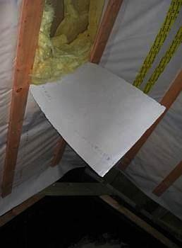 

Ein Fall aus meiner Bauberatung: Dachausbau wenige Monate nach Dämmstoffeinbau,noch keine Naßstrecke (Putz, Estrich, ...), gute Durchlüftung und Trocknungsbedingungen. Ich habe den Verdacht, daß es wie immer ist und öffne beim Termin die unterseitige "Dampfbremse / Dampfbremsfolie". 
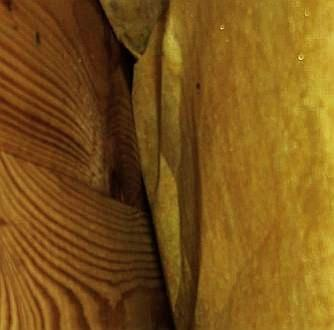Alles patschnaß unter der Folie: Wärmedämmung aus Mineralfasermatten, Holzschalung, Sparren. Die Wassertropfen glitzern auf der Dämmstoffoberfläche, das Holz steht feuchtdunkel und harrt des Hausschwammes. 
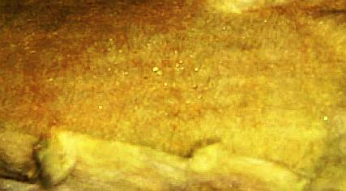Hier im Detail, der Dämmstoff ist naß wie ein Schwamm,seine Oberfläche klatschnaß, die Tropfen glitzern. 
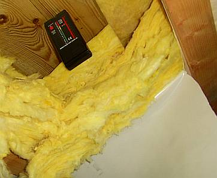Meß mer mal: Oh, der Protimeter mini - Holzfeuchtemeßgerät auf der Grundlage von Widerstandsmessung (Stromtransport zwischen Einstechdornen) schlägt voll aus! Also über 23 Prozent Holzfeuchte!! 
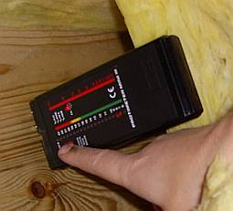Da müssen wir ins Detail, den Umschaltknopf drücken und auf der rechten Skala weitermachen: Ca. 27 Prozent!!! Wie trocknet man dieses Fließwasser aus der nicht kapillar aktiven und deswegen bestens absaufenden Sparrenzwischendämmung zwischen Dampfbremsfolie und Holzschalung, die obendrein oberflächig dummerweise total mit Dichtbahn abgeklebt ist? Gar nie nicht! Das Ende des Lieds: Rausbau, Rückbau. Und korrekt neu konstruieren, um sowohl die natürlichen Feuchteschwankungen der Dachhölzer wie auch die Wohnfeuchte sicher und dauerhaft abzuführen. Nach EnEV und Norm, nach dem geballten Fachwissen von Industrie, Handwerk und vielen Planern gelingt das bestimmt nicht, oder? 

Kommen wir deswegen kurz zum gefürchteten Problem "Atemwasser holzzerstörender Pilze". Im das Pilzwachstum besonders begünstigenden unbelüfteten Innenbereich der Zwischensparrendämmung passiert ggf. folgendes: Die dank überall vorhandener Pilzsporen sich ansiedelnden Pilze wandeln beim Abbau von Cellulose (C6H10O5) diese unter Beteiligung des auch aus der Luft entnommenen Sauerstoffs in CO2 - Kohlendioxid und H2O 
- Wasser um, die Stoffwechselprodukte werden an die Umgebungsluft abgegeben - eben ausgeatmet. Das so entstandene Wasser erhöht die Eigenfeuchte der in der Umgebung vorhanden Hölzer, was dann die holzzerstörenden Pilze - ja, darunter auch die Braunfäule und der echte Hausschwamm - natürlich nicht ruhen, sondern sehr verständlicherweise jubeln - und wachsen und fressen udn atmen läßt. Bis die Bude kracht. 

Und hier ein paar fein durchschimmelpilzte Mineralwollebilder aus der [Geschichte des Laborumbaues von Ralf Ohmberger](http://www.amplifier.cd/Labor/umbau/laborumbau.html), mit Einverständnis des Autors etwas zurechtgeschnitten für diese Seite: 

Die ersten Bilder zeigen die durchschimmelte Mineralwolledämmung über der Deckenkonstruktion zum Kaltdach, also auf dem Fußboden des Dachbodens über dem beheizten unteren Geschoß. So wird es bald - wenn es nach den falschen Empfehlungen der zertifizierten und unzertifizierten Energieberater und Energiepaßausteller geht und den darauf hereinfallenden Leichtgläubigen oder Doofen, die nicht wissen, daß die Nachrüstpflicht gem. EnEV 2009 sogar ohne eigenen Befreiungsantrag und -bescheid entfällt - und zwar nach einem am 27.06.2011 veröffentlichten [Beschluss der Fachkommission Bautechnik der Bauministerkonferenz](http://www.bbsr.bund.de/nn_79976/BBSR/DE/Bauwesen/EnergieKlima/GesetzlicheRegelungen/AuslegungenEnEV2009/XV-2.html) 

- für alle Holzbalkendecken jedweden Alters, 
- für alle sonstigen Massivdecken ab 1969, und 
- wenn schon eine alte geschlossene bzw. höchstens von Balken durchbrochene Dämmschicht auf dem Boden oder in der Dachebene vorliegt, weil dann sowieso nicht mehr wirtschaftlich nachgedämmt werden kann 
- und gem. EnEV 2014 immerhin dann, wenn der Mindestwärmeschutz vorliegt und wenn der Probleme macht, dann immerhin bei nachgewiesener Unwirtschaftlichkeit im Rahmen einer dem unwirtschaftlichen Härtefall geschuldeten Befreiung gem. EnEN § 25 - 
auf allen deutschen Dachböden / "obersten Geschossdecken beheizter Räume" aussehen: 

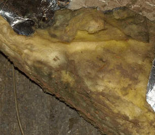 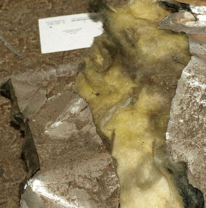 

Und so, wenn man dann später all die EnEV-konformen Zwischensparrendämmungen ausbaut. Wenn man nicht vorher an der Schwarzschimmelseuche verreckt ist: 

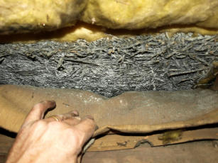  

Ob hier die Feuchteaufnahme aus dem Konstruktionsholz, das ja im Jahresablauf Feuchte aufnimmt und abgibt, die Grundlage für den Schwarzschimmelbefall lieferte? Immerhin kann ja durch den massiven Ausbau der Raumhülle mit sorptionsfähigem Putz auf magnesitgebundener Holzwolleplatte kaum die Raumluft durchdrungen sein, oder?: 

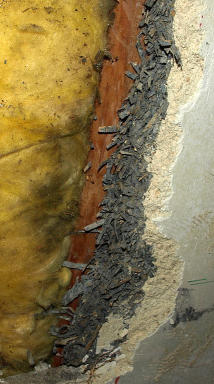 

Und der Rest des keinen modernen Energiesparexperten beim Dachboden dämmen abschreckenden Befundes, nur als Nachweis, wie hart solche Dachbodendämm-Experten im Nehmen und Schönreden der Dachbodendämmerei sind: _"Alles Ausführungsmängel!", "Kommt heute nicht mehr vor, jedenfalls bei Ihnen nicht!"_ : 

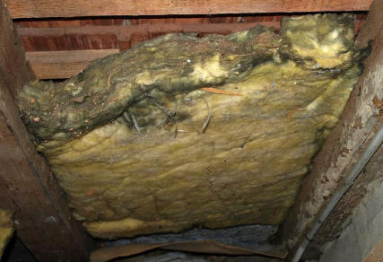 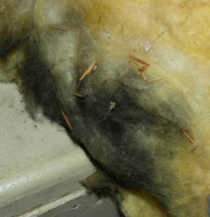 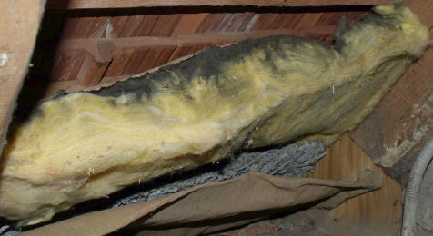 

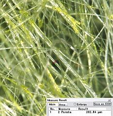 Diese interessante Makroaufnahme (links) einer unverpilzten Partie der Dachdämmung aus Mineral-Dämwolle belegt, wie glassplittrig so eine Mineralfaserdämmung in Wirklichkeit ist. Der von so eckligem Dämmstoffmüll betroffene und entsetzte Hausbesitzer Ralf Ohmberger hat sich natürlich tiefschürfendere Gedanken gemacht und schreibt mir dazu folgende interessante Fragestellungen, die sich dabei aufdrängen: 

_"Glas ist brüchig. Bei mechanischer Belastung kann es brechen. Ein Glasstab wird wohl noch leichter brechen. Diese Fasern sehen aus wie ein langer Glasstab. Ein langer Glasstab kann in kleine Teile brechen. Bruchkanten an Glas sind scharfkantig. Schwebstoffe können sich recht lange in der Luft halten, viel Kraft benötigt bewegte Luft nicht, um kleinste Brüchstücke abheben zu lassen. Ausgeatmete Luft kann mehrere 100 km/h schnell strömen, Husten ein vielfaches mehr (Quelle Internet). 

Die Ein- als auch Ausatemluft kann den Glaskörper möglicherweise auf eine beachtliche Geschwindigkeit beschleunigen. 

Kinetische Energie = 0.5 * Masse * Geschwindigkeit * Geschwindigkeit 

Ein beidseitig scharfkantiges, hartes kleines Glasbruchstück, das es je nach Größe durch das Filtersystem Mensch hindurch geschafft hat, kann zu einem mikromechanischen Geschoß innerhalb der Lunge und Konsorten werden. Vielleicht kann so ein Geschoß auch im Gewebe einschlagen und dort verbleiben? 

Wer soll das zersetzen?, Flußsäure, konzentrierte Laugen, vielleicht in den Lungen von Außerirdischen zu finden, aber nicht beim Menschen. Das Zeugs (Herstellung 1976) dürfte evtl. vom Körper in Eiter o.ä. verpackt werden (ich bin kein Mediziner), in der Hoffnung, irgendwann ausgehustet zu werden oder sich sonst wo im Körper niederlassen. Vielleicht bilden sich auch böse kleine Zellen aus, ich weiß es nicht. 

Man muss sich nicht lange mit diesem Thema beschäftigen, um weniger Gutes zu erahnen."_ - Recht hat er! 

Und das Giftgelbklebrige an den Glasfasern ist übrigens der beliebte organische Nährstoff für den Schwarzschimmelpilz - bis zu ca. 7 Prozent synthetische Bindemittel (Duroplaste / Phenolharze, Formaldehydharze, Schmälzmittel wie Mineralöl und Klebstoffe etc.) können in den Mineralfaserplatten enthalten sein. Die Chose ist dann umweltgefährdender Sondermüll - vgl. TRGS 521 "Faserstäube", Teil 1: "Anorganische Faserstäube". Seit der am 01.01.2002 in Kraft getretenen Verordnung zur Umsetzung des Europäischen Abfallverzeichnisses (AVV) werden KMF (=Künstliche Mineralfasern, AVV-Schlüsselnummer 17 06 03) als gefährlich gekennzeichnet. Inzwischen wird das Zeugs offiziell zwar als nicht mehr gesundheitsgefährdend eingestuft. Bedenkenlos brachte aber die geniale Industrie und das ehrbare Handwerk die als krebsgefährdend einzustufende todbringende Sortierung jahrzehntelang in die Buden. Doch wenn man an die nach wie vor gegebene Gefährdung zur Durchschimmelung denkt ... 

Konrad Fischer: Fassaden energetisch richtig und kostensparend sanieren 1 

[Teil 2](http://www.youtube.com/watch?v=Y1NSxAW15Cc) [Teil 3](http://www.youtube.com/watch?v=RAT7VzBo8k0) [Teil 4](http://www.youtube.com/watch?v=6TBII25iVQk) [Teil 5](http://www.youtube.com/watch?v=Kb0C4KiZvVA) 

 In der evangelischen Landeskirche Bayern (und bestimmt nicht nur dort) laufen heimtückische Programme zur gesundheitlichen Vernichtung der letzten verbliebenen PfarrerInnen, zur Zerstörung der letzten gesunden Pfarrhäuser und Gemeindehäuser. Möglicherweise von den McKinsey-Anhängern in der ebenso möglicherweise von allen guten Geistern verlassenen Kirchenführung ausgeheckt und kirchenamtlich den Kirchengemeinden / Ortsgmeinden mithilfe der Erfüllungsgehilfen der landeskirchkirchen Bauverwaltung draufgedrückt. Das [Forum Aufbruch Gemeinde](http://www.aufbruch-gemeinde.de) prangert seit 2008 die zentralistischen Mißstände in der Landeskirche an. Von oben durchgedrückte Ordres par ordre di Mufti - seit 2011 vom Ökotrommelschlag des Energiewende-Apostels und neuen Landesbischof [Heinrich Bedford-Strohm](http://www.epd.de/zentralredaktion/epd-zentralredaktion/landesbischof-bedford-strohm-dringt-auf-energiewende) aufgehetzt - gehen bekanntermaßen schon immer gerne an den wahren Bedürfnissen vor Ort vorbei. Galoppierender Mitgliederschwund ist darauf eine logische Antwort. In unserem Fall bedient sich die ökoverseuchte Zentralgewalt kirchlicher "Beauftragter für Umweltfragen", "Umweltberater", "Umweltbeauftragter" und einer "Umweltkonferenz". Sie alle sollen eingebunden werden u.a. durch und bei 

_"- Teilnahme an Baubegehungen und offizielle Stellungnahme zu Bauvorhaben (siehe Landeskirchliche Energie-Leitlinien vom 15.11.1997, Punkte 1.2-3 und 3): 
“Umweltbeauftragte und Umweltberater sind in die Planungsgespräche vor Ort möglichst früh einzubeziehen. Ihre Stellungsnahme ist Bestandteil des kirchlichen Bauantrags und Voraussetzung für die kirchenaufsichtliche Genehmigung.„ 

- Erarbeitung von Vorschlägen zur besseren Nutzung und Einsparung von Energie und Wasser (z.B. Wärmedämmung, Heizanlagen, erneuerbare Energien, Strom- und Wasser-Spartechniken, Regenwassernutzung, aber auch entsprechende Anleitung von Mitarbeitenden)."_ (Internetquelle: [Umwelt-Ordnung der Evangelisch-Lutherischen Landeskirche Bayern](http://www.bayern-evangelisch.de/www/engagiert/umwelt-ordnung.php) 

Nicht allzu lange vorher hat sich die Evangelische Landeskirche mit ihren Baufachleuten drangemacht, ihre Pfarr- und Gemeindehäuser auf neuestem Stand mit Holzschutzmittel für die Herausforderungen der Zukunft zu vergiften: [DER SPIEGEL - Bleierne Zeit](http://www.spiegel.de/spiegel/print/d-13693683.html) 

 
Deutsche Giftmischer zum Wohle der Umsätze in der Baubranche 

Wie sich derartiges Expertentum dann konkret und dank Sparwahn kostensteigernd ausprägt, geht aus einer mir vorliegenden Planung eines gemeindeübergreifend vom Kirchbauamt lancierten oberfränkischen "Architektur und Baubüros ... Spezialisiert auf Altbausanierung ... und Umbau ... Restauration alter Häuser" hervor. Dessen grandiose "Bauideen" - "wir ... restaurieren mit viel Liebe alte Häuser" gipfeln in folgenden Positionen aus einem Kostenvoranschlag für die Renovierungsarbeiten an einem denkmalgeschützten und in aller über 100jährigen Originalität, Bauqualität und Schönheit der mit Naturwerkstein geschmückten Fassadengliederung erhaltenen Dorf-Pfarrhaus. Das doch lediglich einige herbe Mängel am zurückliegenden - von im landeskirchlichen Auftrag empfehlenden Industriefachberater wärmstens empfohlenen - Plastik-Dispersions-Silikatanstrich der Fassade und innere Feuchteschäden durch Dauerlüftung des kühlen Kellergeschoßes zeigt (wortwörtlicher und unkorrigierter Auszug): 

_"- Herstellung einer Dachbodendämmung im Bereich des Kaltdaches direkt auf den Dachboden (bisher noch keine Dämmung 
- Erneuerung der Fenster als Isolierglasfenster ... incl. der notwendigen Innenarbeiten wie Beiputz und Anstrich; Ausbau der vorhandenen Kastenfenster 
- Anbringen eines Vollwärmeschutzes ..._", 

u.a. mit folgenden Einzelpositionen: 

_"1. Dämmung Dachboden ... Lieferung und Einbau von zweilagigen trittfesten Dämmplatten aus Mineralwolle, z.B. Iso... Top..., Uw-Wert 035, Dämmdicke 2 x 100 mm, kreuzweise verlegt ... 

2. Schreinerarbeiten ... Dreiflügelige Isolierglasfenster ... Verglasung kW 1.0 ... Ausführung mit Alu-Flügelabdeckprofil ... Alternative ... Ausführung einer kompletten Alu-Schale ... Ausbauen der Haustüren incl. Stockrahmen ... Einbau einer isolierten Haustüre ... 

3. ... Putz- und Anstricharbeiten ... Vorstehende Sandsteinteile und Fensterbänke mittels Trennschleifer abschneiden und Schutt entsorgen ggfs. von Hand abstemmen 50 m ... WDVS-Platten mit WDVS-Kleber gemischt mit Zement nach Angabe des Herstellers im Verbund verkleben - Mineralwolledämmung, Plattendicke 14 cm und zusätzlich mit 8 Spezial-Dübeln je/m2 befestigen, kW 030 ... Flächen mit einem wetterbeständigen Siliconharzputz beschichten ... Zwischen- und Schlußanstrich mit einer Silikatfarbe ... Wandflächen ...mit Innensilikatfarbe ... streichen oder rollen. ... 

4. Putzsanierung Keller ... Sanierputz ... aufbringen 

5. Zimmerei/Dachdeckung ... Ortgangverlängerung ... 

Gesamtsumme rd. 135.000,00 EUR ... Die vorgenannten Kosten wurden anhand der Baubegehung, vergleichbarer Bauvorhaben und eingeholter Kostenermittlungen auskömmlich veranschlagt. Bei zutrage treten von verdeckten Schäden und Mängeln muss ausdrücklich eine Fortschreibung vorbehalten bleiben. Sollte dieser Fall tatsächlich eintreten werden zusätzliche Kosten umgehend ermittelt und mitgeteilt. ..._" 

Na, schnackelt's? Wer wird sich diese schönen Erneuerungspositionen und jeder Wirtschaftlichkeit, Kostensicherheit oder gar Denkmalpflege (Abhacken der fachgerecht auskragenden Sandsteinsohlbänke, Vernichtung aller wunderschönen historischen Kastenfenster und Außentüren!) Hohn sprechenden Baumaßnahmen denn in Wahrheit ausgedacht haben? Die hier nur gekürzt angegebenen Herstellernamen/Produktbezeichnungen weisen den Weg. Da das Energieeinspargesetz im § 5 fordert, daß die Energiesparmaßnahmen ["wirtschaftlich vertretbar sein"](7wdvs02.md#eneg) müssen, und dies im hier gegebenen Fall nicht mal ansatzweise zu erwarten ist, liegt wieder mal ein Gesetzesverstoß zugunsten der darbenden Dämmstoff- und Isolierfensterindustrie bzw. der vom Baukosten abhängigen Planerhonorierung vor. Mit nach oben offener Kostenexplosionsskala: _"Bei zutrage treten von verdeckten Schäden und Mängeln ..."_ - die bei einer qualifizierten Bauuntersuchung doch nicht so unbekannt bleiben müssten, um später vorzugsweise in Regiestunden die Kosten nach oben zu treiben, wenn es kein Zurück mehr gibt ... 

Besonders schön die angesichts der anrechenbaren Gewerkkosten von exakt 103.731.00 EUR angegebenen _"Nebenkosten ... Architektenhonorar entsprechend HOAI, Honorarzone III, Mindestsatz 8.500.00"_ EUR, inkl. 19 Prozent MWST, netto also 7.142,86 EUR. Das verdeutlicht in aller Klarheit, welche Planungsqualiät sich die Kirchengemeinde von solchen Planern erwarten darf. Wieso? Mit dem zur Vermeidung von gesetzwidrigen Honrorar-Mindestsatzunterschreitungen hier mindestens anzusetzendem 20-prozentigem Umbau-/Modernisierungszuschlag (es wird ja nahezu alles rausgerissen und mit "modernen" Konstruktionen ersetzt und umgebaut) müssten hier mindestens 15.449.17 EUR Netto-Architektenhonorar herauskommen, und selbst ohne noch 12.874.31 EUR ([Online-Honorarberechner zum eigenen Nachprüfen](http://www.joergbrune.de/hono/hono_ber.htm)). 

Ja selbstverständlich, auch eine Genehmigungsplanung braucht es bei Baudenkmälern (Erlaubnisverfahren gem. DSchG) und angesichts der vielen konstruktiven Änderungen muß das auch gestalterisch in Vor-und Entwurfsplanung durchgearbeitet werden. Wird es ja auch, nur nicht bei so einer Planung im Planungsbüro, sondern seitens der ach so kostenlosen Produzentenberatung, die den Aufwand in ihrer Produktbepreisung für all den Baupfusch zigmal unterbringt. Weihnachtsbesuch bei treuen Planern wahrscheinlich sogar auch, oder? 

So professionell vergeudet man derzeit in der evangelischen Landeskirche landauf und -ab die Kirchensteuermittel, Klingelbeuteleinlagen und sonstigen Gemeindespenden treuherziger Geber. Mit dicken Schinken wird nach kümmerlichen Würstchen geworfen, Motto: Saving the Penny, losing the Pound. Leider nicht nur hier, muß ich gerechterweise ergänzen. Doch eben auch! Und zwar alles unter den Augen und mit aktivem Einverständnis und Mitwirkung der Kirchenleitung und der landeskirchlichen Baubehörde. Dort sitzen beamtete Architekten. Sie haben den vollständigen und wissenden Einblick in alle Honorarberechnungen und alle der VOB widersprechenden - also den Auftraggeber kraß benachteiligenden - mit Produktnennungen gespickten Ausschreibungen der für die Landeskirche tätig werdenden Planer. 

Diese Architekten der kirchlichen Baubehörde leisten folglich sehenden Auges solchem gesetzeswidrigem und treulosem Honorardumping (eine HOAI-sachverständige Prüfung aller landeskirchlichen Planungsverträge wäre bestimmt eine spannende Angelegenheit, da wett'ich meinen Kopf drauf!) und damit zwangsläufig verbundenem korruptionsbegünstigenden (seitens der Baustoffproduzenten) Planungspfusch Vorschub. Ein ekelhaftes Bündnis mit der teuflischen Sünde - zum Nachteil der Kirche. Hut ab vor solchen AutoriätInnen, die offenbar keinerlei Revision und Entlarvung ihres bösen Treibens befürchten müssen - anders als die staatlichen Baubeamten. 

Zu den Fragen rund um die mit der üblichen Dumping-Planung "fachgerecht geplanten" Pfuschmaterialien für Putz, Anstrich und Fenster siehe weiterführend hier: [Sanierputz](2sanipuz.md) (der z.B. wegen seiner wasserabweisenden Wirkung und sollgemäß kunstharzhaltigen Anstrichsystemen bei Schimmelbefall pures Wandgift ist, da er an seiner bewuchsfreundlichen Oberflächenbeschaffenheit Kondensat anreichert und damit Schimmelpilzbewuchs geradezu bestens fördert), [Plastikpampensoßenanstrich](22bausto.md) und [Fensterverbrechen](23bausto.md). 

Ja, es war schon immer etwas teurer, sich mit teuren Energiespar- und sonstigen Baumaßnahmen billiger Planer zu erwürgen, man gönnt sich ja sonst nix. Denken wir nur an all die Betonruinen,die das weise Kirchbauamt den opferwilligen Gemeinden - trotz hin und wieder versuchtem Widerstand - eingebrockt hat. 

Und ein dickes Dankeschön auch den lieben Bundestagsabgeordneten und den Mitgliedern des Bundesrats, die in unserem Namen gerne auch mal unseren Tod durch Energiesparverordnungen und -gesetze beschließen. Hauptsache, die Kasse stimmt, newwa? 

Daß sich die moderne Dämmung gerne auch mal als Vorhof der Hölle, als teuflisches Machwerk und sozusagen Fegfeuer zu Lebzeiten der Gläubigen erweist entpuppt, durften die verbliebenen Kirchgänger der "Neuen" Kirche in Hambach, die Erweiterung der St. Antonius Kirche aus der Mitte der 1970er Jahre erfahren. Aus der [Aachener Zeitung vom 19. Juli 2011](http://www.az-web.de/lokales/dueren-detail-az/1756699?): 

_"Ein in der Decke eingebautes Fließ, das die zur Dämmung verarbeitete Mineralwolle zurückhalten soll, ist derart porös, dass Partikel der Mineralwolle ungehindert in den Kirchenraum gelangen können. „Und die sind so klein“, erklärt Irene Gatzen, „dass sie bis in die Lungen vordringen.“ Um die Gesundheit der Gottesdienstbesucher zu schützen, blieb dem Kirchenvorstand daher keine andere Wahl, als die „Neue Kirche“ bis zu einer Sanierung zu schließen. Die Kosten werden auf bis zu 70.000 Euro geschätzt."_ 

Na, dämmert's endlich, wie man baut, wenn man den Kirchenbaubehörden und ihren Beauftragten freie Hand läßt? Ach so, eine brave Kirchengemeinde muß auch das aushalten. Na dann Kreuzstab auf sich nehmen, Kreuz drüber und Amen! 

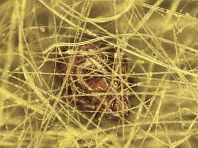 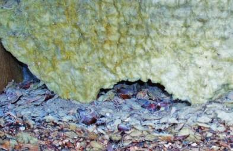 Das Detailbild links aus einer schwarz verschimmelten Mineralwolle / Glaswolle-Dachdämmung zeigt, wie man mit Dämmwahn die Schöpfung bewahren kann. Und das schätzen nicht nur die die Fasern beschwärzenden Pilze, sondern auch diverse chitinbepanzerten Insekten aus der Sortierung Hausstaubmilbe u.ä., von denen eines hier mausegleich aus dem Fasergewirr hervorspitzt. Schädling, duck dich! Das verhuschte Spinnenmilbenkäferlein ist natürlich entsetzt angesichts des überraschenden Interesses an seiner Behausung. Wie ließ es sich doch im Dunkeln gut munkeln. Doch schon vorbei - wir wünschen weiter: Guten Appetit! 

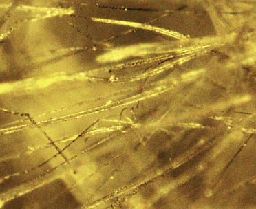 Durch die Belichtungsverhältnisse unter dem Mikroskop lassen sich bei dem gewählten Vergrößerungsfaktor die schwarz an den Fasern /Faserbruchstücken anklebenden Schimmelpilzwucherungen leider nicht in aller notwendigen Deutlichkeit herausarbeiten. Doch wer etwas genauer hinguckt, kann die Schimmelbeläge doch hier und da ausmachen. 

Und oben rechts sehen Sie, was makrogroße Nagetiere mit der Dämmwolle so anstellen. Auch schön, gell? Und wie erfreulich, daß wenigstens der tierische Nestbau mit solch Ekelmaterialien prächtig zu funktionieren scheint. Wenn sonst nix anderes da ist ... 

Zwei weitere Grusel-Bilder zu aufgefeuchteter bzw. undverrottbar-verrotteter Schmuddel-Glasfaserdämmung / Glaswolledämmung / Mineralwolle-Dämmung / Mineralfaserdämmung - in Österreich auch Tellwolle / Telwolle / Tel-Wolle genannt - selbstverständlich auch in der Fassade - präsentiert [Architekt Mag. August Bammer:](http://atriumhaus.at/)

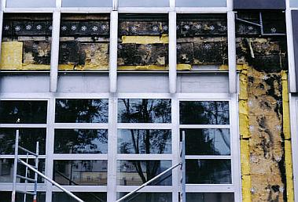 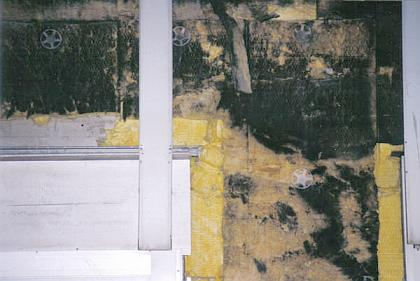 Nasse, schwarze, schimmelpilzbefallene und pilzdurchwachsene Wärmedämung (Glaswollematten / Glasfaserdämmung / Glaswolle-Dämmstoff) in einer vorgehängten Fassade in Linz (Übersicht und Detail). Ist das nicht ekelerregend, was kluge Planer und fleißige Handwerker hinterlassen? Und das soll jetzt die Wärme dämmen, die beim Beheizen des Dachgeschosses entweichen will?? Wer's glaubt, wird Österreicher (Tu felix Austriae ...). Und da der Dachbodenausbau bzw. Dachausbau ohnehin schon der teuerste Weg ist, Wohnraum zu schaffen und auch Denkmalschutz und Denkmapflege oft nicht umhin können, diesem Blödsinn ihren amtlichen Segen zu erteilen - ja freilich, in die Standgaube müssen Holzfenster, aber dreifach lippengedichtet und selbstverständlich mit Wärmeschutzglas / Spezial-Isolierglas - sind dort eben die allerbesten Voraussetzungen für nasse Dämmungen in den schrägen Wänden der Sparrenebene gegeben. 

Wer hat das eigentlich noch nicht erlebt? Dampfdiffusionsoffene Unterspannbahn - die Lachnummer für Anfänger: Luft geht durch, Dampf bleibt da, wo er hingehört: am kalten Folienbauteil - das Verursacherprinzip funktioniert hier wenigstens 100%. Nach kurzer Bewitterungszeit ist auch die intelligenteste Dampfbremse (Sie kennen die Namen) mit Dreck, Speck und Mikroorganismen zugesetzt. Die Makrofotos sind bekannt und kursieren als Lachnummer in der Branche! 

Einen wesentlichen Beitrag zur Auffeuchtung der Zwischensparrendämmung liefert ja nicht nur die von Anfang an oder irgendwann zuströmende Luftfeuchte von innen (Winter) oder außen (Sommer), sondern auch die Holzfeuchte der Sparren und Schalungen. Bei VOB-gerechtem Feuchtegehalt des Holzes von umax = 20 Prozent (das bekommt das Holz im Kaltdach automatisch auch jeden Winter!) und einem durchschnittlichen Holzvolumen von ca. 0,05-0,07 m³/m² Dachfläche fällt als Sommerkondensat im Sommerfall bei ca. 60 Prozent relative Luftfeuchte und 20 °C Außentemperatur und sich daraus ergebender Holzfeuchte von ca. 11 Prozent ca. 2 Liter Wasser je Quadratmeter an. Und zwar an der kältesten Stelle - dank sommerlichem Dampfdruckgefälle von außen - wo es sehr heiß wird - nach innen - wo es dann doch leicht kühler ist - eben innen an der Außenseite (nicht Raumseite!) der Dampfbremsfolie. Dort soll es ja dann auch gewolltermaßen pottdicht sein. Was macht jetzt das überschüssige Wasser im Sparrenzwischenraum? Genau: Schimmelpilz- und Hausschwamm-Zucht. 

Doch diese Konstellation betrifft ja nicht nur Dachkonstruktionen, sondern auch alle Leichtbau-Holzständerbauten / Holzrahmenbauten - also alle Büdli Marke Fertigbau. Damit das dann auch wirklich so passiert, hat die Industrie dem arglosen Hausbesitzer das allnächtliche Runterregeln der Heizung beigebracht. Bei der damit sollgemäßen Abkühlung der Raumluft fällt dann extra viel Kondensat in der Wand- und Decken- und Dachkonstruktion an. Da der Sparfuchs ja auf keinen Fall die Fenster öffnet, wenn er seine Heizung nachts runterdreht. Es könnte ja etwas Wärme entweichen. Daß die Warmluft seine abgemiefte Feuchte enthält, die bei Luftabkühlung ausfällt, stört ihn erst, wenn er hinter die Kulissen schaut. Aber dann ist es schon viel zu spät. 

Da die falsch und dicht gedämmte "Konstruktion" obendrein absolut exaktes Arbeiten und - angesichts der bewegungsfreudigen und von aufnässender Holzeigenfeuchte und im Dämmstoff eingeschlossener und bei Unterschreitung des Taupunkts auskondensierender Luftfeuchte gekennzeichneten "Leichtbauweise" der Dachkonstruktion dauerdichte und gleichzeitig dauerentfeuchtende Bauweise - ein Novum am Bau, das keinen Mangel und kein Detailversagen und keine (!) Taupunktunterschreitung mehr toleriert bei gleichzeitiger Wunderwirkung trocknungsfördernder Intelligenzia-Abdichtung - erfordert, sind schwerste Mängel und Bauschäden sozusagen vorprogrammiert. Und das Kondensatproblem dürfte wohl auch für die diffusionsoffenen Folien, die im sog. Dämmsack-Verfahren (Foliensack gefüllt mit Zellulose-Dämmschüttung) Verwendung finden, nicht ganz unbekannt sein. Warmfeuchte Luft oder aus dem Sparren im Jahresablauf natürlicherweise austrocknende Materialfeuchte schlägt sich dann bevorzugt am nächsten kühlen Bauteil ab - wenn Dämmsack-Folie, dann eben an Dämmsack-Folie.

Gibt es nicht? Die Wissenschaft hat festgestellt? Glauben Sie! Ich glaube da lieber an die Jungfrauengeburt. Lesen Sie mal, was ein Neubauopfer intelligenter Bauträger, intelligenterer Planer, intelligentester Zimmerleute und ihrer hyperintelligenten Dampfbremsen ebenso ökokrimineller Beamter sowie Politiker des Vorsorgestaats BRD mir nachfolgend mitteilte: 

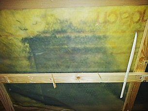 _Datum: 20.08.12 20:58 
Betreff: Ihre Internetseite und unsere Erfahrungen mit Schimmel 

Hallo Hr. Fischer, 
mit großem Interesse habe ich Ihre Internetseite gelesen, und ich muss sagen, Sie sprechen mir aus dem Herzen. 

Wir haben vor 15 Jahren einen Neubau vom Bauträger gekauft. Vor kurzem haben wir bei kleineren Umbaumaßnahmen entdeckt, dass die Dämmwolle im Dachgeschoss unseres Hauses völlig verschimmelt ist. Jetzt haben wir den dringenden Verdacht, dass die ständigen Krankheiten unserer Tochter (sie hatte im Schnitt alle 4 Wochen einen Infekt), die 10 Jahre unter dem Dach ihr Zimmer hatte, darauf zurückzuführen sind. 

Nachdem der erste Schreck überwunden war, haben wir die schimmelige Glaswolle entfernt. Für mich ein unglaubliches Erlebnis, wenn man im eigenen Haus im Ganzkörper-Schutzanzug mit Gummihandschuhen, Schutzbrille und Atemfilter arbeitet und sich vorkommt wie ein Arbeiter im Atomkraftwerk. Wir haben jetzt 10 Säcke a 2 qm schimmelige Glaswolle im Garten liegen, die ich noch als Sondermüll entsorgen lassen muß. 

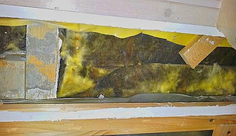 Seit Wochen beschäftige ich mich jetzt mit dem Thema. Wie konnte das passieren? Was lief falsch? Wie kann so was noch 15 Jahren in einem neuen Haus auftreten, gebaut von Profis? 

Ich habe die beiden großen Hersteller von Dämmwolle angeschrieben. Der eine erzählt mir "alles unkritisch, das ist nur Hausstaub". Der andere behauptet "gesundheitsgefährdenter Schwarzschimmel, sofort raus". 

Von einer weiteren Seite habe ich erfahren "das ist zwar Schimmel, aber man kann mit einer zweiten Folie neu abdecken - dann aber mit angebrachten Warnschildern: gesundheitsgefährdenter Schimmel unter der Folie". 

Natürlich haben wir auch jede Menge "Experten", sprich Zimmermannsbetriebe bezüglich einer Sanierung angefragt. Da wirds dann ganz dubios. Der eine hat vorgeschlagen, gleich das komplette Dach neu einzudecken und mit den allerneusten Materialien Holzfaserdämmplatten und eingeblasener Zellulose zu sanieren. Die Kosten sollen so um die 30 T€ liegen. Ein anderer schlägt vor, nur noch eine 16 cm PU Dämmung unter den Sparren anzubringen. Der nächste wiederum schwört auf Mineralwolle und erzählt Horrorgeschichten über vom Marder gefresse Zellulose. 

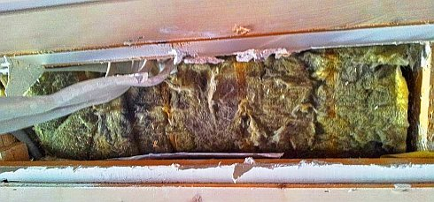 Und so gehts in einem weiter. Jeder erklärt einem, das was er gerade verkauft ist das absolut Beste. Klar, vor 15 Jahren war man einfach noch nicht so weit. Da haben wir leider Pech gehabt. Aber jetzt ist man viel schlauer. 

Ganz dubios wirds dann, wenn sie einem von "intelligenten" Folien als Dampfbremse erzählen, deren absolute Luftdichtigkeit mit einem "Blower-Door-Test" überprüft wird. Wenn man dann nachfragt, wie lange diese Folien eigentlich "intelligent" seien und ob das auch noch in 30 Jahren funktioniert, hat keiner eine Antwort. 

Wenn man dann im Internet nach Dämmverfahren sucht, wird man erschlagen von den grandiosten Angeboten. Da gibts hunderte von Dämmfolien mit den unglaublichsten Namen. Und jeder behauptet natürlich, dass sein Produkt das absolute Non-Plus-Ultra sei. Ganz besonders nett wirds dann bei den Superklebern für die Folien. Aber keiner gibt darauf eine Langzeitgarantie. Wie auch, wer hat diese Materialien denn schon über 30 oder mehr Jahre im Haus verbaut gehabt? 

Richtig ärgerlich wird es dann, wenn man sich bei der KfW erkundigt, ob man denn dafür eine Förderung bekommen könnte? Klar geht das, aber dann bitteschön mit dem U-Wert von 0,14. Das erreicht man dann nur mit den allerneuesten Materialien, natürlich das Ganze schön luftdicht verpackt. 

Der "Experte" rät dann wieder zur zusätzlichen elektrischen Zwangsbelüftung, sonst ist die Gefahr von Schimmelbildung gegeben. Das ist ja unfassbar. Da packe ich das Haus in luftdichte Plastikfolie und muss dann dauernd einen stromfressenden Lüfter laufen lassen? 

Ich muss sagen, als Dipl.-Ing. der Elektrotechnik bin ich technisch nicht ganz unwissend. Es ist für mich unfassbar, wie hier sog. Fachleute mit einer Art Halbwissen horrend teure High-Tech Dämmungen verkaufen, ohne dass eine Langzeiterfahrung über die Materialien, deren Wirksamkeit und vor allem deren gesundheitliche Unbedenklichkeit vorliegt. Und vor allem wird dieser ganze Unfug auch noch von staatlicher Seite vorgeschrieben! 

Anbei sende ich Ihnen ein paar Fotos zur Illustration. 

Schönen Gruß 
N.N. 

_ Aus dem weiteren Schriftwechsel: 

_Date: Wed, 22 Aug 2012 23:00:46 +0200 
Subject: Re: Ihre Internetseite und unsere Erfahrungen mit Schimmel 

Hallo Hr. Fischer, 
Sie können gerne meine Zuschrift auf Ihrer Webseite mit den Bildern bringen. Eine Namensnennung würde ich weniger bevorzugen. 

... wo ich einen vertrauenswürdigen Zimmermann finde, der uns eine Sanierung anbieten kann? Zur Zeit stehe ich vor dem Problem, dass ich eigentlich keine Lösung habe, die ich für dauerfest halte. Was wäre aus Ihrer Sicht machbar? 

Schönen Gruß 
N.N. 

Datum: 23.08.12 10:58 
Betreff: Re: Ihre Internetseite und unsere Erfahrungen mit Schimmel 

Sehr geehrter Herr N.N., 
vielen Dank für Ihre Publikationserlaubnis. Betr. Ihrer Sanierung empfehle ich die Ausführung .... Herr Zimmerermeister ... Tel: ..., aus ... kann Ihnen da bestimmt als fairer Partner weiterhelfen. Er hat auch schon mehreren meiner [Beratungskunden](2berat.md) aus der Dämmpatsche geholfen. 

Besten Gruß und Viel Erfolg! 
Konrad Fischer 

_ Dies schrieb mir übrigens Herr Rechtsanwalt Raimund Braun am 16. Januar 2012 in mein [Gästebuch](gaestebuch.md) (Auszug): 

_"... Außerdem war das Dach bei mir komplett verschimmelt (Glasfaser schick verpackt zwischen 2x Plastik). ..."_ 

Ach so, wenn auch Sie wissen wollen, wie sich der lebensgefährliche Dämmbetrug in Ihrem Dach ausbreitete?, einfach mal öffnen. Mundschutz und gute Begleitlüftung nicht vergessen! Und wie man es ohne faserige, porige und flockige Problembaustoffe aus Industrie- oder Bioökofabrik besser macht, und was man beim immer kritischen Dachausbau gleichwohl sonst noch beachten muß, hier geht es dafür weiter: [Bauberatung - 180 EUR / Stunde](2berat.md). 

Selbst der kostensteigernde Blower-door-Test kann bei den leicht gebauten und ebenso leicht beweglichen Bauweisen bestenfalls bis zum Winter unkontrollierten Feuchteeintritt in die Dämmkonstruktion verhindern, danach könnten die Dichtbänder für die widerlichen Dampfbremsen / Dampfsperren / Folien als von "Baupysikern" und der sog. Bauchemie begünstigten bzw. deren Muffis in den Normausschüssen geheiligten Sollkondensatebenen durch thermische Dehnung abgerissen sein bzw. langsam weichmacherfrei, versprödet und unwirksam. Daß es dabei um Energieverluste geht, glauben ohnehin nur noch die Theoretiker, die den klassischen schimmelverpilzten Dämmschaden noch nie gesehen haben.

Zu raten ist deshalb allen Energiesparaposteln, die auf den k-Wert bzw. U-Wert oder auch sd-Wert hereingefallen sind, auch mal die ständigen Bauschadensveröffentlichungen der Sachverständigen zu diesem Thema zu studieren. Und dann eine bewährte Dachdämmung einbauen: Mit Massivbaustoffen wie Vollholz, Backstein usw. wirkungsvoll gedämmt und nach alter Vääter Sitte entlüftet / unterlüftet. Konstruktionsdetails je nach örtlichen Verhältnissen, Statik und Geldbeutel.

Geradezu irre Stilblüten aus dem Dämmstofflobpreis leistet sich das Mitgliedermagazin _"Familienheim und Garten"_ in seiner Ausgabe 12/17 in der Rubrik _"Praktisch & Gut"_ unter dem Titel _"Zimmerdecke - Neue Materialien für den Um- und Ausbau"_ und dem Abschnittstitel _"Dämmen nicht vergessen!"_ : 

_"Besonders beliebt [als "korrekte Dämmung"] ist ... Mineralwolle, auch Glas- oder Steinwolle genannt. Die sorgt durch ihre Wärmeleitfähigkeit im Winter für warme Wände. Im Sommer führt dies zu wohltuend kühlen Temperaturen"_ und das wird noch unterstrichen durch das Bild eines glücklich lächelnd zupackenden Dachdämmers mit einer ca. 20 cm fetten Dämmplatte in der arbeitsbehandschuhten Hand, untertitelt mit _"Zur Dämmung ist Mineralwolle sehr beliebt. Im Winter wärmeleitfähig und im Sommer isolierend."_ Gezeichnet _"M.E."_. Was _"M.E."_ abzubilden vergaß, ist der berühmte Jahreszeitenschalter, der dem extrem schlecht wärmeleitenden Dämmgespinst erzählt, wann er seine wärmetechnischen Eigenschaften umschalten muß. Ansonsten ist genug Dachgeschoßbewohnern von eigenem Schwitzen und Frieren bestens bekannt, wie kreislaufanregend das Wohnen und mineralwollgedämmten Barackendächern wirklich ist. 

Mein mit Zitaten angereicherter Beitrag zum Sommerkondensat an der Dampfbremsfolie dank Umkehrdiffusion im Fachwerkforum ["Feuchtigkeit zwischen Dampfbremse und Klemmfilz"](http://www.fachwerk.de/goForum.html?id=169655) kann das Problem vielleicht noch etwas näher beleuchten: 

"Auch ich dämme, aber noch anders: 

- Weil Kondensat gibts dort immer, da braucht man halt kapillaraktive Konstruktionen, die das schadenstolerant bzw. feuchtetolerant verkraften, nicht Schimmelzucht-Absauf-Schäume, -Gespinste und geflockte Schüttungen. Siehe Massiv-Wand. Das Sommerkondensat in einer hinterlüfteten Konstruktion hat Fraunhofer (Institut für Bauphysik, Dr. Künzel) auch schon mal gemessen und beschrieben. Da hat die Dachbranche aber getobt. 

- Und ganz bestimmt ohne Kondensatfangfolien. Die sind reines Gift, denn an diesen Dünnschicht-Tropfenfängern konzentriert sich das Problem, da sie eben am meisten und schnellsten auskühlen. Siehe Einscheiben-Fensterglas. 

- Und selbst wenn die Luftdichtigkeit dort oben dauerhaft gelänge, käme es trotzdem über kurz oder lang zur inneren Kondensation. Siehe erblindendes Isolierglas mit "versiegelter" Randausbildung. Und da ist die uftdichtheit über einige Zeit doch wesentlich leichter herstellbar als in einem Holzständer-Klapperatismus, egal ob Dach oder Wand. 

Die Wahl besteht zwischen Bauphysik und Baupfuisick. Jeder muß das für sich entscheiden. 

Konrad Fischer 
Massivbedenkenträger 

PS. Zitat Hartwig Künzel aus: "Richtiger Einsatz von Dampfbremsen bei der Altbausanierung", WTA-Journal 1/03 S. 6-25 

_" Häufig sind traditionelle Wand- und Dachkonstruktionen, wie z.B. Fachwerkwände oder Steildächer mit dampfdichter Vordeckung (Dachpappe) darauf angewiesen, auch zur Raumseite hin austrocknen zu können. Wird dies durch Dampfsperren verhindert, können kleine Ausführungsmängel rasch zu großen Feuchteschäden führen. 

Durch die Betrachtung des instationären Temperatur- und Feuchteverhaltens von Außenbauteilen wird deutlich, dass der Versuch einer hermetischen Abdichtung in der Regel scheitert und besser durch ein kontrolliertes Feuchtemanagement ersetzt werden sollte. ... 

Überkommene Feuchteschutzparadigmen, wie z.B. das allseitige Abdichten von Bauteilen gegenüber Dampfdiffusionsvorgängen haben in der Vergangenheit zu zahlreichen Schäden geführt, da in der Praxis unvermeidbare Feuchteeinträge während und nach der Bauphase nicht ausreichend berücksichtigt wurden. 

Selbst lufttrockene Bauteile enthalten aufgrund ihrer Sorptionsfähigkeit häufig mehrer Liter Wasser pro Quadratmeter, d.h. deutlich mehr als die maximal zulässige Tauwassermenge von 1000 g/m² gemäß DIN 4108-3. 

Auch bei sorgfältigster Ausführung der dampfdichten Schichten ist eine Feuchtezufuhr durch einbindende Bauteile, die sog. Wasserdampfdiffusion durch Flankenübertragung, nicht auszuschließen. 

Hinzu kommen häufig trotz zufriedenstellender Luftdichtheit der Gebäudehülle, konvektive Wasserdampfeinträge durch kleine Fehlstellen, die zu lokalen Feuchteanreicherungen führen können. 

Da echte Dampfsperren in beiden Richtungen nahezu dampfdicht sind, lassen sie auch keine Austrocknung zu, so dass selbst kleine Ursachen eine große Schadenswirkung besitzen. ... 

Bei winterlichen Außenlufttemperaturen steigt die Temperatur der Blecheindeckung von nachts –15°C auf 70°C in der Mittagszeit an. Dieser starke Temperaturanstieg treibt die Feuchte der Holzschalung (Tragschalung für die Blecheindeckung) in das Dachinnere. In der Folge steigt die Feuchte zwischen Dampfbremse und Dämmung mit einer gewissen Verzögerung von unter 10% auf über 90% r.F. an. 

In der Nacht, wenn die Dachoberflächentemperatur wieder unter die Temperatur des beheizten Innenraumes fällt, dreht sich der Dampfdiffusionsstrom um und die relative Feuchte hinter der Dampfbremse geht nach einiger Zeit auf den Ausgangszustand zurück. 

Diese Messungen zeigen deutlich die täglichen Feuchteschwankungen, die in einem Bauteil durch Dampfdiffusion auftreten können. 

In der Regel ist jedoch der nächtliche Diffusionsstrom im Winter größer als die sonnenbedingte Umkehrdiffusion, so dass die Feuchte im Winter über einen längeren Zeitraum betrachtet nach außen wandert. 

Im Sommer nimmt die Umkehrdiffusion entsprechend zu, so dass sich die Feuchte größtenteils nach innen verlagert bzw. zur Raumseite hin austrocknet, wenn sie nicht durch eine Dampfsperre daran gehindert wird. ... 

Bei einigen typischen Sanierungsfällen, beispielsweise bei der nachträglichen Vollsparrendämmung außen dampfdichter Schrägdächer (Bitumenpappe als Vordeckung bzw. Blech oder Schiefer als Eindeckung) oder bei der Innendämmung alter Fachwerkgebäude, reicht die Rücktrocknung durch eine diffusionshemmende Dampfbremse nicht aus, um eine langfristige Feuchtesicherheit der Konstruktion zu gewährleisten."_ 

Die feuchteadaptive Dampfbremse wird dann beschworen. Taugt aber auch nix, wie Prof. Möhring festgestellt hat, da die Bremse schnell verschleimt und mikrobiell be- und durchwachsen wird und damit ihre angebliche Funktion einbüßt. Möhrings Nahaufnahmen der besiedelten Feuchtedaptionsdampbremse waren ein Schocker im Saal der Professorentagung in Bad Dürckheim anno dunnemals. Ein Blick in die Abgründe der Hölle ... 

PPS. Und wenn irgendeiner jemals verstanden hätte, was hier steht, verstünde er eben, was in Dach- und Fassadendämmschichten wg. "Bauphysik" passiert. Und würde keine grausamen Ratschläge zur Dämm-Pfuschmaximierung mehr geben. Und könnte dann genauso bauen und dämmen, wie ich, oder bestimmt noch besser. Denn so schwierig ist das nun auch wieder nicht ... ;-) " 

Wie das dann aussieht? So: 

 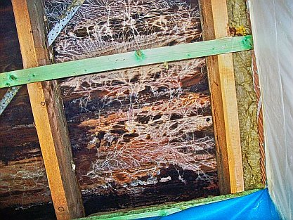 . 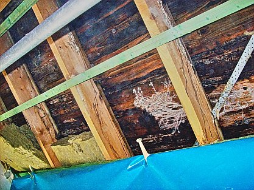 . 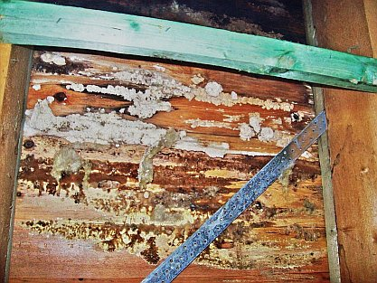 . 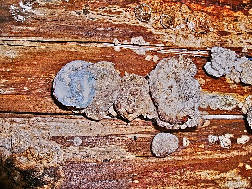 
Durch Umkehrdiffusion/Sommerkondensat, Eigenfeuchte, Winterkondensat und Taupunktunterschreitung aufgenässte, abgesoffene, vermorschte und verpilzte Zwischensparrendämmung inklusive tragende Baukosntruktion - Sparren und Dachschalung, Dampfsperre und Innenverkleidung. Dieser Horror zeigte sich im Raum und an der Fassade an leichten Nässespuren ... Das Ergebnis des Bauschadensprozesses gegen den Planer können Sie sich bestimmt ausmalen (Bildquelle: [Stefan Zwiener, Paderborn](http://www.isotec-owl.de)). 

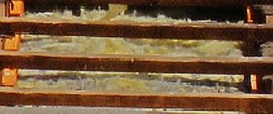 
Mineralwolle als Zwischensparrendämmung: typische grau-schwarze Durchpilzung wegen Taupunktunterschreitung, Kondensataufnahme und Aufnässung (Bild: Beratungskunde) 

Mein Kostenlos-Tipp: Gucken Sie vor dem Ablauf der Gewährleistung in Ihre Zwischensparrendämmung und hinter Ihr WDVS und vergessen Sie nicht, dort die Feuchte zu messen ...

Einer SSB-Seminarankündigung ist zu entnehmen:

_"Die Schimmelpilzbildung in Wohnungen und Kellern ist Streitgegenstand vieler Gerichtsverfahren. Man gewinnt den Eindruck, daß die Gefahr der Schimmelpilzbildung mit der Verbesserung des Wärmeschutzes eines Gebäudes durch zusätzliche Dämmmaßnahmen oder neue Fenster zunimmt. [...]"_(Bautechnik-Seminar Köln-Erfurt-Berlin-Neu-Ulm, SSB Spezial Seminare Bau, Ein Seminar mit Dr.-Ing. Dieter Scholz: Schimmelpilze und kein Ende?, Ankündigung vom 26.7.1999) 
Natürlich muß man die oft anzutreffenden Interpretationen vom "mangelhaften Lüftungsverhalten des Nutzers" immer überlesen - das ist entweder den gegen die Nutzerinteressen eingestellten Auftraggebern (Vermieter, Verarbeiter, Produzenten vom Fenster bis zur Fassadenbeschichtung) oder allgemein verbreitetem Schwachverstand geschuldet. 

Zu empfehlen ist auch das Prospektmaterial der Produkthersteller für WDVS-Sanierung oder das Getrommel für angeblich [schmutz- und wasserabweisende aber trocknungsblockierende Kunststoffanstriche](2lotus.md) gegen die gewohnte Verschimmelung der WDVS-Oberflächen. Da gehen einem die Augen über. Nach der Lektüre verzichtet man vielleicht lieber auf derart leichte Bauweisen und darf dann wieder über Massivkonstruktionen aus Stein bzw. Vollholz nachdenken. Darin verrecken die Bewohner höchstens an Altersschwäche und nicht an Schimmelpilz und Asthma. Waren denn unsere alten Baumeister alles Volldeppen, nur weil sie praktischer Erfahrung vertrauten? Na also!

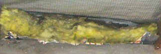 
Ein trauriger Blick in die vor einigen Jahren "energetisch optimierte" Zwischensparrensituation von oben - aus dem Spitzboden: Wegen turnusmäßiger Durchnässung teils grauschwarz angeschimmelte Zwischensparren-Dämmung unter sehr intelligenter Dachfolie (sog. DIN-gerechte diffusionsoffene Unterspannbahn). (Bildquelle: Beratungskunde, Bearbeitung KF) 

Das Geschäftsgebaren der Kunststoffindustrie geht aus folgender Meldung des Obermain-Tagblatts vom 12.11.1999 recht anschaulich hervor:

_"**BASF:** Hohe Strafen für illegale Preisabsprachen werden die 99er Bilanz des Chemiekonzerns BASF, Ludwigshafen, schwer belasten. Rückstellungen für Schadensersatzklagen von 535,08 Mio. DM prägten bereits das dritte Quartal. Der Gewinn vor Steuern lag mit 568,4 Mio. DM um 62 Prozent unter Vorjahresniveau. Der Umsatz wurde um 12,2 Prozent auf 14,21 Mrd. DM gesteigert."_ 

Wohin die Reise für den Verbraucher geht, ist dem Journal Energie im STERN 46/2000, S. 164 ff. nachzulesen - Auszüge: 

**_"Dämmen wir uns krank?_** 
**_Wärme-Isolierung spart Heizkosten, lässt aber häufig Schimmelpilze wuchern. Der stern testete drei Wohnungen._**

_Modergeruch schon an der Haustür des Lübecker Klinkerhauses. Penetrant verstärkt er sich im Schlafzimmer von Dietmar Nieschalk. Auf einer Fläche von zwei Quadratmetern haben dort Schimmelpilze die Tapete schwarz verfärbt und zum Teil völlig zerfressen. "Ein starkes Stück", entfährt es Klaus Senkpiel."_

Klaus Senkpiel ist ein Biochemiker vom Institut für Medizinische Mikrobiologie und Hygiene der Uni Lübeck. Er und sein Mitarbeiter Dirk Sassenberg bekamen den Auftrag der stern-Redaktion, die Zusammenhänge zwischen Wärmedämmung, Wohnklima und die Schadstoffbelastung der Raumluft an den folgenden Beispielen zu untersuchen. 

_In drei Domizilen haben (die Gutachter) Drägerpumpe_ [KF: zur Messung der Luftbelastung bzw. Schadstoffbelastung / Verunreinigung der Luft]_, Luftkeimsammler und Infrarot-Thermometer aufgestellt. Fazit bei Dietmar Nieschalk: "Die Wohnung ist unbewohnbar", sagen die Hygieniker. Die Verunreinigung mit Schimmelsporen: 3325 "koloniebildende Einheiten" (KBE) in einem Kubikmeter Luft. Ab 100 KBE gilt die Atemluft als "belastet"._

Der stern klärt auf, wie es dazu kam: Kurz nachdem die alten Fenster (Baujahr 1969) gegen _"Kunststoffrahmen mit Isolierverglasung"_ und selbstverständlich hermetisch bzw. luftdicht abschottender Lippendichtung ausgetauscht waren (als mietrechtliche "Modernisierung" immer auf Kosten des Mieters!), ging es los: 

_"Bald darauf tauchten die ersten Flecken auf. Nieschalk wurde krank und dreimal in der Klinik behandelt, ohne dass die Ärzte die Symptome erklären konnten. Erst als seine Tochter ihm ein anderes Zimmer zum Schlafen hergerichtet hatte, ging es ihm besser."_

Heutzutage sind der Umweltmedizin die bösen Folgen des Einatmens von Schimmelsporen klar: Allerlei allergische Reaktionen / Allergien und sonstige Krankheiten wie: Bronchitis, Asthma, Haut-und Augenreizungen, chronische Erschöpfungszustände, Leber- und Nierenschäden. Gerade für Kinder/Kids und alte Menschen/Senioren können Mykotoxine (Stoffwechselprodukte der Schimmelpilze) lebensgefährlich werden: 

_"Im amerikanischen Cleveland starben neun Kinder an Lungenblutungen, weil die Häuser, in denen sie lebten, nach Überflutungen vom extrem giftigen Pilz Stachybotrys atra_ [KF: auch "Stachybotrys chartarum"]_befallen waren."_ (Zwei Quellen dazu: [Toxic Effects of Indoor Molds (RE9736)](http://www.aehf.com/articles/APMmold.htm), [Infant Pulmonary Hemorrhage in a Suburban Home with Water Damage and Mold ](http://www.ehponline.org/members/1999/107p927-930flappan/flappan-full.html))

Früher hatten die Häuser regelmäßig durch ihre intelligente Bauweise mit etwas fugendurchlässigen Fenstern ausreichend Luftaustausch, was den Schimmelpilzbefall nahezu sicher ausschloß. Doch die Lobbyisten setzten in der Wärmeschutzverordnung von 1995 als nahezu Gesetz durch, daß im Neubau winddurchlässige Bauteile als Baumangel gelten und entsprechend Schadensersatzansprüche auslösen können. Obendrein konnten die alten Fenster als Sollkondensator die überschüssige Raumluftfeuchte / Luftfeuchtigkeit abkondensieren. Damit blieb der Bau selbst immer trocken. 

Die Isolierscheiben der modernen Fenster können das eher nicht. Folglich bildet sich Schimmel in den vom Heizluftstrom ausgesparten Zimmerecken und Wandkanten zum Boden - oft lange Zeit unbemerkt hinter Möbeln, Tapeten und Wandverkleidungen. Ist dann der Feuchtegehalt ausreichend, braucht es nur wenige Tage, um aus den überall vorhandenen Schimmelsporen echten Schimmelbefall auskeimen zu lassen. Die Bau- und Möbelstoffe sind meist ideale Brutböden für den Schimmel: 

Ihre organischen (natürlichen und synthetischen Ursprungs) Bestandteile dienen dem Schimmel als hervorragende Nahrungsquelle. Bauchemie in Farben, Anstrichen, Putz, Beschichtungen, Tapeten, Bodenbelag, Dämmstoffen usw. heißt eben auch Schimmelbrutstätte, nicht nur sonstiger Schadstoffgehalt (nachzulesen bei Ökotest). Das tödliche Risiko für die im eigenen Mief erstickenden und verschimmelnden Hausnutzer gehen die davon profitierenden Lobbyisten und deren Anhänger in der politischen Administration erfahrungsgemäß ohne jegliche Bedenken ein. Mir liegt eine Unzahl von leichtfertig abgekanzelten Beschwerdeschreiben des Hamburger Schimmelsachverständigen Rolf Köneke an die Politik bis auf EU-Ebene vor, die das belegen.

_"Die zweite Wohnung, die Senkpiel und Sassenberg ... besuchten, ist ein Plattenbau im Schweriner Vorort Lankow, eingehüllt in eine neun Zentimeter dicke Wärmedämmschicht. Seit der "Sanierung" klagt die Bewohnerin Brigitte Sieverkropp über Atembeschwerden und trockenen Schnupfen. Dass der Bau dicht ist, kann man sofort spüren. Die Luft ist stickig; obwohl die Heizkörper kalt sind, herrschen fast 20 Grad Raumtemperatur._

_... die Umwelthygieniker (durchstreifen detektivisch) die 42-Quadratmeter-Wohnung, messen in allen Ecken, (entnehmen dem) Staubsaugerbeutel ... Proben ..., und kraxeln schließlich auf den Dachboden. "Das müssen Sie sehen", ... Senkpiel hält einen Haufen Krümel in der Hand: die gehäckselten Reste der Wärmedämmung, die offenbar die Handwerker nach der Sanierung flächendeckend auf der obersten Geschossdecke des Plattenbaus verteilt haben. "Das rieselt durch die feinste Fuge, wird bei jedem kräftigen Windstoß durch die Lüftung nach draußen geblasen und durchs geöffnete Fenster in die Wohnung." (Nach den folgenden Laboruntersuchungen / Laboranalysen ist die) Mineralwolle ... mit Schimmel belastet. ... Schlafzimmerluft 727 KBE Schimmelsporen pro Kubikmeter Luft. Fazit: Auch ein ansehnlich erneuertes Gebäude kann zum Gesundheitsrisiko werden._

_Was also könnte passieren, wenn jetzt die Bundesregierung als Gegengift zu Ökosteuer und Energiepreisschock ein neues Programm zur Förderung von Wärmedämmung auflegt? 400 Millionen Mark jährlich sollen in dieses Altbausanierungsprogramm fließen - zusätzlich zu bereits existierenden Fördermaßnahmen der Kreditanstalt für Wiederaufbau?_

_Dämmen wir uns krank? Belasten wir, staatlich gefördert, unser Wohnklima, um das Weltklima zu schonen? .._

_... Familie Vogt-Zembol, mit ihrem sechs Jahre alten Niedrigenergiehaus in Hamburg (als dritte Station der stern-Untersuchung) ... ist vorbildlich in Sachen Energieverbrauch. Kosten für Heizung und warmes Wasser bei 125 qm Wohnfläche: nicht mehr als 57 Mark._

_Doch auch hier ... im Wohnzimmer ... erhöhte Konzentration von Schimmelpilzen: 747 KBE pro Kubikmeter, gemessen, nachdem die Lüftung mehrere Stunden abgeschaltet war. Die Sporen können aus dem Erdreich unter dem nicht unterkellerten Haus stammen oder - da haben wir sie wieder - aus der Wärmedämmung. Die ist, ökologisch korrekt, aus Zellulose und laut Hersteller gegen Schimmel imprägniert. Hilft aber nicht immer, sagt Senkpiel. "Wir haben nach Feuchteschäden bei Zellulosedämmung häufiger Schimmelbefall gemessen." ... SVEN RHODE, Mitarbeit: Ingrid Lorbach"_

Solche Tatsachen halten aber unsere edlen Medienschaffenden nicht ab, die grausamsten Schönrednereien der wirkungslos mit Pestiziden, Fungiziden und sonstigen Giften "vergüteten" "Öko-Dämmstoffe" redaktionell und ohne Kenntlichmachung als industrielle Werbepropaganda und der Autorenschaft zu bewerben und damit den geneigten, gutgläubigen Blättla-Leser in die heimtückische Ökofalle zu locken. Am 16.2.2005 schreibt dazu die Neue Presse Coburg auf Seite 4 seiner Beilage _"Umbau-Ausbau-Modernisierung" in "Öko-Dämmstoffe im Überblick": "... Auch hinsichtlich der Brandsicherheit sowie der Widerstandsfähigkeit gegenüber Schädlingen und Schimmel gibt es [bei natürlichen Dämmstoffen] keine Probleme"._ Ja hei - wieviel zellschädigendes Gift müssen die Hersteller aber dafür reintun? Oder liefert das Dämmschaf und die Dämmpflanze dank vergifteter Nahrungsquellen die Toxizität gleich mit? Gebt ehrlich Auskunft, liebe Ökoapostel der Öko-Industrie! Bitte, bitte!

Dazu ein Beispiel: Der Schimmelpilz breitet sich ja besonders gerne aus in angeblich dauerhaft luftdicht versiegelten Leichtbaukonstruktionen, die in "luftdichten" Niedrigenergiehäusern und Passivhäusern inzwischen DIN-Standard sind. Was meint die aktuelle Bauforschung dazu? Bitteschön: 

1. _"Qualitätssicherung klebebasierter Verbindungstechnik für Luftdichtheitsschichten, Dipl.-Ing. Guido Hagel, Referat II 2 - Forschung im Bauwesen, Energieeinsparung, Klimaschutz, GAEB, Bundesamt für Bauwesen und Raumordnung (BBR) 

Untersuchung und Kennzeichnung von Klebebverbindungen für Luftdichtheitsschichten 
- Neuer Bericht aus der Bauforschungsförderung des Bundes - 
Die Ausführung von Stößen, Überlappungen und Anschlüssen von Luftdichtheitsschichten mit Klebebändern muss dauerhaft gewährleistet sein. Dauerhaftigkeit beschreibt im Bauwesen einen Zeitraum von bis zu 50 Jahren. Die DIN 4108-7 enthält für Verklebungen von Bahnen untereinander bzw. für Anschlüsse (z.B. Folie an Mauerwerk) eine Vielzahl von Konstruktionsempfehlungen auf der Basis moderner Klebebänder und -massen, welche auch ohne mechanische Sicherung auskommen sollen. Diese Konstruktionsempfehlungen können derzeit auf Grund fehlender Vergleichsmöglichkeiten kaum als gesicherter Stand der Technik erachtet werden."_ (Zitat aus Pressemitteilung) und 

2. _"Forschung zur Dauerhaftigkeit von Klebeverbindungen 

Es herrscht in der Fachwelt vielfach die Meinung vor, dass Klebeverbindungen auf ewig halten. Zur Dauerhaftigkeit von Klebeverbindungen wurde im Rahmen der Bauforschungsförderung ein interessantes Projekt erstellt ... 
Ein Ergebnis der hier vorgestellten Untersuchung ist, dass die Klebebänder von sehr unterschiedlicher Qualität sind. 

Interessant ist auch, dass der Forscher (Autor ist Dipl.-Ing. Gross, ZUB-Kassel) festgestellt hat, dass die üblichen Folienmaterialien (Dampfbremsen, -sperren) sehr geringe Oberflächenspannungen aufweisen. Die Dauerhaftigkeit von Klebeverbindungen kann bei der Wahl eines ungeeigneten Fabrikats nicht gewährleistet werden. Zudem schwanken die Oberflächenspannungen in der Fläche sehr stark. ..."_ 
(aus Trauernichts Luftdicht-News Nr. 48). Also: Durchfeuchtung und Schimmel in Klebebuden und Dichtsparhäusern bitte immer nach DIN garantieren. Das hilft. Weitere Infolinks: 
[Untersuchungen zur Dauerhaftigkeit von Verbindungen und Anschlüssen bei Luftdichtheitsschichten mittels Klebemassen und Klebebändern](http://onlinelibrary.wiley.com/doi/10.1002/bapi.200810035/abstract;jsessionid=6B7B4ACC7B38BBC55FD5247AFF1004F7.f04t03) 
[FLiB e.V. / Kongress-Nachbericht - Klebeverbindungen von Luftdichtheitsschichten am Bau](http://www.openpr.de/drucken/257529/FLiB-e-V-Kongress-Nachbericht-Klebeverbindungen-von-Luftdichtheitsschichten-am-Bau.html) 
[Basteln verboten!](http://www.ddh.de/basteln-verboten/150/20702/) - Fachautor Johannes Messer zum alltäglich verklebten Irrsinn in deutschen Dächern 

Wie ist es zu bewerten, wenn sogar Denkmalpfleger in Fachartikeln so zum _"Richtig Dämmen am Denkmal"_ aufrufen, wie der ansonsten gegen den Dämmwahn engagierte Prof. Dr.-Ing. Jörg Schulze, Beratender Architekt für Altbausanierung und Denkmalpflege, Bonn, in Bauhandwerk 10/2004, S. 44 ff.?:

_"Fest steht ..., daß die Wirkung von Dämmstoffen mit steigender Materialstärke stark abnimmt. Baufachleute, die das Nachrechnen der Wirtschaftlichkeit dicker Dämmstoffpakete für unnötig halten, weil sie im Rahmen der Vorgaben einer Verordnung agieren, seien daran erinnert, dass insbesondere die Architekten und Ingenieure durch ihre Berufsordnungen verpflichtet sind, wirtschaftlich zu planen. Außerdem lassen sich mit 4 bis 6 cm Dämmstoff bereits Werte erzielen, die eine erhebliche wärmetechnische Verbesserung darstellen. ..._

_Man kann ... festhalten, dass wärmetechnische Verbesserungen historischer Bauten nur dann energetisch sinnvoll und wirtschaftlich sind, wenn die Wärmedurchgangskoeffizienten der vorhandenen Außenhülle wirklich schlecht sind, das heisst einen U-Wert von 1,0 W/m²K erheblich übersteigen. ..._

_Historische Bauten mit dünnen Massivwänden, wie beispielsweise Fachwerkbauten und Siedlungsbauten der 1950er Jahre mit nur 24 cm dickem Ziegelmauerwerk bedürfen allerdings wirklich einer nachträglichen Dämmung [um] zu gewährleisten, dass in ihnen ein behagliches Wohnklima und damit eine Nutzung ermöglicht wird, ohne die in einem gesättigten Wohnungsmarkt eine langfristige Erhaltung überhaupt nicht mehr denkbar wäre. ... Zusammenfassend kann man sagen, dass eine Dämmung die inneren Oberflächentemperaturen in der Fläche weiter anhebt. Die schon vor der Dämmung eher geringe Gefahr von Oberflächenkondensat wird hier also weiter reduziert. ..."_

Die dann folgenden Tipps bis zur Innenvorsatzschale von _"Kalziumsilikatplatten oder Leichtlehm"_ bis zur _"halbsteinigen Ziegelmauer"_ oder _"Schicht aus aufrecht vermauerten Ziegeln"_ sollen dann die Innenwandtemperatur bei minus 10 °C auf _"16 bis 17 °C"_ anheben.

Hier muß leider (Pardon, verehrter Herr [Prof. Schulze](8schulze.md)) eingewendet werden, daß nachträglich angebrachte Dämmstoffe auch mit 4-6 cm gegen den an der Außenwand maßgeblichen Durchtransport von Wärmeenergie in Strahlungsform keinerlei sinnvollen Beitrag leisten können (vgl. [GEWOS-Studie](7wdvs05.md#gewos), [Lichtenfelser Experiment](2139bau.md) \+ [weitere meßtechnische Dämmversagens-Nachweise](7fehrtab.md)), insofern total piepsegal aus energetischer Sicht sind. Und auch die Innenwandtemperatur ist selbst bei tiefen Außentemperaturen bestimmt nicht durch Dämmstoff sinnvoll zu beeinflussen. Das können IR-Messungen der Oberflächentemperaturen nachweisen. Die bewußt dämmstoffvermarktungsfreundlichen Normannahmen beziehen sich auf energetisch eher irrelevante Lufttemperaturen innen und außen! Bitte die Wandoberflächentemperaturen messen und nicht rechnen! Will sagen: Dämmen mit U-Wertigen Schäumen und Gespinsten ist _immer_ Schnulli-Baupfusch mit Super-Geldwegwerfeffekt, auch bei Armeleutebauwerken der Nachkriegszeit. Und die blödsinnige Verpamperei von Leichtstrohlehm wird sich niemals durch Energieeinsparungen gegenrechnen können, es ist nur eine weitere Hereinlegerei des geizversparten Kunden mit grundsätzlich falscher U-Wert-Rechnerei und gefährdet die künftige und immer wichtige Austrocknung der bewitterten Fachwerkkonstruktion in der Heizperiode. Leider machen hier viele "Altbauexperten" gerne mit und erhöhen damit Umsätze, Baukosten und Honorare. 

Wobei die Kalziumsilikatplatten / Calciumsilikatplatten / Kalziumsilikat-Platten / Calciumsilikat-Platten / Kalzium-Silikat-Platte / Calcium-Silikat-Platte / Calcium-Silikatplatte / Calzium-Silikat-Platte / Kalzium-Silikatplatte / Kalcium-Silicat-Platte / Wohnklima-Platten / CaSi-Platte / KaSi-Platten / CalSi-Platte / KalSi-Platten / Schimmelsanierplatte / Calciumsilikat-Dämmplatte und wie sie sonst noch im Handel bezeichnet werden mögen, nicht nur als Innendämmung aus energetischen Gründen zur hochpreisigen Geheimwaffe hochgejubelt und mit allerlei netten Eigenschaftsmerkmalen dem ahnungslosen Kunden überzeugend dargeboten werden - nein, auch als Heilmittel gegen feuchte Wände soll die Kalksandplatte wahre Wunder bewirken. Na freilich mag damit eine zunächst trockenere Wandoberfläche hergestellt werden. Unendlich viele jeweils zu ihrer Zeit allerschlaueste Vorgängerkonstruktionen der Wandkaschierung vor feuchmürben Putzflächen und Kellerwänden belegen das seit Jahrhunderten. Was jedoch im Untergrund passiert, in dem hygroskopisch wirksame Schadsalze immer weiter Kondensat ziehen und anreichern, was damit gegen die am Fundament anstauende Nässe erreicht werden soll, bleibt m.E. mehr als fraglich. 

OK, die Verdunstungseigenschaften des CS-Platte / KS-Platte für sich genommen mag schon gut sein, sie wird mangels dafür geeignetem Porengefüge jedoch wohl nur kaum zur Austrocknung des Porenwassers aus dem feuchterückhaltenden und - ohne Abstellen der Feuchtequellen - feuchteanreichernden Untergrund beitragen. Diesbezügliche Praxisbelege liegen mir jedenfalls nicht vor. Fragen Sie selber nach! 

Freilich verspricht die Produktwerbung für die raumseitige Wärmedämmung mit Calciumsilikat-Dämmplatten "außerordentlich günstige bauphysikalische Eigenschaften" wie "gute Dämmwirkung", "niedrige Wärmeleitfähigkeit", "hohe Kapillarität", beste "Feuchtespeicherung im Bereich von 40-80 Prozent relative Luftfeuchte", "hohe Alkalität als zusützlicher Widerstand gegen Schimmelpilzbefall". Die CS-Platten sollen nun in den Wintermonaten das anfallende Kondensat, Folge des Dampfdruck- und Temperaturgefälles und der Überschreitung des temperaturabhängigen Sättigungsdampfdrucks durch den Wasserdampfdruck im Bauteil sicher und schimmelvermeidend aufnehmen. Wieso? Weil das Wirkprinzip der CS-Platte bei Kondensatanfall einen starken kapillaren Flüssigkeitstransport garantieren soll und dadurch schnell zu einer großen räumlichen Verteilung des Kondensats in der Platte führt und damit zu einer Reduktion bzw. Verminderung der lokalen Tauwasserbelastung. Versprochenes Resultat: Feuchteschäden wie Schimmelpilzbildung, Materialkorrosion, sichtbare Wasserflecken und weiter feuchtebedingte Mängel wären so zu vermeiden. 

Ja aber: Wie sieht es jeweils mit der Ablüftung der Raumluftfeuchte, egal woher, aus? Fragen über Fragen. Hier eine Antwort, die die Kalziumsilikatplatte selbst geliefert hat ([Bild: Flickr-Album von Edi Bromm](http://www.flickr.com/photos/11672694@N08/sets/72157601498882984/)):  Die Wandflächen wurden mit Kalziumsilikatplatten verkleidet - und prompt wächst der Schimmelpilzbefall eben darauf. Mehr Info zum Feuchtethema hier: ["Aufsteigende Feuchte - gibt es die?"](2aufstfe.md). 

Doch nun zurück zum falschen Dämmen. 

Zumindest die Denkmalpflege sollte den Dämmfans auch hier keinen kleinen Finger reichen. Auch nicht, wenn sogar ein noch im Amt befindlicher "Leiter Bau- und Kunstdenkmalpflege im Landschaftsverband Rheinland beim Rheinischen Amt für Denkmalpflege", Herr Dr. Ludger J. Sutthoff im DAB 9/04 in: _"Wärmedämmung am Baudenkmal, Empfehlungen der Denkmalpflege"_ neben sehr viel beherzigungswerten Ermahnungen und Hinweisen zu Gefahren durch Dämmen leider auch schreibt:

_"Ein bewährtes Mittel zur Wärme- und Schallschutzverbesserung einfach verglaster Fenster ist das Aufrüsten zu Kastenfenstern."_ 

Betr. Schallschutz ja, betr. Wärmeschutz nein, da: 1. geringerer Energiegewinn dank schlechterem Solardurchlaßgrad; 2. höherer Energieverbrauch dank höherer Raumluftfeuchte, die ja nun dank innerem Vorsatzfenster nicht mehr so einfach an der Außenscheibe als Sollkondensat gebändigt und vermindert wird. Fazit: Der Heizenergieverbrauch, aber auch das Durchfeuchtungs- und Befallsrisiko mit Hausschwamm, Holzinsekten und gefährlichen Pilzen steigt! Schlecht für Denkmal und -besitzer. Weiter Denkmalpfleger Dr. Sutthoff: 

_"Eine sinnvolle Lösung stellt hier die Innendämmung von Baudenkmälern mittels Kalziumsilikatplatten (bestehend aus Kalk und Kieselsäure, d. i. Wasser und Quarz) oder Dämmplatten auf Papierbasis dar. Diese Baustoffe bleiben diffusionsoffen und zeigen daher keine dampfbremsende Wirkung."_ 

Nein, solche "Lösungen" werden auch nicht sinnvoll, wenn erklärt wird, daß Papier eigentlich Zellulose vom freiwachsenden Bäumchen sein will. Und die Begriffsverwirrung ist total, wenn "diffusionsoffene" Baustoffe gefordert werden, wenn nur kapillare Feuchtetransportfähigkeit eine Rolle beim Feuchtetransport in Baustoffen wirklich eine Rolle spielt. Faktor Dampf- zu Flüssig-Transport ist nämlich 1:1000. Es genügt auch für Denkmalpflegeleiter nicht, nur die falsche Bauphysik nachzubeten, wenn das Denkmal gepflegt werden soll. Im DAB 12/04 erhält Herr Dr. Sutthoff dann auch einen Leserbrief des Kollegen Holger Schmidt, Stuttgart. Neben allerlei Propaganda für _"Raumseitig ... angemessen dichte Dampfsperre"_ erwidert Schmidt gleichwohl richtig (wenn auch ohne Hinweis auf die vielen gesundheitsschädlichen Schimmelschäden in der Zellulosedämmklumperei - trotz deren Borsäurevergiftung): 

_"Von der von Herrn Sutthoff angedeuteten Verwendung von Zellulosedämmung ("Dämmung auf Papierbasis"!?) ohne Dampfsperre kann nur abgeraten werden, da aufgrund der Diffusionsoffenheit einer solchen Konstruktion feuchte Raumluft bis zur bestehenden Außenwand gelangen kann und dort kondensiert._

_Die Zellulosedämmung nimmt dann diese Feuchtigkeit auf und sorgt dafür, dass z. B. bei einer Fachwerkaußenwand die Holzbalken so feucht liegen, daß sie innerhalb relativ kurzer Zeit großen Schaden nehmen. Mir sind nur wenige Fälle bekannt (v. a. mit nur sehr geringen Dämmstärken), in denen die von der Zellulosedämmung aufgenommene Feuchtigkeit auch wieder an den Raum abgegeben werden konnte."_

Daß auch eine Innendampfbremse über kurz oder lang in bewegungsfreudigen Skelettbauten und sowieso wegen unvermeidlichem Alterungsversagen der Dichtungsstöße Feuchtekondensation - dann aber konzentriert - in der Wandkonstruktion fördert, und allein die Eigenluft- und Materialfeuchte rund um die Dämmung genügt, um bei dort zwangsweise anfallender Taupunktunterschreitung erst Schimmel- und dann Schwammbefall zu begünstigen, muß auch Herr Kollege Schmidt noch lernen. 

Weiter mit Sutthoff: 

_"Die wenigsten Schäden entstehen [beim Dachausbau] immer noch bei der Anordnung der Dämmebene unter den Sparren - aber auch nur dann, wenn unnötige Eingriffe und Beschädigungen des Bestandes vermieden werden." 
_ 
Das mag ja betr. Schäden am Denkmal stimmen. Dennoch sollte ein kompetenter Dr. der Denkmalpflege wissen, daß normgerechtes (auf geringen U-Wert optimiertes!) Dämmen immer absoluter Blödsinn zumindest gegenüber dem Geldbeutel des Bauherrn und Denkmalbesitzers ist. Sogar mit Calcium-Silikatplatten. Und damit eben auch den langfristigen und kostenintensiven Erhalt des geliebten Denkmals schädigt. Diese Seite liefert dazu alle fachlich notwendigen Argumente und auch der in Denkmalpflegerkreisen eigentlich bekannt sein sollende kostenlose! [Band 67 Energieeinsparung bei Baudenkmälern des Deutschen Nationalkomitees für Denkmalschutz](8buch.md#baudenk) bringt alle Fakten. Bevor man die nicht kennt, sollte man lieber nicht solche Artikel verbreiten, die die Dämmmafia ins Fäustchen lachen läßt. 

Übrigens wäre ganz hilfreich und für Jedermann belehrend, mit einem lumpigen Infrarot-Thermometer mal auf die Pirsch zu gehen, und selber messen, wie kalt ein nachthimmel ist, welch irre Hitze auch eine Nordseite in Fassaden einspeist, wie dolle lang eine Massivfassade solch Hitze speichert und wie schnell ein Dämmfassädli eiseskalt vor sich hinbibbert, wenn der letzte Sonennstrahl den Himmel verlassen hat. Dann ist doch schnell klar, daß Dämmstoff gar nicht dämmen - aber super aufkondensieren kann. 

Und so sieht es dann ganz praktisch aus, wenn das staatliche hessische Bauamt im Regierungsgebäudedach zwischen den Sparren dämmen läßt. Dunkle Flecken auf dem Dümmstoff sind lebensgefährlicher Schwarzschimmelbefall, Drempelwandflecken sind soßige Ablaufspuren der unvermeidlichen Kondensate aus der Dämmung, die fleißig unter der hochintelligenten Dampffolie herabrinnen. Ein Bild aus meiner [Bauberatung](2berat.md). 

Auch dieses schwarzgelbe Geplunder - wegen Dauernässe verpilzte Mineralwolle als Dachdämmung im Deckenbereich zum Untergeschoß ist Ergebnis einer staatlichen Bauverwaltungsmaßnahme in einem bemerkenswerten süddeutschen Baudenkmal aus dem Mittelalter mit barockem Dach: 
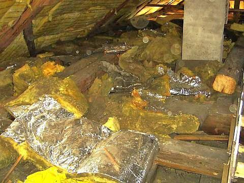 Im Detail: 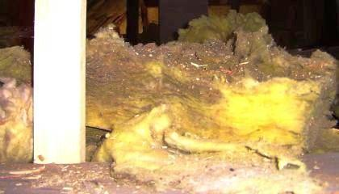  Und auch das im gleichen Dach vom Neubesitzer - gegen den Ratschlag der Denkmalpflege / des Denkmalamtes / der Denkmalschutzbehörde schon eingebaute Gespinst in der nicht unterlüfteten / hinterlüfteten Dachsparrenebene ist - genau dort, wo die Warmluft oben im Dachgiebelbereich anstreift - schon im Bauzustand durch Aufnahme von Raumluftkondensat angeschimmelt: 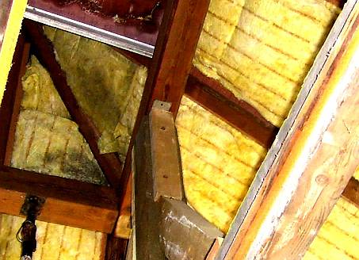 Man gönnt sich ja sonst nix. Es muß schon Vollsparrendämmung bzw. Sparrenvolldämmung oder gar Zwischensparrendämmung sein, wenn ein Dach mit Dämmstoffen vergewaltigt wird, bis der Dachbesitzer das Wort Wärmedämmung nicht mehr kennen mag. Und selbstverständlich ist die sicherste Lösung zum Durchnässen der Dachebene bzw. Dachkonstruktion, wenn man auf die Dachschalung eine hermetisch abgeklebte Dichtungsebene aufbringt, also Folie oder Bitumenbahn, und nicht im Eifer des Gefechts vergiß, auch die Unterseite der Dachebenen möglichst dicht zu versiegeln - am besten mit hoch-intelligenter Dampfbremse. Die tut so, als ob sie denken könne - schafft aber über kurz bzw. gar nicht so lang die allerbeste Aufnässung und Durchfeuchtung des Sparrenzwischenraumes. Und das gaaaanz sicher nicht nur im denkmalgeschützten Bauwerk! 

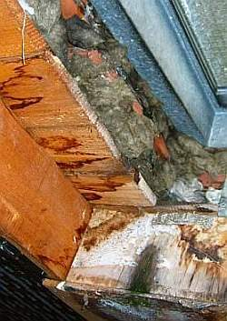 
Schwarzschimmel in der Mineralwolle / Steinwolle / Dachisolierung und Holzauffeuchtung am typischen Problempunkt: Dem Dachfenster 

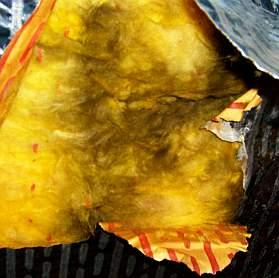 
Schimmelbefall in der Mineralwolldämmung auch hinter der Alukaschierung - an jeder Ritze und Fuge 

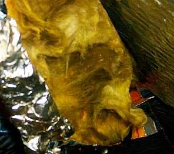 
Schimmelpilz in der Dachdämmung am nur schwerlich abzudichtenden Flächenübergang am First 

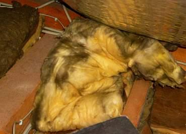 
Befall mit Schwarzschimmel selbstverständlich auch in der Deckendämmung über dem geheizten obersten Geschoß / verschimmelte Geschoßdecken-Dämmung 

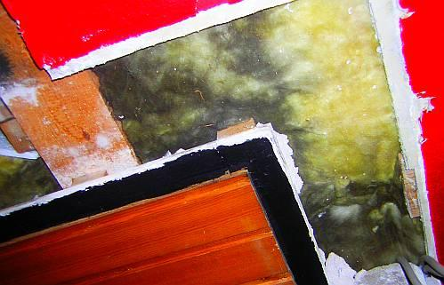 
Von unten betrachtet sieht das dann so aus: 
Schimmelpilz in der Mineralwolle / Glaswolldämmng der Zimmerdecke zum ungeheizten Dachboden II 

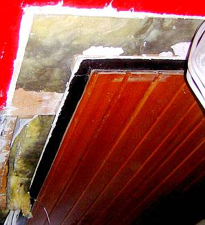 
Schimmelpilzbefall in der Deckendämmung von der anderen Seite III 

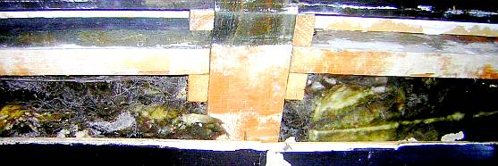 
Schwarzschimmelbefall und angeschimmelte Spinnweben in der Deckendämmung zum Spitzboden IV 

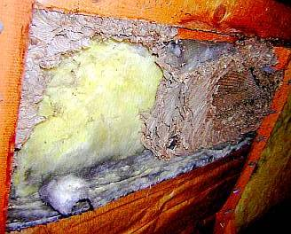 
Verschimmelte Deckendämmung/Mineralwolledämmung V - angereichert mit schimmelpilzbefallenem Wespennest! 

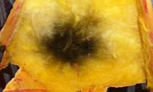 
Schimmelpest hinter einer nur punktförmigen Verletzung der alukaschierten Mineralwolldämmung / Dämmwolle in der Dachdämmung darüber 

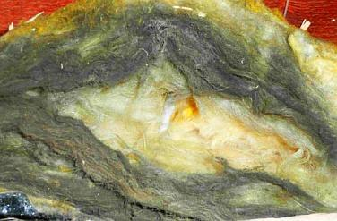  
Aus Beratungsfall: Pilzverseuchte Mineralwolldämmung als idealer Dämmstoff in der Zwischendecke zum Dachboden / Dachbodendämmung nach DIN-Norm, Energieeinsparverordnung EnEV und Klimaschutz-Vorschrift. Gut als Taschenfülleffekt für die Dämmstoffindustrie und den Verarbeiter, aber fördert das auch die Wohngesundheit? Und spart sowas Energie? Und sorgt für globale Abkühlung? 

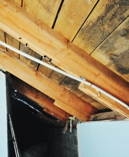 
Der neue Hausbesitzer packt die alukaschierte Muffeldämmung / Mineralwoll-Isolierung in der Abseite und den Dachgeschoßräumen aus, und was findet er? Selbstverständlich Schimmelpilzbefall auf der Holzschalung / Untersicht der Dachschalung hinter der Vollsparrendämmung. Das Bild zeigt den ausgepackten Zustand. Bild: Beratungskunde 

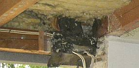 
Aus Beratungsfall Michael Kimmel: Pilzverseuchte Mineralwolldämmung als Zwischensparrendämmung im Pultdach. 

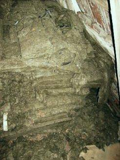 
Aus Beratungsfall: Verschimmelte Mineralwolle dank faserbindender Phenolformaldehyd-Kunstharz-Ausrüstung, einige Jahre auf offenem trockenem Dachboden deponiert. Das leistet Kondensat aus abkühlender Luft und sowas bauen Ihnen die Dämmferkel für teuer Geld frech in Ihr Haus! Mit versprochener Biolöslichkeit - Ähbäh! 

 
Schwarzschimmelpilz auf Weichholzfaserplatte als Dachdämmung / Innenisolierung 

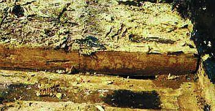 
Verrottete Mineralfaser-Dachdämmung 

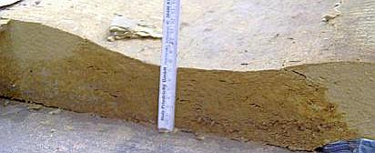 
Aufgefeuchtete nasse Mineralwollplatte in Dachdämmung 

[Weitere Dachdämmungsprobleme im Flachdach](212bau7.md) 

 Denn die Frage nach der Dauerdichtheit und noch viel dringlicher - wohin mit der im Jahreswechsel abzugebenden ausdunstenden Materialfeuchte, also die Eigenfeuchte der Dachbalken und Dachschalungen? - mag kein Folien-Verkäufer beantworten. Da wird folglich totgeschwiegen oder mindestens verharmlost. 

Daß die Kleberei und Presserei a la Empfehlung des Blower-door-Test /Blowerdoor-Messung-Ergebnis nur dazu führen kann und muß, im eigenen Mief zu ersticken und dabei die versiegelten Holzbauteile / Holzkonstruktionen feuchtnaß zu verrotten und vermorschen, sollte zumindest einigermaßen gelehrigen Baufachleuten schon lange klar sein. Denn wohin denn bitteschön mit den um die zehn und mehr Liter Nutzungsfeuchte, die eine vierköpfige Bewohnerschaft locker ausgast, zusätzlich zu der Eigenfeuchte des evtl. eingebauten Bauholzes, das nur selten unter 20 Prozent Materialfeuchte auf der modernen Baustelle erscheinen wird? Und dann im Jahresablauf durch Kondensateinlagerung und Abdunstung / Austrocknung (Holz lebt!) ständig schwankende Feuchtegehalte aufweist. 

Schwere Fragen - wo doch die Antwort für feuchtebeanspruchte Wand-, Decken- und Dachkonstruktionen so einfach wäre: 

Lieber keine Faserdämmung, keine Dämmflocken, keine Dämm-Schäume, die mangels Luftdichtheit über das unvermeidliche Raumluft-Kondensat immer nur Wasser einlagern - trotz Hydrophobie - und mangels Kapillaraktivität nie mehr rauslassen. Ach so - und selbstverständlich keine hermetischen Dichtungsfolien, weder oben drauf, noch von unten. Denn die sperren die Materialfeuchte zusätzlich mit ein, auch das Kondensat, das erst mit der Zeit dennoch reinkommt in den nassen Sandwich. Nicht zu reden vom Kondensat, das aus der von Anfang im lockeren Dämmstoff enthaltenen Eigenluft (damit wird doch dolle geworben, oder?) stammt. 

Und wer wirklich ein dichtes Dach und eine perfekt dämmende Wärmedämmung für den Dachausbau haben will: 

Nach alter Väter Sitte: Massiv und störungstolerant ent- und hinterlüftet - also keineswegs luftdicht versiegelt. 

Und hier noch eins der schön mißlungenen Beispiele:

Schwarzschimmelmäßig naß angesiffte und fachmännisch als Sparrenvolldämmung angetackerte alukaschierte Mineralfasergespinste nach Freilegung - so krank(machend) sieht es unter mehr und mehr deutschen Dächern aus! Weitere krasse Fälle [hier](7schim.md).

Doch Selberdenker Vorsicht! So schimmelvernäßt sieht es fallweise am Dachspitzla unter einer Holzdämmung" aus - es kommt also schon drauf an, was man draus macht:

Nochmals: BAU.DE > Forum > 1565: **[Tauwasser in der Zwischensparrendämmung](http://www.bau.de/forum/schaden/1565.htm)**

 Aus meinem Gästebuch zum Thema speicherfähige Dachdämmung aus Massivholz mit hervorragendster Temperaturamplitudendämpfung und Phasenverschiebung (Foto: M.H.)- Friday 07/15/2011 9:27:33am: 

Hallo Konrad, 

vielen Dank für Deine Unterstützung und Hilfestellung. 

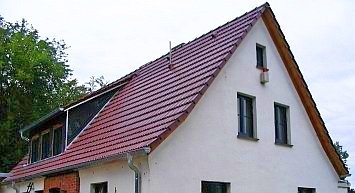 Habe unser Dach nach Konradscher Methode modifiziert und bin erstaunt über die Wirkung bei stärkster Sonneneinstrahlung. 

Haben nun ein absolut tolles Klima im OG und wenn die Fenster nun auch noch beschattet sind, dann ist es wahrscheinlich abends zu kühl :-))) 

Mit kühlem Dachgeschoss und freundlichem Gruße 

M.H. 

Wem's noch nicht langt:

Weiterführende [Information zum Wärmedämmen](7wdvs05.md#wã¤rmedã¤mmung).

****[www.renorga.de/verdaemmt/ - Verdämmt in alle Ewigkeit?](http://www.renorga.de/verdaemmt/) - Ein Hamburger Wohnungsbaudämmskandal

[Informationen](7waefe.md) des Bauphysikers und Architekten Prof. Dr.-Ing. habil Claus Meier, dem Schrecken des U-Werts, auch von ihm: 
[Einspruch gegen den Entwurf zur DIN 4108-2](7din4108.md) 
und: [gegen den Entwurf zur DIN 4108-3](7d41083.md) 

**RA Johannes Kirchmeier:** [Zur Verfassungswidrigkeit der Wärmeschutzverordnung](7enevver.md)

[NABU: LEITFADEN ÖKOLOGISCHE DÄMMSTOFFE](http://www.nabu.de/downloads/studien/leitfadendaemm.pdf) - wer unbedingt ökomäßig Dämmen will, kann sich hier informieren
