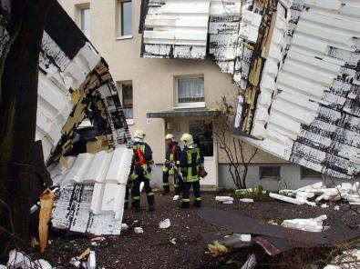
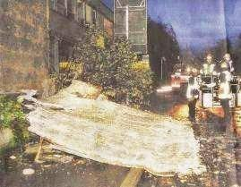
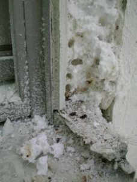
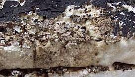
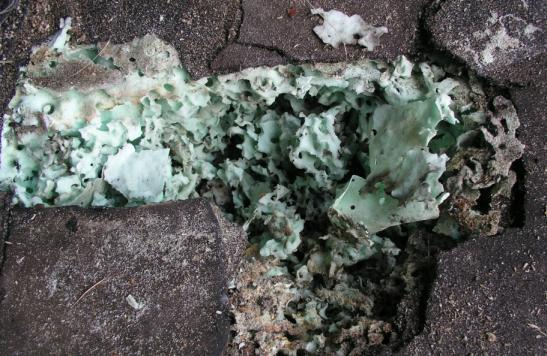
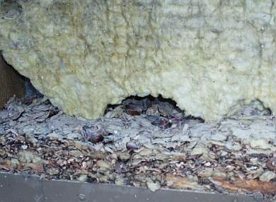
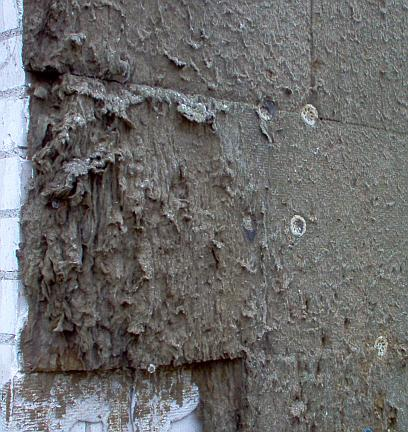
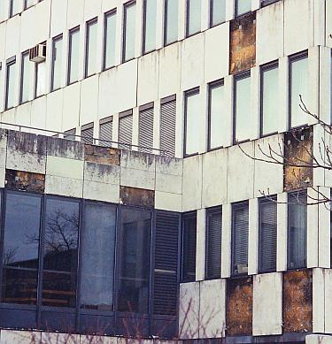
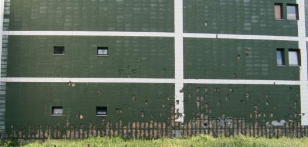
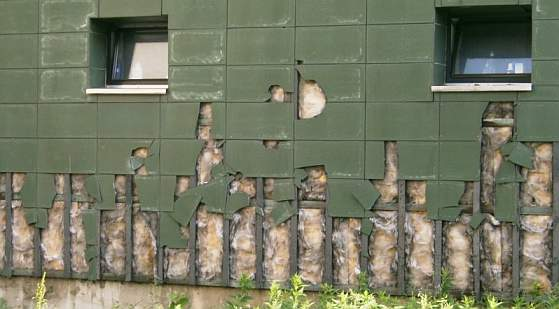

[🠔 Zur Übersicht: Dämmung](213baust.md)  
# Der Schwindel mit Dämmstoff, Wärmedämmung und Energiesparen 1
**Der Schwindel mit Wärmedämmung, Energiepass und Energieausweis wird entlarvt. Der Artikel beleuchtet Bauschäden, Wurmbefall und Absturz an Dämmfassaden sowie weitere Probleme von WDVS.**  
_von Konrad Fischer_

## Der Schwindel mit Dämmstoff, Wärmedämmung und Energiesparen 1

## Einstimmung:

Schadensfälle an Dämmfassaden 

Würmer bzw. Madenbefall, Absturz usw.

[Start und Einführung - zurück <- ](213baust.md) Kapitel [-> vor - 2. Zur Sache: Schimmel und Algen durch WDVS](2132bau.md) 

**[Das Handwerkerquiz](10hoai13.md)\+ [Das Planerquiz für schlaue Bauherrn](10hoai14.md)**

---

Zur Einstimmung:

 
**_Abbildung:_** Der Beginn der WDVS 1975. Mangelhafte Vorbehandlung des Untergrunds? Jedenfalls klappt die Chose herab und springt von der Wand. Danach kamen die WDVS-Dübel _(Bildzitat aus "Bauhandwerk mit Bausanierung 2/01, Foto: Helmut Pätzold 1975)_

 

Ein Polystyrol-Flugdach entwickelt bei Sturm auch eine gewisse Reiselust in den Vorgarten. 

 
Ein kleiner Sturm mit _"91 km/h"_ , das WDVS liegt auf der Straße. Sieht so die Zukunft aller WDVS aus? (Abb.: _"Vom Winde verweht: ein Teil einer Gebäudefassade stürzte auf die Maybachstraße"_ , Foto: Ulli Kraufmann in: Stuttgarter Nachrichten 20.11.04:_"Die Dämmplatten krachten gegen 6.45 Uhr auf den Gehweg und die Fahrbahn - glücklicherweise ohne jemanden zu verletzen",_ Scan _+_ Bildbearbeitung KF)

Unter dem Titel _"Sprengstoff bei Dämmstoff"_ schreibt Franz Artner im österreichischen Baureport 6/2004 zu den Dämmstoffheimlichkeiten:

_"Je dicker der Dämmstoff aufgebracht wird, desto mehr Augenmerk muss auf die Verarbeitung gelegt werden. Bausachverständige wissen davon ein Lied zu singen, auch wenn sie das eher selten in der Öffentlichkeit tun. Teilnehmern diverser Bauschadensfachseminare sind die Diabilder von sich lösenden Dämmungen aber bestens bekannt. [...] Gottlosen Gerüchten zufolge vergibt die Bauindustrie viele Arbeiten an billige Subunternehmer, mitunter auch an Maler. [...]."_ 
Wie die dann bei ihrer Spachtelei Verarbeitungsqualität liefern wollen - das weiß wirklich nur der liebe Gott allein. 

 
_**Abbildung:** Insektenbefall im WDVS. Nicht nur Spechte brüten bekanntermaßen schaumstoffverwöhnt - auch liebenswertesten Insekten, Maden, Würmern, Käfern und Ameisen bietet Polystyrol hier heimelig-feuchtwohligen Unterschlupf. Schlaraffenland für Madenfresser oder alles Öko? (Fotografiert von Edmund Bromm, München, beim Totalabriß des insektenverseuchten "Systems" auf dem Mehrgeschosser. Sein Kommentar: "Bilder aus dem 3 Stock!! Jetzt wird abgerissen. Und der Dreck ist gut verklebt und nicht zu trennen. Leider gehen auch alle Fenster und Elemente drauf. Diese Leute haben wenigstens viel Arbeit."_)

 
_**Abbildung:** Würmer / Insektenbefall / Fraßschäden im "normalen" Polystyrol XPS unter der Dachhaut!_

 
_**Abbildung:** Madenbefall / Insektenbefall auch im expandierten Polystyrol XPS unter der Dachhaut! Was mögen das nur für Viecherlein sein, die einen solchen Fraß reinstopfen. Wunder der Schöpfung!_

 

_**Abbildung:** Wir wollen hier keinesfalls einseitig den Dämmschaum verteufeln, deswegen: Nagetierbefall selbstverständlich auch in der durchfeuchteten und schimmelpilzverseuchten Mineralwolle an der Fassade. Wunder über Wunder? Vielleicht sogar Biber, die doch Feuchtbiotope zum Fressen gerne haben? Oder doch eher Eichhörnchen? Hamster? Waschbären? Maulwürfe?_ 

Verrückterweise macht im Herbst 2015 eine seltsame Meldung die Runde: [_"Forscher Züchten Würmer, die Plastikmüll in Kompost umwandeln"_](http://deutsche-wirtschafts-nachrichten.de/2015/10/05/forscher-zuechten-wuermer-die-plastikmuell-in-kompost-umwandeln/). Da kommt das vorlaute Forscherteam rund um den offenbar nicht nur schlitzäugigen, sondern auch schlitzohrigen Oberschlaumeier Wei-Min Wu aus den Unis Stanford (Kalifornien) und Beihang (Peking) aber wieder mal sehr zu spät, angesichts des in Deutschland schon lange auffindbaren Wurmbefalls in feuchtwarmen Styroporfassaden. Und ich vermute mal, daß da kein überlegenes Gentechnik-meets-Dämmstoff-Forscherteam der BASF Ludwigshafen dahintersteckt, sondern der liebe Gott in seiner bewunderungswürdigen Schöpferallmacht seine Hand im Spiel hatte. Zum Nachlesen auf Englisch: ["Science-News" aus Stanford](http://news.stanford.edu/news/2015/september/worms-digest-plastics-092915.html) und ["Worms Eating Styrofoam: All You Can Eat"](http://www.sciencealert.com/scientists-find-worms-can-safely-eat-the-plastic-in-our-garbage) 

 

_**Abbildung:** Es müssen aber nicht immer Nagetiere und Wurmparasiten sein, die dem feuchtesaugenden Dämmstoff den Garaus machen. Ich finde, auch Schimmelbefall bzw. voll abgesoffene Mineralfaserfilze sind nix Feines. Na ja, wenn es der auftraggeber so bestellt und zum bestimmungsgemäßen Gebrauch beauftragt hat - als höchsteffektiver Schimmelzucht-Nährboden. Wird ja wirklich immer schwerer, ungeliebte Mieter freizusetzen. So könnt's gehen._

 
_**Abbildung:** Schimmelfilzeplatten grüßen unter den herabgepurzelten Vorhangfassadenplatten. Modern-dekonstruktivistischer Öko-Baustil im "Green Building"*._

 
_**Abbildung:** Vollgeschimmelte Mineralfaserdämmung hinter angegammelter Eternitfassade. Ja, wir erinnern uns alle an die fahrenden Drückerkolonnen. Und die nächtliche Unterschreitung des Taupunkts geht eben an nicht wärmespeicherfähigen Leichtbau-Dämmstoffen nicht spurlos vorbei. Deshalb saufen sie sich jede Nacht mit Kondensat voll. Prosit! Die organische Verkleisterung der Mineralwolle ist natürlich der perfekte Fraß für Schwarzschimmelpilze. Guten Appetit auch! Der angefressene Bauherr läßt diese Sinfonie in Feucht, Restgelb und Schwarz gerade abbauen, um ersatzweise ein Polystyrol-WDVS anzubringen. Da darf man schon mal gespannt sein, was er sich danach ausdenkt. Bildquelle: [Maurermeister und Bausachverständiger Christoph Jaskulski](http://www.maurermeister-jaskulski.de/)_

 

 
_**Abbildungen:** Anfang vom Ende einer Wärmedämmung an einem Wohngebäude gegenüber dem Polizeikommissariat Nordstadt (Fotografiert von Dr. Ulrich Nolte, Frankfurt a. Main) alles inwendig feucht und grau beschimmelt - wie es kondensatsaufende Fasergespinste und Schäume so sehr lieben._

[Hier geht's weiter zu abgesoffenen Dämmstoffen am Flachdach](212bau7.md)

Mit seltsamen Märchen und Wundern wird begründet, Deutschland zu verpacken. _"Wärmedämmung mit Kunststoff ist Klimaschutz."_ wirbt [DIE KUNSTSTOFF-INDUSTRIE](http://www.gkv.de) ganzseitig in der Presse. Häuser sollen dadurch riesenhafte Energieeinsparungen haben. Auf schriftliche Anfragen nach Konkretisierung und Namhaftmachung der Wunderhäuser erfolgt - vornehmstes Schweigen. Gemäß bester aufklärerischer Tradition wollen Wunder hinterfragt werden. Hier die fraglichen Links: 

[Das Wunder der globalen Erwärmung](7wdvs03.md#wie mit manipuliert) 
[Das Wunder des gefährlichen CO2s](7wdvs03.md#verursacht die co2) 
[Das Wunder der versiegenden fossilen Energiequellen](8buch22.md#gold) 
[Das Wunder des Naturstroms im Solarzeitalter](7wdvs04.md#kritik: solar und wind#kritik: solar und wind)

Eigentlich noch schlimmer, was das inzwischen von einem gigantischen aufgedeckten Korruptionsfall erschütterte Bauministerium von sich gibt und seine "administrativen Ressourcen" (neues Tarnwort für heimtückische Mord- und Totschlagetechnik korrupter Pseudodemokratien) voll gegen den deutschen Bauherrn einsetzt, wie diesem Artikel der SZ vom 30.10.04 zu entnehmen ist: 

**_"Sanfter Druck vom Gesetzgeber_** 
_Bauminister hält an Energieeinsparziel für Gebäude fest. ..._

_.. Bundesregierung will an [...] Zielen [...] in Sachen Energieeinsparung im Gebäudebereich [...], unverändert festhalten. [...] Instrument [...] im Vordergrund [...] der[Energiepass für Gebäude](7wdvs02.md). Für Neubauten [...] schon mit der neuen Energieeinsparverordnung eingeführt._

_2006 macht dann eine „Europäische Richtlinie über die Gesamtenergieeffizienz von Gebäuden“ ihn auch für den Bestand zur Pflicht. Damit, so Minister Stolpe, werde eine wichtige Initialzündung für zusätzliche Einsparbemühungen gegeben._

_[...] Wohnungswirtschaft [...] Befürchtungen [...] zu hohen Kostenbelastungen [...] hält man im Bauministerium nicht für begründet und will ihnen [...] mit verstärkter Aufklärung begegnen._

Steigende Energiepreise [...] zunehmende Wetterkatastrophen [...] hohe Arbeitslosigkeit [...] große Herausforderungen. [...] nur wenige Aufgabenfelder, auf denen man diese Probleme gleichzeitig angehen könne.

Die energetische Modernisierung des Gebäudebestandes gehöre dazu. [...]

Klaus-W. Körner von der „Energiepass-Initiative Deutschland“ und Präsident des Gesamtverbandes der deutschen Dämmstoffindustrie zeigt sich überzeugt, dass es gelingen wird, verschiedentlich noch bestehende Vorurteile und Bedenken auszuräumen und dies bevor die neue EU-Richtlinie ab 2006 den [Energiepass](7wdvs02.md) dann bei jedem Besitzer- und Mieterwechsel einer Immobilie verbindlich macht.

Aufklärung heißt deshalb die Devise. [...]

[...] zwei Möglichkeiten zur Erstellung einer Energiekennzahl. [...] [verbrauchsgestützter Energiepass](7wdvs02.md) [...] misst [...] Energieverbrauch, [...] vom Nutzungsverhalten beeinflusst [...] 

[...] der [bedarfsgestützte Energiepass](7wdvs02.md) [...] Energiebedarf beschreibt. [...] Energiemenge, die aufgrund von Gebäudeform, Himmelsrichtung, Bau- und Anlagentechnik bei normierten, meteorologischen Randbedingungen ermittelt wird. Damit steht nicht der tatsächliche Verbrauch zur Debatte, der von Wetter und Nutzer unterschiedlich beeinflusst wird, sondern der Bedarf, der auf exakten architektonischen wie bau- und anlagetechnischen Kriterien basiert. H.-K. v. Schönfels" 

Das kommentiert sich eigentlich schon selbst, dennoch: Wie beurteilen wir Bürger die katastrophenangstbedienenden Ziele unserer Regierung? Eben, exaktemo! Und wenn die Regierung "Aufklärung" heuchelt, kann etwas anderes herauskommen als noch mehr ges. gesch. ermordete Kinder? 

Total unprofessionell aber, ausgerechnet einen Dämmstofffritzen zum Heuchel-Initiativen-Präsidenten zu machen. Wahrscheinlich fühlt der Große Bruder sich schon so sicher, daß nicht einmal sowas noch seiner Sache schaden kann? 

Hübsch, wie die gegen alle fachlichen Einwände immer weiter entwickelten Rechentricks fernab jeglicher wahren Verbrauchswerte als "exakte Kriterien" hochstilisiert werden. Ist das SZ-Folklore, wo ein Dr. Illinger auf seiner "Wissenschaftsseite" jedes mal wieder die Welt dank Menschenmache hoppsgehen läßt, mag die Klimaschwindel sonst überall noch so sehr als grober Fake entlarvt sein?

Und nur wenige Tage später steigert die SZ am 5.11. ihren mephistophelischen Trommelwirbel für den Energiepaßschwindel - im allermiesesten Stil der Volksverhöhnung: 

_"Neue Gretchenfrage: Wie hälts du´s mit der Energie?_ 
_Die Eigentümerverbände laufen Sturm, doch der[Gebäudeenergiepass](7wdvs02.md) wird kommen. Und sinnvoll ist er eigentlich auch_

_Von Miriam Beul_

Im Jahr 2006 werden viele Immobilienbesitzer als Straußenvögel wiedergeboren. [...] Wohnungsbesitzer, die dann keinen ahnungslosen Erben mit diesen Energie verschwendenden Gebäuden beglücken können oder keinen Dummen finden, der jetzt kauft, stecken ihre Köpfe womöglich lieber in den Sand." 

Kommentar: Da spürt man fast die Lust der Autorin, diesen arg bösen Eigendümmern vielleicht feste nachzuhelfen, oder wat? 

_"Denn es gibt kein Zurück. Die Bundesregierung ist gezwungen, eine[ amtliche EU-Richtlinie](7wdvs02.md) in deutsches Recht umzusetzen."_ 

Kommentar: Als ob das einer glauben könnte! Und wir nicht alle befürchteten, daß mit allerlei Beschißmechanismen und dicken Kuverts die deutschen Ökoprofiteure die EU vielleicht dafür "gewonnen" haben, "unsere" erbärmlich arme, kleine und schwächliche Bundesregierung für manche sehr segensreich zu "zwingen". Grein, heul, jammer! 

_"Es geht dabei um Verbraucherschutz, Umweltziele, Arbeitsplätze und viel Geld: Um die Erderwärmung zu verlangsamen, müssen auch die Deutschen ihren Kohlendioxidausstoß reduzieren (Umweltziel). Dies gelingt nur, wenn die Energieeffizienz von Wohngebäuden verbessert wird (Arbeitsplätze durch Auftragsschwemme für das Handwerk & viel Geld), die noch vor der Großindustrie die schlimmsten CO2-Produzenten sind."_

Das weitere Gesülze - sogar der dena-(Ver-)Kohler wird bemüht -sparen wir uns aus Energie- und Zeitspargründen. Bis auf folgenden witzigen Nachsatz, in dem das Artikelchen mündet (Hej Miriam, gehörst Du doch zu uns, und lieferst hier nur ein flottes Marketing-Auftragstextchen ab?):

_" "Man muss auch diesen Prozess in seiner ganzen Komplexität betrachten", weist Martin Köller, Geschäftsführer des Internationalen Instituts für Facility Management GmbH in Oberhausen hin. "Die Banken erkennen Investitionen in den verminderten Energieverbrauch von Immobilien (noch) nicht als lohnende Zukunftsausgabe an" sagt er."_

Ganz schön dumm, daß Banken (noch) nicht alle spitzen Bleistifte gegen Computersimulationen ausgetauscht haben und lieber Bilanzen als SZ lesen.

Das sind die Medien, die wir Spaßgesellschaftler uns wünschen! Und wer wird wohl die restliche Korruption im Bau und den restlichen Ministerien aufdecken? Zeit wärs ja.

Bleibt das Wunder der energiesparenden Dämmung. Hyperintelligente diplomierte, dissertationierte und habilitierte Rechenkünstler, Maschinenbauer und -bäuerinnen, Physiker, Elektroniker, Bauingenieure, sogar Lehrstuhlinhaber, Bautechniker und Handwerksmeister sondern softwaregestützt brillantes Formelgewirr ab, wonach schaumgespinstigste Leichtbaustoffe den Abfluß von Heizwärme blockieren können und damit irre Energie sparen. 

_"Wärmeschutz aus Kunststoff ist ein optimales Mittel, um im Haushalt Kosten zu sparen. ... Wer sein Haus oder seine Wohnung gut mit Kunststoffen dämmt, kann den Heizenergieverbrauch und damit die Kosten drastisch senken."_ - so [DIE KUNSTSTOFF-INDUSTRIE.](http://www.gkv.de) 

Jedoch - ist diese Reklameaussage auch wirklich wahr? Es ist ja nichts so fein ersonnen, die Wahrheit bringt es an die Sonnen. Das ist das Thema dieser Seite. 

Und eines muß man als historisch bewanderter Bauspezl wissen: Erst als nach dem Krieg von der Warmmiete zur Kaltmiete übergegangen wurde, haben die Vermieter begonnen, Leichtbaumist im Wohnungsbau zu errichten. Da war es nämlich plötzlich egal, wieviel Kröten der Mieter verheizt. Hier liegt also der Hund begraben, der dann so bissig wurde. Und was die feinen architektenersparenden Fertighäusli betrifft, aus Pappe und Dämmstöffli: 

Vorsicht! Die Wändli sind gerne voller Wasserfallenfolien und Schimmelpilzli und Ursache gräuslichster Gesundheitsstörungen (neudeutsch für Kotz verreck). Vor dem Erwerb also immer auf Schadstoffgehalt überprüfli! 

Inzwischen wacht sogar DER SPIEGEL auf, Redakteur Sebastian Knauer schreibt am 26.3.05 auf Seite 21:

_"KLIMASCHUTZ_ 
**_Algen am Haus_** 
_... Nach Berechnungen von Bausachverständigen für das Hamburger Architektur Centrum bringe die "Extremdämmung" der Außenwände ... teilweise nur ein knappes Zehntel der rechnerischen Einsparungen. ... Auf der "angepappten Außenhaut" und den aufgebrachten Dämmputzen bildeten sich zudem leichter Flechten und Algen, die das Gebäude "unattraktiv und ungepflegt" aussehen ließen. ... Wärmedämmungen ... (stellen einen) "groben Eingriff" in die Fassaden (dar) ..."_

Der zugrundeliegende Originalbeitrag von Kollege Dipl.-Ing. Gerhard Bolten, ö.b.u.v. Sachverständiger, Hamburg: [www.architektur-centrum.de/archiv/archiv_2005_WärmedämmfassadenBolten.pdf](http://www.architektur-centrum.de/archiv/archiv_2005_WärmedämmfassadenBolten.pdf) 
und [hier auf dieser Seite in htm](2bolten.md).

* Der Begriff "Green Building" leitet sich ab von dem 1998 gegründeten World Green Building Council (GBC), dem mehrere Länder beigetreten sind. Jedes Land hat ein nationales Bewertungssystem für das damit propagierte "umweltgerechte" bzw. "nachhaltige" Bauen herausgebracht, z.B. die USA das "Leadership in Energy & Environmental Design LEED", das als Zertifikats-Label für sog. "Sustainable Design" genutzt wird. In Deutschland möchte die 2007 gegründete "Deutsche Gesellschaft für nachhaltiges Bauen e.V. DGNB" ein eigenes Gütesiegel nach eigenem Zertifizierungssystem auf dem Markt verankern. Inwieweit die dabei vertretenen Bausysteme und grünen Ideologien wirklich der Umwelt oder eher der Vermarktung fragwürdiger Bauweisen nutzen, könnte zumindest außerhalb der "Beteiligten" diskutiert werden ...
