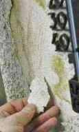

[🠔 Zur Übersicht: Dämmung](213baust.md)  
# Der Schwindel mit Wärmedämmung und Energiesparen 2 - Dämmpfusch am Bau
**Zur Sache: Schimmel und Algen durch WDVS**  
_von Konrad Fischer_

Der Schwindel mit Wärmedämmung 
und Energiesparen 2 - Dämmpfusch am Bau 

[zurück<-](2131bau.md) Kapitel [-> vor](2133bau.md) 

Zur Sache: Systempfusch auf Befehl der Bundesregierung unserer Lobbykratie? Die durch die Energieeinsparverordnung EnEV und private Schnäppchenjägerei "begünstigte" nachträgliche Wärmedämmung mit feuchteblockierenden Ersatzbaustoffen und die klimatechnische Anlagennachrüstung von Altbauten kann für den Bauherrn und die Umwelt schnell ein gigantisches Verlustgeschäft werden (und das gilt auch für den Neubau). Außen angebrachte Wärmedämmung hemmt die Verwertung kostenlos eingespeicherter Solarenergie in der Wand. Und die bringt gerade in der Übergangszeit vor und nach der bitteren Winterszeit ganz schön Wärmeenergie in die Massivwand. Ein paar Zahlen können das verdeutlichen: Für die Heizperiode September bis Mai können nach Koblin, Krüger, Schuh, Handbuch Passive Nutzung der Sonnenenergie, Schriftenreihe des BMBau 1984, immerhin folgende Werte für die 12 Stunden am Tag angesetzt werden: 

Südwand 145 W/qm, Ost-/Westwand 110 W/qm und Nordwand immerhin 65 W/qm. 

Diese von der Sonne gelieferten Energiemengen stehen erst mal kostenlos zur Verfügung. Derartige Details und ihre sachgerechte Bewertung erfährt der werbungsgeplagte Hausbesitzer und Bauplaner aber nur noch, wenn er ausnahmesweise noch selber liest - wie beispielsweise das Buch "Richtig bauen" von Prof. Dr. Claus Meier. 

In viele Leichtbau-Dämmstoffe flutscht andererseits die Wärme schnell rein und raus. Energie lange festhalten können nämlich nur Baustoffe mit entsprechender Speicherfähigkeit (siehe hierzu das "[Professorenrätsel](7wdvs17.md)"). Im Sommer kühl, im Winter warm gilt nur für Baustoffkonstruktionen mit großer Temperaturamplitudendämpfung und "Phasenverschiebung", also großem Zeitverzug, bis einseitige Temperaturänderungen zur anderen Seite "durchschlagen". Und was macht Deutschland? Blockt die kostenlose Solarenergie ab und setzt dagegen auf ein Irrsinnsprojekt wie Photovoltaik, die genau dann Strom liefert, wenn er kaum bis gar nicht gebraucht wird. Vielleicht. Und gleichzeitig die ganze Hütte inklusive Bewohner als [brandgefährliche Zeitbombe](pvbrand.md) gefährdet. Nur um die Armen dieser Gesellschaft mit Zwangsumlagen EEG-mäßg abzuzocken. Oder ein paar lächerliche Kilowattsekunden in das eigene Stromnetz zu pumpen. Aber: Da die Strompreise jedes Jahr steigen und dadurch immer weniger in der Haushaltskasse übrig bleibt, ist es durchaus zu empfehlen, einen [Stromkostenvergleich vorzunehmen](http://www.welt.de/wirtschaft/energie/specials/strom/article10219515/Stromkosten-sparen-durch-einen-Vergleich-der-Anbieter.html) um die Kosten zu senken. Viel mehr bleibt ja angesichts der Ausplünderung Deutschlands durch die Klimaschutzparasiten nicht mehr übrig. 

Einige Nischen gibt es freilich, um sein wohlverdientes Geld besser als mit sinnlosen energetischen Sanierung abzusichern. Mit Neubauvorhaben in mickrigen B-Lagen wird das nicht so leicht gelingen. Für Altbaufans gibt es da bessere Alternativen: Eine interessante Kapitalanlage sind denkmalgeschützte Immobilien. Sie sind begehrt und bieten deshalb oft eine höhere Mietrendite im Vergleich zu Neubau- oder Bestandsimmobilien. Selbstverständlich muß dazu auch die Lage passen. Zwischen zwei Asylantenheimen wird die Vermarktung des [Denkmalschlosses](8schloss.md) an deutsche Zipfelmützler logischerweise etwas schwerer werden und so viele Zigeunerbarone gibt es ja auch wieder nicht (Ironiemodus off). Sei es zudem Steuerabschreibung oder gar Zuschuß, derartige Optionen können die Entscheidung zum Baudenkmal erst mal versüßen. Der ultimative Hit ist dann die Ausnahme- bzw. Befreiungsmöglichkeit von den Geldfressern, die uns der lobbyistenverliebte Gesetzgeber, also unsere korrupten und/oder machtversessenen und/oder ahnungslosen Land- und/oder Bundestagsabgeordneten im Verbund mit den davon profitierenden Ökoabzockern der Baubranche beschert haben: Die perversen Bauvorschriften der Energieeinsparverordnung und der Wärmegesetze. Ihre bauverpfuschenden und geldbeutelzehrenden Folgen machen wir hier dingfest. Am Baudenkmal könnte man dem Klimaschutz-Irrsin dank der staatlichen [Schutzvorschriften](21311bau.md) dem entweichen, wenn man nicht auch hier von selbstsüchtigen Beratern und Planern und Handwerkern auf das falsche Pferd gesetzt wird. 

Besonders tragisch macht sich der fast totale Blackout des deutschen Schwachverständigenunwesens bemerkbar, wenn es um die Ursachenforschung für die scheußliche Aufnässung und Veralgung der Dämmfassaden an Neu- und Altbauten - ja, auch an Baudenkmälern! - geht. Da wird doch allen Ernstes sinngemäß folgende Kausalkette in die irre Welt gesetzt: 

- Fassade mit schlechteren (also höheren) U-Werten erfordert eine dickere Wärmedämmung. 
- Eine dickere Wärmedämmung verursacht geringeren Wärmefluss aus dem geheizten Stübchen nach draußen. 
- Ein geringerer Wärmefluss von innen nach außen verursacht an der Fassadenoberfläche eine tiefere Oberflächentemperatur. 
- Eine tiefere äußere Oberflächentemperatur verursacht mehr Taupunktunterschreitung und damit eine längere Kondensatperiode. 
- Eine längere Kondensatperiode an der Fassadenoberfläche führt zu größerer Wasserbelastung der Fassadenbeschichtung. 
- Eine größere Wasserbelastung an der Fassadenoberfläche macht dort mehr Bewuchs bzw. Bewuchs möglich. 

Was soll daran falsch sein? Sie erkennen das nicht? Dann lassen Sie sich bitteschön mal von den sowas behauptenden Schlechtachtern vorweisen, wo denn bitteschön die meßtechnischen Belege dafür sind, daß es die gebremste Wärme aus dem geheizten Stübchen wäre, die die Fassadenoberfläche so dolle runterkühlt. Und Sie werden sehen: 

Er kommt ins Zittern und Zagen und hat für seinen reinen Hirnwix gar nix als praktischen Beleg vorzuweisen. Alles Lug und Trug! Denn in Wahrheit ist es die mangelhafte Speicherfähigkeit der Dämmstoffe, die tagsüber für extreme Aufheizung der Dämmoberflächen sorgt und sobald die Sonne weg ist, für brutalstmögliche Auskühlung, weit unter die Lufttemperatur. Und zwar jede Nacht! Weil nämlich jede Fassade im Strahlungsausgleich mit dem Himmel steht. Am Tage ok, da scheint direkt und diffus erwärmende Solarenergie auf die Oberfläche. Nachts aber fällt das weg und dann wirkt nur die eisige Himmelsatmosphäre. Und die hat aufgrund des ungefähr -270 °C kalten Weltalls locker minus 30, 50, 100 und mehr Minusgrade zu bieten, je nach schützender Wolkendecke und Wasserdampfgehalt. Das CO2 hat da leider überhaupt keine Wärmedeckenfunktion, lassen Sie sich von den Klimadeppen und Klimastußbetrügern, die nicht mal wissen, welche Kraft die ungeheueren Eis- und Wassermassen in den Regenwolken fliegen läßt, bitte nix weismachen. Und so frostet eine schäbige Dämm-Luftfassade ratzfatz und gnadenlos in eisigste Tiefen runter. Weil die solare Tagwärme im Dämmlappen ja eben leider, leider nicht gespeichert und damit passiv genutzt werden konnte, wie in einer Massivfassade. 

Fazit: Dämmfassaden sind vorprogrammierter Baupfusch, von A-Z. Egal welcher Dämmstoff, es geht nur um den vermaledeit schlechten U-Wert, der die Verrottunsgeschwindigkeit im wesentlichen regiert. Das ist die traurige Wahrheit von der Bauphysik, die Ihnen viele Baupfuisicker, Gerichtsschwachverständige und Schlechtachter verschweigen. Entweder aus Dummheit, Blödheit oder Absicht oder aus allem zusammen. Sie entscheiden! 

Außerdem werden durch k-Wert/U-Wert-orientierte Konstruktionen die Gebäude und die Gesundheit der Bewohner nachhaltig geschädigt. So verstößt nicht nur die EnEV-Brutalität, topfunktionierende Heizkessel nur wegen ihres Baujahrs vor 1978 zu vernichten gegen die eigentumsbewahrenden Vorschriften des Art. 14 GG, sondern auch die überbeanspruchte Gesetzgebungskompetenz des Bundes, mit praktisch nirgends nachgewiesenen Rechentricks "Energiesparen" und "Klimaschutz" zu heucheln und den Bürger gesundheitlich und wirtschaftlich zu schädigen, [ gegen unsere Verfassung](7enevver.md). Der ad-hoc-Arbeitskreis Gesundes Haus ging hiergegen [mit allen zulässigen Mitteln](enev.md#petition) an. Auch das Strafrecht bietet hier [einige Möglichkeiten](7wdvs10.md). Freilich und vorhersehbar vergeblich. So bleibt im besten Fall nur noch die [baurechtliche Befreiung von dem Klimaschutzwahn](21311bau.md), die dank der Befreiungsparagrafen nach meiner Erfahrung bundesweit gleichermaßen funktioniert, für EnEV und EWärmeG/EEWärmeG, für Altbau und Neubau. Der Klimastußschwindel der Baubranche ist nämlich trotz aller wohl im Lobbyistenauftrag herbeigeschwindelten Gegenbeweise im Gesetzgebungsverfahren - mit absichtsvollen Rechentricks und Auslassung der Vollkosten! - meist total unwirtschaftlich und kann die lediglich fiktiven Sparpotentiale nie in eine akzeptable Wirtschaftlichkeit ummünzen. 

Aus einer [Mailanfrage](2frag.md) vom 31.1.03:

_Immobilien Wirtschaft + Recht 6/2002 - "Dämmung bringt Schimmel"_

_Sehr geehrter Herr Fischer,_

_ich habe das Interview mit Ihnen und Herrn Professor Meier in o.a. Zeitschrift gelesen und stellte fest, dass Sie genau die Dinge angesprochen haben, die mich zur Zeit sehr bewegen. Ich habe mittlerweile ein an Verzweiflung grenzendes Stadium erreicht und wende mich an Sie in der Hoffnung, dass Sie mir vielleicht einen Rat oder Hinweis geben können, wie ich weiter verfahren kann bzw. wer mir evtl. weiterhelfen kann._

_Ich bin Privatmann und habe im Jahre 2000 ein Mehrfamilienhaus fertiggestellt. Hier mein Problem: Schimmelbefall in mehreren Wohnungen, im Erdgeschoß die beiden Äußeren. Stellenweise wirklich nasse Wände sowie auch von Außen teilweise deutlich sichtbare Veralgung. Im Dachgeschoß teilweise genau im Knick von der Wand zur Decke über den Fenstern._

_Ich habe bereits sämtliche Balkone (Ost- und Westseite) 2 Mal sanieren lassen, von Innen wurde alles erneuert (Putz abgeklopft, erneuert, tapeziert etc.) Immer wieder wird alles Naß._

_Mittlerweile fällt außen teilweise der Außenputz schon ab und Algenbildung ist vorhanden._

 
So kann es aussehen, wenn der Sachverständige das WDVS mal etwas genauer anguckt. 
Hohlgefroren, unterseitig veralgt bis zum Armierungsgitter.

_Weiterhin sind sämtliche Betonflächen (Balkone Südseite und Laubengänge Nordseite) mit großen Rissen versehen sowie mit so braunen Schwämmen (habe ich noch nie zuvor gesehen) befallen. Ich muß dazu sagen, dass die Betonflächen nicht mit Betonschutz gestrichen wurden, da dies angeblich heutzutage nicht mehr gemacht wird._

_Der Putz ist übrigens von XXX (unter dem Motto von XXX "Bewusst bauen - Energie sparen und Wert erhalten"). Keiner fühlt sich zuständig. Die Baufirmen befinden sich zwar noch in der Gewährleistungsfrist, kommen aber nicht in die Gänge, fühlen sich meist nicht schuldig (jeder versucht es dem Anderen in die Schuhe zu schieben.) Das Haus ist neu und schon am vergammeln. Die Mieter mindern die Miete etc._

_Sehr geehrter Herr Fischer,_

_können Sie mir vielleicht einen Rat geben ? Oder einen Tip, an wen ich mich wenden kann ?_

_Mit freundlichem Gruß aus Bielefeld_

_(...)_

Das ist das Ergebnis der Politik "Klimaschutz und Mieterschutz": Eigentum wird vernichtet, die Mieter verrecken in naßverschimmelten Dichtdämmbuden bei viel zu hohen baukostenabhängigen Mieten, Modernisierungsumlagen und Heizungsnebenkosten. Egal. Wenn sie nur ihre lieben Hirten immer weiter wählen. Daß die Mieter sich das alles gefallen lassen, daß sie ihre zu hohen Kosten und krankmachenden Wohnverhältnisse dem bösen Vermieter zuschreiben und nicht den wirklich Verantwortlichen, daß die gesamte Bevölkerung in einen Konflikt jeder gegen jeden getrieben wird - ein echter Erfolg raffinierter Abzockpolitik unserer lobbyabhängigen Parteien quer Beet - auch mittels fremdgesteuerter Verbände der Wohnungsgenossenschaften und Mieter mit ihrem vielleicht sogar korrupten Führungspersonal, das seit jeher für den Klimastuß schwärmt anstatt sich derlei Abzocke auf Kosten der ihnen anvertrauten Klientel zu verbieten. Alle Landesregierungen brutalisieren diese bevölkerungsverachtende "Vorsorgepolitik" immer weiter, begleitet von menschenfreundlichen Sonntagsreden. Eben typisch Lobbykratur, wa? 

So sieht die veralgte, grünschwarzbraune Wahrheit aus - allzu kurze Zeit nach Einweihung: 

Total versaute, verschwärzte, vergrünte und abgesoffene WDVS-Fassade. Ja, so ein Energiesparen überzeugt eben Wärmedämmverbundsystem mit Kunstharzanstrich. "Bewährtes System", schreibt der Werbeprospekt, "schon immer so gemacht" sagt der Handwerker. Beide haben freilich recht. Kommt eben immer auf die Perspektive an.

Immerhin hat sich das Deutsche Ingenieurblatt 11, 2008 mal drangemacht, die Algendämmfassaden etwas genauer zu durchleuchten. Der Artikel "Schimmel innen - Algen außen" von Prof. Dr.-Ing. Dipl.-Phys. Klaus Sedlbauer und Dr.-Ing. Martin Krus vom Fraunhofer-Institut für Bauphysik, Stuttgart, klärt die verblüffte Leserschaft auf, hier ein paar Kernsätze: 

_"... führt die Verbesserung des Wärmedämmstandards zu einem deutlich höheren Risiko eines Befalls der Außenfassade mit Schwärzepilzen oder Algen. Das wesentliche Kriterium für das Risiko eines mikrobiellen Bewuchses an Fassaden ist eine ausreichende Menge an Feuchtigkeit. Dabei kommt der nächtlichen Betauung besondere Bedeutung zu, da nur mit ihr das vermehrte Auftreten des Bewuchses auf der schlagregenarmen Nordseite zu erklären ist. Um das Risiko eines mikrobiellen Wachstums abzuschätzen, ist die Betauung auf der Oberfläche deshalb ein gutes Kriterium. Im direkten Vergleich zu monolithischen [KF: mono - eins, lithos - Stein, also steinernen, nur aus Stein bestehenden] Wänden sind Wände mit WDVS gefährdeter."_ Und die beigegebene Grafik zeigt dann anschaulich, daß alleine von September bis Oktober während 200 Stunden die Taupunkttemperatur an der Oberfläche eines Wandaufbaues mit 10 cm WDVS unterschritten war. 

Ebenso informativ die Autoren Cand. Biol. Oliver Frank und Dipl.-Ing. (FH) Norbert Rüter vom Fraunhofer / Wilhelm Klauditz Institut für Holzforschung, Braunschweig, in: "Mit Köpfchen gegen Tröpfchen, Neues Prüfverfahren gegen Algen auf Putzfassaden" in Bautenschutz + Bausanierung B+B 3.2009 S. 29 ff: 

_"Besiedelung [insbesondere von WDVS-Fassaden] mit Mikroorganismen (nimmt) teilweise solche Ausmaße an, dass sogar von "Biokrusten" gesprochen wird. ... Dem verärgerten Besitzer und Mieter ... präsentieren sich Algen, Pilze und Flechten. Neben einer optischen Abwertung des Gebäudes stellen sie unter Umständen eine Gesundheitsbelastung (durch allergene Pilzsporen verursacht) für die Anwohner dar. Algen schaffen in Biofilmen ein chemisches Milieu, welches die Korrosion von Bausubstanz beschleunigen kann. Außerdem fürht ...[der Wetterwechsel feucht zu trocken] zu starkem Quellen und Schrumpfen der Biofilme ... in Abhängigkeit von der Wasserverfügbarkeit - und beansprucht die Fassadenoberfläche zusätzlich mechanisch."_ 

Beischrift zu einer aufschlußreichen Grafik _"Zeitlicher Verlauf der Oberflächenfeuchte der Putzsysteme A und B": "Abb. 3: Vergleich des hygrischen Verhaltens ... Putz B wurde hydrophobiert, wodurch sich das Wasser deutlich länger an der Oberfläche hält als bei Putz A."_ 

_"Die Ausrüstung mit bioziden Wirkstoffen [Gift in den Fassadenbeschichtungen von WDVS] ist zwar effektiv, stellt jedoch keine besonders elegante Lösung dar, weil sich die biozid wirksamen Komponenten mit der Zeit auswaschen wie auch durch die UV-Strahlung photokatalytisch abgebaut werden und somit regelmäßig erneuert werden müssen. ... Durch die wasserabweisende Wirkung und die damit in Verbindung gebrachten "selbstreinigenden" Eigenschaften, die ein Abwaschen eingetragener Nährstoffe und Mikroorganismen voraussetzen, soll die Fassade so über einen langen Zeitraum sauber und trocken bleiben. In der Praxis ist dies jedoch oft nicht der Fall: Die Wassertropfen laufen ungleichmäßig von der Fassade ab, wodurch sich Schmutzpartikel sammeln und nach der Trocknung unschöne Abläufer und Verfärbungen zu sehen sind. Die bei Unterkühlung entstehenden Kondensattröpfchen verbleiben ohnehin meist an der Fassadenoberfläche, da sie eine zu geringen Masse haben, um von der Fassade ablaufen zu können. Tauwasser fällt während klarer Nächte an (bis zu einer Menge von maximal 100 g/m² Oberfläche). Diese Feuchtigkeit steht dann Algen und anderen potenziellen Fassadenbewohnern zur Verfügung. ... die mit zunehmender Verwendung von WDVS eingesetzten Dünnschichtputze ... beinhalten oft organische Bindemittel. Diese können von Pilzen abgebaut werden, was sozusagen eine Düngung der Fassade zur Folge hat."_ 

Ja, meine lieben Doktoren, Biologen, Ingenieure und Professoren Dolittles - Es grünt so grün, wänn Doitschlanz Wände grünen ... 

So können Dämmverbrechen dann nach kurzer Zeit aussehen - hier eine dämmtechnisch unter den Augen der Denkmalbehörde und mit denkmalbedingten Steuerersparnissen und Zuschüssen vergewaltigte Denkmalfassade in Süddeutschland voller Putzrisse und Feuchte, die ich für die geschädigten Eigentümer begutachten mußte: 

   
Wasserabweisend ausgerüstete Dämmputz-Fassade gerissen, nicht nur in den Rißbereichen total aufgefeuchtet, dank Vergiftung mit Algizid aber noch nicht veralgt und am Sockel total naß und abgängig. Innen sind die Wohnungen teils verschimmelt, logo. 

Immer interessant, was so alles schiefläuft mit den WDVS / Wärmedämmverbundsystem. Sie sind eine offenbar schwer zu durchschauende Bauweise und extrem schadensträchtig, wenn man diese anschaulichen Links studiert: 

[Michael Oldsen berichtete hier über seinen ihm widerfahrenen abenteuerlichen WDVS- und sonstigen Pfusch am Bau - und vielleicht hat auch die Veröffentlichung hier ein kleines Bisserla mit zu dem geführt, was Sie neuerdings auf diesem Link noch zu sehen kriegen!](http://web.archive.org/web/20071026054856/http://www.oldsen.org/) 
Wissenschaftsjournalist Güven Purtul in seinem Blog zu ["Wahnsinn Wärmedämmung"](http://purtul.de/?p=128): Vergiftete und brandgefährlich Dämmsysteme gefährden Natur, Mensch und Umwelt 
[Rechtsanwalt Hägele berichtete einst über die mangelhafte Verankerung von WDV-Systemen](http://web.archive.org/web/20071102193748/http://www.haera.de/fehlerhafte+Verklebung.htm) 

[Vielleicht auch für Sie interessant: Details zur Befreiung von der EnEV betr. Fassadendämmung, Dachdämmung, Bodendämmung und Heizungsaustausch](7temp24.md) 

Und wenn Sie sich fragen, wer denn eigentlich für die algenversaute WDVS-Fassade haften muß, kann die abschließende Entscheidung des Oberlandesgerichts Frankfurt a. Main, Beschluß vom 7. Juli 2010, Az.: 7 U 76/09, mit der die Revision der WDVS-Baufirma an einer neuen Wohnungseigentumsanlage zurückgewiesen wurde, sehr erhellend sein: 

2001 wurde ein weiß gestrichenes WDVS vor die Rohbaufassade geschnallt, streng nach Leistungsverzeichnis "LV" (und wer hat das wohl unter sträflichster Mißachtung der von jedem Planer geschuldeten VOB-Neutralitätspflicht mit Produktnennung bestückt?). Schnell kam es, wie es kommen muß, wenn man umwelt- und sparbewußt auf teure auswaschbare Fassadenvergiftung verzichtet: Nach zwei Jahren schon großflächiger und ständig zunehmender Pilzbewuchs und Algenbewuchs mit unregelmäßig-häßlichster Grauverschmutzung/Grauverfärbung/Vergrauung - eben das bekannte Grauen des WDVS. Der Bauträger will von seiner Verantwortung nix wissen, vor Gericht trifft man sich wieder. Ach ja, er habe ja nur streng nach LV und den Herstellerrichtlinien, absolut fachgerecht!, gearbeitet, und dafür, daß es Wetter gibt und die Fassade wegen andauernder Taupunktunterschreitung jede Nacht auffeuchtet, kann er nun wirklich nix, und 2001 habe er auch noch nix von der Problematik der Taupunktunterschreitung gewußt, Veröffentlichungen habe es damals dazu noch nicht gegeben. Mag ja sein, meint das Gericht, hilft aber nix und Dummheit schützt bekanntlicherweise nicht vor Strafe. Seine schöne Fassade ist jetzt eben ein Mangel. Besondere Bedingungen für die Fassadenversauung habe es nicht gegeben, es genügte normales Wetter und eben seine Wärmedämmung. Andere weiße Massivfassaden ringsum sehen nämlich hübsch aus, auch nach zig Jahren Standzeit. Soweit ohne das vermaledeite WDVS. Daß das von dem Planer gefordert und dessen baldige Verschweinsung sozusagen bauarttypisch unvermeidlich war, nützt ihm rein gar nix nix, er hat ja auch keine gewährleistungsbefreienden Bedenken schriftlich mitgeteilt. Deswegen muß er für den von ihm auftragsgemäß angebrachten Fassadenschund haftungsmäßig blechen. Und es spielt keine Rolle und hilft ihm garnix, daß sein Pfusch hinsichtlich des verwendeten mineralischen Putzes und des Wärmedämmverbundsystems für sich genommen mangelfrei ausgeführt war, daß es gar keine Richtlinien zur Verwendung vergifteter (biozider) Baustoffe gab, die den Mangel auch nur etwas hinausschieben können, daß die sogenannte Fachöffentlichkeit keine Ahnung von den systembedingten WDVS-Feuchteproblemen habe, denn die werkvertragliche Gewährleistung für das Funktionieren seiner geschuldeten Leistung setzt weder Verschulden noch Vermeidbarkeit des Mangels voraus. Auch das OLG München in seinem Urteil vom 27. Januar 1999, Az.: 27 U 415/98 kommt von der Sache her ebenso wie das Landgericht München im Urteil vom 29. Mai 2008, Az.: 8 O 2231/01 zum gleichen Ergebnis. Pfuscher, zieht Euch warm an! 

Was die obsiegende WEG nun als Mängelbeseitigung unternommen hat? Sie hat den Dachüberstand vergrößert, um weniger Beregnung auf der Fassade zuzulassen. Schon wieder lustig, denn die dauerbefeuchtungsliefernde Taupunktunterschreitung kann damit keinesfalls gebannt werden. 

Hier geht's weiter zum [Kapitel 3 - Fassadendämmung naß veralgt?](2133bau.md) Lassen Sie sich überraschen ...
