[🠔 Zur Übersicht: Dämmung](213baust.md)  
# Algenbefall / Algenpest auf Wärmedämmung, Wärmedämmverbundsystem WDVS, Hausisolierung und Fassadendämmung
**Fassadendämmung naß veralgt?**  
_von Konrad Fischer_

## Der Schwindel mit Wärmedämmung, Hausisolierung und Energiesparen 3

## Schadensklassiker durch Feuchte: Grün-/Schwarz-Algen und 
Schmutz/Staub/Dreck auf Wärmedämmung / WDVS 
Hausisolierung, Fassadendämmung 
ETICS - External Thermal Insulation Composite System / EWI - EWIS - External Wall Insulation System / EIFS - Exterior Insulation Finish System 
und Energiesparen

### Fast nur im sarkastischen Ironiemodus, versprochen!

[zurück<-](2132bau.md) Kapitel [-> vor](2134bau.md)

**[Das Handwerkerquiz](10hoai13.md)\+ [Das Planerquiz für schlaue Bauherrn](10hoai14.md)**

---

## Algenbefall / Algenpest auf Wärmedämmung, Wärmedämmverbundsystem WDVS, Hausisolierung und Fassadendämmung

 **Abbildung:** So geschieht´s einem WDV-systematisierten Hüttchen nach wenigen Jahren: 
Der vergammelte Kram muß mühsam runtergerupft werden, weil er "ordentlich" anzementiert wurde. Dafür gibt's heute patentierte Autokran-Aufsatzfräsen. 

(Bild aus Thomas Böttcher: "Warmes Fressen für den Biber" 
in: _Bautenschutz+Bausanierung, Zeitschrift für Bauinstandhaltung und Denkmalpflege_ , März 2001, S. 29, Bildbearbeitung K.F.)

Das Mauerwerk ist naß und "hinüber". Die Buden schimmeln. Die Bewohner verrecken. "Mehr als sieben Millionen Wohnungen in Deutschland sind von Schimmelpilz und Feuchteschäden betroffen." (Ergebnis einer wiss. [Studie von Sabine Brasche, Friedr.-Schiller-Universität Jena](7schim.md#mz 7/02)). Ein selbstgeschaffenes Geschäftsfeld der neuen Bauphysik zur Beförderung der Bauwerksisolierung.

Das kostet.

Auch die Baugeräteindustrie hat sich darauf eingestellt - Sie sehen die Fräsmaschine am Kranausleger. Sondermülldeponien und die Sanierbranche haben es auch.

Und der Mieter? Er hat sich ja schon beim vorherigen energetischen Sanieren an´s sinnlose Blechen gewöhnt. 

Den grünen Ökoheini und beschissenen Mieter erkennt man heutzutage sofort an seiner Fassade. So kann das einst weiße Grün über kurz oder gar nicht so lang aussehen:  
(**Abbildung** "Algenbefund auf der WDVS-Fassade" aus "[Forschung] Wärmedämmung; Zur EnEV: 1. Grünes Hinweisschild + 2. Schotten dicht" 
in: _Bautenschutz+Bausanierung, Zeitschrift für Bauinstandhaltung und Denkmalpflege_ , Januar 2002, S. 44, Bildautor: Hochschule Wismar, Bildbearbeitung K.F.)

Oder eben so (Aufnahmen Konrad Fischer am 24.08.2007 anläßlich Bauberatung):  im Detail:  
Die schnöde Endlösung einer an Possenreißerei und kontraproduktiven, das Vertrauen des tumben Michels so dermaßen grausam karikierenden Eulenspiegeleien wohl unübertreffbaren Klimaschutzpolitik unserer Lobbykratie. Typisches Ergebnis einer von allerlei interessierten Kreisen wohl und fett gesponsorten Regierung und Administration von Umwelt-, Wirtschafts-und Bauministerium abwärts bis zum letzten Landrats- und Bürgermeisteramt. So manche Hochschulen und Bauinstitute, Schwachverständige und nahezu die gesamte Baubranche als Klimaschutzkriegsgewinnler inkl.! 

Schön, wie die besseren Wärmespeichereigenschaften der Dübel für die Wandisolierung / Fassadendämmung mit WDVS/wärmedämmverbundsystem mit der geringeren Vergrünung / Verschwärzung punktgenau herausstechen. Bauphysik im Bild. Der Schwachverständige wird (gem. mir vorliegenden Gutachten) dann vom Architekten fordern, zum erfordernisgerechten "Feuchtemanagement" der bewitterten Fassade entsprechende Dachüberstände anzuordnen, damit halt kein Regentröpfchen auf die Dämmfassade kommt. Wo er doch eigentlich wissen muß, daß sie obendrein so dermaßen kondensatempfindlich ist. Und die heutzutage verfügbaren "wärmegedämmten Dübel" zur einheitlichen Vergrünung erst später "Stand der Technik" wurden. Deswegen, und um die Dämmdübel nicht zu entlarven: Immer feste gräßliches Gift, das in der Landwirtschaft aus guten Gründen schon längst verboten ist, in die Fassadenfarbe, das schmeckt den Algen nicht. Nur der Ökolobby und ihren wohldotierten Spießgesellen in der Bundesregierung. Die das Gift aber freilich lieber dem Volk überlassen: 

[ 
NDR Panorama 9.10.2012: ["Häuser-Dämmung: Gift in der Fassade"](http://www.ndr.de/regional/waermedaemmung197.html)](https://youtu.be/W0WqLeOq1ok) 

Außerdem seien grüne Fassaden keinesfalls ein Baumangel, so das LG Darmstadt auf Grundlage eines Sachverständigengutachtens: 

Leitsatz: 
_"Ein WDV-System mit mineralischem Oberputz entspricht den anerkannten Regeln der Technik nach VOB/C DIN 18345 und ist auch dann nicht mangelhaft, wenn sich nach 2 bis 3 Jahren Verfärbungen zeigen, die auf einen Algenbefall zurückzuführen sind. Dem Aufragnehmer kann auch nicht angelastet werden, dass er auf die Möglichkeit eines relativ frühen Algenbefalls nicht bei Auftragserteilung hingewiesen hat. (Urteil vom 7. August 2007, LG Darmstadt, 14 O 615/05)."_. Na gut, wenne s dann doch zu arg wurde, wird aus dem kein Mangel dann doch bisserl was, vgl. [Algen- und Pilzbewuchs – WDVS mangelhaft!](http://blogs.haera.de/?p=11)

Aha. Und unter die Grünhaut guckt vorsichtshalber niemand, denn dort könnte es ja rundherum vielleicht sogar sehr naß sein und das darf dann natürlich auch wieder kein Mangel sein, für den irgendjemand haften will. Schauen Sie mal hier, was da so alles passieren kann: [Tauwasser läuft aus der WDVS-Fassade](http://www.bauexpertenforum.de/showthread.php?s=1e654326cc8b2c0512d40b0a7a44479d&t=8068). Merke: Waldpilze wachsen auf nassem Waldboden. Und Fassadenpilze? Eben.

Die deutsche Fassadensauerei wird immer mehr und mehr sichtbar: 

_"Bei mehr als 75% der neuen oder energetisch modernisierten Gebäude treten Algen- und Pilzbesiedlungen auf."_ so heißt es hier: Arbeitsgemeinschaft für zeitgemäßes Bauen, Nr. 240, Heft 2/10 - und weiter: _"Die Besiedlung von wärmegedämmten Fassaden durch Mikroorganismen ist nach wie vor ein großes Problem für Immobilienbesitzer sowie die Hersteller und Anwender von Beschichtungssystemen und Schutzmitteln. Aus diesem Grund hat die Arbeitsgemeinschft für zeitgemäßes Bauen e.V. zusammen mit der norddeutschen Wohnungswirtschaft das Forschungsprojekt ALMO-NORD (Algenmonitoring an energetisch sanierten Wohngebäuden Norddeutschland) ins Leben gerufen. Eine wesentliche Erkenntnis des Projektes war, unter anderem, welche Bedeutung dem Thema "Speicherfähigkeit von Materialien" zuzuweisen ist."_ - so nachzulesen ausgerechnet in der Reklamebroschüre der Ziegelzerstörer namens "Poroton". Die nun wirklich alles dran setzen, den Ökodeppen den Vorreiter zu geben. Und mit "Speicherfähigkeit" ihres mit Dämmstoff vollgepumpten Ziegelschaums, der gerade hinsichtlich Wärmespeicherung und Stabilität allen guten Traditionen des bewährten Backsteins / Vollziegels hohnspricht. Die gräßlichen Zerstörungen, die nach ein paar Jahren den darauf hereingefallenen Hausbesitzer fürchterlich überraschen können, werden in der Broschüre freilich weder bebildert noch irgendwie erwähnt. 

Dafür landen die Schadensfälle - egal ob es durch die Putzrisse auf dem instabilen Putzgrund bis ins Zimmer durchregnet, ob das Mauerwerk aus den fragilen "Steinen" reißt oder ob der Innenputz mangels Weichheit krustenförmig Blasen wirft oder der Außenputz bzw. Fassadenputz durch die Kalkaussinterung abgesprengt wird - es sind ja dolle Mengen Branntkalk im Restton reingebacken, dank kalkhaltiger Abfall-Papierschlämme als Zutat im Ton, die dann auskarbonatisieren und dabei den Putz abdrücken. Oder eben auch die Algen auf dem schlecht speicherfähigen Porenschwamm anwachsen. Dank Nachtkondensat auf den viel zu schnell ausgekühlten Oberflächen. 

Die raffinierten Giftmischer der Dämmbranche nutzen nun den überall grausig anschwellenden Verpilzungs- und Veralgungseffekt zur nächsten Marktoffensive. Scheinheilig jammern sie über sich allseits verbreitende grüne Fassaden, benamsen die dank solarer Wärmeaufnahme und -speicherung weniger kondensatanfälligen, trockneren und so weniger befallenen Massiv-Tellerdübelbereiche als "Leopardeffekt" ("Leopardeneffekt", "Leopardenfelleffekt", aber auch "Marienkäfereffekt"), der von der angeblich "hohen Wärmeleitung" der Metalldübel aus dem beheizten Rauminneren käme, erfindet Dämmstopfen über den nun noch weiter in ihr Unglück hineingetriebenen Dübel, damit auch die keine ausreichend wohlige Sonnenwärme mehr abbekommen und unauffälliger im nassen Dreck und feuchten Speck abtauchen - krasser und gemeiner kann man die Tatsachen wohl kaum fälschen - und finden Professoren, Energieberater, Journalisten, Planer, Politiker und Beamten, die die immer weiter gesteigerten Schwindeleien fleißig und ökologisch gleichgeschaltet unters doofe Volk verbreiten. Wer dann eigentlich schuld am ökologisch gewollten Fassadengrün an Deutschlands biotypischen Biodooffassaden sei?

Eben wieder einmal das alte Lied: Es kommt drauf an, was man draus macht - der Architektenblödel ist Schuld. Wußte eben wieder mal nix von abgasgereinigter Luft, die den Algenbefall neuerdings begünstigen soll (Ja, der Umweltschutz hat auch seine positiven Seiten für die Natur!). Von fassadennahem Waldwuchs in 1 km Entfernung, der mit West- oder Ostwind nach Belieben der Schwachverständigen ständig Algensporen herandüst. Von globaler Erwärmung, die eben auch dem Algenwachstum und Schimmelpilz zur verbesserten Vermehrung dient. Und das nicht nur zur Winterszeit! Kein Wunder, daß Architekten kaum noch Haftpflichtversicherer finden. 

Und was er bestimmt nicht wissen soll, weiß er selbstverständlich auch nicht: Daß die typischen WDVS-Systemputze und Systemfarben Kunstharz enthalten und genau damit zur Untergrundauffeuchtung beitragen und mangels Alkalität (bieten angenehm leicht saures Milieu) den Naturbewuchs geradezu herbeirufen. Sie bieten nämlich ein bestens geeignetes Substrat (Nährboden) für unsere schwarzgrünbraunen Freunde unter den wunderlichen Mikroorganismen, die uns der liebe Gott in seiner Schöpfung oder eben der Zufall gegönnt hat. 

Weitere Aufklärung zu den oft abenteuerlichen Vorstellungen rund um nasse und veralgte WDVSe finden Sie hier: [Algenbefall Fassade: Wärmedämmverbundsystem WDVS-Mängel+Schäden 13](7wdvs13.md). 

## Das US-Verbot der Wärmedämmverbundsysteme deutscher Machart

 EIFS-Videos Damage & Fire - Shock & Awe! 
[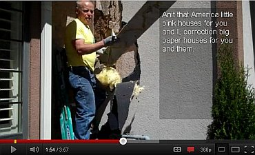](https://youtu.be/hHKQm3uC_wc) [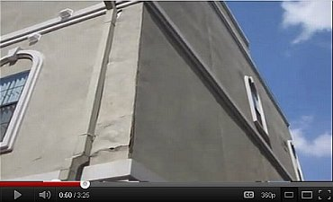](https://youtu.be/BD9qIMlz_8s) 
[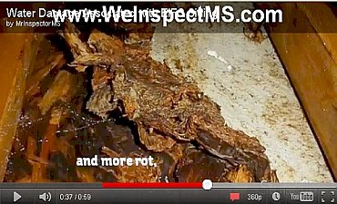](https://youtu.be/ugim0X71GvU) [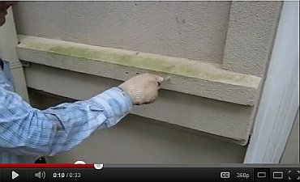](https://youtu.be/6PWyjN8gJU4) 
[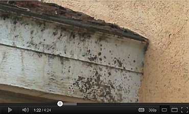](https://youtu.be/vc8_Q8mFX8I) [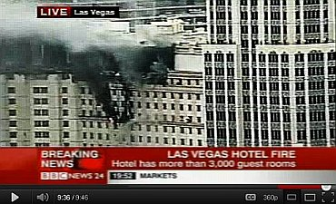](https://youtu.be/86Ch6PAMOoc) 
[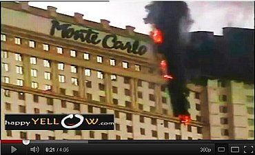](https://youtu.be/VvnqazNXjtE) [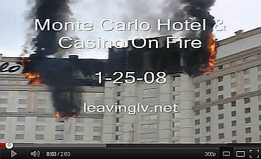](https://youtu.be/JC0TB8Hafys) 

Noch schlimmer kam und kommt es im gelobten Land der Moderne, den Vereinigten Staaten von Amerika, USA, wie ich es übrigens im Juni 2011 erstmals entdeckte und hier wohl das erste Mal öffentlich machte, worauf diese Infos auch den Weg in die deutschen Medien fanden. Ein glänzender Kommentar von Baumeister Tim Carter zeigt, wohin die Reise mit WDVS, in Amerika auf Englisch EIFS, genannt, geht. Da die Amis vorzugsweise Holzhüttli bauen und die dann - doof wie sie eben sind - mit WDVS/EIFS - External Insulation Finishing System (auch ETICS - External Thermal Insulation Compound System oder EWIS - Exterior Wall Insulation System genannt) beplanken, staunen sie nun mehr und mehr, wenn der Hausschwamm diese Dämmfeuchtholzbuden nach und nach auffrißt, ohne daß der gelackmeierte Hausbesitzer das Geringste bemerkt - bis seine kaputtgedämmte Bude fast oder ganz aufgefressen ist. Ich zitiere ein paar übersetzte Schnipsel aus ["EIFS - Can be a Nightmare/WDVS - Kann ein Alptraum sein"](http://www.askthebuilder.com/242_The_Barrier_EIFS_Nightmare_-_It_is_Real_.shtml): 

_"... Hausschwamm-Probleme [von WDVS-gedämmten Holzständerbauten] werden aus North Carolina, Georgia, Louisiana, Washington, Kentucky, Texas, Kalifornien, Tennessee, Ohio, Illinois, Virginia und zahlreichen anderen Staaten / Städten berichtet. Die einzigen WDVS-beschichteten Häuser, die immun gegen das Hausschwamm-/Holzfäule-Problem sind, sind diejenigen, die nie beregnet werden können. ... 

... Die aktuelle synthetische WDVS-Putzschicht blockiert den Transport von flüssigem Wasser und großer Mengen Wasserdampf. Die WDVS-Produkte, die früher verwendet wurden und immer noch verkauft und von verschiedenen Unternehmen vermarktet werden, wirken als Wasserfalle. Regenwasser und durch Wind eingetriebener Schlagregen können ihren Weg hinter die Acryl-Polymer-Beschichtung und Schaum-Isolierung, die direkt an den Holzrahmen und Schalungsbauteile Ihres Hauses geklebt sind, herausarbeiten [work out] . Sobald das Wasser zwischen der Holzschalung und der Schaum-Isolierung gefangen wird, beginnen die Hausschwamm-Probleme. ... 

Die kunstharzgebundene WDVS-Beschichtung ist eine hochwirksame "Einschweißfolie", die eingeschlossenes Wasser, das durch die Anschlußfugen und andere Eintrittsöffnungen einwandert, in der aufgenässten Baukonstruktion versiegelt. WDVS-Häuser haben kein Frühwarnsystem dafür, daß die massive Fäulnis nur wenige Zentimeter hinter der sichtbaren Oberfläche entfernt ist. ... 

Die Hersteller hoffen, daß ihre Dichtungsfugen oder Dichtmassen das Eindringen von Wasser zwischen dem WDVS und den Anschlüssen an die Fenster, Türen, Rohre, Lüftungsauslässe etc. verhindern. Das Problem ist, daß die gleichen Dichtungen auch das eingedrungene Wasser beim Austrocknen aus dem WDVS stoppen! ... 

Die Verwendung von traditionellen Wärmedämmverbundsystemen ["Barrier EIFS" / Konventionell wasserdicht hydrophobiertes Kunstharzputz-WDVS mit versiegelten Anschlußfugen an andere Bauteile im Unterschied zu "Drainage EIFS" mit einer Drainageschicht hinter der Dämmebene!] im Wohnungsbau wird durch zwei große Bauordnungs-Behörden ([BOCA - Building Officials Code Administrators International](http://leg2.state.va.us/dls/h&sdocs.nsf/execsummaryreport/HD291998) und ICBO - International Council of Building Officials) nicht erlaubt [not permitted]. Stattdessen fordern die Behörden nun, daß neue WDVS-Systeme eine Wasser-Drainage-Ebene aufweisen müssen, und zwar direkt hinter der Schaum-Dämmplatte und der synthetischen Kunstharzputzbeschichtung."_ 

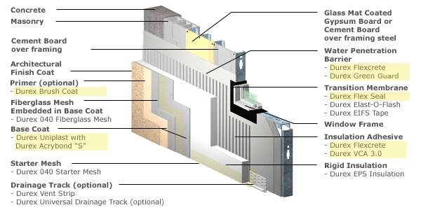 Ein aktuelles [US-Drainage-WDVS von Durabond](http://www.durabond.com/WallSystems/ws_popup/insulite_ew17_PU.htm) im Detail. Bildquelle: Herstellerinfo, siehe Link. Die Drainageebene des modernen WDVS ist in der Grafik als "Water Penetration Barrier" / "Wasserdurchdringungsbarriere" gekennzeichnet. Und befindet sich korrekterweise hinter der absaufgefährdeten Leichtbauplatte aus Dämm-Polystyrol. Wieviele Millionen Dämmquadratmeter müssen wohl hierzulande noch vergammeln, wieviele Tausend gedämmte Holzrahmenbauwerke der Fertighausindustrie und alte Fachwerkhäuser verrotten, bis sich die WDVS-Branche entschließt, auch hierzulande die Drainageebene einzuführen, und unsere korrupten Baubehörden das als Pflichtzutat fordern? Liberty! 

Yeah, God bless America! Na gut, die Amis haben eben noch keine Ahnung von dem aus baupysikalischen Gründen unabwendbaren Eindringen von Kondensat / Tauwasser in die externe, kalte Wärmedämmung und haben die immensen Auffeuchtungen und Hausschwammfälle im ganzen Land bisher überwiegend dem flüssigen Ein- und Hinterdringen von Regenwasser - das freilich auch stattfindet! - zugeschrieben. Doch immerhin haben die Behörden dort - so gut sie eben können - verbraucherfreundlich reagiert. Und die "Maryland Casualty Insurance" - eine der größten US-Gebäudeversicherungen, hat sich entschlossen, WDVS-Häuser wegen ihrer Schadensanfälligkeit überhaupt nicht mehr zu versichern. 

Rechtliche Schützenhilfe für die zigtausenden WDVS-Opfer und weitere Informationen (english) finden Sie hier: 

[ 
US-Bauherren-Selbsthilfegruppe der WDVS-Geschädigten - die größte unabhängige & nichtkommerzielle Infoquelle zur gräßlichen Geschichte & den schmutzigen Hintergründen des US-weiten WDVS-Skandals der aus Deutschland befruchteten WDVS-Mafia in den USA - mit entscheidenden Schlüsseldokumenten aus den gräßlichen Schadensfällen vom Algenbefall über den "Sto-Effekt & "Iglu-Effekt" (Plattenstoß-Abzeichnung) bis zum WDVS-Totalabriß für über 100.000 $, zu geheimen Abspracherunden der WDVS-Produzenten und den Schadensersatzprozessen der um ihr Vermögen gebrachten WDVS-Opfer - **EIFSFACTS.ORG!!!**](http://www.hadd.com/eifs/index.htm)

[ Geschichte der amerikanischen WDVS-Verbote/-Einschränkungen: EIFS Timeline](http://www.usinspect.com/resources-for-you/house-facts/basic-components-and-systems-home/synthetic-stucco-eifs/eifs-timeline): 
Krasse Info zu den staatsanwaltlichen Maßnahmen gegen WDVS, WDVS-Schadensersatzprozessen in New Hanover County, Wilmington u.a., WDVS-Ausschluß aus Gebäudeversicherung und Hypothekenbeleihbarkeit (Wertminderung), und zu den gesetzlichen / öffentlichen Gegenmaßnahmen / Verboten: 1996/01 Vancouver, British Columbia; 1996/03 North Carolina; 1997/10 Georgia; ... 
Aus der Webseite: _"New Hanover County Inspections Department records show that 345 permits have been issued since 1996 to repair and replace EIFS cladding. Inspections Director Jay Graham notes that the number of houses that have been repaired could be higher because permits are not required if repairs total less than $5,000. ... 
New Hanover County Superior Court Judge Ben F. Tennille denies defendant EIFS manufacturer motions to decertify the class in the North Carolina state class action of plaintiff homeowners against defendant manufacturers of EIFS. Ruff v. Parex. In a memorandum prepared for counsel of record and counsel for parties moving to opt out of the litigation, Judge Tennille notifies all parties that plaintiff homeowners "will be permitted to proceed with their class action on two issues only: defective design and failure to warn." He further notifies the parties that he will grant the defendant EIFS manufacturers’ motion for separate trials, with the first case to be tried against the defendant with the largest market share (Dryvit Systems, Inc.) and the remaining cases tried in order of market share. Judge Tennille also notifies the parties that he will grant the defendant EIFS manufacturers’ motion for a change of venue, noting that the first trial will take place in Johnson County beginning October 4, 1999. A deadline of August 31, 1999 is set for completion of discovery."_ 

Demnach zeigen die Aufzeichnungen der staatlichen Inspektionsabteilung des Kreises Neu-Hannover in Nord-Karolina, daß seit 1996 immerhin 345 Baugenehmigungen (permits) zur Reparatur (Ersatz) von WDVS-Fassaden erteilt wurden. Und der Direktor der Inspektionsabteilung weist darauf hin, daß es wesentlich mehr Fälle geben könnte, da Baumaßnahmen unter 5.000 Dollar nicht erlaubnispflichtig seien. Anschließend wird aus dem Obersten Gerichtshof des Kreises der Richter Ben F. Tennille zitiert, der zu den dort im Mai 1999 anhängigen WDVS-Schadensersatz-Prozessen "Ruff vs. Parex" und gegen andere WDVS-Hersteller wie beispielsweise dem größten von Ihnen, die Firma Dryvit Systems Inc., diverse Auslassungen macht (er möchte u.a. den Prozeßfrage im Plaintiff-Hausbesitzer-Prozeß beschränken auf "fehlerhafte Planung und unterlassene Warnhinweise" der WDVS-Hersteller), den beklagten Herstellern auf deren Antrag einen Wechsel des Gerichtsstandes (change of venue) zugesteht und einen ersten Prozeßbeginn in Johnson County am 4. Oktober 1999 ankündigt. Auf den 31. August wird der Abschluß der Ermittlungen (deadline) festgelegt. 

In der deutschen Presse wurde dann aus dieser US-Meldung im Juli 2011 folgende arg watschelnde Ente konstruiert: 

_"Allein in New Hanover County, einem kleinen Landkreis in North Carolina, wurden binnen zweieinhalb Jahren Bauunternehmen dazu verurteilt, an 345 Eigenheimen die durch ihre Dämmungen entstandenen Feuchtigkeitsschäden zu reparieren."_ Schon lustig, oder? Wobei ich finde, daß die Reparaturbedürftigkeit der NASS-WDVS und das dahinter stehende persönliche Leid der armen Hausbesitzer und Hausbewohner dennoch schlimm genug ist, auch ohne solche - meinetwegen durchaus wünschenswerten - Gerichtsentscheidungen. Und wer wirklich wissen will, was alles in New Hanover County rund um die WDVS-Schäden passierte, kann es u.a. auch hier finden: [WDVS-Lügen](http://www.hadd.com/eifs/eimalies.htm) 

[US-WDVS-Skandal: WDVS-Gebäude - Ausschluß von Gebäudeversicherung! WDVS-Aufklärungsvideo der Versicherung zu der systembedingten Schadensursache von WDVS (zwangsweise Auffeuchtung) darf nicht weiterverbreitet werden - "Big insurer drops synthetic stucco [EIFS] coverage"](http://www.bizjournals.com/charlotte/stories/1996/10/07/story5.html) 

[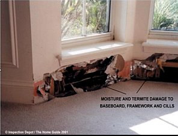 
Nässeschaden in gedämmtem Holzrahmenbau-Wohnhaus mit Termiten und Schimmel (Quelle: Inspection Depot - Home Guide 2001)](http://www.inspectiondepot.com/id/home_guide.html)

[US-WDVS-Schäden - Synthetic stucco [EIFS] failures](https://www.facworld.com/FACworld.nsf/doc/stucco): 
_"In fact, in a group of randomly tested homes with EIFS wall finishes, fully 95% were found to have some moisture problems, with the resulting damage estimated to average $3,000 to $5,000. Similarly, a study of such homes by the American Institute of Architects found “unacceptably high” moisture levels in 90% of the 205 EIFS homes it tested. While the problem is not yet of massive size, some homebuilders in South Carolina have reported damages of $30,000 to $100,000 in some homes and insurers have reported “total losses” in homes only five years old."_ 
[Schimmelpilzverseuchung in WDVS-Haus: [Senatorin Jackie Winters](http://www.leg.state.or.us/winters/)' Enkelin an multiplen Hirntumoren erkrankt, extreme andere Krankheitsfälle in vielen WDVS-Häuser - WDVS Verbot in Oregon beantragt - Proposal would toughen ban on fake stucco [EIFS]: Illnesses attributed to use of siding's synthetic version](http://blog.njeifs.com/2007/07/proposal_would_toughen_ban_on.html) 

[ 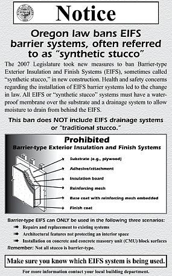 
Offizielle Informationsgrafik: US-Staat Oregon verbietet WDVS-Anwendung](http://www.cbs.state.or.us/bcd/whatsnew/barrier_notice.pdf): 
_["**EIFS Prohibition – House Bill 2112**](http://www.agc-oregon.org/public/legislative_affairs/legisreport07.pdf) 
The problems with Exterior Insulation Finishing Systems (EIFS) have been widely known, particularly the problems with the earlier version of the product when it is applied to wood without backup drainage systems. The propensity of the product to fail has led to insurers refusing to cover contractors who utilize these systems. While the issues with EIFS and other construction products have been discussed in the past few sessions, this session the discussion hit much closer to home. [Senator Jackie Winters (R–Salem)](http://www.leg.state.or.us/winters/bio.htm) had a family member who purchased a house with an EIFS exterior that had failed and created a series of issues for the family. Her personal experience led to the policy contained in HB 2112 — a ban on the use of an EIFS system on wood that doesn’t have a drainage system. 
Legislative Action: Passed 
Governor’s Action: Signed, July 31, 2007 
Effective Date: January 1, 2008"_

[WDVS-Opfer und Haftungsanspruch - Do you have an EIFS-Claim?](http://www.theconstructionlawadvisor.com/eifs-claim) 
[Ed McClure & Beau Brincefield: Zeitbombe Wärmedämmverbundsystem WDVS - Homeowners with EIFS report serious problems with moisture penetrating and accumulating behind the EIFS](http://www.brincefield.com/publications/gr_eifs.php) 
[Bauschäden im WDVS: Feuchteanreicherung im Wandzwischenraum, Holzschäden durch Echten Hausschwamm, Schädlingsbefall, Riesen-Ameisen, Termiten, Schimmelwachstum - Moisture Accumulation In The Wall Cavity, Wood Damage by Dry Rot, Pest Infestation, Carpenter Ants, Termites, Mold growth](http://www.njeifs.com/lawyer-attorney-1033443.html) 
[WDVS-Skandalgeschichte und Nässe-Schäden inkl. Termitenbefall - EIFS Backgrounder - A Look at Exterior Insulation and Finish Systems](http://www.usinspect.com/residential/resource-center-be-renamed/house-facts/hot-topics-inspection-and-real-estate-industrie-11) 
[Douglas Pencille: WDVS - Die Fakten - Geschichte, Schäden, Verbote, Risiken - EIFS - The Facts](http://www.dspinspections.com/eifs_facts.htm) 
[Helaine Golden: WDVS-Katastrophen in Nord Virginia (Northern Virginia) und die besondere Schadensanfälligkeit und der erhöhte Untersuchungs- und Inspektionsbedarf von den durchfeuchtungsgefährdeten WDV-Systemen landauf und landab in den Vereingigten Staaten von Amerika (U.S.A.)](http://www.thestuccoinspector.com/VirginiaUpdate99.html) 
[Das Ergebnis des Prozesses gegen den WDVS-Hersteller Dryvit](http://www.thestuccoinspector.com/DryvitSettlement.html) 
[Hot Topic EIFS - Fakten, Fakten, Fakten - Entlarvung der WDVS-Hersteller-Lügen, Lügen, Lügen und Ergebnis-Berichte von den WDVS-Schadensersatzklagen gegen die Hersteller](http://www.thestuccoinspector.com/EIFS.html) 
[WDVS-Häuser fast alle aufgefeuchtet! - American Institute of Architects (AIA) found high moisture levels in 90% EIFS houses tested](http://www.usinspect.com/resources-for-you/house-facts/basic-components-and-systems-home/synthetic-stucco-eifs/eifs-timeline) 

[ 
WDVS-Schadensdokumentation in den USA](https://picasaweb.google.com/116782714729786277513/TheirWork?feat=flashslideshow##) von [Rob Santana](http://activerain.com/blogs/eifs101?page=2) 
[ 
WDVS-Schadensdokumentation in den USA](http://eifs.blogspot.com/2005/10/eima-and-edi-where-were-they.html) auf [EIFS Blogspot](http://www.eifs.blogspot.com/)

Auch der Lügenfilm von dem US-Ökoparasiten Al Gore wurde in England gerichtlich schnell als Hetze verboten. Dagegen bei uns? Die Machenschaften der Bauinstitute, Baubehörden, Bauministerien und Regierungsmitglieder, um den Hausbesitzer den WDVS-Mafiosi zum Abschuß freizugeben, nehmen ja im Verbund mit der von allen gleichgeschalteten Medien unterstützten Auslieferung der wehrlosen Bevölkerung an die anderen Ökoparasiten auch rund um die "Erneuerbare Energie" immer schauerlichere Formen an. Solche satanischen Hirnerweicher in deutschen Schulbehörden und auf den Regierungsbänken und -hinterbänken verpesten unsere junge Generation genauso wie die Alten mit Algoreismus, Klimaschutz-Massenhalluzinationen, CO2-Psychosen, Weltuntergangs-Phantasmagorien, Öko-Bio-Hypnosen, Fortpflanzungsdepressionen und anderen scheußlichen und suizidären Gemüts- und Hirnkrankheiten. Und wir alle - als durch die Bank feige Nazi-Mitäufer-und-Auschwitz-Weggucker-Nachkommen machen dank unseren von dem US-Genforscher Goldhagen richtigerweise entdeckten Mördergenen hurrahmäßig mit und niemand von uns allerhöchstens Im-stillen-Kämmerlein-Widerständlern traut sich wieder mal zu wehren - oder höchstens wie einst Karl Valentin: "Mögen täten wir schon wollen, aber dürfen haben wir uns nicht getraut." und die sieben Schwaben: "Hannemann, geh' du voran!" Oder ergreift vor der ganz Deutschland zerstörenden Ökomafia die Flucht und wandert eben aus. 

Die WDVS-Seite hat nun den Zieglern mit Hilfe einer offenbar ökowillfähringen Gefälligkeitsjustiz wettbewerbsrechtlich sogar verbieten lassen, sachverständigen- und urteilsgestützt auf das Algenbefallsrisiko der WDVS hinzuweisen, ohne zu verraten, daß brutale Fassadenvergiftung hier sehr kurzzeitig vorbeugen kann. Aus dem Beschluß des Landgerichts Wiesbaden vom 7.8.03:

_"... Dazu ist es zutreffend, dass das Landgericht Frankfurt/Main in der Sache 3-13 O 104/96 in den Entscheidungsgründen festgestellt hat, nach der Ansicht des dort tätigen Sachverständigen Dr. Schuder werde das Algenwachstum durch die Vollwärmedämmung begünstigt. Zugleich hat das Landgericht Frankfurt am Main aber auch festgestellt, dass durch entsprechende Gegenmaßnahmen, wie den Einsatz fungizider / algizider Mittel und ähnlicher anderer Maßnahmen der Algenbefall verhindert werden kann. ..."_ 

Ja, die Schlauheit deutscher Gerichte ist eben durch nichts zuübertreffen. Die biozid (lebenstötend) mit Algiziden (Algentötern/Pestiziden/Giften) und / oder Fungiziden (Pilztötern/Pestiziden) vergifteten Abwehrmittel - herrliche Zutaten in den Fassadenfarben - sind leider auswaschbar. Regen spült das Giftzeugs dann in den Vorgarten. Prost Mahlzeit, deutscher Ökokamerad, der Du Dein Petersiliensträußchen selbst im Gärtli biodynamisch züchten wolltest ... 

Und wenn Sie das Urteil im Original genießen wollen, können Sie das ja mal im Gericht probieren. Wobei man aus Justizkreisen flüstern hört, daß auch ein Hochhaus in Nürnberg als überzeugendes Beispiel der Feuchte- und Algenzerstörung des WDVS schon nach kürzester Zeit dienen kann. Selbst mein eigener schlauer Rechtsanwalt mußte nach nur wenigen Jahren sein ganzes WDVS-Büdli - ach so schick bauhäusslich gestylt! - einrüsten und instandsetzen lassen, da die Fassade total versaut war. Obwohl in geschütztester Hinterhoflage. Und ganz ohne zu klagen ... Man klagt halt sonst nur jahrelang herum, bis "der Schuldige" erwischt ist ... oder eben auch nicht, wie dieser etwas jüngere Fall der deutschen Rechtssprechung zeigt: 

Ein spargieriger Bauherr errichtet 2000 bis 2001 mehrere Wohnhäuser, fällt - logischerweise frei von jeglichem Sachverstand als rechter Bausimpl (lesen Sie hierzu mein [Bauherrnquiz](10hoai16.md)) mit Anlauf auf die Dämmwerbung herein und ordert bei einem für solche Sachen geradezu prädestinierten Malerbetrieb - ach wie sauschlau! - nach Vorschlag des wackeren Maler Klecksels ein Wärmedämm-Verbundsystem mit mineralischem Oberputz (der ja angeblich nicht so algen- und verschimmelungsanfällig wie seine ebenfalls gut marktgängigen kunstharzbeschwarteten Brüder sein soll). 

Aber - Pustekuchen! Schon nach zwei (2003), und erst recht nach drei Jahren verfärbt, verdreckt, verschmutzt, veralgt die neue Fassade und sieht sowas von häßlich aus, daß es sogar einer Sau graust. 

So war das nicht bestellt, sagt sich der beschissene Bauherr und will vom Handwerksbetrieb, der ihm diesen Schnulli preisgünstigst und frohgemut und nach eigener (herstellerberatenen!) Schlaumeierei auf die Fassaden gebabbt hatte, Schadensersatz. Man zieht - wegen hoher Schadenssumme - vor das Landgericht Darmstadt. 

Im Zuge der Beweissicherung wird für teuerst Geld auf Kosten des dreist klagenden Bauherren ein sogenanntes Sachverständigengutachten eingeholt. Und was der "normale" Bauherr nicht weiß - ja vielleicht nicht einmal ahnen konnte - der schöne Sachverständige rügt im trauten Verein mit der Interessenslage der von derart gelackmeierten Bauherren profitierenden Unternehmen - dem Malergeschäft und dem Dämmstoffprdouzenten und dem Mineralputzhersteller - nicht den unterlassenen Hinweis des planenden und ausführenden Pinselschwingers, daß das Aufbringen einer Fassadendämmung wirtschaftlich so gut wie nie vertretbar ist, das heißt, nicht einmal durch die versprochenen Energieeinsparungen, geschweige denn durch die tatsächlichen refinanziert werden kann und der Kunde damit durch Fassadendämmung erhebliche wirtschaftliche Nachteile und drastisch bezifferbare Einbußen erleiden wird. 

Der sich so vornehm zurückhaltende Fassaden-Experte rügt auch nicht den unterlassenen Hinweis des Handwerkssimpls, daß ein WDVS auf einer Fassade wegen seiner der mangelhaften Wärmespeicherfähigkeit geschuldeten allnächtlichen dramatischen Betauung und Kondensataufnahme zum Absaufen und Veralgen, Verschmutzen, Versauen und Verdrecken und Auffrosten und Abscheren und Aufreißen der Beschichtungsschwarte auf dem eklig Porenschaummüll nach Methode Beulenpest sozusagen rettungslos vorprogrammiert ist. Und dann, "entsorgt", die Umwelt verpestet wie noch nie ein Körndl Sand, ein Pfündlein Kalk, ein Steinderl Ziegel, ein Brökl Naturstein seit ewig, das vorher so bescheiden und brav die Massivfassade so wohlgefällig schmücken durfte. Bis zur Massenhalluzination namens "Energiesparen", "Klimaschutz" und "Öko". 

Nein, der so sachverständige Bauschadensgutachter, Fachgebiet bestimmt Mängel und Schäden an Wärmedämmverbundfassaden, rügt auch nicht, daß es der Herr Handwerksmeister netterweise vergessen hat, dem Bauherren die Verzögerung der allen Fachleuten der Branche seit Jahrzehnten bekannte Befallsgefahr durch den Einsatz der handelsüblichen Gifte im Anstrich - Pestizide, Fungizide und Algizide genannt - wenigstens nahezulegen, wenn schon nicht zu empfehlen. Warum er auf die Chemiekeule lieber nicht hingewiesen hat, kann nur vermutet werden: Vielleicht, weil dann selbst der strohdümmste Bauherr nachdenklich geworden wäre, und vielleicht ein wesentliches wirtschaftlicheres, preisgünstigeres und dauerstabiles Fassadenschutzsystem wie Putz und Anstrich gewählt hätte und damit halt mal kein Saugeschäft zu machen ist? Wir wissen es nicht und können nur ahnen. 

Dafür weiß der so ungeheuerlich unabhängige Sachverständige - und das genau diesen Lieblingdexperten auswählende Gericht stützt sich in seiner Urteilsfindung genau darauf - auf was denn sonst: Daß das WDVS den anerkannten Regeln der Technik entsprach, daß Vorhersagen über Algenbefall und Verschmutzung naturgemäß nicht möglich sind, da diese von der jeweiligen Umgebung, der umliegenden Flora und Fauna, evtl. in näherer oder weiterer Umgebung mehr oder weniger vorhandenen mehr oder weniger verschmutzenden Industriebetrieben und generellen Witterungseinflüssen überhaupt abhängig seien. Außerdem, daß Fungizide sowieso keine befriedigende Lösung dargestellt hätten, da diese eh' nur zeitlich begrenzt wirksam seien und darüberhinaus umweltschädlich und deswegen keinesfalls unbedenkliche Mittel seien. Besser wäre es wohl gewesen, wenn der Geschädigte schon die WDVS-Fassadenheizung, das ultimative Patent der Fa. Dörken im Jahre 2011, eingesetzt hätte, um die für jedes WDVS so arg bedrohliche Nässe, Feuchte, Tau- und Kodnnesattropfen stetog herauszuheizen - im allnächtlichen 365-Nächte-Betrieb jahrein und jahraus. Sonst hilft das jau auch nicht weiter ... 

Wo er Recht hat, hat er eben Recht, der hochverehrte ö.b.u.v. Herr Bausachverständige. Und so weist das Landgericht Darmstadt die Klage zurück (Urteil vom 7. August 2007, Aktenzeichen Az. 14 O 615/05). Der Auftraggeber habe nämlich keinen Beweis antreten können, daß ein Mangel vorläge und der brave Handwerksmann einen gebotenen Hinweis schuldhaft unterlassen habe. Oh, wie hierüber die von deutscher Justiz begünstigte Branche jubelt (Googlen!). Auf wessen Kosten wieder einmal? Raten Sie selbst! 

Mein kostenloser Tipp an alle interessierten geizgeilen Bauherren: 

Wenn Sie also eine schnellstmöglich versaute Fassade haben wollen - schnellstens zum nächsten Malermeister/Giftmischer um die Ecke! Da wird Ihnen geholfen. Und den Umweg über den Energieberater nicht vergessen! Der will auch sein Geld mit den Doofen verdienen ... 

Hin und wieder erwischt es auch mal den Verursacher der bauphysikalisch gesteuerten Wachstumsförderung. Lesen Sie weiter: 

Nach aktuellen Untersuchungen der eidgenössischen EMPA liegen die Oberflächentemperaturen der frei exponierten WDVS im Winterhalbjahr täglich etwa 15 Stunden unter der Taupunkttemperatur. In dieser Zeit säuft das WDVS aufkondensiertes Wasser ein. Jedoch auch im Sommerhalbjahr liegen die Betauungsperioden einer WDVS-Fassade erheblich über den Beregnungsperioden. Dabei bildet sich flüssiges Wasser in Tropfenform an den betauten Fassadenoberflächen. Da ein WDVS-Fassadensystem nur marginale Speicherkapazität für Wärme aufweist, kühlt es im Schatten und der Nacht unheimlich schnell aus und wirkt geradezu als Kondensatfalle. Seine wasserabweisende Beschichtung verhindert dabei das temporäre Wegpuffern der anklatschenden Nässe, wie es jeder kalkgetünchte Kalkmörtel altväterlicher Baukunst ohne weiteres fertig bringen würde. 

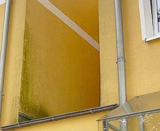 
Auch dieses jüngst modern sanierte WDVS-Fassädchen nimmt an schattenreicheren und kühleren Bereichen konsequent massig ankondensierende Nässe auf und zeigt deshalb das algige Problem - wie es dank hermetisch-dichter Plastikfenster in den Räumen schimmelt, spielt hier keine Rolle (Bildquelle: [Joachim Buck](http://www.joachim-buck.de/))

Zur Erinnerung: Selbst das für seine Dämmlobhudeleien seit Jahrzehnten berühmt und berüchtigt gewordene Fraunhofer-Institut für Bauphysik entlarvt die kondensatsaufenden WDVS-Wärmedämmverbundsystem-Fassaden und auch hochwärmedämmende Porensteinfassaden: 

 

 Ob es da Vorsatz ist, wenn es in der Broschüre vom Hessischen Ministerium für Umwelt, Energie, Landwirtschaft und Verbraucherschutz/wiss. Betreuung Institut für Wohnen und Umwelt (IWU) Darmstadt: 

["Wärmedämmung von Außenwänden mit dem Wärmedämmverbundsystem. Wissenswertes über die Außenwanddämmung bei Alt- und Neubauten. Energiesparinformationen 02"](https://www.energieland.hessen.de/pdf/ESpI2_Waermedaemmung_Aussenwaende_Waermedaemmverbundsystem.pdf) neben vielen anderen Verdrehungen der Wahrheit und Beschönigungen der technischen, wirtschaftlichen und gesundheitlichen Probleme und Risiken vollmundig heißt (S. 6): _"Die Dämmung schafft auch keine "dichte" Wand: Durch Mineralwolle wandert Wasserdampf genauso problemlos wie durch Luft."_? 

Ist das wieder mal heiße Luft, wie fast alles, was die Klimaschutz-Politik und Öko-Regierung unserer Lobbykratur an öffentlichen Weisheiten absondert? Denn an den allnächtlich ausgekühlten Minerallwollfasern fällt der im Luftikus-mäßig luftigen Dämmstoff von Anfang an in der Luft natürlicherweise schon enthaltene Wasserdampf, wie auch der sonstig eingedrungene als patschnasses Tauwasser aus und bleibt hängen! Denn die Schäume und Gespinste üblicher Wärmedämmstoffe können nicht kapillar entfeuchten. Und man muß wissen, daß Feuchtetransporte in Baustoffen 1000 zu 1 kapillar gegenüber dampffäörmig erfolgen. Das sollte zumindest jeder Bauingenieur und jeder Bauphysiker - nicht aber jeder hessische Dämmdepp wissen. Ebenso gibt es neben grausamen Schönrechnereien einer "optimalen" Dämmstärke von 12-25 cm als "Standardsanierung" auch nicht den allergeringsten Hinweis auf die Befreiungsmöglichkeit von der EnEV gem. § 25 für den fast immer vorliegenden Härtefall - wenn sich die Dämmerei eben nicht in z.B. 10 Jahren (Altbau) amortisiert. Und wenn das alles verschwiegen wird oder "nicht gewußt" wird, läßt das wohl mehr als tief in die finsteren Seelenabgründe hessischer Dämmdeppen blicken. 

Jeder Regen in ein sonnenbeschienenes, am Tage doll überhitztes WDVS sorgt dann zusätzlich für extreme Temperaturspannungen, da die Oberflächenschichten eben nicht wärmespeicherfähig sind und deswegen radikal abkühlen und sozusagen zusammenzucken. Das geht nicht ohne extreme Rißbildung und so überzieht ein spinnennetzartiges Mikrorißsystem nach kurzer Zeit die Kunstharzschwarten auf den labbbrigen Dämmpaketen. Ach ja, diese Risse sind selbstverständlich kapillaraktiv und saufen begierigst jeden Regentropfen hinten rein - zusätzlich zurnächtlich angelagerten Kondensatfeuchte. 

Die Nässe landet dann letztendlich im Dämmschaum bzw. Dämmgespinst und wird dort herzlich umarmt, festgepackt und sozusagen nie mehr entlassen. Das nennt man im Fachjargon _"Absaufen der Wärmdämmung"_. Wie das nasse Zeugs dann noch U-Wert-mäßig wärmedämmen soll, weiß auch niemand. Und so kommt es, daß diese WDVSe über kurz oder lang auf ewig naß herumstehen. Nasse Dämmpullis sollen dann dämmen? Prost Mahlzeit, sagen sich da Algen, Pilze und Flechten, die in trauter Innigkeit als sog. Symbionten gemeinsame Sache machen und das WDVS mehr und mehr bevölkern. In der Bauszene spricht man ironisch von einer "Solidargemeinschaft": Die Algen liefern die Fotosyntheseprodukte, die Pilze Wasser und Nährsalze. 

Da lassen sich dann auch die zähen Flechten nicht lange bitten und nehmen ebenfalls Platz am so dermaßen überreich gedeckten Tisch. Der Bauherr freut sich dann am gräulichen bis schrillbuntgrüngelben schillernden Fassadenbild, das diese Überlebenskünstler unter schlauer Zuhilfnahme von angebapptem Umweltruß und -dreck sehr eifrig malen.

 
Nur kurz nach Fertigstellung und Umlage der Modernisierungskosten können sich die hier eingebunkerten Hauptstadtmieter über diese herrlich, rein ökologisch korrekt, bio und ganz natürlich - natura naturans! - enstehende WDVS-Verfärbung erfreuen. Leopardeffekt - die helleren, weniger von den Energiesparschweinen versauten Rundfleckli über den wärmespeicherfähigen Wärmedämm-Tellerdübeln, feine weiße Fugenrandstreifen, die nachweisen, wie gut auch der Kleber am Plattenstoß die solare Wärme speichert, die da tagsüber mal vorbeischaut, Dreckstreifen über jedem Fenster, da es dort besonders feucht und schwül herausdunstet und dann am eisekalten WDVS pflichtgemäß kondensieren muß und sich deswegen auch dort als Staub- und Schmutzfänger sowie Optimal-Substrat für Algen, Flechten und Pilze niederschlägt. Soweit der Mieter nicht im eigenen Mief in seiner mit teuren Wärmeschutzfenstern hermetisch zugesiegelten und gegenüber früher dank Fettprofil recht unterbelichteten Bude verrecken will. Solche Fassaden zeigen oft den Unterschied des jeweiligen Überlebenswillens, oder eben den Unterschied an Feuchtedunst aus irgendeinem WDVS-Wohnloch ... 
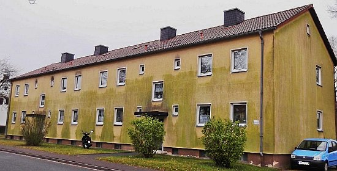 So wohnen die Mieter in verdämmten Wohnblöcken des Evangelischen Siedlungswerks ESW in Bayern, demnächst wohl auch in den landeskirchenbauamtlich energetisch sanierten Pfarrhäusern und Gemeindehäusern. Schon dolle, wie sich die grün-schwarze Gesinnung der evangelischen Kirche und ihrer leichtindustriegläubigen Baubeamten an der Fassade ihrer götterverdämmerten Mieter und sonstigen Immobiliennutzer darbietet, oder sollen wir besser epiphaniert dazu sagen? Oder ist es die besondere Fachkenntnis der evangelischen Bauabteilung dieses Massenwohnungsbauunternehmens und der landeskirchlichen Baubehörden - langzeitgetestet auch an all den inzwischen abrißreifen Sakralbauruinen der Nachkriegszeit unter christlichem Label? Die dazugehörigen Ausschreibungstexte hat bestimmt auch niemand auf VOB-Gerechtigkeit geprüft. Oder sollen wir tatsächlich glauben, daß derlei Handwerkskunst ganz ohne produzentenseitige "Einflußnahme" auf den ausschreibenden Planer gelungen ist, mit einer vorschriftsgemäßen vollständig produktneutralen Ausschreibung - Produkt XY oder gleichwertig genügt dafür nicht! Oder ist das alles absichtliche neosakrale Ökobioschöpfungs-Kunst am Bau? Credo, quia absurdum? 

Doch nicht alle Bauherrn jubeln immer über diese überraschend geile (vermehrungsfreudige!) WDVS-Kunst. Deswegen vergiftet der WDVS-Werker den fleißigen Malkünstlern die Suppe mit greulichen Zutaten: Fungizide und Algizide werden diese lebensfeindlichen Toxizitäten gerne verharmlosend genannt. Dabei sind sie nach ein paar Jahren oder weniger wieder aus der Fassade gewittert und die raffinierten Malkünstler rücken wieder an. Einer überraschend offenherzigen Publikation eines renommierten Farbenherstellers in "Bauen im Bestand / Bautenschutz und Bausanierung 6/2008" ist auf Seite 49 zu entnehmen: _"Gegen mikrobiologischen Bewuchs an WDVS-Fassaden funktionieren nach Erfahrungen der letzten Jahre wasserlösliche Biozide als "Allheilmittel" gegen Algen, Pilze & Co. doch nur eingeschränkt: Der größte Teil der Biozide wird bereits nach einigen Monaten aus der ebschichtung ausgewaschen und gelangt schließlich ins Grundwasser. Das bedeutet eine Belastung des sensiblen ökologischen Gleichgewichts sowie einen möglichen, später auftretenden Algen- oder Pilzbewuchs an der Fassade."_ 

Ja, das ist die perfekte grüne Weltrettung nach Geschmack unserer korrupten Öko-Politik: Erst die Bürger mit Gesetzen zwingen, den teuren Industriemüll an die Fassaden kleben, im isolierten Bauwerk ohne jegliche Energieeinsparung feuchtemäßig verschimmeln, während das Gift der Fassade in den Boden rinnt und dort das Grundwasser verseucht und nach kurzer Zeit die verrottete Algen- und Pilzbrutstätte wieder von der klatschnassen Wand rupfen, um den im Halbjahresturnus modernisierten Nachfolgerpfusch ans Haus zu pampen. Nur so können wir das Klima schützen, garantiert keinen Tropfen Heizenergie sparen und die Taschen der Chemielobbyisten und deren Polithuren und Beamtengehilfen an allen Stellen unserer korrumperten Dämmokratur täglich neu füllen. Mir ham's ja.

Und so zeigt es sich auf einem ehem. Rathaus, nach nur sechs Jahren (Gewährleistungsfrist ist gottseidank abgelaufen), Leopardeneffekt, Auffeuchtung, Frostbeulen, Risse und Oberflächenverluste inklusive:  
Oder auch so: Grünalgen und Schwarzalgen in bunter Mischung:  

Und so, ein Haus in NRW, Bj. 1930 mit ca. 20 Jahre altem, bunt bewachsenem, aufgenässtem und abbruchreifem Wärmedämmverbundsystem inkl. schönstem Leopardeffekt (Bildquelle: Beratungskunde): 
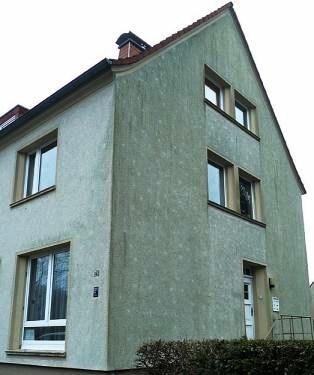 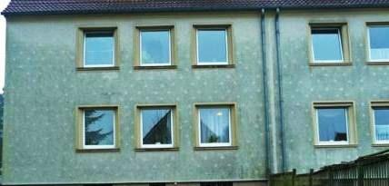 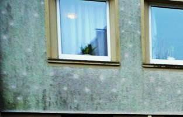 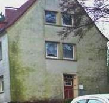

Ist diese Kunstfertigkeit dann aus Sicht der Bauherrn ein hinzunehmendes Bilderspiel, in der üblichen Gewährleistungsfrist schnöde "eine unvermeidbare Verschmutzung"? 

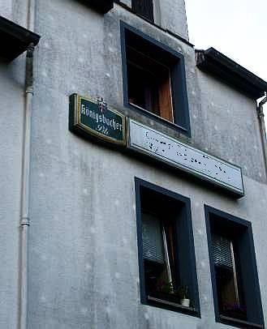 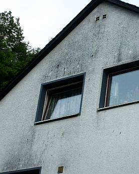 
Oder diese, an der Hauptfassade schon mal unten überstrichene und dennoch bald wieder auftauchende? Und am Giebelfoto wird schön sichtbar, wie eine feuchtwarme Zimmerluft am unterkühlten WDVS die naßkalten Voraussetzungen idealer Versauung schafft. 

Das kulturell ganz und gar nicht angehauchte LG Frankfurt am Main hat dazu im Urteil vom 19.12.1999 - 3-13O-104/96 schnöde entschieden:

_"Jeder Außenputz hat neben seiner bauphysikalischen Funktion auch eine ästhetische. ... Es bedarf deshalb keiner näheren Begründung, daß diese bedeutende weitere Funktion der Außengestaltung durch Mängel am Erscheinungsbild beeinträchtigt werden kann. Diese Funktion war durch die gräulich-grüne, wie verschmutzt wirkende Fassade an den maßgeblichen Seiten nicht unerheblich gestört. Die Ursache dieser Erscheinung liegt in dem Algenbewuchs ... Das Algenwachstum wiederum wird durch die Vollwärmedämmung begünstigt, die die Klägerin (Handwerker) auftragsgemäß erbracht hat. ... Sie war (haftungsrechtlich) verantwortlich für die Erstellung eines Außenputzes, der auch seiner immanenten ästhetischen Funktion entsprechen mußte. Dabei kommt es auf eine Unterscheidung danach nicht an, ob sie eben einen entsprechend geeigneten Putz verwenden oder die Beklagte auf das Risiko des ausgeschriebenen Putzsystems hinweisen mußte."_ 
Sauber neidappt, schlauer WDVSler! Hättst halt dem Bauherrn pflichtschuldig gesagt, daß sein ausschreibender Planer keine technisch-konstruktive oder gar bauphysikalische Ahnung hat, vom WDVS-Lieferanten durch Umsonstplanung und andere Annehmlichkeiten vielleicht bestochen wurde, daß das WDVS über kurz oder lang immer ein Wasser- und Staubsauger und Schimmelalgenflechtennährboden ist (giftfrei dauerstabile Beschichtungen ausgenommen), die Investkosten niemals durch Energieeinsparung reinspielen kann und was dergleichen mehr an unangenehmen Wahrheiten sein mag. Dann hätte er vielleicht ein nettes Fassaden-Instandsetzungsaufträglein bekommen und nicht ein so vernichtendes Urteil. Da er aber nix lernt, wird er dem nächsten Kunden vorsichtshalber zur Giftspritze für seine Kunstharzpampe raten. Warum sollte er auch Mitleid mit den armen Kinderlein haben, die dann im lebengefährlichen Sozial-Vorgärtlein unter dem Gift-WDVS ihre ersten und letzten Jährlein verbringen werden. Sind eh Ausländer, oder wat? 

Dipl.-Ing. Gunter Hankammer schreibt zu diesem Problem in _"Grundsätzliches zum Grünzeug, Mikroorganismen und Möglichkeiten dagegen an WDVS-Fassaden"_ , Bautenschutz und Bausanierung Nr.8, 12/04, jedoch: 

_"Architekten und Ingenieure sollten spätestens bei der Abnahme prüfen, ob die notwendigen konstruktiven und mögliche biozide Vorkehrungen zur Verhinderung einer vorzeitigen Verschmutzung durch Mikroorganismen getroffen worden sind."_ 

Will vielleicht sagen: Planer, sieh bloß zu, daß weder Du noch der ausführende Fassadenschänder vor Ablauf der Gewährleistung erwischt werden! Erst danach derf die Fassade aussehen wie geplant: Wie Sau hoch drei. Laß deswegen Gift in die Wandbeschmiersuppn neischmeißen ohne Ende! Den Bauherrn brauchst aber gwiß net aufklären, daß er im ureigensten Eigeninteresse auf so saublöde Geldnausscheißerei besser verzichten sollte und die EnEV genau dafür Paragrafen bereithält. Bist ja auch net dessen Treuhänder, sondern der billige Sklave des WDVS. Oh Borussia, hilf! ([Details zur Wasser- und Umweltvergiftung durch toxifizierte WDVS-Beschichtungen)](21314bau.md) 

Als kleiner Zwischenspurt Ihrer Reise auf den Dämm-Olymp hier ein paar Nachmittags-Spaziergänge durch das deutsche Dämmparadies von Norddeutschland bis Süddeutschland, Ostdeutschland und Westdeutschland: Alles die hochgelobte und hoch geförderte und von den gedämmten Mietern oder gar Wohnungseigentümergemeinschaften teuer bezahlte Energiespar-Mustersiedlungen/Musterhäusern - ein wahrer Hochgenuß für all die gegen das Wirtschaftlichkeitsgebot (§ 5 Energieeinspargesetz EnEG) verstoßenden Fassadenprofis aus Planungsbüros, und Handwerk, die für derartige Schandtaten sogar Geld bekommen: 

Landauf und ab: 

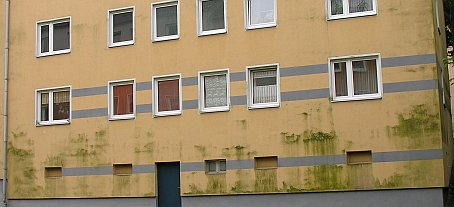1. Es grünt so grün, wenn Trottels Algen blühen! Mein Spott, jetzt hat's sie's! 2. Noch grüner! 3. (Bildautor 1-3: SK) 4. Mieterbeschiß total: Leoparden in Hamburg - aber nicht im Hagenbeck! 5. Mit Genehmigung des [Klimaschutz=Denkmalschutz-Denkmalamts und dem Klimasegen einer grenzenlos durchgeknallten Evangelischen Kirche](http://www.kirchefuerklima.de/newsarchiv/11/03/15/„denkmalschutz-ist-klimaschutz“-positionspapier-2011)? Für Norddeutschlands Volltrottel namens Hein Blöd, Piet Doof und Konsorten: Dieses Imitat aus Kunststoff imitiert Klinkerriemchen / Ziegelstein / Backstein / Backsteinmauerwerk / Klinkermauerwerk - also pures Blendwerk aus Plaste und Elaste anstelle Keramik, es gibt sie aus Polyacrylat, Polypropylen, glasfaserverstärktem Polyester-/Epoxidharz-/ Polyamid-Kunststoff GFK, Spritzguß-Spezialpolymeren und sonstwas - [hier findet man das schrille Zeugs](http://kunststoffklinker.fassadenverkleidung.com/) für die Algenzucht auf Dämmfassaden in reichster Auswahl. Das Grün ist aber echte Natur, mein liebes Ökodummerle! 

Ja, genau so grün wolltest Du den Öko, ach so, die von glockengestützten ökoperversen Talarträgern und Schwarzmeßzelebranten gepredigte und gesegnete Klimaschutzgerechtigkeit auf Kosten der Bausubstanz und des Geldbeutels ja unbedingt haben, eben so grün wie Du Grünschnabel auch hinter den Ohren bist, mal nur und ausnahmsweise ethisch-moralisch aus Sicht Deiner leidenden Mitmenschen bist, beglotzt. 

Wo sind sie nur geblieben, Deine eitle Mitmenschlichkeit, Dein stolz vor Dir hergetragenes Christendumm, Dein Deutschdummm, Dein Europäerdummm, Dein Weltbürgerdumm? In Deinem egozentrischen Egoismus an mangelnder Seelennahrung verhungert? Und so biste in die Falle Deiner grauenhaften Gewinnsucht und materialistischen Habgier getappt. Man gönnt sich ja sonst nix und auch Dein Geiz ist ja so geil, geil, geil, wa? Und mal nur so unter uns Pfarrerstöchtern - was hätten wohl Deine beiden Urgroßmütter - Gott habseseelich! - über sonen Urenkel gesagt? Brav mein Bub!? Oder eher den deutschen Sprichwortschatz runtergebetet, angefangen mit "Wer anderen eine Grube gräbt ..."? Ja, das war damals noch "gerechte Sprache" und kein Gender! 

Unmenschlicher Neid, Habsucht und satanische Gier, Deine besten Verbündeten auf dem Weg zur ganz persönlichen Ökohölle. Und denk mal dran und erinner Dich, wie klug Dein schlüpfriger Energieberater, Dein lieber Handwerker, Dein schwarzgeschnitzter Planer, Deine brave Hausverwaltung, Dein krawattierter Systemlieferant Dich an Deinem ach so ichsüchtigen Gewinnstreben gepackt haben! Prozente, Prozente, Prozente! Und Deine gottvergessene und solarkalbbesessene Kirche hat wieder mal ihren braungründreckigen Segen dazu gespendet. Im totalitären Einklang - ja, wie immer! - mit dem politischen Schweinepriestertum von Lobbyistens Gnaden. 

Und wie haste Dich gesorgt um das Wohlergehen Deiner paar warzigen Kröten, die Dir unterm Hintern geradezu ekzemige Hämorrhoidal-Beschwerden machten - bis das ecklig-uneträgliche Jucken ins blutige Kratzen überging? Diesmal nicht in isländischen Vulkanausbrüchen verfeuern, bankgestützten Immoschwindel im Ossiland oder US-Barackenland, nein in Dämmgoldspekulatius am eigenen Nachttopfhüttli Typ Ilsebill wollste infestieren. 

Hast extra Kredit - freilich KfW-mäßig zinsvergünstigt - dazugenommen, für den den großen Schlag. Daßde das Klima damit schützen wolltest, nie im Leben wollste das, ich weiß schon. Laß mal die anderen machen, Du wolltest scheffeln. KfW tut so weh, auf Nimmerwiederseh! Jawoll, Recht geschieht Dir, Dank sei Gott! 

Hättste Deine Kohle nach Biafra gespendet, hätste genausoviel davon gehabt, nämlich erstma Geld weg. Aber ärgern hättste Dich net müssen. Beim lieben Gott für Deine sündige Seele gesorgt und fürs letzte Stündlein angespart. Und jetzt? Jetzt haste den Neger mit seiner leeren Schüssel trotzdem hier direkt vor der Schnauze und den Ärger wegen Deinem tauwassersumpft-grünverkackten Geld auch. Ätschbätsch! Dat hastenundavon, mit den großen Höllenhunden und Zerberussen pinkeln gehn! An Ihren grünen Früchten hättsdese erkennen können, am Bombenabwurf auf fremde Länder Ost, am ökolgisch verbrämten Planwirtschaftsdämmokraturieren unbarmherzigster Feigheit und Boshaftigkeit hättsde se sooo leicht erkennen können, wennsde Dein verstocktes Herz und euroverklebtes Aug mal nur ein klenes Schlitzle geöffnet hättst - aber so ...: 

6. Vergrünte Plastikklinker 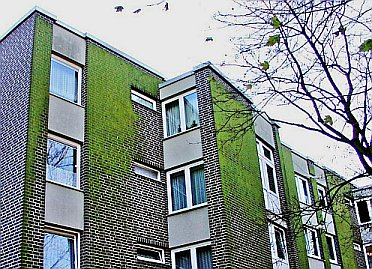7. Ziegelimitate, die echte Ökolösung für den gehobenen Klimaschützer 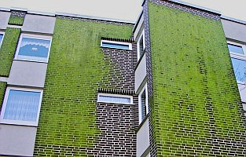8. Klimaterror, der in die Höhe strebt ... 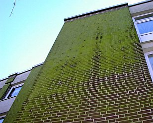9. Höher, weiter, Grüner, Amerga, wo biste? 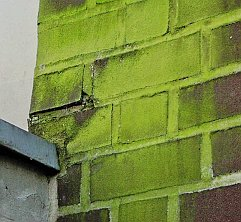10. Grüne Detailkunst des hanseatischen Energiesparmeisters. So macht energetische Sanierung Spaß für alle! 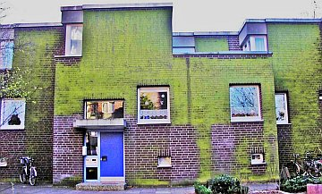11. Wohnen im Jrünen, mitten in der Freien und Hansestadt! Danke, grüne Politik der Ökoärsche in allen Parteien! 

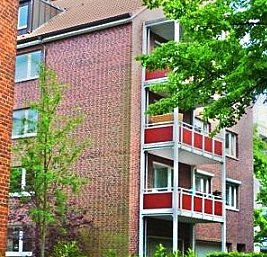12. Nassgrünes Kunststoff-Klinker-Imitat - Eck(l)ig Grün dank Grünalgen. (Bildquelle: Dietmar Ridder) 

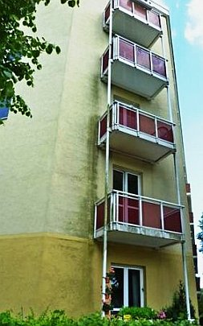13. Die ökologisch korrekte Energieeffizienz im Wohn-Hochhaus-Bestand: Feuchte WDVS-Fassade mit Schmutz und Grün-Algenbefall. (Bildquelle: Dietmar Ridder) 

Ei, sagen die Spezialisten, das war wohl nicht im Sinne des Erfinders. Hätte man doch auf das Wahre, Gute, Schöne gesetzt und dem edlen Mineralputz oder gar vermörtelten Backstenklinkerriemchen den Vorzug gegeben. Hä? Hamse mal dahinter geguckt, nur ein paar Jahre nach nicht funktionierendem Heizenergiegespare? Ich schon: 

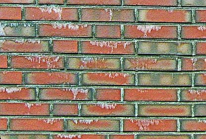14. Sinterbrühe läuft aus allen Zementmörtelfugen der gesamten Fassade 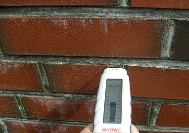15. Nach jedem Regen läuft hier die Brühe raus. 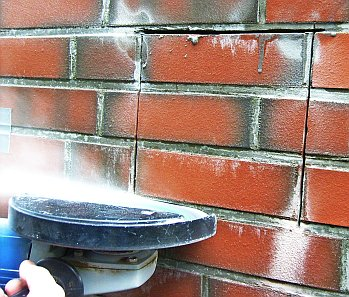16. Guck mer mal, wies dahinter aussieht - oh! Überraschung!: Das Wasser schießt aus der Fuge! 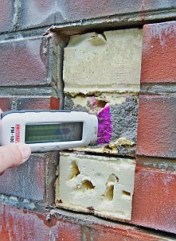17. Hier blieb die Feuchte stecken. Totalabsaufen der Dämmschicht aus PUR-Hartschaum. Nur die gute Verdübelung verhinderte, das die nasse Fassade abfiel. 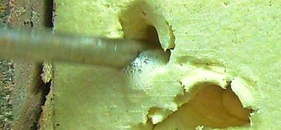18. Öko-Wasserkraftwerk selbst gemacht. Abgesoffene Dämmung aus Polyurethan PUR-Hartschaum. Ja, das spart Energie, nur noch eine Turbine drangeschraubt! Und schon ist wieder ein AKW gespart. 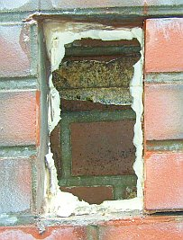19. Guckma in die Röhre: Ein naßfeuchtes Schimmelloch. Biotop nennt man das. Oder gar Ausgleichsbiotop für Windkraftspargel und Solarwüsetn allerorten in einst blühenden deutschen Landen? 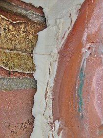20. Isolier-Riemchen auf PUR nach Freilegung, Schimmelpilzbefall hinter nasser Dämmschicht aus Polyurethan PUR-Hartschaum 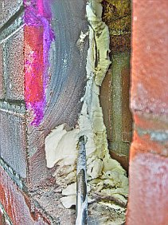21. Bis zum Schraubenzieher ist der Schaum naß getränkt, dahinter feucht, die Wand verpilzt. 

In einer fränkischen Medrrobohle (jawollja, auch manche fränkische Wohnungsverwaltungen und deren bratwurstgenährten Energieverbrader haben vielleicht von Duden und Blasen, von Dämmen und Dichten hin und wieder nicht die geringste, vom Geldvergeuden und Mieterzwacken bzw. Wohnungseigentümerhinterslichtführen mit U-Wert und Dämmstoff inklusive Kickback-Abzocke dafür umso mehr Ahnung) Und guggamal, wie dieser Effekt sowohl auf Schattenseiten wie auf den Sonnenseiten der Hausfassaden auftritt. Und wie man genau erkennt, welche vom Energiegeiz gepackten Bewohner lieber im Mief ersticken als zu Lüften und welchen Mieter ihr nacktes Überleben lieber ist: 

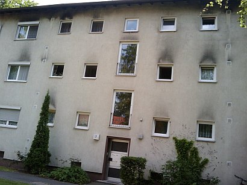 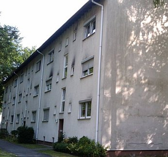 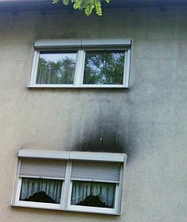 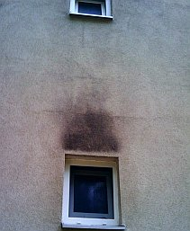 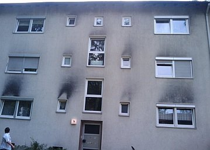   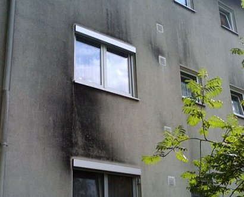 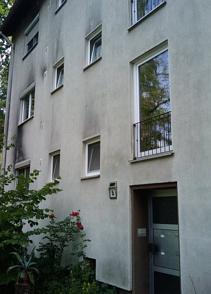 

No vielleicht gibt es aber auch Gründe, die das WDVS als prinzipielles Pfuschsystem entlasten können? Lassen Sie uns gemeinsam nachdenken, was die Fassaden über den Fenstern so schwarz machte: 

Ist das vielleicht eine Wohnsiedlung von Minkeß- oder Dschipo-Kaffeeröstern in Heimarbeit? Wohnen dort räuchergeile Buddhinduisten oder der altfränkische Hexen- und Zaubererverein Zur Schwarzen Katz? Privatweihrauchmeßzelebranten, Fassaden-Rußen oder ist das ein Fortbildungszentrum für MinistrantInnen? Hats überall gebrannt? Vermietet die Hausverwaltung nur an aus bayerischen Wirtschaften zwangsvertriebenen bzw. aus dem Oktoberfest exilierten Kettenraucherfamilien, die hier dank nahegelegenen Bierquellen privat zum geselligen Treiben zusammenfinden? Ist hier vielleicht das Hochleistungstzentrum für die urgemütlichen Raucherclubs und Zigarrenpfeifvereine? Oder, oder oder??? Hu nous? 

Am WDVS-Fassadensumpf vorbei auf dem Weg zur Arbeit in Ulm und um Ulm und um Ulm herum (Bildquelle: Marcel Hässler): 
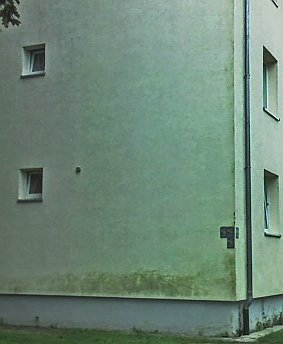1. 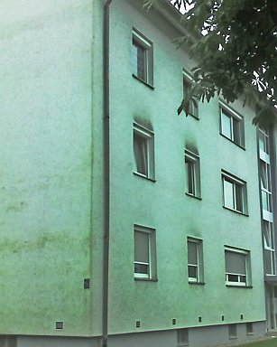2. 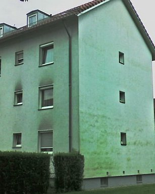3. 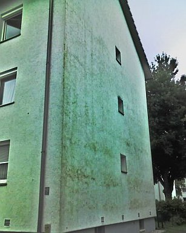4. 

Ein Sonntag im Juni in einem x-beliebigen Dorf der deutschen Michelsau und Oberkranken - Fassadenpest dank Energiesparen: Leopardeffekt (wärmespeichernde Dübel zeichnen sich heller ab, da sie nächtens weniger auskühlen und weniger angetaut werden), Grünalgen, Sto-/Iglu-Effekt (Dämmplatten zeichnen sich dunkel ab, Fugen dank wärmespeicherndem Fugmörtel hell), Dreck & Speck, Siff & Schleim, Feuchte & Rott!: 
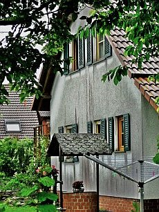1. 2. 3. 4. 5. 5a. 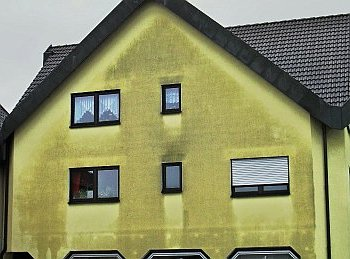6. 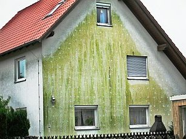7. 

Welche Bildnummer zeigt die berühmte, angeblich massive Porenziegel-/Dämmziegel-Fassade? Genau: die Nummer 6. Warum so gammelig? Weil sie eben auch nicht mehr richtig Wärme speichern kann - die Zementmörtelfugen zeichnen sich heller ab - und deswegen auch "auftaut", aufnässt und aufkondensiert, genauso wie der Dämmstoffdreck. Und wem gehören nun solche Häuser und wer hat sich so eklig reinlegen lassen? Hat der Energiespar-Architektenschnösel hier falsch beraten, der tabellenverliebte Ingenieur, der ahnungslos schwachverständige Sachverständige, der schlechtachtende Gutachter, der nicht Kopf-, sondern Handwerker, der schlaumeiernde Onkel, die grüne Tante, der lustige Bauforenaffe, der ökodiktaturverliebte Baubeamte? 

Wie auch immer, es kommt, wie es kommen muß - die deutsche Bauwissenschaft bemächtigt sich des Algenthemas und der Verrottungsproblematik dank Drittmittelfinanzierung auf ihre bekannte und vorhersehbare Weise. Bautenschutz + Bausanierung B+B Bauen im Bestand 5.2010 berichtet: 

_"Julia von Werder, Daniel Kogan, Helmuth Venzmer, Michael Sack, Winfried Malorny: "Etwas Wärme braucht die Wand ... Algenbesiedlung bei Wärmedämm-Verbundsystemen ... Temperierung der Putzoberfläche ..., die diese Verschmutzungen vermeiden sollen."_ 

Hä,?! Ja, Sie haben richtig gelesen. (Und können es hier in einer der dümmsten Dämmpropagandasendungen des GEZ-Fernsehens aus sehen: [Xenius - Hausdämmung - Was ist dabei wichtig?](https://youtu.be/zQfsNAhUYkg?t=32m12s)) Heizfassaden! Und findig, wie die deutsche Wissenschaft nun mal ist - mittels elektrischer Heizmatte, die in das WDVS eingebettet wird, oder alternativ mit Heizungsrohren, die im Sinne einer Wandheizung die WDVS-Oberfläche so warm hält, daß der geheizte Plastikmüll schneller trocknet und sich deshalb weniger Dräckli und Späckli, Älgli und Pülzli drauf niederlassen. Selbstverständlich und geradezu öko-logisch mit teurem Pufferspeicher für die tagsüber eingefangene Wärme zwecks nächtlicher Wärmerückgewinnung. Nach dem allseits bekannten Öko-System "Koste es, was es wolle, Hauptsache Klimaschutz!" Härrlich ährlich!, die einleitenden Worte des Fachartikels: 

_"Die Verschmutzung und Algenbesiedlung von Wärmedämm-Verbundsystemen wenige Jahre nach der Fertigstellung oder energetischer Sanierung der Gebäude stellt nach wie vor einen Baumangel dar, für den es keine nachhaltige Lösung gibt. Durch eine biozide Ausrüstung der Putze und Beschichtungssysteme_ [KF: d.i. Fassadenvergiftung mit Pestiziden] _kann eine Besiedlung um mehrere Jahre verzögert werden. Untersuchungen zeigen jedoch, dass die Auswaschung der Wirkstoffe_ [KF: GIFTE!] _in Abhängigkeit des Versiegelungsgrades und der vorhandenen Entwässerung langfristig zu einer erheblichen Belastung der Gewässer führen kann. Beschichtungssysteme, die aufgrund ihrer spezifischen Mikrostruktur oder ihrer photokatalytischen Eigenschaften einen Selbstreinigungseffekt aufweisen sollen, haben sich als unwirksam bei Kondenswasserbelastung beziehungsweise nicht ausreichend witterungsstabil erwiesen. Auch Farben mit selektiven strahlungsphysikalischen Eigenschaften und Putze mit Latentwärmespeichern (PCMs) zeigen bislang nur eine temporäre Wirkung. ... Die Putzoberflächen_ [KF von WDVS] _kühlen in klaren Nächten schnell ab und sind dadurch in besonderem Maße von Kondenswasserbildung betroffen. Auch Feuchtigkeitsfilme von Schlagregen trocknen auf den kalten Oberflächen nur langsam ab."_ 

Aha, sachichdoch. All das, was Ihnen Dämmfans im Handwerk, Gerichtsachverständige und LG-Justizpersonen als Abhilfe gegen die turnusmäßige WDVS-Versauung und Zerstörung aufschwätzen bzw. aufurteilten, hilft nix und taugt nix!!! Es wird naß, nach kurzer Zeit tropft das Wasser aus der Fassade und ob es nun grün, schwarz oder gelb wird, ist nur den jeweils gegebenen lokalen Umständen betreffend Wärmebefrachtung, Feuchtebefrachtung durch Regen und Kondensat, dem bunt gemischten krassen Unterschied der am WDVS beteiligten Schichtbaustoffe bezüglich ihrer Temperaturdehnung und hygrischen Verhaltens betr. Diffusion, Sorption und Feuchtedehnung geschuldet. 

Heizenergie in nenneswertem Umfang spart das Wandgedämme nie, auf keinen Fall in akzeptablen Amortisationszeiträumen und schon auch deswegen nicht, weil doch nur zwischen unter 20 bis unter 40 Prozent der Heizenergie den Raum durch die Wand verläßt! Und ein nasses WDVS doch nicht mehr dämmen soll, wenn man schon dem U-Wert Vertrauen schenkt. Viele aufgenäßte WDVS frieren deshalb - wenn eben die lokalen Umstände passen - letztlich ab und alle schimmelpilzen und grünschwarzen dahin - gnadenlos, da aus natürlichem Grund der Bauphysik, die Ihnen alle Energieberater-Bauphysiker gewissenlos verschweigen oder tatsächlich so brunzdumm sind, nix davon zu wissen und nix davon zu verstehen. Deshalb also die [irre Instandhaltungsrücklagen für WDVS im Vergleich zu Massivfassaden](213baust.md#ifb), um eben alle paar Jährli teuer zu pflegen, zu rüsten, zu streichen, abzureißen und zu erneuern. Aber dicker! So will es die Industrie und das Handwerk, die sich heutzutage beide den "Klimaschutz" auf Kosten der Kunden auf die Flagge geschrieben haben, oder? 

Ach so, es machen auch die BAFA- und Nicht-BAFA-Energieberater und Planer, sogar Architekten und Ingenieure bei diesem üblen Spiel mit? Die Architektenkammern und Ingenieurkammern werben in traulich-trauriger Eintracht mit den Handwerkskammern und Innungen und IHKlern für mehr wirksamen Klimaschutz? In Klimapakten, Klimaallianzen und Klimabündnissen rotten sie sich mit allerlei bauwirtschaftlichen und Hauseigentümer- und Mieter-Klientelverbänden zusammen, um die Welt nach besten Kräften zur verschlimmbessern, nei gar retten? Nicht mööööchlich! Oder doch? 

Na freilich, die Welt will doch gerettet werden, sagen die Medien. Und die Politik schlägt die Trommel, die Journalisten blasen die Posaune zum Abschlachten des gesunden Menschenverstand, der Wahrheit, Klarheit und Menschlichkeit, die Anzeigenwirtschaft floriert und die die schwarzen Köfferchen, pardon Koffer finden wieder ihre neuen Besitzer. Allet wird jut (?!). Eben Klimaschutz. 

Nun, die benannten akademisch betitelten Herrlichkeiten und Dämlichkeiten der Hochschulen Wismar und Neubrandenburg haben in ihrem "Forschungsprojekt" auch auf Steuerzahlerkosten - man gönnt sich ja sonst nix - untersucht, wie sich "temperierbare WDVS-Prüfkörper" mittels Elektro-Heizdraht-Temperierung und mittels Warmwasser-Kapillarrohrmatten-Temperierung gegen Pilzveralgung bewähren. Und - man höre, lese und staune! - herausgefunden (letzter Absatz des mehrseitigen Artikels, S. 23): 

_"Sollte es, wie einige Autoren schätzen, ausreichen, den Tauwasseranfall zu reduzieren, um visuelle Beeinträchtigungen langfristig zu vermeiden, können beide Systeme wirtschaftlich sein. Die Kosten für die Erstellung und den Betrieb der temperierten Systeme liegen dann unter den Kosten für die regelmäßige Wartung von konventionellen Referenzsystemen. Der energetische Mehraufwand wird durch das Entfallen der Wartungsarbeiten und die Gefahr der Gewässerbelastung kompensiert."_ 

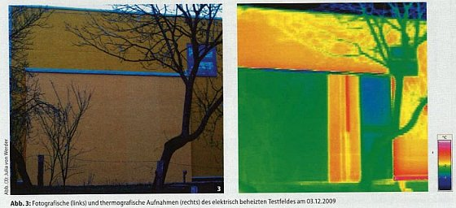 
So sieht das dann praktisch aus. Die Thermographenschwindler werden aufheulen. Wo sind sie nun geblieben, die tiefstblauschwarzen Frostfassadenflächen mit ihrer Feuchtereinsaugerei wg. 5-10stündiger Taupunktunterschreitung jede! Nacht, mit denen sie dem doofen Kunden weismachen, das wäre eine gute Dämmung und der doofe Bauherr bräuchte auch sowas? Ts. ts! (Bildquelle: Fotografin: Julia von Werder, abgedruckt im o.g. Artikel) 

 

Und so funktioniert der Dämmschwindel in den etablierten Qualitätsmedien mit Thermografien / Wärmebildern / Wärmebildkamera-Aufnahmen, die die Leser voll verarschen - bewundern Sie den Super-Brüller!!!: 
 
Wie schön wärmestrahlt der garantiert unbeheizte steinern-massive Denkmalsockel des von Karl Janssen nach Preisausschreiben und hochherzogen Bürgerspenden 1896 ausgeführte und ständig in der Düsseldorfer Altstadt herumziehende [Königsberg-Versailles-Kaiser-Wilhemlm-I.-Reiterdenkmals](http://fkoester.de/denkmaeler/KaiserWilhelm/index.php) so ultra heiß, heiß, heiß, ebenso wie die Bronzeapplikationen und das Reiterstandbild selber, die mangels Masse etwas weniger Solarenergie einspeichern können, deswegen schneller auskühlen und so etwas weniger heiß abstrahlen. Herrlich auch, wie das Dachgesims zeigt, wie die vom kalten Nachthimmel geschützten Friesrücklagen wärmer bleiben. Oder will hier jemand sagen, das NRW-Staatsbauamt und die Landeshauptstadt Düsseldorf haben mit heißem Glühherzen dafür gesorgt, das heißgeliebte Denkmal und diese herrlichen Massivfassaden so dolle und partiell recht differenziert heiß zu heizen, frei nach dem Motto Jeck bleibt Jeck? Oder als konservierende Temperierung, die die für alle bewitterten Teile so arg bedrohlichen Temperaturschwankungen ausbremst? Nur die modernen Jecken bauen nutzlose Auskühlfassaden aus dünnen Platten und viel Glas, wie am Landtag - die mangels Speichermasse jede Nacht dolle abfrosten und nur von den Doofsten der Doofen als "gut gedämmt" bezeichnet werden. Junge, Junge, da ist offensichtlich Dauerkarneval angesagt. Jeck, wie die Leute sind, wird nun bestimmt bald auch der Kaiser Willi mit Vollwärmeschutz gedämmt, damit auch er nur noch blauschwarz vor sich hinfeuchten und hinfrosten darf. Wer auf solche Schwindellügen der Dämmbranche noch reinfällt, ist der noch bei Sinnen? Voraussichtlich gibt es hierzulande aber allzuviele, viele davon ... Und für die machen die Klimaschutzterroristen in Amt und Würden dann das neue Klimaschutzgesetz. Denn wir Wähler wollen und müssen betrogen werden, am besten von der selbst gewählten Regierung! Denn nur die allerdümmsten Kälber wählen ihre Merkel selber, egal ob rot, grün, schwarz, gelb oder braun. 
(Bildquelle und Originalartikel: [WAZ: "Ministerien verplempern Energie"](http://www.derwesten.de/nachrichten/im-westen/Jedes-zweite-NRW-Ministerium-verheizt-zu-viel-Energie-id4534888.html) Printausgabe 12.04.11, Link auf Onlineausgabe, von dort auch die Einzel-Aufnahme des Standbilds)

Freilich wird im - ossitypisch? - marxistisch-leninistisch-verwissenschaftlichtem Kauderwelsch auch irgendwie festgestellt, daß die herrlich ingeniöse Heizerei den systematisch erhöhten Kondensatanfall auf WDVS nur etwas verringern, nicht verhindern kann, und daß die "Fassadentemperierung" sich rein vom Heizenergiegespare betrachtet, nie und nimmer wirtschaftlich amortisieren kann. Und je nach System zu Mehrkosten von ca. bis 20 (elektrisches System) und bis 35 Euro (Warmwassersystem inkl. Speicherkosten) je Heizdämmquadratmeter belaufen. Man/Frau ist ja ehrlich! Und bestätigt mit dem Wahnsinns-Vorschlag, Dämmfassaden künftig professionell außen zu beheizen, alle hier auf den Seiten reichlich gemachten Vorbehalte gegen den WDVS-Pfusch. Oder? Denn welcher Buntspecht will sich dann noch durch elektrisch schlagende Kupferkabel oder Kupferrohre durchbeißen? Oder doch? Kommen dann als nächstes Wissenschaftsereignis elektromechanisch-automatische Spechtvergrämermaschinismen, um spechtinduzierte Abbrände und Kurzschlüsse oder auch tsunamiartige Fassadenüberschwemmungen am WDVS profimäßig zu verhindern? 

Und bauen wir dann auch elektrisch betriebene Kühlsysteme in die WDVS-Flächen ein, damit die Wärmebildkameristen auch zukünftig noch tiefblaue Bilder von perfekt wärmedämmisierte Hausfassaden vorlegen können? Oder langt es aus, dafür mal die neue Fassadenheizung abzuschalten? 

Und wie berechnet das neue EnEV-Programm und die DIN 4108 künftig die dollsten Energieersparnisse und CO2-Vermeidungen durch Heizfassaden-WDVS schön? Wir warten. Das WDVS-Heizsystem mit der Kapillarrohrheizung und der elektrischen Heizmatte ist von einem Großen der Branche - der Ewald Dörken AG - schon patentiert. Aus dieser unbedingt lesenswerten Patentschrift, dere Diktion nahezu identisch dem "wiss. Artikel" der genannten "Autoren" ist, selbstverständlich ohne dort im geringsten genannt bzw. zitiert zu werden (System Raubritter/Raubkritzler/Guttenberg) [Patent DE102009035656A1](http://www.patent-de.com/20110203/DE102009035656A1.html): 

_"Die Erfindung betrifft eine Gebäudehülle (2) eines Gebäudes (1) mit einer außenseitigen Gebäudeschicht (3). Erfindungsgemäß ist vorgesehen, dass die außenseitige Gebäudeschicht (3) zumindest bereichsweise eine über eine Heizeinrichtung (12) beheizbare Struktur aufweist, die zur zumindest bereichsweisen Erwärmung und Abtrocknung der außenseitigen Oberfläche (13) der außenseitigen Gebäudeschicht (3) zur Verhinderung der Vergrünung der Oberfläche (13) vorgesehen ist. ... 

Die Absenkung der Oberflächentemperatur an der Außenseite der außenseitigen [WDVS-]Gebäudeschicht führt dazu, dass insbesondere in den Nachtstunden der Taupunkt regelmäßig unterschritten wird und erhebliche Mengen Kondensat auf der außenseitigen Oberfläche der äußeren [WDVS-]Gebäudeschicht anfallen. Dieses wird in den folgenden Tagstunden, insbesondere bei nicht oder nur geringfügig sonnenbeschienenen Bereichen der außenseitigen Gebäudeschicht, nicht mehr vollständig abgetrocknet, so dass die Oberfläche dauerhaft oder überwiegend feucht bleibt. Dies bildet die Grundlage für das Wachstum insbesondere von Algen. Dieses Phänomen wird als (Fassaden-)Vergrünung bezeichnet. 

Die Vergrünung war bereits Gegenstand vielfältiger Untersuchungen. So wurde versucht, die mittlere Temperatur der Oberfläche durch Verwendung von IR-reflektierenden Beschichtungen anzuheben oder die Oberflächen der Fassaden mit Algiziden, Fungiziden oder photokatalytischen Beschichtungen auszurüsten. All diese Ansätze zeigten jedoch keinen dauerhaften Erfolg, so dass relativ kurze Renovierungszyklen erforderlich waren. 

Aufgabe der vorliegenden Erfindung ist es nun, hier Abhilfe zu schaffen und eine Möglichkeit zur Verfügung zu stellen, mit der in einfacher und kostengünstiger Weise die Vergrünung der außenseitigen Oberfläche der äußeren [WDVS-]Gebäudeschicht einer [dämmenden] Gebäudehülle eines Gebäudes verhindert werden kann. ... 

Zur Lösung der vorstehend genannten Aufgabe ist erfindungsgemäß vorgesehen, dass die außenseitige [WDVS-]Gebäudeschicht zumindest bereichsweise eine über eine Heizeinrichtung beheizbare Struktur aufweist, die zur zumindest bereichsweisen Erwärmung und Abtrocknung der außenseitigen Oberfläche der äußeren [WDVS-]Gebäudeschicht zur Verhinderung der Vergrünung der [WDVS-]Oberfläche vorgesehen ist. Letztlich liegt der Kerngedanke der Erfindung also in der Integration einer Struktur in einer luft- bzw. außenseitig der Dämmung angeordneten Schicht, wobei die Struktur dann mit externer Energie versorgt wird, was zur Beheizung der Struktur führt. ..."_ 

Dagegen war das Rathaus in Schilda der Tempel der Weisheit, oder? Doch bestimmt wird es Dämmfreunde geben, die sich das elektrische Energiesparen und Algenvergrämung auch richtig was kosten lassen wollen. Da empfiehlt sich vor allem ein intensiver Strompreisvergleich, dann heizt sich die wärmende Fassadendämmung doch etwas billiger. Und: Denken Sie auch an die Prüfung Ihrer Gebäudeelektrik nach DGUV Vorschrift 3 (ehem. BGV A3 Prüfung). Das ist viel sinnvoller als eine elektrische Dämmheizung. Vor allem, wenn im Brandfall die Versicherung danach fragt. Was man ja wissen muß - an die 70 Prozent aller Brandfälle kommen aus der defekten Elektrik. 

Hier der zum Elektrodämmwahn passende [Blogbeitrag meines lieben Kollegen Matthias Bumann](http://baufuesick.wordpress.com/2011/04/11/endlich-das-mit-strom-beheizte-wdvs/) dazu. 

Im deutschen Klimaschutz, das auch durch Maximalförderung für die lächerlichste Energiegewinnung mit Sonnenstrahlen prunkt, ist nun wirklich nichts unmöglich. Die (angebliche) Energieersparnis gleich in der Pfuschfassade verheizen, damit die Pfuschfassade länger an der Wand bleibt. Manno! Geht's noch? System Idioyota. Für die Lichtsackforschung Marke Schilda gibt es derzeit Fördermittel, für das Heizen der WDVS-Dämmfassaden bestimmt demnächst ... 

DIE WELT zum Thema - Richard Haimann:[Giftige Schimmelpilze: Sanierte Häuser massenhaft von Algen befallen](http://www.welt.de/finanzen/immobilien/article13372977/Sanierte-Haeuser-massenhaft-von-Algen-befallen.html) 

Weiter: **Der Schwindel mit der Wärmedämmung -[Kapitel 4](2134bau.md)**
