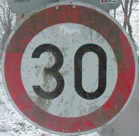
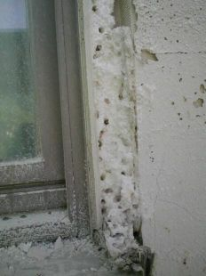
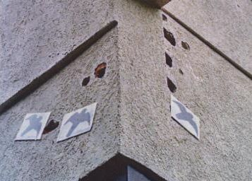
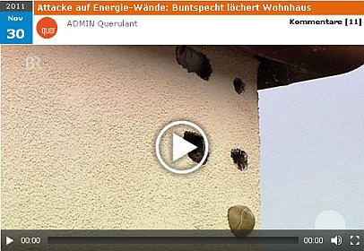

[🠔 Zur Übersicht: Dämmung](213baust.md)  
# Schädlingsbefall und Spechte im WDVS und der Thermographie-Schwindel
**Was an gedämmten Fassadenflächen wirklich passiert**  
_von Konrad Fischer_

## Der Schwindel mit Wärmedämmung und Energiesparen 4

Was an gedämmten Fassadenflächen wirklich passiert

[zurück<-](2133bau.md) Kapitel [-> vor](2134bau.md)

## Schädlingsbefall, Parasiten und Dämmstoff

Schön, daß die Ökowissenschaft inzwischen herausgefunden hat, daß wir mit Algen endlich und sogar das [angebliche "Klimakillergas CO2"](7argus.md) beseitigen können:

_"Am Botanischen Institut der Universität Köln konnte nachgewiesen werden, daß Grünalgen das Kohlendioxid innerhalb von nur zwei Tagen vollständig beseitigten und zu interessanten Produkten umbauten. Ein Beitrag gegen den Treibhauseffekt?"_ - titelte die Zeitschrift UMWELTSCHUTZ im Jahre 1996 in ihrer Wissenschaftsrubrik. Nun versteht man die allseits grünenden Öko-WDVS-Fassaden schon besser, gelle?

 
_Auch dünnblecherne Verkehrsschilder in der Nähe von hohen Bäumen veralgen und leisten so ihren Pflichtbeitrag zum Klimaschutz - eine logische Folge ihrer Exposition, aber auch ihrer mangelhaften Speicherfähigkeit und kunstharzigen Oberfläche, beste Voraussetzungen für Kondensatbeaufschlagung bei jedem feuchtwarmen Lüftchen und folgendem mikrobiellem Bewuchs_

Schadensbeispiele zur Bauwerksdämmung / Gebäudedämmung / Bauwerksisolierung / Gebäudeisolierung bietet auch dieser Superlink: [DIMaGB.de - Infobereich: Alte Häuser und Wärmedämmung](http://www.dimagb.de/info/baualt/ahwd01.html)

Und hier mehr Fachinfo: 
[Algen an der Wand - Grünalgen und Schwarzalgen auf WDVS-Fassaden - Warum/Wieso?](7wdvs13.md) 
[Schimmel durch und trotz Dämmung/Schimmel an der Wand](7schim.md)

Aus einer Leserzuschrift vom 10.7.02:

_"Sehr geehrter Herr Fischer, 
ich habe in "[Immobilien Wirtschaft und Recht](http://www.iwr-magazin.de/)" Ausgabe 06/2002 einen Artikel über Wärmedämmung gelesen. In diesem Artikel werden Sie mehrmals erwähnt. Beim Lesen des Artikels hatte ich den Eindruck, dass unser Objekt gemeint ist. 
Ich lebe in einer Eigentümergemeinschaft mit 32 Einheiten. Vor ca. 10 Jahren wurde unsere Fassade saniert. Es wurden Wärmedämmplatten auf die Ziegelsteine aufgeklebt. Auf diese Platten wurde ein Kunststoffnetz aufgebracht. Danach wurde die gesamte Konstruktion verputzt. 
Nach ca. 4 Jahren bildeten sich auf der Nordseite im Bereich der Fenster schwarze Flächen, dass man meinen könnte, es habe bei uns gebrannt. Der herbeigerufene Handwerker hat die Nordseite mit einem Hochdruckreiniger gereinigt. Es dauerte kein Jahr und die Fassade sah wieder aus, als habe es bei uns gebrannt. Jetzt wollten die Handwerker die Fassade mit Fungiziden behandeln. ... Durch den Bericht in "[Immobilien Wirtschaft und Recht](http://www.iwr-magazin.de/)" wurde uns deutlich, welches Gift wir uns beinahe ins Haus geholt hätten. 

 

Die Fassade sieht inzwischen aus, dass unser Objekt Gesprächsthema im ganzen Ort ist. Leute, die uns nicht kennen, stufen uns ins Asozialenmilieu ein, nur wegen dem Anblick unserer Fassade. ..."_ 

In "Das Architekten-Magazin" 6/2001 beleuchtet Architekt Klaus Aggen an einem Wohnungsbau-Beispiel das Ausmaß des Problems: _"Die Volkswohnung GmbH Karlsruhe lässt zur Zeit von ihren Hochhäusern etwa 20.000 m2 applizierte, 4 cm starke Polystyrol-Außendämmung wegen Wasserakkumulation und Mykosekulturen und "Altersschwäche" wieder entsorgen [...]."_ 
In Bauhandwerk 1-2/2002 stellt Wolfgang Cyrol, Leiter Produktmanagement Fassadenbeschichtungen bei der mit allerlei Dämmexperten offenbar reich Sto AG in Stühlingen zum Thema Algen, Vergrünung und algizide Vergiftung von Dämmfassaden dankenswerterweise fest: _"Es muss klargestellt werden, dass beweisbar alle Untergründe im Innen- und Aussenbereich mit Algen und/oder Pilzen befallen werden, wenn die entsprechenden Wachstumsvoraussetzungen gegeben sind. Dies gilt nicht nicht nur für WDV-Systeme, sondern für alle hochdämmenden Untergründe."_ 
Solch klare Aussagen hätte man gern von allen Herstellern der Dämmwahnprodukte - von Mineralfilzen und -gespinsten über PUR- und PS-Schäumen bis zu zerporten Ziegel- und Gasbetonschwämmen. 

 
_**Abbildung:** Eine verschindelte Mineralwolledämmung auf Ziegelmauerwerk von außen - mit frischen Nässespuren der vollgesoffenen Dämmung am Sockel, und von innen - die Schimmelpilzzucht (Bildquelle: Dipl.-Ing. Steier)._

Doch wo dank warmer Nässe die botanische Flora wächst, ist die parasitenreich betierte Fauna nicht weit - und schon nach einem Jahr ist manche Dämmfassade die perfekte Madenzuchtstation, in der der Parasitenbefall feuchtfröhliche Vermehrungsorgien abfeiert:

 
_Aufnahme: Edmund Bromm, Fa. ISAR Bautenschutz, in München (aufgenommen während des von den verekelten Hausbewohnern veranlaßten Abbruchs des madendurchwachsenen WDVS)_

Na, wo so feine Maden wachsen, steigt selbst ein eingeschworener Borkenkäferliebhaber gerne um:

 
_Aufnahme: Prof. Dipl.-Ing. Arch. Jens Fehrenberg, ö.b.u.v. Bausachverständiger, an einem WDVS-verschandelten Tagungshotel in Norddeutschland._ 

Nachdem der Specht jedes Jahr seine Bruthöhle neu löchert - sehr standorttreu übrigens - finden fröhliche Stare als faule Nachmieter ein prima Domizil. Man könnte bei derlei Zugvögeln durchaus auch mal an die in Hausbesitzerkreisen besonders beliebten Mietnomaden denken. Schau, wie sie aus den Löchern lugen! Der Hausmeister scheint ein wahrer Tierfreund zu sein. Seine so tierliebe Vergrämungsaktion ist bestimmt vom Landesbund für Vogelschutz, Abteilung Buntspechte und Grünspechte, beraten. Auf und vor allem unter den tagsüber extrem erwärmten dünnen Kunstharzputzen der WDVS-Schwarte tummeln sich außerdem die Insekten in Massen. Die nächtliche Abkühlung der nicht speicherfähigen Dämmschwarten liefert das notwendige Tauwasser, das dann den reich gedeckten Tisch für den Parasitenbefall mit den nötigen Getränken versorgt. Juchhei! - Das lockt den Specht und verführt ihn zur Ansiedlung. Er klopft auch gerne erst mal die Löcher, in denen dann die Insekten ihre Behausung finden. Vergrämungskonzepte mit Windspielen, Großvogelattrappen (Storch, Rabe, Sperber ...) werden mit mehr oder weniger Erfolg angewendet. 

Die SPD-nahe Zweimonats-Zeitschrift ["Berliner Republik"](http://b-republik.de/) im Vorwärts-Verlag schreibt dazu in ihrer letzten Jahreausgabe 6/2008 unter _"Spechte, Milben, Schimmelpilze": 

Über die Risiken und Nebenwirkungen des Programms [Energetische Gebäudesanierung] wird allenfalls in Expertenkreisen diskutiert. Oder im Internet. 

Eine Kostprobe: 

"Hilfe! Ein Specht hat unsere Fassade mit Wärmeschutzisolierung für sich entdeckt. Wie bekomme ich diesen Vogel wieder los?" Wer die Stichwörter "Specht" und "WDVS" (Wärmedämmverbundsystem) im Netz eingibt, lernt das Leid von Hausbesitzern kennen: "Mein Nachbar hat dasselbe Problem. Zuerst hat der Specht ein Loch in die Styro-Fassade gemacht, weil dahinter ein Hohlraum war, und sich ein Nest gebaut, und kaum ist er wieder ausgezogen, sind die Eichhörnchen eingezogen und wohnen bis heute drin." Wer den Schaden hat, braucht für den Spott nicht zu sorgen. Unter dem Stichwort "Spechtschäden an Fassaden" findet sich im Netz auch eine Immobilienanzeige für Spechte in Fassadenhöhlen: "Bequem zu erreichende, wohligwarme Nisthöhle, in vor Raubtieren bestens geschützter Höhlenlage, mit Futtergarantie, samt Telefonanschluss, kostenlos zu vergeben" ..."_ 

Am 24.02.2009 berichtet die Augsburger Allgemeine von einem lokalen Bauskandal rund um die Fassaden des vor nur acht Jahren errichteten Augsburger Justizpalastes - Baukosten 38 Mio Euro.: 

_"[Sanierungsfall: Spechte löchern die Gerichtsfassade](http://www.augsburger-allgemeine.de/Home/Lokales/Augsburg-Stadt/Lokalnews/Artikel,-Spechte-loechern-die-Gerichtsfassade-_arid,1496502_regid,2_puid,2_pageid,4490.html) ... Unter anderem muss die Fassade für einen sechsstelligen Betrag renoviert werden. Ein Teil der Arbeiten wurde bereits erledigt. Überraschend schnell setzten sich an den Außenmauern nämlich Algen an. Zudem übt ihr Putz auf Spechte einen unwiderstehlichen Reiz aus. Sie hämmern Löcher in die wärmeschützende Isolierung."_ 

Ja mei, die boarischen Specht hoit - vielleicht wollns den Hiasl aus den Klauen der Justiz befreien? Was rät nun das Augsburger Käsblättli zur Abwehr der Spechtplage - die lieben Vögeli sind nämlich naturgeschützt, Luftgewehrbeschuß (ach, wie würde sich der Schützenverein freuen, Samiel huif!), Schrotflinte und Giftköder bei Strafe verboten!? Lesen Sie selbst (Auszug): 

_"Das Tier stören, so oft es nur geht! Man kann z. B. nachts mit einer Taschenlampe in die Höhle leuchten; auch durch Lärm lassen sich Spechte verscheuchen. Einen Schutz der Fassade bieten Drahtnetze. Auch Gegenstände, die sich bewegen und/oder reflektierende Oberflächen haben, eignen sich zur Spechtabwehr, z. B. Windspiele oder Kinderdrachen."_ 

Aha. Wir stellen uns nun die betroffenen Fassaden vor, wie die Hausbesitzer mit Taschenlampen an und in ihren Spechtlöchern nachts herumlärmen - in steiler Höh! Aufi muaßi, dr Spächt rufft! Der vorherige Besuch eines Loriot'schen Jodelkurses erscheint zumindest nicht nachteilig, wenn man zum stilaechten boarischen Fassadenkraxler mutieren wui. All die Windspiele und Kinderdrachen an, auf und über Deutschlands WDVS-Fassaden. Herrlich! Und dann erst die engmaschigen Vernetzungen und Vergitterungen (an Justizpalästen)! Was mag sich diesmal das Ausland wieder denken? Kommt das der von deutschen Innenpolitikern und Stadtplanern geförderten kontrollierten Käfighaltung der deutschen Duckmäuser nicht sehr entgegen? Und was ist eigentlich mit der Haftung der Dämmplaner allerorten, denen ihre Berufsordnung doch "wirtschaftliche Planung" vorschreibt und die bezüglich der niemals wirtschaftlichen Fassadendämmung so tun, als ob sie niemals was vom Wirtschaftlichkeitsgebot gem. § 5 des Energieeinsparungsgesetzes EnEG gehört hätten? Vielleicht weil ihnen sonst der so sehr freundliche und hilfsbreite und geschenkebeladene Dämmstoffberater der Firma muellermeyerschultze.de nicht mehr die ganz und gar nicht produktneutrale Fassadenplanung kostenlos ins Planungs- bzw. Baubüro liefert? Wollmer wetten, daß auch bei diesem Justizpalast wie bei allen anderen keine einzige Ausschreibung den gesetzlichen und vertragsrechtlichen und haushaltsrechtlichen Ansprüchen an die von jedem Planer pflichtgemäß geschuldete produktneutrale Planung genügt? Sind also die in der Unterwolle der Baustoffproduzenten herangebrüteten untreuen Planer das wahre Parasitenproblem für den öffentlichen und auch den privaten Bauherren? Ein Blick in die Ausschreibung / das Leistungsverzeichnis gäbe Antwort: "Produkt XY oder gleichwertig" - Bingo! 

Doch zurück zu den Spechtschäden. Sie wachsen für Hausbesitzer/Hauseigentümer und vor allem die dämmwütigen Wohnungsbauunternehmen der Wohnungswirtschaft also zu einem zunehmenden Problem heran. Tauben waren gestern, heute ist Specht angesagt! Wenn das nur das einzige Risiko wäre für die Dämmerei, könnte das meinetwegen ja noch angehen. Dem ist aber leider nicht so ...

[ Bauforum: Specht macht Löcher in unsere wärmegedämmte Fassade!!!](http://www.energiesparhaus.at/denkwerkstatt/allgemein_a.asp?Thread=2693) - [birdnet.de: Spechte perforieren wärmegedämmte Hauswände](http://www.birdnet.de/spechte) - [Kein Aprilscherz: Hotline für Spechtschäden. Wie Berliner Spechte die Wohnungsunternehmen GESOBAU, GEWOBAG, DEGEWO und andere Wohnungseigentümer, die (wohl unter Mißachtung jeglicher Wirtschaftlichkeitserfordernisse zulasten der Mieter Vollwärmeschutzfassaden vor die Massivfassade klebten?) alljährlich zum löchrigen Wahnsinn treiben und neue Geschäftsideen zum Erblühen](http://www.pt-magazin.de/newsartikel/datum/2010/03/19/kein-aprilscherz-hotline-fuer-spechtschaeden/) - [Papageien / Halsbandsittiche als Fassadenbrüter im WDVS eines Heidelberger Altenheims](http://www.papageien.org/df/Df_loch_in_wand.html)

Unser Rechtssystem hält eigentlich die [passenden Paragrafen](7wdvs10.md) auch für solche Bauschadens-Phänomene bereit. Als Gegenwehr gegen die ökologische Wahrheit am Bau entfalten die gewerblichen, beamteten und gewählten Dämmfans jedoch ein Medientrommelfeuer bis hin zur steuergeldverschlingenden "Motivationskampagne Klimaschutz in privaten Haushalten", das auf den geringstanzunehmenden Verstand der offensichtlich seit vielen Jahrhunderten schon professionell durch Politik, Industrie, Handwerk, Medien, Schulsystem usw. vollverblödeten oder eben typisch-deutsch-leichtgläubigen Bevölkerung zugeschnitten ist.

Ein skandalöser und tragischer Höhepunkt des parasitenbefallenen Niedrigenergiehauspfusches dann der bis zum gräßlichen Abriß gesteigerte Ameisenbau in Burscheid. Aus einem [Interview des Kölner Stadtanzeigers](http://www.ksta.de/burscheid/hausabriss--der-kollege-hat-riesenmist-gemacht-,15189134,21009116.html): 

_"Nach 600-facher Überdosierung eines Insektizids durch einen Kammerjäger musste ein Neubau abgerissen werden. [...] Schädlingsbekämpfer Stefan Kittner [...] zum umstrittenen Abbruch des „Ameisenhauses“. 
TIM GATTER: Herr Kittner, das in Burscheid-Rötzinghofen nach dem fehlerhaften Einsatz eines Schädlingsbekämpfers abgerissene, gerade mal zwei Jahre alte Eigenheim beschäftigt nach wie vor viele Leser. Es bleiben offene Fragen. Besteht gerade bei Niedrig-Energiehäusern eine höhere Gefahr des Schädlingsbefalls? 
STEFAN KITTNER: Die Probleme bei besonders gedämmten und abgedichteten Häusern sind größer als bei konventionellen Bauten. Häufig führt die Luftdichtheit dazu, dass den Schädlingen Tür und Tor geöffnet wird. [...] Bei dem betroffenen Eigenheim konnte die Luft nicht richtig zirkulieren. Die ... Ameisen haben ... sich vermutlich in der feuchten Zone unter der Dämmung ausgebreitet. [...] 
TIM GATTER: Warum haben sich die Insekten in die Dämmplatten aus Styropor eingefressen? 
KITTNER: In den Löchern haben die Ameisen die Eier abgelegt. [...]"_ 

Und hier: [zu weiteren Mediendokumenten zu diesem Niedrigenergienässefangbau](http://www.facebook.com/permalink.php?story_fbid=495106757186680&id=241510365867). Wie raffiniert muß die Dämmstoffpropaganda wohl angepackt werden, damit junge und arglose Bauherren ihre Lebensinvestition so vernichten? Sowas wird den Vertrieblern und Kommunikationsbeauftragten in hochkarätigen Marketingseminaren Marke "Bauerfängerei" gelehrt - für Anfänger bis Fortgeschrittene ... 

 [Vogel vs. Energiewände: Buntspecht löchert Wohnhaus - quer - Bayerisches Fernsehen - ARD](http://web.archive.org/web/20111206032937/http://blog.br-online.de/quer/attacke-auf-energie-waende-buntspecht-loechert-wohnhaus-30112011.html): 
 

Themenlink: [DIMaGB.de: Rezension Sto-Bauherrn-"Ratgeber"](http://www.dimagb.de/info/bauphys/mbbph1.html#rezension#rezension)

Bewährte Schlagworte wie Arbeitsplätze, Klimaschutz und Nation gewinnen die doitsche Schnäppchenfangemeinde wie bei der [Wind- und Solartech](7wdvs04.md) für die volksbeglückenden Machenschaften unserer gesellschaftlichen Elite.

Beispiel:

ibau Planungsinformationen 10.12.1999 
**_"Wärmedämmung als Jobknüller_** 
**_Wärmeschutz bei Altbausanierung bringt 400.000 Arbeitsplätze_**

_Hamburg (ots) - Die Umweltorganisation Greenpeace und die Industriegewerkschaft Bauen-Agrar-Umwelt (IG BAU) haben in Hamburg eine Studie vorgestellt, die die großen Potenziale der Gebäudesanierung für den Klimaschutz und den Arbeitsmarkt belegt. Ein nationales Wärmeschutzprogramm für die Isolierung und Sanierung von Wohnungen kann bis zum Jahr 2020 die Emissionen des Treibhausgases Kohlendioxid im Gebäudebestand um insgesamt 58 Prozent senken (Vergleichsjahr 1999). Der Energieverbrauch der Gebäude wird dabei mehr als halbiert. Darüberhinaus würden dauerhaft mehr als 400.000 Arbeitsplätze in der Baubranche, im Handwerk und in anderen Wirtschaftszweigen entstehen."_

Kommentar: Ungenannt die vielen Arbeitsplätze im Medizinbereich wegen der in den "sanierten" Schimmelbuden verreckenden Bewohner. Daß die Fassadenpatscher, Wandbeschichter und -schmierer an den durch Dämmwahn erzeugten Bauschäden florieren, mag sein. Doch zu welchem Preis? Daß sich weder CO2 als Treibhausgas eignet noch irgendwelche Energie durch Dämmstoffverpackung sparen läßt, sollte bekannte sein. Lesen Sie [die Belege auf der Energiesparseite](7wdvs04.md) und den bundesamtlichen Overkill des Ökoschwindels - ["Klimafakten"](8buch22.md). Weiter im Text: 

_"Die Organisationen sehen die Studie des Wuppertal Instituts für Klima, Umwelt, Energie als klares Signal an die Bundesregierung, dass die Bausanierung ein Schwerpunkt künftiger Klimaschutz- und Arbeitsmarktpolitik werden muss. Jan Rispens, Klimaexperte bei Greenpeace: "Bundeskanzler Schröder kann auf einen Schlag zwei Ziele erreichen: einen Meilenstein für sein angekündigtes Klimaschutzprogramm setzen und 400.000 Arbeitsplätze schaffen. Also, ran an die Wärmedämmung!" [...]"_ 
Über die Wissenschaftlichkeit des Wuppertal Instituts für Klima usw. laßt uns mit Goethe schweigen: Man fühlt die Absicht und man ist verstimmt (Torquato Tasso). Daß IG BAU und Greenpeace dem Bundeskanzler eine solche Rhetorik gönnen! Ist es denn wirklich schon so schlimm? Und wer soll dann die 8 Milliarden Mark, die 400.000 Arbeitsplätze als Finanzierungshintergrund jährlich kosten, bezahlen? Unsere lieben Multikultis aus dem Drogen- und Sozialhilfeertrag? 

---

**Thermographie-Schwindel**

Die Marktbeeinflussung wird dann praktisch als "Greenpeace, die Wärmedämmvollzugs-Prüf-, Polizei- und Meldebehörde" umgesetzt, wie diese Meldung der Nürnberger Nachrichten vom 24.6.00 belegt: 

_"Ordnungsgeld von 500.000 Mark_ 
_Nun wird es hart 
Siedlungswerk Nürnberg fordert von Greenpeace Unterlasssung 

Das Siedlungswerk Nürnberg GmbH hat der Greenpeace Gruppe Mittelfranken eine Unterlassungserklärung zugeschickt [...] 500.000 Mark Ordnungsgeld, ersatzweise sechs Monate Ordnungshaft angedroht.

Greenpeace hatte mit einer Wärmebild-Kamera festgestellt, dass auch an komplett sanierten SWN-Häusern teilweise die Wärmedämmung vergessen wurde und die Mieter unnötige Heizkosten haben [...] Kritik veröffentlichte Greenpeace auf [...] Website <http://www.greenpeace.de/mittelfranken>. Über ein Haus heißt es [...], es sei in miserablem Zustand, selbst der ungeheizte Dachboden strahle erheblich Wärme ab. Dazu [...] Überschrift: "Hier muss man sich warm anziehen.""...

_ 

 
_Bild aus BYG-TEK 25.10.04_ 
_Link:[Frage: Wieso hat der Raum an der Ecke zwei unterschiedlich temperierte Außenwände? Details zum Schwindel mit Thermografie / Wärmebildaufnahmen](7wdvs06.md)_

_"... Solche Passagen zitieren die SWN-Anwälte und verlangen von Greenpeace zu unterlassen, den "Zustand von im Eigentum meiner Mandantin stehender Gebäude zu kritisieren und Ihre Untersuchungsergebnisse ohne Zustimmung meiner Mandantin ... zum Gegenstand eine Website im Internet zu machen." SWN sehe darin sein Ansehen als Wirtschaftsunternehmen beschädigt. [...] Greenpeace [solle] eine Unterlassungserklärung unterschreiben._

Greenpeace sieht [dafür] keinen Anlass [...] ihre Aussagen würden von SWN inhaltlich in keiner Weise bestritten. Eine Schmähung des SWN [...] liege nicht vor. "Die Bezeichnung der Gebäude als miserabel gedämmt stellt nach unserer Auffassung eine Bewertung unbestrittener Fakten dar, die unter das Recht auf freie Meinungsäußerung fällt."

Dann am 7.7.00: _"Keine Klage gegen die Greenpeace-Gruppe Mittelfranken_ 
**_Siedlungswerk entwarnt_** 
**_Wilfried Zecha: Umfassende Wärmedämmung verteuert Miete_**

_Das Siedlungswerk Nürnberg (SWN) hat Entwarnung signalisiert: Es wird die Greenpeace-Gruppe Mittelfranken nicht verklagen. Aber es lehnt die [...] geforderte Vollwärmedämmung [...] ab - mit Rücksicht auf die Mieter [...] . ..._

[Geschäftsführer] Zecha wies [...] darauf hin, dass umfassende Wärmedämm-Maßnahmen [...] die Mieter schwer belaste. [...] Erhöhung des Mietzinses von mindestens einer Mark pro Quadratmeter Wohnfläche [...] . Demgegenüber hätten die Mieter eine [vermutete, d.h. nur berechnete, Anm. KF]_Einsparung an Heizenergie von lediglich 15 Pfennigen pro Quadratmeter zu erwarten. [...] Mieter eine solche Verteuerung nicht akzeptieren. Umfassende Fassadendämmung würde dem Grundsatz der Wirtschaftlichkeit widersprechen. ..."_

Zum technisch-wirtschaftlichen Hintergrund: 

1. Wärmekameraaufnahmen am Tag zeigen Dämmfassaden, die Solarstrahlung nicht wegspeichern können, als Energieverschwender. In der Nacht jedoch strahlen Massivwände die tagsüber eingestrahlte Solarenergie wieder etwas ab. Und die Wärmebild-Analyse wertet dies dann als Energieverlust mangels Dämmung. Dabei kann eine Wärmebildaufnahme nur Wärmestrahlung zeigen, egal wo diese herkommt - sogar von eingestrahlter Sonne. Dümmer geht´s nümmer.

Geheizte Säulen am ansonsten vollwärmegedämmten Braunschweiger Schloß??? Ha, ha, ha!: 

 So funktioniert er, der Thermographenschwindel. In einer Minute sind Sie schlauer - Norddeutscher Rundfunk NDR: Konrad Fischer entlarvt Energieberatertricks mit der Wärmebildkamera: 

 

2. Dämmmaßnahmen kosten den Mieter viel Geld, lt. SWN 0,5 EUR/qm. Dem steht eine theoretische, mit dem U-Wert gerechnete Einsparung von jährlich ca. 7,5 Cent gegenüber. Unwirtschaftlicher kann man sein Geld kaum rausbleuen. Vor allem, wenn man weiß, daß Dämmen/Dichten das Wohnklima zerstört und ein praktischer Nachweis der Energieeinsparung durch nachträgliche Dämmung nicht existiert (sogar lt. Auskunft des Wirtschaftsministeriums und eines großen Dämmstoffproduzentenverbandes gegenüber einem skeptisch nachfragenden Bauredakteur). [Im Gegenteil...](7wdvs09.md)

Kommentar: Kämpft Greenpeace für seine Mineralöl- und Chemiesponsoren? Was sind die Ergebnisse des diesbezüglich geschlossenen "Burgfriedens" (lt. unautorisierter Aussage eines leitenden Greenpeace-Mitarbeiters)? [Hintergrundinfo dazu auf der Literaturseite](8buch.md#umwelt/energie).

Allerdings bietet auch Greenpeace mehrere Fraktionen. Es gibt sie: zutreffend informierte Aktivisten. Aus einem vorliegenden Schreiben von Greenpeace Hamburg an den Fachverband Wärmedämmverbundsysteme vom 28.6.00: 
_"... Leider werden nachwievor fast sämtliche Hartschaumstoffe aus Polystyrol und auch noch einige aus Polyurethan mit "Dauergiften" versetzt. Hierzu zählen wir insbesondere die eingesetzten Flammschutzmittel wie HBCD in Polystyrol oder z.B. TCEP in Polyurethan. Diese "Dauergifte" sind in der Regel schwer abbaubar, langlebig und können sich über die Nahrungskette anreichern. ...

Darüberhinaus ist die Produktion und Entsorgung dieser Stoffe aus unserer Sicht noch mit ungelösten Problemen behaftet ...

Vor diesem Hintergrund wird das gemeinsam mit der IG BAU entwickelte Gütesiegel "Das Plus für Arbeit und Umwelt" nicht vergeben, wenn Dämmstoffe verbaut werden, die "Dauergifte" enthalten. Dies schließt üblicherweise die Verwendung von Polystyrol und Polyurethan aus. ..."

_ Nun ist eine folgenschwere Dämmung auch ein perfekter Start für nachfolgende Giftverseuchung und kostenexplosive Kaputtsanierung des Bauwerks, wie die Stuttgarter Zeitung am 25.2.03 ausführt: **_"Eröffnung der neuen Galerie verschoben_** 
**_Die historische Pfleghofscheune in der Leonberger Altstadt ist vom Schimmelpilz befallen_**

**_... Die neue Galerie, die im Mai öffnen sollte, wird erst im Herbst Publikum sehen. Der Grund: Schimmelpilz hat sich in Mauern und Gebälk der Pfleghofscheune eingenistet._**

_Vom Ludwig Laibacher_

_[...] ausgeprägte Pilzkulturen in Holz und Mauerwerk der historischen Pfleghofscheune [...]. (Die Beseitigung) werde [...] teuer [...] aus der Eröffnung im Frühling wird erst mal nichts._

_Die Pilzsporen seien [...] in der Luft vorhanden gewesen [...] so lange alles zugig im Haus war, gab es auch keine Schäden. Erst nach dem Einbau von Dämmplatten im Dach und nach einem ersten Heizen der alten Scheune hätten die Sporen sich eingenistet und ihre Zerstörungsarbeit begonnen. Nun hoffen die Experten, dem Pilz mit Borwasser und Imprägniermitteln beizukommen, zumindest was die Balken anlangt. Teile der Hölzer müssen "gesundgeschnitten" werden [...]. Viel härter trifft die staatlichen Denkmalpfleger allerdings, dass wegen des Schimmelpilzes sehr viel vom originalen Mauerwerk nicht mehr zu retten ist. ... Zähneknirschend mussten die Kulturbewahrer zustimmen, dass die befallenen Gefache ausgeschlagen und durch Backsteine ersetzt werden. ..."_

Oh je. Schlimmer kann man Altbauten wirklich nicht kaputtsanieren. Erst abdämmen und -dichten, dann wasserdampferzeugende Baustellenheizung mit Kondensateintrag auf der unterkühlten Fachwerkshülle, dann schwachverständige Überreaktion beim Substanzaustausch, und abschließend boratige Vollvergiftung. 

Und so einfach wäre es gewesen: Heizen nur bei gesicherter Feuchteablüftung und mittels kontrollierter Wärmestrahlung, Dachausbau nur mit speicherfähiger "Dämmung" und ohne Luftdichtfolie, Schimmelbekämpfung nur mit Alkoholreinigung (Haushaltsspiritus), evtl. Dauerbekämpfung und Vorbeugung mit ebenso [ungiftigem mineralisch-alkalischem Holzschutz](23bau16.md), Vorbeugung nur mit [Hüllflächentemperierung](7temper.md) im erforderlichen Temperaturprofil, [Fachwerkreparatur ohne Norm- und Handwerksschwindel](29bau16.md). Dafür darf man halt keine [Experten](3gutacht.md) bemühen, die dann nicht nur die sinnlosen Mehrkosten, sondern auch die "bauphysikalischen" Mängel- und Schadensbeseitigungskosten dem Bauherrn aufdrücken.

Weiter: **Der Schwindel mit der Wärmedämmung** - [Kapitel 5](2135bau.md)
