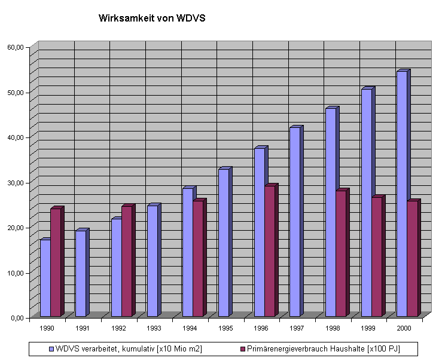

[🠔 Zur Übersicht: Dämmung](213baust.md)  
# Der Schwindel mit Wärmedämmung und Energiesparen 5
**Amtliche Energiesparversprechen / Energiesparverbrechen? Fassadendämmung Kosten 1000:0 Ertrag? Fassadenisolierung, Wärmedämmung + Energieeinsparung. Widersprüche der amtlichen Klimaschutzpolitik an Gebäuden.**  
_von Konrad Fischer • aktualisiert 14.12.1999_

## Amtliche Energiesparversprechen / Energiesparverbrechen? 
Fassadendämmung Kosten 1000:0 Ertrag?: Fassadenisolierung, Wärmedämmung + Energieeinsparung 
Zu den Widersprüchen der amtlichen Klimaschutzpolitik an Gebäuden

[zurück<-](2134bau.md) Kapitel [-> vor](2136bau.md)

**[Das Handwerkerquiz](10hoai13.md)\+ [Das Planerquiz für schlaue Bauherrn](10hoai14.md)**

---

## Dämmstoffhetze, Dämmstoffversprechen und Dämmstoffversagen

Daß sogar im Umfeld des WTA die dämmbedingten Schäden an Fachwerkbauten langsam aufstoßen, ist erfreulich. Gleichwohl kann es nicht befriedigen, daß zunächst propagiert wurde, dann vehement sogar mit Denkmalszene- und KfW-Hilfe versucht wird, die U-Wert-Dämmerei nun halt in abgespeckter, sozusagen gemäßigter Form den armen Fachwerkhäuseln aufzuzwingen.

Die Münchner ArbeitsGruppe Energie versuchte mit dem für seine Klimawirklichkeiten weitbekannten Umweltbundesamt die Volksaufklärung mal so herum:

ibau Planungsinformationen 14.12.1999 
**_"Beheizung von Gebäuden: Erhebliche Einsparpotenziale bei Energieverbrauch und Kosten aufgedeckt_** 
**_Umweltbundesamt und Deutscher Mieterbund stellen den "Kommunalen Heizspiegel" vor_**

_Berlin - Im Durchschnitt wird in Deutschlands Haushalten doppelt so viel Energie für Heizung und Warmwasser verbraucht wie nach dem heutigen Standard nötig wäre. Bei jedem zehnten Gebäude liegt der Verbrauch sogar um 200 Prozent über den Werten moderner, energieeffizienter Bauten. Dies ist das Ergebnis des Forschungsprojekts "Kommunale Heizspiegel", das das Umweltbundesamt und der Deutsche Mieterbund in Berlin vorgestellt haben. [...] So können Hauseigentümer und Mieter ihre eigenen Heizkosten vergleichen und ermitteln, ob ihr Verbrauch angemessen ist oder ob sich gegebenenfalls eine Sanierung lohnt. Besonderer Vorteil der Kommunalen Heizspiegel:_

_Sie helfen herauszufinden, in welchen Gebäuden besonders viel Energie für das Heizen verbraucht wird. Dort ist der ökologische und ökonomische Nutzen der Investition in moderne Heiz- und Wärmedämmtechnik besonders groß. Eine Sanierung allein dieser Hochverbraucher würde den Ausstoß des klimaschädlichen Kohlendioxids aus zentral beheizten Mehrfamiliengebäuden in Deutschland um zehn Prozent senken._

_[...] Ergibt dieser Vergleich einen überdurchschnittlich hohen Energieverbrauch, sollte ein Fachmann mit einem Energiegutachten beauftragt werden, das genauere Aussagen zur Energieeffizienz des Gebäudes erlaubt und Hinweise darauf gibt, ob sich Investitionen in energiesparende Heiztechnik und Wärmedämmung lohnen._

_[...] [Nach Prof. Dr. Andreas Troge, Präsident des Umweltbundesamtes, sei herausragendes Ergebnis des Projekts] das hohe Energiesparpotenzial für Energie und Kosten im Bereich der Gebäudeheizung. In vielen Fällen bringe eine energetische Sanierung neben positiven Umwelteffekten auch wirtschaftliche Vorteile der Beteiligten. Die Vermieter profitieren, weil sich die Gebäude besser vermieten lassen und einen höheren Verkaufswert haben. Zudem könne die Sanierung über eine Erhöhung der Kaltmiete finanziert werden. Viele Mieter könnten trotz erhöhter Kaltmiete durch sinkende Nebenkosten mit gleichbleibender oder sogar sinkender Warmmiete rechnen, während gleichzeitig der Komfort steigt. Nicht zuletzt profitiere auch der Arbeitsmarkt von einer verstärkten Sanierungstätigkeit: Es ist sinnvoller, das Geld in das Baugewerbe zu investieren als in Energie, die durch Wände und Fenster nach draußen verschwindet", sagte Troge. [...]"_

Ein Fall für den Staatsanwalt und den [Betrugsparagraphen im StGB](7wdvs10.md#muãŸ+architekt+die+wirtschaftlichkeit+eines)? 

7 Fragen, die nun offen sind: 

1. Weiß Herr Troge nicht, daß nach den unabhängigen Klimaforschern weder ein Treibhauseffekt noch ein CO2-Problem existieren? Der amerikanische Chemie-Nobelpreisträger Mullis deckt im [SZ-Magazin vom 23.6.00](7wdvs04.md) derartige Desinformationen als gezielten Subventionsbetrug der auf Fördermittel angewiesenen Wissenschaftler auf. 
2. Weiß Herr Troge nicht, daß die angeblich "_[energieeffizienten](7wsvoant.md#aecht baierischer grusel)_ " Gebäude nur [auf dem Papier Energie sparen](7fehrtab.md)? 
3. Ist seine hyperoptimistische Annahme ([vgl. SWN](2134bau.md)) betr. "_gleichbleibender Warmmiete_ " schon das Rückzugsgefecht? 
4. Weiß Herr Troge nicht, daß es in dicht gedämmten Buden ganz unkomfortabel schimmelt und dagegen auch keine wie auch immer gestoßene [Stoßlüftung](7wdvs15.md#roloff) hilft? Daß darin der Gesundheitsstatus der deutschen Wohnbevölkerung dahinsiecht wie im Mittelalter mit Pest und Cholera? Die Recklinghäuser Zeitung titelt z.B. am 4.4.03: _"Miese Luft im neuen Heim - ENERGIESPARHAUS: Allergien drohen"_ und führt weiter aus: _"Luftschadstoffe im Hausinneren eingeschlossen", "fehlerhafte Einbau und Betrieb einer Lüftungsanlage leicht zu Schimmel- oder Keimbildung führt"._ 
5. Kennt Herr Troge die Bauprozesse nach vorschriftsmäßiger aber gleichwohl unwirtschaftlicher und bautechnisch zwangsläufig mißglückter energetischer Sanierung nicht? 
6. Werden die Rechenknechte bzw. Fachmänner für Energiegutachten dem Auftraggeber schriftlich und einklagbar den Sparerfolg zusichern? Oder, wenn es wie immer schiefgeht, alles auf den Mieter schieben? Nutzerverhalten, Katzenklappe usw.? 
7. Oder gibt das Baugewerbe hier irgendwelche praktisch verwertbare Zusicherungen?

Technische Antworten finden Sie hier auf [diesem](7wsvoant.md) Link. Zur [Gut- und Schlechtachtern ](3gutacht.md)hier. Zur Treue im [Amt](4behoerd.md) hier.

Und inzwischen, wo ganz Wohnquartiere in gut vermietbaren Stadtteilen auf Kosten der Mieter ohne jeden Nutzen für diese totsaniert werden, nur um ihnen die mietrechtlich mögliche Gesäßkarte zu überreichen: Ewige Miterhöhung durch 11%ige Umlage der angeblichen Modernisierungskosten für EnEV-Maßnahmen sowie Vertreibung der Mieter, für die keine Sozialhilfen oder sonstige Unterstützungsmöglichkeiten bestehen, mit denen die teils hunderte Prozent erhöhte "EnEV-Mieterhöhung" dauerhaft gestemmt werden kann. Und das durch jahrzehntelange Mithilfe des Mieterbundes, der mit seinem gräßlichen Klimaschutzgesumse seine eigene Klientel maximal ans Messer lieferte und liefert. Ja freilich, nur die allerdümmsten Kälber wählen ihren Metzger selber. Und finanzieren sein Schlachthaus durch aus den Rippen geschnittene Kohlen, Kröten und Moneten. Selbst schuld, jeder ist halt seine Glückes und damit auch Unglückes Schmied. 

[Elliott-Wellen-Forum: Einsparpotenziale in der Heizkostenrechnung - Durchfeuchtung möglich?](http://f17.parsimony.net/forum30434/messages/277787.htm)

Das in Parteispendenskandalen, Flugaffären, Angriffskriegen, und z.B. BSE-Skandal so oft erwiesene verbraucher- und bürgerfreundliche Verhalten unserer Bevölkerungsvertreter bringt dann solche Wunderlichkeiten hervor wie diese Aussage unseres einstigen Bundeswirtschaftsministers Dr. (schon geplagt?) Müller (nach zustimmendem Kabinettsbeschluß zur EnEV lt. ibau 16.3.2001): 

_"Durch die neue Energieeinsparverordnung angestoßene Modernisierungsaktivitäten ersparen dem Bürger Energiekosten, sichern Arbeitsplätze am Bau und nutzen dem Klimaschutz."_ 

Klar, daß die an technisch-wissenschaftlichen Wunderglauben und Endsiegpropaganda gewöhnte Bevölkerung in ihrer Massenhalluzination (Le Bon 1895) darauf hereinfällt. Frei nach Tertullians "Credo, quia absurdum": Ich glaubs, weils Unsinn ist und mir ewige Schuld/en einbringt. Lang lang ists her, daß im Bundesrat die Zustimmung zur EnEV an einen zu liefernden Nachweis der Energieeinsparung gekoppelt wurde. In der [Bundesrat Drucksache 194/01 (Beschluss)](http://dip21.bundestag.de/doc/brd/2001/D194+01) ist die Forderung auf Seite 88 zu finden: 

_"Der Bundesrat bittet die Bundesregierung, bis zum 31. Dezember 2006 im Zusammenwirken mit den beteiligten Kreisen die Auswirkungen der Regelungen der Verordnung zu überprüfen, insbesondere auch im Hinblick auf die angestrebten Auswirkungen auf Energieeinsparung und Klimaschutz, und dem Bundesrat hierzu einen Bericht zu übermitteln."_ 

Was wurde dazu von Seiten der leichtgläubigen Tröpfe "Juhu!!!" geschrieen, ahnungslose und mit dem Politsystem unserer lobbykratischen Ochlokratie (korruptionsggesteuerte Gesäßöffnungsherrschaft) nicht ausreichend vertraute Bausimpel mutmaßten in ihrem freudig erregten Wahnsinn, daß dadurch der ganze Dämmschwindel zwangsläufig auffliegen würde, und man nur noch die paar Jährchen bis 2006 durchhalten müsse. Pustekuchen! Ich zitiere aus der hier downloadbaren [Drucksache 87/07](https://www.umwelt-online.de/PDFBR/2007/0087_2D07.pdf) - "Bericht der Bundesregierung zu der Entschließung des Bundesrates zur Verordnung über energiesparenden Wärmeschutz und energiesparende "Anlagentechnik bei Gebäuden (Energieeinsparverordnung - EnEV)": 

"Der Bundesrat hat anlässlich seiner Zustimmung zur Energieeinsparverordnung (EnEV) (Bundesratsdrucksache 194/01 - Beschluss) am 13. Juli 2001 die Bundesregierung in einer Entschließung gebeten, die Auswirkungen der Regelungen insbesondere hinsichtlich angestrebter Energieeinsparung und Klimaschutz im Zusammenwirken mit den beteiligten Kreisen zu überprüfen und ihm entsprechend zu berichten." 

Und jetzt erlaubt sich die kaltschnäuzige Bundesregierung mittels ihrer Wirtschaftslakaien und den ominösen "beteiligten Kreisen" ein eiertanzgemäßes Drumherumgerede ohnegleichen, daß eben gar nix Positives, geschweige denn Nachweisbares hinsichtlich Energieeinsparung und Klimaschutz zu vermelden ist und kleidet das unter anderem in folgende feingestanzte Worthülsen im schon bis zum Erbrechen gewohnten Verlautbarungsstil des ambitionierten Schönredens auch der hocheffizientesten Gemeinheiten: 

"Quantitative Aussagen über die Auswirkungen der EnEV-Anforderungen sind allerdings schwierig und lediglich als grobe Schätzungen möglich. ... Das energetisch einzuhaltende Niveau neuer Gebäude nach EnEV liegt um durchschnittlich 30 % unter dem geforderten Niveau der Vorgängerregelung. Im Gebäudebestand sind dagegen wegen der komplexen Bestandslage und der häufig vielfältigen Motive für eine energetische Sanierung allein auf die EnEV bezogene Energie- und CO2-Einspareffekte schwieriger zu ermitteln. Die verfügbaren Untersuchungsergebnisse differieren in ihren Einschätzungen daher erheblich. Ihnen ist jedoch gemein, dass sie von einem signifikanten Einspareffekt durch die EnEV ausgehen." Dieses hoch-ambitionierte Gesochse mit feingesponnenem Bezug auf die nur fiktiven Bedarfsrechenwerte, die nach allen wissenschaftlichen Evaluierungen nicht nur meilenweit, sondern um Welten von dn tatsächlichen Energieverbäuchen abweichen, ist signifikant! Und zwar für den politischen Schwindel, den unser VW-gleiches Dreckssystem seit langem als Herrschaftsprinzip gewählt hat. Das Volk hat es dazu nicht fragen müssen, es hat seine Henker wie immer selbst gewählt. Lesen Sie das mit hocheffizienten Stilblüten gespickte Berichtlein im Original, das haut rein, versprochen! 

Für den, ders mag: [Auslegungsfragen zur Energieeinsparverordnung und die "offiziellen" Antworten](http://www.bbr.bund.de/bauwesen/energie/enev_auslegungsfragen.htm)

Die Rechtsprechung sah zumindest einmal derartige Glaubenswahrheiten skeptisch, vgl. SZ 2.12.2000:

**_"§ Wärmedämmung_**

_Will der Vermieter die Miete erhöhen, weil er Wärmedämmmaßnahmen durchgeführt hat, muss er dem Mieter erläutern, weshalb dadurch nachhaltig Heizenergie eingespart wird. Es genügt nicht, dass er in seiner Mieterhöhungserklärung nur die Kosten zusammengestellt und die Umlageberechnung beigefügt hat."_

Und dann begründet die Meldung den gerichtlichen Standpunkt: Der Vermieter darf in eigener Machtvollkommenheit die Mieterhöhung durchsetzen. Daraus ergibt sich zwangsläufig seine Pflicht, dem Mieter die Möglichkeit zu geben, daß er die einseitig durchgesetzte Mieterhöhung umfassend nachprüfen darf. Und dabei muß es dem Mieter möglich sein, herauszukriegen, ob der Wärmeschutz in Wirklichkeit durch die Fassadendämmungs-Kosten besser wurde und dadurch auch Heizenergie gespart werden kann. Der Vermieter muß dafür die die entsprechenden Berechnungsgrundlagen in der Wärmebedarfsberechnung seiner an den Mieter versandten Mieterhöhungserklärung beilegt. Auch die Einsichtnahme in die zur Modernisierung gehörenden Abrechnungs- und Kalkulationsunterlagen des Vermieters, die die Höhe der Mieterhöhung begründen, ist dem Mieter zu gestatten (Kammergericht Berlin, Beschluss vom 17. August 2000, 8 RE-Miet 6159/00 in Wohnungswirtschaft und Mietrecht 10/2000, Seite 535).

Das ist dann freilich so bald wie möglich von den politikerseits berufenen Richtern des Bundesgerichtshofs BGH aufgehoben worden. Gem. [Beschluß vom 10.4.02 - VIII ARZ 3/01](http://www.uni-karlsruhe.de/~BHG/PressemitteilungenBGH/PM2002/PM052_2002.htm) genügt es, nur schnöde k-Werte mitzuteilen. Mit denen muß sich der vorwitzige Mieter begnügen, er könne ja einen Sachverständigen beiziehen, der ihm dann die Spareffekte ausrechne. Das ist Schwachverständigen-ABM, sonst nichts. Machen Richter sowas gar aus Überzeugung? Na klar, denn wer, wenn nicht sie, weiß doch, daß schon das allerkleinste 1 x 1 ausreicht, um anhand der Wärmebedarfsberechnung und der Modernisierungskosten durch Gegenüberstellung herauszubekommen, daß sich ein solcher Blödsinn wie Fassadendämmunungs-Kosten niemals durch irgendwelche Einsparungen in einem gesetzlich und durch Rechtsprechung bestätigten Amortisationszeitraum / Betrachtungszeitraum von 10 Jahren amortisiert. Wodurch alle Fassadendämmungskosten und Fassadendämm-Maßnahmen gegen das Wirtschaftlichkeitsgebot des Energieeinungsgesetzt EnEG § 5 verstoßen und damit einerseits illegal sind und andererseits Haftung des Verantworlichen für die Planung der unwirtschaftlichen baumaßnahme und andererseits Schadensersatzanspruch des/der Geschädigten auslösen können. Näheres beim Bauanwalt.

Obwohl nun aber durch Dämmgespinste aus technischen Gründen ([falsche Rechenformeln](7wsvoant.md#einleitung), [hohe Wasseraufnahme](29bau09.md#4108-3-kã¼nzel)) nur auf dem geduldigen Lügenpapier der Wärmebedarfsberechnung, sonst aber keine bzw. fast keine - auf jedenfall keine zur Amortisation in 10 Jahren führende Heizenergie eingespart wird und dafür auch ausreichend praktische Belege vorliegen, muß sich der Mieter die Mieterhöhung auch nach Vorlage der offiziell getürkten Wärmebedarfsberechnung gefallen lassen. Damit führte die Rechtssprechung das unselige Zweiklassenrecht nach Vorbild der Nurnberger Rassengesetze wieder ein. Befreiung aus wirtschaftlichem Grund wird bestenfalls dem EnEV-geplagten Hausbesitzer eingeräumt, der Mieter muß den Schwindel mittel Modernisierungsumlage bezahlen, selbst wenn er zu keinerlei faktischen Ersparnissen führt. Und zwar bis in alle Ewigkeit, das ist das Schöne in einem Verbrecherstaat, in dem hübscherweise das Verbrechen durch Rechtssprechung legalisiert wird. 

Da nun die betroffenen Mieter seit Jahren immer öfters merken, daß nach der Dämmung nicht weniger geheizt werden kann, sondern teils sogar erheblich mehr, hat sich der Club der Schwindler den Begriff des "Nutzerverhaltens" einfallen lassen. Versuchen Sie mal, bei den beteiligten Forschungsinstituten oder den Dämmstoffherstellern einen belastbaren und gemessenen Nachweis, daß blanker Dämmstoffverbau tatsächliche Wärmeenergie spart - egal ob im Labor oder der Praxis - vorgelegt zu bekommen: Es gibt ihn nicht! Und jeder der Beteiligten weiß das, lügt sie aber frech an, daß bei der DENA sowas vorläge, was es aber nicht tut. Die hierzu vorliegenden Schreiben offizieller Institutionen sind Legion! „Gerade die Außenwanddämmung ist eine ganz entscheidende Maßnahme zur Energieeinsparung, Komfortsteigerung und Wohnwertverbesserung“, behauptete die Deutsche Energieagentur (Dena) unter dem Titel „Einsparpotential in unsanierten Gebäuden beeindruckend hoch“. Stimmt das? Hausgeld-Vergleich e.V., eine Schutzgemeinschaft für Wohnungseigentümer und Mieter, wollte das genauer wissen und fragte die Dena, das Darmstädter Institut Wohnen und Umwelt (IWU) sowie Gerd Hauser vom Institut für Bauphysik der Fraunhofer-Gesellschaft (IBP) nach „Langzeitstudien der realen Energieeinsparung nach Wärmedämmmaßnahmen an Bestandsimmobilien“. Das IWU antwortete: „Da hier dringender Forschungsbedarf besteht, sind wir bemüht, bei Sicherstellung einer ausreichenden Finanzierung weiterführende Untersuchungen durchzuführen.“ Stephan Kohler, nach dem Bundesrechnungshof extrem überbezahlter Noch-Geschäftsführer der Dena, verwies auf die wissenschaftliche Auswertung an „mehr als 330 Gebäuden“, die für Mehrfamilienhäuser gezeigt habe, daß „eine warmmietenneutrale Sanierung mit rund 70 Prozent Einsparungen möglich ist“. Echte Verbrauchsdaten lägen aber noch nicht vor. Alle Prognosen sind nur Computersimulation. Vom Bauphysikprofessor Hauser, maßgeblicher Antreiber der U-Wert-Bauphysik, kam nicht einmal eine Eingangsbestätigung. Na super!

 
Wo ist nun die Energiesparwirkung der Dämmerei? Sie kostet an der Fassade gut 100 bis 150 Euro, auf dem Dachboden 50 bis 100 Euro oder auch weniger oder mehr, je nach den baulichen Begleitumständen und dem örtlichen / regionalen Preisniveau. Der mit der mehr oder weniger unwirksamen Dämmung, die über kurz oder lang unweigerlich zu [unfaßbarem Sumpfpfusch](2133bau.md) mutiert, hereingelegte Bauherr läßt sich es also ordentlich was kosten, um sich dann über kurz oder gar nicht mal so lang selbst eine Nase zu drehen. Ist das nun Betrug, was die Dämmtruppe verspricht, und immer kürzeren Rhythmen neue Verschärfungen der ENergieEinsparVerordnung EnEV durchpeitscht? Grafik: [Matthias Bumann](http://www.dimagb.de)

Auch bei der hier grafisch zusammengefaßten Untersuchung dreier Großbauten in Hannover durch Prof. Fehrenberg, Autor auch dieser Grafik, zeigt sich die energetische Unwirksamkeit von teurem Dämmstoffverbau im Hinblick auf den Heizwärmebedarf. Die dunkelblaue Kurve zeigt die von +1 (oben) bis +9 (unten) gespiegelt dargestellte Durchschnittstemperatur der Winterhalbjahre von 1988 bis 2001 (Quelle: Wetteramt Hannover). Die anderen Kurven zeigen den Erdgasverbrauch der Bauwerke. Mit vertikalen Strichen und der Beischrift "San." wird der Zeitpunkt zusätzlich aufgebrachter WDVS (türkis: 1995, magenta: 1996) dokumentiert. Dieser Vorgang bleibt vergleichsweise ohne Beeinflussung des Energieverbrauchs. Nur kältere oder wärmere Winter beeinflussen diesen - nicht mehr oder weniger WDVS! Das ganze ist alles mehrmals publiziert in Fachzeitschriften. 

Der Schuldige am ausbleibenden Energiespareffekt ist von vornherein ausgemacht: Der Mieter lüftet also seine stickig verkeimte Dämmbude zu sehr, da kann er natürlich keine Energie einsparen. Lieber erstunken als erfroren - das war einmal. Im Rekordland der Asthmatoten und Allergieopfer durch feuchte Wohnverhältnisse wollen viele Mieter auf Frischluft partout nicht mehr verzichten - und lüften angeblich die angeblichen Wärmeeinsparungen zum Fenster hinaus. 

Dabei ist laut Wärmebedarfsberechung ein Luftwechselfaktor von 0,8/Stunde rechnerisch vorgegeben. Hand aufs Herz: Wer tauscht tatsächlich täglich 19 mal seine komplette Raumluft aus? Sehen Sie - auch hier wieder ein Wissenschaftswitz auf Kosten der Verbraucher. Ätsch-Bätsch, nicht nur AIDS+BSE lassen grüßen.

Was wäre denn, wenn der aufgefinkelsteinte Mieter in Kenntnis der Fakten gegen den Wärmebedarfsnachweis Einspruch wegen gefälschter Annahmen einlegen würden? Warum soll er zahlen für bauliche "Intelligenz" und technische Mythologie auf seine Kosten? Hier darf er mal aufbegehren. Argumente?: Die "[Energiesparseite](7wsvoant.md)". Lieber aber klagt er gegen die Heizkostenabrechnung und fordert blowerdoorgestützte EnEV-Dämm- und -Dichtheiten. Wenn er die dann bekommt, wird er freilich nicht weniger verbrauchen - aber endlich verschimmeln und verrecken. Na bravo! Auch eine Methode, fiese Mieter loszuwerden.

Weiter: **Der Schwindel mit der Wärmedämmung -[Kapitel 6](2136bau.md)**
