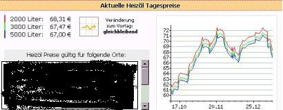
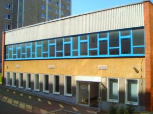

[🠔 Zur Übersicht: Dämmung](213baust.md)  
# 7 - Widerspruch Mieter gegen Mieterhöhung nach energetischer Sanierung / Gutachten für Widerspruch Eigentümer ./. WEG gegen Beschlußfassung energetische Sanierung Fassade
**Widerspruch Mieter gegen Mieterhöhung nach energetischer Sanierung / Gutachten für Widerspruch Eigentümer ./. WEG gegen Beschlußfassung energetische Sanierung Fassade**  
_von Konrad Fischer_

## Der Schwindel mit Wärmedämmung und Energiesparen 7

## - Widerspruch Mieter gegen Mieterhöhung nach energetischer Sanierung mit Wärmedämmung /

- Gutachten für Widerspruch Eigentümer ./. WEG gegen Beschlußfassung energetische Sanierung Fassade

[ zurück <-](2136bau.md) Kapitel [-> vor](2138bau.md)

---

## Problembereich Energetische Sanierung "für" Mieter und Mietwohnung/Mietshaus, Mietrecht, Mieterhöhung

Nach langen Jahren des fröhlichen Abzockens ist bei der großen Politik das Geschrei der Mieter wegen ihrer energisch-energetischen Abzocke mithilfe des ["Goldenen-Nase-Paragrafen 559 BGB"](http://www.hausgeld-vergleich.de/Deul_FuerdiePresse_12102015.htm) zwar angekommen, hat aber keine wirkungsvollen Gegenmaßnahmen außer geradezu lächerligste "Mietpreisbremsen" hervorgebracht. Nach wie vor ist das im Vergleich zur angeblichen Heizkostenersparnis krass unverhältnismäßige Abzocken der Mieter durch "modernisierungsbedingte" Mieterhöhung Usus. Schauen wir uns hier mal einige Details genauer an. 

Wie sich Rechtsanwälte um den Hitzeschutz kümmern, zeigt die SZ unter der Rubrik "Recht so" und dem Titel "Heißkalt" am 5.10.01:

_"(Es) protestierte ein Facharzt ... gegen die Hitze: ... kürzte in ... Sommermonaten ... Miete für ... Praxisräume um 20 Prozent, weil ... Temperatur innen fast auf 30 Grad stieg, wenn es draußen heiß wurde. ... Vermieter hatten mit ihrer Zahlungsklage keinen Erfolg, weil ... Oberlandesgericht Rostock diese Temperaturen als Mangel der Mietsache einstufte (3 U 83/98). ... Arzt dürfe (deshalb) Miete mindern. Auch in einer Arztpraxis müssten ... Normen der Arbeitsstättenrichtlinie eingehalten werden: Innen müsse ... Temperatur mindestens um sechs Grad niedriger sein als draußen.

Vergeblich forderten ... Vermieter, (Arzt) solle nachts lüften, so könne er ohne Weiteres eine angenehmere Raumtemperatur erreichen. Das könne man (gem. Urteil des OLG) vom Mieter nicht verlangen, (weil er) im Fall eines Einbruchs seinen Versicherungsschutz (verliere). Wenn sich niemand in der Praxis aufhalte, müssten ... Fenster geschlossen bleiben, alles andere wäre grob fahrlässig (OLG Rostock vom 29. Dezember 2000 - 3 U 83/98). ogri"

_ So wehrt man sich also als dämmbudengeplagter Mieter. Oder gleich so, wie es der Mieter H.B. schon in der DM-Epoche gegenüber seiner Wohnungsvermieterin, der WohnbauGmbH XY tut, nur aus Vorsorge gegen die Beklebung der Fassade mit Wärmedämmung: 
"Adresse Mieter 

Adresse Wohnungsgesellschaft

Betr.: Ihr Schreiben vom ... 

Mieterhöhungsverlangen 

Sehr geehrte D+H! 

Ihr Mieterhöhungsverlangen vom 08.09.2001 sieht eine Erhöhung meiner Grundmiete um de facto 51,36 DM vor.

Ihr Mieterhöhungsverlangen beruht auf der von Ihnen schriftlich erläuterten Wertverbesserung durch Modernisierungsmaßnahmen, die für mich als Mieter in der Folge einer Fassaden- und Dachbodendämmung eine "nachhaltige Einsparungen von Heizenergie bewirken" soll. Diese Anforderung an die Effizienz baulicher Maßnahmen wird jedenfalls in § 3 MHG vom Gesetzgeber an den Vermieter gestellt, um bei korrekter Erfüllung dieser Forderung von den Mietern eine erhöhte Miete verlangen zu dürfen. 

Allerdings setzt hierbei die praktische Rechtssprechung zum Schutze des Mieters dem mehr oder weniger berechtigten Verlangen des Vermieters nach Mieterhöhung eine Grenze: Die Mieterhöhung darf nur maximal das Doppelte der tatsächlichen Ersparnis an Heizenergie betragen. 

Unter Beachtung der praktischen Rechtssprechung führt mich die Analyse der Thematik Wärmedämmung & Mieterhöhung einschließlich der mir erkennbaren korrelierenden Randbedingungen sowie die Berücksichtigung meiner tatsächlichen Kosten für Heizenergie zu folgendem Ergebnis:

Ich akzeptiere zwar, dass Sie in der Folge der Dämm-Maßnahmen von Ihrem Recht auf Mieterhöhung Gebrauch machen, gegen die von Ihnen geforderte Höhe des Betrags von 51,36 DM erhebe ich jedoch

**Widerspruch.**

Dagegen werde ich Ihnen auf Grund der Dämm-Maßnahmen eine Erhöhung meiner Grundmiete von 15,-DM zahlen. Diesen Betrag - ich werde ihn noch genauer begründen - halte ich für angemessen und entgegenkommend. 

Auf der Basis meiner bisherigen (ungeminderten) Grundmiete von 635,07 DM ergibt sich bei einer Mieterhöhung von 15,- DM mit Wirkung vom 01.12. 2001 eine neue (ungeminderte) Grundmiete von 650,07 DM; also eine Miete von 8,52 DM pro qm. Das ergibt bei monatlichen Vorauszahlungen für NK + HK / WWK von insgesamt 316,- DM einen neuen (ungeminderten) Zahlbetrag von 966,07 DM. 

Die neue (ungeminderte) Grundmiete von 650,07 DM ist zukünftig die neue Basis für Berechnungen von prozentualen Mietminderungen. Diese Rechtsauffassung teile ich mit der Auffassung des Mietervereins und der Rechtsanwältin des Vereins. Meine Mietminderung, die ich seit November 1999, also seit ca. 2 Jahren, vornehme, werde ich auf der Basis der neuen Grundmiete in einem separaten Schreiben neu berechnen und Ihnen das Ergebnis mitteilen. 

Begründung:

Nachdem ich mich sowohl mit der rechtlichen Seite der Thematik Wärmedämmung & Mieterhöhung als auch mit der fachlichen Seite der Thematik Wärmedämmung, deren realistische Effizienz bezüglich der Energieeinsparung und nicht zuletzt deren sehr bedenklichen Einfluss auf das Wohnklima beschäftigt habe, aber auch unter Beachtung meines tatsächlichen monatlichen Verbrauchs an Heizenergie, halte ich den Betrag der Mieterhöhung von 51,36 DM pro Monat für deutlich zu hoch. 

Anmerkung: In Ihren Berechnungen kommen Sie auf Grund der entstandenen Kosten für die Dämmarbeiten sogar auf eine Mieterhöhung von 83,13 DM pro Monat. Erst die von der Wohnungsgesellschaft selbst vorgenommene Kappung der Grundmiete auf maximal 9,-DM pro qm führt dann wieder regulierend in Richtung Vernunft von diesen 83,13 DM zu einem Abzug von 31,77 DM und damit zu dem eigentlichen Erhöhungsbetrag von 51,36 DM pro Monat und zu der neuen Grundmiete von 686,43 DM (bisher: 635,07 DM). Allerdings müssen sich die Mieter diese beiden wichtigen Beträge, also den tatsächlichen Erhöhungsbetrag und die Höhe der neuen Grundmiete, auf der Basis anderer Zahlenangaben leider selbst errechnen. Immerhin: Der zu überweisende Gesamtbetrag ist von der Wohnungsgesellschaft dann doch angegeben worden.
Meine tatsächlichen Kosten für Heizung und Warmwasser liegen insgesamt bei ca. 40 DM pro Monat. Dabei werden für die Wassererwärmung (Warmwasser) etwa 15% der Gesamtkosten benötigt, also ca. 6 DM pro Monat. Für die reinen Heizkosten bleiben demzufolge ca. 34 DM pro Monat; diese Zahlen sind natürlich immer über das ganze Jahr gerechnet, also unter der Annahme, dass auch im Sommer, im Frühling und im Herbst voll geheizt wird. 

Dazu folgende Bemerkung: Der günstige HK-Verbrauch in unsrem Wohnblock resultiert nicht zuletzt aus der sehr vorteilhaften Lage des Hauses bezüglich solarer Strahlung und der idealen Zonierung der Räume (im Süden beheizte Räume, im Norden nicht oder wenig beheizte Räume), sowie der damit verbundenen sehr beachtlichen passiven solaren Wärmegewinne durch die Fenster.

Der hohe Einfluss solarer Wärmegewinne ist wohl insbesondere von solchen Mietern nachvollziehbar, die schon unter diesbezüglich unvorteilhafteren Bedingungen gewohnt haben. An mehr oder weniger sonnigen Wintertagen, aber auch adäquat im Herbst und im Frühjahr, kann die tiefstehende Sonne die Wohnräume gut erwärmen. Auf Grund der beachtlichen passiven Wärmegewinne werden in unserem Wohnblock im Herbst und im Frühjahr die Heizungen kaum einmal aufgedreht, während zur gleichen Zeit in anderen Wohnlagen schon lange wieder bzw. immer noch geheizt wird. 

Der beachtliche Einfluss passiver solarer Energiegewinne auf die Höhe des tatsächlichen Gebäudewärmebedarfs unseres Wohnblocks war offensichtlich bereits im Sommer 1997 nach der Umstellung der Heizmethode bei der ersten Berechnung der Heizkosten-Vorauszahlungen vom Vermieter nicht so recht erkannt und später auch nicht korrigiert worden. Auf der Basis von praxisfernen Voraus-Berechnungen für den Bedarf an Heizenergie kommt es bekanntlich für die wohl meisten Mieter unseres Wohnblocks alljährlich nach der BK/HK- Abrechnung zu kräftigen Rückzahlungen, ohne dass der Vermieter die eindeutig zu hohen Vorauszahlungen der Realität entsprechend korrigiert. 

Bereits an diesem signifikanten Beispiel aus der Praxis ist deutlich erkennbar und beweisbar, zu welchen Fehlschlüssen mathematische Berechnungen auf der Basis von praxisfernen Kennziffern führen können, wenn die konkrete energetische Situation, also das de facto sehr komplizierte und vielschichtige einheitliche energetische System Haus, ignoriert wird. Dieser Fehler wurde nun offensichtlich bei den neuen energetischen Berechnungen im Zusammenhang mit der Dämmung gleich nochmals wiederholt.

Aber zurück zum tatsächlichen Verbrauch an Heizenergie in unserem Block. Ich meine: Wo definitiv nur relativ wenig an Heizenergie verbraucht wird, die Ursachen dafür sind kompliziert und vielschichtig, da ist eben auch durch Fassadendämmung nicht mehr viel zu verringern. Der Erfolg der Dämmung wird in unserem Block - insbesondere aber in den Parterrewohnungen - relativ gering sein. Ich bin sicher: Wenn das Geld, das hier für die weitgehend überflüssige Wärmedämmung investierte worden ist, u.a. zur Modernisierung der Heiztechnik im 1.WK eingesetzt worden wäre, z.B. zur Veränderung des unzeitgemäßen, die Energie nur so verschleudernden Einrohr- Systems, sowie zur Abschaffung der unsinnigen Beheizung der Treppenhäuser, dann wäre der von Ihnen genannte "Beitrag zur Senkung der Umweltbelastung und Sicherung der Energieträger und Lebensräume für nachfolgende Generationen" weit glaubhafter und effektiver ausgefallen.

Für unseren Block hingegen wären eine ordentliche Sanierung der alten Fassade (ähnlich, wie z.B. mehrfach in der Novalistrasse geschehen) und die Erneuerung der baufälligen Balkone die billigere und zugleich die bessere Lösung gewesen. Ich bin sicher: Bei globalem Denken zum Wohle unserer Umwelt und der Sicherung von Lebensräumen für nachfolgende Generationen wäre die Absicht zu einer vernünftigen Sanierung unseres Wohnblocks ohne Dämmung bestimmt nicht an der WSVO `95, auf die Sie sich u.a. berufen, gescheitert. - Gut: Der Fußboden im Dachraum unseres Wohnblocks war in der Tat so stark gerissen, dass das bloße Abdecken des kaputten Fußbodens mit PSP- Dachbodenelementen im konkreten Fall ausnahmsweise vielleicht tatsächlich die billigste und schnellste Methode zur Sanierung des reparaturbedürftigen Bauteiles war. Für die Sanierung und die farbliche Gestaltung der Fassade, aber auch für die Bausubstanz selbst und nicht zuletzt für ein allzeit gesundes Wohnklima war nach meinem Wissen das Bekleben der Wände mit chemischen Schaumstoffplatten denkbar ungünstig und zugleich weitgehend überflüssig. 

Nach der Meinung der Gerichte muss Wärmedämmung auch aus der Sicht des Mieters wirtschaftlich sein (Karlsr ZMR 84, 411; LG Hbg ZMR 91, 302).

_[Ergänzung KF 2015: Daß die Mieterhöhung nach energetischer Sanierung inzwischen fast vollkommen unabhängig von Heizkostenersparnissen erfolgen darf, hat der Bundesgerichtshof am 3. März 2004 zum Nachteil der Mieter beschlossen ([BGH, VIII ZR 149/03](http://juris.bundesgerichtshof.de/cgi-bin/rechtsprechung/document.py?Gericht=bgh&Art=en&Datum=2004-3-3&nr=28824&pos=24&anz=32)) - dies ist als vernichtende Einschränkung der hier zitierten Beispielbeschwerde zu beachten. Nach den Vorstellungen des BGH ist "Nachhaltigkeit" der Maßnahme der Maßstab, wozu dann auch 1 Prozent "nachhaltige" Energiesparnis zur Mieterhöhung berechtigt. (BGH, VIII ARZ 3/01). So bevölkerungsfreundlich kann unser oberster Gerichtshof also zu Gericht sitzen. Ein erstinstanzliches Urteil aus Berlin versucht es 2015 dagegen mit Mitmenschlichkeit: 

"Die Beklagten haben [ ] nicht die Dämmung der Fassade zu dulden. [ ] nach Auffassung des Gerichts muss der Gedanke von §25 Abs. 1 EnEV auch im Rahmen des §555 d Abs. 1 BGB berücksichtigt werden. [ ] Erst nach ca. zwanzig Jahren würde erstmals die Umlage niedriger sein als die eingesparte Heizenergie. Da kann von einer modernisierenden Instandsetzung aber nicht mehr die Rede sein [ ]. Nach Auffassung des Gerichts können die Beklagten die Unwirtschaftlichkeit der Maßnahme bereits im hiesigen Duldungsverfahren einwenden. [ ] Bei der wirtschaftlichen Härte [§555 d Abs. 1 Satz 2 BGB] wird abgewogen, ob dem Mieter anhand seines Einkommens [ ] die zu erwartende Mieterhöhung im Hinblick auf die Energieeinsparungen zuzumuten ist. § 25 Abs. 1 EnEV hingegen lässt eine Ausnahme von der Verpflichtung der Dämmung zu, wenn bei bestehenden Gebäuden innerhalb einer angemessenen Frist die eintretenden Einsparungen nicht erwirtschaftet werden können. [ ] Da ein Vermieter [ ] die Möglichkeit hat, die Unwirtschaftlichkeit der Gesamtmaßnahme [ ] geltend zu machen, muss dies nach § 242 BGB auch für den Mieter möglich sein." So das skandalöse - weil bürgerfreundliche Urteil des Amtsgerichts Pankow / Weißensee vom 28.01.2015. [Link zum Urteil beim Pankower Mieterprotest](http://pankowermieterprotest.jimdo.com/2015/02/23/urteil-des-amtsgerichts-pankow-weißensee-fassadendämmung-ist-unwirtschaftlich/)]_ 
Und selbstverständlich von einer sehr bekannten [Richterin Regine Paschke am Landgericht](https://www.youtube.com/watch?v=zwK5lZM9gno) schnell wieder aufgehoben: Ergebnis der [Berufungsverhandlung zum "Pankower Urteil"](http://pankowermieterprotest.jimdo.com/2015/09/24/ergebnis-der-berufungsverhandlung-zum-pankower-urteil/) 

Nach der praktischen Rechtssprechung ist es unumstritten, dass die Mieterhöhung in der Folge von Wärmedämmung nicht mehr als das Doppelte der tatsächlichen Energieersparnis betragen darf (u.a.: AG Bremerhaven 52 C 3141/96; Landgericht Hamburg, AZ: 16 S 114/89; Landgericht Aachen, AZ: 7 S 388/90; OLG Karlsruhe: in WM 85,17).

Bei realistischer Betrachtungsweise ist vorhersehbar, dass es in unserem Wohnblock in der Folge der Dämm-Maßnahmen zu einer - wenn überhaupt - sehr bescheidenen Senkung des Verbrauchs an Heizenergie von wahrscheinlich weit weniger als 10% kommen wird. Prognosen über Einsparungen von mehr als 30% sind reine Illusion und bedürfen auch dann erst des praktischen Nachweises, wenn sie mit Hilfe mathematischer Berechnungen auf der Basis praxisfremder so genannter k- Werte erzielt worden sind. Die U-Werte widerspiegeln bekanntlich nur eine Laborwirklichkeit, die nicht in der Lage ist, das Haus als ganzheitliches energetisches System zu erfassen.

Die Ummantelung unseres Wohnblocks mit chemischen Schaumstoffplatten wird in der Praxis eine Senkung des Verbrauchs an Heizenergie um maximal 10% zulassen; mehr ist reine Selbsttäuschung. Diese Einschätzung kann ich getrost treffen, wenn ich mich bemühe, das Haus nicht nur mit der Hilfe von U- Werten als die Summe vieler einzelner Bauteile zu definieren, sondern es gesamtenergetisch als ein ganzheitliches, sehr kompliziertes und vielschichtiges energetisches System zu betrachten. 

Da wird z.B. durch die Ummantelung des Hauses Heizungswärme in den Wohnräumen - wie Sie es erläutern - "durch die Reduzierung von Wärmeverlusten durch Wände bzw. Fugen" gefangen. Die Wohnungen sind nun durch die Ummantelung mit Schaumstoffen und auch durch die neuen Fenster nahezu hermetisch abgeschlossen; und im Ergebnis dessen mussder Mieter nun mehr lüften, viel mehr lüften. Also: die scheinbar gewonnene Heizenergie, für die der Mieter im Ergebnis der Wärmedämmung eine erhöhte Miete bezahlt, diese Energie muss er nun gleich wieder ins Freie ableiten, also Wärme zum Fenster hinaus lüften, damit es in der Wohnung nicht muffig wird und nicht zur Schimmelbildung kommt. Denn: Kommt es zur Schimmelbildung, dann steht der Schuldige von vornherein schon fest und der Vermieter spricht in einem solchen Fall vom so genannten "Nutzerverhalten". Also, dämmen oder nicht dämmen: Die durch Dämmung vermeintlich gewonnene Wärme muss zumindest teilweise wieder zum Fenster raus gelüftet werden, um in der Wohnung auch nach der Dämmung noch wenigstens ein einigermaßen gesundes Wohnklima zu erhalten.

Von alledem weiß der so genannte k-Wert allerdings nichts. Bei der Ermittlung seiner Größe im Labor ist das vermehrte Lüften der Wohnung kein Thema gewesen und schon damit stimmt die auf der Basis des U-Wertes berechnete Heizenergieeinsparung nicht, weil eben der auf das energetische Gesamtsystem einwirkende Einflussfaktor "vermehrte Lüftung" bei der Ermittlung des k- Wertes im Labor nicht mit berücksichtigt worden ist. Analog gilt dies nun auch für alle anderen auf das energetische Gesamtsystem Haus wirkende Einflussfaktoren, von denen nachfolgend noch einige aufgeführt sind. 

Wie schon gesagt: In unserem Wohnblock ist der Einfluss solarer Strahlung so vorteilhaft, dass es zu beachtlichen passiven solaren Wärmegewinnen kommt. Diese Wärmegewinne wirken auf den Verbrauch an Heizenergie senkend und zugleich auch nivellierend. Dieser nivellierende Faktor trägt dazu bei, dass auf Grund der Ummantelung mit Wärmedämmung in unserem Block nicht mehr als 10% Heizenergie eingespart werden. 

Den Wohnblock gesamtenergetisch zu betrachten, schließt eben eine ganze Menge von Einflussfaktoren ein. Da sind z.B. die tiefer gewordenen Fensterfaschen, die ihrerseits den Einfluss der Sonnenstrahlung schmälern und somit die Menge der erforderlichen Heizenergie vergrößern. In den Parterrewohnungen kommt hinzu, dass die Fensterfaschen unglücklicherweise nicht mehr - wie bisher - weiß, sondern dunkel getönt sind, was ebenfalls in eine negative Richtung wirkt, was aber auch die Kosten für Elektroenergie nicht gerade positiv beeinflusst. Da gibt es Kellerfenster, die von einigen Mietern während des gesamten Jahres nie geschlossen werden; es gibt neue, aber schon beachtlich verzogene Wohnungstüren, es gibt nicht ordentlich funktionierende Türschließer, etc. In der Tat ist es erst die Gesamtheit aller Faktoren und deren sehr vielschichtiges und kompliziertes Zusammenwirken, die ein Haus als ein einheitliches energetisches System definieren.

Es ist aber nicht zuletzt die allgemein sehr umstrittene Effizienz der Dämmung selbst, die in unserem Block zu nicht mehr als maximal 10% Senkung an Heizenergie führen wird.

Ich meine, wer sich zum Ziel setzt, Energieeinsparungen in einem Wohnblock prognostizieren zu wollen, der kann dies nicht nur mit Hilfe von im Labor ermittelten U- Werten für einzelne Bauteile tun, der muss schon das Zusammenwirken aller korrelierenden Faktoren einbeziehen und das ist mathematisch nicht sehr einfach. So muss u.a. eben auch der Einfluss des jeweils praktizierten Heizsystems mit all seinen spezifischen Einflussgrößen mit in die Berechnung integriert werden, die Anzahl der leerstehenden unbeheizten Wohnungen, der topographische Standort des Gebäudes, etc.

Wer allerdings all diese Einflussfaktoren und deren kompliziertes Zusammenspiel in seiner Berechnung unberücksichtigt lässt, der darf sich nicht anmaßen, die Menge der Reduzierung der Heizenergie in der Folge von Dämm-Maßnahmen berechnen zu können. Für eine solche Berechnung, wenn sie denn solide sein soll, ist schon die Einbeziehung aller maßgebender Einflussfaktoren notwendig. Die im Labor ermittelten U-Werte sind genau für diese Laborverhältnisse sicherlich in Ordnung, in welcher Weise und in welcher Gewichtung sie auf das vielschichtige und komplizierte energetische Gesamtsystem Haus Einfluss haben, das wäre erst noch mathematisch zu erfassen und zu definieren.

Unter all diesen Aspekten gehe ich von einer Einsparung an Heizenergie für unseren Block in einer Größenordnung von maximal 10% aus. 

Der Nutzen von Dämm- Maßnahmen mit Hilfe von chemischen Schaumstoffen ist unter Fachleuten bekanntlich sehr umstritten. Über das Internet weisen viele Architekten nachdringlich auf den so genannten "Schwindel mit der Wärmedämmung" hin, und sie warnen gleichzeitig vor den baulichen, den brandschutztechnischen und den gesundheitlichen Folgen dieser umstrittenen Maßnahme. 

Auf Grund der durchgeführten Dämmungen hatte ich Ihnen eingangs eine Mieterhöhung von 15 DM genannt. Meine tatsächlichen Heizkosten betragen im Durchschnitt der mir bisher vorliegenden beiden vollständigen Abrechnungszeiträume abzüglich der Wassererwärmungskosten über das ganze Jahr gerechnet ca. 34 DM pro Monat. Bei einer Energieeinsparung von maximal 10%, von der ich ausgehe, würde ich in Folge der Dämmung monatlich 3,40 DM Heizkosten einsparen. Auf Grund des Gebots der Wirtschaftlichkeit erlauben die Gerichte dem Vermieter nicht mehr an Mieterhöhung als das Doppelte der tatsächlichen Energie-Einsparung; das wäre in meinem Fall eine Mieterhöhung von 6,80 DM. Ich denke, dass angesichts dieser Zahlen der von mir genannte Betrag von 15 DM Mieterhöhung für beide Seiten akzeptabel sein sollte. 

Hier noch einige Anmerkungen: 

Ich bewohne eine Parterre-Wohnung. Wenn ich einmal voraussetze, dass die vorgenommene Fassaden- Dämmung überhaupt zu einer mehr oder weniger großen Einsparung von Heizenergie führt, so werden die Parterre-Wohnungen im Vergleich zu allen anderen davon wohl doch am wenigsten ab bekommen. Von außen betrachtet steht zwischen meiner Parterre- Wohnung und dem Erdreich ein ungedämmter Sockel von immerhin bis zu ca. 1,90m Höhe. Es ist mir unerklärlich, warum dieser große Teil der Außenwand unterhalb meiner Wohnung ungedämmt, also als Wärmebrücke stehen gelassen wurde, wo doch gerade für diesen Bereich für den Fall einer Dämmung im Labor ganz positive k- Werte ermittelt worden sind. Für die darüber liegenden Parterrewohnungen kann das wohl nicht gerade zum Vorteil sein. Ich meine: Vielleicht hätte man mit Hilfe der Dämmung dieses extrem hohen Sockels tatsächlich die winterlichen Temperaturen in den Kellerräumen und damit auch die unangenehme Fußkälte in den Parterrewohnungen etwas positiv beeinflussen können. 

Die günstige Lage des Hauses bezüglich solarer Strahlung führt natürlich nicht nur über den Weg durch das Fenster zu passiven solaren Wärmegewinnen. Jeder Sonnenstrahl konnte bisher obendrein mehr oder weniger wärmend und auch die Feuchtigkeit regulierend unmittelbar auf die Hauswand treffen, hinter der sich die beheizten Räume des Hauses befinden; und dies eben insbesondere in den Übergangszeiten und im Winter. Ob es nun nahe liegt, eine Fassade, die unverschattet genau in Richtung Süden zeigt, mit chemischen Schaumstoff-Materialien zu bekleben, also es mit der Hilfe von Schaumstoff-Platten zu verhindern, dass bei Sonnenschein die wärmende solare Strahlung auf die Hauswand trifft, das darf wohl in Frage gestellt werden, zumal der Schaumstoff zu dem unersetzlichen Feuchtenmanagement zum Wohle der Bausubstanz völlig unfähig ist. Gleichzeitig bedarf es wohl wenig Phantasie, sich vorzustellen, welches unliebsame Eigenleben sich gerade an warmen Tagen in den Hohlräumen zwischen Schaumplatten und Wand entwickeln kann und welche Auswirkungen das alles auf die dahinter liegenden Wohnungen haben wird. So wird im Internet ungezählt über so genannte Schimmelbuden berichtet, die im Ergebnis der Wärmedämmung zur Gefahr für die Gesundheit der Menschen geworden sind. 

Am 01.09.2001 war in der Sächsischen Zeitung unter dem Titel: "Schimmelpilzbefall in Wohnung" einmal wieder über Schimmelpilzbefall berichtet worden. Ein Baby war in einer vom Schimmel befallenen Wohnung schwer krank geworden. Nach dem Auszug der Familie aus der mit chemischem Schaumstoff ummantelten Schimmel-Wohnung wurde das Kind dann rasch wieder gesund. Der Vater des Kindes hatte sich in der Schimmelpilz belasteten Wohnung bereits eine chronische Atemwegserkrankung zugezogen. "Wenn alte Leute in eine solche Wohnung ziehen, kann sie das fünf Jahre ihrer Lebenszeit kosten", sagte dazu eine Ärztin gegenüber der Sächsischen Zeitung. 

Mit freundlichen Grüßen 

Ihr Mieter" 

Was machen nun die armen Vermieter? Sie dämmen, legen das in Wärmedämmung investierte Geld - oft gegen besseres Wissen aber aus mietrechtlichen Gründen - als angeblich werterhöhende "Modernisierung" gem. BGB § 535 (gilt für Maßnahmen, die 1. den Gebrauchswert der Mietsache nachhaltig erhöhen, 2. die allgemeinen Wohnverhältnisse auf Dauer verbessern und 3. nachhaltig Energie- oder Wassereinsparungen bringen) mit bis zu 11% Mieterhöhung auf ewige Zeiten - also unbegrenzt(!) über die Rückzahlung der angeblichen Energiesparinvestition hinaus - auf den Mieter um und reduzieren im Jahr der Modernisierungsankündigung wg. fiktiver Heizkostenersparnis die vorauszuzahlende Heizkostenpauschale. Damit fühlen sich besonders einfältige Mieter, die die möglicherweise ohnehin fällige Fassadeninstandsetzung gem. BGB § 535 gar nicht mitfinanzieren müßten, zunächst gut bedient und wehren sich nicht gegen den Dämmblödsinn mittels angebappter Wärmedämmung. Dieser aber schädigt das Objekt eher, als dessen Wert zu erhhöhen, da die Schadenspotentiale der bau- und gesundheitsschädlichen Dämm- und Dichtmaßnahmen (Veralgung, Frostschädigung, Schimmelpilzbefall) den Gebrauchswert wesentlich mindern, ständige teure Instandsetzungsmaßnahmen verursachen (vgl. hier: [Instandsetzungsvergleich verschiedener Fassadenkonstruktionen](7fehrtab.md#inst)) und die allgemeinen Wohnverhältnisse damit wesentlich verschlechtern und so gut wie nie nachhaltige Energie-Einsparungen verursachen. 

Das Amtsgericht Lichtenberg ermöglichte dem Vermieter mit Urteil vom 17.6.03, Az. 6 C 116/03 obendrein, sich über die bisher geltende Kappungsgrenze von 200 Prozent der - falsch, da nach U-Wert berechneten - fiktiven Energieersparnis hinwegzusetzen und bei 0,29 Cent Ersparnis pro Quadratmeter und Jahr ganze 1,29 Euro pro Quadratmeter "umzulegen". Gemäß oben schon ergänztem BGH-Urteil Az.: VIII ZR 149/03 darf die Mieterhöhung sogar höher sein, als die Ersparnis des Mieters an Betriebskosten - und das gilt wohl für alle Dämm-Maßnahmen. So jedenfalls alle meine als verantwortlicher Sachverständiger gem. ZVEnEV/AVEn im Rahmen von EnEV-Befreiungen durchgeführten Wirtschaftlichkeitsberechnungen, bei denen die fiktive, gem. EnEV errechnete "Ersparniss" gem. Wärmebedarfsberechnung den damit verbundenen "Energiesparkosten" gegenübergestellt werden. Das öffnet diesen Betrugsmechanismen natürlich weiter Tor und Tür. 

Und ausgerechnet die Bundesregierung bzw. ihre Einflüsterer in den Ministerien (teils durch bestens honorierte Auftritte bei den Versammlungen einschlägiger Lobbyisten auffällig gewordene Ministerialen, ein Schelm, wer Böses dabei denkt ...) behaupteten bei allen von den Lobbyisten / Ökoprofiteuren erst hereingereichten und dann bejubelten Gesetzesvorlagen der Energieeinsparverordnung (und anderer Energiespargesetze) und deren Dauer-Novellierung und Dauer-Verschärfung in immer kürzer werdendem Rhythmus, daß die damit erzielbaren Einsparungen die nur angeblichen Energiespar-Investionen schnell wieder hereinspielen würden. Grundlage dieser abenteuerlichen Schwindeleien: Gutachten einschlägiger "Energiegutachter". 

Ja, gegen unser Steuergeld bekommt man hierzulande eben alles geboten, was man bestellt. Nur Bundestagsabgeordnete fallen auf solchen Schwindel herein, und wir wissen auch, warum. Daß regierungsamtliche Papiere nicht unbedingt für barste Münze gehalten werden müssen, wissen alle MdBs geradezu selbstverständlich oder lernen es nach dem ersten Tag im Politikerleben, denn die sind ja Politprofis und - entgegen mancher voreiliger Einschätzung - doch nicht ganz so blöd, wie es sich voreilige Politkritiker vorstellen. Daß aber nichts die eigene Karriere - manche erzählen mir auch, das eigene Leben - schneller beenden könnte, als ein Ausscheren aus der von gaaaanz oben vorgegebenen Politik, allerdings auch ... 

Was macht nun der raffinierte Vermieter nach der Dämmung? Abgerechnet wird im nächsten Jahr freilich wieder nach dem tatsächlichen Heizkostenverbrauch. Da dieser nun wg. Preis- und Klimaunterschieden schwankt (bzw. wegen der zuallermeist begleitend vorgenommen Verbesserungen der Heizung tatsächlich sinkt), kann der Mieter mangels statistisch verwertbarem Datenmaterial die Sinnlosigkeit des Dämmens nicht so leicht belegen. Die meisten Schwachverständigen - da mangels eigenem wirklich belastbaren Fachwissen auf Treue zu den von der Dämmindustrie selbst organisierten Normfalschberechnungen geeicht - werden nun irgendeine "Ersparnis durch Dämmung" herbeirechnen. Damit hat der Mieter verloren, denn unsere Gerichte sind wiederum - mangels eigener Sachkenntnis - wiederum auf Schwachverständigengutachten geeicht (die Skandalgutachten im Mollath-Fall haben das ja wieder mal eindrucksvollst erwiesen). Daß der noch ungedämmte Nachbarwohnblock die gleichen oder sogar geringere Heizkosten als der inzwischen gedämmte bezahlt, weiß der Mieter nicht, kann es dank Geheimhaltung ("Datenschutz") des Eigentümers nicht wissen und weder Schwachverständige noch Gerichte wollen das wissen. So zahlt er die Zeche. Aus den Wobaus wird mehr und mehr bekannt, daß sie - genau wie die [Fehrenberg'schen Belege](7fehrtab.md) - bisher keine nennenswerte dämmbedingte Heizkostenverminderung nachweisen konnten und deswegen auch keinem Mieter nur irgend eine dämmbedingte Ersparnis ausbezahlt haben. Die Abrechnungsdaten rücken die Vermieter allerdings nicht gerne heraus (Tipp: Hausmeister mit ner Flasch Bier fragen!), liefern sie doch eindeutiges Material für die Regreßforderung der dämmbedingt abgezockten Mieter. Außerdem will der Dämmberater auf Vermieterseite seine Provision nicht gerne riskieren.

## Problembereich Sanierung Wohnungseigentum / Wohnungseigentümergemeinschaft / Eigentümergemeinschaft ETG nach dem WEG

Im Bereich der Wohnungseigentum-Miteigentümer-Gebäude - also Wohnapartmentgebäude, Wohnanlagen, Apartmentanlagen, Mehrfamilienwohnhäuser, Hochhäuser, die nach dem WEG (Wohnungseigentumsgesetz) finanziert und betrieben werden, ist bei anstehenden Sanierungen häufig genug ein spezieller Abzockmechanismus zu beobachten: Der (an den Ausgaben der Miteigentümer hin und wieder in untreuer Art und Weise partizipierende?) Wohnungsverwalter holt seinen Planerliebling oder einen dahergelaufenen Sachverständigen zur Seite, der es in geradezu köstlichster Weise versteht, aus ein bis zwei Mücken eine ausgewachsene Elefantenherde herbeizufantasiern. Beispiele aus meiner Praxis: Beim Austausch von Fassadenplatten (in den 1970er Jahren oft genug Eternit, jawohl, aus Abestzement) tauchen einige morsche Latten in der freigelegten Tragkonstruktion auf. Daraus wird ohne größere Umschweife der Schluß gezogen: "Alles morsch, alles muß abgerissen werden, Gefahr im Verzug." In Wahrheit hat man den eigentlichen Grund für die Vermorschung der paar Latten überhaupt nicht gesucht, geschweige denn gefunden. Sind ein paar Plattenfugen geöffnet und lassen Regen eindringen und warum gerade diese? Sind Hinterläufigkeiten der Attika des Flachdachs gegeben? Ist die Fassade durch Setzungen verformt und dadurch die ursprüngliche Dichtheit punktuell nicht mehr gegeben, was hätte die Setzungen bewirkt? Sind Balkonplatten umfangreicher geschädigt und lassen Regenwasser in die Fassade eindringen? Wie steht es generell mit der Regenwasserabführung? Undsoweiter und so fort - egal. Obwohl die Ursachenanalyse oft genug mit geringstem Aufwand zu stemmen gewesen wäre. Doch der Vortrieb auf eine maximal große Sanierung trübt den Blick und läßt das ingenieurtechnische Forschungsinteresse und die Planerpflichten erlahmen. Das ahnungslos-vertrauensseelige Gegenüber - WEG-Verwalter und WEG-Beirat - sind ja so dankbare Opfer für hochtrabende Expertisen im schwerstverdaulichen Gutachterstil. 

Auch bei Massivfassaden wie z.B. Sichtmauerwerkflächen zwischen Betonrahmen, verklinkerte Fassaden oder Putzfassaden sorgen Störungen wie Steinabscherbelungen, aufplatzende Risse und Hohlstellen für abenteuerliche Schadenshypothesen, die den wahren Grund souverän verpassen. So werden "chemisches Quellen" der Ziegel, thermische Dehnung oder Alterung der Oberfläche für Schäden verantwortlich gemacht, die mit der herbeiphantasierten Ursache in keinem wirklichen Zusammenhang stehen können, deren Ursachennachweis im Detail nicht nachvollziehbar dargelegt wird und die dann eben an ganz anderer Stelle ihre einleuchtende Ursache haben. Grundprinzip all dieser Planungsmängel: Mangelhafte oder gleich fehlende Bestandsaufnahme und Bestandsanalyse. Doch nur so läßt sich dann die brutalstmögliche Radikalkur für den Gebäudeschnupfen verordnen, die genug WEG-Mitglieder völlig verarmt und bis zur bitteren Aufgabe ihres langjährigen Wohnungseigentums drängt (worauf sich schon so mancher Verwalter gefreut hat, da er in der ersten Reihe der potentiellen Käufer steht). Operation gelungen, Patient tot. Oder anders: Vom **Experten** auf dem Papier über den **Scherzperten** , der jegliche ernsthafte Auseinandersetzung mit dem Schadensbild, den Sanieralternativen und den wirtschaftlichen Ansprüchen des Auftraggebers vermissen läßt zum **Schmerzperten** , der das tiefste Loch in den Auftraggeberbeutel reißt, ohne die wahren Schadensursachen tatsächlich dauerhaft zu beseitigen sondern im Gegenteil pfuschgeneigte Konstruktionen für extremes Geld verwirklichen läßt. 

Steht nun endlich eine große Gesamtsanierung der Fassade an, geht es gerne so weiter: Ein Dämmstoffproduzent, bei größeren "energetischen Sanierungen" wegen "Fördermittel" evtl. auch eine Haustechnikfirma, liefert dem Planer / den Planern manipulativ auf ihre Produkte zugeschnittene Planungsunterlagen "umsonst" (Weihnachtskuvert inkl.?), ebenso die für die Überredung der vertrauensseligen Eigentümergemeinschaft "bewährten" Verkaufsargumente in Form von undurchsichtigen bzw. auf Utopien beruhenden Grafiken, Tabellen, Broschüren, Vortragsunterlagen, Fördersatzberechnungen usw. 

Besonders krasse Fälle lassen auch jegliche Auseinandersetzung des Planers und der Verwaltung mit dem Energieeinsparungsgestz EnEG § 5 - der die Wirtschaftlichkeit energetischer Sanierungen vorschreibt und der Energieeinsparverordnung EnEV § 25 - der die Befreiung von den EnEV-Anforderungen bei nicht gegebener Wirtschaftlichkeit regelt vermissen. Das kommt dann schon dem Betrugsparagrafen des Strafgesetzbuches nahe und ist nur noch als schwerster Planungsfehler und Untreue zu bewerten, mit entsprechenden Haftungs- und Schadensersatzansprüchen auf der Geschädigtenseite. BGH-Urteile stehen für unwirtschaftliche Planung und Beratung parat, doch wer will das wissen? 

Ergebnis: Die verängstigte, träge bzw. tatsächlich überredete Eigentümergemeinschaft stimmt einer Maßnahme zu, die sich oft nicht mit ein paar hundertausenden Euros begnügt, sondern gerne auch in die Millionen geht. Bei wirtschaftlich vertretbaren Kosten - selbst unter Ansatz der von der Verwaltung und dem Planer in brüderlicher Interessensgemeinschaft vorgespiegelten - da nie wirklich wirtschaftlich vertretbaren - Ersparnispotentialen und KfW-Förderung in einer Kosten-Nutzen-Analyse / Wirtschaftlichkeitsberechnung nach kaufmännischen Gesichtspunkten und Standards - die weitaus (80 Prozent sind da keine Seltenheit!) geringer als die geforderte Investition sind und keine sinnvolle Amortisation belegen. Üble Tricks wie unrealistische Energiepreissteigerungen oder falsche Rechenansätze, Verheimlichung der meist sehr viel niedrigeren Heizkosten als von dem Energieberater und seiner Software berechnet, die dröge Weltrettungsmärchenstunde mit Gewissensapellen betr. Klimaschutz, CO2-Vermeidung, Polkappenschmelze und Globalerwärmung befördern nun das Einlullen bei kritischen Nachfragen der zu schröpfenden Energiesparopfer. Nicht nur geradezu irrsinnige Wärmedämm-Maßnahmen werden so unter plumpester Vorspiegelung falschester "Tatsachen" wie "schlechte Bausubstanz", "Mauerwerk mit schlechtem U-Wert" usw. in den Markt gezwungen, auch die nach meinen Erfahrungen zumindest dümmsten, unwirtschaftlichsten, betreuungsintensivsten und trotzdem [störungsanfälligsten aller Heizsysteme](7temp23.md) auf der Grundlage von Holzhackschnitzel oder Holzpellets oder irgendwelcher Solarhumbug (vgl. Linkinfo) müssen meist bestens funktionierende klassische Öl-Heizungen oder Gasheizungen ersetzen. 

Die immer gegebenen und grundsätzlich kostenbremsenden Reparaturstrategien - ja, auch für [weiterverwendete Asbestzement-Eternittafeln an der Fassade](http://www.konrad-fischer-info.de/Asbest)! - gut abgeprüft und wirkungsgesichert durch ausreichende und systematische Bemusterung - kommt bei dem schändlichen Treiben wie oben beschrieben natürlich gar nicht ins Blickfeld. Alles expertenhafte Bestreben steigert die Baukosten und Planerhonorare, die Verwaltereinkünfte und Industrieumsätze ins Unermeßliche. Seit der Treuhand(!)-enteignungswelle des mitteldeutschen Grundbesitzes gab es wohl keinen größeren staatlich unterstützten Raubzug am Eigentum mehr. Wobei ausweislich der gesponsorten Artikel in Eigentum-Vertreter-Organisations-Zeitungen und - da ebenfalls fremdinteressens- und politisch gesteuert - auch die Mieterorganisationen selbst diese die Interessen ihrer vertrauensseligen Mitglieder schmählich an die Ökoprofiteure verraten. Käuflichkeit eben überall, nicht nur in der großen Politik. Selbst mieterorganisierte Mieterprotestorganisation in Deutschlands Großstädten leiden an ihrer Schlagkraft ausgerechnet durch ökopolitische Befangenheiten, die dem eigentlichen Durchsetzungsinteresse geradezu diametral entgegenstehen, ein wahres Trauerspiel. Eine rühmliche Ausnahme (es mag gerne noch mehr geben): Die inzwischen leider nicht mehr aktive Schutzgemeinschaft für Wohnungseigentümer und Mieter [Hausgeld-Vergleich e.V.](http://www.hausgeld-vergleich.de/). Diese hat in den zurückliegenden Jahren tatsächlich auch WEG-Verwalter ausfindig gemacht und als "Verwalter des Jahres" bepreist, die als rühmliche Ausnahme eine sachgerechte Vertretung der Eigentümerinteresse hinbekommen haben. Das läßt hoffen. Hier noch etwas detaillierende Info zur Mietermisere: [Mietrechtliche Probleme mit der Wärmedämmung](http://www.mietrechtslexikon.de/a1lexikon2/w1/waermedaemm.htm) 

Und damit Sie sich überhaupt mal vorstellen können, wieviele Kilowattstunden dank der direkten und diffusen Sonnenbeleuchtung des Himmels auf Ihre vertikalen Fassaden aller möglichen Himmelrichtungen oder Ihr horizontales Flachdach draufprallen - ohne Berücksichtigung eventueller Beschattung, aber auch ohne die zusätzliche Strahlung, die aus der Gebäudeumgebung dazukommt - die nur eine speicherfähige Massivbaukonstruktion nach alter Väter Sitte in die kalte Nacht rüberretten und damit heizenergiekostensparend verwerten kann, bringe ich Ihnen hier eine hübsche Tabelle, die das Institut für Bauphysik der Fraunhofer-Gesellschaft IBP und andere "seriöse" Quellen dafür nutzen, unbedarfte Leutchen zur grundsätzlich unwirtschaftlichen Geldrausschmeißerei für Solarkollektor oder Photovoltaik zu treiben, anstelle jedem klarzumachen, diese kostenlose Energie, die die Hausfassade von außen aufheizt, nicht durch irre und immer vergiftete Dämmschwarten, die folglich - wie bei allen wissenschaftlich betreuten [Vergleichen](7fehrtab.md) bisher immer geschehen - die Heizkosten bis zu 30 Prozent nach oben treiben, zu vernichten: 

Mittlere Strahlungsgewinne auf unverschattete Oberflächen während der Heizperiode unter mittleren deutschen Klimaverhältnissen 

Orientierung kWh/m² 
Süd 270 
Süd-West / Süd-Ost / Horizontal 225 
West / Ost 155 
Nord-West / Nord-Ost 105 
Nord 100 

Staun, oder? 

Rein rechtlich betrachtet kommen bei der Umsetzung des Energiesparschwindels auf Kosten der Miteigentümer möglicherweise [mehrere Straftatbestände](7waefe19.md) zusammen. Betrug ist nur einer davon. 

Hier nun der anonymisierte Auszug aus einem meiner aktuellen Gutachten für die Beschlußanfechtung eines Miteigentümers einer WEG, die durch Wohnungsverwaltung und Planer in der beschriebenen Art und Weise zu einer "umfassenden energetischen Sanierung" ihres Bauwerks gedrängt wurde: 

RAe ... Hochstadt, 15.01.2008

Auftraggeber, Adresse / WEG ... wegen Beschlussanfechtung 

**

Gutachterliche Stellungnahme zur Fassadensanierung

**

Anlage: [Dirk Meyer: Die Energieeinsparverordnung (EnEV) – eine ordnungspolitische Analyse](http://opus.zbw-kiel.de/volltexte/2004/1319/pdf/paperno14.pdf)

1. Auftraggeber: ...

2. Anlaß der Gutachterlichen Stellungnahme

Die Gutachterliche Stellungnahme soll als Argumentationsstütze für die Beschlußanfechtung gegen die Fassadensanierung der ...straße in ... mit einem Wärmedämmverbundsystem Verwendung finden. Insbesonders wird zu den konstruktiven Folgen und der Wirtschaftlichkeit der inzwischen veranlaßten Fassadendämmung Stellung genommen.

3. Baubeschreibung

Das Anwesen ...straße in ... ist ein aus Stahlbetonskelettbauweise errichtetes Hochhaus mit acht Stockwerken und 32 Wohnappartements. Es wurde ca. 1965 errichtet.

4. Baukonstruktion und Zustandsbewertung Fassade

Die Stahlbetonkonstruktion ist ab dem 1. OG mit Eternitplatten auf Heraklithplatten verkleidet. Nach Auskunft des Auftraggebers und ausweislich der vorliegenden Kostenermittlung nach DIN 276 der Architekten ... vom 19.07.2007, der Beschlußvorlagen der ... Immobilienverwaltung und Betreuung vom 15.08.2007 sowie der Ausarbeitung des Ingenieurbüros ... zur "Nachrüstung einer Wärmedämmung" vom 14.12.2007 gibt es an der Fassadenkonstruktion außer marginalen Mängeln keine wesentlichen konstruktiven und maßnahmenauslösenden Beeinträchtigungen. 

Insofern ist auf Grundlage der vorliegenden Erkenntnisse davon auszugehen, daß die Fassadenbauteile mit geringfügigen Instandhaltungsmaßnahmen in einen auch künftig gebrauchsfähigen und konstruktiv zuverlässigen Zustand zu versetzen gewesen wären. 

Die ggf. zu beanstandenden Undichtheiten des Fensterbestands hätten dabei mit einfachen Nachdichtungsmaßnahmen beseitigt werden können und hätten keinen Austausch erfordert. Dabei ist allerdings auch das nach Fensterabdichtung deutlich gestiegene und aus einer Unzahl von Schimmelprozessen auch dem Gericht voraussichtlich bekannten Risiko zur Schimmelpilzbildung in den Wohnungen zu berücksichtigen. 

5. "Wärmedämmung" der Fassaden

5.1 Geplante Maßnahmen 

Laut Planung des Architekturbüros ... sollen die Fassaden nach Abnahme der Eternitverkleidung auf den Heraklithplatten mit 14 cm dicken Polystyrol-Hartschaumplatten (voraussichtlich ..., System ...) beschichtet werden, darauf ein in Spachtelkleber eingebettetes Armierungsgewebe als Bewehrung gegen Temperaturspannungen (Temperaturdehnzahl a Polystyrol: 8 mm/m x 100 K, dagegen Stahlbeton: 1,2 mm/m x 100 K). Als Deckschicht des damit entstehenden sogenannten Wärmedämmverbundsystems WDVS ist ein Oberputz, gestrichen voraussichtlich mit algizid ausgerüstetem ...-Anstrich vorgesehen. 

Der originale Fensterbestand soll gegen dichtschließende Kunststoffenster ausgetauscht werden.

Inwieweit der erhebliche Gestaltwechsel durch die geplanten Beschichtungsmaßnahmen bei sachgerechter Würdigung der gestalterischen Belange hinnehmbar wäre, unterliegt nicht der Beurteilung des Unterzeichners.

5.2 Beurteilung der Polystyrolbeschichtung in baukonstruktiver Hinsicht

Das Wärmedämmverbundsystem mit Graphiteinbettung zur Verminderung der Fassadendurchdringung mit Wärmestrahlung versehenen Polystyrolplatten an der Fassade ist ein Leichtbausystem mit sehr geringer Speicherkapazität. Der Strahlungsausgleich mit dem kalten Nachthimmel führt im Unterschied zu einer speicherfähigen Fassadenoberfläche zur schnellen Abgabe der tagsüber durch diffuse und direkte Solarstrahlung aufgenommenen Wärmezufuhr. Während Massivoberflächen auch bei längeren Frostperioden so gut wie nie unter die Außenlufttemperatur absinken, bilden sich auf den Oberflächen von Isolierschichten zeitweise Befrostungen durch auffrierende Kondensataufnahme.

 

_

Abbildung: Vereiste und veralgte WDVS-Beschichtung am 23.12.06

_

Die damit verbundene Temperaturabsenkung der Oberfläche unter die Temperatur der abkühlenden Nachtluft begünstigt die Kondensataufnahme im Beschichtungssystem. Dabei dringt Feuchtluft hinter die diffusionsoffene Beschichtung ein und kondensiert im kühleren Innenbereich des Beschichtungssystems aus.

Eine weitere künftige Befeuchtung der Dämmstofffassade steht im Zusammenhang mit der erwähnten großen Temperaturdehnung des Dämmstoffsystems. Während der Untergrund – Stahlbeton eine Wärmedehnzahl a von ca. 1,0 -1,2 mm/m 100K aufweist, hat der verwendete Baustoff Polystyrol einen Wert von ca. 5-7 mm/m 100K (vgl. www.lrz-muenchen.de/~volland/vhb/einblicke/dmstoff.pdf), der darauf aufzubringende Putz ca. 1,1 - 1,2 mm/m 100 K. Die erheblichen Temperaturdehnungen des Systems führen nach einiger Zeit - trotz der konstruktiven Gegenmaßnahmen (Armierung) - zwangsläufig im Deckputz zur gravierenden Rißbildung und Schichtablösungen im System. Die sich in der Oberschicht bildenden Risse wirken kapillaraktiv und saugen Regenwasser ein. 

Da das Beschichtungssystem kaum Kapillartrocknung zuläßt, ist durch die Neigung zur Kondensataufnahme und längerfristig unabänderliche Rißbildung an der Oberfläche ein erhebliches Risiko der Auffeuchtung bzw. Hinterfeuchtung des Systems mit nachfolgender Frostsprengung und Schichtablösung verbunden. 

Um das damit verbundene Risiko des Pilz- und Algenbefalls zu vermindern, werden den mit Polymeren und damit trocknungsblockierend ausgerüsteten Anstrichen toxische Algizide und Fungizide (XY nach vorliegender Herstellerangabe vom 19.07.2007: Mischung aus Carbendazim, Terbutryn und Octylisothiazolinon) beigemischt, die nach Abbau der zunächst wasserabweisenden Hydrophobiewirkmittel bei Beregnung auswaschbar sind, damit über längere Dauer in ihrer Abwehrwirkung nachlassen und obendrein auch eine Umweltgefährdung auslösen können. 

Zur diesbezüglichen Risikoanalyse ist dem Sicherheitsdatenblatt des Herstellers YZ zu entnehmen: 

_"Schädlich für Wasserorganismen, kann in Gewässern längerfristig schädliche Wirkungen haben."_ und man darf die sogenannten R-Werte im EU-Sicherheitsdatenblatt erfahren: 

_"R36: Reizt die Augen. 
R50/53: Sehr giftig für Wasserorganismen, kann in Gewässern längerfristig schädliche Wirkungen haben. 
R20/21/22: Gesundheitsschädlich beim Einatmen,Verschlucken und Berührung mit der Haut. 
R11: Leichtentzündlich."_ 

Dann in Wikipedia: "Terbutryn wird nach oraler Gabe rasch absorbiert. In den ersten 24 Stunden werden 73–85 % wieder ausgeschieden, vor allem faecal. Während der Passage wird Terbutryn vollständig metabolisiert, vor allem durch S-Demethylierung, Hydrolyse der SCH3-Gruppe, oxidative Dealkylierung der Aminogruppe und Oxidation der Alkylgruppen zu Alkoholen und Säuren, die ausschließlich mit Glucuronsäuren konjugieren. Langzeitwirkung durch Speicherung in Fettgewebe und Gehirn – je nach Gentypus und Zusatzgiften. Terbutryn gilt als Nervengift. Die Symptome reichen von Durchfall über Atembeschwerden bis zu Störungen des ZNS [Zentrales Nervensystem]". 

Die Vorsatzschale blockiert wesentliche Anteile der Solarzustrahlung in die dahinter liegende Massivwand. Durch die Graphiteinbettung im Dämmstoff wird die Aufnahme der auch in der Heizperiode täglich kostenlos Wärmeenergie in die Fassade einstrahlenden Solarstrahlung weiter abgemindert. Die damit verbundene Abkühlung der Massivwand hinter dem WDVS vor allem in der Winterperiode ist zu erwarten und kann erhöhten Zuheizbedarf von innen her erforderlich machen. 

Als Ergebnis kann das gesamte Fassadensystems von außen her kondensationsbedingt auffeuchten. Damit verbunden ist eine Gefährdung der Betonarmierung durch Aufrostung. Da die raumumschließenden Fassadenkonstruktionen weniger Solarwärme aufnehmen, kühlen diese mehr ab, was zu erhöhten Heizkosten führen kann. 

Eine allmähliche Auffeuchtung des gesamten Fassadensystems mit folgendem Schimmelpilzrisiko in den Innenräumen ist auch im Zusammenhang mit dem geplanten Einbau der neuen dichtschließenden Kunststofffenster nicht auszuschließen. Richtigerweise geht der Hausverwalter in der o.g. Beschlußvorlage von periodisch („Laufzeit von 15 Jahren“) wiederkehrenden Sanierungskosten aus, die er allerdings lediglich auf die Kosten für einen Neuanstrich „von ca. 50.000 bis 60.000 EUR“ beschränkt. 

Insgesamt sind durch Beschichtungen mit Isolierstoffen von außen nachteilige Folgen für das Fassadensystem, den Heizenergieverbrauch und die Wohngesundheit bei längerfristiger Betrachtung nicht auszuschließen. 

Über die Fragwürdigkeit der angeblichen Energieeinsparungen durch den Einbau sogenannter Wärmedämmverbundsystem an der Fassade vgl. auch Dirk Meyer: „Die Energieeinsparverordnung (EnEV) – eine ordnungspolitische Analyse“, Universität der Bundeswehr Hamburg, Fächergruppe Volkswirtschaftslehre, Diskussionspapier Nr. 14, Juli 2003, insbesondere Seite 6 ff: „breite Diskrepanz zwischen den theoretischen Berechnungen des Energiebedarfs und den effektiv gemessenen Energieverbräuchen“. 

_

Schimmelbefallene Mineralwollmatten in einem Dachgeschoß (aus Beratungsprojekt)

_

5.3 Beurteilung der Polystyrolbeschichtung in energetischer Hinsicht

5.3.1 Vorbemerkung

Nach gängiger Betrachtungsweise soll ein Wärmedämmsystem zu geringeren Heizkosten führen. Dies steht aber im Widerspruch zu den nachfolgend aufgeführten Fakten.

5.3.2 Der U-Wert / Wärmedurchlaßwiderstand als Hyperbelfunktion

Der U-Wert ist eine Hyperbelfunktion und errechnet sich: U = 1: 1/a i \+ 1/L + 1/a a (W/m²K)

Daraus ergibt sich:

Dämmstoffstärke U-Wert in (W/m²K) Verbesserung um

5 cm 0,8

10 cm 0,4 50%

20 cm 0,2 50%

Eine Verdoppelung des Aufwands halbiert folglich den Effekt, mit steigender Dämmstoffdicke nimmt die Effizienz ab.

Als Grafik zeigt sich das folgendermaßen, der angegebene k-Wert ist identisch mit dem heute gültigen U-Wert:

_

Die Hyperbelfunktion des U-Werts. Die Effizienzgrenze liegt bei ca. 6-8 cm Dämmstoffstärke (Quelle: Prof. Dr.-Ing. habil. Claus Meier, Richtig bauen, Bauphysik im Zwielicht – Probleme und Lösungen, 4. Auflage, expert verlag 2007).

_

Als Folge lassen sich höhere Dämmstoffstärken wie im gegebenen Fall mit 14 cm nicht unter wirtschaftlichen Gesichtspunkten realisieren.

Dabei bleibt der Speichereffekt gegenüber solarer Zustrahlung unberücksichtigt. Die Energiezufuhr aus Solar- und Umgebungsstrahlung führt besonders in der Übergangszeit im Frühjahr und Herbst zu Energiespareffekten.

Das Normverfahren benachteiligt folglich die Massivbaustoffe zugunsten der Dämmstoffe. Mit dem baupraktischen Verbrauch von Wärmeenergie für die Raumheizung hat dieses Verfahren nur bedingt zu tun.

Dies wird auch an einem Forschungsergebnis des Instituts für Bauphysik des Fraunhofer-Gesellschaft in Holzkirchen deutlich. Gemessen wurde die erforderliche Heizleistung für Räume mit unterschiedlichen k- bzw. U-Werten der Außenwände während einer Meßperiode 25 Tage im Januar 1983 bei einer durchschnittlichen Außentemperatur von 2,5 °C (Datenquelle: Fraunhofer Institut für Bauphysik, Untersuchungsbericht zu Energiebedarf versch. witterungsexponierter Außenwandkonstruktionen von Versuchsbauten während Winterperiode, Außenstelle Holzkirchen, 1983). 

Der Raum mit schlechtem k-/U-Wert verbraucht entsprechend dem Meßergebnis für die Heizperiode die geringste Heizenergie für die gleiche Raumtemperatur:

Daß das Verhalten von realen Baustoffen unter den Bedingungen der Praxis mit den genormten Berechnungsformeln auf Grundlage der U-Werte nicht übereinstimmt, hat eine neuere Untersuchung der Bundesforschungsanstalt für Landwirtschaft FAL, Inst. für Betriebstechnik und Bauforschung unter Prof. Dr.-Ing. habil. Franz-Josef Bockisch über eine gesamte Jahresdauer an einem Versuchsbau erwiesen. 

Hier ein Ergebnis der Messung im August:

Rot (Linienkurve) die Messwerte, blau (strichliert) die Norm-Rechenwerte (Quelle: FAL, Dipl.-Ing. Karl-Wilhelm Haake)

Die Unterkühlung der äußeren Innenwand gegenüber den Außenschichten und die damit gegebene Kondensationsanfälligkeit durch Feuchteaufnahme aus der Außenluft wird hier deutlich.

Ebenfalls als Ergebnis der FAL-Forschung hier ein Auszug aus der Februar-Kurve mit Darstellung der Temperaturverläufe an den verschiedenen gemessenen Fassadenrichtungen. 

Deutlich werden die erheblichen Temperaturen an den Fassadenoberflächen (Ziegel), die bei entsprechenden Speichereffekten eine Abkühlung unter die Nachtlufttemperatur und damit die Kondensataufnahme verhindern (Blau: Lufttemperatur gem. Station Deutscher Wetterdienst auf Versuchsgelände):

Die vergeblichen Dämmversuche an Großbauten hat bisher Prof. Jens Fehrenberg, FH Hildesheim, an verschiedenen langjährigen Vergleichen des Energieverbrauchs von Hannoverschen Großbauten. 

Außerdem ist am Energieverlust von Bauwerken die Außenwand nur mit 10-20 % (nach CO2ONLINE 12 Prozent) beteiligt, sodaß hier vorgenommene Verbesserungen nur marginalen Effekt auf den Gesamtenergieverbrauch haben können. 

Siehe hierzu den Beitrag von Prof. Fehrenberg in: Deutsches Nationalkomitee für Denkmalschutz DNfD (Hrsg.): "Energieeinsparung bei Baudenkmälern", Dokumentation der Tagung des DNfD am 19.3.02 in Bonn, Band 67.

Mit der folgenden Grafik belegt Prof. Fehrenberg die Beeinflussung des Energieverbrauchs an drei Großbauten in Hannover lediglich durch die jeweils unterschiedliche Durchschnittstemperatur der Heizperiode. Die durchgeführten Wärmedämmmaßnahmen mit WDVS (Eintrag "San.") haben demnach keinen bemerkenswerten Einfluß auf den Heizverbrauch:

Auch die Untersuchungen von Wichmann / Varsek am Julius-Knecht-Gymnasium in Bruchsal belegen die tatsächlichen Verhältnisse bei der Energieaufnahme einer Massivwand im Winterfall (Februar). Demnach ergeben sich an der solar bestrahlten Massivoberfläche Temperaturen bis 30 Grad bei einer Außenlufttemperatur von ca. 8 Grad. Durch die nächtliche Wärmeabgabe sinkt die Temperatur der Massivwand wieder ab, bleibt aber immer wärmer als die Außenlufttemperatur und dadurch kondensatfrei.

Die folgende Abbildung zeigt das Meßergebnis:

Bildquelle: Rationeller Bauen, Februar 1983

5.3.4 Wirtschaftlichkeit einer Zusatzdämmung der Fassade

Eine Recherche bei dem Auftraggeber nach den letzten Jahresverbräuchen der Heizung dient als Grundlage einer wirtschaftlichen Bewertung der geplanten Energiesparmaßnahmen durch Fensteraustausch und Zusatzdämmung. Damit kann der künftige Heizenergieverbrauch des Bauwerks und das rechnerisch anzusetzende Einsparpotential für eine Wirtschaftlichkeitsberechnung eingeschätzt werden. 

Bei dem durchschnittlich ermittelten Jahresverbrauch (2003, 2005, 2006) von durchaus vertretbaren und im vergleichsweise günstigen Bereich liegenden 14,03 Litern Heizöl / qm a ergeben sich bei den 2.955,20 qm beheizte Nutzfläche des Bauwerks (Angaben Techem) und einem aktuellen Heizölpreis von ca. 0,7 EUR/Liter Jahreskosten von durchschnittlich 29.019,90 EUR. 

Unterstellt man durch die geplanten Energiesparmaßnahmen ein Einsparpotential von (unrealistischen, s.o.) 54 Prozent, basierend auf dem von Dipl.-Ing. ... ermittelten künftigen Jahresheizwärmebedarf von 192.296 kWh/a und damit 6,51 Liter Heizöl /qm a, ergibt dies eine jährliche Ersparnis von 15.558,90 EUR. 

Abb.: Heizölpreis inkl. MWST am 15.01.2008 in ... gem. www.fastenergy.de/ 

Damit ergibt sich bei günstigsten Bedingungen mit einem üblichen Mehrkosten-Nutzen-Verhältnis MNV von 12 ein Investitionskostenlimit für die anstehenden Energiesparmaßnahmen von maximal 186.706,80 EUR. Die geplanten Wärmedämmmaßnahmen mit Gesamtkosten (anteilig aus KG 3 + 7 gem. Kostenermittlung ..., ohne Fassadengerüst) von ca. 250.000 EUR sind damit selbst bei unrealistisch angesetzten Energieersparnissen extrem unrentierlich. 

Dabei ist auch zu berücksichtigen, daß Dipl.-Ing. ... den aktuellen Jahresheizwärmebedarf mit 296.751 kWh/a vor Dämmung deutlich niedriger als den tatsächlichen Verbrauch mit durchschnittlich ca. 414.570 kWh/a ansetzt und damit im Vergleich zu seiner Prognose nach Dämmung lediglich ein Ersparnispotential von ca. 35 Prozent ausweist. 

Die gravierende Unwirtschaftlichkeit derartiger Dämmmaßnahmen entspricht auch meinen diesbezüglich umfangreichen Erfahrungen als Sachverständiger gem. ZVEnEV/AVEn bei der Bescheinigung von Befreiungen gem. EnEV § 17 mit entsprechender Wirtschaftlichkeitsberechnung auch nach den Berechnungswerten der EnEV - Wärmebedarfsberechnung. 

Die gegebene gravierende Unwirtschaftlichkeit der geplanten und inzwischen ausgeführten Dämmmaßnahme kann ausweislich der Angaben Dipl.-Ing. ... auch mangels Inanspruchnahme von begünstigten KfW-Krediten entsprechend dem CO2-Sanierungsprogramm nicht gemildert werden. 

Fazit: Nach den hier aufgeführten Belegen gibt es so gut wie keine nennenswerten Energieersparnis durch U-Wert-optimierte Dämmbeschichtungen auf Massivfassaden. 

_**Bei Betrachtung der Kostensituation sind die geplanten Energiesparinvestitionen deswegen extrem unrentierlich. Die periodisch wiederkehrenden Instandhaltungen – bei der Berechnung zunächst unberücksichtigt - verschlechtern noch das Ergebnis.**_ 

Für die Wohnungseigentümergemeinschaft stellen die Dämmmaßnahmen deswegen eine „unzumutbare Härte“ im Sinne der Energieeinsparverordnung dar und hätten eigentlich eine diesbezügliche Befreiung von zusätzlichen Dämmanforderungen begründet. 

6. Brandschutz

Da es sich bei den zur Verwendung kommenden Dämmstoffen um zwar schwer entflammbare, aber dennoch bei Erreichung der Zündtemperatur durch äußere Einflüsse brennbare Baustoffe handelt, ist mit deren Einsatz auch ein erhöhtes Brandrisiko verbunden. Auch der applizierte Fassadenanstrich ist nach Auskunft des Sicherheitsdatenblattes brennbar und erhöht damit das Brandrisiko. 

Ein Beispiel eines WDVS-Brands aus "Schadensbilder aktuell" der Bayer. Brandversicherungskammer mag das verdeutlichen, auch aus Berlin sind inzwischen solche Brandschadensfälle bekanntgeworden:

8. Weitere Hinweise

Die hier gegebene Gutachterliche Stellungnahme ist nach bestem Wissen erfolgt und beruht auf meinen praktischen Projekterfahrungen in der Altbausanierung im gesamten Bundesgebiet seit 1979 sowie auf der Heranziehung von einschlägigen Projekt- und Forschungsdokumentationen sowie Informationen auf den angegebenen Webseiten.

Die Stellungnahme folgt den bewährten Methoden und nicht unbedingt den industrieseitig beeinflußten (vgl. sog. [Meersburg-Urteil](2mbu.md) vom 22.05.1987 Bundesverwaltungsgericht, Aktenzeichen 4C 33-35/83 NJW Neue juristische Wochenschrift, Jg. 1987, Heft 45) und für die Altbausanierung nicht immer zutreffenden DIN-Normen sowie sonstigen industriebeeinflußten sog. „Regeln der Technik.“

Zum Themenkomplex insgesamt empfehle ich ergänzend meine Infoseiten auf [www.konrad-fischer-info.de/213baust.htm](213baust.md), [.../7fehrtab.htm](7fehrtab.md), und [.../7waefe.htm](7waefe.md) jeweils mit Folgeseiten.

Für weitere Erläuterungen des Gutachteninhalts stehe ich gerne zur Verfügung. 

Aufgestellt 

Dipl.-Ing. Konrad Fischer, Architekt BYAK

verantw. Sachverständiger gem. ZVEnEV/AVEn

---

 

Wie sollte man überhaupt mit alten asbesthaltigen Fassadenverkleidungen / Asbestzementplatten / Zement-Asbestfaserplatten / asbesthaltigen Kunstschieferplatten / Asbestfassadenplatten / Asbestschiefer / Asbestkunstschiefer / Asbestzement-Kunstschiefer / Wellzementdachplatten / Asbestschieferplatten / Asbestzementschiefer / Zementasbestplatten / Asbestzementwellplatten / Wellzementasbestplatten / Wellasbestplatten / Wellplatten (bekannt u.a. als asbesthaltige Eternitplatten / Eternitschiefer / Eternitschindeln / Welleternit / Sokalit-Platten) an Dach und Fassade umgehen, mal angenommen, dieses sind noch stabil verankert und technisch brauchbar? Muß man diese immer aufwendigst abbauen, entsorgen und erneuern - wieder mit einer hinterlüfteten Vorhangfassade/Plattenverkleidung/ neuen Dachdeckung oder gleich mit noch wesentlich teurerem WDVS bzw. Aufsparren-Dämmsystem? 

Selbstverständlich! sagen die daran verdienenden Baustoffproduzenten, sagen die daran verdienenden Baufirmen, sagen die dabei unsäglich kräftiger abkassierenden Planer und auch die Hausverwaltung / Immobilienverwaltung und reiben sich dabei hinter Ihrem Rücken kräftig die Hände. Und ziehen allerlei Angstargumente aus der Tasche, von Asbestrisikenblabla über Entsorgungsgemunkel bis zum widerwärtigsten Energieberatungsschmonz. Eben die ganze Litanei der geldgierigen Ökoreligion. 

Keinesfalls! sagt der sparsame und ressourcenschonendste Bauherr und auch sein als wahrer Treuhänder agierender Architekt und Energieberater. Denn es gibt wesentlich energiesparendere, umweltfreundlichere (Ätsch!) und wirtschaftlichere Methoden, ein derartiges Altsystem kostengünstig und ohne technische Nachteile einwandfrei instandzusetzen - wenn man denn keinesfalls den Mut zur gealterten Oberfläche als sinnstiftende Merkmal der Alterwürdigkeit aufbringt (vgl. Denkmalideologie). Und nicht mal ein Sanierungsgebot im baurechtlichen Sinne gibt es bei den gut gebundenen Asbestzementprodukten wie Dach- udn Fassadenplatten: 

_"Stellungnahme DIBT zu Asbestzement 
­ Im Vergleich zu den schwach gebundenen Asbestprodukten setzen Asbestzementprodukte für Dachdeckungen und Fassadenbekleidungen nur relativ geringe Fasermengen frei. Nach heutiger Auffassung gehen von diesen genormten und allgemein bauaufsichtlich zugelassenen Asbestzementprodukten im eingebauten Zustand keine konkreten Gesundheitsgefahren im Sinne der Landesbauordnungen aus, wenn die Produkte bestimmungsgemäß hergestellt, verarbeitet und verwendet worden sind. 
­ Somit ist ein generelles bauaufsichtliches Sanierungsgebot – vergleichbar dem für schwach gebundene Asbestprodukte – n i c h t erforderlich 
Es besteht also baurechtlich kein Sanierungsgebot."_ (Quelle: [Dr.-Ing. Johannes Michatz: Sachgerechter Umgang mit Asbestzementprodukten" (PDF)](http://www.faserzement.info/downloads/Umgang_mit_Asbestzement.pdf) 

Und wie einfach das Instandsetzen dann ist, kaum zu glauben, aber wahr: 

Erst mal einrüsten mit abgeplantem Fassadengerüst bzw. Dachdeckergerüst mit Dachfang. Dann lose Partikel und Schmutz an der Plattenoberfläche mit [geschlossenem Sprüh-Saug-System ("Asbest-Krake") abreinigen](http://www.umweltschutz-bw.de/index.php?lvl=2360). Dabei bitte Betriebe einsetzen, die für die Sanierung asbesthaltiger Fassaden auch die dafür notwendige Sachkunde nach den [TRGS 519 (Technische Regeln für Gefahrstoffe, TRGS 519 - Asbest Abbruch-, Sanierungs- oder Instandhaltungsarbeiten)](http://www.bgbau-medien.de/site/asp/dms.asp?url=/TR/trgs519/14.htm) nachweisen können. Vgl. auch diese [TRGS 519-Info der Bundesanstalt für Arbeitsschutz und Arbeitsmedizin (BAuA)](http://www.baua.de/de/Themen-von-A-Z/Gefahrstoffe/TRGS/TRGS-519.html) 

Danach evtl. eine pilzabwehrende Grundierung zur Vermeidung einer Hinterwanderung der folgenden Grundierungen/Beschichtungen mit Pilzen. Dies können alkalische oder toxische (werden vorzugsweise bei Wärmedämmverbundsystemen eingesetzt) Produkte sein. 

Danach Grundieren zur Egalisierung der Saugfähigkeit der Platten. Und abschließend mit einem geeignetem Anstrichsystem dauerstabil beschichten. Bei der Verwendung von hochreflektierenden Anstrichsystemen wird die künftige Beanspruchung der Plattenoberflächen durch thermische/hygrische Belastungen wesentlich vermindert. Kostet dafür etwas mehr. 

Für ca. 18 bis 25 EUR/qm inkl. Gerüst und MWST (Stand 08/08) bekommt man so eine Perfektionierung der gealterten Oberfläche schon hin. Und das sind riesige Kostenvorteile gegenüber den von anderen "Beratern" empfohlenen Alternativen ab 100 EUR/qm aufwärts, die sich im Fall von WDVS trotz aller versprochenen Energiesparvorteile selbst am St. Nimmerleinstag niemals amortisieren können. Und man braucht übrigens keine spezielle Asbest-Zulassung für die hier eingesetzten Beschichtungsprodukte. Die Haftung und Gewährleistung für die Planung, Produkteignung und Ausführung folgen den üblichen Regelungen. 

Tipp: Prüfen Sie rechtzeitig die Treuhänderschaft und den Sachverstand Ihrer "Berater", "Verwalter" und "Objektbetreuer", bevor es für Ihren Geldbeutel zu spät ist! Alternative: Knirschen Sie mit den Zähnen, kneifen Sie den A ... zusammen und zahlen Sie, bis ihre Schwarte kracht. 

---

Noch eine Aktualisierung zum leidigen Thema rund um die perfiden Tricks der deutschen Hausverwaltungen und ihrer perversen Energieberater, es schreibt ein vom Energieberatungsschwindel - anders kann man die zugrundeliegenden Sachverhalte wohl kaum charakterisieren - betroffener Wohnungseigentümer: 

## Von Preisen und Kosten oder das Abenteuer „Energetische Sanierung“!

Einführung 

Unsere Familie ist seit Mitte der achtziger Jahre Eigentümer von einigen kleinen Wohnungen in einer westdeutschen Großstadt. Die Wohneinheiten sind Teil eines über viele Wohnblöcke verteilten Ensembles, erbaut Ende der sechziger Jahre. Da die Stadt eine große Universität und einige Fachhochschulen besitzt, waren unsere Wohnungen zur Vermietung an Studenten gedacht, die Erlöse daraus sollten die Einkünfte der Familie aufbessern - So weit, so gut. 

Die Wohnanlage wird seit Jahren vom selben Verwalter verwaltet der – wie gesetzlich vorgeschrieben - durch einen Eigentümer-Beirat in seiner Arbeit unterstützt wird. Altersbedingt erforderte die Wohnanlage immer mal wieder Reparatur- und Erneuerungmaßnahmen, die von uns Eigentümern befürwortet, regelmäßig durchgeführt und bezahlt wurden, darunter auch der Austausch der bis 2003 genutzten Ölzentralheizung durch eine kapitalintensive Fernwärmeheizung, die die Stadtwerke zur Energieeinsparung angeboten hatten. Heute "Kraftwärmekopplung" (KWK) genannt und in den Medien vielfach bewundert. Angesichts der ständig steigenden Kosten für die Heizung mit Öl, wurde uns Eigentümern ein Umstieg als sinnvoll schmackhaft gemacht, obwohl mit erheblichen finanziellen Belastungen verbunden. Heute, schon sechs Jahre nach der Umrüstung, liegt allerdings immer noch kein Vergleich vorher/nachher vor, sodass wir immer noch nicht sagen können, ob sich diese Investition auch für die Eigentümer und Mieter rentierte und nicht nur für die Errichter und Stadtwerke. 

Die Situation vor der „Energetischen Sanierung“! 

Aufgrund des Alters der Wohnungen hatten wir aus eigener Initiative die langsam marode werdenden Fenstertüren ersetzt und durch neue, nach den besten Regeln der Wärmedämmtechnik, ersetzt. Jede davon schlug mit rund 2000 € pro Wohnung zu Buche. Eine Umlage der Investition auf die Mieter unterblieb, einerseits aus Gründen der Vermietbarkeit, andererseits, weil das Gesetz nur den geringen "Modernisierungs-Anteil", den die verwendeten Verbundglasscheiben gegenüber der zuvor eingesetzten Einfachverglasung mehr kosteten, zuließ. Nur dieser hätte umgelegt werden dürfen. Der buchhalterische Trennaufwand für diese Kosten war uns dann doch zu hoch. 

Wenig später, im Jahr 2008, begann der Druck auf alle Eigentümer von Wohnimmobilien zuzunehmen, ihre Wohnungen nunmehr „energetisch zu sanieren“. Dieser Euphemismus von „energetischer Sanierung“ umschreibt die Pflicht der Immobilieneigentümer zu einer maßlos teuren „Burkaisierung“ (FAS) ihrer Gebäude, die die Regierung bzw. ihre Berater sich zum Schutze des Klimas ausgedacht hatten. 

Dazu wurden mit der Begründung der Chimäre vom „Klimaschutz“ unzählige Gesetze erlassen, die bei jeder anstehenden Renovierung, innerhalb sehr enger Grenzen, verlangten, dass die Dächer und Fassaden „energetisch zu sanieren“ seien. Diese Forderung wurde durch die Bereitstellung von Kreditstützungsmassnahmen der KfW ein wenig versüßt, welche die Kreditaufnahme für die „energetische Sanierung“ etwas erleichterten und die Zinsen dafür leicht absenkte. Kein Wunder, dass darob die Dämmwirtschaft begeistert die Champagnerkorken knallen ließ. 

Die Verwaltung war ebenfalls von diesen Aussichten begeistert, vielleicht auch deshalb, weil sie sich tatkräftig in Szene setzen und darauf bauen konnte, dass weniger kapitalkräftige Eigentümer diesem Schritt nicht folgen und - wie zuvor schon geschehen - deren Wohnungen zum Schnäppchenpreis zu erwerben waren. 

Die „energetische Sanierung“ 

Auch der Beirat der Eigentümer fand die in den üppigsten Farben gemalten Sanierungsvorschläge hoch interessant, trotz der Kenntnis eines dafür erforderlichen, aber ungünstigen Enegieberater-Gutachtens, das gleichwohl derartige Maßnahmen empfahl. So befürwortete er die Maßnahmen und schlug Mitte 2009 der Eigentümerversammlung die Annahme dieses Vorschlages zur umfangreichen energetischen Sanierung vor. Die wurde von der Aussicht auf günstige Kredite völlig überrumpelt und stimmte mehrheitlich zu, ohne zu erkennen, dass ihnen dabei das Fell über die Ohren gezogen wird. Wir enthielten uns der Stimme und führten im Vorfeld viele Gründe an, warum sich das Ganze nicht rechnet, ja sogar schädlich sein würde. 

Insgesamt sollten knapp 3 Mio € investiert werden, zu tilgen über 12 Jahre nach Fertigstellung. Für uns erhöhten sich die Investitions-Kosten pro Wohnung um etwa 60 Prozent. Eine teilweise Umlage (nur Modernisierungsanteil) auf die Mieter wäre zwar rechtlich zulässig, aber am Markt kaum durchsetzbar. Mit anderen Worten, die Kosten würden allein an uns hängenbleiben, die Mieterlöse von den Nebenkosten aufgefressen. Die staatlich inszenierte kalte Enteignung wäre perfekt 

Und so kam es. Obwohl den Eigentümern viel vom positiven Gutachten des Energieberaters zur Sanierung berichtet wurde, unterließ man es wohlweislich, es zur Einsicht und Gegenprüfung vorzulegen. Auf der Eigentümerversammlung 2009 wurde gleichwohl der Beschluss, diese Maßnahme durchzuführen, mit Mehrheit gefasst .Unser Protest verhallte wirkungslos. Die Maßnahmen begannen dann zuerst an anderen Gebäuden Zug um Zug im Jahre 2010 

Das Gutachten 

Als unser Gebäude an die Reihe kommen sollte, verlangten wir Einsicht in das Gutachten. Doch erst auf mehrfache Anforderung legte uns die Verwaltung im März 2011 das Energieberater-Gutachten vor, dass, so die Bezeichnung, „exemplarisch“ für eines der Mehrfamilienhäuser erstellt war. 

In einer Vorinformation wurde uns förmlich mitgeteilt (fett Hervorhebungen vom Unterzeichner): _„...dass exemplarisch für eines der Gebäude eine umfangreiche Wirtschaftlichkeitsberechnung vorgenommen wurde. („Energieberatungsbericht zur sparsamen Energieverwendung in Wohngebäuden vor Ort“). Diese hat ergeben, dass die geplanten (und mittlerweile durchgeführten) Maßnahmen sich**innerhalb der Lebensdauer der Bauteile** sowohl statisch gesehen (ohne Berücksichtigung der Kapitalkosten und Energiepreissteigerungen) als auch dynamisch betrachtet (also inkl. Kapitalkosten und Preissteigerungen) amortisieren. **Hieraus ergibt sich wohl** eine gemäß den Anforderungen des § 25 der EnEV gesehene Wirtschaftlichkeit. Herauszustellen ist noch, dass die Wirtschaftlichkeitsberechnung gem. Vorgabe der BAFA, die diese Energieberatungsberichte subventioniert, die zusätzlichen Zuschüsse nicht mit einberechnet. Die Amortisierungsdauer verkürzt sich somit noch und es wird „noch wirtschaftlicher“, da wir ja Zuschüsse erhalten. Da die Gebäude gemäß der KfW-Vorgaben zur Erreichung des sog. „Energieeffizienzhaus 115“ auf den gleichen Wert hochgerechnet wurden ist somit davon auszugehen, dass **auch Ihr Teilgebäude** (...) die „Wirtschaftlichkeit“ i. S. dieses Paragraphen erreicht."_ 

Die behauptete Wirtschaftlichkeit von _„Maßnahmen, (die) sich**innerhalb der Lebensdauer der Bauteile ... amortisieren** “_, bestätigte sofort unseren Verdacht der absoluten Unwirtschaftlichkeit schon bei diesem _„exemplarischen“_ Gebäude, das übrigens in energetischer Hinsicht viel ungünstiger ist, als das mit unseren Wohnungen. Wir drangen deshalb verstärkt auf Einsichtnahme des Energieberater-Gutachtens. Einen knappen Monat später erhielten wir es. 

Die Wirtschaftlichkeit wurde darin als Amortisationsdauer für die Fassade bzw. für ein Bündel von Maßnahmen untersucht. Unter sehr günstigen Annahmen, errechneten sich zwischen 28 (dynamisch) und 44 Jahren (statisch). Die für die Fenstererneuerung allein zwischen 40 (dynamisch) und 80 Jahren (statisch). In Summe wurde für ein Maßnahmenpaket zur Umrüstung zum „KfW Effizienzhaus 115/2009“ wie zuvor angestrebt, eine Amortisationsdauer zwischen 26 (dynamisch) und 41 Jahren (statisch) berechnet. 

Und die dazu im Gutachten ausgesprochen Empfehlung lautet wirklich: 

_**Empfehlung für diese Einzelmaßnahme** : Wirtschaftlich gesehen ist diese Maßnahme für dieses Objekt empfehlenswert, da sie sich innerhalb der Lebensdauer der Materialien amortisiert und zu einer Energieeinsparung von 55% führt. Gut für Finanzen und Umwelt! Das Gebäude wird wertvoller, sieht besser aus, Wohnen wird behaglicher.“_ 

Und der Schluss- und Höhepunkt dieser Wirtschaftlichkeitsbetrachtung ist der Satz: 

_"Eine Kosteneinsparung ist insgesamt schwer zu erzielen. Allerdings tritt eine Wertsteigerung des Gebäudes ein. Grund für die hohen Gesamtkosten ist der Fernwärmevertrag mit seinen relativ niedrigen Arbeitskosten und erhöhten Fixkosten. Ein Gebäude mit schlechter energetischer Substanz wird belohnt, ein Gebäude mit guter energetischer Hülle dagegen nicht."_ 

Die Krönung: 

Dem aufmerksamen Leser wird nicht entgangen sein, dass die Überschrift von Preisen und Kosten handelt. Über die Kosten wurde ausführlich berichtet. Die tragen allein die Eigentümer. Die Preise hingegen gingen an die Verwaltung. Nämlich die „Goldmedaille im Wettbewerb "Umweltgerechte Modernisierung" mit über 11.000 m² Wärmedämmverbundsystem und 1100 neuen Fenstern. Zusätzlich bekam sie eine Silbermedaille als Immobilienverwalter des Jahres 2011, errungen für die gelungene Kreditbeschaffung zu diesem Wahnsinnsvorhaben. 

Wir haben begonnen gegen diese kalte Enteignung zu klagen. Eine erste Anfechtungsklage wurde bereits abgelehnt. 

Michael Limburg [EIKE](http://www.eike-klima-energie.eu/) 16.1.11 

Hier möchte ich meinen ungläubigen Lesern noch einen interessanten Fall aus meiner Energieberatung für Aufgeweckte vorführen: 

**Das Ossi-Energiesparwunder** 

Ein unscheinbares [Wohnungsbauserie-(WBS-)70-Hochhaus](http://www.iemb.de/veroeffentlichungen/schriftenreihen/leitfaden/Wbs70/wbs70_02.htm) aus guter alter Ostzonenzeit, wie es fast überall herumsteht: 

Der mickrige Wandaufbau mit systemtypischer "Dreischichtplatte" aus Betonfertigteilen: 15 cm Tragschicht, 5 cm auch noch 2008 ausweislich 2er Kernbohrungen (Angabe Besitzer) trockener Polystyroldämmung, 6 cm Wetterschutzschicht. 

Insgesamt also lediglich 21 cm massive Bauteile. Das kommt schon in die Nähe des historischen Skelettbaus/Riegelbaus: Das Fachwerkhaus. Perfekte Solarenergieabsorption durch die dunkle Wetterschutz-Waschbetonplatte, deren körnige Oberfläche ncht nur besonders absorptionsfähig ist, sondern auch den konvektionsbedingten Energieabtrag mindert. Die profilierte Oberfläche bremst nämlich aus strömungstechnischen Gesichtspunkten die Geschwindigkeit des anblasenden Windes ab. Obendrein verringert das optimale Grundflächen-Fassadenflächen-Verhältnis (A/V-Verhältnis) eines Hochhauses die Wärmabgabe je Qudratmeter. Daß ein optimal nach den Himmelsrichtungen ausgerichtetes, unverschattetes und ideal befenstertes Hochhaus besonders viel Solarenergie einfangen kann, kommt ja noch dazu. Und der Gipfel der Ossi-Energiespartechnik: Geheizt mit schönen DDR-Plattenheizkörpern einfachster und heiztechnisch bester Bauart, damit vorwiegend mit Wärmestrahlung beheizt und in der Nachwendezeit mit Raumluft-Thermostat RLT ergänzt: 

Die Heizenergie der Bude kommt als Fernwärme daher. 10 kWh-Preis z.B. 2007: 0,65 EUR. Fensteraustausch war schon 1999, die Kellersockelwände wurden 2003 mit wenig Aufwand ca. 1,20 Meter hoch nachträglich gedämmt, die Warmwasserbereitung wurde 2007 von der Heizung abgekoppelt und auf neu eingebaute Durchlauferhitzer umgestellt. 

Was kann man nun machen, um den Energieverbrauch noch weiter zu senken? Die industriegesteuerten Energieberater kennen da nur eins: Wärmedämmung bis zum Halskragen. Und zwar möglichst dicke Pakete synthetische Dämmfilze oder Isolierschäume diverser Provenienzen. Kosten 110 EUR je Quadratmeter plus, plus, alle Beiarbeiten inklusive. Da kommen schöne Beträge heraus für die ca. 4.000 qm Fassade (probieren Sie es doch einfach mal mit Kopfrechnen!). 

Und die aus bauphysikalischen Gründen feuchtesaufen Fassadendämmungen sehen dann einem langsamen Vergammeln entgegen, wie auf dieser Seite ja ausgiebigst vorgeführt und reich bebildert. 

Nach der bauphysikalisch nutzlosen Wärmebedarfsberechnung gem. DIN / EnEV braucht so ein dünn gebautes Büdli unwahrscheinlich viel Heizenergie und wird deswegen frech als Energieschleuder beschimpft. 

 
Der zweigeschoßige Flachbau, 2002 heiztechnisch an das Hochhaus angeschlossen.

Doch wie sieht denn die Realität in so einem unscheinbaren Massivplattenbau eigentlich aus, von der sich ein Bauherr bitteschön viel lieber verführen lassen sollte, als von den regierungsamtlich vorgeschriebenen Rechenutopien? 

Hier der wahre Heizenergieverbrauch per Anno je Qudaratmeter, umgerechnet in Liter Heizöl (alle Angaben vom Hausbesitzer, Adresse auf Anfrage): 

1996: 11,16 Liter, 1997: Unterlagen nicht auffindbar, 1998: 8,91 Liter, 1999: 8,45 Liter, 2000: 7,35 Liter, 2001: 5,99 Liter, 2002: 6,36 Liter - ab diesem Jahr wird auch der angebaute Flachbau mit beheizt, 2003: 7,03 Liter, 2004: 6,64 Liter, 2005: 6,43 Liter, 2006: 6,19 Liter, ab 2007 ohne Warmwasserbereitung: 5,42 Liter. 

Das unterschreitet den Neubau-Niedrigenergiehaus-Standard. Und mindert die wirtschaftlich vertretbaren Energiesparinvestitionen ins Bodenlose. Wer da noch dämmt, ist selber schuld. Selbst der schon erfolgte Fensteraustausch für 60.000 EUR bekommt aufgrund der damit (vielleicht!) erreichbaren Energiekostenersparnis eine Amortisationszeit bis zum St. Nimmerleinstag. Alles, was zu tun bleibt, ist eine simple Optimierung des Heizungsbetriebs, um den immer noch gegebenen Konvektionsanteil und damit die Lüftungswärmeverluste noch etwas weiter abzusenken - doch das kost ja fast nix. Hier die Grafik des Jahresverbrauchs je Quadratmeter geheizter Fläche, deren zunächst steil abfallende Verbrauchskurve selbstverständlich auch den lokalen Verlauf der Winterdurchschnittstemperaturen repräsentiert: 

Da muß es einen schon wundern, daß nach einer 2008er Frühjahrs-Umfrage der Deutschen Energieagentur dena unter 3.500 Ausstellern von Energieausweisen sich über 52 Prozent der profi(t)mäßig verblödeten Hausbesitzern für den utopischen "Bedarfsausweis" entschieden haben. Bei so viel Einfalt auf der Kundenseite nimmt es wiederum nicht Wunder, daß die befragten Energieberater zu 90 Prozent mit stärker gefüllten Auftragsbüchern rechnen, und über 50 Prozent meinen, daß durch ihren Ausweis der Modernisierungsmarkt belebt werde. 

Ja, da haben wir ihn wieder, den deutschen Energiesparer: 

Weltmeister in der Disziplin "Mit dem Schinken nach der Wurst werfen" bzw. "Saving the Penny, losing the Pound". Demnächst in gesteigerter Form zusätzlich durch Erfüllung der nicht mehr zu steigernden Unwirtschaftlichkeit bei Maßnahmen gem. dem ab 1.1.2009 geltenden Erneuerbare-Energie-Wärmegesetz EEWärmeG / EEWG, wonach eine sog. Deckungsrate des Wärmeenergiebedarfs mit sog. "Erneuerbarer Energie" vorgeschrieben werden soll. Daß den betroffenen Bauherren durch die Ökoschwindler der EEWärmeG / EEWG § 9 ebenso wie der EnEV § 25 gewissenhaft verschwiegen und deswegen die pflichtgemäße Befreiung vom Geldvernichtungsunfug aus wirtschaftlichem Grund (Härtefallregelung) dem Auftraggeber vorenthalten wird, dürfte vorhersehbar sein. Die uninformierten Auftraggeber werden spätestens bei einem richtigen Kassenloch aufwachen - und dann blüht die Regreßindustrie ... 

Besonders witzig wird es, wenn Sie (wie aus "unserer" Gruppe geschehen) bei Verbänden der Dämmstoffheinis nach baupraktischen Belegen fragen, ob irgendwo nachgewiesen wäre, nur mit Dämmstoffverbau wirtschaftliche Heizkostenersparnisse gegenüber dem Vorzustand erreicht zu haben. Als Abrechnungszahlenwerk mit Vergleich vorher und nachher. Probieren Sie selbst. Prognose: Erst wird getönt, es gäbe 1000e Belege, dann kommen Glanzpapiere ohne Beweise, dann tönt es sinngemäß, Schmeißfliegen können nicht irren, wenn es um Ernährungsfragen geht bzw. viele verbaute Schäume und Gespinste wären Beleg genug. Das amüsiert. Auf diesem Niveau dümpelt ja unsere Gesetz- und Verordnungsgebung im angeblichen Ökobereich und entwickelt raffinierte Meistbegünstigungsklauseln. Ein abgekartetes Spiel, in dem getürkte Gutachten das vorher Festgelegte festklopfen und als Weltrettung, nach denen so viele schreien, politisch verkäuflich hinnudeln. Wen wundert es eigentlich noch, wie unbeholfen unsere - tatsächlich nur in Teilen? - verhoyzerte Administration und Politik der milliardenschweren Krawattenmafia die verstunkenen Bälle zuspielen, Madoff/Mad Doof läßt grüßen?

Aus einer Untersuchung der "Stiftung Warentest" aus dem Jahr 2007 an einem Einfamilienhaus, Baujahr 1973, 150 Quadratmeter, 3.650 Liter Heizölverbrauch / Jahr ergibt sich vorbehaltlich aller Bedenken wg. überhöht angesetzter / berechneter Ersparnispotentiale dank U-Wert-Berechnung folgender Unterschied bei der Beurteilung der Wirtschaftlichkeit von sog. "Energiesparmaßnahmen (zitiert nach Susanne Dohrn: "Spechte, Milben, Schimmelpilze", in: "Berliner Republik" 06/2008): 

 Maßnahme Kosten EUR Berechnete Ersparnis / Jahr EUR Investitionslimit bei MNV 
(Mehrkosten-Nutzen-Verhältnis) 12 (12 x Jahresersparnis) EUR Überschuß / Fehlbetrag EUR 
Neue Heizung 5.930 669,60 8.035,20 2.105,20 
Fassade dämmen 15.020 788,60 9.463,20 -5.556,80 
Neue Fenster 10.500 133,90 1.606,80 -8.893,20 

Fazit: Zumindest die gravierende Unwirtschaftlichkeit der Fassadendämmung und des Fensteraustauschs stimmt vollkommen überein mit allen meinen bisherigen Wirtschaftlichkeitsberechnungen als EnEV-Sachverständiger im Zusammenhang mit der Prüfung von Energieberatungsgutachten und Antragsverfahren gem. § 25 EnEV (Befreiung wg. Unwirtschaftlichkeit der EnEV-Maßnahmen). Ein Hoch auf die Stiftung Warentest! 

Weiter: **Der Schwindel mit der Wärmedämmung -[Kapitel 8 - Reboundeffekt / Problemdiskussion Innendämmung / Innenisolierung](2138bau.md)**
