[🠔 Zur Übersicht: Dämmung](213baust.md)  
# Keine Energieeinsparung durch Dämmung - nirgendwo. Der Reboundeffekt.
**Reboundeffekt / Problemdiskussion Innendämmung / Innenisolierung**  
_von Konrad Fischer_

## Der Schwindel mit Wärmedämmung und Energiesparen 8

## Der Reboundeffekt

Problemdiskussion Innendämmung / Innenisolierung

[zurück<-](2137bau.md) Kapitel [-> vor](2139bau.md)

---

### Keine Energieeinsparung durch Dämmung - nirgendwo. Der Reboundeffekt.

Selbst im verschlafen dem doitschen Ökoscheiß nachlaufenden Österreich ist man teils aufgewacht und hat festgestellt, daß sich keine Energieeinsparungen durch Dämmung / Wärmedämmverbundsystem / WDVS / Fassadendämmung nachweisen lassen. Alfred Bankhammer berichtet im Report 8/2004 auf Seite 14 vom _"Reboundeffekt in der Sanierung"_ : Blowerdoormäßig eingemiefte Mieter nutzen gegen die Vorgabe des "Energieberaters" ihre Fenster und lüften damit - das wird perfiderweise als Ursache ausbleibender Energieersparnisse verdächtigt. Die austriakische Denglisch-Vorliebe offenbart ihre Tarnwirkung von selbst, es heißt dann nach Auskunft von 

_"Peter Biermayr, Geschäftsführer des Wiener Zentrums für Energie, Umwelt und Klima, die dazu ein Forschungsprojekt betreiben: "Die Reboundeffekte reduzieren das Energiesparpotenzial der Wohnbausanierung drastisch." Und damit reduziert sich auch die Hoffnung, durch energetische Gebäudesanierung die Treibhausgasemission stark zu senken. Unter bestimmten Randbedingungen kommt es bei den sanierten Projekten zu gar keinen Einsparungen oder sogar zu Verbrauchs- bzw. Emissionsanstiegen. Im Bereich Raumwärme schwanken die Reboundeffekte zwischen 10 und 40 Prozent."_

Auf Starkdeutsch: Dämmstoffverbau spart auch in Österreich keine Heizenergie. Alles Ökoschwindel - wie im Piefkeland eben. Vorbei ist es also mit dem Tu Felix Austria (Verstöht eh koana, oiso: Heutzutog hot a Östrreich d Arrschkarte zong. Ätschbätsch).

Tipp: [WDR-ServiceZeit Bauen und Wohnen - 19.9.2003: Rechnet sich Dämmung wirklich?](http://web.archive.org/web/20080110203008/http://www.wdr.de/tv/service/bauen/inhalt/20030919/b_1.phtml) (Fehrenberg kontra Gertis) 
[DSB e.V. - Ein Dämmstoffmärchen](http://web.archive.org/web/20100223183327/http://www.siedlerbund.de/bv/on7654) (Fehrenbergs Datenbelege, daß Dämmstoff nicht dämmt)

Schon die simpelste Wirtschaftlichkeitsberechnung zeigt ja (wie dieses [grausame **Beispiel** aus Hamburg](http://www.renorga.de/verdaemmt/)), daß sich selbst der U-Wert-gemäße Energiesparertrag niemals lohnt: Der dafür aufzuwendende Dämmaufwand spottet eben jeder Beschreibung, da die Dämmkosten selbst die theoretischen Einsparungen immer unendlich übersteigen und deswegen auch bei Umlegung auf den Mieter zu untragbaren Lasten führen. Der die EnEV-Ausnahmen und Befreiungen (EnEV 2007 §§ 24, 25) beanspruchende Vermieter wird demzufolge mit günstigeren Mieten deutliche Markterfolge haben. Gleichwohl informiert der für seine Mieterfreundlichkeit und Ehrlichkeit allseits bekannte Ring Deutscher Makler in den ibau Planungsinformationen vom 26.3.02:

_"Für die Mieter rechnen sich die Energiesparmaßnahmen langfristig in jedem Fall, da sie bei den Nebenkosten sparen werden. (Die Eigentümer) müssen die Vorfinanzierung der Modernisierung tragen. Bis zu elf Prozent der Kosten dürfen Vermieter auf die Miete umlegen. Ob sich dies bei einem entspannten Markt realisieren lässt, ist jedoch offen. ..."_ 

Und die für ihre Wahrheitsliebe besonders bekannte BILD kann da freilich am 21.02.09 frech titeln: _"Heizkosten-Verschwendung. Millionen Mieter zahlen drauf. Rund jeder zweite Mieter-Haushalt in Deutschland hat zu hohe Heizkosten! Das ergeben Daten des Deutschen Mieterbunds [und der staatlich geförderten Agentur CO2-online], die BILD exklusiv vorliegen. Grund: 10 von 21 Millionen Wohnungen sind schlecht oder gar nicht saniert."_. Also nicht, weil die bösen Vermieter gefälschte Heizkosten in Rechnung stellen, oder die verarschten Hausbesitzer genauso wie die doofen Mieter energieverschleudernde Nachtabsenkung ihrer Heizungen betreiben (vgl. "Stop-and-Go-/Stadt-Verkehr" beim Autofahren) zahlen Mieter angeblich drauf - weit gefehlt! Kaum einer der geradezu schon wegen der staatlichen und medialen Terrorisierung gerechterweise unter Verfolgungswahn leidenden vermietenden Haus- und Grundbesitzer würde das jemals wagen. Nein, Urheber der hysterieinduzierten Panikmache ist wieder einmal der einschlägig bekannte sogenannte "Deutsche Mieterbund", ein Verein, der von so manchen Hintergrundinformierten als sozialistisches Kampforgan der auf Enteignung des privaten Eigentums gebürsteten Kryptokommunisten verdächtigt wird - ob zu Recht, sei mal dahingestellt. 

Der Mieterbund hat also dubioserweise festgestellt, daß so an die 50 Prozent der vermieteten Altbauten nicht den aktuellen Vorgaben der Energieeinsparverordnung EnEV -übrigens eines der übelsten Machwerke der deutschen Lobbykratie - entsprechen. Das mag sogar stimmen. Und deswegen wären nun die Heizkosten angeblich dort höher, als staatlicherseits vorgesehen? Stimmt natürlich nicht. Weder verbrauchen die meisten ungedämmten Altbauten das, was ihnen die mit falschen Rechenhypothesen getürkte DIN, EnEV und Energieberatung unterstellt, noch wären mit den pfuschigen "Dämm-Maßnahmen" nach DIN, EnEV und Energieberater die dabei berechneten, von der Lügenpropaganda der Ökoprofiteure geradezu versprochenen Energieeinsparungen / Heizkosten-Ersparnisse verbunden. Auf diesen Seiten können Sie nachlesen, warum nicht, und finden dazu ausreichend ungetürkte [Belege und Beweise](7fehrtab.md). 

Die Crux dabei, warum dennoch Fassaden von Mietwohnungen unwirtschaftlichst und effektfrei gedämmt werden: Das kommunale bzw. (evtl. ehem.) gemeinnützige Wohnungsbauunternehmen hat gerade im "sozial(istisch)en" Wohnungsbau kein Rücklagen (die Bosse wollen ja auch noch was abgrasen), woraus normale Instandhaltung funktionieren würde. Mietrechtlich lassen sich nur sogenannte "Modernisierungsmaßnahmen" auf die armen Mieter abwälzen, egal, wie sehr diese die Mieter bescheißen. Dies hat schon den [Austausch der guten alten Fenster gegen Schimmelzuchtdichtfenster](11fet.md) und millionenfache Schimmelschäden und Krankheitsfälle bewirkt. Danke, "Deutscher Mieterbund", danke! BILD: _"Mieterbund-Sprecher Ulrich Ropertz zu BILD: "Viele Vermieter haben aus Gleichgültigkeit jahrzehntelang versäumt, ihre Mieter vor der Brennstoffkosten-Explosion zu schützen – eine Zumutung für die Betroffenen!"_ Die Ökogewinner freut Euer Fasenachtstreiben bestimmt außerordentlich!!! Und niemand dankt den Vermietern, deren an Wirtschaftlichkeit orientiertes Handeln erst all die spottbilligen Mietwohnungen und äußerst günstigen Heizkostenabrechnungen landauf und landab ermöglicht - doch wie lange wohl noch? Denkt da ruhig mal an die Verhöältnisse bei der DDR-Wohnungswirtschaft - wahrer Auslöser des kommunistisch-sozialistischen Staatsbankrotts ... Und wer lesen kann, der lese [hier mal die ganze Meldung im Detail](http://www.bild.de/BILD/politik/wirtschaft/2009/02/21/heizkosten/verschwendung-millionen-mieter-zahlen-zu-viel.html) nach, und staune, wie der Mieterbund die Kurve kriegt, seinen Millionen Mieter-Mitgliedern die durch Pseudodämmung drohende Mieterhöhung schmackhaft zu machen: _"Bei einer Modernisierung darf er 11 % der Investitionskosten auf die Mieter umlegen. Aber: Auf Dauer zahlen sich diese Zusatzkosten für beide Seiten aus. Mieterbund-Sprecher Ropertz: "Drängen Sie den Vermieter, staatliche Förderungsgelder zu beantragen, dann fällt die Mieterhöhung geringer aus. Wenn die Energiekosten steigen, rechnet sich das schnell!"_ Ich jedenfalls finde das zum Kotzen.

Und:

Zuschüsse für die "energetische" Sanierung, oberschlau gekoppelt an die Umsetzung der genialen Energie-"Spar"-Versuche (KfW-Kredite! KfW-Kredite für Wohnungszerstörung?), verleiten die fast bankrotten Wohnungsunternehmen und privaten Wohnungsbesitzer und Vermieter zu Bauirrsinn für fremde Taschen. Dem Mieter wird weisgemacht, er hätte was vom dichten Dämmen, obwohl er daran wirtschaftlich und gesundheitlich verreckt. So muß die Wohnbau - ob sie will oder nicht - eine "Modernisierung" und eben keine normale und handwerklich einwandfreie Instandsetzung durchziehen. Zumindest für den Mieter wäre es freilich besser, die staatlichen Zuschüsse an die gute Instandsetzung zu koppeln, als für wohnraumvakuumisierende Fenster, supergute Dämmung und Heizanlagenzerstörungszwang zu vergeuden. Jedoch - woher kämen dann die Wahlkampfspenden? Na eben.

Konrad Fischer: Fassaden energetisch richtig und kostensparend sanieren 1 

[Teil 2](http://www.youtube.com/watch?v=Y1NSxAW15Cc) [Teil 3](http://www.youtube.com/watch?v=RAT7VzBo8k0) [Teil 4](http://www.youtube.com/watch?v=6TBII25iVQk) [Teil 5](http://www.youtube.com/watch?v=Kb0C4KiZvVA) 

Prof. Fehrenberg aus Hildesheim sendete der Hannover Allgemeinen Zeitung zum Wirtschaftlichkeitsthema folgenden aufschlußreichen Leserbrief, den ich Ihnen nicht vorenthalten möchte:

_"Ihre Veröffentlichung in der Samstag-Ausgabe vom 2.08.03, Seite 29: Dämmen - auch für den Komfort_ 
_Sehr geehrte Damen und Herren_

_anliegend ein Leserbrief zu dem Artikel._

_Wie ist es möglich, dass so etwas unkontrolliert immer wieder veröffentlicht wird? Wer steckt hinter der Glaubensverbreitung, dass mit etwas Dämmung auf den Außenwänden die Heizkosten sich auf nahezu Null reduzieren?_

_Haben wir auf dem Trip, das Klima zu retten, den gesunden Verstand verloren?_

_..._

_Mit freundlichen Grüßen_ 
_Prof. Jens P. Fehrenberg_

---

_Prof. Jens P. Fehrenberg Dipl.-Ing. Architekt Öff. best. und vereidigter Sachverständiger Beethovenstr. 1 31141 Hildesheim_

_Leserbrief zum Artikel Dämmen - auch für den Komfort HAZ 2.08.03, Seite 29_

_Dämmen oder Verdummen?_

_Immer wieder freue ich mich, wenn die zusammengezählten Ersparnismöglichkeiten bei der Heizenergie 120 % ergeben. Bloß, was machen die Hauseigentümer dann mit den 20 %, die das energiesanierte Haus nun plötzlich abwirft? Ich kann mir aber nicht vorstellen, dass die zitierte Architektin und Energieberaterin so einen Unfug erzählt hat, wie es in dem Artikel wiedergegeben wird. Rechnen wir doch ganz einfach mal mit den Zahlen, die uns seriöserweise zur Verfügung stehen: 

Nehmen wir an, die zitierte Doppelhaushälfte verbrauche soviel Heizenergie, wie ein schlecht gedämmter Altbau es tut, nämlich 200 kWh pro Quadratmeter und Jahr. Dann verbraucht er im Jahr bei 200 Quadratmeter Wohnfläche ca. 4.000 Liter Heizöl. Die kosten zur Zeit 1.280 EUR . Selbst wenn 5.000 Liter für das Heizen verbraucht würden, kommen nicht mehr zusammen, als 1.600 EUR. Wie sollen da 1.850 EUR gespart werden? Wer soll denn glauben, dass bei guter Dämmung gar keine Heizkosten mehr entstehen?_

_Ein Drittel bis 40% der gesamten Heizenergie geht durch Lüften verloren. Wer das sparen will und luftdichte Fenster einbaut, hat ziemlich sicher Schimmel bald im Haus! Dann wird das ersparte Geld beim Arzt oder Apotheker ausgegeben. Etwa 12 % bis 15 % der Heizenergie entweichen durch die Außenwände. Das macht 240 EUR pro Jahr. Wenn durch Styroporisierung der Wände dieser Verlust halbiert würde, könnten 120 EUR pro Jahr gespart werden. Bei Kosten von ca. 12.000 EUR für die Dämmmaßnahme müssen die getäuschten Bauherren dann 100 Jahre auf eine Amortisation (ohne Zinsen und Verteuerung) warten - dann ist die Dämmung längst abgefallen und die Kinder haben ein Entsorgungsproblem._

_Guter Rat ist teuer - aber dummer Rat ist noch teurer._

_TIP: Bauherren sollen sich die angeblichen Energieersparnisbeträge schriftlich geben lassen, dann können sie die Berater später zur Verantwortung ziehen!"_

### Problem Innendämmung / Innenisolierung / Innenschale / Kerndämmung / Hohlraumdämmung

Als ersten Einstieg gönnen wir uns mal einen Auszug aus einem flotten Werbeartikelchen von Ute Schader aus der CAPAROL-Presseabteilung in Bauhandwerk 1-2.2010: 

_"Ein Haus im "Kräuterhaus" in Leipzig ... Als die beiden Architekten und Bauherren ... die Kaisermühle ... erwarben, war es für sie selbstverständlich, den Bau nach neuesten energetischen Standards einer neuen Nutzung zuzuführen. ... Geplant war der Passivhausstandard, was jedoch eine sehr gut gedämmte Gebäudehülle voraussetzt. Das war jedoch nicht so leicht zu verwirklichen, denn eine Außendämmung kam wegen der denkmalgeschützten Backsteinfassade nicht in Frage. "Es blieb nur die Innendämmung. Um Schimmelbildung zu vermeiden war eine diffusionsoffene Bauweise unbedingt erforderlich. Daher entschieden wir uns für eine Holzständerwand", so (der eine Architekt). Diese setzten die Handwerker nach der Entkernung quasi als "Haus im Haus" von innen vor die Außenwände der beiden Hauptgeschosse. Zwischen die Gipsfaserplatten ... wurde eine 30 cm dicke Zellulosefüllung eingeblasen. Zusammen mit dem 60 cm dicken Backsteinmauerwerk enstand so ein 95 cm dicker Wandaufbau. Die zweilagigen Gipsfaserplatten können viel Wasser aufnehmen. Eine Dampfbremse zwischen den beiden innenseitig montierten Schalen verhindert zuverlässig, dass feuchtwarme Luft in die Konstruktion eindringen und dort als Tauwasser ausfallen kann. Die Fensterlaibungen wurden mit jeweils zwei Fenstern mit Zweifach-Verglasung versehen - ein herkömmliches an der Innenwand und ein Sprossenfenster an der Außenwand. ... Um den Wandaufbau komplett durchlässig zu machen, war es ... auch entscheidend, dass die Beschichtung diffusionsoffen ist. ..."_ 

Soweit, so gut. Welche Fragen drängen sich da auf? Hier ein paar davon: 

1. Können Energieersparnisse die hier getätigten Zusatzaufwendungen für Wärmedämmung amortisieren? Und zwar einmal aus Sicht eines normalen Hausbesitzers und zweitens auch unter Berücksichtigung der mittels Innendämmung geminderten Wohnflächen in weniger überhitzten Eigentumswohnungsmärkten als Leipzig (wo man für "Passivhausstandard" meinetwegen zig Euro / Quadratmeter mehr erzielen kann als in ausgetrockneteren Marktanlagen? 

2. Kann eine diffusionsoffene Wandbeschichtung, die nicht bzw. nur eingeschränkt sorptionsfähig (also überschüssigen Wasserdampf und Tauwasser aufnehmen, im kapillaraktiven Porensystem puffern und flott wieder abtrocknen) ist, auf kunstharzbeschmierten und trocknungsblockierten Gipskartonoberflächen die Schimmelpilzbildung tatsächlich sicher verhindern? 

3. Ist es möglich, daß die in einer dicken und mit Dampfbremse abgesperrten Zelluloseschüttung reichlich eingeschlossene Luft in dieser auskondensiert, wenn dort der Taupunkt unterschritten wird, z.B. weil ein Schrank davorsteht? Und wohin entweicht dann ein gegebenenfalls ausgefallenes Kondensat, wenn das nasse Bauteil kein kapillaraktives und durchgängiges Porensystem wie Vollziegel oder Kalkmörtel aufweist? 

4. Ist ein hygienischer Luftaustausch über die dazu notwendigerweise erforderliche Fensterfugendurchlässigkeit bei der gewählten Doppelfensterkonstruktion sicher gegeben, oder braucht es dazu eine im Artikel nicht erwähnte Zwangslüftungsanlage mit entsprechender verkeimungsbekämpfender Wartung? 

5. Was passiert wirklich, wenn die eingebauten Gipsfaserplatten durch fallweise überhöhte Raumluftfeuchte "viel Wasser aufnehmen", wenn sie mit einer nicht sorptionsoffenen Innenfarbe beschichtet wurden? 

Fragen über Fragen, denen hier und auf den weiteren Seiten im Allgemeinen und im Detail ausgiebig nachgegangen werden soll. Weil es vielleicht jemanden interessieren könnte. 

In der selben Ausgabe von Bauhandwerk findet sich auch ein Werbeartikel von Kerstin Schöneberger, Marktmanagement Knauf Gips, mit folgenden - hier nur auszugsweise wiedergegebenen Behauptungen und Ratschlägen: 

_"Gerade ältere Gebäude mit erhaltenswerten Fassade besitzen in der Regel keinen ausreichenden Wärmeschutz der Außenwände. Dieser kann jedoch durch eine Innendämmung um mehr als 60 Prozent verbessert werden. ... drei Ausführungsvarianten ...: 

... die raumseitige Dämmung mit Verbundplatten. Gipskartonplatten werden hier mit einer Dämmung aus Mineralwolle oder Polystyrol kaschiert und sind wahlweise mit einer integrierten Dampfbremse ausgestattet. Die wird benötigt, wenn kein ausreichender Widerstand gegen eindringenden Wasserdampf vorhanden ist. Die Verbundplatten werden mit einem Ansetzbinder mit Batzen oder im Dünnbettverfahren verklebt ... 

... eine freistehende Vorsatzschale. Die Unterkosntruktion wird hier frei vor die Bestandswand gestellt und mit Gipskartonplatten bekleidet (wahlweise mit Dampfbremse). Zwischen die Metallprofile kann Mineralwolle ... für die thermische Optimierung eingelegt werden. ... 

... direkt befestigte Vorsatzschalen ... Metallprofile werden ... punktuell an der Bestandswand befestigt. ... 

Die Luftdichtheitsebene wird durch die Gipskartonplatten und durch das Verspachteln ihrer Fugen sichergestellt." 

_ Nun, da fragt man sich unwillkürlich, wie lange wohl die Fugendichtigkeit garantiert wird, und wie der Bauherr merkt, wenn die einmal nicht mehr so gegeben ist, wie im Werbeartikel beschworen? Und was dann wohl geschieht? Wobei die Frage nach der Kondensatausfällung im Dämmstoff durch die dort vorhandene Luftfeuchte wieder nicht berührt wird. 

Und außerdem ist ganz schön mutig, zu schreiben, daß gerade ältere Häuser nicht ausreichenden Wärmeschutz bieten. Richtiger wäre wohl, zu schreiben, daß gerade im Altbau der mit modernen Methoden berechnete Wärmebedarf sich meist um Welten davon unterscheidet, wie wenig diese Altbauten tatsächlich nur verbrauchen. Doch das wäre ja geschäftsschädigend für die Wärmedämmfront, und wer wollte das in einem Werbeartikel schon erwarten? 

Um die Verwirrung in der Zeitschrift auf den Höhepunkt zu treiben, darf dann noch Norman Unger von Unger Diffutherm eine Werbeartikel zum Besten geben, aus dem ich nachfolgend auch ein bißchen zitiere: 

_"... die innenseitige Dämmung der Außenwände ... hat aber ihre Tücken, da für diese Bauaufgabe nicht jedes Dämmsystem geeignet ist. Durch hohe Dampfdiffusionswiderstände dichten manche Dämmstoffe die Wände so stark ab, dass der für ein gesundes Raumklima erforderliche Feuchtetransport unterbunden wird. Das kann zu Schimmelbildung und Bauschäden führen. Eine bauphysikalisch einwandfreie Vorgehensweise, Außenwände effizient und ökologisch von innen zu dämmen, sind Dämmstoffplatten aus Holzfaser. ... Außenwände erhalten damit eine deutliche Energieeffizienzsteigerung ohne bauphysikalische Eingrenzungen und Nachwirkungen ... ohne jegliche sperrende Materialien. ... Wenn die Verarbeitung von einem vom Hersteller ausgebildeten und lizenzierten Fachbetrieb ausgeführt wird, erhalten Bauherren eine 15-jährige Garantie auf Schimmel-, Verwerfungs- und Rissfreiheit. ... Um Hinterlüftungen der Wärmebrücken sicher ausschließen zu können, werden die Anschlussbereiche abgeklebt." 

_ Auch hier stellen sich kritische Fragen: 

- Wie lange hält eigentlich eine thermisch und hygrisch und mechanisch doch nicht gerade wenig belastete Klebefuge Dämmsystem-Dachsparren (wie in den begleitenden Bildern dargestellt) und woher weiß der Bauherr, ob sie noch dicht ist oder schon Feuchtluft durchläßt? 

- Gibt es auch eine 15-jährige Amortisationsgarantie im Hinblick auf die Dämmkosten und die versprochenen Energieersparnisse? 

- Was passiert, wenn der Taupunkt dank Konstruktionssituation, davorstehender Schrankwand, genialischer Nachtabsenkung und/oder ausreichender Feuchtefracht wie so oft im Dämmstoff liegt? Was macht dann die dort zwangsweise auskondensierende Nässe? Und riechen verpilzt-vergammelte Holzweichfaserplatten, die ich wenigstens schon aus der Wanddämmung rausgekramt habe, alle so? 

Nun soll es ja tatsächlich Häuser geben, bei denen die Außendämmung / Außenisolierung / Fassadendämmung / Fassadenisolierung aus bautechnischen oder gestalterischen Gründen (z.B. Fachwerkbau, Fachwerkhaus, Fachwerkfassade, Fachwerkkonstruktion, Stuckfassade, Jugendstilfassade usw.) besser unterbleiben muß. Obwohl genug solche Häuser schon trotzdem der Dämmwut fleißiger Handwerker und energiesparbesessener Bauherren zum Opfer gefallen sind. Als "Alternative" zur dämmverschonten Außenhaut bleibt bzw. droht dann eine Innendämmung bzw. Innenisolierung. Weil Dämmen muß ja unbedingt sein. Und jeder will bei der Dämmstoffolympiade (Prof. Claus Meier) die Goldmedaille gewinnen. Koste es, was es wolle. Notfalls auch die Bausubstanz. 

Für den verschärften Dämmwahn bietet nun die Industrie verschiedene - und oft überraschend einfallsreiche - "Lösungen" wie Dämmtapete, Innen-Dämmplatten, gipskartonkaschierte Polystyrolplatten, alukaschierte Mineralwollematten oder Mineralwolleplatten / Mineralfaserplatten oder Mineralfasermatten / Steinwolleplatten oder Steinwollematten / Glaswollematten oder Glaswolleplatten / Holzfaserplatten bzw. Weichholzfaserplatten, also im Prinzip Vorsatzschalen mit Dämmstoff-Füllung, alternativ auch Leichtlehm, Vormauerung und dergleichen mehr zu teuer oder Vorzugspreisen an. Die ausführenden Handwerker sind begeistert. Scheinbar auch Denkmalspezialisten. Beispiel gefällig, bei dem auch all die dollen Maßnahmen eine Baukostensteigerung von rund einer Million auslösten? Bitteschön, Veste Heldburg, Thüringen: 

_"Seit 2009 arbeiten die Firmen am Heidenbau. Besonders aufwendig seien Instandsetzung des Dachstuhls und die Neueindeckung gewesen. Auch das Fachwerk an der Hoffassade sorgte für Bauchschmerzen: Die Holzbauteile mussten weitgehend ausgetauscht werden - wegen Schädlingsbefalls. Die Gefache wurden neu ausgemauert und innen eine komplette Lehmwand vorgesetzt, aus Dämmgründen."_ - so der Bericht zum Festabend der Stiftung Thüringer Schlösser und Gärten mit dem Festredner Prof. Dr. G. Ulrich Großmann, "Vater" des Deutschen Burgenmuseums und Generaldirektor des Germanischen Nationalmuseums Nürnberg in der Neuen Presse Coburg am 2. Dezember 2011. 

Aber hallo! Ist denn nicht bekannt, daß der "Schädlingsbefall" im Fachwerk und dessen Zerstörung Folge von dessen übermäßiger Auffeuchtung sind? Die im Falle Heidenbaufassade ursächlich einmal mit deren Bewitterungssituation, ebenso aber von der langjährig ausbeliebenden Durchheizung und damit zusammenhängenden Kondensatauffeuchtung infolge extremer Taupunktunterschreitung der ausgekühlten Bauteile zusammenhängen. Und jetzt wird innenseitig abgeschottet, sodaß das Kondensat und das eindringende Regenwasser in der kritischen Heizperiode nie mehr richtig austrocknen können - Vorraussetzung genau der jahrhundertelangen Beständigkeit der feuchtekritischen Baukonstruktion "bewittertes Fassadenfachwerk". Und daß sich die Mehrkosten für die Innenbelehmung des Fachwerks nicht wirtschaftlich durch angebliche Heizkostenersparnisse amortisieren können, hätte schon die simpelste Wirtschaftlichkeitsberechnung erwiesen. Oder? Soll man jetzt deswegen Schwindel, Pfusch oder Wahnsinn zu dem sagen, was da an den Fachwerkbauten weit und breit verbrochen wird? Sie entscheiden. 

Von sachverständigerer Seite werden oft verschiedene weitere Einwände gegen die Innendämmung im Allgemeinen und im Besonderen gebracht, die zwar den Kern oft nicht treffen, aber dennoch auf Schadenserfahrungen beruhen. So ist natürlich bekannt, daß Hohlräume zwischen der Dämmebene und der Außenwand zum Hinterströmen der Dämmung mit Feuchtluft führt, die dann kondensiert und Schimmelpilzbefall auslöst. Man fordert deswegen, Dämmplatten nicht mit Batzentechnik, sondern im Buttering-Floating-Verfahren vollflächig zu verlegen. Und natürlich alle üblichen Undichtheiten an den gewöhnlichen Anschußdetails - Fensterbank, Fensterlaibung, Deckenbalken, Deckenbohlen, Deckenverbretterung, Deckenschalung, Unterzüge, egal ob bei Holzbalkendecken oder anderen Deckenkonstruktionen zu vermeiden. 

Dann wird empfohlen, an die die Dämmebene durchstoßenden (einbindenden) Bauteile an Decke, Wand und Boden sogenannte Dämmkeile bzw. Wärmedämmkeile nach innen anzuformen bzw. aufzubringen, um durch das etwa einen halben Meter in den Raum "Herüberführen" der Innendämmung den dort drohenden Wärmebrücken mit dem Ergebnis lokaler Auskühlung, Kondensation und Schimmelgefahr vorzubeugen. Auch die Beheizung dieser Problempunkte wird schon gefordert. Und wenn man schon die Dämmplatten anbuttert und einfloatet, müssen davor alle alten Tapeten und Farbschichten abgenommen werden und eine unebene Oberfläche mit Leichtputz bzw. Wärmedämmputz ausgeglichen werden, bis eine perfekt plane Untergrundebene entsteht. Warum? Weil es in den verbleibenden Hohlräumen schon oft genug geschimmelt hat. Eben Schadensfallauswertung. Sogar am Bodenanschluß. Deswegen müsse die Wanddämmung bis unter den Bodenbelag und dort noch unter den Estrich bis an die dort vorhandene Wärmedämmung bzw. Trittschalldämmung herabgeführt werden. Wenn nicht? Schimmelpilzbefall. Macht niemand. Oder? Doch damit ist dann die Ausrede der Dämmbarone wohlfeil, wenn es wie so oft trotz dicker Innendämmung schimmelt. Wieder mal am falschen Platz gespart. Können so - selbst nach ausgiebigster Befolgung solcher Ratschläge - echt brauchbare "Lösungen" entstehen? 

Um zumindest meine Antwort gleich vorwegzunehmen, auch wenn es im Einzelfall technisch nicht immer und überall zu Bauschäden führen muß, da beispielsweise 

- perfekte Raumentlüftung dank ausreichender Fensterfugenlüftung, Dauerkipplüftung oder anlagentechnischer Hilfe stattfindet, 
- perfekte Durchheiztechnik angewendet wird, 
- ausreichend dicke Massivwände jeglichen Kondensatanfall in der Innen-Dämmschale verhindern, 
- nie erhöhte Luftfeuchte anfällt, da weder die Belegungsdichte noch das Nutzerverhalten, noch die sonstig sorptionsfähige Bausubstanz dies zuläßt: 

Selbstverständlich nein. WA RUM? 

Um zunächst die konstruktiv angeblich unproblematischsten Fälle anzusprechen: Vorsatzkonstruktion mit kapillaraktiven Baustoffen wie Ziegel, Mineral-Dämmplatten (z.B. Kalzium-Silikat-Platten / Calcium-Silikat-Platten), Zementplatten, Lehmbau-Platten, Leichtlehm, Strohlehm, Gipsdielen, Holzverkleidung, Heraklith-Platten verputzt und ähnliche Vorsatzkonstruktionen. 

Hier ein Fall mit polystyrolkaschierter Gipskartonplatte / Gipskarton-Vorsatzschale - eine echte Favoritenkonstruktion mancher Malermeister - Innendämmung für ihre Kunden: 
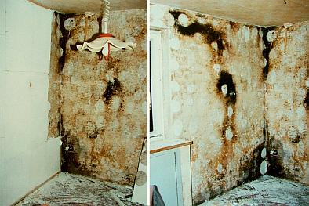 
Innendämmung mit Gipskartondämmplatte - im Zwischenraum / auf der Wand Schwarzschimmelbefall - Folge ungeplanter, aber zumindest langfristig unvermeidbarer Tauwasserbildung durch Risse in der Vorsatzschale (Bildquelle: Beratungskunde) 

Und so kann es im Falle einer CS-PLatte / Schimmelsanierplatte auch ausgehen, wenn man der Industrielösung zu viel zumutet und seine Raumluftfeuchte (vom Gestank schweigt des Sängers Höflichkeit) nicht weglüftet - Malerfavoritenpfusch 2.0: [Bild: Flickr-Album von Edi Bromm](http://www.flickr.com/photos/11672694@N08/sets/72157601498882984/): 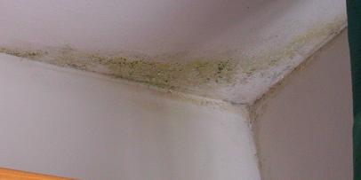/ 
Die kondensatgefährdeten Wandflächen wurden entsprechend Werbung mit "kapillaraktiven" Kalziumsilikatplatten / Innendämmplatten verkleidet, die gemäß "Versuchen und mathematischen Simulationen" eine wesentlich geringere Tauwassermenge im kondensatgefährdeten Bauteil garantieren sollen - doch prompt wächst hier der Schimmelpilzbefall eben darauf - weil eben die Raumluftfeuchte nicht in ausreichendem Maß abgelüftet wurde. Und wenn das ausreichend stetige Lüften wie weiland mit Uropas Holzfenstern (Sollkondensatoren durch Einfachglas, Zwangslüfter durch geringe, aber perfekte Fugendurchlässigkeit für ständige Zufuhr von frischer, trockener Luft) und das damit verbundene sichere Vermindern der kritischen Raumluftfeuchte erfolgt wäre, hätte auf irgendwelche Innendämmungen zur angeblich schimmelpilzvermeidenden Erhöhung der Temperatur der Innenwand gleich ganz verzichtet werden können. Oder? Und wenn schon was wirklich Energiesparendes im Raum verwirklicht werden muß, das irgendeine Chance auf Wirtschaftlichkeit hat - warum nicht eine simple Dämmtapete an die Decke? Richtig gemacht und beschichtet, bietet das die geringsten bauphysikalischen Probleme und da Wärme nach oben steigt, ist damit auch der größte Effekt mit geringstem Aufwand anzunehmen. Warum nicht ausprobieren, vor allem bevor man irre Maßnahmen mit dicken Dämmpaketen an ungeeeigneten und feuchtekritischen Bauteilen durchführt? 

So sah es andererseits aus in einem von mir sanierten fränkischen Blockbohlenhaus nach dem Abnehmen der verputzten Heraklith-Verkleidung ("Sauerkrautplatten")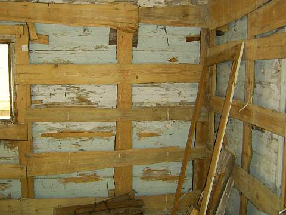 und so nach dem Wegbau des Lattengerüsts und Abnahme der morschen Oberflächenbestandteile: 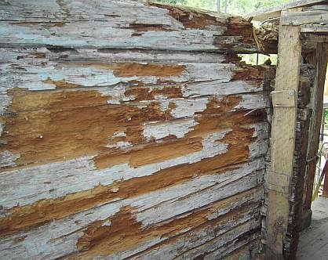 Nur zur Kenntnis! (s.a.u.) 

Die Frage ist zunächst zu stellen, wie teuer ist die nachträgliche Dämmkonstruktion? Bei bemerkenswerten, mehr oder weniger aufwendig dekorierten bzw. denkmalgeschützten Innenräumen auch, inwieweit damit das innere Erscheinungsbild nachteilig verändert wird? Beispielsweise können Innenprofile wie Stuckleisten, Hohlkehlen, Lamberien, Vertäferungen usw. in der Dämmstoffschale "verschwinden" bzw. müssen abgebaut werden. Alles eine Abwägungsfrage. Den denkmalpflegerischen Aspekt muß der zuständige Gebietsreferent des Landesamts für Denkmalpflege entscheiden, uns braucht das hier nicht weiter zu interessieren. Auch die etwas verminderte Raumfläche ist zu bedenken und vom Eigentümer / Bauherren abzuwägen. 

Doch was ist mit den Kosten? 

Kaum ein Bauherr kennt die tatsächlichen Heizenergieverbräuche je qm beheizter Fläche. Hier muß genauso wie im Fall der Außendämmung / Außenisolierung / Fassadendämmung angesetzt werden, um anhand einer Wirtschaftlichkeitsberechnung beispielsweise mit einem Mehrkosten-Nutzen-Verhältnis von 12 zu beurteilen, ob eine zusätzliche Dämmung und die dadurch angenommenen Ersparnisse / verminderten Heizkosten die "Energiepsarmaßnahme" überhaupt "gegenrechnen" bzw. rentierlich werden lassen. Aus den Ersparnissen müßte folglich der Dämmaufwand finanziert werden können. Mir jedenfalls ist solch ein Fall noch nicht bekannt geworden. Soviel erst mal zur Wirtschaftlichkeit. 

Bei der Beurteilung von Konstruktionsschäden hinter Vorsatzschalen bzw. Innendämmungen stößt man nahezu immer auf Hinterfeuchtung, soweit Holzfassade auch Vermorschung durch Holzschädlingsbefall, Hausschwammbefall und dergleichen. Und zwar sowohl bei mineralisch-kapillaraktiver Vorsatzdämmung wie auch bei kapillarblockierenden Dämmsystemen. Warum? Weil sich hinter der Innendämmung im zwangsläufig während der Heizperiode kälteren Bereich der Innenwandseite zwangsläufig Kondensat (Kondenswasser-Niederschlag an den kühlen Baustoffoberflächen, Kapillare Aufnahme in den Baustoffporen bzw. Auskondensierung der in die kühleren Baustoffporen eindiffundierenden feuchten Luft) anreichern muß. Und das kommt freilich nicht nur aus der ggf. durch Undichtheiten / Rissen / Fugen einströmenden Warmluft. Sehr schön bringt der Professor und Dipl.-Ing. Axel C. Rahn im Deutschen Ingenieurblatt 01-2012 auf den Seiten 28 ff. in seinem seltsam betitelten Artikel "Neue Risiken für Planer" das auf den Gruselpunkt, was eigentlich wahrheitsgemäß "Bekannte Risiken für den Bauherrn" betitelt werden müßte, ich zitiere: 

_"... Innendämmung mit kapillaraktiven Wärmedämmstoffen ... für die raumseitige Wärmedämmung: Wenngleich bei vielen kapillaraktiven Wärmedämmstoffen die Materialbasis gleich ist, können sich die Wärmedämmstoffe hinsichtlich ihrer kapillaraktiven Wirkung nachhaltig unterscheiden, weil die Staffelung der Porengröße für die Wirkungsweise maßgeblich ist. Messungen ... vom Fraunhofer Institut für Bauphysik ... haben gezeigt ..."dass die herkömmlichen Kennwerte für die Beurteilung des Feuchtetransports zu einer Fehleinschätzung des Flüssigkeitstransports von Innendämmungen führen können. Bei der hygrothermischen Bewertung eines realen Anwendungsfalls kann dies rechnerisch zu einem geringeren Feuchteniveau führen. Solche rechnerisch funktionstüchtige Bauteilaufbauten können im Extremfall in der Realität versagen." ... Es ist somit zu konstatieren, dass die Kennwertbasis für die hygrothermische Simulation heute immer noch nicht befriedigend ist, womit der Planer einer derartigen Dämmmaßnahme ein gewisses Risiko eingeht. ... Für die haustechnische Bemessung müsste die Wärmeleitfähigkeit [der U-Wert] mit einem Zuschlagswert versehen werden, da im Nutzungszustand mit einer gegenüber der Ausgleichsfeuchte wesentlich erhöhten Feuchte gerechnet werden muss. ... Frage, wie die Dauerhaftigkeit des Wärmedämmmaterials unter Berücksichtigung der an der Grenzfläche zwischen Innendämmung und Bestandskonstruktion zu erwartenden möglichen Eisbildung ist. Dies könnte nicht nur bei dickeren Dämmstoffdicken ein mögliches Problem werden. ..."_ 

Im Klartext, jenseits allen professoralen Wortgeschwurbels: Die Dämm- und Feuchterechnerei der angeblichen Experten stimmt auch für Innendämmung nicht, die Wand wird naß und fördert das Wohnverrotten der Bevölkerung im "energieeffizienten Neubau" oder "energetisch sanierten Altbau". Mit Unterstützung der Bundesregierung selbstverständlich. Und nicht allzuviele Dämmstoffe und Schichtkonstruktionen sind von diesem endlich mal in einem etablierten Fachblatt aufgedeckten Dämmproblem nicht betroffen. Wobei auch das wiederum vom jeweiligen Einzelfall abhängig ist und deswegen nicht generalisiert werden sollte. Nicht zu vergessen all die Randbedingungen des Wohnklimas, die hier unbedingt zu beachten sind. 

Die innere Vorsatz-Schale hat eben ein merkwürdiges und vielen - vor allem auch den maßgeblichen Berechnungsmodellen / Feuchtesimulationen - unbekanntes (man sieht ja nix) Eigenleben und enthält - bei porigen / schaumigen / gespinstigen / flockigen / wasserrückhaltenden bzw. erhöht ausgleichsfeuchtehaltigen "Dämmstoffen" - eben LUFT. Die enthält immer mehr oder weniger Wasserdampf, der dann im Fall ausreichender Feuchtegehalte und ausreichender Temperatur - im Klartext: kalten Bauteilen - am untertemperierten Bereich auskondensiert. Besonders schön auch, wenn die Luft zunächst mal perfekt durch Dampfbremsen / Dampfsperren / Folien eingekapselt wird. Und da dorthin bekanntermaßen keine dolle Heizenergie hinkommt und auch von äußerer Solarstrahlung keine ausreichende Temperaturerhöhung bewirkt wird, bleibt die naße Brühe wo sie entstanden ist und reichert sich mehr und mehr an. Kommt von außen Feuchte dazu, oder fällt diese trotz aller schönen Folien aus, bleibt sie auch möglichst lange eingesperrt, da sie dann nach innen nicht mehr wegtrocknen kann. Danke, liebe Folie! Und obwohl das für Kondensat- und Taupunktberechnungen maßgeblich Glaserverfahren - ein nur stationär rechnendes Verfahren ohne Beachtung der sich am Haus in Wahrheit einstellenden dynamischen Klimawechels im Tag-Nacht- und Jahreszeitverlauf - oft genug die Taupunktproblematik von Innendämmungen verdeutlicht, ist darauf keinesfalls 100%ig Verlaß. 

Zusätzlich wandert in die Wand auch von außen fassadenseits fallweise Regenfeuchte und Kondenswasser aus abkühlender Nachtluft ein, die dann - wegen der irrwitzigen Innenschale - nicht besonders gut ausgeheizt und weggetrocknet wird. Im Ergebnis rottet also auch die Außenwand schneller an der Witterung zusammen, da länger feucht stehend, wenn innen die Wärme abgeschottet wird. Gerade an Fachwerkhäusern läßt sich nach einigen Jahren Bewitterung der Einfluß der Ausheizung oft besonders schön nachweisen: Die Fassade vor dem ungeheizten Dachboden gammelt vor sich hin, während die winterlich ausgeheizten Wohngeschosse noch keinen Schaden zeigen. Augen auf! 

In Fachkreisen wird auch das Problem "Atemwasser holzzerstörender Pilze" gefürchtet. Nicht nur in den heute sehr beliebten Zwischensparrendämmsystemen, auch im unbelüfteten Innenbereich innengedämmter Fachwerkwände und sonstiger Holzständerbauten tritt dies Problem auf: Die Pilze wandeln beim Abbau von Cellulose (C6H10O5) diese unter Beteiligung des auch aus der Luft entnommenen Sauerstoffs in CO2 - Kohlendioxid und H2O 
- Wasser um, die Stoffwechselprodukte werden an die Umgebungsluft abgegeben - eben ausgeatmet. Das so entstandene Wasser erhöht die Eigenfeuchte der in der Umgebung vorhanden Hölzer, was dann die holzzerstörenden Pilze - ja, darunter auch die Braunfäule und der echte Hausschwamm - natürlich nicht ruhen, sondern sehr verständlicherweise jubeln - und wachsen und fressen und atmen läßt. Bis die Bude kracht. 

Selbstverständlich haben sich die Industrie und das Handwerk, die Bauphysik und die Planer noch etwas ausgedacht, um das Problem der Feuchteanreicherung noch weiter zu verschärfen: Sie empfehlen die Beschichtung der Wandflächen mit kapillarblockierenden Anstrichsystemen / Farben. damit die Feuchte, die zwangsläufig durch die gerade in versprödungsanfälligen Kunstharzanstrichen / Dispersionsfarben bald entstehenden Risslein eindringt und auch durch Kondensat ensteht, nur ja auf ewig in der Wand bleibt. Doch das ist ein [anderes Thema](22bausto.md). 

Im selben Sinne wirken freilich all die wunderschönen Dampfbremsen / Dampfbremsfolien / dampfdichten Folien / intelligenten Dampfbremsen mit Dioden-Funktion und Bekleidungen. Im Zusammenhang mit der Dachdämmung kommen diese Wundertäter noch genauer dran. Auch die dichten Fenster ohne hinreichende Fugendurchlässigkeit garantieren Überfeuchten im Raum, die dann gnadenlos den weg in die Konstruktion der Außenwand suchen. Von der hygroskopischen Feuchteaufnahme von schadsalzbelasteten Wänden unter der Innendämmung ganz zu schweigen. Ist ja logo, gleichwohl nahezu unbekannt. 

Auch beim Lehmbau mit Lehmgefachen, Lehmputzen und Lehmfarben muß man wissen, was man tut. Feuchtetechnisch kann es hier Probleme geben, wenn man die Eigenschaften von Lehm und Ton vernachlässigt. 

Ein Beispiel aus meiner [Bauberatung](2frag03.md): 

T. R. schrieb: _"Nun haben wir unser**Fachwerk mit Lehmsteinen ausgemauert** , alles knochentrocken gehabt, und alle **Innenwände mit Lehm Grundputz** von XY bespritzt. Das Wetter war nicht immer optimal aber wir haben max. gelüftet. Nun ist in den meisten Räumen **Schimmel; weiß und rot** , mehr oder weniger viel. Eigentlich wollte ich ja gerade Schimmel nicht im Bau ..."_ 

So kanns also nausgehen beim Biobau - deswegen hier als Info mein etwas überarbeiteter Beitrag aus dem [Fachwerkforum bei fachwerk.de - Innendämmung mit Lehm oder was?](http://www.fachwerk.de/goForum.html?id=90779): 

 So kann ein innengedämmtes Holzhaus nach ein paar Jahren Nutzung aussehen. Dabei handelte es sich um eine kalkverputzte Heraklithverkleidung. Es kommt immer etwas Feuchte hinter die Dämmung, und die gedämmte Wand ist halt kälter, und dann kondensiert es ein - abhängig von der Raumluftfeuchte, die in dicht gedämmten Buden gerne höher ist. Von außen kommt fallweise der Schlagregen dazu. Die Wand kann folglich auffeuchten, die Feuchte wird dann in der kalten Jahreszeit nimmer richtig rausgeheizt. 

Eine zusätzliche Lehmschale halte ich für ebenso falsch. Wichtig ist doch, daß die Fachwerkwand in der Heizperiode genug Wärme bekommt, um eben ausreichend auszutrocknen. Und genau dem steht jegliche Art von Innendämmung entgegen. 

Daß auch knirsch an die Fachwerkwand gepreßte Lehmsteine eine kapillarbrechende Schichtgrenze bilden, können Sie in meinem entsprechenden Forumsbeitrag hier lesen:[Fachwerkforum bei fachwerk.de - Innenwand Wärmedämmung?](http://www.fachwerk.de/goForum.html?id=112806) 

Wichtig: [Richtig (!) heizen und lüften](7temper.md), also stetig und nicht ständig rauf und runter bzw. unsinnige Stoßlüfterei. Dann bleibt auch der Energieverbrauch niedrig. 

Und: Ein funktionierendes System wie die historisch bewährte Fachwerkwand bitte nicht zu Tode dämmen, egal ob industriemäßig mit Schaum/Gespinst, mit mondscheingestampftem ÖKO-Leichtlehm oder handgezupft- pobedrückten BIO-Haschischplatten. Nebenbei stehen die [Dämm-Kosten nie in einem akzeptablen Verhältnis zu den (theoretischen) Einspareffekten](7fehrtab.md) - das sage ich als EnEV-Sachverständiger, der ständig - streng nach EnEV, versteht sich - Wirtschaftlichkeitsberechnungen betr. [EnEV-Befreiung](7temp24.md) vornimmt. 

Wenn es mal dauerhaft keine Schäden durch Fachwerk-Innendämmung geben sollte, ich will das ja nicht abstreiten, liegt das 

- an der dank guter Dauerlüftung ausreichend trockenen Raumluft, 
- an fehlender Bewitterung der Wand von außen, bzw. 
- [Dauerbetrieb einer Hüllflächentemperierung](7temper.md). 

Doch damit wird die Innendämmung noch lange nicht wirtschaftlich. Und bleibt ein Risiko, wenn die genannten Voraussetzungen irgendwann mal nicht mehr funktionieren, sei es durch Leerstand oder sonstige bauliche Änderungen. 

Selbstverständlich macht es bei vorhandener Innendämmung Sinn, die Feuchte darin zu messen. Noch mehr Sinn machte es, anhand einer Freilegung an einer kritischen Partie wie Außenwandecke sich die Sache mal genauer anzusehen. 

Und ansonsten wette ich, daß der historische Oberputz ein Luftkalkmörtel war, auf welchem Gefachaufbau auch immer (Ziegel, Bims, Lehm). Und genau das würde ich ggf. wieder so machen, denn er kann im Unterschied zum Dichtbaustoff Lehm (ideal für Fundament- und Teichabdichtung) wirklich Raumluftfeuchtespitzen puffern und bestens wieder abtrocknen. 

Und die Biodämmstoffe sind in Bezug auf Schimmel keineswegs besser als Industrieware: Sie halten Feuchte gräßlich zurück mangels Kapillarsystem - vergleichbar Mineralwollfilz oder machen dicht wie z.B. Lehm. Wenn nun Feuchte da ist, schimmelt's eben. Und Holz rottet dann. Habe selbst in diesem Forum schon irgendwo Schimmel auf Bio gesehen, und zwar nicht nur in meinen Bildern ... 

Jeder kann selbst zum Baustoffprüfer werden: Probieren Sie doch mal die Feuchteaufnahme und -abgabe eines Lehmputzes mit dem eines Luftkalkmörtels zu vergleichen. Das kann man auf einer Küchenwaage machen, mit der Küchenuhr als Zeitmesser. Und dann wird der Unterschied klar. 

Davon abgesehen ist mir kein Beispiel bekannt, wo sich die gar nicht mal so geringen Kosten einer Leichtlehmzusatzschale durch damit erzielbare Energieeinsparungen wirtschaftlich gegenrechnen würden. 

Freilich haben dickere Wände besseren Schallschutz. Doch die heizungsbedingte Austrocknung der winterlich beregneten Fachwerkwand wird dann ein Problem. Warum nicht die Erfahrung unserer Vorväter nutzen? Die Meister des Fachwerkbaus haben auf derlei Späßchen verzichtet - aus Armut oder Blödheit oder weil eh der Knecht das Holz gehackt und verschürt hat? 

Wenn der Lehm ins Fachwerkgefache eingebaut ist, ist er bedeutend nasser als das Holz. 

Folge: Das trockenere Holz nimmt Feuchte an und - quillt. 

Dann kommt die Trocknungsphase: 

1. Das Holz schwindet. 
2. Der Lehm schwindet. 

Folge: Eine zwischen Lehm und Holz klaffende Fuge. Diese ist kapillar aktiv und kann bei Beregnung Unmengen Wasser reinsaugen. Das nimmt nun aber nicht der (dichtere) Lehm auf, sondern vorzugsweise das Holz. 

So kann es zu Überfeuchten im Holz kommen, abhängig von der Bewitterungssituation. Deswegen haben die alten Meister bzw. die geschädigten Hausbesitzer die stark bewitterten Fachwerkfassaden entweder gleich oder nach Schadenseintritt durch entsprechende Schutzkonstruktionen (Dachvorsprung, Abweisbrettgesimse, Vollverkleidung mit Vorsatzschale) geschützt. Wenn der Lehm irgendwelche Holztrocknungseigenschaften und nicht diese vermaledeite Neigung zur schwundbedingten Fugenbildung gehabt hätte, wäre das natürlich nicht notwendig gewesen. 

Auch wenn man die zunächst entstehende Fuge nachverdichtet - mit nassem Lehm - bleibt der Quell- und Schwundeffekt, die Kapillarwirkung der Fuge steigt mit geringerer Fugenbreite. 

Natürlich ist die Fuge auch bei allen anderen Mörteln existent, profimäßig macht ja man extra einen Kellenschnitt als "Bewegungsfuge". Nur trocknen Kalkmörtel selber weitaus schneller und besser als Lehm. 

Was dann bei Beregnung übrigens noch dazukommt: 

Kalkmörtel entlastet die Fuge am Schwellholz/unterem Rähm um Weltklassen besser, da er von vornherein in seiner Fläche mehr Wasser "kurzfristig" wegsaugt - um es baldigst wieder abzugeben. Es sei denn, ein Heini hat das Gefach mit wasserabweisenden Farben nach Künzelscher Fassadentheorie zugepappt. 

Freilich, auch Holz ist nicht der Renner betr. Feuchteaufnahme und -abgabe. Und ist deswegen ein bewährtes und auch dichtes Dachmaterial (Schindel). Aber das steht hier nicht zur Diskussion. 

Wissen sollte man nur betr. Innendämmung, daß Holzweichfaserplatten bedeutend mehr Kondensat (und selbstverständlich auch Wasser) reinsaugen (Meßwerte an die 30 % in WDVS-Wanddaämmplatten und Dachdämmungen sind kein Ding der Unmöglichkeit!), als Massivholz, und mangels Kapillarität dann äußerst lange zurückhalten können. Deswegen schimmelt das Zeugs ja auch nicht schlecht, sobald die Umgebungskonditionen passen. Nicht umsonst werden den seltsamen Putzen für den Einsatz auf Holzweichfaserplatten ausreichende Mengen giftiger Fungizide beigesetzt. Nebenbei werden "moderne" Holzweichfaserplatten auch gerne mit Kunstharzleimen und Kunststoff-Stützfasern versehen, die für manchen überzeugten Ökohengst deren so arg gepriesenen Mengen giftiger Fungizide beigesetzt. Nebenbei werden "moderne" Holzweichfaserplatten auch gerne mit Kunstharzleimen und Kunststoff-Stützfasern versehen, die für manchen überzeugten Ökohengst deren so arg gepriesenen ökologischen Vorteile etwas in Mitleidenschaft ziehen und im Entsorgungsfall höhere Kosten verursachen (keine Kompostierbarkeit). Hier etwas Zusatzinfo zum Problemmüll "Ökodämmung" von Holzweichfaser über Hanf und Flachs bis zur Schafwolle und sonstigen künstlichen Dämmstoffen: [AID-Info zu nachwachsenden Dämmstoffen](http://www.aid.de/landwirtschaft/haus_daemmstoffe.php) [Kompetenzzentrum Bauen mit nachwachsenden Rohstoffen - Inhaltsstoffe von Dämmmaterialien](http://www.knr-muenster.de/index.php?id=78) 

Und zweitens: 

Die frühere Lehmbauerei hatte Zeit. Die brauchte der Lehm unbedingt zum ordentlichen Durchtrocknen der eingebauten Lagen. Heitzutage fehlt es nicht an teurem Lehmpamp, sondern an Zeit. Und so geht eben so einiges beim Lehmbau schief. 

Kommt nun die typische Innenkondensation durch überfeuchtes Energiespar-Raumklima zustande, ist die äußere raumseitige Zone des Lehms ein Problem. Seine organganischen Zuschlagsstoffe und die typischen Methylzelluloseanstriche / Bioanstriche sind perfektes Substrat für den Schimmelbefall. Und seine vergleichsweise dichte Struktur saugt eben nicht das ankommende Kondensat schnell weg, wie es ein Kalkmörtel im Vergleichsfall könnte. Das dürfte inzwischen klar sein, daß es ein bedeutendes Schimmelrisiko bei Lehmputzen gibt. 

Was mich befremdet, ist das Propagieren der Lehmerei ohne ausreichendes Risikobewußtsein und Beachtung der Reaktionen der beteiligten Konstruktionen bei Feuchte. Märchen wie unübertreffbare Feuchtepufferung (sehen wir mal von der schnell erreichten Auffeuchtung der Oberzone und extrem sandhaltigen/abgemagerten Mischungen ab), Rauchverzehrung und Holzaustrocknung / Trockenhaltung durch Lehm sollten wir uns als Fachleute sparen. 

Lehmbau - gegen den ich freilich garnix habe, setzt eben wie alle anderen Bauweisen konstruktive Kenntnisse voraus, um Material und Verarbeitung sowie den späteren Gebrauch in den Griff zu bekommen. 

_Einwand eines Forumsteilnehmers (sinngemäß zitiert, faktisch ergänzt): 
Nach einem Versuch des FEB Uni Kassel (Forschungslabor für Experimentelles Bauen, gegr. von Prof. Gernot Minke an der Fachhochschule, dann Gesamthochschule, jetzt gar Universität Kassel) kann dieser bis zu 300 g Wasser aus der Raumluft pro m² innerhalb 48 Stunden aufnehmen. Zum Vergleich: Gebrannte Ziegel liegen hier bei 10-30 g "andere" Putze lagen zwischen 26-76 g._

Antwort: Was die Wissenschaft betrifft, muß man immer fragen, wer sie finanziert bzw. veranlaßt, ein Lehmpapst oder ein Lehmketzer? Man kennt doch seine Bauforscher. Wo ist eine zuverlässige Tabelle der Desorptionsfähigkeiten (Austrocknungsfähigkeit, Austrocknungsgeschwindigkeit) von Lehm und Kalkmörtel im Vergleich? Wie sandig abgemagert war der verwendete Lehm? War es saugfähigkeitsoptimierter Strohlehm, Holzhackschnitzel-Lehm, Lehmsand, porenoptimierter Leichtlehm, besten geeignet für die grünbeschimmelte, schimmelpilzbewachsene Innenwand? Das könnte die anstehende Frage im Sinne von "Wissenschaft" beantworten. 

Die zitierte Laborforschung liegt mir inkl. der den Versuchsaufbau bestimmenden Randbedingungen nicht vor. Vorstellen könnte ich mir schon, daß unheimliche Mengen Raumluftkondensat auf einer kalten Lehmschicht in der obersten Zone niederklatschen und dann deren Feuchtegehalt massiv erhöhen, bis es von der Wand rinnt. 

Nebenbei ist die Feuchtebeaufschlagung einer Konstruktion vorwiegend abhängig vom Verhältnis Raumluftfeuchte-Lufttemperatur-Oberflächentemperatur. Und der Anstieg der Oberflächentemperatur eines Raumes ist beim Aufheizvorgang mit Heizluft von der Materialdichte (Rohdichte). 

Ein schwerer Baustoff wie Lehm wird also viel langsamer erwärmt als ein leichter Porenziegel oder gar ein Dämmstoff. Bleibt also zunächst wesentlich kälter und verschlingt unter Laborbedingungen gegen eine kaltbleibende Außenluft (Klimakammer) auch mehr Nachheizbedarf, um seine Oberflächentemperatur zu halten. 

Womit wir bei den möglichen Parametern wären, die bei einem Absorptionsversuch von Kondensat in Raumoberflächen zu beachten sind, neben so einigen weiteren. Beim Versuchsaufbau kommt es eben genau darauf an, wenn man faire Vergleichsuntersuchungen machen will. 

Ansonsten ist es die leichteste aller Übungen, durch geeignete Versuchsaufbauten so gut wie jedes gewünschte Versuchsergebnis vorzuprogrammieren. 

Aber die Transportleistung des Kalkmörtels, der Kondensat ins Innere wegtransportiert, es nicht an der Oberfläche schimmelriskant anreichert und danach ohne Anstrengung schnell wieder abgibt, KANN Lehmputz niemals erreichen. Na gut, im Mischungsverhältnis Sand/Lehm = 99/1 schon, aber das ist Illusion. 

Wenn Sie mal die Pettenkofermethode anwenden und Baustoffe "durchpusten", werden Sie schnell selber herausfinden, welches Material für Diffusion und auch Feuchte um Weltklassen durchströmbarer ist. Meine unwissenschaftliche Prognose: 

Lehm kann nur der zweite Sieger sein. 

Oft muß man sich auf den begrenzten Verstand und die Erfahrung und nicht auf die Auftragswissenschaft verlassen. 

Das wäre ja auch eine Methode. Und vielleicht nicht die schlechteste. 

Ich zitiere auszugsweise aus einer Abdichtanleitung für Teichbau: 

_"Es gibt prinzipiell mehrere Möglichkeiten einer Teichabdichtung mit Lehm. ...: 

1. **Stampflehmabdichtung** 
Fetter Lehm (mindestens 30% Tonanteil) wird in erdfeuchter, krümeliger Konsistenz in einer Schichtstärke von 15-18 cm auf dem Teichboden aufgebracht und festgestampft. ... 

2. ... **Verlegen von ungebrannten Lehmsteinen - sogenannten Grünlingen**. 
Am besten verwendet man hier das Doppelformat mit 12x12x25 cm. Die Fugen zwischen den Steinen sollten möglichst klein sein und werden ebenfalls mit krümeligem Lehm verfüllt. Sie können aber auch mit einer Lehmschlämme, die Sie sich aus den aufgeweichten Grünlingen herstellen, zugegossen oder zugestrichen werden. Anschließend wird die Lehmoberfläche mit Wasser besprüht, sodaß die Lehmsteine noch etwas aufquellen können und sich eventuelle Fugen noch schließen. ... 

3. Am einfachsten ist es, **Fertigteil-Lehmelemente** zu verlegen oder die **Abdichtung mit tonhaltigen Vliesen** ..."_

Soviel zum profimäßigen Dichten mit Lehm&Ton. Reimt sich doch geradzu unheimlich gut mit meinen obigen Aussagen zusammen - oder? 

Hier der Link zur Quelle: [Forum nawaro.com: Christian A. Rauch: Teichabdichtung mit Lehm](http://www.nawaro.com/cgi-bin/forum.pl?action=show&groupid=2) 

Schauen wir uns mal aus hiostorischem Interesse die alten Holzbüdli an, die jahrhundertelang klaglos vor sich hin standen und bis auf unsere Tage durchhielten - soweit nicht schon durch Fehlsanierung, extreme Vernachlässigung der Dachdeckung, Rinnen und Entwässerungsverhältnisse, Bombenkrieg, Feuersbrunst und brutalen Abriß wegen Grundstücksspekulation und Stadtumbau verlorengegangen. 

Wie dick waren dort die Wändli? 

Beispiele aus einem einst gottgesegneten Alpenland 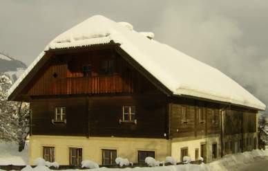 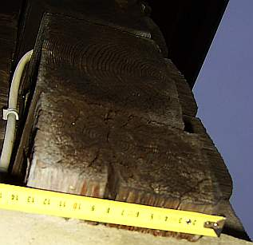 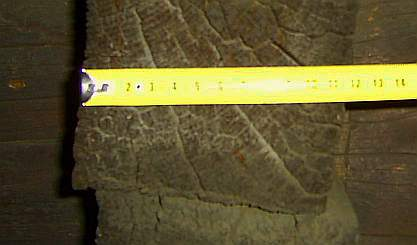 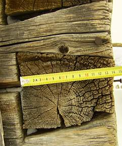 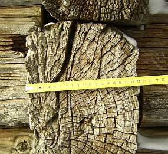 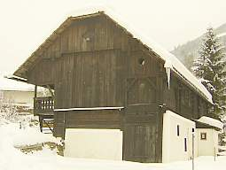 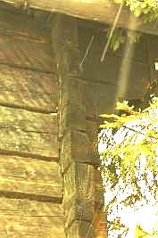 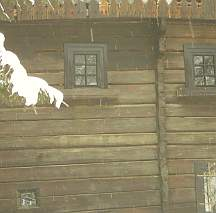 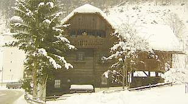 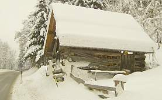 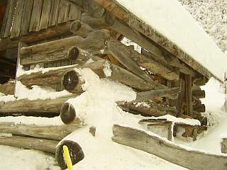 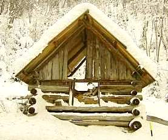 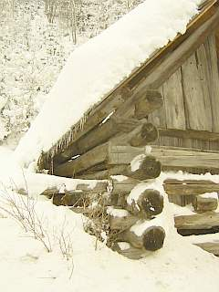 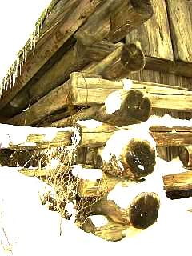 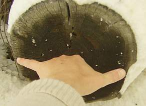 

Messen Sie bitte selber nach, auch mal am Fachwerk um die Ecke, so wie ich! Blockbauten ca. 7-12, im schneereichen Hochgebirge meinetwegen auch bis 15 Zentimeter. Fachwerkbauten ca. 12-20 cm, "Mehrstärken" um ca. 20 cm nur in wohlbegründeten Ausnahmen besonders kurzer Bauzeit im Hochgebirge mit extremer Bewitterung bzw. Vollholzquerschnitte / Rundhölzer / Stämme zur vereinfachten Bauweise durchlüfteter Heuspeicher / Heuschober. Mehr Dicke war nicht. Mit Heizung hatte es eh nix zu tun, wenn ein bisserl stärker gebaut wurde. Die Almbuden waren ja winters unbewohnt. Die schlanken Querschnitte, beim Fachwerk ca. 20 cm +/- 6 (Wohnbauten eher minus, Rathäuser und sonstige Repräsentationsbauten oder Funktionsbauten wie Mühlen und Eckständer / Mittelstützen eher plus) genügten nicht nur wegen Materialersparnis und Konstruktionsoptimierung. Nein, auch weil diese Wandstärken am besten trocken blieben, bei den allerlei Beanspruchungen von innen und außen. Und betreffend Heizaufwand durchaus passable Verbräuche boten. Denn gerade das war unseren Vorfahren, die ja viermal warm wurden durch ein Scheitla Holz (Fällen des Baumes, Transport aus dem Wald, Kleinmachen /Spalten und dann Heizen), auch immer sehr wichtig gewesen. Energiesparen ist ja keine Erfindung unserer Zeit, frühere Zeiten hatten uns auch da viel voraus. Ausnahmen bestätigen die Regel ... 

Doch dieses Kondensatproblem bei Innendämmung hat mehrere Aspekte. Wenn nämlich die Innendämmung an der Wand ist, und diese dank geringerer Materialdichte der neuen Oberfläche nun schneller warm wird (dafür aber auch bei Absenkung der Raumtemperatur schneller auskühlt und damit zum Kondensatfänger wird, Holla!), werden nun die angrenzenden Baubereiche der Innenwände und Decken zu kälteren Flächen und damit durch die geradezu unvermeidliche Tauwasserbildung zu Kondensat- und Schimmelfängern. Umso lieber verrotten nun auch die in die gedämmte Wand einbindenden Deckenbalkenauflager. Die Baupfuisicker empfehlen deswegen das zusätzliche Dämmen dieser neuerlich riskanten Baubereiche und haben dafür keilförmig angeschnitzte "Dämmkeile" in petto. Da nun die Dämmebene zur Vermeidung von Tauwasserbildung / Kondnesatbildung keinesfalls von zwangsweise warmfeuchter Innenluft / Raumluft umspült werden darf, empfehlen die so fachkundigen Experten selbstverständlich auch angeblich dauerdicht klebende oder aufgezwickte Dampfbremsen, Dampfsperren bzw. Plastikfolien oder sogar übertapezierbare Alufolien, möglicherweise sogar die "Intelligente Dampfbremse" (die freilich um Weltklassen "intelligenter" ist, als solche Experten, da als mißbrauchtes Material an solchem Baupfusch grundsätzlich total unschuldig. 

Doch helfen kann das alles - außer selbstverständlich dem umsatzmaximierenden Dämm- und Dichtstoffverkäufer und ggf. dem dummdämmenden Malermeister - nur bedingt, es entstehen ja automatisch neue - niemals dauerdichte Fugen und das Grundsatzproblem der Auskühlung und Feuchteanreicherung fassadenseits bleibt bestehen. 

Hinzu kommen weitere Kosten und funktionstechnische Nachteile der Innendämmung durch den damit verbundenen Verlust der Nutzfläche, den evtl. erforderlichen Umbau von Einbaumöbeln, das Umlegen von wasserführenden, frostgefährdeten oder kondensatgefährdeten Leitungen / Rohrleitungen, die nicht hinter, sondern vor der Dämmung liegen dürfen, den Umbau der elektrischen Dosen und Schalter, die ansonsten in der Innendämmung absumpfen würden, sowie - um einigermaßen zu überleben und die Raumluftfeuchte im Griff zu behalten, zusätzliche und Heizenergie verschwendende Lüftungsmaßnahmen vom ständigen Fensteraufreißen bis zur [dauerröchelnden Zwangslüftung mit unheimlichem Verkeimungsrisiko](23bau02.md). 

Fazit: 

Wer sein Haus und seine Gesundheit und seinen Geldbeutel durch fehlgeschlagene Dämmversuche maximal schädigen will, wer zum erfolgreichen Schimmelpilz-Züchter werden will, wer sein Geld allerblödsinnigst wegwerfen will - die grottenfalsch konstruierte Innendämmung - also ohne ausreichende Wohnraumlüftung, mit lediglich diffusionsoffenen, aber nicht echt kapillartrocknenden Beschichtungen (Putz + Anstrich!) - bietet dafür beste Lösungen. 

Weiter: [Kapitel 9 - Das Lichtenfelser Experiment - Dämmstoffe im Zwielicht](2139bau.md)
