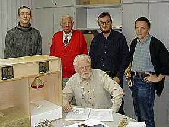

[🠔 Zur Übersicht: Dämmung](213baust.md)  
# Der Schwindel mit Wärmedämmung, Hausisolierung und Energiesparen 9
**Wie dämmen Dämmstoffe wirklich? Dieser Bericht analysiert die tatsächliche Wirkung bei einseitiger Wärmebestrahlung anhand des Lichtenfelser Experiments und vergleicht mit dem U-Wert und λ-Wert.**  
_von Konrad Fischer • aktualisiert 22.07.2005_

## Der Schwindel mit Wärmedämmung, Hausisolierung und Energiesparen 9

## Wärmedämmung im Vergleich
Wie dämmt Dämmstoff? 

Der U-Wert und der λ-Wert 
Das Lichtenfelser Experiment

[ zurück<-](2138bau.md) Kapitel [-> vor](21310bau.md)

---

Nachdem wir auf den vorhergehenden Seiten die abscheuliche Schadensanfälligkeit der Wärmedämmsysteme, deren Ursachen und die peinlichen Hintergründe ihrer zwangsweise Verbreitung durch staatliche Irrsinns-Vorschriften betrachtet haben, kommen wir nun zum eigentlichen Crash: 

Dämmen die so allseits gepriesenen und in den Markt - auch an Ihre Fassade, zwischen Ihre Dachsparren, unter Ihre Bodenplatte, auf Ihren Dachfußboden, vor Ihre Kellerwände, auf und in ihr Haus? - gepressten Leichtbau-Dämmstoffe so wie gedacht und bestellt? 

Können derartige Luftikusse Temperaturveränderungen auf einer Dämmstoffseite irgendwas entgegensetzen? 

Kann das teure Nichts den ungeheuerlichen Kräften der heißen Hitze widerstehen und diese (ein)dämmen? 

Glauben Sie das? 

Wie es wirklich aussieht mit der Wirkung von "Dämmstoffen" bei einseitigen Temperaturveränderungen zeigt dieser Bericht eines Baustoffexperiments (Lichtenfelser Experiment im Oktober 2001, publiziert in "Bautenschutz und Bausanierung" im November 2001, gesendet in ARD-Wissenschaftssendung GLOBUS, ergänzende Messungen mit weiteren Baustoffen zuletzt am 22.7.05): 

---

[Konrad Fischer](1refernz.md), Rolf Köneke +, [Frank Lipfert](http://www.lipfert-glas.de), Claus Meier, Henryk Parsiegla: 

**Dämmstoffe im Rotlicht - Das Lichtenfelser Experiment**

Der Wärmeeintrag in Dach und Wand sowie der Wärmetransport erfolgen durch Wärmeleitung und Strahlung. Die Bestimmung der Wärmeleitfähigkeit von Baustoffen im Labor erfolgt unter stationären Verhältnissen (vgl. u. Normzitate Messaufbau und Prüfverfahren). Die unterschiedliche Anheizzeit und Wärmeenergie, die vor dem Messbeginn in die zu prüfenden Baustoffe eingespeist wird, bleiben dabei unberücksichtigt (vgl. u. Gösele/Schüle). Ebenso unterschlagen bleiben dabei die Temperaturwechsel mit Erwärmung und Abkühlung infolge des Tag-und-Nachtrhytmus. Der mit den demzufolge rein fiktiven Laborwerten berechnete Wärmebedarf stimmt nirgends mit der Praxis überein und weicht meist gravierend von den genormten Annahmen ab. Es besteht ein erheblicher Nachholbedarf bei der Baustoffprüfung nach den Anforderungen der Praxis. Deshalb ermittelte ein Forscherteam - cand. Ing. Henryk Parsiegla, Magdeburg, Bausachverständiger Rolf Köneke +, Hamburg, [Dipl.-Ing. Konrad Fischer, Hochstadt a. Main](1refernz.md), Frank Lipfert, Lichtenfels und Prof. Dr.-Ing. habil. Claus Meier, Nürnberg mit einer Versuchs- und Meßeinrichtung Frank Lipferts in Lichtenfels die tatsächliche Qualität verschiedener Dämmstoffe anhand ihrer Temperaturveränderungen bei einseitiger Wärmebestrahlung. 

Versuchsablauf 

Ein Wärmestrahler (150 W Infrarotlampe) mit gleichbleibender Entfernung und konstanter Strahlungsdauer von 10 Minuten bewirkt für unterschiedliche Baustoffplatten in 4 cm Tiefe (Unterseite Platte) unterschiedliche Temperaturerhöhungen. Daraus ergeben sich Rückschlüsse auf die Thermostabilität und Dämmwirkung der Baustoffe. Die geringfügig abweichenden Ausgangstemperaturen entstanden aus der meßbedingt leicht ansteigenden Umgebungstemperatur. Bei allen Messungen wurde die gleiche Meßkammer mit Polystyrol-Untergrund verwendet. Auf Beschichtung der Versuchskörper, höhere Dicken oder verlängerte Bestrahlungsdauer sowie Simulation von einseitigen Minusgraden wurde bewußt verzichtet. Es kommt ja darauf an, mit geringem Versuchsaufwand und in kurzer Zeit die baustofftypischen Eigenschaften experimentell zu bestimmen. Und genau das kann diese von Prof. Paul Szabo, Dortmund, konfigurierte Meßeinrichtung bestens leisten. 

Ergebnis:

Baustoff Wärme- 
leitzahl 
lambda 
W/mK Wärme- 
durchgangs- 
koeffizient 
k-bzw. 
U-Wert 
W/m2K Anfangs- 
temperatur Endtempera- 
tur nach 
10 Minuten 
Bestrahlung Temperatur- 
entwicklung 
auf Unterseite Endtempera- 
tur auf 
Oberseite 
Mineralwolle 0,04 0,85 21,4 °C 59,8 °C \+ 38,4 °C 173 °C 
Polystyrol 0,04 0,85 21,4 °C 35,4 °C \+ 13,6 °C 72 °C 
Schaumglas 0,04 0,85 20,5 °C 30,8 °C \+ 10,3 °C 
Vollziegel 0,98 4,74 20,9 °C 23,4 °C \+ 2,5 °C 57 °C 
Holzweichfaser 0,04 0,85 21,4 °C 22,2 °C \+ 0,8 °C 100 °C 
Gipskarton 0,21 2,77 22,5 °C 23,0 °C \+ 0,5 °C 
Fichte 0,13 2,09 20,6 °C 20,6 °C +/- 0 °C 82 °C 

_**Anfangs- und Endtemperatur der Baustoffrückseite nach 10 Minuten Bestrahlung** 
(alle Temperaturen auf Start 20 oC zurückgerechnet)_

**Der Versuchsaufbau (vorne links) und die Autoren:** 
(stehend v. l.) cand. Ing. Henryk Parsiegla, Bausachverständiger Rolf Köneke +, [Dipl.-Ing. Konrad Fischer](1refernz.md), Frank Lipfert, 
sitzend: [Prof. Dr.-Ing. habil. Claus Meier](http://ClausMeier.tripod.com). 
Versuchs- und Meßeinrichtung: Frank Lipfert, Lichtenfels.

Analyse 

Die beste Wirkung gegen Temperaturveränderungen und Energiedurchfluß zeigen die Baustoffe aus Holz und Ziegel, trotz ihrer teils absurd "schlechten" Wärmeleitzahlen bzw. U-Werte (vormals k-Werte).

Mineralwolle, Polystyrol und Schaumglas liefern mit "guter" Wärmeleitzahl und Super-U-Wert dazu gegenteilige Ergebnisse. Auch deren maximale Oberflächentemperaturen auf der bestrahlten Seite sind mit über 70 (Polystyrol), 125 (Schaumglas) und 180 °C (Mineralwolle) erstaunlich hoch. So kann im Sommer - Sonnenstrahlung von außen - Barackenklima entstehen, die dann notwendige Kühlung verbraucht Energie. Im Winter - Heizung von innen, "verschlucken"/absorbieren die Leichtbaustoffe zwar mangels Speicherfähigkeit deutlich weniger Heizenergie als massive Baustoffe. Andererseits setzen die künstlichen Leichtbaustoffe den Temperaturveränderungen wenig entgegen, verschatten bzw. vermindern aber die tägliche Solarzustrahlung in die speicherfähige Massivfassade. Die geringste Temperaturerhöhung unter den künstlichen Isolierstoffen zeigte das Schaumglas, das im praktischen Dauereinsatz am Bau auch formstabil bleibt und im Unterschied zu den anderen kein Wasser aufnehmen kann (Problem der "absaufenden Dämmstoffe" an feuchtebelasteten Bauteilen).

Im Winterhalbjahr kann die flach einfallende Solarstrahlung vor allem in der Übergangszeit die Temperatur der sonnenbeschienenen Fassadenoberfläche deutlich erhöhen und bei massiven Bauteilen zu Speichergewinnen führen. Das vermindert den Energieabfluß von innen und verringert den Wärmeverlust. Sobald - abhängig von der Speicherdicke der Wand, der Zustrahlungsintensität und -menge - die eingespeicherte Solarenergie ausreichend in die Nacht "hinübergerettet" wird, spart das Heizenergie gegenüber dem speicherlosen Dämmstoffbau. Die Strahlungsintensität der Sonne liegt in der Heizperiode je nach Himmelsrichtung und Sonnenhöhe etwa zwischen 10 und 45% der Maximalwerte im Juli. Speicherfähige Baustoffe verwerten diese kostenlose Energiezustrahlung am besten. Dies hat auch eine Untersuchung am Fraunhofer-Institut für Bauphysik ergeben, bei der der Energieverbrauch von Versuchsräumen mit unterschiedlichen U-Werten der Außenwand während einer Winterperiode untersucht wurde. Der Raum mit dem "schlechten" U-Wert verbraucht insgesamt weniger Heizenergie: (Grafik Fischer nach vorliegenden Grafik-Daten des IBP - [weitere Erläuterung](21312bau.md#fhg)):

Konrad Fischer: Fassaden energetisch richtig und kostensparend sanieren 1 

[Teil 2](http://www.youtube.com/watch?v=Y1NSxAW15Cc) [Teil 3](http://www.youtube.com/watch?v=RAT7VzBo8k0) [Teil 4](http://www.youtube.com/watch?v=6TBII25iVQk) [Teil 5](http://www.youtube.com/watch?v=Kb0C4KiZvVA) 

Die Praxis am Bau belegt das Meßergebnis des Lichtenfelser Experiments: 

Nur der speicherfähige Massivbau garantiert hohe Temperaturamplitudendämpfung und Phasenverschiebung beim "Durchschlagen" einseitiger Temperaturänderungen auf die andere Seite. Genau das spart Heiz- und Kühlenergie. Auch der von Bossert und [Fehrenberg analysierte Heizenergieverbrauch unterschiedlicher Baukonstruktionen](7fehrtab.md) belegt das geringe und von der U-Wert-Berechnung dramatisch abweichende Sparpotential der Leichtbauweise. Außerdem durchfeuchten, veralgen, verschmutzen und zerreißen die angeblichen Dämmfassaden durch Temperaturbeanspruchung, schnelle Auskühlung und Kondensatbelastung. Das amtlich geforderte Dämmen und Dichten rechnet sich für den Bauherrn nie und ist krankheitsfördernd (Link [Gesundheitsrisiken durch Dämmstoff)](http://www.mythen-post.ch/datei_mp_2_02/irrefuehrung_mp_2_02.htm). Demgegenüber verhalten sich Massivbauten wesentlich günstiger als berechnet und bleiben dauerhaft schadensfrei. 

Zur Erinnerung: - die grün abgesoffene Dämmstofflösung. Das soll Energie sparen?

[Link Uni Siegen: Temperaturamplitudendämpfung und Phasenverschiebung](http://nesa1.uni-siegen.de/mitarb/ehemalige/DissCompaore/Dissertation Desire Compaore.htm) Fazit 

Das leicht nachprüfbare Lichtenfelser Experiment bestätigt die altbekannten Vorteile natürlicher Baustoffe wie Holz und Ziegel. Sie sind auch im EnEV-Zeitalter noch erste Wahl. Ihre Beklebung oder Ausfachung mit Schäumen und Gespinsten verspricht keine energetischen Vorteile, sondern Bau-, Feuchte- und Gesundheitsschäden. Der Wärmefluß durch die Wand kann durch die geringe Speicherfähigkeit der Leichtbaustoffe nur in Phasen geringer Solarzustrahlung beeinflußt werden. Planer und Handwerk schulden dem Auftraggeber aber nicht nur energiesparende, sondern wirtschaftlich und technisch einwandfreie Konstruktionen. Dies gilt sowohl für die Nachrüstung am Altbau wie auch für Neubauten. Der U-Wert garantiert kein Energiesparen. Er gilt normgemäß sowieso nur im Labor, ohne Sonne und Speicherfähigkeit der Baustoffe. Wer wirklich energiesparend bauen will, muß an der Heizung ansetzen: die [Temperierung der Gebäudehüllflächen durch Strahlungsheizung](7temper.md) - ohne Nachtabsenkung! - ist hier der richtigere Weg. Mit substanzschonender Verlegetechnik gelingt dies sogar denkmalgerecht und kostensparend. Die "EnEV-Anforderungen" widersprechen dem Wirtschaftlichkeitsgebot des Energieeinspargesetzes, die bauphysikalischen Stoffdaten der Praxis am Bau. Beide müssen dringend nachgebessert werden. Bis dahin ist das dem verantwortlichen Ermessen des Fachingenieurs überlassen - wir können ja auch mit [Ueff-Werten](7keff.md) und weiteren Korrekturen [praxisnähere Rechendaten, Anlagen- und Konstruktionsbemessungen](7temp17.md) ermitteln. 

---

 Vorsicht! Zynismusrubrik: 

Damit gehört der Dämmschwindel in die selbe Rubrik wie 
[Klimaschwindel, Naturstromschwindel und sonstiger Abzockschmonz](7wsvoant.md), 
der Politik, Wirtschaft und Medien offenbar sehr viel Spaß macht. 

Wirklich lustig, wie leicht das tumbe Volk auszunehmen ist - sogar Weihnachtsgänse leisten mehr Widerstand, oder? 

Und: 

Im Standardwerk der Bauphysik "Schall, Wärme, Feuchte", Bauverlag Wiesbaden Berlin 1985, verfaßt von Karl Gösele, langjähriger und seriöser Leiter des Instituts für Bauphysik in Stuttgart, und Schüle, Abteilungsleiter im Institut, wird im Kapitel "Instationäre Verhältnisse" unterschieden zwischen 

der _Wärme_ leitfähigkeit λ (lambda) und der 

_Temperatur_ leitfähigkeit a,

die neben der Wärmeleitfähigkeit lambda eben auch die spezifische Wärmekapazität c und das Raumgewicht ρ (rho) enthält. Zur Erläuterung der Temperaturleitfähigkeit ist dort zu lesen: 

_"Eine Temperaturänderung pflanzt sich in einem Stoff umso schneller fort, je größer der Wert a ist"._

Dies ist der entscheidende Punkt, der zu den obigen Meßergebnissen führt. Deshalb findet man bei Gösele/Schüle auch den Satz: 

_"Beim Anheizen oder Auskühlen von Räumen oder bei Sonnenzustrahlung zu einem Bauteil, schnellen Änderungen der Lufttemperaturen zu beiden Seiten von Bauteilen usw. treten Temperaturänderungen und Änderungen von Wärmeströmen auf, die durch die Werte 1/λ (Wärmedurchlaßwiderstand) und k (Wärmedurchgangskoeffizient) nicht erfaßt werden können._ 
_In diesen Fällen spielt das Wärmespeichervermögen der Stoffe und Bauteile im Zusammenhang mit der Zeit die entscheidende Rolle"._

Da haben wir es: Seit ewig weiß die Wissenschaft Bescheid. Im Klartext: Massivbaustoffe an der Außenhülle sind perfekte Solarabsorber. Ihre Absorption des eingestrahlten Sonnenlichts = Solarenergie vom UV-IR-Bereich als elektromagnetische Wellen, egal ob aus direkter (Ost-, Süd-, West-Fassade) oder diffuser (Nordseite) Lichstrahlung /Sonnenlich-Einstrahlung spart Heizenergie, verkürzt die Heizperiode und steht als kostenlose Wärmequelle dem Haus zur freien Verfügung. Das wollen Sie nicht glauben? 

Dann lesen Sie Genaueres: Die passende Lektüre für eine umfassende und kontroverse Aufklärung rund um den offiziellen Bauphysik-Beschiß: 

Prof. Dr.-Ing. habil. Claus Meier: **Richtig bauen. Bauphysik im Widerstreit + Mythos Bauphysik** ==> 

Oder messen Sie einfach mal selbst mit einem handelsüblichen IR-Thermometer die tägliche Wärmeaufnahme und nächtliche -abgabe anhand der Oberflächentemperatur ihrer vier Hausfassaden. Vorhergesagtes Resultat: Die aufgenommene Wärme geht nicht komplett verloren, die Wandtemperatur - auch an der Nordseite! - bleibt bei ausreichender Speicherfähigkeit immer höher als die Lufttemperatur. Gaaanz im Unterschied zu leichtgewichtigen Dämmfassaden. Trick-Thermographien zeigen dann früh mollig warme Massivwände und eisige Dämmflächen. Tipp: Lassen Sie die Thermographie mittags anfertigen, dann ist die Dämmfassade heiß und die Massivwand kühler. Diese simplen Wahrheiten werden profimäßig unterschlagen - zum Wohle der Dämmstoffbranche und Fertighausbauer! Und da logischerweise maximal speicherfähige Massivbaustoffe auch mehr Solarenergie absorbieren können, spricht das ebenso gegen alle Baustoffverschlechterungen, die die Massivaufbläher (Porenziegel, Porenbeton, Gasbeton, Schaumbeton, Bläh-Baustoffe), Zerfaserer und Gespinsthersteller (Steinwolle, Weichholzfaserplatten) den unschuldigen Massivbaustoffen Ziegel, Beton und Holz angedeihen lassen. Neben der Durchstrahlung mag auch die Warmluftkonvektion in den mehr oder weniger luftigen/porigen Baustoffen als Transportmechanismus der Wärme durch den Baustoff eine gewisse Rolle spielen. Diese vom Strahlungsanteil exakt zu unterscheiden, dürfte eine gewisse meßtechnische Herausforderung sein ...

---

Die wohl dollste "Erläuterung" des Lichtenfelser Experiments von einem hochintelligenten Physiker finden Sie hier: [www.ing-buero-ebel.de/U-Ent/Immo.htm](http://www.ing-buero-ebel.de/U-Ent/Immo.htm). Bitte prüfen Sie selbst, wie schlau Sie daraus werden und teilen sie mir bitte Ihre Erkenntnisse mit. 

Vielleicht zusätzlich von Interesse: Die etwas besseren Unterseiten-Werte und davon extrem abweichenden deutlich höheren Oberseiten-Werte (gemessen mit IR-Thermometer, ergänzt aus Meßprotokoll am 22.11.07 und alle davon extrem abweichenden Spekulationen widerlegend) bei den experimentell bestrahlten Holzwerkstoffen mit wesentlich geringerer Rohdichte gegenüber dem Vollziegel finden ein einfache Erklärung, die mit dem U-Wert und der Dichte so gut wie nichts zu tun hat: 

Sobald der Wärmestrahl draufbrezelt, verdampft das in den Poren gespeicherte Wasser - Holz hat ja zigfach höheren Wassergehalt als der supertrockene Ziegel. Und diese Verdunstung kühlt bzw. führt Wärmeenergie ab! Sehr vorteilhaft auch beim Brandverhalten wasserhaltiger/wasserdampfabgebender Baustoffe wie Holz und Gipsplatten. Logisch, daß dann die Temperatur unter den Holzwerkstoffen weniger ansteigt, als beim Ziegel und eben höher - bis zur Verdunstungstemperatur(!) bei den für die sonst eher unangenehme Feuchterückhaltung leider viel zu wenig bekannten Holzfaserplatten - als beim Ziegel. Im Fall der Holzverkleidung innen bleibt die aus dem Holz verdunstete Wassermenge im Raum und erhöht die Lufttemperatur (erhöht bei [falscher Konvektionsheiztechnik](7temper.md) und Nachtabsenkung allerdings auch das Kondensat- und Schimmelrisiko!). Das Verdunsten des eingelagerten Kondenswassers verbraucht allerdings Energie, die dann der Raumluft zugeführt wird und damit die Lüftungswäreverluste erhöht. Außen ist der Sommerfall wesentlich - die Hitze durchdringt das Holz kaum, die Überschußwärme aus dem kühlenden Kondensat wird an die Außenluft abgegeben, innen bleibt es erträglich. In der Nacht kühlt das Holz wieder ab und speichert aus der abkühlenden Luft wieder Kondensat ein - für den nächsten Sonnenhitzetag. 

---

**Zur k- bzw. U-Wert-Narretei**

Das k-wertige Fraunhofer-Institut bekommt bei seinen "modernen" Messungen für die desorientierte Ziegelindustrie nun heraus, daß [sonnenbeschienene Südwände energetisch schlechter sind, als schattige Nordwände](29bau11.md). Die Tatsachen am Bau werden also bis zum letzten Winkel ausgeblendet, um Falschkonstruktionen zu puschen. So wird sogar ein k zum U.

Daß der sog. Wärmedurchlaßwiderstand von Bauteilen (Term: 1/Λ), aus der der Wärmedurchgangskoeffizient k(DIN)- bzw. U(ISO)-Wert abgeleitet wird, baupraktisch eine wenig zuverlässige Rechengröße ist, geht schon aus deren genormter Ermittlung gem. DIN 52611 hervor. Zitat: 

_"3.1 Allgemeines_ 
_Während der Messung befindet sich die Probe zwischen zwei Kammern mit unterschiedlichen Temperaturen_[gemeint: Lufttemperaturen]_. In der Regel beträgt die Temperatur in der einen Kammer 20 oC, in der anderen 0 oC, so daß sich in der Probe eine Mitteltemperatur von 10 oC im stationären Zustand einstellt. Zur Bestimmung des Wärmedurchlaßwiderstands 1/Λ werden die Temperaturen auf den beiden Oberflächen der Probe und die Wärmestromdichte q gemessen. ... Der Wärmedurchgangskoeffizient wird [alternativ] ... aus der Differenz der Lufttemperaturen zu beiden Seiten der Probe und der mittleren Wärmestromdichte in der Probe bestimmt."_

Demnach wird in einer genormten _"Versuchsdurchführung"_ ein _"geregelter Heizkasten"_ in einem _"Schutzraum"_ an den _"Probekörper"_ (Mindestgröße 1x1 m, Regelgröße 1,5x1,5 m) angebracht, in dem mittels elektrischem Heizdraht als _"Heizquelle"_ die Innenluft in _"örtlicher und zeitlicher Konstanz"_ erwärmt wird. Bei _"Proben mit grobporöser Oberfläche sind deren Oberflächen mit einer möglichst dünnen Schicht eben und glatt abzugleichen. Zur Vermeidung einer Luftströmung durch die Probe sind die Oberflächen entsprechend abzudichten."_ Normgemäß müssen gem. 4.1.3 _"alle wärmeerzeugenden Einbauten im Heizkasten wie Heizkörper (Heizquelle), Ventilatoren usw. gegen die Probenoberfläche und die Heizkastenwände strahlungsgeschützt sein. Die Heizquelle muß eine gleichmäßige Erwärmung der Luft (örtliche und zeitliche Konstanz) gewährleisten."_ und gem. 4.4.1 _"Die (Temperatur-) Meßfühler müssen vor störenden Strahlungseinflüssen geschützt werden."_ Alle Temperaturen müssen sich nun laborgemäß stationär einstellen, dazu 6.2: _"Der stationäre Zustand ist ... erreicht, wenn sich die Meßwerte innerhalb von 3 Stunden nicht stetig und um nicht mehr als 1 % ändern."_ Dann ist der Zustand erreicht, wo es keine wetter- und heizungsbedingte Aufwärmung und Abkühlung mehr gibt, die Baurealität ist verlassen. Die DIN EN ISO 8990 konkretisiert weiter in _"1.5.1: ... Wärmeaustausch an den Oberflächen des Probekörpers erfolgt sowohl durch Konvektion als auch durch Strahlung. Erstere hängt von der Lufttemperatur und der Luftgeschwindigkeit und letztere von den Temperaturen und den hemisphärischen Gesamtstrahlungsaustauschgraden der Probekörperoberflächen und von der Oberfläche des Probekörpers aus "gesehenen" Oberflächen ab. Die Wirkungen der Wärmeübertragung durch Konvektion und Strahlung sind in dem Konzept der "Umgebungstemperatur" und dem Wärmeübergangskoeffizienten vereinigt. ..."_

Dabei werden durch die Bauart der Prüfkammer und ihrer Teile der Meßeinrichtung die Einflüsse der Wärmestrahlung auf den Probekörper möglichst sytematisch verringert bzw. - betreffend der baupraktisch gegebenen Solarzustrahlung ganz ausgeschaltet. Die Zuführung der Wärmeenergie auf konvektivem Wege mittels erwärmter Kastenluft wird geradezu erzwungen, dazu werden sogar Ventilatoren eingesetzt. Insgesamt kommt - und das zeigen Ergebnisse der Baupraxis - der massivbautypische Solar-Einspeicherungs-Effekt gegenüber der Konvektion gar zu schlecht weg.

Wir betrachten die Energieaufnahme im Baustoff etwas genauer: 

Daß bei einem Massivbaustoff gigantisch viele dicht gepackte Moleküle bereitstehen, um von den auftreffenden energetisch aufgeladenen und sich entsprechend schnell (im Sinne der Brownschen Molekularbewegung) bewegenden Luftmolekülen Bewegungsenergie = Temperatur abzunehmen (im Sinne der "Wärmeleitung") und sich aber dabei viel weniger schnell erwärmen, ist klar. Entsprechend nehmen bei Leichtbaustoffen viel weniger Oberflächenmoleküle den Warmluftmolekülen die Energie ab und erwärmen die Leichtbauoberfläche und die Raumtemperatur beim Aufheizen deswegen viel schneller. Vom Handauflegen auf dichte oder schüttere Stoffe gleicher Temperatur kennt jeder den Oberflächeneffekt. Der Folgeeffekt bei überhöhter Luftfeuchte: Kondensat und Verschmutzung, gar Schimmel an - wegen langsamerer Erwärmung kühleren - Massivbaukörpern im Umfeld von - wegen schnellerer Erwärmung wärmeren - Leichtbaustoffen (z.B. Stahlbetonstütze zwischen porosiertem Mauerwerk, Putz an Scheingewölben auf Holzlattung mit Abzeichnung der Latten, Abzeichnung von Mörtelfugennetz in geringer dichtem Mauersteinumfeld, ...). Und demzufolge grenzt es an totale Mißachtung der Realität, wenn von "berufener" Seite bei lokalem Schimmelbefall und/oder Verschmutzung an speicherfähigeren Bauteilen nach einer Wärmedämmung der Außenhaut gerufen wird, vielleicht sogar - gräßlich! - von Sachverständigen empfohlen. Der gerade bei speicherfähigen Baustoffen hohe Anteil an vereinnahmter Wärme aus Solarenergie und Umgebungsstrahlung wird so verringert, das Urproblem besteht weiter. Deswegen werden innenseits Schimmelgifte eingesetzt, um dann trotz hoher Feuchte vorzutäuschen, daß die Dämmung was gebracht hätte. Worauf es tatsächlich ankäme, wäre dagegen eine Reduzierung der Raumluftfeuchte, um die überhöhte Kondensation auszuschließen. Uropas Fenster leisteten die erforderliche Trockenhaltung der Baukonstruktion ohne bauphysikalische Verwissenschaftlichung durch Sollkondensation überhöhter Raumluftfeuchte am Einfachglas sowie die Trockenluftzufuhr durch die geringe, aber meist vollkommen ausreichende Fugendurchlässigkeit. 

So weit, so gut. Schüttere und trockene Leichtbaustoffe werden also schneller erwärmt und durchtemperiert als Massivbaustoffe und / oder feuchte Leichtbaustoffe, wobei wegen der unterschiedlichen Oberflächendichte die erwärmte Luft in leichte Stoffe weniger Energie für die gleiche Oberflächentemperatur reinpacken wird, als in dichte Massivbaustoffe gleicher Oberflächenstruktur betr. Rauheit/Glätte. Wir wissen das von der Berührung unserer Haut mit beispielsweise einer hölzernen Tischplatte und ggf. einem Tischtuch darauf und den Tischbeinen aus Metall, die ja beide gleich warm sind - eben Raumtemperatur 20 Grad. 

Mit der Praxis hat das Norm-Gemesse alles nur bedingt zu tun: Die unter zu geringem Einfluß der baupraktisch wesentlichen solaren und instationären Wärmezustrahlung "gewonnenen" λ- k- bzw. U-Werte korrespondieren leider gar nicht mit den baupraktischen Werten der Temperaturamplitudendämpfung und Phasenverschiebung für das Durchschlagen einseitiger Temperaturveränderungen. Und in einem Baustoff wird Wärme auch über elektromagnetische Strahlung/Schwingung transportiert: 

http://lexikon.freenet.de/Phonon: "Sind [in einem Festkörper] die gegenphasig schwingenden Atome geladen, so existieren Schwingungsmoden, bei denen entgegengesetzt geladene Untergitter gegeneinander schwingen. Die dabei oszillierenden Dipolmomente können mit Photonen wechselwirken. Solche Kopplungen finden in der Regel im Infrarotbereich statt, also bei Wärmebewegungen innerhalb von Festkörpern. Man nennt solche Kristalle dann infrarot-aktiv. Beispiele für solche Gitter sind Ionengitter, zum Beispiel in Kochsalzkristallen. ... Das Modell der Gitterschwingungen setzt eine kristalline Ordnung des Festkörpers voraus. Auch amorphe, also nicht kristallin geordnete Festkörper wie Gläser zeigen Schwingungen der Elementarteilchen untereinander, man bezeichnet diese aber nicht als Phononen." 

Wie sieht nun die Situation in einem geheizten Raum wirklich aus? 20 qm mit 2,5 m Raumhöhe haben 50 cbm beheiztes Luftvolumen. Das sind (1 cbm Luft wiegt ca. 1,25 Kilogramm) also 62,5 Kilogramm Heißluft. Die sind mit wenig Energie schnell von 0 auf 20 Grad Raumlufttemperatur erwärmt. Was gibt aber nun ebenfalls Wärme aus dem Raum an die abkühlende Außenwand ab? Ich weiß schon - der Mensch (99 % der Antworten) und die elektrischen Verbraucher wie Computer und Lampen (ca. 1 % der Antworten). 

Doch Obacht! Was ist eigentlich mit den Wänden und Decken? Sechs Raumumschließungsflächen mit (unter Freunden geschätzt) 10 cm mitgeheizter Materialstärke und z. B. 1000er Rohdichte je cbm wiegen bei 5 x 4 m Raumzuschnitt: (5 + 4 x 2 x 2,5 (Wandflächen) + 5 x 4 x 2 (Wand- + Bodenfläche)) x 0,1 (Konstruktionsstärke) x 1000 (Rohdichte) = 8.500 Kilogramm Gewicht, also 8,5 Tonnen! Luft- zu Bauteilgewicht stehen wie 1:136 zueinander, das Luftgewicht ist also weniger als 1 %, das Bauteilgewicht über 99 %. Das Bauteilgewicht ist nun erst mal von 0 auf 20 Grad aufzuwärmen, das verschlingt haufenweise Energie. Vor allem über den Umweg Warmluftkonvektionsheizung, Boden- oder Wandheizung anstelle effektiverer [Strahlungsheizung.](7temper.md) Wobei ein guter Teil der Heißluft ungenutzt abhaut (Lüftungswärmeverluste nach bauphysikalisch exakter Begrifflichkeit) oder bei eingebauten Heizschlangen in Boden und/oder Wand sinnlos die Bauwerksmasse in Bewegung versetzt, bevor die Wärme dem Raumnutzer zur Verfügung steht. 

Zusätzlich nehmen die Wände auch aus der Sonne und bei bedecktem oder selbstverständlich auch Nordhimmel aus diffusem Licht je nach Sonnenstand und Himmelsbedeckung mehr oder weniger Energie auf, die bei hoher Speicherfähigkeit und Rohdichte auch am besten und längsten eingespeichert wird und den raumseitigen Zuheizbedarf entsprechend mindert. Meßbar von jedermann auf jeder Nordwand z.B. mit IR-Thermometer nach Sonnenaufgang. 

Die optimale Wandstärke der Holzblockhäuser in Grindelwald (Schweiz) auf etwa 1000 m über Meeresspiegel ist seit ca. 300 Jahren nachweisbarer Bautradition bei ca. 9 cm. Brennholzgewinnung war bei den Bergbauern übrigens mit Lebensgefahr und viel Arbeit verbunden - vom Bergwald am Steilhang bis zum Kleingehacktem im Chachelöfli. Die fränkischen Fachwerkhäuser haben ca. 12 - 18 cm Wandstärke. Mehr Wand braucht nur das unarmierte Mauerwerk aus Steinen und Brocken - aus statischen Gründen! Die gigantische Temperaturamplitudendämpfung romanischer Bergfriedmauern und die Temperaturstabilität massiver Brauereikeller wollen wir hier bewußt nicht als Superstandard vorschlagen. 

Insofern ergibt sich als logischer Schluß, daß jegliche Art von nachträglicher Zusatzdämmung außen am massiv gemauerten, ausgefachten oder ausgebohltem Altbauwändli - sei es nun Superbiolehmstrohpampe oder auch Ökoindustriekalksandgeplättel energietechnisch unwirtschaftlich ist und eher Folgeschäden durch schlechtere Fassadenaustrocknung nach Beregnung und Betauung, aber auch - im Fall Innendämmung - wegen Kondensatfalle in der innenseitigen Wandschichtung bedingt. Nicht nur am Baudenkmal. Doch weiter zu unserem Rechenbeispiel, wie sieht es nun wärmetechnisch aus, wenn unsere speicherfähigen Bauteile endlich auf 20 Grad erwärmt sind? 

Jetzt kommts! Die Massivwände strahlen nun ihre durch Heizung aufgenommene Wärmestrahlung mit z. B. 20 °Celsius an der Oberfläche auf die Außenwand ab. Die von Luft und Bauteil aufgenommene Energiemengen, die dann natürlich bei Abkühlung wieder abgegeben werden können, stehen ebenfalls im Verhältnis 1:136. Aha. Kühlt nun die 20grädige Luft ab auf 0 °C, braucht das 25 Minuten. Und der Baustoff mit 20 °C? Nicht 25 Stunden, sondern sage und schreibe 56 Stunden. Und deswegen kühlen gut speicherfähige, also ausreichend dicke Massivwände auch die ganze Nacht über mit ihrer Oberflächentemperatur so gut wie nicht unter die Außenlufttemperatur ab - auch im bittersten Winter. Das verhindert die Einkondensation aus nächtlich abkühlender Außenluft - nicht aber Feuchtestau aus Regen in zementären Putzen hoher Wasserrückhaltung und unter allen kapillarblockierenden Synthetik-Anstrichen, und seien sie noch so dampfdiffusionsoffen. 1000:1 funktioniert der Feuchtetransport in Baustoffen ja kapillarförmig gegenüber der Dampfdiffusion.

Was also ist nun maßgeblicher - das Verhalten des Baustoffs im Labor oder draußen in der sonnigen Wirklichkeit? Also ein diffuser k-Wert, der die Vermarktung von Leichtbaustoffen und Pappendeckelbuden fördert, oder eine praxisnahe wärmestrahlungsberücksichtigende Speicherkomponente, die über Absorption, Emission und Reflexion etwas aussagen sollte (und die es so nicht gibt/geben darf?)? Der Meiersche U[eff-Wert](7keff.md) für Speicherbaustoffe und auch Fenster kann jedenfalls einen rechnerischen Wärmebedarfswert liefern, der mit dem wahren Energieverbrauch gut korrespondiert (aktuell nachgewiesen in unserem Projekt Schloß Veitshöchheim, [Hüllflächentemperierung](7temp17.md)). Aber kein Argument für Zusatzdämmung liefert.

Hier ein weiterführender Fachtext von Prof. Meier: _[Wärmeversorgungssicherheit und Temperaturstabilität eines Raumes](7keff.md#strahlung/luft)_

**Temperaturleitung!**

Da bei dem Lichtenfelser Experiment lediglich Temperaturen und die unterschiedlichen Temperaturveränderungen beim Aufheizvorgang gemessen wurden, kommt unter der hypothetischen Annahme von "Leitung" ausschließlich die Temperaturleitfähigkeit zum Tragen - also auch die Speicherkomponenten c und rho. Es ist einleuchtend, daß bei der Erwärmung eines Materials die vorhandene Speicherkapazität eine Rolle spielen muß. Speicherfähiges Material schluckt bei einer Temperaturerhöhung zunächst einmal Wärme weg (Absorption, ergänzt durch damit verbundene Wärmeabgabe - Emission und Reflektion), ehe nachfolgende Wärme weitergegeben und damit die Temperatur angehoben wird. So kommt es, daß speicherfähiges Material (Holz, Holzfaserplatte und Ziegel) langsamere Temperaturveränderungen, dagegen nichtspeicherfähiges Material (Mineralwolle und Polystyrol) schnelle Temperaturveränderungen nach sich ziehen. Deshalb ist auch die Temperaturstabilität eines Baustoffes wichtig, denn für den Menschen sind hohe (sommerliche) Temperaturen im Raum unangenehm; eine "Wärmestabilität" dagegen gibt es nicht. Insofern ist das Messen von Temperaturen der entscheidende Part für die Beurteilung der sommerlichen Behaglichkeit einer Baukonstruktion.

Ein weiteres Beispiel aus der Dämmpraxis erschütterte am 3.8.2006 die Republik: dpa meldet aus der niederbayerischen Kreisstadt Regen, daß dort ein winterlich angehäufter Schneeberg - _"einige hundert Kubikmeter Schnee vom Chaoswinter"_ - existiert. Trotz des Jahrhundertjulis mit Rekordhitze. Herbert Oswald und Max Kreuzer vom Unternehmen Holz Schiller, auf dessen Parkplatz der Schnee im Winter mehr als fünf Meter hoch zusammengeschoben wurde, begründen das so: _"Mit dem Schnee wurden damals auch Holzreste zusammengeschoben. [...] die Rinden und der andere Holzabfall (isolieren) den Schneeberg [...] und deshalb (taut) das Eis nur langsam (ab)."_ Korrekt! Wir brauchen das übrigens nicht nur zu glauben, sondern dürfen es - dank dem Lichtenfelser Experiment - auch wissen. Ein schöner Beleg für die Wirkung historischer Eisschränke zu Uromas Zeiten, als ein metallausgeschlagener Holzschrank das Stangeneis vor überschneller Schmelze barg. 

Nochmal: Im direkten Körperkontakt auf molekularer Ebene übernehmen "schüttere Wärmedämmungen" nur verhältnismäßig geringe Energiemengen aus dem wärmeenergieabgebenden Körper 8z.B. erhitzt schwingende Luftmoleküle). Obendrein lassen sie im Unterschied zur ALU-Rettungsdecke und der Brathähnchen-Folie Luftfeuchte eindringen - und speichern sie in ihrer Faser- bzw. Porenstruktur ein, ohne sie mangels Kapillarsystem (durchgehendes Porensystem mit Fähigkeit zum Transport von Flüssigkeiten) wieder gut abtrocknen zu können. Und die vielbemühte Isokanne funktioniert, weil das dünnwandige innere Glasgefäß (reflexiv bespiegelt!) wenig Wärme der Flüssigkeit einspeichert und beim Hinplumpsen von der außenseitig bespiegelten (wehrt Solarerhitzung kalter Drinks ab!) Metallhülle geschützt wird. In der Thermoskanne ist ein Glasbehälter aus miteinander verschweißten Glasflaschen, die einen nahezu luftleeren Hohlraum einschließen. Der äußere Glasbehälter ist reflektierend beschichtet.Die schützende Hülle hat hat als "Gehäuse" fast keinen Einfluß auf die innere Funktion. 

Schon die alten Römer kannten den Vorzug der doppelwandigen Glasgefäße zur Kühlhaltung von Wein. Der deutsche Physiker und Chemiker Adolf Ferdinand Weinhold (1841-1917) publizierte dann 1881 die technischen Funktionsvorzüge eines von ihm entwickelten doppelwandigen Glasgefäßes, die "Vakuum-Mantelflasche" als Laborgefäß. Der schottische Physiker und Chemiker Sir James Dewar (1842 - 1923) hat diese Technik 1893 mit der Innenbespiegelung / metallischen Verspiegelung weiterentwickelt - zur Aufbewahrung verflüssigter Gase. Sie war eine praktische Umsetzung des damals entstandenen Strahlungsgesetzes von Stefan-Boltzmann, das wenig später durch Max Planck theoretisch begründet wurde (Info von Kollege Christoph Schwan, Berlin). Dewar bestellte dieses technische Glasgefäß bei dem berühmten Glasbläserbetrieb für Glasinstrumente / Laborgläser von Reinhold Burger (1866 bis 1954) in Berlin, Pankow. 

Burger war es dann, der sich über die umfangreichen Verwendungsmöglichkeiten des Dewar'schen Gefäßes ("Dewar's flask") tiefschürfendere Gedanken machte, als er für den Eismaschinenfabrikanten Carl von Linde ein geeignetes Gefäß für den Transport verflüssigter Luft mit minus 154 °C entwickeln sollte und dabei auch die Verwendung zur Warmhaltung von Flüssigkeiten "erfand". Folgerichtig meldete Reinhold Burger dann die "Thermosflasche", mit metallischer Innenbeschichtung/Verspiegelung, mit schützender Metallhülle umkleidet und mit einem Gummiring oben abgedichtet und Verschlußstopfen 1903 zum Patent an und gründete zur Vermarktung die trotz seines genialen Werbeslogans "Hält kalt und heiß – ohne Feuer und Eis" erfolglose Produktionsfirma "Thermos". Erfolgreich ausgebeutet hat das Patent dann ab 1909 die American Thermos Bottle Company in New York, an die Burger die Auslandsrechte verkaufte. 

Es geht bei der Warmhaltung in einem Gehäuse vorwiegend um das "Einschließen" von Wärmestrahlung und geringer Einspeicherung von Wärme im direkten Kontakt zur warmzuhaltenden Flüssigkeit. Im Haus gilt das ebenso. Die von der BASF betriebene Weiterentwicklung ihres Schaumdämmstoffs aus Polystyrol durch Einlagerung von die Infraot-/Wärmeabstrahlung reflektierendem Graphitstaub bestätigt das in leider mehr als gruseliger Weise.

Andererseits quält uns ein gewisser E. Lange (Pseudonym) in seiner? [Ziegelphysik](http://www.ziegelphysik.de/) (Betreiber lt. denic: Daniel Rinninsland aus 38551 Ribbesbüttel, Firma [lueftungsnet.de](http://www.lueftungsnet.de)) mit dollen "Analogien" und Gegenberechnungen mit herrlichen Annahmen als "Widerlegung" des Lichtenfelser Experiments - er vergleicht die Anfaßqualitäten eines heiß gefüllten Glases mit einem Styrobecher. Da könnte er gleich nach der unterschiedlichen Temperaturempfindung des Fußes auf einem Teppich bzw. dem danebenliegenden Steinboden bzw. der Hand auf der Holztischplatte und ihren Stahlfüßen vergleichen. Immer sind diese unterschiedlich warm empfundenen Stoffoberflächen gleicher Temperatur! Doch so "einfach" verführte die Polystyrolindustrie damals die geizgeplagten Häuslebauer auf den Baumessen: sie stellten ihm ein Styrohäusle hin, ließ ihn hineinlangen und sagten: "Ei da fühl emol mit deim Händle, wie warm´s drinne isch!" Sancta Simplicitas.

Das Hohelied der Wärmespeicherung singt übrigens - mir glauben Sie ja doch nix - auch eine ÖKO-Info vom anderen Ende der Welt - aus Australien. Wenn Sie bisserl English speaken, werden Sie schon herauskriegen, was da gemeint ist. Hier der Link und die Zusammenfassung: 

_"[THE NATURALLY AIR CONDITIONED HOUSE - by Neal Mortensen Environmental Architecture Pty Ltd](http://www.sharingsustainablesolutions.org/?page=351) 

CONCLUSION 

Passive solar building design with a high mass content is a concept which can potentially eliminate all mechanical systems for space heating and cooling in all forms of residential buildings. 

The use of high mass earth walls in passive solar buildings accrue environmental benefits not provided by ordinary building systems. 

Through lack of research in this area there is a danger of regulations shutting out our most environmentally sensitive building materials. 

The major challenge for building services engineers is to incorporate "passive solar technology" into the larger, internal-load-dominated buildings. If this challenge is accepted it will be the key direction for buildings of the 21st century."_ 

Weiter: **[Kapitel 10](21310bau.md)**
