[🠔 Zur Übersicht: Altbau Restaurierung](20bausto.md)  
# Der Schwindel mit Dämmstoff, Wärmedämmung, Fassadendämmung ...
**Kritische Analyse von Wärmedämmung, Hausisolierung und Dämmstoffen: Probleme, Lösungen und die Frage, ob Dämmung wirklich Heizenergie spart oder Wärmespeicherung die bessere Strategie ist. Lassen Sie sich überraschen und/oder entsetzen.**  
_von Konrad Fischer_

**Altbautaugliche Verfahren und Baustoffe - Kapitel 13/0** 
Hinweis: Der Betreiber dieser Website haftet nicht für Rechts-, Denk- und Meinungsverstöße und grundgesetzlich ungeschützte Meinungsfreiheit auf Seiten, auf die sich externe Links beziehen. 
Da es hier um die wissenschaftliche und praktische Auseinandersetzung mit der Theorie und Praxis bei Altbau und Denkmalpflege geht, lassen sich baustoffliche Verweise auf Marken und Produkte sowie Zitate nicht immer ganz vermeiden. Es sind damit aber **keine** Empfehlungen oder Verdikte ausgesprochen! Für alle altbauverträglichen Produkte sollte Voraussetzung sein: Eignungsnachweis und qualifizierte Volldeklaration im Sinne des hier abzurufenden [Vorschlags](2volldek.md).  

## Spart Dämmung Heizenergie? Wirklich?

### Wärmedämmung, Hausisolierung + Dämmstoff/Wärme-Isolierung - Probleme und Lösungen - Wärmedämmung oder Wärmespeicherung? 
Lassen Sie sich überraschen und/oder entsetzen ...

> [!abstract]+ Kapitelübersicht: Dämmung  
> 1. **Der Schwindel mit Dämmstoff, Wärmedämmung, Fassadendämmung ...**
> 2. [Der Schwindel mit Dämmstoff, Wärmedämmung und Energiesparen 1](2131bau.md)
> 3. [Der Schwindel mit Wärmedämmung und Energiesparen 2 - Dämmpfusch am Bau](2132bau.md)
> 4. [Algenbefall / Algenpest auf Wärmedämmung, Wärmedämmverbundsystem WDVS, Hausisolierung und Fassadendämmung](2133bau.md)
> 5. [Schädlingsbefall und Spechte im WDVS und der Thermographie-Schwindel](2134bau.md)
> 6. [Der Schwindel mit Wärmedämmung und Energiesparen 5](2135bau.md)
> 7. [Dämmung, EnEV und Schimmelpilzbefall](2136bau.md)
> 8. [7 - Widerspruch Mieter gegen Mieterhöhung nach energetischer Sanierung / Gutachten für Widerspruch Eigentümer ./. WEG gegen Beschlußfassung energetische Sanierung Fassade](2137bau.md)
> 9. [Keine Energieeinsparung durch Dämmung - nirgendwo. Der Reboundeffekt.](2138bau.md)
> 10. [Der Schwindel mit Wärmedämmung, Hausisolierung und Energiesparen 9](2139bau.md)
> 11. [Der Schwindel mit Wärmedämmung und Energiesparen 10](21310bau.md)
> 12. [Befreiung und Ausnahme von Energieeinsparverordnung und Erneuerbare Energie Wärmegesetz](21311bau.md)
> 13. [Der Schwindel mit Wärmedämmung und Energiesparen 12: Das Lichtenfelser Experiment - Ein Fake?](21312bau.md)
> 14. [Gesundheitsgefahren und Bauschäden durch Wärmedämmung / Hausisolierung?](21313bau.md)
> 15. [Der Schwindel mit Wärmedämmung und Energiesparen 14: Frost, Eis, Feuchte, Kondensat, Nässeschäden und Beulenpest auf WDVS](21314bau.md)
> 16. [Der Schwindel mit Wärmedämmung und Energiesparen 15](21315bau.md)
> 17. [Der Schwindel mit Wärmedämmung + Energiesparen 16](21316bau.md)
> 18. [DBV Praxis Ratgeber zur Denkmalpflege: Altbau und Wärmeschutz - 13 Fragen und Antworten](6prwsch.md)

Uff - Sie haben es geschafft! Schon beschwindelt? Oder kurz davor? Hat Ihnen jemand weisgemacht, Sie müßten nun unbedingt dämmen, das Haus wird so automatisch wärmer, es lohne sich, Sie sparen 99% Heizenergie, im Sommer wird die Wärmedämmung das Haus dann runterfrosten und außerdem gäb's KfW? Alles ganz nach dem Motto: _"Das Dämmen von Gebäuden schüttet ein ganzes Füllhorn an positiven Effekten über den Bauherren, Investor und Nutzer aus."_ So tönt die aktuelle Dämmstoffwerbung aus allen Kanälen. Für Architekturikonen steht sogar eine spezifische Klimaschutzrhetorik parat, die sich im angeblichen "Bauberater" 3.2014 des Bayerischen Landesvereins für Heimatpflege e.V. (!) etwa so liest: _"Für die Dämmung der Gebäudehülle kam ein Wärmedämmverbundsystem auch aus Gründen des Denkmalschutzes nicht in Frage. Das Pfarrhaus war ... immer ein verputztes Gebäude. So wurde für die energetische Optimierung der Fassade eine Vormauerung aus perlitegefüllten Ziegeln_ (KF: recte verstopfte Porentonschwämme) _fugenlos vor die bestehende Außenwand_ (KF: beidseitig verputzter 36,5er Hochlochziegel von 1963!) _gesetzt. ... Die neue Außenwand erfüllt die heutigen Anforderungen an den Wärmeschutz und besitzt alle Vorteile einer homogenen Wand, etwa hinsichtlich Dampfdiffusion und Wärmespeicherung. Ein mehrlagiger Außenputz wurde aufgebracht und Details wie das Nagelfluh-Band wieder angebracht."_ 

Ob das so hochbelobigte Klimaschützen aus offenbar überreichlichst sprießenden unerschöpflichen Mitteln der Gläubigen tatsächlich die gesetzlichen Anforderungen an das Energiesparen erfüllt? Beispielsweise das Wirtschaftlichkeitsgebot des Energieeinsparungsgesetzes EnEG im Paragraphen 5, wonach sich jede Energiesparinvestition in angemessenem Zeitraum amortisieren muß, die erzielbaren Ersparnisse die Mehrkosten refinanzieren MÜSSEN? Hierzu bleibt die reiche Publizistik jeglichen Nachweis schuldig. Warum eigentlich? Wo doch jeder Architekt und jeder Planer eine wirtschaftliche Planung und Beratung insbesondere bei einer auf Ersparnis angelegte Bauinvestition schuldet und bei gebauter Fehlplanung nicht nur sein dem Sparpfusch geschuldetes Honorar rückerstatten muß, sondern auch Schadensersatz für die schon am Bauwerk manifestierte Fehlplanung schuldet! So jedenfalls der BGH. 

Sind Sie nun ganz dolle begeistert von all dem Klimageschütze aus so berufenen Mündern? Glauben dran, mit externer Wärmedämmung oder gar Hohlraumdämmung (Kerndämmung, Einblasdämmung) Ihre unfaßbaren Heizenergiekosten in den Griff zu bekommen? Hat sich doch alles unglaublich prima angehört! Aber diese Weissagungen und Super-Tipps haben Sie dennoch etwas unsicher belassen? Auch wenn Sie andererseits zur ach so wärmekühlenden Fassadendämmung lesen dürfen: 

[HaustechnikDialog News 22.07.2013](http://www.haustechnikdialog.de/News/14822/Kuehles-Wohnen-auch-an-heissen-Sommertagen): 

_"Wärmedämmsysteme reduzieren die Innentemperaturen ... rät das Landesprogramm Zukunft Altbau des Umweltministeriums Baden-Württemberg. Gegen Hitze schütze vor allem eine gute Wärmedämmung. „Eine Dämmung von Fassade und Dach reduziert den Wärmeeintrag von draußen und senkt die Innentemperatur um mehrere Grad“, sagt Petra Hegen von Zukunft Altbau."_ - wo alle anderen ohne irgendeinen Meßnachweise prophezeien, daß Wärmedämmung doch die Innentemperatur erhöhen solle um den bösen Schimmelpilzbefall in unseren Wohnungen endlich zu verbannen. Ja was denn nu? 

Und während in den Lobeshymnen der Ökoabzocke von 80 Prozent Energieeinsparung und mehr durch richtiges Dämmen die Rede ist - z.B. hier: [80 Prozent gespart dank Innendämmung](http://www.bauhandwerk.de/artikel/bhw_80_Prozent_gespart_dank_Innendaemmung_in_historischer_Remise_1237606.html) oder [“dena-Studie](https://baufuesick.wordpress.com/2013/03/29/energieeinsparung-welt-der-wunder/): 80 Prozent Energieeinsparung wird auch in der Praxis erreicht”, schlägt die "KFW Bank aus Verantwortung", deren Mikroförderung den deutschen Kopfrechenversager zur bankrottierenden Sanier- und Dämmwut aufstachelt, auf einmal etwas leisere Tönchen an: [Dämmung der Fassade verringert den Energiebedarf um bis zu 21 %](https://www.kfw.de/inlandsfoerderung/Privatpersonen/Bestandsimmobilien/Energetische-Sanierung/Der-Weg-zu-Ihrem-KfW-Effizienzhaus/) (aus: Ihr Fahrplan zum KfW-Effizienzhaus: Infos für energiebewusste Immobilienbesitzer, Stand 08/2015). Und CO2online kommt gar zu nur erbärmlichen 19 Prozent: [Sparpotenzial Gebäudehülle](http://www.co2online.de/modernisieren-und-bauen/daemmung/hydraulischer-abgleich-nach-daemmung/media/infografik-sparpotenzial-der-gebaeudehuelle-durch-daemmung/). Wer hat nun Recht? Alle? Keiner? 

Nur wenige haben 1967 begriffen, was der deutschen Landschaft blühen wird, als die Kalksandsteinindustrie das WDVSisieren im Neubau einführte und das seitdem als der Weisheit letzten Schluß anpreist - in nicht enden wollenden Tiraden rund um die Dämm- und insbesondere WDVS-Vorteile, die dem normalen Backsteinmauerwerk den Rang abliefen und die Ziegelindustrie in immer verzeifeltere Versuche trieb, ihren Ton bis zum Selbstzerbröseln aufzuschäumen, bis er aus dem letzten Loch pfeift, das ihm schlußendlich dann auch noch mit Perlitierung, Porenharzgeschäum und Mineralzerfaser verstopft wurde. Haste Töne! 

Irgendein Energieverräter weissagte nun auch Ihnen allerlei Dämm-Wunder (wirtschaftlich, CO2-sparend, Welt rettend, Super Klima, nur Vorteile!)? Von einer kritischen Analyse Ihrer Heizungsanlage mit tief in Wänden, Bodenaufbau und Decken eingegrabenen Heizrohren und Ihres wunderlichen Nachtabsenk-Energieverschenk-Heizbetriebs, wo doch die Heizenergie direkt vergurkt wird und jede normale Deppenlogik erst mal ansetzen würde, um den Heizenergieverbrauch zu optimieren, war dabei nicht mal ansatzweise die Rede, einfach vornehm übergangen? Hat denn dem Energiesparpropheten Gottvater höchstpersönlich die teuren Wahrheiten nächtens einflüstert? Und kein Hauch von bornierter Selbstsucht, Egoismus und Bauernfängerei hat hinter dem umwerfenden Rasierwasser, dem betörenden Parfüm, dem ehrlichen Handwerksschweiß hervorgestunken? 

Lugte vielleicht ein schwefelpechiges Bocksfüßchen aus dem italienischen Lederschuh? Schwänzelte ein behaartes Pinselchen aus dem schwarzen Outfit (der Totengräberkluft der Baumeister des Duce abgeguckt), dem Blaumann oder der Cordhose? War es vielleicht die unheimlich neutrale Weisheit und unvoreingenommene Empfehlung des Pharmareferenten, pardon: des Sanierberaters oder Produkt-"Referenten" / Produktberaters des Dämmstoffherstellers, der Ihrem Dämmspezl oder Fassaden-Scharlatan beibrachte, wie man teure Ware am besten verkauft, wie man damit alle Fliegen mit einer Klappe schlägt?: 

Energie wird gespart und an der Fassade hätte doch sowieso was gemacht werden müssen? Wie freut es den ahnungslosen Dämm-"Profi", wenn ihn die Produktberatung so ausrüstet, daß er sich schon fast selbst als extremer Fachmann, ja gar als Bausachverständiger vorkommt? Nur mit ein paar faulen Sprüchen und hochglänzenden Werbebroschüren, als "Expertise", "Fachwissen" und hochtrabend gem. aktueller "Technik entsprechend DIN und EnEV" und "Gesetzelage" aufgemacht. Alles Augenwischerei für den Bauernfang, das Hereinlegen der Tölpel, der ahnungslosen und vertrauensseligen Bauherrn? 

_"Rund 35 Liter Heizöl verbraucht ... ein energetisch unsaniertes Einfamilienhaus aus den 1950er Jahren jährlich pro Quadratmeter Wohnfläche."_ - so der in einschlägigen Kreisen sehr verehrte Herr Dr. Wolfgang Setzler, inzwischen ehemaliger Geschäftsführer Fachverband WDV-Systeme, Baden-Baden bei der Energiesparkompass-Vorstellung am 26./27.3.09 in Berlin; 

_"Ein wärmegedämmtes Einfamilienhaus ... spart in der Haushaltskasse bis zu 5.000 Euro jährlich ..."_ - und so die in noch einschlägigeren Kreisen noch mehr geliebte und hochgelehrte Frau Prof. Dr. Claudia Kemfert, Leiterin der Abteilung Energie, Verkehr, Umwelt am DIW-Deutsches Institut für Wirtschaftsforschung, Professorin für Umweltökonomie an der Humbold-Universität Berlin. (Zitiert nach "Bauen im Bestand - Bautenschutz und Bausanierung B+B 3.2009, S. 6 ff.") 

Bitte vergleichen Sie diese "akademischen Fakten" mal mit ihren eigenen jährlichen Verbrauchsdaten im ungedämmten Einfamilienhaus und der Heizkostenabrechnung, die in ihrer Haushaltskasse zu Buche schlägt. Und dann vergleichen Sie ihre eigenen Kosten mit den bei Ihnen ggf. anfallenden Dämminvestitionen - ca. 120 EUR je Fassadenquadratmeter und ca. 150 EUR, wenn Sie die Kosten für die Dämmung am Dachboden und der Kellerdecke pauschal mit erfassen wollen. Einfach mal so, als ultimative Vertrauensprüfung Ihres gesunden Menschenverstands ... - und dann: 

"Huhu, liebe und sehr verehrte Doktoren und professorierte Doktorinnen und sonstigen Experten - zeigen Sie uns mal die Belege für Ihre dollen Aussagen, und auch, wie man die Dämminvestitionen durch wirkliche Haushaltskassen-Einsparungen refinanziert - aber bitte die kompletten Bauherrenadressen zum Überprüfen angeben, wir sind doch keine gehirn- und gewissensamputierten Politiker, die alle menschen- und wahrheitsverachtenden Lobbyistenansagen einfach so schlucken oder glauben und jeden Energiesparschnulli in satanische Öko-Zwangs-Gesetze und Klimaschutz-Terror-Verordnungen verankern." 

So schlimm wird's schon nicht werden? Da haben Sie aber die Rechnung ohne unsere Klimaschutz-Wirtstiere gemacht! Kennen Sie dieses Zitat?: 

_“die jährlichen Kostenbelastungen durch Energieabgaben in der Summe des Gebäudebestandes und im Mittel über mehrere Jahre (entsprechen) etwa der Höhe der jährlich gezahlten Fördermittel.”_ 

Es stammt aus der absolut abgefeimtesten Ramsauerei überhaupt. Im Auftrag des Bundesbauministers hat das Institut für Wohnen und Umwelt ein in Fachkreisen als Gefälligkeitsgutachten bezeichnetes Werk angefertigt, das alle ungedämmten Gebäude mit einer Zwangsabgabe belastet, bis es keine mehr gibt, denn die Zwangsabgabe soll die Totaldämmung des deutschen Baubestands finanzieren. Nach dem Erneuerbare Energien Gesetz EEG-Modell, das unsere einst funktionierende Stromwirtschaft zerstören soll. Motto: Klappe zu, Affe tot. Und die Affen? Das sind wir. Hier das Inhaltsverzeichnis der Studie auf der Ramsauerei-Webseite: [Maßnahmen zur Umsetzung der Ziele des Energiekonzepts im Gebäudebereich - Zielerreichungsszenario](http://www.bbsr.bund.de/cln_032/nn_112742/BBSR/DE/Veroeffentlichungen/BMVBS/Online/2013/ON032013.html) (Download dort) 

Auch die ZEIT hat mal darüber geschrieben: [WÄRMEDÄMMUNG - Der Kampf um die Häuser](http://www.zeit.de/2013/16/energiewende-gebaeudesanierung/seite-2) 

Ach so - stimmt doch alles nicht? Nur Dämm-Mythen - von boshaften Deppen und noch boshafteren - vielleicht gar vom Mitwettbewerber geschmierten Journalisten stehen der Welterlösung vom menschengemachten CO2-Weltuntergang durch Klimaschutz und Wärmedämmung noch entgegen? Hier die Argumente- die Downloadlinks auf Deutsche Umwelthilfe DUH, Energieagentur KEA und Verbraucherschutz-Pamphlete NRW und RLP sowie ihre kritische Würdigung: 

### [Dämmstoffmythen und Dämmstoffpropaganda](7wdvs05.md#mythen)

A propos Klimaschutzterrorismus. Haben Sie gewußt, welch interessanten Passagen im Original-Abschlußdokument des Kioto-Protokolls standen, bevor sie der [Ben Santer](http://www.eike-klima-energie.eu/news-anzeige/climategate-update-10-ipcc-leit-autor-ben-santer-gibt-faelschung-zu/) - im herzlichsten Einvernehmen auch mit unserer damaligen Verhandlungsführerin, die heutige Klimakönigin A.M.? - herausgefälscht hat? Hier dürfen sie sie nachlesen: 

_"Keine der oben zitierten Studien hat einen klaren Beweis erbracht, daß wir den beobachteten [Klima-] Wandel auf die Zunahme von Treibhausgasen zurückführen können." 

"Bislang hat keine Studie den gesamten oder einen Anteil [des Klimawandels] auf anthropogene [menschengemachte] Ursachen zurückführen können." 

"Jegliche Behauptungen von positiver Entdeckungen über signifikante Klimaveränderung werden wahrscheinlich kontrovers bleiben, bis die Ungewißheit über die gesamte natürliche Veränderlichkeit des Klimasystems vermindert ist."_ 

Kapito? Im Vergleich zu derartigem auf Kosten der Weltbevölkerung erzwungenem Gefälsche bei unseren Klimapolitikern könnte die Guttenberglerei auf Kosten der doch nur angeblich existierenden "Wissenschaft" nur ein lumpiger Pappenstiel sein. Und jetzt fragen Sie mal schnell: Cui bono? 

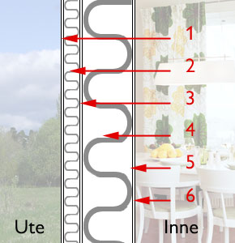 (Links: Querschnitt WDVS, Bildquelle: ncc.se) Hamse auch geglaubt, daß sich die Dämmbauweise in Schweden doch so dolle bewährt hat? Dann gucken Sie gleich mal folgende Links zum größten schwedischen Klimaschutz- und Bauskandal aller Zeiten an - die WDVS-Pfusch-Bauweise mit Schimmel und Rott nur kurz nach dem Einzug (und wenn Sie mehr dazu wissen wollen, kommen Sie gerne zurück): 

Die "Enstegsmetoden" - auf Deutsch: Wärmedämmverbundsystem WDVS - Schwedische Links: 
[kvp.se: Sein neues Haus wurde durch Schimmelpilzbefall geschädigt](http://www.kvp.se/nyheter/1.1285878/hans-nya-hus-var-skadat-av-mogel) - Bauschäden an 201 Neubauten in Lund (Annehem / Annenheim) und Bjärred (Melbavägen / Melbaweg und Norra Villavägen / Nördlicher Villenweg) 
[sydsvenskan.se: Pfuschtechnik wird weiter verwendet - Polystyrol, Holzständer und Gipskarton - Feuchte- und Schimmelpilzgeschädigte Wände mit Wärmedämmverbundsystem](http://sydsvenskan.se/sverige/article330061/Utdomd-teknik-anvands-fortfarande.html) 
[byggindustrin.com: NCC's Villen in Lund sind durchfeuchtet](http://www.byggindustrin.com/teknik/nccs-villor-i-lund-fuktskadade__4913/) - Alle 175 Villen, die NCC in Annehem, Lund baute, haben Feuchteschäden. Die Putzfassaden sind nach der kritisierten WDVS-Methode konstruiert. 
[sydsvenskan.se: WDVS-Bauskandal in Annehem](http://sydsvenskan.se/system/topicRoot/Byggskandalen_p__Annehem/) 
[sydsvenskan.se: Feuchteproblem in schonischen Heimen](http://sydsvenskan.se/system/topicRoot/Fuktproblem_i_sk_nska_hem/) 
[byggnadsvardsnytt.wordpress.com: WDVS-Skandal](http://byggnadsvardsnytt.wordpress.com/tag/enstegstatning/) - Laute Debatte über Baupfusch und WDVS-Fassaden nach Aufklärung über Feuchteschäden / Immer mehr Geschädigte fragen wegen Schimmelproblemen in WDVS-Neubauten nach / NCC saniert 175 durchfeuchtete WDVS-Neubauten in Annehem, Lund / Botrygg tauscht Fassadensystem nach Feuchtealarm aus 
[ncc.se: An den WDVS-System der Neubau-Siedlung Annehem in Lund hat die Baufirma NCC seit dem Herbst 2007 die Feuchte gemessen und sämtlich WDVS-Fassaden untersucht.](http://www.ncc.se/sv/OM-NCC/Press-och-media/om-putsade-fasader/Annehem/) Das Resultat belegt, daß es Häuser mit umfangreichen Bauschäden und Mängeln gibt ... 
[byggvarlden.se: Skandal!](https://web.archive.org/web/20080325012722/http://www.byggvarlden.se/byggprojekt/article73253.ece) - 95 Prozent aller neu gebauten Mehrfamilienhäuser mit Wärmedämmverbundsystem-Fassaden können tickende Schimmelpilz-Zeitbomben sein 

[sydsvenskan.se: In Bjärred / Kommune Lomma wurden hunderte neu Wohnhäuser mit nicht hinterlüfteten WDVS-Fassaden gebaut](http://sydsvenskan.se/sverige/article330056/Fuktskadade-hus-aven-i-Bjarred.html) - Ein Teil davon hat schon Feuchteschäden. 
[sydsvenskan.se: Neue WDVS-Wohnhäuser mit Mängeln und eingebauten Schimmelfallen](http://sydsvenskan.se/sverige/article330062/JM-infor-forlangd-garanti.html) 
[Boverket (Staatl. Gebäudebehörde/Zentralamt für Wohnungswesen): 36 Prozent der schwedischen Wohnhäuser - darunter viele WDVS-Objekte - haben Feuchteschäden und Schimmelpilzbefall!](https://web.archive.org/web/20110606121653/http://www.boverket.se:80/Om-Boverket/Nyhetsarkiv/Manga-smahus-drabbade-av-fukt-och-mogel-/) 

Und glauben Sie, das gäbe es nur in Schweden? Ach wo, ganz Deutschland steht voll mit solchen Bauruinen und täglich werden es mehr. Es dauert nur etwas, bis die geprellten Niedrigenergiehausbesitzer/Passivhausbauherrn hinter die ganze Wahrheit kommen. Und dann ist es meist zu spät. Sehen Sie nur mal diesen exemplarischen Fall an - aus Frankfurt am Main - Praunheim: 

[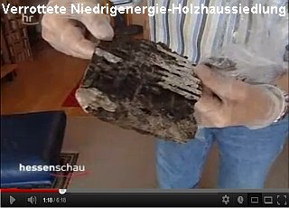](https://youtu.be/7yiL2kdoHj0) Ihr Interesse an einer unverblümten und brutal aufklärenden Darstellung der Wärmedämmerei und nach von der Dämmstoffbranche (Hersteller / Produzenten, Verarbeiter / Handwerker, Planer / Architekten / Ingenieure / Energieberater und deren bauphysikalischen Rechenutopien komplett unabhängigen Empfehlungen hat Sie endlich hierher geführt. Doch warum? 

[ 
© Götz-Wiedenroth-Karikatur: Klima-Kamikaze (durch Energiepass-Weltklasse): 
"Ich habe mich zur CO2-Einsparung für Maximaldämmung entschieden - Für die Schimmelpilze in dieser Wohnung hat sich das Klima schon total verbessert!"](http://gwiedenroth.googlepages.com/)

Wollen Sie nun dämmen? Oder doch nicht? Es kostet Sie Ihr Geld, und nicht meines. Soll es sich also lohnen, Ihr sauer Erspartes als algen-, flechten-, pilz-, spinnen-, maden- und bakterienfütternden Schaum, Gespinst oder Schüttung an Ihre Wand zu klebdübeln und zwischen Ihre Sparren zu preßstopfschütten? Weil Ihre vom Arbeitsamt ausgebildete Energieverräterin, ihr vom Dämmstoff- oder Solarplattenhersteller gebriefter Energiescherzperte, ihre parasitärverzeckte WEG-Hausverwaltung, ihr modernisierungsumlagengeiler Vermieter es so will? 

Mit diesen energieeffizienten Folgen? 

 
_Beschimmelte / Schimmelbefallene Kalziumsilikatplatte als Innendämmung ([Bild: Flickr-Album von Edi Bromm](http://www.flickr.com/photos/11672694@N08/sets/72157601498882984/)): 

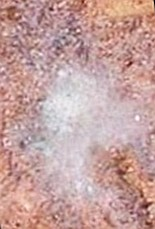 
Schimmelbefallener Leichtlehm - die ökologische und baubiologische Innendämmung / Innenisolierung (Schon gewußt? Lehm / Ton ist ein prima Dichtungsmittel wie Bitumen, allerdings mit gigantischer Wasserrückhaltung und eesig langer Austrocknungszeit) 

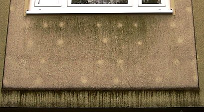 . 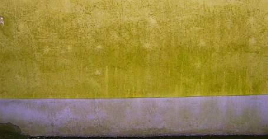 . 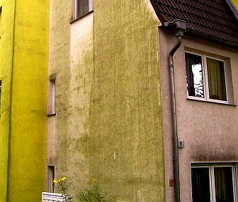 . 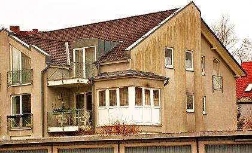 . 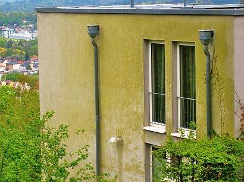 
Veralgte Wärmedämmverbundsysteme WDVS als Fassadendämmung / Außenisolierung 

 
Nasse Fassadendämmung - Schwarzschimmelpilzbefall im Wohnzimmer hinter der Couch / dem Sofa 

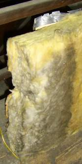 
Schwarzer Schimmelpilzbefall in der Dachdämmung aus Mineralwolle 

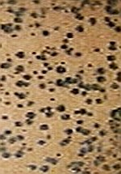 
Schwarzschimmelpilz auf Weichholzfaserplatte als Dachdämmung / Innenisolierung 

(Weitere Beispiele und Erläuterung in folgenden Kapiteln)_

Hier und auf den folgenden Seiten (nur für hartgesottene, nervenstarke Skeptiker, nicht für Weicheier und Heulsusen geeignet!) finden Sie ausnahmsweise mal die düstere Schattenseite des verordneten Energiesparwahns kritisch beleuchtet. Ich weissage Ihnen eine unheimliche Erfahrung, ein spannendes und aufwühlendes Erlebnis, das Sie aus dem Sattel Ihrer Vorurteile (haben Sie gar nicht, ich weiß doch!) werfen wird. 

 Hochhaus-Fassade / Altbau sanieren oder mit WDVS dämmen? Fassadendämmung / Fassadenisolierung / Vollwärmeschutz / Wärmedämmverbundsystem (WDVS) - Macht das Sinn? 
[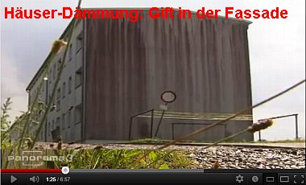](https://youtu.be/hnOOL0q_GeA) 
[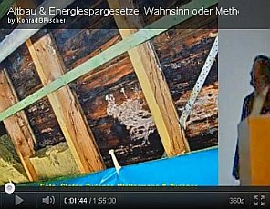](https://youtu.be/xBp0lAxF-nU) [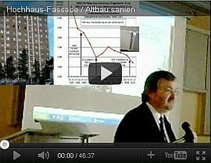](https://youtu.be/edZ5O0hg7J4) 
  
[Teil 2](http://www.youtube.com/watch?v=Y1NSxAW15Cc) [Teil 3](http://www.youtube.com/watch?v=RAT7VzBo8k0) [Teil 4](http://www.youtube.com/watch?v=6TBII25iVQk) [Teil 5](http://www.youtube.com/watch?v=Kb0C4KiZvVA) 

 Hier lernen Sie, wie Sie richtig Energie und vor allem Geld sparen können. Wirklich Energiesparen durch totales Einsparen der so verdächtig heftig beworbenen Energiesparmaßnahmen - Sparen durch Sparen anstelle Vergeuden durch Verschleudern! Doch machen Sie bitteschön, was Sie für richtig halten. Hinaus mit Ihren sauer zusammengekratzten Kröten, den Dämmstoffheinis in den hungrigen Rachen, den aufgeblähten Plunder dafür an Ihre Wand gebeppt, zwischen Ihre Sparren gezwickt (Zwischensparrendämmung), unter Ihren Boden verbuddelt! Sie lieben ja Grimms Märchen und Merkels/Trittins/Gabriels/Rüttgers' sagenhaftes Geraune und wollten es ja so! Man will nämlich sparen um jeden Preis, da fühlt man sich um soooooooo viel besser. Als Weltretter gar! Erlöser!! Allmächtiger!!! Oddä? 

 [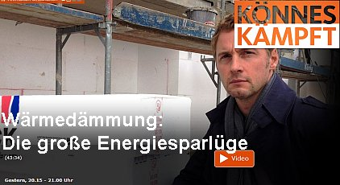](https://www.youtube.com/playlist?list=PLsv5nPUU0m4X6YwoxeXZ9u1yDzUZtW8Yn) [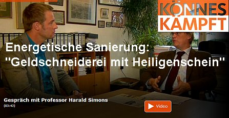](https://youtu.be/Sn0xG41Y8qY) 
[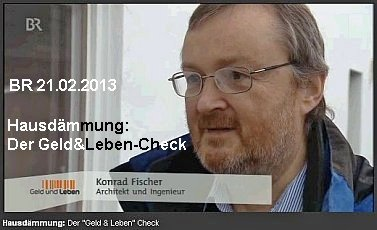](https://youtu.be/icacipcPR1s) [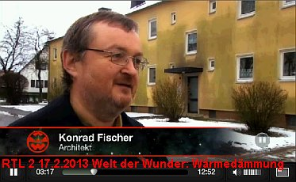](http://www.rtl2.de/welt_der_wunder/video/2634-besser-leben/17796-waermedaemmung/) 
[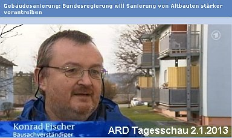](https://youtu.be/lQsEwktQlxI) [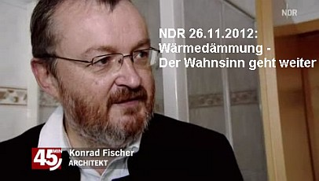](https://youtu.be/AWD0HeZLufM) 
  

3 sat hitec 23.1.12: Die verpackte Republik - für Fortbildungszwecke kritisch kommentiert von Konrad Fischer: 
[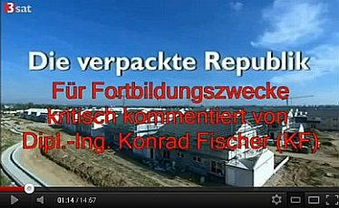](http://www.youtube.com/playlist?list=PLsv5nPUU0m4WhiWCFT6OQoP1CxMoirnhX) 
[23.11.11: ARD "Plusminus - Dämmwahn"](https://youtu.be/6Q53pe4CecU) - mit Prof. Jens Fehrenberg, ö.b.u.v. Sachverständiger für Gebäudeschäden und kritischer Kommentierung der Youtube-Version 
[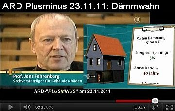](https://youtu.be/Sx5p5n9q5uQ) 
NDR-Trailer "Gefährliches WDVS" & "Wärmebild-Schwindel"- mit Konrad Fischer: 
[NDR "Dämmen oder nicht Dämmen?"](http://web.archive.org/web/20140210100111/http://www.ndr.de/fernsehen/sendungen/45_min/hintergrund/waermedaemmung121.html) - Kritische Worte vom Feinsten 
[NDR-Ratgeber "Wärme Fehlanzeige: Schäden an isolierten Wänden"](https://web.archive.org/web/20140210101142/http://www.ndr.de/ratgeber/verbraucher/haushalt_wohnen/waermedaemmung163_p-15.html) - Dämmaufklärung total 
[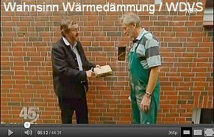](https://youtu.be/MKeRe7FA4Gs). [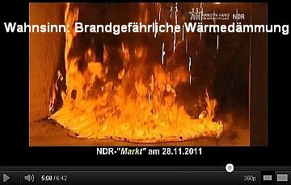](https://youtu.be/rXzRlyyM7bY) 
Die Tricks der Energieberater mit der Wärmebildkamera: 
[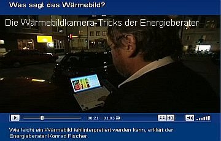](http://www.dailymotion.com/video/k5VbuUYVB10Lfkf8HsU) 
_Ergänzend:_ Spiegel online - Enthüllungsjournalist Güven Purtul entlarvt EnEV-Anschlag auf Hab&Gut, Leib&Leben: 
["Styropor-Platten in Fassaden: Wärmedämmung kann Hausbrände verschlimmern"](http://www.spiegel.de/wissenschaft/technik/0,1518,800017,00.html) 
[Rechtliche Info zum brandgefährlichen Risikopfusch der Wärmedämmung: Rechtsanwalt Wolfgang Hägele](http://www.haera.de/) 

 Alle schwatzen ja tagaus und tagein von Wärmedämmung - die Politik und Medien, das Handwerk und die Industrie, und geradezu selbstverständlich auch alle Planer. Sie alle verdienen damit Geld und die Dämmer, voll behämmert, verdämmert und bedämmert, sollen angeblich welches sparen. 

Link: [k/U-Wert-Narretei](2139bau.md#u-narretei)

 Nur die Verdämmten sind verblüffend leise. Sie haben als Bauherren gezahlt, sie müssen als Mieter zahlen. Doch was haben sie durch die Dämmung eigentlich gespart? Können die versprochenen Ersparnisse - wunderbarerweise sollen die irrsinnig leichten und kaum speicherfähigen Wärmedämmungen mit Wärmeleitgruppe WLG 020, WLG 022, WLG 025, WLG 030, WLG 032, WLG 035 oder WLG 040 (EPS 032 WDV, EPS 035 WDV, EPS 040 WDV) bis zu 80 Prozent der Heizenergie einsparen, vielleicht sogar noch mehr - den Dämmaufwand finanzieren? Die versprochene Amortisation der Mehraufwendungen für die "Energieeffizienz" soll sich in zig Jahren einstellen - nur ein raffinierter Trick? 

Das Deutsche Ingenieurblatt, Kammerorgan der Ingenieure, Heft 11 2008 läßt uns zum Energiesparbeschiß endlich mal folgendes lesen: _"Wahrscheinlich ist ... eine geringere Energieeinsparung als im (nach DIN/EnEV) unterstellten Gebäudemodell berechnet, da die Studie ("Wirtschaftlichkeit energiesparender Maßnahmen für die selbst genutzte Wohnimmobilie und den vermieteten Bestand in Bezug auf die Anforderungen der Energieeinsparverordnung (EnEV) ab 2009" des Institutes Wohnen und Umwelt IWU Darmstadt für die Bundesvereinigung der Spitzenverbände der Immobilienwirtschaft BSI) als Ausgangspunkt der Wirtschaftlichkeitsberechnungen beim theoretischen Energiebedarf festgelegter Mustergebäude ansetzt. Eine aktuelle Auswertung von Energieausweisen der Arbeitsgemeinschaft für zeitgemäßes Bauen zeigt, dass der tatsächliche Energiebedarf in der Praxis erheblich niedriger ist, als der theoretische Energiebedarf. Eine Sanierung, die sich bei einem hohen Energiebedarf für den Eigentümer "theoretisch" rechnet, kann praktisch trotzdem unwirtschaftlich sein. ... Es ist erkennbar, dass sich für jeden Eigentümer die Notwendigkeit einer belastbaren Ermittlung des tatsächlichen Einsparpotenzials ergibt, die auch den gegenwärtigen tatsächlichen Energieverbrauch in Bezug nimmt. Energieberatung, Planung und Qualitätskontrolle sind in den Investitionskosten der Studie nicht veranschlagt."_ 

Das Ingenieurblatt drückt es vorsichtshalber äußerst vornehm aus, was sich Kritiker des einschlägig bekannten Darmstädter Instituts schon lange fragen: Vielleicht es geht dort nämlich doch nicht ganz mit rechten Dingen zu und in manchen Studien wird u.U. solange gelinkt, bis was Gutes für die Dämmpropaganda herauskommt? Wirtschaftlichkeitsberechnungen ohne Ansatz der wahren Einsparpotenziale, ohne Ansatz der Vollkosten und vielleicht noch ein paar andere Schlawinereien - darf man die heutzutage seriös nennen? Peinlich für die so hochmögenden Auftraggeber, die sowas kommentarlos schlucken und aus den Beiträgen ihrer einfaltspinselingen Mitglieder bezahlen! Oder war es wieder mal nur Spezlwirtschaft auf höchstem BRD-Niveau, wer weiß das schon in diesen unseren Zeiten? Wenn sich dann gar nix einstellt nach der Verdämmung des Hauses, sind die bekannten Ausreden wohlfeil: 

Falsches Nutzerverhalten, Mängel in der Bauausführung, die Anlagentechnik hätte nachjustiert werden müssen usw. usf.. Die Verantwortlichen für die mißlungene Maßnahme sind dann fein raus bzw. gar nicht mehr greifbar. So funktioniert er eben, der Dämmschwindel. Und bestimmt auch bei Ihnen. 

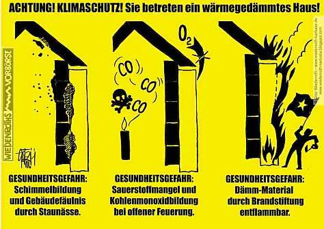 
_Dieses Warnschild "Wärmedämmung-Klimaschutz" ist die Antwort des berühmten[Karikaturisten Götz Wiedenroth](http://www.wiedenroth-karikatur.de/) auf das erbärmliche und riskante Standing der unsäglichen Hauszerstörung nach Dämm- und Dicht-Vorschriften_

Viele Dämmbauherren bibbern nun Winter um Winter in ihren mit nassem Dämmpulli erkälteten Leichtbüdli vor sich hin und lassen sich zum gerechten Ausgleich sommers die Schweißperlen auf der runzeligen Stirn wachsen. Ach, und sie schämen sich als "Klimaschweine" (O-Ton Bütikofer) über ihr unverschämtes Bedürfnis nach Frischluft und molligen Stübchen im Winter und kühlen Räumen im Sommer. 

 
_Das Fraunhofer-Institut für Bauphysik enthüllt: Alle nicht speicherfähigen Dämmfassaden saufen aus bauphysikalisch unabwendbaren Gründen ab und leiden deswegen unter Nässe, Frost und Algen. Energieersparnis? Nullinger - wg. nasser Dämmschicht - im krassen Gegensatz zu klassischen, jahraus und - ein trockeneren speicherfähigen Massivfassaden. Energiesparen durch Wärmedämmung - Ein Riesending der Dämmfans, den Ihnen viele sogenannte Energieberater - in Wirklichkeit Erfüllungsgehilfen der Dämmproduzenten - aufschwätzen und Sie so zum Gesetzesbrecher machen, soweit die Wärmedämmung gegen das Wirtschaftlichkeitsgebot des § 5 Energieeinsparungsgesetz EnEG verstößt. 

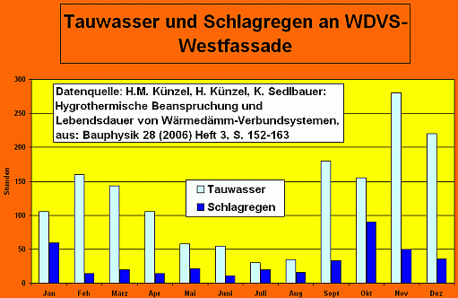 
Auch diese Grafik beruht auf Messungen des Fraunhofer-Instituts für Bauphysik. Andere Baupublizisten und Werbetreibende/Produzenten der Anstrichindustrie zeigen dieses Ergebnis der Fraunhofer-Forschung leider nur unvollständig - ohne Hinweis, daß die hier gezeigten Belastungszeiträume nur für nicht wärmespeicherfähige WDVS gelten, die ja deswegen nächtlich brutalst unter die Taupunkttemperatur auskühlen!, und ohne den Hinweis, daß die Gesamtfeuchte aus Schlagregen gegenüber dem Kondensat dennoch ca. 10 mal mehr ist und erwecken damit den Anschein, daß es hauptsächlich Kondensat wäre, was alle Fassaden hauptsächlich durchfeuchtet. Aber nein - nur angeblich wärmedämmende Fassadenoberflächen sind durstige Tauwassersauger und deswegen besonders zum Zwangs-Absaufen verurteilt! Freilich bauschädigend, da trocknungsblockierend verschärft - wie auf allen Fassaden! - durch ekle Plastepampen auf den WDVS-Oberflächen und sonstige wasserabweisende Porenstopfbeschichtkleber der unseligen Bauchemie, egal ob als Lotusfarben, Mineralfarben oder Silikonfarben auf den Markt geschmissen._

Unverfrorene Geizsparisolierer, wollen, nein müssen den ökologischen Dämmerfolg im eigenen Sparstrumpf erleben. Um nicht verzweifelt durchzudrehen und am Stammtisch endlich mal mit ihrer eigenen Klimaschutzschlauheit prunkprotzen können. Ja, wer hat denn alles so übermenschlich klug entschieden? Die Folien an der richtigen Stelle, die Wunderdämmstoffschichten superfett, die Wärmeschutzgläser extra, und freilich - auch den Lüftungs-, Klima- und Heizungsapparatismus mit Hyper-Fuzzi-Kybernetik-Steuerung, dazu Solar aufs Dach, Erdsonden oder Kilometerschlangen im Erdboden, Luft-Luft-Wasser-Wein-und-Schnaps-Wärmepumpen Marke "Hochzeit von Kana" sonstwo? 

Und nun, nachdem das Bankkonto für alle Wunder der Energiespartechnik restlos geplündert wurde, inkl. Mitgift und Rücklagen der braven Ehefrau? Jetzt schimpfen die dämmverliebten Energiesparexperten ihre verfrorene Weibsbilder, wenn diese im privaten high-tec-regulierten (über die Technikausfälle wollen wir hier nicht spotten) Dämmgebirge die Heizung, die es ja so gut wie nicht mehr brauchen sollte, nach dem dritten Grippeanfall dennoch frech aufdrehen. 

Und kaufen dann trotzdem nach dem ersten schwülen Sommer das eisluftspendende Klimagerät, um im zwischensparrengedämmten Dachzimmerli endlich mal gut schlafen zu können. Hin und wieder waren sogar die Klimageräte ausverkauft und hatten Lieferzeiten, die die Erinnerung an sozialistische Versorgungsengpässe hellwach hielten. Auch die Ärzte können ein frohes Liedlein von gedämmten Klienten singen. Ja, das Dämmen nutzt eben der ganzen Wirtschaft. Auch Ihnen? 

Lassen Sie uns deshalb noch frecher fragen: 

Wie soll die kostenlose Solarstrahlung - ein Energiegewinn vor allem in den Übergangsperioden der Heizsaison im Frühjahr und Herbst - kondensatgleich durch schüttere Gespinste, blasige Schäume und flockige Schüttungen gespeichert werden? Kann die Solarstrahlung dennoch sinnvoll dem Wärmehaushalt des Bauwerks zugeführt werden? Was ist wichtiger - dämmen oder speichern? 

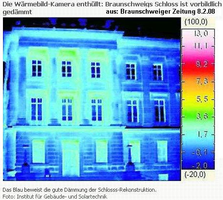 
_Energiesparen in Braunschweig - mit geheizten Schloßsäulen? Oder scheint dort auch mal die Sonne und wird nur in massiven Bauteilen die lange Winternacht durch gespeichert, während die vereisten Dämmflächen vom Tauwasser winters zerfrostet und sommers veralgt werden? (Weitere Details zum[Infrarot-/Wärmebild-/Thermografiebetrug)](7wdvs06.md)_

Das sind nur ein paar der Themen dieser Webseite, die genau für Sie als kritischer Geist gemacht wurde. Hier finden Sie sonst unausgesprochene Wahrheiten, ja ängstlich gehütete Geheimnisse rund ums Dämmen, um den Dingen endlich mal auf den Grund zugehen, um viele der Fragen, die genau Sie seit langem quälen, mal von der anderen Seite her zu betrachten. 

Geheimnisse, die verblüffenderweise eigentlich keine sind, da sie an vielen verdämmten Buden offenbar werden. Wer Augen hat zu sehen, der sehe! 

Steigen Sie ein in die hier angebotene Radikalaufklärung zum Thema Wärmedämmen, lernen Sie Spreu und Weizen, Wahn und Wirklichkeit, Werbung und Wahrheit, Politbeschiß und Ehrlichkeit, Erfolg und Pleite voneinander zu trennen. Es geht um Ihr Heim, Ihre Gesundheit, Ihr Geld und um die Ihnen anvertrauten Menschen in Ihrem Umkreis. Und wenn schon unbedingt ein hauserhitzendes Glasmonster vor die Fassade am Niedrigenergiehaus oder gar Passivhaus muß, Vorsicht! 

Aus dem Polizeibericht der Polizeidirektion Oberlausitz-Niederschlesien: 

_"Ort: Ottendorf-Okrilla, Zeit: 04.09.2007: 

Offensichtlich die wärme- und lichtverstärkende Wirkung (ähnlich einer Lupe) der Glasscheibe eines Wintergartens war die Ursache für einen Entstehungsbrand. Dabei wurde die hölzerne Dachverkleidung eines Musterhaus im Ausstellungspark Ottendorf-Okrilla in Mitleidenschaft gezogen. Es ist bereits der zweite Brand an diesem Haus innerhalb der letzten Wochen. Ein Brandursachenermittler der Kriminalpolizei ermittelte zur Ursache."_ 

Sie suchen die richtige Wärmedämmung mit echt nachweisbarer Energiespar-Wirkung für Ihr Haus? Sie wollen Ihren Energieverbrauch - Heizwärmeverbrauch, Heizölverbrauch, Heizgasverbrauch, Stromverbrauch - drastisch durch geeignete Maßnahmen reduzieren? Energiesparen geht Ihnen über alles? Sie planen eine nachhaltige, klimafreundliche, effiziente und energiesparende, gleichzeitig aber äußerst wirtschaftliche und kostengünstige Renovierung, Renovation, Bausanierung, Gebäudesanierung, Altbausanierung, Instandsetzung, Instandhaltung, Baumodernisierung oder gar einen Umbau oder Neubau? Wollen Einsparung von Heizenergie für die Raumheizung durch bessere Gebäudeisolierung? Aber keine falsche, minderwertige, nutzlose, ineffiziente Dämmung, sondern richtige? Low-energy oder gar Minergie für Altbau und Neubau? 

Es muß also partout ein Passivhaus-Standard sein oder ein Niedrigenergiehaus werden? Wärmebrücken und Kältebrücken vermeinen Sie auseinander zu halten können, sind aber verwirrt ob der vielfältigsten Angebote, Markenhersteller und allesamt idealen, perfekten Markenprodukte, wie z.B.: 

organische, keramische, natürliche oder mineralische Wärmedämmung, gar vakuumgedämmte Vakuumdämmplatten als Wärmedämmverbundsysteme für die Hausisolierung der Gebäudehülle wie PUR, EPS und XPS, Multipor, Styropor, Neopor und NeoWall (mit eingelagerten Grafitplättchen / Graphit-Plättchen), Micronal PCM (Phase-change material), Styrofoam, geschäumte Elastomere auf Basis / Grundlage von Neopren-Kautschuk, EPDM o.ä., Elastopor-Spray und Styrodur, PurOne (von URSA), Rockwool und Isover Telwolle), Foamglas oder Dämmputz, Dämmanstrich oder Dämmplatten, Wärmedämmschüttung / Dämm-Schüttungen, Gutex oder Pavatex, Weichholzfaserplatten, Calciumsilikatplatten / Kalziumsilikatplatten, Mondholz und Gipskarton, alukaschierte oder eingeschweißte Luftpolster, Wärmeschutz mit IR-reflektierenden Folien / Reflexfolien oder Beschichtungen wie Actis-Dämmung mit Polyesterwatte und Luftpolsterfolien, Aluthermo oder andere IR-reflektierende oder -absorbierende Dämmungen, ganz egal ob aus Frankreich, England, Amerika (USA), Kanada, Polen, Österreich, Ungarn, Asien, dem Balkan oder Rußland, Türkei, Tschechei / Tschechien, Skandinavien, Schweden, Dänemark, Finnland oder Norwegen und Island, vielleicht auch Bayern, Hessen, Baden-württemberg, Saarland, Bremen, Hamburg, Sachsen, Niedersachsen, Anhalt, Thüringen, und Nordrhein-Westfalen oder Rheinland-Pfalz und Mecklenburg-Vorpommern oder gar Brandenburg und Berlin. Kennen Sie thermokeramische Wärmedämm-Anstriche / Energiesparfarben / -Beschichtungen mit ceramic bubbles / Vakuum-Keramik-Kugeln (Microsilica) wie z.B. Thermoshield, TC-texx, NewPro-Well, SUPER Therm, TKA-/Thermokeramischer Anstrich, Energy coating, Energy Guard und wie sie alle heißen? Oder auch XPS-Putzträgerplatten, Thermolut, Kooltherm, Isofloc und Thermofloc, Isocell, Austrotherm, Czechotherm, Balkanotherm, Linitherm, Lobatherm und Homatherm, TopDämm, Dalmatiner-Fassadendämmplatte, Thermofoam oder Minopor, Thermopor, Multipor, Maxipor, Korff-Superwand DS, Wärmedämmlehm, vielleicht auch baubiologischen Leichtlehm, Strohlehm, Leichtstrohlehm, Strohleichtlehm oder Thermolehm und Thermohanf, Hanfmatten (aus Hanfwolle, Hanfdämmwolle), Flachs, Kapock, Ziegel bzw. Ziegelsteine oder Ziegelmauer: Vollziegel, Hochlochziegel, Backsteine, Porenziegel, Poroton, Thermoton, Bisotherm, Porotherm, Liapor, Blähton, Blähziegel, Blähschiefer, Blähglas, Schaumglas, Foamglas / Foamglass, Mauerwerk aus Gasbeton, Ytong-Stein, Porenbeton, Leichtbeton, Kalksandstein + WDVS, VIP-WDVS, Seegras, Wiesengras, Schilfstengel / Schilfstängel / Schilfrohr / Reet, Schilfmatte, Schilfrohrmatte, Rohrmatte, allerlei Matten, Platten und Vliesstoffe / Vliesdämmung / Vliesmatten oder Ceralith aus Getreide (Roggen, Kalk, Wasserglas), Schafwolle, Kuhdung, Kameldung, Adobe, Moos, Porenschwammm, Bärenfell, Ritterrüstung, Eulengewöll, Daunenfeder, Baumwolle, Recyclat, Watte, Leinen, Sisal, Kork (Korkplatten, Spritzkork), Mäusdreck, Hundekot, Ziegköttel, Hasenköttel, Mückenschiß usw.usf. 

mit grausig unterschiedlichen Werbeversprechen von ökologisch über baubiologisch zu industrieller und supertechnischer Dämmstoffwirkung und Zusammensetzung, Zahlenkolonnen, geheimnisvollen griechischen Buchstaben vom Alpha bis Omega über lambda λ und my µ, mit Nullo Problemo, dafür aber teils irre Preisen und Kosten bei teils mäßgster energetischer Effizienz?
Das erinnert Sie an die Zutaten mittelalterlicher Zaubertränke / Liebstränke aus Hexenrezepturen und die Goldmacherkunst, dem grotesken Start der Alchymie / Baualchymie / Bauchemie? 

Herrgottssack und Sackerlzement, wo kommt es nur drauf an? Wer trennt die Spreu vom Weizen? 

Sie können die extremen Unterschiede zwischen all den Dämmstoffen, Dämmsystemen und Systemkomponenten wie Hilfsstoffe und Verbindungsmittel (Dämmdübel, Dämmschäume, Dämmkleber, ...) - für die Bauwerksisolierung nicht beurteilen, wobei die verschieden Anbieter genau ihr eigenes System freilich in den allerhöchsten Tönen preisen und allerlei Nachteile listig verschweigen? Trauen Sie der raffinierten Produktwerbung und dem allzuguten Zureden von so arg treuherzig dreinblickenden Handwerksmeistern, Energieberatern und Planern nicht so ganz? 

Sie bezweifeln, daß Produkt- und Dämmstoffwerbung 110%ig wahr ist? Ob die ungeheuerlichen Versprechungen - bis zu 80 % Ersparnisse als direkte Folge einer Dämmoffensive von der Bodenisolierung über die Wandisolierung, Innenisolierung und Fassadenisolierung bis zur Dachisolierung (auch Bodenisolation, Wandisolation, Innenisolation, Fassadenisolation, Dachisolation mit Zwischensparren-Dämmung, Dampfbremse, alukaschierte Wärmedämmung oder auch Aufsparren-Dämmsystem)- wirklich wahr sind? Hier bekommen Sie Bescheid gestoßen, bis es schmerzt! 

Wundern sich über die haßerfüllten Ansagen, wenn die Rede auf die jeweilige Konkurrenz kommt und Sie vorlaut nach den Unterschieden zum eigenen Produktangebot fragen? Und das selbstverständlich auch auf der jeweils anderen Seite (übrigens mein Tipp, wenn Sie meinen Darlegungen zum Thema nicht glauben wollen oder etwas nicht verstehen, so habe ich immer am meisten gelernt, Sie können das doch auch und gratis / kostenlos / Schnäppchen / umsonst ist es obendrein!)? Kann das alles wirklich wahr sein? 

Sie brauchen vielleicht etwas Aufklärung, einen Blick hinter die Kulissen? Im Web-Bauforen sind sie schon oft genug von der heimtückischen Werbung der verkappten Verkäufer und von deren so dermaßen überzeugend kompetenzheuchelnden Laienprediger reingelegt worden oder trauen der Angelegenheit irgendwie nicht? 

[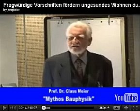](https://youtu.be/VZFhgOBPrBI) 

Die passende Lektüre für eine umfassende und kontroverse Aufklärung rund um den offiziellen Bauphysik-Beschiß ist übrigens auch: 

Prof. Dr.-Ing. habil. Claus Meier: **"Richtig bauen. Bauphysik im Widerstreit + Mythos Bauphysik + Phänomen Strahlungsheizung + Verwildertes Bauen - Kriminelle Netzwerke zerstören Bauten - und Glaubwürdigkeit"** ==> 

Sie - oder Ihr(e) Lebenspartner(in) - haben sich Ihr gutes Gespür, Ihr untrügliches Bauchgefühl, Ihre feine Riechnase noch bewahrt und wittern die Satansbraten? 

Sie erschrecken nicht zu Tode über Schwindel, Manipulation, Lügen, Dämmversprechen und Dämmverbrechen im Umfeld der Produktwerbung und beim ["Klimawandel-Klimaschutz"](7argus.md)? Kennen vielleicht schon die bisher brutalste Entlarvung des Klima-Alarmismus, der Weltuntergangs-Heuchler und Ökoprofiteure durch den Klimaschutz-Insider Hartmut Bachmann: **"Die Lüge der Klimakatastrophe. Das gigantischste Betrugswerk der Neuzeit. Manipulierte Angst als Mittel zur Macht."?** 

Dann sind Sie hier richtig: Kontroverse Erfahrungen aus der Praxis, Schadensfälle und -analysen sowie spektakuläre Forschungsergebnisse rund um die Themen Isolation, Isolierung und Wärmedämmung, Wärmedämmverbundsystem WDVS, Dämmtapete, Isolier-Tapete, Kellerdeckendämmung, Kellerdecken-Dämmplatte, Perimeterdämmung vielleicht sogar mit Drainagewirkung im Grundwasserbereich / wasserbeaufschlagten Bodenbereich, im Erdreich an erdberührten Bauteilen und vor den Kellermauern auch als Abdichtung gegen Feuchtigkeit / Feuchte /drückende und stauende Nässe / Bodenfeuchte: vor dem Fundament unter der Bodenplatte und auf dem Flachdach, Dämmschaum, Spritzschaumsystem, Wärmeschutz und Vollwärmeschutz, Vollwärmedämmung, Innendämmung, Dämmstoff, Dachdämmung, Dachbodendämmung, Wanddämmung, Fassadendämmung und Dämmfassade, Dämmschicht, Einblasdämmung, Schüttdämmung, Kerndämmung, Mauerkerndämmung, nachträgliche Hohlschichtdämmung oder Hohlschichtverfüllung, Dämmung der Hohlschicht, Schalendämmung, Mauerschalendämmung, Wandschalendämmung, Heizkosten, Energiesparen, EnergieEinsparVerordnung (EnEV) - in einzelne Kapitel und Webseiten aufgeteilt. Lesen Sie also weiter zur Aufklärung über den Dämmschwindel, den [Energiepaß-Schwindel](7wdvs02.md) und ob und welche Dämmstoffe wirklich taugen ... 

Interessant könnte für Sie auch sein, was Prof. Dr. Wolfgang Vetters, Institut für Geologie der Universität Salzburg, hier zum Besten gibt: 

_Charakteristisch für Zement ist der amorphe beziehungsweise mikrokristalline Zustand nach dem Ablöschen, wodurch Zement und Beton nur eine begrenzte Lebensdauer aufweisen, denn im Verlauf von einigen Jahrzehnten erfolgt die Aus- oder Rekristallisation des Zements. 

Mit dieser Rekristallisation verliert der Beton seine Festigkeit, denn diese ist abhängig von verschiedenen mechanischen, chemischen und thermischen Einflüssen und schwankt zwischen 40 und 80 Jahren. Der Einbau eines Stahlgerüsts in Betonbauten erhöht die mechanische Belastbarkeit, ändert jedoch nur wenig an der Lebensdauer, die nur durch Erneuerung verlängert werden kann. Zement und Beton verhalten sich als nicht kristalliner Baustoff ähnlich wie Glas. 

Auch Glas ist nicht kristallisiert. Feinst gesponnenes Glas hat nur eine Lebensdauer von ein bis zwei Jahrzehnten und ist daher als dauerhafter Baustoff - auch zur Wärmeisolation - nur bedingt geeignet. Thermische Belastungen bei Fassaden mit unter dem Putz verlegter Glaswolle oder Kunststoffen (Styropor usw.) beschleunigen die Rekristallisation ebenso wie Mikrovibrationen durch den Verkehr auf Schiene und Strasse._ (aus: StonePlus 3/2008: "Naturstein - sichtbare Ökologie", S. 39) 

So verhält es sich also mit den Lieblingsbaustoffen der Ökoterroristen zur angeblichen Weltrettung auf Dauer - Da wird nur kurzzeitig funktionsfähiges Industriegelumpe ans Bauwerk gebracht, und das alles als Green Building, Sustainability / Nachhaltiges Bauen mit Hilfe doofer, korrupter und verrotteter Politik durch perfiden Gesetzeszwang dem unmündigen und nahezu wehrlosen Verbraucher aufs Auge gedrückt. 

Einer Regierungskriminalität, die es auch schaffte, den kontrollierten Abbruch des Worldtradecenters mittels Sprengung den Völkern als islamischen Angriff zu verkaufen, und das friedliebende deutsche Volk in von oben diktierte Angriffskriege zu verwickeln, schafft es freilich auch, uns die widerlichsten Klimaschutzlügen aufs Auge zu drücken und uns zu zwingen, für die Vernichtung unserer Bausubstanz unsere eigenen Ersparnisse dreinzugeben. Weitere 911-Info hier (ORF-Film): 

[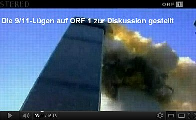](https://youtu.be/SvrMjU_VO2I) 

Und wie verhält sich eigentlich die tatsächliche Gesamtwirtschaftlichkeit eines regierungsamtlich geförderten und erzwungenen Fassadensystems, wenn man eine längere Zeitperiode betrachtet? Dirk Fanslau-Görlitz, Martin Pfeiffer, Janet Simon und Yasemin Wildebrand stellten sich diese drängende Frage auch und geben in ihrem "Atlas - Bauen im Bestand", Verlagsges. Müller, 2008, im Kapitel I.3: "Nachhaltige Modernisierung" auf Seite 59 eine Tabelle an, aus der die folgenden Kostendaten und Instandsetzungszyklen für verschiedene Fassadensysteme bei Betrachtung einer Periode von 80 Jahren aufgeführt werden. Dieses Buch kann als wahre Fundgrube bezeichnet werden, soweit man sich für Baukosten und Wirtschaftlichkeitsbetrachtungen gerade im Zusammenhang mit derzeit anstehenden Neubauten oder auch Sanierungen interessiert. 

Doch wenn der schlaumeiernde Leser denkt, daß man ja die Instandhaltungszyklen fast nach Belieben dehnen kann, nur das: Dann steigen halt die jeweils anfallenden Instandhaltungskosten entsprechend. Vielleicht sogar exponential, also um ein ständig steigendes Mehrfaches. 

Hier nun ein wohl mehr als aufschlußreicher Auszug aus der aufschlußreichen Tabelle, die auf einer entsprechenden Langzeit-Untersuchung des Instituts für Bauforschung e.V. IFB in Hannover (erklärte Ziele u.a.: Kostengünstiges Planen, Bauen und Betreiben) aus dem Jahre 2001 aufbaut: 

Tabelle I.45: 
**Instandsetzungsintervalle und Instandsetzungskosten ausgewählter Bauteile im Wohnungsbau** [Auszug] 
Bauteil, Art der Leistung Instand- 
setzungs- 
intervall Kosten Jahre Kosten nach 80 Jahren 
[inkl. Neben- 
kosten + Ust 
Inflation 2%] Kosten im 
Jahresdurch- 
schnitt 
Außenwände [Jahre] [EUR/m²] 5 10 15 20 25 30 35 40 45 50 55 60 65 70 75 80 [EUR/m²] [EUR/m²] 
Außenwand mit Verblendmauerwerk 284,73 3,56 
Verfugung ausbessern 20 7,67 . . . x . . . x . . . x . . . x 89,10 1,11 
Gerüstvorhaltung 20 7,67 . . . x . . . x . . . x . . . x 89,10 1,11 
Mauerwerk säubern 40 15,34 . . . . . . . x . . . . . . . x 106,53 1,33 
Außenwand mit Standardputz (mit Anstrich) 566,36 7,08 
Neuer Anstrich 15 25,56 . . x . . x . . x . . x . . x . 333,09 4,16 
Putzausbesserung 15 10,23 . . x . . x . . x . . x . . x . 133,32 1,67 
Gerüstvorhaltung 15 7,67 . . x . . x . . x . . x . . x . 99,95 1,25 
Außenwand aus Holzständerwerk mit Holzschalung 650,47 8,13 
Streichen 5 5,11 x x x x x x x x x x x x x x x x 205,92 2,57 
Gerüstvorhaltung 5 7,67 x x x x x x x x x x x x x x x x 309,63 3,87 
neue Holzschalung 50 51,13 . . . . . . . . . x . . . . . . 134,92 1,69 
Außenwand mit Wärmedämm-Verbundsystem 1.314,05 16,43 
Reinigung und Pflege 5 7,67 x x x x x x x x x x x x x x x x 309,63 3,87 
Gerüstvorhaltung 5 7,67 x x x x x x x x x x x x x x x x 309,63 3,87 
Putzausbesserung 10 7,67 . x . x . x . x . x . x . x . x 162,21 2,03 
Neues WDVS 40 76,69 . . . . . . . x . . . . . . . x 532,58 6,66 

Nun soll mir mal ein Planer, Energieberater, Sachverständiger, Handwerker oder gar Klimaschutzexperte erklären, wie sich das grottige WDVS-Ergebnis in der oberen Tabelle mit dem Umweltschutz, dem Klimaschutz, der Energieeinsparung und vor allem der Wirtschaftlichkeit verträgt, die jeder Planer und Berater seinem Auftraggeber unabdingbar schuldet und für die er auch haftungsrechtlich einzustehen hat - bis zum Honorarverlust für unwirtschaftliche Fehlplanung und Schadensersatz in nicht unerheblicher Höhe, soweit sich die Falschplanung schon am Bauwerk manifestiert hat? Ist es angesichts dieser wissenschaftlich erhobenen Daten nicht geradezu ein abscheulicher Betrug, unkundigen und vertrauensseligen Bauherren weiszumachen, daß WDVS zu großen Vorteilen führe? Und selbst der dickste KfW-Zuschuß - von den mickrigen Zinsvorteilen gar nicht zu reden - kann die hier wohl Jedem auf den ersten Blick sichtbare Unwirtschaftlichkeit der WDVS-Bauweise jemals heilen. Geschweige denn die selbst gemäß DIN und EnEV "regelrechte" Ermittlung der Heizkostenersparnis als Grundlage der Anfangsinvestition in ein Wärmedämmverbundsystem. Und aufgepaßt: Ein Bauherr kann wohl mit Fug und Recht erwarten, daß sein studierter Planer und auch sein zertifizierter Energieberater die einschlägige Fachliteratur zum Thema beherrscht und seinen Bauherrn deswegen auf Basis gesicherter Erkenntnis vollumfänglich auch wirtschaftlich korrekt berät! Wenn nicht? Das ist dann eine Frage für die Gerichte ... 

Am 24. Februar 2016 läßt sich auf der [Seite V 4 der Verlagsspezial _Wärmedämmung_](http://www.faz.net/asv/waermedaemmung/schritt-fuer-schritt-zur-waermedaemmung-14084183-p3.html) der Frankfurter Allgemeinen Zeitung FAZ nun ausgerechnet ein Mitarbeiter des für seine unerschütterliche Nähe zur Drittmittel bereitstellenden Dämmbranche einschlägig berüchtigten Fraunhofer-Instituts für Bauphysik IBP, ein gewisser Hartwig Künzel, tituliert als _"Abteilungsleiter Hygrothermik ... in Valley"_ (zu Deutsch in etwa: "Feuchtewärme"), wie folgt zitieren: 

_"Bei einer professionellen fachlichen Ausführung unterscheidet sich die Haltbarkeit von WDVS nicht von der herkömmlicher Putzfassaden. Das haben Langzeituntersuchungen des Fraunhofer-Instituts für Bauphysik und des Instituts für Bauforschung unabhängig voneinander ergeben. Vor diesem Hintergrund kann mit einer Lebenserwartung von 40 Jahren und mehr gerechnet werden. ... Verhindert werden muss auf jeden Fall, dass Niederschlags- oder Kondenswasser hinter den Dämmstoff gelangt, da dieser dann seine dämmende Wirkung verliert. ... Fassaden mit Wärmedämmung unterliegen wie auch solche ohne Wärmedämmung bestimmten Renovierungszyklen. Mineralische Außenputze oder Kunstharzputze müssen die dahinter liegende Dämmung trocken halten und benötigen alle zehn bis 20 Jahre zumindest einen passenden Renovieranstrich."_ 

Na gut, nur extrem eingeschränkt kann man die Tabellenwerte zur WDVS-Standzeit oben auch so interpretieren. Aber: Wo bleibt der zur vollständigen Information des neugierigen FAZ-Lesers unabdingbare Hinweis auf die Extremmehrkosten, die das Aufrechterhalten der Gebrauchstauglichkeit eines WDVS wenigstens im konstruktiven Sinne durch laufende Instandsetzung - alle fünf und eben nicht "zehn bis 20 Jahre" (!) nach der Tabelle - unabdingbar erfordert? Wo der, zumindest von einem ehrlichen und wirklichen Experten für Wärmedämmverbundsysteme erwartbare Hinweis, daß sachverständige Untersuchungen in genug vielen Schadensfällen und damit zusammenhängenden Beweissicherungsverfahren den Dauerinstandsetzungsbedarf der WDVS-Fasaden zumindest belegen, in genug Fällen aber auch die "mehr als 40 Jahre-Dauerhaftigkeit" dadurch widerlegen, daß der Sachverständige zum vollständigen Abbruch der verrotteten Dämmfassade rät? Warum kein Sterbenswörtchen dazu, daß jede Fassadenbeschichtung luft- und eben unerbittlicherweise auch luftfeuchtedurchlässig ist ("diffusionsoffen" in einem vom Beschichtungssystem, seiner Schichtdicke und Alterung mit Materialabtrag und Rißbildung abhängigen und kaum vorhersagbaren Umfang des "sd-Wertes" - die wasserdampfdiffusionsäquivalente Luftschichtdicke, im Klartext des Widerstands der Schicht gegenüber unabänderlich eindringendem Wasserdampf) und dadurch bei absolut jeder Taupunktunterschreitung des Fassadensystems, die sich im Laufe jeder - abhängig vom Luftfeuchtegehalt - genug kalten Nacht - und hierzu hat der doktorierte Ingenieur Hartwig M. Künzel selbst ein bisserl geforscht und publiziert - auf, im und notfalls auch hinter der Dämmschicht Tauwasser als Kondensfeuchte niederschlägt. Ich zitiere aus dem Beitrag zum 3. Dahlberg-Kolloquium "Mikroorganismen und Bauwerksinstandsetzung", Wismar Sept. 2001, Dr.-Ing. H.M. Künzel, Dr.-Ing. M. Krus und K. Sedlbauer, Fraunhofer-Institut für Bauphysik: 

_"Algen auf Außenwänden - Bauphysik als Ursache? Bauphysik als Lösung!: 
Zusammenfassung 
Auf Grund des Zwanges zum Energiesparen werden die Fassaden neuer oder sanierter Gebäude durch hohe Dämmschichten wärmetechnisch so stark vom Innenraum abgekoppelt, daß sich auf ihnen Tauwasser durch nächtliche Unterkühlung bilden kann. Die Folge sind zunehmende Beschwerden über großflächigen Algen- und Pilzbewuchs, insbesondere auf Wärmedämmverbundsystemen."_ 

Also hat der Doktor Künzel doch schon mal was von den Problemen der Wärmedämmung gehört. Es ist natürlich doktoriertester Blödsinn, die allnächtliche und tauwasserbewässerungsfördernde Unterkühlung der WDVSe dem Umstand zuzuschreiben, daß die Fassaden wegen ihrer "starken" Abkoppelung vom - unterstellt - geheizten bzw. 20grädigen Innenraum unterkühlen. Das leuchtet ohne weiteres eigentlich jedem Depp ein, daß es der Strahlungsausgleich des nicht wärmespeicherfähigen Dämmsystems mit dem nächtlich sommers wie winteres deutlich unter die Lufttemperatur frostigen und deswegen eisekalten Nachthimmels sein muß, was die Oberflächentemperatur der Fassade regiert, nicht der wahnwitzige Versuch irgendeiner Innentemperatur, durch die ganze Wand hindurch deren Außenoberflächen wohlige Wärme zu spendieren! Die simpelste Sommermessung der Oberflächen mit dem billigsten IR-Thermometer kann das jeder auch einfachen Hausfrau beibringen. 

Warum hier ausgerechnet in der FAZ eine dermaßen gekünzelte Aussage, deren Wahrhaftigkeit und Werthaltigkeit zumindest aus Bauherrnsicht doch sehr zu wünschen zu lassen scheint? Nur als Schbässle sei hier mal der § 263 Strafgesetzbuch StGB in einem sehr maßgeblichen Abschnitt zitiert: 

Strafbar macht sich 

_"Wer in der Absicht, sich oder einem Dritten einen rechtswidrigen Vermögensvorteil zu verschaffen, das Vermögen eines anderen dadurch beschädigt, dass er durch Vorspiegelung falscher oder durch Entstellung oder Unterdrückung wahrer Tatsachen einen Irrtum erregt oder unterhält."_ 

Genauer: 

Eine in der Rechtsliteratur so genannte "Täuschung über Tatsachen" - hier beispielsweise die unabänderliche und auf der Physik beruhende WDVS-Unterkühlung mittels Strahlungsausgleich mit dem Nachthimmel sowie der vom Institut für Bauforschung benannte Sanierzyklus von nur fünf Jahren bei einem WDVS im Unterschied zu allen anderen Fassadensystemen, ein durch die vorsätzliche Täuschungshandlung beim Geschädigten erregter Irrtum, beispielsweise seine durch die Täuschung erzeugte konkrete Vorstellung des Bauherrn über die Haltbarkeit, den tatsächlichen Schadensverlauf und den davon abhängigen Instandsetzungsbedarf von WDVSen, eine von der Täuschungshandlung und dem dadurch erregten Irrtum stimulierte Vermögensverfügung eines Bauherrn oder Bauherrnvertreters, eigenes oder fremdes Vermögen in ein schadensanfälliges WDVS zu investieren und ein dadurch entstandener Schaden am Bau oder in der Bauherrnkasse müssen vorliegen, um im strafrechtlichen Sinne von Betrug zu sprechen. Entscheidend ist dabei der Vorsatz. Und wem darf man hier vorsätzlichen Betrug durch Weglassen von negativen Fakten vorwerfen? Dem FAZ-Verlag, der doch bekanntermaßen auch schon mal genug kritische Artikel zum WDVS-Problem brachte und nun dank einer werbefinanzierten Verlagsbeilage möglicherweise alle Hemmungen bezüglich Verbrauchertäuschung fallen gelassen hat, wozu auch die im Umfeld des Gekünzels gebrachten und nicht als Anzeige, sondernfieserweise "redaktionell aufgemachten Informationen" seitens beispielsweise weiterer Lobbyisten und sonstige Nutznießer und Protagonisten des Dämmstoffverbaus wie ein langjähriger Geschäftsführer und Ehrenmitglied im Fachverband Wärmedämm-Verbundsysteme sowie Lohnschreiberlinge und weitere institutionelle Interessensvertreter hindeuten könnten? Und beim Herrn Dr. Künzel, ist das vielleicht kein Vorsatz, sondern Dummheit? Bei ihm als doktierter und ingenieuser Fraunhofer-Instituts-Experte? Jeder darf hier selber raten, was er will. Fakt ist: So, wie die FAZ die Aussage des Herrn Dr. Künzel gebracht hat, ist sie sehr unvollständig und damit nachweisbar falsch. Punktum. Die Leser werden sich jedenfalls ihren Reim darauf machen, soweit sie ausreichend kritisch und nicht durch FAZ-Verlagsbeilagen und sonstigen Werbeschmonz verblödet sind. 

Natürlich gibt es auch einen rein emotionalen Zugang zur Erklärung, warum Bauherren auf den Vollwärmeschutz mit Anlauf hereinfallen und das ganze Haus mit Styropor umwickeln (Vorsicht! Keine Satire!): 

[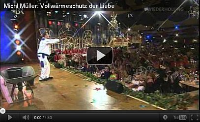](https://youtu.be/UxGiAqnb6ZI)

Ein berühmter Nebengipfel in unserem Meinungsterror- und Lügenländle: Wie die armen Bausimpel und Altbausanierer von den "Energiesparprofis" abgenudelt und medial besudelt werden, können Sie hier als Einstieg mal selber sehen. Schon echt lustig wenn nicht geradezu irrwitzig, wie die folgende Thermographie deren gewillkürte Aussagekraft einer "energetischen Sanierung / Ertüchtigung" zur Minderung des CO2-Kohlendioxid-Ausstoßes, als Klimaschutz-Maßnahme und auch überhaupt zur allgemeinen Weltrettung vor der globalen Erwärmung entlarvt:

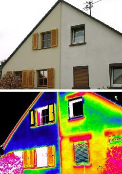 Bildunterschrift: _"Thermografie: Der Wärmeverlust bei der linken Haushälfte (mit Dämmung) beträgt nur einen Bruchteil des Verlusts auf der rechten Seite (gelbe und rote Flächen verraten den Wärmedurchgang)."_ aus: houseandmore.de, Seitenstand 26.10.06, abgedruckt u.a. in "Bauen & Wohnen", 26.10.06, Verlagsbeilage der Neuen Presse Coburg, mein Käsblättla (Bildquelle: Sto AG, vgl. www.pr-nord.de/stoo_text155.html). Alles unter dem Titel: _"Fassadendämmung spart Energie"_ und der beigefügten Erläuterung: _"Die Außenwände von Millionen von Häusern ... sind im Grunde ein großes Leck, durch das in jeder Heizperiode Wärme für viele hundert Euro verloren geht."_ Ja da leckst Dich nieda und stöist nimmä aufi, oder? Was dennoch aufstößt:

Klar, daß es am Rollokasten etwas erhöhten Wärmedurchgang gibt. Aber wieso strahlen ausgerechnet die Fensterklappläden vor (!) der blauen Superdämmfassade und geradezu perfekten Hausisolation so dermaßen gelbwarm? Und heizen offenbar samaritermäßig die blau erfrorene Dummpackung sogar noch etwas grünlich auf? Wo kommt denn diese mehr als unerwartete Energie wohl her? Fließt die irre Wärme unter Umgehung der Gebäudeisolation / Gebäudedämmung, der softwaregestützten Wärmebedarfsberechnung und den so sattelfesten Festlegungen im Energiepaß/Energieausweis aus den mickrigen Beschlägen am Ladenanschlag und heizt ungebührlicherweise den ganzen Laden auf? Verliert das WDVS des Gebäudevollwärmeschutzes ausgerechnet hinter Fensterläden jede Dämmwirkung und es fließt ungeschützt Wärme aus dem warmen Zimmer zielgenau bis zum Laden? Hat die Ladenwärme trotz Energieberatung des weisen Energieberaters trotz aller BAFA-Zertifizierung gerade mal nicht aufgepaßt und wurde vom raffinierten Thermographen in ausgerechnet dieser äußerst hochnotpeinlichen Situation erwischt?

Ach Leute - logischerweise wird auch hier die tagsüber in Massivbaustoffe eingespeicherte Solarenergie des Nachts thermographiert. Und da das Wärmedämmverbundsystem partout nix speichern will und kann und deswegen nicht dämmt, steht es nicht nur cool, sondern eiskalt herum und fängt lieber saumäßig Kondensat ein. Das friert dann winters die nur angebliche Fassadendämmung - der fiese Witz im Gebäudewärmeschutz - auf und sommers sorgt es für baldige Veralgung auf der sollgemäß bald abgesoffenen Dämmhaut - sobald die algizide Vergiftung der Fassadenfarbe ausgewaschen ist. Daran ist übrigens der beschissene Bauherr ganz alleine schuld, so die deutsche Rechtssprechung (siehe weitere Ausführungen in den folgenden Kapiteln). So sorgt das schlaue Malerhandwerk mit seinen den Produzenten hörigen Sachverständigen für stetige Nachfrage. 

Wieviele leichtgläubige Bauherren werden aber auf diesen ultimativen Gipfel der Energiesparweisheit - ohne jeglichen nachweisbaren Energieeinspar-Effekt - auch so ein Bild sagt mehr als tausend Worte - weiter hereinfallen? Altbausanierung, Althausmodernisierung, Baurenovierung, Instandsetzung und Baureparatur scheinen womöglich solche Mittel freizusetzen, daß die Bauschlawiner vor keinem Schwindel mehr zurückschrecken, um geizgeile Energiesparer mit geradezu allerdümmstem Irrsinn einzufangen wie den Fink auf der Leimrute und die Maus mit dem Speck. Eine nüchterne Wirtschaftlichkeitsberechnung / Kosten-Nutzen-Analyse der "Dämmung" und des Ertrages hinsichtlich der Rentabilität will da freilich niemand mehr anmahnen, geschweige denn eine gewissenhafte Überprüfung der physikalischen Zusammenhänge. 

Dieses Trickbild wurde sogar (nicht nur!) bei Haus&Grund RLP im Mitgliederheft wohlwollend gezeigt! Ja mei, ob jeder fröhliche Rheinländer und der pelzige Pälzer das als gelungenen Beitrag zum kommenden Karneval begreift? Bis ins letzte ausgefrorene Hinterstübchen der hochmögenden Mitgliederschaft solcher Interessensverbände? Mehr zu Problemen der [Thermographie](7wdvs06.md). Ach so - hier können Sie auch gleich erfahren, wie man [im massiven Altbau Energie sparen](7temp17.md) kann, ohne hauteckle und absaufende Mineralwolle, Polystyrolschaum/Polystyrol-Hartschaum als Dämmplatte oder gleich im Isorast- oder Thermodamm-System für Hausbau ganz aus Polystyrol, Hartschaum, Mineralschaum, PUR-Foam, Hanf- und andere Biowollfasergespinste, Papierrecyclate, Cellulose-/Zellulose-Flocken/Zelluloseflocken/Zellulosedämmung/Zellulosedämmstoff (aus Altpapier), Hohlraumdämmung, Vermiculite, Blähklöpschen, Dämm-Sprays (Sprühzellulose, Spritzzellulose, Dämmschaum), Kokos (Kokosmatte, Kokosplatte, Kokoswolle), Schafwolle, Seegras, Getreideschrot und -spelzen, Mäuseköttel, Rattendreck, Eulengewölle, Kuhfladensufflé ... - in vielen Fällen garantiert aufgefeuchtet durch sog. Dampfbremse oder Dampfsperre, schadstoffbelastet und vergiftet (Formaldeyhd, Fraßschutz, Mottenschutz, brandverzögernde Flammschutzmittel, supertoxische Fungizide, Algizide, Bakterizide, Insektizide - die giftigen Biotoxide übrigens alles klare Hinweise auf die unvermeidliche Feuchteaufnahme der allesamt kapillartrocknungsblockierenden Kompositionen (auf die angebliche Dampfdiffusion ist gepfiffen - 1000:1 finden Feuchtetransporte aus Stoffen kapillar und nicht dampfförmig statt. Allerdings kommt Kondensat aus feuchter Raumluft (Raumluftfeuchte, Raumluftfeuchtigkeit, Innenluftfeuchte) - Sollzustand in Dichtdämmbauweisen - freilich rein und speichert sich dann drin auf! - und total gaaaanz ohne schimmelgarantierende Isolierfenster. Denn bei der Dämmung von Wärme kommt es nur darauf an, wie Wärme in den Bauteilen aufgenommen (absorbiert), gespeichert, transportiert, und wieder abgegeben (emittiert) wird - und das im Zusammenspiel von Sonne, Heizung, Wärmestrahlung, Wärmeleitung, Warm- und Kaltluft sowie dem Strahlungsausgleich zwischen kalten und warmen Flächen. Hier kommt das alles zur Sprache, was die verkürzte Betrachtung der sogenannten Wärmeleitung und ihrer Rechengrößen (k-Wert, U-Wert) ausspart - vielleicht auch unterschlägt ... 

Hier noch was aus meinem lustigen Blogtreiben: 

[QUER Blog: Brisante Studie Milliardengrab Gebäudedämmung - Kommentarseite 2](http://web.archive.org/web/20130905112307/http://blog.br.de/quer/brisante-studie-milliardengrab-gebaeudedaemmung-03042013.html) 
11. April 2013 um 09:33 
Brisante Mißverständnisse 
Immer wieder vergleichen ahnungslose Kunden von Verpackungsstoffen für Hausfassaden deren Wirkung mit der von Pulli, Jacke und Mantel, teils sogar tierischem Pelz und Federkleid. Dabei übersehen sie, daß die Hausverpackungen nach ihrer Meinung möglichst dick und fett auf die Fassade sollen, während sich alle wärmenden Kleidungsstücke wie auch Pelz und Federkleid gerade durch nur wenige Millimeter, höchstens Zentimeter Materialstärke auszeichnen und zusätzliche Dicke hier überhaupt keinen nennenswerten Vorteil bringt. Ganz im Gegenteil nimmt die wärmedämmende Wirkung einer Wärmeschutzschicht im Sinne einer geringeren Wärmeabgabe des Körpers an die kühlere Umgebungsluft und durch Abstrahlung an die kühlere Umgebung mit steigender Dicke extrem ab (Hyperbelfunktion). 
Die Verpackungskunden übersehen weiterhin, daß der Wärmeschutz für wärme- und feuchteabgebende Lebewesen hinsichtlich seiner Trocknungseigenschaften in jede Richtung optimiert sein muß, da sonst eine durchnäßte Schicht auf dem Körper diesem so viel Wärme entzieht, daß sich die Wirkung des Wärmeschutzes ins Gegenteil verkehrt. Und hier wird es besonders brisant: Die dicken Verpackungsstoffe an der Hausfassade heizen sich zwar tagsüber extrem auf, kühlen aber in allen Nächten – oft genug sogar unter den sogenannten Taupunkt - aus. Dadurch kondensiert die Luftfeuchte aus der in ihnen vorhandenen und der zusätzlich einströmenden Luft auf und in den Verpackungen. 

Zusätzlich kann die angeblich feuchteabwehrende Beschichtung der Verpackung durch nach und nach entstehende Mikrorisse mehr und mehr Regenwasser und Tau aufnehmen und letztlich im Verpackungsstoff einspeichern. Da die Verpackung insgesamt extrem schlecht trocknet, reichert sich dann die eingedrungene Nässe stark an. Jeder, der schon mal im verschwitzten Pulli oder nassem Mantel in eisigem Wind und bitterer Kälte stand, kann also nachvollziehen, wie stark die wärmende und hautpilzfördernde Wirkung einer nassen Hülle in Wahrheit ist. Vor allem, wenn sie in einer hermetisch dicht schließenden Plastikfolie gefangen ist. 
Dies alles interessiert die im Irrtum gefangenen Verpackungskunden aber überhaupt nicht. Und die Verpackungsbranche amüsiert sich köstlich über die Unwissenheit der Kundschaft, lebt sie davon doch mehr als prächtig und versucht deshalb, die Aufklärung dieser Mißverständnisse mit allen erlaubten und teils auch unerlaubten Methoden zu verhindern. Dafür dienen ihr auch viele wunderliche und mit utopischen Berechnungen begleitete Versprechungen hinsichtlich der Wärmeenergiesparwirkung ihrer Verpackungskünste. Für deren Wahrheit in Wirklichkeit aber jeder Nachweis fehlt. 
Konrad Fischer 

Und außerdem - wer im Mantel schwitzt, vielleicht auch weil einem die Frühjahrs- oder Höhensonne recht ordentlich auf den Pelz brennt, reißt sich das überflüssige Kleiderstück vom Leibe. Das Haus tut das auch, dauert nur etwas länger. 

---

<http://www.salto.bz/de/article/06042013/pauschalurteil-der-skandalpresse> 
Lieber Herr Kollege, 
auch wenn Sie nicht alles korrekt erfaßt haben, was ich dem Dämmwahn anlaste - eines ist richtig: Hermetisch abgedichtete Dämmbuden - bestenfalls mit gesundheitsriskanter Zwangslüftung mühsam entfeuchtet - machen krank: 
Durch erhöhte Keimraten und sonstige Schadstoffe in der Raumluft, durch deren Hege und Pflege im Abluftsystem, das quasi alle paar Tage desinfiziert werden müßte, um hier die gewünschte Reinheit der Atemluft und des Lüftungssystems zu garantieren. 
Mit meinem Bekannten und Vorsitzenden der Deutschen Umweltmediziner, Herrn Dr. med. Bartram, habe ich das schon auf Tagungen und im TV ausreichend dokumentiert, jüngst wieder mal im BR: 
http://www.br.de/fernsehen/bayerisches-fernsehen/sendungen/geld-und-leben-das-wirtschaftsmagazin/schule-kinder-daemmung-102.html, ansonsten zeigt der NDR hier, was wirklich Sache ist: http://www.ndr.de/ratgeber/verbraucher/haushalt_wohnen/minuten667.html 
Ansonsten spukt leider auch in Ihren weiteren Ausführungen die Falschvorstellung von ungedämmten "Wärmebrücken" als Schimmelpilzauslöser herum. Auch Sie dürften keinen meßtechnischen Beweis kennen, daß Außendämmung tatsächlich die Innentemperatur der Fassade anhebt, oder? Insofern wird wieder mal nur Dämmreklame runtergebetet. Das IBP hat das übrigens in langfristigen Winterperioden exakt gemessen: Temperaturerhöhung der Innenwand hinter Fassadendämmung Fehlanzeige! Das ist Fakt - nachzulesen hier: www.konrad-fischer-info.de/ibp13.pdf - und das müssen Sie erst mal durch korrekt gemessene Fakten widerlegen, bevor Sie hier der Öffentlichkeit Ihre rechnergestützten Dämmutopien nach falschen Normen unterbreiten. 
Warum nun die Schimmelpilzwucherungen an den bekannten Stellen an Raumecken und Kanten? Ganz einfach, wirklich! 
Weil der konvektive Heizluftstrom aus strömungstechnischen Gründen diese Bereiche ausspart und so nicht ausreichend mit Wärme versorgt. Unterstützt durch geradezu irrsinnige Nachtabsenkung im Heizbetrieb. So wird allnächtlich die Raumluft kühler, die Fassade kühlt ebenfalls runter, die relative Raumluftfeuchte in der hermetisch dichten Stube steigt und taut in die durch falsches Heizen ausgekühlten Problemecken. Bei gleichzeit gestiegenen Heizkosten. Oder spar Stop and Go beim Autofahren von Bozen nach Meran Benzin? That's it. Mit der gängigen Falschthorie, ersonnen von interessierten Kreisen, wie es so schön heißt, um die Dämmstoffmaximierung in unerreichbare Höhen zu befördern, hat der Schimmelpilz allerorten also nix zu tun. 
Schauen Sie dazu meinen Vortrag auf der jüngsten Berliner Schimmelpilzkonferenz: <https://youtu.be/cHkK30uIfLY>, vielleicht fällt es ja auf fruchtbaren Boden oder nützt wenigstens den unvoreingenommenen Besuchern dieser Seite. 
Wünscht herzlich und kollegial 
Konrad Fischer 

Das war erst der Einstieg - Lesen Sie hier weiter - [es geht los: Kapitel 1 - Einstimmung: Schadensfälle an Dämmfassaden - Würmer, Madenbefall, Absturz usw.](2131bau.md) 
Oder erst mal hier weiter zur thematischen Ergänzung: 
[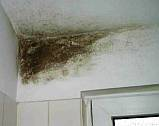**Schimmelpilz durch Dichten und Dämmen**](7schim.md) - Ursachen und Folgen - mit Ratgeber und Leitfaden: Wie beseitigt man ihn, wie kann man ihn vermeiden? 

---

**[Das Professoren-Rätsel](7wdvs17.md#einschub)** **[Initiative für gesundes Bauen](7intiv.md)**

Die Öffentlichkeit und Politik wird für die Durchsetzung des Energieabzockens mit vier (zentral gesteuerten?) Suggestions-/Angstkampagnen medial beeinflußt und terrorisiert:

1. Simulationen und Klimaereignisse "bewiesen", daß der Fortbestand der Menschheit durch das "Treibhausgas" CO2 und eine dadurch verursachte menschengemachte globale Erwärmung gefährdet sei. 
2. Die EnEV und andere "Klimaschutz-Instrumente" seien bei weitem nicht "scharf" genug, um unsere klimaabstürzende Welt (in Wahrheit gewisse Abzockinteressen) zu retten, und 
3. Die Barackenbauweise, oft im Verbund mit schadensanfälligem und absurd unwirtschaftlichem High-Tech, spare Energie. Wenn nur wenigstens die Energie teurer wäre, damit das auch wirtschaftlich gelänge. 
4. Die sog. Experten ("Fachleute") seien sich in 1. bis 3. einig, das sich auch in diesem Umfeld mehr und mehr ausbreitende Terrorregime sei deshalb zum Wohle des Universums gerechtfertigt. Nur unabhängige "Spinner/Eigenbrötler" stänkern dagegen.

**_[Entscheiden Sie selbst: Dieser Link bietet auch die Kehrseite der Medaille](7wsvoant.md)_**

Nachschlag: Politik, Bundesregierung, Koalitionsvereinbarung und Schweinekrippe - wer sind unsere Regenten?: 
 

 Und nochwas: 

"Unsere" Regierung hat schon sehr spezielle Ziele - in bester Tradition der seit langem eingefädelten Zerstörungspläne (und hier meine ich nicht nur die planmäßig betriebene Ausländerintegration oder die Wiedereinführung des Judensterns in Form von "Energiepaß" und "Umweltplakette", deren diskriminierende Wirkung sicher zu bisher den Wenigsten vorstellbaren Höhepunkten staatlicher Zwangsmaßnahmen führen wird, auch nicht den Öko-Dschihad mit erbarmungslosem Dämmstoffzwang, behördlich überwachtem Energiefasten im ganzjährigen Öko-Ramadan und täglichen Almosenzwang zugunsten der Ökoprofiteure, den unsere islambesessene Regierung in ihren Klimaschutz-Scharia-Gesetzen erlassen hat) für den Standort Deutschland: 

Sie will deswegen - gem. Koalitionsvertrag CDU/CSU/FDP! - bis 2030 "mind. 30" und bis 2050 unfaßbare "mind. 80" Prozent der deutschen Stromerzeugung (davon zwei Drittel aus den "fluktuierenden Energieträgern Windenergie und Photovoltaik"), "mindestens 50 % am Bruttoenergieverbrauch" aus "erneuerbaren Energien" und einen nach dieser Irrsinnslogik logischerweise einhergehende Senkung des Primärenergieverbrauchs um 50 Prozent bis 2050 vorschreiben. Die volksverhetzenden Faschohirne im Regierungsladen unter allen denkbaren Koalitionen planen seit langem - wie jetzt offenbar geworden - (nach regierungsamtlichem "Energiekonzept 2010", ein 40-Jahre-Plan der Ökoplanwirtschaftler unter Merkels Regie, mit "Leitlinien" und "Eckpunkten") nicht nur einen "Klimaschutzrat" der Bundesrepublik, sondern - hier ganz volksbezwingende "Räterepublik" (Epp, wo biste denn?!) - auch unglaublichste sonstige planwirtschaftliche Regulierungen (= "Klimaschutzgesetz", "Klimaschutzaktionspläne" mit verpflichtend einzuhaltenden "Sektorzielen", die zwangsläufig folgenden Einheiten von Klimaschutzstaffeln, Klimaschutzgeheimpolizei und Klimaschutzblockwarten nach bewährtem Vorbild werden im Begriff "Aktionsplan der Bundesregierung" bisher nur angedeutet, die schwarze Monopol-Zunft braucht nur noch einen Ledermantel und Bewaffnung als allmächtige Öko-Revolutions-Garden, dann ist alles tutti paletti) und "Förderprogramme", die den Klimaschutzterror gegen alle bisher noch vorgespiegelten grundgesetzlichen Schutzbereiche der Bürger begleitend erzwingen müssen. Lustige Kommentare aus Bürgermund dazu hier: [ MMNews: Klima killt Hausbesitzer - Hauseigentümern droht wegen Energiekonzept Kostenexplosion](http://www.mmnews.de/index.php/etc/6379-klima-killt-hausbesitzer) 
[Die Welt: Sanierungszwang lässt Mieten explodieren](http://www.welt.de/finanzen/immobilien/article9483731/Sanierungszwang-laesst-Mieten-explodieren.html) 
[Spiegel online: Lobbyschlacht um Energiekonzept: Hausbesitzer fürchten teuren Sanierungszwang](http://forum.spiegel.de/showthread.php?t=20560) 

Der gesamte Gebäudebestand muß nach dem Gusto des Umweltministeridumms bis 2050 "auf ein nahezu klimaneutrales Niveau saniert sein ... der Anteil erneuerbarer Energien am Wärmebedarf ... bis 2050 rund 60 %". Es sind "ambitionierte Ziele für die energetische Gebäudesanierung festzulegen und umzusetzen ... die Sanierungsstandards anzuheben (um die) energetische Sanierung entschlossen voranzubringen." Und deswegen: 

"Verschärfung der energetischen Anforderungen ... Ausweitung der Nachrüstungspflichten (auch ohne Sanierung durchzuführen) auf Ein- und Zweifamilienhäuser sowei auf weitere Tatbestände ... Einführung einer umfassenden Sanierungspflicht für bestehende Gebäude ... Verabschiedung eines umfassenden Maßnahmenpakets zur Verbesserung des Vollzugs (z. B. ... Verschärfung der Bußgeldvorschriften ..." 

"Zur Umsetzung des Effizienzziels wird ... eine verbindliche Stromeinsparverpflichtung der Energielieferanten gegenüber ihren Kunden eingeführt. Stromverbrauch und Stromabsatz müssen ab 2011 jedes Jahr um 1 % gesenkt werden. ... Die Verpflichtung wird gesetzlich verankert und mit Sanktionen bei Nicht-Einhaltung versehen." 

Die perverse Sprache des voll entarteten Ökofaschischmus nach der Merkelbande Manier. Da spielen die verkehrspolitischen Ziele nun wirklich auch keine Rolle mehr, sind sozusagen nur noch das Tüpfelchen auf dem I: "allein auf CO2-basierte Kraftfahrzeugsteuer ... LKW-Maut auch auf Bundesfernstraßen und Absenkung auf LKW mit 3,5 Tonnen ... Steigerung der Attraktivität des Radverkehrs ... Geschwindigkeitsbeschränkungen ... Kontinuierliche Erhöhung der Mineralölsteuer" und so weiter und so fort. Leute, da muß ich schon mal fragen, wer die Drecksäcke eigentlich alle gewählt hat, die sich solchen Schweinskram in ihren Hinterstübchen ausdenken? Wie bei Hitler wieder mal wir alle? Und am Ende? Will es bestimmt wieder mal keiner gewesen sein. Oder mindestens die Faust in der verschissenen Hosentasche geballt haben. Zuhaus um Mitternacht. 

Ja, für eine derart staatsterroristische Klimaschutz-Stachanowerei der auf das wehrlose deutsche Volk hereinbrechenden faschistoide Klimaschutzräterepublik können wir unsere Regierungsossi-FDJ-Propagandatante Äintschy freilich bestens brauchen, Birne sei Dank. Und der große Patrick Döring von der FDP heckt dann mit seinen Bundestagsspießgesellen im Ausschuss für Verkehr, Bau und Stadtentwicklung auf Zuruf der geliebten Haus-und-Grund-Freunde die Gesetzestexte aus, nach denen die Vermieter die Dämmzwangkosten vollständig und brutalstmöglich auf die Mieter umlegen können, ohne daß die sich wehren können. Dazu eine geniale Abschreibung für "Klimaschutzmaßnahmen", die ihresgleichen sucht. Wer zahlt das? Wie immer die Kleinen. Uns Angela macht das dann so richtig schmackhaft: [Welt.de: Merkel erklärt den blöden Mietern den Klimakrieg](http://www.welt.de/finanzen/immobilien/article9957104/Merkel-fordert-utopische-Mieterhoehung-fuer-Sanierung.html) 

Übrigens stammt auch das Modell, daß es zugunsten der optimierten Planerfüllung real jedes Jahr weniger gibt, aus der über Leichen gehenden kommunistischen Planwirtschaft marxistisch-leninistisch-stalinistisch-maoistisch-merkelistischer Prägung, deren Jünger heutzutage offensichtlich den Öko tanzen und das bestimmt nicht auf dem freiheitlich-demokratischen Boden des Grundgesetzes. Verfassungsschutz, wo bist Du? Immer noch beim Aufblasen der neofaschistischen Bedrohung? Geh in die Regierung, dort sitzen die Übeltäter in ihren Papierschmieden und Gesetzeswerkstätten. Und vergiß mir die Schulen nicht, die Brutanstalt der Staatsverbrecher: 

[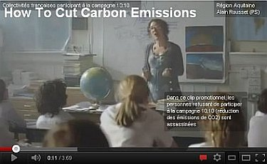](https://youtu.be/s395oCDCf6c) 

In der märkischen Heide ist bestimmt noch Platz für den Bau einiger Quadratkilometer Klimaschutz-Konzentrationslager, in die dann alle hartnäckigen Klimasünder aus der Energielieferantenbranche und dem Pool der Energiekunden einzuweisen sind. Wir haben ja wieder mal alle JA!!! geschrien, als die Klimaschutzregierung uns nach dem totalen Giftgas-Krieg - diesmal gegen das absolut harmlose CO2 - fragte - während gleichzeitig beispielsweise die Schulen so energieeffizient abgedichtet werden, daß darin schon nach kurzer Unterrichtsdauer so schauerliche CO2-Konzentrationen erreicht werden, daß es darin keine Sau gesund aushalten würde. Europäische Sauen haben nämlich ein Anrecht auf vierfachen (!) Luftwechsel in der Stunde. In deutschen Schulen dürfte teils nicht mal 0,1facher der Fall sein. 

Und warum muß eigentlich der deutsche Strom dank der Anstrengungen "unserer" Bundesregierung so teuer und unsere Wirtschaftskraft damit so arg gedämpft werden? 

Na, wer sich ein bisserl auskennt und zu den Materialien der eingeweihten Kreise Zugang hat, weiß schnell die Antwort: 

Weil unsere genscherisierte Regierung im Inoffiz der 2+4-Verhandlungen als Preis der Einigung die systematische Aufgabe der deutschen Wirtschaftsvormacht versprach, nicht nur durch Aufgabe der D-Mark, sondern durch wesentlich tiefgreifendere Verkohlung dank "Wirtschafts-Reformen", insbesonders die Energie betreffend. Im Klartext: Abschaltung der eigenen Energieversorgung ("Atomausstieg", Abschaffung der mit deutscher Kohle betriebenen Kohlekraftwerke), Auslieferung der Energieversorgung an unsere lieben Freunde und Verteuerung der Energie für den ehemaligen Wirtschaftsstandort Deutschland ins Ungeheuerliche. 

Und schon waren unsere allergeliebtesten Nachbarn und Freunde bzw. ihre so ungeheuer sympathischen Vertreter namens Mitterand und Thatcher urplötzlich "für die Einheit" - eingefädelt von den der ehrenburgschen und morgenthauschen Tradition gleichgeschaltet verpflichteten US- und SU-Administrationen. Und wer baut uns nun die unerschöpfliche Atomkraft an die Grenzen? Ja richtig: Polen und Tschechien. Und wer liefert uns Gas? Und Öl? So einfach kann sich die Deindustrialisierung in Richtung Steinzeit ("Deutschland ein Ackerland", "Germany must perish") dank Ökoterror hierzulande erklären ... 

Klarsichtig liegt dem Geheimpapier folgende Erkenntnis dessen Verfasser zugrunde: 

"Eine zentrale politische Grundsatzfrage ist, in welchem Maße das Energiekonzept stärker auf Regulierung [KF im Klartext: Gesetzesterror] oder auf Förderung [KF im Klartext: Steuergeldverschwendung] setzt ... Rechtliche Vorgaben (z. B. Standards für die Gebäudesanierung) sind nur so gut, wie der Vollzug, der sie umsetzt (z.B. riesige Vollzugsdefizite bei der EnEV) und treffen auch auf massiven Widerstand der Betroffenen (z. B. Hauseigentümer)." 

Aha, da haben wir es wieder - das Motto, dem sich die letzten Aufrechten der "Nie-wieder!-Generation" verschworen haben: 

## Leistet Widerstand!

Hauseigentümer führ', wir folgen! Schwerter zu Pflugscharen, Dämmstoffe zu Massivstoffen, Ökoscheiß zu Öl, Gas und Kohle (aus unerschöpflicher abiotischer Genese!) und Kernkraft mit Transmutationsbehandlung des Abfalls! Jawollja! 

Hintergrundinfo: 
[FAZ: Transmutation - Die zauberhafte Entschärfung des Atommülls](http://www.faz.net/aktuell/wissen/physik-chemie/transmutation-die-zauberhafte-entschaerfung-des-atommuells-1655406.html) 
[ef: Energiekonzept - Merkels Meisterwerk an Destruktion](http://ef-magazin.de/2010/09/08/2520-energiekonzept-merkels-meisterwerk-an-destruktion) 

[FAZ: Abstumpfung mit Styroporplatten](http://www.faz.net//s/Rub033C086DB12D42A2A2FFD87627DB62DE/Doc~E4BD73916500A4F18A0A8C7687B5B89B9~ATpl~Ecommon~Scontent.html) - lesenswerter Artikel mit flotten Kommentaren zur protestbedingt leicht abgespeckten Version des Energiekonzepts 

Und wenn es jemanden interessiert, wie die Finanzblutsauger die deutsche Verwüstung mit ihren Klimaschutzstaffeln betreiben, hier zwei doch ganz aufschlußreiche Links: 

[Wer steht hinter dem "heißen Herbst" gegen die Kernenergie in Deutschland?](http://www.bueso.de/news/wer-steht-hinter-heissen-herbst-gegen-kernenergie-deutschland) 
[Will Caio Koch-Weser einen Heissen Herbst in Deutschland?](http://www.bueso.de/news/will-caio-koch-weser-heissen-herbst-deutschland) 

---

_"Zum Unglück hat sich mit der Industrie ein System verbunden, 
das Profit als den eigentlichen Motor des gesellschaftlichen Fortschritts betrachtet, 
den Wettbewerb als das oberste Gesetz der Wirtschaft, 
Eigentum an den Produktionsgütern als absolutes Recht, 
ohne Schranken, 
ohne entsprechende Verpflichtung der Gesellschaft gegenüber. [...] 
Noch einmal sei feierlich daran erinnert, 
dass Wirtschaft im Dienst des Menschen steht."_ 
Papst Paul IV. 
(in seiner Enzyklika über den Fortschritt der Völker - [POPULORUM PROGRESSIO - Volltext deutsch](http://www.christusrex.org/www1/overkott/populo.htm)) 
**Das Bild zum Thema:** [Frans Francken - Der Tod und der Kaufmann (1620)](http://www.religionsunterricht.de/ifr/ifr45zd2.htm) 
_ 
"Mich nennt den Hutten jedermann. 
Zu Schimpf, zu Ernst ich fechten kann. 
Schwert, Feder führ ich mit gleicher Macht. 
Mein Gemüt Gotts Huld hält in hoher Acht. 
Ohne Rücksicht schreib ich frei 
der Kurtisanen Büberei, 
wie sie ganz Deutschland berauben ganz 
durch ihre Pfründ und Trugfinanz. 
Drum mich verfolgt der Papst ohn Recht 
und tut Gewalt mit Edelknecht. 
Das klag ich Gott und Kaisers Ohr. 
Ich hab´s gewagt, Rom sieh dich vor!_ 
Ullrich von Hutten (1488-1523) 

_"Es wurde mir zweifelhaft, 
ob eine gesteigerte Technik 
überhaupt im Stande sei, 
das Wohlbefinden der Menschheit 
zu erhöhen. 
Für Menschen meiner Art 
von grüblerischem Interesse 
ist das Universitätsstudium 
nicht unbedingt segensreich. 
Es ist eigentlich ein Wunder, 
daß der moderne Lehrbetrieb 
die heilige Neugier des Forschens 
noch nicht ganz erdrosselt hat. 
Was diese Philister einem, 
der nicht von ihrer Sorte ist, 
in den Weg legen, 
ist wirklich schauderhaft. 
So einer betrachtet jeden jungen intelligenten Kopf 
instinktiv als eine Gefahr für seine morsche Würde. 
Es lebe die Unverfrorenheit! 
Sie ist mein Schutzengel in dieser Welt." 
_ Albert Einstein (1905-1955) 
(aus: Jürgen Neffe, Einstein, Eine Biographie, Reinbeck: Rowohlt Verlag 2005) 

_"Ohne Provokation werden wir überhaupt nicht wahrgenommen"_ 
Rudolf (Rudi) Dutschke, dt. Studentenführer (1940-1979) 

---

**Warum der k-Wert (U-Wert) mit der Wirklichkeit am Bau und besonders mit dem massiven Altbau rein gar nix zu tun hat:** 
_"Der k-Wert eines Bauteils beschreibt dessen Wärmeverlust unter stationären, 
d. h. zeitlich unveränderlichen Randbedingungen. 
Die Wärmespeicherfähigkeit und somit die Masse des Bauteils geht nicht in den k-Wert ein. 
Außerdem beschreibt der k-Wert nur die Wärmeverluste infolge einer Temperaturdifferenz zwischen der Raum- und der Außenluft. 
Die auch während der Heizperiode auf Außenbauteile auftreffende Sonneneinstrahlung bleibt unberücksichtigt"._ 
Prof. Dr.-Ing. Gerd Hauser 
in: _"Der k-Wert im Kreuzfeuer - ist der Wärmedurchgangskoeffizient ein Maß für Transmissionswärmeverluste?" 
(Bauphysik 1981, H. 1, S. 3)_
