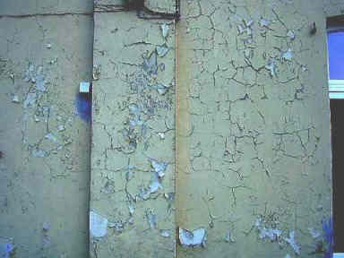
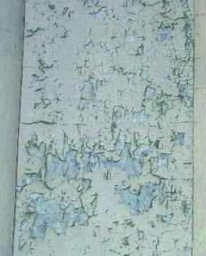
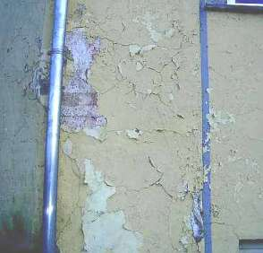
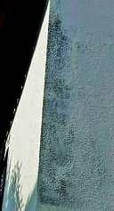
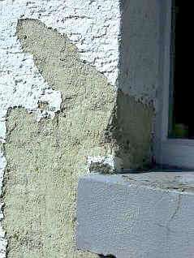
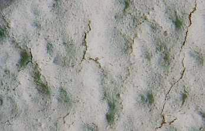

[🠔 Zur Übersicht: Fassade & Anstrich](22bausto.md)  
# Fassadeninstandsetzung 2: Bindemittelreiche Werktrockenmörtel
**Erneuerung oder Erhalt von Altputzen und Anstrichen.**  
_von Konrad Fischer • aktualisiert 31.03.2009_

 

## Altbautaugliche Verfahren und Baustoffe 
2. Erneuerung oder Erhalt von Altputzen und Anstrichen

### Fassadeninstandsetzung:

## Putz, WDVS, Natursteinfestigung und Anstrich
Probleme und Lösungen 2

**(aktualisiert 31.03.09)** 

Bindemittelreiche Werktrockenmörtel mit geringen Korngrößen lassen sich zwar billig an die Fassade pumpen, im Abbindeprozeß werden sie aber schnell zu hart, ihre gestörte Karbonatisierung schreitet dann rißbildend über lange Zeiträume voran. Feuchte und kühle Umgebungsbedingungen sowie die Kapillarentfeuchtung blockierende Dispersionsanstriche begünstigen die dramatische Festigkeitsentwicklung von Werktrockenmörtel. Druckfestigkeitswerte vom 4-8-fachen ihrer im Merkblatt erwähnten Daten bzw. Mindestfestigkeit nach DIN sind keine Seltenheit! Für den üblicherweise niedrigfesten Untergrund, hierzu zählen auch die Porenziegel und sonstige Schaumbaustoffe, ist das zu viel. Putzrisse und -ablösungen, Steinrisse und abknackende Scherben sind die Folge.

Bei entsprechender Rißbildung analysiert man diesen Schaden am sichersten mit einer Beprobung eines aufgehackten Loches im Putz mit Phenolphthalein-Lösung. Regelmäßig ist nur die meist schon wegen Überfestigkeit durchrissene Oberflächenkruste durchkarbonatisiert und die darunterliegende Putzschicht noch nicht. Gleichwohl hat die von außen her fortschreitende Rißbildung die inneren Putzschichten schon durchrissen - ein Phänomen, das auch durch wiederkehrende "Rißsanierung" kaum gestoppt werden kann. 

In so einem Fall heißt es also: Hydrauleputz runter, echter Luftkalkmörtel (fragen Sie nach den "sonstigen" hydraulisch wirkenden Bindemittelzugaben wie Hydraulkalk, Traßkalk mit undeklariertem Zement, Trockensilikat usw. und warum das dann Luftkalkmörtel sein soll) drauf. 

Achtung: Nur auf weißgetrockneter, durch Schichttrocknung schwundrißbedingt ausgerissener (entspannter) 1. Putzlage, also je nach Trocknungsbedingungen bis zu ca. 7-10 Tagen, darf der Kalk-Oberputz aufgetragen werden, sonst reißt er im Zusammenhang mit der luftkalktypischen Schwundrißbildung der ersten Lage mit durch. Eine feine Schweißputzlage kann gerissene Luftkalkputze dann zwar problemlos "heilen", ein dennoch unnötiger Mehraufwand. Das Problem jahrelang zunehmender Erhärtung über die vom Untergrund aufnehmbaren Abbindekräfte hinaus kann es beim "weichen" Luftkalkmörtel aber nicht geben. Schon nach erstem Ansteifen und folgender Austrocknung erreicht er durch die trocknungsbedingte Adhäsion bis zu ca. 70 Prozent seiner Endfestigkeit, die sich erst nach längerer Zeitphase durch spannungsarme Karbonatisierung (CO2-bedingte Umwandlung der Kalkdihydroxide Ca(OH)2 in Kalksteinkarbonat CaCo3) entwickelt. Ein Nachreißen bzw. eine Spätrißbildung, wie sie bei allen zementären Mörteln droht, ist bei Luftkalkmörteln deswegen nicht zu erwarten. [Weitere Info.](2kalk.md)

Ungeeignete Fassadenbeschichtungen aus der Hexenküche der Bauchemie (Kunstharzhaltige und hydrophobierte Anstriche) zerstören den Malgrund durch Blockade der Entfeuchtung und Entsalzung. 

 
_Sowas "wasserabweisend Vorteilhaftes" malen angesehene Malermeister einer sehr nassen deutschen Großstadt ihren Kunden auf die historistische Fassade. Zur künftigen Auftragsförderung und Vermehrung der Bauschäden? Sind größere Handwerks- und Bauchemie-Sauereien überhaupt vorstellbar? Vielleicht war das der Lotuseffekt?_

.  
 
_So gehts natürlich auch. 
Schadensklassiker "Plastikfarbe auf historischem Grund". 
Das kauft deutscher Bauherrngeiz und plant der herstellerberatene Planer am liebsten._

 
_Das ist das stein- und fassadenzerrottende Ergebnis einer wasserabweisenden und algizid vergifteten "Mineral"-farbbeschichtung nach drei Jahren. 
Planer: Staatsbauamt, Ausführendes Unternehmen: Innungsbetrieb 
Objekt: Regierungsgebäude, Verwaltungsnutzung 
Steuergeld: Vernichtet 
Zählt das dann auch zur Regierungskriminalität?_

 
_Kunstharzschwartenfarben auf Putz und Holz. 
Bei der Abnahme sah das doch so dolle gut aus!_

 
_Weiße Dispersionspampe nach fünf Jahren. 
Schwarzalgen oder Schwarzschimmel - das ist hier die Frage._

 
_Auch dieser Schadensklassiker am Spritzwasserbereich der Fenstersohlbank ist eine Folge der trocknungsblockierenden und hinterfrostungsfördernden Dispersionsfarbbeschichtung. Abhilfe?_Kapillaroffene_ Beschichtung. Auf die Diffusionsoffenheit - das Werbemerkmal noch der übelsten Plastikpampen für den bautechnisch unmündigen Verbraucher - ist sozusagen gesch..._

 
_Eine neue Marken-Dispersionssilikatfarbe nach 6 Monaten an der Fassade etwas genauer betrachtet. Der Schimmelabklatsch (nicht abgebildet) beweist obendrein die guten Nährbodeneigenschaften dieses "Organo-Substrats". Nach zwei Jahren dann Frostblasen und Untergrundabschieferung. Alles wie immer._

**Weiter:[Kapitel 3](22bau3.md)**
