[🠔 Zur Übersicht: Fassade & Anstrich](22bausto.md)  
# Fassadeninstandsetzung 3: Ein Potpourri der staatlichen Denkmalpflege ...
**Erneuerung oder Erhalt von Altputzen und Anstrichen.**  
_von Konrad Fischer • aktualisiert 31.03.2009_

 

## Altbautaugliche Verfahren und Baustoffe 
2. Erneuerung oder Erhalt von Altputzen und Anstrichen

### Fassadeninstandsetzung:

## Putz, WDVS, Natursteinfestigung und Anstrich
Probleme und Lösungen 3

**(aktualisiert 31.03.09)** 

Und hier ein Potpourri der staatlichen Denkmalpflege mittels Staatsbauamt bzw. "Stiftungs"-Bauamt und ihrer bewährten Helfershelfer in Planung und Handwerk vor ein paar Jahren und heute - es müssen halt immer ausgerechnet kunstharzige- bzw. silikatische Farben sein - warum wohl? Ist eh klar. (Bildaufnahmen 28.6.05):

A) Alte Fassungen (ca. 10-20 Jahre alt)

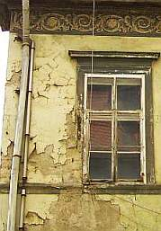.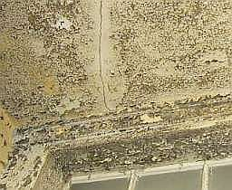.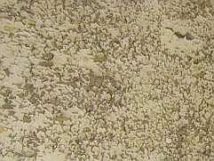.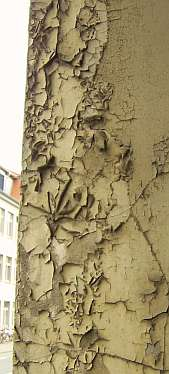.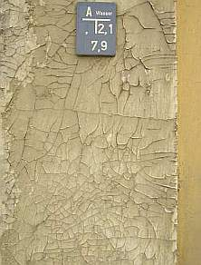.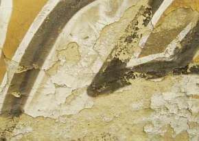(mit Grafittilack nachgefaßt).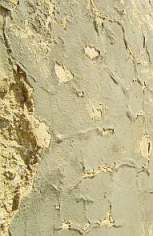.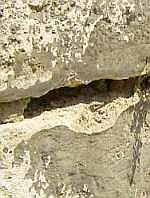.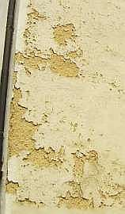.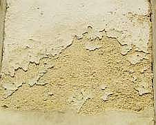.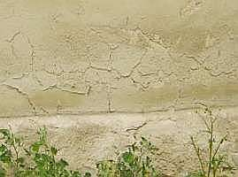

B) Neuere Fassungen, teils fast von gestern

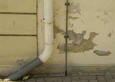.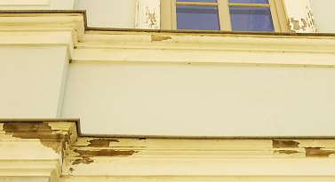.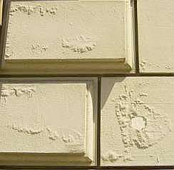.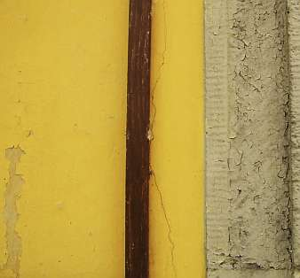.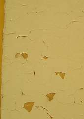.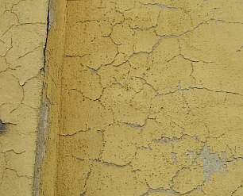

Und trotz der angeblich wasserabweisenden und besonders bindungsstarken Rezeptur der Industriepampen (Dispersionsfarbe, Silikatdispersionsfarbe, Siliconharzfarbe, Kalkfarbe mit Kunstharzanteilen, ...) wird der Untergrund - auch in nicht direkt bewitterten Bereichen feucht, kann kapillar nicht austrocknen (1000:1 = Kapillartrocknung:Dampfdiffusionstrocknung in Baustoffen) hinterfeuchtet die Schwarte und verdrückt sich mühseligst durch die aufgesprengten Rißsysteme. Nicht ohne vorher aber den Malgrund maximal durch Befrostung zu schädigen. Streng nach Norm und Produktberatung, natürlich bestimmt alles fein säuberlich aufgeführt im Technischen Hochglanz-Werbemerkblatt. Na ja, ein bißchen Show muß schon sein, bevor der verantwortliche Baubeamte/Planer sein Weihnachtsgeschenkerl verdient hat. Und wie blöd muß man eigentlich sein, um sich Dispersionssilikatfarbe als "Mineralfarbe" andrehen zu lassen?

[Auch ihre Besiedlungsfreundlichkeit für wohngiftverschleudernde Schimmelpilze](26bausto.md#schimmelpilzbekã¤mpfung) begründet die Entfernung der sauren Kunstharzschwarten - nicht nur auf wg. Bauphysik [durchfeuchtungsverurteilten Wärmedämmverbundsysteme WDVS](213baust.md). 

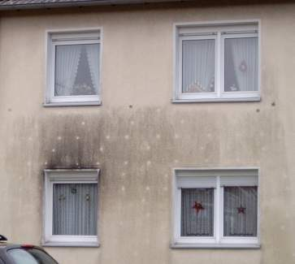So kann das dann aussehen. Lustig, wie die besser wärmespeicherfähigen und weniger wassersaugenden Tellerdübel des WDVS sich heller abzeichnen. Der 'Leopardenfelleffekt', wie man sich in der branche darüber lustig macht. Wo es dem Hausbesitzer doch zum heulen zumute ist. So dolle wollte er Energie sparen, und das hat er nun davon, daß er auf seinen schwärmerischen Planer/Energieberater/Handwerker und deren dahinterstehenden Dämmstoffverkäufer hereingefallen ist. Na hoffentlich ist das ordentlich gefördert worden, dann triffts uns alle. 

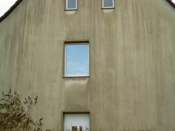Ein paar Häuser weiter dann Plastikpampe ohne Dübel. Solls auch geben. Es grünt dann so grün, daß Spaniens ... Ja, Dr. Doolittle, hätte man nur auf Sie gehört: Do little, also nur klassische Fassadenreparatur mit rein mineralischen, zementfreien, kunstharzfreien Anstrichen. Aber so - Deutschlands Grüne - von ferne schon an der Fassade erkennbar. 

Gar zu schnell sind auf beregneten Fassaden ihre neuerdings industriell eingemischten Gifte gegen den typischen Befall (Algizide/Fungizide) ausgewaschen. Runter auch mit den nichtmineralischen und im Kondensationsfall ebenso besiedlungsfreundlichen Altanstrichpaketen auf Innenputzen und Stuckflächen. Sie tragen abbindespannungsbildende Neuanstriche nur sehr bedingt oder gar nicht und können recht lange ihre lungengängigen Inhaltsstoffe der Bauchemie ausgasen. Folge: Abplatzungserscheinungen, mindestens nach dem folgenden Wartungsanstrich, Fogginggefahr, leichte bis schwerere Gesundheitsstörungen der Bewohner. Die Altanstriche kann man dann mit Spachtel und Fräse, besonders bestandschonend aber auch mit besser geeigneten Reinigungsmethoden entfernen. Auf Gesundheitsschutz achten! 

Selbstverständlich nehmen binderhaltige Anstriche auch [Heizluftdreck](7temper.md) am bevorzugsten auf und verschmutzen deswegen weit schneller und mehr als reine Kalktünchen.

Infolink zum [Thema Schimmel](7schim.md)

**Weiter[Kapitel 4](22bau4.md)**
