[🠔 Zur Übersicht: Fassade & Anstrich](22bausto.md)  
# Fassadeninstandsetzung 4: Schäden durch Wasserglas und Silikatputz
**Erneuerung oder Erhalt von Altputzen und Anstrichen.**  
_von Konrad Fischer • aktualisiert 01.04.1999_

 

## Altbautaugliche Verfahren und Baustoffe 
2. Erneuerung oder Erhalt von Altputzen und Anstrichen

### Fassadeninstandsetzung:

## Putz, WDVS, Natursteinfestigung und Anstrich
Probleme und Lösungen 4

Als Leckerbissen eine interessante Schadensbeschreibung zu modernen Baustoffkonzepten rund um Anstrich und Putz, die durch silikatische und synthetische Komponenten regelmäßig den Keim zur Vernichtung ihrer selbst, leider auch der damit beschmierten, verklecksten und totbeschichteten Bausubstanz in sich tragen:

bausubstanz April 1999:

**_"Tüchtig den Pelz verbrannt 
Sanierungsfehlersammlung, Nr. 18 
Von Michael Probst_**

_"Fehler verbergen heißt nicht Fehler bessern" (Pubilius Syrus)_

_Das Grundprinzip der freien Marktwirtschaft basiert auf Zuwachs. Bereits Stagnation kann zu wirtschaftlichen Depressionen und allen damit verbundenen sonstigen Begleiterscheinungen führen. Vor diesem Hintergrund steht der Gesamtkomplex Wirtschaft unter einem enormen Erfolgsdruck; um immer mehr Waren und Leistungen abzusetzen, bedarf es immer größerer Kreativität, gleichzeitig wächst der Wettbewerb. So wird vordergründig der einzelne Mensch zum reinen Konsumenten, der um so mehr konsumiert, desto geschickter er manipuliert wird. Man kann ihn aber nur manipulieren, wenn er unkritisch ist, was wiederum eine Folge gezielter Manipulation ist._

_Ein wahrer Teufelskreis, den es an dieser Stelle nicht zu vertiefen gilt. Aber: Auch die Baubranche ist bekanntlich Wirtschaftsbestandteil und unterliegt von daher den gleichen marktwirtschaftlichen Gesetzen. Und so kommt es, daß speziell der Branchensektor Baustoffindustrie permanent auf der Suche nach neuen Absatzmärkten ist. Dies führt zu einem Überangebot an Baustoffen, Bauteilen und Bauverfahren, deren Entwicklungsmotivation nicht etwa die tatsächlichen Bedürfnisse des Marktes sind, sondern diejenigen Bedürfnisse, die dem Verbraucher, also dem Unternehmer, dem Baustoffhändler, dem Architekten, auch dem Bauherrn, als solche suggeriert werden._

_Dabei ist die höchste Schule der Manipulation, wenn der Gesetzgeber so stark unter Lobbyistendruck gerät, daß er unsinnige oder gar falsche Gesetze und Verordnungen erläßt, ich denke dabei an die Wärmeschutzverordnung und die "drohende" Energiesparverordnung. Dies sind wirtschaftspolitische Lenkungsinstrumente, die jedem helfen werden, nur nicht der Umwelt. Unsere Enkel und Urenkel werden uns sinnbildlich erschlagen, wenn sie eines Tages vor dem Problem der Massenentsorgung von Wärmedämmstoffen aus (beispielsweise) Hartschäumen stehen._

**_Erst schmiert und mehlt es..._**

_Heute berichte ich Ihnen von einem nicht alltäglichen Sanierungsfehler am silikatischen Oberputz eines Wärmedämm-Verbundsystems. Betroffen ist das Muttergebäude einer renommierten und in der Öffentlichkeit stehenden Institution, noch dazu wirkt es wegen seiner Lage als Blickfang. Um so peinlicher war es, als sich etwa fünf Jahre nach Fertigstellung des Wärmedämm-Verbundsystems am Oberputz auf Kaliwasserglasbasis Schäden dergestalt einstellten, daß sich dieser punktuell vom Armierungsputz löste. Zudem wurde der Oberputz unter Wassereinwirkung weich, was zu einer schmierigen Masse führte, die sich vom Armierungsputz abschieben ließ. An wasserbelasteten Flächen konnte zudem festgestellt werden, daß der silikatische Oberputz im trockenen Zustand noch dazu mürbe wie eine Mehlschicht war._

_Der zu Rat gezogene Hersteller des Wärmedämm-Verbundsystems ließ damals nur vage verlauten, daß sowohl das Bindemittel Kaliwasserglas nicht reagierte und der Putz deshalb nicht aushärtete. Eine genaue Analyse wurde nicht bekanntgegeben._

_Nach Sanierungsvorschlag und auf Kosten des Herstellers wurde der Oberputz vollständig entfernt, die Oberfläche des Armierungsputzes ausgebessert und abgewaschen, eine Grundierung aufgetragen und sodann ein neuer silikatischer Oberputz appliziert._

**_... dann blättert es_**

_Es dauerte wiederum nur wenige Jahre, bis der Oberputz erneut schadhaft wurde. Diesmal mehlte und schmierte es zwar nicht, dafür zeigten sich teilweise deutliche Ablösungen des Oberputzes vom Untergrund, es bildeten sich Blasen, diese platzten schließlich auf und führten in der Folge zu teilweise großflächigen Ablösungen des Oberputzes vom Armierungsputz. [...]_

_Diesmal jedoch tauchte der Hersteller des Wärmedämm-Verbundsystems ab und kommentierte die Situation noch nicht einmal mehr. Welch Wunder, denn die Sanierung hatte bereits einen mehrfach sechsstelligen Betrag verschlungen._

_Der Autor dieses Beitrags wurde daher als Sachverständiger eingeschaltet. In Zusammenarbeit mit einem im europäischen Ausland ansässigen mineralogischen Labor [...] wurden die Schadensursachen analysiert. Wundern Sie sich bitte nicht, liebe Leser, daß die Untersuchungen nicht in einem deutschen Labor durchgeführt wurden. Nachdem ich bei der Bearbeitung konkreter Schadensfälle in den letzten Jahren [...] teilweise auch auf renommierte deutsche Institute getroffen bin, die - vorsichtig formuliert - nicht ganz frei in ihrer Entscheidungsfindung waren, ziehe ich ausländische Laboratorien vor, was sich ausgezeichnet bewährt hat. [...]"_

Ist doch klar - [wes Brot ich eß, des Lied ich sing](3gutacht.md). Weiter im Text:

_"[...] Der Außenwandaufbau stellte sich wie folgt dar: 
- Stahlbeton 
- Polystyrol-Partikelschaum PS 15 SE 
- Armierungsputz aus einem mineralischen Werktrockenmörtel mit einem Gewebe aus Polypropylenfasern 
- Silikatische Grundierung mit hydrophobierenden Zusätzen 
- Wasserglasgebundene Ausgleichsfarbe 
- Weiß eingefärbter Oberputz auf Bindemittelbasis Kaliwasserglas mit hydrophobierenden Zusätzen in Scheibenputz-Struktur 3mmm._

_Vorab soll der Begriff "silikatischer Oberputz" etwas näher erläutert werden:_

_Kaliumsilikat (Kaliwasserglas) ist ein mineralisches Bindemittel. Dabei sind Silikate meist Salze der wasserhaltigen Kieselsäuren. Sie kommen in vielen Arten vor. Bedeutung als mineralische Bindemittel haben jedoch nur die wasserlöslichen Alkalisilikate, wie eben das genannte Kaliumsilikat. Bedingt durch kristalline Versteinerung ergeben sich Putze, die gegen atmosphärische Einflüsse und Alkalien sehr beständig sind._

_Nachteilig ist jedoch die Neigung silikatischer Oberputze zu einer erhöhten Wasserdurchlässigkeit bei Schlagregen. Vor diesem Hintergrund hat der Hersteller wohl hydrophobierende Zusätze beigegeben. Bei einem silikatischen Oberputz handelt es sich also vom Ursprung her um einen wasserempfindlichen Oberputz, der erst durch hydrophobierende Zusätze wettertauglich eingestellt wird. Über Sinn und Unsinn einer solchen Maßnahme nachzudenken überlasse ich Ihnen._

_Das festgestellte Schadensbild hat summa summarum seine Kernursache in Wasser, welches in das System eindringt und dort zu diversen chemischen Reaktionen führt. [...] ... der Oberputz [war] mit einem ganzen System von Mikrorissen durchzogen. Porosität und Risseintensität führten also zu einer insgesamt offenporigen Struktur. [...]"_

Das **Silikatproblem** stellt sich aber nicht nur bei Putzen:

Selbstverständlich dürfen auf reine Luftkalkmörtelprodukte nur silikat- und kunststofffreie Anstriche ohne Hydrophobierung aufgetragen werden. Auch Siliconharzfarben sperren die erforderliche Kapillartrocknung! Da hilft auch der schönste Loutseffekt nix. Noch schlimmer ist die Verblendung des Kunden durch wohlklingende Eigenschaften wie "Dampfdiffusion" oder "Diffusionsoffen" oder "Wasserdampfiffusion" oder "Diffusionsfähig" usw., da es bei der Durchfeuchtung von Fassaden darauf überhaupt nicht ankommt, sondern nur auf die Fähigkeit der Oberfläche, flüssig vorliegende Feuchte - das ist nasses Wasser im Porengefüge! - wieder abzutransportieren bzw. abzutrocknen. Und dabei kommt es auf die Diffusionsfähigkeit bestimmt nicht an, da beim Transport 1000 zu 1 der Kapillartransport entscheidet. Und der ist bei "diffusionsoffenen" Anstrichsystemen geradezu extrem niedrig, wenn nicht gar Null. Damit sind Hinterfeuchtungen, Feuchtestau, Frost und hygrisch-thermische Abscherung und Aufmehlung der Schichten unter der dichten Anstrichpampe geradezu vorprogrammiert. 

Wer dies mißachtet, provoziert grausamste [Schadensfälle](11erhin3.md), für die der Kalk nichts kann. Die dichtende und teils festigende Wirkung falscher, gel- bzw. sperrschichtbildender silikat- bzw. kunstharzpolymerhaltiger Anstrichsysteme fördert Krustenbildung, Untergundkorrosion und Schollenbildung. Gottseidank halten die meisten vereidigten Schwachverständigen zu den Silikatfarbfabrikanten und lassen die fachliche Schweinerei mit Milliardenschadensfolgen ums Verrecken nicht auffliegen. Eine Hand wäscht und bemalt (Vergolderhandwerk) eben die andere ...

Besonders traurig macht es den unbefangenen Betrachter, daß nun auch all die Baudenkmäler, Burgen, Kirchen, Bürgerhäuser und Bauernhäuser, die in Osteuropa mit fremder Hilfe saniert werden, ebenfalls den heimtückischen Produktmanipulationen urdeutscher Prägung ausgesetzt werden. Egal ob bundesdeutsche Planer, die einen Exertenstatus genießen, oder einheimische Schwadroneure, alle greifen auf den gleichen Trick zurück: Einbindung der produzentenabhängigen "Fachberatung", Empfehlung der meist vollkommen ungeeigneten und sauteueren Bauchemielösung deutscher Produzenten, produktmanipuliert verkeimte Planung und Ausschreibung ungeeigneter Fertig-Baustoffe aus den Laboren der Trockenmörtelbranche und Farbchemie und konsequente Brutalerneuerung mit ebendiesen Pfuschereien vom Kompressenputz über Sanierputz, Trockenmörtel-Fassadenputz bis zu polymerhaltigen "Kalkanstrichen", Silikonharzfarben und Rein-Silikatfarben, Silikatdispersionsfarben/Mineralfarben vor Ort bei der Bauausführung. 

Die Beispiele sind Legion. Auch in Siebenbürgen, Land des Segens - heute - und dank allerbester Ostkontakte zu siebenbürgischen Restaurierungs-Architekten und dortigen Kirchenmännern auch schon früher - für die deutsche Bauchemie und die sonstigen bauindustriellen Erzeugnisse bis zm Dachziegel - oft auch durch empfehlerische Einflußnahme bundesdeutscher landeskirchlicher Baubehörden oder anderer generöse Seriösität vorspiegelnder technischer Helferlein, die ebenfalls von der Produktkrankheit bzw. deren Handlanger und produzenteneigener Baustofflaboranten traditionellerweise verkeimt oder auch verremmerst sein können! [Das](10hoai22.md) ist eben kein historisch bedingtes balkanisch-osmanisches Problem, sondern greift heutzutage auch bis zur letzten deutschen - jawollja auch siebenbürgischen Baustelle ...

[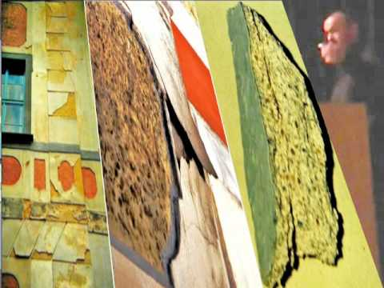](https://www.youtube.com/watch?v=lag2mVuCpcA)

**Schadensbeispiel: Silikatfarbe auf historischen Luftkalkputzen**

Typische Schäden an wasserglashaltigen Fassadenoberflächen [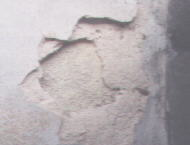](11erhin3.md)

Zerstörte Malschichten und Putze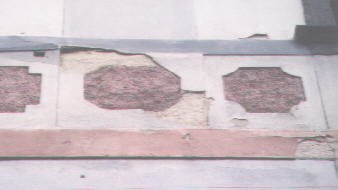

[Prof. Dr. **Ivo Hammer**](2ivo.md#ivo hammer) erklärt das so: 

_"Kaliwasserglas ist härter als unbeschädigter Kalk [...], deshalb besteht an Fassaden die Gefahr von Scherspannungen durch thermische Dilatation. Auch wenn ein erster Anstrich aus Kaliwasserglas dünn auf den historischen Verputz aufgebracht wird, steigt bei einem zweiten Anstrich die Gefahr der Krustenbildung und ihre negativen Folgen._

_Die Vorfixierung mit Kaliwasserglas führt zu einer zusätzlichen Verdichtung des Verputzes im oberflächennahen Bereich."_ Die Reparaturmöglichkeit von alten Silikatanstrichen ist _"stark eingeschränkt, langfristig nahezu unmöglich"_ , und es werden durch Kaliwasserglas _"schädliche lösliche Salze [...] eingebracht beziehungsweise erzeugt"_ [1]

**und auf Sanierputz**

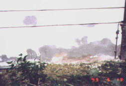+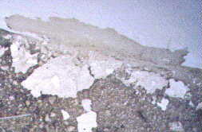 
Abfallender Sockel aus feuchtigkeitseinsperrendem Plastik-Dispersions-Silikatanstrich auf "heilendem" Sanierputz WTA. Und umfangreiche Hohlstellen an der gesamten Fassade wegen Ablösung der überharten, zusätzlich wasserglasgefestigten Kalk-Zementputzschwarten.

**und auf neuem Luftkalkputz**

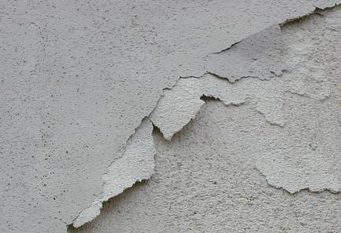+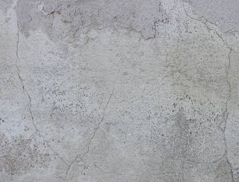 
Dispersions-Silikatfarbe auf neuem, frischem Luftkalkputz - die immer und überall vorprogrammierte Katastrophe. Der kapillare Feuchtestau unter dieser Plastikschwarte behindert die karbonatische Erhärtung des neuen Luftkalkmörtels, begünstigt das Salzaustreiben aus dem alten, vorbelasteten Putzgrund, blockiert das schadensfreie Ausblühen der Schadsalze und sorgt für Frostschäden in der oberen, trocknungsblockierten und dank Dispersions-Silikatabsperrung "abgesoffenen" Putzzone. Die dennoch unausweichliche Restentfeuchtung sucht sich dann in wasserführenden Kanalsystemen rißbegünstigende Befreiung.

Es sind schon rechte Bauschweinderl (auf grob Bairisch Drecks...), die solch zerstörerische Kunstharzpampen als "Mineralfarbe" - vielleicht sogar unter Mißbrauch urgesteinigster Phantsienamen - dem leichtgläubigen Maler, Denkmalpfleger, Baubeamten, Architekten und Bauherrn anpreisen.

Der Gipfel: Schwachverständige - teils mit akademischsten Titelschwänzen sonder Zahl - die einen solch eindeutigen Dispersions-Silikat-Schaden dem Nichteinsatz von Sanierputz zuordnen - siehe voriges Fallbeispiel. Daß bei solchen Schlechtachten der dispersionssilikatisierte Produktvertreter/-berater (wer kennt den Namen, zählt die Kohlen und die 100jährige Erfahrung?) hinter den Kulissen kräftig mitmischt, weiß sogar jeder Österreicher. In deutschen Behörden und Juristenstuben ist das eher unbekannt.

**und auch auf Naturstein**

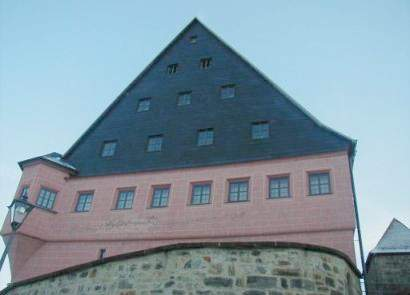 
Ein Stadtschloß - gar herrlich herausgestrichen auf Empfehlung des Denkmalamts (und begünstigt mittels für den Architekten kostenlose Planungs-Zuarbeit des Produzentenvertreters) mit Wasserglasfarbe

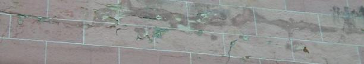 
Westseite etwas näher beguckt: untergrundzerstörende Schwarten und abblätternde Krusten, hinterfeuchtet und salzausblühend

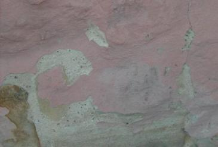 
Sockeldetail - was hat wohl die Denkmalpflege und den Architekten bewogen, hier nicht auf den originalen Kalkanstrich zurückzugreifen? 
Der wäre am Sockel wohl irgendwann auch mal ab, hätte aber weniger gekostet und den Malgrund nicht kaputtgemacht. 
Und immer für ungestörte Entfeuchtung des Bestands gesorgt. Wurde vielleicht an das Märchen der 100 Jahre allerbeste Erfahrung und die ewig witterungsresistente Wasserglasfarbe geglaubt? Heutzutage ist ja alles möglich, besonders bei Theoretikern und Experten.

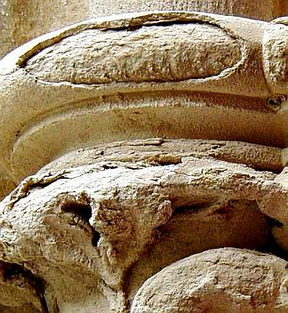 
[Gefestigte Natursteinfläche](29bausto.md#steinfestigung) nach einigen Jahren Bewitterung. Im Eindringtiefenbereich blättert, schuppt und scherbelt die gefestigte trocknungsblockierende Kruste ab, darunter sandelt und mehlt es, erst in ein bis drei Zentimeter Tiefe stößt man wieder auf tragfähigen Naturstein. Ein dickes Dankeschön dem zuständigen Denkmalpfleger, seinem Lieblings-Architekten und -Restauratoren und der die Denkmalexperten im Amt und der freien Wildbahn immer gerne und sehr incentivgestützt beratenden Bauchemie.

Weiter: **[Kapitel 5](22bau5.md) **
