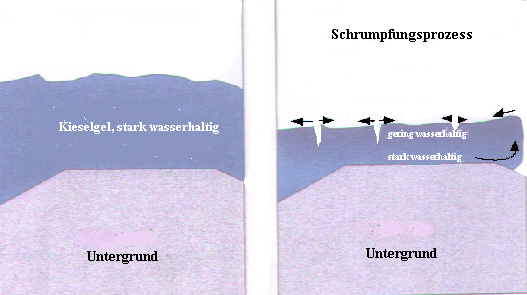

[🠔 Zur Übersicht: Fassade & Anstrich](22bausto.md)  
# Fassadeninstandsetzung 5: Materialimmanente Schadensrisiken
**Erneuerung oder Erhalt von Altputzen und Anstrichen.**  
_von Konrad Fischer • aktualisiert 31.03.2009_

 

## Altbautaugliche Verfahren und Baustoffe 
2. Erneuerung oder Erhalt von Altputzen und Anstrichen

### Fassadeninstandsetzung:

## Putz, WDVS, Natursteinfestigung und Anstrich
Probleme und Lösungen 5

**(aktualisiert 31.03.09)** 

Noch tiefer in die materialimmanenten Schadensrisiken der Silikatfarbe - Lieblingsbaustoff so mancher Denkmalpfleger - dringt der derzeit wohl kompetenteste Kenner der Materie, [**Dr. rer. nat. Dipl.-Min. Jürgen Osswald** , Labor für Bauschadensanalytik und Denkmalpflege, Kaufbeuren](http://www.institut-osswald.de), der zur Problematik Silikatgelbildung auf frischem bzw. nicht vollständig karbonatisiertem oder kalkspatzenhaltigem alten (ebenfalls Ca(OH)2-haltig!) Kalkuntergrund schreibt (Hervorhebungen KF) [4]:

_"... Die Abbindeprozesse in Silikatfarben sind vom Verfasser mit den aktuell zur Verfügung stehenden wissenschaftlichen Methoden untersucht worden. Als Ergebnis stellte sich heraus, dass der Abbindeprozess und die Reaktionen des Bindemittels in Silikatfarben etwas anders betrachtet werden müssen als bisher. Das Kohlendioxid der Luft spielt in der ersten Phase der Gelbildung keine primäre Rolle. Es reagiert aber sehr wohl entsprechend der bekannten Reaktionsgleichung nach Abschluss der Gelbildung mit dem Kalium des Wasserglases unter Bildung von Kaliumkarbonat._

_[Die Reaktion von Wasserglas mit dem Kohlendioxid der Luft_(unter Bildung von Kieselgel und dem ausblühfähigen, bauschädlichen Salz Kaliumcarbonat - Pottasche, Anm. KF)

K2O3SiO2xH2O

+

CO2

->

3SiO2nH2O

+

K2CO3

Kaliwasserglas

Kohlendioxid

Kieselgel

Kaliumcarbonat]

_Als erste Reaktion erfolgt die Gelbildung durch den Verlust des Wassers, wobei die Silikatteilchen trotz ihrer negativen Oberflächenladung durch zunehmende Konzentration der Wasserglaslösung immer enger aneinandergepresst werden, bis es zur Kondensationsbindung kommt._

_Zur Gelbildung tragen zusätzlich Pigmente und Bestandteile des Malgrundes bei, sofern sie entsprechende Löslichkeit im alkalischen Milieu der Wasserglaslösung haben. Dies ist beispielhaft im Pigment Zinkweiss und dem Calciumhydroxid des Putzgrundes der Fall. Unter Freisetzung mehrwertiger Kationen erfolgt dabei eine schnelle Gelbildung, bei der die mehrwertigen Kationen als koagulierende Substanz wirken._

_[Die Reaktion von Wasserglas mit den Pigmenten und Substanzen des Malgrundes unter Bildung von Silikaten_(und dem ausblühfähigen, bauschädlichen Salz Kaliumcarbonat - Pottasche, Anm. KF)_, zum Beispiel die Reaktion mit Calciumhydroxid:_

Ca(OH)2

+

K2O3SiO2xH2O

+

mCO2

->

CaSinO2n-1(x+1)H2O

+

mK2CO3

Calciumhydroxid

Kaliwasserglas

Kohlendioxid

Calciumsilikathydrat

Kaliumcarbonat ]

_Die Reaktivität der Pigmente kann dabei leicht aus deren Löslichkeit im Alkalischen abgeleitet werden. [...]_

_Die bisher auch in Veröffentlichung der letzten Jahre dargestellte Bildung von neuen Silikatphasen an der Grenze Pigment/Malgrung-Gel findet nicht statt._

_Die Pigmente und die Bestandteile des Malgrundes gehen allerdings mit dem Kieselgel eine echte chemische Verbindung ein. Sie bilden durch Kondensation ihrer hydroxylierten Oberflächen eine Sauerstoffbrückenbindung der Form Me-Si-O. Durch diese stabile chemische Bindung zwischen den Pigmenten, den Bestandteilen des Putzgrundes und dem Kieselgel ist die grosse mechanische Festigkeit und chemische Beständigkeit der Silikatfarben erklärbar._

(Und ihre oft zu beobachtende übergroße Härte und Belastung des Malgrundes durch Scherspannungen und trocknungsblockierende Verstopfung der Kapillarporen der Putzoberfläche. Anm. KF)

[...]

**_Der Einfluss der Gelbildung auf die Struktur der Silikatfarbe_**

_Die unterschiedliche Reaktivität der Pigmente und der damit verbundene unterschiedliche Gelbildungsprozess führt auch im Makroskopischen zu Unterschieden in der Struktur der Farbschicht. [Beispiel Ultramarin] Es darf ... nicht ausser acht gelassen werden, dass es sich bei der kompakten Gelschicht um ein im inneren poröses Gel handelt, das zusätzlich aufgrund des Schrumpfungsprozesses während der Trocknung in sich gerissen ist (Abb. 10)._

_Eine ähnlich extreme gelbildende Wirkung besitzt das Ca(OH) 2, das zum Beispiel in nicht karbonatisierten Kalkmörteln enthalten ist. **Wird auf einen solchen frischen Kalkmörtel ein Silikatfarbanstrich aufgebracht, kommt es zu Farbabplatzungen.** Ursache hierfür ist die schnelle Gelbildung, die durch das Ca(OH)2 ausgelöst wird und die dadurch bedingte Behinderung des Transports von Wasserglas in tiefere Bereiche des frischen Kalkputzes. **Die kompakte Gelschicht an der Oberfläche des frischen Kalkputzes schrumpft durch den Verlust von Wasser extrem schnell und kann dabei Scherspannungen aufbauen (Abb. 10), die grösser sind als die Festigkeit des nichtkarbonatisierten Kalkputzes.** [...]"_

_"Abb.10**Schematische Darstellung der Schrumpfrissbildung im Kieselgel.** Nach erfolgter Gelbildung ist das Kieselgel noch stark wasserhaltig. Durch den weiteren Trocknungsprozess erfolgt in oberflächennahen Schichten des Gels ein grösserer Wasserverlust als in tieferen Schichten. Dadurch ist die Schrumpfung des Gels in diesem Bereich grösser und es bilden sich Risse. In den tieferen Schichten besitzt das Gel aufgrund seines höheren Wassergehalts eine geringere Festigkeit. Es kann durch die bei der Trocknung entstehenden Spannungen unter Umständen zu einer **Ablösung des Gelpakets vom Untergrund** kommen. Dies lässt sich vor allem bei Untergründen mit geringer Festigkeit beobachten, als auch bei grosser Dicke der Gelschicht, wie sie bei Trocknung von Wasserglas in Petrischalen entsteht."_  

Bildzitat aus [4], Bildbearbeitung (Beschriftung verdeutlicht) KF.

Weiter schreibt [Osswald ](http://www.institut-osswald.de)in [5]:

**_Die Gelbildung im Wasserglas_**

_Auch die bisherige Auffassung über die Gelbildung im Wasserglas während des Abbindeprozesses der Farben muß neu betrachtet werden. Entgegen der Annahme, daß die Gelbildung, neben dem Wasserverlust, durch die Aufnahme von CO 2 aus der Luft unter Bildung von K2CO3 [Kaliumkarbonat = Pottasche] erfolgt, spielt dieser Vorgang bei der eigentlichen Gelbildung keine Rolle._

_Die Aufnahme von CO 2 aus der Luft ist im Vergleich zum Trocknungsprozeß ein sehr langsamer Vorgang, so daß die Bildung von K2CO3 erst nach Abschluß der Gelbildung an der Oberfläche des Gels erfolgt. Bei der Gelbildung müssen allerdings zwei Prozesse unterschieden werden.Welcher Prozeß zur Gelbildung führt, hängt von der Art der beteiligten Pigmente, Substrate und Mineralphasen des Untergrundes ab._

**_Unterschiedliche Reaktionszeiten bei Gelbildung_**

_Zum einen erfolgt eine schnelle Gelbildung, wenn Reaktionspartner wie Zinkweiß (ZnO) oder Portlandit(Ca(OH) 2,) zur Verfügung stehen, die im alkalischen Bereich eine gewisse Löslichkeit besitzen. Hier wird die Gelbildung durch mehrwertige, in Lösung gehende Kationen ausgelöst, die im Wasserglas koagulierend wirken. Bei der langsamen Gelbildung ist die Löslichkeit der beteiligten Pigmente, Substrate und Mineralphasen des Malgrundes gering, und die Gelbildung erfolgt durch den Verlust von Wasser._

_Dabei entstehen unterschiedlich strukturierte Gele. Dadurch wird die Eindringtiefe des Bindemittels und die Haftung zum Untergrund im unterschiedlichen Maße beeinflußt. Eine möglich Folge ist aus der Praxis bekannt: Trägt man Silikatfarbe auf frischen Putz auf, der noch einen hohen Gehalt an Ca(OH) 2, besitzt, geliert das Wasserglas durch die gelösten Calciumionen sehr schnell und kann nicht sehr tief in den Untergrund eindringen. Durch die während der Trocknung auftretenden Spannkräfte wird die Farbe vom Putz abgeschert."_

- und noch viel schlimmer - oft auch der festere (wg. Wasserglas- oder karbonatischer Festigung) Oberputz vom Unterputz!

Deswegen schreibt auch Prof. Dr. rer.nat. Helmut Weber, Geschäftsbereich Silicone, Abt. Bayplan der Wacker Chemie, München in seinem Lexikon _"Grundbegriffe der Bauwerkserhaltung"_ , _bausubstanz_ 4/00, Stichwort _"Silicatfarben"_ sehr treffend, wieso gerade für in der Restaurierung und Denkmalpflege typische Untergründe Silikatfarben ein Problem bieten: 

_"Da die [Silicat-]Farben sehr spröde und hart auftrocknen, sind sie für besonders weiche Untergründe wenig geeignet. Ihre hohe Alkalität schränkt außerdem den Einsatz auf eisen- und manganhaltigen Untergründen wegen entsprechender Verfärbungsgefahr ein."_

Weiter: **[Kapitel 6](22bau6.md) **
