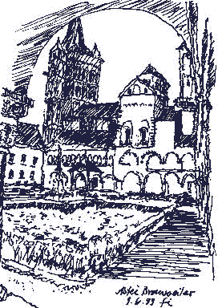

[🠔 Zur Übersicht: Fassade & Anstrich](22bausto.md)  
# Fassadeninstandsetzung 7: Grundprobleme zu dichter und zu fester Anstriche
**Erneuerung oder Erhalt von Altputzen und Anstrichen.**  
_von Konrad Fischer_

 

## Altbautaugliche Verfahren und Baustoffe 
2. Erneuerung oder Erhalt von Altputzen und Anstrichen

### Fassadeninstandsetzung:

## Putz, WDVS, Natursteinfestigung und Anstrich
Probleme und Lösungen 7

Die Grundprobleme zu dichter und zu fester Anstriche mit trocknungsblockierender und wasserstauender "Nebenwirkung" konnten damit aber nicht gelöst werden. Der Dampfdiffusionstransport steht ja bekanntlich zum Kapillartransport im Bauwerk wie 1:1000. Man könnnte fast sagen, daß die Dampfdiffusion nur eine Einbahmstaraße ist - Kondensat ins Bauwerk. Daß alle kapillarblockierenden Anstrichsysteme die Karbonatisierung der frischen Kalkmörtel sozusagen abstoppen und dann die schon fest karbonatisierte äußere Putzschicht landkartenmäßig auf- und von dem weicheren Unterputz abreißt, ist ja durch viele Schadensfälle bekannt. Wasser- und Frostdruck sowie Temperaturspannungen sind hierbei die Zerstörungsmechanismen, die durch die vom abbindenden Kali-Wasserglas in den Putzgrund abgegeben Pottasche (ausblühfähiges Schadsalz Kaliumkarbonat) noch verstärkt werden. 

Kapillarsperrend-moderne Farbsysteme stören außerdem die Selbstheilungsfähigkeit des alternden Luftkalkmörtels, sich durch Umkristallisation freier Kalkhydrate vor auftretenden Verletzungen wie Risse oder übermäßige Feuchte mittels Nachversinterung zu schützen. Auch seine Nachkarbonatisierung ist dann eingeschränkt. Das Vertrauen in wasserabweisende und gefestigte Beschichtungen ist schon bei nur mittelfristiger Betrachtung und bei allen (!) Malgründen nicht angebracht. Krakelierende überfeste Krusten bilden bei "modernen" Schichtbildnern schnell ein Kapillarrißsystem, aus dem das eingesaugte Regenwasser und das täglich eindringende Kondensat über die nun 99,9%ig kapillar abgedichtete Fassadenfläche nicht mehr entrinnen kann. 

Zum schädlichen Einsatz von Wasserglas als Bindemittel auf historischen Oberflächen berichtet der Konservator in den Restaurierungswerkstätten des Bayerischen Landesamtes für Denkmalpflege, **Jürgen Pursche** :

_"Bei undifferenzierter Anwendung von Wasserglas ohne Kenntnisse der Beschaffenheit von Putz und Malerei erfüllt dieses Bindemittel so ziemlich alle Kriterien unsachgemäßer Konservierungsversuche._

_Salzbildung, unpassende Glanzbildung verbunden mit der Entstehung übermäßig harter Oberflächen, die zur Zerstörung von Putz und Malerei führen, sind die meist alle Befürchtungen übertreffenden Folgen."_ [2]

Derartige Erfahrung lehrt auch das Beispiel der Bonner Wallfahrtskirche auf dem Kreuzberg:

_" [...] Durch die damals vom zuständigen Amtsrestaurator geforderte Behandlung der [Retuschen/Ergänzungen der barocken Fresko-] Malerei mit Silikatfixativ vergraute die Malereioberfläche stark. Diesen negativen Effekt versuchte man vergebens mit einer Nachfixierung auf wässriger Basis (Primal AC 33) zu beheben._

_Heute, nach der Restaurierung der Gewölbemalerei im Kirchenschiff, ist der verfälschende Bruch zwischen der vergrauten Malerei im Chor und der intensiven Farbigkeit des freigelegten Originals im Schiff besonders auffällig._

_[...] Abgesehen von ihrer [der wasserverglasten] unbefriedigenden Art und dem grauen, stellenweise in glänzenden Streifen erstarrten Fixativ-Schleier an den Wänden wird man wegen der nicht zu rettenden Retuschen im Gewölbe sehr bald eine neue Restaurierung im Chor durchführen müssen."_ [3]

**Monika Tontsch** brandmarkt die restauratorisch-denkmalamtlichen Restaurierungspfuschereien und Wasserglaskriminalitäten - die in diverser Form leider auch heute noch fast überall fröhliche Urständ feiern dürfen - in einer Online-Rezension wie folgt:

_"Christian Hohe (1798-1868), Universitätszeichenlehrer in Bonn ... restaurierte 1862 die Gemälde in Brauweiler. Er nahm dabei nicht nur Ergänzungen vor, sondern er "tränkte die noch vorhandene Malerei mit wachs- oder paraffinhaltigen ätherischen Ölen" (275). Schon bald nach dem Abschluss dieser Maßnahmen gab es neben Lob ein vernichtendes Urteil durch den Politiker und Kunstkenner August Reichensperger, der die Malerei nach der Restaurierung durch Hohe für "künstlerisch vernichtet" erklärte (275). 

Schließlich erfolgte 1958/59 eine "Entrestaurierung" durch den Restaurator Wolfhart Glaise, die zunächst von den verantwortlichen Denkmalpflegern und Fachkollegen allgemein begrüßt wurde. In den nachfolgenden Jahrzehnten wurden aber umfangreiche konservatorische Probleme sichtbar, u. a. die Fixierung der Malereien durch Kali-Wasserglas mit äußerst gravierenden Schadensbildern. Die Malereien, die heute als "gewaltiges Fragment" gelten müssen, wurden von Glaise auch nicht durchgehend fachgerecht freigelegt, wie Bathe im Einzelnen nachweist (289)."_ (aus[Rezension von: Uwe Bathe: Der romanische Kapitelsaal in Brauweiler](http://www.sehepunkte.de/2005/07/7478.html))

**Gerhard Klotz-Warisloher** vom Bayer. Landesamt für Denkmalpflege erteilt den für die Bestandserhaltung ungeeigneten modernen Anstrichsystemen ebenfalls eine klare Absage [6]:

_"Anstrichsysteme auf Silikat- bzw. Dispersionssilikatbasis zeichnen sich bei entsprechend tragfähigen Gründen durch eine sehr hohe Widerstandsfähigkeit aus. Da Altputze die damit verbundenen Tragfähigkeitsansprüche nicht immer in ausreichendem Maße erfüllen, sind solche modernen Beschichtungssysteme in diesen Fällen nicht unproblematisch._

_Lokale Überfestigungen und Schalenbildungen können nicht immer zweifelsfrei ausgeschlossen werden. Mangelnde Reversibilität sowie eine geringe Reparaturfreundlichkeit müssen als weitere Kennzeichen bedacht werden. Bei nicht vollständig carbonatisierten Mörteln besteht zudem die Gefahr, daß Anstrichsysteme auf Silikatbasis gelieren."_

**Frau Prof. Dr. E. Jägers,** Köln, brandmarkt das Schadsalzproblem (Pottasche) bei Wasserglasverwendung wie folgt [7]:

_"**4. Untersuchung von Konservierungsmittel für die Wandmalereien 
**Nicht selten haben Reinigungs- und Festigungsmittel früherer Restaurierungsmaßnahmen zu Schäden an den Wandmalereien geführt. Beispiele hierfür sind u.a. Pigmentumwandlungen nach einer Reinigung mit Säuren oder starke Salzschäden nach Wasserglasfestigungen. [...]"_

Auch **Gerd Bauer** , vom Rheinischen Amt für Denkmalpflege, bezeugt zu den Eigenschaften der Silikatfarbe u.a. "Bautenschutzmitteln" im Bestand die weitverbreitete Praxiserfahrung [8]:

_"**[Köln, Rheinkassel, St. Amandus, Mineralfarbenanstrich auf Zementschlämme und der historischen Trachytsteinfassade 1981] 
**Als Anstrich verarbeitete man Mineralfarbe der Firma Keim, System Purkristallat®, nach Herstellervorschrift. Die Farben wurden mit der Bürste aufgebracht. Anschließend erfolgte zur Verringerung der Wasseraufnahme eine Hydrophobierung mit Keim-Lotexan-Bautenschutz._

_Während der Putzaufbau und die Mineralfarbenfassung im einsehbaren Bereich der Wandflächen und Architekturgliederung über den Beobachtungszeitraum bis heute intakt erscheinen, sich lediglich an der Westseite des Turmes im Putzgefüge eine leichte Rissbildung zeigt, ohne daß hieraus resultierende Schäden erkennbar sind, traten jedoch schon nach kurzer Zeit am ungeschlämmten, im Mineralfarbensystem Purkristallat ® gefaßten Trachytsockel ein für den Trachyt typisches Schadensbild auf, ein Abschälen der Gesteinsoberfläche von einem dahinter stark gestörten Gesteinsgefüge. _

_Erheblich verstärkt wurde diese Schadensbildung offensichtlich durch die als Verschleiß- und Schutzschicht aufgebrachte verdichtende und wohl auch absperrende Mineralfarbenbeschichtung mit der hydrophobierenden Schlußbehandlung. Beobachtungen an offen belassenen Trachytsockeln vergleichbarer Objekte zeigen diese Schadensanhäufung nicht._

_[...]_

**_[Brauweiler, ehem. Abteikirche St. Nikolaus, Fassade Tuffsteinmauerwerk, behandelt ab 1984 mit CERESIT-Streichgrund ®, verdünnt 1:4 mit Wasser, darauf Trasskalkschlämme] 
_**_Der Anstrich dieser Schlämme erfolgte im System Purkristallat ® der Firma Keim mit zusätzlicher Hydrophobierung. Derzeit finden sich erhebliche Schäden in einigen Bereichen der Schlämme und des Mineralfarbenaufbaus. Durch Überspannung der Beschichtung, eventuell begünstigt auch durch die Hydrophobierung, zeigen sich in einigen Partien Craquellierungen und, als verstärkte Schadensbildung hieraus resultierend, Abplatzungen der Schlämmen und Anstrichschichten."_

St. Nikolaus in einer meiner Skizzen:

Ja was sagen nun die "Silikat-Bauchemiker" zu den hervorragenden Überraschungseigenschaften von Mineralfarben? Wie steht es um die vielgepriesene Dauerstabilität auf Bestandsuntergründen? Nach wie vor empfiehlt man derartige Sanierbaustoffe als das Gelbe vom Ei. Weil sie vielleicht so billig sind? Oder weil man sich gerne gegen besseres Wissen Falsches empfiehlt? 

Daß die ausgefuchsten Handwerker aus Geldgier aber auch aus mieser Erfahrung die Silikatbrühen gegen die Herstellervorschriften verdünnen, um weniger Spannung in die Oberflächenkrusten reinzubringen, dürfte allseits bekannt sein. Auch, daß im Schadensfall, wenn sich die verglaste Kruste vom desolat überbeanspruchten und oft schon silikatisch vorgeschädigten Malgrund abschält, von der Staatsbau- oder Kirchbaubehörde (dort wird ja seit 100 Jahren am allermeisten wasserverglast) und die das auch schon über 100 Jahre gutheißende Denkmalpflege im Verbund mit dem Produzentenvertreter (der sich oft "Berater" schimpft) "hin und wieder" die Schuld auf den Handwerker/Restaurator/Kirchenmaler geschoben wird, zeigen wenigstens die mir bekannten Schadensfälle. Die die Beteiligten regelmäßig verschweigen und nicht in der einschlägigen Fachpresse publizieren - wie es sich unter wahren und anständigen Denkmalpflegern und Beamten doch zur allgemeinen Belehrung und künftigen Fassadenrettung gehören würde. Und nicht immer rettet dann ein tatsächlich sachverständiger Gutachter den tatsächlich Unschuldigen - den braven Handwerksmann - vor der herstelleroptimierten Wasserglasverschwörung, die sehr vielleicht auch "Gutachter" an sich binden konnte.

Weiter: **[Kapitel 5](22bau5.md) **
