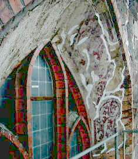

[🠔 Zur Übersicht: Fassade & Anstrich](22bausto.md)  
# Fassadeninstandsetzung 8: Denkmalpflege in Bayern
**Erneuerung oder Erhalt von Altputzen und Anstrichen.**  
_von Konrad Fischer • aktualisiert 31.03.2009_

 

## Altbautaugliche Verfahren und Baustoffe 
2. Erneuerung oder Erhalt von Altputzen und Anstrichen

### Fassadeninstandsetzung:

## Putz, WDVS, Natursteinfestigung und Anstrich
Probleme und Lösungen 8

**(aktualisiert 31.03.09)** 

Ganz anders gehen hier die Uhren in Bayern: Hier wird in aller Offenherzigkeit publiziert, was Probleme macht:

In "[Ehem. Klosterkirche Rott am Inn, Dokumentation der Restaurierung 1994 - 2002](http://www.rottinn.de/R/Klosterkirche/Buch_Hochbauamt.pdf)", Staatliches Hochbauamt Rosenheim/Kunstverlag Josef Fink, Lindenberg im Allgäu, 2002, schreibt der Baubeamte Albrecht Grundmann in: "Die Restaurierung der ehem. Klosterkirche als staatliche Bauaufgabe" auf S.33:

_"Der Anstrich wurde mit Mineralfarben ausgeführt, was der früheren Kalkfarbtechnik nahe kommt, jedoch sehr viel dauerhafter ist. Aufgrund unerwarteter Haftungsprobleme am barocken Altputz verzögerte sich allerdings die Fertigstellung der Fassadensanierung bis 1999."_

Und danach der Denkmalpfleger Dr. Christian Baur: "Zur Restaurierung der ehem. Klosterkirche" auf S. 68:

_"Diese hervorragende Farbigkeit und Gliederung aus der Zeit Johann Michael Fischers wurde rekonstruiert, wobei es im Bestreben, die bauzeitlichen Putze möglichst großflächig zu erhalten, zu technischen Problemen und der Notwendigkeit von Korrekturen kam."_

Wenn wir noch diese amtlichen Verlautbarungen noch etwas genauer nachfragen, um diese kryptischen Andeutungen etwas zu enträtseln und dem Normalsterblichen zugänglicher zu machen, kann man beispielsweise (unter vielem anderen, was hier weggelassen werden muß) in Erfahrung bringen, daß halt unbedingt wie immer und schon wieder mal pure Wasserglasfarbe auf den durch ebendiese schon vorgeschädigten Barockputz draufgenudelt werden mußte. Diese brachte dann - für uns bestimmt nicht überraschend - das Faß zum Überlaufen: überhart und überdicht sprangen nach der ersten Bewinterung die silikatisierten Quadratmeterschollen von dem abmehlenden frostgeplagten historischen Malgrund. 

Nachdem es dann sogar gutachterlich festgestellt wurde, daß der verdächtigte Ausführende für diesen planerischen Bocksmist, der alle seit über 100 Jahren vorliegende zerstörerischen Silikaterfahrungen auf Kalkuntergrund mißachtete, nun wirklich nichts konnte und sehr streng gem. dem planungsbeteiligten Hersteller und seinen Verarbeitungsvorschriften vorging, kam es zur wohl jämmerlichsten Entscheidung in diesem Trauerspiel: Die teuer neu beschmierten und nun noch mehr geschädigten historischen Fassadenputze wurden bis auf ein paar Reststückli abgeklöppert, auf Steuerzahlers Kosten neu in Kalkzement (auf kalkgemauertem Mauerwerk!! Ein neuer Gipfel der Planungskunst!) verputzt und dann mit einer kapillarblockierenden Dispersionssilikatfarbe (!!!) eingetunkt. Denkmalpflege unserer Generation - nach alter Väter Sitte und mit unendlich anschwellendem Lobpreis der politischen Grußworte bedacht - nachzulesen auf dem o.g. Link im Original! Wo doch die moderne Restaurierungskunst so "sehr viel dauerhafter" ist, als was unsere Vorfahren - in diesem Fall der Barockarchitekt Johann Michael Fischer - draufhatten. Weitere Details auf Anfrage.

Daß ausgerechnet auch eine denkmalgeschützte Ikone der Bauhausarchitektur, die Gropius-Villa Auerbach in Jena, ursprünglich ausgemalt nach Farbkonzept von Alfred Arndt mit allerfeinsten Leimfarben, nun mit Dispersions-Silikatfarben (und mit Dampfsperren und sog. [Wärmedämmung ](213baust.md)im Dach!) bei der aktuellen Reko vergewaltigt wurde, läßt bezüglich der materialunkundigen Denkmalpflegepraxis tief blicken. Links: [Häuser in Jena/Villa Auerbach- TLZ](http://www.thur.de/org/tlz/haus36.html) [Villa Auerbach](http://www.docomomo.de/bauten/jena.htm)

Nun behauptet man ja immer, daß sich Silikatfarben seit über 100 Jahren bewährt haben. Wie das praktisch aussieht, kann man an den abbröselnden Fenstergewände-Putzfragmenten (gesichert durch Randanböschung mit Luftkalkmörtel 11/2000) der Marienkirche in Berlin am Alex anschauen. 

Sie erhielten ca. 1895 eine Silikatfassung auf Kalkzementputz. Die verbliebenen Malschichtreste sind auf die rechte Seite beschränkt. Soviel zur Frage der Dauerstabilität. Nimmt man deswegen neuerdings "Kalk"-Farben (Volldeklaration immer abfragen!) ins Programm? Der vorsichtige Restaurator schmeißt in seinen Kalk doch eh Binder von Primal bis XY-Plex bis zum Abwinken. Sonst hälts doch net. Der geleimte Denkmalpfleger freut sich auf der Kalkbaustelle trotzdem über die blauen Fässer mit 1000jährig holzverkohltem Kalksumpf.

Weiter: **[Kapitel 5](22bau5.md) **
