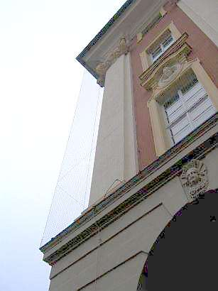
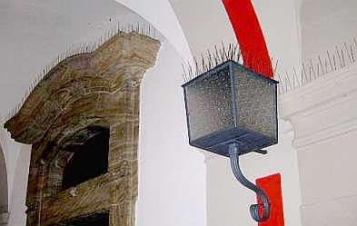

[🠔 Zur Übersicht: Fassade & Anstrich](22bausto.md)  
# Fassadeninstandsetzung 9: Sanierputzprobleme und Taubenabwehr
**Erneuerung oder Erhalt von Altputzen und Anstrichen.**  
_von Konrad Fischer • aktualisiert 31.03.2009_

 

## Altbautaugliche Verfahren und Baustoffe 
2. Erneuerung oder Erhalt von Altputzen und Anstrichen

### Fassadeninstandsetzung:

## Putz, WDVS, Natursteinfestigung und Anstrich
Probleme und Lösungen 9

**(aktualisiert 31.03.09)** 

Selbst auf "modernen" Putzen funktionieren Wasserglas-/Silikatfarben also nicht ohne Probleme, wie die Auszüge folgender Schadensfallbeschreibung aus DAB 11/99 aufzeigen:

_"Claus Arendt, Jörg Seele 
**Sanierputz auf historischem Mauerwerk oder Genese eines unnötigen Schadens**_

_[...] Die überwiegende Erdgeschossfläche [des denkmalgeschützten Klostergutshofes] enthielt früher Stallungen; dem entsprechend stark zeigen sich Feuchte-Salz-Schäden an den Fassaden: die Salzverseuchung hat zwischenzeitlich in einigen Bereichen sogar die Traufe erreicht. Ein Gutachten belegt diesen Sachverhalt, zeigt die Größe der Feuchte- und Salzbelastung sowie deren Verteilung auf, "deckt auf", dass ein großer Bereich der nach Augenschein vermuteten alten Farbfassung auf Zementmörtel liegt und damit wesentlich jüngeren Ursprungs ist und empfiehlt für eine deutlich längere Standzeit die Anwendung eines Sanierputzsystems nach WTA-Merkblatt 2-2-91; diesen Fakten beugten sich die Beteiligten [die eigentlich Kalkputze und Kalkanstrich wünschten]._

_So werden im Sommer drei große Fassadenflächen unter Vorgabe der gutachterlichen Empfehlungen verputzt und teilweise mit Keim-Purkristallat gestrichen._

_Die Putzarbeiten sind insgesamt noch nicht abgeschlossen, da zeigen sich bereits Schäden im Anstrich, die rasch zu handtellergroßen Abplatzungen in einer Stärke von 2 bis 3 mm führen [...]. [...] Der Architekt exkulpiert sich umgehend, es sei alles nach Gutachten ausgeschrieben und ausgeführt worden._

_Der Schaden selbst benötigt an sich keinerlei Untersuchung: die aufgeschüsselten und abgesprengten Teile zeigen eine sehr harte, für dieses Anstrichsystem typische Oberfläche ohne jeglichen weiteren Riss; der darunter liegende Putzanteil ist weich und lässt sich mit den Fingern abreiben._

_Gleiches ist in unterschiedlicher Tiefe von einigen Millimetern auch noch in jenem Putzbereich möglich, der durch die Absprengungen "freigelegt" wurde. Die unter dieser oberen Putzschicht liegende erste Putzschicht (Porengrundputz) zeigt eine (zumindest nach Kratzen) ausreichende Oberflächenfestigkeit._

_Dieser Porengrundputz liegt an einer der drei bearbeiteten Fassaden noch frei, da man dort auf Grund der aufgetretenen Schäden die Fertigstellung unterbrochen hatte. Dieser Unterputz zeigt ein deutliches, flächiges Craquelé als weitmaschiges Netz; ein Benässen der Oberfläche bringt noch weitere feine Risse zutage._

_So einfach der Schaden erklärbar war - für die Putzfestigkeit zu spannungsreicher Anstrich -, so schwierig ist die belegte Ursachenfindung [...]. Fast alle - allerdings aus Kostengründen jeweils nur in wenigen Proben - ermittelten Werte [der Sanierputzeigenschaften] liegen noch innerhalb der Anforderungen, teilweise allerdings hart an der Grenze. Besonders auffallend ist der hohe Porenanteil des Unterputzes von annähernd 60%, doch liegt auch er mit Ausnahme von zwei Einzelproben noch innerhalb des Zulässigen [...]; die Werte der Rohdichte des Oberputzes sind allerdings recht gering._

_Nicht eingehalten sind allerdings die vorgeschriebenen Werte für die Druckfestigkeit [...]. [Es] finden sich Zementklinkerphasen, die nur dann vorhanden sein können, wenn zu wenig an dem für das Abbinden der oberen Putzlage nötigen Wasser vorhanden war. Es ist dies nicht nur die Erklärung für die verminderte Druckfestigkeit, da ein Bindemittel, das chemisch nicht reagieren konnte, selbstverständlich auch keine Wirkung ausübt, sondern es weist dies eindeutig auf einen Verarbeitungsfehler hin, lässt aber offen, auf welche Weise dieses Fehlen notwendigen Wassers zustande kam; es gibt hier drei Möglichkeiten:_

_- es wurde beim Mischen zu wenig Anmachwasser zugegeben; 
- der Unterputz war zu stark saugend; 
- das Anmachwasser konnte zu rasch verdunsten._

_Der Gutachter schließt eine zu geringe Menge Anmachwasser aus praktischen Erwägungen aus: Sanierputze sind Mörtel, die sich nur dann gut [...] verarbeiten lassen, wenn das Mischungsverhältnis verhältnismäßig eng eingehalten wird; andernfalls neigt das Material wegen seines hohen Porenanteils bei einem zu hohen Wassergehalt zum Abgleiten; wird zu wenig Wasser zugegeben, verringert sich nicht nur deutlich die Haftung, auch die weitere Verarbeitung wird spürbar verschlechtert._

_Eine sehr hohe Saugfähigkeit der ersten Putzlage, des Grundporenputzes, ist trotz dessen hydrophober Einstellung wegen seiner extremen Porigkeit denkbar und wurde anhand einer Untersuchung auch festgestellt [...]._

_Ein zu rascher Wasserentzug ist ebenfalls denkbar und nach der fehlenden Abplanung [der Frischmörtelschicht] auch wahrscheinlich._

_Für die weitere Beurteilung des Schadens und auch dessen Verursacher bleibt es aber unerheblich, ob alle drei der genannten Möglichkeiten, und wenn ja, in welchem Verhältnis zueinander zu berücksichtigen sind, oder nur zwei oder gar nur einer, denn alle drei sind zweifelsfrei Verarbeitungsfehler beim Aufbringen des Sanierputzsystems und betreffen damit die ausführende Firma sowie den bauleitenden Architekten, da dieser Verarbeitungsfehler über einen längeren Zeitraum wirksam war und deshalb bei entsprechend sorgfältiger Bauleitung auch rasch erkannt und abgestellt hätte werden können._

_Zusätzlich zeigen aber die Unterlagen der wöchentlichen Baustellenbesprechung sowie einiger Schriftverkehr, der von den ausführenden Firmen zur Verfügung gestellt wurde, dass auch die Hersteller des Sanierputzsystems wie des Farbsystems es sich zu leicht machen, zumal mindestens die ausführende Putzfirma ganz offensichtlich keine umfassende Erfahrung mit Sanierputzen besitzt._

_Der "Kundenberater" der Sanierputzfirma wies - zumindest schriftlich - nicht darauf hin, dass der Putzuntergrund [...] in Material und Ausführung ausdrücklich jenem Putzgrund widersprechen, wie ihn die schriftlichen Empfehlungen des Sanierputzherstellers verlangen: "Für Denkmalobjekte wird das Anlegen von Musterflächen (ca. 1 m2) empfohlen" und unter "Einsatzgebiete":_

_" ... anwendbar auf allen mineralischen putzgeeigneten Wandbaustoffen und Untergründen, wie z.B. Mauerwerk aus Baustoffen mit hydraulisch erhärtenden Bindemitteln nach DIN ... ",_

_wozu diese Mauerwerk [mit historischem Luftkalkmörtel] mit Sicherheit nicht zählt [...]._

_Ebenso fehlte der betonte Hinweis darauf, dass zumindest ein Sanierputz dieser hohen Porigkeit, die im Vergleich mit anderen Sanierputzsystemen verhältnismäßig unüblich ist [...], einer besonderen Sorgfalt auch im zeitlichen Ablauf der einzelnen Arbeitsschritte bedarf. Hochporige Sanierputzsysteme bieten je Gebindeeinheit eine größere Anwendungsfläche als geringer porige, was sicherlich zu ihrer Beliebtheit bei den Anwendern beiträgt._

_Der Berater der Farbenfirma gab der Malerfirma sogar eine schriftliche Empfehlung, die den gedruckten Anwendungsempfehlungen allerdings widerspricht: empfohlen wurde eine Verdünnung zumindest des letzten Anstrichs, obwohl nach diesen schriftlichen Verarbeitungshinweisen ausdrücklich ein verdünnen untersagt wird: " ... Farben nicht mit Wasser zu verdünnen". Der Grund für dieses Verbot ist die Quintessenz jahrzehntelanger Erfahrungen, nach denen dieses bewährte Erzeugnis zu Farbabläufern neigt, wenn Füllstoff (Pigment) und Kaliumsilikat (Bindemittel) nicht in einem ausgewogenen [...] Verhältnis zueinander stehen._

_Bei jedem Besuch an diesen geschädigten Fassaden wurde deutlich, dass der Schaden rasch fortschreitet [...]. ... Schadensursache: mürber Anstrichträger und Anstrich mit hoher Eigenspannung: Bei zusätzlicher thermischer - in geringem Maß auch hygrischer - Belastung kann sich dieser Schaden so lange einstellen, bis sich tatsächlich diese Bauteilschicht durch Risse insgesamt endlich völlig "entspannt" hat [...]._

_[...] was ohne nähere Betrachtung bisher verborgen blieb: der Putz zeigt insgesamt derartig viele Risse und Risschen mit ebenfalls bereits wieder zunehmender Schalenbildung, dass keine Rede von einem partiellen Ausbessern sein kann: zumindest die zweite Lage, also der Oberputz, ist in den gesamten Flächen abzunehmen und zwar auch dort, wo bisher gar nicht über diesen Schaden gesprochen wurde [...]."_

So weit, so schlecht. Freilich 'halten' auf wasserabweisenden Sperrputzen wie dem ['Sanierputz'](2sanipuz.md) nur aufklebende Anstriche wie Dispersionssilikatanstrich, Siliconharzfarbe oder andere Dispersionsbeschichtungen. Die Seltsamkeiten rund um die Sanierung der Sanierung sparen wir uns lieber. Merke:

 * Nicht jeder Planer kennt sich mit den Randbedingungen am historischen Bauwerk aus, voraussichtlich auch nicht jeder Gutachter. Link: [Abstoßendes Beispiel](10hoai22.md)
 * Nicht jede Firma, deren "günstiges" Angebot mangels guter [Ausschreibungstechnik ](9pbs.md)bzw. ausreichender fachtechnischer Prüfung bzw. wegen korruptiver Einflußnahme in das LV bzw. den Vergabevorgang den Zuschlag erhält, hat eine Ahnung vom eigentlich erforderlichen Leistungsumfang.
 * Nicht jeder Fachberater von Baustoff-Herstellern blickt bis zum Ende durch. Link: [Abstoßendes Beispiel](10hoai22.md#ausschreibungsschwindel)
 * Nicht jeder Bauleiter ist für die Überwachung von Sanierungsarbeiten geeignet.
 * Nicht jeder Baustoff ist für den Anwendungsfall "Altbau" geeignet, bzw. ohne besonderste Fachkenntnis und Mühsal verarbeitbar.
 * Nicht jedes Technische Merkblatt gibt [eindeutig richtige Hinweise zu den gegebenen Risikobereichen](2volldek.md).

Wer heute noch mit wasserglashaltigen Anstrichsystemen auf historischen oder in historischer Machart hergestellten Fassaden und Raumschalen dauerhaft gute Ergebnisse erzielen möchte, hat also den praktisch vorhandenen Forschungsstand/Erfahrungsschatz nicht wahrgenommen bzw. glaubt den seit über 100 Jahren "überzeugend" auftretenden Produktvertretern mehr als der Wirklichkeit. 

**[Dispersions-Silikatfarbschadensfälle mit sachverständigen Hinweisen zur Schadensbegrenzung und -einordnung](11erhin3.md)**

Wenn man weiß, daß von "Wasserglas-Seite" inzwischen - bei gleichzeitiger Entwicklung kalkgebundener Farbsysteme im Ausland (Schweiz) - ["Angriffe" gegen die reine Kalktechnik](2kalk.md) gestartet werden (Einflußnahme auf Kalkmörtelproduzenten, voreingenommene (Indienstnahme industrieabhängiger "[Sachverständiger](3gutacht.md)") Publikation von Anwendungsfehlern wie klimatisch zu späte Fassadenarbeiten mit nachfolgenden Putzablösungen oder Fehlanwendungen von Kalkmörtel auf sperrendem Sanierputz bzw. trocknungsblockierenden Kunstharz-Kalkfarben), kann man spüren, daß in der Branche ein Umdenken einsetzt.

[1] I. Hammer: _Zur Nachhaltigkeit mineralischer Beschichtung von Architekturoberflächen, Erfahrungen mit Kaliwasserglas und Kalk in Österreich_ , in: Mineralfarben, Beiträge zur Geschichte und Restaurierung von Fassadenmalereien und Anstrichen, Hochschulverlag, Zürich 1998

[2] J. Pursche: _Zur Geschichte restauratorischer Eingriffe an Wandmalereien, Zum Problem der Entrestaurierung_ , in: das bauzentrum, Fachzeitschrift für Architekten und Bauingenieure, Heft 8/98 - Denkmalpflege

[3] I. Bentchev: _Die Wand- und Gewölbemalereien in der Kirche, im Heiligen Grab und in der Heiligen Stiege auf dem Kreuzberg, Zur Technik und Geschichte der Restaurierungen_ , in: _Die Wallfahrtskirche auf dem Kreuzberg in Bonn_ , Landschaftsverband Rheinland, Rheinisches Amt für Denkmalpflege, Arbeitsheft 35 der rheinischen Denkmalpflege, Köln 1996

[4] [J. Osswald](http://www.institut-osswald.de): _Neue Erkenntnisse über das Wasserglas als Bindemittel, Struktur und chemische Prozesse_ , in: _Mineralfarben, Beiträge zur Geschichte und Restaurierung von Fassadenmalereien und Anstrichen_ , Hochschulverlag, Zürich 1998

[5] [J. Osswald](http://www.institut-osswald.de): _Wasser geht - Gel kommt. Neue Erkenntnisse über die Abbindereaktionen in Silikatfarben_ , in: Bautenschutz + Bausanierung 3/98

[6] G. Klotz-Warisloher: _Putzergänzung - Hinweise zur Ausführung am Beispiel der Südscheune in Thierhaupten,_ in: _Reparatur in der Baudenkmalpflege_ , Arbeitsheft 101 des Bayerischen Landesamtes für Denkmalpflege

[7] E. Jägers: _Infrarotspektroskopische Untersuchungen von Wandmalereien und Polychromie auf Stein_ , in: Internationale Zeitschrift für Bauinstandsetzen und Baudenkmalpflege, 2/99

[8] Gerd Bauer: _Denkmalpflegerische Aufgabenstellung in der Konservierung von Objekten aus Stein und Wandmalereien_ , in: Elisabeth Jägers (Hrsg.): _Dispergiertes Weisskalkhydrat für die Restaurierung und Denkmalpflege, Altes Bindemittel - Neue Möglichkeiten_ , Petersberg 2000

Fachinfo zur Putzsanierung: [Architektur und Bau](http://www.cbyte.de/architek.html)

[Bauschäden an Kunstharzmörteln](7wdvs13.md#aus einem werbesprospekt)

[Probleme bei der Anwendung von Kalkprodukten](2kalkfel.md)

Sonderthema: Taubenabwehr, Taubenvergrämung und Taubenkampf

Zum Abschluß noch ein schönes Beispiel aus Franken, wie ein kluges Stadtbauamt keine Kosten und Mühen scheut, als erstes (und vorerst einziges) Haus am Platze sein denkmalgeschütztes Silikatfassädlein und auch die Dinge im offenen Arkadengang vor den bösen Tauben - auch Luftratten genannt - schützt. Da bleibt einem ja die Taubenscheiße im Maul stecken. Und das denkmalrechtlich einwandfreie Objektverschandeln findet gewiß Nachahmer! Obs nicht ein supervergrämender Kunstrabe auch getan hätte, wenn man schon alle Betrachter zum quietschvergnügten Belächeln so dermaßen gutgemeinten Baubeamtentums bringen will? Und alle Tauben zum Herzinfarkt vor Schreck? Wo bleibt da der Tierschutz und Landesverein für Vogelschutz? Na gut, Arbeitsplätrze wird das freilich sichern. Wahrscheinlich in Indien.

+

**Surftipps für Dialektiker 
Gegenteilige/Andere/Zusätzliche Informationsquellen - Bilden Sie sich eine eigene Meinung: 
**[BAUHERR.DE Farben Lacke Farbstoffe Pigmente Lösemittel Kalkfarben Kunststoffdispersionsfarben Silikatfarben Leimfarben Anstrichstoffe Holzschutzmittel Naturharz-Dispersionfarben](http://www.bauherr.de/baustoffe/farbe_lack.htm) <> [Bundesverband der Deutschen Kalkindustrie e.V. : Mitglieder des Bundesverbandes der Deutschen Kalkindustrie e.V.](http://www.kalk.de/static/50.htm) <> [Gütegemeinschaft Kalkstein, Kalk und Mörtel e.V.](http://www.gueteschutz.de/go.htm) <> [Kalkputze in der Baudenkmalpflege und Bausanierung - Forschungsbericht](http://www.uni-muenster.de/Chemie/MI/people/Conny/PUTZ.HTM) <> [KALKMÖRTELSYSTEME IN DER BAUDENKMALPFLEGE UND BAUSANIERUNG](http://mindepos.bg.tu-berlin.de/GEO98/abstracts/PF9.31-01.html) <> [putzer.de - Was ist Grauputz?](http://www.putzer.de/innen/grau.htm) <> [Kalkputzen: Professionelle Putzsanierung - heimwerker.de](http://www.heimwerkerwelt.com/beratung/abdichten/professionelle_putzsanierung/kalkputzen.htm) <> [Tips & Ratschläge zum Thema Putz - SV HLADIK](http://www.hladik.at/Tipps_und_Ratschlaege.htm)

**[Seite 1](22bausto.md) [2](22bau2.md) [3](22bau3.md) [4](22bau4.md) [5](22bau5.md) [6](22bau6.md) [7](22bau7.md) [8](22bau8.md) **9****
