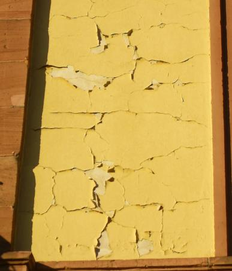
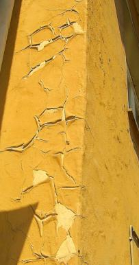

[🠔 Zur Übersicht: Altbau Restaurierung](20bausto.md)  
# Fassadeninstandsetzung: Putz, WDVS und Anstrich
**Erneuerung oder Erhalt von Altputzen und Alt-Anstrichen.**  
_von Konrad Fischer_

## Altbautaugliche Verfahren und Baustoffe 
2. Erneuerung oder Erhalt von Altputzen und Alt-Anstrichen

### Fassadeninstandsetzung: Putz, WDVS und Anstrich - Probleme und Lösungen 1

> [!abstract]+ Kapitelübersicht: Fassade & Anstrich  
> 1. **Fassadeninstandsetzung: Putz, WDVS und Anstrich**
> 2. [Fassadeninstandsetzung 2: Bindemittelreiche Werktrockenmörtel](22bau2.md)
> 3. [Fassadeninstandsetzung 3: Ein Potpourri der staatlichen Denkmalpflege ...](22bau3.md)
> 4. [Fassadeninstandsetzung 4: Schäden durch Wasserglas und Silikatputz](22bau4.md)
> 5. [Fassadeninstandsetzung 5: Materialimmanente Schadensrisiken](22bau5.md)
> 6. [Fassadeninstandsetzung 6: Silikatfarben Probleme](22bau6.md)
> 7. [Fassadeninstandsetzung 7: Grundprobleme zu dichter und zu fester Anstriche](22bau7.md)
> 8. [Fassadeninstandsetzung 8: Denkmalpflege in Bayern](22bau8.md)
> 9. [Fassadeninstandsetzung 9: Sanierputzprobleme und Taubenabwehr](22bau9.md)
> 10. [Hydrophobierte oder gar wärmedämmende Kunstharzfarben: Einführung](2lotus.md)
> 11. [Die erhaltende Instandsetzung von historischen Putzfassaden](6prputz.md)
> 12. [Die malträtierte Haut: Kalk vs. Silikat in der Denkmalpflege](2ivo.md)

Hinweis: Da es hier um die Praxis bei Altbau und Denkmalpflege geht, lassen sich baustoffliche Verweise und Zitate nicht immer ganz vermeiden. Es sind damit **keine** Empfehlungen oder Verdikte ausgesprochen. Für altbauverträgliche Produkte sollte Voraussetzung sein: Eignungsnachweis und qualifizierte Volldeklaration im Sinne des hier abzurufenden [Vorschlags](2volldek.md). 

**Inhaltsverzeichnis Baustoffkapitel:** 
[Einführung zum Problemkreis "Modernes Bauen"](20bausto.md#einfã¼hrung) 
[Einige Tips zur Produktvermarktung](10hoai22.md) - Ihre raffinierten (von Raffen?) Methoden, Tricks und Betrugsmanöver 
[Zusammenfassung](20bausto.md#zusammenfassung) 
Die anderen Kapitel: [0. Aktuelles](2baustof.md#aktuelles) 
[1. Gibt es "aufsteigende Feuchte"?](2aufstfe.md) 
[2. Erneuerung oder Erhalt von Altputzen](22bausto.md) 
[3. Erneuerung oder Erhalt von Altfenstern](23bausto.md) 
[4. Geeignete und ungeeignete Farbsysteme auf Holzuntergründen im Innen- und Außenbereich](23bau08.md) 
[4a. Rostschutzanstrich](23bau10.md#rostschutzfarbe) 
 [5. Wirksamer bekämpfender und vorbeugender Holzschutz ohne Gift](23bau16.md) 
[6. Luftkalkmörtel für Mauerwerk, Innen- und Außenputze, Dachdeckerbedarf, Verfugung und Verpressung](26bausto.md) 
[7. Mineralische untergrundverträgliche Anstrichsysteme](26bau07.md) 
[8. Ertüchtigung historischer Gründungen durch Stopfverfahren](28bausto.md) 
[9. Natursteinrestaurierung/Naturstein](29bausto.md) 
[9a. Boden/Verkleidung keramisch/mineralisch](29bau07.md) 
[9b. Reinigungsverfahren für verschmutzte Altoberflächen](29bau08.md) 
[10. Wandbildner im Altbau](29bau09.md) 
[10a. Nachtrag: Fachwerkbau/Holzfußboden/Fußbodenaufbau allgemein](29bau16.md) 
[11. Der Stahlbeton und Zement](2beton.md) 
[12. Dachdeckung und -konstruktion](212baust.md) 
[13. WDVS-Fassaden-Wärmedämmung](213baust.md) 
[14. Brandschutz im Altbau](2baustof.md#14) 
[15. Arbeitssicherheit bei der Altbauinstandsetzung](2baustof.md#15) 
[16. Links zu verwandten sonstigen Themenbereichen ](2baustof.md#16) 

_"Zum Unglück hat sich mit der Industrie ein System verbunden, 
das Profit als den eigentlichen Motor des gesellschaftlichen Fortschritts betrachtet, 
den Wettbewerb als das oberste Gesetz der Wirtschaft, 
Eigentum an den Produktionsgütern als absolutes Recht, 
ohne Schranken, 
ohne entsprechende Verpflichtung der Gesellschaft gegenüber. [...] 
Noch einmal sei feierlich daran erinnert, 
dass Wirtschaft im Dienst des Menschen steht." 
_Papst Paul IV. 
(in seiner Enzyklika über den Fortschritt der Völker - [POPULORUM PROGRESSIO - Volltext deutsch](http://www.christusrex.org/www1/overkott/populo.htm) ) 

**Das Bild zum Thema:**[Frans Francken - Der Tod und der Kaufmann (1620)](http://www.religionsunterricht.de/ifr/ifr45zd2.htm)

## 2. Fassadeninstandsetzung: Putz, WDVS und Anstrich - Probleme und Lösungen 1

**Kapitel[2](22bau2.md) [3](22bau3.md) [4](22bau4.md) [5](22bau5.md) [6](22bau6.md) [7](22bau7.md) [8](22bau8.md) [9](22bau9.md)**

**[Baustoffseite](2baustof.md) 
[Luftkalkmörtel für die verschiedenen Bauaufgaben](26bausto.md) 
**[Praxis-Ratgeber: Die erhaltende Instandsetzung von historischen Putzfassaden](6prputz.md) 
Neu: **[Krachende Schwarten? Ein kritischer Blick auf Mörtel, Putz und Anstriche am Baudenkmal](http://www.dimagb.de/info/baualt/ahfas01.html) 
[Kalkputz und Mörtel am Baudenkmal](2prokalk.md) 
[Kalkputz und Mörtel am Baudenkmal. Fallbeispiele aus der Sicht des Architekten - Vortragstext bei EUROLIME, Mainz 1998](2eurolim.md) 
[Luftkalkmörtel und seine aktuelle Vergütungspraxis - mit Volldeklaration und vielen technischen Untersuchungsergebnissen](2kalk.md) 
[Die häufigsten Schadensursachen bei Kalkmörteln](2kalkfel.md) 
[Anstrich auf Kalkmörtel](26bausto.md#7.+mineralische+untergrundvertrã¤gliche) 
[Technische Informationen Kalk-Tünche](2kalkfrb.md) 
[Sanierputz](2sanipuz.md)**

Ja, hier sind Sie genau richtig mit Ihren Fragen rund um die richtige Putz- und Anstrichlösung für Ihre Fassade. Darf es auch ein notwendigerweise zur besseren Haltbarkeit geheiztes [Wärmedämmverbundsystem WDVS](213baust.md) sein? Allerlei ist am Markt, keiner blickt da mehr durch. Was für Sie und Ihre Fassade am besten taugen könnte, wollen wir hier miteinander verhandeln. Wie Sie sicher wissen, stehen die Sie wohlfeil oder kostenpflichtig beratenden Handwerker, aber leider auch Planer und Beamten hin und wieder in freundschaftlichster Beziehung mit den Pharmareferenten/Chemieberatern/Sanierberatern der Herstellerseite. Eieiei und noch ein Ei! Kann es so die perfekte Beratung für Sie, ihre knappe Kasse und ihr krankes Haus geben? 

Mein Tipp: Machen Sie sich selber schlau. Dafür finden Sie hier bestimmt genug Info. Sie brauchen sie nur zu lesen. Und folgen Sie den Links, das schadet nie. Egel welchen ... 

 
So sieht ein purer und rein kristallin wasserverglaster Silikatanstrich / Kali-Wasserglas-Silikatfarbe / Mineralfarbe auf Kalkmörtel nach einigen Jahren aus. Wieso? Lesen Sie ruhig weiter, wenn Sie mehr darüber wissen wollen, wie sich alte und moderne Anstrichsysteme auf diversen Untergründen eignen, wie sie altern und wie und ob sie den Malgrund beschädigen können. 

  
Und so kann's geh'n, wenn Sie den wasserabweisenden dampfdiffusionsoffenen Verheißungen der Farbchemiepamperer Vertrauen schenken und Mineralfarben=SilikatDISPERSIONSfarben!!!, "normale" Dispersionfarben, Silikonharzfarben, Kalkdispersionsfarben, Lotusfarben oder sonstige Zaubertinkturen als Heilmittel/Sanier-Mittel auf die bewitterte Fassade schmieren lassen. 

Hinter solchen Pfuschereien steckt immer ein selbstbewußt / zuversichtlich dröhnender Schmieraxler / Malermeister, ein krawattengeschmückter Verkaufsprofi als "Pharmareferent" der Chemiebuden / Sanierberater, oft auch ein von den beiden Vorgenannten weihnachtsgeschenkbeglückter Planer. In seinem Leistungsverzeichnis - umsonst in sein Büro zugemailt von - Raten Sie mal! - steht dann sinngemäß und VOB-verbotenerweise: _"Fassadenquadratmeter beschmieren mit Produkt XY oder gleichwertig"_. Warum? Ja vielleicht, weil der Planer mit der Firma XY immer so liebenswürdige / gute "Erfahrungen" hatte? Und weil die doch bekannt und seriös und überall und vor allem in der Denkmalpflege tätig ist? Und selbstverständlich von allen herumschlaumeiernden Denkmalreferenten landauf und -ab empfohlen. Gelle? 

So ein Fassadenmüll kostet natürlich schon bei der Erstellung wesentlich mehr, als bestandsgerechte Handwerkskunst mit witterungsverträglichen und bewährten Baustoffen. Die Weihnachtsgeschenke fallen ja nicht vom Himmel. Und bald wird bei der fälligen Sanierung wieder ordentlich Kohle verdient. Auf Kosten des Bauherrn, wie denn sonst? Dafür begnügt sich so ein hintenrumbeglückter Planer mit Honoraren, die weit unterhalb der gebotenen und vorgeschriebenen Honorarsätze liegen. Es sollte ja unbedingt so billig sein, ätsch, mein lieber schlauer Bauherr / Bautölpel! Und natürlich wird das Denkmalamt wieder seine zuschußbewehrten Forderungen für die Verhunzung der alten Oberflächen mit modernem Schiet geben, das Baudenkmal ist ja so arg wichtig ... 

Immer wieder geht es bei alten Fassaden und Innenräumen um die Frage, ob es technisch, denkmalpflegerisch und wirtschaftlich sinnvoll ist, den Bestand an historischen Putzen zu erhalten. Sie erhalten hier und bei den o.g. Links wertvolle Hinweise und freche Tipps aus der Praxis. Frank und frei, es kostet Sie höchstens Ihre Zeit und Nerven. Vielleicht lohnt es sich? Und um sich woanders schlau zu machen, können Sie auch hier mal drücken: [Ratgeber und Info zu Maler, Lackierer, Rauhfaser, Rauhfasertapete, Farben, Wandfarben, Schimmel, Schimmelbefall, Schimmelpilz, Pinsel, Pinselarten.](http://maler.org)

Praxis [Ratgeber](6prputz.md): Die erhaltende Instandsetzung von historischen Putzen. (Beirat für Denkmalerhaltung der [Deutschen Burgenvereinigung e.V.](http://www.deutsche-burgen.org))

RILEM-Workshop University of Paisley, Scotland, 12.-15. Mai 1999 
"Characterisation of old mortars with respect to their repair" 
Dipl.-Ing. Konrad Fischer: [Traditional craftsmanship in modern mortars - does it work in practice? ](2rilem.md)

[Tradition & byggproduktion, kunskap och material](http://www.rashm.se/tradition/kuns.htm) - Baustoffwissen der schwedischen Denkmalpflege. Benützen Sie zum besseren Verständnis das Übersetzungsprogramm im Internet - [Go Translator](http://translator.go.com)

Forschungsprojekt [Historische Putze und Mörtel in Brandenburg](http://www.brandenburg.de/land/mwfk/blad/pm/)

[Die erhaltende Instandsetzung - Praktische Hinweise mit vielen Abbildungen und Planauszügen](11erhins.md)

Prof. Oskar Emmeneggers detailreiche [Vorträge](http://www.osemziz.ch/restorer/lect) und [Publikationen](http://www.osemziz.ch/restorer/pubs) zu Restaurierungsfragen,[ zu historischer Maltechnik](http://www.osemziz.ch/restorer/lect/Maltechnik.htm) und [Problemen/Schadensrisiken von Mineralfarbenmalereien](http://www.osemziz.ch/restorer/lect/Kalkmalerei.HTM)

****Neu** : **[Historische Techniken](http://www.kaiser-auftragskunst.de) - Ausführliche Fachinformationen von Karl J. Kaiser im WEB

****Neu** : **Kalk/Stuck/Fachwerk - [www.stuck-kalk.de](http://www.stuck-kalk.de) - Info von Restaurator Wolfgang Kenter

Prof. Dr. Ivo Hammer: [DIE MALTRÄTIERTE HAUT](2ivo.md), Anmerkungen zur Behandlung verputzter Architekturoberfläche in der Denkmalpflege, Roland Möller zu Ehren: Dresden 1995 (Ein praxisnaher Beitrag auch zur Problematik von Wunderbaustoffen an der Fassade)

Vor allem im Inneren historischer Gebäude stellt sich im Modernisierungsfall die Frage nach dem Umgang mit den alten Putzflächen. Der [mindestsatzunterschreitende Planer](10hoai.md#luxusplanung) und der nicht weniger raffinierte Handwerksberater kennen immer nur eine - die kostenverursachenste - Antwort: Neue Leitungstrassen werden in die Wand- und Deckenoberflächen eingeschlitzt, der mehr oder weniger leidensfähige Putz dabei meist abgeklopft. Ergebnis: Dreck und Staub, Honorar- und Baukostenmaximierung, Verlust der historischen Fassungen/Raumschalen. Auf unseren Baustellen wird dagegen seit den 50er Jahren dagegen die traditionelle Praxis weiterverfolgt: Entweder geschickte Leitungstrassierung, ggf. auf Putz und lokale Reparatur mit geeigneten Mörtelsystemen oder: Mit Rohrmatten werden die Altputzflächen nach Aufputzverlegung der Kabeltrassen überspannt und danach mit Luftkalk- oder Kalkgipsmörtel verputzt. Auf weichen bzw. wenig tragfähigen Untergründen wie Lehmgefache haben sich entsprechend lange Wärmedämmdübel zur Befestigung der Rohrmatten bewährt, ansonsten genügen "Heraklitnägel" oder Krampen. 

Aber Vorsicht, hydraulische, mit wasserrückhaltender Methylzellulose, hydrophobierten und versagensanfälligen Luftporenbildnern versehene Werktrockenmörtel bergen wie auf allen wenigfesten Untergründen auch bei **Rohrmatten** ein großes Schadenspotential: 

[Hier weiter: Seite 2](22bau2.md)

---

Alte Ankerlinks, keine automatische Weiterleitung, bei Interesse bitte drücken: 
 [Anstrichabnahme](22bau2.md#anstrichabnahme)  [Giftfarben](22bau3.md#giftfarben)  [Silikatproblem](22bau4.md)  [Wasserabweisende Anstriche](22bau7.md#wasserabweisende anstriche)  ["Arendt, Seele](22bau9.md#claus arendt,+jã¶rg+seele)[: Sanierputz auf historischem Mauerwerk"](22bau9.md#claus arendt,+jã¶rg+seele)
