[🠔 Zur Übersicht: Fenster & Holzschutz](23bausto.md)  
# Die Schadensfolgen moderner Fenster - Problem Lüftungsanlage + Klimaanlage, kontrollierte Wohnraumlüftung [2]
**Schimmelpilze und Gesundheitsschäden durch moderne, überdichte Fenster und Lüftungsanlagen. Untersuchung der Folgen von Blower-door-Abdichtung, Wohnraumlüftung und schlechter Luftqualität.**  
_von Konrad Fischer_

## Altbautaugliche Verfahren und Baustoffe Kapitel 3 + 4 + 5

**[Das Handwerkerquiz](10hoai13.md)\+ [Das Planerquiz für schlaue Bauherrn](10hoai14.md)**

## Die Schadensfolgen moderner Fenster - Problem Lüftungsanlage + Klimaanlage, kontrollierte Wohnraumlüftung [2]

Teuer krankmachende Anlagentechnik mittels Klimatisierung und Lüftungsanlage statt normaler Fensterlüftung nach alter Väter Sitte? 

Die Mehrzahl aller Bauschäden entstehen nach dem Bauschadensbericht der Bundesregierung (4. Manuskriptfassung 8/95) durch Schimmelpilze nach Fenstererneuerung. Außerdem ergeben sich langfristige Bau- und [Gesundheitsschäden](7wsvoant.md#aus einer anzeige) bei dem nur auf Abdichtung zielenden Fensteraustausch. Inzwischen werden von interessierten Kreisen - wie in Schweden schon vollzogen - gesetzliche Maßnahmen zur anlagentechnischen Entlüftung der vorschrifts- und DIN-gemäß übertrieben abgedichteten Aufenthaltsräume gefordert. Das Einfamilienhaus mit Lüftungsmaschinerie. Die Anlagentechniker jubeln.

Dabei wird so gut wie allgemein übersehen, was die bekannten hygienischen Probleme rund um gelüftete Gebäude sind, ich nenne mal nur als Beispiel das Sick-Building-Syndrome und die nosokomiale (im Krankenhaus erworbene) Infektion in Krankenhäusern und Spitalen durch sogenannte Krankenhauskeime, die nun wirklich mehr als ausreichend Krankheiten bis hin zu jährlich tausenden Todesfällen alleine in Deutschland verursachen. In Operationsräumen mit üblichen Lüftungsanlagen ist bekanntermaßen die Belastung mit gesundheitsgefährdenden Keimen oft so hoch, daß postoperative Wundinfektionen die sich daraus nahezu zwangsläufig ergebende Folge sind. Ein spezielles Problem sind schimmelpilzbedingte Vergiftungen, bei denen die Schimmelbrut in der Lüftung die eigentliche Ursache sind. Man nennt diese Fallgruppe nosokomiale Aspergillose, Fachleute sprechen vom [_"Risiko von nosokomial aerogen erworbenen invasiven Pilzinfektionen"_](http://www.gesundheitsamt-bw.de/SiteCollectionDocuments/20_Netzw_Schimmelpilz/Schwerpunktthema_Schimmelpilze_Engelhart.pdf) und fordern als Prävention HEPA-gefilterte Atemluft für die Krankenstationen mit Risikopatienten. 

Sehr treffend schildert die Kurzfassung des Aufsatzes von Uwe Münzenberg [_"Innenraumbelastungen durch Luftundichtigkeiten in Gebäuden"_](http://www.baufachinformation.de/zeitschriftenartikel.jsp?z=2012019018975) in IKZ Haustechnik Magazin für Gebäude- und Energietechnik, Jg.: 64, Sondernr., 2011, Seite 22-24 die viel zu oft übersehene Problematik bei Lüftungsanlagen wie folgt: 

_"Probleme mit Schadstoffen, Geruchsbelästigungen und Schimmelpilzbefall in Gebäuden sind nicht neu. Ein hingegen häufig unterschätztes Problem ist, dass die Ursache für derartige Innenraumbelastungen sich nicht automatisch auch im selbigen Raum befinden muss, in dem die Probleme wahrgenommen werden. Luftundichtigkeiten innerhalb eines Gebäudes transportieren über interzonale Luftströmungen Innenraumbelastungen in andere Räume und erschweren so die Ursachenermittlung erheblich. Nicht selten ist die Lüftungsanlage schuld an dem Dilemma."_ Dem ist erst mal nix hinzuzufügen. 

 **RADIO/TV-TIPPS:** 

  

Nun kennen wir alle die berühmten Schulkrankheiten - nein, nicht das Schwänzen, Spicken und Hausaufgabenvergessen - sondern alles, was Schüler von der Schule mit nach Hause bringen wie Erkältung, Grippe, Masern, Röteln und so weiter und so fort, eben die typischen Ansteckungskrankheiten, die sich im sprichwörtlichen Schulmief rasant verbreiten können. Das durch "schlechte" Luft nur dürftig gekennzeichnete miese Innenraumklima in überdicht zu Tode energiegesparten Schulklassenzimmern (in Wahrheit ohne jeden nennenswerten Spareffekt, es sei denn, die einst supermies geplante Heizung wurde endlich optimiert) trägt ja mit die Hauptschuld an dem rasanten Ausbreiten derartiger Infektionen, die - wer hätte das gedacht - vorzugsweise zur Heizsaison in unseren Schulen und selbstverständlich auch Kindergärten Einzug halten. Warum? Weil schlechte Luft das Immunsystem stark überlastet und so das Ausbreiten der Infektionserkrankungen begünstigt. Unter Ärzten ein Thema, in den Schulen selbst noch viel zu wenig und in den klimaschutzfixierten Bauverwaltungen und Planungsbüros könnte es ebenfalls noch besser sein, oder? 

Die berühmt-berüchtigte und vielzitierte Großuntersuchung an Schulen in Kopenhagen im Hinblick auf den Krankheitsstatus ihrer Schüler hinsichtlich typisch gebäudespezifischer Symptome wie Irritationen (Reizungen) an Augen, Nase und Haut, Verstopfung der Nasen, Kopfschmerzen und Konzentrationsschwierigkeiten fand heraus, daß bei den Schulen mit den geringsten Krankheitsfällen nur 20% der untersuchten Räume mechanisch (also anlagentechnisch) gelüftet wurden, im krassen Unterschied zu den Schulen mit den meisten Krankheitsfällen mit 52% Lüftungsanteil (vgl. Meyer, H.W., Allermann, L., Nielsen, J.B., Hansen, M.O., Gravesen, S., Nielsen, P.A., Skov, P., Gyntelberg, F.: Building conditions and buildingrelated symptoms in the Copenhagen school study. Indoor Air ‘99: Proceedings of the 8th International Conference on Indoor Air Quality and Climate, 2, 298-299, zitiert nach [Fraunhofer Institut für Bauphysik, Sedlbauer et al.: _"Raumklima und Schülerleistung"_](http://www.dbu.de/ab/DBU-Abschlussbericht-AZ-23991-Band 2.pdf), darin auch weitere Nachweise vorzugsweise aus Schweden und Dänemark, die auf die nachteilige Wirkung schlechter Lüftung auf den Krankheitsstatus und die Leistungsfähigkeit von Schülern in Schulräumen hinweisen). 

Ein berühmt gewordenes Beispiel des frechen Anschlages auf Volkswirtschaft und Volksgesundheit durch das von Edgar Gärtner in "Ökonihilismus 2012" entschlüsselte Selbstmordprogramm der Ökoschmarotzer und ihrer abergläubigen Anhänger allerorten durch Passivhausbaukunst ist eine Schule in Senftenberg - das erste "vollständige Passivhausschule": 

Daß es hier um irre Technik geht, gibt die Lausitzer Rundschau am Februar 2011 in [_"Herr im Technik-Labyrinth - Hausmeister war gestern"_](http://www.lr-online.de/regionen/senftenberg/Herr-im-Technik-Labyrinth;art1054,3212526) kund und berichtet: 

_"... viele Kilometer Leitungen und Rohre ... Schalt- und Regelungstechnik ... Hausmeister ... wäre im SeeCampus restlos überfordert ... Elektroniker, ist Haustechniker. Zu seinen Aufgaben gehört mehr als das Reparieren von Steckdosen. Ob automatische Lüftung des Passivhauses, Zusatzheizungen, Beleuchtung, Sicherheitstechnik oder Akustikanlage - der Fachmann steuert das gesamte Haus. ... gespannt, ob der modernste Schulbau des Landkreises technisch so funktioniert, wie es die Planer auf den Rechner gebracht haben ... (keine) Aussage, wie sparsam das Passivhaus tatsächlich sein wird ..."_ 

Daß man hier besonders wehrlose und besonders wendegeschädigte Ossis als Guinea-Pigs (Versuchskarnickel) der Ökoparasiten nutzen konnte, verharmlost die Lausitzer Rundschau kurz nach Inbetriebnahme am 14. Februar 2012 noch als ["Kampf mit Startproblemen"](http://www.lr-online.de/regionen/SeeCampus-kaempft-noch-mit-Startproblemen;art96089,3221142) und berichtet von den Verantwortlichen für die Passivtechnik, die offenbar darauf setzen, daß sich die Schüler eben an die nachteiligen Passivhausbedingungen anpassen müssen: _"Allein die Feineinstellung von Heizung und Lüftung während der Jahreszeiten mit unterschiedlichen Schülerzahlen werde ein Jahr dauern. "Wir kennen alle Probleme und sind dabei, sie zu lösen ... In so einem neuen Gebäude, das auch noch ein Passivhaus ist, ist vieles auch eine Sache der Gewöhnung.""_ 

Ach so, man kennt hier wohl den alten Judenwitz von der neuen Ziege: 

Der Rabbi besucht den Schmul, der vor kurzem eine Ziege gekauft hat. Da er keinen Stall hat, wohnt sie mit in der Stube. Sagt der Rabbi: "Abär Schmul, hast du doch fast keinän Platz, wohnen doch schon deinä Rachäl und deinä sächs Kindär mit in Stube." Darauf der Schmul ganz stolz: "Platz ist genug." Sagt der Rabbi: "Abär dänk' doch, där Gästank!" Antwortet Schmul: "Wird sich Ziegä gewähnen müssän." 

Und so geht es nach diesem Motto fröhlich weiter: In [_"Experimentierfeld SeeCampus"_](http://www.lr-online.de/nachrichten/Tagesthemen-Experimentierfeld-SeeCampus-Schwarzheide;art1065,3225405) berichtete das Blatt am 17. Februar 2012 erneut von der gesundheitsgefährdenen Passivschule: _"Für Frischluft wird nicht per Fensteröffnen gesorgt. Technik steuert das Abpumpen verbrauchter Luft und die Zufuhr frischer. Schüler beklagen Fiepen und Brummen der Anlage. "Die Luft ist unangenehm", kritisiert Schulsprecherin Carolin Warstat."_. 

Am 28. Juni 2011 läßt die Lausitzer Rundschau dann in [_"Dicke Luft im SeeCampus in Schwarzheide"_](http://www.lr-online.de/regionen/senftenberg/Dicke-Luft-im-SeeCampus-in-Schwarzheide;art1054,3400658) die Sau raus (Auszug): 

_"Schüler und Lehrer grault es vor jedem Schultag... versagt bei einer Person im Raum das Deodorant, liegt die halbe Klasse im Koma. Belüftung im Vorzeige-Passivschulhaus ist eine Katastrophe. Frischluftmangel herrscht extrem an heißen Tagen. Aus Sorge um die Gesundheit ihrer Kinder, die über Kopfschmerzen und Müdigkeit klagen, erwägen Eltern, den Schulbetrieb im Gebäude auf dem Rechtsweg zu stoppen. ... an Sommertagen völlig überhitzt und auch sonst schlecht belüftet. Kopfschmerzen und Kreislaufprobleme bei Schülern und Lehrern sind die Folge. Der Krankenstand steigt. ... "Probleme werden heruntergespielt und ignoriert. Die Luft ist trocken. Wegen des Sauerstoffmangels haben viele Schüler ständig Kopfschmerzen. Die Konzentration ist hin. Wie soll man da einen ordentlichen Abschluss machen?" ... "Es ist stickig warm, die Luft reicht kaum zum Atmen. Nach drei Minuten war ich bereits durchgeschwitzt" ... "_ 

Und dann passiert was. Die Lausitzer Rundschau berichtet in [_"Lüftung des SeeCampus in Schwarzheide ist überarbeitet worden"_](http://www.lr-online.de/regionen/Lueftung-des-SeeCampus-in-Schwarzheide-ist-ueberarbeitet-worden;art96088,3456077) u.a.: _"Ein Getriebebruch am Rad des zentralen Lüfters, über den die von außen angesaugte Frischluft im Sommer abgekühlt wird, hat an den Hitzetagen vor den Schulferien zeitweise für ein als unerträglich empfundenes Raumklima im SeeCampus Niederlausitz gesorgt. Die Startschwierigkeiten beim Einregeln der Technik des Passivschulgebäudes potenzierten sich damit noch. ... Die Mängel, die heftige "und teilweise auch berechtigte Kritik" am Raumklima hervorgerufen hatten, wie (Landrat) Heinze sagt, haben Eigentümer und Betreiber der Passivhausschule bestmöglich abgestellt. Schüler und Lehrer hatten nach längerem Aufenthalt im Schulhaus über Kopfschmerzen, Kreislaufprobleme und Müdigkeit geklagt. ..."_. 

Genau diese Schule befriedigt nun das Wohlgefallen der Ökoparasiten in vorhersehbarer und verdächtig bekannter Weise. Die Lausitzer Rundschau berichtet am 22. Juni 2012, nachdem zwischendurch nichts Konkretes mehr zur Funktionsfähigkeit und auch nicht zum angeblichen Niedrigverbrauch herauszubekommen ist - obwohl nun eine Jahresabrechnung zu überblicken wäre: ["SeeCampus erhält Silber-Zertifikat für nachhaltiges Bauen"](http://www.lr-online.de/regionen/senftenberg/SeeCampus-erhaelt-Silber-Zertifikat-fuer-nachhaltiges-Bauen;art1054,3842741). Die Deutsche Gesellschaft für nachhaltiges Bauen (DGNB) verleiht das, die BASF- Pressemeldung dazu lobpreist: _"Der SeeCampus ist das erste nach Passivhausstandard errichtete Schulgebäude Deutschlands, das in öffentlich-privater Partnerschaft realisiert wurde."_ - nur diskret erscheint der massive BASF-Schub hinter dem Projekt, denn ein Vertreter der ortsansässigen BASF in Schwarzheide überreicht das versilberte "Zertifikat". Herrlich das Lobhudelgeseiere, mit dem die Probleme kaschiert und übertünscht werden: _"Walter Haase vom Institut für Leichtbau Entwerfen und Konstruieren der Universität Stuttgart sagt über die Bewertung: "Die Ergebnisse der Untersuchungen zeigen zugleich Potenziale für weitergehende Verbesserungen auf. Damit wird es möglich sein, den Leuchtturmcharakter des Projektes zu manifestieren.""_ 

All das erinnert doch sehr an die BASF-Vorgängerin IG Farben, die die KZ-Insassen in der Buna-Fabrik in Auschwitz-Monowitz als Zwangsarbeiter bis zum bitteren Ende austesten konnte. Eigentlich schauerlich und gräßlich. Da tut ein weiterer Lobhudelpreis der Deutschen Energie Agentur dena besonders gut. Sie verleiht dem Landkreis Oberspreewald-Lausitz als Bauherren des Passivhausmonsters nur kurz nach dem Silberzertifikat den "Preis für Energieeffizienz". Klappern gehört eben auch zum Totengräberhandwerk. Aus der Laudatio, zitiert nach der Lausitzer Rundschau vom 20. September 2012 [_"SeeCampus erringt Preis für Energieeffizienz"_](http://www.lr-online.de/regionen/senftenberg/SeeCampus-erringt-Preis-fuer-Energieeffizienz;art1054,3952393): 

_"... eine stark gedämmte Außenhülle, die einen Wärmeverlust weitgehend verhindert, und eine kontrollierte Raumlüftung mit hocheffizienter Wärmerückgewinnung. "Die Schüler profitieren von einer modernen Lernatmosphäre ...""_ 

Ein kleiner Nachtrag noch zum Thema IG Farben: Wie wir der Dokumentation von Karl Heinz Roth ["Die I.G. Farbenindustrie AG von 1933 bis 1939"](http://www.wollheim-memorial.de/files/1001/original/pdf_Karl_Heinz_Roth_Die_IG_Farbenindustrie_AG_von_1933_bis_1939.pdf) entnehmen können, wurde die unverschämte und gewinnorientierte Einflußnahme der Industriekonzerne auf die Regierung ohne Rücksicht auf Verluste damals perfekt einstudiert und entwickelt: "Parallel zu ihrer Scheckbuchoffensive [KF: Bestechung der Parteibonzen] und zur lautstarken Selbstnazifizierung ih- rer Betriebsgemeinschaften [KF: Quasi Ausrottung aller Nichtarier aus der dann judenfreien Konzernwirtschaft] startete die Konzernführung Aktivitäten, um auf die wirtschaftspolitischen Weichenstellungen des neuen Regimes [KF: Wie heute - Beeinflussung der Gesetze- und Verodnungsmacherei sowie der Staatssubventionen inklusive Übernahme der Verlustrisiken seitens des Staates zugunsten einer ungehemmten Gewinnsucht der Wirtschaft] Einfluss zu nehmen und das konkrete Garantieversprechen für Leuna [KF: Subvention und Risikobeteiligung des Staates an der neuartigen Energiegewinnungstechnik - Braunkohlehydrierung und -vergasung u.a. zu Treibstoffen für Motoren, später in Auschwitz mit den dortigen Lagerinsassen technisch perfektioniert] einzulösen." Lesen Sie die angegebene Quelle, um das Nazitreiben der Wirtschaft heute im Einklang mit dem ökofaschistischen Regierungsapparat inklusive der ökologistisch gleichgeschalteten Medien besser zu verstehen. Jedem nach Gerechtigkeit, Wahrheit und Liebe strebenden Zeitgenossen müssen sich dabei die Haare sträuben! Gehören Sie dazu, oder hat Sie ihre Todesangst und/oder Ihr Egoismus auch schon in den Ökomainstream getrieben? Sie dürfen sich diese ganz und gar unverschämte Frage gerne selber beantworten. Zum "Wehret den Anfängen" ist es freilich wieder mal zu spät. Deswegen wird hier wenigstens etwas gegen den sich abzeichnenden Untergang geschrieben. Mehr geht nun wirklich nicht, oder? Hier finden Sie übrigens reichlich mehr Stoff zum unseligen Treiben urdeutscher Wirtschaftsführer und Polittrucks, das in seinen wesentlichen - gewinngetriebenen Maximen - wohl kaum abweicht von dem, was wir heute als "Klimaschutz", "Endlösung der CO2-Frage", "Kampf gegen die Globale Erwärmung" und "Umweltschutz mittels Erneuerbaren Energien" auf Kosten der wehrlosen Menschen und Natur bis ins letzte Deppenkaff und bis zum letzten Herrn Gemeinderat, ja selbstverständlich auch bis zur letzten Frau Gemeinderätin politisch korrekt bewundern dürfen: [Wollheim Memorial](http://www.wollheim-memorial.de/)

Ein Jahr nach dem Senftenberger Passivschulhaus-Debakel ist dann die Stadt Nürnberg im Fokus der Skandalpresse. Dort (und wo überall noch) hat man gnadenlos die Millionen aus dem Konjunkturpaket genutzt, um die öffentlichen Schulgebäude mit [erwiesenermaßen wirkungslosen Dämmstoffen](7fehrtab.md) zu verschandeln, und damit auch Kinder und Lehrer was davon haben, die Raumlufthygiene durch irre - teils sogar blowerdoorgestützte - hermetische Abdichtung und neue "Wärmeschutzfenster im Passivhausstandard" zu "ertüchtigen". Daß dabei die Sauerstoffraten in den Klassenräumen auf bedrohliche Art minimiert werden, wohingegen die gesundheitsschädlichen CO2-Raten, die Luftfeuchtigkeit, die Keimbelastung, die Schimmelgefahr und die die Belastung mit Luftschadstoffen aller Art (Bakterien, Keime, Schimmelpilzsporen, sonstige Gase) auf mehr als bedenkliche Höhen getrieben worden sind, habe man vorher nicht gewußt und versucht das ganze herunterzuspielen. Doch die Medien beißen diesmal an und berichten vom Wahnsinn im Land der Dichter und Dämmer. In Schleswig-Holstein berichtet der Schleswig-Holsteinsche Zeitungsverlag ausgerechnet am 123. Führergeburtstag, dem 20. April 2012, vom Angriff der Ökofascho-Sausanierer auf die Gesundheit unserer Pimpfe und Pimpfinnen: [_"Sanierte Schulen - Klimaschutz macht schlechte Luft"_](http://www.shz.de/nachrichten/top-thema/artikel/klimaschutz-macht-schlechte-luft.html). Darin heißt wird vom Amtsarzt Dr. Martin Oldenburg berichtet, der im Flensburger Bildungssausschuß Alarm schlägt: 

_"Um Energie zu sparen, wurden und werden in Schulen moderne, sehr gut dichtende Fenster eingebaut. Bei geschlossenen Türen wird so ein natürlicher Luftaustausch nahezu unterbunden. "Früher erfolgte ein Austausch der kompletten Raumluft in etwa zwei Stunden", so Oldenburg - durch Ritzen und kleine Öffnungen. "Heute dauert es zwei Tage." Dadurch, so der Arzt, "reichern sich Krankheitserreger, Allergene und Schadstoffe in der Raumluft an, was zu einer Belastung der Schleimhäute führt.""_ 

Und so weiter und so fort zu den perversen Resultaten, die geradezu kriminelle Eiferer des angeblichen Klimaschutzes - in Wahrheit wohl der hemmungslosen Absahnerei - den wehrlosen Nutzern der "sanierten" Bauwerken hinterlassen. 

In Bayern greifen die Nürnberger Nachrichten die energiewendenmäßige Schülerverpestung durch die Ökoabzocker auf. Aus dem Bericht [_"Schulen: Keine Luft zum Lernen - CO2 in gedämmten Schulbauten macht der Stadt Nürnberg zu schaffen"_](http://www.nordbayern.de/nuernberger-nachrichten/nuernberg/schulen-keine-luft-zum-lernen-1.2317639) vom 30.08.2012: 

_"... in einigen energetisch sanierten Schulen in Nürnberg sind die CO2-Konzentrationen viel zu hoch ... Mit Mitteln des Konjunkturpakets II packte die Stadt Nürnberg insgesamt 25 Gebäude mit Dämmplatten und dichten Fenstern warm ein. Welche Auswirkungen das auf die Luft in Klassenzimmern haben kann, sei nicht mitbedacht worden, gibt der Leiter des Hochbauamtes zu. ... Tatsächlich verlangte das Förderprogramm von den Kommunen nicht, über die Anreicherung von CO2 oder Schadstoffen in den Innenräumen der gedämmten Gebäude nachzudenken. ... Zahlreiche Studien belegten, "dass ohne mechanische Lüftungen bei gleichzeitig stark erhöhter Luftdichtheit der Gebäudehülle die CO2-Konzentrationen in Klassenzimmern fast nicht mehr in den Griff zu bekommen sind" ... "Mit dem Aufmachen der Fenster löst man das Problem nicht, weil es viel zu lange dauert, bis sich das CO2 in den Klassenzimmern abbaut.""_ 

Fachleute am Wirken. Und die BILD weiß am 31.08.2012 in [_"Grünen beklagen dicke Luft in vielen Klassenzimmern"_](http://www.bild.de/regional/muenchen/muenchen-regional/gruenen-beklagen-dicke-luft-in-vielen-klassenzimmern-25975982.bild.html) zu berichten: 

_"In vielen Klassenzimmern in Bayern herrscht dicke Luft - und zwar im wahrsten Sinne des Wortes, wie die Landtag-Grünen am Freitag kritisierten."_ - und fordern den Einbau elektrischer Lüftungsanlagen. In offensichtlich vollkommener Unkenntnis der damit dann zusätzlich auftretenden Gesundheitsprobleme. 

Auch im Feodor-Lynen-Gymnasium in Planegg, erst großmächtig mit [Konjunktur-II-Mitteln von Ökokonjunkturrittern dick saniert](http://www.landkreis-muenchen.de/service/news/nachrichtenbeitrag-archiv/artikel/konjunkturpaket-ii-energetische-sanierung-des-feodor-lynen-gymnasiums-planegg/), werden auf einmal ecklige Luftprobleme berichtet: [Schüler fürchten um ihre Gesundheit](http://www.merkur-online.de/lokales/wuermtal/planegg/feodor-lynen-gymnasium-schueler-fuerchten-ihre-gesundheit-3342955.html) - es heißt dort: "Planegg - Schüler am Feodor-Lynen-Gymnasium klagen über Reizhusten und tränende Augen. Im Lehrerzimmer sind Schadstoffe seit Monaten nachgewiesen." 

Selbst die Westdeutsche Allgemeine Zeitung WAZ berichtet zum Neubau der Hakemichschule überraschend kritisch: [Fensterprobleme: Schüler und Lehrer schnell schnell müde](http://www.derwesten.de/staedte/nachrichten-aus-olpe-wenden-und-drolshagen/schueler-und-lehrer-schnell-muede-aimp-id8997984.html). 

Nun reden wir hier nicht über die Sommer-Hundstage, in denen sogar in massiven Stein- oder Holzhäusern ein Umluftventilator erfrischenden Zug anbieten könnte. Nicht die Sommerfrische in guten Bauwerken ist Thema, sondern die Gesundheitsrisiken in den - angeblich wegen [Klimaschutz](7argus.md) - zu Tode [sanierten Altbauten](altbau.md) oder überzogen verdämmten und abgedichteten Bauwerken modernen [Niedrigenergie-Bauwahnsinns](7waefe.md). Hier mal etwas Info zum Zusammenhang von dichten Buden und der Lernsituation: 

_Überschreitungshäufigkeit der CO2-Konzentration in Schulräumen, Abnahme der Leistungsquote und Zunahme der Fehlerquote bei abnehmender Luftwechselrate, Quelle:[DBU-Studie "Raumklima und Schülerleistung"](https://www.dbu.de/ab/DBU-Abschlussbericht-AZ-23991-Band%25202.pdf), bearb. Konrad Fischer_ 

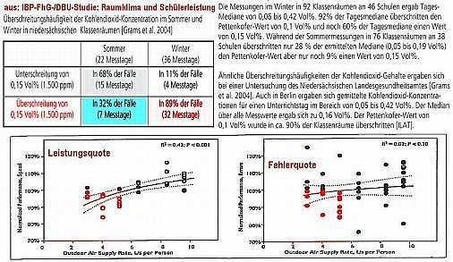 Demnach werden vor allem im Winter in den energieeffizient dichtgedämmten Schulen die zulässigen Werte bzw. der sogenannte Pettenkofer-Wert für den CO2-Gehalt von 1.000 ppm (parts per million) ständig und stark überschritten, damit einhergehend eben auch alle sonstigen Schadstoffwerte in der Luft von Klassenräumen. Ist doch mir egal, werden sich die Ökoschmarotzer denken. Trifft ja nur Kinder und Lehrer. Hauptsache, fett Geld verdient und Luxusleben als Klimaschützer und Weltretter durchfinanziert. Daß - wie die Grafik und die Studie belegt, auch nix g'scheit's mehr gelernt wird, wenn die Luftwechselraten in den dichtverpesteten Schulen unter alle hygienisch erforderlichen Werte gezwungen werden, ist ja ebenfalls egal. Der Öko schickt seine Kinder ja nach England auf die Privatschule. Und dort gibt es keine Dichtungslippen, geschweige denn Doppelfenster (double glazing), Klimaretterei und german angst gleich shitequal. 

Ganze Wirtschaftszweige von der Analytik der Luftbelastung über die Reinigung verkeimter Lüftungsanlagen bis zur technischen Prävention haben sich inzwischen zum Thema lebensgefährlich versaute Lüftungsanlagen herausgebildet und sind am stetig wachsenden Markt aktiv. Brutale Meldungen zu entsprechenden "Fällen" machen die Runde. Weitere Info zu diesen Themen: [Wiki: Sick-Building-Syndrom](http://de.wikipedia.org/wiki/Sick-Building-Syndrom) und [Lüftung im Spital - spitalhygienische Aspekte: I. Operationsabteilungen](http://www.swissnoso.ch/de/bulletin/articles/article/luftung-im-spital-spitalhygienische-aspekte-ioperationsabteilungen) -  

Mitte November habe ich mich dann entschlossen, wenigstens in meinem direkten Umfeld eine Aufklärungsoffensive zu starten und ihr mit Hilfe von dafür aufgeschlossenen Medienpartnern - Neue Presse Coburg und Bayerischen Rundfunk - etwas öffentliches Gewicht zu geben. Und so sind wir dann zu insgesamt fünf Schulen in den Landkreisen Coburg, Lichtenfels und Kronach gefahren und haben dort während einer Unterrichtsstunde die raumklimatischen Werte Kohlendioxid CO2, Temperatur und relative Feuchte im Fünfminutentakt aufgezeichnet und sofort grafisch visualisiert. Hier die dabei entstandene Zusammenschau: 

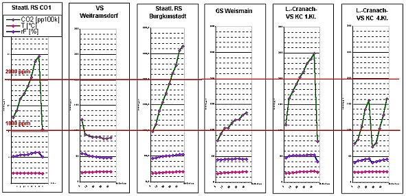 
_Messung von Kohlendioxid (CO2), relative Feuchte und Temperatur in Schulen der Landkreise Coburg, Lichtenfels und Kronach: von links: Staatliche Realschule Coburg 1, Hermann-Grosch-Volksschule Weitramsdorf*, Staatliche Realschule Burgkunstadt, Grundschule Weismain, Lucas-Cranach-Schule Kronach. Die Ergebnisse zeigen, daß im Laufe einer Schulstunde ohne Lüftungsanlage grundsätzlich hygienisch unbefriedigende CO2-Werte entstehen und durch simple Fensterlüftung in kürzester Zeit - unter fünf Minuten - die CO2-Konzentration auf vernünftige Werte - meist unter den sogenannten Pettenkoferwert von 1.000 ppm absinkt. Entsprechend steigt damit auch der Sauerstoffgehalt und sinken alle sonstigen Luftschadstoffe, seien sie nun Emissionen/Ausdünstungen aus den "modernen" Baustoffen und Möbeln, oder auch von den Raumnutzern und deren Kleidung. 

Fazit: Lüften, Lüften, Lüften und das mindestens auch einmal in der Mitte der Schulstunde. Außerdem wäre es optimal, die hermetische Luftabdichtung in von dem wichtigsten Nahrungsmittel: LUFT abhängigen Lebewesen bevölkerten Räumen ganz zu vermeiden, einfach durch Herausnehmen der Fensterdichtungen am oberen Teil der Fensterrahmen und Fensterflügel. So einfach ginge es wirklich!_ 

Nun meinen viele Experten (die teils selbst an dieser Meinung profitieren), daß man doch nur überall eine Zwangslüftung einrichten müsse, um sozusagen maschinell gesteuert immer und überall gute Luft in Nutzräumen zur Verfügung zu haben. Dazu nur zwei Anmerkungen: 

Die in zweien der besichtigten Schulen vorhandenen Lüftungsanlagen erforderten beide Male eine aufwendige Geschoßaufstockung und kamen mit der dann eingebauten Lüftungstechnik auf viele Hunderttausende Euro Mehrkosten. Dazu dann der turnusgemäße Wartungsaufwand inklusive Reparaturbedarf und Filtertausch, ebenfalls nicht für lau zu haben. 

So kann es dann in gewarteten Lüftungsanlagen aussehen: 

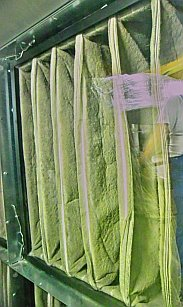 . 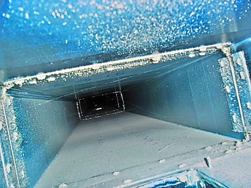 
_Vollverstaubte Abluftfiltertaschen und mit Staub-Partikel-Ablagerungen verunreinigter Abluftkanal_

Wobei mir die Zugänglichkeit der Abluftkanäle, der Charakter der dort sich anlagernden Staubpartikel und sonstigen Ablagerungen und deren turnusmäßige Reinigung nach hygienischen Gesichtspunkten gelinde gesagt einige Fragezeichen hinterließ. 

Alles sehr schön für die vielen Lüftungs- und Dichtungsprofiteure, aber für den Steuerzahler und die ebenso wie die Bevölkerung (manche sagen noch "Menschen" dazu) von chronischer Knappheit geplagten öffentlichen Kassen? Und für die "Zurückgebliebenen", also die öffentlichen Einrichtungen, für die dann die für derartigen Lüftungsaufwand vergurkten Kröten fehlen? "Better think twice!" sagt der Englischmann und allright! - Recht hatter. 

Und hier der Link zum Zeitungsbericht: 

16./17.11.12: Neue Presse Coburg: [NP checkt das Klima in Klassenzimmern](http://www.np-coburg.de/regional/franken/frankenbayern/NP-checkt-das-Klima-in-Klassenzimmern;art83462,2183537) 

*Nachtrag: 

Am 29. April 2017 titelt die Neue Presse Coburg: 

_"Teure Luft in Weitramsdorf"_ und berichtet vom vollständigen Versagen des mit ungeheueren fünf Millionen Euro Steuergeldsummen energetisch sanierten (!) _"Vorzeigeopbjekts für den Klimaschutz. Jetzt wird dort mehr Energie verbraucht als mit der alten Ölheizung."_ Der Rechnungsprüfungsausschuss der Gemeinde hat herausbekommen, _"die Energiekosten lägen heute deutlich höher als vor der Sanierung."_ Der klimastußüberzeugte Bürgermeister Christian Gunsenheimer hatte damals maßstabsetzende Architektur und Technik versprochen - und bekommen. Aber genau gegenteilig, als der dumme Wähler dachte. So funktioniert ideologieverdummte Politikhanselei als Bevölkerungsvsverarsche ja überall. Das Ergebnis dürfte wohl den meisten anderen Schulsanierung entsprechen, die nach der Energieeffizienzsanierung zum Himmel schreiende Energieverbräuche aufweisen. 

Der neue Bürgermeister Wolfgang Bauersachs läßt sich im Artikel zitieren: _"Es muss überprüft werden, warum wir heute eine schlechtere Energiebilanz in unsere Schule haben, als vorher."_ Die Planer der "Effizienzsanierung" versprachen ein 30prozentiges Unterschreiten des von der EnEV vorgeschriebenen Dämmstandards und damit ein geradezu irrwitziges Einsparpotential ihrer Technikschwurbeleien. Die an Leichtgläubigkeit wohl kaum zu übertreffende Mehrheit der Gemeinderäte fiel mit Anlauf darauf rein. Lüftungsanlage mit Wärmetauscher anstelle der simplen Fensterlüftung, Austausch aller durchaus intakten Fenster gegen Neufenster mit extrem besseren U-Werten plus Sonnenschutzanlage, Pellets-Anlage anstelle der guten, alten und eigentlich ewig weiterzunutzenden Ölheizung, Rausreißen der intakten Heizkörper, dafür verstaubungsanfällige Raumlüfterei durch Deckenöffnungen für Zu- und Abluft, und last, but not least: Das Vollkleistern der solarspeicherfähigen Massivfassaden mit ungemein dicken Dämmstoff-Schwarten als Fassadendämmung, die schon bei meiner Messung 2012 kondensatvernäßt waren und inzwischen aussehen, wie Hund und Sau. _"Alles deute darauf hin, dass die moderne Heizung, die Lüftung und die Kühlung die Pellets- und Stromfresser sind, ... die die Energiebilanz belasten."_ 2009 wurde stolz verkündet: _"Mit 67 Kilowattstunden Energieverbrauch pro Quadratmeter im Jahr liege die Hermann-Grosch-Schule nur bei einem Viertel dessen, was sie nach der damals neuen Energieeinsparverordnung in Anspruch nehmen dürfte. Dafür gab es ... den Energieausweis."_ Der sich heute eher als verkotete A...karte darstellt. So weit, so schlecht. Hier der [Link auf den Artikel im Original.](https://www.np-coburg.de/region/coburg/Teure-Luft-in-Weitramsdorf;art83420,5493460) 

Nun stellen sich dank einer vor allem in Deutschland vollkommen entarteten Energiespardiktatur mit diversen "Energieberatern" als Expertise vortäuschenden Aktivisten die durch übertriebenes Luftabdichten zwangsläufig vorprogrammierten Probleme mehr und mehr sogar im Wohnhausumfeld des Einfamilienhauses und Mehrfamilienhauses. Nicht jeder Bauherr will sich das gefallen lassen. Und gewissenhafte und fachlich tiefschürfend informierte Architekten und Ingenieure, Fachplaner und Energieberater stellen sich dem Problem. Kollege und Sachverständiger Dipl.-Ing. Wilhelm Mühlen, Donauwörth, führt dazu beispielsweise in einem Antrag auf Befreiung von der Energieeinsparverordnung EnEV zum Thema Lüftungsproblem folgendes aus:

_"Die derzeit in Deutschland (noch) favorisierte kontrollierte Wohnraumlüftung ist in dieser Form in Schweden seit 2002 verboten. Unter Berücksichtigung mikrobiologischer und chemischer Belastungen der Raumluft aus den Lüftungsanlagen ist die Zahl der Allergiker, insbesondere bei Kindern, in den mechanisch belüfteten Häusern in Schweden so stark angestiegen, dass hier ... ein kausaler Zusammenhang zwischen Lüftungsanlagen und Allergieerkrankungen gesehen wurde._

Die Lüftungsanlagen müssen in Schweden deshalb nun so geplant werden, dass regelmäßige Wartung, Reinigung und Desinfektion bei allen Anlagenteilen nachweislich möglich ist.

Die damit verbundenen Wartungskosten belaufen sich auf ca. 700 bis ca. 1.000 EUR/a und dokumentieren damit im Verhältnis zur Energiekosteneinsparung in einer Größenordnung von 300 bis 400 EUR/a, neben den gesundheitlichen Belastungen für die Nutzer, die Unwirtschaftlichkeit der Anlagentechnik (der kontrollierten Wohnraumlüftung)."

Hier der Link zur entsprechenden schwedischen Bauvorschrift, die wohl zur Vermeidung von Aufruhr in der Eigenheimszene nur für Mehrfamilienhäuser gilt und Ein- und Zweifamilienhäuser - die Masse der schwedischen Wohnbauten mit urschwedischen Bewohnern - bisher erst mal ausspart: [Förordning (1991:1273) om funktionskontroll av ventilationssystem](http://www.riksdagen.se/sv/Dokument-Lagar/Lagar/Svenskforfattningssamling/Forordning-19911273-om-funk_sfs-1991-1273/) - Verordnung (1991:1273) zur Funktionskontrolle von Lüftungsanlagen, 2011 ersetzt und verschärft durch [Plan- och byggförordning (2011:338) - 5 kap. Funktionskontroll av ventilationssystem](http://www.riksdagen.se/sv/Dokument-Lagar/Lagar/Svenskforfattningssamling/Plan--och-byggforordning-2011_sfs-2011-338/#K5#K5) - Planungs- und Bauverordnung (2011:338) (Kapitel 5 Funktionskontrolle von Lüftungsanlagen) 

Eine [österreichische Energiesparhausseite](http://www.energiesparhaus.at/energie/lueftung_probleme.htm) stellt in den Raum: 

_"Probleme mit Lüftungsanlagen können weitgehend vermieden werden, wenn eine seriöse und sensible Planung durchgeführt wird."_ 

Aha. Seriös(!) und sensibel(!!). Eben genau das, was unser Energiesparsensibelchen von den krawattierten Energiesparscherzperten erwarten darf. Tipp: Achten Sie auf Klavierspielerfinger als wesentliches Unterscheidungsmerkmal zwischen Holzhacker-Bratwurstfinger-Planern und nervösen seriösen Schreibtischlingen. 

Eine Unzahl von gesundheitlich mehr oder minder beeinträchtigten Bewohnern von zwangsbelüfteten Niedrigenergiehaus- und Passivhäusern fanden aber solch sensibilisierte Seriösplaner leider nicht. Vielleicht gibt es sie ja nur in Österreich, raffiniert versteckt in einem zugigen Heuschober irgendwo in der Steiermark, im Burgenland, in Tirol oder auch Kärnten. Jedenfalls schwer zu finden. Und wohl genau deswegen suchen auch hierzulande kontrolliert durchgelüftete Energiesparer verzweifelt Abhilfe gegen geschwollene, ausgetrocknete und verkrustete Nasenschleimhaut, Bronchialasthma und sonstige Energiesparfolgen "wartungsfreier Hauslüftungsanlagen". Hier noch ein lüftungsgeplagter Hauseigentümer, der zur Selbsthilfe greift: [Abluftventilfilter](http://rabeneick-online.de/festpreisgarantie/filterbau.html) 

Viele versuchen, mit schimmelriskanter Luftbefeuchtung gegenzuwirken - natürlich ohne bzw. mit gegenteiligem Erfolg. Es ist ja nicht unbedingt die sich durch die hohe winterliche Luftwechselrate zwangsläufig einstellende Trockenheit der Luft, die Probleme bringt - jeder kennt doch die günstige Wirkung supertrockener Winterluft im Gebirge oder einem Januarspaziergang - sondern deren Schadstoffbefrachtung mit Feinstaub, Schimmelsporen und sonstigen Aussonderungen sowie sonstigen Kankheitserregern, die in den keimverschleimten und staubigen Tiefen des Lüftungssystems beste Wachstums- und Zuchtbedingungen vorfinden. 

Die Dreckluft aus dem scheußlich verstaubten, verkeimten und verschleimten Lüftungssystem, die sich auch ohne Lüftungsbetrieb im Sinne des Konzentrationsausgleichs in der Raumluft verbreitet, wird nun befeuchtet - die sicherste Gewähr, den Krankheitserregern in den höllischen Abgründen des Lüftungskanals noch bessere Vermehrungsbedingungen zu gönnen. Die Zusatzfeuchte kondensiert ja ebenfalls bevorzugt an den kühlen Kanalwandungen. Abhilfe? Neues Heizsystem, Ausbau bzw. Versiegelung der Lüftung, Wiederherstellung ausreichender Fugendurchlässigkeit der Fenster. 

Übliches Reinigen hilft ja nicht wirklich weiter, wie es dieser [traurige Fall aus dem Fachwerkforum](http://www.fachwerk.de/goForum.html?id=39824) belegt. Im englischen Barrow-in Furness machte 2002 eine legionellenverpestete Klimaanlage 70 Personen todkrank. 15 Leute kamen in die Intensivstation, ein Mann war nicht mehr zu retten und starb. Bei uns in Deutschland erkranken und sterben jährlich 800-1.600 Menschen an Legionellose, sehr oft sind die extrem krankheitsfördernden Legionellen (Legionärskrankheit) in den üblicherweise (!) schlecht gewarteten Lüftungsanlagen und Klimaanlagen daran schuld. Schimmelpilze, Parasiten, Bakterien und Viren gedeihen prächtig in den versauten Kanälen und Lüftungsrohren. Und das auch und gerade verstärkt in Zeiten, in denen die Panik vor einer Schweinegrippe-Pandemie umgeht. Motto: Schweinegrippe aus der Lüftungsanlage. Aus den Brutanlagen der Lüftung - Schneller Brüter wäre hier eine keinesfalls untertriebene Bezeichnung - kommen all die schädlichen Luftbestandteile kontinuierlich, also ständig in die Raumluft. Weitere Details und Stellungnahmen aus der Schweiz finden Sie in diesem Artikel hier, der auch im Kommunalmagazin 10/09 gedruckt erschien: [Susanna Vanek: Heute top, morgen ein Flop? Der Minergie-Standard boomt, auch im Bereich der öffentlichen Bauten. Angesichts der Diskussion über eine mögliche Pandemie stellt sich aber die Frage, ob durch die Lüftungen Krankheiten verbreitet werden könnten. (www.kommunalmagazin.ch)](http://www.kommunalmagazin.ch/Print/AktuellesHeft/Minergie/tabid/152/Default.aspx) 

Daß Filter gegen den krankmachenden Lüftungsschmuddel was nützen, erzählt auch nur die Lüftungsindustrie. Sie müssen ja durchströmbar sein und lassen deswegen die besonders unangenehmen Feinstäube und Mikroorganismen bis hin zu den Grippeviren zwangsläufig durch - die dann in perfekter Symbiose die Klimaanlagen und Lüftungskanäle besiedeln. Logische Folge der hohen Temperaturen und Luftfeuchte mit starker Wasserdampfsättigung in den Kanälen. Pfui Deibi! Seltene und energiefressende Ausnahme: Ultradichte Filter, die dann mit sehr hohem Luftdruck betrieben werden müssen. 

Obendrein bilden sich in den luft- und dreckdurchströmnten Kanälen Flusen, im Küchenbereich kommen Fette dazu. Das kumuliert sich über die Zeit zu explosionsgefährdetem Brandpotential. Staubgenährte Schwelbrände, Staubexplosionen - ein bisserl Hitze durch einen Wackler oder Kurzschluß oder einen heißgelaufenen Ventilator genügt, schon raucht die Bude. Und trotz regelmäßiger Wartung und Filterwechsel der Lüftungsanlage zeigt sich IMMER: Kanal/Rohr ist verschmutzt, denken Sie da nur mal an Ihren Staubsaugerbeutel! Von den Wirkungsgradverlusten und Energiemehrkosten durch zerschmutzte Filter ganz zu schweigen. Die eigentliche Ursache heißt aber: Falsches Bauen, falsches Instandhalten. 

Und nicht mal Energiesparen gelingt so richtig mit den kontrollierten Lüftungsanlagen - trotz an die 90 Prozent Wirkungsgrad. Zum einen ergeben sich kostenintensive Folgen aus der erforderlichen Luftwechselrate - die dann angepriesene Luftbefeuchtungsanlage. Das steigert die Anlagen- und Betriebskosten (allein die Anlagenkosten können bei einem durchschnittlichen Einfamilienhaus schnell die 10.000 EUR-Grenze überschreiten, je nachdem, welch feine Raffinessen der energiebewußte Kunde sich eben aufschwätzen läßt - und wer will sich später schon vorwerfen, man habe am falschen Fleck gespart, wenn die hustenden Kleinen an Atshma verrecken?), senkt die Wärmerückgewinnung und erfordert mehr Energie zum Aufheizen als trockene Luft. Und die Wärmeverluste können bei hohen - hygienisch gerade bei dichten Blower-Door-Häusern unabdingbaren - Luftwechselraten natürlich schnell alles übersteigen, was an altertümlicher Fensterlüftung üblich ist. Auch Schallschutz-Probleme und Zugerscheinungen sowie die teils explodierenden Kosten für den alle paar Monate erforderlichen Filteraustausch werden bei Kontrollierter WohnraumLüftung (KWL) hin und wieder beklagt. 

Lesen Sie in diesem gar nicht mal so schlechten Wikipedia-Artikel Näheres: [Kontrollierte Wohnraumlüftung](http://de.wikipedia.org/wiki/Kontrollierte_Wohnraumlüftung) 

Was es nun alles gibt am Reinigungsmarkt, läßt erschauern: Trockenverfahren mit Bürstenrobotern, Spezialdrehwellen, Druckluftreinigung, dazu Naßverfahren/Dampfverfahren/Strahlverfahren: Hochleistungsdampfgeräte, Schaumkanonen, automatisierte Trockeneisstrahler mit Vortrieb auf Rädern, dazu dann noch Spezialchemie wie Lösemittel und Desinfektionsmittel unterschiedlichster Vergiftungsgrade, Risiken und Langzeitfolgen für den Anwender und "Belüfteten". Davon schweigen die Vertreter der Lüftungsfraktion rund um die kontrollierte Wohnraumlüftung. Vertrauen wird mißbraucht, Kontrolle findet nicht statt. Kontrollierte Wohnungslüftung heißt Vollreinigung in angemessenen Zyklen! Dat kost! 

Nur ausreichend sichere Reinigungszyklen und profimäßige Reinigung können die Gesundheits- und Funktionsrisiken einigermaßen vermindern - freilich ohne jede Garantie für Ihre Gesundheit. Wenn nicht erfahrene und zuverlässige Reinigungsprofis hier rangelassen werden, geht es freilich wie immer: Kost nix, taugt nix. 

Wie es nun typischerweise aussieht in allerlei normgerecht errichteten Lüftungs- und Klimaanlagen - auch Ihrer!, zeigen beispielsweise diese Bilder, die mir freundlicherweise die [Reinigungsfirma IWS AG Lüftungshygiene](http://www.iws-swiss.ch), Basel, aus ihrer Homepage zur Verfügung gestellt hat: 

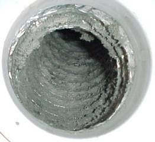1. Verschmutztes Lüftungsrohr einer Badentlüftung 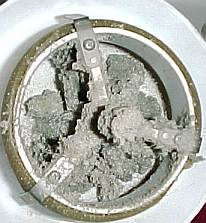2. Staubbeladene Schachtabdeckung eines Abluftkanals von innen 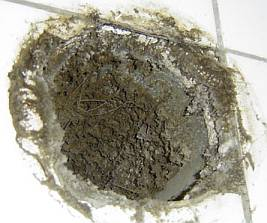3. Rohrmündung eines Naßraums - versaut! 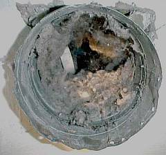4. Verdrecktes Lüftungsrohr nach 32 Jahren 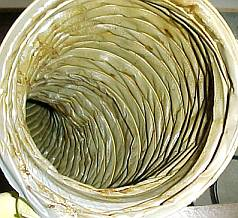5. Verkeimtes Flexrohr 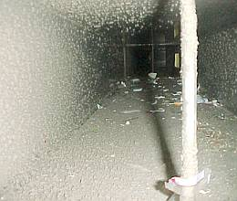6. Lüftungskanal voller Schmutzablagerungen und Müll 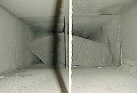7. Lüftungskanal einer Klimaanlage mit zerfetzter Innenisolierung / Wärmedämmung 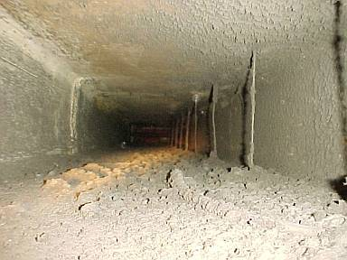8. Verdreckte Badentlüftung in Mehrfamilienhaus 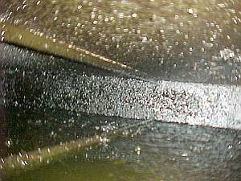9. Verfettete Küchenabluft in Dunstabzugs-Kanal 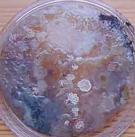10. Schimmel, Bakterien, Keime aus Lüftung in agar agar 

und in Ihrem Atemsystem / Ihren Bronchien bei jedem Luftholen. Wie der Energiesparkunde durch Energiespar-Mogelpackungen und Produkt-Etikettenschwindel rundherum und restlos veralbert wird, dies zeigt auch dieses Urteil (SZ 13.10.00) zu einem Schimmelschaden:

**_"Schimmelschaden_**

Nach dem Einbau von Isolierglasfenstern - als Modernisierung auf die armen Mieter umgelegt, und deswegen die perfide Vorzugsvariante der Vermieter gegenüber einer normalen Instandsetzung, die der Vermieter selber blechen müßte - brach Schimmelbefall aus. Logischerweise minderten die Mieter ihre Miete. Doch der klagende Vermieter bekam beim Amtsrichter Erfolg - die Mieter hätten nicht genug gelüftet! Doch das Landgericht Gießen sah das anders und wies die Klage ab:

_"Wenn ein Mieter seine Wohnung nicht ausreichend heize bzw. lüfte und deshalb Schimmel auftrete, sei zwar in der Regel der Mieter dafür verantwortlich. Im vorliegenden Fall gehe der Mangel aber auf die Kappe des Vermieters, der darüber hätte informieren müssen, dass sich nach dem Einbau der neuen Fenster das Raumklima ändere. (AZ 1 S 63/00 - 12.4.2000 LG Gießen)"_

Klartext: Dem Mieter muß mit dem auf seine Kappe gehenden Fensteraustausch mitgeteilt werden, daß er nicht nur diese Kosten (Modernisierungsumlage!) tragen muß, sondern auch noch die vermehrten Ausgaben für intensiveres Heizen inkl. Steigerung der Lüftungswärmeverluste. Alternative: Schimmel, Asthma, Allergie. Wie lange lassen sich die Mieter diesen Abzockmechanismus noch gefallen?

Noch ein schönes Urteil zeigt, wo es lang geht - OT 22.7.00:

_**"Schimmel Vermietersache** 
Mieter muss keine unzumutbaren Maßnahmen treffen_

_Wenn in einer Wohnung Feuchtigkeitsschäden und Schimmelpilze auftreten, ist der Mieter nicht dazu verpflichtet, dieses Problem durch übermäßiges Heizen oder Lüften oder durch eine außergewöhnliche Möblierung selbst aus der Welt zu schaffen. ... Landgericht Hamburg (Az.: 311 S 88/96)._

Mieträume müssen ... so beschaffen sein, dass Möbel unter Berücksichtigung der so genannten Scheuerleiste direkt an der Wand aufgestellt werden können. ... über den gesamten Tag mehrfach gründlich zu lüften, nur um einen Mangel der Bausubstanz auszugleichen (wäre dem Mieter nicht zumutbar).

... nach dem Einbau neuer, isolierverglaster Fenster die Schimmelpilzbildung an einer Außenwand (ließ sich Schimmelbefall) nur verhindern, indem ein Schrank mit erheblichem Abstand von der Wand aufgestellt wurde. Damit sei die Wohnung nur bedingt gebrauchstauglich ... . Entscheidend sei, ob dem Mieter ein extremes Wohnverhalten zumutbar ist oder nicht."

Noch ein's drauf - SZ 7.4.03:

**_"Schimmel_**

_Ein Mieter kann seinen Mietvertrag fristlos kündigen, wenn sich ... Schimmel gebildet hat. ... Wohnung ... durchfeuchtet, das Wohn- und Esszimmer und die Küche ... ausgeprägter von Schwärzeschimmel befallen. ... Amtsgericht Köln, ... Gesundheitsgefährdung ... berechtige zur fristlosen Kündigung (Urteil vom 19. März 2001, 206 C 29/00)."_

Und was ist mit dem Verkäufer und Monteur der lebensgefährlichen Gummilippenmonster?

In Schweden folgte der Gesetzesregelung zur Zwangslüftung ein Gesetz zur jährlichen Entkeimung dieser versifften Anlagen, nachdem nach Todesfällen deren Gesundheitsgefahren nicht mehr totzuschweigen waren. Und bei uns? Vernünftig wäre es, die guten Entlüftungseigenschaften traditioneller Fensterbaukunst nicht aufzugeben, sondern bei der Fensterreparatur bzw. Neukonstruktion beizubehalten. Der heutige Irrsinn fordert 0,8-fachen Luftwechsel bei gleichzeitig verstopften Fenster- und Gebäudefugen und bietet teure undichte Dichtungen und Lüftungsklappen zur Abhilfe. Die Lüftungsbauer, die Wohnraumgifte und -keime sowie die Profiteure an Allergien, Asthma und Sick-building-syndrom (SBS) freuen sich. Deutschland hat auf dem europäischen Kontinent die meisten Asthmatoten (jährlich 8.000-10.000), die höchste Kinderasthmarate und ein Drittel der Bevölkerung als Allergiker vorzuweisen. Ergebnis falschen Bauens oder rassisch-genetischer Defekte? Letzteres eher nicht, da die verwestlichten Ossis mit ehemals wesentlich besseren Zahlen innerhalb kurzer Zeit auf Wessistandard nachzogen. "Energetische Sanierung" wird das im Orwell-Neusprech verbrämt.

Die Wahrheit im Link: [Haustechnikdialog - Forum: Verschmutzung von Luftleitungen](http://www.haustechnikdialog.de/forum.asp?id=235)

Der ultimative Beleg für kriminelles Handeln? Erst gegen alle Widerstände und Einsprüche die sog. EnergieEinsparVerordnung EnEV durchzwingen, mit der nirgends Energie gespart werden kann, sondern alle Pottdicht-Buden vom Hausschwamm befallen werden und asthmatische Schimmelopfer produzieren, und nun das:

SZ 16.01.2004**[von KF rot ergänzt]** :

**_"Hilfe vom Bauministerium_**

_Das Bundesbauministerium will 2004 nutzerunabhängigen Wohnungslüftungssystemen mit einer Öffentlichkeitskampagne Rückendeckung geben. ... Das Ministerium reagiert damit auf die neuen hygienischen und gesundheitlichen Herausforderungen, welche die in Deutschland_ **[KF: vom Bundesbauministerium und seinen industriellen Helferhelfern ersonnenen]**_vorgeschriebene Niedrigenergiebauweise mit sich bringt. Ein nach dem heutigen Stand der Technik_**[KF: bundesbauhehördlich und von allen etablierten Parteien administrativ erzwungenermaßen]**_gedämmtes und luftdicht gebautes Haus verhindert neben dem Wärmeaustausch auch den Luftwechsel. So sammelt sich schnell verbrauchte Luft. Wollen die Bewohner nicht im Mief sitzen,_ **[KF: und am im wahrsten Sinne des Wortes Amts-Schimmel verrecken]**_, gibt es zwei Alternativen. Alle vier Stunden die Fenster aufreißen und den mühsam erwirtschafteten Energiegewinn wieder herauslüften oder auf_ **[KF: teure, energieverschleudernde und gesundheitsgefährdende künstlich-maschinelle]** _Lüftungstechnik setzen. ... p.h."_

Wie lange läßt sich der deutsche Michel wohl noch von seinen so arg hilfsbereiten (und sicher auch von milliardenschweren "Beratern" "beratenen") Sesselfurzern so hilfsbedürftig verarschen? Bis echt alles - auch das Niedrigenergiehaus und Passivhaus - den Bach heruntergespült ist? Auf die Streitrösser gegen den Amts-Schimmel!

Die grausame Wahrheit der _nutzerunabhängigen Wohnungslüftungssysteme_ steht am 2.3.04 im Berliner Tagesspiegel:

_**Verschimmelt, verstopft und brandgefährlich** 
Schornsteinfeger und Kripo: 
Entlüftungsanlagen voller Mängel_

_Abluftanlagen sind häufig eine Gefahr, vor allem in großen Wohngebäuden: Sie werden zu selten gewartet, sind unhygienisch und häufig Ursache von Wohnungsbränden. ..._

Acht von zehn Entlüftungsanlagen in Berlin "weisen erhebliche Mängel" auf, sagte gestern Innungsmeister Werner Christ. Das habe eine Stichprobe in Berliner Wohnhäusern, Kantinen, Hotelküchen und Imbissen im vergangenen Jahr ergeben. ... werden viele Anlagen "nur alle Jubeljahre einmal fachgerecht gereinigt". 

Für Dunstabzugshauben wie auch für Ent- und Belüftungsanlagen in fensterlosen Bädern gilt: Hausstaub, Fette oder Körpersprays lagern sich in den Schächten ab und verstopfen diese. "Das führt häufig so weit, dass aus den Gittern gefährliche Schimmel- und Staubteppiche herauswachsen", Krankheiten und Allergien können die Folge sein.

In jedem Fall steigt die Brandgefahr. Feuerwehrsprecher Jan-Peter Wilke: "Auch wir stellen fest, dass schlecht gereinigte Lüftungssysteme eine häufige Brandursache sind." Wenn ein solches System anfange zu brennen, dann liege das in neun von zehn Fällen an der ungenügenden Reinigung. "Das geht manchmal sehr schnell: Die Ventilatoren saugen Luft an, Staub und Schmutz wickeln sich um die Wellen der Ventilatoren. Die setzen sich irgendwann fest, drehen aber weiter und werden dann heiß". ... Marc Neller"

Kommentar: Das sind also die Nebenwirkungen, die auf dem Beipackzettel der bundesbauministeriellen Mogelpackung unterschlagen sind. Hauptsache, die Wirtschaft brummt, gelle?

Skandalös auch die schwachverständige Zuweisung der Schimmel- und Gesundheitsschäden nach Wärmedämmung der Fassade und Einbau gummilippendichter Isolierfenster an den Nutzer wg. _"unterlassener Stoßlüftung"_. Bei www.luftdicht.de bietet Dipl.-Ing. Herbert Trauernicht inzwischen sogar einen _"Lüftungstrainer"_ an. Zunächst mit Alarmanzeige ab 65 Prozent relative Feuchte, aktuell und neu schon ab 60 Prozent! Er, ein _"vom Fachverband Luftdichtheit im Bauwesen e.V. zertifizierter Prüfer der Gebäudeluftdichtheit im Sinne der Energieeinsparverordnung"_ , muß es wissen, warum. Hierzu erläutert er auf seiner Webseite: 

_"Zu einem luftdichten Haus gehört auch das Wissen, wie man richtig lüftet. An der Vorschrift, luftdicht zu bauen, kommt heute keiner vorbei. Die Energieeinsparverordnung schreibt luftdichtes Bauen vor. Während das Gebäude früher an sich schon undicht genug war, um den erforderlichen Luftwechsel zu gewährleisten, ist jetzt der Bewohner selbst gefordert, häufig genug und richtig zu lüften. ..."_

Mein Kommentar und kostenloser Tipp zum Thema: Befreiungstatbestände der EnEV nutzen! Das spart Lüftungstraining und die durch grundsätzlich falsche Luftdichtbauweise erzwungenen bzw. vorprogrammierten Durchfeuchtungsschäden. 

Seit [Prof. Roloffs Publikation](7wdvs15.md#roloff) zu diesem Thema sollte zumindest der Fachmann wissen: 

Nur ausreichender Fugendurchlaß des Fensters bzw. stetige Lüftung sichert dauerhaft niedrige Raumluftfeuchte und verringert dadurch die Verschimmelungsgefahr. Stoßlüftung alleine kann das technisch niemals leisten. Näheres zur Entfeuchtungs- und Fugenproblematik auf der [Energiesparseite](7wdvs15.md#roloff). Vergleichswerte zur Entfeuchtungsleistung unterschiedlicher Fensterkonstruktionen finden Sie [hier](23bau05.md#entfeuchtungsleistung).

Lesen Sie auch [Prof. Bauers Fenstertipps zur Schimmelpilzvermeidung](26bau11.md#bauers)!

Die lästigen Zugerscheinungen sind, soweit nicht Ergebnis von typischem Malerpfusch mit dichtungsstörenden Kunstharzschichtpaketen im Falz- und Flügelbereich, übrigens meistens ein Ergebnis falschen Heizens. Die durch Heizluftkonvektion herumwirbelnde Raumluft wird von den Raumnutzern fälschlicherweise den angeblich schlechten Fenstern zugesprochen. Lösung: [Eine Hüllflächentemperierung](7temper.md) als Strahlungsheizung. Dann entfällt der energetische und hygienische Mißbrauch unseres wichtigsten Lebensmittels (nach Großeschmidt), der Luft, für Heizungszwecke. Und warm abstrahlende Raumhüllen vermeiden nicht nur Zug und verringern nicht nur Energieverlust wg. geringeren Raumtemparaturen bei gleicher "Behaglichkeit", sondern schützen auch die Bausubstanz vor Wärmebrückenproblemen und Schimmelbewuchs.

Der Schimmelpilz breitet sich übrigens auch besonders gerne aus in angeblich dauerhaft luftdicht versiegelten Leichtbaukonstruktionen, die in "luftdichten" Niedrigenergiehäusern und Passivhäusern inzwischen DIN-Standard sind. Was meint die aktuelle Bauforschung dazu? Bitteschön: 

1. _"Qualitätssicherung klebebasierter Verbindungstechnik für Luftdichtheitsschichten, Dipl.-Ing. Guido Hagel, Referat II 2 - Forschung im Bauwesen, Energieeinsparung, Klimaschutz, GAEB, Bundesamt für Bauwesen und Raumordnung (BBR) 

Untersuchung und Kennzeichnung von Klebebverbindungen für Luftdichtheitsschichten 
- Neuer Bericht aus der Bauforschungsförderung des Bundes - 
Die Ausführung von Stößen, Überlappungen und Anschlüssen von Luftdichtheitsschichten mit Klebebändern muss dauerhaft gewährleistet sein. Dauerhaftigkeit beschreibt im Bauwesen einen Zeitraum von bis zu 50 Jahren. Die DIN 4108-7 enthält für Verklebungen von Bahnen untereinander bzw. für Anschlüsse (z.B. Folie an Mauerwerk) eine Vielzahl von Konstruktionsempfehlungen auf der Basis moderner Klebebänder und -massen, welche auch ohne mechanische Sicherung auskommen sollen. Diese Konstruktionsempfehlungen können derzeit auf Grund fehlender Vergleichsmöglichkeiten kaum als gesicherter Stand der Technik erachtet werden."_ (Zitat aus Pressemitteilung) und 

2. _"Forschung zur Dauerhaftigkeit von Klebeverbindungen 

Es herrscht in der Fachwelt vielfach die Meinung vor, dass Klebeverbindungen auf ewig halten. Zur Dauerhaftigkeit von Klebeverbindungen wurde im Rahmen der Bauforschungsförderung ein interessantes Projekt erstellt ... 
Ein Ergebnis der hier vorgestellten Untersuchung ist, dass die Klebebänder von sehr unterschiedlicher Qualität sind. 
Interessant ist auch, dass der Forscher (Autor ist Dipl.-Ing. Gross, ZUB-Kassel) festgestellt hat, dass die üblichen Folienmaterialien (Dampfbremsen, -sperren) sehr geringe Oberflächenspannungen aufweisen. Die Dauerhaftigkeit von Klebeverbindungen kann bei der Wahl eines ungeeigneten Fabrikats nicht gewährleistet werden. Zudem schwanken die Oberflächenspannungen in der Fläche sehr stark. ..."_ 
(aus Trauernichts Luftdicht-News Nr. 48). Also, Freunde der Kondensatvermeidung durch Dampfsperren und Dampfbremsen, aufgepaßt: Am Anfang mag es noch gutgehen, doch nach einiger Zeit? Und auch die Abdunstung der Eigenfeuchte bedacht, die dann in die Dämmstoffe reinfeuchtet? Das ist derzeit der häufigste Fall, wenn ich mal in Beratungsfällen die Dämmung aufschneide! 3. _Hans-Peter Leimer, Ilka Toepüfer: "Pilzbelastung der Raumluft hochgedämmter Häuser - baubiologische Aspekte"_ 

Aus der Pressemitteilung des Verlags: _"Die Entwicklung hochgedämmter Häuser führt bei manueller Fensterlüftung zu Problemen mit der Gewährleistung einer guten Raumluftqualität. Daher werden zunehmend Lüftungsanlagen vor allem auch in Einfamilienhäusern eingebaut. Da hier im Gegensatz zur Klimaanlage keine Befeuchtung und Kühlung der Luft stattfindet, geht man davon aus, dass Probleme mit mikrobiellen Kontaminationen ausgeschlossen sind. Es fehlen aber die Langzeiterfahrungen und Messungen, die diese Annahme absichern. Im vorliegenden Projekt wurden Lüftungsanlagen in bewohnten Häusern und eine Versuchslüftungsanlage in einem Prüfraum untersucht. Es wurde der Einfluss der Lüftungsart - mechanisch oder manuell - auf das Vorhandensein von Mikroorganismen in der Raumluft beobachtet. Ferner wurden Untersuchungen zu der Filterqualität und entstehenden Pilzbelastungen im Filtermaterial durchgeführt. Zusätzlich wurde überprüft, wie die Anfälligkeit zur Schimmelbildung auf Wärmebrücken vom Oberflächenmaterial und vom Raumklima abhängt, das wiederum durch die Lüftungsart beeinflusst wird. "_ 

Aus der Zusammenfassung: _"Die Untersuchungen haben gezeigt, dass Pilzsporen zum Teil filtergängig sind. Auf den Filtern wurden pathogene und toxinogene Arten bestimmt und es konnte in den Filtern das Mykotoxin Ochratoxin A nachgewiesen werden. Eine lange Standzeit der Filter führt zur Akkumulation von Pilzen und deren Stoffwechselprodukten (Toepfer und Leimer 2005). Daher muss damit gerechnet werden, dass es zur Freisetzung vor allem kleinerer Partikel kommt, die gesundheitsschädigende Auswirkungen auf den Raumnutzer haben können. Besiedlungsversuche auf künstlich angelegten Wöärmebrücken in den Prüfräumen haben gezeigt, dass die kontinuierliche Belüftung sich dahingehend auf das Raumklima auswirkt, dass eine Schimmelpilzbildung auf den Oberflächen vermieden wird. 

Der Nachweis von Pilzen (vor allem auch gesundheitsschädigenden Arten) und Verschmutzungen, die als Nährstoffe dienen, zeigt, dass das Potenzial zur Verkeimung einer Lüftungsanlage vorhanden ist. Bei erhöhter Luftfeuchte innerhalb der Lüftungsanlage kann es zu einer mikrobiellen Kontamination kommen."_ 

[Fogging-Magic Dust](http://www.baustoffchemie.de/db/Fogging/) - eine lesenswerte Klarstellung mit viel weiterführender Info bei baustoffchemie.de

Ganz davon abgesehen, daß die falsche Hoffnung auf wirtschaftlich sinnvolle Energieeinsparung mehr als trügt:

Dem Artikel "Renovierungsmaßnahmen unter der Lupe", Der Vermieter 1/2000 ist zu entnehmen: 

_Nach wissenschaftlichen Untersuchungen der Technischen Universität Dresden und der Uni Stuttgart erfordert die Einsparung je Liter Heizöl bzw. Kubikmeter Gas die Investition von ca. DM 1,19 bei Wärmedämmung der Außenwand und ca. DM 2,80 bei Fensteraustausch. Die Berechnungen setzen sogar die nachweisbar falschen Ansätze der üblichen k-Wert-Methode voraus. Diese Unwirtschaftlichkeit überschreitet alle hinzunehmenden Verluste des Investors._

"unser gas 157/04" berichtet zu diesem Thema, daß nach Erkenntnissen des Initiativkreises Erdgas & Umwelt IEU die Investitionskosten für die (angebliche, da nur errechenbare) Einsparung von einer Kilowattstunde Wärme mittels "Modernisierung" betragen:

_1 Cent: Gas-Brennwertkessel 
6 Cent: Außenwanddämmung_ (Lesen sie hierzu die [Aufklärung, was Außendämmung wirklich bringt](7fehrtab.md)) 
_62 Cent: Fensterwechsel_ (spart aber gar nix, da dann weniger Lichtausbeute, weniger Solarenergieeintrag, höhere Raumluftfeuchte allesamt Energiefresser sind)

Erlösen Sie sich von allem Energiesparirrsinn mit einem baurechtlich zulässigen Antrag auf Ausnahme/Befreiung [(Beispiel WSVO](2wsvoant.md) [EnEV](11form.md#enevantrag)). Und lesen Sie [hier, wie man heiztechnisch wirklich Energie sparen kann](7temper.md).

Weiter: [3. Thema Glas](23bau03.md)
